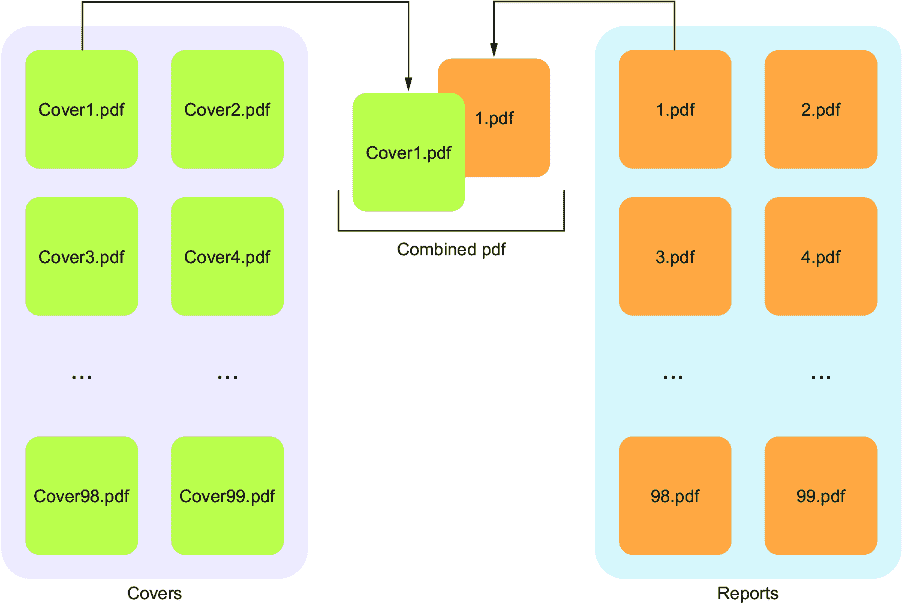
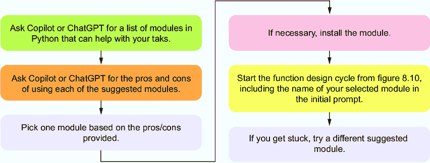

# 第九章：*自动化繁琐的任务*

### 本章涵盖

+   理解程序员编写工具的原因

+   确定我们需要编写特定工具的模块

+   自动化清理带有> > >符号的电子邮件

+   自动化操作 PDF 文件

+   自动化在多个图像库中删除重复图片

假设你负责创建 100 份报告，每份报告对应 100 个人中的每一个。也许你是一名教师，需要给每个学生发送一份报告。也许你在人力资源部门工作，需要给每个员工发送年度评估报告。无论你的角色如何，你都有必须创建这些报告的问题，你决定将这些报告作为.pdf 文件准备。你还需要为每份报告准备定制的封面页，这些封面页是由你的同事（一位平面设计师）设计的。

你和你的同事独立工作，最后工作完成了。或者等等，不是那么快。因为现在你必须将每个封面页放在每份报告的开头。

在这个阶段，一个非程序员可能会咬紧牙关开始工作，手动将封面页与第一份报告合并，第二封面页与第二份报告合并，以此类推。这可能会花费数小时。由于不知道还有其他方法，一个非程序员可能会一直努力直到工作完成。

但你现在是一名程序员。而且大多数程序员，包括我们两个，都不会手动进行这样的工作。

在本章中，我们将向你展示如何编写程序来自动化繁琐的任务。章节中的第二个例子将自动化“合并封面页与报告”的情况。但我们还会做其他的事情。收到已被转发多次的电子邮件

> > > > > > 它看起来

像这样

> > > > > > 这个？

或者，你的家人有几部手机，每部手机都有几百张图片，你只是想将所有图片放在同一个地方，以便你可以归档它们而不会丢失任何东西？在本章中，我们将向你展示如何自动化这类任务。

## 9.1 为什么程序员要制作工具

程序员常常表达的一种普遍观点是：我们很懒惰。这并不意味着我们不想完成我们的工作。这意味着我们不想做那些重复、无聊、繁琐的工作，因为那是计算机擅长的事情。程序员对这种苦差事有一种类似蜘蛛侠的感觉。假设 Leo 有几百张照片，他想要删除任何重复的照片。他不可能手动做这件事。或者假设 Dan 必须给他的每个学生发送定制的电子邮件。如果学生人数超过几个，他也不可能手动做这件事。一旦程序员开始注意到他们在键盘上重复相同的按键或一遍又一遍地执行相同的步骤，他们就会停下来，制作一个工具来自动化这个过程。

当程序员谈论工具时，他们是在谈论那些能节省他们时间的程序。一个工具通常不是最终目标，编写一个工具本身可能会感觉枯燥乏味，并不光彩。但一旦我们有了工具，我们就可以用它来节省时间。有时，我们可能会用一次工具，完成一项特定的任务，然后就不会再用了。然而，通常情况下，一个工具会反复被证明是有用的，无论是我们按照我们编写的方式使用它，还是通过做一些小的改动。例如，丹完成每一门课程的授课后，他会使用自己编写的程序来整理所有学生的成绩并提交给大学。每次他都会对工具做一些小的改动——比如改变每个作业的权重——但丹就可以使用这个略微修改过的工具来完成工作。

使用 Copilot 的好处是它使制作这些工具变得更加容易。以下是某位软件工程师的解释：

> 我们都知道工具很重要，有效的工具很难创建，而管理层并不关心或理解对工具的需求……我无法表达现在编程感觉有多么根本性地不同，因为我现在每天可以构建两个质量工具，以满足我每一个想要解决的问题。[1]

## 9.2 如何使用 Copilot 编写工具

正如我们在第五章讨论模块时所学到的，有时我们需要使用一个模块来帮助我们编写我们想要的程序。一些模块是内置在 Python 中的。例如，在第五章中，我们使用了内置的 zipfile 模块来帮助我们创建一个 .zip 文件。其他模块不是内置的，我们需要先安装它们才能使用。

在编写工具时，我们通常需要处理一些特殊的数据格式（zip 文件、PDF 文件、Microsoft Excel 电子表格、图像）或执行一些特殊的任务（发送电子邮件、与网站交互、移动文件）。对于大多数这些任务，我们都需要使用一个模块。那么，是哪个模块呢？它是内置的还是我们需要安装它？这是我们首先需要得到答案的问题。

幸运的是，我们可以使用 Copilot Chat（或 ChatGPT）来帮助我们开始。作为提醒，我们使用 Copilot Chat 功能是因为它内置在我们的 Visual Studio Code（VS Code）IDE 中，并且因为 Copilot Chat 可以访问我们目前正在编写的代码，因此它可以将其所做的工作纳入其答案中。

计划是与 Copilot 进行对话，以确定我们需要使用哪个模块。一旦我们知道这一点并安装了模块（如果需要的话），我们就可以着手编写我们工具的代码了。我们将像以前一样做：编写函数头和文档字符串，让 Copilot 填写代码。一旦 Copilot 开始编写代码，我们需要遵循与前面章节相同的步骤，包括检查代码正确性、修复错误，甚至可能进行一些问题分解。为了将我们的注意力集中在编写自动化任务的工具上，我们将尽量减少在这些额外任务上花费的时间。

可能可以向 Copilot 或 ChatGPT 请求为我们编写整个工具，甚至不需要将其放入函数中。不过，我们在这里不会这样做，因为我们仍然认为函数的好处是值得的。函数将帮助我们记录代码，以便我们知道它做什么，并且它使我们能够在以后决定，例如，向函数添加额外的参数以改变工具的行为。

## 9.3 示例 1：清理电子邮件文本

有时候，一封电子邮件被回复和转发多次，变得一团糟，有些行上有许多大于（>）符号和空格。以下是我们所指的样本电子邮件：

> > > 嗨，利奥，
> > > 
> > > > > 丹 -- 你的自然语言研究有什么进展吗？
> > > > > 
> > > 是的！你给我看的那个网站

[`www.kaggle.com/`](https://www.kaggle.com/)

> > > 非常有用。我在那里找到一个数据集，它收集了

很多

> > > 可能对我的研究有用的问答。
> > > 
> > > 谢谢，
> > > 
> > > 丹

假设你想保存这封电子邮件信息以备将来使用。你可能希望清理行首的>和空格符号。你可以开始手动删除它们——毕竟，这封电子邮件并不长——但不要这样做，因为这里你有机会设计一个通用的工具，你可以在需要执行此任务时使用它。无论你的电子邮件有五行、一百行还是一百万行，这都不会有关系：只需使用工具，完成任务即可。

### 9.3.1 与 Copilot 对话

我们需要让杂乱的电子邮件可供我们的工具使用，以便工具可以清理它。我们可以做到这一点的一种方法是将电子邮件的文本首先复制到剪贴板（使用您操作系统的复制到剪贴板命令，例如 Ctrl-C）。

每个计算机操作系统都有一个剪贴板来存储最后复制的内容。如果你曾经使用过复制粘贴，你就使用过那个剪贴板。我们将使用剪贴板作为文本的临时存储，以便我们可以在剪贴板中编辑文本，然后将其粘贴到所需的位置。

在将乱糟糟的电子邮件内容复制到剪贴板后，我们可以在剪贴板中的文本上运行工具，该工具可以清理电子邮件并将剪贴板内容替换为清理后的版本。为了使工具执行合理操作，我们假设您的剪贴板上有电子邮件文本。工具将删除每行开头的>和空格字符，这样您就可以使用操作系统的粘贴命令（如 Ctrl-V）将新清理的电子邮件粘贴到您想要的位置。在 Python 方面，它需要将剪贴板内容拉入一个字符串（即复制剪贴板的内容），清理它，然后将新的清理文本放回剪贴板（即粘贴到剪贴板），替换之前那里的垃圾邮件版本。

那么，我们如何在 Python 程序中访问剪贴板？这正是我们需要弄清楚的问题，这将是我们与 Copilot 对话的框架。类似于第八章，我们将使用“Human”作为我们输入的提示，使用“GitHub Copilot”作为 Copilot 的响应。您可以使用 Copilot Chat 功能或 ChatGPT 进行类似的对话。我们正在将提示输入到 Copilot Chat 窗口中。

在我们与 Copilot 的对话中，我们将广泛探索，然后确定解决方案。一旦我们通过一个示例掌握了事情，我们就会解释为什么这样做，但在这里我们注明这一点，以便您为这种看似不那么直接的方法做好准备。Copilot 在其响应中提供了大量的示例代码。在我们探索的过程中，您可以随意浏览那些代码，但不要陷入其中。一旦我们完成探索并确定计划，我们再来看代码的更多细节。让我们开始学习吧！

LPHuman 我想写一个 Python 程序，可以访问剪贴板并让我使用剪贴板进行复制和粘贴。我该如何操作？

GitHub Copilot 您可以使用 pyperclip 模块在 Python 中访问剪贴板。以下是一个示例程序，它允许您使用剪贴板进行复制和粘贴：

```py
*````*```pypython*````*

*`*import pyperclip*`*

*`*# 复制到剪贴板*`*

*`*pyperclip.copy('Hello, world!')*`*

*`*# 从剪贴板粘贴*`*

*`*text = pyperclip.paste()*`*

*`*print(text)*`*

*```py`*```*```py`*
```

此程序首先导入 pyperclip 模块。然后使用`copy()`函数将字符串`'Hello, world!'`复制到剪贴板。最后，使用`paste()`函数将剪贴板的内容粘贴到“text”变量中，并打印结果。

您可以通过在终端中运行`pip install pyperclip`来使用 pip 安装 pyperclip 模块。

Copilot 的响应告诉我们，我们可以在 Python 程序中使用 pyperclip 模块与剪贴板进行交互。它提供的示例代码甚至展示了如何从我们的程序中复制内容到剪贴板，并将剪贴板中的内容粘贴到一个变量（`text`）中。我们取得了很大的进步！

响应的最后一段告诉我们如何安装 pyperclip。啊哈！所以 pyperclip 并不是 Python 默认自带的。虽然我们稍后会学习如何安装模块，但不必担心这一点可能是个好事。所以，让我们继续对话，询问 Copilot 是否有更好的方法。

LPHuman 想知道是否有办法在不安装 Python 模块的情况下完成这个操作？

GitHub Copilot 是的，你可以使用 Python 自带的 tkinter 模块来访问剪贴板。以下是一个示例程序，它允许你使用剪贴板复制和粘贴，而不需要安装任何额外的模块：

```py
*````*```pypython*````*

*`*import tkinter as tk*`*

*`*# Create a Tkinter window*`*

*`*root = tk.Tk()*`*

*`*# Hide the window*`*

*`*root.withdraw()*`*

*`*# Copy to clipboard*`*

*`*root.clipboard_clear()*`*

*`*root.clipboard_append('Hello, world!')*`*

*`*# Paste from clipboard*`*

*`*text = root.clipboard_get()*`*

*`*print(text)*`*

*```py`*```*```py`*
```

这个程序首先使用 `Tk()` 函数创建一个隐藏的 Tkinter 窗口，并使用 `withdraw()` 方法将其隐藏。然后，它使用 `clipboard_clear()` 方法清除剪贴板，并使用 `clipboard_append()` 方法将字符串 `'Hello, world!'` 添加到剪贴板。最后，它使用 `clipboard_get()` 方法检索剪贴板的内容并打印结果。

注意，这种方法仅在存在图形环境时才有效，例如 Linux 或 macOS 上的桌面环境，或 Windows 上的 Windows 桌面。如果你在仅终端的环境中运行 Python，你需要使用不同的方法来访问剪贴板。

看起来我们既有所得也有所失。所得是，这个 tkinter 模块是 Python 内置的。所失是，“该方法仅在存在图形环境时才有效。”在我们的 Python 设置中是否有图形环境呢？虽然我们可以尝试代码来找出答案，但这个要求让我们犹豫。毕竟，pyperclip 解决方案没有这个要求，所以我们可能不需要它（无论它具体意味着什么）。让我们再试一次。

LPHuman 还有没有其他方法可以在不安装 Python 模块的情况下完成这个操作？

GitHub Copilot 是的，你可以使用包含在 Windows 标准库中的 win32clipboard 模块来访问剪贴板。以下是一个示例程序，它允许你使用剪贴板复制和粘贴，而不需要安装任何额外的模块：

```py
*````*```pypython*````*

*`*import win32clipboard*`*

*`*# Copy to clipboard*`*

*`*text = "Hello, world!"*`*

*`*win32clipboard.OpenClipboard()*`*

*`*win32clipboard.EmptyClipboard()*`*

*`*win32clipboard.SetClipboardText(text)*`*

*`*win32clipboard.CloseClipboard()*`*

*`*# Paste from clipboard*`*

*`*win32clipboard.OpenClipboard()*`*

*`*pasted_text = win32clipboard.GetClipboardData()*`*

*`*win32clipboard.CloseClipboard()*`*

*`*print(pasted_text)*`*

*```py`*```*```py`*
```

这个程序首先导入 win32clipboard 模块。要复制文本到剪贴板，你可以调用 `OpenClipboard()` 函数来打开剪贴板，然后调用 `EmptyClipboard()` 来清除任何现有数据，最后调用 `SetClipboardText()` 来设置剪贴板上的文本。设置文本后，你应该调用 `CloseClipboard()` 来关闭剪贴板。

要从剪贴板粘贴，你可以调用 `OpenClipboard()` 来打开剪贴板，然后调用 `GetClipboardData()` 来从剪贴板获取文本。获取文本后，你应该调用 `CloseClipboard()` 来关闭剪贴板。在这个例子中，程序将文本 `"Hello,` `world!"` 复制到剪贴板，然后粘贴并打印到控制台。

“Windows 上的标准库？”这令人担忧，因为这意味着我们的工具可能在其他操作系统上无法工作。让我们看看情况。

LPHuman 这个在 Linux 或 macOS 上也工作吗？

GitHub Copilot 不，win32clipboard 模块是针对 Windows 的，在 Linux 或 macOS 上无法工作。在 Linux 上，你可以使用 `xclip` 命令行工具来访问剪贴板。以下是一个示例程序，允许你在 Linux 上使用剪贴板复制和粘贴：

```py
*````*```pypython*````*

*`*import subprocess*`*

*`*# 复制到剪贴板*`*

*`*text = "Hello, world!"*`*

*`*subprocess.run(['xclip', '-selection', 'clipboard'], input=text.encode('utf-8'))*`*

*`*# 从剪贴板粘贴*`*

*`*p = subprocess.Popen(['xclip', '-selection', 'clipboard', '-o'], stdout=subprocess.PIPE)*`*

*`*pasted_text = p.stdout.read().decode('utf-8')*`*

*`*print(pasted_text)*`*

*```py`*```*```py`*
```

这个程序使用 subprocess 模块来运行 `xclip` 命令行工具。要复制文本到剪贴板，你可以调用 `subprocess.run()` 并传入 `xclip` 命令，使用 `-selection` `clipboard` 选项来指定剪贴板选择，以及 `input` 参数来传入你想要复制的文本。要从剪贴板粘贴，你可以调用 `subprocess.Popen()` 并传入 `xclip` 命令，使用 `-selection` `clipboard` `-o` 选项来从剪贴板读取文本，然后使用 `Popen` 对象的 `stdout` 属性读取命令的输出。在这个例子中，程序将文本 `"Hello,` `world!"` 复制到剪贴板，然后粘贴并打印到控制台。

在 macOS 上，你可以使用 `pbcopy` 和 `pbpaste` 命令行工具来访问剪贴板。用法与 `xclip` 类似。

我们已经得到了一些针对不同操作系统的特定解决方案。我们不喜欢这样！我们希望我们的工具无论在哪个操作系统上都能工作。（即使我们只使用 Windows，也许有一天，我们会将这个工具与其他使用不同操作系统的用户分享。）

我们可以继续我们的对话，但回顾起来，安装那个单一的 pyperclip 模块似乎并不那么糟糕。让我们继续吧。一般来说，在决定如何开始编写工具时探索你的选项是有价值的，与 Copilot 进行对话有助于进行这种探索。

##### 为什么我们应该探索和理解我们的选项

有几个原因说明为什么你不应该仅仅使用 Copilot 聊天告诉你的第一个模块：

+   它可能不会在所有操作系统上工作。一般来说，我们想要找到可以在多个操作系统上工作的模块，这样工具就可以供你（如果你后来切换操作系统）或与你分享工具的其他人使用。

+   最终可能发现它并不适用于我们的用例，或者我们可能难以让代码正常工作。如果我们有其他选择，我们可以在投入太多时间到一个可能或不可能最终成功的策略之前，先尝试那些其他选项。

+   模块经常更新。通常这是为了添加新功能并修复错误，但有时在这个过程中，功能也可能被移除或更改。当一个模块的作者移除一个功能时，这被称为*弃用该功能**。一旦一个功能被弃用，它可能就不再工作，我们需要找到一个替代方案。Copilot 只是偶尔进行训练，而不是持续训练，所以如果 Copilot 在训练后该模块的新版本发布，Copilot 将不会知道这些更新。这可能导致 Copilot 建议依赖于比你所拥有的模块旧版本的代码。我们将在本章后面看到解决这个问题的方法。但如果你遇到麻烦，有其他选项可供探索是有用的。

### 9.3.2 编写清理电子邮件的工具

我们需要做的第一件事是安装 pyperclip 模块。那么我们该如何安装它呢？好消息是 Python 使得安装新模块变得很容易。前往 VS Code 右下角的终端，并输入以下命令：

```py
pip install pyperclip
```

注意：对于某些操作系统，你可能需要使用`pip3`而不是`pip`。在 Windows 机器上，如果你遵循了第二章中的安装说明，我们建议使用`pip`。在 Mac 或 Linux 机器上，我们建议使用`pip3`。

当你运行这个命令时，你可能会看到还安装了其他模块。不用担心这个问题：有时模块需要其他模块来执行它们的工作，Python 会自动安装所有这些模块，这样你就不必担心自己安装这些依赖项了。

安装完成后，我们可以导入该模块，然后为我们的函数编写头和文档字符串，该函数将从行首删除>和空格字符。我们在这里导入模块的原因是影响 Copilot 在编写函数代码时使用该模块。以下是我们的提示和 Copilot 给出的代码。

##### 列表 9.1 第一次尝试：清理剪贴板中的电子邮件文本

```py
import pyperclip

def clean_email():
 '''
 The clipboard contains lines of text.
 Clean up the text by removing any > or space
 characters from the beginning of each line.
 Replace the clipboard with the cleaned text.
 '''
    text = pyperclip.paste()                      #1
    lines = text.splitlines()                 #2
    for i in range(len(lines)):                   #3
        lines[i] = lines[i].lstrip(' >')             #4
    text = '        #5

'.join(lines)       #5

    pyperclip.copy(text)       #6

if __name__ == '__main__':            #7
    clean_email()       #8
```

#1 将剪贴板当前内容放入文本字符串

#2 将字符串拆分为其行列表

#3 遍历每一行

#4 从行的开头移除空格和 &gt; 符号

#5 这看起来有点奇怪。

#6 将清理后的文本复制到剪贴板

#7 注意一个常见的 Python 习惯（见以下讨论）。

#8 调用我们的函数来自动清理剪贴板！

我们可以看到程序正在执行正确的步骤序列：它正在获取剪贴板内容，清理文本，然后将清理后的文本复制回剪贴板。正如我们从与 Copilot 的早期聊天中学到的，我们希望 Copilot 编写使用 `pyperclip` 的 `paste` 和 `copy` 函数的代码，这正是它所做的事情。程序倒数第二行是我们在这本书中之前没有见过的：

```py
if __name__ == '__main__':
```

实际上，如果你喜欢，可以删除这一行（如果你这样做，也要取消下一行的缩进）。这确保了 `clean_email` 函数只有在运行你的程序时才会被调用，而不是在将其作为模块导入时。毕竟，如果你确实想将其作为模块导入（作为更大程序的一部分使用），你会在需要该功能时调用 `clean_email`，而不一定是模块导入时。 （而且，一般来说，每当你想更全面地理解一行代码时，你都可以询问 Copilot！）不幸的是，这段代码不起作用。如果你运行它，你会收到以下错误：

```py
File "C:\repos\book_code\ch9\email_cleanup.py", line 14
    text = '
           ^
SyntaxError: unterminated string literal (detected at line 14)
```

语法错误意味着我们有一个没有用有效 Python 代码编写的程序。我们现在将修复它！我们有几个选项可以这样做。一个是突出显示你的代码，并要求 Copilot Chat 修复错误。对我们来说，这确实解决了问题。你也可以尝试在与 ChatGPT 的对话中提出：“为我的代码中的错误提出修复建议 <插入你的代码>。” 这是一个有用的提示，当你从 Copilot 得到的代码没有按预期工作时要记住！

Copilot 通过修复有语法错误的行为我们修复了代码。新的代码如下所示。

##### 列表 9.2 第二次尝试：清理剪贴板中的电子邮件文本

```py
import pyperclip

def clean_email():
 '''
 The clipboard contains lines of text.
 Clean up the text by removing any > or space
 characters from the beginning of each line.
 Replace the clipboard with the cleaned text.
 '''
    text = pyperclip.paste()
    lines = text.splitlines()
    for i in range(len(lines)):
        lines[i] = lines[i].lstrip(' >')
    text = '\n'.join(lines)        #1

    pyperclip.copy(text)

if __name__ == '__main__':
    clean_email()
```

#1 将单独的行重新组合成一个字符串

新的代码行，与之前奇怪的一行代码不同，是

```py
text = '\n'.join(lines)
```

这行的目的是将所有文本行连接成一个单独的字符串，程序稍后会将其复制到剪贴板。那个 `\n` 代表什么？它代表代码中换行的开始。`join` 方法是什么？它接受列表（行）中的所有项并将它们连接成一个单独的字符串。

我们可以通过稍微实验 `join` 来更详细地理解它是如何工作的。这里是一个使用空字符串而不是 `'\n'` 字符串的 `join` 示例：

```py
>>> lines = ['first line', 'second', 'the last line']   #1
>>> print(''.join(lines))           #2
first linesecondthe last line
```

#1 显示三行的列表

#2 在空字符串上调用 join 方法

注意，有些单词挤在一起。这并不是我们想要的--我们需要在它们之间留点空间。怎么样，让我们再次尝试使用`join`，这次在字符串中使用空格而不是空字符串：

```py
>>> print(' '.join(lines))
first line second the last line
```

或者，我们也可以使用`'*'`：

```py
>>> print('*'.join(lines))
first line*second*the last line
```

这样就解决了我们的单词挤压问题。而且，`*s`告诉我们每行在哪里结束，但最好实际上保持电子邮件是三行的事实。

在 Python 中，我们需要一种方法来使用换行符或换行符字符，而不是空格或`*`。我们不能只是按 Enter 键，因为这会将字符串分成两行，这不是有效的 Python 语法。要做到这一点，我们可以使用`'\n'`：

```py
>>> print('\n'.join(lines))
first line
second
the last line
```

现在我们的工具已经准备好使用了。如果你将一些杂乱的电子邮件文本复制到剪贴板，运行我们的程序，然后粘贴剪贴板，你会看到电子邮件已经被清理。例如，如果我们对之前的样本电子邮件运行它，我们会得到以下清理后的版本：

嗨，利奥，

丹--你在自然语言研究方面有什么进展吗？

是的！你给我看的那个网站

[`www.kaggle.com/`](https://www.kaggle.com/)

非常有用。我在那里找到一个数据集，它收集了

很多

可能对我的研究有用的问答。

谢谢，

丹

当然，我们还可以做更多。那封电子邮件中的换行符不太好（“很多”这一行非常短且没有必要），你可能还想清理一下。你可以通过向 Copilot 的提示中添加新要求来开始进行这些改进。我们在这里停下来，因为我们已经完成了电子邮件清理的初步目标，但我们鼓励你继续独立探索更稳健的解决方案。

## 9.4 示例 2：向 PDF 文件添加封面页

让我们回到本章开头的场景。我们已经编写了 100 份报告，这些报告都是.pdf 格式的。我们的同事为这些报告设计了 100 个封面，这些封面也是.pdf 格式的，我们需要将封面与报告合并，以便每个最终生成的.pdf 文件从封面开始，然后继续是报告。图 9.1 展示了所需的过程。



##### 图 9.1 创建合并.pdf 文件所需过程的示意图，通过将封面目录中的报告封面与报告目录中的报告合并。注意，报告可能有多页。

##### PDF 文件（以及 Microsoft Word 和 Excel 文件）不是文本文件

你可能想知道为什么我们不能简单地使用 Python 的`read`和`write`方法来操作.pdf 文件。毕竟，我们在第二章处理.csv 文件时就是这样做的。

最大的区别在于.csv 文件是文本文件，这些文件是未经格式化或特殊命令的人类可读文件。然而，许多其他文件格式不是文本文件。例如，.pdf 文件不是人类可读的，需要由了解.pdf 格式的代码进行处理。同样，Microsoft Word 文件和 Microsoft Excel 文件也是如此：它们不是文本文件，因此我们需要专门的工具来处理它们。

在本书的资源中，在 ch9 文件夹中，您将找到两个子文件夹：报告子文件夹包含 100 个.pdf 格式的报告，封面子文件夹包含 100 个.pdf 格式的封面，每个报告一个。报告命名为 1.pdf、2.pdf、3.pdf 等；相应的封面命名为 cover1.pdf、cover2.pdf、cover3.pdf 等。在本节中，我们将合并这些报告和封面。

打开一些封面.pdf 文件和一些报告.pdf 文件。您可以使用 Adobe Acrobat 或您通常在计算机上打开.pdf 文件的方式来实现。您会注意到封面总是恰好一页，但报告可能有多页。当我们到达代码时，我们应该注意告诉 Copilot 报告可能有多页；否则，Copilot 可能会编写假设报告，就像封面一样，只有一页。

您可能想知道我们是如何创建这 100 个封面和报告的。如果我们一个接一个地手动创建，您会感到失望，对吧？别担心。我们以与自动化合并过程相同的方式自动化了创建过程。

### 9.4.1 与 Copilot 对话

我们的工具需要找到所有报告和封面，将封面添加到每个报告的前面，并为每个报告生成一个包含封面页和报告页的最终.pdf 文件。我们如何使用 Python 合并.pdf 文件？让我们来看看。

LPHuman 我需要编写一个**Python 程序来合并.pdf 文件。我该如何操作？**

**GitHub Copilot 您可以使用 PyPDF2 库在 Python 中合并 PDF 文件。以下是一个示例代码片段，展示了如何合并两个 PDF 文件：

```py
*````*```pypython*````*

*`*import PyPDF2*`*

*`*# 打开要合并的 PDF 文件*`*

*`*pdf1 = open('file1.pdf', 'rb')*`*

*`*pdf2 = open('file2.pdf', 'rb')*`*

*`*创建一个用于每个文件的 PDF 阅读器对象*`*

*`*reader1 = PyPDF2.PdfFileReader(pdf1)*`*

*`*reader2 = PyPDF2.PdfFileReader(pdf2)*`*

*`*# 创建一个 PDF 写入器对象*`*

*`*writer = PyPDF2.PdfFileWriter()*`*

*`*# 遍历每个 PDF 的页面并将它们添加到 writer 对象中*`*

*`*for i in range(reader1.getNumPages()):*`*

*`*page = reader1.getPage(i)*`*

*`*writer.addPage(page)*`*

*`*for i in range(reader2.getNumPages()):*`*

*`*page = reader2.getPage(i)*`*

*`*writer.addPage(page)*`*

*`*# 将合并后的 PDF 写入文件*`*

*`*output = open('merged.pdf', 'wb')*`*

*`*writer.write(output)*`*

*`*# 关闭输入和输出文件*`*

*`*pdf1.close()*`*

*`*pdf2.close()*`*

*`*output.close()*`*

*```py`*```*```py`*
```

在这个例子中，我们首先使用`open()`函数打开要合并的两个 PDF 文件。然后，我们使用 PyPDF2 的`PdfFileReader()`函数为每个文件创建一个 PDF 读取对象。

接下来，我们使用`PdfFileWriter()`函数创建一个 PDF 写入对象。然后，我们使用 reader 对象的`getNumPages()`和`getPage()`方法遍历每个 PDF 文件的页面，并使用`addPage()`方法将每个页面添加到 writer 对象中。

最后，我们使用 writer 对象的`write()`方法将合并后的 PDF 写入文件，并使用`close()`方法关闭所有输入和输出文件。

我们有线索了！这个 PyPDF2 模块似乎能完成我们需要的功能。它看起来提供了`PdfFileReader`来读取现有的.pdf 文件和`PdfFileWriter`来创建新的.pdf 文件。我们看到代码使用`getPage`从现有的.pdf 文件中获取页面，并使用`addPage`将其写入新的.pdf 文件——非常有前景。Python 中有没有内置的我们可以使用的东西，这样我们就不必担心安装 PyPDF2 了？

LPHuman 有没有一种方法可以在不安装 Python 模块的情况下完成？

GitHub Copilot——是的，你可以使用 subprocess 模块调用命令行工具，如`pdftk`来合并 PDF 文件。以下是一个示例代码片段，展示了如何使用`pdftk`合并两个 PDF 文件：

```py
*````*```pypython*````*

*`*import subprocess*`*

*`*调用 pdftk 合并 PDF 文件*`*

*`*subprocess.call(['pdftk', 'file1.pdf', 'file2.pdf',*`*

*`*'cat', 'output', 'merged.pdf'])**

*```py`*```*```py`*
```

在这个例子中，我们使用`subprocess.call()`函数调用`pdftk`，并使用适当的参数合并两个 PDF 文件`file1.pdf`和`file2.pdf`。`cat`参数告诉`pdftk`连接输入文件，而`output`参数指定输出文件名为`merged.pdf`。

注意，你需要在你的系统上安装`pdftk`才能使此代码工作。如果你没有安装`pdftk`，你可以从官方网站下载它：[`www.pdflabs.com/tools/pdftk-the-pdf-toolkit/`](https://www.pdflabs.com/tools/pdftk-the-pdf-toolkit/)。

这种方法最终可能很有价值，但并不是一个内置的解决方案。毕竟，最后一段提到了我们不得不安装一些名为`pdftk`的新软件！

到目前为止，我们可能会选择使用 PyPDF2 的第一个选项。但让我们再次使用 Copilot 来确保我们没有错过任何好的选项。

LPHuman 我应该考虑其他 Python .pdf 库吗？

GitHub Copilot——是的，还有几个其他 Python 库你可以用来处理 PDF 文件。以下是一些流行的库：

1.  ReportLab——一个用于从头创建 PDF 文档的库，支持文本、图形和图像。

1.  FPDF——一个用于从头创建 PDF 文档的库，支持文本、图形和图像。

1.  PDFMiner——一个用于从 PDF 文件中提取文本和元数据的库。

1.  PyMuPDF——一个用于处理 PDF 文件的库，支持文本、图形和图像。

1.  pdfrw——一个用于读取和写入 PDF 文件的库，支持文本、图形和图像。

每个库都有其自身的优缺点，因此您应该选择最适合您需求的库。如果您只需要合并 PDF 文件，那么 PyPDF2 或 pdftk 可能就足够了。然而，如果您需要以更复杂的方式创建或操作 PDF 文件，那么其他库可能是一个更好的选择。

最后一段告诉我们，如果我们只需要合并.pdf 文件，那么使用 PyPDF2 可能就足够了。但让我们通过了解所有这些工具的优缺点来结束我们的对话。这样，如果我们遇到 PyPDF2 的问题，我们就知道下一步该怎么做。

LPHuman 您可以总结一下这些库的优缺点吗？

**GitHub Copilot** 毫无疑问！以下是关于我提到的库的优缺点的总结：

PyPDF2——一个用于处理 PDF 文件的库，支持文本、图形和图像。

优点：

1.  对于简单任务（如合并 PDF 文件）来说易于使用。

1.  提供良好的文档和示例。

1.  支持广泛的 PDF 功能。

缺点：

1.  对高级 PDF 功能（如表单和注释）的支持有限。

1.  大型 PDF 文件可能运行缓慢。

ReportLab——一个用于从头创建 PDF 文档的库，支持文本、图形和图像。

优点：

1.  创建复杂的 PDF 文档非常强大和灵活。

1.  支持广泛的 PDF 功能。

1.  提供良好的文档和示例。

缺点：

1.  对于初学者来说，学习曲线陡峭。

1.  大型 PDF 文件可能运行缓慢。

FPDF——一个用于从头创建 PDF 文档的库，支持文本、图形和图像。

优点：

1.  轻量级且易于使用。

1.  提供良好的文档和示例。

1.  支持广泛的 PDF 功能。

缺点：

1.  对高级 PDF 功能（如表单和注释）的支持有限。

1.  大型 PDF 文件可能运行缓慢。

PDFMiner——一个用于从 PDF 文件中提取文本和元数据的库。

优点：

1.  从 PDF 文件中提取文本和元数据非常强大和灵活。

1.  支持广泛的 PDF 功能。

1.  提供良好的文档和示例。

缺点：

1.  对于初学者来说，学习曲线陡峭。

1.  创建或操作 PDF 文件的支持有限。

PyMuPDF——一个用于处理 PDF 文件的库，支持文本、图形和图像。

优点：

1.  处理 PDF 文件非常快速和高效。

1.  支持广泛的 PDF 功能。

1.  提供良好的文档和示例。

缺点：

1.  对于初学者来说，学习曲线陡峭。

1.  创建或操作 PDF 文件的支持有限。

pdfrw——一个用于读取和写入 PDF 文件的库，支持文本、图形和图像。

优点：

1.  读取和写入 PDF 文件非常强大和灵活。

1.  支持广泛的 PDF 功能。

1.  提供良好的文档和示例。

缺点：

1.  对于初学者来说学习曲线陡峭。

1.  对于大型 PDF 文件可能运行缓慢。

不要被“对于初学者来说学习曲线陡峭”的警告吓倒。如果 Copilot 在该库上进行了训练，那么你仍然可能成功。

根据我们在这里学到的知识，我们可能会消除 PDFMiner，因为它显然对创建或操作 PDF 文件的支持“有限”，但我们仍会保留所有其他选项，以防万一我们需要它们。目前，我们将继续使用 PyPDF2 并看看效果如何。

### 9.4.2 编写工具

前往安装 PyPDF2 模块。注意大小写：模块名为 PyPDF2，而不是 pypdf2、pyPDF2 或任何其他大小写形式。

在我们之前的例子中，我们编写了一个用于清理剪贴板上的电子邮件的函数。我们不需要向该函数传递任何信息，因此该函数没有参数。在这里，我们的函数将需要三个参数：包含报告的目录名称、包含封面的目录名称以及我们想要写入最终（合并）.pdf 文件的目录名称。

在我们的文档字符串中，我们需要解释每个目录的作用，以及目录中文件名的模式。毕竟，Copilot 需要知道报告是如何与封面页匹配的。

#### 尝试 PyPDF2

我们将使用 PyPDF2 Python 库来尝试完成这项工作。回顾 Copilot Chat 告诉我们的关于 PyPDF2 库的信息。它给出的示例代码使用了 `PdfFileReader` 来读取现有的 .pdf 文件，并使用 `PdfFileWriter` 来创建新的 .pdf 文件。它还使用了 `getPage` 和 `addPage` 来操作页面。注意 Copilot 生成的代码中的这些内容——它们是 Copilot 正在生成正确代码的明显迹象。以下是我们的提示和 Copilot 给出的代码。

##### 列表 9.3 添加封面到 .pdf 文档的函数

```py
import PyPDF2

def add_covers(report_dir, cover_dir, final_dir):
 '''
 report_dir is a directory of reports named 1.pdf, 2.pdf, and so on.
 These files may be one page or more than one page.

 cover_dir is a directory of covers, with one cover per report.
 The filenames in this directory are cover1.pdf, cover2.pdf, and 
 so on. Each of these files is one page.

 Add the cover to the beginning of each report,
 and store all resulting pdfs in final_dir.
 '''
    report_files = os.listdir(report_dir)      #1
    for report_file in report_files:                  #2
        report = open(os.path.join(report_dir, report_file), 'rb')
        report_reader = PyPDF2.PdfFileReader(report)         #3
        report_writer = PyPDF2.PdfFileWriter()                         #4
        for page_num in range(report_reader.numPages):              #5
            report_writer.addPage(  \       #6
            report_reader.getPage(page_num))     #6
        cover = open(os.path.join(cover_dir,                       #7
                     'cover' + report_file), 'rb')       #6
        cover_reader = PyPDF2.PdfFileReader(cover)            #8
        report_writer.insertPage(  \                                #9
                      cover_reader.getPage(0), 0)         #6
        result = open(os.path.join(final_dir, report_file), 'wb') #6
        report_writer.write(result)   #10
        report.close() #6
        cover.close() #6
        result.close() #6

if __name__ == '__main__': #6
    add_covers('reports', 'covers', 'final')   #11
```

#1 获取 .pdf 报告的列表

#2 遍历 .pdf 报告

#3 我们可以使用 report_reader 来读取报告的页面。

#4 我们可以使用 report_writer 将页面写入新的 .pdf 文件

#5 遍历报告的每一页

#6 将页面添加到我们新的 .pdf 文件中

#7 打开与该报告关联的封面

#8 我们可以使用 cover_reader 来读取封面。

#9 将封面添加到我们新的 .pdf 文件的开头

#10 保存我们新的 .pdf 文件

#11 调用我们的函数来完成所有合并操作！

##### 注意自动化程序

我们编写的用于合并 .pdf 文件的程序可以非常快速地处理数百或数千个文件。如果它们操作不正确，它们很容易导致文件损坏或丢失。每次我们使用 `open` 并将 `'w'` 或 `'wb'` 作为第二个参数时，这意味着我们正在覆盖一个文件。

让我们关注列表 9.3 中的这一行：

```py
result = open(os.path.join(final_dir, report_file), 'wb')
```

它正在使用`open`函数打开一个文件。具体来说，它正在打开`final_dir`目录中的当前`report_file`文件。`open`函数这里的第二个参数`'wb'`意味着我们想要打开文件以便写入（这就是`'w'`），而我们正在写入的文件是一个二进制文件（这就是`'b'`），而不是文本文件。如果文件不存在，那么我们包含的`'w'`将导致文件被创建。这不是危险的部分。危险的部分是当文件已经存在时会发生什么。在这种情况下，`'w'`会清除其内容，给我们一个空文件，我们可以开始写入。现在，如果我们的程序运行正确，并且只在我们`final_dir`中这样做，那么我们就没问题。但这是我们让程序运行之前需要仔细验证的。

我们强烈建议您首先在一个您不关心的文件小目录上测试。此外，我们建议将使用 `'w'` 或 `'wb'` 打开文件的代码行更改为打印一条无害的输出消息，这样您就可以确切地看到哪些文件将被覆盖或创建。例如，在我们的程序中，我们需要注释掉这两行：

```py
result = open(os.path.join(final_dir, report_file), 'wb')
report_writer.write(result)
```

相反，我们将使用`print`打印出我们本应创建或覆盖的文件：

```py
print('Will write', os.path.join(final_dir, report_file))
```

然后，当您运行程序时，您将看到程序*打算*写入的文件名。如果输出看起来不错——也就是说，程序正在对您想要的文件进行操作——那么您就可以取消注释实际执行工作的代码。

练习谨慎，并且*始终*备份您的重要文件！

列表 9.3 中的程序最后一行假设报告目录被称为`reports`，封面页目录被称为`covers`，最终.pdf 文件应该放入的目录被称为`final`。

现在，创建`final`目录。它应该与您的`reports`和`covers`目录一起存在。

代码的整体结构对我们来说很有希望：它获取了一份.pdf 报告的列表，然后，对于每一个，它将那些页面与封面页合并。它使用`for`循环遍历报告的页面，这是好的，因为它可以通过这种方式抓取所有页面。相比之下，它*没有*在封面.pdf 文件上使用`for`循环，这同样很好，因为我们知道封面页只有一页。

然而，它给出的第一行代码看起来像是在一个名为`os`的模块中使用了一个名为`listdir`的函数。还有其他一些行也使用了这个模块。我们需要导入这个`os`模块吗？实际上，我们需要！我们可以通过运行代码来证明这一点。如果您运行代码，您将得到一个错误：

```py
Traceback (most recent call last):
  File "merge_pdfs.py", …
    add_covers('reports', 'covers', 'final')
  File " merge_pdfs.py",  …
    report_files = os.listdir(report_dir)
                   ^^
NameError: name 'os' is not defined
```

我们需要在程序开始处添加`import os`来修复这个问题。更新的代码在下面的列表中。

##### 列表 9.4 改进的添加封面到.pdf 文档的功能

```py
import os          #1
**import PyPDF2**

**def add_covers(report_dir, cover_dir, final_dir):**
 **'''**
 **report_dir is a directory of reports named 1.pdf, 2.pdf, and so on.**
 **These files may be one page or more than one page.**

 **cover_dir is a directory of covers, with one cover per report.**
 **The filenames in this directory are cover1.pdf, cover2.pdf, and so on.**
 **Each of these files is one page.**

 **Add the cover to the beginning of each report,**
 **and store all resulting pdfs in final_dir.**
 **'''**
    report_files = os.listdir(report_dir)
    for report_file in report_files:
        report = open(os.path.join(report_dir, report_file), 'rb')
        report_reader = PyPDF2.PdfFileReader(report)
        report_writer = PyPDF2.PdfFileWriter()
        for page_num in range(report_reader.numPages):
            report_writer.addPage(report_reader.getPage(page_num))
        cover = open(os.path.join(cover_dir, 'cover' + report_file), 'rb')
        cover_reader = PyPDF2.PdfFileReader(cover)
        report_writer.insertPage(cover_reader.getPage(0), 0)
        result = open(os.path.join(final_dir, report_file), 'wb')
        report_writer.write(result)
        report.close()
        cover.close()
        result.close()

if __name__ == '__main__':
    add_covers('reports', 'covers', 'final')
```

#1 我们之前缺少这个导入。

尽管如此，我们还没有走出困境。我们的更新程序仍然无法工作。当我们运行程序时，我们得到了以下错误：

```py
Traceback (most recent call last):
  File "merge_pdfs.py", line 34, in <module>
    add_covers('reports', 'covers', 'final')
  File "merge_pdfs.py", line 20, in add_covers
    report_reader = PyPDF2.PdfFileReader(report)     #1
                    ^^^^^^^^^^^^^^^^^^^^^^^^^^^^
  File "...\PyPDF2\_reader.py", line 1974, in __init__
    deprecation_with_replacement("PdfFileReader", "PdfReader", "3.0.0")
  File "...\PyPDF2\_utils.py", line 369, in deprecation_with_replacement
    deprecation(DEPR_MSG_HAPPENED.format(old_name, removed_in, new_name))
  File "...\PyPDF2\_utils.py", line 351, in deprecation
    raise DeprecationError(msg)
PyPDF2.errors.DeprecationError: PdfFileReader is  #2
deprecated and was removed in PyPDF2 3.0.0\. Use   #2
PdfReader instead.                                #2
```

#1 导致错误的代码行

#2 我们不能再使用 PdfFileReader 了——它已经消失了！

我们遇到了一个问题，Copilot 认为，“嘿，让我们使用`PdfFileReader`，因为我被训练过这是 PyPDF2 的一部分”，但是在 Copilot 被训练和我们现在写作的时间之间，PyPDF2 的维护者已经移除了`PdfFileReader`，并用其他东西（根据错误信息的最后一行，是`PdfReader`）替换了它。这个差异可能在你阅读这本书的时候已经被修复了，但我们想假装它仍然有问题，这样我们就可以教你如果将来这种情况发生在你身上应该怎么做。到目前为止，我们有三种选择：

+   *安装 PyPDF2 的早期版本。* 错误信息的最后两行告诉我们，我们需要从 PyPDF2 中获取的函数`PdfFileReader`在 PyPDF2 3.0.0 版本中被移除了。因此，如果我们安装一个低于 3.0.0 版本的 PyPDF2，我们应该能够恢复我们的函数。一般来说，安装库的早期版本是不推荐的，因为这些版本可能存在安全漏洞，这些漏洞在较新版本中已经被修复。此外，旧版本中可能存在一些后来被修复的 bug。值得谷歌一下最近库中发生了什么变化，以确定使用旧版本是否安全。在这种情况下，我们已经完成了这项作业，并看到使用 PyPDF2 的旧版本没有明显的风险。

+   *自己修复代码，使用错误信息中的建议。* 也就是说，我们会将`PdfFileReader`替换为`PdfReader`，然后再次运行程序。在这种情况下，我们会被告知其他弃用的情况，我们需要按照相同的过程修复它们。PyPDF2 的作者在错误信息中告诉我们该怎么做是非常好的。为了练习，你可能喜欢通过这个，按照错误信息中提出的每个更新进行操作。我们希望所有的错误信息都这么有用，但这种情况并不总是如此。有时，一个函数会被移除，而不给我们任何回旋的余地。在这种情况下，考虑我们的下一个选项可能更容易。

+   *使用不同的库。* 之前，我们向 Copilot 询问了其他可能的.pdf Python 库，我们收到了很多建议。如果这里的头两个选项不满意，我们可以尝试其中之一。

我们将展示如何使用第一个选项（使用 PyPDF2 的早期版本）和第三个选项（使用完全不同的库）来解决问题，并让我们的代码运行起来。

#### 使用 PyPDF2 的早期版本

当使用`pip install`来安装 Python 库时，默认情况下，我们会得到库的最新版本。这通常是我们想要的——最新和最好的，但也可以明确请求库的旧版本。

在这里，我们需要 PyPDF2 的一个低于 3.0.0 版本的版本。而不是使用 pip 的标准用法，

```py
pip install PyPDF2
```

我们可以使用

```py
pip install "PyPDF2 < 3.0.0"
```

`< 3.0.0`是我们用来请求小于 3.0.0 版本的最新的库版本。该命令应该产生如下所示的输出：

```py
Collecting PyPDF2<3.0.0
  Installing collected packages: PyPDF2
  Attempting uninstall: PyPDF2
    Found existing installation: PyPDF2 3.0.1     #1
    Uninstalling PyPDF2-3.0.1:                  #2
      Successfully uninstalled PyPDF2-3.0.1
Successfully installed PyPDF2-2.12.1          #3
```

#1 我们有一个现有的版本，版本号大于等于 3.0.0。

#2 那个版本正在被移除 ...

#3 ... 正在安装版本 2.12.1。

现在我们已经安装了 PyPDF2 的较旧版本。到这一点，你应该能够运行我们的程序。这可能需要几秒钟，然后工作就会完成。你可以检查你的最终目录，看看是否有新创建的.pdf 文件。打开几个文件，以确保我们的程序已经正确操作：每个.pdf 文件都应该从封面页开始，并包含报告的所有页面（如果报告有多页，不仅仅是第一页）。

想想如果手动操作会有多麻烦，我们已经让计算机帮我们完成了这项工作。此外，下次我们在工作中需要做同样的事情（为更多的人制作更多报告）时，我们已经有一个工具可以快速帮助我们完成。

#### 使用不同的.pdf 库

现在我们尝试使用另一个库（Copilot 在我们关于.pdf 库的初始对话中提到的一个库）通过 PyPDF2 来解决我们的问题。

我们不会详细向您介绍我们如何决定尝试下一个库的细节，但我们会概述我们的旅程亮点。我们首先询问 Copilot Chat 如何使用 ReportLab Python 模块来合并 PDF 文件，但这又让我们回到了使用 PyPDF2。对于 FPDF，我们也得到了同样的回应：我们被告知 FPDF 不能合并 PDF 文件，但 PyPDF2 可以。然后我们转向询问 PyMuPDF，这次对话是有成效的：

LPHuman 我如何使用 Python PyMuPDF 库来合并.pdf 文件？

GitHub Copilot 您可以使用 PyMuPDF 库中的 fitz 模块来合并 PDF 文件。以下是一个示例代码片段，展示了如何使用 PyMuPDF 合并两个 PDF 文件：

```py
*````*```pypython*````*

*`*import fitz*`*

*`*合并两个 PDF 文件*`*

*`*pdf_files = ['file1.pdf', 'file2.pdf']*`*

*`*pdf_writer = fitz.Document()*`*

*`*for pdf_file in pdf_files:*`*

*`*pdf_reader = fitz.open(pdf_file)*`*

*`*for page in pdf_reader:*`*

*`*pdf_writer.insert_pdf(page)*`*

*`*pdf_writer.save('merged.pdf')*`*

*`*pdf_writer.close()*`*

*```py`*```*```py`*
```

这段代码首先创建了一个要合并的 PDF 文件列表（`file1.pdf`和`file2.pdf`）。然后使用`fitz`创建一个新的`Document`对象，代表合并后的 PDF。它遍历列表中的每个 PDF 文件，使用`fitz`打开它，并使用`insert_pdf()`方法将 PDF 文件的每一页插入到`pdf_writer`对象中。最后，使用`save()`方法将合并后的 PDF 保存到名为`merged.pdf`的新文件中。

你可以使用 PyMuPDF 修改此代码，以向合并的 PDF 添加任何其他内容。只需创建一个新的 `Page` 对象，将内容添加到页面，然后使用 `insert_page()` 方法将页面插入到 `pdf_writer` 对象中。

此处提供的示例代码使用 `insert_pdf` 将每个 .pdf 文件添加到合并的 .pdf 文件中。我们应该留意我们使用 `insert_pdf` 的代码。这个库叫做 PyMuPDF，所以我们需要使用以下命令来安装它：

```py
pip install PyMuPDF
```

但然后我们必须使用 `import fitz`？为什么使用 `import fitz` 而不是 `import PyMuPDF`？显然，这个库的设计者更喜欢 fitz 而不是 PyMuPDF，所以我们将使用它。这确实很少见，但偶尔我们会使用一个名称来安装库，另一个名称来导入它！

##### 当你导入时遇到 NameError，

如果 Python 给你一个关于你试图导入的库的 `NameError`，那么很可能你没有成功导入那个库。可能是库实际上没有安装，或者你需要使用不同的名称来导入它。如果你发现你安装了库但似乎无法导入它，请使用 Copilot Chat 进行对话。

现在，我们准备生成一些代码。以下列表显示了我们所使用的提示和 Copilot 给出的代码。

##### 列表 9.5 用于向 .pdf 文档添加封面的改进函数

```py
import os
import fitz 

def add_covers(report_dir, cover_dir, final_dir):
 '''
 report_dir is a directory of reports named 1.pdf, 2.pdf, and so on.
 These files may be one page or more than one page.

 cover_dir is a directory of covers, with one cover per report.
 The filenames in this directory are cover1.pdf, cover2.pdf, and so on.
 Each of these files is one page.

 Add the cover to the beginning of each report,
 and store all resulting pdfs in final_dir.
 '''
    if not os.path.exists(final_dir):          #1
        os.mkdir(final_dir)                         #2
    for report in os.listdir(report_dir):             #3
        report_path = os.path.join(report_dir, report)
        cover_path = os.path.join(cover_dir, f'cover{report}')
        final_path = os.path.join(final_dir, report)
        cover_doc = fitz.open(cover_path)                   #4
        report_doc = fitz.open(report_path)       #5
        final_doc = fitz.open()                #6
        final_doc.insert_pdf(cover_doc)       #7
        final_doc.insert_pdf(report_doc)       #8
        final_doc.save(final_path)            #9

if __name__ == '__main__':
    add_covers('reports', 'covers', 'final')
```

#1 如果 final_dir 目录不存在， . . .

#2 . . . 创建 final_dir 目录。

#3 遍历 .pdf 报告

#4 用于读取封面

#5 用于读取报告

#6 用作我们的新输出文件

#7 将封面添加到我们的新 .pdf 文件中

#8 将报告添加到我们的新 .pdf 文件中

#9 保存我们的新 .pdf 文件

这个程序恰好以一些代码开始，这些代码会在输出目录不存在的情况下创建它。之后，步骤与我们在之前使用 PyPDF2 的程序中使用的步骤相似，尽管每个程序调用的函数不同。（这是有道理的，因为 PyPDF2 和 PyMuPDF 是不同的库，具有不同的功能和函数。）在两种情况下，我们都在使用 `listdir` 来获取报告 .pdf 文件名列表。在 `for` 循环中，我们遍历这些报告；循环中的代码负责创建一个新的 .pdf 文件，其中包含封面后跟报告。在我们的 PyPDF2 代码中，有一个嵌套的 `for` 循环，我们需要遍历报告的所有页面。在我们的当前程序中，我们不需要这样做，因为 Copilot 使用了 `insert_pdf` 函数，该函数一次（而不是逐页）将 .pdf 文件插入到另一个 .pdf 文件中。无论你选择安装较旧的库还是选择使用不同的库，我们都解决了问题，并自动化了原本可能是一项令人不愉快的繁琐任务。

注意，我们已经稍微修改了上一章中描述的工作流程，以考虑到处理可能帮助你完成任务的不同 Python 模块。图 9.2 提供了一个修改后的工作流程。



##### 图 9.2 为处理不同 Python 模块而添加到我们的工作流程中的内容

## 9.5 示例 3：合并手机照片库

现在假设你在手机上拍了大量照片。你的伴侣（或兄弟姐妹、父母或孩子）也在他们的手机上拍了大量照片。你们每个人都有数百或数千张照片！有时你会给伴侣发送照片，他们也会给你发送照片，这样你和伴侣就拥有了一些但不是全部的照片。

你这样生活了一段时间，但说实话，这变得越来越乱。一半的时候你想找一张照片，却找不到，因为那是你的伴侣在他们手机上拍的照片，他们没有发给你。而且，你开始到处都有很多重复的照片。

然后，你有了这样一个想法：“如果我们把我的手机上的所有照片和你的手机上的所有照片都合并在一起，创建一个包含所有照片的合并库！那么我们就会有一个地方可以找到所有的照片！”记住，你们两个的手机可能都有数百张照片，所以手动做这件事是不可能的。我们将自动化这个过程！

为了更精确地指定我们的任务，我们将说我们有两个图片目录（将每个目录想象成手机的存储内容），我们希望将它们合并到一个新的目录中。图片的常见文件格式是.png 文件，所以我们将在这里处理这些文件。你的实际手机可能使用.jpg 文件而不是.png 文件，但不用担心。如果你喜欢，你可以将我们在这里做的事情适应到那种图片文件格式（或任何其他图片文件格式）。

在本书的资源中，在 ch9 目录下，你可以找到两个图片子目录。这些子目录被命名为 pictures1 和 pictures2。你可以想象 pictures1 包含你手机上的照片（98 张照片）和 pictures2 包含你伴侣手机上的照片（112 张照片）。我们将把这两个手机目录合并到一个新的目录中。

以与你在电脑上打开图片或照片相同的方式打开一些.png 文件。我们生成的图片只是随机形状，但我们在这里编写的程序将适用于图片中的任何内容。

一开始，我们就说过同一张照片可能出现在两部手机上，所以我们已经在图片中生成了一些重复的文件。（我们总共有 210 个图片文件，但其中 10 个是重复的，所以只有 200 张独特的图片。）例如，在 pictures1 目录中有一个名为 1566.png 的文件，在 pictures2 目录中有一个名为 2471.png 的文件。这两个文件是相同的，当我们从两部手机生成文件目录时，我们只想保留其中一个。这里棘手的是，尽管它们的文件名不同，但这些图片实际上是相同的。

如果两个文件名相同，这难道意味着图片也相同吗？例如，请注意，每个目录，pictures1 和 pictures2，都有一个名为 9595.png 的文件。你可能认为文件名相同意味着里面的图片也会相同。但不是这样，如果你打开这些图片，你会发现它们是不同的！这种情况在现实生活中也可能发生：你和你的伴侣可能拍了不同的图片，而且不管有多遥远，手机为这些图片选择的文件名恰好相同。

如果我们不小心，我们可能会将 pictures1 中的 9595.png 复制到我们的新目录中，然后稍后通过从 pictures2 中复制 9595.png 到我们的新目录来覆盖它。我们需要确保当我们复制文件时，我们不会覆盖可能已经存在的不同图片，而这些图片具有相同的文件名。我们在图 9.3 中提供了一个这个过程示例。


##### 图 9.3 将 pictures1 和 pictures2 文件夹中的照片合并到 pictures–combined 文件夹中并管理删除重复项的示例

##### 我们正在处理目录，而不是实际的手机

我们在这里假设你已经在电脑上有了两个图片目录。这些目录可能来自任何地方，我们在这里所做的一切都与手机无关。

但如果你真的想用手机上的图片来完成这个任务，你需要首先将这些图片上传到电脑上。你可以使用 ChatGPT 来进行这个讨论！由于这些细节与不同的手机有关，并且超出了我们想要使用 Copilot 自动化的范围，所以我们在这里不会进一步讨论。 

### 9.5.1 与 Copilot 对话

我们的工具将从 pictures1 和 pictures2 中创建一个图片的合并目录，但不会包含重复的图片。如果我们合并的原始图片目录中有相同的图片多次，我们只想保留其中一张图片的副本在我们的新目录中。

到目前为止，我们可能想知道至少两件事：我们如何使用 Python 复制文件，以及我们如何知道两个文件是否是同一张图片？让我们先询问 Copilot Chat 我们如何复制文件：

LPHuman 我需要编写一个 Python 程序来复制文件。我该如何做？

GitHub Copilot 你可以使用 Python 中的 shutil 模块来复制文件。以下是一个示例：

```py
*````*```pypython*````*

*`*import shutil*`*

*`*# Replace the source and destination paths with your own*`*

*`*source = '/path/to/source/file'*`*

*`*destination = '/path/to/destination/file'*`*

*`*# Copy the file*`*

*`*shutil.copy(source, destination)*`*

*```py`*```*```py`*
```

这将把文件从源路径复制到目标路径。如果目标文件已存在，它将被覆盖。

很好。我们可以使用那个 shutil 模块来复制文件；我们需要记住导入这个模块。Copilot 给出的最后一句是一个重要的警告。我们应该小心避免覆盖已经存在的文件。接下来，让我们确定这个 shutil 模块是否是 Python 内置的。

LPHuman 这个 shutil 模块是 Python 内置的吗？

GitHub Copilot 是的，shutil 模块是 Python 的一个内置模块，所以你不需要安装任何额外的包来使用它。

你可能会想知道，为什么我们专注于在新的目录中复制文件而不是将它们从原始目录移动到新目录。原因是我们想保持原始目录不变，以防我们有一个 bug 并且未能将所有文件都复制到新目录中。如果新目录中发生任何问题，那没关系，因为我们的原始目录仍然完好无损。

这就结束了我们需要了解的关于复制文件的知识。现在让我们继续学习如何确定两个文件是否是同一张图片。

如我们之前所说，仅使用文件名来确定图片是否相同是不够的。那么我们该如何做呢？

LPHuman 使用 Python，我该如何确定.png 文件是否相同？

GitHub Copilot 你可以使用 Python 中的 filecmp 模块来比较两个文件并检查它们是否相同。这里有一个比较两个.png 文件的代码片段示例：

```py
*````*```pypython*````*

*`*import filecmp*`*

*`*# Replace these file paths with the actual file paths of the .png files*`*

*`*# you want to compare*`*

*`*file1 = '/path/to/file1.png'*`*

*`*file2 = '/path/to/file2.png'*`*

*`*if filecmp.cmp(file1, file2):*`*

*`*print('The files are the same.')*`*

*`*else:*`*

*`*print('The files are different.')*`*

*```py`*```*```py`*
```

这段代码将比较两个文件的 内容，如果它们相同则返回`True`，如果不同则返回`False`。

作为一个小插曲，Copilot 的最后一句是错误的。那段代码在任何地方都没有返回`True`或`False`。就像 Copilot 可以在我们的 Python 文件中为我们生成错误的代码一样，Copilot Chat 也可以产生错误的解释。

我们的提示并没有精确说明我们需要比较的文件数量。我们是想比较两个文件吗？还是几百个文件？我们的提示没有说。Copilot 告诉我们如果想要比较两个文件应该怎么做，这是合理的。但这并不是我们需要的。我们需要能够在几百个文件中确定哪些文件是其他文件的副本。这样，我们就可以检测到重复文件，并且不会将其复制到新目录中。让我们再试一次。

LPHuman 如果我有一百多个.png 文件，并且我想找到重复的文件，你给我的那种方法仍然有效吗？

GitHub Copilot 如果您有数百个.png 文件，并且想要查找重复项，您可以使用 os 模块遍历目录中的所有文件，并将每个文件与目录中的每个其他文件进行比较。以下是一个示例代码片段，展示了如何做到这一点：

```py
*````*```pypython*````*

*`*import os*`*

*`*import filecmp*`*

*`*# 将此替换为实际的目录路径，其中包含您的.png*`*

*`*# 文件位置*`*

*`*directory = '/path/to/directory'*`*

*`*# 遍历目录中的所有文件*`*

*`*for filename1 in os.listdir(directory):*`*

*`*if filename1.endswith('.png'):*`*

*`*for filename2 in os.listdir(directory):*`*

*`*if filename2.endswith('.png') and filename1 != filename2:*`*

*`*file1 = os.path.join(directory, filename1)*`*

*`*file2 = os.path.join(directory, filename2)*`*

*`*if filecmp.cmp(file1, file2):*`*

*`*print(f'{filename1} and {filename2} are duplicates.')*`*

*```py`*```*```py`*
```

此代码将遍历目录中的所有文件，并将目录中的每个`.png`文件与每个其他`.png`文件进行比较。如果两个文件相同，它将打印一条消息，指出它们是重复的。请注意，对于包含大量文件的目录，这种方法可能很慢。

外层`for`循环遍历目录中的每个文件。我们如何知道当前文件是否有重复项呢？嗯，我们可以遍历目录中的其他文件，并将它们与当前文件进行比较。这就是内层`for`循环的作用：它使用`filecmp.cmp`将当前文件（`file1`）与每个其他文件（`file2`）进行比较。

在我们的提示中，我们没有提到我们关心跨多个目录查找重复项，所以 Copilot 在这里关注的是单个目录。如果这种差异成为障碍，我们可以使我们的提示更加精确。

Copilot 在这里使用了两个其他模块，os 和 filecmp。我们可以询问 Copilot 这些是否是内置的 Python 模块，但我们将节省一点时间，在这里直接告诉您它们是内置的。

现在，我们希望您关注 Copilot 的最后一句：“请注意，这种方法对于包含大量文件的目录来说可能很慢。”“慢”有多慢？“多”有多少？我们不知道。

您可能会想要求 Copilot 提供一个更好的解决方案，一个对于“对于包含大量文件的目录来说可能很慢”的解决方案。但许多程序员不会这样做。在我们尝试我们的（未优化的、显然慢的）方法之前，优化我们的解决方案通常是一个错误，原因有两个。首先，也许我们的“慢”程序最终足够快！我们不妨试试。其次，更优化的程序通常是更复杂的程序，它们可能更难正确实现。这并不总是这种情况，但它可能是。而且，如果我们的未优化程序完成了工作，我们甚至不必担心更优化的版本。

现在，如果我们的程序真的太慢，或者你发现自己反复使用这个程序，那么继续与 Copilot 合作以获得更快的解决方案可能值得额外的投资。不过，目前来说，我们做得很好。

### 9.5.2 自顶向下设计

这个任务比我们之前两个任务要复杂一些。一方面，我们需要小心不要覆盖我们新目录中已经存在的文件。另一方面，我们需要确定首先需要复制哪些文件（记住我们只想复制那些在新目录中不匹配的文件）。这与我们刚刚完成的.pdf 合并任务形成对比，在那个任务中我们没有这些额外的担忧。

为了达到这个目的，我们将在这里使用自顶向下设计和问题分解。不用担心，这不会是一个像我们在第七章中做的完全自顶向下的设计示例。我们这里的任务比第七章中的拼写建议任务要小得多。我们只需进行一点自顶向下的设计，这将帮助 Copilot 为我们提供我们想要的结果。

我们的顶级函数将负责解决我们的整体任务：将 pictures1 和 pictures2 目录中的所有独特图片放入目标目录。在第三章，我们学习了我们应该尽可能使函数通用，以便使它们更有用或更易于推广到其他任务。在这里，我们一直在考虑合并两个图片目录。但为什么不是 3、5 或 50 个目录呢？谁在乎我们有多少个目录；我们应该能够合并我们想要的任意多个目录。

因此，我们不会设计我们的顶级函数以接受两个字符串（目录名）作为参数，我们将让函数接受一个字符串列表。这样，我们就可以用它来处理我们想要的任意多个图片目录。而且，我们仍然可以轻松地用它来处理两个图片目录——我们只需传递一个包含两个目录名称的列表。

我们将命名我们的顶级函数为`make_copies`。我们需要两个参数：我们刚才讨论的目录名称列表，以及我们想要所有文件都放入的目标目录的名称。

这个函数将要做什么？它将遍历目录列表中的每个目录，然后，对于每个目录，它将遍历每个文件。对于每个文件，我们需要确定是否复制它，如果需要复制，则执行实际的复制操作。

确定是否复制文件，然后可能复制它，这是一个可以从`make_copies`中分离出来的子任务。我们将为这个子任务命名函数为`make_copy`。我们的`make_copy`函数将接受两个参数：文件的名称和目标目录。如果文件与目标目录中的任何文件都不相同，那么该函数将把文件复制到目标目录中。

假设我们想要将名为 9595.png 的文件从一个图片目录复制到我们的目标目录，但该文件已经在目标目录中存在。我们不希望覆盖已经存在的文件，因此我们需要想出一个新的文件名。我们可能会尝试在文件名中的.png 部分之前添加一个 _（下划线）字符。这将给我们 9595_.png。这个文件可能不在目标目录中，但如果它确实存在，我们可以尝试 9595__.png，9595___.png，等等，直到我们找到一个不存在的文件名。

生成一个唯一的文件名是我们可以从`make_copy`函数中分离出来的任务。我们将称它为`get_good_filename`。它将接受一个文件名作为参数，并返回一个不存在的文件名版本。

有了这些，我们的自顶向下设计就完成了。图 9.4 描绘了我们的工作作为一个树（至少是树的树干），显示了哪个函数被哪个其他函数调用。


##### 图 9.4 图像合并的自顶向下设计。最顶层（最左侧）的函数是`make_copies`，它的子函数是`make_copy`，而`make_copy`的子函数是`get_good_filename`。

### 9.5.3 编写工具

这次我们没有需要安装的模块。我们知道从我们的 Copilot 对话中，我们将使用内置的 shutil 模块来复制文件。我们还将使用内置的 filecmp 模块来比较文件，以及内置的 os 模块来获取目录中的文件列表。因此，我们将在 Python 程序的顶部导入这三个模块。

正如第七章所述，我们将从函数树的底部开始解决问题，逐步向上工作。我们这样做是为了当 Copilot 为父函数编写代码时，可以调用我们已编写的函数。对于每个函数，我们提供`def`行和文档字符串，然后 Copilot 编写代码。我们还提供了一些注释来解释代码的工作原理。

再次查看图 9.4，我们看到我们需要实现的第一项功能是`get_good_filename`。现在让我们在下面的列表中完成这个功能。

##### 列表 9.6 为我们的图片合并任务编写的`get_good_filename`函数

```py
import shutil
import filecmp
import os

def get_good_filename(fname):
 '''
 fname is the name of a png file.

 While the file fname exists, add an _ character
 right before the .png part of the filename;
 e.g. 9595.png becomes 9595_.png.

 Return the resulting filename.
 '''
    while os.path.exists(fname):           #1
        fname = fname.replace('.png', '_.png')      #2
    return fname          #3
```

#1 当文件名存在时...

#2 ...在.png 之前插入一个 _，通过将.png 替换为 _.png。

#3 返回我们现在知道不存在的文件名

下一个我们需要编写的函数是`make_copy`。这个函数将文件复制到目标目录，但前提是文件与我们之前复制的文件不相同。我们希望 Copilot 在其代码中完成以下几件事情：

+   使用`os.listdir`获取目标目录中的文件列表。

+   使用`filecmp.cmp`确定两个文件是否相同。

+   使用`shutil.copy`复制文件，如果没有找到相同的文件。

+   调用我们刚刚编写的`get_good_filename`函数。

下面的列表显示了我们的提示和 Copilot 提供的代码。请注意，代码正在做我们希望它做的事情。

##### 列表 9.7 `make_copy`函数，用于我们的图片合并任务

```py
def make_copy(fname, target_dir):
 '''
 fname is a filename like pictures1/1262.png.
 target_dir is the name of a directory. #2
 #2
 Compare the file fname to all files in target_dir. #2
 If fname is not identical to any file in #2
 target_dir, copy it to target_dir #2
 ''' #2
    for target_fname in os.listdir(target_dir):      #1
        if filecmp.cmp(fname, os.path.join(  \    #2
                   target_dir, target_fname)):   
            return                                    #3
    shutil.copy(fname, get_good_filename(      #4
            os.path.join(target_dir,  \        #4
                 os.path.basename(fname))))   #4
```

#1 遍历目标目录中的文件

#2 如果文件与目标目录中的某个文件相同，……

#3 ……从函数中返回而没有复制文件。

#4 否则，复制文件并使用一个尚未存在的良好文件名。

只剩下最后一个函数，那就是我们的顶级`make_copies`函数。对于我们的每个图片目录中的每个文件，我们期望代码调用`make_copy`来复制文件（如果需要的话），如下面的列表所示。

##### 列表 9.8 `make_copies`函数，用于我们的图片合并任务

```py
def make_copies(dirs, target_dir):
 '''
 dirs is a list of directory names.
 target_dir is the name of a directory.

 Check each file in the directories and compare it to all files 
 in target_dir. If a file is not identical to any file in 
 target_dir, copy it to target_dir
 '''
    for dir in dirs:                         #1
        for fname in os.listdir(dir):              #2
            make_copy(os.path.join(dir, fname),  \   #3
                      target_dir)                    #3

make_copies(['pictures1', 'pictures2'],  #4
             'pictures_combined')        #3
```

#1 遍历我们的图片目录

#2 遍历当前图片目录中的文件

#3 如果需要，将当前文件复制到目标目录

#4 在我们的两个图片目录和给定的目标目录上运行我们的程序

Copilot 在`make_copies`函数下面的最后一行代码假设我们的目标目录将被命名为 pictures_combined。现在创建该目录，以便它位于你的图片 1 和图片 2 目录旁边。

正如我们在本章前面处理.pdf 文件时讨论的那样，你首先在你不关心的样本目录上测试程序是很重要的。你的样本目录中应该只有几个文件，这样你可以手动确定程序是否按预期工作。你还应该包括重要的边缘情况，例如每个目录中都有相同的文件名。

一旦你有了样本目录，你应该创建一个“无害”的程序版本，该程序简单地输出消息而不是实际复制文件。对于我们的程序，你将更改`make_copy`中的行，使用`print`而不是`shutil.copy`。

在仔细检查结果后，如果输出看起来不错，那么你应该只在你的真实目录上运行真正的程序。记住，我们的程序是在复制（而不是移动）文件，所以即使在我们的真实目录中，如果出现问题，有很大可能性问题出在我们的新目录中，而不是我们真正关心的原始目录中。

我们假设你现在已经准备好在 pictures1 和 pictures2 目录上运行程序。一旦运行，你可以检查你的 pictures_combined 目录以查看结果。你应该看到该目录有 200 个文件，这正好是我们两个图片目录中独特的图片数量。我们是否正确处理了在两个图片目录中都存在相同文件名但图片不同的情况？是的，你可以看到我们有名为 9595.png 和 9595_.png 的文件，因此我们没有覆盖彼此。

哦，你的程序在你的电脑上运行了多久？最多几秒钟，对吧？结果是，Copilot 的警告“这种方法对于包含许多文件的大型目录可能会很慢”对我们来说并不重要。

现在，我们都知道人们通常在手机上有成千上万的照片，而不是几百张。如果您在两个真实的手机图片库上运行这个程序，您还需要确定它是否在可接受的时间内完成。您可以运行程序，让它运行一分钟左右，或者您愿意等待多久。为了好玩，我们还测试了我们的程序在总共 10,000 个小图像文件上的运行情况（比我们在本章中使用的图片 1 和图片 2 目录中的 210 张图片更现实的场景），我们发现它只用了 1 分钟就完成了。在某个时候，我们的程序可能会变得太慢而无法实用，那时您就需要使用 Copilot Chat 进行进一步的研究，以得到一个更高效的程序。

在本章中，我们成功地自动化了三个繁琐的任务：清理电子邮件、为数百个.pdf 文件添加封面，以及将多个图片库合并为一个。在每种情况下，方法都是相同的：使用 Copilot Chat 确定要使用哪个模块，然后遵循我们在整本书中磨练的方法，让 Copilot 编写所需的代码。

记住，无论何时您发现自己重复执行相同的任务，尝试使用 Copilot 和 Python 来自动化它都是值得的。除了本章中展示的之外，还有很多有用的 Python 模块可以做到这一点。例如，有用于操作图像、处理 Microsoft Excel 或 Microsoft Word 文件、发送电子邮件、从网站抓取数据等模块。如果是一项繁琐的任务，那么很可能有人已经编写了一个 Python 模块来帮助完成这项任务，并且 Copilot 可以帮助您有效地使用该模块。

## 9.6 练习

1.  您已经有一个工具可以清理电子邮件文本，通过从每行的开头删除任何`>`或空格字符。您将采取哪些步骤来增强这个工具，使其也能删除过短的行（例如，少于五个字符的行，不包括空格）？

1.  您正在编写一个 Python 程序来清理您存储在电脑上的大量图片，您决定使用 Pillow 库（Python 图像库[PIL]的一个分支）。在安装了 Pillow 的最新版本后，您运行了您的程序，但遇到了以下错误：

```py
Traceback (most recent call last):
  File "image_cleanup.py", line 4, in <module>
    resized_image = image.resize((new_width, new_height), Image.ANTIALIAS)
                                                          ^^^^^^^^^^^^^^^
AttributeError: module 'PIL.Image' has no attribute 'ANTIALIAS'
```

您可以采取哪些步骤来解决这个问题？

1.  3. 您已经得到了一个名为 sales_data.xlsx 的 Excel 文件，其中包含不同产品的月度销售数据。您的任务是编写一个 Python 程序，读取销售数据，计算每个产品的总销售额，并将结果写入一个名为 total_sales.xlsx 的新 Excel 文件。sales_data.xlsx 文件有每个月份（1 月、2 月等）的列。

您的程序应该执行以下操作：

1.  从`sales_data.xlsx`读取数据。

1.  计算所有月份中每个产品的总销售额。

1.  将产品名称和它们的总销售额写入`total_sales.xlsx`。

提示：对输入文件做出合理的假设，你可能需要导入库来帮助你处理 .xlsx 文件。如果你没有 Excel 或 OpenOffice 来读取/写入 .xlsx 文件，请随意使用 .csv 文件来完成这项任务。

1.  4. 每天从不同来源寻找新闻文章来阅读可能会很繁琐。你的任务是编写一个 Python 爬虫，从新闻网站上提取并显示最新文章的标题和 URL。你需要 beautifulsoup4 和 requests 模块。

## 摘要

+   程序员经常制作工具来自动化繁琐的任务。

+   通常需要使用 Python 模块来帮助我们编写工具。

+   我们可以使用 Copilot Chat 来确定我们应该使用哪些 Python 模块。

+   与 Copilot 对话以了解可能对我们可用的各种 Python 模块的优缺点是有帮助的。

+   有 Python 模块可以用于处理剪贴板、处理 .pdf 文件和其他文件格式、复制文件等。
