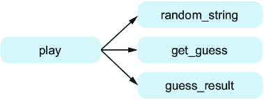
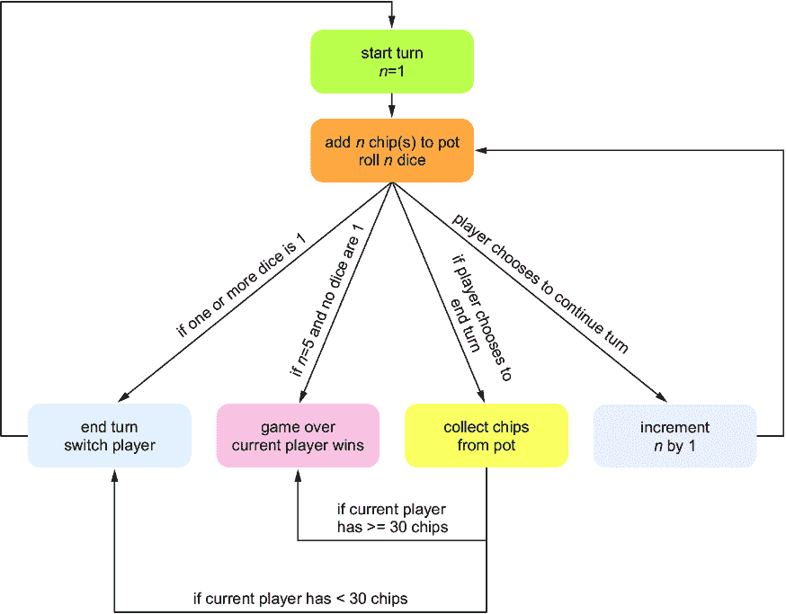
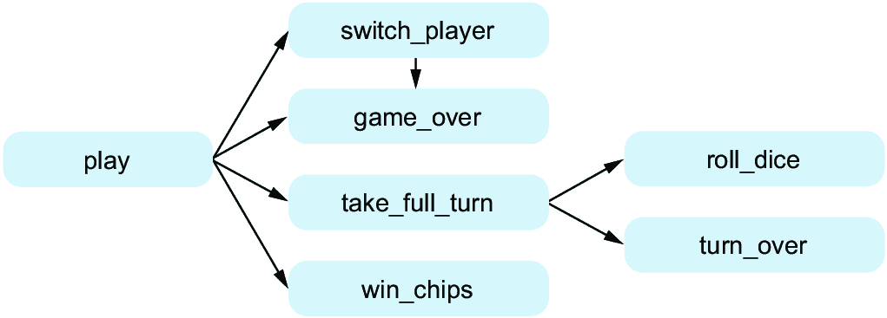

# 第十章：制作一些游戏

### 本章涵盖

+   在我们的程序中添加随机性

+   设计和编程一个密码破解逻辑游戏

+   设计和编程一个“运气”掷骰子游戏

人们学习编程的原因有很多。有些人想要自动化我们在上一章中做的繁琐任务。有些人想要与人工智能（AI；你将在第十一章中尝到一些）一起工作。其他人想要制作交互式网站、Android 或 iOS 应用，或者 Alexa 技能。程序员可以制作的东西是无穷无尽的。

另一个学习编程的流行原因是创建游戏。因此，我们认为我们应该继续我们的 Copilot 编程之旅，与你一起设计两个小型电脑游戏。第一个是一个密码破解游戏，你使用线索来识别电脑的秘密代码。第二个是一个两人掷骰子游戏，每个玩家都需要平衡风险和运气，在另一个玩家之前达到所需的分数。这些游戏不使用图形和动画，而是使用文本。我们做出这个决定是为了帮助我们专注于游戏逻辑，而不是游戏的表现方式或玩家与游戏交互的方式。在这个过程中，如果你对进一步提高你的游戏制作能力感兴趣，我们会提供一些下一步的建议。而且不用担心，你现在的技能是迈向那个目标的良好开端！

## 10.1 游戏程序

如果你考虑与家人或朋友玩桌面游戏，你可以将发生的事情分解为两个主要阶段。第一个阶段是游戏设置。这包括设置游戏板，给每个玩家提供起始资金或卡片等。第二个阶段是游戏进行。在桌面游戏中，游戏通常包括一个人轮流，假设还没有人获胜，另一个人轮流。随着每一轮的进行，游戏状态（板，玩家的资金等）都会发生变化。在编程电脑游戏时，我们需要注意实现这些阶段中的每一个。

在许多针对视频游戏设计的编程环境中，这两个阶段通常被作为独立的常规函数。有一个设置函数用于设置游戏，还有一个更新函数用于改变游戏状态，这可能是因为玩家采取了行动，或者是因为时间已经过去。图 10.1 显示了视频游戏的基本流程。


##### 图 10.1 大多数视频游戏的基本流程

让我们暂时关注一下游戏的更新部分。假设玩家可以按键盘上的按钮在 2D 游戏中向前移动。更新函数将使玩家的角色向前移动，并检查玩家的移动是否使玩家与游戏世界中的某个物体发生了交互。一些游戏也会根据时间改变状态，而不管玩家的动作如何。在这些游戏中，更新函数也会更新游戏本身的状态（例如，在 Pac-Man 游戏中移动幽灵）。在每个时间步或用户动作结束时，游戏将检查结束条件。结束条件通常包括以下内容：

+   玩家通过完成目标赢得了游戏。

+   玩家因从悬崖上掉下来、撞到怪物等原因输掉了游戏。

+   玩家选择退出游戏。

有许多编程环境针对游戏设计，我们推荐 Python 的 pygame 模块 [1] 作为良好的起点。如果您继续追求游戏设计，我们建议您查看 Unity [2] 以进行 3D 游戏设计。然而，在本章中，我们将仅使用标准 Python 来向您展示如何设计一个基本游戏，而无需深入这些新环境。

## 10.2 添加随机性

许多游戏，包括我们在本章中将要构建的两个游戏，都依赖于随机性来使它们变得有趣。在我们的第一个游戏中，我们需要计算机生成我们将要推断的数字的随机数字。在第二个游戏中，我们需要掷骰子，这仅仅相当于生成介于 1 和 6 之间的随机数。敌人的行为、谜题的初始方向或攻击造成的伤害，即随机性，通常涉及游戏设计的所有这些和其他许多方面。

因此，我们需要能够在我们的 Python 程序中生成随机数。为了了解如何做到这一点，让我们使用 Copilot Chat，就像我们在上一章中所做的那样。

LPHuman 我需要在我的 **Python 程序中生成随机数。我该如何操作？**

**GitHub Copilot 您可以使用 Python 中的 random 模块来生成随机数。以下是一个示例：

```py
*````*```pypython*````*

*`*import random*`*

*`*# Generate a random integer between 1 and 10 (inclusive)*`*

*`*random_number = random.randint(1, 10)*`*

*`*print(random_number)*`*

*`*# Generate a random float between 0 and 1*`*

*`*random_float = random.random()*`*

*`*print(random_float)*`*

*```py`*```*```py`*
```

此代码导入 random 模块，然后使用 `randint` 函数生成一个介于 1 和 10（包含）之间的随机整数，并使用 `random` 函数生成一个介于 0 和 1 之间的随机浮点数。

Copilot 建议使用名为 random 的模块中的函数来生成随机数。让我们检查一下 random 模块是否是 Python 内置的。

LPHuman 这个随机模块是 Python 内置的吗？

GitHub Copilot 是的，random 模块是 Python 的一个内置模块，所以你不需要安装任何额外的模块来使用它。你只需在你的 Python 代码中导入它，然后开始使用它的函数。

我们将遵循 Copilot 的建议导入这个模块来测试我们刚刚学到的两个函数。我们将在 Python >>>提示符下这样做，这是我们之前章节用来探索 Python 功能的地方。要进入 Python 提示符，请按 Ctrl-Shift-P，输入`REPL`，然后选择 Python: Start REPL。

根据 Copilot 对我们第一个问题的回答，我们知道我们可以使用`randint`函数在从最低允许数值到最高允许数值的范围内生成一个随机整数。我们可能会使用这个函数来生成可以组合成更大数字的单独的数字。每个数字在 0 到 9 之间，因此我们将请求`randint`函数生成 0 到 9 之间的随机数：

```py
>>> import random
>>> random.randint(0, 9)
5
>>> random.randint(0, 9)
1
>>> random.randint(0, 9)
9                            #1
>>> random.randint(0, 9)
9
>>> random.randint(0, 9)
5
>>> random.randint(0, 9)
0                           #2
>>> random.randint(0, 9)
4
```

#1 我们恰好得到了最大值。

#2 我们恰好得到了最小值。

或者，我们可能想要生成骰子的点数。每次投掷的点数在 1 到 6 之间，因此我们可以请求`randint`函数生成 1 到 6 之间的随机数：

```py
>>> random.randint(1, 6)
2
>>> random.randint(1, 6)
2
>>> random.randint(1, 6)
4
>>> random.randint(1, 6)
1
>>> random.randint(1, 6)
5
```

Copilot 还告诉我们另一个函数叫做`random`。（是的，模块和这个函数都叫做`random`！所以，我们需要使用`random.random()`来调用这个函数。）这个函数不会生成随机整数；相反，它生成介于 0 和 1 之间（不包括 1）的随机分数数。例如，你可能会得到一个像 0.1926502 这样的随机数。这类带有小数的数字被称为浮点数（或浮点数）。以下是这个函数的一些调用示例：

```py
>>> random.random()
0.03853937835258148
>>> random.random()
0.44152027974631813
>>> random.random()
0.774000627219771
>>> random.random()
0.4388949032154501
```

我们可以想象这个函数在游戏中也很有用。例如，你可以将这些浮点值视为事件发生的概率，数值越高表示概率越高。然后你可以使用这些浮点值来确定事件是否应该发生。然而，在本章的游戏中，我们不需要这个函数。

## 10.3 示例 1：猜数字游戏

*我们的第一个游戏将基于一个古老的密码破解游戏，叫做猜数字游戏。这可能会让你想起 Wordle 游戏（但如果你之前没有玩过 Wordle 也不要担心）。我们将能够与电脑玩这个游戏。在这个游戏中，随机性扮演着至关重要的角色，我们将看到。*

*### 10.3.1 游戏的工作原理

在这个游戏中，玩家 1 想出一个秘密代码，这是一个由四个数字组成的序列。玩家 2 必须猜出这个秘密代码是什么。在我们的游戏中，电脑将是玩家 1，而人类玩家将是玩家 2。

这就是它的工作方式。电脑将随机选择四个不同的数字（不允许重复数字）作为秘密代码。例如，它可能会选择数字 1862。然后，你将猜测你认为电脑的四个数字是什么。例如，你可能会猜测 3821。

对于每个猜测，您会得到两个信息。首先，您会被告知您的猜测中有多少位数字与秘密代码中相应位置完全匹配。我们将把在秘密代码中正确位置的数字称为“正确的”。比如说秘密代码是 1862，而您的猜测是 3821。您的猜测和秘密代码的第二位数字都是 8，所以这是一个匹配。没有其他匹配，所以您会被告知这个猜测中正确的数字数量是 1。

其次，您会被告知您的猜测中有多少位数字在秘密代码中的某个其他位置存在。我们将把在秘密代码中但位置不同的数字称为“错位的”。再次以 1862 作为秘密代码，3821 作为您的猜测。您的猜测中的第三位数字是 2。它不匹配秘密代码中的第三位数字（那是 6），但在秘密代码的某个其他位置有一个 2。同样，您的猜测中的第四位数字是 1。它不匹配秘密代码中的第四位数字，但在秘密代码的某个其他位置有一个 1。总的来说，您的两个数字（1 和 2）存在于秘密代码中，尽管它们没有匹配它们预期的位置。您会从这个猜测中得知错位的数字数量是 2。您可以使用这些线索来缩小秘密代码可能是什么的范围。

##### Wordle

如果您之前玩过 Wordle，您可能会注意到 Wordle 和我们这里的游戏之间的一些相似之处。Wordle 使用字母，而我们使用数字，但您对猜测的反馈类型是相似的。在两种情况下，您都会被告知关于字母或数字在正确或错误位置的信息。在 Wordle 中，您会得到关于您每个字母的线索。例如，如果您的猜测的第一个字母是 *h*，您可能会被告知 *h* 在单词中，但位置不正确。相比之下，在我们的游戏中，您不会得到关于每个数字的单独线索，而是会得到关于您的猜测的整体线索。尽管如此，我们希望您会被这些相似之处以及您正在构建的东西与最近全球现象的游戏相似之处所吸引！

我们找到了一个免费的“猜数字”游戏版本，您可以在 [www.mathsisfun.com/games/bulls-and-cows.xhtml](http://www.mathsisfun.com/games/bulls-and-cows.xhtml) 上玩。我们建议您在继续之前玩几轮游戏，这样游戏的工作方式就能在您脑海中变得非常清晰。（注意，他们使用“bulls”而不是“correct”，使用“cows”而不是“misplaced”。）

在表 10.1 中，我们提供了一个与游戏的交互示例。我们包括了一个注释列，以传达我们的思考和从每个猜测中学到的知识。

##### 表 10.1 游戏示例

| 猜测 | 错位 | 正确 | 注释 |
| --- | --- | --- | --- |
| 0123  | 1  | 0  | 答案中包含 0、1、2、3 中的一个数字；没有数字在正确的位置。  |
| 4567  | 3  | 0  | 答案中包含 4、5、6、7 中的 3 个数字；没有数字在正确的位置。  |
| 9045  | 0  | 1  | 因为 0123 中的一个数字和 4567 中的三个数字在答案中，我们知道 8 和 9 不在答案中。我们知道至少有一个数字 4 或 5 必须来自之前的猜测，而 0 可能在答案中。一个正确意味着 4 或 5 在正确的位置，或者 4 或 5 不在解决方案中，而 0 不在解决方案中。  |
| 9048  | 0  | 0  | 从之前的猜测中，我们知道 8、9 和 0 不在答案中。零个正确和零个放错告诉我们 4 也不在答案中，而从之前的猜测中，我们现在知道 5 是最后一位数字。  |
| 1290  | 1  | 0  | 回到最初的猜测，我们想知道 1、2 和 3 中的哪个数字在答案中。我们知道 9 和 0 不在答案中，所以一个数字放错意味着 1 或 2 在答案中，而 3 不在答案中。此外，无论 1 和 2 中的哪个数字在答案中，它目前都放在了错误的位置。  |
| 6715  | 2  | 1  | 因为 4 不在解决方案中，我们知道从第二个猜测中 5、6 和 7 在。我们的猜测告诉我们 1 不在答案中，而 6 和 7 放错了位置。由于 1 不在答案中，2 必须是（从之前的猜测中）。因为 5 在最后一位，我们之前在第二和第三位尝试了 2，但都没有正确，所以 2 必须在第一位。因为我们尝试了 6 在第一和第三位，但都不正确，所以 6 必须在第二位。这样，第三位就剩下 7 了。我们找到了答案。  |
| 2675  | 0  | 4  | 是的，这是正确的。  |

游戏的挑战在于你必须在有限的猜测次数内成功猜出计算机的秘密代码。在我们表 10.1 中的例子中，我们用了七个猜测来猜出代码 2675。对于每个猜测，我们都得到了数字放错的数量和数字正确的数量来指导我们的思考。

在我们刚才提到的游戏的免费版本中，你不允许在猜测中包含相同的数字多次。例如，猜测 1231 是不允许的，因为有两个 1。在我们的游戏版本中，我们也将保持这一限制。

### 10.3.2 自顶向下的设计

我们的整体任务是编写一个程序来与计算机玩 Bulls and Cows 游戏。让我们对这个大任务进行自顶向下的设计，就像我们在第七章和第九章中所做的那样。在这个游戏中，必须发生什么？回答这个问题将帮助我们把这个游戏分解成更小的任务。为了帮助我们，我们思考了游戏的规则和我们的例子，并思考了游戏每个步骤会发生什么。这些高级步骤都出现在图 10.2 中，所以让我们逐一分解它们。


##### 图 10.2 Bulls and Cows 游戏步骤

我们将从设置开始。为了能够玩游戏，电脑必须随机生成一个秘密代码。我们需要确保这个秘密代码没有重复的数字。对我们来说，这听起来像是足够复杂且自成一体的东西，因此它应该是一个独立的子任务函数。

电脑生成其秘密代码后，我们可以进入游戏本身。这里是玩家开始猜测的地方。我们可能会认为我们可以简单地使用`input`来询问玩家的猜测，从而避免为这个任务创建一个单独的函数。但我们需要确保玩家输入了正确的数字数量，并且他们的猜测中没有重复的数字。这超出了我们用一个`input`调用的能力，所以我们将把这个任务也作为一个单独的函数来处理。

一旦玩家做出有效的猜测，我们需要弄清楚两件事：有多少数字是正确的，有多少数字是错误的？我们应该有一个函数来完成这两个任务吗？或者，也许我们应该有两个函数，一个用于正确信息，一个用于错误信息？我们在两边都看到了很好的论据。如果我们把任务合并到同一个函数中，我们可以把玩家反馈集中在一个地方，这可能使我们更容易确认它是否正确编写。另一方面，有两个独立的函数会使测试每种类型的反馈（正确或错误）变得更容易，但代价是分散了反馈逻辑到两个函数中。我们在这里多少有些任意地选择使用一个函数，但如果你希望有两个独立的函数，我们鼓励你在完成本节内容后自己尝试一下。

让我们盘点一下。我们有一个生成电脑秘密代码的函数。我们有一个获取玩家下一个猜测的函数。我们有一个获取玩家猜测的正确/错误提示的函数。这些都是我们乐意从顶层函数中分离出来的三个主要子任务。

是否还有其他可以分离的子任务？在我们的顶层函数中确实还有更多的工作要做。例如，我们需要检测玩家的猜测是否与秘密代码匹配，并在这种情况下结束游戏。尽管如此，我们觉得我们不需要为这个任务单独创建一个函数。为了确定用户的猜测是否等于秘密代码，我们可以使用 Python 的`==`运算符，它直接告诉我们两个值是否相等。而为了结束游戏，我们可以使用`return`语句来结束顶层游戏函数，从而停止程序。同样，如果玩家用完了所有的猜测而没有猜出秘密代码，那么我们需要告诉他们他们输了游戏，但同样，我们可以用一小段 Python 代码来完成这个任务。因此，我们将在这里停止，我们的主要顶层函数调用三个子任务函数。

当我们在第七章中处理拼写建议问题时，我们需要将我们的一个子任务分割成子子任务。但在这里，我们的三个子任务中的每一个都可以作为一个单独的函数来管理。

例如，让我们再次思考我们的第一个子任务：生成计算机的秘密代码，不允许有重复的数字。我们能否从这个地方分割出任何子子任务？也许我们可以有一个函数来检查一个建议的秘密代码中是否有任何重复的数字。然后，我们可以继续生成秘密代码，调用我们的子子任务函数，直到它告诉我们没有重复。这会有效，但我们也可以逐个生成秘密代码的数字，并从一开始就不允许将重复的数字添加到代码中。这个后者的计划似乎不需要分割出任何子子任务。

现在我们来考虑我们的第二个子任务：获取玩家的下一个猜测。我们可以将一个子子任务分割出来，告诉我们一个猜测是否有效（即，它有正确的长度且没有重复）。虽然我们当然可以这样做，但在子任务函数本身进行几个检查就足够了。(你的思绪是否回到了第七章中的例子，关于有效密码和检测有效密码，我们将有效性检查分割成自己的函数？如果是这样，区别在于检查密码是否有效可能是一个比我们这里需要的有效性检查更实质性的任务。)当然，我们可以将其分割成另一个子子任务，但我们不会这样做。我们已经论证了我们的第三个子任务本身是可行的，所以我们的自顶向下设计就到这里为止。

我们将命名我们的顶级函数为`play`。在其中，我们将调用三个函数，分别对应我们刚刚确定的三个子任务。我们将我们的第一个子任务（生成计算机的秘密代码）的函数命名为`random_string`，第二个子任务（获取玩家的下一个猜测）的函数命名为`get_guess`，第三个子任务（向玩家提供反馈）的函数命名为`guess_result`。请参见图 10.3，了解这种自顶向下设计以树状图的形式表示。



##### 图 10.3 Bulls and Cows 游戏的自顶向下设计。最顶层（最左侧）的函数是`play`，它调用`random_string`、`get_guess`和`guess_result`。

### 10.3.3 参数和返回类型

*通常，我们在自顶向下的设计过程中本身定义每个函数的参数类型和返回值，但这次我们想在这里单独讨论这一点，因为有一些细微的方面。例如，你可能已经在想象我们将使用整数来表示秘密代码和猜测；但是，正如我们很快就会看到的，这并不是最佳选择。在我们为每个函数编写之前，我们将就如何表示所有函数的数据做出一些决定。*

*`play`函数是我们顶级函数，也是我们游戏的起点。这个函数可以没有任何参数。在函数的某个地方，我们不得不硬编码秘密代码有四个数字以及玩家有，比如说，10 次猜测的事实。但这不会很灵活。如果我们想玩一个秘密代码有七个数字且玩家有 100 次猜测的游戏版本，我们就必须进入代码并做出所有必要的更改。因此，为了使游戏易于配置，我们可以向这个函数提供一些参数。例如，而不是总是让秘密代码是四位数字，我们可以使用一个参数来允许秘密代码的长度设置为任何我们想要的。同样，而不是直接将玩家猜测的最大次数放入函数中，我们也可以将其作为一个参数，这样我们就可以轻松地更改它。然后，要改变游戏玩法，我们只需要用这些参数的不同值调用这个函数，而不必修改函数本身的代码。

##### 使用参数和变量来避免魔法数字

允许猜测的次数和秘密代码中的数字位数是我们可以用来解释代码设计中一个重要原则的好例子。这个原则是，当我们编写代码时，如果一个数字可以是参数或变量，它应该是。这个原则确保代码尽可能灵活。当程序员看到使用的是数字而不是友好的名称时，他们称之为“魔法数字”，这正是我们想要避免的。在我们讨论玩家获得的猜测次数或秘密代码的位数时，如果我们遵守这个原则，那些应该是参数。在某个时候，这些参数需要给出具体的数字以便代码能够工作，但我们应该尽可能在代码的最高级别分配它们的值（例如，玩家可能在游戏开始时设置这些参数）。

为了帮助遵守这一基本原则，每当你在代码中看到原始数字（例如，4）时，问问自己这能否是一个参数或变量。通常情况下，它应该是。

根据我们在第三章中的讨论，添加这些参数是另一个例子，说明如何使函数通用而不是不必要的限制。我们的`random_string`函数是生成计算机秘密代码的函数。为什么我们在函数名中放`string`？我们不应该返回一个像 1862 这样的随机整数吗？字符串与这个有什么关系？

嗯，返回整数的问题在于秘密代码可能以 0 开头。像 0825 这样的秘密代码是一个完全有效的四位秘密代码。但 0825 作为一个整数是 825，这没有足够的数字。字符串`'0825'`只是恰好每个都是数字的四个字符，所以以`'0'`开头没有问题。

除了这些，让我们提前思考我们最终需要与计算机的秘密代码做什么。我们需要逐位比较它与玩家的猜测，以确定哪些数字匹配。使用字符串的索引将使我们能够轻松访问字符串中的每个字符，这正是我们所需要的。访问整数的每个单独的数字更具挑战性：整数不支持索引！

因此，我们的`random_string`函数将接受秘密代码所需数字的数量作为参数，并返回一个相同长度的随机字符串，其中字符串中的每个字符都是数字字符。当我们谈论字符串中的数字时，我们指的是字符串的字符。它们碰巧是数字字符，但它们仍然是字符，就像`'a'`或`'*'`一样。不要被字符串看起来像数字的事实所迷惑！以下是一个示例，说明这些字符串与其他字符串以相同的方式工作：

```py
>>> s = '1862'
>>> s[0]        #1
'1'
>>> s[1]
'8'
>>> s[2]
'6'
>>> s[3]
'2'
>>> s + 1           #2
Traceback (most recent call last):
  File "<stdin>", line 1, in <module>
TypeError: can only concatenate str (not "int") to str
>>> s + '1'              #3
'18621'
```

#1 我们像往常一样访问字符串的字符。

#2 我们不能将字符串和整数相加。

#3 这不是字符串连接，而是数字相加。

那么`get_guess`函数呢，它是用来从玩家那里获取下一个猜测的？与`random_string`一样，这个函数需要知道有效猜测的数字数量，所以我们将它作为一个参数。它将返回一个字符串，给出玩家的猜测。

最后，让我们谈谈`guess_result`函数，这个函数告诉我们有多少位数字是正确的，有多少位是放错了位置的。这个函数将需要玩家的猜测字符串和计算机的秘密代码字符串来进行比较，因此我们需要这个函数接受这两个参数。我们需要返回两份信息——正确的数字数量和放错位置的数字数量——所以我们将返回一个包含两个整数的列表。

### 10.3.4 实现我们的函数

完成了我们的自顶向下设计后，我们现在可以与 Copilot 一起编写我们每个函数的代码。一如既往，我们将从下到上编写函数。这意味着我们首先将实现我们的三个子任务函数，然后最终实现我们的顶级`play`函数。

#### random_string

像往常一样，当与 Copilot 一起生成代码时，我们提供`def`行和文档字符串，然后 Copilot 编写代码。在每一份代码列表中，我们还会提供一些关于代码如何工作的指导。

我们希望我们的`random_string`函数接受秘密代码中的数字数量作为参数，并返回一个没有重复的随机秘密代码。在这个函数的代码中，我们可能期望 Copilot 使用`random.randint`在一个循环中，只要我们没有足够的数字，这个循环就会继续运行。为了避免添加重复的数字，代码只有在那个数字尚未存在于秘密代码中时，才会将一个随机数字添加到秘密代码中。我们在 Copilot 的结果中找到了这样的解决方案，这就是我们在以下列表中展示的解决方案。

##### 列表 10.1 用于生成秘密代码的函数`random_string`

```py
import random           #1

**def random_string(length):**
 **'''**
 **length is an integer.**

 **Return a string of the given length, where each character**
 **is a digit from 0 to 9, and with no repeated digits.**
 **'''**
    s = ''          #2
    while len(s) < length:             #3
        r = random.randint(0, 9)     #4
        if str(r) not in s:        #5
            s += str(r)          #6
    return s           #7
```

#1 不要忘记导入 random 模块。

#2 从空字符串（目前还没有数字）开始作为秘密代码

#3 当我们还需要数字时循环

#4 生成一个从 0 到 9 的随机整数

#5 如果这个数字还没有在秘密代码中 . . .

#6 . . . 将这个数字添加到秘密代码中。

#7 返回秘密代码

在本章中，我们并没有专注于测试，即使我们是在测试，我们也不会在这个函数的文档字符串中包含精确的测试。这是因为这个函数的结果是随机的。随机性可能会使测试函数变得困难，因为很难控制你得到的随机值。我们可以做的是在我们的文档字符串中添加一个测试，至少检查生成的秘密代码包含正确的字符数，没有重复的字符，并且每个字符都是有效的数字。你也可以通过运行这些函数并观察它们的结果始终在你的随机范围内，并且结果看起来是随机的来测试这样的函数。

如果你坚持进行测试，你会发现我们对这个函数的实现非常完美，没有必要做更多。如果你只想让游戏工作，你可以跳到开始编写`get_guess`函数的地方。如果你想了解更多关于 Python 和函数设计的信息，我们想利用这个机会花更多的时间来查看这个函数的不同解决方案。

我们鼓励你检查当你按下 Ctrl-Enter 时出现的窗口中的 Copilot 建议，以查看其他可能性。例如，我们可以从一个包含从 0 到 9 的所有整数的列表开始，然后使用一个名为`random.shuffle`的函数将这个列表随机排序。然后，我们只需从那个打乱顺序的列表中取出前`length`个整数（其中`length`是秘密代码的长度），这就是秘密代码！我们保证不会得到任何重复的数字，因为打乱顺序的原始列表中没有重复的数字。这个函数的版本可能如下所示。

##### 列表 10.2 函数`random_string`的替代解决方案

```py
import random
def random_string(length):
 '''
 length is an integer.

 Return a string of the given length, where each character
 is a digit from 0 to 9, and with no repeated digits.
 '''
    digits = list(range(10))               #1
    random.shuffle(digits)             #2
    return ''.join(str(d) for d in digits[:length])    #3
```

#1 创建列表 [0, 1, 2, 3, 4, 5, 6, 7, 8, 9]

#2 以随机顺序打乱列表

#3 从打乱顺序的列表中返回前“length”个数字

如果你想了解更多关于这段代码的功能，你拥有相应的工具去做！不要假设代码超出了你的理解范围。你可以让 Copilot 解释代码。你可能会得到以下这样的解释。

LPHuman 我的`random_string`函数做什么？

GitHub Copilot 该代码是一个名为`random_string`的 Python 函数，它接受一个整数`length`作为输入，并返回一个给定长度的字符串，其中每个字符都是 0 到 9 之间的数字，且没有重复的数字。

函数首先使用`range`函数和`list`构造函数创建一个从 0 到 9 的数字列表。然后使用 random 模块中的`shuffle`函数打乱列表。这确保了数字的随机顺序。

最后，该函数使用列表推导式将打乱列表的前`length`个数字转换为字符串，并使用`join`方法将它们连接成一个单一的字符串。

总体来说，`random_string`函数生成一个没有重复数字的随机数字字符串，这对于生成唯一的标识符或密码很有用。

什么是*列表推导式*？你不需要自己解决这个问题，你可以询问 Copilot 来解释它。

LPHuman 这个列表推导式是如何工作的？

GitHub Copilot 该函数中的列表推导式用于将打乱列表的前`length`个数字转换为字符串，并使用`join`方法将它们连接成一个没有分隔符的单个字符串。

下面是列表推导式是如何工作的分解：

1.  `str(d)` for d in `digits[:length]`是生成字符串列表的表达式。它将`digits`列表前`length`个元素中的每个数字转换为字符串，使用`str`函数，并返回结果字符串。

1.  `digits[:length]`是列表推导式操作的迭代器。它取`digits`列表的前`length`个元素，这些元素已经被随机打乱。

1.  整个列表推导式被括号包围，它从表达式生成的元素中创建了一个新列表。

最后，在生成的字符串列表上调用`join`方法，将它们连接成一个没有分隔符的单个字符串。

Copilot 的一些文本可能不完全易懂，但你可以继续询问它解释你不确定的部分，直到你满意地理解了它是如何工作的。

我们不需要展示这个函数的第二个工作解决方案，但我们要借此机会提醒你已经走了多远。随着你通过本书的进展，你一直在开发工具和技术来理解和创建软件，以及学习和持续学习的信心！回到我们手头的这个问题，让我们编写我们的下一个函数。

#### get_guess

我们的`get_guess`函数接受所需数字的数量作为参数，并从玩家那里返回一个有效的猜测。记住，为了使猜测有效，它必须包含正确的数字数量，并且不能有任何重复的数字。以下是我们从 Copilot 获取的以下列表中的内容。

##### 列表 10.3 函数`get_guess`用于用户输入

```py
def get_guess(length):
 '''
 length is an integer.

 Keep asking the player to enter a string where each character 
 is a digit from 0 to 9, until they enter a valid guess.
 A valid guess has the given length and has no repeated digits.
 '''
    guess = input('Enter a guess: ')                           #1
    while len(guess) != length or not guess.isdigit()\    #2
            or len(set(guess)) != length:                
        guess = input('Enter a guess: ')                #3
    return guess       #4
```

#1 首先尝试从玩家那里获取一个有效的猜测

#2 当长度错误，或者猜测不是全部数字或者有重复时……

#3 ……随后尝试从玩家那里获取一个有效的猜测

#4 返回有效的猜测

那个 `while-loop` 条件是复杂的！最后一部分，`len(set(guess))` `!=` `length`，负责检查用户是否输入了任何重复的数字。它是使用 Python 集合来做到这一点的。我们确实在第七章的 7.7.7 节中看到过这个技巧，但那是很久以前的事情了！所以，如果你需要复习，不要犹豫，向 Copilot 请求解释那一行。

#### guess_result

我们的 `guess_result` 函数接受两个字符串作为参数：玩家的最新猜测和秘密代码。它返回一个包含两个整数的列表：正确数字的数量和错误数字的数量。

这是一个难以正确实现的函数，因此尽管我们之前没有在先前的函数中展示我们想要运行的测试，但我们将在该函数的文档字符串中提供一些明确的测试。我们添加这些文档字符串测试是因为这个函数的逻辑将足够复杂，以至于仅通过阅读代码很难确定代码是否正确。对于我们的文档字符串测试，我们需要一些不同秘密代码和用户猜测的示例案例，以确保函数返回的正确和错误数字的数量符合预期。当然，根据第六章，如果你对进行严肃的测试感兴趣，你可能还想添加更多的测试用例。我们的第一个测试用例是

```py
>>> guess_result('3821', '1862')
```

这里的正确返回值是 `[1,` `2]`，因为有一个数字是正确的（8），还有两个错误的数字（2 和 1）。我们的第二个测试用例是

```py
>>> guess_result('1234', '4321')
```

这次的正确返回值是 `[0,` `4]`，因为没有正确的数字，但猜测中的所有四个数字都是错误的。以下是我们的完整文档字符串，包括测试用例和 Copilot 的代码。

##### 列表 10.4 函数 `guess_result` 用于获取猜测的结果

```py
def guess_result(guess, secret_code):
 '''
 guess and secret_code are strings of the same length.

 Return a list of two values:
 the first value is the number of indices in guess where
 the character at that index matches the character at the
 same index in secret_code; the second value is the 
 number of indices in guess where the character at that 
 index exists at a different index in secret_code.

 >>> guess_result('3821', '1862')
 [1, 2]
 >>> guess_result('1234', '4321')
 [0, 4]
 '''
    correct = 0                     #1
    misplaced = 0          #2
    for i in range(len(guess)):             #3
        if guess[i] == secret_code[i]:    #4
            correct += 1        #5
        elif guess[i] in secret_code:     #6
            misplaced += 1             #7
    return [correct, misplaced]      #8
```

#1 这个变量用于记录正确的数字。

#2 这个变量用于记录错误的数字。

#3 遍历数字字符串的每个索引

#4 这个数字是正确的。

#5 将正确计数增加 1

#6 这不是匹配但却是错误的。

#7 将错误计数增加 1

#8 返回列表中的两个结果

在这里使用 `elif` 是微妙的。如果它被写成 `if` 而不是 `elif`，那么代码就会出错！你明白为什么吗？如果不明白，在继续阅读这里的解释之前，试着与 Copilot 进行对话。

假设 `if` 条件 `guess[i]` `==` `secret_code[i]` 是 `True`。在这种情况下，我们将 `correct` 增加 1，并跳过 `elif` 语句。（记住，只有当前面的 `if` 和任何前面的 `elif` 条件为 `False` 时，`elif` 语句才会运行。）

现在，想象一下，如果我们把`elif`改为`if`。如果`if`条件`guess[i] == secret_code[i]`为`True`，我们仍然会增加`correct`的值。但然后，我们会检查`guess[i] in secret_code`条件，这个条件也会是`True`。毕竟，我们刚刚说过`guess[i] == secret_code[i]`，这证明了`guess[i]`确实在`secret_code`中某个位置。所以，我们会错误地执行`misplaced += 1`，而这绝对是我们不希望做的（它是一个匹配的数字，而不是一个错误的数字）！

#### play

我们已经完成了子任务函数！现在我们只需要编写`play`顶级函数。

我们的`play`函数接受两个整数作为参数：秘密代码中的数字数量和猜测次数，以及玩家需要猜测秘密代码的猜测次数。它不返回任何内容——它只是玩游戏！我们这个函数的最终提示和代码如下所示。

##### 列表 10.5 游戏的`play`函数

```py
def play(num_digits, num_guesses):
 '''
 Generate a random string with num_digits digits.
 The player has num_guesses guesses to guess the random 
 string. After each guess, the player is told how many 
 digits in the guess are in the correct place, and how 
 many digits exist but are in the wrong place.
 '''
    answer = random_string(num_digits)                         #1
    print('I generated a random {}-digit number.'.format(num_digits))
    print('You have {} guesses to guess the number.'.format(num_guesses))
    for i in range(num_guesses):                        #2
        guess = get_guess(num_digits)            #3
        result = guess_result(guess, answer)          #4
        print('Correct: {}, Misplaced: {}'.format( \   #5
                            result[0], result[1]))     #5
        if guess == answer:            #6
            print('You win!')
            return             #7
    print('You lose! The correct answer was \   #8
                     {}.'.format(answer))       #8
```

#1 生成计算机的秘密代码

#2 对每个可能的玩家猜测循环一次

#3 从玩家那里获取下一个有效的猜测

#4 获取对这个猜测的“正确”和“错误位置”反馈

#5 告诉玩家提示信息

#6 玩家正确猜出了秘密代码！

#7 退出函数；这标志着游戏的结束。

#8 如果我们到达这里，那么玩家已经用完了猜测次数。

如果我们现在运行程序，什么也不会发生。那是因为我们还没有调用`play`函数！我们总是需要记得调用我们的顶级函数。要调用它，我们可以在`play`函数下方添加这一行：

```py
play(4, 10)
```

数字`4`表示我们正在使用四位数代码和猜测，而数字`10`表示我们有 10 次机会正确猜测秘密代码。你可以更改这些参数来调整你喜欢的游戏。

在我们继续之前，让我们试玩一下我们的游戏。我们将展示我们的前几个猜测，然后是我们的最终猜测：

```py
I generated a random 4-digit number.
You have 10 guesses to guess the number.
Enter a guess: 0123
Correct: 1, Misplaced: 0
Enter a guess: 4567
Correct: 1, Misplaced: 0
Enter a guess: 8901
Correct: 2, Misplaced: 0
Enter a guess: 8902
Correct: 2, Misplaced: 1
...
Enter a guess: 2897
Correct: 1, Misplaced: 3
You lose! The correct answer was 8927.
```

我们已经成功设计了一个计算机游戏，这与其他我们在本书中编写的程序非常不同。我们的计算机游戏与用户互动，具有随机性，涉及两个玩家（人类玩家猜测和计算机玩家提供正确/错误提示），并且有胜负条件。这有很多新内容！然而，我们也希望你能看到我们从前面的章节中学到了多少，并取得了哪些进步。我们仍在进行自顶向下的设计，仍在设计函数，仍在测试代码，仍在阅读代码，并且仍在与 Copilot 进行对话。在写这一章之前，你可能没有编写过游戏，但本质上，你已经具备了编写游戏所需的技能。不要让看似新的程序或应用类型阻止你尝试去做。

### 10.3.5 为 Bulls and Cows 添加图形界面

你可能会对我们的游戏看起来不像你最近玩过的游戏而感到失望，因为没有图形，只有文本。例如，没有好的输入区域，没有可以点击的按钮，也没有任何图形界面。我们已经在本章中讨论了为什么我们专注于文本游戏，但这并不意味着将这个游戏转换成图形界面版本完全超出了你的能力范围，因为你可以通过与 Copilot 交互来查看它是否可以帮助你开始。

挑战在于程序员使用一种称为*事件驱动编程*的编程风格来创建图形用户界面，这是我们还没有教过你的，而且在这个章节中也无法详细讲解。你可能会阅读事件驱动编程的代码并对其有所理解，如果你要求 Copilot 编写代码来生成图形界面，你将需要这样做。然而，如果 Copilot 没有给你你想要的结果，在没有首先熟悉事件驱动编程的情况下，可能很难修复。如果你想要了解更多，有一本关于游戏编程的好书，它包括使用 Python 的图形用户界面和事件驱动编程，书名为*用 Python 发明你自己的电脑游戏* [3]。

##### 事件驱动编程

事件驱动编程通常用于与用户交互的程序。在较高层次上，程序设置了一种用户与程序交互的方式（例如，通过按按钮或输入文本），然后只是坐着等待用户做些什么，有时在等待用户输入的同时更新游戏状态。一旦人类与游戏交互，代码就会将这种交互识别为*事件*，每个事件都与执行时应该运行的代码相关联。例如，当用户点击退出游戏按钮时，它会触发当用户想要退出时需要执行的代码（例如，保存游戏状态并退出程序）。

当我们要求 Copilot 为 Bulls and Cows 创建图形界面时，我们对它给出的结果印象深刻，所以我们想展示它做得有多好。即使不了解事件驱动编程，代码也相对容易阅读。例如，你可能可以找到游戏的标题并更改它。为此，我们向 Copilot Chat 提出了以下问题：

LPHuman 能否将这个程序转换为使用图形界面而不是文本界面？

Copilot 通过逐步列出我们需要做出的更改来回应我们。然后它重写了代码，使游戏现在使用带有按钮和编辑框的图形界面，而不是文本界面。有关新界面的详细信息，请参阅图 10.4。生成此界面的代码可以在本书的网站上找到，如果你有兴趣运行它或了解代码的话。


##### 图 10.4 由 Copilot 提供的游戏图形界面。请注意，它显示了秘密代码，可能是为了帮助测试（您在玩游戏之前应该将其删除）。

## 10.4 示例 2：Bogart

*我们的第二个游戏将是一款两人掷骰子游戏。在 Bulls and Cows 中，我们的一个玩家是人类，另一个是电脑。这次，我们将为两个玩家编写游戏。随机性再次将扮演关键角色。完成后，您可以和朋友或家人玩！*

*### 10.4.1 游戏的工作原理

我们将要编写的游戏被称为 Bogart，由 Crab Fragment Labs 设计。这是一款两人掷骰子游戏。游戏还使用筹码或硬币。显然，我们不需要实际的骰子或筹码，因为我们正在将其作为电脑游戏实现。

##### Bogart

Bogart 游戏由詹姆斯·欧内斯特设计（© 1999 詹姆斯·欧内斯特和 Cheapass Games，经许可使用；[`crabfragmentlabs.com/`](https://crabfragmentlabs.com/))。您可以从以下链接免费下载原始游戏的说明手册作为游戏.pdf 文件的一部分：[`crabfragmentlabs.com/shop/p/chief-herman-1`](https://crabfragmentlabs.com/shop/p/chief-herman-1)。如果您喜欢这款游戏，并且无法停止玩我们的复制品，我们鼓励您支持 Crab Fragment Labs 正在进行的工作。我们感谢他们允许我们在这里使用他们的游戏！

当游戏开始时，筹码堆是空的（里面没有筹码）。两个玩家中的一个被随机选中开始游戏。从那里，每个玩家轮流进行，直到游戏结束。我们首先解释玩家如何进行回合，然后给出游戏结束的规则。图 10.5 还提供了游戏流程的概述。

在玩家回合开始时，一枚筹码被加入筹码堆，该玩家掷一枚骰子。如果那枚骰子是 1，那么玩家的回合就结束了，他们不会收集任何筹码。如果那枚骰子不是 1，那么玩家可以决定是否继续他们的回合。如果他们决定不继续回合，他们将收集筹码堆中的所有筹码（使筹码堆为空）。



##### 图 10.5 Bogart 游戏中的玩家回合

如果他们决定继续他们的回合，那么将有两枚筹码加入筹码堆，然后他们掷两枚骰子。如果其中一枚或两枚骰子是 1，那么玩家的回合就结束了。否则，玩家再次决定是否继续他们的回合。

如果他们继续他们的回合，那么他们掷三枚骰子，然后掷四枚骰子，然后掷五枚骰子。（玩家不能选择跳过一定数量的骰子；他们必须从一枚骰子开始依次掷出所有骰子。）如果他们掷出了 1，那么他们的回合结束，他们不会收集任何筹码。如果他们决定不继续回合，那么他们将从筹码堆中收集所有筹码。

在这个游戏中掷出 1 点对当前玩家来说是个坏消息。掷一枚骰子时，掷出 1 点的概率很低，只有 1/6（大约 17%）。掷两枚骰子时，至少掷出一个 1 点的概率更高，这次大约是 31%。掷三枚骰子时（42%），掷四枚骰子时（52%），或者掷五枚骰子时（60%），概率更高。所以，你延长回合的时间越长，最终掷出 1 点并一无所获的概率就越高。更糟糕的是，如果你比对方更保守地玩，你可能会给对方留下一个满满的赌注。同时，你延长回合的时间越长，赌注中的筹码积累得就越快，假设你最终成功结束回合，你可以收集的筹码就越多。整个技巧就是决定何时冒险获取更多筹码，何时收手。

这就是玩家回合的工作方式。玩家轮流进行回合，掷骰子并收集筹码，直到游戏结束。游戏有三种结束方式：

1.  如果一名玩家总共收集到 30 枚或更多的筹码，那么这名玩家就赢了。

1.  假设一名玩家在他们的回合中掷出一枚骰子，然后两枚，接着三枚，然后四枚，最后五枚，一次也没有掷出 1 点。那么，这名玩家立刻获胜。他们收集了多少筹码并不重要：如果他们掷出五枚骰子，其中没有一枚是 1 点，他们就会赢。

#### 博格特游戏示例

让我们玩几轮游戏，以确保我们清楚游戏是如何运作的。赌注一开始是空的。假设玩家 1 是被随机选中的第一个玩家。我们向赌注中加一枚筹码，玩家 1 掷一枚骰子。假设他们掷出了 5 点。现在玩家 1 必须决定是否结束他们的回合并从赌注中拿走一枚筹码，或者继续他们的回合。

假设他们继续他们的回合。我们向赌注中加两枚筹码；现在赌注中有三枚筹码。玩家 1 掷两枚骰子。假设他们掷出了 4 点和 2 点。

他们应该结束回合并拿走三枚筹码吗？不，不。他们想要更多。他们继续他们的回合。我们向赌注中加三枚筹码；现在赌注中有六枚筹码。玩家 1 掷三枚骰子。这次，他们掷出了 6 点、5 点，哦不！——一枚 1 点。玩家 1 的回合结束了。他们没有得到任何筹码，并且给玩家 2 留下了六个诱人的筹码。

现在轮到玩家 2 了。我们在赌注中加一枚筹码——现在总共有七枚筹码了！——然后玩家 2 掷一枚骰子。假设他们掷出了 2 点。如果玩家 2 现在结束他们的回合，他们将收集赌注中的七枚筹码。这感觉很多，所以让我们假设玩家 2 决定结束他们的回合。

现在赌注已经空了，轮到玩家 1 了。玩家 1 需要追赶：他们有 0 枚筹码，而玩家 2 有 7 枚筹码。我们在这里停下来，但游戏将继续进行，直到其中一名玩家积累到 30 枚或更多的筹码，或者他们掷出五枚骰子并且没有掷出任何 1 点。

### 10.4.2 自顶向下的设计

正如我们在实现我们的牛牛游戏时的情况一样，实现博加特是一个大问题，我们需要自顶向下的设计。我们现在将提供这个设计，但在这里我们鼓励你在继续之前自己尝试一下。我们推荐这样做是因为我们发现，由于交互元素的众多，这个游戏的自顶向下设计非常微妙。例如，玩家的回合可以以三种方式结束：收集筹码、不收集筹码，以及立即获胜。我们需要能够确定这些情况中的哪一种发生了。作为另一个例子，在每个玩家的回合之后，我们需要切换到另一个玩家——但不幸的是，并不总是这样：如果一个玩家赢得了游戏，我们希望在那一刻停止游戏并宣布他们为胜者，而不是切换到另一个玩家！我们将主要关注我们的成功自顶向下设计，但偶尔我们会解释我们为什么做出某些决定，以及其他决定为什么出错。

我们将命名我们的顶级函数为`play`。以下是我们需要解决游戏的主要子任务：

1.  初始化筹码池，并将玩家 1 和玩家 2 的筹码数设为零。这是游戏设置阶段的一部分。

1.  随机选择玩家 1 或玩家 2 开始游戏。这同样是游戏设置的一部分。

1.  现在我们进入游戏阶段。只要游戏没有结束，就执行以下操作：

    1.  打印筹码池中的筹码数，玩家 1 的筹码数，以及玩家 2 的筹码数。

    1.  为当前玩家转动一圈。

    1.  如果当前玩家赢得了筹码，就将筹码给当前玩家，并将筹码池重置为零筹码。

    1.  切换到另一个玩家的回合。

1.  打印获胜游戏的玩家（玩家 1 或玩家 2）的名字。

在本书的这一部分，我们怀疑你已经足够熟悉 Copilot 的代码，对哪些任务需要单独的函数有一些很好的直觉。任务 1 只是几个变量赋值，所以我们不需要为那个任务创建一个单独的函数。我们不需要为以下任务创建单独函数的任务还包括任务 2（只是一个对`random.randint`的调用）、3a（几个`print`调用）和 4（一个`print`调用）。我们将把剩余的子任务捕获在函数中。以下小节将描述每个剩余的子任务。

#### 任务 3。当游戏没有结束时

我们将有一个`while`循环，只要游戏没有结束就会继续，所以我们需要一个函数来告诉我们游戏是否结束！这个函数如何知道游戏是否结束？它需要知道当前玩家 1 和玩家 2 的筹码数。这样，它可以检查这些数中的任何一个是否至少为 30。但记住，游戏还有另一种结束方式，那就是当一个玩家掷出五颗骰子，且没有一颗是 1 时。因此，这个函数还需要知道当前玩家的最近一次骰子滚动情况。

我们将把这个函数命名为`game_over`。它将接受三个参数：玩家 1 的筹码、玩家 2 的筹码和骰子点数列表。如果游戏结束，则返回`True`，否则返回`False`。这个函数的代码需要检查几个条件，但我们应该能够做到这一点，而无需将其拆分成更小的子任务。

#### 任务 3b. 为当前玩家进行一次完整的回合

我们将把这个函数命名为`take_full_turn`。这个函数*需要*知道现在筹码堆中有多少筹码，以便根据需要更新它。它还需要返回更新后的筹码堆中的筹码数量。除此之外，我们还需要管理很多事情才能完成一个完整的回合，因此我们需要控制这个函数的复杂性。以下是这个函数可能需要做的事情：

1.  允许玩家掷一个骰子，然后掷两个骰子，然后掷三个骰子，依此类推，直到玩家的回合结束。

1.  根据本轮发生的情况更新当前玩家的筹码数量。我们可以添加一个额外的返回值来将此更新信息传达给调用此函数的人。

1.  判断游戏是否结束。我们可以在返回值中添加一个额外的值，其中`True`表示游戏结束，`False`表示游戏未结束。

我们最初尝试让函数完成这三件事，但无法从 Copilot 那里获得令人满意的代码。这并不令人惊讶，因为我们要求函数做太多。这导致我们专注于这个函数的核心，即第 1 点。

但好吧，如果我们只关注第 1 点，那么我们如何更新当前玩家的筹码数量（第 2 点），以及我们如何知道游戏是否结束（第 3 点）？对于第 2 点，我们想到的解决方案是在这个函数中根本不更新当前玩家的筹码计数，而是返回本轮后筹码堆中的总筹码数量。

例如，如果筹码堆中有 10 个筹码，而这个玩家的回合产生了 6 个筹码，那么我们将返回 16。玩家可能或可能无法收集这 16 个筹码——这取决于他们的回合如何结束——但我们现在不会处理这个问题（这是由调用函数来管理的）。

对于第 3 点（知道游戏是否结束），我们的解决方案是让函数将其返回值的一部分作为最近的骰子点数列表。这个点数列表（对于第 2 点）也将由调用函数所需。调用这个函数的函数可以使用这些点数来确定游戏是否结束。

总结来说，我们的函数将筹码堆中的筹码数量作为参数，并返回两个值：玩家回合后筹码堆中新的筹码数量和最近的骰子点数列表。

要完成一个完整的回合，我们需要能够掷骰子：首先掷一个骰子，然后掷两个骰子，然后掷三个骰子，依此类推。我们将这部分拆分成一个名为`roll_dice`的函数。它将接受要掷的骰子数量作为参数，并返回一个点数列表。例如，如果我们要求该函数掷三个骰子，我们可能会得到回执`[6, 1, 4]`。

我们还需要能够根据最近的点数列表确定回合是否结束。如果玩家掷出了任何 1，或者掷出了五个骰子且没有一个是 1，那么回合就结束了。我们将这部分也拆分出来，命名为`turn_over`。它将接受点数列表作为参数，如果回合结束则返回`True`，如果没有结束则返回`False`。

如果回合还没有结束，我们需要询问玩家他们是否想要继续他们的回合。我们将要求他们给出是（y）或否（n）的回应。我们可以通过调用`input`函数来实现。如果玩家想要继续，我们可以再次调用`roll_dice`。我们不需要一个单独的函数来请求用户输入，所以我们将不会进一步分解这部分。如果我们想要验证用户的输入（拒绝任何不是 y 或 n 的回应），这将增加足够的复杂性，以至于我们可能会将其拆分出来。

总结来说，我们已经将`take_full_turn`函数拆分成了两个子任务：`roll_dice`和`turn_over`。这些函数不需要进一步拆分。对于`roll_dice`，我们可以使用`random.randint`循环生成所需的点数。而`turn_over`将涉及对骰子点数的几个检查，以确定它们是否结束了我们不需要进一步拆分的回合。

#### 任务 3c. 如果当前玩家赢得了筹码

当玩家的回合结束时，我们会得到新筹码数量和结束回合的最终骰子点数列表。我们需要确定玩家是否获得了这些筹码。（如果最终的点数列表中不包含 1，则玩家收集筹码；否则，他们不收集，筹码留在筹码堆中。）

我们将拆分出一个函数来告诉我们玩家是否收集了筹码。我们将将其命名为`wins_chips`。这个函数将接受最近的点数列表作为参数，如果玩家赢得了筹码则返回`True`，否则返回`False`。

#### 任务 3d. 切换到另一玩家的回合

我们将把这个函数命名为`switch_player`。假设当前玩家刚刚完成他们的回合。我们需要切换到另一个玩家的回合，但前提是游戏还没有结束。我们的函数将封装这个逻辑。它需要调用`game_over`来确定游戏是否结束，因此我们需要至少三个参数给`switch_player`：玩家 1 的筹码，玩家 2 的筹码，以及最近的骰子滚动列表。我们还需要一个参数来指示当前玩家（1 或 2），这样我们就可以返回下一个新当前玩家的编号。因此，该函数将接受这四个参数，并返回一个 1 或 2，表示我们将切换到的下一个玩家。

如果游戏结束，这个函数不会做任何事情。如果游戏没有结束，那么我们需要将 1 改为 2 或将 2 改为 1。我们已经有`game_over`函数，这足以分解这个函数。

我们已经完成了自顶向下的设计！查看图 10.6 以了解我们的函数树。



##### 图 10.6 博加特游戏的顶向下设计

### 10.4.3 实现我们的函数

现在是时候与 Copilot 一起编写我们每个函数的代码了。一如既往，我们将从叶函数开始，逐步向上（在图中向左），只有在所有其他函数都已实现后，才实现顶级`play`函数。我们可以从任何叶函数开始。我们将从`game_over`函数开始，因为它既需要`play`，也需要`switch_player`。然后，我们将继续处理其他函数。

#### game_over

这个函数接受三个参数：玩家 1 拥有的筹码数量，玩家 2 拥有的筹码数量，以及最近的骰子滚动列表。如果游戏结束，则返回`True`，如果没有结束，则返回`False`，如下所示。

##### 列表 10.6 博加特游戏的`game_over`函数

```py
def game_over(player1, player2, rolls):
 '''
 player1 is the number of chips that player 1 has.
 player2 is the number of chips that player 2 has.
 rolls is the last list of dice rolls.

 Return True if the game is over, False otherwise.

 The game is over if player1 has at least 30 chips, 
 or player 2 has at least 30 chips, 
 or there are 5 rolls none of which is a 1.
 '''
    return player1 >= 30 or player2 >= 30 or \       #1
            (len(rolls) == 5 and not 1 in rolls)     #1
```

#1 游戏结束的三种方式

记住，游戏有三种结束方式：玩家 1 至少有 30 个筹码，玩家 2 至少有 30 个筹码，或者某个玩家在最后一轮中成功掷出五个骰子而没有掷出 1。

##### 直接返回布尔值

你可能期望看到代码是这样的，使用`if-else`和实际的`return True`和`return False`行：

```py
if player1 >= 30 or player2 >= 30 or (len(rolls) == 5
        and not 1 in rolls):
    return True
else:
    return False
```

这会工作，但更常见的是程序员直接使用`return`语句与`True`/`False`表达式。这是因为表达式的结果是返回的内容。如果表达式为真，则返回`True`，如果表达式为假，则返回`False`。这与`if-else`版本做的是完全相同的事情！

#### roll_dice

这是掷骰子并给我们的游戏增加随机性的函数。它接受要掷的骰子数量作为参数，并返回骰子滚动列表。我们期望 Copilot 在这里使用`random.randint`，如列表 10.7 所示。

除了返回滚动列表外，如果此函数还能打印出每次掷骰子的结果，那就更有帮助了。这样，玩家就可以看到他们确切掷出了什么。在文档字符串中，我们要求 Copilot 打印滚动结果（除了返回滚动列表之外）。

##### 列表 10.7 Bogart 中的 `roll_dice` 函数

```py
import random
def roll_dice(n):
 '''
 Create a list of n random integers between 1 and 6.
 Print each of these integers, and return the list.
 '''
    rolls = []                   #1
    for i in range(n):          #2
        roll = random.randint(1, 6)      #3
        print(roll)                   #4
        rolls.append(roll)      #5
    return rolls      #6
```

#1 骰子滚动列表（介于 1 和 6 之间的整数），开始为空

#2 循环 n 次，每次掷一次骰子

#3 使用“randint”生成介于 1 和 6 之间的随机整数

#4 打印滚动结果供玩家查看

#5 将滚动结果添加到滚动列表中

#6 返回滚动列表

#### turn_over

此函数接受最近的滚动列表，并使用该列表确定当前玩家的回合是否结束。如果回合结束，则返回 `True`，如果没有结束，则返回 `False`，如以下列表所示。

##### 列表 10.8 Bogart 中的 `turn_over` 函数

```py
def turn_over(rolls):
 '''
 Return True if the turn is over, False otherwise.

 The turn is over if any of the rolls is a 1, 
 or if there are exactly five rolls.
 '''
    return 1 in rolls or len(rolls) == 5      #1
```

#1 回合结束的两种方式

玩家的回合结束有两种方式。第一种是当滚动列表中出现 1 时。第二种是当玩家掷了五颗骰子。

`len(rolls)` `==` `5` 真的足够使回合结束吗？我们不是还要检查是否掷出了任何 1 吗？不，如果玩家掷了五颗骰子，那么无论骰子结果如何，他们的回合就结束了。如果他们掷出了任何 1，那么回合就结束了（因为他们掷出了 1，并且不会收集任何筹码）。如果他们没有掷出任何 1，那么回合仍然结束（在这种情况下，他们将自动赢得游戏）。

#### take_full_turn

现在我们已经准备好 `take_full_turn`，如列表 10.9 所示。此函数接受当前赌注中筹码的数量作为参数。它将处理当前玩家的完整回合的所有滚动，然后返回两个值：赌注中新的筹码数量和最终的滚动列表。

##### 列表 10.9 Bogart 中的 `take_full_turn` 函数

```py
def take_full_turn(pot_chips):
 '''
 The pot has pot_chips chips.

 Take a full turn for the current player and, once done, 
 return a list of two values:
 the number of chips in the pot, and the final list of dice rolls.

 Begin by rolling 1 die, and put 1 chip into the pot.
 Then, if the turn isn't over, ask the player whether 
 they'd like to continue their turn.
 If they respond 'n', then the turn is over.
 If they respond 'y', then roll one more die than last time, 
 and add 1 chip to the pot for each die that is rolled.
 (for example, if 3 dice were rolled last time, then 
 roll 4 dice and add 4 chips to the pot.)
 If the turn is not over, repeat by asking the player again 
 whether they'd like to continue their turn.
 '''
    rolls = roll_dice(1)      #1
    pot_chips += 1                       #2
    while not turn_over(rolls):                   #3
        keep_going = input('Continue? (y/n) ')      #4
        if keep_going == 'y':                       #5
            rolls = roll_dice(len(rolls) + 1)         #6
            pot_chips += len(rolls)           #7
        else:
            break                  #8
    return pot_chips, rolls    #9
```

#1 掷一颗骰子

#2 向赌注中添加一枚筹码

#3 当当前玩家的回合没有结束时 ...

#4 ... 询问玩家是否想继续他们的回合。

#5 如果他们想继续他们的回合 ...

#6 ... 比上一次多掷一颗骰子。

#7 向赌注中添加新的筹码

#8 退出 while 循环

#9 返回赌注中的筹码数量和最终的滚动列表

#### wins_chips

此函数接受一个滚动列表作为参数。如果滚动结果良好（即不包含 1），则玩家将收集筹码。如果滚动结果包含任何 1，则玩家不会收集筹码。此函数在以下列表中返回 `True` 如果玩家可以收集筹码，否则返回 `False`。

##### 列表 10.10 Bogart 中的 `wins_chips` 函数

```py
def wins_chips(rolls):
 '''
 Return True if the player wins chips, False otherwise.

 The player wins the chips if none of the rolls is a 1.
 '''
    return not 1 in rolls      #1
```

#1 当没有 1 时返回 True，否则返回 False

#### switch_player

这个函数接受四个参数：玩家 1 拥有的筹码数量、玩家 2 拥有的筹码数量、当前玩家最近掷出的骰子列表（由当前玩家掷出）以及当前玩家的编号。如果游戏尚未结束，则该函数返回另一个玩家的编号。如果游戏结束，则该函数返回当前玩家（因为另一个玩家没有回合！）。请参见以下列表。

##### 列表 10.11 Bogart 中的`switch_player`函数

```py
def switch_player(player1, player2, rolls, current_player):
 '''
 player1 is the number of chips that player 1 has.
 player2 is the number of chips that player 2 has.
 rolls is the last list of dice rolls.
 current_player is the current player (1 or 2).

 If the game is not over, switch current_player to the other player.
 Return the new current_player.
 '''
    if not game_over(player1, player2, rolls):     #1
        if current_player == 1:                #2
            current_player = 2
        else:
            current_player = 1
    return current_player        #3
```

#1 如果游戏尚未结束...

#2 ...从 1 切换到 2 或从 2 切换到 1。

#3 返回新的当前玩家

#### play

我们已经到达了`play`函数！我们决定不添加任何参数来编写这个函数。你可能想知道我们是否可以通过添加一个参数来使代码更灵活，比如为赢得所需的筹码数量（目前为 30）添加一个参数。你当然可以这样做；我们在这里没有这样做是为了保持代码中参数数量的较小。这个函数不返回任何内容。相反，它玩游戏，如下面的列表所示。

##### 列表 10.12 Bogart 中的`play`函数

```py
def play():
 '''
 Play the game until the game is over.

 The pot starts with 0 chips, and each player starts with 0 chips.

 Randomly decide whether player 1 or player 2 goes first.

 Before each turn, print three lines of information:
 1\. The number of chips in the pot
 2\. The number of chips that each player has
 3\. Whether it is player 1's turn or player 2's turn

 Take a full turn for the current player. 
 If they won the chips, add the chips in the pot to the 
 total for that player and reset the pot to have 0 chips.

 Then, switch to the other player's turn.

 Once the game is over, print the current player 
 (that's the player who won).
 '''
    pot_chips = 0      #1
    player1 = 0        #1
    player2 = 0        #1
    current_player = random.randint(1, 2)      #2
    rolls = []
    while not game_over(player1, player2, rolls):     #3
        print('Pot chips:', pot_chips)               #4
        print('Player 1 chips:', player1)              #4
        print('Player 2 chips:', player2)            #4
        print('Player', current_player, 'turn')      #4
        pot_chips, rolls = take_full_turn(pot_chips)     #5
        if wins_chips(rolls):                           #6
            if current_player == 1:                   #7
                player1 += pot_chips                       #8
            else:
                player2 += pot_chips          #9
            pot_chips = 0                              #10
        current_player = switch_player(player1, player2,  #11
                                       rolls, current_player)
    print('Player', current_player, 'wins!')   #12
```

#1 开始筹码池和玩家，初始筹码为 0

#2 随机让玩家 1 或玩家 2 开始游戏

#3 当游戏尚未结束时...

#4 ...打印当前游戏状态。

#5 让当前玩家进行回合

#6 如果当前玩家赢得筹码...

#7 ...然后轮到玩家 1...

#8 ...将筹码池中的筹码给玩家 1；...

#9 ...否则，将筹码池中的筹码给玩家 2。

#10 将筹码池重置为 0 筹码

#11 切换到另一个玩家的回合

#12 打印出获胜者

我们现在拥有了游戏所需的所有代码。只需添加

```py
play()
```

在你现有的所有代码下方添加调用我们的`play`函数，然后你就可以玩游戏了！

#### 自定义游戏

我们对 Copilot 给出的结果很满意，游戏当然可以玩。但是，诚实地讲，与玩家的互动可以更友好一些。例如，当我们运行游戏并多次按下 y 时，游戏可能会这样开始：

筹码池筹码：0

玩家 1 筹码：0

玩家 2 筹码：0

玩家 2 回合

4

Continue? (y/n) y

5

2

Continue? (y/n) y

3

1

4

筹码池筹码：6

玩家 1 筹码：0

玩家 2 筹码：0

玩家 1 回合

2

继续吗？(y/n)

没有欢迎信息。像 4、5、2 这样的数字只是在那里，没有任何上下文说明它们的意义。游戏会询问我们是否想要“继续？(y/n)”。继续什么？这并不清楚。

我们可以通过在我们的函数中增加`print`调用来使与玩家的互动更加愉快。我们只需自己将想要的内容放入每个`print`语句中即可。为什么不直接使用 Copilot 呢？这样做可能比试图说服 Copilot 打印出我们想要的确切内容要容易得多。例如，下面的列表显示了`play`的新版本，我们在其中添加了更多的`print`调用，以解释正在发生的事情，并更好地格式化游戏输出。

##### 列表 10.13 Bogart 中格式更好的`play`函数

```py
def play():
 '''
 Play the game until the game is over.

 The pot starts with 0 chips, and each player starts with 0 chips.

 Randomly decide whether player 1 or player 2 goes first.

 Before each turn, print three lines of information:
 1\. The number of chips in the pot
 2\. The number of chips that each player has
 3\. Whether it is player 1's turn or player 2's turn

 Take a full turn for the current player. 
 If they won the chips, add the chips in the pot to the
 total for that player
 and reset the pot to have 0 chips.

 Then, switch to the other player's turn.

 Once the game is over, print the current player 
 (that's the player who won).
 '''
    pot_chips = 0
    player1 = 0
    player2 = 0
    current_player = random.randint(1, 2)
    rolls = []

    print('Welcome to Bogart!')       #1
    print()                            #2

    while not game_over(player1, player2, rolls):
        print('Pot chips:', pot_chips)
        print('Player 1 chips:', player1)
        print('Player 2 chips:', player2)
        print('Player', current_player, 'turn')
        pot_chips, rolls = take_full_turn(pot_chips)
        if wins_chips(rolls):
            print('Player', current_player, 'gets',  #3
                  pot_chips, 'chips!')                 #3
            if current_player == 1:
                player1 += pot_chips
            else:
                player2 += pot_chips
            pot_chips = 0
        current_player = switch_player(player1, player2, 
                                       rolls, current_player)

        print()
        print()
        print('-=' * 20)     #4
        print()

    print('Player', current_player, 'wins!')
```

#1 打印欢迎信息

#2 打印一个空行

#3 打印消息说明当前玩家获得了筹码

#4 将每个回合与下一个回合分开

我们鼓励你在其他地方也添加`print`调用，以使游戏交互更加出色！例如，在`roll_dice`中，你可以添加一个`print`调用来告诉玩家骰子即将被掷出（以下输出中的**ROLLS**）。在`take_full_turn`中，你可以添加一个`print`调用来在询问玩家是否想继续他们的回合之前打印出筹码池中的筹码数量。以下是我们在做出这些更改后与我们的游戏交互的示例：

欢迎来到 Bogart！

筹码池筹码：0

玩家 1 筹码：0

玩家 2 筹码：0

玩家 2 回合

**ROLLS**

2

筹码池目前有 1 个筹码。

继续回合？(y/n) y

**ROLLS**

6

3

筹码池目前有 3 个筹码。

继续回合？(y/n) y

**ROLLS**

1

1

6

-=-=-=-=-=-=-=-=-=-=-=-=-=-=-=-=-=-=-=-=

筹码池筹码：6

玩家 1 筹码：0

玩家 2 筹码：0

玩家 1 回合

**ROLLS**

5

筹码池目前有 7 个筹码。

继续回合？(y/n)

也尝试对你的代码做出这样的修改。让你的游戏变得独一无二！

在本章中，我们使用 Copilot 帮助我们编写了两个电脑游戏：一个逻辑游戏（类似于 Wordle，但使用数字），和一个两人掷骰子游戏。我们能够做到这一点，得益于我们在整本书中学到的技能，包括问题分解、编写清晰的 docstrings 以及与 Copilot Chat 交互。

## 10.5 练习

1.  在以下`guess_result`函数中存在一个错误，导致正确和错误放置的数字计数不正确。找出并修复错误：

```py
def guess_result(guess, secret_code): 
   correct = 0 
   misplaced = 0 
   for i in range(len(guess)): 
      if guess[i] == secret_code[i]: 
  correct += 1 
     if guess[i] in secret_code: 
         misplaced += 1 
return [correct, misplaced]
```

1.  2. 将本章中的`get_guess`函数修改为包含错误信息，引导玩家输入有效的猜测。确保这些信息清晰且有帮助。发挥创意！以下是一些示例：

    1.  “错误：猜测必须只包含数字。”

    1.  “错误：猜测不得包含重复的数字。”

1.  3. 为什么我们选择将数字的位数和猜测的次数作为参数传递给 Bulls and Cows 游戏的`play`函数？这个决定如何提高游戏的灵活性？

1.  4. 实现一个简单的掷骰子游戏，玩家掷两个骰子。如果总和是 7 或 11，玩家获胜。如果总和是 2、3 或 12，玩家失败。对于任何其他总和，玩家继续掷骰子，直到他们要么匹配他们的初始掷骰结果（获胜）要么掷出 7（失败）。仔细思考你如何想将主要问题分解成更小的子问题！

1.  5. 实现一个 Bogart 游戏的版本，其中一个玩家是人类，另一个是电脑。为此，你需要想出一些电脑可以用来结束他们回合的规则。例如，电脑当然希望在他们的回合中积累足够的筹码以赢得游戏时停止掷骰子！电脑也可能希望在当前回合中能够赚取大量筹码时停止掷骰子。

1.  6. *《价格猜猜看》* 游戏节目是许多有趣游戏的绝佳来源。例如，你可以尝试实现名为 Any Number 的游戏：

[`priceisright.fandom.com/wiki/Any_Number`](https://priceisright.fandom.com/wiki/Any_Number)

在你的游戏中，玩家应该继续选择数字，直到揭示出其中一个奖项的所有数字；那就是玩家赢得的奖项。

1.  7. 使用 Pygame 库创建一个简单的游戏。在这个游戏中，玩家控制一个角色左右移动以收集下落的物体。目标是尽可能多地收集物体而不要错过任何一个。你可以在这里对游戏中物体的外观灵活处理，尽情享受乐趣！作为一个潜在的扩展：你能想到如何跟踪玩家的最高分吗？

## 摘要

+   游戏有一个常见的程序流程，包括游戏设置和游戏玩法。

+   随机性是许多游戏的重要成分。

+   我们可以通过使用 random 模块中的函数来为我们的 Python 游戏添加随机性。

+   我们可以使用与本书中相同的流程实现游戏，其中问题分解起着关键作用。*****
