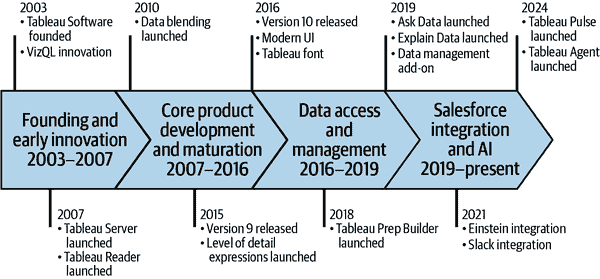

# 前言

当我决定写这本书时，我想给你一个机会了解 Tableau 的历史。我还想给你一个关于人工智能（AI）的基础和了解。最后，我想探讨这种新技术的影响，不仅是在分析领域，也在世界范围内。我在这些决定中的目标是确保我们在整本书中保持一致，使用相同的语言，并在早期就解决一些重要问题，以免被忽视。我常常发现在我们这个职业中，不说话会导致困惑或重要讨论的拖延，所以让我们开始吧。

# Tableau 简史

Tableau 成立于 2003 年，作为斯坦福研究项目和论文的副产品。该软件背后的关键创新是 VizQL，一种视觉查询语言，允许与数据打交道的人将数据集中的字段拖放到画布上以查询和回答问题。这是一个非常直观的系统，因为所有深入的编码和数据操作都是在 VizQL 引擎中完成的，而拖放的人会直接以图表和图形的形式获得直观的视觉反馈。我第一次接触这项技术是在 2015 年左右，到目前为止，我还没有看到比这更直观的方式来分析和处理数据。

在 2007 年，该软件扩展到包括 Tableau Server——一种向真正的受众成员和最终用户（而不仅仅是创建图表的人）托管和发布可视化内容的方式——以及 Tableau Reader，这是一个免费应用程序，允许任何人访问和本地打开称为*工作簿*的 Tableau 文件。这一改进为现代分析中的一大重要部分铺平了道路，即*自助分析*的概念。随着这两款产品的加入，现在有人可以构建图表并与任何希望将数据作为决策或理解辅助工具的人分享。寻求数据分析师解答数据相关问题的责任和周期现在转移回最终用户，目标是让他们更有能力，能够自己解答问题，探索数据，并更深入地了解它。

从 2007 年到 2016 年，Tableau 持续改进其核心产品 Tableau Desktop。当时最强大的创新之一是包含连接到无数数据库和数据源的功能。使用该工具的数据专业人士可以连接到包含手工构建的预算数字的 Microsoft Excel 电子表格，也可以连接到包含交易数据的更大数据库。时至今日，Tableau 在数据工具领域仍然独一无二，因为它采取了我喜欢称之为 *数据无关* 的方法。大多数商业智能（BI）工具依赖于连接到特定数据源（如微软的遗留 SSRS 和 SSAS）的应用程序堆栈中，某种意义上使可视化分析组件成为流程的最后一步。Tableau 通过直接使用数据，无论其位置如何，颠覆了这种范式，旨在使数据分析师的工作更加容易：更容易访问数据、分析数据、理解数据以及传播数据。

除去在数据连接性方面的持续改进，Tableau 在版本 9 中增加了构建 *细节级别*（*LOD*）*表达式*的功能。这使得 Tableau 可视化创作者能够为图表中表示的聚合和字段定义独特的聚合计算。在我开始使用 Tableau 之前，这个功能刚刚发布，因此我对这一改进的可行性和影响有着非常深刻的认识。突然之间，可以在同一个图表中执行深度复杂的查询和比较。当时，我是一名医疗保健分析师，我记得我对如何现在能够在同一个图表中展示放大后的数据，比如最佳表现提供者与州、地区和国家平均水平的对比感到非常惊讶。

大约也是在这个时候（2016 年），Tableau 发布了版本 10。它引入了现代用户界面、定制的 Tableau 字体，以及通过联合和更重要的是通过连接，将不同数据库中的表关联起来的能力。突然之间，作为一名分析师，你可以更容易地丰富那些分散的数据。现在，无需数据仓库或单一数据源，就可以将来自多个系统的信息结合起来（对于坚定的 Tableau 用户来说，数据混合自 2010 年以来就已经可用，但功能极为有限）。我作为分析师提出的请求从要求 IT 构建数据集转变为要求直接访问数据库。访问原始数据的不可思议的力量令人兴奋。作为一名分析师，这种访问让我对业务中使用的应用程序有了更好的理解：我现在可以了解它们是如何真正组织的，以及真正存在哪些数据。它填补了许多关于某些类型的分析是否可能的空白。

从这个时期到 2019 年底，Tableau 开始解决两个新的问题：数据访问、存储和管理；以及超越可视化图表和仪表板的分析工具。这一转变是一个重要的里程碑，默默地标志着其可视化分析产品现在已经相当成熟，并且现在有空间扩展到企业分析的其他领域。

在数据访问、存储和管理方面，Tableau 推出了 Prep Builder（其数据准备工具）、一种新的专有数据存储格式（Hyper）以及最终的数据目录。所有这些创新都极大地提高了数据分析团队使用数据的 生活质量。团队现在得到了合法的数据准备工具，在查询和清洗能力上与 SQL 相媲美，同时拥有 Tableau 以直观和可视化界面而闻名的界面。Hyper，Tableau 数据提取的名称，允许底层数据集更大，行和列都更多。所有仪表板上的分析操作都变得更快。数据在仪表板下开始变得不那么聚合，允许在宏观（管理层）和微观（数据分析师）层面同时进行分析，所有这些都在同一个空间内进行。现在更容易指出导致月度趋势线的数据的确切记录。数据目录的添加有助于将 Tableau Server 正式定位为企业级 BI 平台——标志着 Tableau 从被归类为漂亮的仪表板工具转变为更完整的 BI 解决方案。

正如我之前提到的，也是在那个时候，Tableau 开始着手于两个与可视化分析无关的创新：

询问数据

一个自然语言查询工具（于 2019 年发布）

解释数据

一个统计分析工具，当用户创建图表时，会呈现有趣的统计事实

现在回顾起来，这些创新是人工智能的先兆，但当时很难以这种方式看待。Ask Data 的引入给数据从业者带来了很多焦虑。在此之前，他们能够控制并检查最终用户对仪表板提出的任何问题都会呈现事实准确答案。但是，当语言解释引擎向对数据分析不太熟悉的人吐出数字时，很难信任。

使用“解释数据”，呈现的统计数字可能有趣也可能无趣，对于数据产品的创建者来说，这些信息感觉是重复的。对于仪表板消费者来说，感觉“解释数据”会像“询问数据”一样，引入可能或可能不具有重大意义的（尽管在统计和事实上准确）事实。两者都推动了自助分析向最终用户的转变。然而，它们也引发了数据专业人士通过高度发展和迭代的仪表板建立起来的信任的侵蚀。

从 2019 年底开始，我称之为“Salesforce 时代”——也许是对泰勒·斯威夫特的致敬，但更多的是对自 2019 年下半年 Salesforce 收购其母公司 Salesforce 以来 Tableau 所关注的一切的解释。从那时起，Salesforce 和 Tableau 几乎完全专注于 Salesforce 和 Tableau 技术和产品的集成。在数据分析方面，这意味着 Salesforce 的 Einstein（一种主要基于预测和评分的分析技术）的集成，允许在 Tableau Desktop 和 Prep Builder 中进行更高级的分析。同时，也改进了连接 Salesforce 数据源以及在客户关系管理（CRM）应用中嵌入 Tableau 可视化的功能。最后，分析扩展到了 CRM 和 Tableau Server/Cloud 之外，进入了 Salesforce 在 2020 年 12 月收购的通讯平台 Slack。Einstein 集成和向 Slack 的外部通信于 2021 年发布。基于图表的文本洞察（数据故事）于 2022 年发布。图 P-1 展示了这些创新的时序图。

###### 图 P-1\. Tableau 主要创新的时序图

回顾这一历史课程，很容易看出 Tableau 始终将自己定位在其“帮助人们看到和理解数据”的使命的最前沿。Tableau 不仅扩展了获取数据和用户友好工具的含义，还引入了更多功能，降低了进入数据驱动工作场所的门槛。

# 介绍 Tableau Pulse 和 Tableau Agent

现在我们已经来到了当前的时间点，以及本书核心技术的发布：Tableau Pulse 和 Tableau Agent（之前称为 Einstein Copilot）。

## Tableau Pulse

*Tableau Pulse* 是 Tableau 产品线中的一个全新的界面和组件。截至本文撰写时，Pulse 仅存在于 Tableau Cloud 中，这是 Tableau 的软件即服务（SaaS）产品。在这个界面中，可以构建重要的业务度量指标，称为 *关键绩效指标*（KPIs），并在单独的区域为最终用户提供服务，就像在社交媒体平台上关注某人一样。Pulse 包含一个度量层，数据专业人士在这里整理不同的度量并为其下定义。度量以简单和统一的图表形式提供，并附有 AI 生成的摘要，称为洞察摘要。最终用户可以订阅以接收包括这些摘要在内的电子邮件或 Slack 通信，以特定的频率。他们还可以通过 Tableau 移动应用程序访问他们关注的度量，这是在移动设备上可用的 Tableau Server/Cloud 的简化版本，或在浏览器中访问。在这个网络体验中，他们可以访问简单的过滤器并以对话方式提问，从而扩展他们与 KPIs 互动的能力。

第二章更详细地介绍了 Pulse，包括如何入门以及如何使用它。你还将看到基于行业用例的实践示例，这些示例在第五章中展示。

## Tableau Agent

*Tableau Agent* 是一个位于 Tableau Cloud 产品内部的 AI 助手。其目的是帮助数据专业人士更快地分析数据和构建图表。Tableau Agent 通过启动用户可能想要对其数据提出的关键问题来实现速度提升。它还提供图表创建和计算支持。从理论上（和实践上）来看，Tableau Agent 可以帮助您更快地熟悉数据集并通过对话创建图表。所有这些旨在将 Tableau 平台的迭代和反馈驱动特性变得更加快速，以便数据工作者能够更快地查找、处理和共享有影响力的信息。

第七章讨论了 Tableau Agent，展示了其功能，并为您提供了最佳实践。最后，第八章讨论了一些我认为这项技术可以扩展并支持您工作的方式。

第一章首先帮助您了解这些工具背后的技术，从而开始探讨如何、为什么以及何时使用这些技术。这也是您开始了解在实施和大规模共享这些创新之前必须承认的风险和考虑因素的地方。

# 本书使用的约定

本书使用了以下排版约定：

*斜体*

指示新术语、URL、电子邮件地址、文件名和文件扩展名。

`常宽字体`

用于程序列表，以及段落中引用程序元素，如变量或函数名称、数据库、数据类型、环境变量、语句和关键字。

**`常宽粗体`**

显示用户应直接输入的命令或其他文本。

###### 提示

此元素表示提示或建议。

###### 备注

此元素表示一般性备注。

###### 警告

此元素表示警告或注意。

# O’Reilly 在线学习

###### 备注

超过 40 年来，[*O’Reilly Media*](https://oreilly.com)一直为科技公司提供技术和商业培训、知识和洞察力，以帮助公司取得成功。

我们独特的专家和创新者网络通过书籍、文章和我们的在线学习平台分享他们的知识和专长。O’Reilly 的在线学习平台为您提供按需访问实时培训课程、深入的学习路径、交互式编码环境以及来自 O’Reilly 和 200 多家其他出版商的大量文本和视频。更多信息，请访问[*https://oreilly.com*](https://oreilly.com)。

# 如何联系我们

请将有关此书的评论和问题寄给出版社：

+   O’Reilly Media, Inc.

+   1005 Gravenstein Highway North

+   Sebastopol, CA 95472

+   800-889-8969（美国或加拿大）

+   707-827-7019（国际或本地）

+   707-829-0104（传真）

+   *support@oreilly.com*

+   [*https://oreilly.com/about/contact.html*](https://oreilly.com/about/contact.html)

我们为这本书有一个网页，其中列出了勘误表、示例和任何其他信息。您可以通过[*https://oreil.ly/learning-ai-tools-in-tableau-1e*](https://oreil.ly/learning-ai-tools-in-tableau-1e)访问此页面。

想了解我们书籍和课程的新闻和信息，请访问[*https://oreilly.com*](https://oreilly.com)。

在 LinkedIn 上找到我们：[*https://linkedin.com/company/oreilly-media*](https://linkedin.com/company/oreilly-media)

在 YouTube 上关注我们：[*https://youtube.com/oreillymedia*](https://youtube.com/oreillymedia)

# 致谢

我要感谢我的丈夫和生命伴侣，乔什·杰克逊。多年来，很多事情都发生了变化，但有一件事始终如一：你无条件的爱和支持。谁知道两个在物理聊天室里的孩子能共同创造如此美好的生活呢？

向我的家人和朋友们，感谢你们在整个书写过程中对我的耐心和理解。我很高兴从我的写作洞穴中走出来，重新开始更多的桌游之夜，以及更及时地回复你们的短信。Wordle 天才们，你们对我们群聊的每日投入，让我在过去的两个月写作中保持了理智。

向我的技术编辑，洛娜·布朗、贾米·德莱格兰奇和乔什·杰克逊（是的，同一个人！）——感谢你们的反馈、评论和鼓励。我很感激有三个愿意从他们的生活中抽出时间来确保这个项目达到我那荒谬的高期望的人。

向我的数据小猫们表示感谢，感谢你们激励我，并和我一起踏上旅行冒险。我享受了我们共同度过的每一刻课堂之外的时间，并期待着访问丹佛（是的，再次在纽约市见到你们所有人）。

最后，我要向那些推动本书中介绍的技术进步的人工智能研究人员和创新者表示衷心的感谢。你们为我对技术和分析的热爱注入了新的活力。我期待着即将到来的许多变革。
