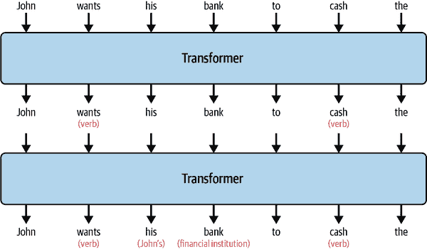

# 第一章\. Tableau 平台中的 AI

人工智能并不新鲜。它自著名的数学家艾伦·图灵在他的著名论文“计算机机械与智能”中首次提出“机器能思考吗？”的问题以来就已经存在。根据许多该领域学者和历史学家的说法，人工智能在 1956 年被正式确立为一个研究领域，用于研究、学习和创新。最初，我们可以想象，人工智能的目标是复制或模拟人类的智能和决策。这一点可能最好由计算机科学家约翰·麦卡锡提出，他创造了“人工智能”这个术语：“学习的每一个方面或任何其他智能特征都可以在原则上被精确描述，以至于可以制造出模拟它的机器。”许多人还会补充说，计算机可以（理论上现在实际上）处理复杂的操作——有时比人类能处理的更复杂（尤其是数学上的）。

从那时起，人工智能逐渐融入了我们生活的各个领域。在棋类游戏中被计算机击败的想法并不新鲜。事实上，现在人工智能在任何战略游戏中的位置都显得司空见惯和预期。最近和更广泛的应用包括推荐引擎，比如那些决定你在 Netflix 上接下来要看什么或是在 Amazon 上要买什么。像苹果的 Siri 这样的语音助手，可以将你的语音翻译成某种行动，也属于人工智能的范畴。还有像谷歌的 Waymo 这样的自动驾驶汽车，将*自动驾驶*这一概念，一个大约存在了 100 年的概念，推向了一个全新的范式。

人工智能的许多方面都依赖于计算机的能力。早期的计算机在所能承载的信息和知识方面有限。同样，即使它们能够接触到这些知识，访问、检索和提供这些信息的必要计算和处理能力也是巨大的。但在 2000 年代初，计算机硬件的创新步伐赶上了人工智能的需求。多处理器和多线程技术得到了广泛的应用，智能手机成为了我们日常生活中突出的设备，云计算也成为了新的常态。

# 分析学中的 AI

随着计算机硬件的进步变得更加显著，分析领域也开始看到自己的进步。特别是，这意味着数学分析方法的引入。**多元分析**在商业应用中变得更加普遍，因为更多的知识工作者可以依赖计算机来帮助进行复杂的数学计算。**预测分析**以及预测事物的方式从旧式的简单线性回归模型扩展到更加稳健和复杂的方法。分类方法，如（在 Tableau 中可用的）**k-means 聚类**成为可能。机器学习（ML），无论是**监督学习**，其中模型提供了输入和输出，还是**无监督学习**，其中模型被赋予自由以推导出自己的模式，都变得突出。现在，计算机可以给出大量数据，并在不同程度上从人类获得帮助和决策输入的情况下得出结论。

然后出现了**自然语言处理**（NLP）。如前言所述，Tableau 于 2018 年发布了 Ask Data，使用户能够提出问题并获得答案，但语音识别和转录工具在商业世界中已经存在了很长时间。**情感分析**——或对语言进行评分以确定其是正面、负面还是中性的过程——开始变得主流。Python 和 R 等计算机语言变得突出，数据科学实践和数据科学家的出现也在 2010 年代达到了高潮，同时“大数据”这一术语也应运而生。

2018 年也标志着 OpenAI 首次推出了**生成预训练转换器**（GPT）技术，这是一种**大型语言模型**（LLM），该公司很快因其著名的 ChatGPT 聊天机器人而闻名，该机器人能够与人类进行连贯和即兴对话，以及其生成式数字艺术工具 DALL-E。我在 2022 年接触到了这两种技术。我注册了 DALL-E 的早期邀请制测试版，并喜欢创作那些以前无法触及的数字艺术（如以萨尔瓦多·达利的风格融化的条形图，以及达斯·维达带着心水的水彩画风格将公主莉娅引向红毯的场景（见图 1-1））。AI 生成的十四行诗、诗歌、讽刺作品和刻板的商业通讯开始在我的工作场所作为新奇事物出现。我的当时老板开玩笑地发布了由 ChatGPT 创建的专业传记，其中包含了对他的高度赞扬，但也充斥着他从未获得的不准确赞誉和荣誉。生成式和创意 AI 正式到来。

###### 图 1-1\. 使用 DALL-E（左）和 MidJourney（右）生成的 AI 艺术

支撑 LLMs 和 GPTs 的技术和结构在 Tableau Pulse 和 Tableau Agent 中得到了充分的应用，这两者是本书的重点。两者都高度依赖于 LLMs。在 Pulse 中，LLM 用于总结洞察并以有意义的方式提供。使用 Tableau Agent，你可以根据在聊天框中的输入直接交互并获得结果。在我们这个领域，技术拥有这样的特权地位，因此，对于分析专业人士来说，尽可能多地了解 AI 技术的工作原理是非常重要的。当你在向最终用户提供信息，基于数据做出业务关键甚至生死攸关的决定时，将生成式 AI 称为不透明或神秘的技术是不可接受的。

# 生成式 AI 解释

要思考 LLMs 和 GPTs 如何工作，一个好的方法是首先将单词视为一组坐标，称为 *词向量*。类似于经纬度，想象每个单词都有一个复杂的坐标系统，决定了它在单词宇宙中的位置。与我们在物理世界中体验到的三维限制不同，单词宇宙中的每个单词都有非常多的维度（300+）。此外，每个单词可以根据其表示的内容在宇宙中多次表示。这种情况的良好例子是 *同音异义词*，即拼写相同但含义不同的单词，比如单词 *hide*，它可以指动物皮毛，也可以指将某物放置在看不见的地方。很容易想象这两个概念有两个独立的坐标，就像字典中至少有两个关于 *hide* 的定义一样。

LLMs 在大量的文本上训练，称为 *训练数据*，它们通过系统地为单词宇宙中的每个单词分配坐标。这些坐标与密切相关单词的自然邻近性，你可以进一步想象这些坐标可以随着接收到的每个新增文本段落而略微移动。最终，从数学的角度来看，这种回报是递减的——类似于微积分中的极限：当你接近无穷大时，单词的坐标最终会在单词宇宙中的某个最终位置稳定下来。

在单词的坐标旁边是 GPT 或转换器模型的处理过程。我倾向于用 *层* 来解释这个过程。这些层（例如，OpenAI 的 GPT-3 有 96 层）会处理接收到的文本输入，称为 *提示*，对提示中的单词进行分类，并最终试图理解它。所有这些都有点不透明，因为人类并没有指示模型在哪个层应该采取不同的行动。从观察到的结果来看，大多数模型首先通过理解句子的语法和每个单词的角色（名词/动词/形容词/代词）来开始。在最初的这些层完成之后，更多的上下文层会处理提示。我试图将这个过程想象成人类天生且毫不费力就能做到的事情。当你开始阅读一本书时，你会对单词有一个基础的了解，最终，一旦你读得足够多，你的大脑开始想象整个场景。图 1-2 展示了 LLM 可能如何通过转换器层处理一个简单的句子。

###### 图 1-2\. 一个示例，展示了如何处理一个句子

在处理提示之后，模型生成的核心是预测接下来应该发生什么。这也不像人类可能天生就会做的事情。如果有人问你最喜欢的冰淇淋口味是什么，至少你受限于你所知道的口味列表（可能的预测）。除了这个列表，你还依赖于自己对每种口味的个人体验，这最终会引导你得出一个答案。可能很难确定一个口味，或者你可能会在心理上对每种口味进行评分以得出结果。可能香草是你的“安全”口味，因为很难出错，但当你吃薄荷巧克力碎片时，你可能会体验到更多的愉悦和快乐。可能 Ben and Jerry 的 Cherry Garcia 是你的“罪恶的乐趣”，但不是每个冰淇淋店都有这个口味。根据问题的 *上下文* 不同，回答问题的方式也可能不同：是谁在问，你最近的冰淇淋体验，你在哪里，你渴望什么。模型通过依赖解释提示的上下文以及从训练数据中学到的知识来解决这个问题。重要的是要说明，模型的训练数据远远超出了任何一个人所知道的范畴，因此它通常对可能的答案有非常广泛的理解。

记住，整个通过理解和上下文处理提示语中的语法和句子结构的行为完全依赖于模型手头的信息。它能生成的预测来自它所接受的信息，这些信息是以人类书写的句子形式呈现的。所以，当我们把 LLMs 应用于像编码或分析这样的狭窄领域时，模型完全依赖于人类已经完成的工作。这并不是说在这个过程中没有原创的输出（我敢说思想）或创造力。事实上，我喜欢生成式 AI 用于创作艺术的原因之一是它不受实用性的限制。DALL-E 可能会生成包含额外一只手或拼写错误的美丽图像，因为预测模型已经决定输出“最佳结果”。一个人类艺术家永远不会画上额外的肢体，除非这是高度故意的，即使这样能更好地传达整体艺术作品背后的想法。

由于 LLMs 的工作方式，我们必须将它们的预测方法视为一把双刃剑。它可能受到文本中固有的人类偏差的污染，受到它所提供信息的限制，并可能预测出无意义或事实不准确的结果。它还可能提供与人类（或精心设计的算法）完成相同任务可能产生的答案或结果截然不同的答案。

# 与 AI 相关的风险和考虑因素

我想要讨论的三个主要风险和考虑因素是：

+   模型偏差

+   模型幻觉

+   工人失业

讨论这些问题很重要，因为它们不可避免地会在你组织将生成式 AI 工具纳入分析实践的过程中出现。提前了解这些问题，可以让你组织拥有做出负责任和明智决策所需的知识。

## 模型偏差

你已经了解到，模型可以根据其训练或访问的信息存在偏差。但模型也可以根据算法的设计存在偏差。一个相对容易理解的例子是，一个被调整过度依赖频繁出现或最近出现的信息的算法。当应用于“谁是最受欢迎的歌手？”这个问题时，结果可能是“泰勒·斯威夫特”，基于她最近的“时代”巡回演出和她的音乐被请求和播放的频率。但从一个更长的时间跨度来看，可能会出现不同的答案：“弗兰克·辛纳特拉”，他在 50 多年的职业生涯中发行了惊人的 59 张录音室专辑。你可以想象，当你直接将这个问题应用于数据或统计信息时，这个问题会变得多么复杂。查看趋势销售价值图表后，关于“什么导致了销售额的下降？”的问题（查看趋势销售价值图表后）可能会根据模型是否只考虑图表中观察到的数据点，还是可以访问整个销售历史而得出不同的答案。

用户交互是另一个棘手的部分，它自然会影响到模型产生的结果。如果模型知道你是电子部门的经理，或者你提出了很多倾向于电子的问题，它很可能会产生与电子更直接相关的输出。这可能会产生一个准确的答案，但可能不是例子问题“是什么导致了销售额的下降？”的最主要或最直接的根本原因。我经常在我的 ChatGPT 交互中看到这种情况，我会以列表的形式提出要求，然后它就难以跳出列表项的模式，即使我的后续请求并不适合用列表来最好地解决。ChatGPT 也倾向于使用与我提供的内容相似的语言或结构，这再次看起来合乎逻辑（我们人类往往倾向于采用周围人的相同词汇和风格），但这对获得无偏见的回答是起反作用的。

最后，还有社会偏见、刻板印象和代表性偏见需要应对。这些偏见可能通过模型重复最流行的偏见来出现，这些偏见已经渗透到人类知识的体系中。一个相对无害的例子是单词“护士”。当你读到这个词时，你脑海中护士的形象可能是一个女性。但你可以将这个行为扩展到更具有分析性的方向。例如，你寻求帮助创建一个预测销售表现的公式，模型默认推荐线性回归，因为它在分析中的流行。以无害的方式，模型可能只是提供了处理你的数据最常见的方法。然而，模型的回答也可能否定一个更合理和有理的方法，这个方法可能更适合处理你的数据，让你得到的可能不是最适合你情况的方法。

## 模型幻觉

*模型幻觉*是指模型返回一个不准确或不基于现实的结果。前面提到的给生成的人类形象图像添加额外肢体的情况，或者在新辩护中用作支持证据的虚假法律案例，或者生产看似有效的、完全虚构的数值事实，都是这样的例子。所有这些可能性都可以由模型生成，当任务是用基础支持数据作为证据来得出结论时，这些可能性尤其危险。这在数据分析中尤其如此，因为没有一个定义性的事实或数字可以准确地捕捉现实的微妙和复杂性。

当你要求 AI 解释它是如何得出答案的时候，你可以看到模型幻觉是如何发生的。由于整个模型是一个提供预测的透明技术，你可能会从人类那里收到的合理推理通常是不存在的。你还可以看到当它输出一个你知道是错误的答案，而你试图引导 AI 得出正确答案时，模型幻觉和局限性。展示了我与 ChatGPT 最近关于热门电视节目*Survivor*及其主持人用于挑战的短语的一次对话。在这个交流中，模型最初提供了一个事实错误答案，包括短语末尾的“guys”一词。只有当将模型重新引导以考虑更多信息，例如它在最近一季中进行了更新，它才会返回事实准确答案。这并不难想象，因为 Survivor 有 40 季，其中“guys”是短语的一部分，可能对模型产生更强烈的影响，而忽略了更近的历史。

![assets/lait_0103.png]

###### 图 1-3\. 与 ChatGPT 关于杰夫·普罗布斯特的讨论

由于幻觉现象往往在模糊的情况下更为突出——当问题本身可能不清楚、训练数据不足或需要外推时——保持怀疑态度至关重要。这些场景在数据分析领域很常见，其中理解洞察背后的推理是至关重要的。从历史上看，人类经验和直觉是克服这些挑战的关键——这是 AI 所缺乏的，这使得在没有更深入审查的情况下完全信任其结论变得更加困难。

## 工作岗位流失

AI 承载着取代从事工作的人类的承诺、危险和恐惧。在数据分析领域，有一种非常真实的感受，即如果最终用户可以直接与 AI 互动以获取他们需要的分析和洞察，那么数据分析专业人士的效用就会被取代。如果 AI 可以通过几个简单的文本命令来完成像构建图表、整理数据集或构建复杂查询这样的任务，那么考虑你的实际工作可能会令人恐惧。AI 的主要营销卖点之一是它将提高效率，但*提高效率*几乎总是意味着在这个过程中有人会被淘汰。

虽然 AI 夺取工作的前景可能看起来令人恐惧且不可避免，但这是数据专业人士必须大声呼吁并对其所做的工作充满信心的领域。数据分析的任务并没有改变。分析师的责任和目的始终是确保产生的分析是可以信赖的并且是有用的。如果有什么不同的话，当计算机开始无监督地工作时，这种目的变得更加必要。

随着这种转变，数据分析的任务可以并且将会发生变化。但请记住，新任务将带来新的工作和责任，就像我在前言中分享的故事一样，Tableau Desktop 连接到多个数据库的改进改变了我对独立数据集的需求，转而要求直接访问数据库。数据专业人士仍然负责管理分析、管理访问、管理产生的信息以及管理提供给受众的数据产品。在应用场景中，例如当 Tableau Agent 开始自动生成图表时，分析师仍然必须确保构建的图表是准确的。用于做出这种区分的学习人类技能和知识不会随着时间的推移而消失；它们变得更加关键。

最后，一种反向力量正在为人类谋福利。在数据分析中最常听到的观点之一是，有多少人*没有得到充分服务*。在收集的大量数据和工人的数据可用性和理解之间存在差距。因此，如果有什么的话，可以合理地认为，随着更容易访问的工具变得可用，数据分析的受众必然会增加。如果你像我一样是一个真正的狂热者，痴迷于民主化决策数据可用性，那么对更广泛的人群来说，成为这一实践的保护者是一个激动人心的时刻。

# 信任 AI

关于与 LLMs 和生成式 AI 相关的风险的讨论自然引出了 Tableau 和 Salesforce 如何处理信任和风险缓解的讨论。这些技术的信任主要仲裁者被称为*爱因斯坦信任层*。你可以将这一层视为介于你的企业数据和生成摘要并响应你的提示/查询的 LLM 模型（截至写作时，Tableau 使用 OpenAI 的 GPT-3.5 Turbo）之间的中介。展示了 Tableau Cloud、爱因斯坦信任层和 LLM 模型之间的关系。

![assets/lait_0104.png]

###### 图 1-4. Tableau Cloud、爱因斯坦信任层和 LLMs 之间的关系

爱因斯坦信任层的关键组件包括以下内容：

安全数据检索

访问控制和权限内置在 Tableau 平台中。这些控制由管理员和创建者管理，并规定谁可以访问数据源、仪表板和 Pulse 指标。在与 AI 交互的过程中，这些控制在生成响应或提供见解之前会进行检查和验证。

动态基础

LLMs（大型语言模型）被赋予了与您的业务相关的上下文。此外，当提供 Pulse 指标时，模板被用作提示响应的指南。这个过程包括对 LLM 模型非常明确的指示，不要猜测，使用中性语言，并处理它接收到的数值。它还提供了关于响应格式的明确指示，例如包含时间段比较。

数据遮蔽

为了消除传递受保护信息，如*个人身份信息*（PII）、敏感值或单词（例如客户的姓名），会进行*标记化*。在客户姓名的情况下，姓名不会发送到模型，而是使用替代标记或文本字符串。在提供结果时，该标记随后被转换回它所代表的 PII。

毒性检测

这是指对提示结果或生成的摘要进行评分，以识别有害信息的过程，包括表现出仇恨、暴力、身份或性内容的语言。每个响应都会被评分，如果它过于有毒，则不会返回给最终用户。

审计

创建并存储在 Salesforce 数据云中的审计跟踪与 LLM 处理的提示或信息相关。这包括启动提示的用户、提示正文（既遮蔽又未遮蔽）、是否在提示中找到 PII 的分类、毒性评分以及与用户收到的输出相关的任何用户反馈。

零保留

在提示解决后，提示本身将从系统中清除。这确保了 LLM 不会保留提示作为未来信息，它“学习”了影响下一个响应或整体模型。

###### 小贴士

在 Einstein Trust Layer 之外，所有数据在静止和传输过程中都进行了加密。Salesforce 使用 OpenAI 的 GPT 模型，并已签订协议，规定 OpenAI 将不会存储或保留任何输入到模型中的信息或提示。如果您对此非常好奇，所有这些服务都托管在亚马逊网络服务（AWS）上，AWS 在全球许多可用区域存在。对于更深入的了解或解释，请观看[这个 Salesforce 演示](https://oreil.ly/zExox)。

# 竞争对手和 AI

随着本章的结束，我想谈谈 Tableau 的竞争对手是如何想象和将 AI 整合到他们的商业智能（BI）平台中的。虽然确实有许多选项可供比较，但我选择专注于微软 Power BI（PBI）和谷歌 Looker。

## Power BI 中的 AI

Microsoft Power BI 具有三种不同的 AI 功能：

由 AI 辅助的高级分析

此功能包括为在 PBI 中工作且无需编码的人员提供的内置高级分析类型。值得注意的是异常检测，它扫描可视化或数据集中呈现的数据，并提供旨在发现任何异常的统计结果。两种高级数据探索选项以交互式图表的形式出现。一个是“关键影响因素”，这是一个由 AI 驱动的可视化，旨在找到主要驱动因素，另一个是分解树。*分解树*将指标分解为数据集中存在的（可能的）层次维度和类别。情感分析和预测也作为无代码解决方案提供。

分析创建的 AI 助手

与 Tableau Agent 非常相似，这是一个交互式 AI 聊天机器人，可以帮助开发者创建数据分析表达式（DAX）代码，这是一种公式表达式语言。在 Microsoft Office 产品中，如 Teams 和 SharePoint，也有这样的区域，可以自动在 PBI 中构建建议的起始可视化或分析问题。

自然语言查询（NLQ）

这几乎与“询问数据”或与 Tableau Pulse 交互的概念相同。在这里，用户可以提出问题，这些问题被转换成查询，并返回可视化和结果。需要注意的是，输入来自非技术业务用户。

## Looker 中的 AI

Google 列出的和即将推出的 AI 功能几乎与我之前描述的 Tableau 和 Power BI 的功能相同。值得注意的是，他们专注于以下方面：

Duet AI 助手

一种旨在帮助分析创建者制作可视化和访问数据的 AI 助手。值得注意的是，这包括将自然语言请求翻译成其专有查询语言 LookML 的方法。

AI 驱动的可视化

再次强调，这是为业务用户设计的科技，可以自动根据他们可访问的信息和数据创建可视化。

摘要见解

虽然关于如何或在哪里实施的具体细节不多，但这本质上与 Tableau Pulse 提供的洞察力摘要相似。

在讨论这些竞争对手时，值得注意的是作为引擎的 AI 模型。微软在 OpenAI 中拥有大量股份，并利用该公司的模型或其变体。另一方面，谷歌则依赖其自己的专有 LLM——即 Gemini（以前称为 Bard）。

# 摘要

在本章中，你了解了分析空间中的 AI。AI 在分析中的关键应用包括以下内容：

+   更复杂的分析方法，如预测性多元统计分析、情感分析（将文本评分为积极/消极/中性）

+   自然语言处理和查询（NLP 和 NLQ），允许用户用正常（人类）语言提问，并接收分析结果

+   生成式 AI，可总结信息并向最终用户展示有趣见解

+   使构建分析更简单的 AI 助手

为了帮助您理解本书中最新的人工智能工具，本章详细介绍了 LLMs 的工作原理：

+   它们消耗大量的文本，并在众多维度上对单词进行分类。

+   提示和文本输入在称为*transformers*的层中处理。这些模型倾向于首先解决句子结构，最终达到对输入的理解和上下文。

+   人类控制输入到模型中的训练数据以及处理该信息的指南。然而，LLM 内部发生的大部分事情都是未知的，并留给模型处理。

记住这一点很重要，即 LLMs 和生成式 AI 本质上是非常复杂的预测引擎。它们高度依赖于接收到的训练数据。输出受到 LLM 构建方式和所给指令的影响。此外，在处理生成式 AI 时，还有一些固有的风险需要注意：

模型偏差

LLM 可以从接收到的训练数据中内置偏差。该模型依赖于人类已经记录的信息。特别是，在社会问题（如多样性）方面可能存在偏差，并且用户的输入可能会对响应产生重大影响。

模型幻觉

一个 LLM 可能会以事实错误或虚构的结果回应。这种情况通常发生在模糊的情况或涉及外推的情况下——这两种情况在分析中都很常见。

工人替代

虽然考虑分析角色可能发生变化可能会引起担忧，但您所持有的分析技能的基石是确保 AI 得出的结果基于合理的分析推理所必需的。

Tableau 和 Salesforce 旨在通过 Einstein Trust Layer 创建信任，使用 AI 工具。这一层作为企业数据和 LLM 处理提示之间的中介。这个信任层的六个方面如下：

+   安全数据检索

+   动态扎根

+   数据掩码

+   毒性检测

+   审计

+   零保留

最后，Tableau 的两个主要竞争对手，Microsoft Power BI 和 Google Looker，在分析空间中 AI 的效用方面显示了共同的主题，即：在分析创建中的 AI 辅助、高级数学分析、总结洞察力和自然语言查询。

在第二章中，我将向您展示如何开始使用 Tableau Pulse。我会分解如何在您的 Tableau 环境中激活它，如何构建您的第一个指标，以及更多内容。到本章结束时，您将拥有信心和知识，开始部署自己的指标，以便业务用户开始跟踪。并且，凭借您在这里获得的 Tableau 和 LLMs 的知识，您将能够准确传达在 Tableau 中使用 AI 的角色和风险。
