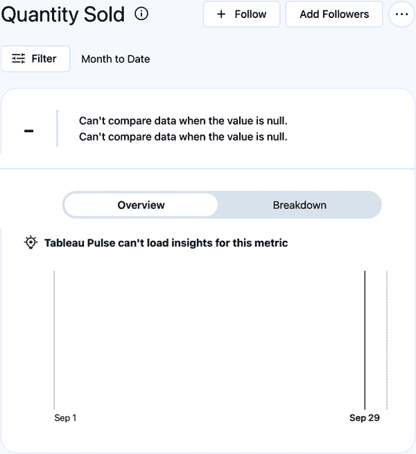
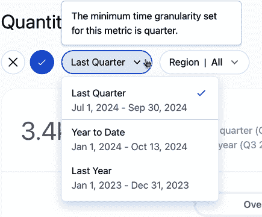
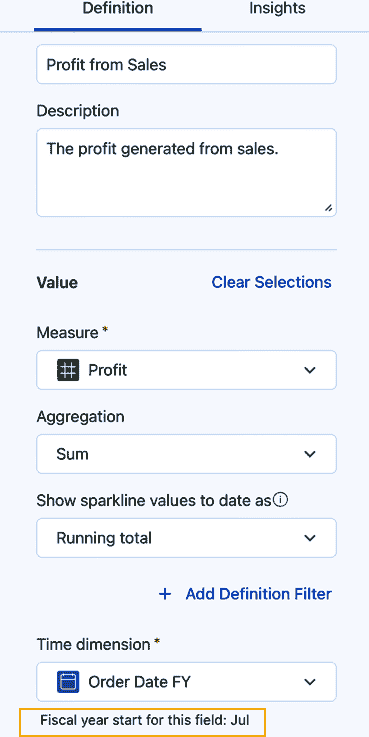
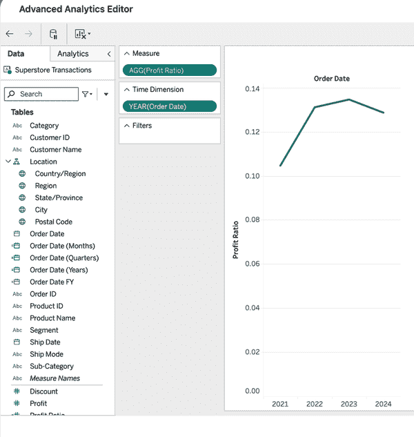
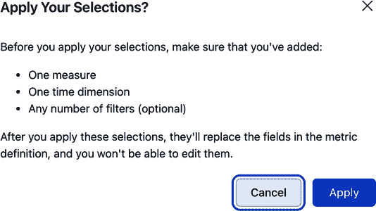
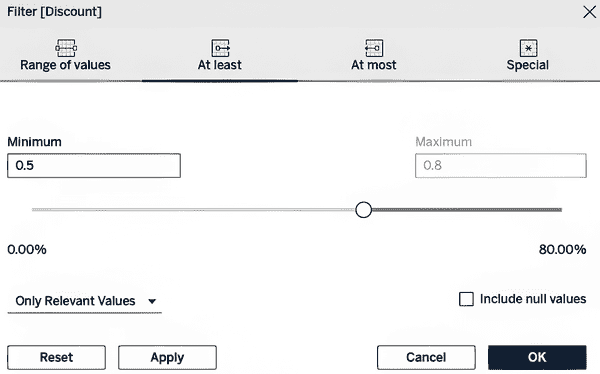
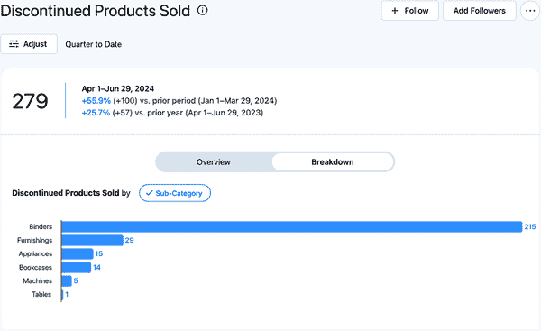
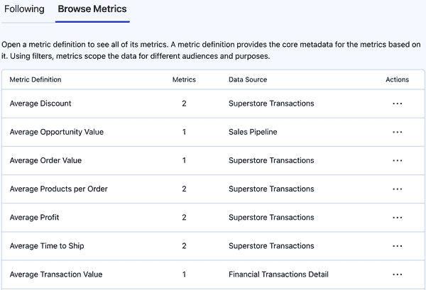
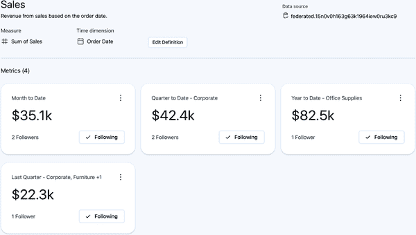

# 第三章\. 高级 Tableau Pulse 功能

现在您已经知道了如何启用 Tableau Pulse 并构建基本度量，是时候深入了解可用的更高级功能了。这些高级功能允许您，作为度量作者，使用定义过滤器创建更健壮的度量，调整时间维度，并使用计算字段或自定义过滤构建高级度量定义。您还将了解度量权限的工作方式以及如何管理它们。

# 定义过滤器

在上一章中，我简要描述了一个定义过滤器。**定义过滤器**是一种预设的数据过滤形式，它限制了哪些记录包含在度量定义中。这意味着对于从度量定义创建的每个后续度量，用于度量的数据范围和包含方式始终以相同的方式进行过滤。这种行为与可调整的度量过滤器明显不同，因为它们对最终用户不可见或不可访问（可调整）。

定义过滤器的一个良好用例可能是在您无法更改或引入用于后续度量的已发布数据源中的过滤器时。这可能是因为管理、创建或维护已发布数据源不是您的责任。这也可能仅仅意味着为整个已发布数据源引入这些过滤器会过度限制并缩小分析范围。无论原因如何，当每个下游度量都依赖于相同的过滤数据时，定义过滤器是您在度量定义中想要使用的中间过滤方式。

## 定义过滤器的应用

定义过滤器是在您之前看到的相同度量定义菜单中应用的。在为度量定义选择的度量下面，您将看到一个添加定义过滤器的按钮。下拉菜单中仅提供基于文本（字符串）的字段可供选择。让我们通过一个例子来演示，这个例子使用了与第二章中相同的已发布数据源（请参阅图 2-8 中的 Superstore Transactions）。

这次，您将构建一个名为 US Orders 的度量，它将关联到运往美国的订单的唯一订单 ID 计数。数据集包括一个名为 Country/Region 的字段，有两个值：United States 和 Canada。您将设置定义过滤器为 United States。图 3-1 显示了度量配置并突出显示了添加定义过滤器按钮的位置。

###### 图 3-1\. US Orders 的度量定义

点击“添加定义过滤器”会打开一个下拉菜单，你可以从中选择适当的字段，即国家/地区。会出现一个窗口，你可以设置过滤器的行为。过滤器可以设置为在多选格式中包含或排除值，并且对于具有许多值的字段也有搜索功能。图 3-2 显示了该字段的选项。

###### 图 3-2. 国家/地区的定义过滤器

正如你所期望的，现在指标定义中的所有数据都是针对美国的。从这里，如果你想的话，可以应用另一个定义过滤器。当你这样做时，你会注意到国家/地区选项不再可用。这是因为每个字段的过滤行为只能配置一次（在章节的后面你将看到如何解决这个问题）。此外，这些过滤器会立即应用并考虑任何后续的定义过滤。例如，在选择了美国之后，应用一个针对州/省的过滤器将只包括美国各州的名字。

###### 小贴士

应用过滤器的一个最佳实践是从最宽泛的过滤器开始，即能够从你的数据中减少最多行的过滤器，然后逐步细化到最窄的过滤器。在整个 Tableau 平台上，过滤器通常以垂直列表的形式展示，因此保持这种做法可以让你在数据过度过滤或尝试确保只包含相关数据于分析中时更容易进行调试。

好消息是，这个定义过滤器的应用适用于基于此指标定义的所有子指标。这节省了大量工作并确保了指标之间的一致性。

## 与可调整指标过滤器的关系

虽然定义过滤器在幕后工作，但这并不意味着那些过滤器中使用的字段不能也被用作面向最终用户的可调整指标过滤器。记住，可调整指标过滤器是一个交互式过滤器，最终用户可以通过它来过滤和限制指标中显示的数据。这里的区别在于，只有那些包含在定义过滤器中的值才会列在随后的可调整指标过滤器中。所以，例如，如果你为指标定义包含了一个针对国家/地区的可调整过滤器，就像之前的例子中那样，你的最终用户将只会看到“美国”作为交互式过滤的选项。

# 时间维度

第二章介绍了时间维度，这是用于日期轴和趋势的字段。Tableau Pulse 也使用时间维度来计算不同的比较周期。Tableau Pulse 支持日期的*粒度*（时间单位）包括天、周、月、季度和年。它还支持使用与默认公历不同的起始日期的财政日历。请记住，必须存在于已发布的数据源中的字段才能被选中作为时间维度——因此，可以对已发布的数据源进行修改以探索此功能。

如果你正在跟随，请对已发布的数据源 Superstore Transactions 进行以下更新：

1.  通过右键单击订单日期并创建一个使用月份作为细节和日期值（见图 3-3）的自定义日期字段来创建一个名为订单日期（月份）的字段。

    

    ###### 图 3-3\. 创建自定义日期窗口

1.  使用与上一步相同的操作创建一个名为订单日期（季度）的字段，但这次选择季度作为细节。

1.  创建一个名为订单日期（年份）的字段，将年份设置为细节。

1.  右键单击订单日期并选择复制；将字段重命名为订单日期 FY。

1.  通过右键单击订单日期 FY 并选择默认属性 > 财政年度开始 > 七月（见图 3-4）来设置订单日期 FY 字段的财政年度开始为七月。

    

    ###### 图 3-4\. 设置字段的财政年度开始

1.  将更新后的数据源发布到 Tableau Cloud。

现在有四种新的订单日期变体可供使用：前三个变体指定日期的粒度到更大的时间单位（月份、季度、年份），还有一个财政年度从七月开始的变体。让我们通过其中一个日期的例子来全面探索 Pulse 功能。

## 探索时间粒度

当你为月份、季度和年份创建自定义日期时，幕后 Tableau 将日期截断到你设置的特定性。另一种思考方式是，它将日期四舍五入到你指定的最近的时间单位。表 3-1 显示了 Tableau 如何转换 2024 年 6 月 15 日（06/15/2024）的日期。

表 3-1\. 基于指定细节的日期转换

| 日期 | 新的日期粒度 | 转换 |
| --- | --- | --- |
| 06/15/2024 | 月份 | 06/01/2024 |
| 06/15/2024 | 季度 | 04/01/2024 |
| 06/15/2024 | 年份 | 01/01/2024 |

你现在可以使用这些新的日期字段之一创建一个度量；你可以使用季度版本并查看会发生什么。

这次，通过设置以下内容来使用订单日期（季度）构建销售数量的度量：

+   *度量*: 数量

+   *聚合*：求和

+   *显示到日期的 sparkline 值为*：非累积

+   *时间维度*：订单日期（季度）

+   *可调整的度量过滤器*：区域

您可以将其他所有设置保留为默认值，然后保存定义。图 3-5 展示了从定义完成的度量。

结果度量看起来并不太有用。相反，它完全为空，没有任何度量摘要或可视化。扫描度量开始揭示其背后的原因。选择的时间维度是季度级别，因此 Pulse 使用的日期的唯一可能值是 1 月 1 日、4 月 1 日、7 月 1 日或 10 月 1 日。此外，度量标识它为 6 月份的月至今（位于过滤器按钮旁边），可视化日期轴从 9 月 1 日到 9 月 29 日。这解释了为什么度量是空的。没有 9 月份的日期可以使用。

###### 图 3-5\. 新创建的已售数量度量

## 设置最小时间粒度

当您遇到这种情况时，您可以在定义菜单的“高级时间设置”部分使用“最小时间粒度”功能。此功能允许您设置线图数据点将显示的最小粒度级别；选项有日、周、月、季度和年。一旦设置，从定义创建的任何度量都将遵循此行为，并且用户将无法选择比指定粒度更细的时间范围。图 3-6 展示了应用默认时间粒度为季度如何影响已售数量度量。注意，选择不同时间段的下拉选项已减少到只有那些对季度粒度日期有意义的选项。同样，当鼠标悬停在下拉菜单上时，会有一个提示让用户知道已设置此限制。

###### 图 3-6\. 指定最小时间粒度后的已售数量度量时间范围选项

在这个度量示例中，您可以选择选择较粗粒度的日期字段，但在现实中您可能没有这样的选择。因此，了解默认的时间粒度行为以及指定最小时间粒度如何影响度量是很重要的。当将最小粒度设置为默认的日时，Pulse 中每个时间范围使用的时间轴总结在表 3-2 中，以及每个比较期的计算方式。每当创建新的度量定义时，月至今都是默认的时间范围。

表 3-2\. Pulse 中可用的时间范围、日期轴单位和比较期

| 时间范围 | 日期轴单位 | 前期 | 前年 |
| --- | --- | --- | --- |
| 今天 | 天 | 使用昨天计算出的值 | 与前年同一天计算出的值 |
| 昨天 | 天数 | 使用前天计算出的值 | 从上一年同一天计算出的值 |
| 截止到本周 | 天数 | 使用上周计算出的值 | 使用上一年相同周计算出的值 |
| 上周 | 周数 | 使用上周之前的一周计算出的值 | 使用上一年相同周计算出的值 |
| 截止到本月（默认时间范围） | 天数 | 使用当前月之前相同天数直接计算出的值 | 使用上一年同月相同天数计算出的值 |
| 上个月 | 月份 | 使用上个月之前的月份计算出的值 | 使用上一年相同月份计算出的值 |
| 截止到本季度 | 周数 | 使用当前季度之前相同天数直接计算出的值 | 使用上一年同季度相同天数计算出的值 |
| 上一个季度 | 季度 | 使用上一个季度之前的一个季度计算出的值 | 使用上一年相同季度计算出的值 |
| 截止到本年 | 月份 | 使用上一年相同天数计算出的值 | 无比较（与前期相同） |
| 上一年 | 年份 | 上一年之前的年份计算出的值 | 无比较（与前期相同） |

从表中，你可以看到许多这些时间范围使用天数来显示指标，因此可以安全地说，如果你的时间维度是按日粒度，你将从 Pulse 中获得最大的好处。

###### 备注

Tableau Pulse 最近引入了指定指标允许的最小日期粒度的功能。然而，你的作者仍然认为坚持使用天数将提供最大的灵活性。

## 使用财政日历

Tableau Pulse 还支持使用财政日历日期作为时间维度。如前所述，*财政日历*的起始日期与公历（1 月 1 日开始）不同。你已经设置了复制的订单日期字段“订单日期 FY”的财政开始时间为 7 月，现在是时候看到它在实际中的应用了。

按以下方式构建名为“利润”的指标：

+   *度量*：利润

+   *聚合*：求和

+   *显示到日期为止的 sparkline 值*：累计总额

+   *时间维度*：订单日期 FY

+   *可调整的指标过滤器*：类别

你会注意到，在时间维度框下方，一条新消息指出该字段的财政年度开始时间是 7 月，如图 3-7 所示。

###### 图 3-7\. 为所选时间维度突出显示的财政年度开始

Tableau Pulse 现在将使用这些信息来构建时间范围和比较期。它还在摘要和时间范围选项中包含单词*财政*。时间范围的范围和大小不会因使用时间维度而改变，日期轴和时间单位也是如此。只有期间名称，例如从“到目前财政季度”改为“季度到目前”，会进行修改。图 3-8 显示了设置为“最近财政季度”时的指标。

###### 图 3-8\. 使用以 7 月为起点的财政日历的时间维度的指标（[在线查看更大版本](https://oreil.ly/lait0308)）

## 日期偏移

您可以调整与时间维度相关的一个最后设置，即从今天起的日期偏移。如果构建指标的底层数据今天不可用，这可能会非常有用。如果今天的数据处于变动中，将其包含在指标中可能会产生误导性的见解，这也会很有用。此设置通过在指标定义下的“时间维度”下拉菜单中点击“高级时间设置”来访问。点击此按钮将打开一个输入框，您可以在其中输入从 0 到 365 天的正整数作为偏移量。此偏移量适用于财政和默认时间维度。图 3-9 显示了前一个示例中指标的输入框。当指定偏移量时，指标将不再包括偏移量中包含的天数。从功能上讲，这意味着当您选择“月到目前”、“季度到目前”或“年到目前”的时间范围时，每个选择的结束日期将是今天减去偏移天数。

###### 图 3-9\. 时间维度的日期偏移框

# 高级指标定义

到目前为止，您一直依赖于已发布数据源中的现有字段来构建 Pulse 指标。但如果您需要创建一个依赖于数据中两个度量计算的指标怎么办？如果您需要一个比多选列表更健壮的定义过滤器，或者您只是更喜欢在 Tableau 可视化创作体验中使用的电子表格编辑器界面，又会怎样？在这些情况下，使用高级指标定义功能将是必要的。“高级指标定义”功能为您提供了拖放字段到画布上的编辑器界面。此外，您还可以访问大多数您在典型创作体验中熟悉的功能（如创建区间、集合和计算字段）。当您选择使用此功能时，它将替换指标定义中的字段。

###### 小贴士

当使用高级度量定义功能时，您将指定度量定义的所有三个组成部分：度量、时间维度和定义过滤器（可选）。

## 计算字段作为度量

很容易想象，您可能需要根据现有数据集中的其他字段创建一个新字段。通常，像比率、归一化或逻辑语句这样的转换计算可以为您的数据添加更深层次和更有影响力的分析和洞察。这些字段很可能不会在您的数据源中预先计算（尤其是如果您直接连接到源系统）。在这里，您有选择方法：在发布的数据源中构建计算字段，然后在度量定义中选择它作为度量，或者使用高级度量定义功能来计算字段。让我们来看看后者。

使用相同的发布数据源，Superstore Transactions，您将构建一个名为利润比率的新的字段。图 3-10 显示了当您在定义菜单的“与...比较”部分下方选择高级度量定义时弹出的高级分析编辑器。

这里您可以看到熟悉的电子表格编辑器，经过一些细微的修改。数据面板仍然位于左侧，用于访问数据源中的字段。然而，您不再有行货架和列货架，而是有一个度量货架和时间维度货架。仍然有一个过滤器货架，但标记卡完全缺失。此外，在这个编辑器中，您无法控制画布上显示的视觉化类型。

![assets/lait_0310.png]

###### 图 3-10\. 高级分析编辑器

要构建利润比率计算，右键单击利润度量，然后选择创建 > 计算字段，如图 图 3-11 所示。

此操作将显示一个计算编辑器，您可以在其中输入以下计算：`**SUM(Profit) / SUM(Sales)**`；将新字段命名为利润比率，如图 图 3-12 所示。

![assets/lait_0311.png]

###### 图 3-11\. 从利润字段创建计算字段

###### 图 3-12\. 利润比率的计算

这个新领域现在可以被拖动到度量板。接下来，将订单日期拖动到时间维度板。默认情况下，订单日期将显示为一个带有 `YEAR()` 函数的 *离散* 维度——从典型的可视化创作体验中继承的默认行为。在 Tableau 中，一个 *离散* 字段具有有限的可选字段值列表，并且通过字段的蓝色进行视觉表示。此外，离散字段在可视化中用作标题。这与显示为绿色并生成可视化轴的 *连续* 字段形成对比，展示了潜在值的无限可能性。`YEAR()` 函数返回与日期相关的四位数字年份。生成的可视化如图 图 3-13 所示。矛盾的是，当将应用于订单日期字段的操作传递回度量定义时，该行为被完全忽略。这意味着尽管在高级分析编辑器中的可视化显示了按订单日期年份计算的利润比率图表，但度量定义和随后的度量将按其自然的时间粒度（天）访问订单日期。

###### 图 3-13\. 使用计算字段的先进分析编辑器

当你点击应用以保存高级度量定义时，会弹出一个警告消息，提醒你必须指定一个度量和一个时间维度，以便定义有效，如图 图 3-14 所示。如果你的高级定义缺少任何必需的组件，你将无法退出编辑器屏幕，并且会在顶部显示一个红色的错误消息。

图 3-15 展示了编辑器中的选择如何映射到度量定义中的部分。当为度量选择一个计算字段时，为 *到目前* 选项指定运行总计折线图的选项不再可用，而是始终显示为非累积的。

###### 图 3-14\. 应用高级度量定义时的警告消息

###### 图 3-15\. 从在高级分析编辑器中构建的先进度量定义生成的度量定义

## 自定义定义过滤器

Tableau 我最喜欢的功能之一是能够以多种方式过滤数据。正如你在这章前面看到的，文本字段可以通过多选包含或排除列表作为定义过滤器使用。然而，任何字段类型的离散维度也可以使用通配符条件进行过滤，这是一个依赖于聚合字段或公式的值的条件，以及依赖于聚合字段或公式的值进行排序的条件。所有这些额外的过滤类型只能通过高级分析编辑器作为定义过滤器应用。编辑器也是唯一你可以基于度量值应用定义过滤器的地方。

假设你收到一个请求构建一个显示售出的佳能打印机、复印机、扫描仪和传真机数量的指标。你可能考虑以传统方式基于产品名称字段构建多选定义过滤器，但这有限制。首先，有几个值，在一个大列表中很容易漏掉一个。其次，新产品经常被添加到库存中。如果你使用典型的多选列表，新值不会自动添加到过滤器中。相反，你将不得不持续维护定义过滤器，以确保所有过去和未来的产品都包含在过滤器中。构建基于产品名称的通配符过滤器会更好。为此，在新指标定义窗口中点击创建高级定义按钮。然后执行以下操作：

+   将数量拖动到度量面板上。

+   将订单日期拖动到时间维度面板上。

+   将产品名称拖动到过滤器面板上。

一旦将产品名称拖动到过滤器面板上，完整的过滤器配置窗口将出现，如图 3-16 所示。点击旁边的箭头以折叠多选列表功能，然后点击旁边的箭头以展开选项。从这里，在“匹配值”框中输入“`**Canon**`”，并将比较设置为包含。这将使指标仅计算包含名称*Canon*的产品的数量。或者，如果你想要强制产品名称的第一个单词是*Canon*，你可以选择“以...开头”。

###### 图 3-16\. 构建自定义通配符定义过滤器

为了进一步提高这个指标，你可以在定义中添加产品名称作为一个可调整的过滤器。当从这个定义构建指标时，最终用户可以从可用的佳能产品下拉列表中选择，并在细分中查看它们。图 3-17 显示了新创建的指标和按年至今的细分。

###### 图 3-17\. 应用自定义定义过滤器后显示的细分指标（查看此图的更大版本[在线](https://oreil.ly/lait0317)）

将"Now let’s go through an example where the metric has a definition filter based on a measure. This type of filtering is useful anytime you want to isolate data used in a Pulse metric based on a numerical value."翻译为：“现在让我们通过一个例子来了解，当指标有一个基于度量的定义过滤器时。这种类型的筛选在您想要根据数值值隔离用于脉搏指标的任何数据时非常有用。”

将“Continuing with Superstore Transactions, you can construct a metric showing the number of items sold where the Discount value was at least 50%. At Superstore, any sale with a discount of 50% or greater represents discontinued products. The department buyers like to track these transactions to minimize the amount of unpopular products stocked. To do this, click the Create Advanced Definition button in a new metric definition window. Then do the following:”翻译为：“继续使用“超市交易”，您可以构建一个指标，显示折扣值至少为 50%的已售出项目数量。在超市，任何折扣为 50%或更高的销售代表停售产品。部门买家喜欢跟踪这些交易，以最小化库存中不受欢迎的产品数量。为此，在新指标定义窗口中单击“创建高级定义”按钮。然后执行以下操作：”

+   将“Drag Quantity to the Measure shelf.”翻译为：“将“数量”拖动到“度量”架子上。”

+   将“Drag Order Date to the Time Dimension shelf.”翻译为：“将“订单日期”拖动到“时间维度”架子上。”

+   将“Drag Discount to the Filters shelf.”翻译为：“将“折扣”拖动到“过滤器”架子上。”

将“Once you drag Discount to the Filters shelf, a menu will pop up (Figure 3-18). Since this is a numerical filter, you’re given the option to filter by the individual values that exist in the Discount field (“All values”), or you can filter by a specified aggregation. Additionally, because you want to filter individual rows of data that have a discount value of at least 50%, select “All values.” An additional box will display (Figure 3-19) that allows you to specify the way the data is limited. Here choosing the “At least” option and setting the minimum to 0.5 (50%) makes the most sense.”翻译为：“一旦将“折扣”拖动到“过滤器”架子上，就会弹出一个菜单(图 3-18)。由于这是一个数值过滤器，您可以选择按“折扣”字段中存在的单个值进行筛选（“所有值”），或者可以按指定的聚合进行筛选。另外，因为您想要筛选折扣值至少为 50%的单独数据行，请选择“所有值”。将显示一个额外的框(图 3-19)，允许您指定数据的限制方式。在这里选择“至少”选项并将最小值设置为 0.5（50%）最有意义。”

将“”翻译为：“”

###### 将“Figure 3-18\. Filter menu specifying how a measure is to be filtered”翻译为：“图 3-18\. 指定如何筛选度量的过滤器菜单”

将“As a last step, include Sub-Category as an adjustable filter. Remember, the department buyers are on the lookout for products that aren’t sold until they are discontinued, so including the Sub-Category will help them identify if one particular type of product isn’t very popular. Figure 3-20 shows the completed metric set to Quarter to Date with Breakdown; it appears that many Binders have been discontinued and sold.”翻译为：“作为最后一步，将“子类别”包括为可调整的过滤器。记住，部门买家正在寻找那些直到停售才出售的产品，因此包括“子类别”将帮助他们确定某种特定类型的产品是否不太受欢迎。图 3-20 显示了设置为“截至本季度”并带有细分的完成指标；看起来许多活页夹已经停售并出售。”

将“”翻译为：“”

###### 将“Figure 3-19\. Filter menu specifying the minimum Discount value to be included”翻译为：“图 3-19\. 指定要包含的最小折扣值过滤器菜单”

将“”翻译为：“”

###### 将“Figure 3-20\. Metric with a custom definition filter based on a measure (see a larger version of this figure [online](https://oreil.ly/lait0320))”翻译为：“图 3-20\. 基于度量值的自定义定义过滤器指标（查看此图的更大版本[在线](https://oreil.ly/lait0320))”

将“The Advanced Metric Definition feature adds a very robust capability for constructing Pulse Metrics. In Chapter 5, you’ll see more examples of this functionality in action.”翻译为：“高级指标定义功能为构建脉搏指标添加了非常强大的能力。在第五章中，您将看到更多此功能在实际操作中的示例。”

# 将“Managing Pulse Metrics”翻译为：“管理脉搏指标”

现在您已经了解了如何构建高级 Pulse 指标，现在是时候将注意力转向管理指标定义以及随后创建的指标了。请记住，您承担的最重要责任之一是确保正确的人有权访问正确的信息。

## 权限

Tableau 平台具有非常详细和强大的权限功能。权限不仅决定了谁可以访问什么，还决定了最终用户可以拥有的交互级别，包括他们是否可以看到细分数据。除了权限之外，内容组织在名为“项目”的文件夹中，权限可以批量应用于文件夹中包含的所有内容。

Pulse 指标的权限从发布数据源级别开始。这本身将决定用户是否能够创建或跟踪指标。对于每个发布数据源，都提供几种权限类型（在表 3-3 中描述）。重要的是要记住，这些权限在 Tableau Cloud 中设置，在 Pulse 中不可访问或可调整。

表 3-3\. 发布数据源可用的权限类型

| 权限 | 授予的能力 | 对于 Pulse 是必要的 |
| --- | --- | --- |
| 查看 | 用户可以在 Tableau Cloud 上查看数据源。 | 是 |
| 连接 | 用户可以使用 Tableau Desktop、Prep Builder、Ask Data 或网页编写连接到数据源。 | 是 |
| 下载数据源 | 用户可以将发布的数据源作为独立文件下载（*.tdsx*）。 | 否 |
| 覆盖 | 用户可以覆盖现有数据源。 | 否 |
| 另存为 | 用户可以将发布的数据源另存为新文件。 | 否 |
| 移动 | 用户可以将数据源移动到不同的项目。 | 否 |
| 删除 | 用户可以删除数据源。 | 否 |
| 设置权限 | 用户可以为数据源创建和编辑权限规则。 | 否 |

要创建或访问 Pulse 指标，用户必须同时拥有查看和连接权限。除了权限之外，用户的职能还受其网站角色的控制。共有六个角色：

+   网站管理员创建者

+   创建者

+   网站管理员探索者

+   探索者（可以发布）

+   探索者

+   观众

观众和探索者将能够创建和访问指标，而网站管理员创建者、创建者、网站管理员探索者和探索者（可以发布）将能够创建指标定义以及指标。最后，权限可以应用于用户组或单个用户。图 3-21 显示了分配给 Superstore Transactions 发布数据源的权限。这些权限将允许组内任何人访问并从定义中构建指标，以及具有探索者（可以发布）或更高角色的用户可以创建新的指标定义。

###### 图 3-21\. 为发布的数据源设置的权限（查看此图的更大版本[在线](https://oreil.ly/lait0321)）

## 跟踪者

要查看 Pulse 中存在的指标定义和指标，请转到其浏览指标部分。记住，您需要拥有站点管理员创建者、创建者、站点管理员探索者或探索者（可以发布）角色才能编辑或删除指标定义。图 3-22 显示了我 Tableau Cloud 站点上的指标定义。

###### 图 3-22\. 可用的指标定义和指标列表

在图 3-22 的屏幕中，您可以查看指标定义的名称、为每个定义创建的子指标数量以及定义连接到的数据源。一个操作菜单允许您导航到洞察探索部分，查看从定义创建的所有指标，并编辑和删除定义。图 3-23 显示了销售指标定义存在的指标。

您将能够从该屏幕中查看和管理谁在跟踪特定指标。每个构建的指标都表示跟踪者的数量以及您是否在跟踪该指标，并有一个小的三连点操作菜单来管理跟踪者。从这个菜单中，您可以查看、添加和从指标中移除组和用户。图 3-24 显示了“截至本季度”-企业指标的跟踪者。

根据您查看的位置，跟踪者的数量可能显示为两个不同的值。在管理跟踪者菜单中，这是跟踪该指标的独特组和个别用户的计数。在指标本身（在图 3-23 中），跟踪者的数量代表独特用户数量，因此是跟踪特定指标跟踪人数的准确值。

###### 图 3-23\. 与销售指标定义相关的指标（查看此图的更大版本[在线](https://oreil.ly/lait0323)）

###### 图 3-24\. 分配给指标的跟踪者

###### 小贴士

如果对用户访问指标的权限有疑问，首先通过访问数据源的权限并进入“影响权限”部分输入用户名来检查他们对于发布的数据源的权限。这也会显示他们的站点角色。图 3-21 显示了我的有效权限。

## 跟踪使用情况

管理 Pulse 指标的最后一步是跟踪定义、指标和用户数量。这与管理谁在跟踪指标不同，而是旨在查看整个 Tableau Cloud 环境中指标的整体图景。为此，您可以访问 Admin Insights 项目中的数据源。

###### 注意

管理洞察是一个为每个 Tableau Cloud 站点自动创建的项目。它包括包含元数据使用信息和 Tableau Cloud 和 Pulse 上内容信息的预构建工作簿和数据源。

你可以在管理洞察中使用两个数据源来管理 Pulse 指标。第一个是站点内容数据源。此数据源包括内容的类型、名称和关键特性。此数据源中用于管理 Pulse 指标的最有用字段如下：

创建于

项目创建时的 UTC 时间戳（日期和时间）

创建于（本地）

项目创建时的时间戳（日期和时间），由时区参数控制，以你的本地时区为准

项目类型

Pulse 项目的内容类型，要么是指标定义要么是指标

项目名称

项目名称

拥有者电子邮件

创建指标的用户的电子邮件地址

描述

指标定义中列出的描述

可调整的筛选选项

为指标定义添加并选定的可调整筛选选项字段

是否有定义筛选器

一个表示是否将定义筛选器应用于指标定义的布尔值

指标定义聚合

指标定义中跟踪的度量聚合

指标定义数据源 ID

指标定义连接到的数据源

相关指标的指标定义 ID

指标来源的定义

指标定义数字格式

指标定义值的数字格式

指标时间粒度

指标聚合到的详细程度

另一个有用的数据源称为权限。此数据源列出了 Tableau Cloud 上所有内容的权限类型和授予的权限。此外，它还包括受托人是用户还是组。此数据源中用于管理 Pulse 指标的最有用字段如下：

功能类型

用户可以对内容执行的操作类型，如查看或连接

权限描述

功能的详细描述

权限值

有效权限的数值表示

受托人名称

指定权限的用户或组名称

受托人类型

表示受托人是用户还是组

项目名称

权限应用到的内容名称

项目类型

内容类型

用户电子邮件

拥有权限的用户的电子邮件地址

是否有权限？

一个计算出的布尔字段，用于确定用户是否有声明的权限。

在第五章中，你将看到可以从中创建用于轻松管理的 Pulse 指标的数据源示例。

# 摘要

在本章中，你已经接触到了 Tableau Pulse 的高级功能和能力。以下是你所学到的一些关键要点：

+   定义筛选器限制了包含在指标定义及其后续子指标中的数据范围。

+   时间维度可以具有日、周、月、季度或年的粒度。

+   为了获得最大效益，请使用具有日粒度的时间维度。

+   脉冲将使用分配给时间维度的财政日历信息来调整度量中的时间范围和语言。

+   你可以通过使用高级时间设置来偏移脉冲度量的结束日期。

+   高级度量定义功能允许你创建计算字段并使用更强大的过滤选项。

+   使用高级度量定义功能将替换度量定义中值部分显示的度量、聚合、时间维度和定义过滤器。

+   可以使用高级度量定义创建自定义定义过滤器，包括更强大的过滤功能，如通配符过滤或数值度量过滤。

+   度量的权限受用户对与度量关联的已发布数据源所拥有的权限所控制。

+   可以通过与度量关联的操作菜单轻松管理度量的关注者。

+   管理员洞察中包含两个已发布数据源，其中包含与脉冲相关的使用情况和权限的元数据信息。

在下一章中，你将退后一步，了解脉冲环境对最终用户（不是度量作者）的外观。你将看到他们的脉冲摘要是如何在各种环境中组织并显示的，包括 Tableau 移动端。最后，你将看到他们如何通过电子邮件或 Slack 设置摘要，以及这些摘要包含的内容。
