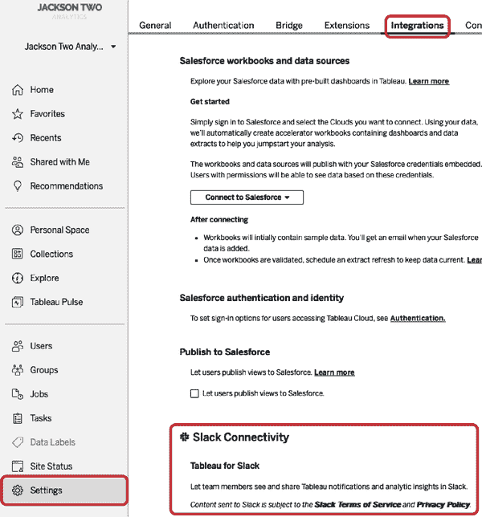
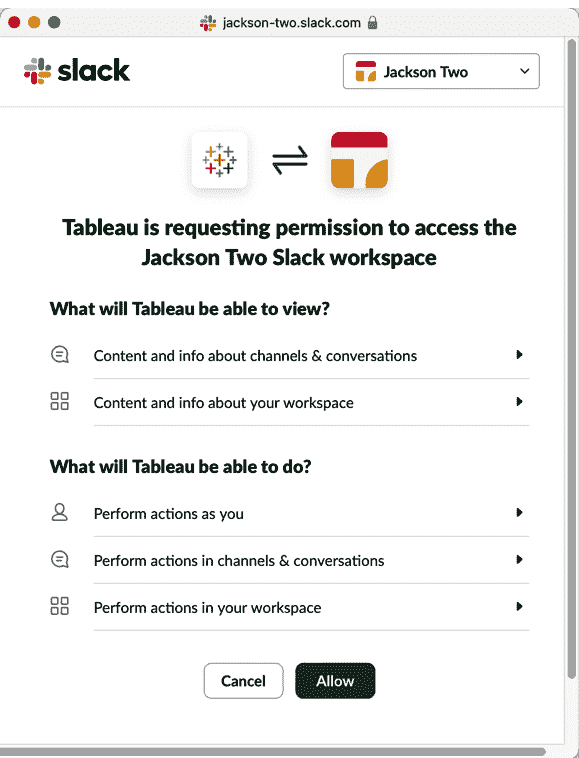
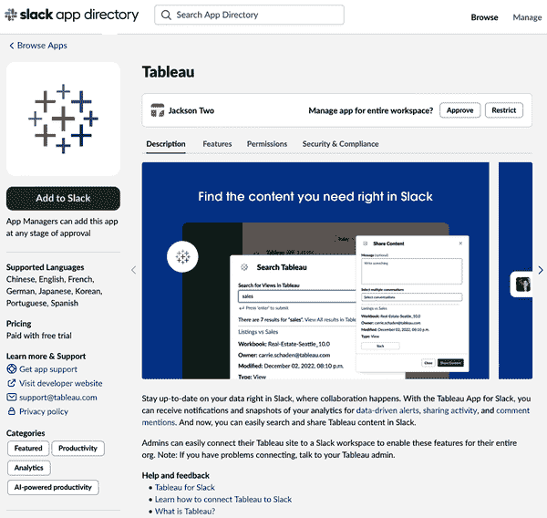
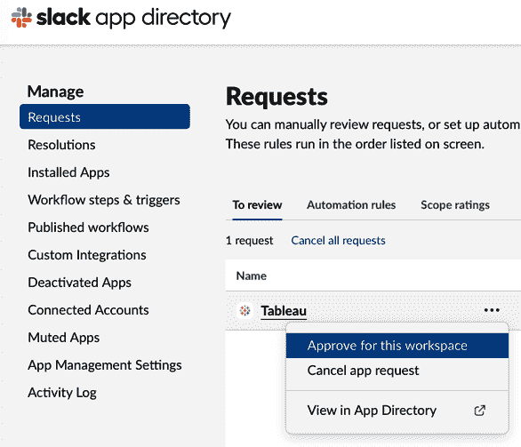
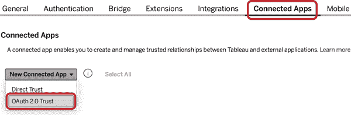
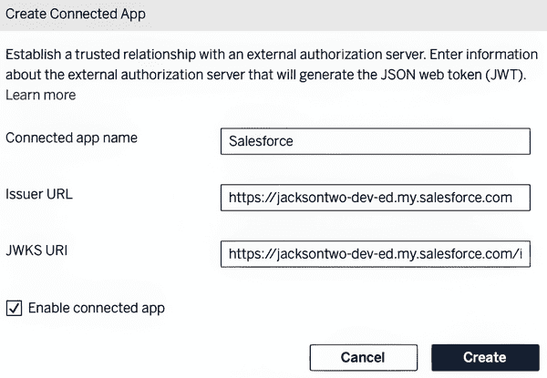
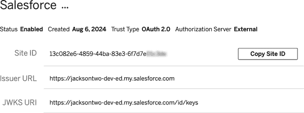
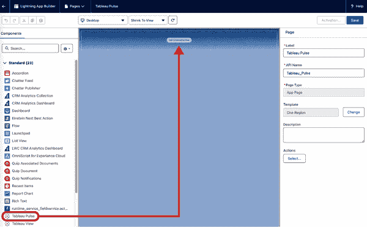
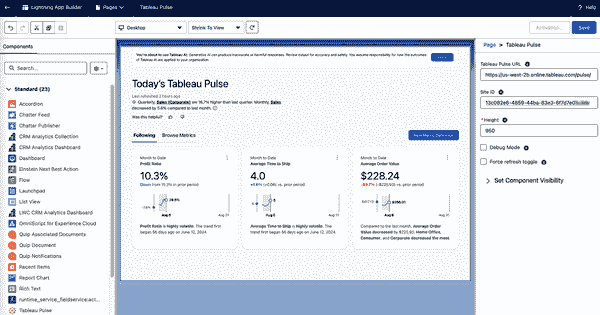

# 第六章\. 集成和扩展 Tableau Pulse

在前面的章节中，您了解了 Tableau Pulse 对于指标作者和指标终端用户的工作方式；现在是时候学习如何将 Tableau Pulse 集成到 Slack、Salesforce 客户关系管理（CRM）以及自定义 Web 应用程序或网页中。在本章中，您还将了解开发工具，如 Tableau REST API，允许您以编程方式创建和管理指标定义、指标、洞察和摘要订阅。

###### 警告

本章包含了一些可能超出数据分析师或 Tableau 开发者日常角色范围的高级开发概念。本章的目的是向您介绍这些概念，同时演示并解释在使用 Tableau Pulse 时可用的高级功能。建议在实施时与专注于 Salesforce、Web 开发和/或与 API 一起工作的开发者合作。

# Slack 集成

在第四章，您学习了终端用户如何启用 Slack 以开始接收他们关注的指标的 Pulse 摘要。然而，在您可以使用此功能之前，Tableau Cloud 和您的 Slack 工作空间的管理员都需要启用两个平台之间的连接性。

###### 小贴士

对于使用 Microsoft Teams 的组织，Tableau 发布了一个与 Slack 应用非常相似的应用。有关此信息，包括如何在您的组织中启用它，可以在[Tableau for Microsoft Teams 应用](https://oreil.ly/61Qqc)发布博客中找到。

## Tableau 云管理

首先，您需要在您的 Tableau Cloud 环境中开始。记住，对 Tableau Cloud 网站进行这些修改的用户需要拥有站点管理员创建者或站点管理员探索者许可证角色。一旦确定您拥有正确的角色，导航到设置部分。从那里，访问集成部分，并滚动到 Slack 连接性，如图 6-1 中突出显示的内容。



###### 图 6-1\. Tableau Cloud 网站设置中的集成区域（查看此图的大版本[在线](https://oreil.ly/lait0601)）

###### 注意

您和您的终端用户可以使用 Tableau 和 Slack 做的不仅仅是接收 Pulse 摘要。启用与 Slack 的集成还允许用户执行以下操作：

+   当内容与他们共享时接收通知

+   当他们在评论中被提及时接收通知

+   当数据驱动警报被触发时接收通知

+   当在频道或 DM 中共享 URL 时预览可视化

+   在频道或 DM 中搜索工作簿和视图

+   通过使用 Tableau 应用访问 Tableau 最近和收藏

启用与 Slack 的集成需要同意允许一个名为 *Salesforce Slack 集成代理* 的中间件在 Tableau 和 Slack 之间路由数据，如图 图 6-2 所示。


###### 图 6-2\. 启用 Salesforce Slack 集成代理的复选框

在 Salesforce Slack 集成代理启用后，您将能够点击连接到 Slack。一个新网页将弹出，显示 Tableau 对 Slack 工作空间获取权限的请求。此弹出窗口包括 Tableau 将能够从 Slack 查看的内容详情，以及它将代表用户在 Slack 中允许执行的操作类型。图 6-3 展示了 Slack 工作空间的详细权限弹出窗口，Slack 管理员必须在安装之前首先批准应用程序。


###### 图 6-3\. 请求 Tableau Cloud 访问 Slack 工作空间的弹出窗口

点击提交会使窗口消失，并将有一个审批请求提交给您的 Slack 管理员。然后，Slack 管理员将有权为整个工作空间批准应用程序。一旦批准，返回 Tableau Cloud 并再次重复连接到 Slack 的过程。这次，您将看到一条审批消息而不是请求消息，如图 图 6-4 所示。点击允许以启用连接。



###### 图 6-4\. 连接到 Tableau Cloud 的 Slack 请求

当您返回到 Tableau Cloud 设置中的集成部分时，您现在将看到已连接的 Slack 工作空间，如图 图 6-5 所示。


###### 图 6-5\. 连接的 Slack 工作空间的集成部分

如果您同时也是具有添加 Slack 应用程序能力的 Slack 工作空间管理员，您会注意到在您第一次点击连接到 Slack 后，Tableau 应用程序会自动安装到您的 Slack 工作空间中。

## Slack 管理

如果您是管理权限受限的 Slack 工作空间管理员，您可以通过几个简单的点击来启用您工作空间的 Tableau 应用程序。为了主动允许 Tableau 应用程序，请转到 *Slack 应用目录*，可以通过在 Slack 工作空间侧边栏中选择“添加应用”来访问。一旦进入目录，搜索 Tableau 应用程序。图 6-6 展示了 Slack 信息页面的 Tableau 应用程序看起来是什么样子。



###### 图 6-6\. Slack 信息和管理页面上的 Tableau 应用程序

从这里，您可以点击批准按钮。这将允许 Tableau Cloud 管理员完成之前提到的连接过程。此外，它还允许最终用户将 Tableau 应用程序添加到他们的 Slack 工作区，如第四章中所述。

或者，您可以导航到 Slack 应用目录的管理部分，通过三点的动作菜单中的操作来审查请求和批准，如图图 6-7 所示，或者直接在 Slack 中通过 Slackbot 的私信来响应请求。



###### 图 6-7\. 在 Slack 工作区中批准 Tableau 应用程序的替代方法

# 集成 Pulse

Tableau 产品线的独特功能之一是将可视化内容和 Pulse 指标嵌入到其他应用程序中。这一功能扩展了用户可以访问、查看和交互的 Tableau 内容，特别是在 Tableau Cloud 环境之外。此功能允许用户在不离开他们工作的应用程序的情况下充分利用 Tableau——节省时间，并直接访问有意义的数据，所有这些都在工作流程中完成。

## Salesforce CRM

Salesforce 生态系统中的核心软件是其 CRM。这是一个基于 Web 的应用程序，组织可以在其中存储账户和联系信息，跟踪潜在客户，并监控完成的销售。对于许多组织来说，销售团队的成员大部分日常工作时间都在 CRM 中度过。

由于成员在 CRM 中花费了如此多的时间，因此将 Pulse 指标和见解引入该平台是有意义的。这为 CRM 用户提供了监控分析和访问可能在 CRM 中未直接存储或可见的指标的可能性。要开始在 CRM 中嵌入 Tableau Pulse，您将需要 Tableau Cloud 和 Salesforce CRM 的行政权限。

### Salesforce 设置

在 Salesforce CRM 中启用 Tableau Pulse 的嵌入过程最佳起点是在 Salesforce 内部。Salesforce 管理员将通过两个配置屏幕来启用两个应用程序之间的集成。首先是将 Tableau Cloud 和 Tableau Pulse 设置为受信任的 URL。为此，点击 Salesforce 右上角的设置（齿轮）图标并选择设置。这将带您到设置主页，您可以在那里访问不同的部分并开始配置。

在左侧的快速查找框中搜索受信任的 URL。图 6-8 显示了受信任的 URL 页面。


###### 图 6-8\. Salesforce 中的受信任 URL 设置页面（查看此图的大版本[在线](https://oreil.ly/lait0608)）

从这里，为 Tableau Cloud 创建一个新的受信任 URL 条目。点击“新建受信任 URL”（如图 6-8 所示的底部）以开始输入新的 URL 条目，如图 6-9 所示。填写以下信息：

API 名称

选择一个友好的名称来描述 URL，该名称不能包含空格。

URL

应用程序的完全限定主机名。对于 Tableau Cloud 和 Pulse，这是应用程序的根 URL。

描述

为 URL 提供一个简短的摘要，表示应用程序。

启用以下内容安全策略（CSP）设置：

+   将 CSP 上下文设置为 All。

+   确保在 CSP 指令设置中的所有复选框都已勾选。

条目页面的最后一部分包括启用相机和麦克风访问，这对于 Tableau 集成不是必需的（或使用），可以保持未勾选。


###### 图 6-9\. Salesforce 中的完成受信任 URL 条目（查看此图的更大版本[在线](https://oreil.ly/lait0609)）

接下来，通过在设置中的快速查找部分搜索 Tableau 嵌入来启用并配置 Salesforce 中的 Tableau Lightning Web Components（LWCs）。如果你第一次导航到这个屏幕，可能有一个选项可以勾选旁边的“开启 Tableau 视图 Lightning Web 组件”复选框。

按照如图 6-10 所示完成以下配置：

+   点击复选框选择“开启基于令牌的单点登录认证”，这允许用户在两个应用程序之间进行认证。

+   指定用于 SSO 流程的“选择 Tableau 用户身份字段”。这是 Salesforce 应用程序中的一个字段，与 Tableau Cloud 中的用户名相对应。

+   复制发行者 URL 和 JWKS URI。这两条信息将在配置 Tableau Cloud 时使用。

+   创建一个新的 Tableau 主机映射条目。这包括下一节中描述的站点 URL 和站点 ID。将 Tableau 主机类型设置为 Tableau Cloud。


###### 图 6-10\. Salesforce 中完成的 Tableau 嵌入配置设置（查看此图的更大版本[在线](https://oreil.ly/lait0610)）

### 在 Tableau Cloud 中设置

一旦你在 Salesforce CRM 中启动了配置，你需要在 Tableau Cloud 中设置 Salesforce 为连接的应用程序。为此，转到设置并选择连接的应用程序。点击“新建连接应用程序”下拉菜单并选择 OAuth 2.0 信任，如图 6-11 所示。



###### 图 6-11\. 在 Tableau Cloud 的设置菜单中指定连接的应用程序类型

你将需要输入以下信息：

连接应用程序名称

这是一个友好的名称，用于表示连接是针对哪个应用的。

发行者 URL

这是配置 Salesforce 时之前复制的发行者 URL。

JWKS URI

这是配置 Salesforce 时之前复制的 URI。

点击复选框以启用连接应用。

点击创建按钮返回“连接应用”部分，并完成 Salesforce 和 Tableau Cloud 之间的连接。完成的配置显示在图 6-12 中。



###### 图 6-12\. 与 Salesforce 连接的完成配置

创建条目后，您将看到详细信息以及站点 ID，如图图 6-13 所示。它包括一个复制站点 ID 的选项，这在 Salesforce 中的 Tableau 主机映射中是必要的。将此信息反馈给您的 Salesforce 管理员，或者如果您也是 Salesforce 管理员，请自行更新。

###### 小贴士

站点 ID 是您 Tableau Cloud 环境的唯一标识符。此信息也用于将 Tableau 组件添加到 Salesforce，因此最好将此信息随身携带。



###### 图 6-13\. 带有站点 ID 的 Tableau Cloud 中的连接应用详细信息

您也可以使用此网页上的 URL 来复制 Tableau 站点 URL。复制站点名称之后的斜杠之前的 URL，如图图 6-14 中突出显示的那样。


###### 图 6-14\. 用于主机映射的 Tableau 站点 URL

此过程通过使用受信任令牌建立两个应用程序之间的关系，这对于在 Salesforce 中嵌入和查看 Tableau Pulse 页面是必要的。受信任令牌将用于在 Salesforce 中跳过 Tableau Cloud 用户身份验证。嵌入 Tableau Pulse 的最后一步是构建新页面或将 Tableau Pulse 组件集成到现有的 Salesforce 页面中。

### Salesforce 中的独立嵌入 Pulse 页面

要开始此过程，请返回 Salesforce。在设置中，使用快速查找栏搜索 Lightning App Builder。一旦到达那里，点击新建以开始构建新页面。在构建器内部，选择应用页面以开始创建 Salesforce 中的新标签页的过程。给页面一个标签，例如 Tableau Pulse。最后，指定您想要使用的布局。由于这是一个独立页面，您可以选择一个区域。

现在，从左侧，在可用组件列表中搜索或选择 Tableau Pulse。一旦找到它，将其拖放到构建器页面区域顶部的部分，如图图 6-15 所示。



###### 图 6-15\. 将 Tableau Pulse 组件拖放到顶部部分（查看此图的大版本[在线](https://oreil.ly/lait0615)）

一旦将 Pulse 组件拖放到页面上，请指定组件的页面、站点 ID 和高度。图 6-16 显示了一个设置为 Tableau Pulse 主页的完成配置。



###### 图 6-16\. Lightning 页面上 Tableau Pulse 组件的完成配置（查看此图的大版本[在线](https://oreil.ly/lait0616)）

点击保存，然后，当提示时，点击激活以激活页面。它还会要求您指定您希望在 Lightning 体验和移动导航中可见的页面位置。图 6-17 显示页面作为 Sales 应用中的一个标签保存。


###### 图 6-17\. 在 Sales 应用中包含 Tableau Pulse 页面

一旦页面被添加到一个或多个应用中，Salesforce 用户将能够访问他们的 Pulse 摘要，并在不离开 Salesforce 的情况下创建和跟踪新的指标，如图 6-18 所示。


###### 图 6-18\. Salesforce 中的 Tableau Pulse 嵌入（查看此图的大版本[在线](https://oreil.ly/lait0618)）

## 自定义网页和应用

除了在 Salesforce 中嵌入 Tableau Pulse，开发者还可以在自定义网页或应用中嵌入 Tableau Pulse 指标。与 Salesforce 类似，这允许开发者将丰富的分析和洞察力从 Tableau Pulse 包含在内，而最终用户已经在那里工作。

使用 Tableau Embedding API v3 可以将 Tableau Pulse 嵌入到网页中。这是嵌入的最新版本的开发者工具，包括使用 Web 组件的能力。Web 组件是可定制的、可重用的封装 HTML 标签，可以减少开发者将 Tableau 元素包含在网页上所需的代码量。

要开始，您必须首先在您的网页上链接到 Embedding API v3 库。Tableau 建议将库的链接位置与您组织中使用的 Tableau 版本相匹配。由于 Tableau Pulse 仅在 Tableau Cloud 中可用，因此最佳实践是链接到适用于 Tableau Cloud 的库。Tableau 运行着几个 Tableau Cloud 实例，这些实例的位置（地理）相关。这些实例，称为 *pods*，可以通过查看 Tableau Cloud URL 的子域来确定。示例 6-1 显示了代码块链接，其中 `Tableau-Pod` 应替换为您 Tableau Cloud 实例运行的 pod 名称。

##### 示例 6-1\. 链接到 Tableau Cloud 嵌入库

```py
<script type="module" src="https://Tableau-Pod.online.tableau.com/javascripts/api/tableau.embedding.3.latest.min.js"></script>
```

接下来，您可以使用 Tableau Pulse 网页组件来定义和包含 Tableau Pulse 指标。这包括五个自定义配置属性。表 6-1 列出了属性及其对 Tableau Pulse 网页组件显示的影响。

表 6-1\. Tableau Pulse 网页组件的属性

| 属性 | 描述 | 可接受值 | 是否必需 |
| --- | --- | --- | --- |
| `height` | 组件在网页上的高度；如果未指定，则默认为指标发布的尺寸 | 任何有效的 CSS 尺寸指定符。例如：`800 px` | 否 |
| `width` | 组件在网页上的宽度；如果未指定，则默认为指标发布的宽度 | 任何有效的 CSS 尺寸指定符。例如：`600 px` | 否 |
| `disable-explore-filter` | 指示是否隐藏探索过滤器按钮；默认为 `false`，包含探索过滤器按钮 | `true` 或 `false` 的布尔值。 | 否 |

| `layout` | 定义 Tableau Pulse 指标的布局 | `default` 与 Tableau Pulse 中的完整指标页面相同。`card` 是指标的小版本，与 Pulse 首页上找到的相同。

`ban` 仅包括值和比较值。 | 否 |

| `token` | 配置连接应用后使用的 JSON 网络令牌 (JWT) | 一个有效的 JWT。 | 是 |
| --- | --- | --- | --- |

在 表 6-1 中，请注意，使用网页组件时需要令牌。Tableau 要求开发者在网页或应用程序与 Tableau Cloud 之间使用和配置连接应用功能。配置连接应用最好由具有 Tableau Cloud 管理员支持的网页开发者完成。要了解更多关于连接应用及其配置信息，请访问 Tableau [帮助文档](https://oreil.ly/TL15o)。

示例 6-2 展示了包含 Tableau Pulse 指标的代码块结构。您需要将 `src` 属性替换为嵌入的 Pulse 指标的 URL，并将令牌替换为有效的 JWT。

##### 示例 6-2\. Tableau Pulse 网页组件的 HTML

```py
<tableau-pulse id="tableauPulse"
 src='https://Tableau-Pod.online.tableau.com/site/mysite/pulse/metrics/metric-
 id' token='CAtoken'> 
</tableau-pulse>
```

# Tableau REST API

开发者可用的最后一组工具是 Tableau REST API。此 API 允许开发者以编程方式在 Tableau Pulse 中完成各种操作。这些操作适用于指标定义、指标、指标洞察和指标订阅（跟踪指标）。

对于指标定义，API 包含以下方法：

+   创建、更新和删除定义

+   获取 Tableau Cloud 站点的指标定义列表

+   根据指标定义获取指标列表

+   获取指定的指标定义批次

对于指标，API 包含以下方法：

+   获取指标的详细信息

+   如果存在指标，则获取它，如果不存在，则创建它

+   创建、更新或删除指标

+   获取指定的指标批次

对于指标洞察，API 包含以下方法：

+   为指标生成基本洞察包

+   为指标生成启动洞察包

+   为指标生成详细洞察包

对于指标订阅（关注的指标），API 包含以下操作的方法：

+   获取指标订阅的详细信息

+   获取用户对指标的订阅列表

+   创建或删除对指标的订阅

+   更新指标的粉丝

+   获取指定批次的指标订阅

+   为一组用户或组创建对指标的订阅

+   获取指定批次指标订阅的粉丝数量

此 API 的健壮性为开发者提供了访问所有在章节 1 到 4 中演示的 Tableau Pulse UI 中所看到的所有功能的能力。Tableau 的 [文档](https://oreil.ly/h0WLZ) 关于 Tableau REST API 包含了 Pulse 的方法和响应。

# 摘要

本章向您介绍了高级集成和开发工具，使您能够扩展 Tableau Pulse 的范围。以下是一些关键要点：

+   Slack 和 Tableau Cloud 之间的集成需要两个工具的管理员。

+   您可以将 Tableau Pulse 摘要和指标页面嵌入到 Salesforce CRM 中。

+   要在 Salesforce 中嵌入 Tableau Pulse，您需要将 Tableau Cloud 设置为受信任的 URL，并将 Salesforce 配置为与 Tableau Cloud 连接的应用程序。

+   Tableau Pulse 页面可以作为 Salesforce 中闪电页面上的组件添加，无论是作为独立页面还是在其他现有页面内。

+   通过使用 Embedding API v3，可以将 Tableau Pulse 指标嵌入到网页或自定义 Web 应用程序中。

+   Embedding API v3 包含一个用于 Tableau Pulse 的 Web 组件。这减少了将其包含在网页中所需的编码量。

+   Tableau Pulse Web 组件可以通过几个可选属性进行自定义，如高度、宽度和布局。

+   为了对 Tableau Pulse 进行更多程序控制，开发者可以利用 Tableau REST API。

+   Tableau REST API 包含覆盖所有通过 Tableau UI 可以执行的操作的方法。

在下一章中，焦点将从 Tableau Pulse 转移到 Tableau Agent。您将学习如何使用这个 AI 助手创建可视化、计算和数据资产描述。
