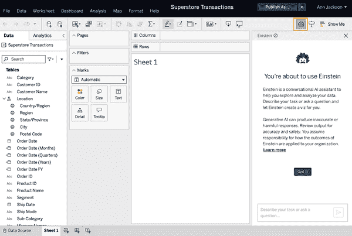
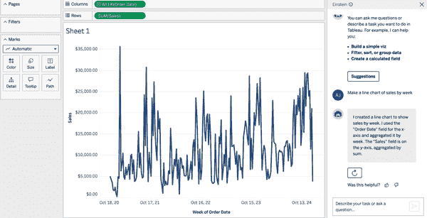
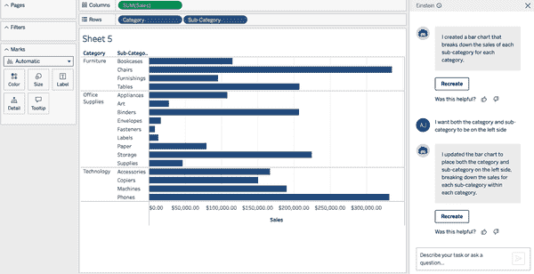
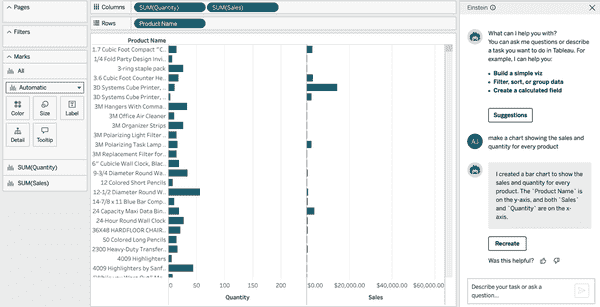
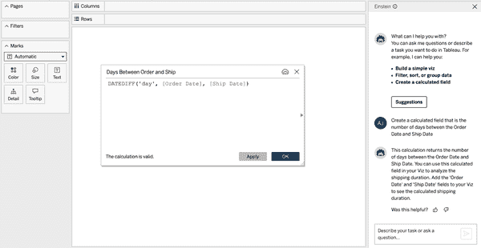
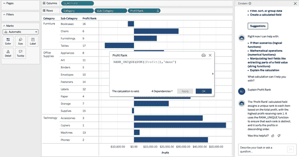
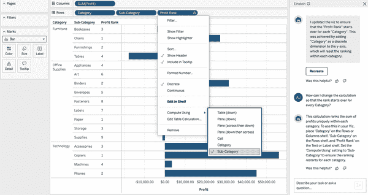
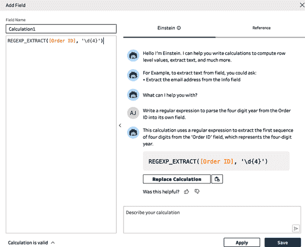
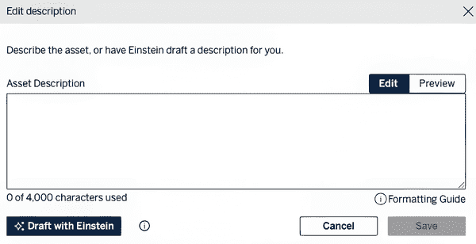

# 第七章\. Tableau 代理

现在你已经了解了 Tableau Pulse 的所有方面，是时候继续了解 Tableau 平台上的其他 AI 工具：Tableau 代理。正如前言中提到的，Tableau 代理（以前称为 Einstein Copilot）是可供在 Web 上创建可视化或 Prep 工作流程的作者使用的 AI 助手。它还可以直接与 Tableau 数据目录功能协同工作，生成数据资产和内容的摘要。使用 Tableau 代理，你可以使用对话式 AI 来构建图表和计算，获得分析建议，并最大限度地减少管理时间。让我们深入了解。

# 先决条件

Tableau 代理目前仅适用于拥有 Tableau+订阅的 Tableau Cloud 用户。2024 年夏季推出，Tableau+被定位为 Tableau 平台（仅 Tableau Cloud）的企业级解决方案，具有高级 AI 功能。该产品线的版本包括你习惯的正常 Tableau 许可证的所有内容，还包括数据管理和高级管理附加组件、访问其 eLearning 库、一个数据云实例、Tableau 代理、Tableau Pulse 的额外功能、数据连接服务以及高级支持。不出所料，这项服务附带了一个相当高的新价格标签，大约是每种许可证类型传统许可成本的 3 倍。

要启用 Tableau 代理，组织必须拥有一个数据云实例并将其与他们的 Tableau Cloud 实例连接。此外，他们必须设置并启用带有 Einstein 生成式 AI 的 Salesforce CRM。这三个平台之间的连接有两个主要目的：

+   对 AI 服务的请求跟踪和审计

+   基于信用系统的 AI 服务利用

关于这些平台之间设置的更多信息可在[帮助文档](https://oreil.ly/eEr0e)中找到。

# 可视化创作

假设你已经获得了 Tableau+许可证，并在你的 Tableau Cloud 环境中设置了 Tableau AI，你将能够在 Web 上创建可视化时使用 Tableau 代理。首先，你需要在 Tableau Cloud 上打开一个新的或现有的工作簿。从那里，你将在作者屏幕的右上角看到 Einstein 图标，紧邻数据指南图标，如图图 7-1 所示。



###### 图 7-1\. Web 作者中的 Tableau 代理窗口

在访问此窗口并点击生成式 AI 的一般警告消息后，你可以开始与之交互。Tableau 代理会告诉你它可以协助以下操作：

+   创建简单的可视化

+   创建和描述计算字段

+   执行如过滤、排序和分组数据等操作

+   提供分析建议

你也可以直接提问并描述你想要完成的任务。本节将探讨一些这些功能，并讨论 Tableau Agent 如何提供帮助。我将首先使用在第二章中首次提到的熟悉的数据源 Superstore Transactions。

###### 注意

虽然 AI 列出了分组作为一项功能，但 Tableau 文档表明分组目前不受支持。

## 创建简单可视化

使用 Tableau Agent，你可以加快创建可能繁琐或需要多次点击的视觉化的速度。我将从非常直接的例子开始，并逐渐将提示中的语言变得更具模糊性，以便 AI 做出决策（如图表类型），而这些决策并没有明确说明（见示例 7-1）。

##### 示例 7-1. 直接请求特定图表类型

**提示**

```py
Make a line chart showing sales by week
```

**Tableau Agent**

```py
I created a line chart to show sales by week. I used the 'Order Date' field for the x-axis and aggregated it by week. The 'Sales' field is on the y-axis, aggregated by sum.
```

图 7-2 显示了 Tableau Agent 根据示例 7-1 中的提示生成的图表，这与我的预期相符。它正确地创建了一个以销售字段为 y 轴的折线图，趋势跨越了几个星期。现在我将要求一个特定的图表类型，如示例 7-2 所示。



###### 图 7-2. 在提示后由 Tableau Agent 创建的折线图（见示例 7-1）（查看此图的更大版本[在线](https://oreil.ly/lait0702))

##### 示例 7-2. 请求特定图表类型，但在布局上有些模糊

**提示**

```py
Create a bar chart that breaks down the sales of each sub-category for each category.
```

**Tableau Agent**

```py
I created a bar chart that breaks down the sales of each sub-category for each category.
```

图 7-3 显示了示例 7-2 中的提示生成的结果图表，这并不是我想要的，但确实符合提示中所述的简要说明。我原本希望得到一个包含类别和子类别的柱状图，避免重复的空子类别，以免使可视化图杂乱。


###### 图 7-3. 在提示后由 Tableau Agent 创建的柱状图（见示例 7-2）（查看此图的更大版本[在线](https://oreil.ly/lait0703))

由于它是会话式 AI，我可以继续使用另一个提示来尝试获取我想要的图表（见示例 7-3）。

##### 示例 7-3. 调整图表布局的后续请求

**提示**

```py
I want both the category and sub-category to be on the left side
```

**Tableau Agent**

```py
I updated the bar chart to place both the category and sub-category on the left side, breaking down the sales for each sub-category within each category.
```

如图 7-4 所示，生成的图表现在符合我的预期。这个提示的输出显示，AI 与作者屏幕的布局保持一致，并理解如果某个元素放置在可视化图的*左侧*意味着什么。

Tableau Agent 还可以处理查看数据而不指定图表类型的请求。如果你不确定要创建哪种类型的图表，这可能很有用（示例 7-4）。



###### 图 7-4. 指定字段位置后的更新条形图（查看此图的更大版本[在线](https://oreil.ly/lait0704)）

##### 示例 7-4. 没有描述所需图表类型的特定数据元素

**提示**

```py
make a chart showing the sales and quantity for every product
```

**Tableau Agent**

```py
I created a bar chart to show the sales and quantity for every product. The 'Product Name' is on the y-axis, and both 'Sales' and 'Quantity' are on the x-axis.
```

图 7-5 显示了基于示例 7-4 的提示生成的结果图表，其中包括识别正确的字段。然而，我对这个图表的目标是看到每个产品之间两个值的关系。所以，我将跟进另一个提示，引导 AI 朝着我试图揭示的洞察力类型前进，这些洞察力最好用散点图来展示（见示例 7-5）。



###### 图 7-5. 在示例 7-4 中没有指定图表类型时 AI 创建的图表（查看此图的更大版本[在线](https://oreil.ly/lait0705)）

##### 示例 7-5. 根据指定目标生成图表的请求

**提示**

```py
I want to see the relationship between the two values for all products
```

**Tableau Agent**

```py
I updated the viz to show the relationship between sales and quantity for every product. I used a scatter plot to better visualize the relationship between these two values.
```

在示例 7-5 的提示中包含“两个值之间的关系”这个关键词，这是 Tableau 文档通常描述散点图目的方式，结果是我想达到的，如图图 7-6 所示。


###### 图 7-6. 在示例 7-5 的提示中提供更多上下文后的更新图表（查看此图的更大版本[在线](https://oreil.ly/lait0706)）

知道 AI 在提供更多关于布局或分析任务的上下文信息时表现更好，这非常有用。这里还有一个例子（示例 7-6），其中创建图表的类型存在歧义，但分析的目的很明确。

##### 示例 7-6. 没有描述图表类型的特定分析任务

**提示**

```py
make a chart showing the part-to-whole relationship of Category and Sub-Category when looking at the quantity
```

**Tableau Agent**

```py
OK. I can’t make exactly what you requested, but here’s a viz based on the fields you mentioned.
```

生成的图表是一个树状图，如图图 7-7 所示，这是我心理上预期的。正确的字段被识别出来，由于独特的子类别数量，比饼图提供了更清晰的视觉。令人惊讶的是，Tableau Agent 提到它不能制作出我请求的确切图表，因为图表完全符合要求。


###### 图 7-7. 在示例 7-6 的提示中提供分析任务后由 AI 创建的图表（查看此图的更大版本[在线](https://oreil.ly/lait0707)）

###### 小贴士

考虑到 AI 在构建可视化时的表现，在您的提示中提供尽可能多的上下文是有意义的。我建议包括图表类型（如果您有想法的话），任何您感兴趣的布局细节，以及您试图实现的分析类型。

## 与计算字段一起工作

接下来，我想通过一些涉及计算字段的示例。使用 Tableau 代理，您可以创建计算字段，了解它们的工作原理，并获得有关调试不按预期工作的计算的协助。示例 7-7 显示了简单计算的提示。

##### 示例 7-7\. 简单计算

**提示**

```py
Create a calculated field that is the number of days between the Order Date and Ship Date
```

**Tableau 代理**

```py
This calculation returns the number of days between the Order Date and Ship Date. You can use this calculated field in your Viz to analyze the shipping duration. Add the 'Order Date' and 'Ship Date' fields to your Viz to see the calculated shipping duration.
```

提示立即创建了我所寻找的确切计算，并给它起了一个友好的名字——这绝对是一个节省大量时间的方法。图 7-8 显示了结果，其中包括一个用于审查的计算字段的模式弹出窗口。



###### 图 7-8\. 基于示例 7-7 中的提示创建的计算字段（查看此图的更大版本[在线](https://oreil.ly/lait0708)）

现在，我想尝试更复杂一些，看看 Tableau 代理是否可以创建一个使用更高级元素的计算字段，比如表格计算。由于表格计算依赖于可视化中的数据布局，我将从一个包含正确元素但计算并不完全符合我要求的图表开始（参见示例 7-8）。

##### 示例 7-8\. 高级计算

**提示**

```py
Create a calculated field showing the percentage difference between each month for sales.
```

**Tableau 代理**

```py
This calculation computes the percentage difference in sales between each month. To use this calculation, place the 'Order Date (Months)' field on the Columns shelf and the new calculated field on the Rows shelf in your Viz. Then, set the table calculation to compute using 'Order Date (Months)'.
```

图 7-9 显示了结果，其中包括计算的字友好名字，并准确地使用了 `LOOKUP()` 函数，这是一个表格计算。它还包括如何指定表格计算的计算方向。有趣的是，它还包括一个可选的 `IFNULL` 函数，在计算中返回空值或空字符串为 0。


###### 图 7-9\. 在示例 7-8 的提示之后创建的高级计算（查看此图的更大版本[在线](https://oreil.ly/lait0709)）

最后，我想在计算字段中尝试一个复合概念，这需要一个 LOD 表达式和一个函数。这将是一种需要一些时间来构思的计算，并且需要创作者在构建计算的过程中逐步验证其功能（参见示例 7-9）。

##### 示例 7-9\. 多个计算概念

**提示**

```py
For every state, find the very first order date using customers whose first name is exactly 5 characters
```

**Tableau 代理**

```py
This calculation finds the very first order date for each state using customers whose first name is exactly 5 characters. Add the 'State/Province' and 'First Order Date for 5-Character First Names' fields to your Viz to display the results.
```

图 7-10 显示了构建的计算，我必须承认这个输出令人印象深刻。Tableau Agent 使用了可能需要一些试错法的字符串计算，并将其正确地与 LOD 表达式结合，以通过州/省隔离值。尽管请求相当晦涩，但让 AI 构建计算比我自己尝试构建计算要高效得多。


###### 图 7-10\. 从示例 7-9 中的提示生成的 AI 复杂计算（查看此图的大版本[在线](https://oreil.ly/lait0710)）

与计算一起工作可能是 Tableau Agent 的最大优势。让我们看看它是如何描述计算的，并看看我是否能得到帮助来修改它以满足我的需求。

注意在图 7-10 中，计算字段窗口中有一个小爱因斯坦图标。点击此图标会导致 Tableau Agent 列出它如何帮助进行计算。首先，我会要求它解释我创建的利润排名计算，该计算用于为每个子类别排名利润值（见示例 7-10）。

##### 示例 7-10\. 解释和调试现有的计算字段

**提示**

```py
Explain Profit Rank
```

**Tableau Agent**

```py
The 'Profit Rank' calculated field assigns a unique rank to each item based on the total profit, with the highest profit receiving rank 1\. It uses the RANK_UNIQUE function to ensure that each rank is distinct, and it sorts the profits in descending order.
```

图 7-11 显示了构建的利润排名字段的可视化及其解释。



###### 图 7-11\. 从示例 7-10 中的提示解释的利润排名计算（查看此图的大版本[在线](https://oreil.ly/lait0711)）

你会在可视化中注意到排名跨越了所有子类别，忽略了类别字段。但我希望通过这个计算实现的是每个子类别在其父类别内都获得一个排名。让我们看看 Tableau Agent 是否能提供帮助（见示例 7-11）。

##### 示例 7-11\. 请求调整排名的计算方式

**提示**

```py
How can I change the calculation so that the rank starts over for every Category?
```

**Tableau Agent**

```py
This calculation ranks the sum of profits uniquely within each category. To use this in your Viz, place 'Category' on the Rows or Columns shelf, 'Sub-Category' on the Rows shelf, and 'Profit Rank' on the Text or Label shelf. Set the 'Compute Using' setting to 'Sub-Category' to ensure the ranking restarts for each category.
```

此响应包括有关如何在画布上放置字段的说明，但更重要的是，它正确地识别了如何修改表格计算以在每个类别中重新开始排名。图 7-12 显示了在采纳 Tableau Agent 的建议并将“计算使用”设置为子类别后最终的可视化。



###### 图 7-12\. 从示例 7-11 中的提示更新表格计算的“计算使用”方法（查看此图的大版本[在线](https://oreil.ly/lait0712)）

## 过滤

除了协助可视化构建和计算构建之外，您还可以使用 Tableau Agent 限制可视化中的数据。本节探讨了这一功能，以了解它如何用于简化这些类型的任务，从简单概念到更复杂场景。

首先，我想看看当我要求非常直接的日期筛选时会发生什么。我已经设置了一个折线图，显示每个段按月销售的图表作为这些提示的图表（查看示例 7-12）。

##### 示例 7-12\. 简单日期筛选

**提示**

```py
Limit the data to the last 18 months
```

**Tableau Agent**

```py
I updated the viz to limit the data to the last 18 months.
```

如预期的那样，AI 将订单日期字段放置在过滤器架中。它还暴露了一个相对日期过滤器，这很有帮助，因为可以使用几种类型的日期过滤器设计。图 7-13 显示了结果。


###### 图 7-13\. AI 根据示例 7-12 中的提示创建的日期过滤器（查看此图的更大版本[在线](https://oreil.ly/lait0713)）

接下来，我想尝试一个基于维度的筛选。我将坚持使用相同的图表，并使用段作为我的筛选目标维度（查看示例 7-13）。

##### 示例 7-13\. 通过维度进行筛选

**提示**

```py
I only want to see Consumer and Corporate in the chart
```

**Tableau Agent**

```py
I updated the viz to only include the 'Consumer' and 'Corporate' segments in the chart.
```

这次我故意选择专注于我期望的结果，而不是描述要采取的行动。AI 正确解决了任务，并将一个段过滤器添加到过滤器架中，如图图 7-14 所示。


###### 图 7-14\. 基于示例 7-13 中提示的段过滤器更新后的可视化（查看此图的更大版本[在线](https://oreil.ly/lait0714)）

现在我们来看看 AI 是否能够跟上基于数值的筛选操作（查看示例 7-14）。

##### 示例 7-14\. 通过度量或数值进行筛选

**提示**

```py
Only include rows of data where the sales value is more than 100
```

**Tableau Agent**

```py
I updated the viz to only include rows where the sales value is more than 100.
```

Tableau Agent 正确解释了我的提示，并将一个针对销售额的过滤器添加到过滤器架中，如图图 7-15 所示。

###### 警告

这就是 AI 在解释和正确行动方面的极限。为了得到图 7-15 中的结果，我不得不通过几个不同措辞的提示进行迭代。每个失败的提示都导致 AI 添加一个汇总版本，`SUM(Sales)`，作为过滤器，而不是单个值。达到这个结果的关键是明确指出*数据行*，这提供了查看单个销售额值而不是总和的必要上下文。


###### 图 7-15\. 基于示例 7-14 中提示的数值生成的过滤器（查看此图的更大版本[在线](https://oreil.ly/lait0715)）

## 遵循提示最佳实践

正如你在前面的示例中看到的那样，提示的措辞至关重要。以下是一些在编写时与 Tableau Agent 一起工作的最佳实践：

使用直接和明确的语言

当你使用命令动词来告诉 Tableau Agent 你具体想要什么时，Tableau Agent 工作得最好。*制作*、*创建*、*构建*、*编写*、*解释*和*展示给我*都是很好的提示开头。

最小化无关数据

就像所有好的分析一样，最好是在你的数据中隐藏或排除不必要的字段。这消除了 AI 基于多余信息或类似名称的字段提出建议的机会。

使用 Tableau 语言

如果你想要使用特定的函数来构建计算，请在你的提示中命名它。同样，使用在文档中经常出现的上下文短语来引导 AI。

分步骤工作

当 AI 被赋予一个直接的动作去执行时，它表现得最好。将这些任务分解成单独的提示，并逐一迭代。

提出问题

如果你不确定你试图创建的视觉化或计算是什么，以问题的形式表达你的提示。以诸如*如何*、*什么*和*哪个*等词语开始。

除了这些基本最佳实践之外，不要害怕使用熟悉的点赞/踩倒图标来提供关于 AI 输出是否有用的反馈。记住，由于爱因斯坦信任层（参考第二章），LLM 不会存储或直接从你的提示中学习，所以你不会看到立即的改进。然而，你的反馈很可能会被汇总并用于提升整体模型。

# Tableau Prep Builder

Tableau Agent 也可在 Web 上的 Prep Builder 的“添加字段”编辑器中使用。你会注意到，一旦你进入编辑器，就会有一个 Tableau Agent（爱因斯坦）的部分，如图图 7-16 所示。


###### 图 7-16\. 带有 Tableau Agent 的 Prep 计算编辑器

在 Prep 中使用 Tableau Agent 的经验几乎与你在使用计算时获得的 Web 编写支持完全相同。一般来说，你将能够使用编辑器参考标签页中可用的函数和运算符。这包括逻辑运算符、固定 LOD、数值聚合等。特别是，Tableau Prep Builder 中的 Tableau Agent 还包括构建正则表达式的功能。

*正则表达式*（regex）是用于匹配字符串字段中字符表达式的模式。它们非常强大，但通常识别正确的语法来隔离模式是具有挑战性的。这就是 Tableau Agent 可以提供帮助的地方。示例 7-15 展示了当被要求创建一个解析出订单 ID 字段中的四位年份的计算时会发生什么，该字段包括一个两位的国家代码、四位年份和一个六位订单号，这些数字由破折号分隔（例如：CA-2021-100867）。

##### 示例 7-15\. 使用正则表达式构建计算

**提示**

```py
Write a regular expression to parse the four digit year from the Order ID into its own field.
```

**Tableau Agent**

```py
This calculation uses a regular expression to extract the first sequence of four digits from the 'Order ID' field, which represents the four-digit year.
```

图 7-17 展示了添加字段编辑器和与 Tableau Agent 的对话。除了构建计算，Tableau Agent 还提供了一个按钮，可以将编辑器中的计算替换为建议的正则表达式。



###### 图 7-17\. 基于 示例 7-15 中的提示创建的正则表达式（查看此图的更大版本 [在线](https://oreil.ly/lait0717)）

###### 注

目前不支持像连接或合并数据、旋转和聚合、创建新行、预测、插入脚本和输出这样的单独工作流程步骤。同样，当使用 Tableau Agent 时，这些步骤也没有提供咨询指导或解释。

# Tableau 数据目录

最后，Tableau Agent 可与 Tableau 数据目录一起使用。当编写工作簿、数据源或表格的描述时，您会注意到一个 Draft with Einstein 按钮。图 7-18 展示了编辑表格描述时的外观。



###### 图 7-18\. 使用爱因斯坦选项描述表格的草稿

AI 将依赖于元数据，如字段和表名来生成描述。可以通过再次点击 Draft with Einstein 按钮来重新生成描述。您还可以修改自动生成的描述并添加所需的格式。 展示了为 第五章 中财务示例中使用的信用卡交易数据集生成的描述（参见图 5-9）。


###### 图 7-19\. 使用 Draft with Einstein 生成的已发布数据源描述

如您所见，AI 能够从发布的数据源中提取字段名称，并建议如何进行分析，从而节省大量时间并避免在过程中出现许多错误。

# 摘要

本章向您展示了在 Tableau 平台中与 Tableau Agent 一起工作的许多示例。您已经看到它如何协助可视化创作和计算创建。以下是一些关键要点：

+   Tableau Agent 可以制作简单的可视化，在描述您想要的分析任务或图表类型时最为有效。

+   Tableau Agent 可以构建各种计算字段，从使用简单函数到涉及多种概念的复杂计算。

+   Tableau Agent 可以在电子表格中过滤数据，但在过滤数值时可能需要明确的指令。

+   如果你给 Tableau Agent 明确的指令，你将获得最大的成功。如果你知道你想要什么，请以行动动词开始你的提示。如果你不确定你想要达到的结果，请将你的请求作为问题来表述。

+   在 Tableau Prep 中，Tableau Agent 目前仅限于创建计算和辅助功能。

+   Tableau Agent 可以使用元数据信息自动为工作簿、数据源和表格生成描述。

第八章，最后一章，讨论了这些新的 AI 技术对平台的影响，并预览了可能即将推出的新功能。
