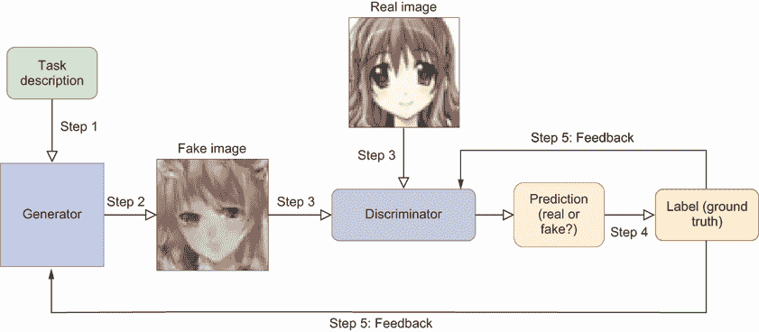
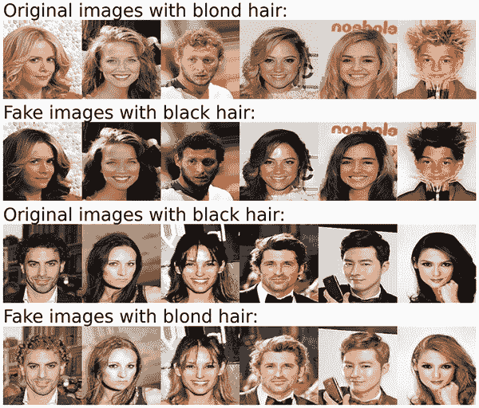
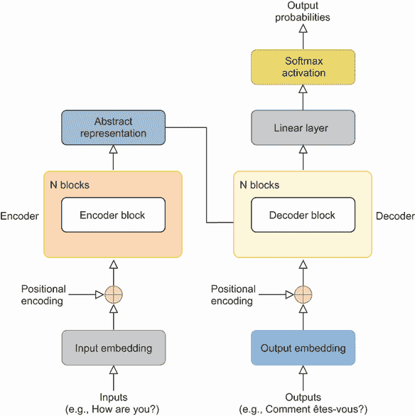
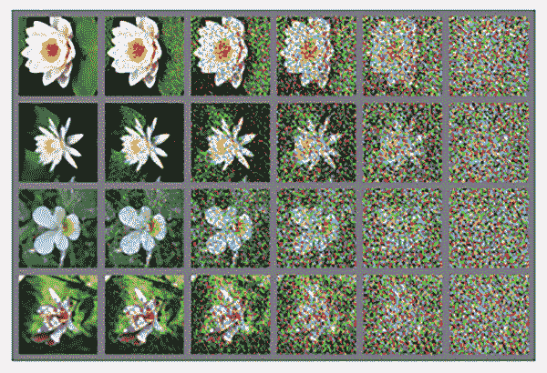
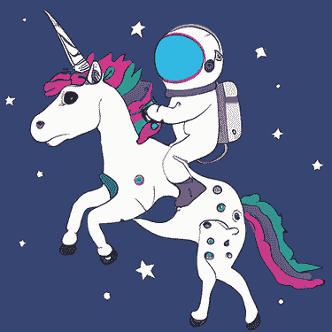

# 第一章：什么是生成式 AI，为什么是 PyTorch？

本章涵盖

+   生成式 AI 与非生成式 AI 的比较

+   为什么 PyTorch 是深度学习和生成式 AI 的理想选择

+   生成对抗网络的概念

+   注意力机制和 Transformers 的好处

+   从头创建生成式 AI 模型的优势

生成式 AI 自 2022 年 11 月 ChatGPT 问世以来，对全球格局产生了重大影响，引起了广泛关注，并成为焦点。这项技术进步彻底改变了日常生活的许多方面，迎来了技术新时代，并激发了许多初创公司探索各种生成模型提供的广泛可能性。

考虑一下 Midjourney 这家先驱公司取得的进步，它现在可以从简短的文字输入中创建高分辨率、逼真的图像。同样，软件公司 Freshworks 显著加速了应用程序的开发，将平均所需时间从 10 周缩短到仅仅几天，这是通过 ChatGPT 的能力实现的（参见*Forbes*文章“2023 年公司如何使用 ChatGPT 的 10 个惊人的真实世界例子”，作者 Bernard Barr，2023 年，[`mng.bz/Bgx0`](https://mng.bz/Bgx0)）。为了举例说明，这篇引言的一些内容已经通过生成式 AI 得到了增强，展示了其精炼内容以使其更具吸引力的能力。

注意事项：有什么比让生成式 AI 自己解释生成式 AI 更好的方法呢？在最终确定之前，我让 ChatGPT 重新撰写了这篇引言的早期草稿，以“更具吸引力”的方式呈现。

这项技术进步的影响远远超出了这些例子。由于生成式 AI 的先进能力，各行业正经历着重大的颠覆。这项技术现在可以创作出与人类写作相当的文章，创作出令人联想到古典作品的音乐，并快速生成复杂的法律文件，这些任务通常需要大量的人类努力和时间。ChatGPT 发布后，教育平台 CheggMate 的股价出现了显著下降。此外，美国编剧工会最近的一次罢工中，达成了一致意见，要为 AI 在剧本写作和编辑方面的侵犯设定界限（参见*Wired*文章“好莱坞编剧达成 AI 协议，将改写历史”，作者 Will Bedingfield，2023 年，[`mng.bz/1ajj`](https://mng.bz/1ajj)）。

注意事项：CheggMate 向大学生收费，让他们的问题由人类专家回答。现在，许多这些工作可以通过 ChatGPT 或类似工具以极低成本完成。

这引发了一系列问题：什么是生成式 AI，它与其他 AI 技术有何不同？为什么它在各个行业引起了如此广泛的颠覆？生成式 AI 的潜在机制是什么，为什么了解它很重要？

本书深入探讨了生成式人工智能，这是一种通过从现有数据中学习模式来创建新内容（如文本、图像或音乐）的人工智能类型。它与专注于区分不同数据实例之间的差异并学习类别之间边界的判别模型不同。图 1.1 展示了这两种建模方法之间的差异。例如，当面对包含狗和猫的图像数组时，判别模型通过捕捉区分两者的几个关键特征（例如，猫有小的鼻子和尖耳朵）来确定每张图像描绘的是狗还是猫。如图表的上半部分所示，判别模型将数据作为输入，并产生不同标签的概率，我们用 Prob(狗)和 Prob(猫)表示。然后我们可以根据最高的预测概率对输入进行标记。

所有这些模型都是基于深度神经网络，你将使用 Python 和 PyTorch 来构建、训练和使用这些模型。我们选择 Python 是因为其用户友好的语法、跨平台兼容性和广泛的社区支持。我们还选择了 PyTorch 而不是 TensorFlow 等其他框架，因为它易于使用并且能够适应各种模型架构。Python 被广泛认为是机器学习（ML）的主要工具，PyTorch 在人工智能领域也越来越受欢迎。因此，使用 Python 和 PyTorch 可以使你跟上生成式人工智能的新发展。因为 PyTorch 允许使用图形处理单元（GPU）进行训练加速，所以你可以在几分钟或几小时内训练这些模型，并见证生成式人工智能的实际应用！

## 1.1 介绍生成式人工智能和 PyTorch

本节解释了什么是生成式人工智能以及它与非生成式人工智能（如判别模型）的不同之处。生成式人工智能是一类具有非凡能力，能够产生各种形式的新内容的技术，包括文本、图像、音频、视频、源代码和复杂模式。生成式人工智能能够创造全新的内容世界；ChatGPT 是一个显著的例子。相比之下，判别建模主要关注的是识别和分类现有内容的工作。

### 1.1.1 什么是生成式人工智能？

生成式人工智能是一种通过从现有数据中学习模式来创建新内容（如文本、图像或音乐）的人工智能类型。它与专注于区分不同数据实例之间的差异并学习类别之间边界的判别模型不同。图 1.1 展示了这两种建模方法之间的差异。例如，当面对包含狗和猫的图像数组时，判别模型通过捕捉区分两者的几个关键特征（例如，猫有小的鼻子和尖耳朵）来确定每张图像描绘的是狗还是猫。如图表的上半部分所示，判别模型将数据作为输入，并产生不同标签的概率，我们用 Prob(狗)和 Prob(猫)表示。然后我们可以根据最高的预测概率对输入进行标记。

图 1.1 生成模型与判别模型的比较。判别模型（图的上半部分）将数据作为输入，并产生不同标签的概率，我们用 Prob(dog)和 Prob(cat)表示。相反，生成模型（图的下半部分）通过深入了解这些图像的显著特征来合成代表狗和猫的新图像。

相比之下，生成模型展现出生成数据新实例的独特能力。在我们的狗和猫示例中，生成模型通过深入了解这些图像的显著特征来合成代表狗和猫的新图像。如图 1.1 的下半部分所示，生成模型将任务描述（例如，在潜在空间中变化的值导致生成的图像具有不同的特征，我们将在第四章到第六章中详细讨论）作为输入，并产生狗和猫的全新图像。

从统计学的角度来看，当面对具有特征 X 的数据示例，这些特征描述了输入和相应的各种标签 Y 时，判别模型承担预测条件概率的责任，具体来说是预测 Y|X 的概率。相反，生成模型试图学习输入特征 X 和目标变量 Y 的联合概率分布，表示为 prob(X, Y)。凭借这种知识，它们从分布中采样，以产生 X 的新实例。

根据你想要创建的具体内容形式，存在不同类型的生成模型。在这本书中，我们主要关注两种突出的技术：生成对抗网络（GANs）和转换器（虽然我们也会涵盖变分自编码器和扩散模型）。在 GANs 中的“对抗”一词指的是两个神经网络在零和博弈框架中相互竞争的事实：生成网络试图创建与真实样本不可区分的数据实例，而判别网络则试图从真实样本中识别生成的样本。两个网络之间的竞争导致两者都得到改进，最终使生成器能够创建高度逼真的数据。转换器是能够高效解决序列到序列预测任务的深度神经网络，我们将在本章后面更详细地解释它们。

GANs 因其易于实现和多功能性而备受赞誉，使连对深度学习只有初步了解的人也能从头开始构建他们的生成模型。这些多才多艺的模型可以产生各种各样的创作，从本书第三章中展示的几何形状和复杂图案，到第四章中将学习生成的高质量彩色图像，如人类面孔。此外，GANs 还表现出转换图像内容的能力，无缝地将金发人类面孔图像转变为黑发人类面孔图像，这在第六章中进行了讨论。值得注意的是，它们将它们的创造力扩展到音乐生成领域，产生听起来逼真的音乐作品，如第十三章中所示。

与形状、数量或图像生成相比，文本生成的艺术面临巨大的挑战，这主要归因于文本信息的序列性质，其中单个字符和单词的顺序和排列具有重大意义。为了应对这种复杂性，我们转向 Transformer，这是一种专为高效处理序列到序列预测任务而设计的深度神经网络。与它们的 predecessors，如循环神经网络（RNN）或卷积神经网络（CNN）不同，Transformer 在捕捉输入和输出序列中固有的复杂、长距离依赖关系方面表现出色。值得注意的是，它们并行训练的能力（一种在多个设备上同时训练模型的多设备训练方法）大大减少了训练时间，使我们能够在大量数据上训练 Transformer。

Transformer 的革命性架构是大型语言模型（LLMs；具有大量参数并在大型数据集上训练的深度神经网络）的出现的基础，包括 ChatGPT、BERT、DALL-E 和 T5。这种变革性的架构是近年来 AI 进步激增的基石，ChatGPT 和其他生成预训练 Transformer（GPT）模型的引入开启了这一进步。

在接下来的章节中，我们将深入了解这两种开创性技术的全面内部工作原理：它们的底层机制和它们解锁的众多可能性。

### 1.1.2 Python 编程语言

我假设您已经具备 Python 的基本知识。为了跟随书中的内容，您需要了解 Python 的基础知识，例如函数、类、列表、字典等。如果您还没有，网上有大量的免费资源可以帮助您入门。按照附录 A 中的说明安装 Python。之后，为本书创建一个虚拟环境，并安装 Jupyter Notebook 作为本书项目中计算环境。

自 2018 年后期以来，Python 已经成为全球领先的编程语言，正如《经济学人》杂志所记录的（参见《经济学人》数据团队撰写的文章“Python Is Becoming the World’s Most Popular Coding Language”，2018 年，[`mng.bz/2gj0`](https://mng.bz/2gj0)）。Python 不仅对每个人都是免费的，还允许其他用户创建和调整库。Python 有一个庞大的社区驱动的生态系统，因此你可以轻松找到来自其他 Python 爱好者的资源和帮助。此外，Python 程序员喜欢分享他们的代码，所以你不必重新发明轮子，你可以导入现成的库，并与 Python 社区分享你的代码。

无论你是在 Windows、Mac 还是 Linux 上，Python 都能满足你的需求。它是一种跨平台语言，尽管安装软件和库的过程可能因操作系统而异——但不用担心；我会在附录 A 中向你展示如何操作。一旦一切准备就绪，Python 代码在不同系统上表现一致。

Python 是一种适合通用应用开发的表达性语言。它的语法易于理解，使得 AI 爱好者能够轻松理解和操作。如果你在这本书中提到的 Python 库遇到任何问题，你可以在 Python 论坛上搜索或访问像 Stack Overflow([`stackoverflow.com/questions/tagged/python`](https://stackoverflow.com/questions/tagged/python))这样的网站寻找答案。如果所有其他方法都失败了，请不要犹豫，向我寻求帮助。

最后，Python 提供了一大批库，使得创建生成模型变得容易（相对于 C++或 R 等其他语言）。在这个旅程中，我们将独家使用 PyTorch 作为我们的 AI 框架，我将在稍后解释为什么我们选择它而不是像 TensorFlow 这样的竞争对手。

### 1.1.3 使用 PyTorch 作为我们的 AI 框架

现在我们已经决定将 Python 作为本书的编程语言，我们将选择一个适合生成建模的 AI 框架。在 Python 中，最受欢迎的两个 AI 框架是 PyTorch 和 TensorFlow。在这本书中，我们选择 PyTorch 而不是 TensorFlow，因为它易于使用，并且我强烈建议你也这样做。

PyTorch 是由 Meta 的 AI 研究实验室开发的开源 ML 库。它建立在 Python 编程语言和 Torch 库的基础上，旨在提供一个灵活且直观的平台，用于创建和训练深度学习模型。Torch 是 PyTorch 的前身，是一个用 C 语言构建深度神经网络并带有 Lua 包装器的 ML 库，但它的开发已经停止。PyTorch 旨在通过提供一个更用户友好和适应性强的框架来满足研究人员和开发者的需求。

计算图是深度学习中的一个基本概念，在高效计算复杂数学运算中扮演着至关重要的角色，尤其是涉及多维数组或张量的运算。计算图是一种有向图，其中的节点代表数学运算，而边则代表在这些运算之间流动的数据。计算图的关键用途之一是在实现反向传播和梯度下降算法时计算偏导数。图结构允许高效地计算在训练过程中更新模型参数所需的梯度。PyTorch 能够动态创建和修改图，这被称为动态计算图。这使得它能够更好地适应不断变化的结构模型，并简化了调试过程。此外，就像 TensorFlow 一样，PyTorch 通过 GPU 训练提供加速计算，与中央处理器（CPU）训练相比，可以显著减少训练时间。

PyTorch 的设计与 Python 编程语言相得益彰。其语法简洁易懂，使得新手和经验丰富的开发者都能轻松上手。研究人员和开发者都欣赏 PyTorch 的灵活性。它使他们能够快速实验新想法，这得益于其动态计算图和简单的接口。这种灵活性在快速发展的生成人工智能领域至关重要。PyTorch 还拥有一个快速发展的社区，积极为其发展做出贡献。这导致了一个庞大的生态系统，包括库、工具和资源，为开发者提供支持。

PyTorch 在迁移学习方面表现出色，这是一种将针对通用任务设计的预训练模型微调以适应特定任务的技术。研究人员和实践者可以轻松利用预训练模型，节省时间和计算资源。这一特性在预训练大型语言模型（LLMs）的时代尤为重要，它使我们能够将 LLMs 应用于下游任务，如分类、文本摘要和文本生成。

PyTorch 与其它 Python 库兼容，如 NumPy 和 Matplotlib。这种互操作性允许数据科学家和工程师无缝地将 PyTorch 集成到现有的工作流程中，提高生产力。PyTorch 还以其对社区驱动开发的承诺而闻名。它发展迅速，定期根据实际使用和用户反馈进行更新和改进，确保其始终处于人工智能研究和开发的前沿。

附录 A 提供了如何在您的计算机上安装 PyTorch 的详细说明。按照说明在本书的虚拟环境中安装 PyTorch。如果您计算机上没有安装支持 Compute Unified Device Architecture (CUDA)的 GPU，本书中的所有程序也兼容 CPU 训练。更好的是，我将在本书的 GitHub 仓库[`github.com/markhliu/DGAI`](https://github.com/markhliu/DGAI)上提供训练好的模型，以便您可以看到训练好的模型在实际中的应用（如果训练模型太大，我将在我的个人网站上提供[`gattonweb.uky.edu/faculty/lium/`](https://gattonweb.uky.edu/faculty/lium/))）。在第二章中，您将深入探索 PyTorch。您首先将学习 PyTorch 中的数据结构，Tensor，它包含数字和矩阵，并提供执行操作的功能。然后，您将学习如何使用 PyTorch 执行端到端的深度学习项目。具体来说，您将在 PyTorch 中创建一个神经网络，并使用服装物品图像及其相应的标签来训练网络。完成之后，您将使用训练好的模型将服装物品分类到 10 种不同的标签类型中。这个项目将使您为在后续章节中使用 PyTorch 构建和训练各种生成模型做好准备。

## 1.2 GANs

本节首先概述 GANs 的工作原理。然后，我们以生成动漫人脸图像为例，向您展示 GANs 的内部工作原理。最后，我们将讨论 GANs 的实际应用。

### 1.2.1 GANs 的高级概述

GANs 代表一类生成模型，最初由 Ian Goodfellow 及其合作者于 2014 年提出（“Generative Adversarial Nets,” [`arxiv.org/abs/1406.2661`](https://arxiv.org/abs/1406.2661)）。近年来，GANs 因其易于构建和训练，并且能够生成各种内容而变得极为流行。您将从下一小节中的说明示例中看到，GANs 采用一个双网络架构，包括一个生成模型，其任务是捕捉潜在的数据分布以生成内容，以及一个判别模型，其作用是估计给定样本是否来自真实的训练数据集（被认为是“真实”）而不是生成模型的产物（被认为是“虚假”）。模型的主要目标是产生与训练数据集中的数据实例非常相似的新数据实例。GANs 生成数据的性质取决于训练数据集的组成。例如，如果训练数据由服装物品的灰度图像组成，合成的图像将非常类似于这样的服装物品。相反，如果训练数据集包含人类面部彩色图像，生成的图像也将类似于人类面部。

看一下图 1.2——我们 GAN 的架构及其组件。为了训练模型，我们将真实样本（如图 1.2 顶部所示）和生成器创建的虚假样本（左侧）都展示给判别器（中间）。生成器的主要目的是创建与训练数据集中找到的示例几乎无法区分的数据实例。相反，判别器努力区分生成器生成的虚假样本和真实样本。这两个网络进行着一种持续的竞争过程，类似于猫捉老鼠的游戏，试图迭代地超越对方。

图 1.2 GAN 架构及其组件。GAN 采用双网络架构，包括一个生成模型（左侧），其任务是捕捉潜在的数据分布，以及一个判别模型（中间），其目的是估计一个给定的样本是来自真实的训练数据集（被认为是“真实”）而不是生成模型的产物（被认为是“虚假”）的可能性。

GAN 模型的训练过程涉及多个迭代。在每个迭代中，生成器接受某种形式的任务描述（步骤 1）并使用它来创建虚假图像（步骤 2）。虚假图像以及来自训练集的真实图像被展示给判别器（步骤 3）。判别器试图将每个样本分类为真实或虚假。然后，它将分类与实际标签、真实情况（步骤 4）进行比较。判别器和生成器都从分类中接收反馈（步骤 5），并提高它们的能力：判别器适应其识别虚假样本的能力，而生成器学习提高其生成能够欺骗判别器的令人信服样本的能力。随着训练的进行，当两个网络都无法进一步改进时，达到平衡。此时，生成器能够产生与真实样本几乎无法区分的数据实例。

为了确切了解 GAN 是如何工作的，让我们来看一个说明性例子。

### 1.2.2 一个说明性例子：生成动漫面孔

想象一下：你是一个热衷的动漫爱好者，你正在使用一种称为深度卷积 GAN（简称 DCGAN）的强大工具进行一次激动人心的探索，以创建你自己的动漫面孔。别担心，我们将在第四章中深入探讨这一点。

如果你观察图 1.2 的顶部中间部分，你会看到一个写着“实像”的图片。我们将使用 63,632 张动漫面孔的彩色图片作为我们的训练数据集。如果你翻到图 1.3，你会看到我们训练集中的 32 个示例。这些特殊图片在形成我们判别网络一半输入方面起着至关重要的作用。

图 1.3 动漫面孔训练数据集示例

图 1.2 的左侧是生成器网络。为了每次生成不同的图像，生成器从潜在空间中输入一个向量 Z。我们可以将这个向量视为“任务描述”。在训练过程中，我们从潜在空间中抽取不同的 Z 向量，因此网络每次都会生成不同的图像。这些假图像是鉴别器网络输入的一半。

注意：通过改变向量 Z 的值，我们可以生成不同的输出。在第五章，你将学习如何选择向量 Z 来生成具有特定特征（例如，男性或女性特征）的图像。

但这里有个转折：在我们教我们的两个网络创作和检测的艺术之前，生成器产生的图像，嗯，简直是胡言乱语！它们看起来根本不像图 1.3 中你看到的那些逼真的动漫面孔。事实上，它们看起来就像电视屏幕上的静态画面（你将在第四章亲自见证这一点）。

我们对模型进行了多次迭代训练。在每次迭代中，我们向鉴别器展示一组由生成器创建的图像，以及一组来自我们的训练集的动漫面孔图像。我们要求鉴别器预测每张图像是由生成器（伪造）还是来自训练集（真实）创建的。

你可能会想：鉴别器和生成器在每次训练迭代中是如何学习的？一旦做出预测，鉴别器不会坐以待毙；它会从每个图像的预测错误中学习。有了这种新获得的知识，它调整自己的参数，以在下一轮中做出更好的预测。生成器也不是闲着的。它从自己的图像生成过程和鉴别器的预测结果中汲取经验。有了这些知识在手，它调整自己的网络参数，力求在下一轮迭代中创造越来越逼真的图像。目标？降低鉴别器发现其伪造品的几率。

随着我们穿越这些迭代，一个显著的变化发生了。生成器网络在进化，产生的动漫面孔越来越逼真，类似于我们的训练集合中的那些。同时，鉴别器网络也在磨练自己的技能，成为在识别伪造品方面的老练侦探。这是创作与检测之间的一场迷人的舞蹈。

渐渐地，一个神奇的时刻到来了。达到了一种平衡，或者说是一种完美的平衡。生成器创造的图像变得如此逼真，以至于它们与我们在训练档案中的真实动漫面孔无法区分。在这个时候，鉴别器如此困惑，以至于它将每个图像的真实性赋予 50%的机会，无论它是来自我们的训练集还是由生成器制作的。

最后，请看一些生成器艺术作品的例子，如图 1.4 所示：它们看起来确实与我们的训练集中的那些无法区分。

图 1.4 DCGAN 训练好的生成器生成的动漫人脸图像

### 1.2.3 你为什么应该关注 GANs？

GANs 易于实现且用途广泛：仅在本书中，你将学会生成几何形状、复杂图案、高分辨率图像和听起来逼真的音乐。

GANs 的实用用途不仅限于生成逼真的数据。GANs 还可以将一个图像域的属性转换到另一个域。正如你在第六章中将会看到的，你可以训练一个 CycleGAN（GAN 家族中的一种生成模型）将人脸图像中的金色头发转换为黑色头发。同样的训练模型也可以将黑色头发转换为金色头发。图 1.5 显示了四行图像。第一行是带有金色头发的原始图像。训练好的 CycleGAN 将它们转换为带有黑色头发的图像（第二行）。最后两行是带有黑色头发的原始图像和分别转换为金色头发的转换图像。

图 1.5 使用 CycleGAN 改变发色。如果我们将带有金色头发的图像（第一行）输入到一个训练好的 CycleGAN 模型中，该模型将这些图像中的金色头发转换为黑色头发（第二行）。同样的训练模型也可以将黑色头发（第三行）转换为金色头发（底部行）。

想想你在训练 GANs 时会掌握的所有令人惊叹的技能——它们不仅酷炫，而且超级实用！假设你经营一家采用“按需定制”策略的在线服装店（这允许用户在制造前定制他们的购买）。你的网站展示了大量独特的款式供客户选择，但这里有个问题：你只有在有人下单时才会制作衣服。由于你必须制作商品并拍照，制作这些衣服的高质量图像可能相当昂贵。

GANs 来拯救！你不需要大量的制造服装物品及其图像；相反，你可以使用类似 CycleGAN 的东西将一组图像的特征转换到另一组，从而创建一系列全新的风格。这只是使用 GANs 的一种巧妙方式。可能性是无限的，因为这些模型非常灵活，可以处理各种类型的数据——使它们在实用应用中成为变革者。

## 1.3 变换器

变换器是擅长序列到序列预测问题的深度神经网络，例如，输入一个句子并预测最可能的下一个单词。本节将向您介绍 Transformers 的关键创新：自注意力机制。然后我们将讨论 Transformer 架构和不同类型的 Transformers。最后，我们将讨论 Transformers 的一些最新发展，如多模态模型（输入不仅包括文本，还包括其他数据类型，如音频和图像的 Transformers）和预训练的 LLMs（在大规模文本数据上训练的模型，可以执行各种下游任务）。

在 2017 年由一组谷歌研究人员（Vaswani 等人，“Attention Is All You Need”，[`arxiv.org/abs/1706.03762`](https://arxiv.org/abs/1706.03762)）发明 Transformer 架构之前，自然语言处理（NLP）和其他序列到序列预测任务主要是由循环神经网络（RNNs）处理的。然而，RNNs 在保留序列中早期元素的信息方面存在困难，这阻碍了它们捕捉长期依赖关系的能力。即使是像长短期记忆（LSTM）网络这样的高级 RNN 变体，虽然可以处理较长的依赖关系，但在处理极长范围依赖关系时也显得不足。

更重要的是，RNNs（包括 LSTMs）按顺序处理输入，这意味着这些模型一次处理一个元素，按顺序处理，而不是同时查看整个序列。RNNs 沿着输入和输出序列的符号位置进行计算的事实阻止了并行训练，这使得训练速度变慢。这反过来又使得在大型数据集上训练模型成为不可能。

Transformers 的关键创新是自注意力机制，它擅长捕捉序列中的长期依赖关系。此外，由于模型中对输入的处理不是按顺序进行的，因此 Transformers 可以并行训练，这大大减少了训练时间。更重要的是，并行训练使得在大量数据上训练 Transformers 成为可能，这使得大型语言模型（LLMs）变得智能和知识渊博（基于它们处理和生成类似人类文本、理解上下文以及执行各种语言任务的能力）。这导致了 ChatGPT 等 LLMs 的兴起以及最近的 AI 繁荣。

### 1.3.1 注意力机制

注意力机制为序列中一个元素与序列中所有元素（包括该元素本身）的关系分配权重。权重越高，两个元素之间的关系越紧密。这些权重是在训练过程中从大量训练数据中学习得到的。因此，经过训练的 LLM，如 ChatGPT，可以找出句子中任意两个单词之间的关系，从而理解人类语言。

你可能会想：注意力机制是如何为序列中的元素分配分数以捕获长期依赖关系的？首先通过三个神经网络层处理输入以获得查询 Q、键 K 和值 V（我们将在第九章中详细解释）。使用查询、键和值来计算注意力的方法来自检索系统。例如，你可能会去公共图书馆查找一本书。你可以在图书馆的搜索引擎中输入，比如，“金融领域的机器学习”。在这种情况下，查询 Q 是“金融领域的机器学习”。键 K 是书名、书籍描述等。图书馆的检索系统将根据查询和键之间的相似性推荐一系列书籍（值 V）。自然地，标题或描述中包含“机器学习”或“金融”或两者都的书籍会出现在列表的顶部，而标题或描述中都不包含这两个短语的书籍会出现在列表的底部，因为这些书籍会被分配一个较低的匹配分数。

在第九章和第十章中，你将了解注意力机制的细节——更好的是，你将从头开始实现注意力机制以构建和训练一个 Transformer，以成功地将英语翻译成法语。

### 1.3.2 Transformer 架构

Transformer 首次在为机器语言翻译（例如，英语到德语或英语到法语）设计模型时被提出。图 1.6 是 Transformer 架构的示意图。左侧是编码器，右侧是解码器。在第九章和第十章中，你将学习从头开始构建 Transformer 以训练模型将英语翻译成法语，那时我们将更详细地解释图 1.6。

Transformer 中的编码器“学习”输入序列（例如，英语短语“你好吗？”）的含义，并将其转换为表示这种含义的向量，然后再将这些向量传递给解码器。解码器通过逐个预测序列中的单词，基于序列中的先前单词和编码器的输出来构建输出（例如，英语短语的法语翻译）。经过训练的模型可以将常见的英语短语翻译成法语。

变压器有三种类型：仅编码器 Transformer、仅解码器 Transformer 和编码器-解码器 Transformer。仅编码器 Transformer 没有解码器，能够将序列转换为用于各种下游任务（如情感分析、命名实体识别和文本生成）的抽象表示。例如，BERT 就是一个仅编码器 Transformer。仅解码器 Transformer 只有解码器但没有编码器，非常适合文本生成、语言建模和创意写作。GPT-2（ChatGPT 的前身）和 ChatGPT 都是仅解码器 Transformer。在第十一章中，你将学习从头开始创建 GPT-2，然后从 Hugging Face（一个托管和协作机器学习模型、数据集和应用的 AI 社区）中提取训练好的模型权重。你将把权重加载到你的 GPT-2 模型中，并开始生成连贯的文本。

图 1.6 Transformer 架构。Transformer 中的编码器（图示的左侧）学习输入序列（例如，英语短语“你好吗？”）的含义，并将其转换为捕获其含义的抽象表示，然后再传递给解码器（图示的右侧）。解码器通过逐个预测单词，基于序列中的先前单词和编码器提供的抽象表示来构建输出（例如，英语短语的法语翻译）。

对于复杂任务，如能够处理文本到图像生成或语音识别的多模态模型，需要编码器-解码器 Transformer。编码器-解码器 Transformer 结合了编码器和解码器的优点。编码器在处理和理解输入数据方面效率高，而解码器在生成输出方面表现卓越。这种组合使得模型能够有效地理解复杂的输入（如文本或语音）并生成复杂的输出（如图像或转录文本）。

### 1.3.3 多模态 Transformer 和预训练的 LLM

生成式 AI 最近的进展催生了各种多模态模型：这些模型不仅可以使用文本，还可以使用其他数据类型作为输入，例如音频和图像。文本到图像 Transformer 就是这样的一个例子。DALL-E 2、Imagen 和 Stable Diffusion 都是文本到图像模型，它们因其能够从文本提示中生成高分辨率图像的能力而受到媒体广泛关注。文本到图像 Transformer 结合了扩散模型的原则，涉及一系列转换来逐步增加数据的复杂性。因此，在讨论文本到图像 Transformer 之前，我们首先需要了解扩散模型。

想象一下，你想要通过使用基于扩散的模型生成高分辨率的鲜花图像。首先，你需要获取一组高质量的鲜花图像作为训练集。然后，你让模型逐渐向鲜花图像中添加噪声（所谓的扩散过程），直到它们变成完全随机的噪声。接着，训练模型从这些噪声图像中逐步去除噪声，以生成新的数据样本。扩散过程在图 1.7 中展示。左侧列包含四张原始的鲜花图像。随着我们向右移动，每一步都会向图像中添加一些噪声，直到右侧列，四张图像变成了纯随机噪声。

图 1.7 扩散模型向图像中添加越来越多的噪声，并学习重建它们。左侧列包含四张原始的鲜花图像。随着我们向右移动，每个时间步都会向图像中添加一些噪声，直到右侧列，四张图像变成了纯随机噪声。然后，我们使用这些图像来训练一个基于扩散的模型，逐步从噪声图像中去除噪声，以生成新的数据样本。

你可能会想知道：文本到图像的 Transformer 与扩散模型有何关联？文本到图像的 Transformer 接受一个文本提示作为输入，并生成与该文本描述相对应的图像。文本提示作为一种条件，模型使用一系列神经网络层将文本描述转换为图像。与扩散模型一样，文本到图像的 Transformer 使用具有多个层的分层架构，每个层逐步向生成的图像添加更多细节。迭代优化输出的核心概念在扩散模型和文本到图像的 Transformer 中是相似的，我们将在第十五章中解释这一点。

由于扩散模型能够提供稳定的训练并生成高质量的图像，它们现在变得越来越受欢迎，并且已经超越了其他生成模型，如 GANs 和变分自编码器。在第十五章中，你将首先学习使用牛津鲜花数据集训练一个简单的扩散模型。你还将学习多模态 Transformer 背后的基本思想，并编写一个 Python 程序，通过文本提示请求 OpenAI 的 DALL-E 2 生成图像。例如，当我输入“一个宇航员穿着太空服骑独角兽”作为提示时，DALL-E 2 生成了图 1.8 所示的图像。

图 1.8 通过文本提示“一个宇航员穿着太空服骑独角兽”生成的 DALL-E 2 图像

在第十六章中，你将学习如何访问预训练的大型语言模型（LLM），例如 ChatGPT、GPT4 和 DALL-E 2。这些模型在大量文本数据上进行了训练，并从数据中学习了通用知识。因此，它们可以执行各种下游任务，如文本生成、情感分析、问答和命名实体识别。由于预训练的 LLM 是在几个月前训练的，它们无法提供过去一两个月内的事件和发展的信息，更不用说实时信息，如天气状况、航班状态或股价。我们将使用 LangChain（一个用于构建 LLM 应用的 Python 库，提供提示管理、LLM 链式调用和输出解析的工具）将 LLM 与 Wolfram Alpha 和 Wikipedia API 链式调用，以创建一个无所不知的个人助理。

## 1.4 为什么需要从头开始构建生成模型？

本书的目标是向你展示如何从头开始构建和训练所有生成模型。这样，你将彻底理解这些模型的内部运作，并能更好地利用它们。从头开始创造是理解它的最佳方式。你将为 GANs 实现这一目标：所有模型，包括 DCGAN 和 CycleGAN，都是从头开始构建并使用公共领域精心整理的数据进行训练的。

对于 Transformers，你将从头开始构建和训练所有模型，除了 LLM。这个例外是由于训练某些 LLM 需要大量的数据和超级计算设施。然而，你将在这一方向上取得重大进展。具体来说，你将在第九章和第十章中逐行实现 2017 年那篇开创性的论文“Attention Is All You Need”，并以英语到法语的翻译为例（相同的 Transformer 可以训练其他数据集，如中文到英语或英语到德语的翻译）。你还将构建一个仅包含解码器的小型 Transformer，并使用欧内斯特·海明威的多部小说，包括《老人与海》进行训练。训练后的模型可以生成海明威风格的文本。ChatGPT 和 GPT-4 对于我们的目的来说太大太复杂，无法从头开始构建和训练，但你将一窥其前身 GPT-2，并学习如何从头开始构建它。你还将从 Hugging Face 提取训练好的权重，并将它们加载到你构建的 GPT-2 模型中，开始生成可以以人类写作方式通过的文字。

在这种意义上，本书采用了比大多数书籍更基础的方法。本书不是将生成 AI 模型视为黑盒，读者有机会揭开盖子，详细检查这些模型的内部运作机制。目标是让你对生成模型有更深入的理解。这反过来又可能帮助你构建更好、更负责任的生成 AI，以下是一些原因。

首先，对生成模型架构的深入了解有助于读者更好地实际应用这些模型。例如，在第五章中，你将学习如何选择生成图像中的特征，如性别特征和是否戴眼镜。通过从头构建条件 GAN，你理解生成图像的某些特征是由潜在空间中的随机噪声向量 Z 决定的。因此，你可以选择不同的 Z 值作为训练模型的输入，以生成所需的特征（如性别特征）。这种属性选择如果不了解模型的设计是难以实现的。

对于 Transformer，了解其架构（以及编码器和解码器的作用）使你能够创建和训练 Transformer 以生成你感兴趣的内容类型（例如，简·奥斯汀风格的小说或莫扎特风格的音乐）。这种理解也有助于你使用预训练的 LLM。例如，虽然从头开始训练具有 15 亿参数的 GPT-2 很困难，但你可以在模型中添加一个额外的层，并对其进行微调以完成其他下游任务，如文本分类、情感分析和问答。

其次，对生成式 AI 的深入了解有助于读者对 AI 的危险性进行无偏评估。虽然生成式 AI 的非凡能力在我们的日常生活和工作中带来了好处，但它也有可能造成巨大的危害。埃隆·马斯克甚至表示，“有一些可能性，它可能会出错并毁灭人类”（参见《The Hill》2023 年的文章，“Musk: There’s a Chance AI ‘Goes Wrong and Destroys Humanity’”，[`mng.bz/Aaxz`](https://mng.bz/Aaxz)）。越来越多的学术界和科技行业的人士担心 AI（尤其是生成式 AI）带来的危险。生成式 AI，尤其是 LLM，可能导致意想不到的后果，正如许多科技行业的先驱所警告的那样（例如，参见 Stuart Russell，2023 年的文章，“How to Stop Runaway AI”，[`mng.bz/ZVzP`](https://mng.bz/ZVzP)）。ChatGPT 发布仅仅五个月后，包括史蒂夫·沃兹尼亚克、特里斯坦·哈里斯、约书亚·本吉奥和山姆·奥特曼在内的许多科技行业专家和企业家签署了一封公开信，呼吁至少暂停六个月训练任何比 GPT-4 更强大的 AI 系统（参见《TechCrunch》的文章，“1,100+ Notable Signatories Just Signed an Open Letter Asking ‘All AI Labs to Immediately Pause for at Least 6 Months’”，[`mng.bz/RNEK`](https://mng.bz/RNEK)）。对生成模型架构的深入了解有助于我们提供对 AI 的益处和潜在危险的深入和无偏评估。

## 摘要

+   生成式 AI 是一种具有产生各种形式新内容的能力的技术，包括文本、图像、代码、音乐、音频和视频。

+   判别性模型擅长于分配标签，而生成性模型则生成新的数据实例。

+   PyTorch 凭借其动态计算图和 GPU 训练的能力，非常适合深度学习和生成建模。

+   GANs（生成对抗网络）是一种由两个神经网络组成的生成建模方法：一个生成器和一个人工智能判别器。生成器的目标是创建逼真的数据样本，以最大化判别器认为这些样本是真实样本的概率。判别器的目标是正确识别出真实样本中的假样本。

+   变换器是一种使用注意力机制来识别序列中元素之间长期依赖的深度神经网络。原始的变换器包括编码器和解码器。例如，当用于英语到法语翻译时，编码器将英语句子转换成抽象表示，然后传递给解码器。解码器根据编码器的输出和之前生成的单词，逐词生成法语翻译。
