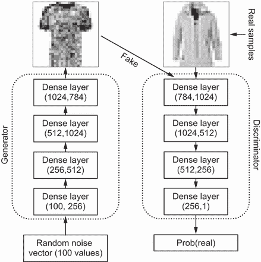
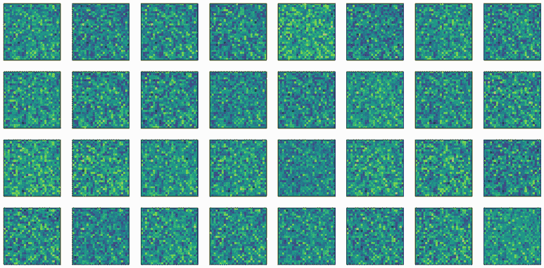
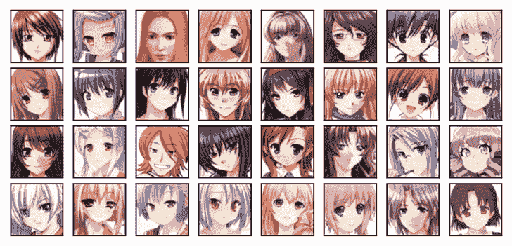
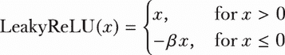

# 第四章：使用生成对抗网络进行图像生成

本章涵盖

+   通过镜像判别网络中的步骤来设计生成器

+   2D 卷积操作在图像上的工作原理

+   2D 转置卷积操作如何在输出值之间插入间隔并生成更高分辨率的特征图

+   构建和训练生成对抗网络以生成灰度和彩色图像

在第三章中，你已经成功生成了一个指数增长曲线和一系列都是 5 的倍数的整数。现在，既然你已经理解了生成对抗网络（GANs）的工作原理，你就可以应用相同的技能来生成许多其他形式的内容，例如高分辨率彩色图像和听起来逼真的音乐。然而，这说起来容易做起来难（你知道他们怎么说：魔鬼藏在细节里）。例如，我们究竟如何让生成器凭空创造出逼真的图像呢？这正是本章将要解决的问题。

生成器从零开始创建图像的常见方法是通过镜像判别网络中的步骤。在本章的第一个项目中，你的目标是创建如外套、衬衫、凉鞋等服装物品的灰度图像。你将学习在设计生成器网络时如何镜像判别网络中的层。在这个项目中，生成器和判别网络都只使用了密集层。密集层中的每个神经元都与前一层的每个神经元和后一层的每个神经元相连。因此，密集层也被称为全连接层。

在本章的第二个项目中，你的目标是创建动漫面孔的高分辨率彩色图像。就像在第一个项目中一样，生成器通过镜像判别网络中的步骤来生成图像。然而，在这个项目中，高分辨率彩色图像包含的像素比第一个项目中的低分辨率灰度图像要多得多。如果我们只使用密集层，模型的参数数量会急剧增加。这反过来又使得学习变得缓慢且无效。因此，我们转向卷积神经网络（CNNs）。在 CNNs 中，一个层中的每个神经元仅与输入的小区域相连。这种局部连接减少了参数数量，使得网络更加高效。与相同大小的全连接网络相比，CNNs 需要的参数更少，这导致了更快的训练时间和更低的计算成本。CNNs 通常在捕捉图像数据中的空间层次结构方面也更为有效，因为它们将图像视为多维对象，而不是一维向量。

为了让你为第二个项目做好准备，我们将向你展示卷积操作是如何工作的，以及它们如何对输入图像进行下采样并从中提取空间特征。你还将学习诸如滤波器大小、步长和零填充等概念，以及它们如何影响 CNN 中的下采样程度。虽然判别器网络使用卷积层，但生成器通过使用转置卷积层（也称为反卷积或上采样层）来镜像这些层。你将学习转置卷积层是如何用于上采样以生成高分辨率特征图的。

总结来说，你将在本章学习如何镜像判别器网络的步骤，从头开始创建图像。此外，你还将学习卷积层和转置卷积层的工作原理。在本章之后，你将使用卷积层和转置卷积层在本书的其他设置中创建高分辨率图像（例如，在训练 CycleGAN 将金发转换为黑发时进行特征转换，或在变分自编码器[VAE]中生成高分辨率人脸图像）。

## 4.1 使用 GAN 生成服装物品的灰度图像

我们在第一个项目中的目标是训练一个模型，生成如凉鞋、T 恤、外套和包等服装物品的灰度图像。

当你使用 GAN 生成图像时，你将始终从获取训练数据开始。然后，你将从头创建一个判别器网络。在创建生成器网络时，你将镜像判别器网络中的步骤。最后，你将训练 GAN 并使用训练好的模型进行图像生成。让我们通过一个简单的项目来看看这是如何工作的，该项目生成服装物品的灰度图像。

### 4.1.1 训练样本和判别器

准备训练数据所涉及的步骤与我们在第二章中做的类似，但有几点例外，我稍后会强调。为了节省时间，我将跳过你在第二章中已经看到的步骤，并指导你参考书籍的 GitHub 仓库。按照书籍 GitHub 仓库中该章节的 Jupyter Notebook 中的步骤进行操作（[`github.com/markhliu/DGAI`](https://github.com/markhliu/DGAI)），以便你创建一个带有批次的迭代器。

训练集中有 60,000 张图像。在第二章中，我们将训练集进一步分为训练集和验证集。我们使用验证集中的损失来确定参数是否收敛，以便我们可以停止训练。然而，与传统的监督学习模型（如第二章中看到的分类模型）相比，GANs 的训练采用不同的方法。由于生成的样本质量在整个训练过程中不断提高，判别器的任务变得越来越困难。判别器网络的损失并不是模型质量的良好指标。衡量 GANs 性能的通常方法是通过视觉检查来评估生成图像的质量和逼真度。我们可以将生成样本的质量与训练样本进行比较，并使用诸如 Inception Score 等方法来评估 GANs 的性能（例如，参见 Ali Borji 于 2018 年撰写的“GAN 评估措施的优缺点”，对各种 GAN 评估方法进行了调查；[`arxiv.org/abs/1802.03446`](https://arxiv.org/abs/1802.03446)）。然而，研究人员已经记录了这些措施的弱点（“关于 Inception Score 的笔记”，由 Shane Barratt 和 Rishi Sharma 于 2018 年撰写，表明在比较模型时，inception score 无法提供有用的指导；[`arxiv.org/abs/1801.01973`](https://arxiv.org/abs/1801.01973)）。在本章中，我们将定期进行视觉检查以检查生成样本的质量，并确定何时停止训练。

判别器网络是一个二元分类器，这与我们在第二章中讨论的服装项目的二元分类器相似。在这里，判别器的任务是分类样本为真实或假。

我们使用 PyTorch 创建以下判别器神经网络 D：

```py
import torch
import torch.nn as nn

device="cuda" if torch.cuda.is_available() else "cpu"
D=nn.Sequential(
    nn.Linear(784, 1024),          ①
    nn.ReLU(),
    nn.Dropout(0.3),
    nn.Linear(1024, 512),
    nn.ReLU(),
    nn.Dropout(0.3),
    nn.Linear(512, 256),
    nn.ReLU(),
    nn.Dropout(0.3),
    nn.Linear(256, 1),    
    nn.Sigmoid()).to(device)       ②
```

① 第一个全连接层有 784 个输入和 1,024 个输出。

② 最后一个全连接层有 256 个输入和 1 个输出。

输入大小为 784，因为训练集中每个灰度图像的大小为 28 × 28 像素。由于密集层只接受 1D 输入，我们在将图像输入模型之前将其展平。输出层只有一个神经元：判别器 D 的输出是一个单一值。我们使用 sigmoid 激活函数将输出挤压到[0, 1]的范围内，以便它可以解释为样本是真实的概率，p。使用互补概率 1 – p，样本是假的。

练习 4.1

修改判别器 D，使其前三个层的输出数量分别为 1,000、500 和 200，而不是 1,024、512 和 256。确保一个层的输出数量与下一层的输入数量相匹配。

### 4.1.2 生成灰度图像的生成器

虽然创建判别器网络相对简单，但如何创建一个生成器以生成逼真的图像则是另一回事。一种常见的方法是镜像判别器网络中使用的层来创建生成器，如下面的列表所示。

列表 4.1 通过镜像判别器中的层来设计生成器

```py
G=nn.Sequential(
    nn.Linear(100, 256),         ①
    nn.ReLU(),
    nn.Linear(256, 512),         ②
    nn.ReLU(),
    nn.Linear(512, 1024),        ③
    nn.ReLU(),
    nn.Linear(1024, 784),        ④
    nn.Tanh()).to(device)        ⑤
```

① 生成器的第一层与判别器的最后一层是对称的。

② 生成器的第二层与判别器的倒数第二层是对称的（输入和输出的位置已交换）。

③ 生成器的第三层与判别器的倒数第三层是对称的。

④ 生成器的最后一层与判别器的第一层是对称的。

⑤ 使用 Tanh()激活函数，使得输出值在-1 和 1 之间，与图像中的值相同

图 4.1 展示了 GAN 生成服装物品灰度图像的生成器和判别器网络的架构图。如图 4.1 右上角所示，来自训练集的平面灰度图像，包含 28 × 28 = 784 个像素，在判别器网络中依次通过四个密集层，输出是图像为真实的概率。为了创建图像，生成器使用相同的四个密集层，但顺序相反：它从潜在空间（图 4.1 左下角）获得一个 100 值的随机噪声向量，并将向量通过四个密集层。在每个层中，判别器中的输入和输出数量被反转，并用作生成器的输出和输入数量。最后，生成器得到一个 784 值的张量，可以被重塑为一个 28 × 28 的灰度图像（图 4.1 左上角）。



图 4.1 通过镜像判别器网络中的层来设计生成器网络以创建服装物品。图例的右侧显示了判别器网络，其中包含四个密集层。为了设计一个可以从无中生有地创造出服装物品的生成器，我们镜像了判别器网络中的层。具体来说，如图的左侧所示，生成器中有四个类似的密集层，但顺序相反：生成器的第一层镜像判别器的最后一层，生成器的第二层镜像判别器的倒数第二层，以此类推。此外，在顶部三个层中，判别器中的输入和输出数量被反转，并用作生成器的输出和输入数量。

图 4.1 的左侧是生成器网络，而右侧是判别器网络。如果你比较这两个网络，你会注意到生成器如何镜像判别器中使用的层。具体来说，生成器中有四个相似的密集层，但顺序相反：生成器中的第一层反映了判别器中的最后一层，生成器中的第二层反映了判别器中的倒数第二层，以此类推。生成器的输出数量为 784，经过`Tanh()`激活后的值介于-1 和 1 之间，这与判别器网络的输入相匹配。

练习 4.2

修改生成器 G，使其前三个层的输出数量分别为 1,000、500 和 200，而不是 1,024、512 和 256。确保修改后的生成器与修改后的判别器在练习 4.1 中使用的层相匹配。

如同我们在第三章中看到的 GAN 模型，损失函数是二元交叉熵损失，因为判别器 D 执行的是二元分类问题。我们将使用 Adam 优化器来优化判别器和生成器，学习率为 0.0001：

```py
loss_fn=nn.BCELoss()
lr=0.0001
optimD=torch.optim.Adam(D.parameters(),lr=lr)
optimG=torch.optim.Adam(G.parameters(),lr=lr)  
```

接下来，我们将使用训练数据集中的服装物品图像来训练我们刚刚创建的 GANs。

### 4.1.3 训练 GANs 生成服装物品的图像

训练过程与我们第三章训练 GANs 生成指数增长曲线或生成所有都是 5 的倍数的数字序列时所做的类似。

与第三章不同，我们将仅依靠视觉检查来确定模型是否训练良好。为此，我们定义了一个 `see_output()` 函数，以定期可视化生成器创建的假图像。

注意：感兴趣的读者可以查看这个 GitHub 仓库，了解如何在 PyTorch 中实现 inception score 以评估 GANs：[`github.com/sbarratt/inception-score-pytorch`](https://github.com/sbarratt/inception-score-pytorch)。然而，该仓库不建议使用 inception score 来评估生成模型，因为它效果不佳。

列表 4.2 定义一个函数来可视化生成的服装物品

```py
import matplotlib.pyplot as plt

def see_output():
    noise=torch.randn(32,100).to(device=device)
    fake_samples=G(noise).cpu().detach()                 ①
    plt.figure(dpi=100,figsize=(20,10))
    for i in range(32):
        ax=plt.subplot(4, 8, i + 1)                      ②
        img=(fake_samples[i]/2+0.5).reshape(28, 28)
        plt.imshow(img)                                  ③
        plt.xticks([])
        plt.yticks([])
    plt.show()

see_output()                                             ④
```

① 生成 32 张假图像

② 将它们绘制在 4 × 8 的网格中

③ 显示第 i 张图像

④ 在训练前调用 see_output() 函数来可视化生成的图像

如果你运行前面的代码单元，你会看到 32 张看起来像电视屏幕上的雪花静态图像，如图 4.2 所示。它们根本不像服装物品，因为我们还没有训练生成器。



图 4.2 GAN 模型在训练前生成服装物品的输出。由于模型尚未训练，生成的图像与训练集中的图像毫不相像。

要训练 GAN 模型，我们定义了几个函数：`train_D_on_real()`、`train_D_on_fake()` 和 `train_G()`。它们与第三章中定义的类似。请访问本书 GitHub 仓库中本章的 Jupyter Notebook，查看我们做了哪些细微的修改。

现在我们已准备好训练模型。我们遍历训练数据集中的所有批次。对于每个数据批次，我们首先使用真实样本训练判别器。之后，生成器创建一个假样本批次，我们再次使用它们来训练判别器。最后，我们让生成器再次创建一个假样本批次，但这次我们使用它们来训练生成器。我们训练模型 50 个周期，如下所示。

列表 4.3 训练 GAN 以生成服装项目

```py
for i in range(50):    
    gloss=0
    dloss=0
    for n, (real_samples,_) in enumerate(train_loader):
        loss_D=train_D_on_real(real_samples)            ①
        dloss+=loss_D
        loss_D=train_D_on_fake()                        ②
        dloss+=loss_D
        loss_G=train_G()                                ③
        gloss+=loss_G
    gloss=gloss/n
    dloss=dloss/n    
    if i % 10 == 9:
        print(f"at epoch {i+1}, dloss: {dloss}, gloss {gloss}")
        see_output()                                    ④
```

① 使用真实样本训练判别器

② 使用假样本训练判别器

③ 训练生成器

④ 每 10 个周期后可视化生成的样本

如果你使用 GPU 训练，训练大约需要 10 分钟。否则，可能需要一个小时左右，具体取决于你电脑的硬件配置。或者你可以从我的网站上下载训练好的模型：[`gattonweb.uky.edu/faculty/lium/gai/fashion_gen.zip`](https://gattonweb.uky.edu/faculty/lium/gai/fashion_gen.zip)。下载后请解压。

在每 10 个周期的训练后，你可以可视化生成的服装项目，如图 4.3 所示。仅仅经过 10 个周期的训练，模型就能生成可以明显以真品身份出现的服装项目：你可以辨认出它们。图 4.3 第一行前三个项目显然是一件外套、一件连衣裙和一条裤子，例如。随着训练的进行，生成的图像质量越来越好。


图 4.3 经过 10 个周期训练的图像 GAN 模型生成的服装项目

正如我们在所有 GAN 中所做的那样，我们丢弃判别器并保存训练好的生成器以供以后生成样本：

```py
scripted = torch.jit.script(G) 
scripted.save('files/fashion_gen.pt') 
```

我们现在已将生成器保存在本地文件夹中。要使用生成器，我们加载模型：

```py
new_G=torch.jit.load('files/fashion_gen.pt',
                     map_location=device)
new_G.eval()
```

生成器现在已加载。我们可以用它来生成服装项目：

```py
noise=torch.randn(32,100).to(device=device)
fake_samples=new_G(noise).cpu().detach()
for i in range(32):
    ax = plt.subplot(4, 8, i + 1)
    plt.imshow((fake_samples[i]/2+0.5).reshape(28, 28))
    plt.xticks([])
    plt.yticks([])
plt.subplots_adjust(hspace=-0.6)
plt.show() 
```

生成的服装项目如图 4.4 所示。如图所示，服装项目与训练集中的项目相当接近。


图 4.4 经过 50 个周期训练的图像 GAN 模型生成的服装项目

现在你已经学会了如何使用 GAN 创建灰度图像，你将在本章剩余部分学习如何使用深度卷积 GAN (DCGAN) 生成高分辨率彩色图像。

## 4.2 卷积层

要创建高分辨率彩色图像，我们需要比简单的全连接神经网络更复杂的技巧。具体来说，我们将使用卷积神经网络（CNNs），它们在处理具有网格状拓扑结构的数据（如图像）方面特别有效。它们在几个方面与全连接（密集）层不同。首先，在 CNNs 中，每一层的每个神经元仅连接到输入的小区域。这是基于这样的理解：在图像数据中，局部像素群更有可能相互关联。这种局部连接性减少了参数数量，使网络更高效。其次，CNNs 使用共享权重——相同的权重被用于输入的不同区域。这类似于在整个输入空间上滑动一个过滤器。这个过滤器检测特定的特征（例如，边缘或纹理），而不管它们在输入中的位置如何，从而导致了平移不变性的特性。

由于它们的结构，CNNs 在图像处理方面更高效。它们所需的参数比类似大小的全连接网络少，导致训练时间更快和计算成本更低。它们通常在捕获图像数据中的空间层次结构方面也更为有效。

卷积层和转置卷积层是 CNNs 中的两个基本构建块，常用于图像处理和计算机视觉任务。它们有不同的目的和特性：卷积层用于特征提取。它们将一组可学习的过滤器（也称为核）应用于输入数据，以检测不同空间尺度上的模式和特征。这些层对于捕获输入数据的层次表示至关重要。相比之下，转置卷积层用于上采样或生成高分辨率特征图。

在本节中，你将学习卷积操作的工作原理以及核大小、步长和零填充如何影响卷积操作。

### 4.2.1 卷积操作是如何工作的？

卷积层使用过滤器从输入数据中提取空间模式。一个卷积层能够自动检测大量模式并将它们与目标标签关联起来。因此，卷积层通常用于图像分类任务。

卷积操作涉及将一个过滤器应用于输入图像以生成一个特征图。这个过程包括使用过滤器与输入图像的逐元素乘法，并将结果相加。过滤器中的权重在过滤器在输入图像上移动以扫描不同区域时保持不变。图 4.5 展示了卷积操作的工作原理的数值示例。左侧列是输入图像，第二列是一个过滤器（一个 2×2 矩阵）。卷积操作（第三列）涉及将过滤器在输入图像上滑动，乘以相应的元素，并将它们相加（最后一列）。


图 4.5 卷积操作如何工作的数值示例，步长为 1，无填充

为了深入理解卷积操作的确切工作原理，让我们在 PyTorch 中并行实现卷积操作，以便您可以验证如图 4.5 所示的数字。首先，让我们创建一个 PyTorch 张量来表示图中的输入图像：

```py
img = torch.Tensor([[1,1,1],
                    [0,1,2],
                    [8,7,6]]).reshape(1,1,3,3)    ①
```

① 图像形状中的四个值（1, 1, 3, 3）分别是批处理中的图像数量、颜色通道数量、图像高度和图像宽度。

图像被重塑，使其具有维度（1, 1, 3, 3），表示批处理中只有一个观察值，图像只有一个颜色通道。图像的高度和宽度都是 3 像素。

让我们通过在 PyTorch 中创建一个 2 × 2 滤波器，如图 4.5 的第二列所示，来表示它：

```py
conv=nn.Conv2d(in_channels=1,
            out_channels=1,
            kernel_size=2, 
            stride=1)                             ①
sd=conv.state_dict()                              ②
print(sd)
```

① 初始化一个 2D 卷积层

② 从层中提取随机初始化的权重和偏置

2D 卷积层需要几个参数。`in_channels`参数是输入图像中的通道数。对于灰度图像，这个值是 1，对于彩色图像，这个值是 3，因为彩色图像有三个颜色通道（红色、绿色和蓝色[RGB]）。`out_channels`是卷积层之后的通道数，可以根据你想从图像中提取多少特征来取任何数值。`kernel_size`参数控制内核的大小；例如，`kernel_size=3`表示滤波器的大小为 3 × 3，而`kernel_size=4`表示滤波器的大小为 4 × 4。我们将内核大小设置为 2，因此滤波器的大小为 2 × 2。

2D 卷积层也有几个可选参数。`stride`参数指定每次滤波器在输入图像上移动时向右或向下移动多少像素。`stride`参数的默认值为 1。更大的步长值会导致图像的更多下采样。`padding`参数表示在输入图像的四边添加多少行零，默认值为 0。`bias`参数表示是否将可学习的偏置作为参数添加，默认值为`True`。

前面的 2D 卷积层有一个输入通道，一个输出通道，内核大小为 2 × 2，步长为 1。当创建卷积层时，其中的权重和偏置是随机初始化的。您将看到以下输出作为此卷积层的权重和偏置：

```py
OrderedDict([('weight', tensor([[[[ 0.3823,  0.4150],
          [-0.1171,  0.4593]]]])), ('bias', tensor([-0.1096]))])
```

为了使我们的例子更容易理解，我们将权重和偏置替换为整数：

```py
weights={'weight':torch.tensor([[[[1,2],
   [3,4]]]]), 'bias':torch.tensor([0])}          ①
for k in sd:
    with torch.no_grad():
        sd[k].copy_(weights[k])                  ②
print(conv.state_dict())                         ③
```

① 手动选择权重和偏置

② 将卷积层中的权重和偏置替换为我们手动选择的数字

打印出卷积层中的新权重和偏置

由于我们不在卷积层中学习参数，使用 `torch.no_grad()` 来禁用梯度计算，这减少了内存消耗并加快了计算速度。现在卷积层具有我们选择的权重和偏置，它们也匹配图 4.5 中的数字。前面代码单元格的输出为：

```py
OrderedDict([('weight', tensor([[[[1., 2.],
          [3., 4.]]]])), ('bias', tensor([0.]))])
```

如果我们将前面提到的 3 × 3 图像应用于卷积层，输出是什么？让我们来看看：

```py
output = conv(img)
print(output)
```

输出为

```py
tensor([[[[ 7., 14.],
          [54., 50.]]]], grad_fn=<ConvolutionBackward0>)
```

输出的形状为 (1, 1, 2, 2)，其中包含四个值：7、14、54 和 50。这些数字与图 4.5 中的数字相匹配。

但卷积层究竟是如何通过滤波器生成这个输出的？我们将在下文中详细解释。

输入图像是一个 3 × 3 矩阵，滤波器是一个 2 × 2 矩阵。当滤波器在图像上扫描时，它首先覆盖图像左上角四个像素，这些像素的值为 `[[1, 1], [0, 1]]`，如图 4.5 的第一行所示。滤波器的值为 `[[1,2],[3,4]]`。卷积操作找到两个张量（在这种情况下，一个张量是滤波器，另一个是被覆盖的区域）逐元素乘积的和。换句话说，卷积操作在每个四个单元格中执行逐元素乘法，然后将四个单元格中的值相加。因此，扫描左上角得到的输出是

1 × 1 × 1 × 2 + 0 × 3 + 1 × 4 = 7。

这解释了为什么输出左上角的值为 7。同样，当滤波器应用于图像的右上角时，覆盖区域为 `[[1,1],[1,2]]`。因此，输出为：

1 × 1 + 1 × 2 + 1 × 3 + 2 × 4 = 14。

这解释了为什么输出右上角的值为 14。

练习 4.3

当滤波器应用于图像右下角时，覆盖区域的值是什么？解释为什么输出右下角的值为 50。

### 4.2.2 步长和填充如何影响卷积操作？

步长和零填充是卷积操作中的两个重要概念。它们在确定输出特征图的维度以及滤波器与输入数据交互的方式中起着至关重要的作用。

步长指的是滤波器在输入图像上移动的像素数。当步长为 1 时，滤波器每次移动 1 个像素。较大的步长意味着滤波器在滑动图像时跳过了更多的像素。增加步长会减少输出特征图的空間维度。

零填充涉及在应用卷积操作之前在输入图像的边缘添加零层。零填充允许控制输出特征图的空間维度。没有填充，输出的维度将小于输入。通过添加填充，可以保留输入的维度。

让我们用一个例子来展示步长和填充是如何工作的。下面的代码单元重新定义了 2D 卷积层：

```py
conv=nn.Conv2d(in_channels=1,
            out_channels=1,
            kernel_size=2, 
            stride=2,                           ①
            padding=1)                          ②
sd=conv.state_dict()
for k in sd:
    with torch.no_grad():
        sd[k].copy_(weights[k])
output = conv(img)
print(output)
```

① 将步长从 1 改为 2

② 将填充从 0 改为 1

输出是

```py
tensor([[[[ 4.,  7.],
          [32., 50.]]]], grad_fn=<ConvolutionBackward0>)
```

`padding=1`参数在输入图像周围添加一行 0，因此填充后的图像现在的大小为 5 × 5 而不是 3 × 3。

当过滤器扫描填充后的图像时，它首先覆盖左上角，其值为`[[0, 0], [0, 1]]`。过滤器的值为`[[1,2],[3,4]]`。因此，扫描左上角的输出为：

0 × 1+0 × 2+0 × 3+1 × 4=4

这解释了为什么输出图像的左上角有一个值为 4。同样，当过滤器向下滑动两个像素到达图像的左下角时，覆盖的区域是`[[0,0],[0,8]]`。因此，输出如下：

0 × 1+0 × 2+0 × 3+8 × 4=32

这解释了为什么输出图像的左下角有一个值为 32。

## 4.3 转置卷积和批量归一化

转置卷积层也被称为反卷积或上采样层。它们用于上采样或生成高分辨率特征图。它们通常在生成模型如 GAN 和 VAE 中使用。

转置卷积层将过滤器应用于输入数据，但与标准卷积不同，它们通过在输出值之间插入间隔来增加空间维度，从而有效地“上采样”特征图。这个过程生成了更高分辨率的特征图。转置卷积层有助于提高空间分辨率，这在图像生成中很有用。

步长可以在转置卷积层中使用来控制上采样的量。步长的值越大，转置卷积层对输入数据的上采样就越多。

二维批量归一化是一种在神经网络中使用的技巧，特别是在 CNN 中，用于稳定和加速训练过程。它解决了包括饱和、消失梯度和梯度爆炸在内的几个问题，这些都是深度学习中常见的挑战。在本节中，你将查看一些示例，以便更深入地了解其工作原理。你将在下一节创建 GAN 时生成高分辨率彩色图像时使用它。

深度学习中的消失和梯度爆炸

消失梯度问题发生在深度神经网络中，当在反向传播过程中损失函数相对于网络参数的梯度变得极其小时。这导致参数更新非常缓慢，阻碍了学习过程，尤其是在网络的早期层。相反，梯度爆炸问题发生在这些梯度变得过大时，导致更新不稳定，并使模型参数振荡或发散到非常大的值。这两个问题都阻碍了深度神经网络的 有效训练。

### 4.3.1 转置卷积层是如何工作的？

与卷积层相反，转置卷积层通过使用核（即滤波器）在图像中上采样并填充间隙来生成特征并增加分辨率。在转置卷积层中，输出通常比输入大。因此，转置卷积层是生成高分辨率图像时的必要工具。为了向您展示 2D 转置卷积操作的确切工作方式，让我们用一个简单的例子和一张图来说明。假设你有一个非常小的 2 × 2 输入图像，如图 4.6 的左侧列所示。


图 4.6 转置卷积操作的一个数值示例

输入图像中的值为：

```py
img = torch.Tensor([[1,0],
                    [2,3]]).reshape(1,1,2,2)
```

你想要上采样图像，使其具有更高的分辨率。你可以在 PyTorch 中创建一个 2D 转置卷积层：

```py
transconv=nn.ConvTranspose2d(in_channels=1,
            out_channels=1,
            kernel_size=2, 
            stride=2)                            ①
sd=transconv.state_dict()
weights={'weight':torch.tensor([[[[2,3],
   [4,5]]]]), 'bias':torch.tensor([0])}
for k in sd:
    with torch.no_grad():
        sd[k].copy_(weights[k])                  ②
```

① 一个具有一个输入通道、一个输出通道、核大小为 2、步长为 2 的转置卷积层

② 用挑选的值替换转置卷积层中的权重和偏置

这个 2D 转置卷积层有一个输入通道，一个输出通道，核大小为 2 × 2，步长为 2。2 × 2 滤波器如图 4.6 的第二列所示。我们用我们挑选的整数替换了层中的随机初始化权重和偏置，这样便于跟踪计算。前述代码列表中的 `state_dict()` 方法返回深度神经网络中的参数。

当将转置卷积层应用于我们之前提到的 2 × 2 图像时，输出是什么？让我们来找出答案：

```py
transoutput = transconv(img)
print(transoutput)
```

输出为

```py
tensor([[[[ 2.,  3.,  0.,  0.],
          [ 4.,  5.,  0.,  0.],
          [ 4.,  6.,  6.,  9.],
          [ 8., 10., 12., 15.]]]], grad_fn=<ConvolutionBackward0>)
```

输出的形状为 (1, 1, 4, 4)，这意味着我们将一个 2 × 2 的图像上采样到一个 4 × 4 的图像。转置卷积层是如何通过滤波器生成前面的输出的？我们将在下文中详细解释。

图像是一个 2 × 2 矩阵，滤波器也是一个 2 × 2 矩阵。当滤波器应用于图像时，图像中的每个元素与滤波器相乘，并传递到输出。图像左上角的值是 1，我们将其与滤波器中的值 `[[2, 3], [4, 5]]` 相乘，这导致输出矩阵 `transoutput` 左上角块中的四个值，值为 `[[2, 3], [4, 5]]`，如图 4.6 右上角所示。同样，图像左下角的值是 2，我们将其与滤波器中的值 `[[2, 3], [4, 5]]` 相乘，这导致输出矩阵 `transoutput` 左下角块中的四个值，值为 `[[4, 6], [8, 10]]`。

练习 4.4

如果一个图像中包含值 `[[10, 10], [15, 20]]`，在你对该图像应用 2D 转置卷积层 `transconv` 后，输出是什么？假设 `transconv` 中的值为 `[[2, 3], [4, 5]]`。假设核大小为 2，步长大小为 2。

### 4.3.2 批标准化

二维批量归一化是现代深度学习框架中的标准技术，并已成为有效训练深度神经网络的关键组件。你将在本书后面的内容中经常看到它。

在二维批量归一化中，通过调整和缩放通道中的值，使其具有 0 均值和 1 方差，对每个特征通道独立进行归一化。特征通道是指 CNN 中多维张量中的一个维度，用于表示输入数据的各个方面或特征。例如，它们可以表示颜色通道，如红色、绿色或蓝色。归一化确保了在训练过程中，网络深层输入的分布保持更稳定。这种稳定性源于归一化过程减少了内部协变量偏移，这是由于较低层权重的更新导致的网络激活分布的变化。它还有助于通过保持输入在适当的范围内，防止梯度变得太小（消失）或太大（爆炸）来解决问题。1

这是二维批量归一化工作原理的说明：对于每个特征通道，我们首先计算该通道内所有观察值的均值和方差。然后，我们使用之前获得的均值和方差（通过从每个观察值中减去均值，然后除以标准差）对每个特征通道的值进行归一化。这确保了归一化后每个通道的值具有 0 均值和 1 标准差，这有助于稳定和加速训练。它还有助于在反向传播过程中保持稳定的梯度，这进一步有助于训练深度神经网络。

让我们用一个具体的例子来说明二维批量归一化是如何工作的。

假设你有一个大小为 64 × 64 的三通道输入。你将输入通过一个有三个输出通道的 2D 卷积层，如下所示：

```py
torch.manual_seed(42)                          ①
img = torch.rand(1,3,64,64)                    ②
conv = nn.Conv2d(in_channels=3,
            out_channels=3,
            kernel_size=3, 
            stride=1,
            padding=1)                         ③
out=conv(img)                                  ④
print(out.shape)
```

① 固定随机状态，以确保结果可重复

② 创建一个 3 通道输入

③ 创建一个二维卷积层

④ 将输入通过卷积层传递

上述代码单元格的输出是

```py
torch.Size([1, 3, 64, 64])
```

我们创建了一个三通道输入，并通过一个有三个输出通道的 2D 卷积层传递。处理后的输入有三个通道，大小为 64 × 64 像素。

让我们看看三个输出通道中每个通道的像素均值和标准差：

```py
for i in range(3):
    print(f"mean in channel {i} is", out[:,i,:,:].mean().item())
    print(f"std in channel {i} is", out[:,i,:,:].std().item())
```

输出是

```py
mean in channel 0 is -0.3766776919364929
std in channel 0 is 0.17841289937496185
mean in channel 1 is -0.3910464942455292
std in channel 1 is 0.16061744093894958
mean in channel 2 is 0.39275866746902466
std in channel 2 is 0.18207983672618866
```

每个输出通道中像素的平均值不是 0；每个输出通道中像素的标准差不是 1。现在，我们执行二维批量归一化：

```py
norm=nn.BatchNorm2d(3)
out2=norm(out)
print(out2.shape)
for i in range(3):
    print(f"mean in channel {i} is", out2[:,i,:,:].mean().item())
    print(f"std in channel {i} is", out2[:,i,:,:].std().item())
```

然后我们有以下输出：

```py
torch.Size([1, 3, 64, 64])
mean in channel 0 is 6.984919309616089e-09
std in channel 0 is 0.9999650120735168
mean in channel 1 is -5.3085386753082275e-08
std in channel 1 is 0.9999282956123352
mean in channel 2 is 9.872019290924072e-08
std in channel 2 is 0.9999712705612183
```

每个输出通道的像素平均值现在实际上为 0（或一个非常接近 0 的小数）；每个输出通道的像素标准差现在是一个接近 1 的数。这就是批量归一化的作用：它对每个特征通道中的观测值进行归一化，使得每个特征通道中的值具有 0 均值和单位标准差。

## 4.4 动漫面孔的彩色图像

在这个第二个项目中，你将学习如何创建高分辨率彩色图像。这个项目的训练步骤与第一个项目类似，不同之处在于训练数据是动漫面孔的彩色图像。此外，判别器和生成器神经网络更加复杂。我们将在两个网络中使用 2D 卷积和 2D 转置卷积层。

### 4.4.1 下载动漫面孔

你可以从 Kaggle [`mng.bz/1a9R`](https://mng.bz/1a9R)下载训练数据，其中包含 63,632 张动漫面孔的彩色图像。你需要先设置一个免费的 Kaggle 账户进行登录。从 zip 文件中提取数据，并将它们放在你电脑上的一个文件夹中。例如，我将 zip 文件中的所有内容都放在了电脑上的/files/anime/文件夹中。因此，所有动漫面孔图像都在/files/anime/images/文件夹中。

定义路径名，以便以后可以在 Pytorch 中加载图像：

```py
anime_path = r"files/anime"
```

根据你在电脑上保存图像的位置更改路径名。请注意，`ImageFolder()`类使用图像的目录名来识别图像所属的类别。因此，我们之前定义的`anime_path`中不包括最终的/images/目录。

接下来，我们使用 Torchvision `datasets`包中的`ImageFolder()`类来加载数据集：

```py
from torchvision import transforms as T
from torchvision.datasets import ImageFolder

transform = T.Compose([T.Resize((64, 64)),               ①
    T.ToTensor(),                                        ②
    T.Normalize([0.5, 0.5, 0.5], [0.5, 0.5, 0.5])])      ③
train_data = ImageFolder(root=anime_path,
                         transform=transform)            ④
```

① 将图像大小调整为 64 × 64

② 将图像转换为 PyTorch 张量

③ 在所有三个颜色通道中将图像值归一化到[-1, 1]

④ 加载数据并转换图像

在从本地文件夹加载图像时，我们执行了三种不同的转换。首先，我们将所有图像的高度和宽度都调整为 64 像素。其次，我们使用`ToTensor()`类将图像转换为 PyTorch 张量，其值在[0, 1]范围内。最后，我们使用`Normalize()`类从值中减去 0.5，并将差值除以 0.5。因此，图像数据现在在-1 和 1 之间。

我们现在可以将训练数据放入批次中：

```py
from torch.utils.data import DataLoader

batch_size = 128
train_loader = DataLoader(dataset=train_data, 
               batch_size=batch_size, shuffle=True)
```

训练数据集现在是批次的，批大小为 128。

### 4.4.2 PyTorch 中的通道优先彩色图像

PyTorch 在处理彩色图像时使用所谓的通道优先方法。这意味着 PyTorch 中图像的形状是（通道数，高度，宽度）。相比之下，在其他 Python 库（如 TensorFlow 或 Matplotlib）中，使用的是通道后方法：彩色图像的形状为（高度，宽度，通道数）。

让我们看看数据集中的一张示例图像，并打印出图像的形状：

```py
image0, _ = train_data[0]
print(image0.shape)
```

输出为

```py
torch.Size([3, 64, 64])
```

第一张图像的形状是 3 × 64 × 64。这意味着图像有三个颜色通道（RGB）。图像的高度和宽度都是 64 像素。

当我们在 Matplotlib 中绘制图像时，我们需要使用 PyTorch 中的 `permute()` 方法将它们转换为通道最后：

```py
import matplotlib.pyplot as plt

plt.imshow(image0.permute(1,2,0)*0.5+0.5)
plt.show()
```

注意，我们需要将代表图像的 PyTorch 张量乘以 0.5，然后加上 0.5，以将值从范围 [–1, 1] 转换为范围 [0, 1]。运行前面的代码单元后，您将看到一个动漫人脸的绘图。

接下来，我们定义一个函数 `plot_images()` 来可视化四行八列的 32 张图像：

```py
def plot_images(imgs):                              ①
    for i in range(32):
        ax = plt.subplot(4, 8, i + 1)               ②
        plt.imshow(imgs[i].permute(1,2,0)/2+0.5)
        plt.xticks([])
        plt.yticks([])
    plt.subplots_adjust(hspace=-0.6)
    plt.show()    

imgs, _ = next(iter(train_loader))                  ③
plot_images(imgs)                                   ④
```

① 定义一个函数来可视化 32 张图像

② 将它们放置在 4 × 8 的网格中

③ 获取一批图像

④ 调用函数来可视化图像

运行前面的代码单元后，您将看到一个 4 × 8 网格中的 32 张动漫人脸的绘图，如图 4.7 所示。



图 4.7 动漫人脸训练数据集的示例

## 4.5 深度卷积 GAN

在本节中，您将创建一个 DCGAN 模型，以便我们可以训练它生成动漫人脸图像。像往常一样，GAN 模型由判别器网络和生成器网络组成。然而，这些网络比我们之前看到的更复杂：在这些网络中，我们将使用卷积层、转置卷积层和批量归一化层。

我们将从判别器网络开始。之后，我将解释生成器网络如何镜像判别器网络中的层来生成逼真的彩色图像。然后，您将使用本章前面准备的数据训练模型，并使用训练好的模型生成动漫人脸图像的新颖图像。

### 4.5.1 构建 DCGAN

如我们之前看到的 GAN 模型一样，判别器是一个二元分类器，用于将样本分类为真实或伪造。然而，与迄今为止我们使用的网络不同，我们将使用卷积层和批量归一化。本项目中的高分辨率彩色图像参数太多，如果我们只使用密集层，就难以有效地训练模型。判别器神经网络的结构如下所示。

列表 4.4 DCGAN 中的判别器

```py
import torch.nn as nn
import torch

device = "cuda" if torch.cuda.is_available() else "cpu"

D = nn.Sequential(
    nn.Conv2d(3, 64, 4, 2, 1, bias=False),           ①
    nn.LeakyReLU(0.2, inplace=True),                 ②
    nn.Conv2d(64, 128, 4, 2, 1, bias=False),
    nn.BatchNorm2d(128),                             ③
    nn.LeakyReLU(0.2, inplace=True),
    nn.Conv2d(128, 256, 4, 2, 1, bias=False),
    nn.BatchNorm2d(256),
    nn.LeakyReLU(0.2, inplace=True),
    nn.Conv2d(256, 512, 4, 2, 1, bias=False),
    nn.BatchNorm2d(512),
    nn.LeakyReLU(0.2, inplace=True),
    nn.Conv2d(512, 1, 4, 1, 0, bias=False),
    nn.Sigmoid(),
    nn.Flatten()).to(device)                         ④
```

① 将图像通过一个二维卷积层

② 在第一个卷积层的输出上应用 LeakyReLU 激活函数

③ 对第二个卷积层的输出执行二维批量归一化

④ 输出是一个介于 0 和 1 之间的单个值，可以解释为图像是真实的概率。

判别器网络的输入是一个具有三个颜色通道的彩色图像。第一个二维卷积层是 `Conv2d(3, 64, 4, 2, 1, bias=False)`：这意味着输入有三个通道，输出有 64 个通道；核大小为 4；步长为 2；填充为 1。网络中的每个二维卷积层都接受一个图像并应用滤波器以提取空间特征。

从第二个 2D 卷积层开始，我们在输出上应用 2D 批量归一化（我在上一节中解释过）和 LeakyReLU 激活（我将在后面解释）。LeakyReLU 激活函数是 ReLU 的修改版。它允许输出在零以下的值具有斜率。具体来说，LeakyReLU 函数的定义如下：



其中β是介于 0 和 1 之间的常数。LeakyReLU 激活函数通常用于解决稀疏梯度问题（当大多数梯度变为零或接近零时）。训练 DCGANs 就是这样一种情况。当神经元的输入为负时，ReLU 的输出为零，神经元变得不活跃。LeakyReLU 对负输入返回一个小的负值，而不是零。这有助于保持神经元活跃和学习，保持更好的梯度流动，并导致模型参数更快地收敛。

在构建服装生成器的生成器时，我们将采用相同的方法。我们将使用 DCGAN 中判别器中使用的层来创建一个生成器，如下面的列表所示。

列表 4.5 在 DCGAN 中设计生成器

```py
G=nn.Sequential(
    nn.ConvTranspose2d(100, 512, 4, 1, 0, bias=False),    ①
    nn.BatchNorm2d(512),
    nn.ReLU(inplace=True),
    nn.ConvTranspose2d(512, 256, 4, 2, 1, bias=False),    ②
    nn.BatchNorm2d(256),
    nn.ReLU(inplace=True),
    nn.ConvTranspose2d(256, 128, 4, 2, 1, bias=False),
    nn.BatchNorm2d(128),
    nn.ReLU(inplace=True),
    nn.ConvTranspose2d(128, 64, 4, 2, 1, bias=False),
    nn.BatchNorm2d(64),
    nn.ReLU(inplace=True),
    nn.ConvTranspose2d(64, 3, 4, 2, 1, bias=False),       ③
    nn.Tanh()).to(device)                                 ④
```

①生成器中的第一层是模仿判别器中的最后一层。

②生成器中的第二层与判别器中的倒数第二层对称（输入和输出的数量位置已交换）。

③生成器中的最后一层与判别器中的第一层对称。

④使用 Tanh()激活函数将输出层的值挤压到[–1, 1]的范围内，因为训练集中的图像值介于–1 和 1 之间

如图 4.8 所示，为了创建图像，生成器使用了五个 2D 转置卷积层：它们与判别器中的五个 2D 卷积层对称。例如，最后一层`ConvTranspose2d(64, 3, 4, 2, 1, bias=False)`是模仿判别器的第一层`Conv2d(3, 64, 4, 2, 1, bias=False)`。`Conv2d`中的`*input*`和`*output*`通道的数量被反转，并用作`ConvTranspose2d`中的`*output*`和`*input*`通道的数量。


图 4.8 在 DCGAN 中设计生成器网络以通过镜像判别器网络中的层来创建动漫面孔。图的右侧显示了判别器网络，其中包含五个 2D 卷积层。为了设计一个能够凭空创造出动漫面孔的生成器，我们镜像了判别器网络中的层。具体来说，如图的左侧所示，生成器有五个 2D 转置卷积层，与判别器中的 2D 卷积层对称。此外，在顶部四个层中，判别器中的`input`和`output`通道的数量被反转，并用作生成器中的`output`和`input`通道的数量。

第一层 2D 转置卷积层的输入通道数为 100。这是因为生成器从潜在空间（图 4.8 的左下角）获取一个 100 值的随机噪声向量并将其馈送到生成器。生成器中最后 2D 转置卷积层的输出通道数为 3，因为输出是一个具有三个颜色通道（RGB）的图像。我们对生成器的输出应用 Tanh 激活函数，将所有值挤压到范围[–1, 1]，因为训练图像的所有值都在–1 和 1 之间。

如同往常，损失函数是二元交叉熵损失。判别器试图最大化二元分类的准确性：将真实样本识别为真实，将伪造样本识别为伪造。另一方面，生成器试图最小化伪造样本被识别为伪造的概率。

我们将使用 Adam 优化器来训练判别器和生成器，并将学习率设置为 0.0002：

```py
loss_fn=nn.BCELoss()
lr = 0.0002
optimG = torch.optim.Adam(G.parameters(), 
                         lr = lr, betas=(0.5, 0.999))
optimD = torch.optim.Adam(D.parameters(), 
                         lr = lr, betas=(0.5, 0.999))
```

你在第二章中已经看到了 Adam 优化器，但这里我们选择了与默认值不同的 beta。在这里，我们选择了不同的 beta。Adam 优化器中的 beta 在稳定和加速训练过程方面起着至关重要的作用。它们通过控制对最近和过去梯度信息的重视程度（beta1）以及根据梯度信息的确定性调整学习率（beta2）来实现这一点。这些参数通常根据要解决的问题的具体特征进行微调。

### 4.5.2 训练和使用 DCGAN

DCGAN 的训练过程与我们之前在其他 GAN 模型中做过的类似，例如第三章和本章早些时候使用的模型。由于我们不知道动漫人脸图像的真实分布，我们将依靠可视化技术来确定何时训练完成。具体来说，我们定义了一个`test_epoch()`函数，用于在每次训练周期后可视化生成器创建的动漫人脸：

```py
def test_epoch():
    noise=torch.randn(32,100,1,1).\
        to(device=device)                             ①
    fake_samples=G(noise).cpu().detach()              ②
    for i in range(32):                               ③
        ax = plt.subplot(4, 8, i + 1)
        img=(fake_samples.cpu().detach()[i]/2+0.5).\
            permute(1,2,0)
        plt.imshow(img)
        plt.xticks([])
        plt.yticks([])
    plt.subplots_adjust(hspace=-0.6)
    plt.show()
test_epoch()                                          ④
```

① 从潜在空间获取 32 个随机噪声向量

② 生成 32 张动漫人脸图像

③ 在 4 × 8 网格中绘制生成的图像

④ 在训练模型之前调用生成图像的函数

如果你运行前面的代码单元，你会看到 32 张看起来像电视屏幕上的雪花静态的图像。它们根本不像动漫人脸，因为我们还没有训练生成器。

我们定义了三个函数，`train_D_on_real()`、`train_D_on_fake()`和`train_G()`，类似于我们之前在本章中用于训练 GAN 以生成服装物品灰度图像的函数。请访问本书 GitHub 仓库中本章的 Jupyter Notebook，熟悉这些函数。它们使用真实图像训练判别器。然后，它们使用伪造图像训练判别器；最后，它们训练生成器。

接下来，我们训练模型 20 个周期：

```py
for i in range(20):
    gloss=0
    dloss=0
    for n, (real_samples,_) in enumerate(train_loader):
        loss_D=train_D_on_real(real_samples)
        dloss+=loss_D
        loss_D=train_D_on_fake()
        dloss+=loss_D
        loss_G=train_G()
        gloss+=loss_G
    gloss=gloss/n
    dloss=dloss/n
    print(f"epoch {i+1}, dloss: {dloss}, gloss {gloss}")
    test_epoch()
```

如果您使用 GPU 进行训练，训练时间大约需要 20 分钟。否则，根据您电脑上的硬件配置，可能需要 2 到 3 小时。另外，您可以从我的网站上下载训练好的模型：[`gattonweb.uky.edu/faculty/lium/gai/anime_gen.zip`](https://gattonweb.uky.edu/faculty/lium/gai/anime_gen.zip)。

在每个训练周期之后，您可以可视化生成的动漫人脸。经过仅一个周期的训练后，模型已经可以生成看起来像动漫人脸的彩色图像，如图 4.9 所示。随着训练的进行，生成的图像质量会越来越好。


图 4.9 DCGAN 经过一个周期训练后的生成图像

我们将丢弃判别器，并将训练好的生成器保存在本地文件夹中：

```py
scripted = torch.jit.script(G) 
scripted.save('files/anime_gen.pt') 
```

要使用训练好的生成器，我们加载模型并使用它生成 32 张图像：

```py
new_G=torch.jit.load('files/anime_gen.pt',
                     map_location=device)
new_G.eval()
noise=torch.randn(32,100,1,1).to(device)
fake_samples=new_G(noise).cpu().detach()
for i in range(32):
    ax = plt.subplot(4, 8, i + 1)
    img=(fake_samples.cpu().detach()[i]/2+0.5).permute(1,2,0)
    plt.imshow(img)
    plt.xticks([])
    plt.yticks([])
plt.subplots_adjust(hspace=-0.6)
plt.show() 
```

生成的动漫人脸图像如图 4.10 所示。生成的图像与图 4.7 中显示的训练集图像非常相似。


图 4.10 由训练好的 DCGAN 生成器生成的动漫人脸图像

您可能已经注意到生成的图像中的发色不同：有的是黑色，有的是红色，有的是金色。您可能会想：我们能否让生成器创建具有特定特征（如黑色头发或红色头发）的图像？答案是肯定的。您将在第五章中学习几种不同的方法来在 GANs 中选取生成图像的特征。

## 摘要

+   要从无中生有地生成看起来逼真的图像，生成器会镜像判别器网络中使用的层。

+   虽然仅使用全连接层就可以生成灰度图像是可行的，但要生成高分辨率彩色图像，我们需要使用卷积神经网络（CNNs）。

+   二维卷积层用于特征提取。它们将一组可学习的滤波器（也称为核）应用于输入数据，以检测不同空间尺度上的模式和特征。这些层对于捕获输入数据的层次表示至关重要。

+   二维转置卷积层（也称为反卷积或上采样层）用于上采样或生成高分辨率特征图。它们对输入数据应用一个滤波器。然而，与标准卷积不同，它们通过在输出值之间插入间隔来增加空间维度，从而有效地“上采样”特征图。这个过程生成了更高分辨率的特征图。

+   二维批量归一化是一种在深度学习和神经网络中常用的技术，用于提高 CNNs 和其他处理 2D 数据（如图像）的模型训练和性能。它对每个特征通道的值进行归一化，使它们具有 0 的均值和 1 的标准差，这有助于稳定和加速训练。

***

^(1)  谢尔盖·约费，克里斯蒂安·塞格迪，2015 年，“批量归一化：通过减少内部协变量偏移来加速深度网络训练。” [`arxiv.org/abs/1502.03167`](https://arxiv.org/abs/1502.03167).
