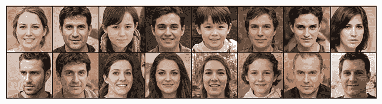
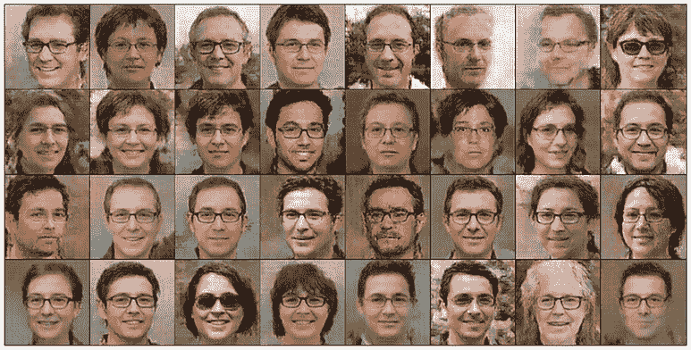
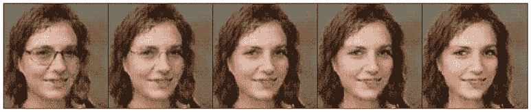
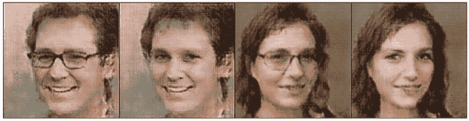
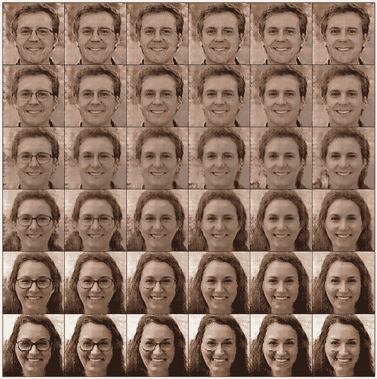

# 第五章：选择生成图像中的特征

本章涵盖了

+   构建条件生成对抗网络以生成具有特定属性的图像（例如，戴眼镜或不戴眼镜的人类面孔）

+   实现 Wasserstein 距离和梯度惩罚以改善图像质量

+   选择与不同特征相关的向量，以便训练的生成对抗网络模型生成具有特定特征的图像（例如，男性或女性面孔）

+   将条件生成对抗网络与向量选择相结合，以同时指定两个属性（例如，无眼镜的女性面孔或戴眼镜的男性面孔）

我们在第四章中用深度卷积生成对抗网络（DCGAN）生成的动漫面孔看起来很逼真。然而，你可能已经注意到，每个生成的图像都有不同的属性，例如发色、眼色以及头部是否向左或向右倾斜。你可能想知道是否有方法可以调整模型，使得生成的图像具有某些特征（例如，黑色头发且向左倾斜）。实际上，你可以做到。

在本章中，你将学习两种不同的方法来选择生成图像中的特征，以及它们各自的优缺点。第一种方法涉及在潜在空间中选择特定的向量。不同的向量对应不同的特征——例如，一个向量可能导致男性面孔，另一个可能导致女性面孔。第二种方法使用条件生成对抗网络（cGAN），这涉及到在标记数据上训练模型。这允许我们提示模型生成具有指定标签的图像，每个标签代表一个独特的特征——如戴眼镜或不戴眼镜的面孔。

此外，你将学会结合这两种方法，以便你可以同时选择图像的两个独立属性。结果，你可以生成四组不同的图像：戴眼镜的男性、无眼镜的男性、戴眼镜的女性和无眼镜的女性。为了使事情更有趣，你可以使用标签的加权平均值或输入向量的加权平均值来生成从一种属性过渡到另一种属性的图像。例如，你可以生成一系列图像，使得同一人的脸上的眼镜逐渐消失（标签算术）。或者你可以生成一系列图像，使得男性特征逐渐消失，男性面孔变成女性面孔（向量算术）。

能够单独进行向量算术或标签算术就像科幻小说一样，更不用说同时进行这两种操作了。整个体验让我们想起了亚瑟·C·克拉克（*2001 太空漫游*的作者）的名言：“任何足够先进的技术都与魔法无法区分。”

尽管第四章生成的动漫面孔在现实感上有所提高，但它们受到低分辨率的限制。训练 GAN 模型可能很棘手，并且经常受到样本量小或图像质量低等问题的影响。这些挑战可能会阻止模型收敛，导致图像质量差。为了解决这个问题，我们将在我们的 cGAN 中讨论并实现使用 Wasserstein 距离和梯度惩罚的改进训练技术。这种增强使得生成的人脸更加逼真，与上一章相比图像质量明显更好。

## 5.1 眼镜数据集

本章我们将使用眼镜数据集来训练一个 cGAN 模型。在下一章中，我们也将使用这个数据集在练习中训练一个 CycleGAN 模型：将戴眼镜的图片转换为不戴眼镜的图片，反之亦然。在本节中，你将学习如何下载数据集并预处理其中的图片。

本章和下一章中的 Python 程序改编自两个优秀的在线开源项目：Yashika Jain 的 Kaggle 项目[`mng.bz/JNVQ`](https://mng.bz/JNVQ)和 Aladdin Persson 的 GitHub 仓库[`mng.bz/w5yg`](https://mng.bz/w5yg)。我鼓励你在阅读本章和下一章时查看这两个项目。

### 5.1.1 下载眼镜数据集

我们使用的眼镜数据集来自 Kaggle。登录 Kaggle 并访问链接[`mng.bz/q0oz`](https://mng.bz/q0oz)下载图片文件夹以及右侧的两个 CSV 文件：`train.csv`和`test.csv`。文件夹/faces-spring-2020/中有 5,000 张图片。一旦你有了数据，请将图片文件夹和两个 CSV 文件都放在你电脑上的/fles/文件夹内。

接下来，我们将照片分类到两个子文件夹中：一个只包含戴眼镜的图片，另一个包含不戴眼镜的图片。

首先，让我们看看 train.csv 文件：

```py
!pip install pandas
import pandas as pd

train=pd.read_csv('files/train.csv')               ①
train.set_index('id', inplace=True)                ②
```

① 将 train.csv 文件中的数据加载为 pandas DataFrame

② 将 id 列的值设置为观察的索引

之前的代码单元导入`train.csv`文件并将变量`id`设置为每个观察的索引。文件中的`glasses`列有两个值：0 或 1，表示图片中是否有眼镜（0 表示没有眼镜；1 表示有眼镜）。

接下来，我们将图片分为两个不同的文件夹：一个包含戴眼镜的图片，另一个包含不戴眼镜的图片。

列表 5.1 对戴眼镜和不戴眼镜的图片进行分类

```py
import os, shutil

G='files/glasses/G/'
NoG='files/glasses/NoG/'
os.makedirs(G, exist_ok=True)                       ①
os.makedirs(NoG, exist_ok=True)                     ②
folder='files/faces-spring-2020/faces-spring-2020/'
for i in range(1,4501):
    oldpath=f"{folder}face-{i}.png"
    if train.loc[i]['glasses']==0:                  ③
        newpath=f"{NoG}face-{i}.png"
    elif train.loc[i]['glasses']==1:                ④
        newpath=f"{G}face-{i}.png"
    shutil.move(oldpath, newpath)
```

① 创建一个子文件夹/files/glasses/G/来存放戴眼镜的图片

② 创建一个子文件夹/files/glasses/NoG/来存放不戴眼镜的图片

③ 将标签为 0 的图片移动到文件夹 NoG

④ 将标签为 1 的图片移动到文件夹 G

在前面的代码单元中，我们首先使用 `os` 库在您的计算机上的 `/files/` 文件夹内创建两个子文件夹 `/glasses/G/` 和 `/glasses/NoG/`。然后，我们使用 `shutil` 库根据文件 `train.csv` 中的标签 `glasses` 将图像移动到这两个文件夹。标签为 1 的图像被移动到文件夹 G，而标签为 0 的图像被移动到文件夹 NoG。

### 5.1.2 在眼镜数据集中可视化图像

文件 `train.csv` 中的分类列 `glasses` 并不完美。例如，如果您访问计算机上的子文件夹 G，您会看到大多数图像都有眼镜，但大约 10% 的图像没有眼镜。同样，如果您访问子文件夹 NoG，您会发现大约 10% 的图像实际上有眼镜。您需要手动纠正这个问题，通过将图像从一个文件夹移动到另一个文件夹。这对我们后续的训练非常重要，因此您应该手动移动两个文件夹中的图像，使得一个文件夹只包含有眼镜的图像，另一个文件夹只包含无眼镜的图像。欢迎来到数据科学家的生活：修复数据问题是日常工作的一个部分！让我们首先可视化一些有眼镜的图像示例。

列表 5.2 使用眼镜可视化图像

```py
import random
import matplotlib.pyplot as plt
from PIL import Image

imgs=os.listdir(G)
random.seed(42)
samples=random.sample(imgs,16)               ①
fig=plt.figure(dpi=200, figsize=(8,2))
for i in range(16):                          ②
    ax = plt.subplot(2, 8, i + 1)
    img=Image.open(f"{G}{samples[i]}")
    plt.imshow(img)
    plt.xticks([])
    plt.yticks([])
plt.subplots_adjust(wspace=-0.01,hspace=-0.01)
plt.show()
```

① 从文件夹 G 中随机选择 16 个图像

② 在 2 × 8 网格中显示 16 个图像

如果您已经手动纠正了文件夹 G 中图像的错误标记，运行列表 5.2 中的代码后，您将看到 16 个有眼镜的图像。输出结果如图 5.1 所示。


图 5.1 训练数据集中有眼镜的样本图像

您可以将列表 5.2 中的 G 更改为 NoG 来可视化数据集中没有眼镜的 16 个样本图像。完整的代码在本书的 GitHub 仓库 [`github.com/markhliu/DGAI`](https://github.com/markhliu/DGAI) 中。输出结果如图 5.2 所示。



图 5.2 训练数据集中没有眼镜的样本图像

## 5.2 cGAN 和 Wasserstein 距离

cGAN 与您在第三章和第四章中看到的 GAN 模型类似，不同之处在于您为输入数据附加了一个标签。这些标签对应于输入数据中的不同特征。一旦训练好的 GAN 模型“学习”将某个标签与特征关联起来，您就可以向模型提供一个带有标签的随机噪声向量，以生成具有所需特征的输出。^(1)

GAN 模型通常会遇到诸如模式坍塌（生成器找到一种能够很好地欺骗判别器的输出类型，然后将输出坍塌到这些少数模式，忽略其他变化）、梯度消失和收敛缓慢等问题。Wasserstein GAN（WGAN）引入地球迁移距离（或 Wasserstein-1 距离）作为损失函数，提供更平滑的梯度流和更稳定的训练。它缓解了模式坍塌等问题.^(2) 我们将在本章中实现它，在 cGAN 训练中。请注意，WGAN 是一个独立于 cGAN 的概念：它使用 Wasserstein 距离来改进训练过程，可以应用于任何 GAN 模型（例如我们在第三章和第四章中创建的模型）。我们将结合这两个概念在一个设置中，以节省空间。

稳定 GAN 训练的其他方法

训练 GAN 模型时的问题在生成高分辨率图像时最为常见。模型架构通常很复杂，包含许多神经网络层。除了 WGAN 之外，渐进式 GAN 是另一种稳定训练的方法。渐进式 GAN 通过将高分辨率图像生成的复杂任务分解为可管理的步骤，从而增强了 GAN 训练的稳定性，允许更可控和有效的学习。有关详细信息，请参阅 Karas 等人撰写的“用于提高质量、稳定性和变化的 GAN 渐进式生长”，[`arxiv.org/abs/1710.10196`](https://arxiv.org/abs/1710.10196)。

### 5.2.1 带梯度惩罚的 WGAN

WGAN 是一种用于提高 GAN 模型训练稳定性和性能的技术。常规 GAN（例如你在第三章和第四章中看到的）有两个组件——生成器和判别器。生成器创建伪造数据，而判别器评估数据是否真实。训练涉及一个零和博弈的竞争，其中生成器试图欺骗判别器，而判别器试图准确分类真实和伪造数据实例。

研究人员提出了使用 Wasserstein 距离（两个分布之间差异的度量）而不是二元交叉熵作为损失函数，通过梯度惩罚项来稳定训练.^(3) 这种技术提供了更平滑的梯度流，并缓解了模式坍塌等问题。图 5.3 提供了 WGAN 的示意图。如图所示，与真实图像和伪造图像相关的损失是 Wasserstein 损失，而不是常规的二元交叉熵损失。


图 5.3 带有梯度惩罚的 WGAN。WGAN 中的判别器网络（我们称之为评论家）对输入图像进行评分：它试图将一个负无穷大的分数分配给一个假图像（左下角）和一个正无穷大的分数分配给真实图像（右上角）。此外，还向评论家展示了一个真实和假图像的插值图像（左上角），并在训练过程中将评论家对插值图像的梯度惩罚添加到总损失中。

此外，为了使 Wasserstein 距离能够正确工作，判别器（在 WGAN 中称为评论家）必须是 1-Lipschitz 连续的，这意味着评论家函数的梯度范数必须在任何地方都最多为 1。原始的 WGAN 论文提出了权重裁剪来强制执行 Lipschitz 约束。

为了解决权重裁剪问题，梯度惩罚被添加到损失函数中，以更有效地强制执行 Lipschitz 约束。为了实现带有梯度惩罚的 WGAN，我们首先在真实和生成数据点之间的直线上的点进行随机采样（如图 5.3 左上角的插值图像所示）。由于真实和假图像都附有标签，插值图像也附有标签，这是两个原始标签的插值值。然后，我们计算评论家输出对这些采样点的梯度。最后，我们将与 1（梯度惩罚项称为梯度惩罚）的偏差成比例的惩罚添加到损失函数中。也就是说，WGAN 中的梯度惩罚是一种通过更有效地强制执行 Lipschitz 约束来提高训练稳定性和样本质量的技术，解决了原始 WGAN 模型的局限性。

### 5.2.2 cGANs

cGAN 是基本 GAN 框架的扩展。在 cGAN 中，生成器和判别器（或评论家，因为我们是在相同的设置下实现 WGAN 和 cGAN）都基于一些额外的信息。这可能是一切，例如类别标签、来自其他模态的数据，甚至是文本描述。这种条件通常是通过将此附加信息输入到生成器和判别器中实现的。在我们的设置中，我们将类别标签添加到生成器和评论家的输入中：我们给戴眼镜的图像贴上标签，给不戴眼镜的图像贴上另一个标签。图 5.4 提供了 cGANs 训练过程的示意图。


图 5.4 cGANs 的训练过程

如您在图 5.4 的左上角所见，在 cGAN 中，生成器接收一个随机噪声向量和一个条件信息（一个标签，指示图像是否戴眼镜）作为输入。它使用这些信息生成看起来真实且与条件输入一致的数据。

评论家接收来自训练集的真实数据或生成器生成的伪造数据，以及条件信息（在我们的设置中，一个标签表示图像是否有眼镜）。其任务是确定给定数据是真实还是伪造，考虑条件信息（生成的图像中是否有眼镜？）。在图 5.4 中，我们使用评论家网络而不是判别器网络，因为我们同时实现了 cGAN 和 WGAN，但 cGAN 的概念也适用于传统的 GAN。

cGAN 的主要优势在于它们选择生成数据方面的能力，这使得它们更加灵活，适用于输出需要根据某些输入参数进行定向或条件化的场景。在我们的设置中，我们将训练 cGAN，以便我们能够选择生成的图像是否带有眼镜。

总结来说，cGAN 是基本 GAN 架构的一个强大扩展，它能够根据条件输入有针对性地生成合成数据。

## 5.3 创建 cGAN

在本节中，你将学习如何创建一个 cGAN 来生成带有或不带有眼镜的人类面部图像。你还将学习如何实现带有梯度惩罚的 WGAN 以稳定训练。

cGAN 中的生成器不仅使用随机噪声向量，还使用条件信息（如标签）作为输入来创建带有或不带有眼镜的图像。此外，WGAN 中的评论家网络与传统 GAN 中的判别器网络不同。你还将学习如何在本节中计算 Wasserstein 距离和梯度惩罚。

### 5.3.1 cGAN 中的评论家

在 cGAN 中，判别器是一个二元分类器，用于根据标签识别输入是真实还是伪造。在 WGAN 中，我们将判别器网络称为评论家。评论家评估输入并给出介于 −∞ 和 ∞ 之间的分数。分数越高，输入来自训练集（即真实）的可能性就越大。

列表 5.3 创建了评论家网络。其架构与我们第四章在生成动漫面孔彩色图像时使用的判别器网络有些相似。特别是，我们使用 PyTorch 中的七个 `Conv2d` 层逐步下采样输入，以便输出是一个介于 −∞ 和 ∞ 之间的单一值。

列表 5.3：具有 Wasserstein 距离的 cGAN 评论家网络

```py
class Critic(nn.Module):
    def __init__(self, img_channels, features):
        super().__init__()
        self.net = nn.Sequential(                              ①
            nn.Conv2d(img_channels, features, 
                      kernel_size=4, stride=2, padding=1),
            nn.LeakyReLU(0.2),
            self.block(features, features * 2, 4, 2, 1),
            self.block(features * 2, features * 4, 4, 2, 1),
            self.block(features * 4, features * 8, 4, 2, 1),
            self.block(features * 8, features * 16, 4, 2, 1),
            self.block(features * 16, features * 32, 4, 2, 1),
            nn.Conv2d(features * 32, 1, kernel_size=4,
                      stride=2, padding=0))                    ②
    def block(self, in_channels, out_channels, 
              kernel_size, stride, padding):
        return nn.Sequential(                                  ③
            nn.Conv2d(in_channels,out_channels,
                kernel_size,stride,padding,bias=False,),
            nn.InstanceNorm2d(out_channels, affine=True),
            nn.LeakyReLU(0.2))
    def forward(self, x):
        return self.net(x)
```

① 评论家网络有两个 Conv2d 层加上五个块。

② 输出只有一个特征，没有激活。

③ 每个块包含一个 Conv2d 层，一个 InstanceNorm2d 层，以及 LeakyReLU 激活。

评论家网络的输入是一个形状为 5 × 256 × 256 的彩色图像。前三个通道是颜色通道（红色、绿色和蓝色）。最后两个通道（第四和第五通道）是标签通道，用于告诉评论家图像是否带有眼镜。我们将在下一节中讨论实现这一机制的确切方法。

批判网络由七个 `Conv2d` 层组成。在第四章中，我们深入讨论了这些层的工作原理。它们通过在输入图像上应用一组可学习的滤波器来提取特征，以检测不同空间尺度上的模式和特征，从而有效地捕获输入数据的层次表示。然后，批判器根据这些表示评估输入图像。中间的五 `Conv2d` 层后面都跟着一个 `InstanceNorm2d` 层和一个 `LeakyReLU` 激活函数；因此，我们定义了一个 `block()` 方法来简化批判网络。`InstanceNorm2d` 层与我们在第四章中讨论的 `BatchNorm2d` 层类似，不同之处在于我们独立地对批处理中的每个实例进行归一化。

另一个关键点是，输出不再是介于 0 和 1 之间的值，因为我们没有在批判网络的最后一层使用 sigmoid 激活函数。相反，由于我们在 cGAN 中使用 Wasserstein 距离和梯度惩罚，输出是一个介于 −∞ 和 ∞ 之间的值。

### 5.3.2 cGAN 中的生成器

在 WGAN 中，生成器的任务是创建数据实例，以便它们可以被批判器以高分数评估。在 cGAN 中，生成器必须生成具有条件信息的数据实例（在我们的设置中是带有或不带有眼镜）。由于我们正在实现一个使用 Wasserstein 距离的 cGAN，我们将通过将标签附加到随机噪声向量来告诉生成器我们想要生成哪种类型的图像。我们将在下一节中讨论具体的机制。

我们创建了以下列表中所示的神经网络来表示生成器。

列表 5.4 cGAN 中的生成器

```py
class Generator(nn.Module):
    def __init__(self, noise_channels, img_channels, features):
        super(Generator, self).__init__()
        self.net = nn.Sequential(                             ①
            self.block(noise_channels, features *64, 4, 1, 0),
            self.block(features * 64, features * 32, 4, 2, 1),
            self.block(features * 32, features * 16, 4, 2, 1),
            self.block(features * 16, features * 8, 4, 2, 1),
            self.block(features * 8, features * 4, 4, 2, 1),
            self.block(features * 4, features * 2, 4, 2, 1),
            nn.ConvTranspose2d(
                features * 2, img_channels, kernel_size=4,
                stride=2, padding=1),    
            nn.Tanh())                                        ②
    def block(self, in_channels, out_channels, 
              kernel_size, stride, padding):
        return nn.Sequential(                                 ③
            nn.ConvTranspose2d(in_channels,out_channels,
                kernel_size,stride,padding,bias=False,),
            nn.BatchNorm2d(out_channels),
            nn.ReLU(),)
    def forward(self, x):
        return self.net(x)
```

① 生成器由七个 ConvTranspose2d 层组成。

② 使用 Tanh 激活将值压缩到范围 [–1, 1]，与训练集中的图像相同

③ 每个块由一个 ConvTranspose2d 层、一个 BatchNorm2d 层和 ReLU 激活函数组成。

我们将从 100 维潜在空间中随机噪声向量输入到生成器中。我们还将一个 2 值的一热编码图像标签输入到生成器中，以告诉它生成带有或不带有眼镜的图像。我们将这两部分信息连接起来，形成一个 102 维的输入变量输入到生成器中。然后，生成器根据潜在空间和标签信息生成彩色图像。

生成器网络由七个 `ConvTranspose2d` 层组成，其思路是镜像批判网络中的步骤来生成图像，正如我们在第四章中讨论的那样。前六个 `ConvTranspose2d` 层后面都跟着一个 `BatchNorm2d` 层和一个 `ReLU` 激活函数；因此，我们在生成器网络中定义了一个 `block()` 方法来简化架构。正如我们在第四章中所做的那样，我们在输出层使用 Tanh 激活函数，以便输出像素都在范围 -1 和 1 之间，与训练集中的图像相同。

### 5.3.3 权重初始化和梯度惩罚函数

在深度学习中，神经网络中的权重是随机初始化的。当网络架构复杂，存在许多隐藏层（在我们的设置中就是这样）时，权重的初始化方式至关重要。

因此，我们定义以下 `weights_init()` 函数来初始化生成器和评论家网络中的权重：

```py
def weights_init(m):
    classname = m.__class__.__name__
    if classname.find('Conv') != -1:
        nn.init.normal_(m.weight.data, 0.0, 0.02)
    elif classname.find('BatchNorm') != -1:
        nn.init.normal_(m.weight.data, 1.0, 0.02)
        nn.init.constant_(m.bias.data, 0)   
```

函数使用均值为 0 和标准差为 0.02 的正态分布值初始化 `Conv2d` 和 `ConvTranspose2d` 层的权重。它还使用均值为 1 和标准差为 0.02 的正态分布值初始化 `BatchNorm2d` 层的权重。我们在权重初始化中选择了较小的标准差，以避免梯度爆炸。

接下来，我们根据在上一个子节中定义的 `Generator()` 和 `Critic()` 类创建一个生成器和评论家。然后，我们根据之前定义的 `weights_init()` 函数初始化它们中的权重：

```py
z_dim=100
img_channels=3
features=16
gen=Generator(z_dim+2,img_channels,features).to(device)
critic=Critic(img_channels+2,features).to(device)
weights_init(gen)
weights_init(critic)
```

如往常一样，我们将使用 Adam 优化器对评论家和生成器进行优化：

```py
lr = 0.0001
opt_gen = torch.optim.Adam(gen.parameters(), 
                         lr = lr, betas=(0.0, 0.9))
opt_critic = torch.optim.Adam(critic.parameters(), 
                         lr = lr, betas=(0.0, 0.9))
```

生成器试图创建与给定标签的训练集中图像无法区分的图像。它将图像展示给评论家以获得对生成图像的高评分。另一方面，评论家试图在给定标签的条件下，对真实图像给予高评分，对假图像给予低评分。具体来说，评论家的损失函数有三个组成部分：

critic_value(fake) − critic_value(real) + weight × GradientPenalty

第一个项，*critic_value(fake)*，表示如果一幅图像是假的，评论家的目标是将其识别为假并给予低评价。第二个项，*− critic_value(real)*，表示如果图像是真实的，评论家的目标是将其识别为真实并给予高评价。此外，评论家还希望最小化梯度惩罚项，*weight* *× GradientPenalty*，其中*weight*是一个常数，用于确定我们希望分配给梯度范数偏差的惩罚程度。梯度惩罚的计算方法如下所示。

列表 5.5 计算梯度惩罚

```py
def GP(critic, real, fake):
    B, C, H, W = real.shape    
    alpha=torch.rand((B,1,1,1)).repeat(1,C,H,W).to(device)    
    interpolated_images = real*alpha+fake*(1-alpha)         ①
    critic_scores = critic(interpolated_images)             ②
    gradient = torch.autograd.grad(    
        inputs=interpolated_images,
        outputs=critic_scores,
        grad_outputs=torch.ones_like(critic_scores),
        create_graph=True,
        retain_graph=True)[0]                               ③
    gradient = gradient.view(gradient.shape[0], -1)
    gradient_norm = gradient.norm(2, dim=1)
    gp = torch.mean((gradient_norm - 1) ** 2)               ④
    return gp
```

① 创建真实图像和假图像的插值图像

② 获取关于插值图像的评论家值

③ 计算评论家值的梯度

④ 梯度惩罚是梯度范数与值 1 的平方偏差。

在函数 `GP()` 中，我们首先创建真实图像和假图像的插值图像。这是通过沿真实图像和生成图像之间直线随机采样点来完成的。想象一个滑块：一端是真实图像，另一端是假图像。当你移动滑块时，你会看到从真实到假的连续混合，插值图像代表中间的阶段。

然后，我们将插值图像呈现给评论网络以获取对其的评分，并计算评论网络输出相对于插值图像的梯度。最后，梯度惩罚被计算为梯度范数与目标值 1 的平方偏差。

## 5.4 训练 cGAN

正如我们在上一节中提到的，我们需要找到一种方法来告诉评论网络和生成网络图像标签是什么，以便它们知道图像是否有眼镜。

在本节中，你将首先学习如何向评论网络和生成网络的输入添加标签，以便生成网络知道要创建哪种类型的图像，而评论网络可以基于标签评估图像。之后，你将学习如何使用 Wasserstein 距离训练 cGAN。

### 5.4.1 为输入添加标签

我们首先预处理数据并将图像转换为 torch 张量：

```py
import torchvision.transforms as T
import torchvision

batch_size=16
imgsz=256
transform=T.Compose([
    T.Resize((imgsz,imgsz)),
    T.ToTensor(),
    T.Normalize([0.5,0.5,0.5],[0.5,0.5,0.5])])      
data_set=torchvision.datasets.ImageFolder(
    root=r"files/glasses",
    transform=transform) 
```

我们将批处理大小设置为 16，图像大小为 256x256 像素。像素值被选择，以便生成的图像分辨率高于上一章中的图像（64x64 像素）。由于图像尺寸较大，我们选择批处理大小为 16，小于第三章中的批处理大小。如果批处理大小太大，你的 GPU（甚至 CPU）可能会耗尽内存。

提示：如果你使用 GPU 训练，并且你的 GPU 内存较小（比如 6GB），考虑将批处理大小减少到小于 16 的较小数字，例如 10 或 8，这样你的 GPU 就不会耗尽内存。或者，你可以保持批处理大小为 16，但切换到 CPU 训练以解决 GPU 内存问题。

接下来，我们将标签添加到训练数据中。由于有两种类型的图像——有眼镜的图像和无眼镜的图像——我们将创建两个 one-hot 图像标签。有眼镜的图像将有一个 one-hot 标签[1, 0]，无眼镜的图像将有一个 one-hot 标签[0, 1]。

生成网络的输入是一个 100 个值的随机噪声向量。我们将 one-hot 标签与随机噪声向量连接，并将 102 个值的输入馈送到生成网络。评论网络输入是一个形状为 3x256x256 的三通道彩色图像（PyTorch 使用通道优先张量来表示图像）。我们如何将形状为 1x2 的标签附加到形状为 3x256x256 的图像上？解决方案是在输入图像中添加两个通道，使图像形状从(3, 256, 256)变为(5, 256, 256)：这两个额外的通道是 one-hot 标签。具体来说，如果一个图像中有眼镜，第四个通道将填充 1，第五个通道填充 0；如果一个图像中没有眼镜，第四个通道将填充 0，第五个通道填充 1。

在特征值多于两个的情况下创建标签

您可以轻松地将 cGAN 模型扩展到具有两个以上值的特征。例如，如果您创建一个生成不同头发颜色（黑色、金色和白色）的图像的模型，您馈送到生成器的图像标签可以分别具有值 [1, 0, 0]、[0, 1, 0] 和 [0, 0, 1]。在您将图像馈送到判别器或评论家之前，您可以附加三个通道到输入图像。例如，如果一个图像有黑色头发，第四个通道填充 1s，第五和第六个通道填充 0s。

此外，在眼镜示例中，由于标签中只有两个值，当您将标签馈送到生成器时，您可以潜在地使用值 0 和 1 来表示戴眼镜和不戴眼镜的图像。在您将图像馈送到评论家之前，您可以附加一个通道到输入图像：如果一个图像有眼镜，第四个通道填充 1s；如果一个图像没有眼镜，第四个通道填充 0s。我将把这个留给你作为练习。解决方案在本书的 GitHub 仓库中提供：[`github.com/markhliu/DGAI`](https://github.com/markhliu/DGAI)。

我们按照以下列表所示实现此更改。

列表 5.6 将标签附加到输入图像

```py
newdata=[]    
for i,(img,label) in enumerate(data_set):
    onehot=torch.zeros((2))
    onehot[label]=1
    channels=torch.zeros((2,imgsz,imgsz))                   ①
    if label==0:
        channels[0,:,:]=1                                   ②
    else:
        channels[1,:,:]=1                                   ③
    img_and_label=torch.cat([img,channels],dim=0)           ④
    newdata.append((img,label,onehot,img_and_label))
```

① 创建两个填充为 0s 的额外通道，每个通道的形状为 256x256，与输入图像中每个通道的维度相同

② 如果原始图像标签是 0，则将第四个通道填充为 1s

③ 如果原始图像标签是 1，则将第五个通道填充为 1s

④ 将第四和第五个通道添加到原始图像中，形成一个五通道标签图像

提示：在我们之前使用 `torchvision.datasets.ImageFolder()` 方法从文件夹 /files/glasses 加载图像时，PyTorch 按字母顺序将标签分配给每个子文件夹中的图像。因此，/files/glasses/G/ 中的图像被分配标签 0，而 /files/glasses/NoG/ 中的图像被分配标签 1。

我们首先创建一个空的列表 `newdata` 来保存带有标签的图像。我们创建一个形状为 (2, 256, 256) 的 PyTorch 张量，将其附加到原始输入图像上，以形成一个形状为 (5, 256, 256) 的新图像。如果原始图像标签是 0（这意味着图像来自文件夹 /files/glasses/G/），我们填充第四个通道为 1s，第五个通道为 0s，以便评论家知道这是一张戴眼镜的图像。另一方面，如果原始图像标签是 1（这意味着图像来自文件夹 /files/glasses/NoG/），我们填充第四个通道为 0s，第五个通道为 1s，以便评论家知道这是一张不带眼镜的图像。

我们创建一个具有批次的迭代器（为了提高训练过程中的计算效率、内存使用和优化动态），如下所示：

```py
data_loader=torch.utils.data.DataLoader(
    newdata,batch_size=batch_size,shuffle=True)
```

### 5.4.2 训练 cGAN

现在我们有了训练数据和两个网络，我们将训练 cGAN。我们将使用视觉检查来确定何时停止训练。

模型训练完成后，我们将丢弃评论家网络，并使用生成器创建具有特定特征（在我们的例子中是带眼镜或不带眼镜）的图像。

我们将创建一个函数来定期检查生成的图像的外观。

列表 5.7 检查生成的图像

```py
def plot_epoch(epoch):
    noise = torch.randn(32, z_dim, 1, 1)
    labels = torch.zeros(32, 2, 1, 1)
    labels[:,0,:,:]=1                                            ①
    noise_and_labels=torch.cat([noise,labels],dim=1).to(device)
    fake=gen(noise_and_labels).cpu().detach()                    ②
    fig=plt.figure(figsize=(20,10),dpi=100)
    for i in range(32):                                          ③
        ax = plt.subplot(4, 8, i + 1)
        img=(fake.cpu().detach()[i]/2+0.5).permute(1,2,0)
        plt.imshow(img)
        plt.xticks([])
        plt.yticks([])
    plt.subplots_adjust(hspace=-0.6)
    plt.savefig(f"files/glasses/G{epoch}.png")
    plt.show() 
    noise = torch.randn(32, z_dim, 1, 1)
    labels = torch.zeros(32, 2, 1, 1)
    labels[:,1,:,:]=1                                            ④
    … (code omitted)
```

① 为带眼镜的图像创建一个独热标签

② 将拼接的噪声向量和标签输入生成器以创建带眼镜的图像

③ 绘制带有眼镜的生成图像

④ 为不带眼镜的图像创建一个独热标签

每个训练周期结束后，我们将要求生成器创建一组带眼镜的图像和一组不带眼镜的图像。然后我们绘制这些图像，以便我们可以直观地检查它们。要创建带眼镜的图像，我们首先创建一个独热标签[1, 0]，并将其附加到随机噪声向量上，然后再将拼接的向量输入到生成器网络中。由于标签是[1, 0]而不是[0, 1]，生成器创建了带眼镜的图像。然后我们在四行八列中绘制生成的图像，并将子图保存在您的计算机上。创建不带眼镜的图像的过程类似，只是我们使用独热标签[0, 1]而不是[1, 0]。我在列表 5.7 中省略了一部分代码，但您可以在本书的 GitHub 仓库中找到它：[`github.com/markhliu/DGAI`](https://github.com/markhliu/DGAI)。

我们定义了一个`train_batch()`函数，用于使用一批数据训练模型。

列表 5.8 使用一批数据训练模型

```py
def train_batch(onehots,img_and_labels,epoch):
    real = img_and_labels.to(device)                            ①
    B = real.shape[0]
    for _ in range(5):    
        noise = torch.randn(B, z_dim, 1, 1)
        onehots=onehots.reshape(B,2,1,1)
        noise_and_labels=torch.cat([noise,onehots],dim=1).to(device)
        fake_img = gen(noise_and_labels).to(device)
        fakelabels=img_and_labels[:,3:,:,:].to(device)
        fake=torch.cat([fake_img,fakelabels],dim=1).to(device)  ②
        critic_real = critic(real).reshape(-1)
        critic_fake = critic(fake).reshape(-1)
        gp = GP(critic, real, fake)    
        loss_critic=(-(torch.mean(critic_real) - 
           torch.mean(critic_fake)) + 10 * gp)                  ③
        critic.zero_grad()
        loss_critic.backward(retain_graph=True)
        opt_critic.step()
    gen_fake = critic(fake).reshape(-1)
    loss_gen = -torch.mean(gen_fake)                            ④
    gen.zero_grad()
    loss_gen.backward()
    opt_gen.step()
    return loss_critic, loss_gen
```

① 带有标签的一批真实图像

② 带有标签的一批生成图像

③ 评论家的总损失有三个组成部分：评估真实图像的损失、评估伪造图像的损失以及梯度惩罚损失。

④ 使用 Wasserstein 损失训练生成器

在`train_batch()`函数中，我们首先使用真实图像训练评论家。我们还要求生成器根据给定的标签创建一批伪造数据。然后我们使用伪造图像训练评论家。在`train_batch()`函数中，我们还使用一批伪造数据训练生成器。

注意：评论家的损失有三个组成部分：评估真实图像的损失、评估伪造图像的损失以及梯度惩罚损失。

现在我们对模型进行 100 个周期的训练：

```py
for epoch in range(1,101):
    closs=0
    gloss=0
    for _,_,onehots,img_and_labels in data_loader:              ①
        loss_critic, loss_gen = train_batch(onehots,\
                                img_and_labels,epoch)           ②
        closs+=loss_critic.detach()/len(data_loader)
        gloss+=loss_gen.detach()/len(data_loader)
    print(f"at epoch {epoch},\
    critic loss: {closs}, generator loss {gloss}")
    plot_epoch(epoch)
torch.save(gen.state_dict(),'files/cgan.pth')                   ③
```

① 遍历训练数据集中的所有批次

② 使用一批数据训练模型

③ 保存训练生成器的权重

每个训练周期结束后，我们打印出评论家损失和生成器损失，以确保损失在合理的范围内。我们还使用我们之前定义的`plot_epoch()`函数生成 32 张带眼镜的面部图像以及 32 张不带眼镜的面部图像。训练完成后，我们在本地文件夹中保存训练生成器的权重，以便以后可以使用训练模型生成图像。

如果你使用 GPU 训练，这种训练大约需要 30 分钟。否则，可能需要几个小时，具体取决于你电脑的硬件配置。或者，你可以从我的网站下载训练好的模型：[`gattonweb.uky.edu/faculty/lium/gai/cgan.zip`](https://gattonweb.uky.edu/faculty/lium/gai/cgan.zip)。下载后请解压文件。

## 5.5 在生成的图像中选择特征

生成具有特定特征的图像至少有两种方法。第一种是在将随机噪声向量输入到训练好的 cGAN 模型之前为其附加标签。不同的标签会导致生成的图像具有不同的特征（在我们的例子中，图像是否包含眼镜）。第二种方法是选择输入到训练模型的噪声向量：一个向量会导致具有男性面部的图像，另一个向量会导致具有女性面部的图像。请注意，第二种方法即使在传统的 GAN（如我们在第四章训练的 GAN）中也有效。它同样适用于 cGAN。

更好的是，在本节中，你将学习如何结合这两种方法，以便你可以同时选择两个特征：带有眼镜的男性面部或无眼镜的女性面部，等等。

在选择生成图像中的特定特征时，这两种方法各有优缺点。第一种方法，cGAN，需要标记数据来训练模型。有时，标记数据可能难以整理。然而，一旦你成功训练了一个 cGAN，你就可以生成具有特定特征的广泛图像。在我们的例子中，你可以生成许多不同的带有眼镜（或无眼镜）的图像；每张图像都与其他图像不同。第二种方法，手动选择噪声向量，不需要标记数据来训练模型。然而，每个手动选择的噪声向量只能生成一张图像。如果你想生成与 cGAN 相同特征的许多不同图像，你将需要事先手动选择许多不同的噪声向量。

### 5.5.1 选择是否带有眼镜的图像

在将随机噪声向量附加标签 [1, 0] 或 [0, 1] 并将其输入到训练好的 cGAN 模型之前，你可以选择生成的图像是否包含眼镜。

首先，我们将使用训练好的模型生成 32 张带有眼镜的图像，并在 4 × 8 网格中绘制它们。为了使结果可重复，我们将在 PyTorch 中固定随机状态。此外，我们将使用相同的随机噪声向量集，以便我们查看相同的面部集合。

我们将随机状态固定在种子 0，并生成 32 张带有眼镜的面部图像。

列表 5.9 生成带有眼镜的人类面部图像

```py
torch.manual_seed(0)                                            ①

generator=Generator(z_dim+2,img_channels,features).to(device)
generator.load_state_dict(torch.load("files/cgan.pth",
    map_location=device))                                       ②
generator.eval()

noise_g=torch.randn(32, z_dim, 1, 1)                            ③
labels_g=torch.zeros(32, 2, 1, 1)
labels_g[:,0,:,:]=1                                             ④
noise_and_labels=torch.cat([noise_g,labels_g],dim=1).to(device)
fake=generator(noise_and_labels)
plt.figure(figsize=(20,10),dpi=50)
for i in range(32):
    ax = plt.subplot(4, 8, i + 1)
    img=(fake.cpu().detach()[i]/2+0.5).permute(1,2,0)
    plt.imshow(img.numpy())
    plt.xticks([])
    plt.yticks([])
plt.subplots_adjust(wspace=-0.08,hspace=-0.01)
plt.show()
```

① 固定随机状态以确保结果可重复

② 加载训练好的权重

③ 生成一组随机噪声向量并将其保存，以便我们可以从中选择某些向量进行向量运算

④ 创建标签以生成带有眼镜的图像

我们创建了`Generator()`类的另一个实例，并将其命名为`generator`。然后我们加载上一节中保存在本地文件夹中的训练好的权重（或者你也可以从我的网站上下载权重：[`mng.bz/75Z4`](https://mng.bz/75Z4)）。为了生成 32 张带眼镜的人类面部图像；我们首先在潜在空间中绘制 32 个随机噪声向量。我们还将创建一组标签，并将其命名为`labels_g`，它们告诉生成器生成 32 张带眼镜的图像。

如果你运行列表 5.9 中的程序，你会看到如图 5.5 所示的 32 张图像。



图 5.5 由训练好的 cGAN 模型生成的带眼镜的人类面部图像

首先，所有 32 张图像中确实都包含眼镜。这表明训练好的 cGAN 模型能够根据提供的标签生成图像。你可能已经注意到，有些图像具有男性特征，而有些图像具有女性特征。为了让我们为下一节中的向量运算做准备，我们将选择一个导致具有男性特征的图像和一个导致具有女性特征的图像的随机噪声向量。在检查图 5.5 中的 32 张图像后，我们选择了索引值为 0 和 14 的图像，如下所示：

```py
z_male_g=noise_g[0]
z_female_g=noise_g[14]
```

为了生成 32 张无眼镜的图像，我们首先生成另一组随机噪声向量和标签：

```py
noise_ng = torch.randn(32, z_dim, 1, 1)
labels_ng = torch.zeros(32, 2, 1, 1)
labels_ng[:,1,:,:]=1
```

新的随机噪声向量集被命名为`noise_ng`，新的标签集被命名为`labels_ng`。将它们输入到生成器中，你应该会看到 32 张没有眼镜的图像，如图 5.6 所示。

图 5.6 中的 32 张面孔中没有任何一张带有眼镜：训练好的 cGAN 模型可以根据给定的标签生成图像。我们选择了索引为 8（男性）和 31（女性）的图像，为下一节中的向量运算做准备：

```py
z_male_ng=noise_ng[8]
z_female_ng=noise_ng[31]
```


图 5.6 由训练好的 cGAN 模型生成的无眼镜的人类面部图像

接下来，我们将使用标签插值来执行标签运算。回想一下，两个标签`noise_g`和`noise_ng`分别指示训练好的 cGAN 模型创建带眼镜和不带眼镜的图像。如果我们向模型提供一个插值标签（两个标签[1, 0]和[0, 1]的加权平均值）会怎样？训练好的生成器会生成什么类型的图像？让我们来看看。

列表 5.10 cGAN 中的标签运算

```py
weights=[0,0.25,0.5,0.75,1]                                     ①
plt.figure(figsize=(20,4),dpi=300)
for i in range(5):
    ax = plt.subplot(1, 5, i + 1)
    # change the value of z
    label=weights[i]*labels_ng[0]+(1-weights[i])*labels_g[0]    ②
    noise_and_labels=torch.cat(
        [z_female_g.reshape(1, z_dim, 1, 1),
         label.reshape(1, 2, 1, 1)],dim=1).to(device)
    fake=generator(noise_and_labels).cpu().detach()             ③
    img=(fake[0]/2+0.5).permute(1,2,0)
    plt.imshow(img)
    plt.xticks([])
    plt.yticks([])
plt.subplots_adjust(wspace=-0.08,hspace=-0.01)
plt.show()
```

① 创建五个权重

② 创建两个标签的加权平均值

③ 将新的标签给训练好的模型以创建图像

我们首先创建了五个权重（w）：0，0.25，0.5，0.75 和 1，它们在 0 和 1 之间均匀分布。这五个 w 值中的每一个都是我们放在无眼镜标签 `labels_ng` 上的权重。互补权重放在眼镜标签 `labels_g` 上。因此，插值标签的值为 `w*labels_ng+(1-w)*labels_g`。然后我们将插值标签输入到训练好的模型中，以及我们之前保存的随机噪声向量 `z_female_g`。基于五个 w 值生成的五个图像被绘制在一个 1×5 的网格中，如图 5.7 所示。



图 5.7 cGAN 中的标签算术。我们首先创建两个标签：无眼镜标签 `labels_ng` 和眼镜标签 `labels_g`。这两个标签指示训练好的生成器分别生成带眼镜和不带眼镜的图像。然后我们创建了五个插值标签，每个标签都是原始两个标签的加权平均值：`w*labels_ng+(1-w)*labels_g`，其中权重 `w` 取五个不同的值，0，0.25，0.5，0.75 和 1。基于五个插值标签生成的五个图像显示在图中。最左边的图像有眼镜。当我们从左到右移动时，眼镜逐渐消失，直到最右边的图像中没有眼镜。

当你从左到右查看图 5.7 中的五个生成图像时，你会注意到眼镜逐渐消失。左边的图像有眼镜，而右边的图像没有眼镜。中间的三张图像显示了一些眼镜的迹象，但眼镜并不像第一张图像中那么显眼。

练习 5.1

由于我们在列表 5.10 中使用了随机噪声向量 `z_female_g`，图 5.7 中的图像具有女性脸。将噪声向量更改为列表 5.10 中的 `z_male_g` 并重新运行程序；看看图像是什么样的。

### 5.5.2 潜在空间中的向量算术

你可能已经注意到，一些生成的人脸图像具有男性特征，而另一些则具有女性特征。你可能想知道：我们能否在生成的图像中选择男性或女性特征？答案是肯定的。我们可以通过在潜在空间中选择噪声向量来实现这一点。

在上一个子节中，我们已经保存了两个随机噪声向量，`z_male_ng` 和 `z_female_ng`，分别对应男性脸和女性脸的图像。接下来，我们将这两个向量的加权平均值（即插值向量）输入到训练好的模型中，看看生成的图像是什么样的。

列表 5.11 向量算术以选择图像特征

```py
weights=[0,0.25,0.5,0.75,1]                                 ①
plt.figure(figsize=(20,4),dpi=50)
for i in range(5):
    ax = plt.subplot(1, 5, i + 1)
    # change the value of z
    z=weights[i]*z_female_ng+(1-weights[i])*z_male_ng       ②  
    noise_and_labels=torch.cat(
        [z.reshape(1, z_dim, 1, 1),
         labels_ng[0].reshape(1, 2, 1, 1)],dim=1).to(device)    
    fake=generator(noise_and_labels).cpu().detach()         ③
    img=(fake[0]/2+0.5).permute(1,2,0)
    plt.imshow(img)
    plt.xticks([])
    plt.yticks([])
plt.subplots_adjust(wspace=-0.08,hspace=-0.01)
plt.show()
```

① 创建五个权重

② 创建两个随机噪声向量的加权平均值

③ 将新的随机噪声向量输入到训练好的模型中，以创建一个图像

我们创建了五个权重，0，0.25，0.5，0.75 和 1。我们遍历这五个权重，创建两个随机噪声向量的五个加权平均值，`w*z_female_ng+(1-w)*z_male_ng`。然后我们将这五个向量以及标签`labels_ng`输入到训练好的模型中，以获得五个图像，如图 5.8 所示。


图 5.8 GAN 中的向量算术。我们首先保存两个随机噪声向量`z_female_ng`和`z_male_ng`。这两个向量分别导致女性和男性面孔的图像。然后我们创建五个插值向量，每个向量都是原始两个向量的加权平均值：`w*z_female_ng+(1-w)*z_male_ng`，其中权重`w`取五个不同的值，0，0.25，0.5，0.75 和 1。基于五个插值向量的五个生成的图像如图所示。最左边的图像具有男性特征。当我们从左向右移动时，男性特征逐渐消失，女性特征逐渐出现，直到最右边的图像显示女性面孔。

向量算术可以从一个图像实例过渡到另一个图像实例。由于我们偶然选择了男性和女性图像，当你从左到右查看图 5.8 中的五个生成的图像时，你会注意到男性特征逐渐消失，女性特征逐渐出现。第一张图像显示男性面孔，而最后一张图像显示女性面孔。

练习 5.2

由于我们在列表 5.11 中使用了标签`labels_ng`，图 5.8 中的图像中没有眼镜。在列表 5.11 中将标签更改为`labels_g`并重新运行程序，以查看图像的外观。

### 5.5.3 同时选择两个特征

到目前为止，我们一次只选择一个特征。通过选择标签，你已经学会了如何生成带眼镜或不带眼镜的图像。通过选择特定的噪声向量，你已经学会了如何选择生成的图像的特定实例。

如果你想同时选择两个特征（例如眼镜和性别），这两个独立特征的组合有四种可能：有眼镜的男性面孔、无眼镜的男性面孔、有眼镜的女性面孔和无眼镜的女性面孔。接下来我们将生成每种类型的图像。

列表 5.12 同时选择两个特征

```py
plt.figure(figsize=(20,5),dpi=50)
for i in range(4):                                          ①
    ax = plt.subplot(1, 4, i + 1)
    p=i//2    
    q=i%2    
    z=z_female_g*p+z_male_g*(1-p)                           ②
    label=labels_ng[0]*q+labels_g[0]*(1-q)                  ③
    noise_and_labels=torch.cat(
        [z.reshape(1, z_dim, 1, 1),
         label.reshape(1, 2, 1, 1)],dim=1).to(device)       ④
    fake=generator(noise_and_labels)
    img=(fake.cpu().detach()[0]/2+0.5).permute(1,2,0)
    plt.imshow(img.numpy())
    plt.xticks([])
    plt.yticks([])
plt.subplots_adjust(wspace=-0.08,hspace=-0.01)
plt.show()
```

① 遍历 0 到 3

② p 的值可以是 0 或 1，用于选择随机噪声向量以生成男性或女性面孔。

③ q 的值可以是 0 或 1，用于选择标签以确定生成的图像中是否包含眼镜。

④ 将随机噪声向量与标签结合以选择两个特征

要生成四个图像以覆盖四种不同的情况，我们需要使用其中一个噪声向量作为输入：`z_female_g` 或 `z_male_g`。我们还需要将一个标签附加到输入上，这个标签可以是 `labels_ng` 或 `labels_g`。为了使用一个单独的程序覆盖所有四种情况，我们遍历 i 的四个值，0 到 3，并创建两个值，p 和 q，它们是 i 除以 2 的整数商和余数。因此，p 和 q 的值可以是 0 或 1。通过将随机噪声向量的值设置为 `z_female_g*p+z_male_g*(1-p)`，我们可以选择一个随机噪声向量来生成男性或女性面孔。同样，通过将标签的值设置为 `labels_ng[0]*q+labels_g[0]*(1-q)`，我们可以选择一个标签来决定生成的图像中是否包含眼镜。一旦我们将随机噪声向量与标签结合并输入到训练好的模型中，我们就可以同时选择两个特征。

如果你运行列表 5.12 中的程序，你会看到如图 5.9 所示的四个图像。



图 5.9 同时在生成的图像中选择两个特征。我们从以下两个选项中选择一个噪声向量：`z_female_ng` 和 `z_male_ng`。我们还从以下两个选项中选择一个标签：`labels_ng` 和 `labels_g`。然后我们将噪声向量和标签输入到训练好的生成器中，以创建一个图像。根据噪声向量和标签的值，训练好的模型可以创建四种类型的图像。通过这种方式，我们有效地在生成的图像中选择了两个独立特征：一个男性或女性面孔，以及图像中是否包含眼镜。

图 5.9 中生成的四个图像有两个独立特征：一个男性或女性面孔，以及图像中是否包含眼镜。第一幅图像显示了一个戴眼镜的男性面孔；第二幅图像是一个不戴眼镜的男性面孔。第三幅图像是一个戴眼镜的女性面孔，而最后一幅图像显示了一个不戴眼镜的女性面孔。

练习 5.3

我们在列表 5.12 中使用了两个随机噪声向量 `z_female_g` 和 `z_male_g`。将这两个随机噪声向量改为 `z_female_ng` 和 `z_male_ng`，然后重新运行程序，看看图像看起来像什么。

最后，我们可以同时进行标签算术和向量算术。也就是说，我们可以将插值噪声向量和插值标签输入到训练好的 cGAN 模型中，看看生成的图像是什么样子。你可以通过运行以下代码块来实现：

```py
plt.figure(figsize=(20,20),dpi=50)
for i in range(36):
    ax = plt.subplot(6,6, i + 1)
    p=i//6
    q=i%6 
    z=z_female_ng*p/5+z_male_ng*(1-p/5)
    label=labels_ng[0]*q/5+labels_g[0]*(1-q/5)
    noise_and_labels=torch.cat(
        [z.reshape(1, z_dim, 1, 1),
         label.reshape(1, 2, 1, 1)],dim=1).to(device)
    fake=generator(noise_and_labels)
    img=(fake.cpu().detach()[0]/2+0.5).permute(1,2,0)
    plt.imshow(img.numpy())
    plt.xticks([])
    plt.yticks([])
plt.subplots_adjust(wspace=-0.08,hspace=-0.01)
plt.show()
```

代码与列表 5.12 中的代码类似，除了 p 和 q 每个都可以取六个不同的值：0、1、2、3、4 和 5。随机噪声向量 `z_female_ng*p/5+z_male_ng*(1-p/5)` 根据 p 的值取六个不同的值。标签 `labels_ng[0]*q/5+labels_g[0]*(1-q/5)` 根据 q 的值取六个不同的值。因此，基于插值噪声向量和插值标签，我们有 36 种不同的图像组合。如果你运行前面的程序，你会看到如图 5.10 所示的 36 张图像。



图 5.10 同时进行向量算术和标签算术。i 的值从 0 变化到 35；p 和 q 分别是 i 除以 6 的整数商和余数。因此，p 和 q 每个都可以取六个不同的值：0、1、2、3、4 和 5。插值噪声向量 `z_female_ng*p/5+z_male_ng*(1-p/5)` 和插值标签 `labels_ng[0]*q/5+labels_g[0]*(1-q/5)` 都可以取六个不同的值。在每一行中，从左到右，眼镜逐渐消失。在每一列中，从上到下，图像逐渐从男性面孔变为女性面孔。

图 5.10 中有 36 张图像。插值噪声向量是两个随机噪声向量 `z_female_ng` 和 `z_male_ng` 的加权平均值，分别生成女性面孔和男性面孔。标签是两个标签 `labels_ng` 和 `labels_g` 的加权平均值，它们决定生成的图像中是否有眼镜。训练模型根据插值噪声向量和插值标签生成 36 张不同的图像。在每一行中，从左到右，眼镜逐渐消失。也就是说，我们在每一行中进行标签算术。在每一列中，从上到下，图像逐渐从男性面孔变为女性面孔。也就是说，我们在每一列中进行向量算术。

练习 5.4

在这个项目中，标签中有两个值：一个表示眼镜，一个表示没有眼镜。因此，我们可以使用二进制值而不是 one-hot 变量作为标签。更改本章的程序，并使用值 1 和 0（而不是 [1, 0] 和 [0, 1]）来表示有眼镜和无眼镜的图像。将 1 或 0 附着到随机噪声向量上，以便向生成器提供 101 值的向量。在将图像输入到评论家之前，附加一个通道：如果图像中有眼镜，第四个通道填充 0s；如果图像中没有眼镜，第四个通道填充 1s。然后创建一个生成器和评论家；使用训练数据集来训练它们。解决方案在本书的 GitHub 仓库中提供，包括本章其他三个练习的解决方案。

既然你已经见证了 GAN 模型的能力，你将在下一章通过使用 GAN 进行风格迁移来进一步探索。例如，你将学习如何构建 CycleGAN 模型，并使用名人面部图像对其进行训练，以便在这些图像中将金发变为黑发或将黑发变为金发。相同的模型可以在其他数据集上训练：例如，你可以在本章中使用的人类面部数据集上训练它，以便在人类面部图像中添加或移除眼镜。

## 摘要

+   通过在潜在空间中选择一个特定的噪声向量并将其输入到训练好的 GAN 模型中，我们可以选择生成图像中的某个特定特征，例如图像中是否有男性或女性面部。

+   cGAN 与传统的 GAN 不同。我们在标记数据上训练模型，并要求训练好的模型生成具有特定属性的数据。例如，一个标签告诉模型生成戴眼镜的人类面部图像，而另一个标签则告诉模型创建不戴眼镜的人类面部图像。

+   在 cGAN 训练完成后，我们可以使用一系列标签的加权平均来生成从由一个标签表示的图像过渡到由另一个标签表示的图像的图像——例如，一系列同一人面部上的眼镜逐渐消失的图像。我们称这种算术为标签算术。

+   我们还可以使用两个不同噪声向量的加权平均来创建从一种属性过渡到另一种属性的图像——例如，一系列男性特征逐渐消失，女性特征逐渐出现的图像。我们称这种向量为向量算术。

+   Wasserstein GAN (WGAN) 是一种通过使用 Wasserstein 距离而不是二元交叉熵作为损失函数来提高 GAN 模型训练稳定性和性能的技术。此外，为了 Wasserstein 距离能够正确工作，WGAN 中的评判器必须是 1-Lipschitz 连续的，这意味着评判器函数的梯度范数必须在任何地方都小于等于 1。WGAN 中的梯度惩罚通过向损失函数添加正则化项来更有效地强制执行 Lipschitz 约束。

* * *

^(1)  Mehdi Mirza, Simon Osindero, 2014, “Conditional Generative Adversarial Nets.” [`arxiv.org/abs/1411.1784`](https://arxiv.org/abs/1411.1784).

^(2)  Martin Arjovsky, Soumith Chintala, 和 Léon Bottou, 2017, “Wasserstein GAN.” [`arxiv.org/abs/1701.07875`](https://arxiv.org/abs/1701.07875).

^(3)  Martin Arjovsky, Soumith Chintala, 和 Leon Bottou, 2017, “Wasserstein GAN.” [`arxiv.org/abs/1701.07875`](https://arxiv.org/abs/1701.07875); 以及 Ishaan Gulrajani, Faruk Ahmed, Martin Arjovsky, Vincent Dumoulin, 和 Aaron Courville, 2017, “Improved Training of Wasserstein GANs.” [`arxiv.org/abs/1704.00028`](https://arxiv.org/abs/1704.00028).
