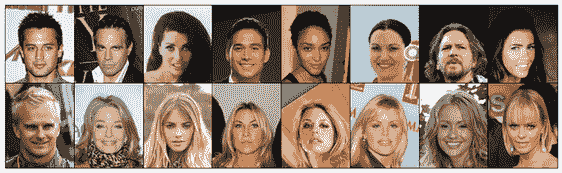
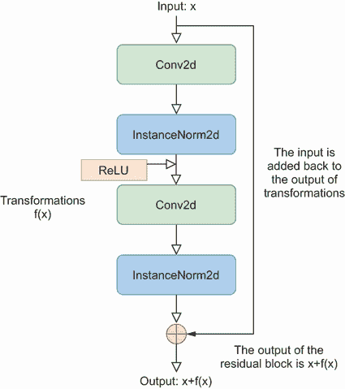
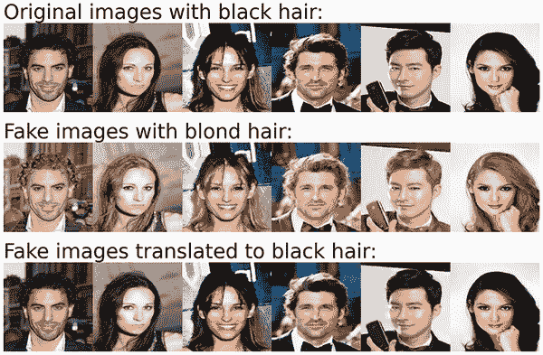

# 第六章：CycleGAN：将金发转换为黑发

本章涵盖

+   CycleGAN 及其循环一致性损失背后的理念

+   构建 CycleGAN 模型以将图像从一个领域转换为另一个领域

+   使用具有两个图像领域的任何数据集训练 CycleGAN

+   将黑发转换为金发，反之亦然

我们在前三章中讨论的生成对抗网络（GAN）模型都在尝试生成与训练集中图像无法区分的图像。

你可能想知道：我们能否将图像从一个领域转换为另一个领域，例如将马变成斑马，将黑发转换为金发或将金发转换为黑发，在图像中添加或去除眼镜，将照片转换为画作，或将冬季场景转换为夏季场景？实际上，你可以做到，你将在本章通过 CycleGAN 获得这样的技能！

CycleGAN 于 2017 年提出.^(1) CycleGAN 的关键创新是其能够在没有成对示例的情况下学习在不同领域之间进行转换。CycleGAN 有各种有趣和有用的应用，例如模拟面部老化或年轻化过程以协助数字身份验证或在不实际创建每个变体的情况下可视化不同颜色或图案的服装，以简化设计过程。

CycleGAN 使用循环一致性损失函数来确保原始图像可以从转换后的图像中重建，从而鼓励保留关键特征。循环一致性损失背后的理念真正巧妙，值得在此强调。本章中的 CycleGAN 有两个生成器：让我们分别称它们为黑发生成器和金发生成器。黑发生成器接收一张带有金发的图像（而不是像之前看到的随机噪声向量），并将其转换为一张带有黑发的图像，而金发生成器接收一张带有黑发的图像并将其转换为一张带有金发的图像。

为了训练模型，我们将一张带有黑发的真实图像给金发生成器，以生成一张带有金发的假图像。然后，我们将假金发图像给黑发生成器，将其转换回一张带有黑发的图像。如果两个生成器都工作得很好，经过一次往返转换后，原始黑发图像与假图像之间的差异很小。为了训练 CycleGAN，我们调整模型参数以最小化对抗损失和循环一致性损失的加权和。与第三章和第四章一样，对抗损失用于量化生成器欺骗判别器的能力以及判别器区分真实和假样本的能力。循环一致性损失，CycleGAN 的独特概念，衡量了原始图像和经过往返转换的假图像之间的差异。将循环一致性损失包含在总损失函数中是 CycleGAN 的关键创新。

在训练 CycleGAN 时，我们将黑发和金发图像作为两个域的例子。然而，该模型可以应用于任何两个图像域。为了强调这一点，我将要求你使用第五章中使用的带眼镜和不带眼镜的图像来训练相同的 CycleGAN 模型。解决方案在本书的 GitHub 仓库中提供（[`github.com/markhliu/DGAI`](https://github.com/markhliu/DGAI)），你将看到训练好的模型确实可以从人脸图像中添加或移除眼镜。

## 6.2 CycleGAN 与循环一致性损失

CycleGAN 扩展了基本的 GAN 架构，包括两个生成器和两个判别器。每个生成器-判别器对负责学习两个不同域之间的映射。它旨在将图像从一个域转换到另一个域（例如，马到斑马，夏景到冬景等），同时保留原始图像的关键特征。它使用循环一致性损失来确保可以从转换后的图像重建原始图像，从而鼓励保留关键特征。

在本节中，我们将首先讨论 CycleGAN 的架构。我们将强调 CycleGAN 的关键创新：循环一致性损失。

### 6.1.1 什么是 CycleGAN？

CycleGAN 由两个生成器和两个判别器组成。生成器将图像从一域转换到另一域，而判别器确定各自域中图像的真实性。这些网络能够将照片转换为模仿著名画家或特定艺术运动风格的美术作品，从而弥合艺术与技术之间的差距。它们还可以用于医疗保健领域，如将 MRI 图像转换为 CT 扫描或反之亦然，这在一种成像类型不可用或过于昂贵的情况下可能很有帮助。

在本章的项目中，我们将转换黑白头发和金发图像。因此，我们使用它们作为例子来解释 CycleGAN 的工作原理。图 6.1 是 CycleGAN 架构的示意图。


图 6.1 CycleGAN 的架构，用于将黑发图像转换为金发图像，以及将金发图像转换为黑发图像。该图还概述了用于最小化对抗损失的训练步骤。模型如何最小化循环一致性损失将在图 6.2 中解释。

为了训练 CycleGAN，我们使用来自我们希望转换的两个域的无配对数据集。我们将使用 48,472 张黑发名人脸图像和 29,980 张金发图像。我们调整模型参数以最小化对抗损失和循环一致性损失的总和。为了便于解释，我们将在图 6.1 中仅解释对抗损失。我将在下一小节中解释模型如何最小化循环一致性损失。

在每次训练迭代中，我们将真实的黑发图像（图 6.1 顶部左侧）输入到金发生成器中，以获得假的金发图像。然后，我们将假的金发图像与真实的金发图像一起输入到金发判别器（顶部中间）。金发判别器产生一个概率，表明每个图像是真实的金发图像。然后，我们将预测与真实值（图像是否为真实金发图像）进行比较，并计算判别器损失（`Loss_D_Blond`）以及生成器损失（`Loss_G_Blond`）。

同时，在每次训练迭代中，我们将真实的金发图像（中间左侧）输入到黑发生成器（底部左侧）以创建假的黑发图像。我们将假的黑发图像与真实图像一起展示给黑发判别器（中间底部），以获取它们是真实的预测。我们比较黑发判别器的预测与真实值，并计算判别器损失（`Loss_D_Black`）和生成器损失（`Loss_G_Black`）。我们同时训练生成器和判别器。为了训练两个判别器，我们调整模型参数以最小化判别器损失，即`Loss_D_Black`和`Loss_D_Blond`的总和。

### 6.1.2 循环一致性损失

为了训练两个生成器，我们调整模型参数以最小化对抗损失和循环一致性损失的总和。对抗损失是我们之前小节中讨论的`Loss_G_Black`和`Loss_G_Blond`的总和。为了解释循环一致性损失，让我们看看图 6.2。


图 6.2 CycleGAN 如何最小化原始黑发图像和经过往返后的假黑发图像之间的循环一致性损失，以及原始金发图像和经过往返后的假金发图像之间的循环一致性损失

CycleGAN 中生成器的损失函数由两部分组成。第一部分，对抗损失，确保生成的图像在目标域中与真实图像不可区分。例如，`Loss_G_Blond`（在之前的小节中定义）确保由金发生成器产生的假金发图像与训练集中真实金发图像相似。第二部分，循环一致性损失，确保从一个域转换到另一个域的图像可以转换回原始域。

循环一致性损失是 CycleGANs 的关键组成部分，确保在经过一次往返翻译后可以恢复原始输入图像。其理念是，如果你将真实的黑色头发图像（图 6.2 的左上角）翻译成假的金色头发图像，并将其转换回假的黑头发图像（右上角），你应该得到一个接近原始黑色头发图像的图像。黑色头发图像的循环一致性损失是假图像与原始真实图像在像素级别的平均绝对误差。让我们称这个损失为 `Loss_Cycle_Black`。同样的，将金色头发翻译成黑色头发然后再翻译回金色头发，我们称这个损失为 `Loss_Cycle_Blond`。总的循环一致性损失是 `Loss_Cycle_Black` 和 `Loss_Cycle_Blond` 的总和。

## 6.2 明星面部数据集

我们将使用黑色头发和金色头发的明星面部图像作为两个域。你将首先在本节中下载数据。然后，你将处理图片，以便在本章后面的训练中准备它们。

在本章中，你将使用两个新的 Python 库：`pandas` 和 `albumentations`。为了安装这些库，请在你的计算机上的 Jupyter Notebook 应用程序的新单元格中执行以下代码行：

```py
!pip install pandas albumentations
```

按照屏幕上的说明完成安装。

### 6.2.1 下载明星面部数据集

要下载明星面部数据集，请登录 Kaggle 并访问链接 [`mng.bz/Ompo`](https://mng.bz/Ompo)。下载后解压数据集，并将所有图片文件放置在你的计算机上 /files/img_align_celeba/img_align_celeba/ 文件夹内（注意文件夹内有一个同名子文件夹）。该文件夹中大约有 200,000 张图片。同时从 Kaggle 下载文件 `list_attr_celeba.csv` 并将其放置在你的计算机上的 /files/ 文件夹中。CSV 文件指定了每张图片的各种属性。

明星面部数据集包含许多不同颜色的头发图片：棕色、灰色、黑色、金色等等。我们将选择黑色或金色头发的图片作为我们的训练集，因为这两种类型在明星面部数据集中最为丰富。运行以下列表中的代码以选择所有黑色或金色头发的图片。

列表 6.1 选择黑色或金色头发的图片

```py
import pandas as pd
import os, shutil

df=pd.read_csv("files/list_attr_celeba.csv")         ①
os.makedirs("files/black", exist_ok=True)  
os.makedirs("files/blond", exist_ok=True)            ②
folder="files/img_align_celeba/img_align_celeba"
for i in range(len(df)):
    dfi=df.iloc[i]
    if dfi['Black_Hair']==1:                         ③
        try:
            oldpath=f"{folder}/{dfi['image_id']}"
            newpath=f"files/black/{dfi['image_id']}"
            shutil.move(oldpath, newpath)
        except:
            pass
    elif dfi['Blond_Hair']==1:                       ④
        try:
            oldpath=f"{folder}/{dfi['image_id']}"
            newpath=f"files/blond/{dfi['image_id']}"
            shutil.move(oldpath, newpath)
        except:
            pass
```

① 加载包含图像属性的 CSV 文件

② 创建两个文件夹以存储黑色和金色头发的图片

③ 如果属性 Black_Hair 为 1，则将图片移动到黑色文件夹。

④ 如果属性 Blond_Hair 为 1，则将图片移动到金色文件夹。

我们首先使用 `pandas` 库加载文件 `list_attr_celeba.csv`，以便我们知道每张图像中是否包含黑色或金色头发。然后我们在本地创建两个文件夹，/files/black/ 和 /files/blond/，分别存储黑色和金色头发的图像。列表 6.1 然后遍历数据集中的所有图像。如果图像的属性 `Black_Hair` 为 1，则将其移动到文件夹 /files/black/；如果图像的属性 `Blond_Hair` 为 1，则将其移动到文件夹 /files/blond/。您将看到 48,472 张黑色头发图像和 29,980 张金色头发图像。图 6.3 显示了一些图像示例。



图 6.3 黑色或金色头发名人面部样本图像

图 6.3 顶部行的图像为黑色头发，而底部行的图像为金色头发。此外，图像质量很高：所有面部都位于前方中央，头发颜色易于识别。训练数据的数量和质量将有助于 CycleGAN 模型的训练。

### 6.2.2 处理黑白头发图像数据

我们将泛化 CycleGAN 模型，使其能够训练任何具有两个图像域的数据集。我们还将定义一个 `LoadData()` 类来处理 CycleGAN 模型的训练数据集。该函数可以应用于任何具有两个域的数据集，无论是不同头发颜色的面部图像，还是带有或没有眼镜的图像，或者是夏季和冬季场景的图像。

为了实现这一点，我们创建了一个本地模块 `ch06util`。从本书的 GitHub 仓库 ([`github.com/markhliu/DGAI`](https://github.com/markhliu/DGAI)) 下载文件 `ch06util.py` 和 `__init__.py`，并将它们放置在您的计算机上的 /utils/ 文件夹中。在本地模块中，我们定义了以下 `LoadData()` 类。

列表 6.2 CycleGAN 中处理训练数据的 `LoadData()` 类

```py
class LoadData(Dataset):
    def __init__(self, root_A, root_B, transform=None):    ①
        super().__init__()
        self.root_A = root_A
        self.root_B = root_B
        self.transform = transform
        self.A_images = []
        for r in root_A:
            files=os.listdir(r)
            self.A_images += [r+i for i in files]
        self.B_images = []
        for r in root_B:                                   ②
            files=os.listdir(r)
            self.B_images += [r+i for i in files]
        self.len_data = max(len(self.A_images),
                            len(self.B_images))
        self.A_len = len(self.A_images)
        self.B_len = len(self.B_images)
    def __len__(self):                                     ③
        return self.len_data
    def __getitem__(self, index):                          ④
        A_img = self.A_images[index % self.A_len]
        B_img = self.B_images[index % self.B_len]
        A_img = np.array(Image.open(A_img).convert("RGB"))
        B_img = np.array(Image.open(B_img).convert("RGB"))
        if self.transform:
            augmentations = self.transform(image=B_img,
                                           image0=A_img)
            B_img = augmentations["image"]
            A_img = augmentations["image0"]
        return A_img, B_img
```

① 两个文件夹 root_A 和 root_B 是存储两个域中图像的位置

② 加载每个域中的所有图像

③ 定义了一种计算数据集长度的方法

④ 定义了一种访问每个域中各个元素的方法

`LoadData()` 类继承自 PyTorch 中的 `Dataset` 类。两个列表 `root_A` 和 `root_B` 分别包含域 A 和 B 中的图像文件夹。该类加载两个域中的图像，并生成一对图像，一个来自域 A，一个来自域 B，以便我们稍后可以使用这对图像来训练 CycleGAN 模型。

如前几章所述，我们创建了一个具有批次的迭代器以改进计算效率、内存使用和训练过程中的优化动态。

列表 6.3 处理用于训练的黑白头发图像

```py
transforms = albumentations.Compose(
    [albumentations.Resize(width=256, height=256),        ①
        albumentations.HorizontalFlip(p=0.5),
        albumentations.Normalize(mean=[0.5, 0.5, 0.5],
        std=[0.5, 0.5, 0.5],max_pixel_value=255),         ②
        ToTensorV2()],
    additional_targets={"image0": "image"}) 
dataset = LoadData(root_A=["files/black/"],
    root_B=["files/blond/"],
    transform=transforms)                                 ③
loader=DataLoader(dataset,batch_size=1,
    shuffle=True, pin_memory=True)                        ④
```

① 将图像调整大小为 256x256 像素

② 将图像归一化到 -1 到 1 的范围

③ 在图像上应用 LoadData() 类

④ 创建用于训练的数据迭代器

我们首先在 `albumentations` 库（以其快速和灵活的图像增强而闻名）中定义了一个 `Compose()` 类的实例，并将其命名为 `transforms`。该类以多种方式转换图像：它将图像调整大小到 256x256 像素，并将值归一化到 -1 到 1 的范围内。列表 6.3 中的 `HorizontalFlip()` 参数在训练集中创建原始图像的镜像。水平翻转是一种简单而强大的增强技术，可以增强训练数据的多样性，帮助模型更好地泛化并变得更加鲁棒。增强和尺寸增加提高了 CycleGAN 模型的性能，并使生成的图像更加逼真。

然后，我们将 `LoadData()` 类应用于黑发和金发图像。由于图像文件大小很大，我们将批大小设置为 1，并在每次迭代中使用一对图像来训练模型。将批大小设置为超过 1 可能会导致您的机器内存不足。

## 6.3 构建 CycleGAN 模型

在本节中，我们将从头开始构建 CycleGAN 模型。我们将非常小心地使我们的 CycleGAN 模型通用，以便可以使用具有两个图像域的任何数据集进行训练。因此，我们将使用 A 和 B 来表示两个域，而不是例如黑发和金发图像。作为一个练习，你将使用第五章中使用的眼镜数据集来训练相同的 CycleGAN 模型。这有助于你通过使用不同的数据集将本章学到的技能应用于其他实际应用。

### 6.3.1 创建两个判别器

即使 CycleGAN 有两个判别器，它们在事前是相同的。因此，我们将创建一个单一的 `Discriminator()` 类，然后实例化该类两次：一个实例是判别器 A，另一个是判别器 B。CycleGAN 中的两个域是对称的，我们称之为域 A：黑发图像或金发图像都无关紧要。

打开你刚刚下载的文件 `ch06util.py`。在其中，我定义了 `Discriminator()` 类。

列表 6.4 在 CycleGAN 中定义 `Discriminator()` 类

```py
class Discriminator(nn.Module):
    def __init__(self, in_channels=3, features=[64,128,256,512]):
        super().__init__()
        self.initial = nn.Sequential(
            nn.Conv2d(in_channels,features[0],                  ①
                kernel_size=4,stride=2,padding=1,
                padding_mode="reflect"),
            nn.LeakyReLU(0.2, inplace=True))
        layers = []
        in_channels = features[0]
        for feature in features[1:]:                            ②
            layers.append(Block(in_channels, feature, 
                stride=1 if feature == features[-1] else 2))
            in_channels = feature
        layers.append(nn.Conv2d(in_channels,1,kernel_size=4,    ③
                stride=1,padding=1,padding_mode="reflect"))
        self.model = nn.Sequential(*layers)
    def forward(self, x):
        out = self.model(self.initial(x))
        return torch.sigmoid(out)                               ④
```

① 第一个 Conv2d 层有 3 个输入通道和 64 个输出通道。

② 另外三个 Conv2d 层，分别有 126、256 和 512 个输出通道

③ 最后一个 Conv2d 层有 512 个输入通道和 1 个输出通道。

④ 在输出上应用 sigmoid 激活函数，以便它可以被解释为概率

之前的代码列表定义了判别器网络。其架构与第四章中的判别器网络和第五章中的评论网络相似。主要组件是五个`Conv2d`层。我们在最后一层应用 sigmoid 激活函数，因为判别器执行的是二元分类问题。判别器以三通道彩色图像为输入，并产生一个介于 0 到 1 之间的单个数字，这可以解释为输入图像是域中真实图像的概率。

我们在列表 6.4 中使用的`padding_mode="reflect"`参数意味着添加到输入张量中的填充是输入张量本身的反射。反射填充通过不在边界引入人工零值来帮助保留边缘信息。它在输入张量的边界处创建更平滑的过渡，这对我们在设置中区分不同域中的图像是有益的。

然后我们创建了两个类的实例，分别命名为`disc_A`和`disc_B`：

```py
from utils.ch06util import Discriminator, weights_init    ①
import torch

device = "cuda" if torch.cuda.is_available() else "cpu"
disc_A = Discriminator().to(device)
disc_B = Discriminator().to(device)                       ②
weights_init(disc_A)
weights_init(disc_B)                                      ③
```

① 从本地模块导入判别器类

② 创建判别器类的两个实例

③ 初始化权重

在本地模块`ch06util`中，我们还定义了一个`weights_init()`函数来初始化模型权重。该函数的定义方式与第五章中的类似。然后我们在两个新创建的判别器`disc_A`和`disc_B`中初始化权重。

现在我们有了两个判别器，接下来我们将创建两个生成器。

### 6.3.2 创建两个生成器

类似地，我们在本地模块中定义了一个单独的`Generator()`类，并实例化了该类两次：一个实例是生成器 A，另一个是生成器 B。在您刚刚下载的`ch06util.py`文件中，我们定义了`Generator()`类。

列表 6.5 CycleGAN 中的`Generator()`类

```py
class Generator(nn.Module):
    def __init__(self, img_channels, num_features=64,
                 num_residuals=9):
        super().__init__()     
        self.initial = nn.Sequential(
            nn.Conv2d(img_channels,num_features,kernel_size=7,
                stride=1,padding=3,padding_mode="reflect",),
            nn.InstanceNorm2d(num_features),
            nn.ReLU(inplace=True))
        self.down_blocks = nn.ModuleList(
            [ConvBlock(num_features,num_features*2,kernel_size=3,
                       stride=2, padding=1),
            ConvBlock(num_features*2,num_features*4,kernel_size=3, ①
                stride=2,padding=1)])
        self.res_blocks = nn.Sequential(                           ②
            *[ResidualBlock(num_features * 4) 
            for _ in range(num_residuals)])
        self.up_blocks = nn.ModuleList(
            [ConvBlock(num_features * 4, num_features * 2,
                    down=False, kernel_size=3, stride=2,
                    padding=1, output_padding=1),
                ConvBlock(num_features * 2, num_features * 1,      ③
                    down=False,kernel_size=3, stride=2,
                    padding=1, output_padding=1)])
        self.last = nn.Conv2d(num_features * 1, img_channels,
            kernel_size=7, stride=1,
            padding=3, padding_mode="reflect")

    def forward(self, x):
        x = self.initial(x)
        for layer in self.down_blocks:
            x = layer(x)
        x = self.res_blocks(x)
        for layer in self.up_blocks:
            x = layer(x)
        return torch.tanh(self.last(x))                            ④
```

① 三个`Conv2d`层

② 九个残差块

③ 两个上采样块

④ 在输出上应用 tanh 激活

生成器网络由几个`Conv2d`层组成，后面跟着九个残差块（我将在后面详细解释）。然后，网络有两个上采样块，包括一个`ConvTranspose2d`层、一个`InstanceNorm2d`层和一个`ReLU`激活。正如我们在前面的章节中所做的那样，我们在输出层使用 tanh 激活函数，因此输出像素都在-1 到 1 的范围内，与训练集中的图像相同。

生成器中的残差块在本地模块中的定义如下：

```py
class ConvBlock(nn.Module):
    def __init__(self, in_channels, out_channels, 
                 down=True, use_act=True, **kwargs):
        super().__init__()
        self.conv = nn.Sequential(
            nn.Conv2d(in_channels, out_channels, 
                      padding_mode="reflect", **kwargs)
            if down
            else nn.ConvTranspose2d(in_channels, 
                                    out_channels, **kwargs),
            nn.InstanceNorm2d(out_channels),
            nn.ReLU(inplace=True) if use_act else nn.Identity())
    def forward(self, x):
        return self.conv(x)

class ResidualBlock(nn.Module):
    def __init__(self, channels):
        super().__init__()
        self.block = nn.Sequential(
            ConvBlock(channels,channels,kernel_size=3,padding=1),
            ConvBlock(channels,channels,
                      use_act=False, kernel_size=3, padding=1))
    def forward(self, x):
        return x + self.block(x)
```

残差连接是深度学习中的一个概念，尤其是在深度神经网络的设计中。你会在本书后面的内容中经常看到它。这是一种用于解决深度网络中经常出现的梯度消失问题的技术。在残差块中，它是具有残差连接的网络的基本单元，输入通过一系列变换（如卷积、激活和批量或实例归一化）传递，然后将其加回到这些变换的输出。图 6.4 展示了之前定义的残差块的架构。



图 6.4 残差块的架构。输入 x 通过一系列变换（两套 Conv2d 层和 InstanceNorm2d 层以及中间的 ReLU 激活）。然后输入 x 被加回到这些变换的输出 f(x) 上。因此，残差块的输出是 x + f(x)。

每个残差块中的变换是不同的。在这个例子中，输入 x 通过两套 `Conv2d` 层和 `InstanceNorm2d` 层以及中间的 ReLU 激活。然后输入 x 被加回到这些变换的输出 f(x) 上，形成最终的输出 x+f(x)，因此得名残差连接。

接下来，我们创建两个 `Generator()` 类的实例，并将其中一个命名为 `gen_A`，另一个命名为 `gen_B`：

```py
from utils.ch06util import Generator

gen_A = Generator(img_channels=3, num_residuals=9).to(device)
gen_B = Generator(img_channels=3, num_residuals=9).to(device)
weights_init(gen_A)
weights_init(gen_B)
```

在训练模型时，我们将使用平均绝对误差（即 L1 损失）来衡量循环一致性损失。我们将使用平均平方误差（即 L2 损失）来衡量对抗损失。当数据有噪声且有许多异常值时，通常使用 L1 损失，因为它对极端值的惩罚小于 L2 损失。因此，我们导入以下损失函数：

```py
import torch.nn as nn

l1 = nn.L1Loss()
mse = nn.MSELoss()
g_scaler = torch.cuda.amp.GradScaler()
d_scaler = torch.cuda.amp.GradScaler()
```

L1 和 L2 损失都是在像素级别计算的。原始图像和伪造图像的形状都是 (3, 256, 256)。为了计算损失，我们首先计算两个图像在每个 3 × 256 × 256 = 196608 个位置上对应像素值之间的差异（对于 L1 损失是差异的绝对值，对于 L2 损失是差异的平方值），然后对这些位置的差异进行平均。

我们将使用 PyTorch 的自动混合精度包 `torch.cuda.amp` 来加速训练。PyTorch 张量的默认数据类型是 `float32`，这是一个 32 位的浮点数，它占用的内存是 16 位浮点数 `float16` 的两倍。对前者的操作比后者慢。精度和计算成本之间存在权衡。使用哪种数据类型取决于手头的任务。`torch.cuda.amp` 提供了自动混合精度，其中一些操作使用 `float32`，而其他操作使用 `float16`。混合精度试图将每个操作匹配到适当的数据类型以加速训练。

正如我们在第四章中所做的那样，我们将使用 Adam 优化器对判别器和生成器进行优化：

```py
lr = 0.00001
opt_disc = torch.optim.Adam(list(disc_A.parameters()) + 
  list(disc_B.parameters()),lr=lr,betas=(0.5, 0.999))
opt_gen = torch.optim.Adam(list(gen_A.parameters()) + 
  list(gen_B.parameters()),lr=lr,betas=(0.5, 0.999))
```

接下来，我们将使用带有黑发或金发的图像来训练 CycleGAN 模型。

## 6.4 使用 CycleGAN 在黑发和金发之间进行转换

现在我们已经有了训练数据和 CycleGAN 模型，我们将使用带有黑发或金发的图像来训练模型。与所有 GAN 模型一样，训练完成后我们将丢弃判别器。我们将使用两个训练好的生成器将黑发图像转换为金发图像，并将金发图像转换为黑发图像。

### 6.4.1 训练 CycleGAN 在黑发和金发之间进行转换

正如我们在第四章中解释的，我们将使用视觉检查来确定何时停止训练。为此，我们创建了一个函数来测试真实图像和相应生成的图像看起来像什么，这样我们就可以比较两者以视觉检查模型的有效性。在本地模块`ch06util`中，我们定义了一个`test()`函数：

```py
def test(i,A,B,fake_A,fake_B):
    save_image(A*0.5+0.5,f"files/A{i}.png")
    save_image(B*0.5+0.5,f"files/B{i}.png")               ①
    save_image(fake_A*0.5+0.5,f"files/fakeA{i}.png")
    save_image(fake_B*0.5+0.5,f"files/fakeB{i}.png")      ②
```

① 在本地文件夹中保存的域 A 和 B 中的真实图像

② 由第 i 批生成器在域 A 和 B 中创建的对应伪造图像

我们在每 100 个批次训练后保存四张图像。我们在本地文件夹中保存两个域中的真实图像和相应伪造图像，这样我们可以定期检查生成的图像，并将它们与真实图像进行比较，以评估训练进度。我们使该函数通用，以便它可以应用于任何两个域的图像。

此外，我们在本地模块`ch06util`中定义了一个`train_epoch()`函数，用于在一个 epoch 中训练判别器和生成器。以下列表突出了我们用来训练两个判别器的代码。

列表 6.6 在 CycleGAN 中训练两个判别器

```py
def train_epoch(disc_A, disc_B, gen_A, gen_B, loader, opt_disc,
        opt_gen, l1, mse, d_scaler, g_scaler,device):
    loop = tqdm(loader, leave=True)
    for i, (A,B) in enumerate(loop):                       ①
        A=A.to(device)
        B=B.to(device)
        with torch.cuda.amp.autocast():                    ②
            fake_A = gen_A(B)
            D_A_real = disc_A(A)
            D_A_fake = disc_A(fake_A.detach())
            D_A_real_loss = mse(D_A_real, 
                                torch.ones_like(D_A_real))
            D_A_fake_loss = mse(D_A_fake,
                                torch.zeros_like(D_A_fake))
            D_A_loss = D_A_real_loss + D_A_fake_loss
            fake_B = gen_B(A)
            D_B_real = disc_B(B)
            D_B_fake = disc_B(fake_B.detach())
            D_B_real_loss = mse(D_B_real,
                                torch.ones_like(D_B_real))
            D_B_fake_loss = mse(D_B_fake,
                                torch.zeros_like(D_B_fake))
            D_B_loss = D_B_real_loss + D_B_fake_loss
            D_loss = (D_A_loss + D_B_loss) / 2             ③
        opt_disc.zero_grad()
        d_scaler.scale(D_loss).backward()
        d_scaler.step(opt_disc)
        d_scaler.update()
        …
```

① 遍历两个域中所有图像的对

② 使用 PyTorch 自动混合精度包加速训练

③ 两个判别器的总损失是两个判别器对抗损失的简单平均值。

我们在这里使用`detach()`方法来移除张量`fake_A`和`fake_B`中的梯度，以减少内存并加快计算速度。两个判别器的训练与我们在第四章中做的是类似的，有一些不同之处。首先，我们这里有两个判别器，而不是一个：一个用于域 A 中的图像，另一个用于域 B 中的图像。两个判别器的总损失是两个判别器对抗损失的简单平均值。其次，我们使用 PyTorch 自动混合精度包来加速训练，将训练时间减少了 50%以上。

我们在同一迭代中同时训练两个生成器。以下列表突出了我们用来训练两个生成器的代码。

列表 6.7 在 CycleGAN 中训练两个生成器

```py
def train_epoch(disc_A, disc_B, gen_A, gen_B, loader, opt_disc,
        opt_gen, l1, mse, d_scaler, g_scaler,device):
        …
        with torch.cuda.amp.autocast():
            D_A_fake = disc_A(fake_A)
            D_B_fake = disc_B(fake_B)
            loss_G_A = mse(D_A_fake, torch.ones_like(D_A_fake))
            loss_G_B = mse(D_B_fake, torch.ones_like(D_B_fake))      ①
            cycle_B = gen_B(fake_A)
            cycle_A = gen_A(fake_B)
            cycle_B_loss = l1(B, cycle_B)
            cycle_A_loss = l1(A, cycle_A)                            ②
            G_loss=loss_G_A+loss_G_B+cycle_A_loss*10+cycle_B_loss*10 ③
        opt_gen.zero_grad()
        g_scaler.scale(G_loss).backward()
        g_scaler.step(opt_gen)
        g_scaler.update()
        if i % 100 == 0:
            test(i,A,B,fake_A,fake_B)                                ④
        loop.set_postfix(D_loss=D_loss.item(),G_loss=G_loss.item())
```

① 对两个生成器的对抗损失

② 两个生成器的循环一致性损失

③ 两个生成器的总损失是对抗损失和循环一致性损失的加权总和。

④ 每训练 100 个批次后生成用于视觉检查的图像

对于两个生成器的训练，与我们在第四章所做的方法有两个重要的不同之处。首先，我们在这里同时训练两个生成器，而不是只有一个生成器。其次，两个生成器的总损失是对抗性损失和循环一致性损失的加权总和，我们将后者损失权重提高 10 倍。然而，如果您将 10 的值更改为其他数字，如 9 或 12，您将得到类似的结果。

循环一致性损失是原始图像与转换回原始域的伪造图像之间的平均绝对误差。

现在我们已经准备好了所有东西，我们将开始训练循环：

```py
from utils.ch06util import train_epoch

for epoch in range(1):
    train_epoch(disc_A, disc_B, gen_A, gen_B, loader, opt_disc,
    opt_gen, l1, mse, d_scaler, g_scaler, device)                   ①
torch.save(gen_A.state_dict(), "files/gen_black.pth")
torch.save(gen_B.state_dict(), "files/gen_blond.pth")               ②
```

① 使用黑发和金发图像训练 CycleGAN 一个 epoch

② 保存训练好的模型权重

如果使用 GPU 进行训练，之前的训练可能需要几个小时。否则，可能需要整整一天。如果您没有训练模型的计算资源，请从我的网站下载预训练的生成器：[`gattonweb.uky.edu/faculty/lium/ml/hair.zip`](https://gattonweb.uky.edu/faculty/lium/ml/hair.zip)。解压文件，并将文件`gen_black.pth`和`gen_blond.pth`放置在您计算机上的文件夹/files/中。您将在下一小节中能够将黑发图像转换为金发图像。

练习 6.1

在训练 CycleGAN 模型时，我们假设域 A 包含黑发图像，域 B 包含金发图像。修改列表 6.2 中的代码，使域 A 包含金发图像，域 B 包含黑发图像。

### 6.4.2 黑发图像和金发图像的往返转换

由于训练数据集的高质量和数量丰富，我们成功地训练了 CycleGAN。我们不仅将在黑发图像和金发图像之间进行转换，还将进行往返转换。例如，我们将黑发图像转换为金发图像，然后再将其转换回黑发图像。这样，我们可以在往返后比较同一域内的原始图像和生成的图像，并查看差异。

以下列表执行了图像在两个域之间的转换，以及每个域内图像的往返转换。

列表 6.8 黑色或金发图像的往返转换

```py
gen_A.load_state_dict(torch.load("files/gen_black.pth",
    map_location=device))
gen_B.load_state_dict(torch.load("files/gen_blond.pth",
    map_location=device))
i=1
for black,blond in loader:
    fake_blond=gen_B(black.to(device))
    save_image(black*0.5+0.5,f"files/black{i}.png")             ①
    save_image(fake_blond*0.5+0.5,f"files/fakeblond{i}.png") 
    fake2black=gen_A(fake_blond)
    save_image(fake2black*0.5+0.5,
        f"files/fake2black{i}.png")                             ②
    fake_black=gen_A(blond.to(device))
    save_image(blond*0.5+0.5,f"files/blond{i}.png")             ③
    save_image(fake_black*0.5+0.5,f"files/fakeblack{i}.png")
    fake2blond=gen_B(fake_black)
    save_image(fake2blond*0.5+0.5,
        f"files/fake2blond{i}.png")                             ④
    i=i+1
    if i>10:
        break
```

① 原始黑发图像

② 经过一次往返后生成的黑发伪造图像

③ 原始金发图像

④ 经过一次往返后生成的金发伪造图像

我们已经在您的本地文件夹/files/中保存了六组图像。第一组是带有黑色头发的原始图像。第二组是由训练好的金色头发生成器生成的假金色图像：图像保存为`fakeblond0.png`、`fakeblond1.png`等。第三组是往返转换后的假黑色头发图像：我们将刚刚创建的假图像输入到训练好的黑色头发生成器中，以获得假黑色头发图像。它们保存为`fake2black0.png`、`fake2black1.png`等。图 6.5 显示了这三组图像。



图 6.5 展示了带有黑色头发的图像往返转换。顶部行的图像是从训练集中提取的带有黑色头发的原始图像。中间行的图像是由训练好的金色头发生成器生成的相应假发金色头发图像。底部行的图像是在往返转换后生成的假发黑色头发图像：我们将中间行的图像输入到训练好的黑色头发生成器中，以创建假发黑色头发图像。

图 6.5 中有三行图像。顶部行显示了从训练集中提取的带有黑色头发的原始图像。中间行显示了由训练好的金色头发生成的假发金色头发图像。底部行包含往返转换后的假发黑色头发图像：图像几乎与顶部行中的图像相同！我们训练好的 CycleGAN 模型工作得非常好。

本地文件夹/files/中的第四组图像是带有金色头发的原始图像。第五组是由训练好的黑色头发生成器生成的假图像。最后，第六组包含往返转换后的假发金色头发图像。图 6.6 比较了这三组图像。


图 6.6 展示了带有金色头发的图像往返转换。顶部行的图像是从训练集中提取的带有金色头发的原始图像。中间行的图像是由训练好的黑色头发生成器生成的相应假发黑色头发图像。底部行的图像是在往返转换后生成的假发金色头发图像：我们将中间行的图像输入到训练好的金色头发生成器中，以创建假发金色头发图像。

在图 6.6 中，中间行显示了由训练好的黑色头发生成器生成的假发黑色头发图像：它们与顶部行中的人类面部上的黑色头发相同。底部行显示了往返转换后的假发金色头发图像：它们几乎与顶部行中的原始金色头发图像完全相同。

练习 6.2

CycleGAN 模型是通用的，可以应用于任何包含两个图像域的训练数据集。使用你在第五章下载的眼镜图像来训练 CycleGAN 模型。将戴眼镜的图像作为域 A，不带眼镜的图像作为域 B。然后使用训练好的 CycleGAN 在图像中添加和去除眼镜（即，在两个域之间转换图像）。示例实现和结果可以在本书的 GitHub 仓库中找到。

到目前为止，我们关注了一种生成模型类型，即 GANs。在下一章中，你将学习如何使用另一种类型的生成模型，变分自编码器（VAEs），来生成高分辨率图像。你将了解 VAEs 相对于 GANs 的优点和缺点。更重要的是，你将学习 VAE 中的编码器-解码器架构。该架构在生成模型中广泛使用，包括我们将在本书后面学习的 Transformers。

## 摘要

+   CycleGAN 可以在没有配对示例的情况下在两个域之间翻译图像。它由两个判别器和两个生成器组成。一个生成器将域 A 中的图像转换为域 B，而另一个生成器将域 B 中的图像转换为域 A。两个判别器用于分类给定图像是否来自特定域。

+   CycleGAN 使用循环一致性损失函数来确保可以从转换后的图像重建原始图像，从而鼓励保留关键特征。

+   一个正确构建的 CycleGAN 模型可以应用于任何包含两个域图像的数据集。相同的模型可以用不同的数据集进行训练，并用于在不同域之间翻译图像。

+   当我们有大量高质量的训练数据时，训练好的 CycleGAN 可以将一个域的图像转换为另一个域，并将其转换回原始域。经过一次往返转换后的图像可能几乎与原始图像相同。

* * *

^(1)  朱俊彦，朴泰勋，菲利普·伊索拉，亚历克斯·埃弗罗斯，2017，“使用循环一致性对抗网络进行未配对图像到图像的翻译。” [`arxiv.org/abs/1703.10593`](https://arxiv.org/abs/1703.10593)。
