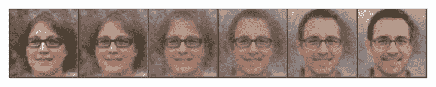
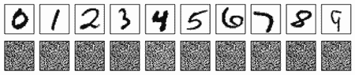
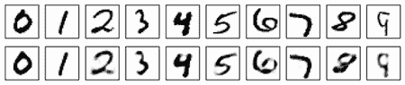
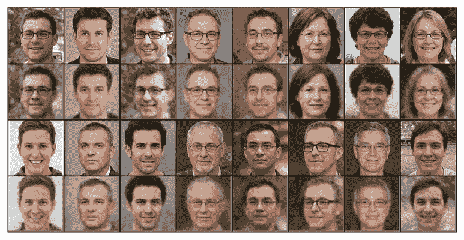
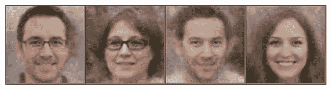

# 第七章：使用变分自编码器进行图像生成

本章涵盖了

+   自编码器与变分自编码器比较

+   构建和训练自编码器以重构手写数字

+   构建和训练变分自编码器以生成人脸图像

+   使用训练好的变分自编码器进行编码算术和插值

到目前为止，你已经学习了如何使用生成对抗网络（GANs）生成形状、数字和图像。在本章中，你将学习如何使用另一种生成模型：变分自编码器（VAEs）来创建图像。你还将通过执行编码算术和编码插值来了解 VAEs 的实际应用。

要了解变分自编码器（VAEs）是如何工作的，我们首先需要理解自编码器（AEs）。AEs 具有双组件结构：一个编码器和一个解码器。编码器将数据压缩成一个低维空间（潜在空间）中的抽象表示，而解码器则将编码信息解压缩并重构数据。AE 的主要目标是学习输入数据的压缩表示，重点是最小化重构误差——原始输入与其重构（在像素级别，正如我们在第六章计算循环一致性损失时所看到的）之间的差异。编码器-解码器架构是各种生成模型的基础，包括 Transformers，你将在本书的后半部分详细探索。例如，在第九章，你将构建一个用于机器语言翻译的 Transformer：编码器将英语短语转换为抽象表示，而解码器则根据编码器生成的压缩表示构建法语翻译。像 DALL-E 2 和 Imagen 这样的文本到图像 Transformer 也在其设计中使用了 AE 架构。这涉及到首先将图像编码成一个紧凑的、低维的概率分布。然后，它们从这个分布中进行解码。当然，不同模型中编码器和解码器的构成是不同的。

本章的第一个项目涉及从头开始构建和训练一个 AE 以生成手写数字。你将使用 60,000 个手写数字（0 到 9）的灰度图像作为训练数据，每个图像的大小为 28 × 28 = 784 像素。AE 中的编码器将每个图像压缩成一个只有 20 个值的确定性向量表示。AE 中的解码器重构图像，目的是最小化原始图像与重构图像之间的差异。这是通过最小化两个图像在像素级别的平均绝对误差来实现的。最终结果是能够生成与训练集几乎相同的手写数字的 AE。

虽然 AEs 在复制输入数据方面做得很好，但它们在生成训练集中不存在的新的样本时往往表现不佳。更重要的是，AEs 在输入插值方面并不擅长：它们常常无法生成两个输入数据点之间的中间表示。这让我们转向了 VAEs。VAEs 与 AEs 在两个关键方面有所不同。首先，虽然 AE 将每个输入编码为潜在空间中的一个特定点，VAE 则将其编码为该空间内的一个概率分布。其次，AE 仅关注最小化重建误差，而 VAE 学习潜在变量的概率分布参数，最小化一个包含重建损失和正则化项（库尔巴克-利布勒（KL）散度）的损失函数。

KL-散度鼓励潜在空间逼近某种分布（在我们的例子中是正态分布），并确保潜在变量不仅记住训练数据，而且捕获潜在的分布。它有助于实现一个结构良好的潜在空间，其中相似的数据点被紧密映射在一起，使空间连续且可解释。因此，我们可以操作编码以实现新的结果，这使得在 VAEs 中进行编码算术和输入插值成为可能。

在本章的第二个项目中，你将从头开始构建和训练一个 VAE，以生成人脸图像。在这里，你的训练集包括你在第五章下载的眼镜图像。VAE 的编码器将一个 3 × 256 × 256 = 196,608 像素的图像压缩成一个 100 个值的概率向量，每个向量遵循正态分布。然后解码器根据这个概率向量重建图像。训练好的 VAE 不仅可以从训练集中复制人脸，还可以生成新的图像。

你将学习如何在 VAEs 中进行编码算术和输入插值。你将操作不同输入的编码表示（潜在向量），在解码时达到特定的结果（例如，图像中是否有某些特征）。潜在向量控制解码图像中的不同特征，如性别、图像中是否有眼镜等。例如，你可以首先获得戴眼镜的男性（z1）、戴眼镜的女性（z2）和没戴眼镜的女性（z3）的潜在向量。然后计算一个新的潜在向量，z4 = z1 – z2 + z3。由于 z1 和 z2 在解码时都会导致图像中出现眼镜，z1 – z2 取消了结果图像中的眼镜特征。同样，由于 z2 和 z3 都会导致女性面孔，z3 – z2 取消了结果图像中的女性特征。因此，如果你使用训练好的 VAE 解码 z4 = z1 – z2 + z3，你会得到一个不带眼镜的男性图像。

你还将通过改变分配给潜在向量 z1 和 z2 的权重，创建一系列从戴眼镜的女士到不戴眼镜的女士过渡的图像。这些练习展示了 VAEs 在生成模型领域的多功能性和创意潜力。

与我们在前几章中学习的 GANs 相比，AEs 和 VAEs 具有简单的架构，易于构建。此外，AEs 和 VAEs 通常比 GANs 更容易、更稳定地训练。然而，AEs 和 VAEs 生成的图像通常比 GANs 生成的图像更模糊。GANs 在生成高质量、逼真的图像方面表现出色，但训练困难且资源密集。GANs 和 VAEs 之间的选择很大程度上取决于手头任务的特定要求，包括所需的输出质量、可用的计算资源以及稳定训练过程的重要性。

VAEs 在现实世界中具有广泛的应用。例如，假设你经营一家眼镜店，并成功在线推广了一种新款男士眼镜。现在，你希望针对女性市场推广同样的款式，但缺乏女士佩戴这些眼镜的图片，而且专业摄影的成本很高。这时，VAEs 就派上用场了：你可以将男士佩戴眼镜的现有图片与男士和女士不戴眼镜的图片结合起来。这样，你可以通过编码算术（你将在本章中学习的技术）创建女士佩戴相同眼镜风格的逼真图像，如图 7.1 所示。


图 7.1 通过执行编码算术生成戴眼镜女士的图像

在另一种场景中，假设你的商店提供深色和浅色框架的眼镜，这两种框架都很受欢迎。你想要引入一个带有中等色调框架的中等选项。使用 VAEs，通过一种称为编码插值的方法，你可以轻松地生成一系列平滑过渡的图像，如图 7.2 所示。这些图像将从深色框架眼镜到浅色框架眼镜变化，为顾客提供视觉选择范围。



图 7.2 从深色框架眼镜生成到浅色框架眼镜的图像系列

VAEs 的应用不仅限于眼镜；它几乎涵盖了任何产品类别，无论是服装、家具还是食品。这项技术为可视化营销各种产品提供了一种创造性和成本效益的解决方案。此外，尽管图像生成是一个突出的例子，但 VAEs 可以应用于许多其他类型的数据，包括音乐和文本。它们的通用性在实用方面开辟了无限的可能性！

## 7.1 AEs 概述

本节讨论了自动编码器是什么以及其基本结构。为了让你深入理解自动编码器的内部工作原理，你将在本章的第一个项目中构建和训练一个自动编码器来生成手写数字。本节概述了自动编码器的架构以及完成第一个项目的蓝图。

### 7.1.1 什么是自动编码器？

自动编码器是用于无监督学习的一种神经网络，特别适用于图像生成、压缩和去噪等任务。自动编码器由两个主要部分组成：编码器和解码器。编码器将输入压缩成低维表示（潜在空间），解码器则从这个表示中重建输入。

压缩表示或潜在空间捕捉了输入数据的最重要特征。在图像生成中，这个空间编码了网络训练过的图像的关键方面。自动编码器（AEs）因其学习数据表示的高效性和处理未标记数据的能力而非常有用，这使得它们适用于降维和特征学习等任务。自动编码器的一个挑战是编码过程中可能会丢失信息，这可能导致重建不够准确。使用具有多个隐藏层的更深层架构可以帮助学习更复杂和抽象的表示，从而可能减轻自动编码器中的信息丢失。此外，训练自动编码器生成高质量图像可能计算量很大，需要大量数据集。

正如我们在第一章中提到的，学习某物的最佳方式是从零开始创建它。为此，你将在本章的第一个项目中学习如何创建一个自动编码器来生成手写数字。下一小节将提供一个如何做到这一点的蓝图。

### 7.1.2 构建和训练自动编码器的步骤

假设你必须从头开始构建和训练一个自动编码器来生成手写数字的灰度图像，以便你获得使用自动编码器进行更复杂任务（如彩色图像生成或降维）所需的技能。你应该如何进行这项任务？

图 7.3 展示了自动编码器的架构以及训练自动编码器生成手写数字的步骤。


图 7.3 自动编码器的架构以及训练其生成手写数字的步骤。自动编码器包括一个编码器（中间左侧）和一个解码器（中间右侧）。在训练的每个迭代中，将手写数字的图像输入到编码器（步骤 1）。编码器将图像压缩到潜在空间中的确定性点（步骤 2）。解码器从潜在空间中获取编码向量（步骤 3），并重建图像（步骤 4）。自动编码器调整其参数以最小化重建损失，即原始图像与重建图像之间的差异（步骤 5）。

如从图中所见，自动编码器（AE）有两个主要部分：一个编码器（中间左侧），它将手写数字图像压缩为潜在空间中的向量，以及一个解码器（中间右侧），它根据编码向量重建这些图像。编码器和解码器都是深度神经网络，可能包含不同类型的层，如密集层、卷积层、转置卷积层等。由于我们的例子涉及手写数字的灰度图像，我们将仅使用密集层。然而，自动编码器也可以用来生成更高分辨率的彩色图像；对于这些任务，卷积神经网络（CNNs）通常包含在编码器和解码器中。是否在自动编码器中使用 CNN 取决于你想要生成的图像分辨率。

当构建自动编码器时，其中的参数是随机初始化的。我们需要获得一个训练集来训练模型：PyTorch 提供了 60,000 张手写数字的灰度图像，这些图像在 0 到 9 这 10 个数字之间均匀分布。图 7.3 的左侧展示了三个例子，分别是数字 0、1 和 9 的图像。在训练循环的第一步中，我们将训练集中的图像输入到编码器中。编码器将图像压缩为潜在空间中的 20 值向量（步骤 2）。数字 20 并没有什么神奇之处。如果你在潜在空间中使用 25 值向量，你将得到相似的结果。然后，我们将向量表示传递给解码器（步骤 3），并要求它重建图像（步骤 4）。我们计算重建损失，这是原始图像和重建图像之间所有像素的平均平方误差。然后，我们将这个损失反向传播通过网络，以更新编码器和解码器中的参数，以最小化重建损失（步骤 5），这样在下一个迭代中，自动编码器可以重建更接近原始图像的图像。这个过程在数据集上重复许多个 epoch。

在模型训练完成后，你将向编码器提供未见过的手写数字图像，并获取编码。然后，你将编码传递给解码器以获取重建的图像。你会发现重建的图像几乎与原始图像完全相同。图 7.3 的右侧展示了三个重建图像的例子：它们看起来与图左侧对应的原始图像非常相似。

## 7.2 构建和训练自动编码器以生成数字

现在你已经有了构建和训练自动编码器以生成手写数字的蓝图，让我们深入到这个项目中，并实现上一节中概述的步骤。

具体来说，在本节中，您将首先学习如何获取手写数字图像的训练集和测试集。然后，您将使用密集层构建编码器和解码器。您将使用训练数据集训练自动编码器，并使用训练好的编码器对测试集中的图像进行编码。最后，您将学习如何使用训练好的解码器重建图像，并将它们与原始图像进行比较。

### 7.2.1 收集手写数字

您可以使用 Torchvision 库中的`datasets`包下载手写数字的灰度图像，类似于您在第二章中下载服装物品图像的方式。

首先，让我们下载一个训练集和一个测试集：

```py
import torchvision
import torchvision.transforms as T

transform=T.Compose([
    T.ToTensor()])
train_set=torchvision.datasets.MNIST(root=".",        ①
    train=True,download=True,transform=transform)     ②
test_set=torchvision.datasets.MNIST(root=".",
    train=False,download=True,transform=transform)    ③
```

① 使用`torchvision.datasets`中的`MNIST()`类下载手写数字

② `train=True`参数表示您下载训练集。

③ `train=False`参数表示您下载测试集。

与第二章中使用的`FashionMNIST()`类不同，我们在这里使用`MNIST()`类。类中的`train`参数告诉 PyTorch 是下载训练集（当参数设置为`True`时）还是测试集（当参数设置为`False`时）。在转换之前，图像像素是介于 0 到 255 之间的整数。前面代码块中的`ToTensor()`类将它们转换为介于 0 到 1 之间的 PyTorch 浮点张量。训练集中有 60,000 张图像，测试集中有 10,000 张图像，每个集合中均匀分布着 10 个数字，从 0 到 9。

我们将为训练和测试创建数据批次，每个批次包含 32 张图像：

```py
import torch

batch_size=32
train_loader=torch.utils.data.DataLoader(
    train_set,batch_size=batch_size,shuffle=True)
test_loader=torch.utils.data.DataLoader(
    test_set,batch_size=batch_size,shuffle=True)
```

现在我们有了准备好的数据，我们将接下来构建和训练一个自动编码器。

### 7.2.2 构建和训练自动编码器

自动编码器由两部分组成：编码器和解码器。我们将定义一个`AE()`类，如下面的列表所示，来表示自动编码器。

列表 7.1 创建一个用于生成手写数字的自动编码器

```py
import torch.nn.functional as F
from torch import nn

device="cuda" if torch.cuda.is_available() else "cpu"
input_dim = 784                                       ①
z_dim = 20                                            ②
h_dim = 200
class AE(nn.Module):
    def __init__(self,input_dim,z_dim,h_dim):
        super().__init__()
        self.common = nn.Linear(input_dim, h_dim)
        self.encoded = nn.Linear(h_dim, z_dim)
        self.l1 = nn.Linear(z_dim, h_dim)
        self.decode = nn.Linear(h_dim, input_dim)
    def encoder(self, x):                             ③
        common = F.relu(self.common(x))
        mu = self.encoded(common)
        return mu
    def decoder(self, z):                             ④
        out=F.relu(self.l1(z))
        out=torch.sigmoid(self.decode(out))
        return out
    def forward(self, x):                             ⑤
        mu=self.encoder(x)
        out=self.decoder(mu)
        return out, mu
```

① 自动编码器的输入有 28×28=784 个值。

② 潜在变量（编码）中有 20 个值。

③ 编码器将图像压缩为潜在变量。

④ 解码器根据编码重建图像。

⑤ 编码器和解码器构成了自动编码器。

输入大小为 784，因为手写数字的灰度图像大小为 28×28 像素。我们将图像展平为 1D 张量，并将其输入到自动编码器（AE）中。图像首先通过编码器：它们被压缩到低维空间中的编码。现在每个图像都由一个 20 值的潜在变量表示。解码器根据潜在变量重建图像。自动编码器（AE）的输出包含两个张量：`out`，重建的图像，和`mu`，潜在变量（即编码）。

接下来，我们实例化之前定义的`AE()`类来创建一个自动编码器。我们还在训练过程中使用了 Adam 优化器，就像之前章节中做的那样：

```py
model = AE(input_dim,z_dim,h_dim).to(device)
lr=0.00025
optimizer = torch.optim.Adam(model.parameters(), lr=lr)
```

我们定义了一个名为`plot_digits()`的函数，用于在训练的每个 epoch 后可视检查重建的手写数字，如下面的列表所示。

列表 7.2 检查重建图像的 `plot_digits()` 函数

```py
import matplotlib.pyplot as plt

originals = []                                           ①
idx = 0
for img,label in test_set:
    if label == idx:
        originals.append(img)
        idx += 1
    if idx == 10:
        break
def plot_digits():
    reconstructed=[]
    for idx in range(10):
        with torch.no_grad():
            img = originals[idx].reshape((1,input_dim))
            out,mu = model(img.to(device))               ②
        reconstructed.append(out)                        ③
    imgs=originals+reconstructed
    plt.figure(figsize=(10,2),dpi=50)
    for i in range(20):
        ax = plt.subplot(2,10, i + 1)
        img=(imgs[i]).detach().cpu().numpy()
        plt.imshow(img.reshape(28,28),                   ④
                   cmap="binary")
        plt.xticks([])
        plt.yticks([])
    plt.show()  
```

① 收集测试集中每个数字的样本图像

② 将图像输入到自动编码器以获得重建图像

③ 收集每个原始图像的重建图像

④ 视觉比较原始图像与重建数字

我们首先收集 10 张样本图像，每张代表一个不同的数字，并将它们放入一个列表 `originals` 中。我们将图像输入到自动编码器以获得重建图像。最后，我们绘制原始图像和重建图像，以便我们可以比较它们并定期评估自动编码器的性能。

在训练开始之前，我们调用 `plot_digits()` 函数来可视化输出：

```py
plot_digits()
```

你将看到如图 7.4 所示的输出。



图 7.4 在训练开始之前，自动编码器重建图像与原始图像的比较。第一行显示了测试集中 10 个原始的手写数字图像。第二行显示了自动编码器在训练之前的重建图像。这些重建不过是纯粹的噪声。

尽管我们可以将我们的数据分为训练集和验证集，并训练模型直到在验证集上不再看到进一步的改进（就像我们在第二章中所做的那样），但我们的主要目标是掌握自动编码器的工作原理，而不一定是实现最佳参数调整。因此，我们将自动编码器训练 10 个周期。

列表 7.3 训练自动编码器生成手写数字

```py
for epoch in range(10):
    tloss=0
    for imgs, labels in train_loader:                   ①
        imgs=imgs.to(device).view(-1, input_dim)
        out, mu=model(imgs)                             ②
        loss=((out-imgs)**2).sum()                      ③
        optimizer.zero_grad()
        loss.backward()
        optimizer.step()
        tloss+=loss.item()
    print(f"at epoch {epoch} toal loss = {tloss/len(train_loader)}")
    plot_digits()                                       ④
```

① 遍历训练集中的批次

② 使用自动编码器重建图像

③ 通过均方误差计算重建损失

④ 视觉检查自动编码器的性能

在每个训练周期中，我们遍历训练集中的所有数据批次。我们将原始图像输入到自动编码器以获得重建图像。然后我们计算重建损失，即原始图像和重建图像之间的均方误差。具体来说，重建损失是通过首先计算两个图像之间的差异，逐像素平方这些值并平均平方差异来获得的。我们调整模型参数以最小化重建损失，利用 Adam 优化器，这是一种梯度下降方法的变体。

如果你使用 GPU 训练，模型大约需要 2 分钟来训练。或者，你可以从我的网站下载训练好的模型：[`mng.bz/YV6K`](https://mng.bz/YV6K)。

### 7.2.3 保存和使用训练好的自动编码器

我们将模型保存在您计算机上的本地文件夹中：

```py
scripted = torch.jit.script(model) 
scripted.save('files/AEdigits.pt') 
```

要使用它来重建手写数字的图像，我们加载模型：

```py
model=torch.jit.load('files/AEdigits.pt',map_location=device)
model.eval()
```

我们可以通过调用我们之前定义的 `plot_digits()` 函数来使用它生成手写数字：

```py
plot_digits()
```

输出结果如图 7.5 所示。



图 7.5 比较训练 AE 重建的图像与原始图像。第一行显示了测试集中 10 个原始的手写数字图像。第二行显示了训练 AE 重建的图像。重建的图像看起来与原始图像相似。

重建的手写数字与原始数字相似，尽管重建并不完美。在编码-解码过程中，一些信息丢失了。然而，与 GANs 相比，AEs 更容易构建，训练时间也更短。此外，编码器-解码器架构被许多生成模型采用。这个项目将帮助您理解后面的章节，尤其是在我们探索 Transformers 时。

## 7.3 什么是 VAEs？

虽然 AEs 在重建原始图像方面很擅长，但它们在生成训练集中未见过的创新图像方面却失败了。此外，AEs 往往不会将相似输入映射到潜在空间中的邻近点。因此，与 AE 相关的潜在空间既不连续也不容易解释。例如，您无法插值两个输入数据点以生成有意义的中间表示。由于这些原因，我们将研究 AE 的改进：VAEs。

在本节中，您将首先了解 AEs 和 VAEs 之间的关键区别以及这些区别为何导致后者能够生成训练集中未见过的逼真图像。然后，您将学习训练 VAEs 的一般步骤，特别是训练一个用于生成高分辨率人脸图像的 VAE。

### 7.3.1 AEs 和 VAEs 之间的区别

VAEs 首先由 Diederik Kingma 和 Max Welling 在 2013 年提出。1 它是 AE 的一个变体。与 AE 一样，VAE 也包含两个主要部分：编码器和解码器。

然而，AEs 和 VAEs 之间有两个关键区别。首先，AE 中的潜在空间是确定性的。每个输入都被映射到潜在空间中的一个固定点。相比之下，VAE 中的潜在空间是概率性的。VAE 不是将输入编码为潜在空间中的一个单一向量，而是将输入编码为可能值的分布。例如，在我们的第二个项目中，我们将编码一个彩色图像到一个 100 个值的概率向量。此外，我们假设这个向量中的每个元素都遵循独立的高斯分布。由于定义高斯分布只需要均值（*μ*）和标准差（*σ*），我们 100 个元素的概率向量中的每个元素将由这两个参数来表征。为了重建图像，我们从这个分布中采样一个向量并将其解码。VAEs 的独特性体现在每次从分布中采样都会产生略微不同的输出。

在统计术语中，VAE 中的编码器试图学习训练数据 *x* 的真实分布 *p*(*x*|*Θ*)，其中 *Θ* 是定义分布的参数。为了便于处理，我们通常假设潜在变量的分布是正态的。因为我们只需要均值 *μ* 和标准差 *σ* 来定义一个正态分布，我们可以将真实分布重写为 *p*(*x*|*Θ*) = *p*(*x*|*μ*, *σ*)。VAE 中的解码器根据编码器学习的分布生成一个样本。也就是说，解码器从分布 *p*(*x*|*μ*, *σ*) 中以概率生成一个实例。

AEs 和 VAEs 之间的第二个关键区别在于损失函数。当训练一个 AE 时，我们最小化重建损失，以便重建的图像尽可能接近原始图像。相比之下，在 VAEs 中，损失函数由两部分组成：重建损失和 KL 散度。KL 散度是衡量一个概率分布如何偏离第二个预期概率分布的度量。在 VAEs 中，KL 散度用于通过惩罚学习到的分布（编码器的输出）与先验分布（标准正态分布）的偏差来正则化编码器。这鼓励编码器学习有意义的和可推广的潜在表示。通过惩罚偏离先验太远的分布，KL 散度有助于避免过拟合。

在我们的设置中，KL 散度是这样计算的，因为我们假设了一个正态分布（如果假设非正态分布，公式则不同）：

|


| (7.1) |
| --- |

求和是在潜在空间的 100 个维度上进行的。当编码器将图像压缩到潜在空间中的标准正态分布时，使得 *μ*=0 和 *σ*=1，KL 散度变为 0。在任何其他情况下，值都超过 0。因此，当编码器成功将图像压缩到潜在空间中的标准正态分布时，KL 散度被最小化。

### 7.3.2 训练 VAE 生成人脸图像的蓝图

在本章的第二个项目中，你将从头开始构建和训练一个 VAE，以生成人脸彩色图像。训练好的模型可以生成训练集中未见过的图像。此外，你可以插值输入以生成介于两个输入数据点之间的新颖图像，这些图像是两个输入数据点之间的中间表示。以下是这个第二个项目的蓝图。

图 7.6 提供了 VAE 架构的图示以及训练 VAE 生成人脸图像的步骤。


图 7.6 展示了 VAE（变分自编码器）的架构以及训练其生成人脸图像的步骤。VAE 由一个编码器（中间左上角）和一个解码器（中间右下角）组成。在训练的每一次迭代中，人脸图像被输入到编码器（步骤 1）。编码器将图像压缩到潜在空间中的概率点（步骤 2；由于我们假设正态分布，每个概率点由均值向量和标准差向量表征）。然后，我们从分布中采样编码并展示给解码器。解码器接收采样的编码（步骤 3）并重建图像（步骤 4）。VAE 调整其参数以最小化重建损失和 KL 散度的总和。KL 散度衡量编码器输出与标准正态分布之间的差异。

图 7.6 显示 VAE 也有两个部分：一个编码器（中间左上角）和一个解码器（中间右下角）。由于第二个项目涉及高分辨率彩色图像，我们将使用 CNN（卷积神经网络）来创建 VAE。正如我们在第四章中讨论的，高分辨率彩色图像包含比低分辨率灰度图像更多的像素。如果我们只使用全连接（密集）层，模型中的参数数量太大，使得学习过程缓慢且无效。与类似大小的全连接网络相比，CNN 需要的参数更少，从而实现更快、更有效的学习。

一旦创建了 VAE，你将使用在第五章中下载的眼镜数据集来训练模型。图 7.6 的左侧展示了训练集中三个原始人脸图像的例子。在训练循环的第一步中，我们将大小为 3 × 256 × 256 = 196,608 像素的图像输入到编码器。编码器将图像压缩到潜在空间中的 100 值概率向量（步骤 2；由于假设正态分布，向量为均值和标准差向量）。然后，我们从分布中采样并输入采样的向量表示到解码器（步骤 3），并要求其重建图像（步骤 4）。我们计算总损失为像素级重建损失和方程 7.1 中指定的 KL 散度的总和。我们将这个损失反向传播通过网络以更新编码器和解码器中的参数，以最小化总损失（步骤 5）。总损失鼓励 VAE 将输入编码成更有意义和可推广的潜在表示，并重建更接近原始图像的图像。

模型训练完成后，你将向编码器输入人脸图像并获取编码。然后，你将编码输入到解码器以获取重建图像。你会发现重建的图像与原始图像非常接近。图 7.6 的右侧展示了三个重建图像的例子：它们与图左侧对应的原始图像相似，尽管并不完全一样。

更重要的是，你可以丢弃编码器，并从潜在空间中随机抽取编码，然后将它们输入到训练好的解码器中，以生成训练集中未见过的创新人脸图像。此外，你可以操纵不同输入的编码表示，以在解码时实现特定的结果。你还可以通过改变分配给任何两个编码的权重，创建一系列从实例到实例过渡的图像。

## 7.4 使用 VAE 生成人脸图像

本节将从头创建和训练一个 VAE，以生成人脸图像，按照上一节概述的步骤进行。

与我们为构建和训练自动编码器（AEs）所做的工作相比，我们第二个项目的方案包含几个修改。首先，我们计划在变分自编码器（VAEs）的编码器和解码器中都使用卷积神经网络（CNNs），尤其是由于高分辨率彩色图像具有更多的像素。仅依靠全连接（密集）层会导致参数数量过多，从而导致学习速度慢且效率低下。其次，作为我们将图像压缩为在潜在空间中遵循正态分布的向量的过程的一部分，我们将在编码每个图像时生成一个均值向量和标准差向量。这与自动编码器中使用的固定值向量不同。然后，从编码的正态分布中采样以获得编码，这些编码随后被解码以生成图像。值得注意的是，每次我们从该分布中采样时，重建的图像都会略有不同，这赋予了 VAEs 生成新颖图像的能力。

### 7.4.1 构建 VAE

如果你还记得，你在第五章下载的眼镜数据集在手动纠正了一些标签后，保存在你电脑上的文件夹 /files/glasses/ 中。我们将图像调整大小为 256 x 256 像素，值在 0 到 1 之间。然后，我们创建一个包含每个批次 16 个图像的批量迭代器：

```py
transform = T.Compose([
            T.Resize(256),                                 ①
            T.ToTensor(),                                  ②
            ])
data = torchvision.datasets.ImageFolder(
    root="files/glasses",    
    transform=transform)                                   ③
batch_size=16
loader = torch.utils.data.DataLoader(data,                 ④
     batch_size=batch_size,shuffle=True)
```

① 将图像调整大小为 256 x 256 像素

② 将图像转换为值在 0 到 1 之间的张量

③ 从文件夹中加载图像并应用转换

④ 将数据放入批量迭代器

接下来，我们将创建一个包含卷积层和转置卷积层的 VAE。我们首先定义一个`Encoder()`类，如下所示。

列表 7.4 VAE 中的编码器

```py
latent_dims=100                                             ①
class Encoder(nn.Module):
    def __init__(self, latent_dims=100):  
        super().__init__()
        self.conv1 = nn.Conv2d(3, 8, 3, stride=2, padding=1)
        self.conv2 = nn.Conv2d(8, 16, 3, stride=2, padding=1)
        self.batch2 = nn.BatchNorm2d(16)
        self.conv3 = nn.Conv2d(16, 32, 3, stride=2, padding=0)
        self.linear1 = nn.Linear(31*31*32, 1024)
        self.linear2 = nn.Linear(1024, latent_dims)
        self.linear3 = nn.Linear(1024, latent_dims)
        self.N = torch.distributions.Normal(0, 1)
        self.N.loc = self.N.loc.cuda() 
        self.N.scale = self.N.scale.cuda()
    def forward(self, x):
        x = x.to(device)
        x = F.relu(self.conv1(x))
        x = F.relu(self.batch2(self.conv2(x)))
        x = F.relu(self.conv3(x))
        x = torch.flatten(x, start_dim=1)
        x = F.relu(self.linear1(x))
        mu =  self.linear2(x)                               ②
        std = torch.exp(self.linear3(x))                    ③
        z = mu + std*self.N.sample(mu.shape)                ④
        return mu, std, z
```

① 潜在空间的维度是 100。

② 编码分布的均值

③ 编码的标准差

④ 编码向量表示

编码器网络由几个卷积层组成，这些层提取输入图像的空间特征。编码器将输入压缩成向量表示，`z`，这些向量具有均值`mu`和标准差`std`的正态分布。编码器的输出包括三个张量：`mu`、`std`和`z`。虽然`mu`和`std`分别是概率向量的均值和标准差，但`z`是从该分布中采样的一个实例。

具体来说，输入图像，大小为（3, 256, 256），首先通过一个步长值为 2 的 Conv2d 层。正如我们在第四章中解释的，这意味着滤波器每次在输入图像上移动时跳过两个像素，这导致图像下采样。输出的大小为（8, 128, 128）。然后它通过两个更多的 Conv2d 层，大小变为（32, 31, 31）。它被展平并通过线性层获得`mu`和`std`的值。

我们定义一个`Decoder()`类来表示 VAE 中的解码器。

列表 7.5 VAE 中的解码器

```py
class Decoder(nn.Module):   
    def __init__(self, latent_dims=100):
        super().__init__()
        self.decoder_lin = nn.Sequential(                   ①
            nn.Linear(latent_dims, 1024),
            nn.ReLU(True),
            nn.Linear(1024, 31*31*32),                      ②
            nn.ReLU(True))
        self.unflatten = nn.Unflatten(dim=1, 
                  unflattened_size=(32,31,31))
        self.decoder_conv = nn.Sequential(                  ③
            nn.ConvTranspose2d(32,16,3,stride=2,
                               output_padding=1),
            nn.BatchNorm2d(16),
            nn.ReLU(True),
            nn.ConvTranspose2d(16, 8, 3, stride=2, 
                               padding=1, output_padding=1),
            nn.BatchNorm2d(8),
            nn.ReLU(True),
            nn.ConvTranspose2d(8, 3, 3, stride=2,
                               padding=1, output_padding=1))

    def forward(self, x):
        x = self.decoder_lin(x)
        x = self.unflatten(x)
        x = self.decoder_conv(x)
        x = torch.sigmoid(x)                                ④
        return x  
```

① 编码首先通过两个密集层。

② 将编码重新塑造成多维对象，以便我们可以对它们执行转置卷积操作

③ 将编码通过三个转置卷积层

④ 将输出挤压到 0 到 1 之间的值，与输入图像中的值相同

解码器是编码器的镜像：它不是执行卷积操作，而是在编码上执行转置卷积操作以生成特征图。它逐渐将潜在空间中的编码转换回高分辨率彩色图像。

具体来说，编码首先通过两个线性层。然后它被反展平到一个形状（32, 31, 31），与编码器中最后一个 Conv2d 层之后的图像大小相匹配。然后它通过三个 ConvTranspose2d 层，与编码器中的 Conv2d 层相匹配。解码器的输出形状为（3, 256, 256），与训练图像相同。

我们将编码器与解码器结合起来创建一个 VAE：

```py
class VAE(nn.Module):
    def __init__(self, latent_dims=100):
        super().__init__()
        self.encoder = Encoder(latent_dims)                ①
        self.decoder = Decoder(latent_dims)                ②
    def forward(self, x):
        x = x.to(device)
        mu, std, z = self.encoder(x)                       ③
        return mu, std, self.decoder(z)                    ④
```

① 通过实例化 Encoder()类创建一个编码器

② 通过实例化 Decoder()类创建一个解码器

③ 将输入通过编码器以获取编码

④ VAE 的输出是编码的均值和标准差，以及重建的图像。

VAE 由一个编码器和一个解码器组成，由`Encoder()`和`Decoder()`类定义。当我们通过 VAE 传递图像时，输出包括三个张量：编码和重建图像的均值和标准差。

接下来，我们通过实例化`VAE()`类创建一个 VAE 并定义模型的优化器：

```py
vae=VAE().to(device)
lr=1e-4 
optimizer=torch.optim.Adam(vae.parameters(),
                           lr=lr,weight_decay=1e-5)
```

我们将在训练期间手动计算重建损失和 KL 散度损失。因此，我们在此处不定义损失函数。

### 7.4.2 训练 VAE

为了训练模型，我们首先定义一个`train_epoch()`函数来训练模型一个 epoch。

列表 7.6 定义`train_epoch()`函数

```py
def train_epoch(epoch):
    vae.train()
    epoch_loss = 0.0
    for imgs, _ in loader: 
        imgs = imgs.to(device)
        mu, std, out = vae(imgs)                                   ①
        reconstruction_loss = ((imgs-out)**2).sum()                ②
        kl = ((std**2)/2 + (mu**2)/2 - torch.log(std) - 0.5).sum() ③
        loss = reconstruction_loss + kl                            ④
        optimizer.zero_grad()
        loss.backward()
        optimizer.step()
        epoch_loss+=loss.item()
    print(f'at epoch {epoch}, loss is {epoch_loss}')  
```

① 获取重建的图像

② 计算重建损失

③ 计算 KL 散度

④ 重建损失和 KL 散度的总和。

我们遍历训练集中的所有批次。我们通过 VAE 传递图像以获取重建图像。总损失是重建损失和 KL 散度的总和。在每个迭代中调整模型参数以最小化总损失。

我们还定义了一个 `plot_epoch()` 函数，用于直观检查 VAE 生成的图像：

```py
import numpy as np
import matplotlib.pyplot as plt

def plot_epoch():
    with torch.no_grad():
        noise = torch.randn(18,latent_dims).to(device)
        imgs = vae.decoder(noise).cpu()
        imgs = torchvision.utils.make_grid(imgs,6,3).numpy()
        fig, ax = plt.subplots(figsize=(6,3),dpi=100)
        plt.imshow(np.transpose(imgs, (1, 2, 0)))
        plt.axis("off")
        plt.show()
```

一个训练良好的 VAE 可以将相似的输入映射到潜在空间中的邻近点，从而得到一个更连续和可解释的潜在空间。因此，我们可以从潜在空间中随机抽取向量，VAE 可以将这些向量解码成有意义的输出。因此，在前面的 `plot_epoch()` 函数中，我们随机从潜在空间中抽取 18 个向量，并在每个训练周期后使用它们生成 18 张图像。我们将它们绘制在一个 3 × 6 的网格中，并直观地检查它们以了解 VAE 在训练过程中的表现。

接下来，我们训练 VAE 模型 10 个周期：

```py
for epoch in range(1,11):
    train_epoch(epoch)
    plot_epoch()
torch.save(vae.state_dict(),"files/VAEglasses.pth")
```

如果使用 GPU 训练，这个过程大约需要半小时，否则需要几个小时。训练好的模型权重已保存在您的计算机上。或者，您可以从我的网站上下载训练好的权重：[`mng.bz/GNRR`](https://mng.bz/GNRR)。请确保下载后解压文件。

### 7.4.3 使用训练好的 VAE 生成图像

现在，VAE 已经训练好了，我们可以用它来生成图像。我们首先加载保存在本地文件夹中的训练好的模型权重：

```py
vae.eval()
vae.load_state_dict(torch.load('files/VAEglasses.pth',
    map_location=device))
```

然后，我们检查 VAE 重建图像的能力，并观察它们与原始图像的相似程度：

```py
imgs,_=next(iter(loader))
imgs = imgs.to(device)
mu, std, out = vae(imgs)
images=torch.cat([imgs[:8],out[:8],imgs[8:16],out[8:16]],
                 dim=0).detach().cpu()
images = torchvision.utils.make_grid(images,8,4)
fig, ax = plt.subplots(figsize=(8,4),dpi=100)
plt.imshow(np.transpose(images, (1, 2, 0)))
plt.axis("off")
plt.show()
```

如果您运行前面的代码块，您将看到类似于图 7.7 的输出。



图 7.7 比较训练好的 VAE 重建的图像与原始图像。第一行和第三行是原始图像。我们将它们输入到训练好的 VAE 模型中，以获得重建的图像，这些图像显示在原始图像下方。

原始图像显示在第一行和第三行，而重建的图像显示在原始图像下方。重建的图像与原始图像相似，如图 7.7 所示。然而，在重建过程中会丢失一些信息：它们看起来没有原始图像那么真实。

接下来，我们通过调用之前定义的 `plot_epoch()` 函数来测试 VAE 生成训练集中未见过的创新图像的能力：

```py
plot_epoch()  
```

函数从潜在空间随机抽取 18 个向量，并将它们传递给训练好的 VAE 模型以生成 18 张图像。输出结果如图 7.8 所示。


图 7.8 由训练好的 VAE 生成的创新图像。我们在潜在空间中随机抽取向量表示，并将它们输入到训练好的 VAE 模型的解码器中。解码后的图像显示在本图中。由于向量表示是随机抽取的，因此这些图像与训练集中的任何原始图像都不对应。

这些图像不在训练集中：编码是从潜在空间中随机抽取的，而不是通过编码器处理训练集中的图像后得到的编码向量。这是因为 VAEs 中的潜在空间是连续且可解释的。潜在空间中的新编码可以有意义地解码成与训练集中图像相似但不同的图像。

### 7.4.4 使用训练好的 VAE 进行编码算术

VAEs 在它们的损失函数中包含一个正则化项（KL 散度），这鼓励潜在空间逼近正态分布。这种正则化确保潜在变量不仅记住训练数据，而且捕获潜在的分布。它有助于实现一个结构良好的潜在空间，其中相似的数据点被紧密映射在一起，使空间连续且可解释。因此，我们可以操纵编码以实现新的结果。

为了使结果可重复，我鼓励您从我的网站下载训练好的权重（[`mng.bz/GNRR`](https://mng.bz/GNRR)）并使用本章其余部分的相同代码块。正如我们在引言中解释的，编码算术允许我们生成具有特定特征的图像。为了说明编码算术在 VAEs 中的工作原理，让我们首先从以下四个组中手动收集每组三张图像：带眼镜的男性、不带眼镜的男性、带眼镜的女性和不带眼镜的女性。

列表 7.7 收集具有不同特征的图像

```py
torch.manual_seed(0)  
glasses=[]
for i in range(25):                                        ①
    img,label=data[i]
    glasses.append(img)
    plt.subplot(5,5,i+1)
    plt.imshow(img.numpy().transpose((1,2,0)))
    plt.axis("off")
plt.show()
men_g=[glasses[0],glasses[3],glasses[14]]                  ②
women_g=[glasses[9],glasses[15],glasses[21]]               ③

noglasses=[]
for i in range(25):                                        ④
    img,label=data[-i-1]
    noglasses.append(img)
    plt.subplot(5,5,i+1)
    plt.imshow(img.numpy().transpose((1,2,0)))
    plt.axis("off")
plt.show()
men_ng=[noglasses[1],noglasses[7],noglasses[22]]           ⑤
women_ng=[noglasses[4],noglasses[9],noglasses[19]])        ⑥
```

① 显示 25 张带眼镜的图像

② 选择三张带眼镜男性的图像

③ 选择三张带眼镜女性的图像

④ 显示 25 张不带眼镜的图像

⑤ 选择三张不带眼镜的男性图像

⑥ 选择三张不带眼镜的女性图像

我们在每个组中选择三张图像而不是一张，这样在执行编码算术时，我们可以计算同一组中多个编码的平均值。VAEs 旨在学习潜在空间中输入数据的分布。通过平均多个编码，我们有效地平滑了该空间中的表示。这有助于我们找到一个平均表示，它能够捕捉到组内不同样本之间的共同特征。

接下来，我们将三张带眼镜的男性图像输入到训练好的 VAE 中，以获取它们在潜在空间中的编码。然后我们计算这三个图像的平均编码，并使用它来获取一个带眼镜男性的重建图像。然后我们对其他三个组重复此操作。

列表 7.8 在四个不同组中编码和解码图像

```py
# create a batch of images of men with glasses
men_g_batch = torch.cat((men_g[0].unsqueeze(0),              ①
             men_g[1].unsqueeze(0),
             men_g[2].unsqueeze(0)), dim=0).to(device)
# Obtain the three encodings
_,_,men_g_encodings=vae.encoder(men_g_batch)
# Average over the three images to obtain the encoding for the group
men_g_encoding=men_g_encodings.mean(dim=0)                   ②
# Decode the average encoding to create an image of a man with glasses 
men_g_recon=vae.decoder(men_g_encoding.unsqueeze(0))         ③

# Do the same for the other three groups
# group 2, women with glasses
women_g_batch = torch.cat((women_g[0].unsqueeze(0),
             women_g[1].unsqueeze(0),
             women_g[2].unsqueeze(0)), dim=0).to(device)
# group 3, men without glasses
men_ng_batch = torch.cat((men_ng[0].unsqueeze(0),
             men_ng[1].unsqueeze(0),
             men_ng[2].unsqueeze(0)), dim=0).to(device)
# group 4, women without glasses
women_ng_batch = torch.cat((women_ng[0].unsqueeze(0),
             women_ng[1].unsqueeze(0),
             women_ng[2].unsqueeze(0)), dim=0).to(device)
# obtain average encoding for each group
_,_,women_g_encodings=vae.encoder(women_g_batch)
women_g_encoding=women_g_encodings.mean(dim=0)
_,_,men_ng_encodings=vae.encoder(men_ng_batch)
men_ng_encoding=men_ng_encodings.mean(dim=0)
_,_,women_ng_encodings=vae.encoder(women_ng_batch)
women_ng_encoding=women_ng_encodings.mean(dim=0)              ④
# decode for each group
women_g_recon=vae.decoder(women_g_encoding.unsqueeze(0))
men_ng_recon=vae.decoder(men_ng_encoding.unsqueeze(0))
women_ng_recon=vae.decoder(women_ng_encoding.unsqueeze(0))    ⑤
```

① 创建一批带眼镜男性的图像

② 获取带眼镜男性的平均编码

③ 解码带眼镜男性的平均编码

④ 获取其他三个组的平均编码

⑤ 解码其他三个组的平均编码

四个组的平均编码分别为`men_g_encoding`、`women_g_encoding`、`men_ng_encoding`和`women_ng_encoding`，其中`g`代表眼镜，`ng`代表无眼镜。四个组的解码图像分别为`men_g_recon`、`women_g_recon`、`men_ng_recon`和`women_ng_recon`。我们绘制了这四幅图像：

```py
imgs=torch.cat((men_g_recon,
                women_g_recon,
                men_ng_recon,
                women_ng_recon),dim=0)
imgs=torchvision.utils.make_grid(imgs,4,1).cpu().numpy()
imgs=np.transpose(imgs,(1,2,0))
fig, ax = plt.subplots(figsize=(8,2),dpi=100)
plt.imshow(imgs)
plt.axis("off")
plt.show()
```

你将看到如图 7.9 所示的输出。



图 7.9 基于平均编码的解码图像。我们首先获取以下四个组中的每个组的三幅图像：带眼镜男性、带眼镜女性、不带眼镜男性和不带眼镜女性。我们将 12 幅图像输入到训练好的 VAE 中的编码器，以获取它们在潜在空间中的编码。然后我们计算每个组中三幅图像的平均编码。四个平均编码被输入到训练好的 VAE 中的解码器，以获得四个图像，它们显示在这张图中。

图 7.9 显示了四个解码图像。它们是代表四个组的合成图像。请注意，它们与原始的 12 个图像中的任何一个都不同。同时，它们保留了每个组的定义特征。

接下来，让我们操作编码以创建一个新的编码，然后使用 VAE 中训练好的解码器来解码这个新编码，看看会发生什么。例如，我们可以从带眼镜女性的平均编码中减去带眼镜男性的平均编码，并加上不带眼镜女性的平均编码。然后我们将结果输入到解码器中，查看输出。

列表 7.9 编码算术的示例

```py
z=men_g_encoding-women_g_encoding+women_ng_encoding         ①
out=vae.decoder(z.unsqueeze(0))                             ②
imgs=torch.cat((men_g_recon,
                women_g_recon,
                women_ng_recon,out),dim=0)
imgs=torchvision.utils.make_grid(imgs,4,1).cpu().numpy()
imgs=np.transpose(imgs,(1,2,0))
fig, ax = plt.subplots(figsize=(8,2),dpi=100)
plt.imshow(imgs)                                            ③
plt.title("man with glasses - woman \
with glasses + woman without \
glasses = man without glasses ",fontsize=10,c="r")          ④
plt.axis("off")
plt.show()
```

① 定义 z 为带眼镜男性的编码 - 带眼镜女性的编码 + 不带眼镜女性的编码

② 将 z 解码为生成图像

③ 显示四个图像

④ 在图像上方显示标题

如果你运行列表 7.9 中的代码块，你将看到如图 7.10 所示的输出。


图 7.10 使用训练好的 VAE 进行编码算术的示例。我们首先获取以下三个组的平均编码：带眼镜男性（z1）、带眼镜女性（z2）和不带眼镜女性（z3）。我们定义一个新的编码 z = z1 - z2 + z3。然后我们将 z 输入到训练好的 VAE 中的解码器，获得解码图像，如图中右侧所示。

图 7.10 中的前三幅图像是代表三个输入组的合成图像。最右侧的输出图像是一位不带眼镜的男性的图像。

由于解码后`men_g_encoding`和`women_g_encoding`都会在图像中出现眼镜，所以`men_g_encoding` – `women_g_encoding`会取消掉结果图像中的眼镜特征。同样，由于`women_ng_encoding`和`women_g_encoding`都会导致出现女性面孔，所以`women_ng_encoding` – `women_g_encoding`会取消掉结果图像中的女性特征。因此，如果你使用训练好的 VAE 解码`men_g_encoding` + `women_g_encoding` –`women_ng_encoding`，你会得到一个不带眼镜的男性的图像。这个例子中的编码算术表明，可以通过操纵其他三个组中的平均编码来获得不带眼镜的男性的编码。

练习 7.1

通过修改代码列表 7.9 执行以下编码算术：

1.  从不带眼镜的男性的平均编码中减去带眼镜的男性的平均编码，并加上不带眼镜的女性的平均编码。将结果输入解码器，看看会发生什么。

1.  从不带眼镜的女性的平均编码中减去不带眼镜的男性的平均编码，并加上带眼镜的女性的平均编码。将结果输入解码器，看看会发生什么。

1.  从不带眼镜的男性的平均编码中减去不带眼镜的女性的平均编码，并加上带眼镜的男性的平均编码。将结果输入解码器，看看会发生什么。确保你修改图像标题以反映这些变化。解决方案在本书的 GitHub 仓库中提供：[`github.com/markhliu/DGAI`](https://github.com/markhliu/DGAI)。

此外，我们可以在潜在空间中通过为它们分配不同的权重来插值任何两个编码，并创建一个新的编码。然后我们可以解码这个新的编码，并创建一个合成图像作为结果。通过选择不同的权重，我们可以创建一系列中间图像，这些图像从一个图像过渡到另一个图像。

让我们以有和无眼镜的女性的编码为例。我们将定义一个新的编码`z`为`w*women_ng_encoding+(1-w)*women_g_encoding`，其中`w`是我们放在`women_ng_encoding`上的权重。我们将`w`的值从 0 增加到 1，每次增加 0.2。然后我们解码它们，并显示结果的前六个图像。

列表 7.10 通过插值两个编码创建一系列图像

```py
results=[]
for w in [0, 0.2, 0.4, 0.6, 0.8, 1.0]:           ①
    z=w*women_ng_encoding+(1-w)*women_g_encoding ②
    out=vae.decoder(z.unsqueeze(0))              ③
    results.append(out)
imgs=torch.cat((results[0],results[1],results[2],
                results[3],results[4],results[5]),dim=0)
imgs=torchvision.utils.make_grid(imgs,6,1).cpu().numpy()
imgs=np.transpose(imgs,(1,2,0))
fig, ax = plt.subplots(dpi=100)
plt.imshow(imgs)                                 ④
plt.axis("off")
plt.show()
```

① 遍历六个不同的 w 值

② 在两个编码之间进行插值

③ 解码插值编码

④ 显示六个结果图像

运行列表 7.10 中的代码后，你将看到如图 7.11 所示的输出。


图 7.11 通过插值编码创建一系列中间图像。我们首先获得戴眼镜的妇女的平均编码（`women_g_encoding`）和不戴眼镜的妇女的平均编码（`women_ng_encoding`）。插值编码 z 定义为 `w*women_ng_encoding+(1-w)*women_g_encoding`，其中 w 是 `women_ng_encoding` 上的权重。我们将 w 的值从 0 到 1 以 0.2 的增量改变，以创建六个插值编码。然后我们解码它们，并在图中显示产生的六个图像。

如图 7.11 所示，当你从左向右移动时，图像逐渐从戴眼镜的妇女过渡到不戴眼镜的妇女。这表明潜在空间中的编码是连续的、有意义的和可插值的。

练习 7.2

将列表 7.10 修改为使用以下编码对创建一系列中间图像：（i）`men_ng_encoding` 和 `men_g_encoding`；（ii）`men_ng_encoding` 和 `women_ng_encoding`；（iii）`men_g_encoding` 和 `women_g_encoding`。解决方案在本书的 GitHub 仓库中提供：[`github.com/markhliu/DGAI`](https://github.com/markhliu/DGAI)。

从下一章开始，你将踏上自然语言处理之旅。这将使你能够生成另一种形式的内容：文本。然而，你迄今为止使用的许多工具将在后面的章节中再次使用，例如深度神经网络和编码器-解码器架构。

## 摘要

+   AEs 具有双组件结构：编码器和解码器。编码器将数据压缩到低维空间（潜在空间）中的抽象表示，解码器解压缩编码信息并重建数据。

+   VAEs 也由编码器和解码器组成。它们在两个关键方面与 AEs 不同。首先，虽然 AE 将每个输入编码为潜在空间中的一个特定点，VAE 则将其编码为该空间内的一个概率分布。其次，AE 仅关注最小化重建误差，而 VAE 学习潜在变量的概率分布参数，最小化包括重建损失和正则化项（KL 散度）的损失函数。

+   在训练变分自编码器（VAEs）时，损失函数中的 KL 散度确保潜在变量的分布类似于正态分布。这鼓励编码器学习连续的、有意义的和可泛化的潜在表示。

+   一个训练良好的 VAE 可以将相似的输入映射到潜在空间中的邻近点，从而产生更连续和可解释的潜在空间。因此，VAEs 可以将潜在空间中的随机向量解码为有意义的输出，从而产生在训练集中未见过的图像。

+   在变分自编码器（VAE）中的潜在空间是连续且可解释的，与自编码器（AE）中的不同。因此，我们可以操纵编码以实现新的结果。我们还可以通过在潜在空间中两个编码的权重上进行变化，创建一系列从一个个例过渡到另一个个例的中间图像。

* * *

^(1)  迭代克·P·金玛和马克斯·韦林，2013 年，“自动编码变分贝叶斯。” [`arxiv.org/abs/1312.6114`](https://arxiv.org/abs/1312.6114).
