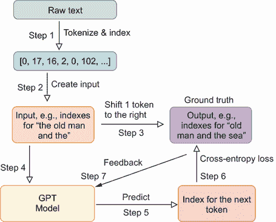

# 第十二章：训练一个 Transformer 生成文本

本章涵盖

+   构建一个适合你需求的 GPT-2XL 模型的缩小版

+   为训练 GPT 风格的 Transformer 准备数据

+   从头开始训练 GPT 风格的 Transformer

+   使用训练好的 GPT 模型生成文本

在第十一章中，我们从头开始开发了 GPT-2XL 模型，但由于其参数数量庞大，我们无法对其进行训练。训练具有 15 亿个参数的模型需要超级计算设施和大量的数据。因此，我们将 OpenAI 的预训练权重加载到我们的模型中，然后使用 GPT-2XL 模型生成文本。

然而，从头开始学习如何训练 Transformer 模型对于几个原因来说至关重要。首先，虽然这本书没有直接涵盖微调预训练模型，但了解如何训练 Transformer 能让你掌握微调所需的技能。训练一个模型涉及随机初始化参数，而微调则涉及加载预训练权重并进一步训练模型。其次，训练或微调 Transformer 能让你根据特定需求和领域定制模型，这可以显著提高其在特定用例中的性能和相关性。最后，训练自己的 Transformer 或微调现有的 Transformer 可以提供对数据和隐私的更大控制，这对于敏感应用或处理专有数据尤为重要。总之，掌握 Transformer 的训练和微调对于任何希望利用语言模型的力量进行特定应用同时保持隐私和控制的人来说是必不可少的。

因此，在本章中，我们将构建一个具有大约 500 万个参数的 GPT 模型缩小版。这个较小的模型遵循 GPT-2XL 模型的架构；与原始 GPT-2XL 的 48 个解码器块和 1600 维的嵌入维度相比，其显著差异是只有 3 个解码器块和 256 维的嵌入维度。通过将 GPT 模型缩小到大约 500 万个参数，我们可以在普通计算机上对其进行训练。

生成的文本风格将取决于训练数据。当从头开始训练模型进行文本生成时，文本长度和变化都是至关重要的。训练材料必须足够广泛，以便模型能够有效地学习和模仿特定的写作风格。同时，如果训练材料缺乏变化，模型可能会简单地复制训练文本中的段落。另一方面，如果材料太长，训练可能需要过多的计算资源。因此，我们将使用欧内斯特·海明威的三部小说作为我们的训练材料：*《老人与海》*，*《永别了，武器》*，和*《丧钟为谁而鸣》*。这个选择确保我们的训练数据具有足够的长度和变化，以便有效地学习，同时又不会太长以至于训练变得不切实际。

由于 GPT 模型不能直接处理原始文本，我们首先将文本分词成单词。然后，我们将创建一个字典，将每个唯一的标记映射到不同的索引。使用这个字典，我们将文本转换成一个长序列的整数，以便输入到神经网络中。

我们将使用 128 个索引的序列作为输入来训练 GPT 模型。正如第八章和第十章所述，我们将输入序列向右移动一个标记，并将其用作输出。这种方法迫使模型根据当前标记和序列中所有之前的标记来预测句子中的下一个单词。

一个关键挑战是确定训练模型的最佳 epoch 数量。我们的目标不仅仅是最小化训练集中的交叉熵损失，因为这样做可能会导致过拟合，即模型只是简单地复制训练文本中的段落。为了解决这个问题，我们计划训练模型 40 个 epoch。我们将每隔 10 个 epoch 保存一次模型，并评估哪个版本可以生成连贯的文本，而不仅仅是复制训练材料中的段落。或者，一个人可能潜在地使用验证集来评估模型的性能，并决定何时停止训练，就像我们在第二章中所做的那样。

一旦我们的 GPT 模型训练完成，我们将使用它来自动回归地生成文本，就像我们在第十一章中所做的那样。我们将测试训练模型的多个版本。训练了 40 个 epoch 的模型产生了非常连贯的文本，捕捉到了海明威的独特风格。然而，它也可能生成部分复制自训练材料的文本，特别是如果提示与训练文本中的段落相似。训练了 20 个 epoch 的模型也生成了连贯的文本，尽管偶尔会有语法错误，但不太可能直接从训练文本中复制。

本章的主要目标并非一定是生成尽可能连贯的文本，这本身就是一个巨大的挑战。相反，我们的目标是教会你如何从头开始构建一个 GPT 风格的模型，使其适用于现实世界的应用和你的特定需求。更重要的是，本章概述了从头开始训练 GPT 模型所需的步骤。你将学习如何根据你的目标选择训练文本，对文本进行分词并将其转换为索引，以及准备训练数据批次。你还将学习如何确定训练的 epoch 数量。一旦模型训练完成，你将学习如何使用模型生成文本，以及如何避免直接从训练材料中复制文本。

## 12.1 从头开始构建和训练 GPT

我们的目的是掌握从头开始构建和训练 GPT 模型，使其针对特定任务进行定制。这项技能对于将本书中的概念应用于现实世界问题至关重要。

想象一下，你是一位热衷于欧内斯特·海明威作品的粉丝，并希望训练一个 GPT 模型以生成海明威风格的文本。你将如何着手？本节将讨论完成此任务所需的步骤。

第一步是配置一个适合训练的 GPT 模型。你将创建一个与第十一章中构建的 GPT-2 模型结构相似的 GPT 模型，但参数数量显著减少，以便在几小时内进行训练成为可能。因此，你需要确定模型的关键超参数，如序列长度、嵌入维度、解码器块数量和 dropout 率。这些超参数至关重要，因为它们会影响训练模型输出的质量以及训练速度。

在此之后，你将收集几部海明威小说的原始文本，并将其清理以确保适合训练。你需要对文本进行分词，并为每个唯一的标记分配一个不同的整数，以便将其输入到模型中。为了准备训练数据，你需要将文本分解成一定长度的整数序列，并将它们用作输入。然后，你将输入向右移动一个标记，并将它们用作输出。这种方法迫使模型根据序列中的当前标记和所有先前标记来预测下一个标记。

模型训练完成后，你将使用它根据提示生成文本。首先，你将提示文本转换为索引序列，并将其输入到训练好的模型中。模型使用该序列迭代地预测最可能的下一个标记。之后，你将模型生成的标记序列转换回文本。

在本节中，我们将首先讨论用于此任务的 GPT 模型架构。然后，我们将讨论训练模型涉及的步骤。

### 12.1.1 用于生成文本的 GPT 架构

尽管 GPT-2 有多种大小，但它们都具有相似的架构。本章中我们构建的 GPT 模型遵循与 GPT-2 相同的结构设计，但规模显著减小，这使得在没有超级计算设施的情况下进行训练成为可能。表 12.1 展示了我们的 GPT 模型与 GPT-2 四个版本模型的比较。

表 12.1 我们 GPT 与不同版本的 GPT-2 模型的比较

|  | GPT-2S | GPT-2M | GPT-2L | GPT-2XL | 我们 GPT |
| --- | --- | --- | --- | --- | --- |
| 嵌入维度 | 768 | 1,024 | 1,280 | 1,600 | 256 |
| 解码器层数 | 12 | 24 | 36 | 48 | 3 |
| 头数量 | 12 | 16 | 20 | 25 | 4 |
| 序列长度 | 1,024 | 1,024 | 1,024 | 1,024 | 128 |
| 词汇量大小 | 50,257 | 50,257 | 50,257 | 50,257 | 10,600 |
| 参数数量 | 1.24 亿 | 3.5 亿 | 7.74 亿 | 15.58 亿 | 512 万 |

在本章中，我们将构建一个具有三个解码器层和 256 维嵌入维度（这意味着每个标记在词嵌入后由一个 256 位的向量表示）的 GPT 模型。正如我们在第十一章中提到的，GPT 模型使用与 2017 年论文“Attention Is All You Need”中使用的不同位置编码方法。相反，我们使用嵌入层来学习序列中不同位置的位置编码。因此，序列中的每个位置也由一个 256 位的向量表示。为了计算因果自注意力，我们使用四个并行注意力头来捕捉序列中标记意义的各个方面。因此，每个注意力头的维度为 256/4 = 64，与 GPT-2 模型中的相似。例如，在 GPT-2XL 中，每个注意力头的维度为 1,600/25 = 64。

我们 GPT 模型的最大序列长度为 128，这比 GPT-2 模型的最大序列长度 1,024 短得多。这种减少是必要的，以保持模型中参数的数量可管理。然而，即使序列中有 128 个元素，模型也能学习序列中标记之间的关系并生成连贯的文本。

虽然 GPT-2 模型的词汇量为 50,257，但我们的模型词汇量要小得多，为 10,600。重要的是要注意，词汇量主要是由训练数据决定的，而不是一个预定义的选择。如果你选择使用更多文本进行训练，你可能会得到一个更大的词汇量。

图 12.1 展示了我们将在本章中创建的仅解码器 Transformer 的架构。它与第十一章中看到的 GPT-2 架构相似，只是规模更小。因此，我们模型中的总参数数量为 512 万，而第十一章中构建的 GPT-2XL 模型的参数数量为 15.58 亿。图 12.1 显示了训练过程中每个步骤的训练数据大小。


图 12.1 展示了用于生成文本的仅解码器 Transformer 架构。来自三个海明威小说的文本被标记化，然后转换为索引。我们将 128 个索引排列成一个序列，每个批次包含 32 个这样的序列。输入首先进行词嵌入和位置编码，输入嵌入是这两个组件的总和。然后，这个输入嵌入通过三个解码器层进行处理。随后，输出经过层归一化并通过一个线性层，结果输出大小为 10,600，这对应于词汇表中的唯一标记数量。

我们创建的 GPT 模型的输入由输入嵌入组成，如图 12.1 底部所示。我们将在下一小节中详细讨论如何计算这些嵌入。简而言之，它们是输入序列中词嵌入和位置编码的总和。

输入嵌入随后按顺序通过三个解码器层。与我们在第十一章构建的 GPT-2XL 模型类似，每个解码器层由两个子层组成：一个因果自注意力层和一个前馈网络。此外，我们对每个子层应用层归一化和残差连接。之后，输出经过层归一化和线性层。我们 GPT 模型中的输出数量对应于词汇表中的独特标记数量，即 10,600。模型的输出是下一个标记的 logits。稍后，我们将对这些 logits 应用 softmax 函数，以获得词汇表上的概率分布。该模型旨在根据当前标记和序列中所有之前的标记来预测下一个标记。

### 12.1.2 GPT 模型生成文本的训练过程

现在我们已经知道了如何构建用于文本生成的 GPT 模型，让我们来探讨训练模型所涉及的步骤。我们旨在在深入项目编码方面之前提供一个训练过程的概述。

生成的文本风格受训练文本的影响。由于我们的目标是训练模型以生成类似欧内斯特·海明威风格的文本，我们将使用他三部小说中的文本：*《老人与海》*，*《永别了，武器》*，和*《丧钟为谁而鸣》*。如果我们只选择一部小说，训练数据将缺乏多样性，导致模型记住小说中的段落并生成与训练数据相同的文本。相反，使用过多的小说会增加独特标记的数量，使得在短时间内有效训练模型变得具有挑战性。因此，我们通过选择三部小说并将它们组合作为我们的训练数据来达到平衡。

图 12.2 展示了训练 GPT 模型生成文本所涉及的步骤。



图 12.2 仅解码器的 Transformer 生成 Hemingway 风格文本的训练过程。

如前三个章节所述，训练过程中的第一步是将文本转换为数值形式，以便我们可以将训练数据输入到模型中。具体来说，我们首先使用与第八章相同的方法，将三部小说的文本分解成标记。在这种情况下，每个标记是一个完整的单词或标点符号（如冒号、括号或逗号）。词级标记化易于实现，我们可以控制独特标记的数量。标记化后，我们为每个标记分配一个唯一的索引（即一个整数），将训练文本转换为整数序列（见图 12.2 中的步骤 1）。

接下来，我们通过首先将这个整数序列分成等长的序列（图 12.2 中的步骤 2）来将序列转换为训练数据。我们允许每个序列中最多有 128 个索引。选择 128 允许我们在保持模型大小可管理的同时捕捉句子中标记之间的长距离依赖关系。然而，数字 128 并非神奇：将其更改为，比如说，100 或 150，会导致类似的结果。这些序列形成我们模型的特征（x 变量）。正如我们在前面的章节中所做的那样，我们将输入序列向右移动一个标记，并将其用作训练数据中的输出（y 变量；图 12.2 中的步骤 3）。

输入和输出的配对作为训练数据（x, y）。在“老人与海”这个句子的例子中，我们使用对应于“老人与海”的索引作为输入 x。我们将输入向右移动一个标记，并使用“老人与海”的索引作为输出 y。在第一次时间步，模型使用“the”来预测“old”。在第二次时间步，模型使用“the old”来预测“man”，依此类推。

在训练过程中，您将遍历训练数据。在正向传递中，您将输入序列 x 通过 GPT 模型（步骤 4）。然后 GPT 根据模型中当前的参数进行预测（步骤 5）。您通过比较预测的下一个标记与步骤 3 获得的输出来计算交叉熵损失。换句话说，您将模型的预测与真实值进行比较（步骤 6）。最后，您将调整 GPT 模型中的参数，以便在下一个迭代中，模型的预测更接近实际输出，最小化交叉熵损失（步骤 7）。请注意，模型本质上是在执行一个多类别分类问题：它从词汇表中的所有唯一标记中预测下一个标记。

您将通过多次迭代重复步骤 3 到 7。每次迭代后，模型参数都会调整以改进下一个标记的预测。我们将重复此过程 40 个周期，并在每个 10 个周期后保存训练好的模型。如您稍后所见，如果我们训练模型时间过长，它就会过拟合，记住训练数据中的段落。生成的文本随后就会与原始小说中的文本相同。我们将事后测试哪个模型版本生成的文本既连贯，又没有简单地从训练数据中复制。

## 12.2 海明威小说文本的分词

现在您已经了解了 GPT 模型的架构和训练过程，让我们从第一步开始：对海明威小说的文本进行分词和索引。

首先，我们将处理文本数据，为训练做准备。我们将文本分解为单个标记，就像我们在第八章所做的那样。由于深度神经网络不能直接处理原始文本，我们将创建一个字典，为每个标记分配一个索引，有效地将它们映射到整数。之后，我们将这些索引组织成训练数据批次，这对于在后续步骤中训练 GPT 模型至关重要。

我们将使用词级分词，因为它在将文本划分为单词方面简单，而不是更复杂的子词分词，后者需要细微的语言结构理解。此外，词级分词产生的唯一标记数量比子词分词少，从而减少了 GPT 模型中的参数数量。

### 12.2.1 文本分词

为了训练 GPT 模型，我们将使用欧内斯特·海明威的三部小说的原始文本文件：*《老人与海》*，*《永别了，武器》*，和 *《丧钟为谁而鸣》*。文本文件是从 Faded Page 网站下载的：[`www.fadedpage.com`](https://www.fadedpage.com)。我已经清理了文本，移除了不属于原始书籍的顶部和底部段落。在准备自己的训练文本时，消除所有无关信息至关重要，例如供应商详情、格式和许可信息。这确保了模型只专注于学习文本中存在的写作风格。我还移除了章节之间的不相关文本。您可以从书籍的 GitHub 仓库下载三个文件 OldManAndSea.txt，FarewellToArms.txt，和 ToWhomTheBellTolls.txt：[`github.com/markhliu/DGAI`](https://github.com/markhliu/DGAI)。将它们放在您计算机上的 /files/ 文件夹中。

在 *《老人与海》* 的文本文件中，开双引号（“）和闭双引号（”）都表示为直双引号（"）。在其他两部小说的文本文件中并非如此。因此，我们加载 *《老人与海》* 的文本，并将直引号更改为开引号或闭引号。这样做可以让我们区分开引号和闭引号。这还将有助于稍后格式化生成的文本：我们将移除开引号后的空格和闭引号前的空格。此步骤的实现方式如下所示。

列表 12.1 将直引号更改为开引号和闭引号

```py
with open("files/OldManAndSea.txt","r", encoding='utf-8-sig') as f:
    text=f.read()
text=list(text)                                             ①
for i in range(len(text)):
    if text[i]=='"':
        if text[i+1]==' ' or text[i+1]=='\n':
            text[i]='"'                                     ②
        if text[i+1]!=' ' and text[i+1]!='\n':
            text[i]='"'                                     ③
    if text[i]=="'":
        if text[i-1]!=' ' and text[i-1]!='\n':
            text[i]='''                                     ④
text="".join(text)                                          ⑤
```

① 加载原始文本并将其分解为单个字符

② 如果一个直引号后面跟着一个空格或换行符，则将其更改为闭合引号

③ 否则，将其更改为开引号

④ 将直单引号转换为撇号

⑤ 将单个字符重新组合成文本

如果双引号后面跟着空格或换行符，我们将将其更改为闭合引号；否则，我们将将其更改为开引号。撇号被输入为单个直引号，我们在列表 12.1 中将其更改为闭合单引号的形式。

接下来，我们加载另外两本小说的文本，并将这三本小说合并成一个单独的文件。

列表 12.2 合并三本小说的文本

```py
with open("files/ToWhomTheBellTolls.txt","r", encoding='utf-8-sig') as f:
    text1=f.read()                                            ①

with open("files/FarewellToArms.txt","r", encoding='utf-8-sig') as f:
    text2=f.read()                                            ②

text=text+" "+text1+" "+text2                                 ③

with open("files/ThreeNovels.txt","w", 
          encoding='utf-8-sig') as f:
    f.write(text)                                             ④
print(text[:250])
```

① 从第二本小说读取文本

② 从第三本小说读取文本

③ 合并三本小说的文本

④ 将合并的文本保存到本地文件夹

我们加载另外两本小说的文本，*《永别了，武器》*和*《丧钟为谁而鸣》*。然后我们将三本小说的文本合并起来作为我们的训练数据。此外，我们还将合并的文本保存到本地文件名为 ThreeNovels.txt 中，以便我们可以在以后验证生成的文本是否直接复制自原始文本。

前面代码列表的输出是

```py
He was an old man who fished alone in a skiff in the Gulf Stream and he
had gone eighty-four days now without taking a fish. In the first
forty days a boy had been with him. But after forty days without a
fish the boy's parents had told him that th
```

输出是合并文本的前 250 个字符。

我们将使用空格作为分隔符来标记文本。如前所述的输出所示，像句号（.）、连字符（-）和撇号（'）这样的标点符号没有空格地附加在前面单词上。因此，我们需要在所有标点符号周围插入空格。

此外，我们还将换行符（\n）转换为空格，这样它们就不会包含在词汇表中。在我们的设置中，将所有单词转换为小写也是有益的，因为它确保了像“The”和“the”这样的单词被视为相同的标记。这一步骤有助于减少唯一标记的数量，从而使得训练过程更加高效。为了解决这些问题，我们将按照以下列表所示清理文本。

列表 12.3 在标点符号周围添加空格

```py
text=text.lower().replace("\n", " ")                         ①

chars=set(text.lower())
punctuations=[i for i in chars if i.isalpha()==False
              and i.isdigit()==False]                        ②
print(punctuations)

for x in punctuations:
    text=text.replace(f"{x}", f" {x} ")                      ③
text_tokenized=text.split()

unique_tokens=set(text_tokenized)
print(len(unique_tokens))                                    ④
```

① 将换行符替换为空格

② 识别所有标点符号

③ 在标点符号周围插入空格

④ 计算唯一标记的数量

我们使用`set()`方法获取文本中的所有唯一字符。然后我们使用`isalpha()`和`isdigit()`方法从唯一字符集中识别并移除字母和数字，从而只留下标点符号。

如果你执行前面的代码块，输出将如下所示：

```py
[')', '.', '&', ':', '(', ';', '-', '!', '"', ' ', ''', '"', '?', ',', ''']
10599
```

此列表包括文本中的所有标点符号。我们在它们周围添加空格，并使用`split()`方法将文本分解成单个标记。输出表明，海明威的三本小说文本中有 10,599 个唯一标记，这个数量比 GPT-2 中的 50,257 个标记小得多。这将显著减少模型大小和训练时间。

此外，我们还将添加一个额外的标记`"UNK"`来表示未知标记。这在遇到包含未知标记的提示时很有用，允许我们将它们转换为索引以输入到模型中。否则，我们只能使用包含前 10,599 个标记的提示。假设你在提示中包含单词“technology”。由于“technology”不是`word_to_int`字典中的标记之一，程序将会崩溃。通过包含`"UNK"`标记，你可以防止程序在这种情况下崩溃。当你训练自己的 GPT 时，你应该始终包含`"UNK"`标记，因为不可能包含词汇表中的所有标记。为此，我们将`"UNK"`添加到独特标记列表中，并将它们映射到索引。

列表 12.4 将标记映射到索引

```py
from collections import Counter   

word_counts=Counter(text_tokenized)    
words=sorted(word_counts, key=word_counts.get,
                      reverse=True)     
words.append("UNK")                                            ①
text_length=len(text_tokenized)
ntokens=len(words)                                             ②
print(f"the text contains {text_length} words")
print(f"there are {ntokens} unique tokens")  
word_to_int={v:k for k,v in enumerate(words)}                  ③
int_to_word={v:k for k,v in word_to_int.items()}               ④
print({k:v for k,v in word_to_int.items() if k in words[:10]})
print({k:v for k,v in int_to_word.items() if v in words[:10]})
```

① 将“UNK”添加到独特标记列表中

② 计算词汇表的大小，ntokens，这将成为我们模型的一个超参数

③ 将标记映射到索引

④ 将索引映射到标记

前一个代码块输出的结果是

```py
the text contains 698207 words
there are 10600 unique tokens
{'.': 0, 'the': 1, ',': 2, '"': 3, '"': 4, 'and': 5, 'i': 6, 'to': 7, 'he': 8, 'it': 9}
{0: '.', 1: 'the', 2: ',', 3: '"', 4: '"', 5: 'and', 6: 'i', 7: 'to', 8: 'he', 9: 'it'}
```

三部小说的文本包含 698,207 个标记。在词汇表中包含`"UNK"`后，现在独特的标记总数为 10,600。字典`word_to_int`为每个独特的标记分配一个不同的索引。例如，最频繁的标记，句号(.)，被分配了索引 0，而单词“the”被分配了索引 1。字典`int_to_word`将索引转换回标记。例如，索引 3 被转换回开引号（“），而索引 4 被转换回闭引号（”）。

我们打印出文本中的前 20 个标记及其对应的索引：

```py
print(text_tokenized[0:20])
wordidx=[word_to_int[w] for w in text_tokenized]
print([word_to_int[w] for w in text_tokenized[0:20]])
```

输出结果是

```py
['he', 'was', 'an', 'old', 'man', 'who', 'fished', 'alone', 'in', 'a', 
'skiff', 'in', 'the', 'gulf', 'stream', 'and', 'he', 'had', 'gone',
 'eighty']
[8, 16, 98, 110, 67, 85, 6052, 314, 14, 11, 1039, 14, 1, 3193, 507, 5, 8,
25, 223, 3125] 
```

接下来，我们将索引分解成等长的序列，用作训练数据。

### 12.2.2 创建训练批次

我们将使用 128 个标记的序列作为模型的输入。然后我们将序列向右移动一个标记，并将其用作输出。

具体来说，我们创建(x, y)对用于训练目的。每个 x 是一个包含 128 个索引的序列。我们选择 128 个索引是为了在训练速度和模型捕捉长距离依赖的能力之间取得平衡。设置得太高可能会减慢训练速度，而设置得太低可能会阻止模型有效地捕捉长距离依赖。 

一旦我们有了序列 x，我们将序列窗口向右滑动一个标记，并将其用作目标 y。在序列生成训练中，将序列向右移动一个标记并用作输出是一个常见的技术，包括 GPTs。我们在第八章到第十章中已经这样做过了。以下代码块创建了训练数据：

```py
import torch

seq_len=128                                                 ①
xys=[]
for n in range(0, len(wordidx)-seq_len-1):
    x = wordidx[n:n+seq_len]                                ②
    y = wordidx[n+1:n+seq_len+1]                            ③
    xys.append((torch.tensor(x),(torch.tensor(y))))         ④
```

① 将序列长度设置为 128 个索引

② 输入序列 x 包含训练文本中的 128 个连续索引。

③ 将 x 向右移动一个位置，并将其用作输出 y

④ 将(x, y)对添加到训练数据中。

我们创建了一个名为 xys 的列表来包含(x, y)对作为我们的训练数据。正如我们在前面的章节中所做的那样，我们将训练数据组织成批次以稳定训练。我们选择批次大小为 32：

```py
from torch.utils.data import DataLoader

torch.manual_seed(42)
batch_size=32
loader = DataLoader(xys, batch_size=batch_size, shuffle=True)

x,y=next(iter(loader))
print(x)
print(y)
print(x.shape,y.shape)
```

我们打印出一对 x 和 y 作为示例。输出如下

```py
tensor([[   3,  129,    9,  ...,   11,  251,   10],
        [   5,   41,   32,  ...,  995,   52,   23],
        [   6,   25,   11,  ...,   15,    0,   24],
        ...,
        [1254,    0,    4,  ...,   15,    0,    3],
        [  17,    8, 1388,  ...,    0,    8,   16],
        [  55,   20,  156,  ...,   74,   76,   12]])
tensor([[ 129,    9,   23,  ...,  251,   10,    1],
        [  41,   32,   34,  ...,   52,   23,    1],
        [  25,   11,   59,  ...,    0,   24,   25],
        ...,
        [   0,    4,    3,  ...,    0,    3,   93],
        [   8, 1388,    1,  ...,    8,   16, 1437],
        [  20,  156,  970,  ...,   76,   12,   29]])
torch.Size([32, 128]) torch.Size([32, 128])
```

每个 x 和 y 的形状为(32, 128)。这意味着在每个训练数据批次中，有 32 对序列，每个序列包含 128 个索引。当一个索引通过`nn.Embedding()`层传递时，PyTorch 会查找嵌入矩阵中对应的行，并返回该索引的嵌入向量，从而避免了创建可能非常大的 one-hot 向量的需要。因此，当 x 通过词嵌入层传递时，它就像 x 首先被转换为一个维度为(32, 128, 256)的 one-hot 张量。同样，当 x 通过位置编码层（由`nn.Embedding()`层实现）传递时，它就像 x 首先被转换为一个维度为(32, 128, 128)的 one-hot 张量。

## 12.3 构建用于生成文本的 GPT

现在我们已经准备好了训练数据，我们将从头开始创建一个 GPT 模型来生成文本。我们将构建的模型架构与第十一章中构建的 GPT-2XL 模型相似。然而，我们不会使用 48 个解码器层，而只会使用 3 个解码器层。嵌入维度和词汇量都小得多，正如我在本章前面所解释的。因此，我们的 GPT 模型将比 GPT-2XL 拥有远少的参数。

我们将遵循第十一章中的相同步骤。在这个过程中，我们将突出我们 GPT 模型与 GPT-2XL 之间的差异，并解释这些修改的原因。

### 12.3.1 模型超参数

解码器块中的前馈网络使用高斯误差线性单元（GELU）激活函数。GELU 已被证明可以增强深度学习任务中的模型性能，尤其是在自然语言处理中。这已成为 GPT 模型中的标准做法。因此，我们定义了一个 GELU 类，就像我们在第十一章中所做的那样：

```py
import torch
from torch import nn
import math

device="cuda" if torch.cuda.is_available() else "cpu"
class GELU(nn.Module):
    def forward(self, x):
        return 0.5*x*(1.0+torch.tanh(math.sqrt(2.0/math.pi)*\
                       (x + 0.044715 * torch.pow(x, 3.0))))
```

在第十一章中，即使在文本生成阶段，我们也没有使用 GPU，因为模型本身太大，如果我们将模型加载到常规 GPU 上，它就会耗尽内存。

然而，在本章中，我们的模型显著更小。我们将模型移动到 GPU 上进行更快的训练。我们还将使用 GPU 上的模型生成文本。

我们使用一个`Config()`类来包含模型中使用的所有超参数：

```py
class Config():
    def __init__(self):
        self.n_layer = 3
        self.n_head = 4
        self.n_embd = 256
        self.vocab_size = ntokens
        self.block_size = 128 
        self.embd_pdrop = 0.1
        self.resid_pdrop = 0.1
        self.attn_pdrop = 0.1
config=Config()
```

`Config()`类中的属性被用作我们 GPT 模型的超参数。我们将`n_layer`属性设置为 3，表示我们的 GPT 模型有三个解码器层。`n_head`属性设置为 4，意味着在计算因果自注意力时，我们将查询 Q、键 K 和值 V 向量分割成 4 个并行头。`n_embd`属性设置为 256，表示嵌入维度为 256：每个标记将由一个 256 值的向量表示。`vocab_size`属性由词汇表中的唯一标记数量确定。如上一节所述，我们的训练文本中有 10,600 个唯一标记。`block_size`属性设置为 128，表示输入序列最多包含 128 个标记。我们将 dropout 率设置为 0.1，与第十一章中设置的一样。

### 12.3.2 建模因果自注意力机制

因果自注意力机制的定义与第十一章相同：

```py
import torch.nn.functional as F
class CausalSelfAttention(nn.Module):
    def __init__(self, config):
        super().__init__()
        self.c_attn = nn.Linear(config.n_embd, 3 * config.n_embd)
        self.c_proj = nn.Linear(config.n_embd, config.n_embd)
        self.attn_dropout = nn.Dropout(config.attn_pdrop)
        self.resid_dropout = nn.Dropout(config.resid_pdrop)
        self.register_buffer("bias", torch.tril(torch.ones(\
                   config.block_size, config.block_size))
             .view(1, 1, config.block_size, config.block_size))
        self.n_head = config.n_head
        self.n_embd = config.n_embd

    def forward(self, x):
        B, T, C = x.size() 
        q, k ,v  = self.c_attn(x).split(self.n_embd, dim=2)
        hs = C // self.n_head
        k = k.view(B, T, self.n_head, hs).transpose(1, 2)
        q = q.view(B, T, self.n_head, hs).transpose(1, 2)
        v = v.view(B, T, self.n_head, hs).transpose(1, 2)

        att = (q @ k.transpose(-2, -1)) *\
            (1.0 / math.sqrt(k.size(-1)))
        att = att.masked_fill(self.bias[:,:,:T,:T] == 0, \
                              float(‚-inf'))
        att = F.softmax(att, dim=-1)
        att = self.attn_dropout(att)
        y = att @ v 
        y = y.transpose(1, 2).contiguous().view(B, T, C)
        y = self.resid_dropout(self.c_proj(y))
        return y
```

在计算因果自注意力时，输入嵌入通过三个神经网络传递，以获得查询 Q、键 K 和值 V。然后我们将它们各自分割成四个并行头，并在每个头内部计算掩码自注意力。之后，我们将四个注意力向量重新连接成一个单一的注意力向量，然后将其用作`CausalSelfAttention()`类的输出。

### 12.3.3 构建 GPT 模型

我们将前馈网络与因果自注意力子层结合，形成一个解码器块。前馈网络向模型注入非线性。没有它，Transformer 将只是一个线性操作的序列，限制了其捕捉复杂数据关系的能力。此外，前馈网络独立且均匀地处理每个位置，使得自注意力机制识别的特征能够进行转换。这有助于捕捉输入数据的各个方面，从而增强模型表示信息的能力。解码器块的定义如下：

```py
class Block(nn.Module):
    def __init__(self, config):
        super().__init__()
        self.ln_1 = nn.LayerNorm(config.n_embd)
        self.attn = CausalSelfAttention(config)
        self.ln_2 = nn.LayerNorm(config.n_embd)
        self.mlp = nn.ModuleDict(dict(
            c_fc   = nn.Linear(config.n_embd, 4 * config.n_embd),
            c_proj = nn.Linear(4 * config.n_embd, config.n_embd),
            act    = GELU(),
            dropout = nn.Dropout(config.resid_pdrop),
        ))
        m = self.mlp
        self.mlpf=lambda x:m.dropout(m.c_proj(m.act(m.c_fc(x)))) 

    def forward(self, x):
        x = x + self.attn(self.ln_1(x))
        x = x + self.mlpf(self.ln_2(x))
        return x
```

我们 GPT 模型中的每个解码器块由两个子层组成：一个因果自注意力子层和一个前馈网络。我们对每个子层应用层归一化和残差连接，以提高稳定性和性能。然后，我们将三个解码器层堆叠在一起，形成 GPT 模型的主体。

列表 12.5 构建 GPT 模型

```py
class Model(nn.Module):
    def __init__(self, config):
        super().__init__()
        self.block_size = config.block_size
        self.transformer = nn.ModuleDict(dict(
            wte = nn.Embedding(config.vocab_size, config.n_embd),
            wpe = nn.Embedding(config.block_size, config.n_embd),
            drop = nn.Dropout(config.embd_pdrop),
            h = nn.ModuleList([Block(config) 
                               for _ in range(config.n_layer)]),
            ln_f = nn.LayerNorm(config.n_embd),))
        self.lm_head = nn.Linear(config.n_embd,
                                 config.vocab_size, bias=False)
        for pn, p in self.named_parameters():
            if pn.endswith('c_proj.weight'):    
                torch.nn.init.normal_(p, mean=0.0, 
                  std=0.02/math.sqrt(2 * config.n_layer))
    def forward(self, idx, targets=None):
        b, t = idx.size()
        pos=torch.arange(0,t,dtype=\
            torch.long).unsqueeze(0).to(device)              ①
        tok_emb = self.transformer.wte(idx) 
        pos_emb = self.transformer.wpe(pos) 
        x = self.transformer.drop(tok_emb + pos_emb)
        for block in self.transformer.h:
            x = block(x)
        x = self.transformer.ln_f(x)
        logits = self.lm_head(x)
        return logits
```

① 如果可用，将位置编码移动到支持 CUDA 的 GPU 上

位置编码是在`Model()`类中创建的。因此，我们需要将其移动到支持 CUDA 的 GPU（如果可用）上，以确保模型的所有输入都在同一设备上。未能这样做将导致错误信息。

模型的输入由与词汇表中的标记对应的索引序列组成。我们通过词嵌入和位置编码传递输入，并将两者相加形成输入嵌入。然后输入嵌入通过三个解码器块。之后，我们对输出应用层归一化，并将其附加一个线性头，以便输出的数量为 10,600，即词汇表的大小。输出是词汇表中 10,600 个标记的 logits。稍后，我们将对 logits 应用 softmax 激活函数，以获得生成文本时词汇表中唯一标记的概率分布。

接下来，我们将通过实例化我们之前定义的`Model()`类来创建我们的 GPT 模型：

```py
model=Model(config)
model.to(device)
num=sum(p.numel() for p in model.transformer.parameters())
print("number of parameters: %.2fM" % (num/1e6,))
print(model)
```

输出如下

```py
number of parameters: 5.12M
Model(
  (transformer): ModuleDict(
    (wte): Embedding(10600, 256)
    (wpe): Embedding(128, 256)
    (drop): Dropout(p=0.1, inplace=False)
    (h): ModuleList(
      (0-2): 3 x Block(
        (ln_1): LayerNorm((256,), eps=1e-05, elementwise_affine=True)
        (attn): CausalSelfAttention(
          (c_attn): Linear(in_features=256, out_features=768, bias=True)
          (c_proj): Linear(in_features=256, out_features=256, bias=True)
          (attn_dropout): Dropout(p=0.1, inplace=False)
          (resid_dropout): Dropout(p=0.1, inplace=False)
        )
        (ln_2): LayerNorm((256,), eps=1e-05, elementwise_affine=True)
        (mlp): ModuleDict(
          (c_fc): Linear(in_features=256, out_features=1024, bias=True)
          (c_proj): Linear(in_features=1024, out_features=256, bias=True)
          (act): GELU()
          (dropout): Dropout(p=0.1, inplace=False)
        )
      )
    )
    (ln_f): LayerNorm((256,), eps=1e-05, elementwise_affine=True)
  )
  (lm_head): Linear(in_features=256, out_features=10600, bias=False)
)
```

我们的 GPT 模型有 512 万个参数。我们模型的结构与 GPT-2XL 相似。如果您将上面的输出与第十一章的输出进行比较，您会看到唯一的不同之处在于超参数，如嵌入维度、解码器层数、词汇表大小等。

## 12.4 训练 GPT 模型生成文本

在本节中，您将使用本章前面准备好的训练数据批量来训练您刚刚构建的 GPT 模型。一个相关的问题是应该训练多少个 epoch。训练 epoch 太少可能会导致文本不连贯，而训练 epoch 太多可能会导致模型过拟合，这可能会导致生成的文本与训练文本中的段落完全相同。

因此，我们将训练模型 40 个 epoch。我们将在每个 10 个 epoch 后保存模型，并评估哪个版本的训练模型可以生成连贯的文本，而不仅仅是复制训练文本中的段落。另一种潜在的方法是创建一个验证集，并在模型在验证集中的性能收敛时停止训练，就像我们在第二章中所做的那样。

### 12.4.1 训练 GPT 模型

和往常一样，我们将使用 Adam 优化器。由于我们的 GPT 模型本质上执行的是多类别分类，因此我们将使用交叉熵损失作为我们的损失函数：

```py
lr=0.0001
optimizer = torch.optim.Adam(model.parameters(), lr=lr)
loss_func = nn.CrossEntropyLoss()
```

我们将训练模型 40 个 epoch，如下所示。

列表 12.6 训练 GPT 模型生成文本

```py
model.train()  
for i in range(1,41):
    tloss = 0.
    for idx, (x,y) in enumerate(loader):                      ①
        x,y=x.to(device),y.to(device)
        output = model(x)
        loss=loss_func(output.view(-1,output.size(-1)),
                           y.view(-1))                        ②
        optimizer.zero_grad()
        loss.backward()
        nn.utils.clip_grad_norm_(model.parameters(),1)        ③
        optimizer.step()                                      ④
        tloss += loss.item()
    print(f'epoch {i} loss {tloss/(idx+1)}') 
    if i%10==0:
        torch.save(model.state_dict(),f'files/GPTe{i}.pth')   ⑤
```

① 遍历所有训练数据批量

② 将模型预测与实际输出进行比较

③ 将梯度范数剪裁到 1

④ 调整模型参数以最小化损失

⑤ 每十个 epoch 后保存模型

在训练过程中，我们将所有输入序列 x 批量通过模型以获得预测。我们将这些预测与批量的输出序列 y 进行比较，并计算交叉熵损失。然后调整模型参数以最小化这个损失。请注意，我们已经将梯度范数剪裁到 1 以避免潜在的梯度爆炸问题。

梯度范数剪裁

梯度范数裁剪是训练神经网络时用来防止梯度爆炸问题的技术。这个问题发生在损失函数相对于模型参数的梯度变得过大时，导致训练不稳定和模型性能差。在梯度范数裁剪中，如果梯度的范数（大小）超过某个阈值，则将梯度缩放。这确保了梯度不会变得过大，从而保持稳定的训练并提高收敛速度。

如果你有 CUDA 支持的 GPU，这个过程可能需要几个小时。训练完成后，四个文件，GPTe10.pth, GPTe20.pth, ..., GPTe40.pth，将保存在你的电脑上。或者，你也可以从我的网站下载训练好的模型：[`gattonweb.uky.edu/faculty/lium/gai/GPT.zip`](https://gattonweb.uky.edu/faculty/lium/gai/GPT.zip)。

### 12.4.2 生成文本的函数

现在我们有了多个训练模型的版本，我们可以继续进行文本生成并比较不同版本的性能。我们可以评估哪个版本表现最好，并使用该版本生成文本。

与 GPT-2XL 中的过程类似，文本生成开始于将一个索引序列（代表标记）作为提示输入到模型中。模型预测下一个标记的索引，然后将这个索引添加到提示中形成一个新的序列。这个新序列被反馈到模型中进行进一步的预测，这个过程重复进行，直到生成所需数量的新标记。

为了方便这个过程，我们定义了一个`sample()`函数。这个函数接收一个索引序列作为输入，代表文本的当前状态。然后它迭代地预测并添加新的索引到序列中，直到达到指定的新的标记数`max_new_tokens`。下面的列表展示了实现。

列表 12.7 用于预测后续索引的`sample()`函数

```py
def sample(idx, weights, max_new_tokens, temperature=1.0, top_k=None):
    model.eval()
    model.load_state_dict(torch.load(weights,
        map_location=device))                                 ①
    original_length=len(idx[0])
    for _ in range(max_new_tokens):                           ②
        if idx.size(1) <= config.block_size:
            idx_cond = idx  
        else:
            idx_cond = idx[:, -config.block_size:]
        logits = model(idx_cond.to(device))                   ③
        logits = logits[:, -1, :] / temperature
        if top_k is not None:
            v, _ = torch.topk(logits, top_k)
            logits[logits < v[:, [-1]]] = -float('Inf')
        probs = F.softmax(logits, dim=-1)
        idx_next=torch.multinomial(probs,num_samples=1)
        idx = torch.cat((idx, idx_next.cpu()), dim=1)         ④
    return idx[:, original_length:]                           ⑤
```

① 加载一个训练模型的版本

② 生成固定数量的新索引

③ 使用模型进行预测

④ 将新索引附加到序列的末尾

⑤ 只输出新索引

`sample()`函数的一个参数是`weights`，它代表保存在你电脑上的某个模型的训练权重。与第十一章中定义的`sample()`函数不同，我们这里的函数只返回新生成的索引，不包括输入到`sample()`函数中的原始索引。我们做出这个改变是为了适应提示中包含未知标记的情况。在这种情况下，我们的`sample()`函数确保最终输出保留原始提示。否则，所有未知标记在最终输出中都会被替换为`"UNK"`。

接下来，我们定义一个`generate()`函数，根据提示生成文本。该函数首先将提示转换为一系列索引。然后，它使用`sample()`函数生成一个新的索引序列。之后，`generate()`函数将所有索引连接起来，并将它们转换回文本。实现方式如下所示。

列表 12.8 使用训练好的 GPT 模型生成文本的函数

```py
UNK=word_to_int["UNK"]
def generate(prompt, weights, max_new_tokens, temperature=1.0,
             top_k=None):
    assert len(prompt)>0, "prompt must contain at least one token" ①
    text=prompt.lower().replace("\n", " ")
    for x in punctuations:
        text=text.replace(f"{x}", f" {x} ")
    text_tokenized=text.split() 
    idx=[word_to_int.get(w,UNK) for w in text_tokenized]           ②
    idx=torch.LongTensor(idx).unsqueeze(0)
    idx=sample(idx, weights, max_new_tokens, 
               temperature=1.0, top_k=None)                        ③
    tokens=[int_to_word[i] for i in idx.squeeze().numpy()]         ④
    text=" ".join(tokens)
    for x in '''").:;!?,-''''':
        text=text.replace(f" {x}", f"{x}") 
    for x in '''"(-''''':
        text=text.replace(f"{x} ", f"{x}")     
    return prompt+" "+text
```

① 确保提示不为空

② 将提示转换为一系列索引

③ 使用 sample()函数生成新的索引

④ 将新的索引序列转换回文本

我们确保提示不为空。如果为空，你将收到一个错误消息，提示“提示必须至少包含一个标记。”`generate()`函数允许你通过指定计算机上保存的权重来选择使用模型的哪个版本。例如，你可以选择将‘files/GPTe10.pth’作为函数的权重参数的值。该函数将提示转换为一系列索引，然后将这些索引输入模型以预测下一个索引。在生成一定数量的新索引后，该函数将整个索引序列转换回文本形式。

### 12.4.3 使用不同版本的训练模型进行文本生成

接下来，我们将尝试使用不同版本的训练模型来生成文本。

我们可以使用未知标记`"UNK"`作为无条件文本生成的提示。这在我们的情境中特别有益，因为我们想检查生成的文本是否直接复制自训练文本。虽然一个与训练文本非常不同的独特提示不太可能导致直接来自训练文本的段落，但无条件生成的文本更有可能是来自训练文本的。

我们首先使用经过 20 个 epoch 训练后的模型无条件生成文本：

```py
prompt="UNK"
for i in range(10):
    torch.manual_seed(i)
    print(generate(prompt,'files/GPTe20.pth',max_new_tokens=20)[4:]))
```

输出结果为

```py
way." "kümmel," i said. "it's the way to talk about it
--------------------------------------------------
," robert jordan said. "but do not realize how far he is ruined." "pero
--------------------------------------------------
in the fog, robert jordan thought. and then, without looking at last, so 
good, he 
--------------------------------------------------
pot of yellow rice and fish and the boy loved him. "no," the boy said.
--------------------------------------------------
the line now. it's wonderful." "he's crazy about the brave."
--------------------------------------------------
candle to us. "and if the maria kisses thee again i will commence kissing 
thee myself. it 
--------------------------------------------------
?" "do you have to for the moment." robert jordan got up and walked away in
--------------------------------------------------
. a uniform for my father, he thought. i'll say them later. just then he
--------------------------------------------------
and more practical to read and relax in the evening; of all the things he 
had enjoyed the next 
--------------------------------------------------
in bed and rolled himself a cigarette. when he gave them a log to a second 
grenade. " 
--------------------------------------------------
```

我们将提示设置为`"UNK"`，并要求`generate()`函数无条件地生成 20 个新标记，重复 10 次。我们使用`manual_seed()`方法固定随机种子，以确保结果可重复。正如你所见，这里生成的 10 个短篇段落在语法上都是正确的，听起来像是海明威小说中的段落。例如，第一段中的“kummel”一词在《永别了，武器》中经常被提及。同时，上述 10 个段落中没有任何一个是直接从训练文本中复制的。

接下来，我们使用经过 40 个 epoch 训练后的模型无条件生成文本，看看会发生什么：

```py
prompt="UNK"
for i in range(10):
    torch.manual_seed(i)
    print(generate(prompt,'files/GPTe40.pth',max_new_tokens=20)[4:]))
```

输出结果为

```py
way." "kümmel, and i will enjoy the killing. they must have brought me a spit
--------------------------------------------------
," robert jordan said. "but do not tell me that he saw anything." "not
--------------------------------------------------
in the first time he had bit the ear like that and held onto it, his neck 
and jaws
--------------------------------------------------
pot of yellow rice with fish. it was cold now in the head and he could not 
see the
--------------------------------------------------
the line of his mouth. he thought." "the laughing hurt him." "i can
--------------------------------------------------
candle made? that was the worst day of my life until one other day." "don'
--------------------------------------------------
?" "do you have to for the moment." robert jordan took the glasses and 
opened the
--------------------------------------------------
. that's what they don't marry." i reached for her hand. "don
--------------------------------------------------
and more grenades. that was the last for next year. it crossed the river 
away from the front
--------------------------------------------------
in a revolutionary army," robert jordan said. "that's really nonsense. it's
--------------------------------------------------
```

这里生成的 10 个简短段落再次都是语法正确的，听起来像海明威小说的段落。然而，如果你仔细检查，第八个段落的大部分内容直接复制自小说《永别了，武器》。部分“他们不结婚。”我伸出手。“不。”在小说中也有出现。你可以通过搜索之前保存在你电脑上的文件 ThreeNovels.txt 来验证。

练习 12.1

使用训练了 10 个 epoch 的模型无条件地生成包含 50 个新 token 的文本段落。设置随机种子为 42，并保持`temperature`和`top-K`采样为默认设置。检查生成的段落是否语法正确，以及是否有任何部分直接复制自训练文本。

或者，你可以使用不在训练文本中的独特提示来生成新文本。例如，你可能使用“老人看到鲨鱼靠近的”作为提示，并要求`generate()`函数向提示中添加 20 个新 token，重复此过程 10 次：

```py
prompt="the old man saw the shark near the"
for i in range(10):
    torch.manual_seed(i)
    print(generate(prompt,'files/GPTe40.pth',max_new_tokens=20))
    print("-"*50)   
```

输出是

```py
the old man saw the shark near the old man's head with his tail out and the old man hit him squarely in the center of
--------------------------------------------------
the old man saw the shark near the boat with one hand. he had no feeling of
the morning but he started to pull on it gently
--------------------------------------------------
the old man saw the shark near the old man's head. then he went back to 
another man in and leaned over and dipped the
--------------------------------------------------
the old man saw the shark near the fish now, and the old man was asleep in 
the water as he rowed he was out of the
--------------------------------------------------
the old man saw the shark near the boat. it was a nice-boat. he saw the old
 man's head and he started
--------------------------------------------------
the old man saw the shark near the boat to see him clearly and he was 
afraid that he was higher out of the water and the old
--------------------------------------------------
the old man saw the shark near the old man's head and then, with his tail 
lashing and his jaws clicking, the shark plowed
--------------------------------------------------
the old man saw the shark near the line with his tail which was not sweet 
smelling it. the old man knew that the fish was coming
--------------------------------------------------
the old man saw the shark near the fish with his jaws hooked and the old 
man stabbed him in his left eye. the shark still hung
--------------------------------------------------
the old man saw the shark near the fish and he started to shake his head 
again. the old man was asleep in the stern and he
--------------------------------------------------
```

生成的文本语法正确且连贯，与海明威小说《老人与海》中的段落非常相似。由于我们使用了训练了 40 个 epoch 的模型，生成直接反映训练数据的文本的可能性更高。然而，使用独特的提示可以降低这种可能性。

通过设置`temperature`和`top-K`采样，我们可以进一步控制生成文本的多样性。在这种情况下，使用提示“老人看到鲨鱼靠近的”，温度为 0.9，top-50 采样，输出仍然主要语法正确：

```py
prompt="the old man saw the shark near the"
for i in range(10):
    torch.manual_seed(i)
    print(generate(prompt,'files/GPTe20.pth',max_new_tokens=20,
                  temperature=0.9,top_k=50))
    print("-"*50) 
```

输出是

```py
 The old man saw the shark near the boat. then he swung the great fish that 
was more comfortable in the sun. the old man could
--------------------------------------------------
the old man saw the shark near the boat with one hand. he wore his overcoat
 and carried the submachine gun muzzle down, carrying it in
--------------------------------------------------
the old man saw the shark near the boat with its long dip sharply and the 
old man stabbed him in the morning. he could not see
--------------------------------------------------
the old man saw the shark near the fish that was now heavy and long and 
grave he had taken no part in. he was still under
--------------------------------------------------
the old man saw the shark near the boat. it was a nice little light. then 
he rowed out and the old man was asleep over
--------------------------------------------------
the old man saw the shark near the boat to come. "old man's shack and i'll 
fill the water with him in
--------------------------------------------------
the old man saw the shark near the boat and then rose with his lines close 
him over the stern. "no," the old man
--------------------------------------------------
the old man saw the shark near the line with his tail go under. he was 
cutting away onto the bow and his face was just a
--------------------------------------------------
the old man saw the shark near the fish with his tail that he swung him in.
 the shark's head was out of water and
--------------------------------------------------
the old man saw the shark near the boat and he started to cry. he could 
almost have them come down and whipped him in again.
--------------------------------------------------
```

由于我们使用了训练了 20 个 epoch 的模型而不是 40 个 epoch，输出不太连贯，偶尔有语法错误。例如，第三段中的“with its long dip sharply”在语法上是不正确的。然而，生成直接复制自训练数据的文本的风险也较低。

练习 12.2

使用训练了 40 个 epoch 的模型生成包含 50 个新 token 的文本段落。使用“老人看到鲨鱼靠近的”作为提示；设置`random seed`为 42，`temperature`为 0.95，`top_k`为 100。检查生成的段落是否语法正确，以及文本的任何部分是否直接复制自训练文本。

在本章中，你学习了如何从头开始构建和训练一个 GPT 风格的 Transformer 模型。具体来说，你创建了一个只有 512 万个参数的 GPT-2 模型的简化版本。使用欧内斯特·海明威的三部小说作为训练数据，你成功训练了该模型。你还生成了与海明威的写作风格一致且连贯的文本。

## 摘要

+   从 GPT 模型生成的文本风格将受到训练数据的高度影响。为了有效地生成文本，训练材料中文本长度和变化的平衡非常重要。训练数据集应该足够大，以便模型能够准确学习并模仿特定的写作风格。然而，如果数据集缺乏多样性，模型可能会直接从训练文本中复制段落。相反，过长的训练数据集可能需要过多的计算资源进行训练。

+   在 GPT 模型中选择合适的超参数对于成功的模型训练和文本生成至关重要。设置超参数过大可能会导致参数过多，这会导致训练时间更长，模型过拟合。设置超参数过小可能会阻碍模型有效学习并捕捉训练数据中的写作风格。这可能会导致生成的文本不连贯。

+   训练的合适轮数对于文本生成至关重要。训练轮数过少可能导致生成的文本不连贯，而训练轮数过多可能会导致模型过拟合，生成的文本与训练文本中的段落完全相同。
