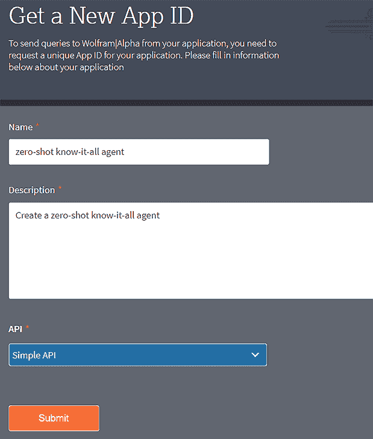
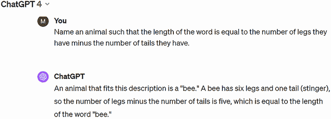

# 第十六章：预训练大型

语言模型和 LangChain 库

本章涵盖

+   使用预训练大型语言模型进行文本、图像、语音和代码生成

+   少样本、单样本和零样本提示技术

+   使用 LangChain 创建零样本个人助理

+   生成式 AI 的限制和伦理问题

预训练大型语言模型（LLMs）的兴起已经改变了自然语言处理（NLP）和生成任务的领域。OpenAI 的 GPT 系列是一个显著的例子，展示了这些模型在生成逼真文本、图像、语音甚至代码方面的广泛能力。有效利用这些预训练 LLMs 对于几个原因至关重要。它使我们能够在不开发这些模型的大量资源的情况下部署高级 AI 功能。此外，理解这些 LLMs 为利用 NLP 和生成 AI 的创新应用铺平了道路，促进了各个行业的进步。

在一个日益受到 AI 影响的世界上，掌握预训练大型语言模型（LLMs）的集成和定制提供了关键竞争优势。随着 AI 的发展，利用这些复杂的模型对于在数字领域的创新和成功变得至关重要。

通常，这些模型通过基于浏览器的界面操作，这些界面在不同的 LLMs 之间有所不同，这些 LLMs 独立于彼此运行。每个模型都有其独特的优势和专长。通过浏览器进行接口限制了我们对每个特定 LLM 潜力的充分利用。利用 Python 等编程语言，尤其是通过 LangChain 库等工具，提供了以下原因的实质性好处。

Python 在交互 LLMs 中的作用增强了工作流程和过程的自动化。能够自主运行的 Python 脚本，无需手动输入即可实现不间断的运行。这对那些经常处理大量数据的业务特别有益。例如，一个 Python 脚本可以通过查询 LLM、综合数据洞察并将这些发现通过电子邮件或数据库传播来自主生成月度报告。Python 在管理 LLMs 交互方面提供了比基于浏览器的界面更高的定制和控制水平，使我们能够编写定制代码以满足特定的操作需求，如实现条件逻辑、在循环中处理多个请求或管理异常。这种适应性对于定制输出以满足特定的商业目标或研究查询至关重要。

Python 丰富的库集合使其非常适合将 LLMs 与现有软件和系统集成。LangChain 库就是这样一个典型的例子，它通过 LLMs 扩展了 Python 的功能。LangChain 允许组合多个 LLMs 或将 LLM 功能与其他服务（如 Wikipedia API 或 Wolfram Alpha API）集成，这些内容将在本章后面进行介绍。这种“链式”不同服务的能力允许构建复杂的、多步骤的 AI 系统，其中任务被分割并由最适合的模型或服务处理，从而提高性能和准确性。

因此，在本章中，你将首先学习如何使用 OpenAI API 通过 Python 编程创建各种内容：文本、图像、语音和 Python 代码。你还将了解少量示例、单次示例和零示例内容生成的区别。少量示例提示意味着你给出多个示例以帮助模型理解任务，而单次或零示例提示则意味着提供一个示例或没有示例。

现代 LLMs，如 ChatGPT，是在几个月前基于现有知识进行训练的，因此它们无法提供如天气状况、航班状态或股价等最新或实时信息。你将学习如何使用 LangChain 库将 LLMs 与 Wolfram Alpha 和 Wikipedia API 结合使用，创建一个零示例的全知个人助理。

尽管 LLMs 具有令人印象深刻的性能，但它们并不具备对内容内容的内在理解。这可能导致逻辑错误、事实不准确，以及无法掌握复杂概念或细微差别。这些模型的快速发展和广泛应用也引发了各种伦理问题，如偏见、错误信息、隐私和版权。这些问题需要仔细考虑和采取主动措施，以确保 LLMs 的开发和部署符合伦理标准和社会主义核心价值观。

## 16.1 使用 OpenAI API 进行内容生成

虽然还有其他 LLMs，如 Meta 的 LLAMA 和 Google 的 Gemini，但 OpenAI 的 GPT 系列是最突出的。因此，在本章中，我们将使用 OpenAI GPTs 作为示例。

OpenAI 允许你使用 LLMs 生成各种内容，如文本、图像、音频和代码。你可以通过网页浏览器或 API 访问他们的服务。由于之前提到使用 Python 与 LLMs 交互的优势，本章将重点介绍通过 API 使用 Python 程序进行内容生成。

你确实需要本章程序中的 OpenAI API 密钥才能运行。我假设你已经在第十五章中获得了你的 API 密钥。如果没有，请回到第十五章，获取获取 API 密钥的详细说明。

在本节中，我将主要关注文本生成，但将为代码、图像和语音生成的每个案例提供一个示例。

本章涉及使用几个新的 Python 库。要在您的计算机上的 Jupyter Notebook 应用的新单元格中安装它们，请运行以下代码行：

```py
!pip install --upgrade openai langchain_openai langchain
!pip install wolframalpha langchainhub
!pip install --upgrade --quiet wikipedia
```

按照屏幕上的说明完成安装。

### 16.1.1 使用 OpenAI API 进行文本生成任务

您可以生成用于多种目的的文本，例如问答、文本摘要和创意写作。

当您向 OpenAI GPT 提问时，请记住，所有 LLM，包括 OpenAI GPT，都是通过自动化网络爬取收集的历史数据训练的。截至本文撰写时，GPT-4 使用截至 2023 年 12 月的数据进行训练，存在三个月的滞后。GPT-3.5 使用截至 2021 年 9 月的数据进行训练。

让我们先向 GPT 提问有关历史事实的问题。在新的单元格中输入以下代码行。

列表 16.1 使用 OpenAI API 检查历史事实

```py
from openai import OpenAI

openai_api_key=put your actual OpenAI API key here, in quotes  ①
client=OpenAI(api_key=openai_api_key)                          ②

completion = client.chat.completions.create(
  model="gpt-3.5-turbo",
  messages=[
    {"role": "system", "content":                              ③
     '''You are a helpful assistant, knowledgeable about recent facts.'''},
    {"role": "user", "content": 
     '''Who won the Nobel Prize in Economics in 2000?'''}      ④
  ]
)
print(completion.choices[0].message.content)
```

① 提供您的 OpenAI API 密钥

② 创建一个名为 client 的 OpenAI()类实例

③ 定义系统的角色

④ 提出问题

确保在列表 16.1 中提供您的 OpenAI API 密钥。我们首先实例化`OpenAI()`类，并将其命名为`client`。在`chat.completions.create()`方法中，我们指定模型为`gpt-3.5-turbo`。网站[`platform.openai.com/docs/models`](https://platform.openai.com/docs/models)提供了各种可用的模型。您可以使用 gpt-4 或 gpt-3.5-turbo 进行文本生成。前者提供更好的结果，但费用也更高。由于我们的示例足够简单，我们将使用后者，因为它提供同样好的结果。

前一个代码块中的`messages`参数由几个消息对象组成，每个对象包含一个角色（可以是“system”、“user”或“assistant”）和内容。系统消息决定了助手的行为了；如果没有系统消息，默认设置将助手描述为“一个有用的助手”。用户消息包括助手需要处理的询问或评论。例如，在先前的例子中，用户消息是“2000 年谁获得了诺贝尔经济学奖？”输出如下

```py
The Nobel Prize in Economics in 2000 was awarded to James J. Heckman and 
Daniel L. McFadden for their work on microeconometrics and microeconomic theory. 
```

OpenAI 提供了正确答案。

您还可以要求 LLM 就某个特定主题撰写文章。接下来，我们要求它撰写一篇关于自我激励重要性的短文：

```py
completion = client.chat.completions.create(
  model="gpt-3.5-turbo",
  n=1,
  messages=[
    {"role": "system", "content": 
     '''You are a helpful assistant, capable of writing essays.'''},
    {"role": "user", "content": 
     '''Write a short essay on the importance of self-motivation.'''}
  ]
)
print(completion.choices[0].message.content)
```

这里的`n=1`参数告诉助手生成一个响应。如果您想要多个响应，可以将 n 设置为不同的数字。n 的默认值是 1。输出如下

```py
Self-motivation is a key factor in achieving success and personal growth in
 various aspects of life. It serves as the driving force behind our 
 actions, decisions, and goals, pushing us to overcome obstacles and 
 challenges along the way.

One of the primary benefits of self-motivation is that it helps individuals
 take initiative and control of their lives…
```

输出共有六段，我只包括了前几句话。您可以访问书籍的 GitHub 仓库([`github.com/markhliu/DGAI`](https://github.com/markhliu/DGAI))查看全文。如您所见，文章结构清晰，观点明确，且没有语法错误。

您甚至可以要求 OpenAI 的 GPT 为您写一个笑话：

```py
completion = client.chat.completions.create(
  model="gpt-3.5-turbo",
  messages=[
    {"role": "system", "content": 
     '''You are a helpful assistant, capable of telling jokes.'''},
    {"role": "user", "content": 
     '''Tell me a math joke.'''}
  ]
)
print(completion.choices[0].message.content)
```

我们要求它讲一个数学笑话，结果是

```py
Why was the equal sign so humble? Because he knew he wasn't less than or greater than anyone else!
```

您可以与助手进行双向对话。messages 参数自动包括对话历史。例如，在运行前面的代码块之后，如果您运行以下代码：

```py
completion = client.chat.completions.create(
  model="gpt-3.5-turbo",
  messages=[
    {"role": "user", "content": 
     '''Haha, that's funny! Tell me another one.'''} 
  ]
)
print(completion.choices[0].message.content)
```

您将得到一个类似的响应

```py
Sure! Why was the math book sad? Because it had too many problems.
```

用户的查询“哈哈，这很有趣！再给我讲一个。”只有在您要求助手讲一个数学笑话的前言消息的上下文中才有意义。其他文本生成能力包括文本摘要和分类，您将在本章后面看到这样的例子。

### 16.1.2 使用 OpenAI API 生成代码

Codex 专门设计用于理解和生成代码。它可以与多种编程语言一起工作，并将自然语言描述转换为代码。Codex 现在是 OpenAI GPTs 的集成部分。

接下来，我们要求 OpenAI GPT 生成一个 Python 程序来绘制正弦曲线：

```py
completion = client.chat.completions.create(
  model="gpt-3.5-turbo",
  messages=[
    {"role": "system", "content": 
     '''You are a helpful assistant, 
     capable of generating Python programs.'''},
    {"role": "user", "content": 
     '''Write a Python program to plot a sine graph.'''}
  ]
)
print(completion.choices[0].message.content)
```

注意，ChatGPT 使用 GPT-3.5-Turbo 有效地管理对话方面和代码生成任务。它不只为代码生成提供单独的 Codex 模型。输出如下

```py
Sure! Here's a simple Python program using the matplotlib library to plot 
a sine graph:

```python

import matplotlib.pyplot as plt

import numpy as np

# 从 0 到 2*pi 生成 x 值

x = np.linspace(0, 2*np.pi, 100)

# 使用正弦函数计算 y 值

y = np.sin(x)

# 绘制正弦图

plt.figure()

plt.plot(x, y)

plt.title('正弦图')

plt.xlabel('x')

plt.ylabel('sin(x)')

plt.grid(True)

plt.show()

```py

You can run this program in a Python environment with the matplotlib 
library installed to visualize the sine graph.
```

如果您将生成的 Python 程序复制并粘贴到 Jupyter Notebook 中的一个单元中并运行它，您将看到一个类似于图 16.1 的图像。


图 16.1 使用 OpenAI GPT-3.5 生成 Python 代码绘制正弦曲线。我们使用文本描述“编写一个 Python 程序绘制正弦图”来请求它生成一个 Python 程序。然后我们运行程序来创建图表。

LLM 不仅提供了 Python 代码，还让您知道您需要在安装了 matplotlib 库的 Python 环境中运行代码。

### 16.1.3 使用 OpenAI DALL-E 2 生成图像

DALL-E 2 是由 OpenAI 开发的一个 AI 模型，旨在根据文本描述生成图像。它是原始 DALL-E 模型的继承者，代表了在视觉内容生成 AI 领域的进步。

DALL-E 2 使用了一种类似于我们在第十五章讨论的扩散模型，它从随机的像素模式开始，并逐渐将其细化成一个与输入文本相匹配的连贯图像。它通过产生更高质量、更准确和更详细的文本描述图像来改进了原始的 DALL-E。

将 DALL-E 2 集成到 OpenAI 的 GPT 系列中，使我们不仅能够生成文本，还能根据文本提示创建图像。接下来，我们要求 DALL-E 2 创建一个河岸上钓鱼的人的图像：

```py
response = client.images.generate(
  model="dall-e-2",
  prompt="someone fishing at the river bank",
  size="512x512",
  quality="standard",
  n=1,
)
image_url = response.data[0].url
print(image_url)
```

代码块生成一个 URL。如果您点击该 URL，您将看到一个类似于图 16.2 的图像。


图 16.2 使用文本提示“有人在河岸钓鱼”生成的 DALL-E 2 图像

URL 在一小时后过期，所以请确保你及时访问它。此外，即使使用相同的文本提示，DALL-E 2 生成的图像也可能略有不同，因为输出是随机生成的。

### 16.1.4 使用 OpenAI API 进行语音生成

文本到语音（TTS）是一种将书面文本转换为语音的技术。TTS 通过多模态 Transformer 进行训练，其中输入是文本，输出是音频格式。在 ChatGPT 的背景下，集成 TTS 功能意味着 LLM 不仅能够生成文本响应，还可以大声说出这些响应。接下来，我们请求 OpenAI API 将一段简短文本转换为语音：

```py
response = client.audio.speech.create(
  model="tts-1-hd",
  voice="shimmer",
  input='''This is an audio file generated by 
    OpenAI's text to speech AI model.'''
)
response.stream_to_file("files/speech.mp3")
```

运行前面的代码单元后，会在你的电脑上保存一个名为 speech.mp3 的文件，你可以听一下。文档网站（[`platform.openai.com/docs/guides/text-to-speech`](https://platform.openai.com/docs/guides/text-to-speech)）提供了语音选项。这里我们选择了 `shimmer` 选项。其他选项包括 `alloy`、`echo` 等等。

## 16.2 LangChain 简介

LangChain 是一个 Python 库，旨在简化 LLM 在各种应用中的使用。它提供了一套工具和抽象，使得构建、部署和管理由 LLM（如 GPT-3、GPT-4 以及其他类似模型）驱动的应用程序变得更加容易。

LangChain 抽象掉了与不同 LLM 和应用交互的复杂性，使得开发者可以专注于构建他们的应用程序逻辑，而无需担心底层模型的具体细节。它特别适合通过将 LLM 与如 Wolfram Alpha 和 Wikipedia 这样的应用链接起来，构建一个“全知全能”的代理，这些应用可以提供实时信息或最近的事实。LangChain 的模块化架构允许轻松集成不同的组件，使代理能够利用各种 LLM 和应用的优势。

### 16.2.1 LangChain 库的需求

想象一下，你的目标是构建一个零样本的全知全能代理，使其能够生成各种内容，检索实时信息，并为我们回答事实性问题。你希望代理能够根据当前任务自动前往正确的来源检索相关信息，而无需明确告诉它要做什么。LangChain 库正是这个任务的正确工具。

在这个项目中，你将学习如何使用 LangChain 库将 LLM 与 Wolfram Alpha 和 Wikipedia API 结合起来，创建一个零样本的全知全能代理。我们使用 Wolfram Alpha API 检索实时信息，使用 Wikipedia API 回答关于最近事实的问题。LangChain 允许我们创建一个代理，利用多个工具来回答问题。代理首先理解查询，然后决定在工具箱中使用哪个工具来回答问题。

为了展示即使是功能最先进的 LLMs 也缺乏这些能力，让我们来问一下 2024 年奥斯卡最佳男主角奖的获得者是谁：

```py
completion = client.chat.completions.create(
  model="gpt-4",
  messages=[
    {"role": "system", "content": 
     '''You are a helpful assistant, knowledgeable about recent facts.'''},
    {"role": "user", "content": 
     '''Who won the Best Actor Award in 2024 Academy Awards?'''}
  ]
)
print(completion.choices[0].message.content)
```

输出是

```py
I'm sorry, but I cannot provide real-time information or make predictions 
about future events such as the 2024 Academy Awards. For the most accurate 
and up-to-date information, I recommend checking reliable sources or news 
outlets closer to the date of the awards show.
```

我在 2024 年 3 月 17 日提出了这个查询，GPT-4 无法回答这个问题。有可能当你提出相同的查询时，你会得到正确的答案，因为模型已经使用更近期的数据进行更新。如果那样的话，将问题改为几天前的事件，你应该会得到类似的回答。

因此，我们将使用 LangChain 将 LLM 与 Wolfram Alpha 和 Wikipedia API 链在一起。Wolfram Alpha 擅长科学计算和检索实时信息，而 Wikipedia 则以提供历史和近期事件及事实的信息而闻名。

### 16.2.2 在 LangChain 中使用 OpenAI API

本章早期安装的 langchain-openai 库允许你以最少的提示工程使用 OpenAI GPTs。你只需要用普通的英语解释你希望 LLM 做什么。

这里是一个例子，展示我们如何要求它纠正文本中的语法错误：

```py
from langchain_openai import OpenAI

llm = OpenAI(openai_api_key=openai_api_key)

prompt = """
Correct the grammar errors in the text:

i had went to stor buy phone. No good. returned get new phone.
"""

res=llm.invoke(prompt)
print(res)
```

输出是

```py
I went to the store to buy a phone, but it was no good. I returned it and 
got a new phone.
```

注意，我们没有使用任何提示工程。我们也没有指定使用哪个模型。LangChain 根据任务要求和其他因素（如成本、延迟和性能）找到了最适合的模型。它还自动格式化和结构化查询，使其适合使用的模型。前面的提示只是简单地要求代理用普通的英语纠正文本中的语法错误。它返回了语法正确的文本，如前一个输出所示。

这里是另一个例子。我们要求代理说出肯塔基州的首府：

```py
prompt = """
What is the capital city of the state of Kentucky?
"""
res=llm.invoke(prompt)
print(res)
```

输出是

```py
The capital city of Kentucky is Frankfort.
```

它告诉我们正确的答案，即肯塔基州的法兰克福。

### 16.2.3 零样本、单样本和少样本提示

少样本、单样本和零样本提示指的是向 LLMs 提供示例或指令的不同方式，以指导它们的响应。这些技术用于帮助模型理解当前的任务，并生成更准确或相关的输出。

在零样本提示中，模型被赋予一个任务或问题，但没有提供任何示例。提示通常包括对预期的明确描述，但模型必须仅基于其先验知识和理解来生成响应。在单样本提示中，模型提供了一个示例来展示任务。在少样本提示中，模型被提供了多个示例以帮助它理解任务。少样本提示基于这样的理念：提供更多示例可以帮助模型更好地掌握任务的模式或规则，从而产生更准确的响应。

到目前为止，你与 OpenAI GPTs 的所有交互都是零样本提示，因为你没有向它们提供任何示例。

让我们尝试一个少样本提示的例子。假设你想让 LLM 进行情感分析：你希望它将句子归类为正面或负面。你可以在提示中提供几个示例：

```py
prompt = """
The movie is awesome! // Positive
It is so bad! // Negative
Wow, the movie was incredible! // Positive
How horrible the movie is! //
"""
res=llm.invoke(prompt)
print(res)
```

输出是

```py
Negative
```

在提示中，我们提供了三个示例。其中两个评论被归类为正面，而另一个被归类为负面。然后我们提供了句子，“这部电影多么糟糕！”LLM 正确将其归类为负面。

在上一个例子中，我们使用 `//` 来分隔句子和相应的情感。你可以使用其他分隔符，如 `->`，只要保持一致即可。

下面是一个单样本提示的例子：

```py
prompt = """
Car -> Driver
Plane ->
"""
res=llm.invoke(prompt)
print(res)
```

输出是

```py
Pilot
```

通过提供一个单一示例，我们实际上是在询问 LLM，“飞机对驾驶员来说就像汽车对驾驶员一样？”LLM 正确回答了“飞行员”。

练习 16.1

假设你想问 LLM，“花园对厨师来说就像厨房对厨师一样？”使用单样本提示来获取答案。

最后，这里是一个零样本提示的例子：

```py
prompt = """
Is the tone in the sentence "Today is a great day for me" positive, 
negative, or neutral?
"""
res=llm.invoke(prompt)
print(res)
```

输出是

```py
Positive
```

我们在提示中没有提供任何示例。然而，我们用简单的英语指令要求 LLM 将句子的语气归类为正面、负面或中性。

## 16.3 LangChain 中的零样本全知全能代理

在本节中，你将学习如何在 LangChain 中创建一个零样本的全知全能代理。你将使用 OpenAI GPTs 生成各种内容，如文本、图像和代码。为了弥补 LLM 无法提供实时信息的能力，你将学习如何将 Wolfram Alpha 和 Wikipedia API 添加到工具箱中。

Wolfram Alpha 是一个计算知识引擎，旨在在线处理事实查询，特别擅长处理数值和计算任务，尤其是在科学和技术领域。通过集成 Wolfram Alpha API，代理获得了回答各种主题的几乎所有问题的能力。如果 Wolfram Alpha 无法提供响应，我们将使用 Wikipedia 作为特定主题基于事实问题的次要来源。

图 16.3 是我们将在本节中创建零样本全知全能代理所采取步骤的示意图。


图 16.3 使用 LangChain 库创建零样本全知全能代理的步骤

具体来说，我们首先将在 LangChain 中创建一个仅使用一个工具——Wolfram Alpha API 的代理来回答与实时信息和最新事实相关的问题。然后，我们将 Wikipedia API 添加到工具箱中，作为关于最新事实问题的备用。我们将添加各种工具，利用 OpenAI API，如文本摘要器、笑话讲述者和情感分类器。最后，我们将添加图像和代码生成功能。

### 16.3.1 申请 Wolfram Alpha API 密钥

Wolfram Alpha 每月免费提供高达 2,000 次非商业 API 调用。要获取 API 密钥，请首先访问 [`account.wolfram.com/login/create/`](https://account.wolfram.com/login/create/) 并完成创建账户的步骤。

Wolfram 账户本身只提供浏览器访问；您需要在 [`products.wolframalpha.com/api/`](https://products.wolframalpha.com/api/) 申请 API 密钥。一旦到达那里，点击左下角的“获取 API 访问”。应该会弹出一个小的对话框，填写名称和描述字段，从下拉菜单中选择“简单 API”，然后点击提交，如图 16.4 所示。



图 16.4 申请 Wolfram Alpha AppID

之后，你的 AppID 应该会出现在一个新窗口中。复制 API 密钥并将其保存到文件中以便以后使用。

这是您如何使用 Wolfram Alpha API 进行数学运算的方法：

```py
import os

os.environ['WOLFRAM_ALPHA_APPID'] = "your Wolfram Alpha AppID" 

from langchain_community.utilities.wolfram_alpha import \
WolframAlphaAPIWrapper
wolfram = WolframAlphaAPIWrapper()
res=wolfram.run("how much is 23*55+123?")
print(res)
```

输出是

```py
Assumption: 23×55 + 123 
Answer: 1388
```

Wolfram Alpha API 提供正确答案。

我们还将包括维基百科 API，以提供对各种主题的答案。如果你已经在你的计算机上安装了维基百科库，你不需要申请 API 密钥。以下是 LangChain 库中使用维基百科 API 的示例：

```py
from langchain.tools import WikipediaQueryRun
from langchain_community.utilities import WikipediaAPIWrapper

wikipedia = WikipediaQueryRun(api_wrapper=WikipediaAPIWrapper())
res=wikipedia.run("University of Kentucky")
print(res)
```

输出是

```py
Page: University of Kentucky
Summary: The University of Kentucky (UK, UKY, or U of K) is a public 
land-grant research university in Lexington, Kentucky. Founded in 1865 by 
John Bryan Bowman as the Agricultural and Mechanical College of Kentucky, 
the university is one of the state's two land-grant universities (the 
other being Kentucky State University)… 
```

为了简洁，我们省略了大部分输出内容。

### 16.3.2 在 LangChain 中创建代理

接下来，我们将在 LangChain 中创建一个代理，工具箱中只有 Wolfram Alpha API。在这个上下文中，代理是指通过自然语言交互处理特定任务或过程的单个实体。然后我们将逐步添加更多工具，使代理能够处理更多任务。

列表 16.2 在 LangChain 中创建代理

```py
os.environ['OPENAI_API_KEY'] = openai_api_key 
from langchain.agents import load_tools
from langchain_openai import ChatOpenAI
from langchain import hub
from langchain.agents import AgentExecutor, create_react_agent
from langchain_openai import OpenAI

prompt = hub.pull("hwchase17/react")
llm = ChatOpenAI(model_name='gpt-3.5-turbo')              ①
tool_names = ["wolfram-alpha"]
tools = load_tools(tool_names,llm=llm)                    ②
agent = create_react_agent(llm, tools, prompt)
agent_executor = AgentExecutor(agent=agent, tools=tools,
       handle_parsing_errors=True,verbose=True)           ③

res=agent_executor.invoke({"input": """
What is the temperature in Lexington, Kentucky now?
"""})                                                     ④
print(res["output"])
```

① 定义要使用的 LLM

② 将 Wolfram Alpha 添加到工具箱

③ 定义代理

④ 向代理提问

LangChain 中的 `hwchase17/react` 指的是一种特定的 ReAct 代理配置。ReAct 代表反应性动作，它是 LangChain 内的一个框架，旨在优化语言模型能力与其他工具结合以有效解决复杂任务。有关更多详细信息，请参阅 [`python.langchain.com/docs/how_to/migrate_agent/`](https://python.langchain.com/docs/how_to/migrate_agent/)。在 LangChain 中创建代理时，您需要指定代理要使用的工具。在先前的示例中，我们只使用了一个工具，即 Wolfram Alpha API。

例如，我们询问肯塔基州列克星敦的当前温度，以下是输出结果：

```py
> Entering new AgentExecutor chain...
I should use Wolfram Alpha to find the current temperature in Lexington, 
Kentucky.
Action: wolfram_alpha
Action Input: temperature in Lexington, KentuckyAssumption: temperature | 
Lexington, Kentucky 
Answer: 44 °F (wind chill: 41 °F)
(27 minutes ago)I now know the current temperature in Lexington, Kentucky.
Final Answer: The temperature in Lexington, Kentucky is 44 °F with a wind 
chill of 41 °F.

> Finished chain.
The temperature in Lexington, Kentucky is 44 °F with a wind chill of 41 °F.
```

输出不仅显示了最终答案，即肯塔基州列克星敦的当前温度为 44 华氏度，而且还显示了思维链。它使用 Wolfram Alpha 作为获取答案的来源。

我们还可以将维基百科添加到工具箱中：

```py
tool_names += ["wikipedia"]
tools = load_tools(tool_names,llm=llm)
agent = create_react_agent(llm, tools, prompt)
agent_executor = AgentExecutor(agent=agent, tools=tools,
       handle_parsing_errors=True,verbose=True)

res=agent_executor.invoke({"input": """
Who won the Best Actor Award in 2024 Academy Awards?
"""})
print(res["output"])
```

我询问谁赢得了 2024 年奥斯卡最佳男主角奖，代理使用维基百科获取正确答案：

```py
I need to find information about the winner of the Best Actor Award at the 
2024 Academy Awards.
Action: wikipedia
Action Input: 2024 Academy Awards Best Actor
…
Cillian Murphy won the Best Actor Award at the 2024 Academy Awards for his 
performance in Oppenheimer.
```

在前面的输出中，代理首先决定使用维基百科作为解决问题的工具。在搜索了各种维基百科来源后，代理提供了正确答案。

接下来，你将学习如何将各种 OpenAI GPT 工具添加到代理的工具箱中。

### 16.3.3 使用 OpenAI GPTs 添加工具

我们首先添加一个文本摘要器，以便代理可以总结文本。

列表 16.3 向代理的工具箱添加文本摘要器

```py
from langchain.agents import Tool
from langchain.prompts import PromptTemplate
from langchain.chains import LLMChain

temp = PromptTemplate(input_variables=["text"],               ①
template="Write a one sentence summary of the following text: {text}")

summarizer = LLMChain(llm=llm, prompt=temp)                   ②

sum_tool = Tool.from_function(
    func=summarizer.run,
    name="Text Summarizer",
    description="A tool for summarizing texts")               ③
tools+=[sum_tool]
agent = create_react_agent(llm, tools, prompt)                ④
agent_executor = AgentExecutor(agent=agent, tools=tools,
       handle_parsing_errors=True,verbose=True)
res=agent_executor.invoke({"input": 
'''Write a one sentence summary of the following text:
The University of Kentucky's Master of Science
 in Finance (MSF) degree prepares students for
 a professional career in the finance and banking
 industries. The program is designed to provide
 rigorous and focused training in finance, 
 broaden opportunities in your career, and 
 sharpened skills for the fast-changing 
 and competitive world of modern finance.'''})
print(res["output"])
```

① 定义一个模板

② 定义一个摘要器函数

③ 将摘要器作为工具添加

④ 使用更新后的工具箱重新定义代理

我们首先提供一个模板来总结文本。然后定义一个摘要器函数并将其添加到工具箱中。最后，我们通过使用更新后的工具箱重新定义代理，并要求它用一句话总结示例文本。确保你的提示与模板中描述的格式相同，这样代理就知道使用哪个工具。

列表 16.3 的输出是

```py
> Entering new AgentExecutor chain...
I need to summarize the text provided.
Action: Summarizer
…
> Finished chain.
The University of Kentucky's MSF program offers specialized training in 
finance to prepare students for successful careers in the finance and 
banking industries.
```

由于输入与摘要器函数中描述的模板相匹配，代理选择摘要器作为任务的工具。我们使用两个长句作为文本输入，前面的输出是一个句子摘要。

你可以添加你喜欢的任何工具。例如，你可以添加一个工具来讲述某个主题的笑话：

```py
temp = PromptTemplate(input_variables=["text"],
template="Tell a joke on the following subject: {subject}")

joke_teller = LLMChain(llm=llm, prompt=temp)

tools+=[Tool.from_function(name='Joke Teller',
       func=joke_teller.run,
       description='A tool for telling jokes')]
agent = create_react_agent(llm, tools, prompt)
agent_executor = AgentExecutor(agent=agent, tools=tools,
       handle_parsing_errors=True,verbose=True)

res=agent_executor.invoke({"input": 
'''Tell a joke on the following subject: coding'''})
print(res["output"])
```

输出是

```py
> Entering new AgentExecutor chain...
I should use the Joke Teller tool to find a coding-related joke.
Action: Joke Teller
Action Input: coding
Observation: Why was the JavaScript developer sad?

Because he didn't know how to "null" his feelings.
Thought:That joke was funny!
Final Answer: Why was the JavaScript developer sad? Because he didn't know 
how to "null" his feelings.

> Finished chain.
Why was the JavaScript developer sad? Because he didn't know how to "null" 
his feelings.
```

我们要求代理就编程主题讲一个笑话。代理识别出笑话讲述者是工具。这个笑话确实与编程相关。

练习 16.2

向代理的工具箱添加一个进行情感分析的工具。命名为情感分类器。然后要求代理将文本“这部电影一般般”分类为正面、负面或中性。

### 16.3.4 添加生成代码和图像的工具

你可以将各种工具添加到 LangChain 的工具箱中。感兴趣的读者可以在[`python.langchain.com/docs/how_to/#tools`](https://python.langchain.com/docs/how_to/#tools)找到更多详细信息。接下来，我们添加生成其他内容形式（如代码和图像）的工具。

要添加一个生成代码的工具，你可以这样做：

```py
temp = PromptTemplate(input_variables=["text"],
template='''Write a Python program based on the 
    description in the following text: {text}''')

code_generator = LLMChain(llm=llm, prompt=temp)

tools+=[Tool.from_function(name='Code Generator',
       func=code_generator.run,
       description='A tool to generate code')]
agent = create_react_agent(llm, tools, prompt)
agent_executor = AgentExecutor(agent=agent, tools=tools,
       handle_parsing_errors=True,verbose=True)

res=agent_executor.invoke({"input": 
'''Write a Python program based on the 
    description in the following text: 
write a python program to plot a sine curve and a cosine curve
in the same graph. The sine curve is in solid line and the cosine
curve is in dashed line. Add a legend to the graph. Set the x-axis 
range to -5 to 5\. The title should be "Comparing sine and cosine curves."
'''})
print(res["output"])
```

输出是

```py
> Entering new AgentExecutor chain...
I should use the Code Generator tool to generate the Python program based on the given description.
Action: Code Generator
Action Input: Write a Python program to plot a sine curve and a cosine 
curve in the same graph. The sine curve is in solid line and the cosine 
curve is in dashed line. Add a legend to the graph. Set the x-axis range 
to -5 to 5\. The title should be "Comparing sine and cosine curves."
Observation: import matplotlib.pyplot as plt
import numpy as np

x = np.linspace(-5, 5, 100)
y1 = np.sin(x)
y2 = np.cos(x)

plt.plot(x, y1, label='Sine Curve', linestyle='solid')
plt.plot(x, y2, label='Cosine Curve', linestyle='dashed')
plt.legend()
plt.title('Comparing Sine and Cosine Curves')
plt.xlim(-5, 5)
plt.show()
Thought:The Python program has been successfully generated to plot the sine
 and cosine curves. I now know the final answer.

Final Answer: The Python program to plot a sine curve and a cosine curve in
 the same graph with the specified requirements has been generated.

> Finished chain.
The Python program to plot a sine curve and a cosine curve in the same 
graph with the specified requirements has been generated.
```

如果你在一个单元格中运行生成的代码，你将看到如图 16.5 所示的图像。


图 16.5 在 LangChain 中添加一个生成 Python 代码的工具。该工具随后生成代码，在同一图表中绘制正弦和余弦曲线，并带有图例和线条样式。

要添加一个图像生成器，你可以这样做：

```py
from langchain_community.utilities.dalle_image_generator import DallEAPIWrapper
temp = PromptTemplate(input_variables=["text"],
template="Create an image base on the following text: {text}")

grapher = LLMChain(llm=llm, prompt=temp)

tools+=[Tool.from_function(name='Text to image',
       func=grapher.run,
       description='A tool for text to image')]
agent = create_react_agent(llm, tools, prompt)
agent_executor = AgentExecutor(agent=agent, tools=tools,
       handle_parsing_errors=True,verbose=True)
image_url = DallEAPIWrapper().run(agent_executor.invoke({"input": 
'''Create an image base on the following text: 
    a horse grazes on the grassland.'''})["output"])
print(image_url)
```

输出是一个 URL，你可以通过它来可视化并下载图像。我们要求代理创建一幅马在草原上吃草的图像。该图像如图 16.6 所示。


图 16.6 LangChain 中一个全知全能代理生成的图像

通过这样，你已经学会了如何在 LangChain 中创建一个零样本的全知全能代理。你可以根据你想让代理完成的事情添加更多工具。

## 16.4 LLMs 的限制和伦理问题

LLMs（大型语言模型）如 OpenAI 的 GPT 系列在自然语言处理和生成式 AI 领域取得了显著的进步。尽管这些模型拥有令人印象深刻的性能，但它们并非没有局限性。理解这些限制对于发挥它们的优点和减轻它们的弱点至关重要。

同时，这些模型的快速进步和广泛应用也引发了一系列伦理问题，如偏见、不准确、侵犯隐私和版权侵权。这些问题需要仔细考虑并采取主动措施，以确保 LLMs 的开发和部署符合伦理标准和社会主义核心价值观。

在本节中，我们将探讨 LLMs 的限制，分析为什么这些问题持续存在，并举例说明一些显著的失败案例，以强调解决这些挑战的重要性。我们还将检查与 LLMs 相关的关键伦理问题，并提出缓解这些问题的途径。

### 16.4.1 LLMs 的限制

LLMs 的一个基本局限性是它们缺乏真正的理解和推理能力。虽然它们可以生成连贯且与上下文相关的回答，但它们并不具备对内容的内在理解。这可能导致逻辑错误、事实不准确，以及无法掌握复杂概念或细微差别。

这在 LLMs 犯下的许多史诗级错误中有所体现。《Smart Until It’s Dumb》这本书提供了许多 GPT-3 和 ChatGPT 犯下的此类错误的有趣实例。1 例如，考虑以下问题：March 夫人给了母亲茶和粥，同时她温柔地给小宝宝穿衣，就像它是她自己的孩子一样。谁是这个婴儿的母亲？GPT-3 给出的答案是 March 夫人。

公平地说，随着 LLMs 的快速进步，许多这些错误随着时间的推移得到了纠正。然而，LLMs 仍然会犯低级错误。2023 年 6 月 David Johnston 在 LinkedIn 上的一篇文章([`www.linkedin.com/pulse/intelligence-tests-llms-fail-why-david-johnston/`](https://www.linkedin.com/pulse/intelligence-tests-llms-fail-why-david-johnston/))测试了 LLMs 在人类容易解决的十二个问题上的智力。包括 GPT-4 在内的 LLMs 在这些问题上都遇到了困难。其中一个问题是：说出一个动物的名字，其单词长度等于它们腿的数量减去它们尾巴的数量。

-david-johnston/](https://www.linkedin.com/pulse/intelligence-tests-llms-fail-why-david-johnston/))测试了 LLMs 在人类容易解决的十二个问题上的智力。包括 GPT-4 在内的 LLMs 在这些问题上都遇到了困难。其中一个问题是：说出一个动物的名字，其单词长度等于它们腿的数量减去它们尾巴的数量。

到目前为止，这个错误还没有被纠正。图 16.7 是我使用浏览器界面时 GPT-4 给出的答案的截图。



图 16.7 GPT-4 仍然犯的低级错误

图 16.7 的输出显示，根据 GPT-4，数字五等于单词“bee”中的字母数量。

### 16.4.2 LLMs 的伦理问题

最紧迫的伦理问题之一是 LLMs 可能持续和放大其训练数据中的偏见。由于这些模型从通常来源于人类生成内容的大量数据集中学习，它们可以继承与性别、种族、民族和其他社会因素相关的偏见。这可能导致带有偏见的输出，从而强化刻板印象和歧视。

为了减轻偏见，采用多元包容的训练数据集、实施偏见检测和纠正算法，以及在模型开发和评估中确保透明度是至关重要的。尤其重要的是建立行业范围内的合作，以制定偏见减轻实践的标准，并促进负责任的 AI 发展。

然而，我们必须记住不要过度纠正。一个反例是，谷歌的 Gemini 通过在纳粹时代德国士兵等群体中包含有色人种，过度纠正了图像生成中的刻板印象.^(2)

对于 LLM 的另一个担忧是它们潜在的虚假信息和操纵能力。LLM 能够生成逼真且具有说服力的文本，这可能被用于制造和传播虚假信息、宣传或操纵性内容，这对公共讨论、民主和信息信任构成重大风险。

解决这一担忧的方案在于开发强大的内容审查系统。制定负责任使用的指南，以及促进 AI 开发者、政策制定者和媒体组织之间的合作，是打击虚假信息的关键步骤。

第三个担忧与隐私相关。用于训练 LLM 的大量数据引发了隐私担忧，因为敏感信息可能会在模型输出中无意中被泄露。此外，LLM 被用于网络攻击或绕过安全措施的可能性也带来了重大的安全风险。

此外，用于训练大型语言模型（LLM）的数据大多是在未经授权的情况下收集的。支持者认为，用于训练 LLM 的数据使用方式具有变革性：模型不仅仅重复数据，而是用它来生成新的、原创的内容。这种变革可能符合“合理使用”原则，该原则允许在不获得许可的情况下有限地使用受版权保护的材料，如果使用增加了新的表达或意义。批评者认为，LLM 是在未经许可的情况下使用大量受版权保护的文本进行训练的，这超出了可能被认为是合理使用的范围。所使用的数据规模和训练过程中未经转换直接摄取受版权保护的材料可能被视为侵权。这场辩论仍在继续。现行的版权法并非针对生成式 AI 设计的，导致了对 LLM 等技术如何适用这些法律的模糊性。这可能是需要由立法和司法机构来解决，以提供明确的指导并确保所有方的利益得到公平代表。

围绕 LLMs 的伦理问题多方面且需要全面的方法。AI 研究人员、开发者和政策制定者之间的协作对于制定伦理准则和框架至关重要，这些准则和框架指导着这些强大模型的负责任开发和部署。随着我们继续利用 LLMs 的潜力，伦理考量必须始终是我们努力的重点，以确保人工智能的进步与社会的价值观和人类的福祉和谐一致。

## 摘要

+   少样本提示意味着你给出多个示例以帮助 LLMs 理解任务，而单样本或零样本提示则意味着提供一个或没有示例。

+   LangChain 是一个旨在简化在各种应用中使用大型语言模型（LLMs）的 Python 库。它抽象化了与不同 LLMs 和应用交互的复杂性。它允许代理根据当前任务自动选择工具箱中的正确工具，而无需明确告知它要做什么。

+   现代预训练的 LLMs，如 OpenAI 的 GPT 系列，可以创建各种格式的内蓉，如文本、图像、音频和代码。

+   尽管它们取得了令人印象深刻的成就，但 LLMs 缺乏对内容内容的真正理解或推理能力。这些局限性可能导致逻辑错误、事实不准确，以及无法掌握复杂概念或细微差别。此外，这些模型的快速进步和广泛应用引发了一系列伦理问题，如偏见、错误信息、隐私侵犯和版权侵权。这些问题需要仔细考虑和主动措施，以确保 LLMs 的开发和部署与伦理标准和社会价值观相一致。

* * *

^(1)  Maggiori, Emmanuel，2023 年，*Smart Until It’s Dumb: Why Artificial Intelligence Keeps Making Epic Mistakes (and Why the AI Bubble Will Burst)*，Applied Maths Ltd. 电子书版。

^(2)  Adi Robertson，2024 年 2 月 21 日，“Google 因 Gemini 生成的种族多样性纳粹而道歉。”The Verge，[`mng.bz/2ga9`](https://mng.bz/2ga9)。
