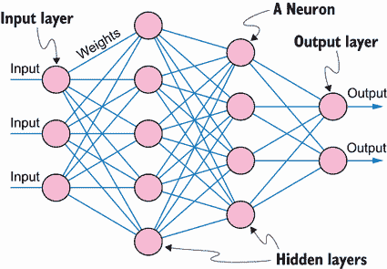

# 附录 B. 最基本合格的读者和深度学习基础知识

本书旨在面向具有中级 Python 编程技能并希望了解生成式 AI 的机器学习爱好者以及各商业领域的数据科学家。通过本书，读者将学会创建新颖和创新的内容——如图像、文本、数字、形状和音频——这些内容可以造福他们的雇主业务并推进他们自己的职业生涯。

本书是为那些对 Python 有扎实掌握的人设计的。你应该熟悉整数、浮点数、字符串和布尔值等变量类型。你还应该熟悉创建*for*和*while*循环，并理解条件执行和分支（例如，使用*if*、*elif*和*else*语句）。本书经常使用 Python 函数和类，你应该知道如何安装和导入第三方 Python 库和包。如果你需要复习这些技能，W3Schools 提供的免费在线 Python 教程是一个很好的资源（[`www.w3schools.com/python/`](https://www.w3schools.com/python/))）。

此外，你应该对机器学习有一个基本的了解，特别是神经网络和深度学习。在本附录中，我们将回顾诸如损失函数、激活函数和优化器等关键概念，这些对于开发和管理深度神经网络至关重要。然而，本附录并非旨在成为这些主题的全面教程。如果你发现你的理解有不足之处，强烈建议你在继续进行本书中的项目之前解决这些问题。为此，一本很好的书是 Stevens、Antiga 和 Viehmann（2020 年）所著的《Deep Learning with PyTorch》。（1）

不需要具备 PyTorch 或生成式 AI 的先验经验。在第二章中，你将学习 PyTorch 的基础知识，从其基本数据类型开始。你还将使用 PyTorch 实现一个端到端的深度学习项目，以获得实践经验。第二章的目标是为你使用 PyTorch 构建和训练书中各种生成模型做好准备。

## B.1 深度学习和深度神经网络

机器学习（ML）代表了人工智能领域的一个新范式。与将显式规则编程到计算机中的传统基于规则的 AI 不同，ML 涉及向计算机提供各种示例，并允许它自己学习规则。深度学习是 ML 的一个子集，它使用深度神经网络来完成这一学习过程。

在本节中，你将了解神经网络以及为什么一些被认为是深度神经网络。

### B.1.1 神经网络的解剖结构

神经网络旨在模仿人脑的功能。它由一个输入层、一个输出层以及介于两者之间零个、一个或多个隐藏层组成。术语“深度神经网络”指的是具有许多隐藏层的网络，它们通常更强大。

我们将从包含两个隐藏层的简单示例开始，如图 B.1 所示。

图 B.1 神经网络的结构。神经网络由输入层；零个、一个或多个隐藏层；和输出层组成。每一层包含一个或多个神经元。每一层的神经元与前一层和后一层的神经元相连，这些连接的强度由权重表示。在此图中，神经网络具有一个包含三个神经元的输入层，两个分别包含六个和四个神经元的隐藏层，以及一个包含两个神经元的输出层。

神经网络由输入层、可变数量的隐藏层和输出层组成。每一层由一个或多个神经元组成。同一层的神经元与前一层和后一层的神经元相连，连接强度由权重衡量。如图 B.1 所示，该神经网络具有一个包含三个神经元的输入层，两个包含六个和四个神经元的隐藏层，以及一个包含两个神经元的输出层。

### B.1.2 神经网络中的不同类型层

在神经网络中，各种类型的层具有不同的作用。最常见的是密集层，其中每个神经元都与下一层的每个神经元相连。由于这种完全连接性，密集层也被称为全连接层。

另一种在本书中经常使用的高级神经网络层是卷积层。卷积层将输入视为多维数据，并擅长从中提取模式。在我们的书中，卷积层通常用于从图像中提取空间特征。

卷积层与全连接（密集）层在几个关键方面有所不同。首先，卷积层中的每个神经元仅连接到输入的小区域。这种设计基于这样的理解：在图像数据中，局部像素组更有可能相关。这种局部连接显著减少了参数数量，使得卷积神经网络（CNNs）更加高效。其次，CNNs 使用共享权重——相同的权重应用于输入的不同区域。这种机制类似于在整个输入空间上滑动一个过滤器。这个过滤器检测特定的特征（例如，边缘或纹理），而不管它们在输入中的位置如何，这导致了平移不变性的特性。由于它们的结构，CNNs 在图像处理方面更加高效，所需参数少于类似大小的全连接网络。这导致了更快的训练时间和更低的计算成本。此外，CNNs 通常在捕获图像数据中的空间层次结构方面更加有效。我们将在第四章中详细讨论 CNNs。

第三种神经网络是循环神经网络（RNN）。全连接网络独立处理每个输入，分别处理每个输入，不考虑不同输入之间的任何关系或顺序。相比之下，RNN 专门设计来处理序列数据。在 RNN 中，给定时间步的输出不仅取决于当前输入，还取决于之前的输入。这允许 RNN 保持一种记忆形式，从之前的时间步捕获信息以影响当前输入的处理。详见第八章关于 RNN 的详细信息。

### B.1.3 激活函数

激活函数是神经网络的关键组成部分，作为将输入转换为输出的机制，并决定何时激活神经元。一些函数类似于开关，在增强神经网络能力方面发挥着关键作用。没有激活函数，神经网络将仅限于学习数据中的线性关系。通过引入非线性，激活函数能够创建输入和输出之间的复杂非线性关系。

最常用的激活函数是线性整流单元（ReLU）。当输入为正时，ReLU 会激活神经元，有效地允许信息通过。当输入为负时，神经元被关闭。这种简单明了的开/关行为有助于建模非线性关系。

另一种常用的激活函数是 sigmoid 函数，它特别适合二分类问题。sigmoid 函数将输入压缩到 0 和 1 之间，有效地表示二元结果的概率。

对于多类别分类任务，使用 softmax 函数。softmax 函数将值向量转换为概率分布，其中值之和为 1。这对于建模多个结果的概率是理想的。

最后，tanh 激活函数值得关注。与 sigmoid 函数类似，tanh 产生介于-1 和 1 之间的值。这一特性在处理图像时特别有用，因为图像数据通常包含这个范围内的值。

## B.2 训练深度神经网络

本节概述了训练神经网络所涉及的步骤。这个过程的关键方面是将您的训练数据集分为训练集、验证集和测试集，这对于开发健壮的深度神经网络至关重要。我们还将讨论在训练神经网络中使用的各种损失函数和优化器。

### B.2.1 训练过程

构建神经网络后，下一步是收集训练数据集以训练模型。图 B.2 展示了训练过程中的步骤。

在图 B.2 的左侧，我们可以看到训练数据集被分为三个子集：训练集、验证集和测试集。这种划分对于构建一个鲁棒的深度神经网络至关重要。训练集是用于训练模型的数据子集，其中模型学习模式、权重和偏差。验证集用于在训练过程中评估模型的表现，并决定何时停止训练。测试集用于在训练完成后评估模型的最终性能，提供对模型泛化到新、未见数据能力的无偏评估。

在训练阶段，模型在训练集中的数据上进行训练。它迭代地调整其参数以最小化损失函数（参见下一节关于不同损失函数的说明）。在每个周期之后，使用验证集评估模型的表现。如果验证集上的性能继续改进，则继续训练。如果性能停止改进，则停止训练以防止过拟合。

图 B.2 训练神经网络。训练数据集被分为三个子集：训练集、验证集和测试集。训练神经网络的步骤如下。在训练阶段，使用训练集来训练神经网络并调整其参数以最小化损失函数。在每次训练迭代的每个周期中，模型根据训练集中的数据更新其参数。在每个迭代的验证阶段，使用验证集评估模型。验证集上的性能有助于确定模型是否仍在改进。如果模型在验证集上的性能继续改进，则使用训练集进行下一次训练迭代。如果模型在验证集上的性能停止改进，则停止训练过程以防止过拟合。一旦训练完成，在测试集上评估训练好的模型。这次评估提供了最终的测试结果，给出了模型在未见数据上的性能估计。

一旦训练完成，测试阶段开始。将模型应用于测试集（未见数据）以评估其最终性能并报告结果。

将数据集划分为三个不同的集合对于几个原因至关重要。训练子集允许模型从数据中学习模式和特征，并调整其参数。验证子集通过在训练期间进行性能监控来作为防止过拟合的检查。测试子集提供了对模型泛化能力的无偏评估，估计其在现实世界中的性能。

通过适当地分割数据并利用每个集合的预期用途，我们确保模型得到了良好的训练和公正的评估。

### B.2.2 损失函数

损失函数对于衡量我们预测的准确性以及在训练深度神经网络时指导优化过程至关重要。

常用的损失函数之一是均方误差（MSE 或 L2 损失）。MSE 计算模型预测值与实际值之间的平均平方差异。与之密切相关的一个损失函数是平均绝对误差（MAE 或 L1 损失）。MAE 计算预测值与实际值之间的平均绝对差异。当数据有噪声且有许多异常值时，MAE 经常被使用，因为它对极端值的惩罚小于 L2 损失。

对于二元分类任务，其中预测是二元的（0 或 1），首选的损失函数是二元交叉熵。此函数衡量预测概率与实际二元标签之间的平均差异。

在多类别分类任务中，预测可以取多个离散值，此时使用的是类别交叉熵损失函数。此函数衡量预测概率分布与实际分布之间的平均差异。

在训练如深度神经网络等机器学习模型的过程中，我们调整模型参数以最小化损失函数。调整幅度与损失函数相对于模型参数的一阶导数成正比。学习率控制这些调整的速度。如果学习率过高，模型参数可能会在最优值周围振荡，永远不会收敛。相反，如果学习率过低，学习过程会变得缓慢，参数收敛需要很长时间。

### B.2.3 优化器

优化器是在训练深度神经网络时用于调整模型权重以最小化损失函数的算法。它们通过确定模型参数在每一步应该如何更新来指导学习过程，从而随着时间的推移提高性能。

优化器的一个例子是随机梯度下降（SGD）。SGD 通过将权重移动到损失函数负梯度的方向来调整权重。它使用数据的一个子集（迷你批）在每个迭代中更新权重，这有助于加快训练过程并提高泛化能力。

在这本书中，最常用的优化器是 Adam（自适应矩估计）。Adam 结合了 SGD（随机梯度下降）的两种其他扩展的优势：AdaGrad 和 RMSProp。它根据梯度的第一和二阶矩的估计来为每个参数计算自适应学习率。这种适应性使得 Adam 特别适合涉及大数据集和/或大量参数的问题。

* * *

^(1)  埃利·史蒂文斯，卢卡·安蒂加，托马斯·维曼，2020 年，*使用 PyTorch 进行深度学习*，Manning 出版社。
