# 第二章\. 使用 Copilot 进行编码

既然你已经了解了 Copilot 是什么以及它是如何工作的基本原理，我们可以继续探讨如何使用它的关键方面。由于 Copilot 旨在像人工智能助手一样工作，你需要了解如何与你的助手进行工作和沟通。这一过程的本质是学习如何在 IDE 中与集成进行协作。在本章和下一章中学习这些机制将为你成功使用本书的其余部分打下基础。它们还将回答以下问题：

+   你如何查询助手并提供所需的方向？

+   你如何跟进响应或从多个建议中选择？

+   有哪些最佳方式与它进行沟通，以便快速提出建议或需要时进行更长的解释？

+   你如何最好地利用人工智能来帮助完成编码任务？

# IDE = VS Code

GitHub Copilot 可以与多个 IDE 一起安装和使用，包括 VS Code、JetBrains IDEs、Eclipse 和 NeoVim。由于我们无法在本书中涵盖所有这些，我们将在整个书中使用 VS Code 和 GitHub Codespaces 作为我们的 IDE 示例。如有必要，请查阅你 IDE 的文档，了解如何与 Copilot 协作的任何差异。

在 IDE 中，Copilot 提供了两种主要的交互模式。第一种模式是在你的编辑器中通过上下文菜单和相关控件进行集成。为了简单起见，我将其称为*内联*模式，因为它最常直接从编辑器或相关菜单中使用。这是本章介绍的模式。

第二种交互模式是通过 Copilot 捆绑的独立*聊天*界面进行的。这种方法提供了更广泛的交互和反馈选项。它还充当了进入 Copilot 一些更高级功能的大门，包括 Copilot 的*代理*模式和*高级编辑*模式。在本章讨论了核心内联用例之后，我们将在第三章和第四章中介绍聊天用例。

大多数用户可能会首先通过在 IDE 中的编辑器与 Copilot 进行交互。当你编码时，已安装的 Copilot 扩展会收集上下文并与远程组件集成，为你提供建议。我们在第一章中从高层次讨论了这一点。现在，让我们更详细地看看这个流程。

###### 注意

Copilot 使用不同的快捷键组合来调用各种功能。这些快捷键组合通常由一个元键（命令、Ctrl 或 Option 键）加上一个字母、数字或符号组成。元键的使用取决于你使用的操作系统以及可能的键盘。为了避免每次都列出每个组合，我使用 Meta-<字符>的符号来引用这些快捷键，例如 Meta-I 而不是 Option-I。你可以在[Copilot 文档](https://oreil.ly/aAZ8S)中找到你平台上的快捷键列表。

# 内联建议

假设你将要创建一个用于处理质数的 Python 文件。你可能首先创建一个名为 *prime.py* 的文件。从视觉上看，你可能会首先注意到一个内联选项，可以通过 *Meta*-I 键组合与 *Copilot Chat* 进行交互。如果 Copilot 激活且聊天已启用，这个提醒将出现在你编辑文件时。见图 2-1。


###### 图 2-1\. 调用 Copilot Chat 的内联选项

我们将推迟讨论这个界面，直到第三章，在讨论了更多基本交互之后，因为那时讨论会更合理。虽然这个选项默认存在，但在编辑器中你可以忽略它，开始输入以继续。

为了提供一个可工作的示例，让我们在 *prime.py* 中创建一个相关的函数来检查一个数字是否为质数。你开始输入：

```py
def is_prime
```

在这一点上，Copilot 将开始提出可能的完成建议。它可能会提供一个像图 2-2 那样的选项。Copilot 提出的文本显示为 *幽灵文本*。这意味着，直到它被接受，建议文本将以斜体和较浅的字体显示，而不是常规的深色字体。

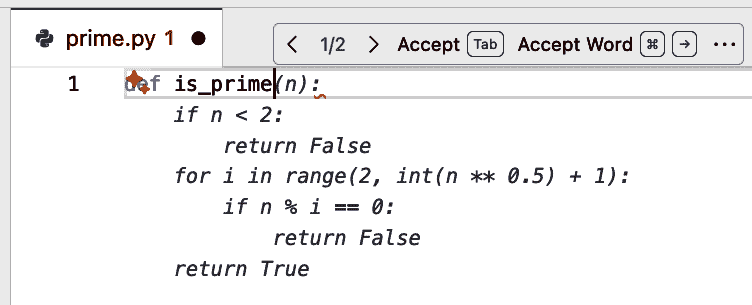

###### 图 2-2\. 第一条建议

# 你的建议可能不同

在阅读本章以及书中任何显示 Copilot 建议或输出的地方时，请记住，由于这是生成式 AI，相同的上下文中你得到的建议可能会有很大不同。

Copilot 的建议是构建你的函数的一个可能选项。在图 2-2 中，建议文本上方和右侧有一个灰色条。当 Copilot 在行内建议文本时，这个条会弹出。条目中有接受全部或部分建议的控制。其他控制允许你在 Copilot 生成多个选择时循环查看多个建议。

# 你的 IDE 可能不同

在整本书中，我们使用 VS Code 风格的 IDE。如果你使用的是不同的 IDE（例如来自 JetBrains 的 IDE），你的界面和控制可能不同，尽管应该提供类似的功能。

条目中的文本也是一个关于相应键盘快捷键和选项的提醒。可用的包括接受整个建议（通过 Tab 键），一次接受一个单词（通过条目和文档中显示的键组合），以及可以通过更多操作菜单访问的附加选项，该菜单以三个点表示（稍后会有更多关于这些的介绍）。

在那个条目的最左边是 < 1/2 >。这段文字表明 Copilot 生成了两个可能的建议，你现在正在查看选项 1。要查看其他选项并旋转潜在的选择，请点击条目中的 *>* 和 *<* 符号，或者使用键盘上的相应键。例如，如果你想查看选项 2，你可以点击 *>* 符号（见图 2-3）。


###### 图 2-3. 第二个建议

要接受 Copilot 的任何一个建议，你可以旋转选项，然后按 Tab 键选择你想要的选项。如果你不喜欢任何一个建议，你只需继续输入。

选项 1 和选项 2 之间的区别细微——仅仅是些空白。但 Copilot 仍然将这些呈现为两个单独的选项。无论你选择哪个选项，你都会得到一个看似可行的函数体，这是自动生成的。

如果你选择第一个选项，在按 Tab 键后，完整的建议文本将被插入到你的文件中。这段文本不再以半透明显示。它看起来与任何你手动输入的文本一样(图 2-4)。

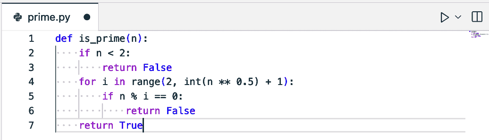

###### 图 2-4. 选项 1 已接受

一旦使用了几次，界面开始感觉更加可预测和有帮助。从这一点开始，当你编写代码时的典型工作流程如下：

1.  接受或拒绝 Copilot 的建议。

1.  如有需要或希望，手动输入额外的代码。

1.  如有必要，稍微暂停一下，给 Copilot 生成选项的时间。

1.  Copilot 提供建议。

1.  重复步骤 1-4，直到完成。

Copilot 建议的*完整性*和*适用性*可能会有很大差异。根据它可用的上下文，它可能提供从注释到单行，再到形成完整解决方案的多行代码的完成建议。当你输入时，你可能得到一个完整的函数定义建议；在其他时候，你可能只得到一行或两行。无论第一个建议是一个完整的选项还是你必须通过多轮逐行建议来工作，前面的编号步骤的流程都是相同的。

# 暂停以获取建议

你可能对前面列表中的第 3 步感到好奇，它提到（如果需要）暂停以给 Copilot 生成选项的时间。在显示建议之间，有很多处理和通信发生。如第一章中所述，Copilot 在后台做了很多工作来生成编码建议。它收集上下文，综合它，通过网络发送，提示 LLM，检查可能表明漏洞的任何模式，可选地与公共代码匹配进行对比，然后使选项在网上可用。

这发生得非常快。但有时，Copilot 在按 Enter 键后可能需要一点时间来返回结果。因此，如果你处于按 Return 并期望立即按 Tab 以接受下一个建议的模式，有时你可能会超过 Copilot。如果发生这种情况，你可能需要在尝试接受下一行之前暂停一下。请注意，有时 Copilot 也可能生成一个空白行作为输出的一部分。

关于到目前为止与 Copilot 的简单交互中发生的一些细节值得指出：

+   Copilot 能够提出与上下文相关的函数定义。

+   选项在*技术上不显著*的方式中略有变化，但仍然以不同的方式呈现。

+   Copilot 是如何获取建议的具体上下文的？它使用了文件名和我们为函数输入的名称。

+   如果你重复进行相同的练习，并不能保证你会得到相同的建议，甚至更多。生成式 AI 即使在相同的精确上下文中，也不总是会返回相同的结果。

关于最后一点，虽然 Copilot 提供的内联建议通常足以满足你的需求，但有时你可能想要更多的选项。为了帮助这一点，Copilot 包括一个内置机制来请求额外的*替代建议*。我们将在下一节中介绍。

# 获取更多建议

如果 Copilot 的初始建议似乎不够，你可以要求它生成其他建议。为了使 Copilot 生成更广泛的替代完成列表，请使用 Ctrl-Enter 键组合。

# 使用替代建议功能的功能权衡

虽然向 Copilot 请求额外建议可以生成更多完成选项，但它是以牺牲创建和呈现这些选项所需时间更长为代价的。此外，替代代码可能只包含部分实现或一系列注释，使其不那么有用。

使用此功能最佳时机是在接受内联建议之前。让我们回到我们正在键入函数名但尚未接受建议的地方。在这个时候，你可以按 Ctrl-Enter，Copilot 将生成一个包含替代完成的单独面板，如图图 2-5 所示。

Copilot 建议了六个替代方案，所有这些替代方案都可能是合理的完成，其中一些实现只有细微的差异。

GitHub Copilot 建议标签是只读的。你可以滚动查看替代完成集。如果你找到一个你喜欢的，你可以通过点击其下方的“接受建议 *#*”按钮将其插入到你的文件中（其中*#*代表建议的编号）。

如果你想在已经完成的代码上使用替代建议功能，你的结果可能会有更大的变化。在这种情况下，确保你突出显示你想要 Copilot 针对建议的代码至关重要。否则，你可能不会得到任何结果。

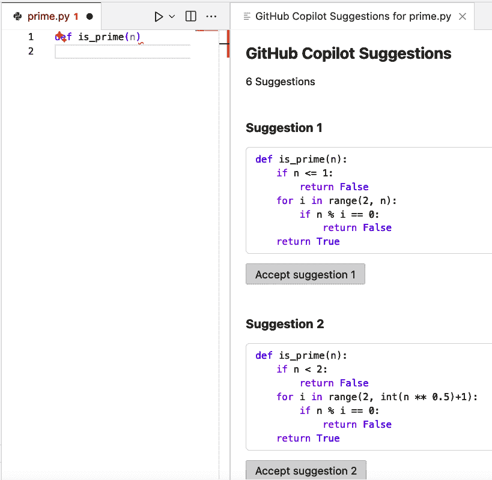

###### 图 2-5\. 完成前的替代建议

当向 Copilot 请求现有代码的替代建议时，我们可以看到建议的质量和可用性的差异。图 2-6 显示了从现有代码开始生成的一组替代方案。

注意，在建议标签中只有三个替代方案。没有一个是完整的实现。因此，如果你有最小化的上下文，你最好的选择是在添加代码之前请求替代建议。

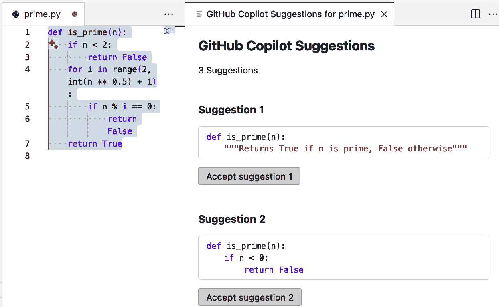

###### 图 2-6\. 对现有代码的替代建议请求

如第一章所述，Copilot 的建议不仅基于您的实际代码，还基于相关的元素，如注释。虽然我们通常认为添加注释只是为了解释代码，但我们也可以利用注释以其他方式驱动 Copilot 的行为。

# 利用注释

注释可以在 Copilot 的上下文中发挥重要作用。比如说，您在新的文件中只输入以下单行注释：

```py
# a function to determine if a number is prime or not
```

Copilot 可能会像图 2-7 中那样提供一个完成建议。


###### 图 2-7\. 从注释生成的建议

如果您接受这一点，则建议生成函数体剩余部分的代码（见图 2-8）。

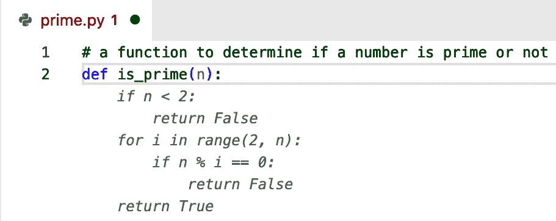

###### 图 2-8\. 从注释生成的完成

除了从标准注释中被动收集的上下文之外，您还可以使用注释主动告诉 Copilot 您希望它做什么。区别在于，您不是将注释作为上下文来写，而是向 Copilot 发出指令。这涉及到将注释的措辞更像是指令。

## 指令注释

您可以通过注释告诉 Copilot 您希望它做什么。假设您在上一节中不是输入函数头，而是输入以下注释：

```py
def is_prime
```

您可以输入一个注释来描述您希望发生的事情。例如，在我们的素数检查函数中，可以这样写：

```py
# create a function to determine if a number is prime
```

根据可用上下文，Copilot 可能会建议与您的注释相关的完成内容，如图 2-9 所示。建议的完成内容可能正是我们所期望的，也可能不是。

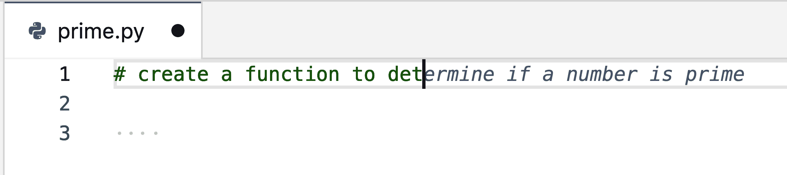

###### 图 2-9\. 注释的自动完成

这一行就足以开始为函数生成建议的代码。请参见图 2-10 中的示例。


###### 图 2-10\. 函数生成的第一行

函数的建议名称与您之前所用的名称相同，但 Copilot 提供的选项有所不同。Copilot 不仅建议一行，而是建议多个可能的完成选项。一个是函数头。第二个选项是注释的延续。这些选项可以通过弹出栏或键盘快捷键进行审查。请参见图 2-11。

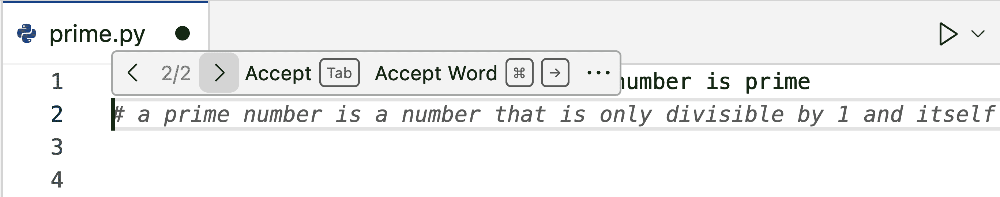

###### 图 2-11\. 第二种选项——注释的延续

# 选项可能不同

作为提醒，由于您正在使用生成式 AI，实际使用 Copilot 时收到的建议可能与书中所述不同，即使使用相同的示例代码。

对于这种情况，Copilot 没有足够的上下文来判断您是想生成一个扩展注释还是开始创建函数代码。因此，它提供了这两种选项。在您接受第一个选项后，Copilot 就有了足够的上下文，并提供了建议的函数定义（图 2-12）。


###### 图 2-12\. 完整的功能建议

作为另一个例子，您可以通过注释告诉 Copilot 解释现有代码：

```py
# explain the code above
```

将其应用于您一直在处理的示例，Copilot 会以简短、带注释的输出行回应，解释代码的工作原理。图 2-13 展示了生成的注释。Copilot 在 `explain` 指令之后生成了这三条注释行（11–13）。


###### 图 2-13\. 通过注释告诉 Copilot 解释代码的输出

您也可以写一个注释以获得更详细的回答：

```py
# explain the code above line-by-line
```

使用该注释的结果在图 2-14 中展示。


###### 图 2-14\. 注释中更详细 `explain` 指令的结果

一个有助于理解的观点是，如果您正在使用注释 *提示 Copilot 生成代码*，Copilot 应该根据注释生成代码。对于任何其他非编码指令（如 `explain`），结果将以额外的注释形式返回。

注释的另一个用途是直接向 Copilot 提问。

## 通过注释提问

与通过注释向 Copilot 指示方向类似，您也可以向它提问。例如，您不必告诉 Copilot 解释代码，而是可以问它这样的问题：

```py
# What does the code above do?
```

图 2-15 展示了结果。

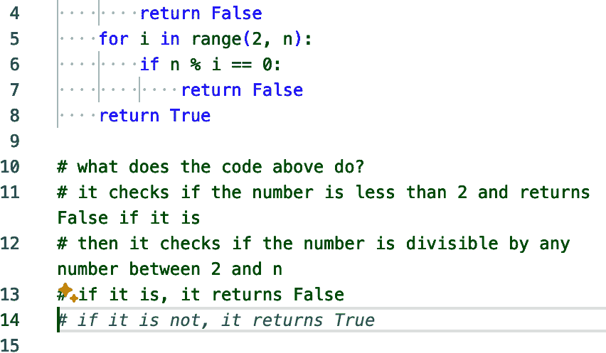

###### 图 2-15\. 使用注释向 Copilot 提问

您也可以通过在注释字符后添加 `q:` 来更正式地将您的注释标记为问题，但这不是必需的。如果您这样做，Copilot 将以 `a:` 开头的答案回应。

# Q&A 上下文

通过注释向 Copilot 提问在历史上提供了一种在 Copilot Chat 包含在 Copilot 计划中之前获得类似聊天答案的方法。尽管这种方法今天通常不如使用内联聊天界面或主聊天窗口有用，但如果您希望在代码中包含简短答案，它仍然可以提供一些价值。

在我们讨论了如何在编辑器中与 Copilot 内联交互之后，让我们看看如何从 IDE 菜单中使用 Copilot。

# Copilot 和上下文菜单

某些 Copilot 功能可通过您的 IDE 的上下文菜单访问。这种集成提供了一种无需在聊天中给出指示即可快速运行一些高级功能的方法。（聊天界面在第三章中讨论。）

# 上下文含义 #2

当与本章中关于菜单的讨论一起使用时，*上下文*并不指 Copilot 收集以提供完成建议的信息。相反，该术语指的是您的 IDE 的 *上下文菜单* 中可用的 Copilot 选项。

例如，你可能已经注意到本章中的一些前图在行首显示了两个小的 *四角星* 符号。这两个星号形成了一个有时被称为 *闪耀* 图标的符号，这是一个（超出 Copilot）表示 AI 的通用符号。在 IDE 中，该符号的存在通常表示一个你可以点击以与 Copilot 交互的链接。点击该链接，将打开一个包含多个高级选项的菜单。

在我们讨论的案例中，当函数定义不完整时，图标会出现。然而，系统无法区分仍在编写的函数和损坏的函数。因此，Copilot 会建议一个完成，并提议 *修复* 它。点击闪耀图标，将打开一个弹出菜单，如 图 2-16 所示。（请注意，这可能在其他 IDE 中不会显示。）

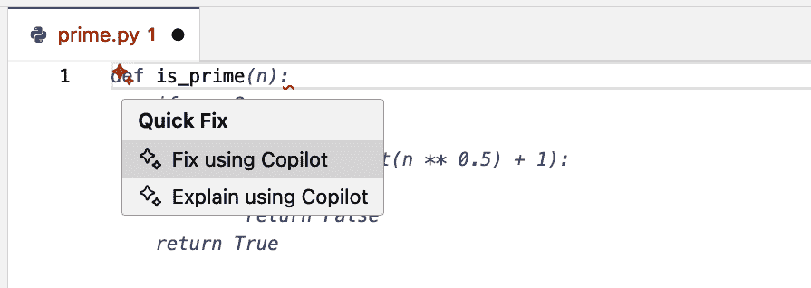

###### 图 2-16\. 使用 Copilot 的快速修复选项

# 利用完成修复

“使用 Copilot 修复”选项有时可以替代获取建议的完成。选择它可能会导致 Copilot 生成部分代码以使系统达到工作状态。然而，你不能指望这个功能提供完整的完成。

当你为 Copilot 提供更多数据以供处理（例如，完成的函数实现）时，你可以在菜单中看到额外的选项。（见 图 2-17。）


###### 图 2-17\. 扩展的上下文菜单选项

菜单中可用的选项（以及它们所指的内容）也取决于你在 IDE 中的工作部分。例如，如果你在终端中工作，解释菜单选项指的是终端中的内容，而不是编辑器中的内容。并且，如 图 2-18 所示，有一些仅针对终端的选项。（由于这些是聊天选项，我将在下一章中解释它们。）


###### 图 2-18\. 终端中的 Copilot 选项

因此，上下文菜单提供了 Copilot 功能的一个子集，这取决于你的任务。在 VS Code 和类似的 IDE 中，你还可以通过一个称为 *命令面板* 的界面调用与 Copilot 相关的命令，如以下侧边栏所述。

除了我们讨论过的 *标准* 功能，例如解释代码和修复代码之外，你还可以使用上下文菜单让 Copilot 执行一个有用且重要的任务：审阅你的代码并提供反馈。我们将在下一节讨论其机制。

# 使用 Copilot 审阅你的代码

Copilot 可以充当你代码的审阅者。在 GitHub 上，你可以在拉取请求中添加 Copilot 作为审阅者（见第九章）。在 IDE 中，Copilot 可以审阅你的本地代码并提供即时反馈。这可以在代码推送之前捕捉到问题特别有用。在进行审阅时，你可以使用 Copilot 的默认行为或自定义审阅方式。

## 使用 Copilot 的默认审查选项

假设我们有一个旨在实现一个简单的点类的代码块：

```py
class Point:
    def __init__(self, x, y, z=0): self.x = x; self.y = y  
    def distance(self, other): return (self.x - other.x)**2 + \
    (self.y - other.y)**2 + (self.z - other.z)**2**0.5  
p1 = Point(1, 2); p2 = Point(4, 6, 0)
print(p1.distance(p2)) 
```

如果您是 Python 程序员，您可能能够发现代码中的一些问题。让我们让 Copilot 审查它。我们通过在编辑器中突出显示代码，然后右键单击并选择 Copilot > 审查和注释（见图 2-21）来完成此操作。


###### 图 2-21\. 从菜单中选择代码审查

在 Copilot 处理完请求后，如果它对问题或推荐更新有任何反馈（包括像添加文档这样简单的事情），它将在代码中提供评论和建议的更改。图 2-22 展示了 Copilot 的一个审查项目示例。


###### 图 2-22\. Copilot 审查的反馈

审查反馈对话框有箭头控件，您可以使用它来导航到其他审查评论，以及查看聊天中的反馈、关闭对话框和折叠它。任何建议的更改都显示为红色（带有减号）的当前代码和绿色（带有加号）的建议代码。对话框底部的按钮使应用或丢弃更改并前进到下一组反馈变得简单。

除了默认的审查行为之外，您还可以自定义 Copilot 在审查期间寻找的内容。

## 创建自定义审查说明

默认情况下，Copilot 只报告它认为重要的问题。因此，当它包含其他审阅者可能会标记的元素时，例如不符合最佳实践或风格指南的元素，报告没有对您的代码的反馈并不罕见。图 2-23 展示了如果 Copilot 没有发现任何问题时您会看到的消息示例。


###### 图 2-23\. Copilot 代码审查无反馈

如果您想要更详细的反馈，您可以提供一组自定义审查说明供 Copilot 使用。有两种方法可以做到这一点。

首先，您可以编辑 *settings.json* 文件，并在 `github.copilot.chat.codeReview.instructions` 下添加自定义说明。以下是一个您可以添加的规则示例：

```py
"github.copilot.chat.reviewSelection.instructions": [
    {
        "text": "Ensure all functions have proper docstrings"
    }
]
```

在用户设置文件中添加规则后，您可以告诉 Copilot 再次审查相同的代码。这次，它标记了设置文件中指定的条件，如图 2-24 所示。

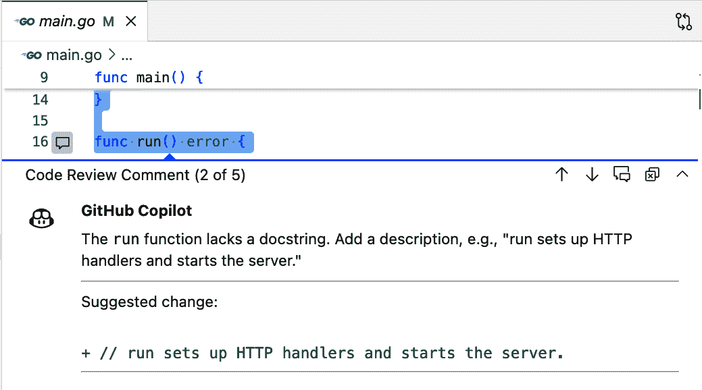

###### 图 2-24\. 设置文件中的标记问题

可选地，您还可以将您的规则（以及最多五个更多）作为 Markdown 添加到本地文件中，将其保存为特定路径 *.github/copilot-review-guidelines.md*，Copilot 将自动找到并使用它。

如果您希望将说明存储在不同的文件中，您可以创建该文件，然后在 *settings.json* 文件中使用 `file:` 键指向本地文件。以下是在设置中可能看起来像这样的示例：

```py
 "github.copilot.chat.reviewSelection.instructions": [
    {
       "file": "./docs/review-guide.md"
    }
 ]
```

这假设你在代码库中有一个名为 *review-guide.md* 的本地文件，它位于 *docs* 目录下，内容如下所示：

```py
- Ensure all functions have proper docstrings.
```

为了简要总结我们在 IDE 中使用 Copilot 进行编码的讨论，让我们简要检查一些额外的控件和配置设置，以帮助您导航和微调您的 Copilot 体验，使其符合您的期望。

# 在 IDE 中配置 Copilot

在 VS Code 中，安装了 Copilot 扩展（并在需要时进行认证后），你可以通过几个控件访问 Copilot 功能。其中一个控件位于 IDE 底部的状态栏中。点击此控件可以快速关闭所有文件或当前正在处理的文件类型的代码补全建议。图 2-26 展示了所选控件提供了一个选项，可以关闭 Python 文件的代码补全建议，因为当前激活的是这种类型。

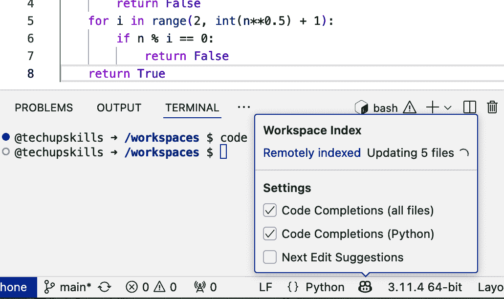

###### 图 2-26. 底部 Copilot 控制

# 为什么禁用补全

你可能会想知道为什么有一个选项可以关闭代码补全，因为这是 Copilot 的基本工作之一。答案是，有时建议可能会变得令人烦恼或妨碍。例如，如果你急于输入大量代码，或者专注于创建你已经知道如何做的代码，你可能不想让 Copilot 的建议弹出造成额外的干扰。

对话框中的“下一个编辑建议”选项指的是一种自动的 *批量编辑* 功能，这在第四章中有讨论。

在 IDE 顶部还有一个 Copilot 图标。这个图标允许你打开各种聊天界面，配置代码补全，并在 GitHub 中管理你的 Copilot 设置。参见图 2-27。


###### 图 2-27. 顶部控制选项

我们将在第三章中讨论聊天选项。选择“管理 Copilot”将带你去 GitHub（如果你已登录）中你的 Copilot 账户的[设置页面](https://oreil.ly/OlrYN)。而“配置代码补全”将显示一系列选项（图 2-28），以自定义代码补全。

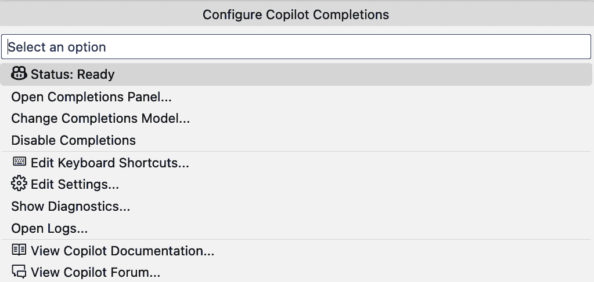

###### 图 2-28. 配置 Copilot 补全

其中一些选项很明显，但也有一些不明显。以下是对其中三个的快速概述：

打开补全面板

打开当前活动代码的替代补全列表。这与我们之前讨论的功能相同，通过 Ctrl-Enter 调用。

更改完成模型

允许你选择一个不同的 AI 模型（如果不是默认模型），如果可用的话。请注意，这只会影响用于代码补全的模型，不会影响用于聊天的模型。

禁用补全

与其他 Copilot 控件中的早期选项类似，这允许你切换补全建议的开启或关闭。

“编辑设置”选项是进入对 Copilot 进一步自定义和配置的门户。点击它将在 IDE 中打开设置，并带有“GitHub Copilot”的搜索字符串。您也可以通过在主 IDE 界面中点击设置齿轮图标，然后输入“GitHub Copilot”来搜索相关设置。

图 2-29 显示了匹配“GitHub Copilot”的项目的设置屏幕。注意左侧的子类别，包括编辑器、功能和更广泛的扩展组。在扩展组中，为任何与 GitHub Copilot 相关的扩展提供了设置。

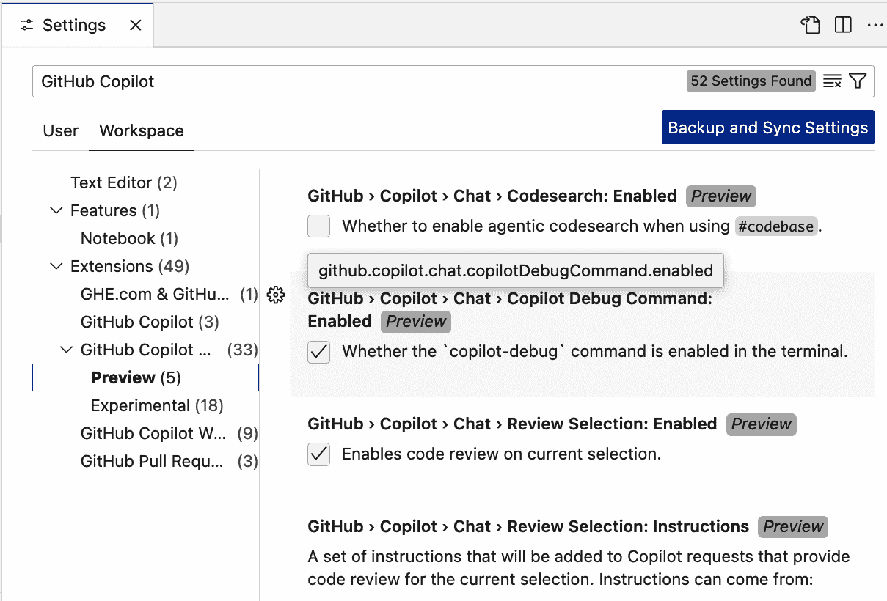

###### 图 2-29\. GitHub Copilot 在 IDE 中的设置

在设置中，您可以配置 *用户级别*（独立于工作区）的选项以及 *工作区环境* 的设置。左上角的选项卡允许您在这些类别之间切换。

当您深入某些设置区域时，您会发现标记为“实验性”或“预览”的选项。这两个都表明了一个尚未投入生产的选项或功能。“预览功能”更接近正式发布，如果用户选择使用它们，将针对公众进行测试和反馈。“实验性功能”是早期概念，您可以在自己的风险下使用。它们可能或可能不会向前推进，也可能在生产前进行重大更改。

如果您使用不同的 IDE，它将以类似的方式访问和更改 Copilot 的设置。我建议关注 [GitHub 关于 Copilot 的博客](https://oreil.ly/qdhTv)，以获取最新更新并了解哪些新或更新的设置可用。定期探索可用选项也是一个不错的主意。有时您会发现配置 Copilot 行为的附加选项，您可能之前并不知道。

# 结论

在本章中，我们介绍了在编写代码时与 GitHub Copilot 内联交互的最直接方式。当您在编辑器中键入时，Copilot 会提供快速建议。这些建议应该被评估其完整性和适用性。虽然适用性各异，但这些建议可以节省时间并/或启动您的代码和思考。

建议的质量将很大程度上取决于 Copilot 在当前环境中需要参考的上下文量，这意味着文件名、现有代码、其他文件、注释和本地索引。注释还可以描述您希望 Copilot 完成的任务，并用于向 Copilot 指导问题，它将以注释的形式回答。

Copilot 可以审查您的代码以查找问题并提出改进建议。您可以通过指向自定义指令列表来自定义它在审查时针对的内容。

虽然 Copilot 提供了开箱即用的有用功能，但有时你可能想要调整其行为或启用/禁用某个功能。你可以在 IDE 中的 Copilot 控制中进行有限的更改。或者你可以在 IDE 的设置中搜索单个选项进行修改，包括那些处于实验阶段或预览中的选项。

现在你已经看到了如何使用 Copilot 的内联建议，让我们继续探讨与 Copilot 及其底层模型最灵活的交互方式：通过其聊天界面，这是 第三章 的主题。
