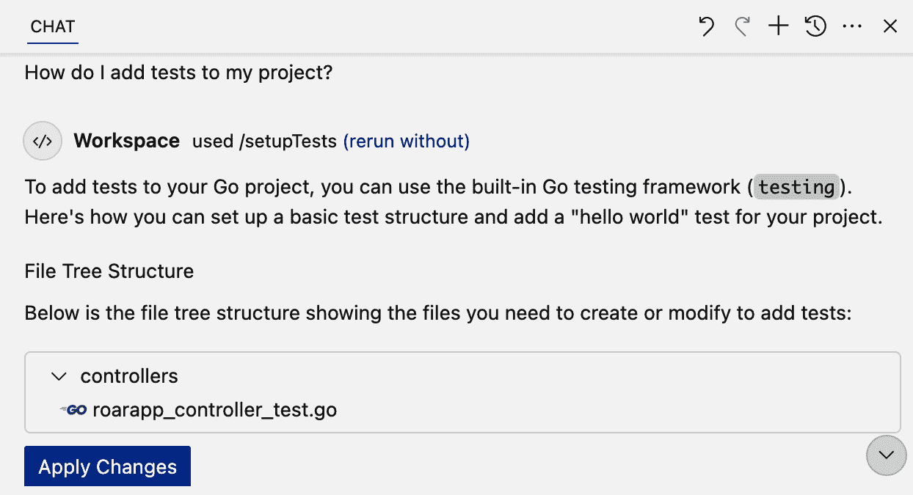
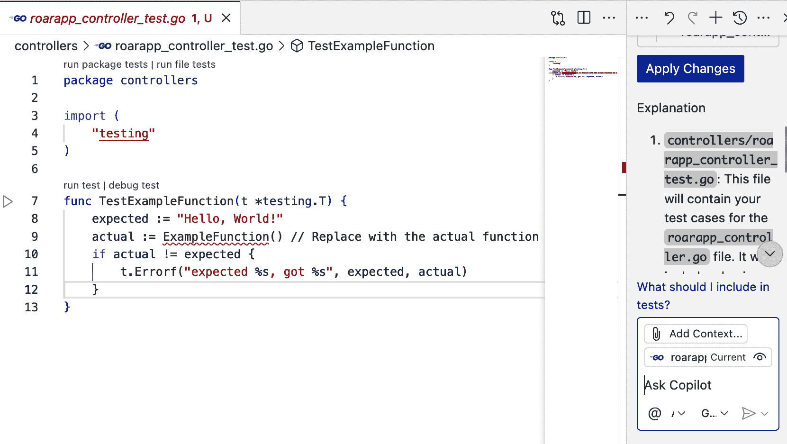
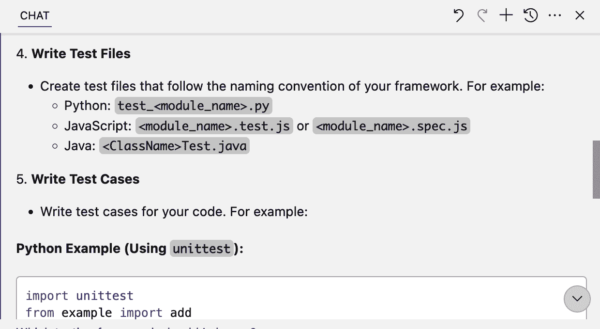
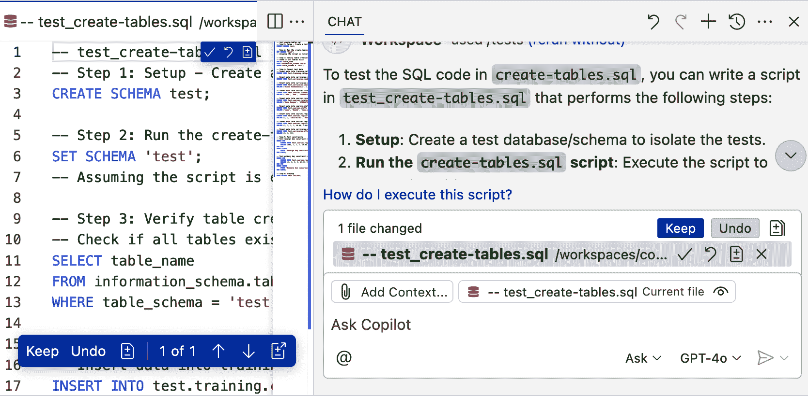
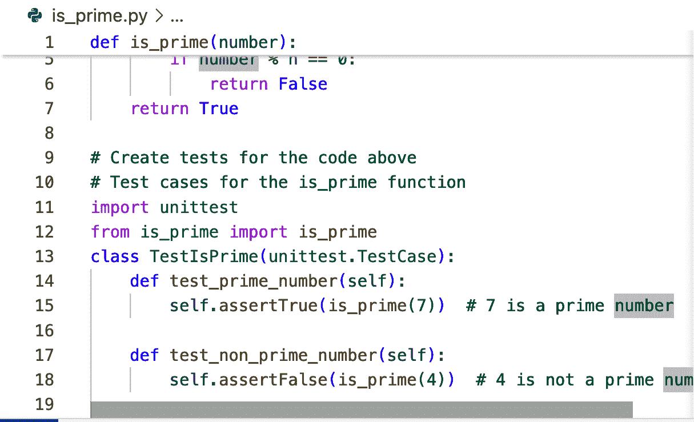
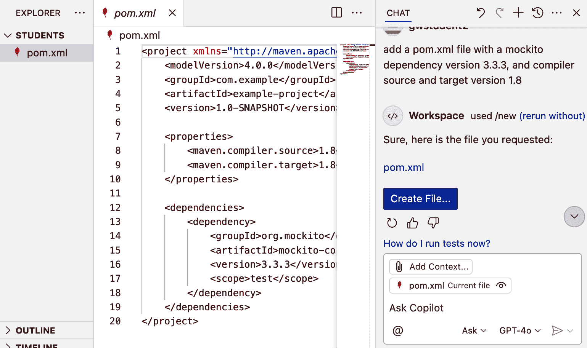

# 第五章\. 使用 Copilot 进行测试

现在你已经了解了 Copilot 的工作原理以及如何通过编辑器和聊天界面与之交互，我们可以继续探讨其他它能提高生产力的方式。Copilot 简化了那些可能消耗大量时间和资源的常规任务。自动化这些工作可以使你将精力、思考和关注点投入到创建软件所需的更复杂任务中。

本章重点介绍一个特定的功能：使用 Copilot 生成测试。在接下来的章节中，你将看到 Copilot 可以做到以下事情：

+   提供测试指导

+   为单元测试和集成测试创建标准测试用例

+   构建边缘情况

+   利用自定义测试指令

+   使用你选择的框架编写测试

+   帮助实施最佳实践，如 [测试驱动开发](https://oreil.ly/-nm1N)

+   使用 Copilot 的代理模式来帮助驱动测试创建

# 生成式 AI 和测试

当生成测试时，Copilot 的结果在内容、适用性和准确性方面可能会有很大差异。这通常取决于提供上下文的数量、接口和提示。

根据生成式 AI 的性质，没有任何东西是保证完全符合你期望的。因此，重要的是要审查建议的测试，以确保它们是有效的并且是合适的。如果它们不是你预期的，你可能需要编辑它们或重构你的提示并再次尝试。

在阅读完本章后，你将拥有一个利用这一能力的坚实基础。利用这一点，你将能够以多种方式利用 Copilot，以确保你拥有所需的测试覆盖率。

让我们先从向 Copilot 提出关于测试的最广泛的问题开始：“我该如何测试我的代码？”

# 我该如何进行测试？

能够快速转换并学习新的编程语言和框架，对于大多数软件专业人士来说是一个标准期望。你很可能已经熟悉了如何为任何你经常使用的语言编写测试。但是，需要切换或迁移代码到不同的环境可能会带来相当大的学习曲线。如前所述，Copilot 在这里的一个有帮助的特性是询问如何在新语言中编写或翻译代码。测试也是如此。

# 在提示之前让代码处于活动状态

对于本章中我们将要讨论的提示和查询，最佳结果通常发生在你有一个或多个属于你的项目且在编辑器中打开并处于活动状态文件的情况下。如果你没有任何文件处于活动状态，Copilot 可能会退回到以更通用的方式告诉你如何针对你的项目类型进行操作，而不是针对你的项目内容提供具体信息。

在这里，我们将使用一个用 Go 编写的 Kubernetes Operator 项目作为示例。假设你对 Go 不熟悉，对如何测试你刚刚产生的代码知之甚少。你可以研究 [Stack Overflow](https://stackoverflow.com) 或其他许多论坛或网站，或者询问同事。但你也可以询问 Copilot：

```py
How do I add tests to my project? 
```

# 更具体的查询

如果你需要更具体地说明你想要测试的项目部分，你可以在提示中包含文件名，使用聊天变量，或者添加项目作为上下文，如第三章所述。以下是一个示例：

```py
How do I test the code in #file:prime.py?

```

Copilot 首先分析项目。然后，由于你的提示是通用的，Copilot 会告诉你如何为项目创建一个示例测试。它使用 *chat participant* 和 *slash command* 默认的 `@workspace /setupTests` 来生成基本信息。

Copilot 提供了其建议的总结，以及用于更改和采取行动的按钮。见图 5-1。图 5-1



###### 图 5-1\. 添加测试的初始建议

在相同的响应中，Copilot 还提供了对建议的解释以及运行测试的终端命令（图 5-2）。


###### 图 5-2\. 添加测试的进一步说明

如果你点击“应用更改”按钮（如图 5-1 所示），文件将为你创建，如图 5-3 的左侧部分所示。图 5-3 注意到 Copilot 的响应还包括有关如何运行测试的信息。对于一个一般查询来说，这相当令人印象深刻！



###### 图 5-3\. 通过“应用更改”按钮创建的文件

`/setupTests` 的目的是进行测试代码和相关更改的宏观级设置。在撰写本文时，此功能仍然是实验性的，你可能发现其有用性取决于具体情况。同样，Copilot 默认使用 `@workspace` 聊天参与者并不总是产生最佳结果。你可能会在最初生成测试时看到不使用这些默认值时更好的结果。使用“重新运行而不”选项在上一个查询中的结果提供了一个更全面的步骤集：

1.  确定一个测试框架。

1.  设置测试框架。

1.  创建测试目录。

1.  编写测试文件。

1.  编写测试用例。

1.  运行测试。

1.  自动化测试。

其中包含的文本详细描述了要执行的操作以及示例代码。图 5-4 展示了使用“重新运行而不”选项的结果摘录。



###### 图 5-4\. 使用“重新运行而不”选项的示例输出

在以下侧边栏中讨论了绕过 `/setupTests` 的选项。相同的选项类型可以用于绕过其他正在添加的默认命令。

为了提供一个额外的例子，让我们来处理对大多数人来说不太熟悉的事情：测试 SQL 代码。我有一个包含 SQL 语句的大演示文件，我将其用于一些培训课程，这些语句创建用于大学课程、日程安排、教职员工等的数据库表。

如果我在编辑器中打开该文件并询问 Copilot 如何测试其内容，Copilot 会像图 5-8 所示那样回复。它生成一个逐步的测试计划，然后创建一个新文件来实现该计划（如图左侧所示）。建议的新文件包含可用于在测试数据库中执行 10 个测试的 SQL 命令。

然后，你可以审查并保存为你的新测试。Copilot 使用 `/tests` 命令快速生成此输出。然而，如果你不想使用快速版本，你可以使用我们之前讨论的“不带 rerun”策略中的任何策略来再次执行提示，而不使用快捷方式。



###### 图 5-8\. 初始 SQL 测试响应

再次，对于一个简单查询一个文件来说，这已经很令人印象深刻了。并且请注意，这适用于任何语言，而不仅仅是 Python。

# 信任生成的测试

由于我们还在讨论 Copilot 生成测试的早期阶段，因此记住要像审查其他任何生成内容一样审查它们是很重要的。由 AI 生成的测试可能包括误报、重复断言和基于对代码误解的错误逻辑。幸运的是，测试代码通常很容易阅读，这可以使得快速审查和验证变得更容易。

本节向你展示了如何利用 Copilot 从零开始创建测试指令和代码。更常见的情况是，你可能正在使用你已知的语言进行编码，只想让 Copilot 帮助你创建单元测试等任务的*模板代码*。在下一节中，你将看到几种实现方法。

# 创建单元测试

考虑到创建持续集成和测试驱动开发等用例的必要性，手动编写测试可能占据你在项目中的大量时间和工作量。使用 Copilot，你可以通过多种方法自动化测试生成，并且你可以选择不同复杂程度的选项。

许多时候，使用 Copilot 生成的测试将是单元测试，旨在对单个函数或过程进行基本测试。然而，Copilot 生成的测试的范围和深度会根据提示和接口的使用而变化。在本节中，我们将探讨各种方法。

## 使用 `/tests` 命令

让 Copilot 为你生成测试的最简单方法是使用 IDE 编辑器中内置的斜杠命令 `/tests`（内联）。此命令在 IDE 中选定的或引用的代码上操作，然后尝试为代码创建适当的基礎单元测试。你可以通过 IDE 中可用的任何聊天界面输入此命令。

假设你再次在处理一个简单的函数，用于判断一个数字是否为素数。实现方式不重要，但这里有一个版本：

```py
def is_prime(number):
    if number <= 1:
        return False
    for n in range(2, int(number**0.5) + 1):
        if number % n == 0:
            return False
    return True

```

图 5-9 展示了通过行内聊天使用 `/tests` 命令的示例。最直接的使用方法是突出显示要测试的代码，然后在聊天界面中输入命令。


###### 图 5-9\. 通过 `/tests` 命令调用 Copilot 生成测试

运行该命令后，Copilot 为素数、非素数、单个、零、大素数和大非素数生成基于断言的测试。如图 5-10 所示，在行内聊天过程中，Copilot 将更改作为编辑器中的新文件提出，并具有相应的名称 *test_is_prime.py*。如果你喜欢建议的测试，可以点击接受按钮。


###### 图 5-10\. 从行内聊天选项生成的测试

通过选择 Copilot > 从上下文菜单生成测试，可以像在行内聊天界面中运行 `/tests` 一样获得相同的结果；参见 图 5-11。实际上，Copilot 在大多数情况下都会想要使用 `/tests` 快捷键。


###### 图 5-11\. 通过上下文菜单生成测试

如果你单独在聊天界面中运行 `/tests` 命令，你可能会得到类似的结果，但在聊天区域中会有更多关于 Copilot 将采取的方法、选择的框架以及它将创建的测试类型的解释。

在文本输入区域上方的新部分显示了更改的任何文件。所有文件都可用保留/撤销按钮。建议的单独文件通过其第一行显示，并有自己的保留（勾选标记）和撤销（曲线左箭头）控件。看起来像文档图标并带有 + 和 - 的控件用于显示编辑器中提出的更改引入的差分。图 5-12 展示了输出的一部分。


###### 图 5-12\. 主聊天中的 `/tests` 命令生成的测试

# 更改图标和控件

不幸的是，Copilot 经常更改它们在各种界面中使用的控件，并将它们移动到其他位置。在你阅读这段文字的时候，Copilot 很可能已经再次更改了某些东西。

通常，以下内容在各个版本中对于建议的编辑都是适用的：

+   将会有接受/保留和拒绝/撤销更改的控件。

+   勾选标记同时作为保留控件。

+   将会有一个控件来查看建议的差分作为编辑器中的文件，或将建议的差分应用到编辑器中的文件。

+   差分控件可能会也可能不会设置一个合理的文件名。你应该始终确保在审查并选择要保留的更改后自己保存文件。

这些响应涵盖了基本的使用案例范围。但如果你想要生成额外的测试并/或覆盖更多的情况呢？你可以通过提供更明确的提示来实现，这是下一节的主题。

## 从明确提示创建测试

另一种创建测试的方法是通过聊天界面提供提示。一个简单的提示，如“为选定的代码创建测试”，通常会导致 Copilot 再次运行`/tests`命令（假设该命令在你的 IDE 中可用）。然而，你可以提供一个更具体的提示，让 Copilot 为其他情况建议测试。例如，如果你已经包含了已生成的测试，你可以选择当前的测试文件和实现文件作为上下文，然后使用如下提示来提示 Copilot 关于任何其他边缘情况：

```py
are there any other edge cases that should be tested

```

Copilot 通过识别一些额外的测试用例及其解释来响应：

```py
Yes, here are some additional edge cases you might want to test:

1\. Smallest prime number: Ensure the function correctly identifies 
2 as a prime number.

2\. Even number greater than 2: Test an even number like 10 to 
confirm it is not prime.

3\. Very large composite number: Test a large number that is not 
prime, such as 10⁶.

4\. Floating-point input: Test how the function handles non-integer
 inputs like 3.5.

5\. String input: Test how the function handles invalid input types
 like "seven".

6\. Negative even number: Test a negative even number like -4 to 
confirm it is not prime.
```

Copilot 进一步提供了可以添加到这些测试用例中的代码：

```py
def test_smallest_prime(self):
    self.assertTrue(is_prime(2)) # 2 is the smallest prime number

def test_even_number_greater_than_two(self):
    self.assertFalse(is_prime(10))&nbsp; # 10 is not a prime number

def test_very_large_composite_number(self):
    self.assertFalse(is_prime(10**6)) # 10⁶ is not a prime number

def test_floating_point_input(self):
    with self.assertRaises(TypeError): # Assuming the function
 raises TypeError for non-integers
        is_prime(3.5)

def test_string_input(self):
    with self.assertRaises(TypeError): # Assuming the function 
 raises TypeError for non-integers
        is_prime("seven")

def test_negative_even_number(self):
    self.assertFalse(is_prime(-4)) # Negative even numbers are not
 prime
```

这可能让你想知道是否可以扩展提示来覆盖更多用例。确实可以！例如，你可以更加具体地指示 Copilot 为其他输入添加测试用例：

```py
add test cases for other kinds of inputs
```

使用这个提示，Copilot 为你的考虑和审查添加了额外的测试用例：

```py
def test_float_input(self):
    with self.assertRaises(TypeError):
        is_prime(7.1)

def test_string_input(self):
    with self.assertRaises(TypeError):
        is_prime("7")

```

从 Copilot 中获得最大价值的关键部分是提出超出它可能使用默认提示或命令生成的范围的问题。用我们的类比来说，你可能希望或需要推动他们跳出常规的测试用例去考虑其他场景。对于提示 Copilot 以获得更全面的结果也是如此。

如果你更喜欢在代码中创建一些快速测试，可以通过提示方法的变体轻松实现。我们将在下一节中查看该选项。

## 从注释创建测试

有时候你可能不希望（或需要）使用聊天功能来创建测试。你可能正在编辑器中积极工作，并想告诉 Copilot“在这里插入一些简单、快速的测试”。这可以通过创建一个指令注释来实现 Copilot。然后你只需接受它返回的个别测试或测试函数的建议。这个过程遵循与第二章中讨论的相同的交互流程，包括接受、编辑等。

这种方法的优点是你可以从代码中的一个简单（或复杂）的注释行开始。缺点是你可能需要反复地接受建议的部分，或者得到一些不那么有用的通用建议。

这里是一个简单的例子，将指令注释放在`is_prime`函数代码之后的内联注释：

```py
# Generate 10 simple test cases for the is_prime function
```

作为回应，Copilot 建议一个内联函数，其中包含一组简单的断言，如图图 5-13 所示。从第 9 行的注释自动生成 10-23 行的所有行。


###### 图 5-13\. 从注释生成的简单断言测试用例集

或者，你可以使用更通用的注释，如下所示：

```py
# Create tests for the code above

```

在这种情况下，Copilot 生成与其他方法类似的测试用例，但位于同一文件中。图 5-14 展示了生成的测试用例的摘录。唯一输入的行是第一行注释。所有其他行都是基于这一行生成的并被接受。



###### 图 5-14\. 从注释生成的另一个测试示例

最后，在本节中，让我们看看另一种使用 Copilot 帮助我们测试的方法：验证函数的输入。

## 验证输入

从测试的另一个角度，Copilot 还可以帮助生成代码来检查传入函数的输入是否有效。以我们的示例函数为例，我们可以告诉 Copilot 执行以下操作：

```py
generate asserts to ensure that the inputs to the function are valid

```

从这里，Copilot 根据请求响应并建议断言，以验证输入：

```py
To ensure that the function inputs are valid, we can add assertions
at the start of the function. We want to make sure that the input 
is an integer and that it is not negative. Here's how you can do it:

def is_prime(num):
    assert isinstance(num, int), "Input must be an integer"
    assert num >= 0, "Input must be a non-negative integer"

    if num < 2:
        return False
    for i in range(2, int(num ** 0.5) + 1):
        if num % i == 0:
            return False
    return True

```

我们也可以对使用断言的要求不那么具体，并要求 Copilot 生成检查：

```py
generate checks to ensure that the inputs to the function are valid
```

这允许 Copilot 生成代码来验证输入，但使用更标准的编码机制来暴露任何问题：

```py
To ensure that the inputs to the `is_prime` function are valid, you
can add checks at the start of the function.
 Here's how you can do it:

```python

def is_prime(num):

if not isinstance(num, int):

raise TypeError("输入必须是一个整数")

if num < 0:

raise ValueError("输入必须是非负整数")

if num < 2:

return False

for i in range(2, int(num ** 0.5) + 1):

if num % i == 0:

return False

return True

```py

In this code, the `if` statements will raise a `TypeError` if the
 input is not an integer or a `ValueError` if it's a negative 
number.
 This way, you can ensure that the inputs to the function are valid.

```

根据您希望结果有多简单与需要更广泛覆盖的需求，每种方法可能在不同的案例中都有用。记住，由于您正在与 AI 交互，提示和设置上下文是获得明确结果（而不是通用结果或快速内联生成的结果）的关键。根据您在项目整体进度中处于什么位置以及您对所使用的语言和框架的经验，您可能会发现这些方法的组合效果很好。

在我们离开创建单元测试这一节之前，这里有一个创建一组单元测试的通用提示模板（改编自[Copilot 文档](https://oreil.ly/NOS8j))：

```py
Develop a comprehensive suite of unit tests for the 
<method/function> in <language/framework>. Write multiple test 
methods that cover a wide range of scenarios, including edge cases,
exception handling, and data validation."

```

用尖括号<和>括起来的单词意味着您需要用特定的术语替换它们。此模板有几个关键元素：

范围

它明确要求一个全面的单元测试套件，因此 AI 生成的不仅仅是基本测试，还涵盖了广泛的潜在用例。

场景

它指定测试应包括：

+   测试边界条件

+   当发生无效操作时应抛出异常的错误处理

+   确保输入正确验证和处理的方法数据验证

现在我们已经介绍了单元测试方法，让我们看看如何利用 Copilot 帮助我们编写集成测试。

# 创建集成测试

您可以使用 Copilot 创建集成测试，通过指示它关注多个组件之间的交互方式，而不是为独立的代码单元创建测试。为此，您需要编写带有清晰说明的提示，强调服务、模块和/或外部系统之间的协作。

使 Copilot 创建成功的集成测试的关键如下：

制定特定的提示

请求 Copilot 编写组件之间交互的集成测试，而不仅仅是生成针对代码的测试。

使用模拟外部依赖

集成测试通常需要模拟外部服务，如数据库或 API。您可以指示 Copilot 使用模拟，以便测试可以在没有真实实现的情况下验证功能。

请求交互覆盖率

请求 Copilot 验证方法是否被调用，数据是否在组件之间按预期流动，或者是否发生了预期的副作用。

集成测试提示的通用模板可能看起来像这样：

```py
Write integration tests for the <method/function> in the <class>.
Use mocks to simulate the <external service> and verify that it 
works correctly when <condition>.
```

（同样，<>中的术语是为了替换为您的特定用例。）例如，假设我们有一个 Express 应用程序，包含两个模块：

`UserService`

处理用户数据

`AuthController`

处理登录请求并委托给`UserService`

我们想编写集成测试以确保`AuthController`正确地与`UserService`和 HTTP 层交互。以下是执行此操作的提示：

```py
Write integration tests for the login endpoint in the 
AuthController. Mock the UserService to simulate user lookup and 
password verification, and verify that the controller returns the 
correct HTTP status codes and messages

```

以下是 Copilot 根据该提示生成的响应：

```py
Here is an example of integration tests for the *login* endpoint in 
the *AuthController*. These tests use Jest and mock the *UserService* to
 simulate user lookup and password verification.

const request = require('supertest');
const express = require('express');
const AuthController = require('../controllers/AuthController');
const UserService = require('../services/UserService');

jest.mock('../services/UserService'); // Mock the UserService

const app = express();
app.use(express.json());
app.use('/auth', AuthController);

describe('AuthController - Login Endpoint', () => {
  afterEach(() => {
    jest.clearAllMocks(); // Clear mocks after each test
  });

  it('should return 200 and success message for valid credentials',
 async () => {
    // Mock UserService.authenticate to return a valid user
    UserService.authenticate.mockResolvedValue({
      id: 1,
      username: 'user1',
      password: 'password1',
    });

    const response = await request(app)
      .post('/auth/login')
      .send({ username: 'user1', password: 'password1' });

    expect(response.status).toBe(200);
    expect(response.body).toEqual({
      message: 'Login successful',
      user: { id: 1, username: 'user1', password: 'password1' },
    });
    expect(UserService.authenticate).toHaveBeenCalledWith('user1', 
'password1');
  });

  it('should return 401 and error message for invalid credentials',
 async () => {
    // Mock UserService.authenticate to return null for invalid
 credentials
    UserService.authenticate.mockResolvedValue(null);

    const response = await request(app)
      .post('/auth/login')
      .send({ username: 'user1', password: 'wrongpassword' });

    expect(response.status).toBe(401);
    expect(response.body).toEqual({
      message: 'Invalid credentials',
    });
    expect(UserService.authenticate).toHaveBeenCalledWith('user1', 
'wrongpassword');
  });

  it('should return 400 if username or password is missing', 
async () => {
    const response = await request(app)
      .post('/auth/login')
      .send({ username: 'user1' }); // Missing password

    expect(response.status).toBe(400);
    expect(response.body).toEqual({
      message: 'Username and password are required',
    });
  });
});

Key Points:
1\. Mocking *UserService*:
   - `jest.mock('../services/UserService')` is used to mock the 
`UserService` module.
   - `UserService.authenticate` is mocked to simulate different 
scenarios (valid user, invalid credentials).

2\. Test Cases:
   - **Valid Credentials**: Ensures the endpoint returns a 200 
status and the correct success message.
   - **Invalid Credentials**: Ensures the endpoint returns a 401 
status and an error message.
   - **Missing Fields**: Ensures the endpoint returns a 400 status 
if required fields are missing.

3\. Supertest:
   - `supertest` is used to make HTTP requests to the Express app 
and validate the responses.

4\. Setup:
   - The `AuthController` is mounted on the `/auth` route in the 
test app.

Run the tests using:

npx jest

```

您可能需要进一步调整集成测试代码以确保一切按预期工作，但这为您提供了一个坚实的起点。

无论您通过 Copilot 创建的是哪种类型的测试，您可能希望它们针对您的项目或您必须遵守的测试指南进行定制。在下一节中，我们将探讨如何为 Copilot 设置自定义测试说明。

# 定义自定义测试说明

您可以通过提供定制的测试生成说明来自定义 Copilot 为您项目生成的测试方式。这确保了 Copilot 生成的测试与您首选的框架、编码标准和工作流程保持一致。

测试生成说明可以在两个级别上设置：用户级别和工作区级别。

对于特定的工作区，您可以直接将说明添加到项目的 *.vscode/settings.json* 文件中。如果这些说明被保存，它们将定制 Copilot 对该项目的所有人行为。

要创建适用于您所参与的所有项目的说明，您可以将说明添加到全局 VS Code 设置中。

在这两个级别中，您还可以创建一个包含更详细说明的单独 Markdown 文件，然后将设置指向该文件。这对于您希望在多个项目中重用的复杂或不断发展的标准非常有用。

当在你的设置文件中添加自定义测试指令时，它们应该放在`github.copilot.chat.testGeneration.instructions`键下。以下是一个包含具体指令和引用文件的示例：

```py
"github.copilot.chat.testGeneration.instructions": [
  {
    "text": "Prefer Mocha and Chai for testing Node.js modules."
  },
  {
    "text": "Use Pytest for all Python test cases."
  },
  {
    "file": "test-guidelines.md" // import instructions from file
  }
]

```

文件*test-guidelines.md*中的内容可能如下所示：

```py
Ensure all test functions have descriptive names.
Mock external API calls in integration tests.

```

你可能需要迭代以获得最佳指令形式，但一旦设置好，Copilot 应该会为典型的操作如`@workspace /tests`遵守它们。

# 自定义测试指令是实验性的

到本文写作时，自定义测试指令功能仍被标记为*实验性*。

在本章的最后部分，让我们看看 Copilot 如何帮助在使用框架和创建测试*之前*编写实现代码。这对于测试驱动开发等技术很有用。

# 在编码前进行测试和利用框架

*测试驱动开发* (*TDD*)在本章中已经提到。如果你对这个术语不熟悉，它是一种软件开发方法，强调在编写实际代码之前先编写代码的测试用例。TDD 在很多编码项目和团队中被认为是最佳实践或要求。

# 更多关于 TDD 的内容

如果你刚开始接触 TDD 或想了解更多关于这种实践的信息，网上有许多参考资料。一个相对快速但信息丰富的阅读可以在[testdriven.io](https://oreil.ly/VaMiK)网站上找到。

你可以使用 Copilot 创建 TDD 的测试用例，然后实现要测试的代码。考虑一个简单的例子，创建一个测试类和测试代码，这些代码将帮助管理大学的学生记录。在我们的测试框架中，我们将使用[Mockito](https://site.mockito.org)。

# 关于 Mockito

Mockito 专注于帮助 Java 应用程序管理依赖关系，并模拟来自其他组件的外部交互，而无需实现或存在这些组件本身——即*模拟*。在本章的先前部分，我们展示了 Copilot 如何通过模拟生成集成测试。

首先，假设我们从一个名为*students*的空项目开始，让 Copilot 为具有所需依赖项版本的 Java 项目创建一个[*pom.xml*](https://oreil.ly/Qx29p)文件。以下是相应的提示：

```py
add a pom.xml file with a mockito dependency version 3.3.3, and 
compiler source and target version 1.8

```

如图 5-15 所示，这个提示会触发 Copilot 尝试理解我们的意图，然后运行`/new`快捷命令以设置所需的结构。之后，它会找出我们要求的*pom.xml*文件的代码，并提供一个链接查看它以及一个创建它的按钮快捷方式。



###### 图 5-15\. pom.xml 创建

为了构建我们的测试代码，让我们创建一个合适的测试类和初始测试集。我们将在单独的聊天界面中这样做，因为我们预计会有大量的输出，我们可能希望将其放入一个单独的文件中。

在提示中，我们告诉 Copilot 引用 *pom.xml* 文件的内容，以确保它知道要获取 Mockito 依赖项：

```py
Referencing #file:pom.xml, create a StudentTest class for students
 enrolled at a university and add tests
```

这使得我们的初始查询如下所示：

```py
Referencing #file:pom.xml, create a StudentTest class for students
 enrolled at a university and add tests 

```

Copilot 返回以下响应：

```py
Here is a StudentTest class with some basic unit tests using 
Mockito for testing students enrolled at a university:

package com.example;

import org.junit.jupiter.api.BeforeEach;
import org.junit.jupiter.api.Test;
import org.mockito.Mockito;

import java.util.ArrayList;
import java.util.List;

import static org.junit.jupiter.api.Assertions.assertEquals;
import static org.mockito.Mockito.*;

class StudentTest {

    private University university;
    private Student student;

    @BeforeEach
    void setUp() {
        university = Mockito.mock(University.class);
        student = new Student("John Doe", "12345");
    }

    @Test
    void testEnrollStudent() {
        // Arrange
        List<Student> enrolledStudents = new ArrayList<>();
        when(university.getEnrolledStudents()).thenReturn
(enrolledStudents);

        // Act
        university.enrollStudent(student);
        enrolledStudents.add(student);

        // Assert
        verify(university, times(1)).enrollStudent(student);
        assertEquals(1, university.getEnrolledStudents().size());
        assertEquals(student, university.getEnrolledStudents().
get(0));
    }

    @Test
    void testGetStudentDetails() {
        // Arrange
        when(university.getStudentDetails("12345")).thenReturn
(student);

        // Act
        Student result = university.getStudentDetails("12345");

        // Assert
        verify(university, times(1)).getStudentDetails("12345");
        assertEquals("John Doe", result.getName());
        assertEquals("12345", result.getId());
    }
}
```

说明：

1\. **依赖项**:

你在 pom.xml 中的 `mockito-core` 依赖项

用于模拟 `University` 类。

2\. **测试设置**:

`@BeforeEach` 方法初始化模拟

`University` 对象和一个示例 `Student` 对象。

3\. **测试用例**:

- `testEnrollStudent`: 验证学生是否已注册

大学并检查注册学生的名单。

- `testGetStudentDetails`: 验证通过 ID 查询时返回正确的学生

详细信息在查询 ID 时返回。

确保你有 `Student` 和 `University` 类

在你的项目中实现，以便这些测试可以工作。如果你

你需要帮助创建这些类！

```py

This is helpful and a good set of suggested starting tests. We can take this and save it if we want. However, if what we really want is just a simple test case for a `Student` class, this may be overkill as it adds items like enrollments. To avoid unneeded items, restructure our prompt to be more specific about what we want. Here’s one option:

```

引用 #file:pom.xml，只为 StudentTest 类创建

学生已在一所大学注册。学生将拥有个人

属性，如名字、姓氏、电话号码、

地址，以及一个联系邮箱。

```py

This includes the word *only* to ensure that Copilot creates only the test class right now. Otherwise, it may go ahead and create the implementation class as well. Here’s the revised testing code:

```

这里是用于测试具有个人

属性：

package com.example;

import org.junit.jupiter.api.BeforeEach;

import org.junit.jupiter.api.Test;

import static org.junit.jupiter.api.Assertions.*;

class StudentTest {

private Student student;

@BeforeEach

void setUp() {

student = new Student("John", "Doe", "123-456-7890",

"123 Main St", "john.doe@example.com");

}

@Test

void testStudentAttributes() {

// 验证学生的属性是否正确设置

assertEquals("John", student.getFirstName());

assertEquals("Doe", student.getLastName());

assertEquals("123-456-7890", student.getPhoneNumber());

assertEquals("123 Main St", student.getAddress());

assertEquals("john.doe@example.com", student.getEmail());

}

@Test

void testUpdatePhoneNumber() {

// 更新电话号码并验证更改

student.setPhoneNumber("987-654-3210");

assertEquals("987-654-3210", student.getPhoneNumber());

}

@Test

void testUpdateAddress() {

// 更新地址并验证更改

student.setAddress("456 Elm St");

assertEquals("456 Elm St", student.getAddress());

}

@Test

void testUpdateEmail() {

// 更新电子邮件并验证更改

student.setEmail("new.email@example.com");

assertEquals("new.email@example.com", student.getEmail());

}

}

### 说明：

1\. **测试属性**:

- 名字

- 姓氏

- 电话号码

- 地址

- 邮箱

2\. **测试用例**:

- `testStudentAttributes`: 确保属性已初始化

正确。

- `testUpdatePhoneNumber`, `testUpdateAddress`, `testUpdateEmail`

: 验证属性更新是否按预期工作。

此测试假设存在一个 `Student` 类，并且

适当的 getter 和 setter。如果你需要帮助

创建 `Student` 类！

```py

This looks more like the starting point we wanted, so we save this in our workspace as *src/test/java/com/example/StudentTest.java*. If we execute the test, it fails since an implementation of the `Student` class doesn’t exist yet.

Following the TDD methodology, we should next create the minimum code to make this test pass. Since we have Copilot available, we’ll have it take a pass at that and then run the tests. We could do this in individual steps, or we can leverage Copilot’s Agent mode as discussed in Chapter 4. Let’s let Agent mode help us out.

# Leveraging Agent Mode for Testing Workflows

To continue working on our TDD workflow, first, we’ll switch into the mode by using the chat interface (Figure 5-17).


###### Figure 5-17\. Switching to Agent mode

In Agent mode, we’ll enter a prompt for the pieces we want Copilot to do:

```

使用 mvn 安装测试所需的任何依赖项，然后运行

测试

```py

While not necessary, if you have this code open in the editor, you can specify to use that as the key reference:

```

引用 #editor，创建一个学生类。

```py

Copilot proceeds to suggest the `brew install maven` command to install Maven and runs it in a terminal after we tell it to proceed. From here, it can proceed to run `mvn test`. Copilot encounters some errors but figures out what is needed to resolve them:

```

mvn 测试

Maven 测试编译失败，原因如下：

1. 缺少的 JUnit 依赖项：

The org.junit.jupiter.api package is not found, indicating that the

pom.xml 中缺少 JUnit 5 (Jupiter) 依赖项。

2. 学生类未找到：在测试执行过程中未找到 `Student` 类，这表明 `Student`

recognized, which could be due to incorrect package structure or

缺少编译。

3. 未识别的注解：如 @BeforeEach 的注解未被识别，这可能是由于不正确的包结构导致的

@Test 注解未被识别，这也与缺少

JUnit 依赖项。

我现在将：

将所需的 JUnit 5 依赖项添加到 pom.xml 文件中。

确保 Student 类正确编译且可访问。

修复这些问题后重新运行测试

```py

Notice that the Copilot agent has already planned what it should try next to fix the issue (under the `I will now` section). After we tell Copilot to proceed, it first updates the *pom.xml* file with the missing JUnit dependency and then tries to run the tests again. They fail because the `Student` implementation class isn’t implemented yet. The output from Copilot for this run is shown here:

```

<dependencies>

<!-- ...现有依赖项... -->

<dependency>

<groupId>org.junit.jupiter</groupId>

<artifactId>junit-jupiter</artifactId>

<version>5.10.0</version>

<scope>test</scope>

</dependency>

</dependencies>

进行了更改。

Maven 测试运行失败，因为 `Student` 类无法

在测试执行过程中找到。这表明 `Student`

类可能没有被编译或者不在正确的包中

结构。

我将验证 `Student` 类的位置，并确保它正确。

正确编译且可访问。然后，我将重新运行测试。

```

再次，代理已经弄清楚它需要尝试下一步。在我们审查并告诉 Copilot 继续之后，它生成一个新的 *Student.java* 文件，内容正确且位置正确，然后再次运行测试。这次，它们成功了，因为代理已经完成了所有需要的更改。图 5-18 通过以下方式显示了成功：

+   上左角的新的 *Student.java* 文件及其新内容等待批准

+   下左角的“成功构建/测试运行”

+   代理在右上角的评估表明，所有测试都通过了，`Student` 类已实现，项目按预期工作

+   下右角的“文件更改”区域显示，代理对 *pom.xml* 文件和 *Student.java* 文件进行了更新，以使一切正常工作


###### 图 5-18. 通过代理成功完成

当然，我们可以通过多次遍历和单独的操作来完成这项工作，而不需要代理。但是，当我们可以利用 Copilot 的代理能力时，我们可以节省一些时间和精力。

从这里，我们可以审查更改，将更新的文件保存到工作区，并在需要时添加其他功能。使用这种逐步方法进行测试工作流程的多步骤过程可以完成，无论是否使用代理。

像往常一样，你通过提示、工作区文件、编辑器等提供的上下文和方向越多，Copilot 就越有可能为你生成好的内容和建议。然而，如果你没有得到你期望的结果，不要害怕迭代你的提示/查询，直到你得到你想要的结果。

# 结论

在本章中，我们专注于如何在创建代码测试的上下文中应用 Copilot 的完成建议和聊天功能。正如不同部分所示，你可以使用各种方法让 Copilot 生成与你的工作区中的代码相关的测试。可以使用 Copilot 的行内完成和建议，以及聊天功能。

大多数生成测试的选项都依赖于以某种形式将请求传递到聊天界面——要么是通过使用快捷（斜杠）命令，要么是通过行内或单独的聊天界面输入提示。对于任何实质性的或复杂的、长篇的测试，通过聊天功能工作可能会提供最佳结果。对于快速、模板化的单元测试或简单的单元测试函数，使用特定的行内注释作为提示可以很好地工作。

大多数通过 Copilot 创建测试的基本命令都会生成单元测试。Copilot 可以通过确保提示包括针对组件交互、模拟和验证预期结果的章节来创建集成测试。

Copilot 可用于支持最佳实践，如 TDD。使用这种策略，Copilot 可以用来生成初始测试代码，然后后来生成适当的实现来通过测试。与本章中提到的所有方法一样，重要的是要审查结果，以确保它们是可用的并且符合你的意图。你应该始终自由地忽略 Copilot 的建议或代码，并/或重新构思提示和查询以获得更准确的结果。此外，你可以定义更明确的上下文，让 Copilot 考虑生成结果。

就像实现代码一样，测试代码理想情况下应该有详尽的注释。这使得代码更易于阅读和理解。然而，解释和记录我们的测试用例或实现可能被推迟到以后，因为这会占用其他工作的周期，而且算法可能会改变。在第六章中，我们将探讨 Copilot 如何帮助使这些任务几乎变得毫不费力。
