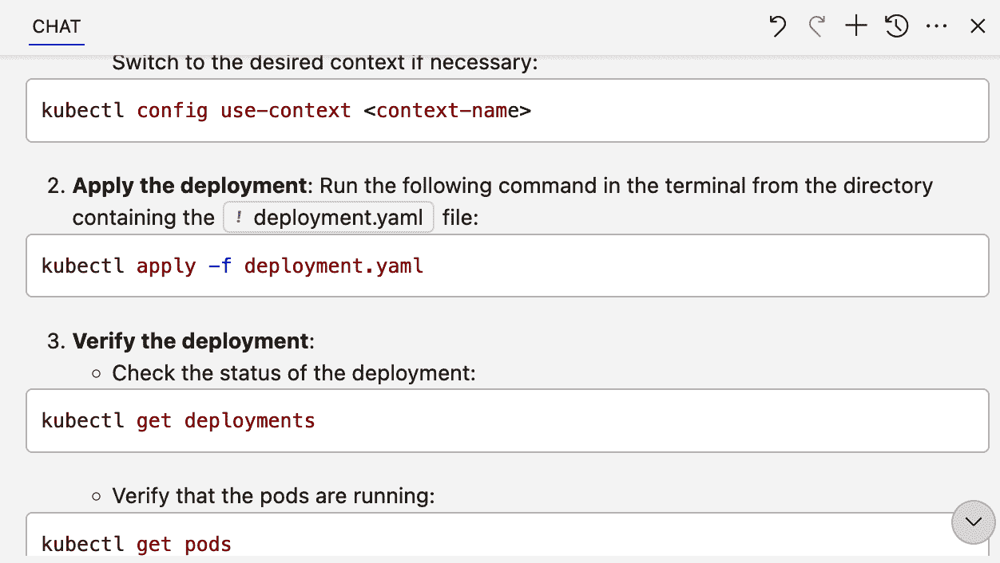
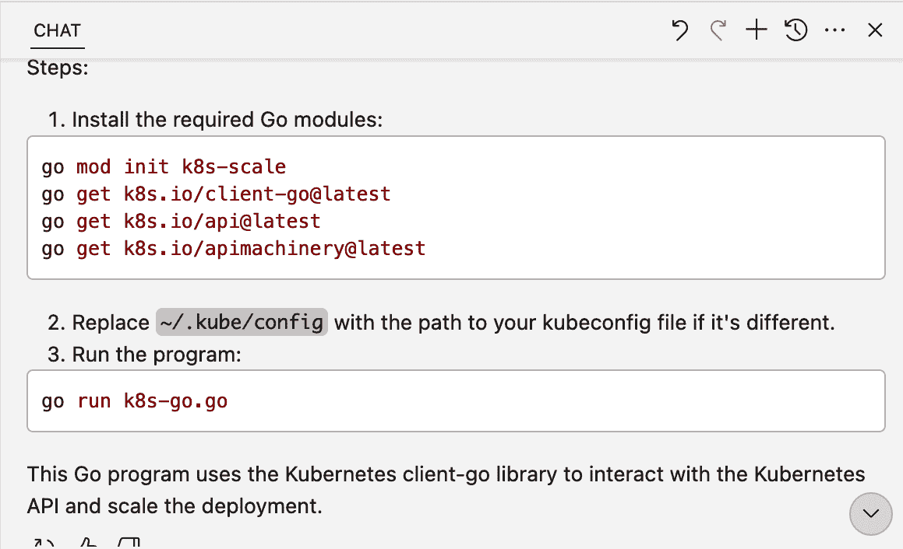

# 第八章\. 利用 Copilot 的其他方法

正如我们所见，Copilot 在处理传统编码流程以及传统任务（如测试和文档）方面提供了很多价值。Copilot 还可以帮助程序员遇到的一些不太常见的用例。

我们无法在本章或本书中涵盖所有这些用例，但我们可以涵盖一些代表性的例子。作为提示，本章的结构与其他章节不同。我们将涵盖多个、多样化的用例，而不是专注于一个整体功能或功能区域。我们将探讨的例子将在接下来的几段中概述。

你可能主要会想到使用 GitHub Copilot 来编写 JavaScript 和 Python 等流行语言的代码。然而，Copilot 可以访问你使用的模型训练时所涉及的所有语言。因此，你还可以将其用于我们通常不认为是传统编程语言的语言。一个例子是我们之前提到过的——SQL，通常用于与关系型数据库一起工作。当你在处理查询、模式和存储过程时，Copilot 可以简化大量数据库相关任务。

框架，如 Kubernetes，也使用有序格式（通常用 YAML 表达）。虽然这些框架是声明性的而不是命令性的，但它们的语法和结构被 Copilot 所理解。它可以提供完成建议和关于如何使用它们的答案，就像对任何编程语言一样。

然后是正则表达式——那些通常复杂且晦涩的字符字符串。当你需要它们时，它们对于正确获取很重要，但通常尝试创建它们会令人沮丧。Copilot 可以轻松处理这些。

对于测试正则表达式或单元测试一个函数，你可能还需要结构化测试数据。通过特定的提示，Copilot 可以生成几乎所有所需的简单数据结构，尽管有一些需要注意的细微差别。

最后，值得注意的是，一些 Copilot 功能已嵌入到 GitHub CLI 应用程序中。虽然目前功能有限，但合理预期未来会逐渐增加更多功能。

我们将在本章中涵盖所有这些内容，从 Copilot 在处理 SQL 时如何使用开始。

# 使用 Copilot 与 SQL

虽然技术上是一种编程语言，但 SQL 为数据管理带来了自己独特的结构。这包括在数据库中使用的数据和模式的标准查询、用于效率的索引以及用于更复杂任务的存储过程。

在本节中，我们将探讨 Copilot 可以帮助的三个领域：

+   使用 Copilot 帮助查询

+   与存储过程一起工作

+   进行优化

让我们先看看 Copilot 在生成与 SQL 相关查询方面的基本辅助方式。

## 查询

如你所知，Copilot 从本地内容中获取上下文。所以如果你在编辑器中工作并打开一个扩展名为*.sql*或包含 SQL 语句的文件，Copilot 可以捕捉到这一点，知道它需要生成 SQL。你还可以使用注释来进一步帮助 Copilot 了解你的需求。

第七章展示了如何添加上下文以使代码生成和建议更相关。在那里，我们使用了打开包含大学学生和课程注册系统所有数据库模式定义的 SQL 文件的技术，为 Copilot 提供更多生成查询的上下文。

如果你需要提醒，可以参考“添加上下文以使代码更相关”，但我们将假设这里相同的设置。以下是注册系统下方的部分模式定义：

```py
-- create tables
...

CREATE TABLE courses.students (
    student_id INT IDENTITY (1, 1) PRIMARY KEY,
    first_name VARCHAR (255) NOT NULL,
    last_name VARCHAR (255) NOT NULL,
    phone VARCHAR(25),
    email VARCHAR (255) NOT NULL,
    city VARCHAR (50),
    state VARCHAR (25),
    zip_code VARCHAR (5)
);

...

CREATE TABLE courses.registrations (
    registration_id INT IDENTITY (1, 1) PRIMARY KEY,
    student_id INT,
    registration_status tinyint NOT NULL,
    -- Registration status: 1 = Pending; 2 = Enrolled; 3 = Rejected;
 4 = Completed
    registration_date DATE NOT NULL,
    required_date DATE NOT NULL,
    completion_date DATE,
    location_id INT NOT NULL,
    staff_id INT NOT NULL,
    FOREIGN KEY (student_id) REFERENCES courses.students 
(student_id)
 ON DELETE CASCADE ON UPDATE CASCADE,
    FOREIGN KEY (location_id) REFERENCES courses.locations 
(location_id) ON DELETE CASCADE ON UPDATE CASCADE,
    FOREIGN KEY (staff_id) REFERENCES courses.staffs (staff_id) ON 
DELETE NO ACTION ON UPDATE NO ACTION

...

CREATE TABLE courses.registration_items (
    registration_id INT,
    item_id INT,
    course_id INT NOT NULL,
    quantity INT NOT NULL,
    class_hours DECIMAL (10, 2) NOT NULL,
    lab_hours DECIMAL (4, 2) NOT NULL DEFAULT 0,
    PRIMARY KEY (registration_id, item_id),
    FOREIGN KEY (registration_id) REFERENCES courses.registrations 
(registrations_id) ON DELETE CASCADE ON UPDATE CASCADE,
    FOREIGN KEY (course_id) REFERENCES curriculum.subjects 
(course_id) ON DELETE CASCADE ON UPDATE CASCADE
);

```

如果我们在编写查询的编辑器中打开它，然后通过注释提示 Copilot 生成一个获取所有课程注册学生的 SQL 查询，我们会得到一个详细的结果，其中包含与模式匹配的表名、字段名等：

```py
-- define a select statement to get all students enrolled in a 
course

SELECT students.first_name, students.last_name, students.email,
 students.phone, students.city, students.state, students.zip_code
FROM courses.students
JOIN courses.registrations
ON students.student_id = registrations.student_id
JOIN courses.registration_items
ON registrations.registration_id = 
registration_items.registration_id
WHERE registration_items.course_id = 1;

```

通过简单地在工作区中打开另一个文件，Copilot 能够利用该内容为我们创建更好的查询。

# 保存你的工作

记得首先保存任何新的文件作为项目的一部分，这样 Copilot 才能在上下文中使用。

作为另一个例子，我们可以要求 Copilot 创建一个用于记录学生出勤的表格。考虑到更大的模式表上下文，Copilot 应该响应一个完整的表定义：

```py
-- define a table for student attendance to capture attendance by
 class
CREATE TABLE courses.attendance (
    attendance_id INT IDENTITY (1, 1) PRIMARY KEY,
    registration_id INT NOT NULL,
    attendance_date DATE NOT NULL,
    attendance_status tinyint NOT NULL,
    -- Attendance status: 1 = Present; 2 = Absent; 3 = Late; 
4 = Excused
    FOREIGN KEY (registration_id) REFERENCES courses.registrations 
(registration_id) ON DELETE CASCADE ON UPDATE CASCADE
);

```

这个表格的格式与用于*courses.registration*表的模式文件中使用的格式相似，如下所示。注意，两个表定义都使用了 1-4 的状态值：

```py
CREATE TABLE courses.registrations (
    registration_id INT IDENTITY (1, 1) PRIMARY KEY,
    student_id INT,
    registration_status tinyint NOT NULL,
    -- Registration status: 1 = Pending; 2 = Enrolled; 3 = Rejected;
 4 = Completed
    registration_date DATE NOT NULL,
    required_date DATE NOT NULL,
    completion_date DATE,
    location_id INT NOT NULL,
    staff_id INT NOT NULL,
    FOREIGN KEY (student_id) REFERENCES courses.students 
(student_id) ON DELETE CASCADE ON UPDATE CASCADE,
    FOREIGN KEY (location_id) REFERENCES courses.locations 
(location_id) ON DELETE CASCADE ON UPDATE CASCADE,
    FOREIGN KEY (staff_id) REFERENCES courses.staffs (staff_id)
 ON DELETE NO ACTION ON UPDATE NO ACTION

```

我们还可以让 Copilot 生成更复杂的 SQL 数据类型，如存储过程。

## 存储过程

*存储过程*是保存的 SQL 代码，可以轻松重用。Copilot 也可以帮助我们生成这些。继续我们的大学注册示例，让我们要求 Copilot 创建一个新的存储过程，用于获取特定位置的已注册学生列表。我们可以使用简单的聊天提示（类似于我们之前使用的注释表单）告诉 Copilot 我们想要什么。提示是“定义一个存储过程以通过位置获取课程注册信息。”

使用这个提示以及额外的模式上下文，Copilot 产生了一个合理的结果：

```py
CREATE PROCEDURE GetCourseEnrollmentByLocation
    @CourseID INT
AS
BEGIN
    SELECT students.city, students.state, COUNT(*) AS 
enrollment_count
    FROM courses.students
    JOIN courses.registrations
    ON students.student_id = registrations.student_id
    JOIN courses.registration_items
    ON registrations.registration_id = 
registration_items.registration_id
    WHERE registration_items.course_id = @CourseID
    GROUP BY students.city, students.state;
END
```

我们还可以更加明确。提示越具体，Copilot 生成更好的结果的可能性就越大。例如，考虑以下在聊天界面中非常具体的提示：

```py
define a stored procedure to get instructor details associated with 
a location include instructor details, location details, and courses
associated with the instructor use instructor_id as the input 
parameter

```

Copilot 首先用计划的形式解释了它的思考过程，然后生成了与提示相匹配的详细代码：

```py
Plan
1\. Define a new stored procedure named 
`GetInstructorDetailsByLocation`.
2\. Accept `@InstructorID` as an input parameter.
3\. Select instructor details, location details, and courses 
associated with the instructor.
4\. Use appropriate joins to fetch data from the `instructors`, 
`locations`, and [`courses`]
5\. Group the results by instructor and location details.

SQL Code
CREATE PROCEDURE GetInstructorDetailsByLocation
    @InstructorID INT
AS
BEGIN
    SELECT
        instructors.instructor_id,
        instructors.first_name,
        instructors.last_name,
        instructors.email,
        locations.city,
        locations.state,
        courses.course_id,
        courses.course_name
    FROM
        courses.instructors
    JOIN
        courses.locations
    ON
        instructors.location_id = locations.location_id
    JOIN
        courses.course_instructors
    ON
        instructors.instructor_id = 
course_instructors.instructor_id
    JOIN
        courses.courses
    ON
        course_instructors.course_id = courses.course_id
    WHERE
        instructors.instructor_id = @InstructorID;
END;

```

虽然 Copilot 为我们生成查询和存储过程很有帮助，但这不是它的唯一 SQL 技能。AI 还可以帮助我们优化我们创建的内容。

## 优化

Copilot 可以使我们现有的代码更加高效，并且可以通过两种主要方式实现。第一种是通过编写利用语言或框架提供的内置结构进行优化的代码。第二种是优化现有代码。

作为第一个案例的例子，SQL 提供了索引来加速操作。回顾一下本章前面我们用来获取所有课程注册学生的查询。完整的查询如下所示：

```py
-- define a select statement to get all students enrolled in a
course

SELECT students.first_name, students.last_name, students.email,
students.phone, students.city, students.state, students.zip_code
FROM courses.students
JOIN courses.registrations
ON students.student_id = registrations.student_id
JOIN courses.registration_items
ON registrations.registration_id =
registration_items.registration_id
WHERE registration_items.course_id = 1;

```

对于这个查询，我们可以使用一个单独的索引来加速操作。我们提示 Copilot 根据这个查询创建一个新的索引，提示内容为“--写一个索引来提高查询的性能。”从这个提示中，Copilot 可能会建议如下 SQL：

```py
-- write an index to improve the performance of the query

create index idx_registration_status_date on courses.registrations
(registration_status, registration_date);

```

与原始查询一样，Copilot 能够利用现有代码的上下文来创建一个使用现有字段名、表名等的索引。

除了创建帮助优化执行的代码之外，Copilot 还可以优化静态代码。这是本节开头提到的第二个用例。假设我们有一个查询，用于获取 2024 年 9 月的所有课程注册信息。它可能看起来像这样：

```py
select * from courses.registrations where year(registration_date) 
= 2024 and month(registration_date) = 9;
```

我们可以选择这个查询，然后通过提示“优化这个查询”来提示 Copilot 进行优化。

然后，AI 建议使用直接开始和结束日期的优化方案：

```py
SELECT * FROM courses.registrations WHERE registration_date >= 
'2023-09-01' AND registration_date < '2023-10-01'

```

在相同的输出中，Copilot 还提供了关于*为什么*这是一个改进的额外背景信息：

```py
...using functions or columns in the WHERE clause can prevent the
use of indexes and slow down the query. If registration_date is 
indexed, you can optimize the query by avoiding the use of the
YEAR() and MONTH() functions and instead comparing against a range 
of dates... 

```

Copilot 不仅建议了优化方案，还告诉我们为什么以及在什么条件下这实际上是一个优化。很好。

现在你已经看到了 Copilot 如何与数据库编码管理协同工作，让我们看看它是如何通过声明性规范来处理框架的。

# 与 YAML 和 Kubernetes 协同工作

YAML 是许多应用程序今天的关键格式化语言。由于其语法和严格的格式要求，它也可能难以处理。但创建规范和配置的能力对于像 Kubernetes 这样的应用程序至关重要。

Kubernetes 本身也可能因为多个原因而难以协同工作。这包括学习和记住如何在 YAML 文件中定义你想要的对象。每个原生对象都有一个共同的属性集，但每个对象也有自己的规范（spec）。当尝试为服务或产品扩展对象时，挑战可能会成倍增加。由于任何错误或不正确的格式都可能使你的应用程序无法运行，我们可以利用 AI 在这里发挥积极作用。

假设我们想在 Kubernetes 中编写一个新的部署。在 Kubernetes 中，*部署*是一种对象类型，它实例化和管理 Kubernetes *pod*的多个实例。pod 反过来又封装了一个或多个容器。这些容器基于镜像，为应用程序提供一个自包含的环境来执行。

在掌握了基本知识的基础上，我们可以通过聊天界面提示 Copilot 生成一个部署的 YAML 规范：

```py
write spec for deployment in Kubernetes with 2 replicas and image
from busybox
add command to run in containers: sleep 3600
add label app: myapp
add label type: front-end
```

几分钟后，Copilot 会建议如下：

```py
apiVersion: apps/v1
kind: Deployment
metadata:
  name: myapp-deployment
  labels:
    app: myapp
    type: front-end
spec:
  replicas: 2
  selector:
    matchLabels:
      app: myapp
  template:
    metadata:
      labels:
        app: myapp
        type: front-end
    spec:
      containers:
      - name: busybox-container
        image: busybox
        command: ["sleep", "3600"]
```

如果你不知道 Kubernetes，这是一个有效的语法，与我们预期的部署规范相匹配。请注意，除了应该包含在规范中的对象类型之外，生成此规范不需要任何关于 Kubernetes 语法的个人知识。我们可以将此文件保存为 *deployment.yaml* 并继续。

现在我们有了这个规范，我们将在某个时候执行它。如果我们不清楚执行过程，我们可以 ping Copilot 来询问。我们只需进入聊天界面，问“我该如何执行这个？”如图 8-1 所示，Copilot 引用了我们创建的 *deployment.yaml* 文件，然后提供将文件放入 Kubernetes 集群（运行 Kubernetes 的机器系统）并验证部署正在运行的说明。它是通过 Kubernetes CLI（称为 `kubectl`）来做的。



###### 图 8-1\. Copilot 解释如何将规范应用到 Kubernetes 以执行

这非常有帮助，但如果我们需要在某个时候通过 Kubernetes API 而不是 CLI 来管理这个 Kubernetes 部署，我们会怎么做？我们还希望使用 Python 并能够更改（扩展）运行的容器实例数量。

我们可以通过聊天中的另一个简单的自然语言提示来查询 Copilot：

```py
How do I call the K8s API for scaling a deployment to 5 replicas
 with Python?
```

Copilot 首先告诉我们可以使用 Kubernetes Python 客户端库来完成这项任务，然后输出该任务的 Python 代码（图 8-2）。


###### 图 8-2\. Copilot 对 Python 中管理 Kubernetes 的响应

此外，Copilot 提供了运行代码所需步骤的详细解释（图 8-3）。


###### 图 8-3\. 执行步骤

我们可以将建议的代码保存为编辑器中的新文件，并进行任何我们想要的编辑，测试代码等。

让我们再给 Copilot 一个挑战。Kubernetes 更常见的编程语言是 Go。所以，如果我们想将此 Python 代码迁移到 Go，Copilot 能帮忙吗？结果证明，它可以！而且非常简单。在选择了 Python 代码（因此引用了它）之后，我们只需要告诉 Copilot “转换为 Go。”然后 Copilot 就会在聊天界面中生成 Go 代码的等效部分（图 8-4）。


###### 图 8-4\. Kubernetes 部署的 Go 代码

Copilot 也提供了与 Python 版本相同的相应解释和执行说明（图 8-5）。



###### 图 8-5\. 执行 Go 代码的步骤

再次，我们看到 Copilot 如何自动化并简化复杂任务的创建过程。

Copilot 可以极大地简化另一个经常复杂的任务，那就是创建正则表达式。这就是我们下一节的主题。

# 生成正则表达式

大多数开发者都不喜欢自己想出正则表达式的语法。尝试找到一组字母、数字和符号的组合以有效地匹配一组字符串的过程可能既耗时又令人沮丧。再加上需要设计全面测试表达式的测试，因此尝试从其他代码或像 Stack Overflow 这样的资源中找到与之匹配的东西变得更有吸引力。

然而，这又是 Copilot 表现出色的领域之一。给定一个合适的提示，Copilot 可以轻松地创建相应的正则表达式。例如，假设我们告诉 Copilot“创建一个用于验证 SSN 的正则表达式”（其中*SSN*代表*美国社会安全号码*）。Copilot 随后给出了以下实现建议和解释：

```py
Here is a regular expression to validate a U.S. Social Security
 Number (SSN):

^\d{3}-\d{2}-\d{4}$

Explanation:

 • ^ asserts the start of the string.
 • \d{3} matches exactly 3 digits.
 • - matches a literal hyphen.
 • \d{2} matches exactly 2 digits.
 • - matches another literal hyphen.
 • \d{4} matches exactly 4 digits.
 • $ asserts the end of the string.

Example Usage in Python:

python
import re

def validate_ssn(ssn):
    pattern = r"^\d{3}-\d{2}-\d{4}$"
    return bool(re.match(pattern, ssn))

# Test the function
print(validate_ssn("123-45-6789"))  # True
print(validate_ssn("123-456-789"))  # False

This ensures the SSN is in the format `XXX-XX-XXXX` where `X`
 is a digit.

```

我们可能还想要生成一个函数，该函数使用我们正在编写的任何语言的正则表达式。假设我们有一个 JavaScript 文件（*phone.js*），我们想要在其中添加一个函数来验证任何全球电话号码。

我们可以用“创建一个使用正则表达式验证任何全球电话号码的函数”来提示 Copilot。反过来，Copilot 将生成如下 JavaScript 代码：

```py
function validatePhoneNumber(phoneNumber) {
    const phoneRegex = /^\+(?:[0-9] ?){6,14}[0-9]$/;
    return phoneRegex.test(phoneNumber);
}

// Example usage:
console.log(validatePhoneNumber("+1234567890")); // true
console.log(validatePhoneNumber("1234567890")); // false
```

注意，虽然代码很短，但正则表达式并不简单。而且 Copilot 还提供了用于验证函数的示例调用。如果示例中的用例不符合你的意图，你可以拒绝建议，并使用更详细的提示来获取你需要的内容。

在生成正则表达式后，你可能想要一些简单的数据来测试它，或者你可能需要一些数据来对代码的其他部分进行基本测试。而不是自己寻找或创建这类数据，你可以使用 Copilot 自动创建。

# 自动数据生成

另一个 Copilot 可以帮助处理模板化任务的领域是生成数据和数据映射，用于验证编码方法和编码后的测试。

这里的方法是相同的：使用一个定义良好的提示来实现预期的结果。假设我们想要一些测试数据来验证一个查找给定州区号的函数。我们可以指示 Copilot“创建一个映射，将所有 50 个州映射到区号，其中键是州缩写，值是包含最多 10 个代码的数组。”

注意，我们对映射中键和对应值应该是什么有明确的要求。Copilot 回应了所需的数据（图 8-6）。


###### 图 8-6\. 生成的数据

有时 Copilot 可能会包含关于生成数据准确性的免责声明。对于这些数据，免责声明会指出区号是占位符，并不保证是每个州的实际区号。重复我们在 第七章 中提到的观点，Copilot 只是从它训练的数据中工作的。它不会出去检查以确保它返回的数据是正确或最新的。你必须始终记住，如果你需要准确、及时的数据，你必须交叉检查结果。你不能假设通过 Copilot 提供的值是当前和正确的。

当你以这种方式要求 Copilot 生成数据时，你可能会偶尔遇到两种其他类型的问题。

首先，根据提示和数据请求的数量，Copilot 可能只会返回部分数据。这通常足以让你开始，但不是完整的数据集。例如，如果查询省略了 *所有 50 个* 部分，只是“创建一个将州映射到区号的映射，其中键是州缩写，值是包含最多 10 个代码的数组”，Copilot 可能只会返回几条记录：

```py
state_area_codes = {
    "CA": [213, 310, 415, 510, 530, 559, 619, 626, 650, 661],
    "NY": [212, 315, 347, 516, 518, 585, 607, 631, 646, 716],
    "TX": [210, 214, 254, 281, 325, 346, 361, 409, 430, 432],
    "FL": [305, 321, 352, 386, 407, 561, 727, 754, 772, 786],
    "IL": [217, 224, 309, 312, 331, 618, 630, 708, 773, 815],
    "PA": [215, 267, 412, 484, 570, 610, 717, 724, 814, 878],
    "OH": [216, 234, 330, 380, 419, 440, 513, 567, 614, 740],
    "GA": [229, 404, 470, 478, 678, 706, 762, 770, 912, 943],
    "NC": [252, 336, 704, 743, 828, 910, 919, 980, 984, 336],
    "MI": [231, 248, 269, 313, 517, 586, 616, 734, 810, 906]
}

```

如果遇到这种情况，你可以通过类似“创建一个将剩余状态映射到区号的映射，其中键是州缩写，值是包含最多 10 个区号的数组”的提示来提示 Copilot 生成剩余数据。我们添加了术语 *remaining* 来告诉 Copilot 从它上次停止的地方继续。

第二，当使用 Copilot 生成数据时，你可能会收到通知，表示生成的数据与公共存储库中的数据匹配。如果你启用了阻止与公共代码匹配的生成代码的设置，Copilot 对你的提示的完整响应将被阻止。

通常，此类数据不太可能是专有的。如果没有关于许可违规的担忧，你通常可以调整你的提示，让 AI 以不同的维度生成数据。这可能就像更改请求的数据量一样简单，例如，“创建一个将州映射到区号的映射，其中键是州缩写，值是包含最多 5 个区号的数组”。注意最大值的从 10 变为 5。

最后，让我们看看另一种你可以与 Copilot 交互的方式。虽然不如我们讨论的其他接口常见，但 GitHub 命令行也可以利用 Copilot 来帮助你理解和生成答案。

# GitHub CLI 和 Copilot

如果你使用 GitHub CLI，你可以使用一些与 Copilot 一起使用的子命令。在撰写本文时，有四个。

在能够使用 GitHub CLI 与 Copilot 一起使用之前，必须满足一些基本前提条件：

+   GitHub CLI 必须安装。

+   你必须通过 `gh auth` 命令等方式在 GitHub 上进行身份验证。

+   必须通过 `gh extension install github/gh-copilot` 命令在 GitHub CLI 中安装 Copilot 扩展。

在完成先决条件后，您将可以使用表 8-1 中列出的 CLI 命令。该表还显示了每个命令的目的。

表 8-1\. 通过 GitHub CLI 的 Copilot 命令

| 命令 | 功能 |
| --- | --- |
| `alias` | 生成特定于 shell 的别名以方便使用 |
| `config` | 配置选项 |
| `explain` | 解释一个命令 |
| `suggest` | 建议一个命令 |

作为使用 CLI 与 Copilot 的示例，我们可以通过简单的 GitHub CLI 调用（如`gh copilot explain "ps -aux"`）来要求它解释一个 Unix 命令。输出如下所示：

```py
Welcome to GitHub Copilot in the CLI!
version 1.1.0 (2025-02-10)

I'm powered by AI, so surprises and mistakes are possible. Make sure
 to verify any generated code or suggestions, and share feedback so
 that we can learn and improve. For more information, see 
 https://gh.io/gh-copilot-transparency

Explanation:

  • ps is used to display information about running processes.
    • -aux is a combination of flags:
      • -a displays information about all processes.
      • -u displays detailed information about the processes.
      • -x includes processes that do not have a controlling terminal.

```

在某些情况下，您可能需要选择额外的选项作为后续操作。例如，如果您通过 CLI 要求 Copilot 建议一个安装 Python 的命令，AI 可能会有额外的查询以确保它提供最佳响应。以下是基于初始命令`gh copilot suggest "install python"`的输出和交互：

```py
Welcome to GitHub Copilot in the CLI!
version 1.1.0 (2025-02-10)

...

? What kind of command can I help you with?  [Use arrows to move,
 type to filter]
> generic shell command
  gh command
  git command

Suggestion:

  sudo apt-get install python3

? Select an option  [Use arrows to move, type to filter]
  Copy command to clipboard
> Explain command
  Execute command
  Revise command
  Rate response
  Exit

Explanation: 

  • sudo is used to run a command with elevated rights, allowing 
changes to system files.
  • apt-get is the package management command for Debian-based 
systems.
    • install is the sub-command that specifies you want to install
a package.
      • python3 is the specific package you want to install, which 
provides the Python 3 interpreter. 

```

注意，在原始命令之后，我们与 Copilot 进行了几次后续交互。我们被赋予了选择命令上下文（通用 shell、CLI 或 Git）的选项。一旦我们选择了 shell 命令，Copilot 就会提供建议。然后我们可以选择复制命令、让 Copilot 解释它、执行它等。选择`explain`选项会提供类似于上一个示例的解释。

# 结论

在本章中，我们探讨了一系列领域，在这些领域中，人工智能辅助可能不是首先想到的选项，但可以证明是有帮助的。Copilot 的功能可以在这些领域的每个方面得到良好利用。

当您需要与数据库交互时，Copilot 可以提供代码补全建议，并为 SQL 生成完整的代码集，就像为更典型的编程语言一样。Copilot 在创建存储过程和优化编程方面尤其有帮助。

除了生成传统的代码，告诉系统如何做某事之外，Copilot 还可以用来生成声明性规范，概述所需的最终结果。一个很好的例子是使用 Copilot 帮助声明 Kubernetes 规范。给定一个合适的提示，Copilot 可以为任何标准 Kubernetes 对象生成 YAML 定义。此外，Copilot 还可以告诉用户如何使用规范与 Kubernetes 一起使用，甚至将其转换为带有 API 调用的代码。这种帮助极大地简化了与不同框架及其在 YAML 中的表示的复杂性。

Copilot 的功能还可以自动化另一个经常让开发者感到沮丧的任务：创建正则表达式。给定一个合适的提示，Copilot 将生成所需字符组合，以满足您所需的任何匹配语法，并产生验证示例。

为了支持基本的测试或演示，Copilot 可以为代码创建一组操作数据。这些数据可以是通过提示定义的具有键和值的映射数据，或者是从上下文中定义的。这些数据不一定正确或及时，并且可能更容易与公共示例匹配，因此在处理结果时需要额外的谨慎。

最后，在本章中，我们探讨了为与 Copilot 一起使用而添加到 GitHub CLI 的功能。通过 CLI 应用程序`gh`，Copilot 可以通过建议执行诸如安装应用程序等任务的命令来帮助，同时解释这些命令和参数的作用。这种功能有限，但预计未来可能会扩展到其他功能。

在下一章中，我们将进一步探讨 Copilot 的功能是如何集成到用户依赖的另一个核心应用——GitHub 本身中的。
