# 第九章\. 在 GitHub 中使用 Copilot

与许多其他关键软件开发工具一样，AI 已经通过 Copilot 集成到 GitHub 生态系统中。这意味着你可以在 GitHub 中直接与 Copilot 进行聊天，并使用 AI 功能直接与拉取请求和问题等关键功能进行工作。

在本章中，我们将概述 Copilot 如何集成到 GitHub 中，并解释你如何在 GitHub 中有效地利用其功能。我们将涵盖以下内容：

+   使用 Copilot 聊天与 GitHub 仓库

+   使用 Copilot 进行变更工作流程

+   Copilot 和拉取请求

+   Copilot 和 GitHub 问题

# GitHub 界面随时间变化

与本书中的所有信息一样，截图和关于项目中所包含的项目及其位置的信息是在编写时最新的。与 IDE 中的 Copilot 集成一样，GitHub 中的集成可能会随着时间的推移而演变。

要开始，让我们探索 Copilot 如何集成到你在 GitHub 中的仓库中。

# 使用聊天与 GitHub 仓库

在与 Copilot 集成的 IDE 中可用的聊天界面也存在于 GitHub 中。有一个通用的版本在 [*https://github.com/copilot*](https://github.com/copilot)。此外，在你的仓库代码页面上，你会在控制栏的顶部行看到一个 Copilot 图标（如图 9-1 所示）。点击该图标将带你进入一个沉浸式（全屏）的 Copilot 聊天界面，稍后我们将回到这一点。

点击 Copilot 图标旁边的下拉箭头会弹出一个选择菜单（如图 9-1 所示）。在这些选项中，我们感兴趣的是辅助选项。

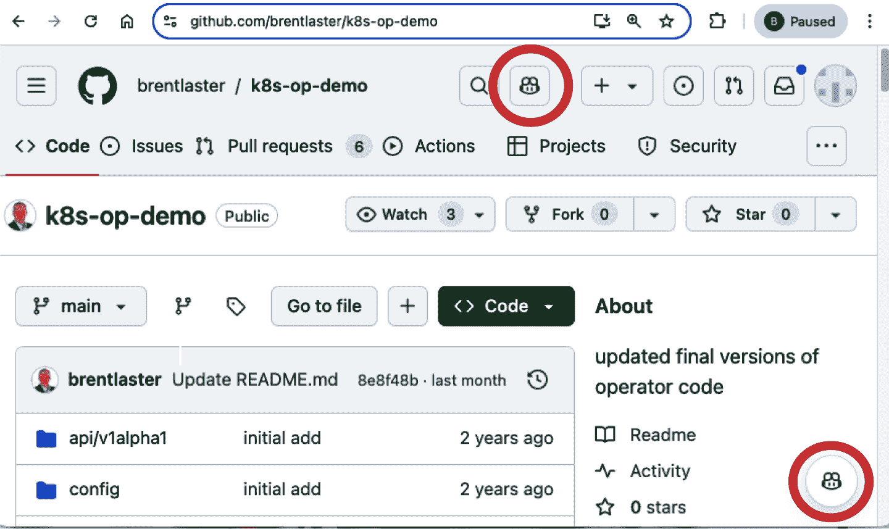

###### 图 9-1\. 仓库页面中的 Copilot 图标

点击辅助菜单选项会弹出一个聊天界面，其中预先填充了你可以关于所选仓库提出的问题，如图 9-2 所示。

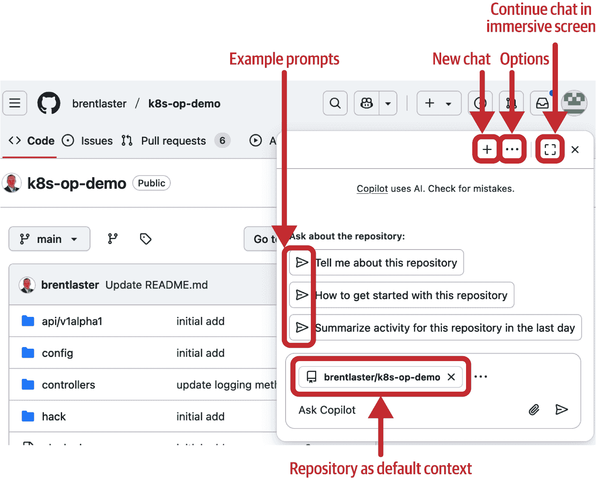

###### 图 9-2\. 辅助聊天中的仓库问题

# GitHub 中的聊天上下文

当聊天打开时，新的辅助聊天实例将填充与活动 GitHub 项目相关的相关问题。例如，如果你正在处理一个 GitHub 问题并打开一个新的聊天实例，聊天实例将填充诸如“总结这个问题”和“下一步是什么？”等问题。选择这些预先填充的问题将填充一个更长的提示，专门用于获取更好的信息。

选择第一个问题，即要求 Copilot 告诉你关于这个仓库的信息，会使用一个现成的提示来查询 Copilot，如图所示：

```py
Please provide answers to the following questions in separate 
paragraphs:

 - Provide insights on the purpose of this repository. Please also 
provide a summary of its README if it exists. 
 - Provide detailed analysis on features and technologies used in 
this repository if it contains implementation of software system of
 any kind. Otherwise, provide an analysis on contents of this
 repository instead. 

Additional guidance: 
 - Provide a heading for each paragraph, formatted in bold.
 - Keep your analysis succinct and conversational.
 - Do not repeat or list the context details in your final response.
 - Provide a concise synthesis of the information, avoiding 
unnecessary repetition.

```

Copilot 对提示的响应如下：

```py
Purpose of the Repository

This repository provides a basic example of implementing a
Kubernetes operator. It serves as a training resource for 
creating Kubernetes operators using standard toolkits. 
The README explains how to set up and run the operator, 
including steps for deploying it to a Kubernetes cluster, 
testing it, and modifying its API definitions. The project adheres
to Kubernetes' Operator pattern, aiming to synchronize resources
to their desired state.

Features and Technologies Used

The repository is built using Go and utilizes Kubernetes operator
development principles. It leverages Kubebuilder to create 
controllers that follow the Kubernetes Operator pattern. The 
operator interacts with Kubernetes clusters, managing Custom 
Resource Definitions (CRDs) and ensuring the cluster state matches
the desired configuration. Additionally, the repository provides
Makefile targets for tasks such as building, deploying, and 
uninstalling the operator.

```

这种类型的信息对于新加入或需要承担此代码库责任的人来说可能特别有用。

在交互时，如果你更喜欢沉浸式聊天体验，可以点击右上角的方形图标，进入全屏聊天会话。沉浸式选项类似于 IDE 聊天界面，将仓库设置为默认上下文。沉浸式选项是如果你只是点击 Copilot 图标（而不是它旁边的箭头）时得到的相同屏幕，如图 9-1 所示。

点击图标或从辅助屏幕切换到沉浸式屏幕都会打开[*https://github.com/copilot*](https://github.com/copilot)。该页面的聊天界面会将当前仓库设置为默认上下文。图 9-3 显示了 GitHub 中 Copilot Chat 的沉浸式/默认屏幕。


###### 图 9-3\. 沉浸式聊天

对话框主文本输入区域中的控件几乎与 IDE 聊天对话框中相应区域的控件相同。一个区别是提交箭头按钮没有其他选项，因为我们没有聊天参与者或其他元素可以提交查询。

值得花几分钟时间来谈谈 GitHub 聊天对话框中可用的其他控件和选项。（有些选项可能在你处于沉浸视图时才可见。）

上左角的控件看起来像是一个带有条带和右指箭头的正方形，用于打开之前的或现有的对话。点击此控件会显示你在此聊天中所有单独对话的列表，并允许你选择和切换它们。

右侧下一个看起来像带有铅笔的方形的图标会打开一个新的对话。

最右侧的控件被标识为“打开工作台”。在撰写本文时，似乎没有关于此功能应该做什么的真正文档。 

在聊天对话中输入第一个提示后，会出现另一个控件：分享按钮。此按钮使得共享 Copilot 聊天变得简单，用于同伴编码/故障排除、在拉取请求中添加见解等目的。

要共享当前对话和未来的消息，你点击右上角的分享按钮，然后在弹出的对话框中再次点击分享（图 9-4）。

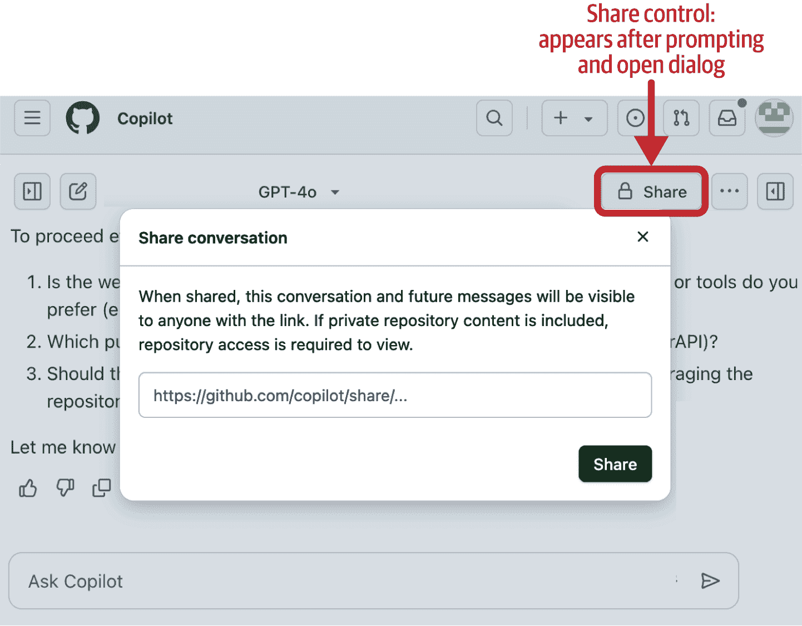

###### 图 9-4\. 分享操作

之后，你可以点击分享按钮旁边的下拉箭头，复制共享对话的链接以提供给他人（图 9-5）。如果你想要取消共享，也可以这样做。


###### 图 9-5\. 获取分享链接

最后，右侧的菜单控件（以三个点表示）会弹出一个菜单，用于访问高级功能，如图 9-6 所示。

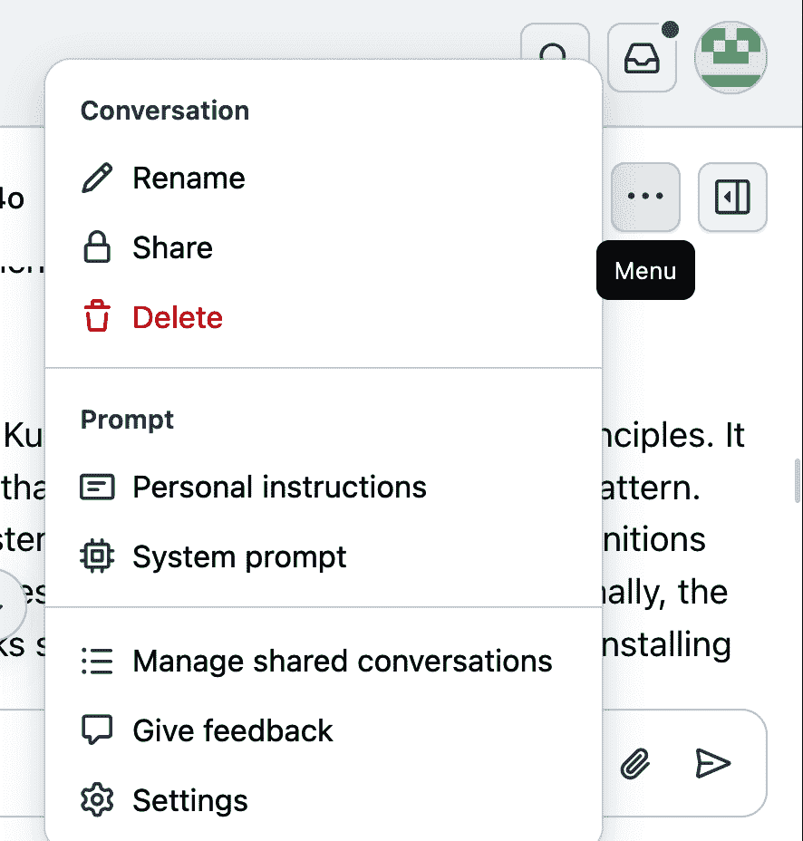

###### 图 9-6\. 聊天菜单

菜单项如下：

对话

本节中的项目是自我解释的，允许您重命名、删除或共享当前对话。

个人指令

这些选项允许您自定义 Copilot Chat 在 GitHub 上对您的响应方式。点击此选项会弹出一个对话框，您可以在其中指定偏好设置，如语言、语气或编码风格（例如，“始终以 Python 响应”或“简洁明了”）。这些指令会覆盖任何存储库或组织级别的设置，并适用于您在 GitHub 上的所有 Copilot Chat 会话。

系统提示

此选项显示为 Copilot 在 GitHub 上设置的系统提示文本。

管理共享对话

此选项会显示您已共享的对话列表，并允许您获取链接或取消共享每个对话。

提供反馈

这个选项是自我解释的。

设置

选择此选项将带您进入 Copilot 的个人设置。

聊天界面是我们与 AI 讨论存储库的门户，但也是触发存储库被索引的触发器。我们已经讨论了如何使用 Copilot 在 IDE 中创建和使用索引。GitHub 侧的存储库会创建单独的索引。然而，目标却是相同的：为 Copilot 提供一个更深入、更丰富的对存储库的理解。GitHub 存储库的索引工作方式将在以下侧边栏中更详细地描述。

聊天界面和索引功能对于理解和深入了解 GitHub 中的存储库和其他对象非常有用。这对那些需要加入新项目或承担更改和修复责任的人来说可能是有益的。

然而，当涉及到在 GitHub 中处理更改和修复时，我们可以利用 Copilot 的其他方式来使我们的编码工作流程更高效、更节省时间。

# 使用 Copilot 进行更改工作流程

Copilot 提供了有用的代码更改功能——从提出修复建议、帮助更新问题和拉取请求到审查代码。在本节中，我们将通过一个示例问题来展示我们可以如何利用 Copilot 来帮助我们纠正它。

首先，我们将使用一个示例安全问题。我们有一组数据库查询的代码，由于它们的构建方式，容易受到 SQL 注入的攻击。这种类型的问题可以通过 GitHub 的 [CodeQL 应用程序](https://codeql.github.com)通过其代码扫描轻松识别。

有问题的存储库的代码扫描警报显示在 图 9-7 中。


###### 图 9-7\. 编码扫描中的一些问题

让我们选择其中一个问题来处理。我们将使用最后一个。打开“代码扫描”面板中的链接，我们可以看到特定警报的更多详细信息（图 9-8）。

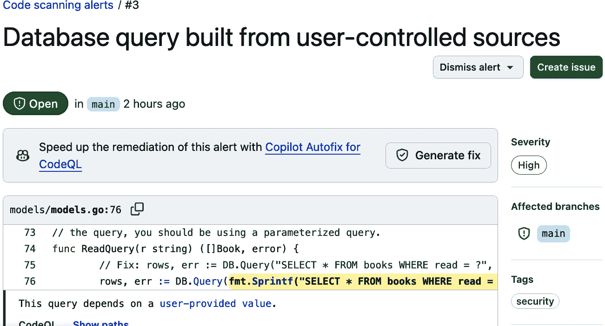

###### 图 9-8\. 代码扫描警报

如果我们能让 Copilot 为我们总结这个警报那就太好了。不幸的是，在撰写本文时，Copilot 没有这个功能。然而，在同一屏幕上提供了一个创建问题的按钮（如图图 9-8 右上角所示）。

# 启用问题

只有在存储库的设置中启用了问题，才会显示“创建问题”按钮。

如果我们点击“创建问题”按钮，就会创建一个基本的 GitHub 问题，其中包含标题和扫描警报的链接，如图图 9-9 所示。（同时也会出现一个警告，虽然有用，但对我们这个例子中的操作不是问题。）


###### 图 9-9\. 问题的生成草稿

点击“提交新问题”按钮将完成初始问题的创建（图 9-10）。


###### 图 9-10\. 生成的议题

此后，如果我们返回到警报页面（图 9-11），我们可以看到它报告说它“由#3 跟踪”。这里的#3 指的是本存储库中的 GitHub 问题#3。

你可能也注意到了下面框中提到的“Copilot Autofix for CodeQL”横幅以及一个“生成修复”按钮。“Copilot Autofix”是一个与 GitHub 的代码扫描工具（如 CodeQL）集成的功能，用于分析你的代码，识别问题，并使用 Copilot 创建修复建议。


###### 图 9-11\. 警报页面详情

点击“生成修复”按钮会导致 Copilot 生成建议的代码更改以纠正问题，如图图 9-12 所示。


###### 图 9-12\. Copilot 建议的修复方案

在建议的代码更改的末尾有一个“提交更改”按钮。点击它将设置一个推送到新分支（默认情况下）并自动生成分支名称和提交消息的条目。为了确保这与我们为这次更改打开的问题相关联，我们将添加扩展描述`fixes #3`。提交对话框如图图 9-13 所示。


###### 图 9-13\. 自动修复的提交设置

自动完成提交会打开一个草稿拉取请求，其中包括再次运行 CodeQL 工具以验证问题是否已修复（通过状态）。在下一节中，我们将更深入地探讨 Copilot 如何帮助我们管理像这次更改一样的拉取请求。

# 使用 Copilot 处理拉取请求

GitHub 拉取请求是在 GitHub 中管理多个存储库之间或同一存储库分支之间的合并的一种经过验证的方法。拉取请求提供了一种协作方式，以合并和验证源代码中的更改。它们通过促进代码审查和 GitHub Actions 工作流运行等关卡，保护合并目标免受不良代码的影响。

但它们并非没有挑战。这些挑战之一可能是获取和理解在拉取请求被处理过程中发生的更改和对话集合。幸运的是，Copilot 可以提供一些帮助。

让我们继续之前关于我们仓库中已解决的漏洞的例子，这些漏洞已在另一个分支中得到了解决。现在，我们希望通过拉取请求（pull-request）过程将这些修复合并回我们的生产分支（在本例中为*main*分支）。

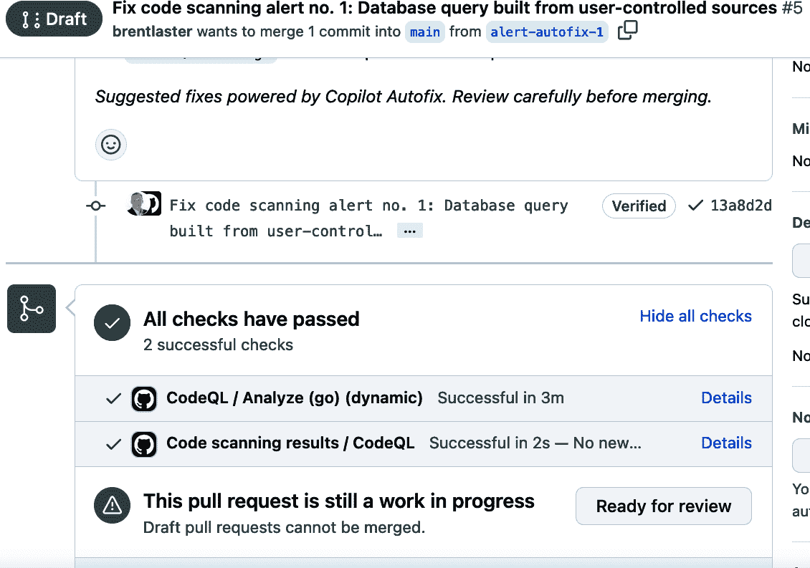

###### 图 9-14\. 从自动修复中创建的草稿拉取请求

当我们准备好时，我们可以通过点击“准备审查”按钮将草稿拉取请求转换为待审查的拉取请求。之后，我们可以进行通常的拉取请求流程，包括添加审阅者。

## 让 Copilot 审阅拉取请求

Copilot 本身可以被添加为自动审阅者，以提供关于更改的反馈。下面是这个样子的。在拉取请求的审阅者部分，你只需点击用户区域，你将看到 Copilot 作为审阅者选项显示（图 9-15）。


###### 图 9-15\. 将 Copilot 添加为拉取请求的审阅者

在 Copilot 有时间审查代码后，它将把结果发布回拉取请求，如图 9-16 所示。在这种情况下，Copilot 没有提供反馈。这是有道理的，因为 Copilot 最初也产生了建议的修复。


###### 图 9-16\. Copilot 的审阅

到目前为止，我们已经准备好合并拉取请求。作为最后的检查，或者如果我们需要向其他人提供解释，我们也可以要求 Copilot 总结这个拉取请求。我们可以在页面顶部打开 Copilot 聊天的按钮，还有一个*浮动*的按钮，通常在页面右下角（图 9-17）。

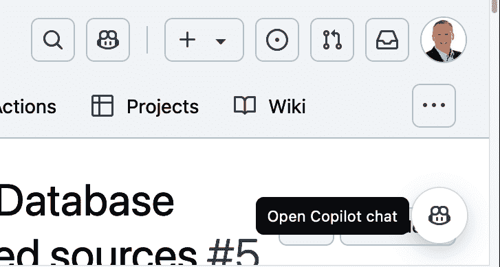

###### 图 9-17\. 打开 Copilot 聊天的多种方式

你可以选择其中一个来打开聊天会话。会话打开后，我们可以要求 Copilot 提供与拉取请求相关的任务，例如“总结这个拉取请求”(图 9-18)。

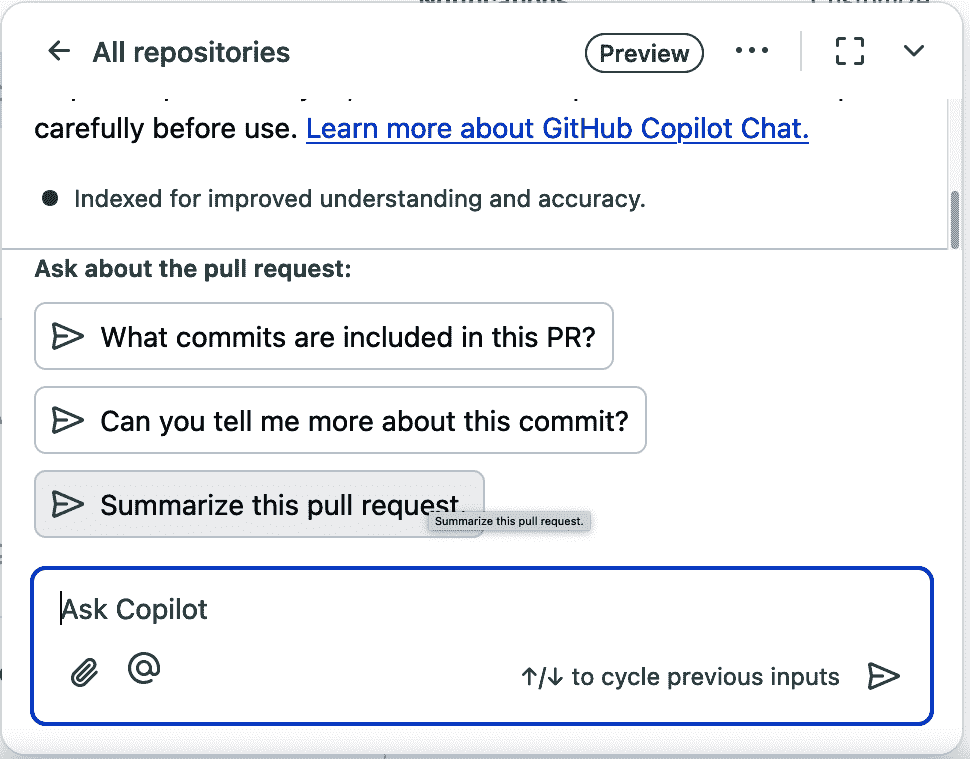

###### 图 9-18\. 要求 Copilot 总结拉取请求

Copilot 会生成一个简短的拉取请求内容总结，易于阅读（图 9-19）。


###### 图 9-19\. 拉取请求的 Copilot 总结

让我们再看看 Copilot 如何帮助处理拉取请求的一个例子：创建它们的快捷方法。

## 利用 Copilot 简化发起拉取请求

假设我们在同一个仓库中工作，我们为*所有三个*警报创建并推送修复到名为*dev*的不同分支中。假设我们想要创建一个新的拉取请求，将*dev*分支合并到*main*。

我们当然可以通过拉取请求菜单并遵循步骤创建另一个拉取请求。然而，使用 Copilot，我们可以将此过程简化为单次点击。由于 GitHub 中的大多数位置和操作都可以通过访问 URL 来完成，我们可以要求 Copilot 为我们生成一个合适的 URL。为此，我们可以打开 Copilot 聊天界面并使用以下提示：

```py
Create a link to click on to open a new pull request to merge the
dev branch into main.

```

之后，Copilot 在聊天输出中响应一个链接，如图 图 9-20 所示。请注意，Copilot 只生成您可以输入的链接。


###### 图 9-20\. 为拉取请求生成的链接

链接方便地生成后，我们可以点击它以打开新的拉取请求，其中 *基础* 和 *比较* 组件已按需设置。但除了使创建拉取请求更容易之外，我们还可以让 Copilot 根据更改生成摘要。图 9-21 展示了如何通过在描述区域点击 Copilot 图标然后选择生成摘要的项目来完成此操作。（注意，这目前仅在付费 Copilot 计划中可用。）


###### 图 9-21\. 通过链接生成的拉取请求

点击控制按钮后，Copilot 将在描述区域生成您更改的摘要。格式将是 Markdown 格式，并可进行编辑。图 9-22 展示了创建拉取请求后摘要的示例。即使这些评论是由 AI 生成的，也会显示为来自您的评论。每个更改的详细信息（以及更改文件的链接）都包括在内。

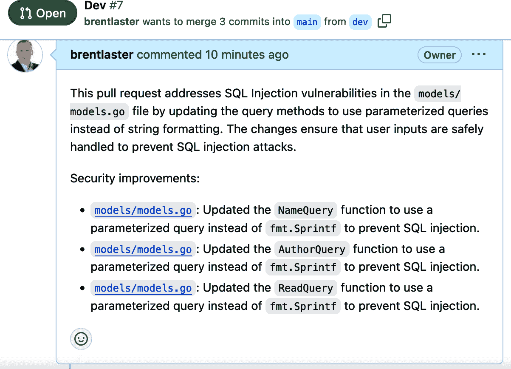

###### 图 9-22\. Copilot 生成的拉取请求摘要

# 为其他任务生成 URL

虽然在本节中我们让 Copilot 为新的拉取请求创建了一个链接，但您可以在 GitHub 提供相应直接 URL 的任何操作中使用相同的方法。

如果我们需要或想要进一步探索更改的细节，我们也可以利用 Copilot 来帮助进行探索。

# 使用 Copilot 探索代码更改

在我们一直在处理的拉取请求中，Copilot 提供了两个分支之间更改的链接。如果我们想进一步探索文件中的更改或一系列更改，我们可以点击这些链接或直接切换到“更改的文件”选项卡以查看差异（图 9-23）。

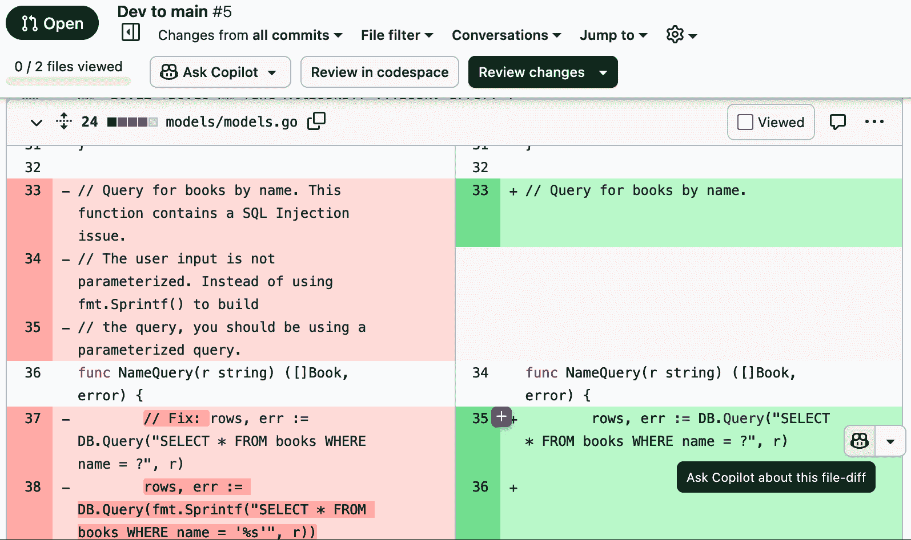

###### 图 9-23\. 拉取请求中更改的文件

在拉取请求的这个选项卡中有两个打开 Copilot 的链接。右下角的链接是标准链接，它打开 Copilot 聊天界面。顶部标记为 Ask Copilot（在“审查更改”按钮旁边）的链接会自动将当前文件附加到聊天上下文并打开聊天对话框（图 9-24）。


###### 图 9-24\. 从 Ask Copilot 的对话框

将文件作为上下文设置，为该对话框中任何后续提示的答案基于文件 *models.go*。例如，你可以在该对话框中要求 Copilot “总结此文件中的更改”，然后它会给你提供有关上下文中使用的文件的信息（图 9-25）。

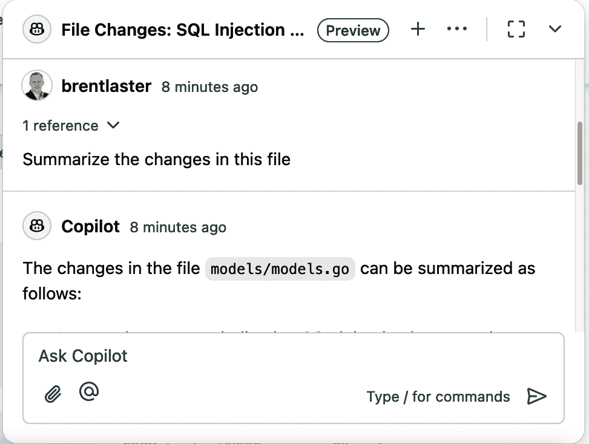

###### 图 9-25\. 从 Ask Copilot 的上下文中查看文件更改

在这样的文件差异中，还有一个第三个、有时隐藏的 Copilot 访问链接。如果你在所选差异的起始附近向上滚动，你会看到一个带有下拉箭头的浮动的 Copilot 图标。点击此图标会给你两个选项，解释和将当前线程附加（图 9-26）。


###### 图 9-26\. 差异的其他 Copilot 选项

解释选项与之前我们看到的 Copilot 的解释功能类似。将当前线程附加选项允许我们将这个特定的差异设置为 Copilot 聊天的上下文。例如，如果我们选择将当前线程附加到图 9-26 中显示的差异（#ch8-additional-copilot-op），那么当我们下次打开 Copilot 的聊天对话框时，我们可以看到它引用的是从第 33 行开始的单个更改作为上下文，而不是整个文件（图 9-27）。


###### 图 9-27\. 特定差异的上下文

值得注意的是，我们可以在差异窗口右上角点击“对话选项”（显示为三个点）来访问一些 Copilot 功能（图 9-28）。

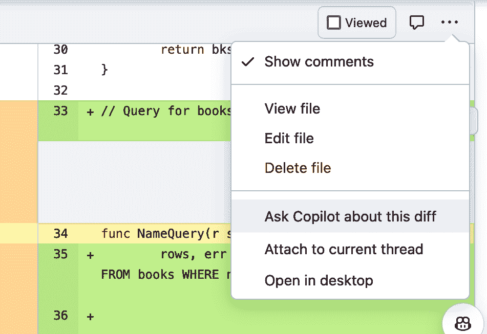

###### 图 9-28\. 从对话选项菜单（显示为三个点）访问 Copilot

这两个选项都将文件添加到聊天上下文中，就像 Ask Copilot 按钮一样。

在本章的最后，让我们看看 Copilot 如何协助另一个常见的 GitHub 编码辅助工具：GitHub 问题。

# 使用 Copilot 与 GitHub 问题

Copilot 内置了总结 GitHub 问题的功能。它是通过使用工具（如 GitHub 自己的 API）来解析问题的内容来实现的。这包括问题的正文、标题、评论，甚至链接的拉取请求（如果有的话）。目标是创建一个概述，总结你需要了解的主要观点。根据问题中可用信息的程度，摘要通常包括主要问题、受影响的组件、功能应该是什么，以及可能的修复方案。

这些摘要提供了以下好处：

节省时间

允许你快速理解问题的核心要点，而无需花费大量时间处理长篇讨论

更好的沟通

提供清晰的摘要，与相关任务或更新在所有级别上相匹配

高效的分级

允许根据严重性和影响清晰度以及通过摘要显示的修复复杂度更好地对 GitHub 问题进行优先排序

# 审查准确性

就像任何来自 AI 的输出一样，最终确保摘要信息准确的责任仍然在用户。Copilot 的问题摘要可能会遗漏一些细微之处和/或可能重要的细节。

让我们处理与上一节中使用的数据库查询安全问题相关的问题。我们可以打开 GitHub Copilot 聊天屏幕，提供提示以获取信息或帮助解决问题。图 9-29 展示了提示 Copilot“总结此问题”的示例。


###### 图 9-29\. 请求 Copilot 总结问题

我们可以要求更多细节，询问主要观点，甚至让 Copilot 建议下一步行动。图 9-30 展示了请求 Copilot 为“为此问题建议下一步行动”的示例。


###### 图 9-30\. 请求 Copilot 为问题提出下一步行动

由于生成式 AI 不是确定性的，响应的质量在细节方面可能会有显著差异。在某些情况下，你可能得到更一般的指令，而在其他情况下则得到更详细的指令。

# 结论

在本章中，我们介绍了 Copilot 与 GitHub 网页界面之间的各种集成点。通过这种直接集成，Copilot 的实用性得到了极大的扩展，并且在工作与仓库以及 GitHub 的常见机制（如问题和拉取请求）时可以轻松使用。

与 GitHub 的集成主要通过 Copilot 的聊天界面完成。GitHub 仓库有多个地方可以调用聊天对话框，并通过自然语言与 Copilot 进行对话。如果你正在处理一个问题、拉取请求或修复，并启动一个新的 Copilot 聊天会话，Copilot 可以识别这一点作为上下文，并提供相关问题作为起点。

对于针对一个或多个文件的具体响应，你可以在聊天中添加文件作为上下文。在查看拉取请求代码差异中的更改时，你还可以添加单个文件，甚至告诉 Copilot 在生成响应时仅参考具有特定修复的部分文件。

Copilot 还可以将拉取请求中做出的更改总结为一组整体评论。这些总结评论将包括指向特定更改的链接，并允许你减少创建拉取请求的工作。它还可以根据 GitHub 问题帮助总结和回答问题。

最后，值得注意的是，Copilot 可以作为审阅者添加并参与拉取请求。作为自动审阅者，Copilot 可以在拉取请求的主体中提供反馈和建议，就像人类审阅者一样。

在下一章中，我们将探讨如何通过创建 Copilot 扩展来扩展 Copilot 的功能并将其与其他工具集成。
