# 第十章：扩展 Copilot 的功能

GitHub Copilot 是一个非常有用的工具。通过与其他工具的集成来扩展其功能，可以使它更加有用。这包括您可以编写的工具。执行此操作的机制被称为 *扩展*。

Copilot 扩展通过针对特定用例或环境定制，增强了 GitHub Copilot 的功能。例如，扩展可以通过聊天界面将自定义或第三方应用程序与 Copilot 集成。例如，您可以安装一个 [Copilot Docker 扩展](https://oreil.ly/QS54S)，然后通过聊天提出问题，如“@Docker，我该如何容器化这个项目？”

在本章中，我们将探讨 GitHub Copilot 的扩展是什么，以及如何从市场找到并使用公共扩展。然后，我们将深入了解各种类型、它们的工作原理以及它们的优缺点。我们还将介绍一些简单但实用的实现示例。但在我们讨论这些主题之前，我们需要澄清一些可能令人困惑的术语。

# Copilot 扩展与 VS Code 的 Copilot 扩展对比

Copilot 功能的扩展可以针对两种不同的目标实现。它们可以设计为在任何支持 Copilot Chat 的平台上工作（IDE、GitHub.com 等），独立于平台。或者，它们可以针对 VS Code，利用其底层功能，仅在平台上运行（或如果移植到其他 IDE）。

在本章中，当我们提到通过 VS Code 实现的扩展时，我们将使用术语 *VS Code 的 Copilot 扩展* 或 *聊天参与者*。对于 *原生* 的 Copilot 扩展（设计为独立于平台），我们将使用更简短的术语 *Copilot 扩展*。

在这两种情况下，扩展的功能都是通过 Copilot 的聊天界面呈现的。VS Code 的 Copilot 扩展只是简单地利用其功能进行托管和执行。Copilot 扩展需要配置一个单独的 GitHub App，以便在聊天界面和后端代码之间建立桥梁。

我们将在本章后面讨论这两种类型扩展的实现和配置细节。这包括有关 GitHub Apps 是什么以及它们如何与 Copilot 扩展一起使用的相关信息。但首先，让我们更深入地了解 Copilot 扩展是什么。

# 基于服务器和基于客户端的扩展

有助于将 Copilot 扩展视为 *基于服务器* 的，因为它们需要与运行在 GitHub 端的应用程序通信才能工作（尽管这不是官方描述）。同样，VS Code 的 Copilot 扩展可以被视为 *基于客户端* 的，因为它们利用安装在其上的 VS Code 客户端的 API 来工作。

# 什么是 Copilot 扩展？

Copilot 有一个 API 框架和底层能力，这些能力构成了其用户界面的功能。这个框架可以被第三方和用户用来扩展 Copilot 的功能。这个框架允许其他应用通过 Copilot Chat 直接向用户提供服务。作为用户，您能够调用并与其他工具进行对话，就像您与开箱即用的 Copilot AI 交互一样。

扩展有多种用途，如 Copilot 的[文档](https://oreil.ly/B7yAU)中所述。它们包括以下内容：

查询文档

允许 Copilot Chat 查询第三方文档服务以查找有关特定主题的信息。

AI 辅助编码

使用第三方 AI 模型提供代码建议。

数据检索

一个 Copilot 扩展可以使 Copilot Chat 查询第三方数据服务以获取特定主题的信息。

执行操作

允许 Copilot Chat 执行特定操作，例如在论坛上发布或更新外部系统中的跟踪项。

将使用 Copilot 扩展视为给 Copilot Chat 增加对另一个应用或数据集的了解，并添加您可以在需要时调用的专业技能。

Copilot 扩展旨在提供跨平台兼容性、应用管理和支持。它们在聊天可以工作的任何地方工作。它们可以是私有的、公共的，并且可以共享，如果需要，可以在 GitHub Marketplace 上列出。实际上，市场是了解扩展和可用公共扩展的好地方。

# 从市场获取 Copilot 扩展

您可以编写自己的扩展（您将在本章后面看到），组织或公司可以创建*私有*扩展。此外，第三方公司和组织提供的*公共*扩展也已可用。要查看这些扩展，请访问[GitHub Marketplace](https://github.com/marketplace)，并在左侧列中选择 Copilot。图 10-1 显示了市场中的 Copilot 扩展主屏幕。


###### 图 10-1. 市场上的 Copilot 扩展

从这里，我们将选择 PerplexityAI 扩展。这个扩展允许通过实时网络搜索收集响应。点击市场中的链接将打开扩展的详细信息页面，其中包含有关扩展是什么以及它能做什么的信息（图 10-2）。

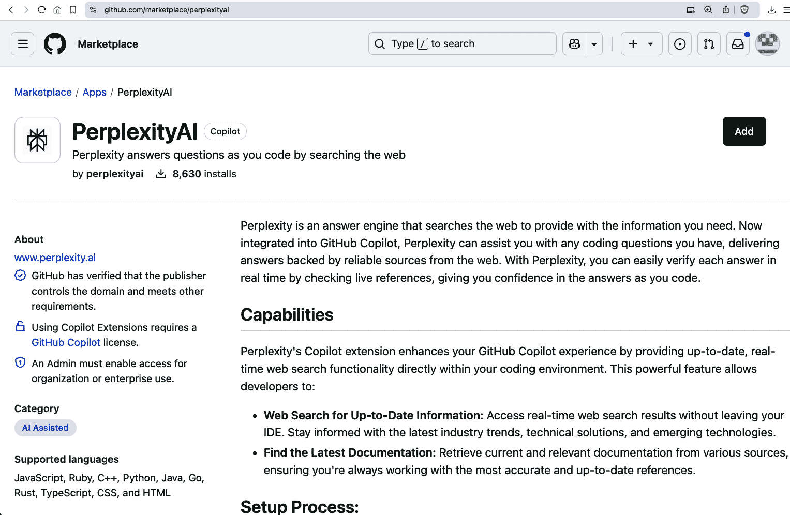

###### 图 10-2. 扩展主页面

点击右上角的“添加”按钮或滚动到页面底部，您将进入可以安装扩展的部分（图 10-3）。这个是免费的。

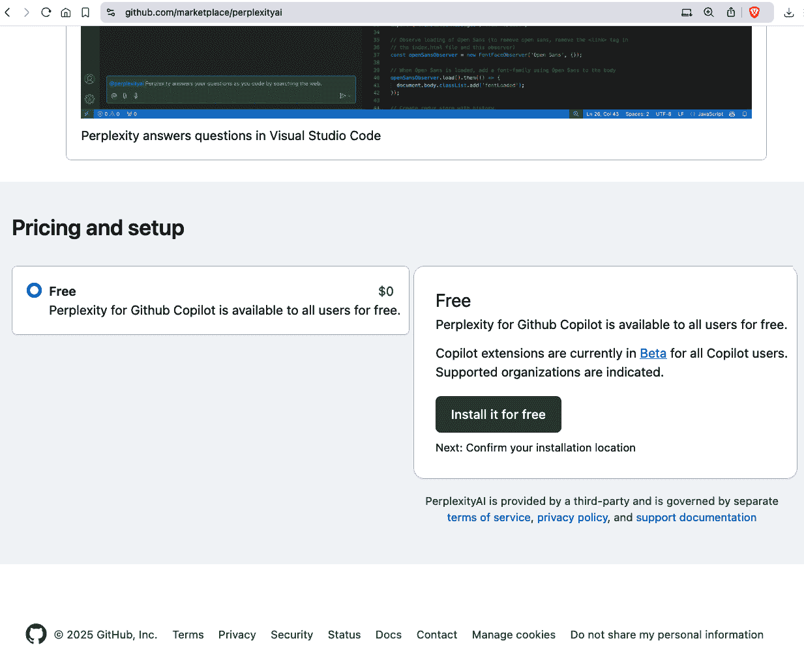

###### 图 10-3. 扩展安装页面

一些扩展可能需要您选择将有权使用该扩展的用户或组织。如果您选择安装 Docker 扩展（图 10-4），您可以看到一个示例。在 PerplexityAI 扩展的情况下，其功能是通用搜索，因此它可以用于安装它的用户关联的所有仓库。


###### 图 10-4. 选择用户或组织安装 Docker 扩展

大多数 Copilot 扩展通过使用**GitHub App**来获取对仓库和您的账户的访问权限。这些是在您的 GitHub 账户中安装和授权的后端应用程序，用于与您的仓库一起工作。对于使用应用程序的 Copilot 扩展，该应用程序充当聊天界面和实现扩展功能的代码之间的桥梁。应用程序在 Copilot 和扩展操作之间提供访问和控制层。

您可以在为扩展完成初始安装后查看应用程序集成。您将被要求通过 GitHub 进行身份验证来授权相关的 GitHub 应用程序。授权后，您将被带到已安装应用程序的配置页面，如图 10-5 所示 PerplexityAI 的 GitHub App 配置。


###### 图 10-5. PerplexityAI 的 GitHub App 配置

在此页面上，您可以选择应用程序的特定权限和/或应用程序可以访问的特定仓库。对于 PerplexityAI 扩展的应用程序，它仅适用于所有仓库，并且没有特定的权限要求，所以我们一切就绪。您也可以从该页面暂停或卸载应用程序。

# 更改应用程序配置

如果您以后需要更改应用程序的配置设置并且已登录，您可以前往[设置中的应用程序部分](https://oreil.ly/WOBZf)来修改已安装应用程序的配置。

在完成安装和授权步骤后，启动或重启任何 GitHub Copilot 活跃的应用实例。然后，在聊天界面中输入**`@`**符号和扩展名来开始使用新安装的扩展，如图 10-6 所示调用 PerplexityAI。

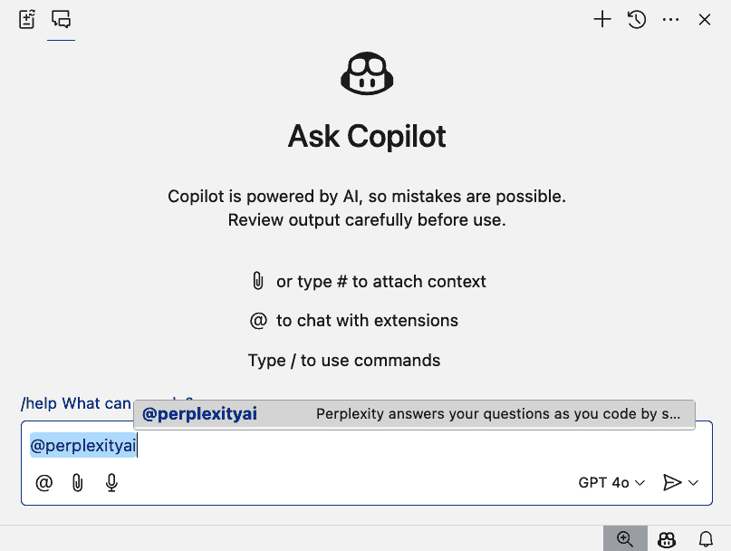

###### 图 10-6. 在聊天中调用 PerplexityAI 应用程序

第一次通过应用程序重启后尝试使用新扩展时，您可能需要授权它——无论是为所选工作区还是为所有工作区（图 10-7）。


###### 图 10-7. 工作空间的授权

这是以类似初始授权的方式进行。一旦授权完成，您可以再次提出提示，并且应该能够得到响应（图 10-8）。


###### 图 10-8. 授权后的 PerplexityAI 响应

公共 Copilot 扩展的数量正在定期增长。如果它们符合您需要的应用程序或用途，它们可以是一个有用的选项。但如果您需要尚未提供的功能，或者需要与您的数据或流程更直接地集成，您可能需要考虑开发和使用自己的 Copilot 扩展。为了了解这个选项，让我们首先谈谈 Copilot 扩展可能存在的两种 *实现* 类型。

# 理解 Copilot 扩展实现类型

Copilot 扩展可以以两种类型之一实现：

代理

作为代理实现的扩展充当一个完整的 AI 助手。这意味着它可以处理复杂的聊天对话，执行自定义代码，并返回非常定制的响应。

技能集

作为技能集实现的扩展可以在幕后调用一个或多个 API 端点以检索特定信息或执行基本操作。

您将在本章后面看到如何构建每种实现类型的示例。但就目前而言，让我们先了解一下每种类型的优势和劣势。

代理是 Copilot 扩展的原始类型，如果您需要复杂或定制的处理和集成，它可以提供最广泛的功能。它们提供了完全的控制，但实现起来可能比较复杂。

技能集使得调用其他 API 或执行基本操作变得容易。它们实现起来更简单，但在能做什么以及提供多少控制方面更为有限。

表 10-1 比较了两种实现选择。

表 10-1\. Copilot 扩展类型的比较

| 属性 | Copilot 代理 | Copilot 技能集 |
| --- | --- | --- |
| 复杂性 | 需要更多的开发工作来管理整个用户交互流程、响应生成和响应生成 | 设计用于易于集成，设置最少 |
| 控制 | 提供对请求处理和响应生成的完全控制 | 对用户交互的控制有限，重点在于数据检索和基本操作 |
| 用例 | 适用于需要实现自定义逻辑、与其他 AI 模型集成和管理对话上下文的复杂场景 | 用于从外部 API 获取数据或执行简单操作等直接任务 |
| 可用接口 | 所有（GitHub，IDEs） | 所有（GitHub，IDEs） |
| 支持 | GitHub | GitHub |

现在您已经了解了这些类型，我们可以看看实现。这个过程的第一步是确保您在组装 Copilot 扩展时对一些构建块有清晰的认识。

# 组装扩展的构建块

*构建块* 是需要组装的组件，以便扩展可以被访问和运行。在核心上，这些是我们与 Copilot 扩展一起工作时需要的部分：

+   一个具有特定端点的 GitHub 应用，该端点处理扩展与 Copilot Chat 之间的交互。

+   一个能够托管后端并使端点可用的服务器进程。

+   提供扩展功能的后端实现。此功能可能涉及对 LLM 的调用以及与外部工具、服务或 API 的集成。

图 10-9 展示了我们构建扩展将使用的构建块概述。


###### 图 10-9\. 我们构建块概述

虽然 GitHub 应用和端点服务器对于代理和技能集扩展是必需的，但这些结构并不局限于扩展。接下来，我们将进一步说明这些结构如何用于启用扩展。

## GitHub Apps

*GitHub 应用* 是一个与 GitHub 集成的工具，可以扩展 GitHub 的功能。它可以以多种方式做到这一点：

+   自动化任务

+   与 API 和 webhooks 集成

+   自定义 GitHub 工作流程

一旦创建、安装和注册，GitHub 应用可以独立于用户，作为授权进程执行前面列表中描述的操作类型。这些步骤包括注册应用程序（包括任何需要的手动配置），编写任何需要的功能代码，然后通过 webhook、回调 URL 等设置其运行。应用程序还充当获取访问资源授权的网关。

# 回调 URL

在 GitHub Copilot 扩展的上下文中，*回调 URL* 是你的自定义 Copilot 扩展提供给 GitHub 的 URL。该 URL 作为系统在通过你的扩展成功认证后用户将被重定向的目的地。一旦授权完成，它就像一个 *回信地址*。

之前讨论的 PerplexityAI 扩展的应用程序是一个很好的例子。安装扩展后，转到你的 GitHub 个人资料，然后从左侧菜单中，在集成下选择应用程序。你将看到该扩展已安装的应用程序(图 10-10)。


###### 图 10-10\. 通过扩展安装的 PerplexityAI 应用

# 安装应用程序的链接

如果你已登录 GitHub，你还可以通过[安装页面](https://oreil.ly/WOBZf)访问已安装应用程序的列表。

对于公开或在你组织或企业中可用的现有 GitHub 扩展，应用程序作为扩展安装和授权过程的一部分自动安装和配置。对于你实现的扩展，你需要创建和配置一个新的应用程序作为整体过程的一部分。我们将在本章后面更详细地介绍创建和配置步骤。

接下来，让我们谈谈扩展工作方式的重要部分之一：端点服务器。

## 端点服务器

简而言之，代理或技能集 Copilot 扩展可以被视为一个连接到端点的应用程序，该端点处理扩展与 Copilot Chat 之间的交互。*端点*是处理聊天输入的 API，进行一些处理，然后将输出流回聊天。因此，端点的可用性是流程的关键要求。

对于您从市场或企业/组织站点安装的扩展，服务器已经设置并配置好了。如果您正在创建自己的扩展，您需要将其托管在公开可访问的服务器上（例如，通过在云服务上部署或隧道传输）。例如，您可以使用像[Cloudflare](https://oreil.ly/m1eVi)或[ngrok](https://ngrok.com)这样的简单服务来公开开发测试的 URL。

这两种服务都需要注册并登录才能使用。如果您正在使用 VS Code 或 GitHub Codespace 进行开发和测试，另一个选项是公开端口并启用[端口转发](https://oreil.ly/jgyG3)。这种方法是免费的，并且适合在将扩展公开之前将其转换为正式位置时使用。如果使用这种方法，需要记住的关键事项是必须将端口的可见性从默认的`private`更改为`public`。

虽然应用程序和端点提供了一种与聊天界面交换信息的方式，但实际的工作是在实现端点的后端代码中完成的。本章的其余部分致力于查看和理解如何进行这些实现，从创建一个作为代理的扩展开始。

# 将扩展作为代理实现

Copilot 代理是嵌入在 Copilot 扩展中的自定义工具。通过允许您将自定义功能构建并集成到 Copilot Chat 界面中，代理增强了 Copilot 的功能。

# Copilot 代理模式

在第四章中，我们讨论了 Copilot 的内置*代理模式*，它允许它自主地创建代码和终端命令以实现目标。在本章中，我们再次讨论代理，但作为为扩展而构建的独立功能。

当您需要更多控制如何在聊天交互过程中处理请求或生成响应时，代理实现是合适的。代理可以实现自定义逻辑，与其他 LLM 和 Copilot API 集成，帮助提供聊天对话的上下文，并管理交互。但它们也更复杂，创建和维护起来也更困难。

## 执行基本实现

在本节中，您将了解如何实现一个基本但有用的基于代理的扩展 `@meta-files`。给定一个编程语言提示，我们的扩展将生成示例 *.gitignore* 和 *.gitattributes* 文件。或者，如果用户在提示中提供了开源许可证名称，扩展将生成开源许可证的示例。如果许可证有用户姓名和当前年份的占位符，扩展将尝试填充这些信息。最后，扩展还将提供有关何时使用此类许可证的指导。

使用该扩展的示例显示在图 10-11 和 10-12 中。用于调用扩展的提示显示在上右角：`@meta-files Python` 用于 图 10-11 和 `@meta-files MIT` 用于 图 10-12。代码基于 [Copilot 扩展](https://oreil.ly/pWQcX) 中的示例，可以在 [本书的 GitHub 仓库](https://oreil.ly/93ZY_) 中找到。

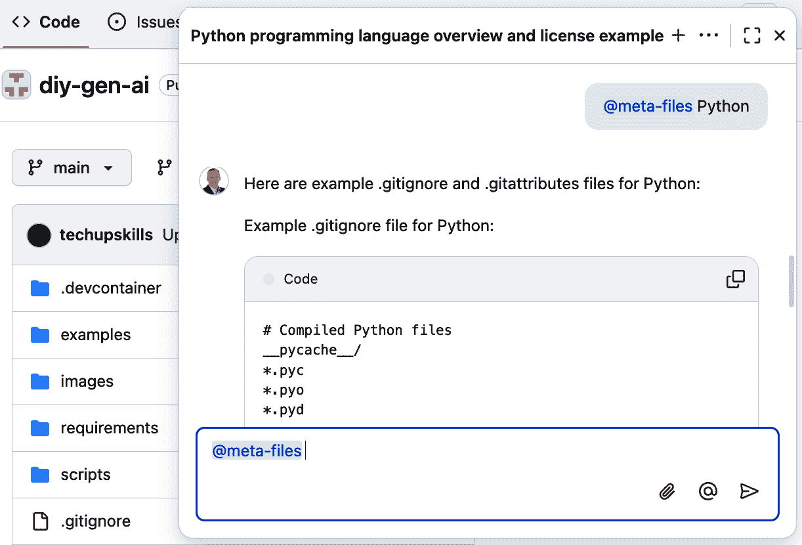

###### 图 10-11\. 为 Python 生成元文件的扩展


###### 图 10-12\. 为扩展生成许可证信息

图 10-13 从高层次展示了代理扩展的工作方式。在接下来的部分，我会详细介绍各个部分。


###### 图 10-13\. 代理扩展概述

为了简洁起见，我们不会在这里深入所有代码。我们只关注一些关键点。这个示例是用 JavaScript 编写的，但你的扩展可以用几乎任何现代语言编写。

这个简单的示例只关注两个标准的 JavaScript 文件：[*package.json*](https://oreil.ly/vowZU) 和 [*index.js*](https://oreil.ly/k16Kn)。让我们首先看看 *package.json* 的内容。内容如下：

```py
{
  "name": "metafiles-extension",
  "private": "true",
  "description": "Generate metafiles for a GitHub repository",
  "scripts": {
    "start": "node index.js",
    "dev": "node --watch index.js"
  },
  "type": "module",
  "dependencies": {
    "@octokit/core": "⁶.1.2",
    "express": "⁴.19.2"
  }
}
```

这个结构的文件是这种类型的标准样板。我们可以有多个其他字段，但我们保持示例简单。唯一需要额外解释的部分是依赖项。

[Express](https://expressjs.com) 是一个简单的前端 Web 应用程序框架。它旨在通过 Node.js 使构建 Web 应用程序和 API 变得容易。当我们创建代理扩展时，我们实际上是在创建一个通过 GitHub App 提供端点的 Web 应用程序。

我们使用的另一个依赖项是 [Octokit](https://github.com/octokit)，它是由 GitHub 提供的一组库，允许代码与其 REST 和 GraphQL API 交互。它简化了任务自动化和仓库管理，并允许你在代码中操作 GitHub 资源，如拉取请求和问题。我们在这里使用它来帮助获取和操作用户信息的令牌。

包含主要逻辑的文件是 *index.js*。如果你想查看整个代码，可以查看 [GitHub 中的文件](https://oreil.ly/GJW8z)。文件顶部的逻辑执行必要的导入，启动一个 Express 应用程序，发布一条欢迎消息，然后进入主要处理。

主要处理使用 Octokit 获取令牌，然后进入一个标准周期：

+   从聊天界面（通过 GitHub App）获取发送给我们的有效载荷

+   增强提示词以告诉 AI 我们在寻找什么

+   将提示发送到底层的 LLM 以获取 AI 的响应

+   将响应传递到聊天界面

机制相当简单。真正的魔法发生在我们增强提示词以告诉 AI 我们在寻找什么的地方。以下是这部分代码：

```py
  // Define the LLM's role and what it should look for and do

  const messages = payload.messages;

  messages.unshift({
    role: "system",
    content: "Search for a programming language name in the message
 from the user. If you find one, generate example .gitignore and 
.gitattributes files for that programming language",
  });

  messages.unshift({
    role: "system",
    content: "Search for an open source software license name, type,
 or abbreviation in the message from the user. If you find one,
 do the following: Provide a few key bullet points about the 
license and when it should/should not be used. Then generate an 
example LICENSE file for that license. If the example file contains
 the text [NAME] or [YOUR NAME], replace that text with " + 
user.data.name + ". If the LICENSE file contains the text [YEAR], 
replace [YEAR] with the current year.",
  })
```

我们在从聊天界面收到的提示词中添加内容，以告诉 LLM 我们想要它查找什么以及如何响应。这是使代理扩展工作的重要关键——向 LLM 提供详细的提示词，告诉它我们想要它注意什么以及我们需要的输出类型。把它想象成直接与 ChatGPT 这样的模型交互。我们能在提示词对话中提供越多的细节，我们就能从 AI 那里得到越好的响应。我们用于在代理代码中获得预期结果的逻辑实际上归结于构建一个良好的提示词。

# 构建一个良好的提示词

有许多资源可以指导你如何构建一个良好的提示词。最终，最好的提示词是那个能够按照你的意图解析出正确信息并返回有意义的响应的提示词。

解决这个问题的简单方法是通过 Copilot Chat 接口（或 AI 模型）直接尝试和改进你的提示词。一旦你找到一个有效的提示词，你就可以将其添加到你的扩展代码中。

使用这个基本设置，我们有了扩展所需的核心代码。运行此扩展所需的所有代码都是在非生产环境中创建的。将其推向生产将需要更多的实现。

为了帮助简化生产中的更大实现，GitHub 提供了一个 SDK，该 SDK 实现了生产扩展所需的一些核心功能。在撰写本文时，该 SDK 仅是 alpha 版本，并且仅适用于作为代理实现的扩展。你可以在侧边栏中了解更多信息。

我们需要一个服务器和一个应用程序来完成实现。让我们看看这些是如何设置的。

## 为 Copilot 代理扩展配置 GitHub App

在这个例子中，我们利用 GitHub Codespace 来提供端点的运行环境和服务器。在生产环境中，你不会使用 codespace，但它极大地简化了我们的基本演示和测试场景。如果你更喜欢，你也可以使用 ngrok 这样的服务。

从 GitHub 仓库创建 codespace 的步骤在[文档](https://oreil.ly/DCh4K)中有概述。一旦 codespace 启动，您只需要两个命令就可以启动服务器：

```py
npm install
npm start

```

# Node 应用和 npm

这里提供的代码是一个[node 应用](https://nodejs.org/en/about)，而[npm](https://npmjs.com)是用于运行它的 node 工具。

到目前为止，您将在端口 3000 上从 codespace 运行一个服务器。在为扩展配置 GitHub 应用之前，您需要采取两个步骤。首先，您需要将端点服务的端口设置为*公开*而不是*私有*。为此，切换到 codespace 中的端口选项卡，在列表中右键单击端口，并将其端口可见性设置更改为公共，如图图 10-14 所示。

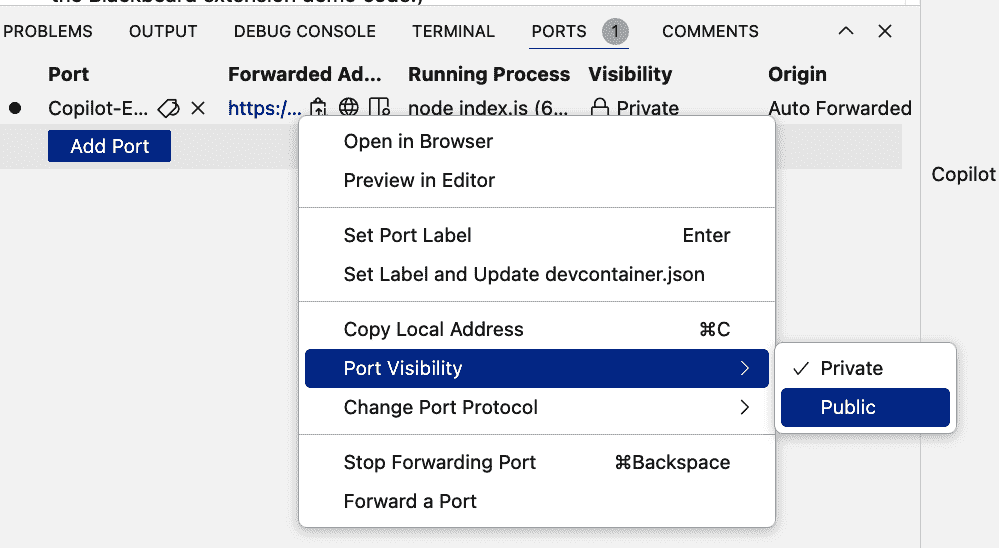

###### 图 10-14. 将端口改为公开

然后从同一位置复制服务器地址(图 10-15)。

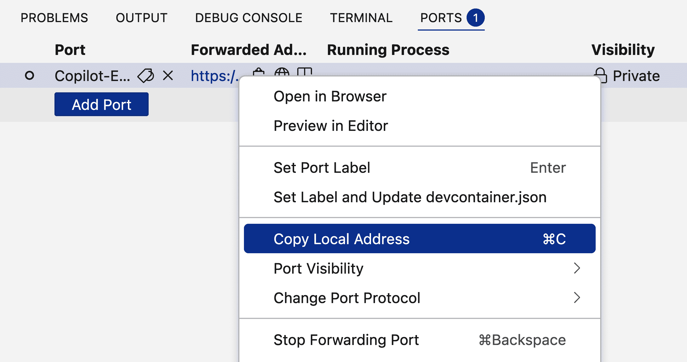

###### 图 10-15. 复制端口号

# 背后情况

如果您想了解更多关于 codespace 的配置和服务器启动方式，选择的端口等信息，请查看 GitHub 仓库中的文件[*.devcontainer/devcontainer.json*](https://oreil.ly/E9daL)和[*.vscode/launch.json*](https://oreil.ly/HTlM8)。

在实现了扩展代理的代码并启动服务器后，我们现在可以通过创建和配置相应的 GitHub 应用来完成扩展本身的实现。

# 仅限开发和测试使用

在本章的示例中，我们创建代码、设置简单服务器和实现用于演示的用户特定代理。要将这些示例转换为生产就绪实例，您需要添加安全、托管等功能。

要设置应用，请使用与运行 codespace 相同的 ID 登录 GitHub。然后转到您的开发者设置并创建一个新的应用。此快捷链接为[*https://github.com/settings/apps/new*](https://github.com/settings/apps/new)。

接下来，填写所需的字段。应用名称应该是唯一的名称。这是您将在 Copilot Chat 界面中用来调用您的扩展的名称。例如，如果您选择*my-app*作为名称，您将在聊天界面中使用`@my-app`来调用您的扩展。

对于主页 URL 字段，如果您有一个关于您的应用/扩展的网页，您可以提供一个指向该网页的 URL。如果没有，您可以直接输入您的扩展 GitHub 仓库的链接，甚至只需[*https://github.com*](https://github.com)。

回调 URL 字段是您放置在 codespace 中设置为公开的端口号的公开 URL 地址的地方。为了使您的扩展能够发送和接收其代码的响应，这一点必须到位。您还应在 URL 末尾添加`/callback`。

对于我们在这里使用的示例，我们可以禁用此页面上选定的任何其他选项，例如 *Webhooks*。接下来是应用程序的可见性设置。你可以使其仅对开发测试目的可访问。稍后，当你准备好分享时，你可以启用公共访问。图 10-16 展示了一个带有完成字段的示例页面。

当你完成此屏幕后，你可以点击创建 GitHub 应用程序以完成注册。

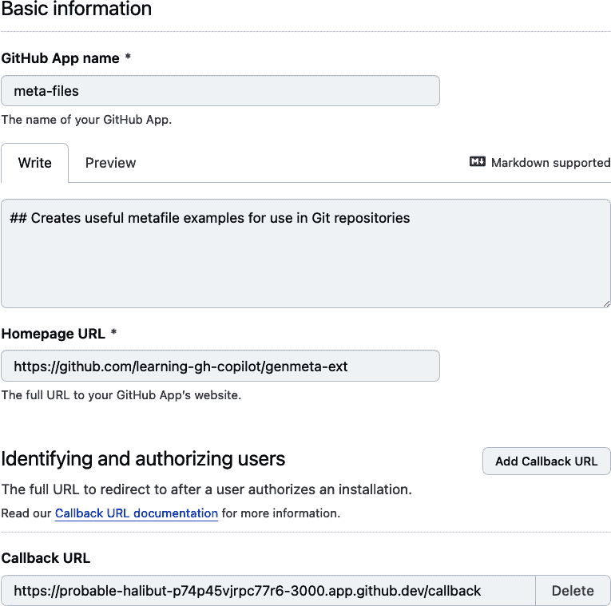

###### 图 10-16\. 初始代理扩展配置

在这一点上，你需要生成一个私钥，以便安装你的应用程序并签署访问令牌。GitHub 将提供链接以生成和下载密钥（图 10-17）。然后该密钥将自动添加到你的应用程序配置中。

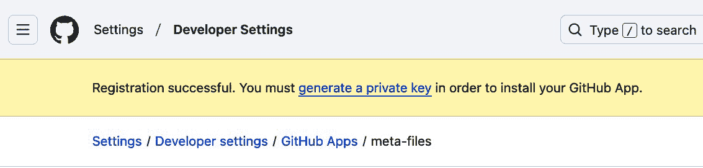

###### 图 10-17\. 生成私钥以安装应用程序

一旦你在“常规”页面创建了应用程序，你需要通过左侧的选择进行一些额外的配置。在“权限和事件”页面，你必须为开发/测试目的在“账户权限”部分设置一个选项。给 Copilot Chat 读取权限（图 10-18）。然后保存这些更改。

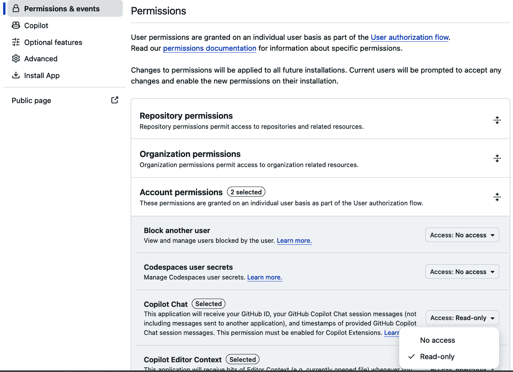

###### 图 10-18\. 为 Copilot Chat 添加权限

在 Copilot 特定设置页面，将应用程序类型从禁用更改为代理（因为我们正在将我们的扩展作为代理实现）。然后，在 URL 部分，粘贴你的 codespace 的公共 URL。

最后在此页面上，在“推理描述”字段中添加内容。这些信息用于向用户提供有关代理的简要描述，以帮助用户了解扩展的目的。当用户在聊天区域的扩展 slug 上悬停时，会显示这些内容。完成此操作后，你可以保存你的更改。图 10-19 展示了完成的页面。

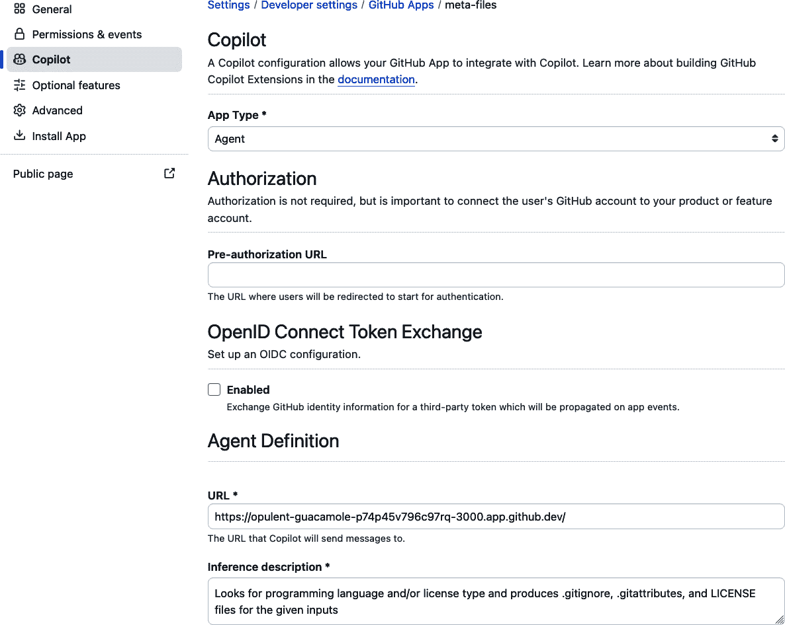

###### 图 10-19\. 应用程序的 Copilot 设置

这些是你需要设置的所有字段，以便应用程序与你的代理一起工作。可选功能页面仅允许你选择退出令牌过期，而高级页面处理有关转让应用程序所有权、删除应用程序或使其公开的“危险区域”类型选项。

完成前面的步骤后，你可以在个人或组织账户中安装应用程序进行测试。为此，请点击“安装应用程序”页面并按照说明操作。

第一次尝试使用扩展时，你需要授权访问以便继续使用（图 10-20）。


###### 图 10-20\. 首次使用时连接应用程序

点击连接按钮后，你需要授权应用程序访问相关资源（图 10-21）。

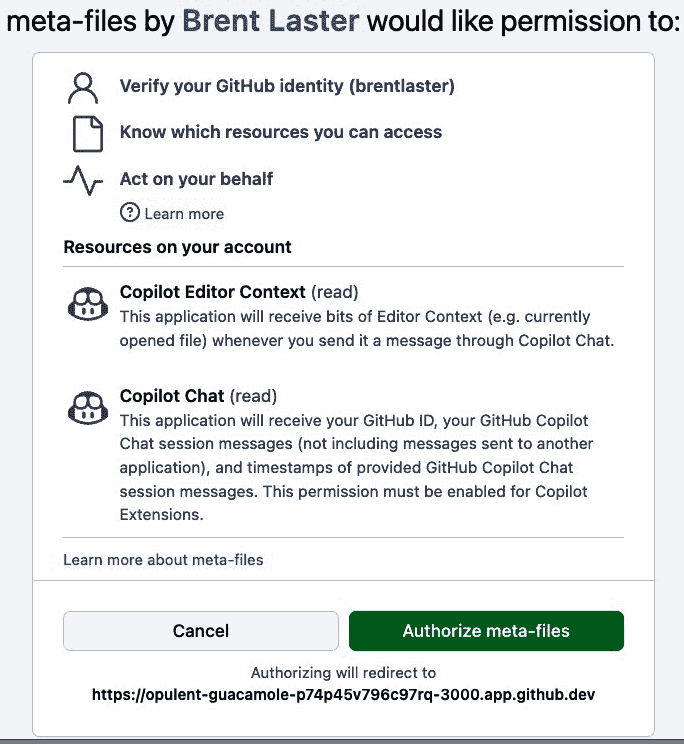

###### 图 10-21\. 授权应用程序

一旦应用被授权，你就可以像之前展示的那样使用扩展。

创建扩展的另一种方法是利用*技能集*模式。这种实现选择非常适合让 Copilot 轻松获取实时目标信息或执行简单的 API 处理。虽然它可能是一个更简单的编码实现，但它确实需要更复杂的应用程序配置。我们将在下一节中探讨通过技能集实现的扩展。

# 通过技能集实现扩展

虽然代理为实施 Copilot 扩展提供了一个强大且灵活的架构，但可能有些过度。如果你在响应聊天提示时只需要调用特定工具或调用 API，你可以通过使用技能集来实现你的扩展。

Copilot 中的单个*技能*是模型在响应提示时调用来执行特定任务的工具——例如，调用外部 API。最多五个技能的集合称为*技能集*。这些技能集允许将外部服务或自定义 API 端点集成到 Copilot 工作流程中，而不需要代理的复杂性。

技能集比代理更轻量级、更简单。当你需要执行简单的、特定的任务且不需要大量设置时，它们是一个更好的架构选择。它们可以自动处理诸如路由、提示制作、函数评估和响应生成等任务。

图 10-22 从高层次展示了技能集扩展的工作方式。在接下来的章节中，我将更多地讨论各个部分。

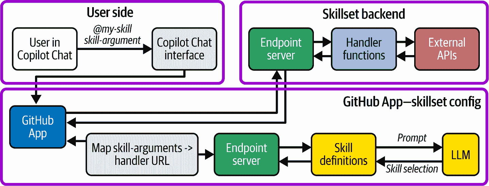

###### 图 10-22\. 技能集扩展概述

## 执行基本实现

作为本书的示例，我创建了一个简单的 Copilot 扩展，使用技能集实现，允许你为 Go 版本执行三个基本操作：

+   查找 Go 的最新版本

+   查找当前支持的 Go 版本

+   确定给定的 Go 版本是否受支持或它何时达到其生命周期的结束（EOL）

此示例的代码位于[书籍的 GitHub 仓库](https://oreil.ly/n13JY)。为了展示在不同语言中实现扩展的示例，`gover-ext`扩展的代码是用 Go 编写的。它是基于 Copilot [技能集扩展示例](https://oreil.ly/WWZxW)构建的。

一个[*main.go 文件*](https://oreil.ly/8dk9j) *注册*与扩展每个功能相关的特定 URL 模式的处理器函数。核心逻辑如下所示：

```py
func main() {
    if err := run(); err != nil {
        fmt.Println(err)
        os.Exit(1)
    }
}

func run() error {
    http.HandleFunc("/latest-version-go", handlers.LatestVersionGo)
    http.HandleFunc("/supported-versions-go", 
handlers.SupportedVersionsGo)
    http.HandleFunc("/is-supported-or-eol", 
handlers.IsSupportedOrEOL)
    http.HandleFunc("/_ping", func(w http.ResponseWriter, 
r *http.Request) {
        w.Write([]byte("OK"))
    })

    http.ListenAndServe(":8080", nil)
    return nil
}

```

对于每个处理器，我们实现了一个单独的函数，该函数调用 API，检查错误，并返回所需的结果。例如，在获取最新版本的处理器——[LatestVersionGo](https://oreil.ly/TxXMz)——中，代码的关键部分实现如下。

首先，我们实现一个结构来保存版本，并调用 Go 网站 API 以获取最新版本：

```py
type GoVersion struct {
    Version string `json:"version"`
}

func LatestVersionGo(w http.ResponseWriter, r *http.Request) {
    fmt.Println("Latest Go Version Called")
    req, err := http.NewRequestWithContext(r.Context(), 
http.MethodGet, "https://go.dev/dl/?mode=json", nil)
    if err != nil {
        http.Error(w, "Failed to create request", 
http.StatusInternalServerError)
        return
    }

```

在进行一些错误检查以确保调用成功之后，我们将响应缓冲并解析它以获取最新版本，然后将该版本写回流中：

```py
// Buffer the response body for decoding
    var bodyBuffer bytes.Buffer
    tee := io.TeeReader(resp.Body, &bodyBuffer)

    // Drain the tee to ensure we can parse the body later
    if _, err := io.Copy(io.Discard, tee); err != nil {
        http.Error(w, "Failed to process response body", 
http.StatusInternalServerError)
        return
    }

    // Parse the JSON response
    var versions []GoVersion
    if err := json.NewDecoder(&bodyBuffer).Decode(&versions); 
err != nil {
        http.Error(w, "Failed to parse JSON response", 
http.StatusInternalServerError)
        fmt.Printf("Failed to decode JSON: %v\n", err)
        return
    }

    // The latest version is the first item in the array
    if len(versions) > 0 {
        trimmedVersion := strings.TrimPrefix(versions[0].Version, 
"go")
        fmt.Fprintf(w, "%s", trimmedVersion) // Write the version 
to the HTTP response
        return
    }

```

支持版本查询的处理程序使用类似的方法。有一个结构来存储数据，并调用不同的 API 来获取原始信息：

```py
type VersionInfo struct {
    Cycle       string      `json:"cycle"`
    ReleaseDate string      `json:"releaseDate"`
    EOL         interface{} `json:"eol"`
}

func SupportedVersionsGo(w http.ResponseWriter, r *http.Request) {
    fmt.Println("Supported Go Versions Called")
    req, err := http.NewRequestWithContext(r.Context(), 
http.MethodGet, "https://endoflife.date/api/go.json", nil)
    if err != nil {
        http.Error(w, "Failed to create request", 
http.StatusInternalServerError)
        return
    }

```

然后在一些错误检查以确保调用成功之后，并缓冲响应，结果被解析并转换成一个字符串，然后写回流中：

```py
// Parse the JSON into a slice of VersionInfo
    var versions []VersionInfo
    if err := json.NewDecoder(&bodyBuffer).Decode(&versions); 
err != nil {
        http.Error(w, "Failed to parse JSON response", 
http.StatusInternalServerError)
        fmt.Printf("Failed to decode JSON: %v\n", err)
        return
    }

    // Filter versions with eol == false and collect the results
    result := make([]struct {
        Cycle       string `json:"cycle"`
        ReleaseDate string `json:"releaseDate"`
    }, 0)

    for _, v := range versions {
        // Check if EOL is a boolean and is false
        if eolBool, ok := v.EOL.(bool); ok && !eolBool {
            result = append(result, struct {
                Cycle       string `json:"cycle"`
                ReleaseDate string `json:"releaseDate"`
            }{
                Cycle:       v.Cycle,
                ReleaseDate: v.ReleaseDate,
            })
        }
    }

    // Convert the result to a single string
    var builder strings.Builder
    for _, r := range result {
        builder.WriteString(fmt.Sprintf("Version: %s, Release Date:
 %s\n", r.Cycle, r.ReleaseDate))
    }

    // The versions are all in one string now
    if len(builder.String()) > 0 {
        fmt.Fprintf(w, "%s", builder.String()) // Write the list of 
supported versions to the HTTP response
        return
    }

```

确定版本是否受支持或已达到 EOL 的其它函数流程与此类似。

由于编码相当基础，没有提及 AI 或推理，你可能想知道 Copilot Chat 中的提示是如何最终调用相应的处理程序的。秘密在于当你创建使用技能集的扩展时 GitHub 应用的配置。

## 使用技能集配置 GitHub 应用以用于 Copilot 扩展

类似于作为代理实现的扩展，作为技能集实现的扩展需要 GitHub 应用作为 Copilot 聊天界面和底层扩展实现之间的桥梁。大部分的设置与为代理所做的设置类似，但在这里我们将介绍一些显著的不同之处。（对于应用设置和配置的任何其他细节，你可以参考“为 Copilot 代理扩展配置 GitHub 应用”。）

第一个区别是，在“通用”页面，你不需要输入特定扩展的回调 URL。你将需要一个用于身份验证的回调 URL，但它可以是一个简单的 URL，例如[*https://github.com*](https://github.com)。

配置应用的其它更改，其中最重要的更改是在“Copilot”页面进行的。在这个页面上，你需要将“应用类型”字段设置为“Skillset”。这样做将会弹出一个名为“技能定义”的部分（图 10-23）。


###### 图 10-23. 设置技能集应用的 Copilot 页面

“技能定义”部分是聊天提示与代码中的处理程序之间的映射发生的地方。对于我们在代码中处理的每个技能，我们需要通过添加新技能的过程。我们将以一个为例进行查看。其它技能遵循相同的模式。

当你点击“添加新技能”按钮时，你会得到一个对话框，其中包含各种需要填写的字段，包括名称、推理描述、URL 和参数（图 10-24）。


###### 图 10-24. 应用新技能定义屏幕

在“名称”字段中，我们放入模型将使用的技能名称，当它被调用时，这个名称会显示给用户。

在“推理描述”字段中，我们向模型解释*何时/如何/为什么*应该调用这个技能。这个描述应该足够有意义，以便模型能够理解意图。

将其视为如果您想让模型执行此技能，您可能提供给模型的直接提示。虽然我们在这里使用了一个简单的提示，但根据您的技能做什么以及它的复杂程度，您可能需要定义额外的细节。示例可能包括预期的输入和输出，特别是如果其他技能集非常相似的话。图 10-25 展示了一个包括与我们所使用的技能匹配的推理描述的示例定义。

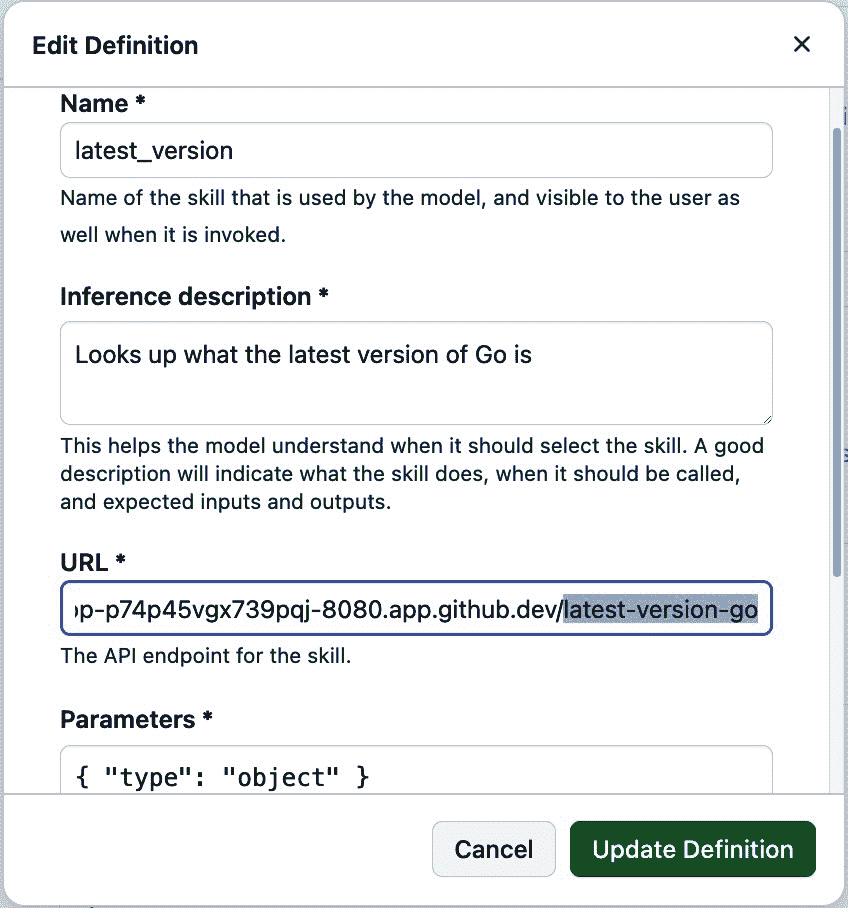

###### 图 10-25\. 应用程序中的技能定义

根据聊天中的提示以及模型如何与推理描述相匹配，该过程将调用 URL 字段中指定的端点。该字段是您放置端点服务器地址并指定扩展代码中路径的地方。在这种情况下，由于我们的扩展代码正在寻找 `latest-version-go` 以知道调用获取最新 Go 版本的处理器，我们可以在该字段中放置 API 端点，并在末尾添加 `latest-version-go`。

在生产环境中，我们将有一个指定的公共 URL，该 URL 将被引导到这里。但如果我们使用 ngrok、codespace 或类似的服务，我们将放置从这些应用程序提供的公共 URL，并在末尾附加 *latest-version-go*。对于 [ngrok](https://ngrok.com) 实例，整个 URL 可能看起来像这样：

```py
https://8fa7-2605-a601-a6ca-f00-1466-39cc-11f7-7f71.ngrok-free.app/
latest-version-go
```

# 本地主机 URL 和 ngrok

*ngrok* 允许您从公共互联网端点到您机器上本地运行的服务创建安全隧道。这个跨平台工具让您可以轻松地将本地 Web 服务器暴露给互联网进行测试和共享，而无需设置复杂的网络配置。

虽然您通常会从 localhost:8080 启动 ngrok 服务，但在技能配置中不能使用 localhost，因为它不是公开可达的。相反，您需要获取 ngrok 实际转发到 localhost:8080 的实际公共 URL。

如果我们使用的是 codespace，URL 可能看起来像这样：

```py
https://turbo-dollop-p74p45vgx739pqj-8080.app.github.dev/latest-
version-go
```

参数部分用于在 JSON 中定义技能的参数。由于我们每个技能集都是基于提示字符串来触发的，因此我们可以在该字段中简单地使用以下内容：

```py
{ "type": "object" }

```

一旦我们完成了实现并设置了应用程序并进行了配置，我们就可以以与代理相同的方式运行应用程序。图 10-26 展示了尝试扩展中各种技能的示例。注意正在使用的特定提示：“@go-versions supported versions” 和 “@go-versions 1.21”（如右图所示）。


###### 图 10-26\. 运行 `go-versions` 扩展

作为代理和技能集实现的扩展提供了最大的灵活性，它们可以在任何集成的聊天界面（GitHub、IDEs）中运行。现在我们已经涵盖了这些，是时候看看本章开头提到的将功能添加到 IDE 的其他替代方案——Copilot 的 VS Code 扩展了。

# 创建 VS Code 扩展用于 Copilot

与 Copilot 扩展一样，VS Code 扩展通过 Copilot Chat 为用户提供额外的功能。与 Copilot 扩展不同，VS Code 扩展是使用 VS Code 平台和 API 实现的。由于这种实现方法，VS Code 扩展可以访问广泛的 VS Code 功能，并且可以紧密集成。而且它们不需要单独的 GitHub App 即可使用。缺点是它们不能在其他非 IDE 客户端（如 GitHub 中的聊天界面）中使用。表 10-2 显示了之前比较表的更新版本，增加了一个用于 VS Code 扩展的 Copilot 的列。

表 10-2. Copilot 扩展类型的比较

| 属性 | Copilot 代理 | Copilot 技能集 | VS Code 的 Copilot 扩展 |
| --- | --- | --- | --- |
| 复杂性 | 需要更多的开发工作来管理整个用户交互流程的响应和响应生成 | 设计用于易于集成，设置最少 | 可以是复杂或简单，具体取决于使用的 VS Code API |
| 控制 | 提供对请求处理方式和响应生成的完全控制 | 对用户交互的控制有限，重点在于数据检索和基本操作 | 对于 VS Code 来说，控制力最强 |
| 用例 | 适用于需要实现自定义逻辑、与其他 AI 模型集成和管理对话上下文的复杂场景 | 简单任务，如从外部 API 获取数据或执行简单操作 | 用于在 IDE 中处理代码的任务，以及可选地为参与者提供额外的命令 |
| 可用的接口 | 所有（GitHub，IDEs） | 所有（GitHub，IDEs） | 仅限于 VS Code 以充分利用所有 VS Code API |
| 支持 | GitHub | GitHub | VS Code 团队 |

最终，当我们为 Copilot 添加 VS Code 扩展时，用户看到的是一个新的聊天参与者。

在使用 IDE 中的 Copilot Chat 工作时，*聊天参与者*是一个特定领域的专家，可以回答关于特定主题的问题，或执行特定任务。我们之前已经讨论过这些内容，是在 Copilot 内置的参与者上下文中（参见第三章）。例如，内置的`@workspace`参与者可以相对于你的整个 VS Code 工作区进行响应。为此，它使用集成工具，如语义搜索和代码索引。我们之前讨论的其他例子包括`@termi⁠nal`和`@vscode`。

使用相同的 `@identifier` 语法调用聊天参与者，这与其他扩展的语法相同。一旦参与者被调用并传递了一个提示，参与者的代码可以使用几种方法来处理这个提示。这些方法包括以下几种：

+   调用一个 AI 模型来解释并响应

+   将请求转发到后端服务

+   使用内置逻辑和/或 API 进行处理

由于与 VS Code 的底层紧密集成，聊天参与者可以返回包含交互元素（如按钮、文件树或进度更新）的响应。聊天参与者还可以提供与参与者领域相关的后续建议和自己的斜杠命令（如先前的示例中的 `/explain` 和 `/fix`）。

简而言之，VS Code 的 Copilot 扩展可以提供丰富的 *客户端* 体验。这些扩展可以访问 VS Code 的客户端上下文和前端接口，同时利用后端 Copilot 的功能。

# 其他 IDE 中的聊天参与者

虽然我们本章专注于 VS Code，但聊天参与者也适用于其他 IDE。同样，根据底层 IDE 平台的功能，Copilot 的 VS Code 扩展也可以移植到 Copilot 也运行的其他 IDE 中。

我们将为这个扩展使用的一个实现示例是 *API 查找器*。当这个扩展安装到 VS Code 中时，它允许用户搜索执行特定功能的 API，并在聊天界面上流回关于这些 API 及其使用方法的详细信息。

图 10-27 从高层次展示了 Copilot 的 VS Code 扩展是如何工作的。我将在接下来的部分中详细介绍各个部分。

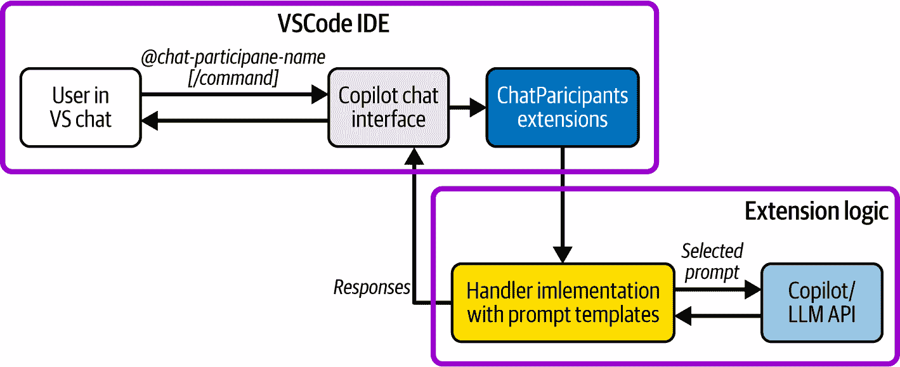

###### 图 10-27\. VS Code 扩展概述

图 10-28 展示了使用扩展的用户界面功能来查找合适的 API 的示例。


###### 图 10-28\. 使用 API 查找器聊天参与者查找天气 API

此扩展还内置了一个额外的命令，可以调用为 `/⁠exam⁠ples`。图 10-29 展示了该命令的一个示例用法。


###### 图 10-29\. 使用聊天参与者中的命令

扩展的代码位于 [本书的 GitHub 仓库](https://oreil.ly/RUAtr) 中。这个扩展是用 TypeScript 实现的，主要逻辑在文件 [*src/extension.ts*](https://oreil.ly/VSPMM) 中。这是基于 GitHub 中 VS Code 扩展示例中的 [示例](https://oreil.ly/uRBxt)。

代码首先从 VS Code 的库中导入依赖项。然后它定义了用于基本功能的模型发送提示和用于代码字体命令的提示：

```py
import * as vscode from 'vscode';

const BASE_PROMPT = 'You are a helpful API finder. Your job is to
 locate and provide documentation on the top 3 APIs that match the 
prompt. Respond with basic documentation about the API, how to call 
it, and its parameters. Cite your sources and provide links to more 
information where appropriate.  Use bullet points in explanations 
wherever possible. If the user asks a question that is not relevant 
to APIs, politely decline to respond.';

const SAMPLE_CODE_PROMPT = 'You are a helpful source of API examples.
 Your job is to locate the top 3 APIs that match the prompt and 
provide simple example code for how to call them. Keep the code as 
short as possible to still provide a usable, relevant example. 
If the user asks a question that is not relevant to APIs, politely 
decline to respond.';

```

注意，我们通过提供详细的提示来明确我们希望 LLM 如何处理我们的查询。

# 为 /examples 指定语言

在 图 10-29 中展示的先前示例中，我们在 `@apifinder /⁠examples` 的提示中将 `Go` 语言指定为第二个参数。然而，我们的提示并没有明确引用编程语言。这是使用 AI 处理请求的好处。它推断出额外的上下文和意义，我们不必明确指出。

文件底部的代码实例化了聊天处理程序，并为其添加了一个用于聊天的图标：

```py
// create participant
const apifinder = vscode.chat.createChatParticipant("chat-tutorial.
api-finder", handler);

// add icon to participant
apifinder.iconPath = vscode.Uri.joinPath(context.extensionUri, 
'apifinder.jpeg');

```

主要处理函数选择提示（基于我们是否想要核心功能或正在使用 `examples` 命令）。然后它将提示和任何之前的消息结合起来，将其发送到模型，并流式传输响应：

```py
export function activate(context: vscode.ExtensionContext) {

    // define a chat handler
    const handler: vscode.ChatRequestHandler = async (request: 
vscode.ChatRequest, context: vscode.ChatContext, 
stream: vscode.ChatResponseStream, token: vscode.CancellationToken)
 => {
        // initialize the prompt
        let prompt = BASE_PROMPT;
        if (request.command === 'examples') {
            prompt = SAMPLE_CODE_PROMPT;
        }
        // initialize the messages array with the prompt
        const messages = [
            vscode.LanguageModelChatMessage.User(prompt),
        ];
        // get all the previous participant messages
        const previousMessages = context.history.filter(
            (h) => h instanceof vscode.ChatResponseTurn
        );
        // add the previous messages to the messages array
        previousMessages.forEach((m) => {
            let fullMessage = '';
            m.response.forEach((r) => {
                const mdPart = r as vscode.ChatResponseMarkdownPart;
                fullMessage += mdPart.value.value;
            });
            messages.push(vscode.LanguageModelChatMessage.Assistant
(fullMessage));
        });
        // add in the user's message
        messages.push(vscode.LanguageModelChatMessage.User
(request.prompt));
        // send the request
        const chatResponse = await request.model.sendRequest
(messages, {}, token);
        // stream the response
        for await (const fragment of chatResponse.text) {
            stream.markdown(fragment);
        }
        return;
    };

```

测试这个扩展就像在 VS Code 中打开文件夹，使用 `npm install` 安装依赖项，通过 `npm run compile` 编译代码，然后在新的 VS Code 实例中运行扩展一样简单。

# 使用调试器运行参与者

测试你的参与者代码可能最简单的方法是将它加载到 VS Code 实例中，运行 `npm` 命令，然后从运行菜单中选择“开始调试”选项来启动一个新的 VS Code 实例。新的调试实例将安装并激活参与者，因此你可以在该实例的聊天界面中使用它。说明可以在存储库的 [README 文件](https://oreil.ly/QXsC_) 中找到。

与其他类型的扩展一样，在将其推出到生产之前，你可能想要进行一些额外的更改，例如确保身份验证按需工作。[VS Code 文档](https://oreil.ly/UH18y) 详细描述了实现方法。你还可以在 [VS Code 市场 place](https://oreil.ly/HGZkA) 上找到有关发布你的完成扩展的信息。

# 结论

GitHub Copilot 扩展和 VS Code 的 Copilot 扩展提供了一种增强 GitHub Copilot 内置功能的方法。这些扩展通过 Copilot 聊天界面和 `@` 前缀访问。

Copilot 扩展的后端代码可以以两种方式之一进行架构。代理是最灵活的选项，但通常也是实现起来最复杂的。使用技能集架构的扩展在后台调用一个或多个技能以获取更多信息。一个技能可能只是一个 API 调用。

VS Code 的 Copilot 扩展是在 VS Code 的平台上构建的。它们可以完全访问底层的 VS Code API，并且依赖于 VS Code 来运行。从用户界面的角度来看，它们提供了类似于内置的 `@workspace` 和 `@terminal` 的 VS Code 聊天参与者。

扩展的后端代码可以用多种语言实现，包括 JavaScript、TypeScript 和 Go。对于使用代理方法的扩展和 JavaScript，GitHub 提供了一个早期版本的 SDK，可用于简化编码并帮助满足生产需求，如身份验证。

Copilot 扩展（作为代理或技能集实现）需要一个 GitHub App 来在 Copilot 聊天界面和后端代码之间建立连接。虽然两者都使用 GitHub Apps，但每个的配置都不同。代理依赖于在应用中定义的单个回调 URL。技能集的应用需要在其配置中提供额外的推理细节，以便 AI 能够将提示映射到正确的技能 API 端点。

由于 Copilot 扩展利用 GitHub App，它们可以在任何 Copilot 聊天界面中运行，包括在 IDE 或 GitHub 上。相比之下，由于 Copilot 的 VS Code 扩展依赖于 VS Code API 和功能，它们只能在那个环境中使用。
