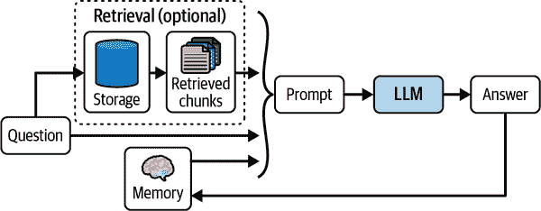

# 第四章\. 使用 LangGraph 为您的聊天机器人添加记忆

在第三章中，你学习了如何为你的 AI 聊天机器人应用程序提供最新和相关的上下文。这使得你的聊天机器人能够根据用户的输入生成准确的响应。但这还不足以构建一个生产就绪的应用程序。你如何使你的应用程序能够真正地与用户“聊天”来回，同时记住先前的对话和相关的上下文？

大型语言模型是无状态的，这意味着每次模型被提示生成新的响应时，它都没有先前的提示或模型响应的记忆。为了向模型提供这些历史信息，我们需要一个稳健的记忆系统来跟踪之前的对话和上下文。然后，这些历史信息可以包含在发送给 LLM 的最终提示中，从而给它“记忆”。图 4-1 展示了这一点。



###### 图 4-1\. 用于从 LLM 生成上下文感知答案的记忆和检索

在本章中，你将学习如何使用 LangChain 的内置模块构建这个基本记忆系统，以使开发过程更加容易。

# 构建聊天机器人记忆系统

任何稳健的记忆系统背后都有两个核心设计决策：

+   状态是如何存储的

+   状态是如何查询的

构建一个聊天机器人记忆系统，该系统包含对这些设计决策的有效解决方案的简单方法是将用户和模型之间所有聊天交互的历史存储并重用。这个记忆系统的状态可以是：

+   存储为消息列表（参考第一章了解更多关于消息的信息）

+   在每一轮之后附加最近的消息进行更新

+   将消息插入到提示中附加到提示中

图 4-2 展示了这个简单的记忆系统。


###### 图 4-2\. 利用提示中的聊天历史生成模型答案的简单记忆系统

这是一个代码示例，展示了使用 LangChain 的简单版本的这个记忆系统：

*Python*

```py
from langchain_core.prompts import ChatPromptTemplate
from langchain_openai import ChatOpenAI

prompt = ChatPromptTemplate.from_messages([
    ("system", """You are a helpful assistant. Answer all questions to the best 
 of your ability."""),
    ("placeholder", "{messages}"),
])

model = ChatOpenAI()

chain = prompt | model

chain.invoke({
    "messages": [
        ("human","""Translate this sentence from English to French: I love 
 programming."""),
        ("ai", "J'adore programmer."),
        ("human", "What did you just say?"),
    ],
})
```

*JavaScript*

```py
import {ChatPromptTemplate} from '@langchain/core/prompts'
import {ChatOpenAI} from '@langchain/openai'

const prompt = ChatPromptTemplate.fromMessages([
  ["system", `You are a helpful assistant. Answer all questions to the best 
 of your ability.`],
  ["placeholder", "{messages}"],
])

const model = new ChatOpenAI()

const chain = prompt.pipe(model)

await chain.invoke({
  "messages": [
    ["human",`Translate this sentence from English to French: I love 
 programming.`],
    ["ai", "J'adore programmer."],
    ["human", "What did you just say?"],
  ],
})
```

*输出：*

```py
I said, "J'adore programmer," which means "I love programming" in French.
```

注意，将之前的对话纳入链中使模型能够以上下文感知的方式回答后续问题。

虽然这很简单并且有效，但当你的应用程序投入生产时，你将面临一些与大规模管理记忆相关的更多挑战，例如：

+   你需要在每次交互后更新记忆，原子性地（即在失败的情况下不要只记录问题或只记录答案）。

+   你会想将这些记忆存储在持久存储中，例如关系数据库。

+   你可能希望控制存储以备后用的消息数量和类型，以及这些消息中有多少用于新的交互。

+   你可能希望在调用 LLM 之外检查和修改此状态（目前只是一个消息列表）。

我们现在将介绍一些更好的工具，这些工具将有助于本章节和后续章节。

# 介绍 LangGraph

在本章的剩余部分和接下来的章节中，我们将开始使用 [LangGraph](https://oreil.ly/TKCb6)，这是一个由 LangChain 编写的开源库。LangGraph 被设计用来使开发者能够实现多参与者、多步骤、状态化的认知架构，称为 *图*。这句话中包含了大量的词汇；让我们逐个解释。 展示了多参与者方面。


###### 图 4-3\. 从单参与者应用到多参与者应用

一支专家团队可以共同构建出他们单独无法完成的东西。对于 LLM 应用也是如此：一个 LLM 提示（非常适合答案生成和任务规划以及更多功能）当与搜索引擎（擅长查找当前事实）配对时，或者甚至与不同的 LLM 提示配对时，会更有力量。我们已经看到开发者通过以新颖的方式结合这两个构建块（以及其他）构建了一些惊人的应用，例如 [Perplexity](https://oreil.ly/bVlu7) 或 [Arc Search](https://oreil.ly/NPOlF)。

正如一个团队需要比一个人单独工作更多的协调一样，一个具有多个参与者的应用需要一个协调层来完成这些事情：

+   定义涉及的参与者（图中的节点）以及它们如何相互传递工作（图中边的处理方式）。

+   在适当的时间安排每个参与者的执行——如果需要，可以并行执行，并确保结果确定性。

 展示了多步骤维度。


###### 图 4-4\. 从多参与者到多步骤应用

随着每个参与者将工作传递给另一个参与者（例如，一个 LLM 提示请求搜索工具提供特定搜索查询的结果），我们需要理解多个参与者之间的来回交互。我们需要知道它发生的顺序，每个参与者被调用的次数，等等。为此，我们可以将参与者之间的交互建模为在多个离散的时间步骤中发生。当一个参与者将工作传递给另一个参与者时，它会导致计算的下一步调度，依此类推，直到没有更多的参与者将工作传递给他人，最终结果达成。

 展示了状态化的方面。


###### 图 4-5\. 从多步骤到状态化应用

步骤之间的通信需要跟踪一些状态——否则，当您第二次调用 LLM 演员时，您会得到与第一次相同的结果。将此状态从每个演员中提取出来，并让所有演员共同更新一个单一的中心状态非常有帮助。有了单一的中心状态，我们可以：

+   在每次计算期间或之后快照并存储中心状态。

+   暂停和恢复执行，这使得从错误中恢复变得容易。

+   实现人机交互控制（更多内容请参阅第八章）。

然后，每个*图*由以下内容组成：

状态

从应用程序外部接收的数据，在应用程序运行时由应用程序修改和生成。

节点

每个要采取的步骤。节点只是 Python/JS 函数，它们接收当前状态作为输入，并可以返回对那个状态的更新（即，它们可以添加到它并修改或删除现有数据）。

边

节点之间的连接。边决定了从第一个节点到最后一个节点所采取的路径，它们可以是固定的（即，在节点 B 之后，总是访问节点 D）或条件性的（评估一个函数以决定在节点 C 之后访问的下一个节点）。

LangGraph 提供了可视化这些图和许多在开发期间调试其工作方式的特性的工具。然后可以轻松地将这些图部署到以高规模处理生产工作负载。

如果您遵循了第一章中的说明，您已经安装了 LangGraph。如果没有，您可以在终端运行以下命令之一来安装它：

*Python*

```py
pip install langgraph
```

*JavaScript*

```py
npm i @langchain/langgraph
```

为了帮助您熟悉使用 LangGraph，我们将使用 LangGraph 创建一个简单的聊天机器人，LangGraph 是一个使用单个 LLM 调用的 LLM 调用架构的绝佳示例。这个聊天机器人将直接响应用户的消息。虽然简单，但它确实展示了使用 LangGraph 构建的核心概念。

# 创建状态图

首先，创建一个`StateGraph`。我们将添加一个节点来表示 LLM 调用：

*Python*

```py
from typing import Annotated, TypedDict

from langgraph.graph import StateGraph, START, END
from langgraph.graph.message import add_messages

class State(TypedDict):
    # Messages have the type "list". The `add_messages` 
    # function in the annotation defines how this state should 
    # be updated (in this case, it appends new messages to the 
    # list, rather than replacing the previous messages)
	messages: Annotated[list, add_messages]

builder = StateGraph(State)
```

*JavaScript*

```py
import {
  StateGraph,
  StateType,
  Annotation,
  messagesStateReducer,
  START, END
} from '@langchain/langgraph'

const State = {
  /**
 * The State defines three things:
 * 1\. The structure of the graph's state (which "channels" are available to
 * read/write)
 * 2\. The default values for the state's channels
 * 3\. The reducers for the state's channels. Reducers are functions that
 * determine how to apply updates to the state. Below, new messages are
 * appended to the messages array.
 */
  messages: Annotation({
    reducer: messagesStateReducer,
    default: () => []
  }),
}

const builder = new StateGraph(State)
```

###### 注意

当你定义一个图时，你首先定义图的初始状态。*状态*由图的形状或模式以及指定如何应用更新到状态的还原器函数组成。在这个例子中，状态是一个包含单个键的字典：`messages`。`messages`键用`add_messages`还原器函数进行了注释，它告诉 LangGraph 将新消息追加到现有列表中，而不是覆盖它。没有注释的状态键将被每个更新覆盖，存储最新的值。你可以编写自己的还原器函数，这些函数只是接收作为参数的函数——参数 1 是当前状态，参数 2 是要写入状态的新值——并应该返回下一个状态，即合并当前状态和新值的结果。最简单的例子是一个函数，它将下一个值追加到列表中并返回该列表。

因此现在我们的图知道了两件事：

+   我们定义的每个`node`都将接收当前的`State`作为输入，并返回一个更新该状态的值。

+   `messages`将被*追加*到当前列表中，而不是直接覆盖。这通过 Python 示例中的预构建的`add_messages`函数或 JavaScript 示例中的还原器函数来传达。

接下来，添加`chatbot`节点。节点代表工作单元。它们通常是函数：

*Python*

```py
from langchain_openai import ChatOpenAI

model = ChatOpenAI()

def chatbot(state: State):
    answer = model.invoke(state["messages"])
    return {"messages": [answer]}

# The first argument is the unique node name
# The second argument is the function or Runnable to run
builder.add_node("chatbot", chatbot)
```

*JavaScript*

```py
import {ChatOpenAI} from '@langchain/openai'
import {
  AIMessage,
  SystemMessage,
  HumanMessage
} from "@langchain/core/messages";

const model = new ChatOpenAI()

async function chatbot(state) {
  const answer = await model.invoke(state.messages)
  return {"messages": answer}
}

builder = builder.addNode('chatbot', chatbot)
```

这个节点接收当前状态，进行一次 LLM 调用，然后返回一个包含 LLM 产生的新消息的状态更新。`add_messages`还原器函数将此消息追加到状态中已有的消息列表。

最后，让我们添加边：

*Python*

```py
builder.add_edge(START, 'chatbot')
builder.add_edge('chatbot', END)

graph = builder.compile()
```

*JavaScript*

```py
builder = builder
  .addEdge(START, 'chatbot')
  .addEdge('chatbot', END)

let graph = builder.compile()
```

这会做几件事：

+   每次运行它时，它都会告诉图从哪里开始工作。

+   这指示图在哪里应该退出（这是可选的，因为 LangGraph 会在没有更多节点可以运行时停止执行）。

+   它将图编译成一个可运行的对象，具有熟悉的`invoke`和`stream`方法。

我们也可以绘制出该图的视觉表示：

*Python*

```py
graph.get_graph().draw_mermaid_png()
```

*JavaScript*

```py
await graph.getGraph().drawMermaidPng()
```

我们刚刚创建的图看起来像图 4-6。


###### 图 4-6\. 一个简单的聊天机器人

你可以使用熟悉的`stream()`方法运行它，你已经在前面的章节中见过：

*Python*

```py
input = {"messages": [HumanMessage('hi!)]}
for chunk in graph.stream(input):
    print(chunk)
```

*JavaScript*

```py
const input = {messages: [new HumanMessage('hi!)]}
for await (const chunk of await graph.stream(input)) {
  console.log(chunk)
}
```

*输出：*

```py
{ "chatbot": { "messages": [AIMessage("How can I help you?")] } }
```

注意到输入到图中的数据与我们在前面定义的`State`对象具有相同的形状；也就是说，我们通过字典的`messages`键发送了一个消息列表。此外，`stream`函数在图的每一步之后都会流式传输状态的完整值。

# 将内存添加到 StateGraph

LangGraph 内置了持久化功能，这种功能适用于从最简单的图到最复杂的图，使用方式相同。让我们看看将其应用于第一个架构会是什么样子。我们将重新编译我们的图，现在附加一个 *checkpointer*，这是一个 LangGraph 的存储适配器。LangGraph 随附一个基类，任何用户都可以扩展它来为他们的首选数据库创建适配器；在撰写本文时，LangGraph 随附由 LangChain 维护的几个适配器：

+   一个内存中的适配器，我们将用它来展示我们的示例

+   一个使用流行的进程内数据库 SQLite 的适配器，适用于本地应用程序和测试

+   一个针对流行的关系型数据库优化的 Postgres 适配器，适用于大型应用程序。

许多开发者已经为其他数据库系统编写了适配器，例如 Redis 或 MySQL：

*Python*

```py
from langgraph.checkpoint.memory import MemorySaver

graph = builder.compile(checkpointer=MemorySaver())
```

*JavaScript*

```py
import {MemorySaver} from '@langchain/langgraph'

const graph = builder.compile({ checkpointer: new MemorySaver() })
```

这返回了一个具有与上一个代码块中使用的相同方法的可运行对象。但现在，它在每个步骤结束时存储状态，因此第一次调用之后的每次调用都不从空白状态开始。每次调用图时，它首先使用检查点器获取最新的保存状态（如果有的话），并将新输入与之前的状态结合。然后才执行第一个节点。

让我们看看实际操作中的区别：

*Python*

```py
thread1 = {"configurable": {"thread_id": "1"}}
result_1 = graph.invoke(
    { "messages": [HumanMessage("hi, my name is Jack!")] }, 
    thread1
)
// { "chatbot": { "messages": [AIMessage("How can I help you, Jack?")] } }

result_2 = graph.invoke(
    { "messages": [HumanMessage("what is my name?")] }, 
    thread1
)
// { "chatbot": { "messages": [AIMessage("Your name is Jack")] } }
```

*JavaScript*

```py
const thread1 = {configurable: {thread_id: '1'}}
const result_1 = await graph.invoke(
  { "messages": [new HumanMessage("hi, my name is Jack!")] },
  thread1
)
// { "chatbot": { "messages": [AIMessage("How can I help you, Jack?")] } }

const result_2 = await graph.invoke(
  { "messages": [new HumanMessage("what is my name?")] },
  thread1
)
// { "chatbot": { "messages": [AIMessage("Your name is Jack")] } }
```

注意对象 `thread1`，它标识当前交互属于特定的交互历史——在 LangGraph 中这些交互历史被称为 *threads*。当首次使用时，会自动创建线程。任何字符串都是线程的有效标识符（通常，使用通用唯一识别码 [UUIDs]）。线程的存在有助于你在你的 LLM 应用程序中实现一个重要的里程碑；现在它可以被多个用户使用，每个用户都有独立的对话，这些对话永远不会混淆。

如前所述，`chatbot` 节点首先被调用，带有一条消息（我们刚刚传递的），然后返回另一条消息，这两条消息随后都保存在状态中。

第二次我们在同一线程上执行图时，`chatbot` 节点被调用，带有三条消息，两条是从第一次执行中保存的，以及用户提出的下一个问题。这就是记忆的本质：前一个状态仍然存在，这使得例如回答关于之前所说的事情的问题（以及做更多有趣的事情）成为可能。

你还可以直接检查和更新状态；让我们看看如何：

*Python*

```py
graph.get_state(thread1)
```

*JavaScript*

```py
await graph.getState(thread1)
```

这返回了此线程的当前状态。

你可以像这样更新状态：

*Python*

```py
graph.update_state(thread1, [HumanMessage('I like LLMs!)])
```

*JavaScript*

```py
await graph.updateState(thread1, [new HumanMessage('I like LLMs!)])
```

这将在状态中的消息列表中添加一条新消息，以便在下一次你在该线程上调用图时使用。

# 修改聊天历史

在许多情况下，聊天历史中的消息可能不是最佳状态或格式，无法从模型生成准确的响应。为了克服这个问题，我们可以通过三种主要方式修改聊天历史：修剪、过滤和合并消息。

## 修剪消息

LLMs 有有限的 *上下文窗口*；换句话说，LLMs 可以作为提示接收的最大令牌数是有限的。因此，发送给模型的最终提示不应超过该限制（针对每个模式特定），因为模型要么拒绝过长的提示，要么将其截断。此外，过多的提示信息可能会分散模型的注意力并导致幻觉。

解决此问题的有效方法是对从聊天历史中检索并附加到提示中的消息数量进行限制。在实践中，我们只需要加载和存储最新的消息。让我们使用一个带有一些预加载消息的示例聊天历史。

幸运的是，LangChain 提供了内置的 `trim_messages` 辅助函数，它包含各种策略以满足这些要求。例如，修剪器辅助函数允许指定我们想要从聊天历史中保留或删除的令牌数量。

以下是一个示例，通过将策略参数设置为 `"last"` 来检索列表中最后 `max_tokens` 的消息：

*Python*

```py
from langchain_core.messages import SystemMessage, trim_messages
from langchain_openai import ChatOpenAI

trimmer = trim_messages(
    max_tokens=65,
    strategy="last",
    token_counter=ChatOpenAI(model="gpt-4o"),
    include_system=True,
    allow_partial=False,
    start_on="human",
)

messages = [
    SystemMessage(content="you're a good assistant"),
    HumanMessage(content="hi! I'm bob"),
    AIMessage(content="hi!"),
    HumanMessage(content="I like vanilla ice cream"),
    AIMessage(content="nice"),
    HumanMessage(content="what's 2 + 2"),
    AIMessage(content="4"),
    HumanMessage(content="thanks"),
    AIMessage(content="no problem!"),
    HumanMessage(content="having fun?"),
    AIMessage(content="yes!"),
]

trimmer.invoke(messages)
```

*JavaScript*

```py
import {
  AIMessage,
  HumanMessage,
  SystemMessage,
  trimMessages,
} from "@langchain/core/messages";
import { ChatOpenAI } from "@langchain/openai";

const trimmer = trimMessages({
  maxTokens: 65,
  strategy: "last",
  tokenCounter: new ChatOpenAI({ modelName: "gpt-4o" }),
  includeSystem: true,
  allowPartial: false,
  startOn: "human",
});

const messages = [
  new SystemMessage("you're a good assistant"),
  new HumanMessage("hi! I'm bob"),
  new AIMessage("hi!"),
  new HumanMessage("I like vanilla ice cream"),
  new AIMessage("nice"),
  new HumanMessage("what's 2 + 2"),
  new AIMessage("4"),
  new HumanMessage("thanks"),
  new AIMessage("no problem!"),
  new HumanMessage("having fun?"),
  new AIMessage("yes!"),
]

const trimmed = await trimmer.invoke(messages);
```

*输出结果：*

```py
[SystemMessage(content="you're a good assistant"),
 HumanMessage(content='what's 2 + 2'),
 AIMessage(content='4'),
 HumanMessage(content='thanks'),
 AIMessage(content='no problem!'),
 HumanMessage(content='having fun?'),
 AIMessage(content='yes!')]
```

注意以下内容：

+   参数 `strategy` 控制是否从列表的开始或结束处开始。通常，您会希望优先考虑最新的消息，并在消息不合适时删除较旧的消息。也就是说，从列表的末尾开始。为此行为，选择值 `last`。另一个可用的选项是 `first`，这将优先考虑最旧的消息，并在消息不合适时删除较新的消息。

+   `token_counter` 是一个 LLM 或聊天模型，它将使用适合该模型的分词器来计数令牌。

+   我们可以添加参数 `include_system=True` 来确保修剪器保留系统消息。

+   参数 `allow_partial` 决定是否截断最后一条消息的内容以适应限制。在我们的示例中，我们将此设置为 `false`，这将完全删除会导致总数超过限制的消息。

+   参数 `start_on="human"` 确保我们永远不会在没有删除相应的 `HumanMessage`（即对该响应的问题）的情况下删除 `AIMessage`（即模型的响应）。

## 过滤消息

随着聊天历史消息列表的增长，可能会使用更多种类的类型、子链和模型。LangChain 的 `filter_messages` 辅助函数使得通过类型、ID 或名称过滤聊天历史消息变得更容易。

以下是一个示例，其中我们过滤出人类消息：

*Python*

```py
from langchain_core.messages import (
    AIMessage,
    HumanMessage,
    SystemMessage,
    filter_messages,
)

messages = [
    SystemMessage("you are a good assistant", id="1"),
    HumanMessage("example input", id="2", name="example_user"),
    AIMessage("example output", id="3", name="example_assistant"),
    HumanMessage("real input", id="4", name="bob"),
    AIMessage("real output", id="5", name="alice"),
]

filter_messages(messages, include_types="human")
```

*JavaScript*

```py
import {
  HumanMessage,
  SystemMessage,
  AIMessage,
  filterMessages,
} from "@langchain/core/messages";

const messages = [
  new SystemMessage({content: "you are a good assistant", id: "1"}),
  new HumanMessage({content: "example input", id: "2", name: "example_user"}),
  new AIMessage({content: "example output", id: "3", name: "example_assistant"}),
  new HumanMessage({content: "real input", id: "4", name: "bob"}),
  new AIMessage({content: "real output", id: "5", name: "alice"}),
];

filterMessages(messages, { includeTypes: ["human"] });
```

*输出结果：*

```py
[HumanMessage(content='example input', name='example_user', id='2'),
 HumanMessage(content='real input', name='bob', id='4')]
```

让我们尝试另一个示例，其中我们过滤以排除用户和 ID，并包括消息类型：

*Python*

```py
filter_messages(messages, exclude_names=["example_user", "example_assistant"])

"""
[SystemMessage(content='you are a good assistant', id='1'),
HumanMessage(content='real input', name='bob', id='4'),
AIMessage(content='real output', name='alice', id='5')]
"""

filter_messages(
    messages, 
    include_types=[HumanMessage, AIMessage], 
    exclude_ids=["3"]
)

"""
[HumanMessage(content='example input', name='example_user', id='2'),
 HumanMessage(content='real input', name='bob', id='4'),
 AIMessage(content='real output', name='alice', id='5')]
"""
```

*JavaScript*

```py
filterMessages(
  messages, 
  { excludeNames: ["example_user", 
  "example_assistant"] }
);

/*
[SystemMessage(content='you are a good assistant', id='1'),
HumanMessage(content='real input', name='bob', id='4'),
AIMessage(content='real output', name='alice', id='5')]
*/

filterMessages(messages, { includeTypes: ["human", "ai"], excludeIds: ["3"] });

/*
[HumanMessage(content='example input', name='example_user', id='2'),
 HumanMessage(content='real input', name='bob', id='4'),
 AIMessage(content='real output', name='alice', id='5')]
*/
```

`filter_messages` 辅助函数也可以用命令式或声明式的方式使用，这使得与其他组件链式组合变得容易：

*Python*

```py
model = ChatOpenAI()

filter_ = filter_messages(exclude_names=["example_user", "example_assistant"])

chain = filter_ | model
```

*JavaScript*

```py
const model = new ChatOpenAI()

const filter = filterMessages({
  excludeNames: ["example_user", "example_assistant"]
})

const chain = filter.pipe(model)
```

## 合并连续消息

某些模型不支持输入，包括相同类型的连续消息（例如，Anthropic 聊天模型）。LangChain 的`merge_message_runs`实用工具使得合并相同类型的连续消息变得容易：

*Python*

```py
from langchain_core.messages import (
    AIMessage,
    HumanMessage,
    SystemMessage,
    merge_message_runs,
)

messages = [
    SystemMessage("you're a good assistant."),
    SystemMessage("you always respond with a joke."),
    HumanMessage(
        [{"type": "text", "text": "i wonder why it's called langchain"}]
    ),
    HumanMessage("and who is harrison chasing anyway"),
    AIMessage(
        '''Well, I guess they thought "WordRope" and "SentenceString" just 
 didn\'t have the same ring to it!'''
    ),
    AIMessage("""Why, he's probably chasing after the last cup of coffee in the 
 office!"""),
]

merge_message_runs(messages)
```

*JavaScript*

```py
import {
  HumanMessage,
  SystemMessage,
  AIMessage,
  mergeMessageRuns,
} from "@langchain/core/messages";

const messages = [
  new SystemMessage("you're a good assistant."),
  new SystemMessage("you always respond with a joke."),
  new HumanMessage({
    content: [{ type: "text", text: "i wonder why it's called langchain" }],
  }),
  new HumanMessage("and who is harrison chasing anyway"),
  new AIMessage(
    `Well, I guess they thought "WordRope" and "SentenceString" just didn\'t 
 have the same ring to it!`
  ),
  new AIMessage(
    "Why, he's probably chasing after the last cup of coffee in the office!"
  ),
];

mergeMessageRuns(messages);
```

*输出：*

```py
[SystemMessage(content="you're a good assistant.\nyou always respond with a 
    joke."),
 HumanMessage(content=[{'type': 'text', 'text': "i wonder why it's called
    langchain"}, 'and who is harrison chasing anyway']),
 AIMessage(content='Well, I guess they thought "WordRope" and "SentenceString" 
    just didn\'t have the same ring to it!\nWhy, he\'s probably chasing after 
    the last cup of coffee in the office!')]
```

注意，如果要合并的消息之一的内容是内容块列表，则合并后的消息将有一个内容块列表。如果两个要合并的消息都有字符串内容，则它们将使用换行符连接。

`merge_message_runs`辅助函数可以用命令式或声明式方式使用，这使得它很容易与其他组件链式组合：

*Python*

```py
model = ChatOpenAI()
merger = merge_message_runs()
chain = merger | model
```

*JavaScript*

```py
const model = new ChatOpenAI()
const merger = mergeMessageRuns()
const chain = merger.pipe(model)
```

# 摘要

本章介绍了构建一个简单的记忆系统的基本原理，该系统能够让你的 AI 聊天机器人记住与用户的对话。我们讨论了如何使用 LangGraph 自动化存储和更新聊天历史，使其更容易实现。我们还讨论了修改聊天历史的重要性，并探讨了修剪、过滤和总结聊天消息的各种策略。

在第五章，你将学习如何让你的 AI 聊天机器人不仅仅能进行聊天：例如，你的新模型将能够做出决策、选择动作，并对其过去的输出进行反思。
