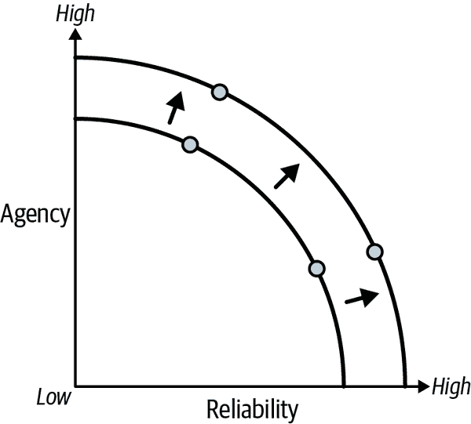

# 第八章\. 充分利用 LLMs 的模式

今天的大型语言模型（LLMs）存在一些主要限制，但这并不意味着你梦想中的 LLM 应用程序无法构建。你为应用程序用户设计的体验需要围绕这些限制工作，理想情况下与之协同。

第五章简要讨论了我们在构建 LLM 应用程序时面临的关键权衡：*代理权*（LLM 自主行动的能力）和*可靠性*（我们对其输出的信任程度）。直观上，如果 LLM 应用程序能够在我们的参与下采取更多行动，那么它对我们更有用，但如果代理权过于强大，应用程序不可避免地会做我们不愿意它做的事情。

图 8-1 展示了这种权衡。


###### 图 8-1\. 代理-可靠性权衡

借鉴其他领域的概念，^(1)我们可以将这种权衡可视化为一个*前沿*——前沿曲线上的所有点都是某些应用程序的最优 LLM 架构，标志着在代理权和可靠性之间的不同选择。（参考第五章了解不同 LLM 应用架构的概述。）例如，请注意链式架构具有相对较低的代理权但较高的可靠性，而代理架构则以牺牲较低的可靠性为代价实现了较高的代理权。

让我们简要地讨论一些额外的（但仍然重要）的目标，你可能希望你的 LLM 应用程序具备这些目标。每个 LLM 应用程序都将针对一个或多个这些目标的组合进行设计：

延迟

最小化获得最终答案的时间

自主性

最小化人类输入的干扰

变异性

最小化调用之间的差异

这并不是所有可能目标的详尽列表，而是作为你在构建应用程序时面临权衡的示例。每个目标都与所有其他目标多少有些冲突（例如，提高可靠性的最简单途径可能需要更高的延迟或更低的自主性）。如果给予每个目标充分的权重，每个目标都会使其他目标无效（例如，最小延迟的应用程序是根本不做什么的应用程序）。图 8-2 说明了这一概念。



###### 图 8-2\. 前沿的移动，或相同的可靠性下更多的代理权

作为应用程序开发者，我们真正想要的是将前沿向外推移。对于相同的可靠性水平，我们希望实现更高的代理权；而对于相同的代理权水平，我们希望实现更高的可靠性。本章介绍了一些你可以用来实现这一目标的技巧：

流式/中间输出

如果在整个过程中有一些进度/中间输出的沟通，那么更高的延迟更容易接受。

结构化输出

要求 LLM 以预定义的格式生成输出，使其更有可能符合预期。

人工介入

高级架构在运行时受益于人工干预：中断、批准、分支或撤销。

双重文本模式

LLM 应用回答的时间越长，用户在之前的一个输入完成处理之前发送新输入的可能性就越大。

# 结构化输出

通常来说，让 LLM 返回结构化输出是至关重要的，要么是因为下游使用该输出的预期需要一个特定的*模式*（结构化输出中各种字段名称和类型的定义），要么是为了纯粹减少到原本可能完全自由形式的文本输出中的方差。

对于不同的 LLM，你可以使用几种不同的策略：

提示

这就是当你（非常礼貌地）要求 LLM 以所需格式返回输出的时候（例如，JSON、XML 或 CSV）。提示的大优点是它在某种程度上与任何 LLM 都兼容；缺点是它更像是对 LLM 的建议，而不是保证输出将以这种格式出现。

工具调用

这适用于已经微调过的 LLM，可以从可能的输出模式列表中进行选择，并生成符合所选模式的内容。这通常涉及为每个可能的输出模式编写：一个用于识别它的名称，一个描述以帮助 LLM 决定何时是合适的选项，以及一个用于所需输出格式的模式（通常使用 JSONSchema 表示法）。

JSON 模式

这是某些 LLM（如最近的 OpenAI 模型）中可用的一种模式，它强制 LLM 输出有效的 JSON 文档。

不同的模型可能支持这些策略的不同变体，参数略有不同。为了使 LLM 返回结构化输出变得容易，LangChain 模型实现了一个通用接口，一个名为`.with_structured_output`的方法。通过调用此方法并传入 JSON 模式或 Pydantic（在 Python 中）或 Zod（在 JS 中）模型，模型将添加生成和返回结构化输出所需的任何模型参数和输出解析器。当特定模型实现了上述策略中的多个时，您可以配置使用哪种方法。

让我们创建一个要使用的模式：

*Python*

```py
from pydantic import BaseModel, Field

class Joke(BaseModel):
    setup: str = Field(description="The setup of the joke")
    punchline: str = Field(description="The punchline to the joke")
```

*JavaScript*

```py
import { z } from "zod";

const joke = z.object({
  setup: z.string().describe("The setup of the joke"),
  punchline: z.string().describe("The punchline to the joke"),
});
```

注意我们如何注意为每个字段添加描述。这是关键，因为——连同字段的名称一起——这是 LLM 将用于决定输出中的哪一部分应该放入每个字段的信息。我们还可以定义一个原始 JSONSchema 表示法的模式，其外观如下：

```py
{'properties': {'setup': {'description': 'The setup of the joke',
    'title': 'Setup',
    'type': 'string'},
 'punchline': {'description': 'The punchline to the joke',
    'title': 'Punchline',
    'type': 'string'}},
 'required': ['setup', 'punchline'],
 'title': 'Joke',
 'type': 'object'}
```

现在让我们让 LLM 生成符合此模式的输出：

*Python*

```py
from langchain_openai import ChatOpenAI

model = ChatOpenAI(model="gpt-3.5-turbo", temperature=0)
model = model.with_structured_output(Joke)

model.invoke("Tell me a joke about cats")
```

*JavaScript*

```py
import { ChatOpenAI } from "@langchain/openai";

let model = new ChatOpenAI({
  model: "gpt-3.5-turbo",
  temperature: 0
});
model = model.withStructuredOutput(joke);

await structuredLlm.invoke("Tell me a joke about cats");
```

*输出示例*

```py
{
    setup: "Why don't cats play poker in the wild?",
    punchline: "Too many cheetahs."
}
```

有几点需要注意：

+   我们像往常一样创建模型的实例，指定要使用的模型名称和其他参数。

+   低温通常适合结构化输出，因为它减少了 LLM 产生不符合模式的有效输出的可能性。

+   之后，我们将模式附加到模型上，这将返回一个新的对象，该对象将生成与提供的模式相匹配的输出。当你为模式传递 Pydantic 或 Zod 对象时，这也会用于验证；也就是说，如果 LLM 产生的输出不符合规范，将返回验证错误而不是失败的输出。

+   最后，我们使用我们的（自由形式的）输入调用模型，并接收与我们期望的结构相匹配的输出。

使用结构化输出的这种模式可以作为独立工具或作为更大应用程序的一部分非常有用；例如，请参阅第五章，我们利用这种能力来实现路由架构的路由步骤。

## 中间输出

你的 LLM 架构越复杂，它执行所需的时间就越长。如果你回想一下第五章认知架构与 LangGraph 和第六章代理架构中的架构图，每次你看到多个步骤（或节点）按顺序或循环连接时，这表明完整调用所需的时间正在增加。

这种延迟的增加——如果未解决——可能会成为 LLM 应用程序用户采用率的障碍，因为大多数用户期望计算机应用程序在几秒钟内产生一些输出。有几种策略可以使更高的延迟更加可接受，但它们都属于 *流式输出* 的范畴，即在应用程序仍在运行时接收输出。

对于本节，我们将使用在“处理多种工具”中描述的最后一个架构。请参阅第六章以获取完整的代码片段。

使用 LangGraph 生成中间输出，你只需调用 `stream` 方法来获取每个节点完成后的输出。让我们看看它是什么样子：

*Python*

```py
input = {
    "messages": [
        HumanMessage("""How old was the 30th president of the United States 
 when he died?""")
    ]
}
for c in graph.stream(input, stream_mode='updates'):
    print(c)
```

*JavaScript*

```py
const input = {
  messages: [
    new HumanMessage(`How old was the 30th president of the United States when 
 he died?`)
  ]
}
const output = await graph.stream(input, streamMode: 'updates')
for await (const c of output) {
  console.log(c)
}
```

*输出：*

```py
{
    "select_tools": {
        "selected_tools": ['duckduckgo_search', 'calculator']
    }
}
{
    "model": {
        "messages": AIMessage(
            content="",
            tool_calls=[
                {
                    "name": "duckduckgo_search",
                    "args": {
                        "query": "30th president of the United States"
                    },
                    "id": "9ed4328dcdea4904b1b54487e343a373",
                    "type": "tool_call",
                }
            ],
        )
    }
}
{
    "tools": {
        "messages": [
            ToolMessage(
                content="Calvin Coolidge (born July 4, 1872, Plymouth, Vermont, 
                    U.S.—died January 5, 1933, Northampton, Massachusetts) was 
                    the 30th president of the United States (1923-29). Coolidge 
                    acceded to the presidency after the death in office of 
                    Warren G. Harding, just as the Harding scandals were coming 
                    to light....",
                name="duckduckgo_search",
                tool_call_id="9ed4328dcdea4904b1b54487e343a373",
            )
        ]
    }
}
{
    "model": {
        "messages": AIMessage(
            content="Calvin Coolidge, the 30th president of the United States, 
                was born on July 4, 1872, and died on January 5, 1933\. To 
                calculate his age at the time of his death, we can subtract his 
                birth year from his death year. \n\nAge at death = Death year - 
                Birth year\nAge at death = 1933 - 1872\nAge at death = 61 
                years\n\nCalvin Coolidge was 61 years old when he died.",
        )
    }
}
```

注意到每个输出条目都是一个字典，其中包含发出输出的节点的名称作为键，该节点的输出作为值。这为你提供了两个关键信息：

+   应用程序当前所处的位置；也就是说，如果你回想一下之前章节中显示的架构图，我们在图中当前处于什么位置？

+   应用程序共享状态的每次更新，这些更新共同构成了图最终输出的最终输出。

此外，LangGraph 还支持更多的流模式：

+   `updates`。这是默认模式，如上所述。

+   `values`。此模式每次图状态改变时都会产生当前状态，即在每组节点执行完毕后。当您向用户显示输出的方式与图状态形状紧密相关时，这可能很有用。

+   `debug`。此模式在您的图中发生任何事件时都会产生详细的事件，包括：

    +   `checkpoint`事件，每当将当前状态的新检查点保存到数据库时发出

    +   `task`事件，每当一个节点即将开始运行时发出

    +   `task_result`事件，每当一个节点完成运行时发出

+   最后，您可以组合这些模式；例如，通过传递一个列表来请求`updates`和`values`。

您可以通过`stream()`函数的`stream_mode`参数来控制流模式。

## 流式 LLM 输出逐词输出

有时，您可能还希望从您更大的 LLM 应用程序中的每个 LLM 调用中获取流式输出。这对于各种项目可能很有用，例如在构建交互式聊天机器人时，您希望每个单词都能在 LLM 生成后立即显示。

您也可以使用 LangGraph 实现这一点：

*Python*

```py
input = {
    "messages": [
        HumanMessage("""How old was the 30th president of the United States 
 when he died?""")
    ]
}
output = app.astream_events(input, version="v2")

async for event in output:
    if event["event"] == "on_chat_model_stream":
        content = event["data"]["chunk"].content
        if content:
            print(content)
```

*JavaScript*

```py
const input = {
  messages: [
    new HumanMessage(`How old was the 30th president of the United States when 
 he died?`)
  ]
}

const output = await agent.streamEvents(input, {version: "v2"});

for await (const { event, data } of output) {
  if (event === "on_chat_model_stream") {
    const msg = data.chunk as AIMessageChunk;
    if (msg.content) {
      console.log(msg.content);
    }
  }
}
```

这将在收到 LLM 的每个单词（技术上称为每个标记）时立即发出。您可以从[LangChain](https://oreil.ly/ExYll)了解更多有关此模式的信息。

## 人类在回路模式

当我们攀登自主性（或代理）的阶梯时，我们发现自己在越来越多地放弃控制（或监督）以换取能力（或自主性）。LangGraph 中使用的共享状态模式（参见第五章以获取介绍）使得观察、中断和修改应用程序变得更加容易。这使得使用许多不同的*人类在回路*模式或开发人员/最终用户影响 LLM 所做的事情的方式成为可能。

对于本节，我们再次使用“处理许多工具”中描述的最后一个架构。有关完整代码片段，请参阅第六章。对于所有人类在回路模式，我们首先需要将检查点器附加到图上；有关此操作的更多详细信息，请参阅“向 StateGraph 添加内存”：

*Python*

```py
from langgraph.checkpoint.memory import MemorySaver

graph = builder.compile(checkpointer=MemorySaver())
```

*JavaScript*

```py
import {MemorySaver} from '@langchain/langgraph'

graph = builder.compile({ checkpointer: new MemorySaver() })
```

这返回一个在每一步结束时存储状态的图实例，因此第一次调用之后的每次调用都不会从空白状态开始。每次调用图时，它都会首先使用检查点器来获取最新的保存状态（如果有的话），并将新输入与先前状态结合。然后才执行第一个节点。这对于启用人类在回路模式至关重要，所有这些模式都依赖于图记住先前状态。

第一种模式，`interrupt`，是最简单的控制形式——用户正在查看应用程序产生的流式输出，并在认为合适时手动中断它（参见图 8-3）。状态保存为用户点击中断按钮之前的最后一步完整步骤。从那里，用户可以选择：

+   从那个点开始恢复，计算将像没有中断一样继续（参见“恢复”）。

+   将新输入发送到应用程序中（例如，聊天机器人中的新消息），这将取消任何挂起的未来步骤，并开始处理新输入（参见“重启”）。

+   不做任何事情，并且不会运行其他任何事情。


###### 图 8-3\. `interrupt`模式

让我们看看如何在 LangGraph 中实现这一点：

*Python*

```py
import asyncio

event = asyncio.Event()

input = {
    "messages": [
        HumanMessage("""How old was the 30th president of the United States 
 when he died?""")
    ]
}

config = {"configurable": {"thread_id": "1"}}

async with aclosing(graph.astream(input, config)) as stream:
    async for chunk in stream:
        if event.is_set():
            break
        else:
            ... # do something with the output

# Somewhere else in your application

event.set()
```

*JavaScript*

```py
const controller = new AbortController()

const input = {
  "messages": [
    new HumanMessage(`How old was the 30th president of the United States when 
 he died?`)
  ]
}

const config = {"configurable": {"thread_id": "1"}}

try {
  const output = await graph.stream(input, {
    ...config,
    signal: controller.signal
  });
  for await (const chunk of output) {
    console.log(chunk); // do something with the output
  }
} catch (e) {
  console.log(e);
}

// Somewhere else in your application
controller.abort()
```

这利用了一个事件或信号，因此你可以从运行的应用程序外部控制中断。注意在 Python 代码块中使用了`aclosing`；这确保在中断时流被正确关闭。注意在 JS 中使用了`try-catch`语句，因为中断运行将引发`abort`异常。最后注意，使用检查点时需要传递一个标识符来区分此交互与所有其他交互。


###### 图 8-4\. `authorize`模式

第二种控制模式是`authorize`，用户提前定义，每当特定节点即将被调用时，他们希望应用程序将控制权转交给他们（参见图 8-4）。这通常用于工具确认——在调用任何工具（或特定工具）之前，应用程序将暂停并请求确认，此时用户可以再次：

+   恢复计算，接受工具调用。

+   发送一条新消息以引导机器人走向不同的方向，在这种情况下，工具将不会被调用。

+   不做任何事情。

这里是代码：

*Python*

```py
input = {
    "messages": [
        HumanMessage("""How old was the 30th president of the United States 
 when he died?""")
    ]
}

config = {"configurable": {"thread_id": "1"}}

output = graph.astream(input, config, interrupt_before=['tools'])

async for c in output:
    ... # do something with the output
```

*JavaScript*

```py
const input = {
  "messages": [
    new HumanMessage(`How old was the 30th president of the United States when 
 he died?`)
  ]
}

const config = {"configurable": {"thread_id": "1"}}

const output = await graph.stream(input, {
  ...config,
  interruptBefore: ['tools']
});
for await (const chunk of output) {
  console.log(chunk); // do something with the output
}
```

这将运行图形，直到即将进入名为`tools`的节点，从而给你机会检查当前状态，并决定是否继续。注意，`interrupt_before`是一个列表，其中顺序不重要；如果你传递多个节点名称，它将在进入每个节点之前中断。

### 恢复

从中断的图形（例如使用前两种模式之一时）继续，你只需要用空输入（或在 Python 中为`None`）重新调用图形。这被视为继续处理之前非空输入的信号：

*Python*

```py
config = {"configurable": {"thread_id": "1"}}

output = graph.astream(None, config, interrupt_before=['tools'])

async for c in output:
    ... # do something with the output
```

*JavaScript*

```py
const config = {"configurable": {"thread_id": "1"}}

const output = await graph.stream(null, {
  ...config,
  interruptBefore: ['tools']
});
for await (const chunk of output) {
  console.log(chunk); // do something with the output
}
```

### 重新启动

如果你想要一个中断的图形从第一个节点重新开始，并带有额外的新的输入，你只需要用新的输入调用它：

*Python*

```py
input = {
    "messages": [
        HumanMessage("""How old was the 30th president of the United States 
 when he died?""")
    ]
}

config = {"configurable": {"thread_id": "1"}}

output = graph.astream(input, config)

async for c in output:
    ... # do something with the output
```

*JavaScript*

```py
const input = {
  "messages": [
    new HumanMessage(`How old was the 30th president of the United States when 
 he died?`)
  ]
}

const config = {"configurable": {"thread_id": "1"}}

const output = await graph.stream(input, config);

for await (const chunk of output) {
  console.log(chunk); // do something with the output
}
```

这将保持当前图的状态，将其与新输入合并，并从第一个节点重新开始。

如果您想丢弃当前状态，只需更改`thread_id`，这将从一个空白状态开始新的交互。任何字符串值都是有效的`thread_id`；我们建议使用 UUID（或其他唯一标识符）作为线程 ID。

### 编辑状态

有时您可能想在恢复之前更新图的状态；这可以通过`update_state`方法实现。您通常会首先使用`get_state`检查当前状态。

这就是它的样子：

*Python*

```py
config = {"configurable": {"thread_id": "1"}}

state = graph.get_state(config)

# something you want to add or replace
update = { }

graph.update_state(config, update)
```

*JavaScript*

```py
const config = "configurable": {"thread_id": "1"}

const state = await graph.getState(config)

// something you want to add or replace
const update = { }

await graph.updateState(config, update)
```

这将创建一个包含您更新的新检查点。在此之后，您就可以从这个新点恢复图了。参见“恢复”了解如何操作。

### 分叉

您还可以浏览图经过的所有过去状态的记录，并且可以再次访问其中任何一个，例如，以获取一个替代答案。这在更具有创造性的应用中非常有用，在这些应用中，每次通过图运行都期望产生不同的输出。

让我们看看它看起来像什么：

*Python*

```py
config = {"configurable": {"thread_id": "1"}}

history = [
    state for state in
    graph.get_state_history(config)
]

# replay a past state
graph.invoke(None, history[2].config)
```

*JavaScript*

```py
const config = "configurable": {"thread_id": "1"}

const history = await Array.fromAsync(graph.getStateHistory(config))

// replay a past state
await graph.invoke(null, history[2].config)
```

注意我们在两种语言中如何将历史记录收集到一个列表/数组中；`get_state_history` 返回状态迭代器（以允许懒加载）。从历史方法返回的状态按最近的时间排序，最新的状态排在最前面，最旧的状态排在最后。

人类在回路控制的真实力量来自于以适合您应用程序的任何方式混合它们。

## 多任务 LLM

本节涵盖了处理 LLM 应用并发输入的问题。鉴于 LLM 相当慢，尤其是在生成长输出或链式多步架构（如使用 LangGraph 所能做到的）时，这是一个特别相关的问题。即使 LLM 变得更快，处理并发输入也将继续是一个挑战，因为延迟的改进也将为越来越多的复杂用例打开大门，就像即使是最有效率的人仍然需要面对优先处理时间竞争需求的需要。

让我们来看看选项。

### 拒绝并发输入

在处理先前的输入时接收到的任何输入都被拒绝。这是一种最简单的策略，但可能无法满足所有需求，因为这实际上意味着将并发管理委托给调用者。

### 独立处理

另一个简单的选项是将任何新的输入视为独立的调用，创建一个新的线程（用于记住状态的容器）并在该上下文中生成输出。这显然有一个明显的缺点，即需要将它们展示给用户作为两个独立且不可调和的调用，这并不总是可能或理想的。另一方面，它有一个优点是可扩展到任意大的规模，您几乎肯定会在您的应用中用到这一点。例如，这就是您考虑让聊天机器人“聊天”与两个不同用户并发的问题的方式。

### 排队并发输入

在处理之前的输入时接收到的任何输入都会排队，并在当前输入完成后进行处理。这种策略有一些优点：

+   它支持接收任意数量的并发请求。

+   由于我们等待当前输入完成处理，所以新输入在我们开始处理当前输入后几乎立即到达或在我们完成之前到达并不重要；最终结果将是一样的，因为我们将在处理完当前输入之前继续处理。

这种策略也有一些缺点：

+   处理所有排队输入可能需要一段时间；事实上，如果输入的产生速度超过处理速度，队列可能会无限制地增长。

+   由于输入在看到上一个响应之前就已经排队，并且在之后没有改变，因此在处理时输入可能已经过时。当新的输入依赖于之前的答案时，这种策略不合适。

### 中断

当接收到新的输入而另一个正在处理时，放弃当前的处理，并使用新的输入重新启动链。这种策略可以根据中断运行保留的内容而有所不同。以下是一些选项：

+   保留无物。之前的输入被完全遗忘，就像它从未被发送或处理过一样。

+   保留最后一个完成的步骤。在一个检查点应用程序（在计算过程中存储进度）中，保留最后一个完成的步骤产生的状态，丢弃当前执行步骤的任何挂起状态更新，并在该上下文中处理新的输入。

+   保留最后一个完成的步骤，以及当前正在进行的步骤。在保存当时产生的任何不完整状态更新时，尝试中断当前步骤。这种方法可能不适用于最简单的架构。

+   等待当前节点（但不包括任何后续节点）完成，然后保存并中断。

与排队并发输入相比，这个选项有一些优点：

+   一旦接收到新的输入，就尽快处理，以减少延迟和产生过时输出的可能性。

+   对于“保留无物”的变体，最终输出不依赖于新输入接收的时间。

但它也有缺点：

+   实际上，这种策略仍然限制于一次处理一个输入；当接收到新的输入时，任何旧的输入都会被放弃。

+   为下一次运行保留部分状态更新需要考虑状态的设计；如果不这样做，那么你的应用程序可能最终会处于无效状态。例如，OpenAI 聊天模型要求 AI 消息请求工具调用必须立即由包含工具输出的工具消息跟随。如果你的运行在中间被中断，你要么防御性地清理中间状态，要么冒着无法进一步进展的风险。

+   最终输出的结果非常敏感于新输入何时接收；新输入将在处理先前输入所取得的（不完整）进展的背景下进行处理。如果您没有相应地设计，这可能会导致脆弱或不稳定的输出。

### 分叉和合并

另一种选择是并行处理新输入，当接收到新输入时，将线程的状态分叉，并在处理完最终状态后合并。这个选项需要设计您的状态，要么在没有冲突的情况下可合并（例如，使用无冲突复制数据类型[CRDTs]或其他冲突解决算法），要么在您能够理解输出或在此线程中发送新输入之前，让用户手动解决冲突。如果满足这两个要求中的任何一个，这很可能是最佳选择。这样，新输入可以及时处理，输出独立于接收时间，并且支持任意数量的并发运行。

其中一些策略在 LangGraph 平台中实现，将在第九章中介绍。

# 摘要

在本章中，我们回到了构建 LLM 应用程序时面临的主要权衡：代理与可靠性。我们了解到，有一些策略可以在不牺牲代理的情况下部分克服不利因素并获得更高的可靠性，反之亦然。

我们首先介绍了结构化输出，这可以提高 LLM 生成文本的可预测性。接下来，我们讨论了从您的应用程序中发出流式/中间输出，这可以使具有高延迟（目前代理的必然副作用）的应用程序更加易于使用。

我们还探讨了各种人机交互的控制方法——即，将一些监督权交还给您的 LLM 应用程序的最终用户——这通常可以在使高代理架构可靠方面起到关键作用。最后，我们讨论了处理应用程序并发输入的问题，这对于具有高延迟的 LLM 应用程序来说是一个特别突出的问题。

在下一章中，您将学习如何将您的 AI 应用程序部署到生产环境中。

^(1) 在金融中，投资组合优化的*有效前沿*；在经济学中，*生产可能性前沿*；在工程中，*帕累托前沿*。
