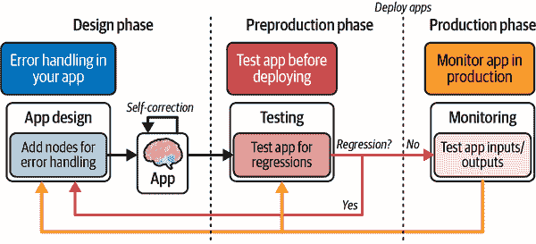
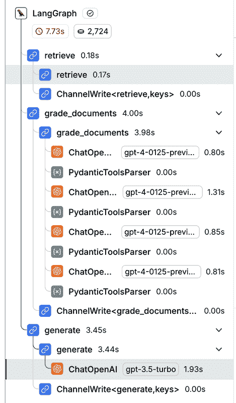
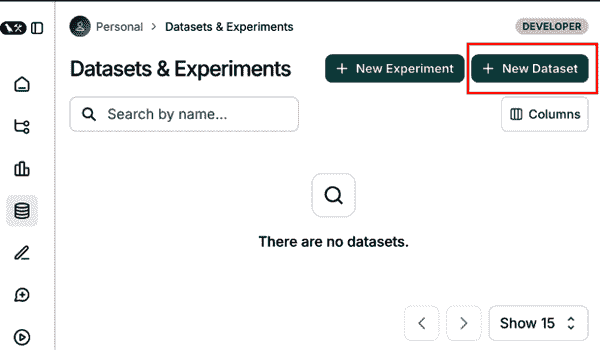
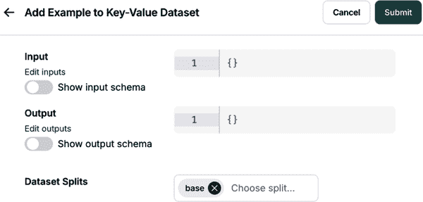
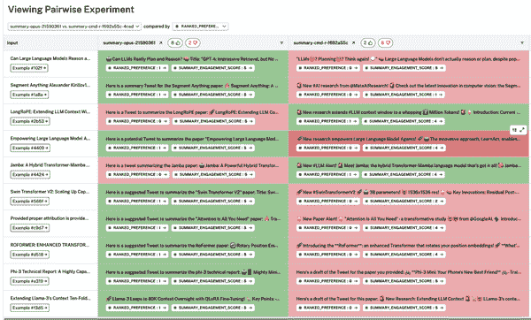
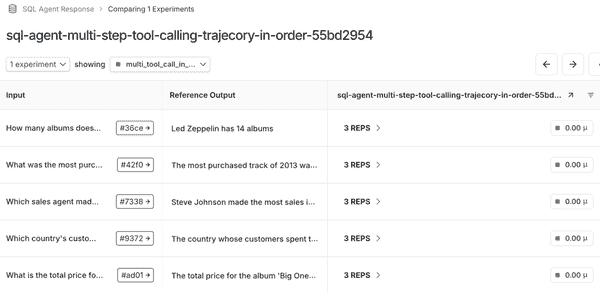

# 第十章\. 测试：评估、监控和持续改进

在第九章中，您学习了如何将您的 AI 应用程序部署到生产环境中，并利用 LangGraph 平台托管和调试您的应用程序。

虽然您的应用程序可以响应用户输入并执行复杂任务，但其底层的 LLM 是非确定性的，容易产生幻觉。正如前几章所讨论的，LLM 由于各种原因（包括提示、用户输入的格式和检索到的上下文）可能会生成不准确和过时的输出。此外，有害或误导性的 LLM 输出可能会严重损害公司的品牌和客户忠诚度。

为了对抗这种幻觉倾向，您需要建立一个高效的系统来测试、评估、监控和持续改进您的 LLM 应用程序的性能。这个强大的测试过程将使您能够在应用程序生产前后快速调试和修复 AI 相关的问题。

在本章中，您将学习如何构建一个迭代测试系统，跨越 LLM 应用程序开发生命周期的关键阶段，并保持您应用程序的高性能。

# LLM 应用开发周期中的测试技术

在我们构建测试系统之前，让我们简要回顾一下如何在 LLM 应用程序开发的三个关键阶段应用测试：

设计

在这个阶段，LLM 测试将直接应用于您的应用程序。这些测试可以是运行时执行的断言，将失败反馈给 LLM 进行自我纠正。在这个阶段进行测试的目的是在它影响用户之前，在您的应用程序中处理错误。

预生产

在这个阶段，测试是在部署到生产之前运行的。在这个阶段进行测试的目的是在应用程序发布给真实用户之前捕捉和修复任何回归。

生产

在这个阶段，测试在生产环境中运行，以帮助监控和捕捉影响真实用户的错误。其目的是识别问题并将它们反馈到设计或预生产阶段。

通过这些阶段的测试组合，创建了一个持续改进的周期，其中这些步骤被重复：设计、测试、部署、监控、修复和重新设计。参见图 10-1。



###### 图 10-1\. LLM 应用程序开发周期的三个关键阶段

从本质上讲，这个周期帮助您以高效和快捷的方式识别和修复生产问题。

让我们深入了解每个阶段的测试技术。

# 设计阶段：自我纠正的 RAG

如前所述，您的应用程序可以在运行时进行错误处理，将错误反馈给 LLM 进行自我纠正。让我们通过使用 LangGraph 作为框架来编排错误处理，来探讨一个 RAG 用例。

基本的 RAG 驱动的 AI 应用由于检索相关上下文不准确或不完整，生成输出时容易出现幻觉。但您可以使用 LLM 来评估检索的相关性并修复幻觉问题。

LangGraph 使您能够有效地实现此过程的控制流，如图图 10-2 所示。


###### 图 10-2\. 自纠正的 RAG 控制流

控制流步骤如下：

1.  在路由步骤中，每个问题都被路由到相关的检索方法，即向量存储和网页搜索。

1.  例如，如果问题被路由到向量存储进行检索，控制流中的 LLM 将检索并评估文档的相关性。

1.  如果文档相关，LLM 将继续生成答案。

1.  LLM 将检查答案中的幻觉，并且只有在输出准确且相关的情况下才会向用户显示答案。

1.  作为后备方案，如果检索到的文档不相关或生成的答案没有回答用户的问题，流程将利用网页搜索检索相关信息作为上下文。

此过程使您的应用能够迭代生成答案，自我纠正错误和幻觉，并提高输出质量。

让我们通过一个示例代码实现来了解这个控制流的流程。首先，下载所需的包并初始化相关的 API 密钥。对于这些示例，您需要将您的 OpenAI 和 LangSmith API 密钥设置为环境变量。

首先，我们将创建三个博客文章的索引：

*Python*

```py
from langchain.text_splitter import RecursiveCharacterTextSplitter
from langchain_community.document_loaders import WebBaseLoader
from langchain_community.vectorstores import InMemoryVectorStore
from langchain_openai import OpenAIEmbeddings
from langchain_core.prompts import ChatPromptTemplate
from pydantic import BaseModel, Field
from langchain_openai import ChatOpenAI

# --- Create an index of documents ---

urls = [
    "https://blog.langchain.dev/top-5-langgraph-agents-in-production-2024/",
    "https://blog.langchain.dev/langchain-state-of-ai-2024/",
    "https://blog.langchain.dev/introducing-ambient-agents/",
]

docs = [WebBaseLoader(url).load() for url in urls]
docs_list = [item for sublist in docs for item in sublist]

text_splitter = RecursiveCharacterTextSplitter.from_tiktoken_encoder(
    chunk_size=250, chunk_overlap=0
)
doc_splits = text_splitter.split_documents(docs_list)

# Add to vectorDB
vectorstore = InMemoryVectorStore.from_documents(
    documents=doc_splits,
    embedding=OpenAIEmbeddings(),
)
retriever = vectorstore.as_retriever()

# Retrieve the relevant documents
results = retriever.invoke(
    "What are 2 LangGraph agents used in production in 2024?")

print("Results: \n", results)
```

*JavaScript*

```py
import { RecursiveCharacterTextSplitter } from '@langchain/textsplitters';
import {
  CheerioWebBaseLoader
} from "@langchain/community/document_loaders/web/cheerio";
import { 
  InMemoryVectorStore 
} from '@langchain/community/vectorstores/in_memory';
import { OpenAIEmbeddings } from '@langchain/openai';
import { ChatPromptTemplate } from '@langchain/core/prompts';
import { z } from 'zod';
import { ChatOpenAI } from '@langchain/openai';

const urls = [
  'https://blog.langchain.dev/top-5-langgraph-agents-in-production-2024/',
  'https://blog.langchain.dev/langchain-state-of-ai-2024/',
  'https://blog.langchain.dev/introducing-ambient-agents/',
];

// Load documents from URLs
const loadDocs = async (urls) => {
  const docs = [];
  for (const url of urls) {
    const loader = new CheerioWebBaseLoader(url);
    const loadedDocs = await loader.load();
    docs.push(...loadedDocs);
  }
  return docs;
};

const docsList = await loadDocs(urls);

// Initialize the text splitter
const textSplitter = new RecursiveCharacterTextSplitter({
  chunkSize: 250,
  chunkOverlap: 0,
});

// Split the documents into smaller chunks
const docSplits = textSplitter.splitDocuments(docsList);

// Add to vector database
const vectorstore = await InMemoryVectorStore.fromDocuments(
  docSplits,
  new OpenAIEmbeddings()
);

// The `retriever` object can now be used for querying
const retriever = vectorstore.asRetriever(); 

const question = 'What are 2 LangGraph agents used in production in 2024?';

const docs = retriever.invoke(question);

console.log('Retrieved documents: \n', docs[0].page_content);
```

如前所述，LLM 将评估从索引中检索到的文档的相关性。我们可以在系统提示中构建此指令：

*Python*

```py
### Retrieval Grader

from langchain_core.prompts import ChatPromptTemplate
from langchain_core.pydantic_v1 import BaseModel, Field
from langchain_openai import ChatOpenAI

# Data model
class GradeDocuments(BaseModel):
    """Binary score for relevance check on retrieved documents."""

    binary_score: str = Field(
        description="Documents are relevant to the question, 'yes' or 'no'"
    )

# LLM with function call
llm = ChatOpenAI(model="gpt-3.5-turbo", temperature=0)
structured_llm_grader = llm.with_structured_output(GradeDocuments)

# Prompt
system = """You are a grader assessing relevance of a retrieved document to a
 user question. 
 If the document contains keyword(s) or semantic meaning related to the 
 question, grade it as relevant. 
 Give a binary score 'yes' or 'no' to indicate whether the document is 
 relevant to the question."""
grade_prompt = ChatPromptTemplate.from_messages(
    [
        ("system", system),
        ("human", """Retrieved document: \n\n {document} \n\n User question: 
            {question}"""),
    ]
)

retrieval_grader = grade_prompt | structured_llm_grader
question = "agent memory"
docs = retriever.get_relevant_documents(question)
doc_txt = docs[0].page_content # as an example
retrieval_grader`.`invoke({"question": question, "document": doc_txt})
```

*JavaScript*

```py
import { ChatPromptTemplate } from "@langchain/core/prompts";
import { z } from "zod";
import { ChatOpenAI } from "@langchain/openai";

// Define the schema using Zod
const GradeDocumentsSchema = z.object({
  binary_score: z.string().describe(`Documents are relevant to the question, 
 'yes' or 'no'`),
});

// Initialize LLM with structured output using Zod schema
const llm = new ChatOpenAI({ model: "gpt-3.5-turbo", temperature: 0 });
const structuredLLMGrader = llm.withStructuredOutput(GradeDocumentsSchema);

// System and prompt template
const systemMessage = `You are a grader assessing relevance of a retrieved 
 document to a user question. 
If the document contains keyword(s) or semantic meaning related to the 
 question, grade it as relevant.
Give a binary score 'yes' or 'no' to indicate whether the document is relevant 
 to the question.`;

const gradePrompt = ChatPromptTemplate.fromMessages([
  { role: "system", content: systemMessage },
  {
    role: "human",
    content: "Retrieved document: \n\n {document} \n\n 
 User question: {question}",
  },
]);

// Combine prompt with the structured output
const retrievalGrader = gradePrompt.pipe(structuredLLMGrader);

const question = "agent memory";
const docs = await retriever.getRelevantDocuments(question);

await retrievalGrader.invoke({
  question,
  document: docs[1].pageContent,
});
```

*输出：*

```py
binary_score='yes'
```

注意 Pydantic/Zod 的使用，它有助于以编程方式决定控制流中哪个节点需要移动的格式来帮助模型二进制决策输出。

在 LangSmith 中，您可以看到之前讨论的节点之间的逻辑流程跟踪（见图图 10-3）。



###### 图 10-3\. LangSmith 跟踪结果

让我们测试一下，当输入问题无法由索引中的检索到的文档回答时会发生什么。

首先，利用 LangGraph 使其更容易构建、执行和调试完整的控制流。请参阅书中[GitHub 仓库](https://oreil.ly/v63Vr)中的完整图定义。请注意，我们已添加一个`transform_query`节点，以帮助重写输入查询，使其格式适用于网页搜索以检索更高质量的结果。

作为最后一步，我们设置了我们的网络搜索工具，并使用无上下文问题执行图。LangSmith 追踪显示，网络搜索工具被用作回退来检索在最终 LLM 生成答案之前的相关信息（见图 10-4）。


###### 图 10-4\. 利用网络搜索作为回退进行自我纠正 RAG 的 LangSmith 追踪

让我们继续进入 LLM 应用测试的下一阶段：预生产阶段。

# 预生产阶段

测试预生产阶段的目的是在投入生产之前衡量和评估您应用程序的性能。这将使您能够有效地评估利用 LLM 的准确性、延迟和成本。

## 创建数据集

在测试之前，您需要定义一组您想要测试和评估的场景。*数据集* 是一组示例，提供输入和预期输出，用于评估您的 LLM 应用程序。

这些是构建估值数据集的三个常用方法：

手动整理的示例

这些是基于预期用户输入和理想生成输出的手写示例。小型数据集包含 10 到 50 个高质量的示例。随着时间的推移，可以根据生产中出现的边缘情况向数据集中添加更多示例。

应用日志

一旦应用程序投入生产，您就可以存储实时用户输入，并在以后将它们添加到数据集中。这将有助于确保数据集的现实性和涵盖最常见的问题。

合成数据

这些是人工生成的示例，用于模拟各种场景和边缘情况。这使您可以通过采样现有输入来生成新的输入，这在您没有足够真实数据来测试时非常有用。

在 LangSmith 中，您可以通过在侧边栏中选择数据集和测试，然后点击应用程序右上角的“+ 新数据集”按钮来创建新的数据集，如图图 10-5 所示。

在打开的窗口中，输入相关的数据集详细信息，包括名称、描述和数据集类型。如果您想使用自己的数据集，请点击“上传 CSV 数据集”按钮。



###### 图 10-5\. 在 LangSmith UI 中创建新的数据集

LangSmith 提供了三种不同的数据集类型：

`kv` (键值) 数据集

+   *输入* 和 *输出* 以任意键值对的形式表示。

+   `kv` 数据集是最通用的，也是默认类型。`kv` 数据集适用于广泛的评估场景。

+   此数据集类型非常适合评估需要多个输入或生成多个输出的链和代理。

`llm` (大型语言模型) 数据集

+   `llm` 数据集是为评估完成风格语言模型而设计的。

+   输入字典包含一个映射到提示字符串的单个输入键。

+   输出字典包含一个输出键，映射到相应的响应字符串。

+   此数据集类型通过为输入和输出提供标准化格式来简化 LLM 的评估。

`chat` 数据集

+   `chat` 数据集是为评估 LLM 结构化聊天消息作为输入和输出而设计的。

+   **inputs** 字典包含一个单个的 **input** 键，映射到一个序列化的聊天消息列表。

+   **outputs** 字典包含一个单个的 **output** 键，映射到一个序列化的聊天消息列表。

+   此数据集类型对于评估对话式人工智能系统或聊天机器人很有用。

最灵活的选项是键值数据类型（见 图 10-6）。


###### 图 10-6\. 在 LangSmith UI 中选择数据集类型

接下来，通过点击“添加示例”将示例添加到数据集中。提供输入和输出示例作为 JSON 对象，如图 图 10-7 所示。



###### 图 10-7\. 在 LangSmith UI 中添加键值数据集示例

您还可以在“数据集模式”部分定义您数据集的模式，如图 图 10-8 所示。


###### 图 10-8\. 在 LangSmith UI 中添加数据集模式

## 定义您的评估标准

在创建您的数据集后，您需要在部署到生产之前定义评估指标来评估您的应用程序的输出。这种在预定测试套件上的批量评估通常被称为**离线评估**。

对于离线评估，您可以可选地为测试的数据点标记预期的输出（即，地面真实参考）。这使您能够将应用程序的响应与地面真实参考进行比较，如图 图 10-9 所示。


###### 图 10-9\. 人工智能评估图

有三个主要的评估器来评估您的 LLM 应用程序性能：

人类评估器

如果您无法将测试要求表达为代码，您可以使用人类反馈来表达定性特征，并用分数标记应用程序响应。LangSmith 通过注释队列加快收集和整合人类反馈的过程。

启发式评估器

这些是硬编码的函数和断言，它们执行计算以确定分数。您可以使用无参考启发式（例如，检查输出是否为有效的 JSON）或基于参考的启发式（例如，准确性）。基于参考的评估将输出与预定义的地面真实值进行比较，而无需参考的评估评估定性特征，而不需要地面真实值。自定义启发式评估器对于代码生成任务（如模式检查和单元测试）非常有用，这些任务具有硬编码的评估逻辑。

LLM 作为裁判的评估器

此评估器将人工评分规则集成到 LLM 提示中，以评估输出相对于数据集输出提供的参考答案是否正确。在预生产迭代中，您需要审核分数并调整 LLM 作为裁判以生成可靠的分数。

要开始评估，可以从简单的启发式评估器开始。然后，在转向 LLM 作为裁判以自动化人工审查之前，先实施人工评估。这使你能够在标准定义良好后增加深度和规模。

###### 小贴士

当使用 LLM 作为裁判的评估器时，请使用简单明了的提示，这些提示可以轻松复制并由人类理解。例如，避免要求 LLM 在 0 到 10 的范围内生成带有模糊区分的分数。

图 10-10 展示了在 RAG 用例中 LLM 作为裁判的评估器。请注意，参考答案是地面真实值。


###### 图 10-10\. 在 RAG 用例中使用的 LLM 作为裁判的评估器

### 提高 LLM 作为裁判评估器的性能

使用 LLM 作为裁判是一种评估来自 LLM 应用程序的自然语言输出的有效方法。这涉及将生成的输出传递给另一个 LLM 进行判断和评估。但您如何信任 LLM 作为裁判评估的结果？

通常需要多轮提示工程来提高准确性，这既繁琐又耗时。幸运的是，LangSmith 提供了一种 *几次* 提示解决方案，其中将人类对 LLM 作为裁判输出的更正存储为几次示例，然后在未来的迭代中将这些示例反馈到提示中。

通过利用几次学习，LLM 可以通过提供正确行为的示例来提高准确性并使输出与人类偏好保持一致。这在难以构建关于 LLM 应如何行为或格式化的指令时特别有用。

几次评估器遵循以下步骤：

1.  LLM 评估器对生成的输出提供反馈，评估因素如正确性、相关性或其他标准。

1.  它在 LangSmith 中添加了人类更正来修改或纠正 LLM 评估器的反馈。这就是人类偏好和判断被捕捉的地方。

1.  这些更正被存储为 LangSmith 中的几次示例，并可以选择为更正留下解释。

1.  将少量样本示例纳入后续评估运行的未来提示中。

随着时间的推移，少量样本评估器将越来越符合人类偏好。这种自我改进机制减少了耗时提示工程的需求，同时提高了 LLM 作为裁判评估的准确性和相关性。

这是如何在 LangSmith 中轻松设置 LLM 作为裁判评估器以进行离线评估的方法。首先，导航到侧边栏中的“数据集和测试”部分，并选择您想要配置评估器的数据集。点击仪表板右上角的添加自动评估器按钮，将评估器添加到数据集中。这将打开一个模态，您可以使用它来配置评估器。

选择 LLM 作为裁判选项，并为您的评估器命名。现在您可以选择设置内联提示或从提示中心加载提示，该提示将用于评估实验中运行的结果。为了本例，请选择创建少量样本评估器选项，如图图 10-11 所示。


###### 图 10-11\. LangSmith UI 中的 LLM 作为裁判评估器选项

此选项将创建一个包含少量样本的数据集，当您在评估器反馈中进行更正时将自动填充。此数据集中的示例将被插入到系统提示消息中。

您还可以在 Schema 字段中指定评分标准，并在原始类型之间切换——例如，整数和布尔值（见图 10-12）。


###### 图 10-12\. LLM 作为裁判评估器的评分标准

保存评估器并导航回数据集详细信息页面。从现在起，每个后续实验运行都将由您配置的评估器进行评估。

### 成对评估

根据偏好对 LLM 输出进行排名可能对人类或 LLM 作为裁判的评估者来说认知要求较低。例如，评估哪个输出更信息丰富、更具体或更安全。成对评估同时比较来自应用程序不同版本的两个输出，以确定哪个版本更好地满足评估标准。

LangSmith 本地支持运行和可视化成对 LLM 应用生成，根据成对评估器设定的指南突出显示对某一生成版本相对于另一版本的偏好。LangSmith 的成对评估使您能够执行以下操作：

+   使用任何期望的标准定义一个自定义成对 LLM 作为裁判的评估器

+   使用此评估器比较两个 LLM 生成版本

根据 LangSmith [文档](https://oreil.ly/ruFvy)，您可以在 LangSmith SDK 中使用自定义成对评估器，并在 LangSmith UI 中可视化成对评估的结果。

在创建评估实验后，您可以在“数据集与实验”部分导航到成对实验选项卡。用户界面允许您深入了解每个成对实验，显示根据我们的标准，哪个 LLM 生成被优先考虑。如果您点击每个答案下的 RANKED_PREFERENCE 分数，您可以深入了解每个评估跟踪（见图 10-13）。



###### 图 10-13\. 成对实验 UI 评估跟踪

## 回归测试

在传统的软件开发中，测试应根据功能要求通过 100%。这确保了测试验证后的稳定行为。然而，由于模型 *漂移*（由于数据分布的变化或模型的更新而导致的退化），AI 模型的输出性能可能会有很大差异。因此，测试 AI 应用程序可能不会始终导致评估数据集上的完美分数。

这有几个含义。首先，跟踪测试结果和性能随时间的变化，以防止应用程序性能的回归。*回归*测试确保应用程序的最新更新或 LLM 模型的更改相对于基线不会*退化*（表现更差）。

其次，比较两个或多个实验运行之间的单个数据点非常重要，以查看模型在哪里做得正确或错误。

LangSmith 的比较视图原生支持回归测试，允许您快速查看相对于基线发生变化的示例。在 LangSmith 仪表板中，回归或改进的运行以不同的方式突出显示（见图 10-14）。


###### 图 10-14\. LangSmith 的实验比较视图

在 LangSmith 的比较实验仪表板中，您可以执行以下操作：

+   比较与数据集相关的多个实验和运行。运行聚合统计对于迁移模型或提示很有用，这可能会导致性能改进或特定示例的回归。

+   设置一个基线运行，并将其与先前应用程序版本进行比较，以检测意外的回归。如果发生回归，您可以隔离应用程序版本和包含性能变化的特定示例。

+   深入研究比较实验和运行之间行为不同的数据点。

这种回归测试对于确保您的应用程序在更新和 LLM 变化后保持高性能至关重要。

现在我们已经涵盖了各种预生产测试策略，让我们探索一个具体用例。

## 评估代理的端到端性能

尽管代理在执行自主任务和工作流程方面展现出很多潜力，但测试代理的性能可能会很具挑战性。在前几章中，你学习了代理如何通过工具调用、规划和记忆来生成响应。特别是，工具调用使模型能够通过生成一个要调用的工具及其执行工具所需的输入参数来响应给定的提示。

由于代理使用 LLM 来决定应用程序的控制流程，每个代理运行的结果可能会有很大差异。例如，可能会调用不同的工具，代理可能会陷入循环，或者从开始到结束的步骤数量可能会有很大差异。

理想情况下，代理应该在三个不同粒度的级别上进行测试：

响应

代理的最终响应，重点关注端到端性能。输入是一个提示和一个可选的工具列表，而输出是最终的代理响应。

单步

代理的任何单个重要步骤，用于深入特定的工具调用或决策。在这种情况下，输出是一个工具调用。

轨迹

代理的完整轨迹。在这种情况下，输出是工具调用的列表。

图 10-15 展示了这些级别：


###### 图 10-15\. 一个代理应用程序流程的示例

让我们更深入地探讨这三个代理测试粒度中的每一个。

### 测试代理的最终响应

为了评估代理在任务上的整体性能，你可以将代理视为一个黑盒，并根据它是否完成任务来定义成功。

测试代理的最终响应通常涉及以下内容：

输入

用户输入和（可选）预定义的工具

输出

代理的最终响应

评估者

LLM 作为裁判

为了以编程方式实现这一点，首先创建一个包含代理问题和预期答案的数据集：

*Python*

```py
from langsmith import Client

client = Client()

# Create a dataset
examples = [
    ("Which country's customers spent the most? And how much did they spend?",
        """The country whose customers spent the most is the USA, with a total 
 expenditure of $523.06"""),
    ("What was the most purchased track of 2013?", 
        "The most purchased track of 2013 was Hot Girl."),
    ("How many albums does the artist Led Zeppelin have?",
        "Led Zeppelin has 14 albums"),
    ("What is the total price for the album “Big Ones”?",
        "The total price for the album 'Big Ones' is 14.85"),
    ("Which sales agent made the most in sales in 2009?", 
        "Steve Johnson made the most sales in 2009"),
]

dataset_name = "SQL Agent Response"
if not client.has_dataset(dataset_name=dataset_name):
    dataset = client.create_dataset(dataset_name=dataset_name)
    inputs, outputs = zip(
        *[({"input": text}, {"output": label}) for text, label in examples]
    )
    client.create_examples(inputs=inputs, outputs=outputs, dataset_id=dataset.id)

## chain
def predict_sql_agent_answer(example: dict):
    """Use this for answer evaluation"""
    msg = {"messages": ("user", example["input"])}
    messages = graph.invoke(msg, config)
    return {"response": messages['messages'][-1].content}
```

*JavaScript*

```py
import { Client } from 'langsmith';

const client = new Client();

// Create a dataset
const examples = [
  ["Which country's customers spent the most? And how much did they spend?", 
    `The country whose customers spent the most is the USA, with a total 
 expenditure of $523.06`],
  ["What was the most purchased track of 2013?", 
    "The most purchased track of 2013 was Hot Girl."],
  ["How many albums does the artist Led Zeppelin have?", 
    "Led Zeppelin has 14 albums"],
  ["What is the total price for the album 'Big Ones'?", 
    "The total price for the album 'Big Ones' is 14.85"],
  ["Which sales agent made the most in sales in 2009?", 
    "Steve Johnson made the most sales in 2009"],
];

const datasetName = "SQL Agent Response";

async function createDataset() {
  const hasDataset = await client.hasDataset({ datasetName });

  if (!hasDataset) {
    const dataset = await client.createDataset(datasetName);
    const inputs = examples.map(([text]) => ({ input: text }));
    const outputs = examples.map(([, label]) => ({ output: label }));

    await client.createExamples({ inputs, outputs, datasetId: dataset.id });
  }
}

createDataset();

// Chain function
async function predictSqlAgentAnswer(example) {
  // Use this for answer evaluation
  const msg = { messages: [{ role: "user", content: example.input }] };
  const output = await graph.invoke(msg, config);
  return { response: output.messages[output.messages.length - 1].content };
}
```

接下来，如前所述，我们可以利用 LLM 来比较生成的答案与参考答案：

*Python*

```py
from langchain import hub
from langchain_openai import ChatOpenAI
from langsmith.evaluation import evaluate

# Grade prompt
grade_prompt_answer_accuracy = hub.pull("langchain-ai/rag-answer-vs-reference")

def answer_evaluator(run, example) -> dict:
    """
 A simple evaluator for RAG answer accuracy
 """

    # Get question, ground truth answer, RAG chain answer
    input_question = example.inputs["input"]
    reference = example.outputs["output"]
    prediction = run.outputs["response"]

    # LLM grader
    llm = ChatOpenAI(model="gpt-4o", temperature=0)

    # Structured prompt
    answer_grader = grade_prompt_answer_accuracy | llm

    # Run evaluator
    score = answer_grader.invoke({"question": input_question,
                                  "correct_answer": reference,
                                  "student_answer": prediction})
    score = score["Score"]

    return {"key": "answer_v_reference_score", "score": score}

## Run evaluation
experiment_results = evaluate(
    predict_sql_agent_answer,
    data=dataset_name,
    evaluators=[answer_evaluator],
    num_repetitions=3,
)
```

*JavaScript*

```py
import { pull } from "langchain/hub";
import { ChatOpenAI } from "langchain_openai";
import { evaluate } from "langsmith/evaluation";

async function answerEvaluator(run, example) {
  /**
 * A simple evaluator for RAG answer accuracy
 */

  // Get question, ground truth answer, RAG chain answer
  const inputQuestion = example.inputs["input"];
  const reference = example.outputs["output"];
  const prediction = run.outputs["response"];

  // LLM grader
  const llm = new ChatOpenAI({ model: "gpt-4o", temperature: 0 });

  // Grade prompt 
  const gradePromptAnswerAccuracy = pull(
    "langchain-ai/rag-answer-vs-reference"
  );

  // Structured prompt
  const answerGrader = gradePromptAnswerAccuracy.pipe(llm);

  // Run evaluator
  const scoreResult = await answerGrader.invoke({
    question: inputQuestion,
    correct_answer: reference,
    student_answer: prediction
  });

  const score = scoreResult["Score"];

  return { key: "answer_v_reference_score", score: score };
}

// Run evaluation
const experimentResults = evaluate(predictSqlAgentAnswer, {
  data: datasetName,
  evaluators: [answerEvaluator],
  numRepetitions: 3,
});
```

### 测试代理的单步

测试代理的个别动作或决策可以使你具体识别和分析应用程序性能不佳的地方。测试代理的单步涉及以下内容：

输入

单步的用户输入（例如，用户提示、工具集）。这也可以包括之前完成的步骤。

输出

从输入步骤的 LLM 响应，通常包含指示代理下一步应采取什么行动的工具调用。

评估者

正确工具选择的二进制分数和对工具输入准确性的启发式评估。

以下示例使用自定义评估器检查特定的工具调用：

*Python*

```py
from langsmith.schemas import Example, Run

def predict_assistant(example: dict):
    """Invoke assistant for single tool call evaluation"""
    msg = [ ("user", example["input"]) ]
    result = assistant_runnable.invoke({"messages":msg})
    return {"response": result}

def check_specific_tool_call(root_run: Run, example: Example) -> dict:
    """
 Check if the first tool call in the response matches the expected tool call.
 """
    # Expected tool call
    expected_tool_call = 'sql_db_list_tables'

    # Run
    response = root_run.outputs["response"]

    # Get tool call
    try:
        tool_call = getattr(response, 'tool_calls', [])[0]['name']
    except (IndexError, KeyError):
        tool_call = None

    score = 1 if tool_call == expected_tool_call else 0
    return {"score": score, "key": "single_tool_call"}

experiment_results = evaluate(
    predict_assistant,
    data=dataset_name,
    evaluators=[check_specific_tool_call],
    num_repetitions=3,
    metadata={"version": metadata},
)
```

*JavaScript*

```py
import {evaluate} from 'langsmith/evaluation';

// Predict Assistant
function predictAssistant(example) {
    /**
 * Invoke assistant for single tool call evaluation
 */
    const msg = [{ role: "user", content: example.input }];
    const result = assistantRunnable.invoke({ messages: msg });
    return { response: result };
}

// Check Specific Tool Call
function checkSpecificToolCall(rootRun, example) {
    /**
 * Check if the first tool call in the response matches the expected 
 * tool call.
 */

    // Expected tool call
    const expectedToolCall = "sql_db_list_tables";

    // Run
    const response = rootRun.outputs.response;

    // Get tool call
    let toolCall;
    try {
        toolCall = response.tool_calls?.[0]?.name;
    } catch (error) {
        toolCall = null;
    }

    const score = toolCall === expectedToolCall ? 1 : 0;
    return { score, key: "single_tool_call" };
}

// Experiment Results
const experimentResults = evaluate(predictAssistant, {
    data: datasetName,
    evaluators: [checkSpecificToolCall],
    numRepetitions: 3,
});
```

以下代码块实现了这些不同的组件：

+   使用提示调用辅助程序 `assistant_runnable` 并检查结果工具调用是否符合预期。

+   使用专门代理，其中工具是硬编码的，而不是与数据集输入一起传递。

+   为我们正在评估的步骤指定`expected_tool_call`的参考工具调用。

### 测试代理的轨迹

重要的是回顾代理所采取的步骤，以评估轨迹是否与代理的预期一致——即所采取的步骤数量或步骤序列。

测试代理的轨迹包括以下内容：

输入

用户输入和（可选）预定义工具。

输出

工具调用的预期序列或任意顺序的工具调用列表。

评估器

函数覆盖了所采取的步骤。为了测试输出，你可以查看精确匹配的二进制分数或关注错误步骤数量的指标。你需要将完整代理的轨迹与参考轨迹进行比较，然后将其编译为传递给 LLM 作为裁判的消息集。

以下示例评估了使用自定义评估器的工具调用轨迹：

*Python*

```py
def predict_sql_agent_messages(example: dict):
    """Use this for answer evaluation"""
    msg = {"messages": ("user", example["input"])}
    messages = graph.invoke(msg, config)
    return {"response": messages}

def find_tool_calls(messages):
    """
 Find all tool calls in the messages returned
 """
    tool_calls = [
        tc['name']
        for m in messages['messages'] for tc in getattr(m, 'tool_calls', [])
    ]
    return tool_calls

def contains_all_tool_calls_any_order(
    root_run: Run, example: Example
) -> dict:
    """
 Check if all expected tools are called in any order.
 """
    expected = [
        'sql_db_list_tables',
        'sql_db_schema',
        'sql_db_query_checker',
        'sql_db_query',
        'check_result'
    ]
    messages = root_run.outputs["response"]
    tool_calls = find_tool_calls(messages)
    # Optionally, log the tool calls -
    #print("Here are my tool calls:")
    #print(tool_calls)
    if set(expected) <= set(tool_calls):
        score = 1
    else:
        score = 0
    return {"score": int(score), "key": "multi_tool_call_any_order"}

def contains_all_tool_calls_in_order(root_run: Run, example: Example) -> dict:
    """
 Check if all expected tools are called in exact order.
 """
    messages = root_run.outputs["response"]
    tool_calls = find_tool_calls(messages)
    # Optionally, log the tool calls -
    #print("Here are my tool calls:")
    #print(tool_calls)
    it = iter(tool_calls)
    expected = [
        'sql_db_list_tables', 
        'sql_db_schema', 
        'sql_db_query_checker',
        'sql_db_query', 
        'check_result'
    ]
    if all(elem in it for elem in expected):
        score = 1
    else:
        score = 0
    return {"score": int(score), "key": "multi_tool_call_in_order"}

def contains_all_tool_calls_in_order_exact_match(
    root_run: Run, example: Example
) -> dict:
    """
 Check if all expected tools are called in exact order and without any 
 additional tool calls.
 """
    expected = [
        'sql_db_list_tables',
        'sql_db_schema',
        'sql_db_query_checker',
        'sql_db_query',
        'check_result'
    ]
    messages = root_run.outputs["response"]
    tool_calls = find_tool_calls(messages)
    # Optionally, log the tool calls -
    #print("Here are my tool calls:")
    #print(tool_calls)
    if tool_calls == expected:
        score = 1
    else:
        score = 0

    return {"score": int(score), "key": "multi_tool_call_in_exact_order"}

experiment_results = evaluate(
    predict_sql_agent_messages,
    data=dataset_name,
    evaluators=[
        contains_all_tool_calls_any_order,
        contains_all_tool_calls_in_order,
        contains_all_tool_calls_in_order_exact_match
    ],
    num_repetitions=3,
)
```

*JavaScript*

```py
import {evaluate} from 'langsmith/evaluation';

// Predict SQL Agent Messages
function predictSqlAgentMessages(example) {
  /**
 * Use this for answer evaluation
 */
  const msg = { messages: [{ role: "user", content: example.input }] };
  // Replace with your graph and config
  const messages = graph.invoke(msg, config); 
  return { response: messages };
}

// Find Tool Calls
function findToolCalls({messages}) {
  /**
 * Find all tool calls in the messages returned
 */
  return messages.flatMap(m => m.tool_calls?.map(tc => tc.name) || []);
}

// Contains All Tool Calls (Any Order)
function containsAllToolCallsAnyOrder(rootRun, example) {
  /**
 * Check if all expected tools are called in any order.
 */
  const expected = [
    "sql_db_list_tables",
    "sql_db_schema",
    "sql_db_query_checker",
    "sql_db_query",
    "check_result"
  ];
  const messages = rootRun.outputs.response;
  const toolCalls = findToolCalls(messages);

  const score = expected.every(tool => toolCalls.includes(tool)) ? 1 : 0;
  return { score, key: "multi_tool_call_any_order" };
}

// Contains All Tool Calls (In Order)
function containsAllToolCallsInOrder(rootRun, example) {
  /**
 * Check if all expected tools are called in exact order.
 */
  const messages = rootRun.outputs.response;
  const toolCalls = findToolCalls(messages);

  const expected = [
    "sql_db_list_tables",
    "sql_db_schema",
    "sql_db_query_checker",
    "sql_db_query",
    "check_result"
  ];

  const score = expected.every(tool => {
    let found = false;
    for (let call of toolCalls) {
      if (call === tool) {
          found = true;
          break;
      }
    }
    return found;
  }) ? 1 : 0;

  return { score, key: "multi_tool_call_in_order" };
}

// Contains All Tool Calls (Exact Order, Exact Match)
function containsAllToolCallsInOrderExactMatch(rootRun, example) {
  /**
 * Check if all expected tools are called in exact order and without any 
 * additional tool calls.
 */
  const expected = [
    "sql_db_list_tables",
    "sql_db_schema",
    "sql_db_query_checker",
    "sql_db_query",
    "check_result"
  ];
  const messages = rootRun.outputs.response;
  const toolCalls = findToolCalls(messages);

  const score = JSON.stringify(toolCalls) === JSON.stringify(expected) 
    ? 1 
    : 0;
  return { score, key: "multi_tool_call_in_exact_order" };
}

// Experiment Results
const experimentResults = evaluate(predictSqlAgentMessages, {
  data: datasetName,
  evaluators: [
    containsAllToolCallsAnyOrder,
    containsAllToolCallsInOrder,
    containsAllToolCallsInOrderExactMatch
  ],
  numRepetitions: 3,
});
```

此实现示例包括以下内容：

+   使用提示调用预编译的 LangGraph 代理`graph.invoke`

+   使用专门代理，其中工具是硬编码的，而不是与数据集输入一起传递

+   使用函数`find_tool_calls`提取调用工具的列表

+   使用函数`contains_all_tool_calls_any_order`或按顺序使用`contains_all_tool_calls_in_order`检查是否以任何顺序调用了所有预期的工具

+   使用`contains_all_tool_calls_in_order_exact_match`检查是否以精确顺序调用了所有预期的工具

这三种代理评估方法都可以在 LangSmith 的实验 UI 中观察和调试（见图 10-16）。



###### 图 10-16\. LangSmith UI 中代理评估测试的示例

通常，这些测试是帮助减轻代理因 LLM 调用和工具调用变化而产生的成本和不可靠性的良好起点。

# 生产

虽然在预生产阶段进行测试很有用，但某些错误和边缘情况可能直到你的 LLM 应用程序与真实用户交互时才会出现。这些问题可能会影响延迟，以及输出的相关性和准确性。此外，可观察性和在线评估的过程可以帮助确保 LLM 输入或输出有护栏。这些护栏可以提供必要的保护，防止提示注入和毒性。

此过程的第一步是设置 LangSmith 的跟踪功能。

## 跟踪

*跟踪*是一系列步骤，您的应用程序从输入到输出所采取的。LangSmith 使可视化、调试和测试从您的应用程序生成的每个跟踪变得容易。

一旦您安装了相关的 LangChain 和 LLM 依赖项，您需要做的就是根据您的 LangSmith 账户凭据配置跟踪环境变量：

```py
export LANGCHAIN_TRACING_V2=true
export LANGCHAIN_API_KEY=<your-api-key>

# The below examples use the OpenAI API, though you can use other LLM providers

export OPENAI_API_KEY=<your-openai-api-key>
```

环境变量设置后，不需要其他代码即可启用跟踪。跟踪将自动记录到 LangSmith 仪表板“跟踪项目”部分的特定项目中。提供的指标包括跟踪量、成功和失败率、延迟、令牌计数和成本等——如图 10-17 所示。


###### 图 10-17\. LangSmith 跟踪性能指标的一个示例

您可以根据需要审查各种基于跟踪的策略。

## 在生产中收集反馈

与预生产阶段不同，生产测试的评估器没有为 LLM 提供基于的参考响应。相反，评估器需要实时评估性能，因为您的应用程序处理用户输入。这种无参考的实时评估通常被称为*在线评估*。

在生产中，您至少可以收集两种类型的反馈来提高应用程序的性能：

用户反馈

您可以直接显式或隐式地收集用户反馈。例如，给用户点击点赞和不喜欢按钮或根据应用程序的输出提供详细反馈的能力是跟踪用户满意度的有效方法。在 LangSmith 中，您可以将用户反馈附加到任何跟踪或中间运行（即跨度）上，包括在行内注释跟踪或一起在注释队列中审查运行。

来自 LLM 作为评委评估器的反馈

如前所述，这些评估器可以直接在跟踪上实现，以识别幻觉和有毒反应。

早期预生产部分已经在仪表板的“数据集和实验”部分讨论了如何设置 LangSmith 的自动评估。

## 分类和标记

为了实施有效的防止毒性或收集用户情感分析的见解，我们需要建立一个有效的系统来标记用户输入和生成的输出。

这个系统在很大程度上取决于您是否有一个包含参考标签的数据集。如果您没有预设的标签，您可以使用 LLM 作为评委的评估器来协助根据指定标准进行分类和标记。

如果提供了真实分类标签，则可以使用自定义启发式评估器来根据真实类别标签对链的输出进行评分。

## 监控和修复错误

一旦您的应用程序投入生产，LangSmith 的跟踪将捕获错误和边缘情况。您可以将这些错误添加到您的测试数据集中，以便进行离线评估，以防止相同问题的再次发生。

另一个有用的策略是在更大范围的受众可以访问其功能之前，将你的应用分阶段发布给一小群测试用户。这将使你能够发现关键的错误，开发一个包含真实参考的可靠评估数据集，并评估应用的整体性能，包括成本、延迟和输出质量。

# 摘要

如本章所述，稳健的测试对于确保你的 LLM 应用准确、可靠、快速、无毒性且成本效益至关重要。LLM 应用开发的三个关键阶段创建了一个数据循环，有助于确保应用整个生命周期内的高性能。

在设计阶段，应用内错误处理能够在错误到达用户之前进行自我纠正。预生产测试确保你的应用每个更新都不会在性能指标上出现回归。最后，生产监控收集实时洞察和应用程序错误，这些信息将指导后续的设计过程，并使循环重复。

最终，这个测试、评估、监控和持续改进的过程将帮助你修复问题并更快地迭代，最重要的是，交付一个用户可以信赖的、能够持续提供预期结果的产物。
