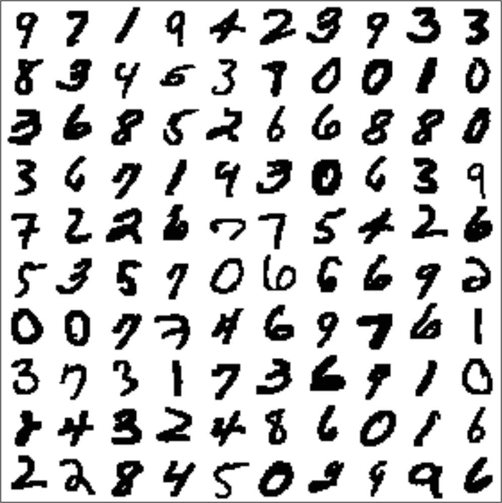
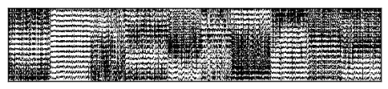
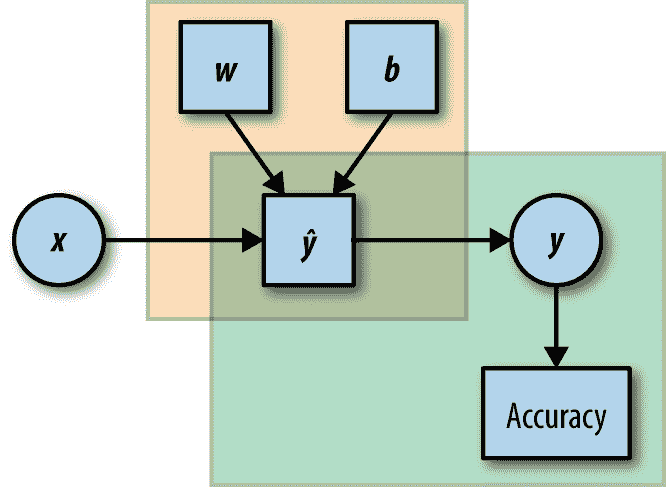

# 第二章：随波逐流：TensorFlow 快速入门

在本章中，我们将从两个可工作的 TensorFlow 示例开始我们的旅程。第一个（传统的“hello world”程序），虽然简短简单，但包含了我们在后续章节中深入讨论的许多重要元素。通过第二个，一个首个端到端的机器学习模型，您将开始您的 TensorFlow 最新机器学习之旅。

在开始之前，我们简要介绍 TensorFlow 的安装。为了方便快速启动，我们仅安装 CPU 版本，并将 GPU 安装推迟到以后。如果你不知道这意味着什么，那没关系！如果你已经安装了 TensorFlow，请跳到第二部分。

# 安装 TensorFlow

如果您使用的是干净的 Python 安装（可能是为学习 TensorFlow 而设置的），您可以从简单的`pip`安装开始：

```py
$ pip install tensorflow

```

然而，这种方法的缺点是 TensorFlow 将覆盖现有软件包并安装特定版本以满足依赖关系。如果您还将此 Python 安装用于其他目的，这样做将不起作用。一个常见的解决方法是在一个由*virtualenv*管理的虚拟环境中安装 TensorFlow。

根据您的设置，您可能需要或不需要在计算机上安装*virtualenv*。要安装*virtualenv*，请键入：

```py
$ pip install virtualenv

```

查看[*http://virtualenv.pypa.io*](http://virtualenv.pypa.io)获取更多说明。

为了在虚拟环境中安装 TensorFlow，您必须首先创建虚拟环境——在本书中，我们选择将其放在*~/envs*文件夹中，但请随意将其放在您喜欢的任何位置：

```py
$ cd ~
$ mkdir envs
$ virtualenv ~/envs/tensorflow

```

这将在*~/envs*中创建一个名为*tensorflow*的虚拟环境（将显示为*~/envs/tensorflow*文件夹）。要激活环境，请使用：

```py
$ source ~/envs/tensorflow/bin/activate

```

提示现在应该改变以指示已激活的环境：

```py
(tensorflow)$
```

此时`pip install`命令：

```py
(tensorflow)$ pip install tensorflow​
```

将在虚拟环境中安装 TensorFlow，而不会影响您计算机上安装的其他软件包。

最后，为了退出虚拟环境，您需要键入：

```py
(tensorflow)$ deactivate

```

此时，您应该会得到常规提示符：

```py
$

```

# 在~/.bashrc 中添加别名

描述进入和退出虚拟环境的过程可能会太繁琐，如果您打算经常使用它。在这种情况下，您可以简单地将以下命令附加到您的*~/.bashrc*文件中：

```py
alias tensorflow="source ~/envs/tensorflow/bin/activate"

```

并使用命令`tensorflow`来激活虚拟环境。要退出环境，您仍然会使用`deactivate`。

现在我们已经基本安装了 TensorFlow，我们可以继续进行我们的第一个工作示例。我们将遵循已经建立的传统，并从一个“hello world”程序开始。

# Hello World

我们的第一个示例是一个简单的程序，将单词“Hello”和“ World!”组合在一起并显示输出——短语“Hello World!”。虽然简单直接，但这个示例介绍了 TensorFlow 的许多核心元素以及它与常规 Python 程序的不同之处。

我们建议您在计算机上运行此示例，稍微玩弄一下，并查看哪些有效。接下来，我们将逐行查看代码并分别讨论每个元素。

首先，我们运行一个简单的安装和版本检查（如果您使用了 virtualenv 安装选项，请确保在运行 TensorFlow 代码之前激活它）：

```py
import tensorflow as tf
print(tf.__version__)

```

如果正确，输出将是您在系统上安装的 TensorFlow 版本。版本不匹配是后续问题的最有可能原因。

示例 2-1 显示了完整的“hello world”示例。

##### 示例 2-1。“Hello world”与 TensorFlow

```py
import tensorflow as tf

h = tf.constant("Hello")
w = tf.constant(" World!")
hw = h + w

with tf.Session() as sess:
ans = sess.run(hw)

print (ans)
```

我们假设您熟悉 Python 和导入，那么第一行：

```py
import tensorflow as tf

```

不需要解释。

# IDE 配置

如果您从 IDE 运行 TensorFlow 代码，请确保重定向到安装包的虚拟环境。否则，您将收到以下导入错误：

`ImportError: No module named tensorflow`

在 PyCharm IDE 中，通过选择 Run→Edit Configurations，然后将 Python Interpreter 更改为指向*~/envs/tensorflow/bin/python*，假设您使用*~/envs/tensorflow*作为虚拟环境目录。

接下来，我们定义常量`"Hello"`和`" World!"`，并将它们组合起来：

```py
import tensorflow as tf

h = tf.constant("Hello")
w = tf.constant(" World!")
hw = h + w 

```

此时，您可能会想知道这与用于执行此操作的简单 Python 代码有何不同（如果有的话）：

```py
ph = "Hello"
pw = " World!"
phw = h + w

```

这里的关键点是每种情况下变量`hw`包含的内容。我们可以使用`print`命令来检查这一点。在纯 Python 情况下，我们得到这个：

```py
>`print``phw`HelloWorld!
```

然而，在 TensorFlow 情况下，输出完全不同：

```py
>`print``hw`Tensor("add:0",shape=(),dtype=string)
```

可能不是您期望的！

在下一章中，我们将详细解释 TensorFlow 的计算图模型，到那时这个输出将变得完全清晰。TensorFlow 中计算图的关键思想是，我们首先定义应该发生的计算，然后在外部机制中触发计算。因此，TensorFlow 代码行：

```py
hw = h + w 

```

*不*计算`h`和`w`的总和，而是将求和操作添加到稍后要执行的计算图中。

接下来，`Session`对象充当外部 TensorFlow 计算机制的接口，并允许我们运行已经定义的计算图的部分。代码行：

```py
ans = sess.run(hw)
```

实际上计算`hw`（作为先前定义的`h`和`w`的总和），随后打印`ans`显示预期的“Hello World!”消息。

这完成了第一个 TensorFlow 示例。接下来，我们将立即进行一个简单的机器学习示例，这个示例已经展示了 TensorFlow 框架的许多潜力。

# MNIST

*MNIST*（混合国家标准技术研究所）手写数字数据集是图像处理和机器学习中最研究的数据集之一，并在人工神经网络（现在通常称为*深度学习*）的发展中发挥了重要作用。

因此，我们的第一个机器学习示例应该致力于手写数字的分类（图 2-1 显示了数据集的随机样本）。在这一点上，为了保持简单，我们将应用一个非常简单的分类器。这个简单模型足以正确分类测试集的大约 92%——目前可用的最佳模型可以达到 99.75%以上的正确分类，但在我们达到那里之前还有几章要学习！在本书的后面，我们将重新访问这些数据并使用更复杂的方法。



###### 图 2-1. 100 个随机 MNIST 图像

# Softmax 回归

在这个示例中，我们将使用一个称为*softmax 回归*的简单分类器。我们不会详细介绍模型的数学公式（有很多好的资源可以找到这些信息，如果您以前从未见过这些信息，我们强烈建议您这样做）。相反，我们将尝试提供一些关于模型如何解决数字识别问题的直觉。

简而言之，softmax 回归模型将找出图像中每个像素的数字在该位置具有高（或低）值的趋势。例如，图像中心对于零来说往往是白色的，但对于六来说是黑色的。因此，图像中心的黑色像素将是反对图像包含零的证据，并支持它包含六的证据。

在这个模型中的学习包括找到告诉我们如何累积每个数字的存在证据的权重。使用 softmax 回归，我们将不使用图像中像素布局中的空间信息。稍后，当我们讨论卷积神经网络时，我们将看到利用空间信息是制作出色的图像处理和对象识别模型的关键元素之一。

由于我们在这一点上不打算使用空间信息，我们将我们的图像像素展开为一个长向量表示为*x*（Figure 2-2）。然后

*xw*⁰ = ∑*x*[*i*] 

将是包含数字 0 的图像的证据（同样地，我们将为其他每个数字有<math alttext="w Superscript d"><msup><mi>w</mi> <mi>d</mi></msup></math> 个权重向量，<math><mrow><mi>d</mi> <mo>=</mo> <mn>1</mn> <mo>,</mo> <mo>.</mo> <mo>.</mo> <mo>.</mo> <mo>,</mo> <mn>9</mn></mrow></math>）。



###### Figure 2-2。MNIST 图像像素展开为向量并按列堆叠（从左到右按数字排序）。虽然空间信息的丢失使我们无法识别数字，但在这个图中明显的块结构是 softmax 模型能够对图像进行分类的原因。基本上，所有的零（最左边的块）共享相似的像素结构，所有的一（从左边第二个块）也是如此，等等。

这意味着我们将像素值相加，每个值乘以一个权重，我们认为这个像素在图像中数字零的整体证据中的重要性。

例如，*w*⁰[38]如果第 38 个像素具有高强度，则将是一个较大的正数，指向该数字为零，如果在这个位置的高强度值主要出现在其他数字中，则将是一个较大的负数，如果第 38 个像素的强度值告诉我们这个数字是否为零，则为零。³

一次为所有数字执行此计算（计算出现在图像中的每个数字的证据）可以通过单个矩阵操作表示。如果我们将每个数字的权重放在矩阵*W*的列中，那么每个数字的证据的长度为 10 的向量是

[*xw*⁰, ···, *xw*⁹] = *xW*

分类器的学习目的几乎总是为了评估新的示例。在这种情况下，这意味着我们希望能够判断我们在训练数据中没有见过的新图像中写的是什么数字。为了做到这一点，我们首先对 10 个可能数字中的每一个的证据进行求和（即计算*xW*）。最终的分配将是“赢得”最多证据的数字：

*数字* = *argmax*(*xW*)

我们首先完整地呈现这个示例的代码（Example 2-2），然后逐行走过它并详细讨论。您可能会发现在这个阶段有许多新颖的元素，或者一些拼图的部分缺失，但我们的建议是暂时接受它。一切将在适当的时候变得清晰。

##### 示例 2-2。使用 softmax 回归对 MNIST 手写数字进行分类

```py
import tensorflow as tf
from tensorflow.examples.tutorials.mnist import input_data

DATA_DIR = '/tmp/data'
NUM_STEPS = 1000
MINIBATCH_SIZE = 100

data = input_data.read_data_sets(DATA_DIR, one_hot=True)

x = tf.placeholder(tf.float32, [None, 784])
W = tf.Variable(tf.zeros([784, 10]))

y_true = tf.placeholder(tf.float32, [None, 10])
y_pred = tf.matmul(x, W)

cross_entropy = tf.reduce_mean(tf.nn.softmax_cross_entropy_with_logits(
logits=y_pred, labels=y_true))

gd_step = tf.train.GradientDescentOptimizer(0.5).minimize(cross_entropy)

correct_mask = tf.equal(tf.argmax(y_pred, 1), tf.argmax(y_true, 1))
accuracy = tf.reduce_mean(tf.cast(correct_mask, tf.float32))

with tf.Session() as sess:

# Train
sess.run(tf.global_variables_initializer())

for _ in range(NUM_STEPS):
batch_xs, batch_ys = data.train.next_batch(MINIBATCH_SIZE)
sess.run(gd_step, feed_dict={x: batch_xs, y_true: batch_ys})

# Test
ans = sess.run(accuracy, feed_dict={x: data.test.images, 
                                    y_true: data.test.labels})

print "Accuracy: {:.4}%".format(ans*100)

```

如果您在您的机器上运行代码，您应该会得到如下输出：

```py
Extracting /tmp/data/train-images-idx3-ubyte.gz
Extracting /tmp/data/train-labels-idx1-ubyte.gz
Extracting /tmp/data/t10k-images-idx3-ubyte.gz
Extracting /tmp/data/t10k-labels-idx1-ubyte.gz
Accuracy: 91.83%

```

就是这样！如果您之前在其他平台上组合过类似的模型，您可能会欣赏到其简单性和可读性。然而，这些只是附加的好处，我们真正感兴趣的是从 TensorFlow 的计算图模型中获得的效率和灵活性。

你得到的准确度值将略低于 92%。如果再运行程序一次，你会得到另一个值。这种随机性在机器学习代码中非常常见，你可能以前也见过类似的结果。在这种情况下，源是手写数字在学习过程中呈现给模型的顺序发生了变化。因此，训练后学到的参数在每次运行时略有不同。

因此，运行相同的程序五次可能会产生这样的结果：

```py
Accuracy: 91.86%
Accuracy: 91.51%
Accuracy: 91.62%
Accuracy: 91.93%
Accuracy: 91.88%

```

现在我们将简要地查看这个示例的代码，并看看与之前的“hello world”示例有什么新的地方。我们将逐行分解它：

```py
import tensorflow as tf
from tensorflow.examples.tutorials.mnist import input_data

```

这个示例中的第一个新元素是我们使用外部数据！我们不再下载 MNIST 数据集（在[*http://yann.lecun.com/exdb/mnist/*](http://yann.lecun.com/exdb/mnist/)免费提供），然后加载到我们的程序中，而是使用内置工具来动态检索数据集。对于大多数流行的数据集，存在这样的工具，当处理小数据集时（在这种情况下只有几 MB），这种方式非常合理。第二个导入加载了我们稍后将使用的工具，用于自动下载数据，并根据需要管理和分区数据：

```py
DATA_DIR = '/tmp/data'
NUM_STEPS = 1000
MINIBATCH_SIZE = 100

```

在这里，我们定义了一些在程序中使用的常量，它们将在首次使用时的上下文中进行解释：

```py
data = input_data.read_data_sets(DATA_DIR, one_hot=True)

```

MNIST 阅读工具的`read_data_sets()`方法会下载数据集并将其保存在本地，为程序后续使用做好准备。第一个参数`DATA_DIR`是我们希望数据保存在本地的位置。我们将其设置为`'/tmp/data'`，但任何其他位置也同样适用。第二个参数告诉工具我们希望数据如何标记；我们现在不会深入讨论这个问题。

请注意，这就是输出的前四行，表明数据已经正确获取。现在我们终于准备好设置我们的模型了：

```py
x = tf.placeholder(tf.float32, [None, 784])
W = tf.Variable(tf.zeros([784, 10]))

```

在之前的示例中，我们看到了 TensorFlow 的常量元素，现在它被`placeholder`和`Variable`元素补充。现在，知道变量是计算中操作的元素，而占位符在触发时必须提供。图像本身（`x`）是一个占位符，因为当运行计算图时，我们将提供它。大小[`None, 784`]表示每个图像的大小为 784（28×28 像素展开成一个单独的向量），`None`表示我们目前没有指定一次使用多少个这样的图像：

```py
y_true = tf.placeholder(tf.float32, [None, 10])
y_pred = tf.matmul(x, W)
```

在下一章中，这些概念将会更深入地讨论。

在大类机器学习任务中的一个关键概念是，我们希望从数据示例（在我们的情况下是数字图像）到它们已知标签（图像中数字的身份）的函数。这种设置被称为*监督学习*。在大多数监督学习模型中，我们尝试学习一个模型，使得真实标签和预测标签在某种意义上接近。在这里，`y_true`和`y_pred`分别表示真实标签和预测标签的元素：

```py
cross_entropy = tf.reduce_mean(tf.nn.softmax_cross_entropy_with_logits(
logits=y_pred, labels=y_true))

```

我们选择用于此模型的相似度度量是所谓的*交叉熵*，这是当模型输出类别概率时的自然选择。这个元素通常被称为*损失函数*：

```py
gd_step = tf.train.GradientDescentOptimizer(0.5).minimize(cross_entropy)

```

模型的最后一部分是我们将如何训练它（即我们将如何最小化损失函数）。一个非常常见的方法是使用梯度下降优化。这里，`0.5`是学习率，控制我们的梯度下降优化器如何快速地调整模型权重以减少总体损失。

我们将在本书后面讨论优化器以及它们如何适应计算图。

一旦我们定义了我们的模型，我们希望定义我们将使用的评估过程，以便测试模型的准确性。在这种情况下，我们对正确分类的测试示例的比例感兴趣：⁶

```py
correct_mask = tf.equal(tf.argmax(y_pred, 1), tf.argmax(y_true, 1))
accuracy = tf.reduce_mean(tf.cast(correct_mask, tf.float32)) 

```

与“hello world”示例一样，为了利用我们定义的计算图，我们必须创建一个会话。其余操作都在会话中进行：

```py
with tf.Session() as sess:

```

首先，我们必须初始化所有变量：

```py
    sess.run(tf.global_variables_initializer())

```

这在机器学习和优化领域具有一些特定的含义，当我们使用初始化是一个重要问题的模型时，我们将进一步讨论这些含义

```py
    for _ in range(NUM_STEPS):
        batch_xs, batch_ys = data.train.next_batch(MINIBATCH_SIZE)
        sess.run(gd_step, feed_dict={x: batch_xs, y_true: batch_ys})

```

在梯度下降方法中，模型的实际训练包括在“正确的方向”上进行多次步骤。在这种情况下，我们将进行的步数`NUM_STEPS`设置为 1,000 步。有更复杂的方法来决定何时停止，但稍后再讨论！在每一步中，我们向数据管理器请求一组带有标签的示例，并将它们呈现给学习者。`MINIBATCH_SIZE`常数控制每一步使用的示例数量。

最后，我们第一次使用`sess.run`的`feed_dict`参数。回想一下，在构建模型时我们定义了占位符元素。现在，每当我们想要运行包含这些元素的计算时，我们必须为它们提供一个值。

```py
    ans = sess.run(accuracy, feed_dict={x: data.test.images,
                                        y_true: data.test.labels})

```

为了评估我们刚刚学习的模型，我们运行之前定义的准确性计算操作（回想一下，准确性被定义为正确标记的图像的比例）。在这个过程中，我们提供一组从未被模型在训练过程中看到的测试图像：

```py
    print "Accuracy: {:.4}%".format(ans*100)

```

最后，我们将结果打印为百分比值。

图 2-3 显示了我们模型的图形表示。



###### 图 2-3。模型的图形表示。矩形元素是变量，圆圈是占位符。左上角框表示标签预测部分，右下角框表示评估。这里，*b*是一个偏差项，可以添加到模型中。

# 模型评估和内存错误

在使用 TensorFlow 时，与任何其他系统一样，重要的是要注意正在使用的资源，并确保不超出系统的容量。在评估模型时可能会出现的一个潜在问题是在测试集上测试模型的性能。在这个示例中，我们通过一次性提供所有测试示例来评估模型的准确性：

```py
feed_dict={x: data.test.images, y_true: data.test.labels}
ans = sess.run(accuracy, feed_dict)

```

如果所有的测试示例（这里是`data.test.images`）无法在您使用的系统内存中容纳，那么在这一点上会出现内存错误。例如，如果您在典型的低端 GPU 上运行此示例，很可能会出现这种情况。

解决这个问题的简单方法（获得更多内存的机器是一个临时解决方案，因为总会有更大的数据集）是将测试过程分成批处理，就像我们在训练过程中所做的那样。

# 总结

恭喜！到目前为止，您已经安装了 TensorFlow 并使用了两个基本示例。您已经看到了本书中将使用的一些基本构建模块，并且希望已经开始对 TensorFlow 有所了解。

接下来，我们将深入了解 TensorFlow 使用的计算图模型。

¹ 我们建议读者参考官方[TensorFlow 安装指南](https://www.tensorflow.org/install/)以获取更多详细信息，特别是有关 GPU 安装的不断变化的细节。

² 添加“偏差项”是常见的，这相当于在看到像素值之前我们相信图像是哪些数字。如果您之前见过这个，那么尝试将其添加到模型中并查看它如何影响结果。

³ 如果您熟悉 softmax 回归，您可能意识到这是它工作方式的简化，特别是当像素值与数字图像一样相关时。

⁴ 在整个过程中，在运行示例代码之前，请确保`DATA_DIR`适合您正在使用的操作系统。例如，在 Windows 上，您可能会使用类似*c:\tmp\data*的路径。

⁵ 从 TensorFlow 1.0 开始，这也包含在`tf.losses.softmax_cross_entropy`中。

⁶ 从 TensorFlow 1.0 开始，这也包含在`tf.metrics.accuracy`中。
