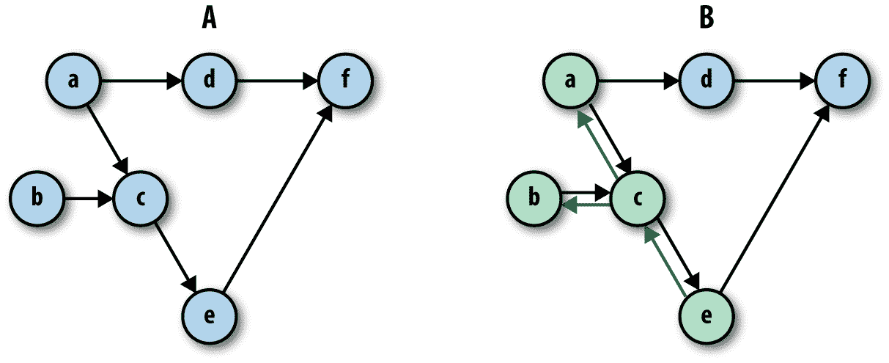
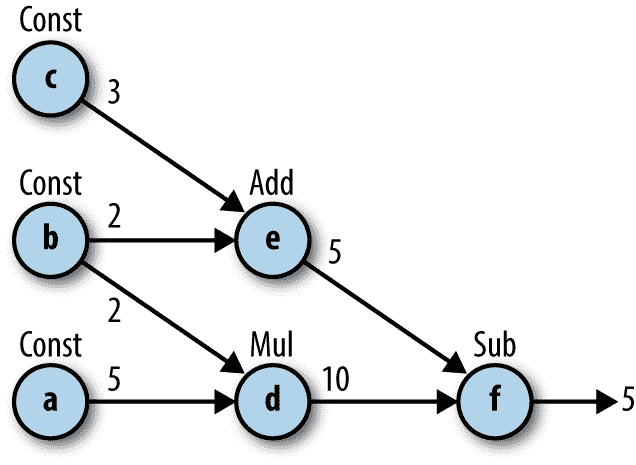
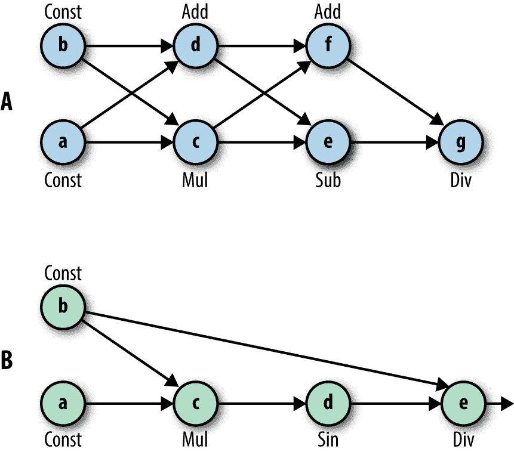
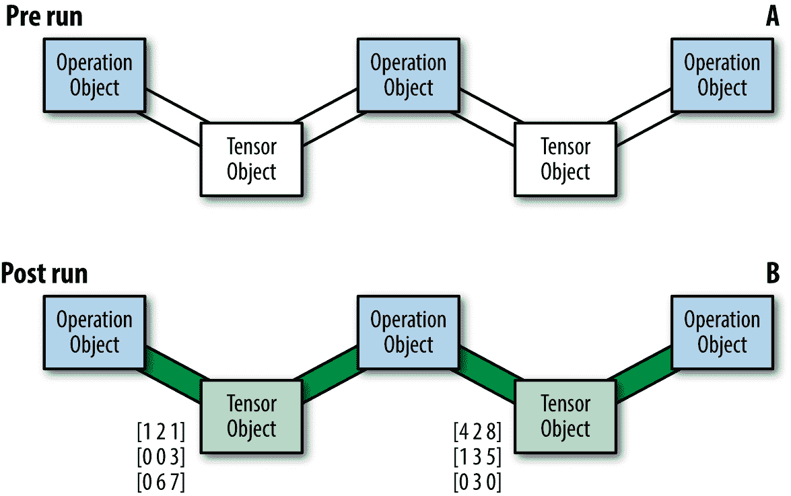
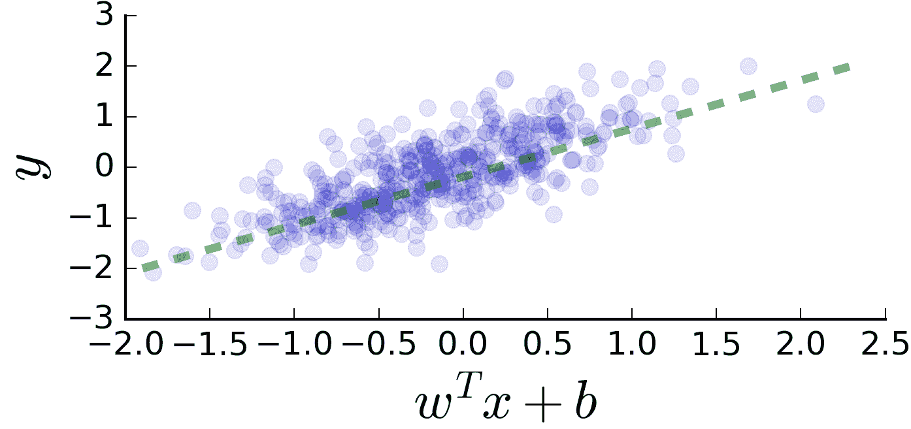
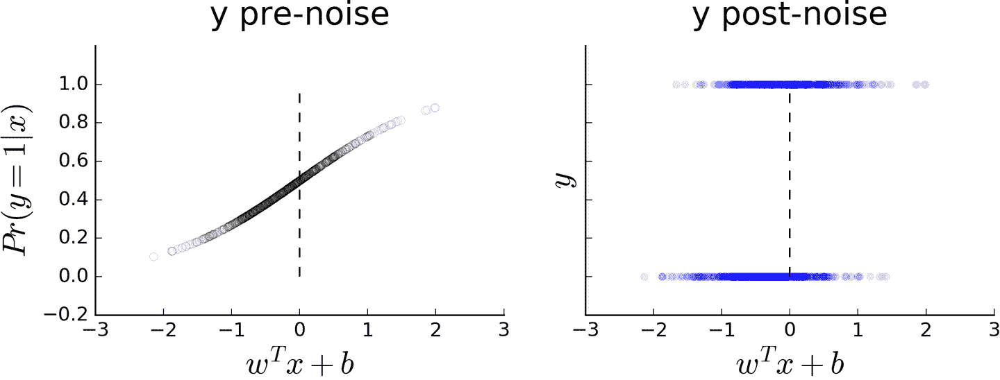

# 第三章：理解 TensorFlow 基础知识

本章演示了 TensorFlow 是如何构建和使用简单直观的示例的关键概念。您将了解 TensorFlow 作为一个数据流图的数值计算库的基础知识。更具体地说，您将学习如何管理和创建图，并介绍 TensorFlow 的“构建块”，如常量、占位符和变量。

# 计算图

TensorFlow 允许我们通过创建和计算相互作用的操作来实现机器学习算法。这些交互形成了我们所谓的“计算图”，通过它我们可以直观地表示复杂的功能架构。

## 什么是计算图？

我们假设很多读者已经接触过图的数学概念。对于那些对这个概念是新的人来说，图指的是一组相互连接的*实体*，通常称为*节点*或*顶点*。这些节点通过边连接在一起。在数据流图中，边允许数据以有向方式从一个节点流向另一个节点。

在 TensorFlow 中，图的每个节点代表一个操作，可能应用于某些输入，并且可以生成一个输出，传递给其他节点。类比地，我们可以将图计算看作是一个装配线，其中每台机器（节点）要么获取或创建其原材料（输入），处理它，然后按顺序将输出传递给其他机器，生产*子组件*，最终在装配过程结束时产生一个最终*产品*。

图中的操作包括各种函数，从简单的算术函数如减法和乘法到更复杂的函数，我们稍后会看到。它们还包括更一般的操作，如创建摘要、生成常量值等。

## 图计算的好处

TensorFlow 根据图的连接性优化其计算。每个图都有自己的节点依赖关系集。当节点`y`的输入受到节点`x`的输出的影响时，我们说节点`y`依赖于节点`x`。当两者通过边连接时，我们称之为*直接依赖*，否则称为*间接依赖*。例如，在图 3-1（A）中，节点`e`直接依赖于节点`c`，间接依赖于节点`a`，独立于节点`d`。



###### 图 3-1\.（A）图依赖的示例。 （B）计算节点 e 根据图的依赖关系进行最少量的计算—在这种情况下仅计算节点 c、b 和 a。

我们始终可以识别图中每个节点的完整依赖关系。这是基于图的计算格式的一个基本特征。能够找到模型单元之间的依赖关系使我们能够在可用资源上分配计算，并避免执行与无关子集的冗余计算，从而以更快更有效的方式计算事物。

# 图、会话和获取

粗略地说，使用 TensorFlow 涉及两个主要阶段：（1）构建图和（2）执行图。让我们跳入我们的第一个示例，并创建一些非常基本的东西。

## 创建图

导入 TensorFlow 后（使用`import tensorflow as tf`），会形成一个特定的空默认图。我们创建的所有节点都会自动与该默认图关联。

使用`tf.<*operator*>`方法，我们将创建六个节点，分配给任意命名的变量。这些变量的内容应被视为操作的输出，而不是操作本身。现在我们用它们对应变量的名称来引用操作和它们的输出。

前三个节点各被告知输出一个常量值。值`5`、`2`和`3`分别分配给`a`、`b`和`c`：

```py
a = tf.constant(5)
b = tf.constant(2)
c = tf.constant(3)

```

接下来的三个节点中的每一个都将两个现有变量作为输入，并对它们进行简单的算术运算：

```py
d = tf.multiply(a,b)
e = tf.add(c,b)
f = tf.subtract(d,e)

```

节点`d`将节点`a`和`b`的输出相乘。节点`e`将节点`b`和`c`的输出相加。节点`f`将节点`e`的输出从节点`d`的输出中减去。

*voilà*！我们有了我们的第一个 TensorFlow 图！图 3-2 显示了我们刚刚创建的图的示例。



###### 图 3-2\. 我们第一个构建的图的示例。每个由小写字母表示的节点执行其上方指示的操作：Const 用于创建常量，Add、Mul 和 Sub 分别用于加法、乘法和减法。每条边旁边的整数是相应节点操作的输出。

请注意，对于一些算术和逻辑操作，可以使用操作快捷方式，而不必应用`tf.<*operator*>`。例如，在这个图中，我们可以使用`*`/+/`-`代替`tf.multiply()`/`tf.add()`/`tf.subtract()`（就像我们在第二章的“hello world”示例中使用+代替`tf.add()`一样）。表 3-1 列出了可用的快捷方式。

表 3-1\. 常见的 TensorFlow 操作及其相应的快捷方式

| TensorFlow 运算符 | 快捷方式 | 描述 |
| --- | --- | --- |
| `tf.add()` | `a + b` | 对`a`和`b`进行逐元素相加。 |
| `tf.multiply()` | `a * b` | 对`a`和`b`进行逐元素相乘。 |
| `tf.subtract()` | `a - b` | 对`a`和`b`进行逐元素相减。 |
| `tf.divide()` | `a / b` | 计算`a`除以`b`的 Python 风格除法。 |
| `tf.pow()` | `a ** b` | 返回将`a`中的每个元素提升到其对应元素`b`的结果，逐元素。 |
| `tf.mod()` | `a % b` | 返回逐元素取模。 |
| `tf.logical_and()` | `a & b` | 返回`a & b`的真值表，逐元素。`dtype`必须为`tf.bool`。 |
| `tf.greater()` | `a > b` | 返回`a > b`的真值表，逐元素。 |
| `tf.greater_equal()` | `a >= b` | 返回`a >= b`的真值表，逐元素。 |
| `tf.less_equal()` | `a <= b` | 返回`a <= b`的真值表，逐元素。 |
| `tf.less()` | `a < b` | 返回`a < b`的真值表，逐元素。 |
| `tf.negative()` | `-a` | 返回`a`中每个元素的负值。 |
| `tf.logical_not()` | `~a` | 返回`a`中每个元素的逻辑非。仅与`dtype`为`tf.bool`的张量对象兼容。 |
| `tf.abs()` | `abs(a)` | 返回`a`中每个元素的绝对值。 |
| `tf.logical_or()` | `a &#124; b` | 返回`a &#124; b`的真值表，逐元素。`dtype`必须为`tf.bool`。 |

## 创建会话并运行

一旦我们完成描述计算图，我们就准备运行它所代表的计算。为了实现这一点，我们需要创建并运行一个会话。我们通过添加以下代码来实现这一点：

```py
sess = tf.Session()
outs = sess.run(f)
sess.close()
print("outs = {}".format(outs))

Out:
outs = 5

```

首先，我们在`tf.Session`中启动图。`Session`对象是 TensorFlow API 的一部分，它在 Python 对象和我们端的数据之间进行通信，实际的计算系统在其中为我们定义的对象分配内存，存储中间变量，并最终为我们获取结果。

```py
sess = tf.Session()

```

然后，执行本身是通过`Session`对象的`.run()`方法完成的。当调用时，该方法以以下方式完成我们图中的一组计算：从请求的输出开始，然后向后工作，计算必须根据依赖关系集执行的节点。因此，将计算的图部分取决于我们的输出查询。

在我们的示例中，我们请求计算节点`f`并获得其值`5`作为输出：

```py
outs = sess.run(f)

```

当我们的计算任务完成时，最好使用`sess.close()`命令关闭会话，确保我们的会话使用的资源被释放。即使我们不必这样做也能使事情正常运行，这是一个重要的实践：

```py
sess.close()

```

##### 示例 3-1。自己试试吧！图 3-3 显示了另外两个图示例。看看你能否自己生成这些图。



###### 图 3-3。你能创建图 A 和图 B 吗？（要生成正弦函数，请使用 tf.sin(x)）。

## 构建和管理我们的图

如前所述，一旦导入 TensorFlow，一个默认图会自动为我们创建。我们可以创建额外的图并控制它们与某些给定操作的关联。`tf.Graph()`创建一个新的图，表示为一个 TensorFlow 对象。在这个例子中，我们创建另一个图并将其分配给变量`g`：

```py
import tensorflow as tf
print(tf.get_default_graph())

g = tf.Graph()
print(g)

Out:
<tensorflow.python.framework.ops.Graph object at 0x7fd88c3c07d0>
<tensorflow.python.framework.ops.Graph object at 0x7fd88c3c03d0>

```

此时我们有两个图：默认图和`g`中的空图。当打印时，它们都会显示为 TensorFlow 对象。由于`g`尚未分配为默认图，我们创建的任何操作都不会与其相关联，而是与默认图相关联。

我们可以使用`tf.get_default_graph()`来检查当前设置为默认的图。此外，对于给定节点，我们可以使用`*<node>*.graph`属性查看它关联的图：

```py
g = tf.Graph()
a = tf.constant(5)

print(a.graph is g)
print(a.graph is tf.get_default_graph())

Out:
False
True

```

在这个代码示例中，我们看到我们创建的操作与默认图相关联，而不是与`g`中的图相关联。

为了确保我们构建的节点与正确的图相关联，我们可以使用一个非常有用的 Python 构造：`with`语句。

# **with 语句**

`with`语句用于使用上下文管理器定义的方法包装一个代码块——一个具有特殊方法函数`.__enter__()`用于设置代码块和`.__exit__()`用于退出代码块的对象。

通俗地说，在许多情况下，执行一些需要“设置”（如打开文件、SQL 表等）的代码，然后在最后“拆除”它总是非常方便的，无论代码是否运行良好或引发任何异常。在我们的例子中，我们使用`with`来设置一个图，并确保每一段代码都将在该图的上下文中执行。

我们使用`with`语句与`as_default()`命令一起使用，它返回一个上下文管理器，使这个图成为默认图。在处理多个图时，这非常方便：

```py
g1 = tf.get_default_graph()
g2 = tf.Graph()

print(g1 is tf.get_default_graph())

with g2.as_default():
    print(g1 is tf.get_default_graph())

print(g1 is tf.get_default_graph())

Out:
True
False
True
```

`with`语句也可以用于启动一个会话，而无需显式关闭它。这个方便的技巧将在接下来的示例中使用。

## Fetches

在我们的初始图示例中，我们通过将分配给它的变量作为`sess.run()`方法的参数来请求一个特定节点（节点`f`）。这个参数称为`fetches`，对应于我们希望计算的图的元素。我们还可以通过输入请求节点的列表来要求`sess.run()`多个节点的输出：

```py
with tf.Session() as sess:
   fetches = [a,b,c,d,e,f]
   outs = sess.run(fetches)

print("outs = {}".format(outs))
print(type(outs[0]))

Out:
outs = [5, 2, 3, 10, 5, 5]
<type 'numpy.int32'>

```

我们得到一个包含节点输出的列表，根据它们在输入列表中的顺序。列表中每个项目的数据类型为 NumPy。

# NumPy

NumPy 是一个流行且有用的 Python 包，用于数值计算，提供了许多与数组操作相关的功能。我们假设读者对这个包有一些基本的了解，本书不会涉及这部分内容。TensorFlow 和 NumPy 紧密耦合——例如，`sess.run()`返回的输出是一个 NumPy 数组。此外，许多 TensorFlow 的操作与 NumPy 中的函数具有相同的语法。要了解更多关于 NumPy 的信息，我们建议读者参考 Eli Bressert 的书籍[*SciPy and NumPy*](http://shop.oreilly.com/product/0636920020219.do)（O'Reilly）。

我们提到 TensorFlow 仅根据依赖关系集计算必要的节点。这也体现在我们的示例中：当我们请求节点`d`的输出时，只计算节点`a`和`b`的输出。另一个示例显示在图 3-1(B)中。这是 TensorFlow 的一个巨大优势——不管我们的整个图有多大和复杂，因为我们可以根据需要仅运行其中的一小部分。

# 自动关闭会话

使用`with`子句打开会话将确保会话在所有计算完成后自动关闭。

# 流动的 Tensor

在本节中，我们将更好地理解节点和边在 TensorFlow 中实际上是如何表示的，以及如何控制它们的特性。为了演示它们的工作原理，我们将重点放在用于初始化值的源操作上。

## 节点是操作，边是 Tensor 对象

当我们在图中构造一个节点，就像我们用`tf.add()`做的那样，实际上是创建了一个操作实例。这些操作直到图被执行时才产生实际值，而是将它们即将计算的结果作为一个可以传递给另一个节点的句柄。我们可以将这些句柄视为图中的边，称为 Tensor 对象，这也是 TensorFlow 名称的由来。

TensorFlow 的设计是首先创建一个带有所有组件的骨架图。在这一点上，没有实际数据流入其中，也没有进行任何计算。只有在执行时，当我们运行会话时，数据进入图中并进行计算（如图 3-4 所示）。这样，计算可以更加高效，考虑整个图结构。



###### 图 3-4。在运行会话之前（A）和之后（B）的示例。当会话运行时，实际数据会“流”通过图。

在上一节的示例中，`tf.constant()`创建了一个带有传递值的节点。打印构造函数的输出，我们看到它实际上是一个 Tensor 对象实例。这些对象有控制其行为的方法和属性，可以在创建时定义。

在这个示例中，变量`c`存储了一个名为`Const_52:0`的 Tensor 对象，用于包含一个 32 位浮点标量：

```py
c = tf.constant(4.0)
print(c)

Out:
Tensor("Const_52:0", shape=(), dtype=float32)

```

# 构造函数说明

`tf.*<operator>*`函数可以被视为构造函数，但更准确地说，这实际上根本不是构造函数，而是一个工厂方法，有时做的事情远不止创建操作对象。

### 使用源操作设置属性

TensorFlow 中的每个 Tensor 对象都有属性，如`name`、`shape`和`dtype`，帮助识别和设置该对象的特性。在创建节点时，这些属性是可选的，当缺失时 TensorFlow 会自动设置。在下一节中，我们将查看这些属性。我们将通过查看由称为*源操作*的操作创建的 Tensor 对象来实现。源操作是创建数据的操作，通常不使用任何先前处理过的输入。通过这些操作，我们可以创建标量，就像我们已经使用`tf.constant()`方法遇到的那样，以及数组和其他类型的数据。

## 数据类型

通过图传递的数据的基本单位是数字、布尔值或字符串元素。当我们打印出上一个代码示例中的 Tensor 对象`c`时，我们看到它的数据类型是浮点数。由于我们没有指定数据类型，TensorFlow 会自动推断。例如，`5`被视为整数，而带有小数点的任何内容，如`5.1`，被视为浮点数。

我们可以通过在创建 Tensor 对象时指定数据类型来明确选择要使用的数据类型。我们可以使用属性`dtype`来查看给定 Tensor 对象设置的数据类型：

```py
c = tf.constant(4.0, dtype=tf.float64)
print(c)
print(c.dtype)

Out:
Tensor("Const_10:0", shape=(), dtype=float64)
<dtype: 'float64'>

```

明确要求（适当大小的）整数一方面更节省内存，但另一方面可能会导致减少精度，因为不跟踪小数点后的数字。

### 转换

确保图中的数据类型匹配非常重要——使用两个不匹配的数据类型进行操作将导致异常。要更改 Tensor 对象的数据类型设置，我们可以使用`tf.cast()`操作，将相关的 Tensor 和感兴趣的新数据类型作为第一个和第二个参数传递：

```py
x = tf.constant([1,2,3],name='x',dtype=tf.float32)
print(x.dtype)
x = tf.cast(x,tf.int64)
print(x.dtype)

Out:
<dtype: 'float32'>
<dtype: 'int64'>

```

TensorFlow 支持许多数据类型。这些列在表 3-2 中。

支持的张量数据类型表 3-2

| 数据类型 | Python 类型 | 描述 |
| --- | --- | --- |
| `DT_FLOAT` | `tf.float32` | 32 位浮点数。 |
| `DT_DOUBLE` | `tf.float64` | 64 位浮点数。 |
| `DT_INT8` | `tf.int8` | 8 位有符号整数。 |
| `DT_INT16` | `tf.int16` | 16 位有符号整数。 |
| `DT_INT32` | `tf.int32` | 32 位有符号整数。 |
| `DT_INT64` | `tf.int64` | 64 位有符号整数。 |
| `DT_UINT8` | `tf.uint8` | 8 位无符号整数。 |
| `DT_UINT16` | `tf.uint16` | 16 位无符号整数。 |
| `DT_STRING` | `tf.string` | 变长字节数组。张量的每个元素都是一个字节数组。 |
| `DT_BOOL` | `tf.bool` | 布尔值。 |
| `DT_COMPLEX64` | `tf.complex64` | 由两个 32 位浮点数组成的复数：实部和虚部。 |
| `DT_COMPLEX128` | `tf.complex128` | 由两个 64 位浮点数组成的复数：实部和虚部。 |
| `DT_QINT8` | `tf.qint8` | 用于量化操作的 8 位有符号整数。 |
| `DT_QINT32` | `tf.qint32` | 用于量化操作的 32 位有符号整数。 |
| `DT_QUINT8` | `tf.quint8` | 用于量化操作的 8 位无符号整数。 |

## 张量数组和形状

潜在混淆的一个来源是，*Tensor*这个名字指的是两个不同的东西。在前面的部分中使用的*Tensor*是 Python API 中用作图中操作结果的句柄的对象的名称。然而，*tensor*也是一个数学术语，用于表示*n*维数组。例如，一个 1×1 的张量是一个标量，一个 1×*n*的张量是一个向量，一个*n*×*n*的张量是一个矩阵，一个*n*×*n*×*n*的张量只是一个三维数组。当然，这可以推广到任何维度。TensorFlow 将流经图中的所有数据单元都视为张量，无论它们是多维数组、向量、矩阵还是标量。TensorFlow 对象称为 Tensors 是根据这些数学张量命名的。

为了澄清两者之间的区别，从现在开始我们将前者称为大写 T 的张量，将后者称为小写 t 的张量。

与`dtype`一样，除非明确说明，TensorFlow 会自动推断数据的形状。当我们在本节开始时打印出 Tensor 对象时，它显示其形状为`()`，对应于标量的形状。

使用标量对于演示目的很好，但大多数情况下，使用多维数组更实用。要初始化高维数组，我们可以使用 Python 列表或 NumPy 数组作为输入。在以下示例中，我们使用 Python 列表作为输入，创建一个 2×3 矩阵，然后使用一个大小为 2×3×4 的 3D NumPy 数组作为输入（两个大小为 3×4 的矩阵）： 

```py
import numpy as np

c = tf.constant([[1,2,3],
                [4,5,6]])
print("Python List input: {}".format(c.get_shape()))

c = tf.constant(np.array([
        [[1,2,3,4],
         [5,6,7,8],
         [9,8,7,6]],

        [[1,1,1,1],
         [2,2,2,2],
         [3,3,3,3]]
        ]))

print("3d NumPy array input: {}".format(c.get_shape()))

Out:
Python list input: (2, 3)
3d NumPy array input: (2, 3, 4)

```

`get_shape()`方法返回张量的形状，以整数元组的形式。整数的数量对应于张量的维数，每个整数是沿着该维度的数组条目的数量。例如，形状为`(2,3)`表示一个矩阵，因为它有两个整数，矩阵的大小为 2×3。

其他类型的源操作构造函数对于在 TensorFlow 中初始化常量非常有用，比如填充常量值、生成随机数和创建序列。

随机数生成器在许多情况下具有特殊重要性，因为它们用于创建 TensorFlow 变量的初始值，这将很快介绍。例如，我们可以使用`tf.random.normal()`从*正态分布*生成随机数，分别将形状、平均值和标准差作为第一、第二和第三个参数传递。另外两个有用的随机初始化器示例是*截断正态*，它像其名称暗示的那样，截断了所有低于和高于平均值两个标准差的值，以及*均匀*初始化器，它在某个区间`a,b)`内均匀采样值。

这些方法的示例值显示在图 3-5 中。

![

###### 图 3-5\. 从（A）标准正态分布、（B）截断正态分布和（C）均匀分布[–2,2]生成的 50,000 个随机样本。

熟悉 NumPy 的人会认识到一些初始化器，因为它们具有相同的语法。一个例子是序列生成器`tf.linspace(a, b, *n*)`，它从`a`到`b`创建`*n*`个均匀间隔的值。

当我们想要探索对象的数据内容时，使用`tf.InteractiveSession()`是一个方便的功能。使用它和`.eval()`方法，我们可以完整查看值，而无需不断引用会话对象：

```py
sess = tf.InteractiveSession()
c = tf.linspace(0.0, 4.0, 5)
print("The content of 'c':\n {}\n".format(c.eval()))
sess.close()

Out:
The content of 'c':
[ 0.1.2.3.4.]
```

# 交互式会话

`tf.InteractiveSession()`允许您替换通常的`tf.Session()`，这样您就不需要一个变量来保存会话以运行操作。这在交互式 Python 环境中非常有用，比如在编写 IPython 笔记本时。

我们只提到了一些可用源操作。表 3-2 提供了更多有用初始化器的简短描述。

| TensorFlow 操作 | 描述 |
| --- | --- |
| `tf.constant(*value*)` | 创建一个由参数`*value*`指定的值或值填充的张量 |
| `tf.fill(*shape*, *value*)` | 创建一个形状为`*shape*`的张量，并用`*value*`填充 |
| `tf.zeros(*shape*)` | 返回一个形状为`*shape*`的张量，所有元素都设置为 0 |
| `tf.zeros_like(*tensor*)` | 返回一个与`*tensor*`相同类型和形状的张量，所有元素都设置为 0 |
| `tf.ones(*shape*)` | 返回一个形状为`*shape*`的张量，所有元素都设置为 1 |
| `tf.ones_like(*tensor*)` | 返回一个与`*tensor*`相同类型和形状的张量，所有元素都设置为 1 |
| `tf.random_normal(*shape*, *mean*, *stddev*)` | 从正态分布中输出随机值 |
| `tf.truncated_normal(*shape*, *mean*, *stddev*)` | 从截断正态分布中输出随机值（其大小超过平均值两个标准差的值被丢弃并重新选择） |
| `tf.random_uniform(*shape*, *minval*, *maxval*)` | 在范围`[*minval*, *maxval*)`内生成均匀分布的值 |
| `tf.random_shuffle(*tensor*)` | 沿着其第一个维度随机洗牌张量 |

### 矩阵乘法

这个非常有用的算术运算是通过 TensorFlow 中的`tf.matmul(A,B)`函数来执行的，其中`A`和`B`是两个 Tensor 对象。

假设我们有一个存储矩阵`A`的张量和另一个存储向量`x`的张量，并且我们希望计算这两者的矩阵乘积：

*Ax* = *b*

在使用`matmul()`之前，我们需要确保两者具有相同数量的维度，并且它们与预期的乘法正确对齐。

在以下示例中，创建了一个矩阵`A`和一个向量`x`：

```py
A = tf.constant([ [1,2,3],
           [4,5,6] ])
print(A.get_shape())

x = tf.constant([1,0,1])
print(x.get_shape())

Out:
(2, 3)
(3,)

```

为了将它们相乘，我们需要向`x`添加一个维度，将其从一维向量转换为二维单列矩阵。

我们可以通过将张量传递给 `tf.expand_dims()` 来添加另一个维度，以及作为第二个参数的添加维度的位置。通过在第二个位置（索引 1）添加另一个维度，我们可以得到期望的结果：

```py
x = tf.expand_dims(x,1)
print(x.get_shape())

b = tf.matmul(A,x)

sess = tf.InteractiveSession()
print('matmul result:\n {}'.format(b.eval()))
sess.close()

Out:
(3, 1)

matmul result:
[[ 4]
[10]]

```

如果我们想翻转一个数组，例如将列向量转换为行向量或反之亦然，我们可以使用 `tf.transpose()` 函数。

## 名称

每个张量对象也有一个标识名称。这个名称是一个固有的字符串名称，不要与变量的名称混淆。与 `dtype` 一样，我们可以使用 `.name` 属性来查看对象的名称：

```py
with tf.Graph().as_default():
  c1 = tf.constant(4,dtype=tf.float64,name='c')
  c2 = tf.constant(4,dtype=tf.int32,name='c')
print(c1.name)
print(c2.name)

Out:
c:0
c_1:0

```

张量对象的名称只是其对应操作的名称（“c”；与冒号连接），后跟产生它的操作的输出中的张量的索引——可能有多个。

# 重复的名称

在同一图中的对象不能具有相同的名称——TensorFlow 禁止这样做。因此，它会自动添加下划线和数字以区分两者。当它们与不同的图关联时，当然，这两个对象可以具有相同的名称。

### 名称范围

有时在处理大型、复杂的图时，我们希望创建一些节点分组，以便更容易跟踪和管理。为此，我们可以通过名称对节点进行层次分组。我们可以使用 `tf.name_scope("*prefix*")` 以及有用的 `with` 子句来实现：

```py
with tf.Graph().as_default():
  c1 = tf.constant(4,dtype=tf.float64,name='c')
  with tf.name_scope("prefix_name"):
    c2 = tf.constant(4,dtype=tf.int32,name='c')
    c3 = tf.constant(4,dtype=tf.float64,name='c')

print(c1.name)
print(c2.name)
print(c3.name)

Out:
c:0
prefix_name/c:0
prefix_name/c_1:0

```

在这个例子中，我们将包含在变量 `c2` 和 `c3` 中的对象分组到作用域 `prefix_name` 下，这显示为它们名称中的前缀。

当我们希望将图分成具有一定语义意义的子图时，前缀特别有用。这些部分以后可以用于可视化图结构。

# 变量、占位符和简单优化

在本节中，我们将介绍两种重要的张量对象类型：变量和占位符。然后我们将继续进行主要事件：优化。我们将简要讨论优化模型的所有基本组件，然后进行一些简单的演示，将所有内容整合在一起。

## 变量

优化过程用于调整给定模型的参数。为此，TensorFlow 使用称为 *变量* 的特殊对象。与其他每次运行会话时都会“重新填充”数据的张量对象不同，变量可以在图中保持固定状态。这很重要，因为它们当前的状态可能会影响它们在下一次迭代中的变化。与其他张量一样，变量可以用作图中其他操作的输入。

使用变量分为两个阶段。首先，我们调用 `tf.Variable()` 函数来创建一个变量并定义它将被初始化的值。然后，我们必须显式执行初始化操作，通过使用 `tf.global_variables_initializer()` 方法运行会话，该方法为变量分配内存并设置其初始值。

与其他张量对象一样，变量只有在模型运行时才会计算，如下例所示：

```py
init_val = tf.random_normal((1,5),0,1)
var = tf.Variable(init_val, name='var')
print("pre run: \n{}".format(var))

init = tf.global_variables_initializer()
with tf.Session() as sess:
  sess.run(init)
  post_var = sess.run(var)

print("\npost run: \n{}".format(post_var))

Out:
pre run:
Tensor("var/read:0", shape=(1, 5), dtype=float32)

post run:
[[ 0.859621350.648858550.25370994 -0.373807910.63552463]]

```

请注意，如果我们再次运行代码，我们会看到每次都会创建一个新变量，这可以通过自动将 `_1` 连接到其名称来表示：

```py
pre run:
Tensor("var_1/read:0", shape=(1, 5), dtype=float32)
```

当我们想要重用模型时（复杂模型可能有许多变量！）可能会非常低效；例如，当我们希望用多个不同的输入来喂它时。为了重用相同的变量，我们可以使用 `tf.get_variables()` 函数而不是 `tf.Variable()`。有关更多信息，请参阅附录中的 “模型结构”。

## 占位符

到目前为止，我们已经使用源操作来创建我们的输入数据。然而，TensorFlow 为输入值提供了专门的内置结构。这些结构被称为*占位符*。占位符可以被认为是将在稍后填充数据的空变量。我们首先构建我们的图形，只有在执行时才用输入数据填充它们。

占位符有一个可选的`shape`参数。如果没有提供形状或传递为`None`，那么占位符可以接受任何大小的数据。通常在对应于样本数量（通常是行）的矩阵维度上使用`None`，同时固定特征的长度（通常是列）：

```py
ph = tf.placeholder(tf.float32,shape=(None,10))
```

每当我们定义一个占位符，我们必须为它提供一些输入值，否则将抛出异常。输入数据通过`session.run()`方法传递给一个字典，其中每个键对应一个占位符变量名，匹配的值是以列表或 NumPy 数组形式给出的数据值：

```py
sess.run(s,feed_dict={x: X_data,w: w_data})

```

让我们看看另一个图形示例，这次使用两个输入的占位符：一个矩阵`x`和一个向量`w`。这些输入进行矩阵乘法，创建一个五单位向量`xw`，并与填充值为`-1`的常量向量`b`相加。最后，变量`s`通过使用`tf.reduce_max()`操作取该向量的最大值。单词*reduce*之所以被使用，是因为我们将一个五单位向量减少为一个标量：

```py
x_data = np.random.randn(5,10)
w_data = np.random.randn(10,1)

with tf.Graph().as_default():
  x = tf.placeholder(tf.float32,shape=(5,10))
  w = tf.placeholder(tf.float32,shape=(10,1))
  b = tf.fill((5,1),-1.)
  xw = tf.matmul(x,w)

  xwb = xw + b
  s = tf.reduce_max(xwb)
  with tf.Session() as sess:
    outs = sess.run(s,feed_dict={x: x_data,w: w_data})

print("outs = {}".format(outs))

Out:
outs = 3.06512

```

## 优化

现在我们转向优化。我们首先描述训练模型的基础知识，对过程中的每个组件进行简要描述，并展示在 TensorFlow 中如何执行。然后我们演示一个简单回归模型优化过程的完整工作示例。

### 训练预测

我们有一些目标变量<math><mi>y</mi></math>，我们希望用一些特征向量<math alttext="x"><mi>x</mi></math>来解释它。为此，我们首先选择一个将两者联系起来的模型。我们的训练数据点将用于“调整”模型，以便最好地捕捉所需的关系。在接下来的章节中，我们将专注于深度神经网络模型，但现在我们将满足于一个简单的回归问题。

让我们从描述我们的回归模型开始：

*f*(*x*[*i*]) = *w*^(*T*)*x*[*i*] + *b*

（*w*被初始化为行向量；因此，转置*x*将产生与上面方程中相同的结果。）

*y*[*i*] = *f*(*x*[*i*]) + *ε*[*i*]

*f*(*x*[*i*])被假定为一些输入数据*x*[*i*]的线性组合，带有一组权重*w*和一个截距*b*。我们的目标输出*y*[*i*]是*f*(*x*[*i*])与高斯噪声*ε*[*i*]相加后的嘈杂版本（其中*i*表示给定样本）。

与前面的例子一样，我们需要为输入和输出数据创建适当的占位符，为权重和截距创建变量：

```py
x = tf.placeholder(tf.float32,shape=[None,3])
y_true = tf.placeholder(tf.float32,shape=None)
w = tf.Variable([[0,0,0]],dtype=tf.float32,name='weights')
b = tf.Variable(0,dtype=tf.float32,name='bias')

```

一旦定义了占位符和变量，我们就可以写下我们的模型。在这个例子中，它只是一个多元线性回归——我们预测的输出`y_pred`是我们的输入容器`x`和我们的权重`w`以及一个偏置项`b`的矩阵乘法的结果：

```py
y_pred = tf.matmul(w,tf.transpose(x)) + b

```

### 定义损失函数

接下来，我们需要一个好的度量标准，用来评估模型的性能。为了捕捉我们模型预测和观察目标之间的差异，我们需要一个反映“距离”的度量标准。这个距离通常被称为一个*目标*或*损失*函数，我们通过找到一组参数（在这种情况下是权重和偏置）来最小化它来优化模型。

没有理想的损失函数，选择最合适的损失函数通常是艺术和科学的结合。选择可能取决于几个因素，比如我们模型的假设、它有多容易最小化，以及我们更喜欢避免哪种类型的错误。

### 均方误差和交叉熵

也许最常用的损失是 MSE（均方误差），其中对于所有样本，我们平均了真实目标与我们的模型在样本间预测之间的平方距离：

<math alttext="upper L left-parenthesis y comma ModifyingAbove y With caret right-parenthesis equals StartFraction 1 Over n EndFraction normal upper Sigma Subscript i equals 1 Superscript n Baseline left-parenthesis y Subscript i Baseline minus ModifyingAbove y With caret Subscript i Baseline right-parenthesis squared"><mrow><mi>L</mi> <mrow><mo>(</mo> <mi>y</mi> <mo>,</mo> <mover accent="true"><mi>y</mi> <mo>^</mo></mover> <mo>)</mo></mrow> <mo>=</mo> <mfrac><mn>1</mn> <mi>n</mi></mfrac> <msubsup><mi>Σ</mi> <mrow><mi>i</mi><mo>=</mo><mn>1</mn></mrow> <mi>n</mi></msubsup> <msup><mrow><mo>(</mo><msub><mi>y</mi> <mi>i</mi></msub> <mo>-</mo><msub><mover accent="true"><mi>y</mi> <mo>^</mo></mover> <mi>i</mi></msub> <mo>)</mo></mrow> <mn>2</mn></msup></mrow></math>

这种损失具有直观的解释——它最小化了观察值与模型拟合值之间的均方差差异（这些差异被称为*残差*）。

在我们的线性回归示例中，我们取向量 `y_true`（*y*），真实目标，与 `y_pred`（ŷ），模型的预测之间的差异，并使用 `tf.square()` 计算差异向量的平方。这个操作是逐元素应用的。然后使用 `tf.reduce_mean()` 函数对平方差异进行平均：

```py
loss = tf.reduce_mean(tf.square(y_true-y_pred))

```

另一个非常常见的损失函数，特别适用于分类数据，是*交叉熵*，我们在上一章中在 softmax 分类器中使用过。交叉熵由以下公式给出

<math display="block"><mrow><mi>H</mi> <mo stretchy="false">(</mo> <mi>p</mi> <mo>,</mo> <mi>q</mi> <mo stretchy="false">)</mo> <mo>=</mo> <mo>-</mo> <munder><mo>∑</mo> <mi>x</mi></munder> <mi>p</mi> <mo stretchy="false">(</mo> <mi>x</mi> <mo stretchy="false">)</mo> <mi>log</mi> <mi>q</mi> <mo stretchy="false">(</mo> <mi>x</mi> <mo stretchy="false">)</mo></mrow></math>

对于具有单个正确标签的分类（在绝大多数情况下都是这样），简化为分类器放置在正确标签上的概率的负对数。

在 TensorFlow 中：

```py
loss = tf.nn.sigmoid_cross_entropy_with_logits(labels=y_true,logits=y_pred)

loss = tf.reduce_mean(loss)

```

交叉熵是两个分布之间相似性的度量。由于深度学习中使用的分类模型通常为每个类别输出概率，我们可以将真实类别（分布 *p*）与模型给出的每个类别的概率（分布 *q*）进行比较。两个分布越相似，我们的交叉熵就越小。

### 梯度下降优化器

我们接下来需要弄清楚如何最小化损失函数。在某些情况下，可以通过解析方法找到全局最小值（存在时），但在绝大多数情况下，我们将不得不使用优化算法。优化器会迭代更新权重集，以逐渐减少损失。

最常用的方法是梯度下降，其中我们使用损失相对于权重集的梯度。稍微更技术性的说法是，如果我们的损失是某个多元函数 *F*(*w̄*)，那么在某点 *w̄*[0] 的邻域内，*F*(*w̄*) 的“最陡”减少方向是通过从 *w̄*[0] 沿着 *F* 在 *w̄*[0] 处的负梯度方向移动而获得的。

*所以如果* *w̄*[1] = *w̄*[0]-γ∇*F*(*w̄*[0]) *其中 ∇*F*(*w̄*[0]) 是在 *w̄*[0] 处评估的 *F* 的梯度，那么对于足够小的 γ：*

*F*(*w̄*[0]) ⩾ *F*(*w̄*[1])

梯度下降算法在高度复杂的网络架构上表现良好，因此适用于各种问题。更具体地说，最近的进展使得可以利用大规模并行系统来计算这些梯度，因此这种方法在维度上具有很好的扩展性（尽管对于大型实际问题仍可能非常耗时）。对于凸函数，收敛到全局最小值是有保证的，但对于非凸问题（在深度学习领域基本上都是非凸问题），它们可能会陷入局部最小值。在实践中，这通常已经足够好了，正如深度学习领域的巨大成功所证明的那样。

### 采样方法

目标的梯度是针对模型参数计算的，并使用给定的输入样本集*x*[s]进行评估。对于这个计算，我们应该取多少样本？直觉上，计算整个样本集的梯度是有意义的，以便从最大可用信息中受益。然而，这种方法也有一些缺点。例如，当数据集需要的内存超过可用内存时，它可能会非常慢且难以处理。

一种更流行的技术是随机梯度下降（SGD），在这种技术中，不是将整个数据集一次性提供给算法进行每一步的计算，而是顺序地抽取数据的子集。样本数量从一次一个样本到几百个不等，但最常见的大小在大约 50 到大约 500 之间（通常称为*mini-batches*）。

通常使用较小的批次会更快，批次的大小越小，计算速度就越快。然而，这样做存在一个权衡，即小样本导致硬件利用率降低，并且往往具有较高的方差，导致目标函数出现大幅波动。然而，事实证明，一些波动是有益的，因为它们使参数集能够跳到新的、潜在更好的局部最小值。因此，使用相对较小的批次大小在这方面是有效的，目前是首选的方法。

### TensorFlow 中的梯度下降

TensorFlow 非常容易和直观地使用梯度下降算法。TensorFlow 中的优化器通过向图中添加新操作来计算梯度，并且梯度是使用自动微分计算的。这意味着，一般来说，TensorFlow 会自动计算梯度，从计算图的操作和结构中“推导”出梯度。

设置的一个重要参数是算法的学习率，确定每次更新迭代的侵略性有多大（或者换句话说，负梯度方向的步长有多大）。我们希望损失的减少速度足够快，但另一方面又不要太大，以至于我们超过目标并最终到达损失函数值更高的点。

我们首先使用所需的学习率使用`GradientDescentOptimizer()`函数创建一个优化器。然后，我们通过调用`optimizer.minimize()`函数并将损失作为参数传递来创建一个 train 操作，用于更新我们的变量：

```py
optimizer = tf.train.GradientDescentOptimizer(learning_rate)
train = optimizer.minimize(loss)

```

当传递给`sess.run()`方法时，train 操作就会执行。

### 用示例总结

我们已经准备就绪！让我们将本节讨论的所有组件结合起来，优化两个模型的参数：线性回归和逻辑回归。在这些示例中，我们将创建具有已知属性的合成数据，并看看模型如何通过优化过程恢复这些属性。

#### 示例 1：线性回归

在这个问题中，我们感兴趣的是检索一组权重*w*和一个偏差项*b*，假设我们的目标值是一些输入向量*x*的线性组合，每个样本还添加了一个高斯噪声*ε*[i]。

在这个练习中，我们将使用 NumPy 生成合成数据。我们创建了 2,000 个*x*样本，一个具有三个特征的向量，将每个*x*样本与一组权重*w*（[0.3, 0.5, 0.1]）的内积取出，并添加一个偏置项*b*（-0.2）和高斯噪声到结果中：

```py
import numpy as np
# === Create data and simulate results =====
x_data = np.random.randn(2000,3)
w_real = [0.3,0.5,0.1]
b_real = -0.2

noise = np.random.randn(1,2000)*0.1
y_data = np.matmul(w_real,x_data.T) + b_real + noise
```

嘈杂的样本显示在图 3-6 中。



###### 图 3-6\. 用于线性回归的生成数据：每个填充的圆代表一个样本，虚线显示了没有噪声成分（对角线）的预期值。

接下来，我们通过优化模型（即找到最佳参数）来估计我们的权重*w*和偏置*b*，使其预测尽可能接近真实目标。每次迭代计算对当前参数的更新。在这个例子中，我们运行 10 次迭代，使用`sess.run()`方法在每 5 次迭代时打印我们估计的参数。

不要忘记初始化变量！在这个例子中，我们将权重和偏置都初始化为零；然而，在接下来的章节中，我们将看到一些“更智能”的初始化技术可供选择。我们使用名称作用域来将推断输出、定义损失、设置和创建训练对象的相关部分分组在一起：

```py
NUM_STEPS = 10

g = tf.Graph()
wb_ = []
with g.as_default():
  x = tf.placeholder(tf.float32,shape=[None,3])
  y_true = tf.placeholder(tf.float32,shape=None)

  with tf.name_scope('inference') as scope:
    w = tf.Variable([[0,0,0]],dtype=tf.float32,name='weights')
    b = tf.Variable(0,dtype=tf.float32,name='bias')
    y_pred = tf.matmul(w,tf.transpose(x)) + b

  with tf.name_scope('loss') as scope:
    loss = tf.reduce_mean(tf.square(y_true-y_pred))

  with tf.name_scope('train') as scope:
    learning_rate = 0.5
    optimizer = tf.train.GradientDescentOptimizer(learning_rate)
    train = optimizer.minimize(loss)

  # Before starting, initialize the variables.  We will 'run' this first.
  init = tf.global_variables_initializer()
  with tf.Session() as sess:
    sess.run(init)   
    for step in range(NUM_STEPS):
      sess.run(train,{x: x_data, y_true: y_data})
      if (step % 5 == 0):
        print(step, sess.run([w,b]))
        wb_.append(sess.run([w,b]))

    print(10, sess.run([w,b]))

```

然后，我们得到了结果：

```py
(0, [array([[ 0.30149955,  0.49303722,  0.11409992]], 
                                     dtype=float32), -0.18563795])

(5, [array([[ 0.30094019,  0.49846715,  0.09822173]], 
                                     dtype=float32), -0.19780949])

(10, [array([[ 0.30094025,  0.49846718,  0.09822182]], 
                                     dtype=float32), -0.19780946])

```

仅经过 10 次迭代，估计的权重和偏置分别为 <math alttext="ModifyingAbove w With caret"><mover accent="true"><mi>w</mi> <mo>^</mo></mover></math> = [0.301, 0.498, 0.098] 和 <math alttext="ModifyingAbove b With caret"><mover accent="true"><mi>b</mi> <mo>^</mo></mover></math> = -0.198。原始参数值为 *w* = [0.3,0.5,0.1] 和 *b* = -0.2。

几乎完美匹配！

#### 示例 2：逻辑回归

我们再次希望在模拟数据设置中检索权重和偏置组件，这次是在逻辑回归框架中。这里，线性部分 *w*^T*x* + *b* 是一个称为逻辑函数的非线性函数的输入。它的有效作用是将线性部分的值压缩到区间 [0, 1]：

*Pr*(*y*[*i*] = 1|*x*[*i*]) = <math><mfrac><mn>1</mn> <mrow><mn>1</mn><mo>+</mo><msup><mo form="prefix">exp</mo> <mrow><mo>-</mo><mo>(</mo><mi>w</mi><msub><mi>x</mi> <mi>i</mi></msub> <mo>+</mo><mi>b</mi><mo>)</mo></mrow></msup></mrow></mfrac></math>

然后，我们将这些值视为概率，从中生成二进制的是/1 或否/0 的结果。这是模型的非确定性（嘈杂）部分。

逻辑函数更加通用，可以使用不同的参数集合来控制曲线的陡峭程度和最大值。我们使用的这种逻辑函数的特殊情况也被称为*sigmoid 函数*。

我们通过使用与前面示例中相同的权重和偏置来生成我们的样本：

```py
N = 20000

def sigmoid(x):
  return 1 / (1 + np.exp(-x))
# === Create data and simulate results =====
x_data = np.random.randn(N,3)
w_real = [0.3,0.5,0.1]
b_real = -0.2
wxb = np.matmul(w_real,x_data.T) + b_real

y_data_pre_noise = sigmoid(wxb)
y_data = np.random.binomial(1,y_data_pre_noise)
```

在输出进行二值化之前和之后的结果样本显示在图 3-7 中。



###### 图 3-7\. 用于逻辑回归的生成数据：每个圆代表一个样本。在左图中，我们看到通过将输入数据的线性组合输入到逻辑函数中生成的概率。右图显示了从左图中的概率中随机抽样得到的二进制目标输出。

我们在代码中唯一需要更改的是我们使用的损失函数。

我们想要在这里使用的损失函数是交叉熵的二进制版本，这也是逻辑回归模型的似然度：

```py
y_pred = tf.sigmoid(y_pred)
loss = -y_true*tf.log(y_pred) - (1-y_true)*tf.log(1-y_pred)
loss=tf.reduce_mean(loss)

```

幸运的是，TensorFlow 已经有一个指定的函数可以代替我们使用：

```py
tf.nn.sigmoid_cross_entropy_with_logits(labels=,logits=)

```

我们只需要传递真实输出和模型的线性预测：

```py
NUM_STEPS = 50

with tf.name_scope('loss') as scope:
  loss = tf.nn.sigmoid_cross_entropy_with_logits(labels=y_true,logits=y_pred)
  loss = tf.reduce_mean(loss)

# Before starting, initialize the variables.  We will 'run' this first.
init = tf.global_variables_initializer()
with tf.Session() as sess:
  sess.run(init)   
  for step in range(NUM_STEPS):
    sess.run(train,{x: x_data, y_true: y_data})
    if (step % 5 == 0):
      print(step, sess.run([w,b]))
      wb_.append(sess.run([w,b]))

  print(50, sess.run([w,b]))

```

让我们看看我们得到了什么：

```py
(0, [array([[ 0.03212515,  0.05890014,  0.01086476]], 
                                     dtype=float32), -0.021875083])
(5, [array([[ 0.14185661,  0.25990966,  0.04818931]], 
                                     dtype=float32), -0.097346731])
(10, [array([[ 0.20022796,  0.36665651,  0.06824245]], 
                                      dtype=float32), -0.13804035])
(15, [array([[ 0.23269908,  0.42593899,  0.07949805]], 
                                       dtype=float32), -0.1608445])
(20, [array([[ 0.2512995 ,  0.45984453,  0.08599731]], 
                                      dtype=float32), -0.17395383])
(25, [array([[ 0.26214141,  0.47957924,  0.08981277]], 
                                       dtype=float32), -0.1816061])
(30, [array([[ 0.26852587,  0.49118528,  0.09207394]], 
                                      dtype=float32), -0.18611355])
(35, [array([[ 0.27230808,  0.49805275,  0.09342111]], 
                                      dtype=float32), -0.18878292])
(40, [array([[ 0.27455658,  0.50213116,  0.09422609]], 
                                      dtype=float32), -0.19036882])
(45, [array([[ 0.27589601,  0.5045585 ,  0.09470785]], 
                                      dtype=float32), -0.19131286])
(50, [array([[ 0.27656636,  0.50577223,  0.09494986]], 
                                      dtype=float32), -0.19178495])

```

需要更多的迭代才能收敛，比前面的线性回归示例需要更多的样本，但最终我们得到的结果与原始选择的权重非常相似。

# 总结

在这一章中，我们学习了计算图以及我们可以如何使用它们。我们看到了如何创建一个图以及如何计算它的输出。我们介绍了 TensorFlow 的主要构建模块——Tensor 对象，代表图的操作，用于输入数据的占位符，以及作为模型训练过程中调整的变量。我们学习了张量数组，并涵盖了数据类型、形状和名称属性。最后，我们讨论了模型优化过程，并看到了如何在 TensorFlow 中实现它。在下一章中，我们将深入探讨在计算机视觉中使用的更高级的深度神经网络。
