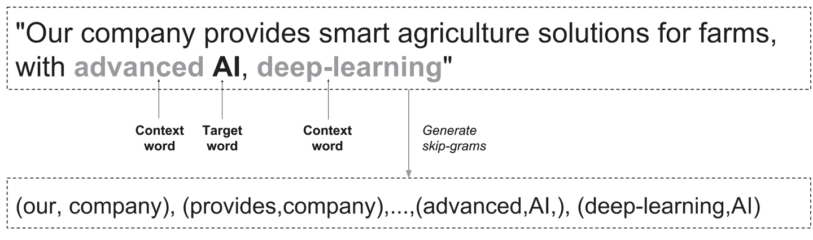

# 第六章：文本 II：词向量、高级 RNN 和嵌入可视化

在本章中，我们深入探讨了在第五章中讨论的与文本序列处理相关的重要主题。我们首先展示了如何使用一种称为*word2vec*的无监督方法训练词向量，以及如何使用 TensorBoard 交互地可视化嵌入。然后我们在监督文本分类任务中使用预训练的词向量，在大量公共数据上进行训练，并介绍了在最先进系统中经常使用的更高级的 RNN 组件。

# 词嵌入简介

在第五章中，我们介绍了 RNN 模型和在 TensorFlow 中处理文本序列。作为监督模型训练的一部分，我们还训练了词向量，将单词 ID 映射到低维连续向量。这样做的原因是为了实现可扩展的表示，可以输入到 RNN 层中。但是使用词向量还有更深层次的原因，我们接下来会讨论。

考虑出现在图 6-1 中的句子：“我们公司为农场提供智能农业解决方案，具有先进的人工智能、深度学习。”这句话可能来自于一条推广公司的推文。作为数据科学家或工程师，我们现在可能希望将其作为先进机器智能系统的一部分进行处理，该系统可以筛选推文并自动检测信息内容（例如公众情绪）。

在传统的自然语言处理（NLP）方法中，每个单词都会用 N 个 ID 来表示，比如一个整数。因此，正如我们在上一章中提出的，单词“agriculture”可能被映射到整数 3452，单词“farm”到 12，“AI”到 150，“deep-learning”到 0。

虽然这种表示在一些基本的 NLP 任务中取得了出色的结果，并且在许多情况下仍然经常使用（例如在基于词袋的文本分类中），但它存在一些主要的固有问题。首先，通过使用这种原子表示，我们丢失了单词内部编码的所有含义，关键的是，我们因此丢失了单词之间语义接近的信息。在我们的例子中，我们当然知道“agriculture”和“farm”之间有很强的关联，“AI”和“deep-learning”也是如此，而深度学习和农场通常没有太多关联。这并没有反映在它们的任意整数 ID 中。

这种查看数据的方式的另一个重要问题源于典型词汇量的规模，很容易达到庞大的数字。这意味着天真地说，我们可能需要保留数百万个这样的单词标识符，导致数据稀疏性增加，进而使学习变得更加困难和昂贵。

对于图像，比如我们在第五章第一节中使用的 MNIST 数据，情况并非如此。虽然图像可以是高维的，但它们在像素值方面的自然表示已经编码了一些语义含义，并且这种表示是密集的。实际上，像我们在第五章中看到的 RNN 模型需要密集的向量表示才能很好地工作。

因此，我们希望使用携带语义含义的单词的密集向量表示。但是我们如何获得它们呢？

在第五章中，我们训练了监督词向量来解决特定任务，使用了标记数据。但是对于个人和组织来说，获取标记数据往往是昂贵的，需要耗费大量资源、时间和精力来手动标记文本或以某种方式获取足够的标记实例。然而，获取大量未标记数据往往是一个不那么艰巨的任务。因此，我们希望找到一种方法来利用这些数据以无监督的方式训练词表示。

实际上有许多方法可以进行无监督训练词嵌入，包括传统的 NLP 方法和许多使用神经网络的新方法，这些方法无论新旧，都在核心上依赖于*分布假设*，这最容易通过语言学家约翰·弗斯的一句著名引言来解释：“你可以通过它的伙伴来认识一个词。” 换句话说，倾向于出现在相似上下文中的词往往具有相似的语义含义。

在本书中，我们专注于基于神经网络的强大词嵌入方法。在第五章中，我们看到了如何将它们作为下游文本分类任务的一部分进行训练。我们现在展示如何以无监督的方式训练词向量，然后如何使用在网络上大量文本训练的预训练向量。

# Word2vec

Word2vec 是一个非常著名的无监督词嵌入方法。实际上，它更像是一系列算法，所有这些算法都以某种方式利用单词出现的上下文来学习它们的表示（符合分布假设的精神）。我们专注于最流行的 word2vec 实现，它训练一个模型，给定一个输入词，通过使用所谓的*跳字*来预测单词的上下文。这实际上相当简单，下面的例子将会演示。

再次考虑我们的例句：“Our company provides smart agriculture solutions for farms, with advanced AI, deep-learning.” 我们（为了简单起见）将一个词的上下文定义为它的直接邻居（“它的伙伴”）——即，它左边的词和右边的词。因此，“company”的上下文是[our, provides]，“AI”的上下文是[advanced, deep-learning]，等等（参见图 6-1）。



###### 图 6-1。从文本生成跳字。

在跳字 word2vec 模型中，我们训练一个模型来根据输入词预测上下文。在这种情况下，这意味着我们生成训练实例和标签对，如（our，company），（provides，company），（advanced，AI），（deep-learning，AI），等等。

除了从数据中提取的这些对，我们还抽取“假”对——也就是，对于给定的输入词（如“AI”），我们还会抽取随机噪声词作为上下文（如“monkeys”），这个过程被称为*负采样*。我们使用真实对和噪声对结合起来构建我们的训练实例和标签，用于训练一个学习区分它们之间差异的二元分类器。这个分类器中的可训练参数是向量表示——词嵌入。我们调整这些向量以产生一个能够在二元分类设置中区分一个词的真实上下文和随机抽样的上下文的分类器。

TensorFlow 提供了许多实现 word2vec 模型的方式，随着复杂性和优化水平的增加，使用多线程和更高级的抽象来优化和缩短代码。我们在这里介绍了一种基本方法，它将向您介绍核心思想和操作。

让我们直接开始在 TensorFlow 代码中实现核心思想。

## 跳字

我们首先准备我们的数据并提取跳字。就像在第五章中一样，我们的数据包括两类非常短的“句子”，一类由奇数组成，另一类由偶数组成（用英文写的数字）。为了简单起见，我们在这里让句子大小相等，但这对于 word2vec 训练并不重要。让我们开始设置一些参数并创建句子：

```py
import os
import math
import numpy as np
import tensorflow as tf
from tensorflow.contrib.tensorboard.plugins import projector

batch_size=64
embedding_dimension = 5
negative_samples =8  
LOG_DIR = "logs/word2vec_intro"

digit_to_word_map = {1:"One",2:"Two", 3:"Three", 4:"Four", 5:"Five",
          6:"Six",7:"Seven",8:"Eight",9:"Nine"}
sentences = []

# Create two kinds of sentences - sequences of odd and even digits
for i in range(10000):
  rand_odd_ints = np.random.choice(range(1,10,2),3)
  sentences.append(" ".join([digit_to_word_map[r] for r in rand_odd_ints]))
  rand_even_ints = np.random.choice(range(2,10,2),3)
  sentences.append(" ".join([digit_to_word_map[r] for r in rand_even_ints]))

```

让我们来看看我们的句子：

```py
sentences[0:10]

Out:
['Seven One Five',
'Four Four Four',
'Five One Nine',
'Eight Two Eight',
'One Nine Three',
'Two Six Eight',
'Nine Seven Seven',
'Six Eight Six',
'One Five Five',
'Four Six Two']
```

接下来，就像在第五章中一样，我们通过创建一个以单词为键、索引为值的字典，将单词映射到索引，并创建反向映射：

```py
# Map words to indices
word2index_map ={}
index=0
for sent in sentences:
  for word in sent.lower().split():
    if word not in word2index_map:
      word2index_map[word] = index
      index+=1  
index2word_map = {index: word for word, index in word2index_map.items()}      
vocabulary_size = len(index2word_map)

```

为了准备 word2vec 的数据，让我们创建跳字模型：

```py
# Generate skip-gram pairs
skip_gram_pairs = []
for sent in sentences:
  tokenized_sent = sent.lower().split()
  for i in range(1, len(tokenized_sent)-1) :    
    word_context_pair = [[word2index_map[tokenized_sent[i-1]],
               word2index_map[tokenized_sent[i+1]]],
               word2index_map[tokenized_sent[i]]]
    skip_gram_pairs.append([word_context_pair[1],
                word_context_pair[0][0]])
    skip_gram_pairs.append([word_context_pair[1],
                word_context_pair[0][1]])

def get_skipgram_batch(batch_size):
  instance_indices = list(range(len(skip_gram_pairs)))
  np.random.shuffle(instance_indices)
  batch = instance_indices[:batch_size]
  x = [skip_gram_pairs[i][0] for i in batch]
  y = [[skip_gram_pairs[i][1]] for i in batch]
  return x,y

```

每个 skip-gram 对由目标和上下文单词索引组成（由`word2index_map`字典给出，并不对应于每个单词表示的实际数字）。让我们来看一下：

```py
skip_gram_pairs[0:10]

Out:
[[1, 0],
[1, 2],
[3, 3],
[3, 3],
[1, 2],
[1, 4],
[6, 5],
[6, 5],
[4, 1],
[4, 7]]

```

我们可以生成单词索引序列的批次，并使用我们之前创建的逆字典查看原始句子：

```py
# Batch example
x_batch,y_batch = get_skipgram_batch(8)
x_batch
y_batch
[index2word_map[word] for word in x_batch]
[index2word_map[word[0]] for word in y_batch]

x_batch

Out:
[6, 2, 1, 1, 3, 0, 7, 2]

y_batch

Out: 
[[5], [0], [4], [0], [5], [4], [1], [7]]

[index2word_map[word] for word in x_batch]

Out: 
['two', 'five', 'one', 'one', 'four', 'seven', 'three', 'five']

[index2word_map[word[0]] for word in y_batch]

Out: 
['eight', 'seven', 'nine', 'seven', 'eight',
 'nine', 'one', 'three']

```

最后，我们创建我们的输入和标签占位符：

```py
# Input data, labels
train_inputs = tf.placeholder(tf.int32, shape=[batch_size])
train_labels = tf.placeholder(tf.int32, shape=[batch_size, 1])
```

## TensorFlow 中的嵌入

在第五章中，我们在监督 RNN 的一部分中使用了内置的`tf.nn.embedding_lookup()`函数。这里也使用了相同的功能。在这里，单词嵌入可以被视为查找表，将单词映射到向量值，这些向量值在训练过程中被优化以最小化损失函数。正如我们将在下一节中看到的，与第五章不同的是，这里我们使用了一个考虑到任务非监督性质的损失函数，但是嵌入查找仍然是相同的，它有效地检索给定单词索引序列中每个单词的向量：

```py
with tf.name_scope("embeddings"):
  embeddings = tf.Variable(
    tf.random_uniform([vocabulary_size, embedding_dimension],
             -1.0, 1.0),name='embedding')
  # This is essentially a lookup table
  embed = tf.nn.embedding_lookup(embeddings, train_inputs)

```

## 噪声对比估计（NCE）损失函数

在我们介绍 skip-grams 时，我们提到我们创建了两种类型的上下文-目标单词对：在文本中出现的真实单词和通过插入随机上下文单词生成的“虚假”嘈杂对。我们的目标是学会区分这两者，帮助我们学习一个良好的单词表示。我们可以自己绘制随机嘈杂的上下文对，但幸运的是，TensorFlow 带有一个专门为我们的任务设计的有用的损失函数。当我们评估损失时（在会话中运行），`tf.nn.nce_loss()`会自动绘制负（“噪声”）样本：

```py
# Create variables for the NCE loss
nce_weights = tf.Variable(
    tf.truncated_normal([vocabulary_size, embedding_dimension],
              stddev=1.0 / math.sqrt(embedding_dimension)))
nce_biases = tf.Variable(tf.zeros([vocabulary_size]))

loss = tf.reduce_mean(
  tf.nn.nce_loss(weights = nce_weights, biases = nce_biases, inputs = embed, 
       labels = train_labels, num_sampled = negative_samples, num_classes =
                vocabulary_size))

```

我们不会深入讨论这个损失函数的数学细节，但可以将其视为一种对用于分类任务中的普通 softmax 函数的有效近似，正如在之前的章节中介绍的那样。我们调整我们的嵌入向量以优化这个损失函数。有关更多详细信息，请参阅官方 TensorFlow[文档](https://www.tensorflow.org/api_docs/python/tf/nn/nce_loss)和其中的参考资料。

我们现在准备好进行训练了。除了在 TensorFlow 中获取我们的单词嵌入之外，我们接下来介绍两个有用的功能：调整优化学习率和交互式可视化嵌入。

## 学习率衰减

正如在之前的章节中讨论的那样，梯度下降优化通过朝着最小化损失函数的方向进行小步调整权重。`learning_rate`超参数控制这些步骤的侵略性。在模型的梯度下降训练过程中，通常会逐渐减小这些步骤的大小，以便让我们的优化过程在接近参数空间中的良好点时“安定下来”。这个小改动实际上经常会显著提升性能，并且是一个一般性的良好实践。

`tf.train.exponential_decay()`对学习率应用指数衰减，衰减的确切形式由一些超参数控制，如下面的代码所示（有关详细信息，请参阅官方 TensorFlow 文档[`bit.ly/2tluxP1`](http://bit.ly/2tluxP1)）。在这里，仅作为示例，我们每 1,000 步衰减一次，衰减的学习率遵循阶梯函数——一种类似于楼梯的分段常数函数，正如其名称所暗示的那样：

```py
# Learning rate decay
global_step = tf.Variable(0, trainable=False)
learningRate = tf.train.exponential_decay(learning_rate=0.1,
                     global_step= global_step,
                     decay_steps=1000,
                     decay_rate= 0.95,
                     staircase=True)
train_step = tf.train.GradientDescentOptimizer(learningRate).minimize(loss)
```

## 使用 TensorBoard 进行训练和可视化

我们像往常一样在会话中训练我们的图，添加了一些代码行，使 TensorBoard 中的交互式可视化更加酷炫，这是一种用于可视化高维数据（通常是图像或单词向量）的新工具，于 2016 年底引入 TensorFlow。

首先，我们创建一个 TSV（制表符分隔值）元数据文件。该文件将嵌入向量与我们可能拥有的相关标签或图像连接起来。在我们的情况下，每个嵌入向量都有一个标签，就是它代表的单词。

然后，我们将 TensorBoard 指向我们的嵌入变量（在这种情况下，只有一个），并将它们链接到元数据文件。

最后，在完成优化但在关闭会话之前，我们将词嵌入向量归一化为单位长度，这是一个标准的后处理步骤：

```py
# Merge all summary ops
merged = tf.summary.merge_all()

with tf.Session() as sess:
  train_writer = tf.summary.FileWriter(LOG_DIR,
                    graph=tf.get_default_graph())
  saver = tf.train.Saver()

  with open(os.path.join(LOG_DIR,'metadata.tsv'), "w") as metadata:
    metadata.write('Name\tClass\n')
    for k,v in index2word_map.items():
      metadata.write('%s\t%d\n' % (v, k))

  config = projector.ProjectorConfig()
  embedding = config.embeddings.add()
  embedding.tensor_name = embeddings.name
  # Link embedding to its metadata file
  embedding.metadata_path = os.path.join(LOG_DIR,'metadata.tsv')
  projector.visualize_embeddings(train_writer, config) 

  tf.global_variables_initializer().run()

  for step in range(1000):
    x_batch, y_batch = get_skipgram_batch(batch_size)
    summary,_ = sess.run([merged,train_step],
              feed_dict={train_inputs:x_batch,
                    train_labels:y_batch})
    train_writer.add_summary(summary, step)

    if step % 100 == 0:
      saver.save(sess, os.path.join(LOG_DIR, "w2v_model.ckpt"), step)
      loss_value = sess.run(loss,
                 feed_dict={train_inputs:x_batch,
                      train_labels:y_batch})
      print("Loss at %d: %.5f" % (step, loss_value))

  # Normalize embeddings before using
  norm = tf.sqrt(tf.reduce_sum(tf.square(embeddings), 1, keep_dims=True))
  normalized_embeddings = embeddings / norm
  normalized_embeddings_matrix = sess.run(normalized_embeddings)
```

## 检查我们的嵌入

让我们快速看一下我们得到的词向量。我们选择一个单词（*one*）并按照它们与其接近程度的顺序对所有其他词向量进行排序，降序排列：

```py
ref_word = normalized_embeddings_matrix[word2index_map["one"]]

cosine_dists = np.dot(normalized_embeddings_matrix,ref_word)  
ff = np.argsort(cosine_dists)[::-1][1:10]
for f in ff:
  print(index2word_map[f])
  print(cosine_dists[f])

```

现在让我们看看与*one*向量的词距离：

```py
Out:
seven
0.946973
three
0.938362
nine
0.755187
five
0.701269
eight
-0.0702622
two
-0.101749
six
-0.120306
four
-0.159601
```

我们看到，代表奇数的词向量与*one*相似（在点积方面），而代表偶数的词向量与之不相似（并且与*one*向量的点积为负）。我们学习了嵌入向量，使我们能够区分偶数和奇数——它们各自的向量相距甚远，因此捕捉了每个单词（奇数或偶数数字）出现的上下文。

现在，在 TensorBoard 中，转到嵌入选项卡。这是一个三维交互式可视化面板，我们可以在嵌入向量空间中移动并探索不同的“角度”，放大等（参见图 6-2 和 6-3）。这使我们能够以视觉舒适的方式理解我们的数据并解释模型。我们可以看到，奇数和偶数在特征空间中占据不同的区域。

！[](assets/letf_0602.png)

###### 图 6-2. 词嵌入的交互式可视化。

！[](assets/letf_0603.png)

###### 图 6-3. 我们可以从不同角度探索我们的词向量（在具有大词汇量的高维问题中特别有用）。

当我们有大量嵌入向量时，例如在具有更大词汇量的实际文本分类任务中，这种类型的可视化效果非常出色，例如在第七章中，或在嵌入投影仪[TensorFlow 演示](http://projector.tensorflow.org/)中。在这里，我们只是让您尝试如何交互地探索您的数据和深度学习模型。

# 预训练嵌入，高级 RNN

正如我们之前讨论的，词嵌入是深度学习模型中文本的强大组件。在许多应用中看到的一种流行方法是首先使用诸如 word2vec 之类的方法在大量（未标记的）文本上训练词向量，然后在监督文档分类等下游任务中使用这些向量。

在前一节中，我们从头开始训练了无监督的词向量。这种方法通常需要非常大的语料库，例如维基百科条目或网页。在实践中，我们经常使用预训练的词嵌入，这些词嵌入在如前几章中介绍的预训练模型中以类似的方式训练，并且可在线获取。

在本节中，我们展示了如何在 TensorFlow 中使用预训练的词嵌入进行简化的文本分类任务。为了使事情更有趣，我们还借此机会介绍了一些在现代深度学习应用中经常使用的更有用和更强大的组件，用于自然语言理解：双向 RNN 层和门控循环单元（GRU）单元。

我们将扩展和调整我们从第五章中的文本分类示例，只关注已更改的部分。

## 预训练词嵌入

在这里，我们展示了如何将基于网络数据训练的词向量并入（虚构的）文本分类任务中。嵌入方法被称为*GloVe*，虽然我们在这里不深入讨论细节，但总体思想与 word2vec 类似——通过单词出现的上下文学习单词的表示。关于该方法及其作者以及预训练向量的信息可在项目的[网站](http://nlp.stanford.edu/projects/glove/)上找到。

我们下载了 Common Crawl 向量（840B 个标记），然后进行我们的示例。

首先设置下载的单词向量的路径和一些其他参数，就像第五章中所示的那样：

```py
importzipfileimportnumpyasnpimporttensorflowastfpath_to_glove="*`path/to/glove/file`*"PRE_TRAINED=TrueGLOVE_SIZE=300batch_size=128embedding_dimension=64num_classes=2hidden_layer_size=32times_steps=6
```

然后我们创建人为的、简单的模拟数据，也如同第五章中所示（详细信息请参见那里）：

```py
digit_to_word_map = {1:"One",2:"Two", 3:"Three", 4:"Four", 5:"Five",
          6:"Six",7:"Seven",8:"Eight",9:"Nine"}
digit_to_word_map[0]="PAD_TOKEN"
even_sentences = []
odd_sentences = []
seqlens = []
for i in range(10000):
  rand_seq_len = np.random.choice(range(3,7))
  seqlens.append(rand_seq_len)
  rand_odd_ints = np.random.choice(range(1,10,2),
                  rand_seq_len)
  rand_even_ints = np.random.choice(range(2,10,2),
                   rand_seq_len)
  if rand_seq_len<6:
    rand_odd_ints = np.append(rand_odd_ints,
                 [0]*(6-rand_seq_len))
    rand_even_ints = np.append(rand_even_ints,
                 [0]*(6-rand_seq_len))

  even_sentences.append(" ".join([digit_to_word_map[r] for
               r in rand_odd_ints]))
  odd_sentences.append(" ".join([digit_to_word_map[r] for
               r in rand_even_ints])) 
data = even_sentences+odd_sentences
# Same seq lengths for even, odd sentences
seqlens*=2
labels = [1]*10000 + [0]*10000
for i in range(len(labels)):
  label = labels[i]
  one_hot_encoding = [0]*2
  one_hot_encoding[label] = 1
  labels[i] = one_hot_encoding

```

接下来，我们创建单词索引映射：

```py
word2index_map ={}
index=0
for sent in data:
  for word in sent.split():
    if word not in word2index_map:
      word2index_map[word] = index
      index+=1

index2word_map = {index: word for word, index in word2index_map.items()}      

vocabulary_size = len(index2word_map)
```

让我们回顾一下它的内容——只是一个从单词到（任意）索引的映射：

```py
word2index_map

Out:
{'Eight': 7,
'Five': 1,
'Four': 6,
'Nine': 3,
'One': 5,
'PAD_TOKEN': 2,
'Seven': 4,
'Six': 9,
'Three': 0,
'Two': 8}
```

现在，我们准备获取单词向量。我们下载的预训练 GloVe 嵌入中有 220 万个单词，而在我们的玩具示例中只有 9 个。因此，我们只取出出现在我们自己微小词汇表中的单词的 GloVe 向量：

```py
def get_glove(path_to_glove,word2index_map):

  embedding_weights = {}
  count_all_words = 0
  with zipfile.ZipFile(path_to_glove) as z:
    with z.open("glove.840B.300d.txt") as f:
      for line in f:
        vals = line.split()
        word = str(vals[0].decode("utf-8"))
        if word in word2index_map:
          print(word)
          count_all_words+=1
          coefs = np.asarray(vals[1:], dtype='float32')
          coefs/=np.linalg.norm(coefs)
          embedding_weights[word] = coefs
        if count_all_words==vocabulary_size -1:
          break
  return embedding_weights
word2embedding_dict = get_glove(path_to_glove,word2index_map)

```

我们逐行查看 GloVe 文件，获取我们需要的单词向量，并对它们进行归一化。一旦我们提取出需要的九个单词，我们就停止这个过程并退出循环。我们函数的输出是一个字典，将每个单词映射到它的向量。

下一步是将这些向量放入矩阵中，这是 TensorFlow 所需的格式。在这个矩阵中，每行索引应该对应单词索引：

```py
embedding_matrix = np.zeros((vocabulary_size ,GLOVE_SIZE))

for word,index in word2index_map.items():
  if not word == "PAD_TOKEN":
    word_embedding = word2embedding_dict[word]
    embedding_matrix[index,:] = word_embedding

```

请注意，对于`PAD_TOKEN`单词，我们将相应的向量设置为 0。正如我们在第五章中看到的，我们在调用`dynamic_rnn()`时会忽略填充的标记，告诉它原始序列长度。

现在我们创建我们的训练和测试数据：

```py
data_indices = list(range(len(data)))
np.random.shuffle(data_indices)
data = np.array(data)[data_indices]
labels = np.array(labels)[data_indices]
seqlens = np.array(seqlens)[data_indices]
train_x = data[:10000]
train_y = labels[:10000]
train_seqlens = seqlens[:10000]

test_x = data[10000:]
test_y = labels[10000:]
test_seqlens = seqlens[10000:]

def get_sentence_batch(batch_size,data_x,
           data_y,data_seqlens):
  instance_indices = list(range(len(data_x)))
  np.random.shuffle(instance_indices)
  batch = instance_indices[:batch_size]
  x = [[word2index_map[word] for word in data_x[i].split()]
    for i in batch]
  y = [data_y[i] for i in batch]
  seqlens = [data_seqlens[i] for i in batch]
  return x,y,seqlens  

```

然后我们创建我们的输入占位符：

```py
_inputs = tf.placeholder(tf.int32, shape=[batch_size,times_steps])
embedding_placeholder = tf.placeholder(tf.float32, [vocabulary_size,
                          GLOVE_SIZE])

_labels = tf.placeholder(tf.float32, shape=[batch_size, num_classes])
_seqlens = tf.placeholder(tf.int32, shape=[batch_size])

```

请注意，我们创建了一个`embedding_placeholder`，我们向其中提供单词向量：

```py
if PRE_TRAINED:

    embeddings = tf.Variable(tf.constant(0.0, shape=[vocabulary_size, 
                GLOVE_SIZE]),
                trainable=True)
    # If using pretrained embeddings, assign them to the embeddings variable
    embedding_init = embeddings.assign(embedding_placeholder)
    embed = tf.nn.embedding_lookup(embeddings, _inputs)

else:
    embeddings = tf.Variable(
      tf.random_uniform([vocabulary_size,
               embedding_dimension],
               -1.0, 1.0))
    embed = tf.nn.embedding_lookup(embeddings, _inputs)

```

我们的嵌入是用`embedding_placeholder`的内容初始化的，使用`assign()`函数将初始值分配给`embeddings`变量。我们设置`trainable=True`告诉 TensorFlow 我们希望更新单词向量的值，通过优化它们以适应当前任务。然而，通常有用的是将`trainable=False`，不更新这些值；例如，当我们没有太多标记数据或有理由相信单词向量已经“很好”地捕捉到我们想要的模式时。

还有一个步骤缺失，以完全将单词向量纳入训练中——用`embedding_matrix`喂`embedding_placeholder`。我们很快就会做到这一点，但现在我们继续构建图并引入双向 RNN 层和 GRU 单元。

## 双向 RNN 和 GRU 单元

双向 RNN 层是我们在第五章中看到的 RNN 层的一个简单扩展。它们的基本形式只包括两个普通的 RNN 层：一个从左到右读取序列的层，另一个从右到左读取。每个都产生一个隐藏表示，左到右向量 <math><mover accent="true"><mi>h</mi> <mo>→</mo></mover></math> ，和右到左向量 <math alttext="ModifyingAbove h With left-arrow"><mover accent="true"><mi>h</mi> <mo>←</mo></mover></math> 。然后将它们连接成一个向量。这种表示的主要优势在于它能够捕捉单词的上下文，从两个方向，这使得对自然语言和文本中的基础语义有更丰富的理解。在实践中，在复杂任务中，它通常会导致更高的准确性。例如，在词性标注中，我们希望为句子中的每个单词输出一个预测的标签（如“名词”，“形容词”等）。为了预测给定单词的词性标签，有必要获取其周围单词的信息，从两个方向。

门控循环单元（GRU）单元是 LSTM 单元的一种简化。它们也有记忆机制，但参数比 LSTM 少得多。当可用数据较少时，它们经常被使用，并且计算速度更快。我们在这里不详细介绍数学细节，因为对于我们的目的来说并不重要；有许多在线资源解释 GRU 以及它与 LSTM 的区别。

TensorFlow 配备了`tf.nn.bidirectional_dynamic_rnn()`，这是`dynamic_rnn()`的扩展，用于双向层。它接受`cell_fw`和`cell_bw` RNN 单元，分别是从左到右和从右到左的向量。在这里，我们使用`GRUCell()`作为我们的前向和后向表示，并添加了用于正则化的 dropout，使用内置的`DropoutWrapper()`：

```py
with tf.name_scope("biGRU"):
  with tf.variable_scope('forward'):
    gru_fw_cell = tf.contrib.rnn.GRUCell(hidden_layer_size)
    gru_fw_cell = tf.contrib.rnn.DropoutWrapper(gru_fw_cell)

  with tf.variable_scope('backward'):
    gru_bw_cell = tf.contrib.rnn.GRUCell(hidden_layer_size)
    gru_bw_cell = tf.contrib.rnn.DropoutWrapper(gru_bw_cell)

  outputs, states = tf.nn.bidirectional_dynamic_rnn(cell_fw=gru_fw_cell,
                           cell_bw=gru_bw_cell,
                           inputs=embed,
                           sequence_length=
                           _seqlens,
                           dtype=tf.float32,
                           scope="BiGRU")
states = tf.concat(values=states, axis=1)

```

我们通过沿着适当的轴使用`tf.concat()`来连接前向和后向状态向量，然后添加一个线性层，后跟 softmax，就像第五章中一样：

```py
weights = {
  'linear_layer': tf.Variable(tf.truncated_normal([2*hidden_layer_size,
                          num_classes],
                          mean=0,stddev=.01))
}
biases = {
  'linear_layer':tf.Variable(tf.truncated_normal([num_classes],
                         mean=0,stddev=.01))
}

# extract the final state and use in a linear layer
final_output = tf.matmul(states,
            weights["linear_layer"]) + biases["linear_layer"]

softmax = tf.nn.softmax_cross_entropy_with_logits(logits=final_output,
                         labels=_labels)            
cross_entropy = tf.reduce_mean(softmax)

train_step = tf.train.RMSPropOptimizer(0.001, 0.9).minimize(cross_entropy)
correct_prediction = tf.equal(tf.argmax(_labels,1),
               tf.argmax(final_output,1))
accuracy = (tf.reduce_mean(tf.cast(correct_prediction,
                 tf.float32)))*100

```

现在我们准备开始训练。我们通过将我们的`embedding_matrix`传递给`embedding_placeholder`来初始化它。重要的是要注意，我们在调用`tf.global_variables_initializer()`之后这样做——以相反的顺序进行会用默认初始化器覆盖预训练向量：

```py
with tf.Session() as sess:
  sess.run(tf.global_variables_initializer())
  sess.run(embedding_init, feed_dict=
      {embedding_placeholder: embedding_matrix})
  for step in range(1000):
    x_batch, y_batch,seqlen_batch = get_sentence_batch(batch_size,
                             train_x,train_y,
                             train_seqlens)
    sess.run(train_step,feed_dict={_inputs:x_batch, _labels:y_batch,
                   _seqlens:seqlen_batch})

    if step % 100 == 0:
      acc = sess.run(accuracy,feed_dict={_inputs:x_batch,
                       _labels:y_batch,
                       _seqlens:seqlen_batch})
      print("Accuracy at %d: %.5f" % (step, acc))

  for test_batch in range(5):
    x_test, y_test,seqlen_test = get_sentence_batch(batch_size,
                            test_x,test_y,
                            test_seqlens)
    batch_pred,batch_acc = sess.run([tf.argmax(final_output,1),
                    accuracy],
                    feed_dict={_inputs:x_test,
                         _labels:y_test,
                         _seqlens:seqlen_test})
    print("Test batch accuracy %d: %.5f" % (test_batch, batch_acc)) 
    print("Test batch accuracy %d: %.5f" % (test_batch, batch_acc)) 

```

# 摘要

在本章中，我们扩展了关于处理文本序列的知识，为我们的 TensorFlow 工具箱添加了一些重要工具。我们看到了 word2vec 的基本实现，学习了核心概念和思想，并使用 TensorBoard 对嵌入进行了 3D 交互式可视化。然后我们加入了公开可用的 GloVe 词向量，以及允许更丰富和更高效模型的 RNN 组件。在下一章中，我们将看到如何使用抽象库，包括在真实文本数据上使用 LSTM 网络进行分类任务。
