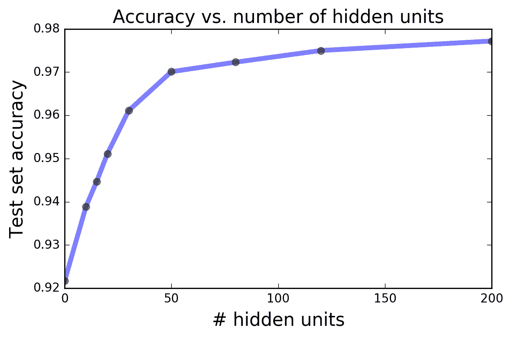
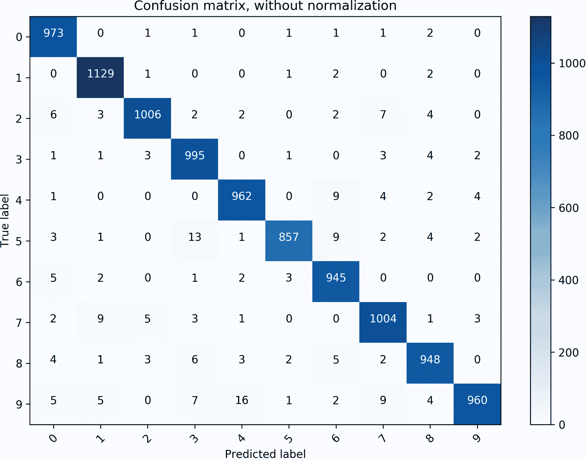
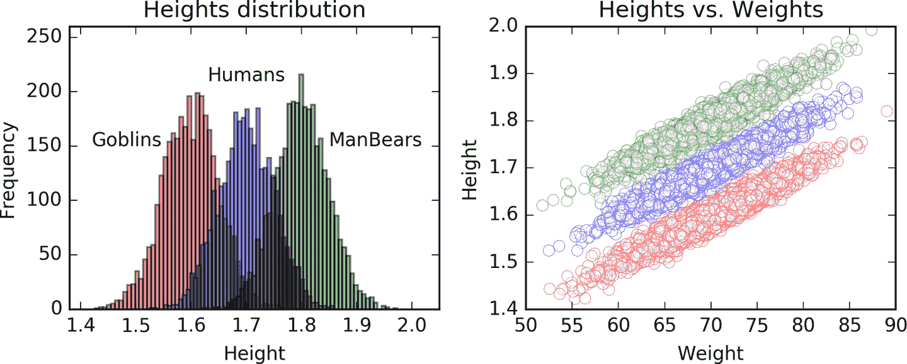
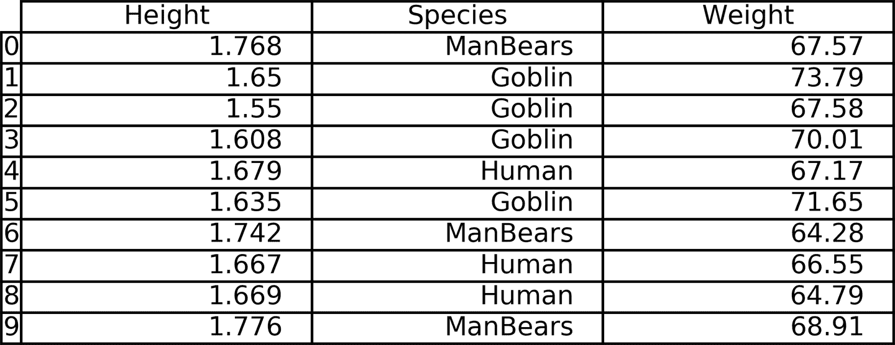
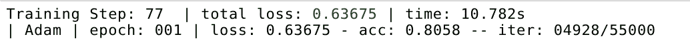
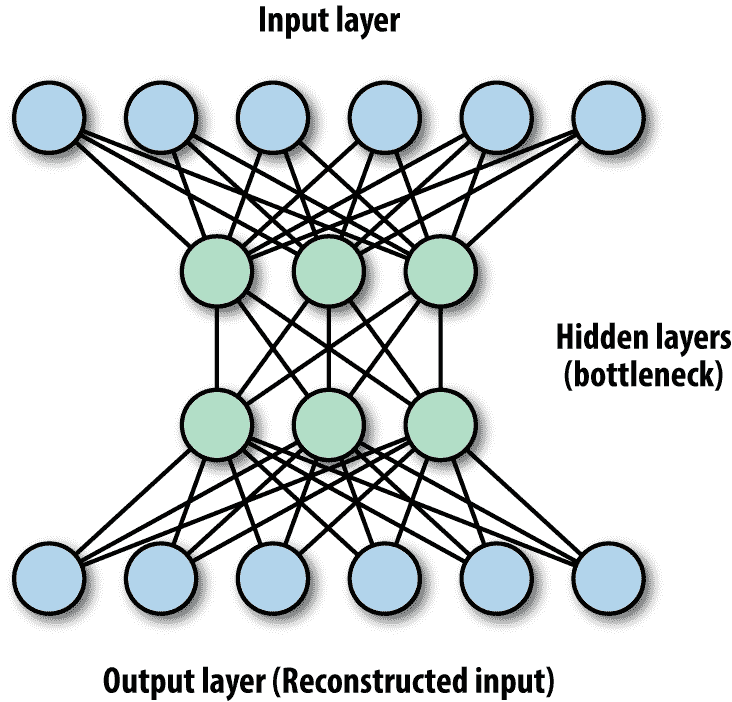

# 第七章：TensorFlow 抽象和简化

本章的目的是让您熟悉 TensorFlow 的重要实用扩展。我们首先描述抽象是什么以及为什么它们对我们有用，然后简要回顾一些流行的 TensorFlow 抽象库。然后我们更深入地研究其中两个库，演示一些它们的核心功能以及一些示例。

# 章节概述

正如大多数读者可能知道的那样，在编程的上下文中，术语*抽象*指的是一层代码，“在”现有代码之上执行原始代码的目的驱动泛化的代码。抽象是通过将与某些高阶功能相关的代码片段分组和包装在一起的方式形成的，以便方便地将它们重新框架在一起。结果是简化的代码，更容易编写、阅读和调试，通常更容易和更快地使用。在许多情况下，TensorFlow 的抽象不仅使代码更清晰，还可以显著减少代码长度，从而显著缩短开发时间。

为了让我们开始，让我们在 TensorFlow 的上下文中说明这个基本概念，并再次查看一些构建 CNN 的代码，就像我们在第四章中所做的那样：

```py
def weight_variable(shape):
 initial = tf.truncated_normal(shape, stddev=0.1)
 return tf.Variable(initial)

def bias_variable(shape):
 initial = tf.constant(0.1, shape=shape)
 return tf.Variable(initial)

def conv2d(x, W):
 return tf.nn.conv2d(x, W, strides=[1, 1, 1, 1],
           padding='SAME')

def conv_layer(input, shape):
 W = weight_variable(shape)
 b = bias_variable([shape[3]])
 h = tf.nn.relu(conv2d(input, W) + b)
 hp = max_pool_2x2(h)
 return hp

def max_pool_2x2(x):
 return tf.nn.max_pool(x, ksize=[1, 2, 2, 1],
            strides=[1, 2, 2, 1], padding='SAME')

x = tf.placeholder(tf.float32, shape=[None, 784])
x_image = tf.reshape(x, [-1, 28, 28, 1])

h1 = conv_layer(x_image, shape=[5, 5, 1, 32])
h2 = conv_layer(h1, shape=[5, 5, 32, 64])
h3 = conv_layer(h2, shape=[5, 5, 64, 32])

```

在原生 TensorFlow 中，为了创建一个卷积层，我们必须根据输入和期望输出的形状定义和初始化其权重和偏置，应用具有定义步幅和填充的卷积操作，最后添加激活函数操作。很容易忘记其中一个基本组件或出错。此外，多次重复此过程可能有些繁琐，感觉可以更有效地完成。

在前面的代码示例中，我们通过使用消除这个过程中一些冗余的函数来创建了自己的小抽象。让我们将该代码的可读性与另一个版本进行比较，该版本完全相同，但没有使用任何函数：

```py
x = tf.placeholder(tf.float32, shape=[None, 784])
x_image = tf.reshape(x, [-1, 28, 28, 1])

W1 = tf.truncated_normal([5, 5, 1, 32], stddev=0.1)
b1 = tf.constant(0.1, shape=[32])
h1 = tf.nn.relu(tf.nn.conv2d(x_image, W1, 
                strides=[1, 1, 1, 1], padding='SAME') + b1)
hp1 = tf.nn.max_pool(h1, ksize=[1, 2, 2, 1], 
                     strides=[1, 2, 2, 1], padding='SAME')
W2 = tf.truncated_normal([5, 5, 32, 64], stddev=0.1)
b2 = tf.constant(0.1, shape=[64])
h2 = tf.nn.relu(tf.nn.conv2d(hp1, W2, 
                strides=[1, 1, 1, 1], padding='SAME') + b2)
hp2 = tf.nn.max_pool(h2, ksize=[1, 2, 2, 1], 
                     strides=[1, 2, 2, 1], padding='SAME')
W3 = tf.truncated_normal([5, 5, 64, 32], stddev=0.1)
b3 = tf.constant(0.1, shape=[32])
h3 = h1 = tf.nn.relu(tf.nn.conv2d(hp2, W3, 
                     strides=[1, 1, 1, 1], padding='SAME') + b3)
hp3 = tf.nn.max_pool(h3, ksize=[1, 2, 2, 1], 
                     strides=[1, 2, 2, 1], padding='SAME')
```

即使只有三层，结果代码看起来也相当混乱和令人困惑。显然，随着我们进展到更大更先进的网络，像这样的代码将很难管理和传递。

除了更典型的中等大小的代码批处理外，长而复杂的代码通常会在抽象库中为我们“包装起来”。这在相对简单的模型中特别有效，几乎不需要任何定制。作为下一节内容的预览，您已经可以看到在`contrib.learn`中，一个适用于 TensorFlow 的可用抽象之一，定义和训练线性回归模型的核心，类似于第三章末尾的模型，只需两行代码即可完成：

```py
regressor = learn.LinearRegressor(feature_columns=feature_columns,
                                 optimizer=optimizer)
regressor.fit(X, Y, steps=200, batch_size=506)

```

## 高级调查

在撰写本书时，有不少出色的 TensorFlow 开源扩展可用。其中一些流行的扩展包括：

+   `tf.contrib.learn`

+   TFLearn

+   TF-Slim

+   Keras

虽然需要安装 TFLearn，但`contrib.learn`和 TF-Slim（现在是`tf.contrib.slim`）已与 TensorFlow 合并，因此无需安装。2017 年，Keras 获得了官方的 Google 支持，并且已经移入`tf.contrib`作为 1.1 版本（`tf.contrib.keras`）。名称*contrib*指的是该库中的代码是“贡献的”，仍然需要测试以查看是否得到广泛接受。因此，它仍可能发生变化，并且尚未成为核心 TensorFlow 的一部分。

`contrib.learn`最初是作为 TensorFlow 的独立简化接口而创建的，最初被称为*Scikit Flow*，旨在使那些从“一行代码”机器学习的`scikit-learn`世界过渡的人更容易创建复杂的网络。通常情况下，它后来被合并到 TensorFlow 中，现在被视为其*Learn 模块*，具有广泛的文档和示例，可在官方 TensorFlow 网站上找到。

与其他库一样，`contrib.learn`的主要目标是使配置、训练和评估我们的学习模型变得简单。对于非常简单的模型，您可以使用现成的实现来训练，只需几行代码。正如我们很快将看到的，`contrib.learn`的另一个巨大优势是功能，可以非常方便地处理数据特征。

虽然`contrib.learn`更加透明和低级，其他三个扩展更加清晰和抽象，每个都有自己的特长和小优势，根据用户的需求可能会很有用。

TFLearn 和 Keras 充满了功能，并且具有许多各种类型的最新建模所需的元素。与所有其他库不同的是，这些库是专门为与 TensorFlow 通信而创建的，而 Keras 支持 TensorFlow 和 Theano（一种流行的深度学习库）。

TF-Slim 主要用于轻松设计复杂的卷积网络，并且有各种预训练模型可用，使我们免于自己训练这些昂贵的过程。

这些库非常动态，不断变化，开发人员添加新模型和功能，并偶尔修改其语法。

# Theano

*Theano*是一个 Python 库，允许您以高效的方式操作涉及张量数组的符号数学表达式，因此它可以作为一个深度学习框架，与 TensorFlow 竞争。Theano 存在的时间更长，因此比 TensorFlow 更成熟一些，后者仍在不断变化和发展，但正在迅速成为领头羊（许多人普遍认为它已经是领先的库，具有许多优势，超过其他框架）。

在接下来的章节中，我们演示如何使用这些扩展，以及一些示例。我们首先关注`contrib.learn`，演示它如何轻松让我们训练和运行简单的回归和分类模型。接下来我们介绍 TFLearn，并重新访问前几章介绍的更高级模型——CNN 和 RNN。然后我们简要介绍自编码器，并演示如何使用 Keras 创建一个。最后，我们结束本章，简要介绍 TF-Slim，并展示如何使用加载的预训练最先进的 CNN 模型对图像进行分类。

# contrib.learn

使用`contrib.learn`不需要任何安装，因为它已经与 TensorFlow 合并：

```py
import tensorflow as tf
from tensorflow.contrib import learn

```

我们从`contrib.learn`的现成*评估器*（模型的花哨名称）开始，可以快速高效地训练。这些预定义的评估器包括简单的线性和逻辑回归模型，简单的线性分类器和基本的深度神经网络。表 7-1 列出了我们可以使用的一些流行的评估器。

表 7-1\. 流行的内置 contrib.learn 评估器

| 评估器 | 描述 |
| --- | --- |
| `LinearRegressor()` | 线性回归模型，用于根据特征值的观察来预测标签值。 |
| `LogisticRegressor()` | 用于二元分类的逻辑回归评估器。 |
| `LinearClassifier()` | 线性模型，将实例分类为多个可能的类别之一。当可能的类别数为 2 时，这是二元分类。 |
| `DNNRegressor()` | 用于 TensorFlow 深度神经网络（DNN）模型的回归器。 |
| `DNNClassifier()` | 用于 TensorFlow DNN 模型的分类器。 |

当然，我们也希望使用更先进和定制的模型，为此`contrib.learn`让我们方便地包装我们自己制作的估计器，这是我们将在接下来讨论的功能之一。一旦我们准备好部署一个估计器，无论是为我们制作还是我们自己制作的，步骤基本相同：

1.  我们*实例化*评估器类来创建我们的模型：

    ```py
    model=learn.*`<``some_Estimator``>`*()
    ```

1.  然后我们使用我们的训练数据*拟合*它：

    ```py
    model.fit()

    ```

1.  我们*评估*模型，看它在某个给定数据集上的表现如何：

    ```py
    model.evaluate()

    ```

1.  最后，我们使用我们拟合的模型来*预测*结果，通常是针对新数据：

    ```py
    model.predict()

    ```

这四个基本阶段也存在于其他扩展中。

`contrib`提供许多其他功能和特性；特别是，`contrib.learn`有一种非常巧妙的方式来处理我们的输入数据，这将是下一小节的重点，我们将在其中讨论线性模型。

## 线性回归

我们从`contrib.learn`的一个最强大的功能开始，即线性模型。我们说一个模型是*线性*的，每当它由特征的加权和的函数定义时，或更正式地*f*(*w[1]x[1]* + *w[2]x[2]* +...+ *w[n]x[n]*)，其中*f*可以是任何类型的函数，如恒等函数（如线性回归中）或逻辑函数（如逻辑回归中）。尽管在表达能力上有限，线性模型具有许多优点，如清晰的可解释性、优化速度和简单性。

在第三章中，我们使用原生 TensorFlow 创建了自己的线性回归模型，首先创建了一个包含输入和目标数据占位符的图形，一组参数的变量，损失函数和优化器。在定义了模型之后，我们运行了会话并获得了结果。

在接下来的部分中，我们首先重复这个完整的过程，然后展示如何使用`contrib.learn`来做到这一点要容易得多。在这个例子中，我们使用波士顿房屋数据集，可以使用[`sklearn`库](http://bit.ly/2sXIfrX?)下载。波士顿房屋数据集是一个相对较小的数据集（506 个样本），包含有关马萨诸塞州波士顿地区住房的信息。这个数据集中有 13 个预测变量：

1.  CRIM：按城镇人均犯罪率

1.  ZN：用于超过 25,000 平方英尺地块的住宅用地比例

1.  INDUS：每个城镇非零售业务面积的比例

1.  CHAS：查尔斯河虚拟变量（如果地块边界河流则为 1；否则为 0）

1.  NOX：一氧化氮浓度（每千万份之）

1.  RM：每个住宅的平均房间数

1.  AGE：1940 年之前建造的自住单位比例

1.  DIS：到波士顿五个就业中心的加权距离

1.  RAD：到径向高速公路的可达性指数

1.  TAX：每 1 万美元的全额财产税率

1.  PTRATIO：按城镇的师生比

1.  B：1000(Bk - 0.63)²，其中 Bk 是按城镇划分的黑人比例

1.  LSTAT：人口的较低地位%

目标变量是以千美元为单位的自住房屋的中位数价值。在这个例子中，我们尝试通过使用这 13 个特征的一些线性组合来预测目标变量。

首先，我们导入数据：

```py
from sklearn import datasets, metrics, preprocessing
boston = datasets.load_boston()
x_data = preprocessing.StandardScaler().fit_transform(boston.data)
y_data = boston.target

```

接下来，我们使用与第三章中相同的线性回归模型。这次我们跟踪“损失”，以便测量均方误差（MSE），即实际目标值与我们预测值之间的平方差的平均值。我们使用这个度量作为我们的模型表现如何的指标：

```py
x = tf.placeholder(tf.float64,shape=(None,13))
y_true = tf.placeholder(tf.float64,shape=(None))

with tf.name_scope('inference') as scope:
  w = tf.Variable(tf.zeros([1,13],dtype=tf.float64,name='weights'))
  b = tf.Variable(0,dtype=tf.float64,name='bias')
  y_pred = tf.matmul(w,tf.transpose(x)) + b

with tf.name_scope('loss') as scope:
  loss = tf.reduce_mean(tf.square(y_true-y_pred))

with tf.name_scope('train') as scope:
  learning_rate = 0.1
  optimizer = tf.train.GradientDescentOptimizer(learning_rate)
  train = optimizer.minimize(loss)

init = tf.global_variables_initializer()
with tf.Session() as sess:
  sess.run(init)   
  for step in range(200):
    sess.run(train,{x: x_data, y_true: y_data})

  MSE = sess.run(loss,{x: x_data, y_true: y_data})
print(MSE)

Out: 
MSE = 21.9036388397
```

经过 200 次迭代，我们打印出训练集计算的 MSE。现在我们执行完全相同的过程，但使用`contrib.learn`的线性回归估计器。定义、拟合和评估模型的整个过程只需要几行代码：

1.  线性回归模型是使用`learn.LinearRegressor()`实例化的，并提供有关数据表示和优化器类型的知识：

    ```py
    reg = learn.LinearRegressor(
         feature_columns=feature_columns,
         optimizer=tf.train.GradientDescentOptimizer(
          learning_rate=0.1)
         )

    ```

1.  使用`.fit()`训练`regressor`对象。我们传递协变量和目标变量，并设置步数和批量大小：

    ```py
    reg.fit(x_data, boston.target, steps=NUM_STEPS, 
           batch_size=MINIBATCH_SIZE)
    ```

1.  MSE 损失由`.evaluate()`返回：

    ```py
    MSE = regressor.evaluate(x_data, boston.target, steps=1)

    ```

以下是完整的代码：

```py
NUM_STEPS = 200
MINIBATCH_SIZE = 506

feature_columns = learn.infer_real_valued_columns_from_input(x_data)

reg = learn.LinearRegressor(
     feature_columns=feature_columns,
     optimizer=tf.train.GradientDescentOptimizer(
      learning_rate=0.1)
     )

reg.fit(x_data, boston.target, steps=NUM_STEPS, 
       batch_size=MINIBATCH_SIZE)

MSE = reg.evaluate(x_data, boston.target, steps=1)

print(MSE)

Out: 
{'loss': 21.902138, 'global_step': 200}
```

输入数据的某种表示形式作为一个名为`feature_columns`的处理变量传递给回归器实例化。我们很快会回到这个问题。

## DNN 分类器

与回归一样，我们可以使用`contrib.learn`来应用一个开箱即用的分类器。在第二章中，我们为 MNIST 数据创建了一个简单的 softmax 分类器。`DNNClassifier`估计器允许我们使用大大减少的代码量执行类似的任务。此外，它允许我们添加隐藏层（DNN 的“深”部分）。

与第二章一样，我们首先导入 MNIST 数据：

```py
import sys
import numpy as np
from tensorflow.examples.tutorials.mnist import input_data
DATA_DIR = '/tmp/data' if not 'win32' in sys.platform else "c:\\tmp\\data"
data = input_data.read_data_sets(DATA_DIR, one_hot=False)
x_data, y_data = data.train.images,data.train.labels.astype(np.int32)
x_test, y_test = data.test.images,data.test.labels.astype(np.int32)

```

请注意，在这种情况下，由于估计器的要求，我们以其类别标签形式传递目标：

```py
one_hot=False

```

对于每个样本返回一个单个整数，对应于正确的数字类别（即从 0 到[类别数] - 1 的值），而不是每个标签都是一个向量，其中每个标签是一个向量，其中 1 在对应于正确类别的索引中。

接下来的步骤与我们在前面的示例中所采取的步骤类似，只是在定义模型时，我们添加了类别数（10 个数字）并传递一个列表，其中每个元素对应于具有指定单位数的隐藏层。在这个例子中，我们使用一个具有 200 个单位的隐藏层：

```py
NUM_STEPS = 2000
MINIBATCH_SIZE = 128

feature_columns = learn.infer_real_valued_columns_from_input(x_data)

dnn = learn.DNNClassifier(
  feature_columns=feature_columns,
  hidden_units=[200],
  n_classes=10,
  optimizer=tf.train.ProximalAdagradOptimizer(
  learning_rate=0.2)
  )

dnn.fit(x=x_data,y=y_data, steps=NUM_STEPS,
       batch_size=MINIBATCH_SIZE)

test_acc = dnn.evaluate(x=x_test,y=y_test, steps=1)["accuracy"]
print('test accuracy: {}'.format(test_acc))

Out:
test accuracy: 0.977

```

尽管不如我们在第四章中的 CNN 模型（超过 99%）那么好，但这里的测试准确性（约 98%）比简单 softmax 示例中的要好得多（约 92%），这是由于添加了一个隐藏层。在图 7-1 中，我们看到模型的准确性随着隐藏层中单位数的增加而增加。



###### 图 7-1。单个隐藏层中添加的单位数与 MNIST 分类测试准确性的关系。

使用`<*Estimator*>.predict()`方法，我们可以预测新样本的类别。在这里，我们将使用预测来演示如何分析我们模型的性能——哪些类别被最好地识别，以及发生了哪些类型的典型错误。绘制*混淆矩阵*可以帮助我们理解这些行为。我们从`scikit-learn`库中导入创建混淆矩阵的代码：

```py
from sklearn.metrics import confusion_matrix

y_pred = dnn.predict(x=x_test,as_iterable=False)
class_names = ['0','1','2','3','4','5','6','7','8','9']  
cnf_matrix = confusion_matrix(y_test, y_pred)

```

混淆矩阵显示在图 7-2 中。其行对应于真实数字，列对应于预测数字。例如，我们看到模型有时将`5`误分类为`3`，将`9`误分类为`4`和`7`。



###### 图 7-2。显示每个真实标签（行）的预测数字（列）的混淆矩阵。

## FeatureColumn

`contrib.learn`的一个最好的功能是处理不同类型的特征，有时可能会有点棘手。为了简化事情，`contrib.learn`为我们提供了`FeatureColumn`抽象。

使用`FeatureColumn`，我们可以在执行一系列定义在其上的转换的同时，保持数据中单个特征的表示。`FeatureColumn`可以是原始列之一，也可以是根据我们的转换添加的任何新列。这些可能包括通过将其编码为稀疏向量（通常称为*虚拟编码*）来为分类数据创建合适和有效的表示形式，创建特征交叉以查找特征交互作用，以及桶化（数据的离散化）。所有这些都可以在将特征作为单个语义单元（例如，所有虚拟向量）的情况下完成。

我们使用`FeatureColumn`抽象来指定输入数据的每个特征的形式和结构。例如，假设我们的目标变量是`height`，我们尝试使用两个特征`weight`和`species`来预测它。我们制作自己的合成数据，其中身高是通过将每个体重除以一个系数 100 并添加一个根据物种变化的常数生成的：为 Humans 添加 1，为 Goblins 添加 0.9，为 ManBears 添加 1.1。然后我们为每个实例添加正态分布的噪声：

```py
import pandas as pd
N = 10000

weight = np.random.randn(N)*5+70
spec_id = np.random.randint(0,3,N)
bias = [0.9,1,1.1]
height = np.array([weight[i]/100 + bias[b] for i,b in enumerate(spec_id)])
spec_name = ['Goblin','Human','ManBears']
spec = [spec_name[s] for s in spec_id]

```

图 7-3 展示了数据样本的可视化。



###### 图 7-3\. 左：三种物种（Goblins，Humans 和 ManBears）身高的直方图（分布中心分别为 1.6、1.7 和 1.8）。右：身高与体重的散点图。

我们的目标变量是一个数值型的身高 NumPy 数组`height`，我们的协变量是数值型的体重 NumPy 数组`weight`和表示每个物种名称的字符串列表`spec`。

我们使用 Pandas 库将数据表示为数据框（表），以便我们可以方便地访问每一列：

```py
df = pd.DataFrame({'Species':spec,'Weight':weight,'Height':height})

```

图 7-4 展示了我们的数据框的样子。



###### 图 7-4\. 身高-物种-体重数据框的十行。身高和体重是数值型的；物种是具有三个类别的分类变量。

# Pandas

Pandas 是 Python 中非常流行和有用的库，用于处理关系型或带标签的数据，如表格数据，多维时间序列等。有关如何使用 Pandas 的更多信息，我们建议读者参考 Wes McKinney 的书[*Python for Data Analysis*](http://bit.ly/2uma9Om)（O’Reilly）。

我们首先指定每个特征的性质。对于`Weight`，我们使用以下`FeatureColumn`命令，指示它是一个连续变量：

```py
from tensorflow.contrib import layers
Weight = layers.real_valued_column("Weight")

```

# Layers

`contrib.layers`不是`contrib.learn`的一部分，而是 TensorFlow Python API 的另一个独立子部分，提供用于构建神经网络层的高级操作和工具。

传递给函数的名称（在本例中为`Weight`）非常重要，因为它将用于将`FeatureColumn`表示与实际数据关联起来。

`Species`是一个分类变量，意味着其值没有自然顺序，因此不能在模型中表示为单个变量。相反，它必须被扩展和编码为多个变量，取决于类别的数量。`FeatureColumn`为我们做到了这一点，因此我们只需使用以下命令指定它是一个分类特征，并指定每个类别的名称：

```py
Species = layers.sparse_column_with_keys(
  column_name="Species", keys=['Goblin','Human','ManBears'])
```

接下来，我们实例化一个估计器类并输入我们的`FeatureColumn`列表：

```py
reg = learn.LinearRegressor(feature_columns=[Weight,Species])

```

到目前为止，我们已经定义了数据在模型中的表示方式；在拟合模型的下一阶段中，我们需要提供实际的训练数据。在波士顿房屋的例子中，特征都是数值型的，因此我们可以将它们直接输入为`x_data`和目标数据。

在这里，`contrib.learn`要求我们使用一个额外的封装输入函数。该函数以原生形式（Pandas 数据框，NumPy 数组，列表等）获取预测变量和目标数据作为输入，并返回一个张量字典。在这些字典中，每个键都是一个`FeatureColumn`的名称（之前作为输入给出的`Weight`和`Species`的名称），其值需要是包含相应数据的张量。这意味着我们还需要在函数内部将值转换为 TensorFlow 张量。

在我们当前的示例中，该函数接收我们的数据框，创建一个名为`feature_cols`的字典，然后将数据框中每一列的值存储为对应键的张量。然后将该字典和目标变量作为张量返回。键必须与我们用来定义`FeatureColumn`的名称匹配：

```py
def input_fn(df):
  feature_cols = {}
  feature_cols['Weight'] = tf.constant(df['Weight'].values)

  feature_cols['Species'] = tf.SparseTensor(
  indices=[[i, 0] for i in range(df['Species'].size)],
  values=df['Species'].values,
  dense_shape=[df['Species'].size, 1])

  labels = tf.constant(df['Height'].values)

  return feature_cols, labels

```

`Species`的值需要按照它们的`FeatureColumn`规范以稀疏格式进行编码。为此，我们使用`tf.SparseTensor()`，其中每个`i`索引对应一个非零值（在这种情况下，一个列矩阵中的所有行）。

例如，以下内容：

```py
SparseTensor(indices=[[0, 0], [2, 1], [2, 2]], values=[2, 5, 7],
            dense_shape=[3, 3])
```

表示密集张量：

```py
[[2, 0, 0]
 [0, 0, 0]
[0, 5, 7]]

```

我们以以下方式将其传递给`.fit()`方法：

```py
reg.fit(input_fn=lambda:input_fn(df), steps=50000)

```

这里，`input_fn()`是我们刚刚创建的函数，`df`是包含数据的数据框，我们还指定了迭代次数。

请注意，我们以`lambda`函数的形式传递函数，而不是函数的输出，因为`.fit()`方法需要一个函数对象。使用`lambda`允许我们传递输入参数并将其保持在对象形式中。我们可以使用其他方法来实现相同的结果，但`lambda`可以胜任。

拟合过程可能需要一段时间。如果您不想一次完成所有操作，可以将其分成几个部分（请参阅下面的注释）。

# 分割训练过程

由于模型的状态在分类器中得以保留，因此可以进行迭代拟合。例如，我们可以将其分成五个部分，而不是像之前那样连续进行所有的 50,000 次迭代：

```py
reg.fit(input_fn=lambda:input_fn(df), steps=10000)
reg.fit(input_fn=lambda:input_fn(df), steps=10000)
reg.fit(input_fn=lambda:input_fn(df), steps=10000)
reg.fit(input_fn=lambda:input_fn(df), steps=10000)
reg.fit(input_fn=lambda:input_fn(df), steps=10000)

```

并实现相同的结果。如果我们想要在训练过程中跟踪模型，这可能会很有用；然而，后面我们将看到有更好的方法来实现这一点。

现在让我们通过查看估计的权重来看看模型的表现如何。我们可以使用`.get_variable_value()`方法获取变量的值：

```py
w_w = reg.get_variable_value('linear/Weight/weight')
print('Estimation for Weight: {}'.format(w_w))

s_w = reg.get_variable_value('linear/Species/weights')
b = reg.get_variable_value('linear/bias_weight')
print('Estimation for Species: {}'.format(s_w + b))

Out: 
       Estimation for Weight:  [[0.00992305]]
        Estimation for Species: [[0.90493023]
                                 [1.00566959]
                                 [1.10534406]]

```

我们请求`Weight`和`Species`的权重值。`Species`是一个分类变量，因此它的三个权重值用作不同的偏差项。我们看到模型在估计真实权重（`Weight`为`0.01`，`Goblins`、`Humans`和`ManBears`的`Species`分别为`0.9`、`1`、`1.1`）方面表现得相当不错。我们可以使用`.get_variable_names()`方法获取变量的名称。

在更复杂的情况下，我们可以使用相同的过程处理许多类型的特征及其交互。表 7-2 列出了一些您可以使用`contrib.learn`进行的有用操作。

表 7-2\. 有用的特征转换操作

| 操作 | 描述 |
| --- | --- |
| `layers.sparse_column_with_keys()` | 处理分类值的转换 |
| `layers.sparse_column_with_hash_bucket()` | 处理您不知道所有可能值的分类特征的转换 |
| `layers.crossed_column()` | 设置特征交叉（交互） |
| `layers.bucketized_column()` | 将连续列转换为分类列 |

## 使用`contrib.learn`创建自制 CNN

接下来，我们将使用`contrib.learn`来创建自己的估计器。为此，我们首先需要构建一个模型函数，其中我们自制的网络将驻留，并包含我们的训练设置的对象。

在下面的示例中，我们创建一个自定义的 CNN 估计器，它与第四章开头使用的相同，并再次用于对 MNIST 数据进行分类。我们首先创建一个包含数据、操作模式（训练或测试）和模型参数的估计器函数。

在 MNIST 数据中，像素以向量形式连接在一起，因此需要对它们进行重塑：

```py
x_image = tf.reshape(x_data, [-1, 28, 28, 1])

```

我们通过使用`contrib.layers`功能来构建网络，使得层构建过程更简单。

使用`layers.convolution2d()`，我们可以在一行命令中设置所有内容：我们传递输入（上一层的输出），然后指定特征映射的数量（32）、滤波器的大小（5×5）和激活函数（`relu`），并初始化权重和偏置。输入的维度会自动识别，不需要指定。此外，与在较低级别的 TensorFlow 中工作时不同，我们不需要单独定义变量和偏置的形状：

```py
conv1 = layers.convolution2d(x_image, 32, [5,5],
           activation_fn=tf.nn.relu,
            biases_initializer=tf.constant_initializer(0.1),
           weights_initializer=tf.truncated_normal_initializer(stddev=0.1))

```

填充默认设置为`'SAME'`（像素数不变），导致输出形状为 28×28×32。

我们还添加了标准的 2×2 池化层：

```py
pool1 = layers.max_pool2d(conv1, [2,2])​

```

然后我们重复这些步骤，这次是为 64 个目标特征映射：

```py
conv2 = layers.convolution2d(pool1, 64, [5,5],
            activation_fn=tf.nn.relu,
             biases_initializer=tf.constant_initializer(0.1),
             weights_initializer=tf.truncated_normal_initializer(stddev=0.1)) 

pool2 = layers.max_pool2d(conv2, [2,2])

```

接下来，我们将展平 7×7×64 的张量，并添加一个全连接层，将其减少到 1,024 个条目。我们使用`fully_connected()`类似于`convolution2d()`，只是我们指定输出单元的数量而不是滤波器的大小（这只有一个）：

```py
pool2_flat = tf.reshape(pool2, [-1, 7*7*64]) 
fc1 = layers.fully_connected(pool2_flat, 1024,
         activation_fn=tf.nn.relu,
          biases_initializer=tf.constant_initializer(0.1),
          weights_initializer=tf.truncated_normal_initializer(stddev=0.1))

```

然后我们使用`keep_prob`添加了 dropout，该参数设置在函数中（训练/测试模式），并添加了最终的具有 10 个输出条目的全连接层，对应于 10 个类别：

```py
fc1_drop = layers.dropout(fc1, keep_prob=params["dropout"], 
                           is_training=(mode == 'train'))
y_conv = layers.fully_connected(fc1_drop, 10, activation_fn=None)

```

通过定义具有损失和优化器学习率的训练对象，我们完成了模型函数的定义。

现在我们有一个封装整个模型的函数：

```py
def model_fn(x, target, mode, params):
  y_ = tf.cast(target, tf.float32)
  x_image = tf.reshape(x, [-1, 28, 28, 1])

  # Conv layer 1
  conv1 = layers.convolution2d(x_image, 32, [5,5],
               activation_fn=tf.nn.relu,
        biases_initializer=tf.constant_initializer(0.1),
        weights_initializer=tf.truncated_normal_initializer(stddev=0.1))
  pool1 = layers.max_pool2d(conv1, [2,2])

  # Conv layer 2
  conv2 = layers.convolution2d(pool1, 64, [5,5],
               activation_fn=tf.nn.relu,
        biases_initializer=tf.constant_initializer(0.1),
        weights_initializer=tf.truncated_normal_initializer(stddev=0.1))
  pool2 = layers.max_pool2d(conv2, [2,2])

  # FC layer
  pool2_flat = tf.reshape(pool2, [-1, 7*7*64])
  fc1 = layers.fully_connected(pool2_flat, 1024,
             activation_fn=tf.nn.relu,
       biases_initializer=tf.constant_initializer(0.1),
       weights_initializer=tf.truncated_normal_initializer(stddev=0.1))
  fc1_drop = layers.dropout(fc1, keep_prob=params["dropout"],
    is_training=(mode == 'train'))

  # Readout layer
  y_conv = layers.fully_connected(fc1_drop, 10, activation_fn=None)

  cross_entropy = tf.reduce_mean(
    tf.nn.softmax_cross_entropy_with_logits(logits=y_conv, labels=y_))
  train_op = tf.contrib.layers.optimize_loss(
    loss=cross_entropy,
    global_step=tf.contrib.framework.get_global_step(),
    learning_rate=params["learning_rate"],
    optimizer="Adam")

    predictions = tf.argmax(y_conv, 1)
  return predictions, cross_entropy, train_op

```

我们通过使用`contrib.learn.Estimator()`来实例化评估器，然后就可以开始了。一旦定义好，我们可以像以前一样使用它的功能：

```py
from tensorflow.contrib import layers

data = input_data.read_data_sets(DATA_DIR, one_hot=True)
x_data, y_data = data.train.images,np.int32(data.train.labels)
tf.cast(x_data,tf.float32)
tf.cast(y_data,tf.float32)

model_params = {"learning_rate": 1e-4, "dropout": 0.5}

CNN = tf.contrib.learn.Estimator(
  model_fn=model_fn, params=model_params)

print("Starting training for %s steps max" % 5000)
CNN.fit(x=data.train.images,
    y=data.train.labels, batch_size=50,
    max_steps=5000)

test_acc = 0
for ii in range(5):
  batch = data.test.next_batch(2000)
  predictions = list(CNN.predict(batch[0], as_iterable=True))
  test_acc = test_acc + (np.argmax(batch[1],1) == predictions).mean()

print(test_acc/5)

Out: 
0.9872

```

与较低级别的 TensorFlow 相比，使用`contrib.learn`和`contrib.layers`可以大大减少代码行数。更重要的是，代码更有组织性，更容易跟踪、调试和编写。

通过这个例子，我们结束了本章的`contrib.learn`部分。现在我们将继续介绍 TFLearn 库的一些功能。

# TFLearn

TFLearn 是另一个库，它允许我们以非常干净、压缩的方式创建复杂的自定义模型，同时仍然具有合理的灵活性，我们很快就会看到。

## 安装

与之前的库不同，TFLearn 首先需要安装。使用`pip`进行安装非常简单：

```py
pip install tflearn

```

如果这样不起作用，可以从[GitHub](https://github.com/tflearn/tflearn)下载并手动安装。

在库成功安装后，您应该能够导入它：

```py
import tflearn

```

## CNN

TFLearn 的许多功能与前一节中涵盖的`contrib.learn`类似；然而，相比之下，在 TFLearn 中创建自定义模型更简单、更清晰。在下面的代码中，我们使用了之前用于 MNIST 数据的相同 CNN 模型。

模型构建通过`regression()`进行包装和最终化，我们在其中设置损失和优化配置，就像我们在`contrib.learn`中为训练对象做的那样（这里我们只是简单地指定了`'categorical_crossentropy'`作为损失，而不是显式定义它）：

```py
from tflearn.layers.core import input_data, dropout, fully_connected
from tflearn.layers.conv import conv_2d, max_pool_2d
from tflearn.layers.normalization import local_response_normalization
from tflearn.layers.estimator import regression

# Data loading and basic transformations
import tflearn.datasets.mnist as mnist
X, Y, X_test, Y_test = mnist.load_data(one_hot=True)
X = X.reshape([-1, 28, 28, 1])
X_test = X_test.reshape([-1, 28, 28, 1])

# Building the network
CNN = input_data(shape=[None, 28, 28, 1], name='input')
CNN = conv_2d(CNN, 32, 5, activation='relu', regularizer="L2")
CNN = max_pool_2d(CNN, 2)
CNN = local_response_normalization(CNN)
CNN = conv_2d(CNN, 64, 5, activation='relu', regularizer="L2")
CNN = max_pool_2d(CNN, 2)
CNN = local_response_normalization(CNN)
CNN = fully_connected(CNN, 1024, activation=None)
CNN = dropout(CNN, 0.5)
CNN = fully_connected(CNN, 10, activation='softmax')
CNN = regression(CNN, optimizer='adam', learning_rate=0.0001,
          loss='categorical_crossentropy', name='target')

# Training the network
model = tflearn.DNN(CNN,tensorboard_verbose=0,
                    tensorboard_dir = 'MNIST_tflearn_board/',
          checkpoint_path = 'MNIST_tflearn_checkpoints/checkpoint')
model.fit({'input': X}, {'target': Y}, n_epoch=3,
     validation_set=({'input': X_test}, {'target': Y_test}),
     snapshot_step=1000,show_metric=True, run_id='convnet_mnist')

```

在这里添加的另一层是局部响应归一化层，我们在第四章中简要提到过。有关此层的更多详细信息，请参阅即将发布的说明。

`tflearn.DNN()`函数在某种程度上相当于`contrib.learn.Estimator()`——它是 DNN 模型的包装器，我们用它来实例化模型，并传递我们构建的网络。

在这里，我们还可以设置 TensorBoard 和检查点目录，TensorBoard 日志的详细程度（0-3，从基本的损失和准确度报告到其他指标如梯度和权重），以及其他设置。

一旦我们有一个准备好的模型实例，我们就可以执行标准操作。表 7-3 总结了 TFLearn 中模型的功能。

表 7-3. 标准 TFLearn 操作

| 函数 | 描述 |
| --- | --- |
| `evaluate(*X*, *Y*, *batch_size=128*)` | 对给定样本进行模型评估。 |
| `fit(*X*, *Y*, *n_epoch=10*)` | 使用输入特征`*X*`和目标`*Y*`对网络进行训练。 |
| `get_weights(*weight_tensor*)` | 获取变量的权重。 |
| `load(*model_file*)` | 恢复模型权重。 |
| `predict(*X*)` | 获取给定输入数据的模型预测。 |
| `save(*model_file*)` | 保存模型权重。 |
| `set_weights(*tensor*, *weights*)` | 为张量变量分配给定值。 |

与`contrib.learn`类似，通过使用`.fit()`方法执行拟合操作，我们向其中提供数据和控制训练设置：要执行的周期数，训练和验证批量大小，显示的度量，保存的摘要频率等。在拟合过程中，TFLearn 显示一个漂亮的仪表板，使我们能够在线跟踪训练过程。

# 局部响应归一化

局部响应归一化（LRN）层通过对局部输入区域进行归一化来执行一种*横向抑制*。这是通过将输入值除以某个深度半径内所有输入的加权平方和来完成的，我们可以手动选择。其结果是激活神经元与其周围局部环境之间的激活对比增加，产生更显著的局部极大值。这种方法鼓励抑制，因为它将减少大但均匀的激活。此外，归一化对于防止神经元在输入可能具有不同尺度时饱和是有用的（ReLU 神经元具有无界激活）。有更现代的替代方法用于正则化，例如批量归一化和丢失，但了解 LRN 也是很好的。

在拟合模型后，我们在测试数据上评估性能：

```py
evaluation = model.evaluate({'input': X_test},{'target': Y_test})
print(evaluation):

Out: 
0.9862

```

并形成新的预测（再次使用它们作为对先前评估的“健全性检查”）：

```py
pred = model.predict({'input': X_test})
print((np.argmax(Y_test,1)==np.argmax(pred,1)).mean())

Out: 
0.9862
```

# 在 TFLearn 中的迭代训练步骤和周期

在 TFLearn 中，每次*迭代*是对一个示例的完整传递（前向和后向）。*训练步骤*是要执行的完整传递次数，由您设置的批量大小（默认为 64）确定，*周期*是对所有训练示例的完整传递（在 MNIST 的情况下为 50,000）。图 7-5 显示了 TFLearn 中交互式显示的示例。



###### 图 7-5。TFLearn 中的交互式显示。

## RNN

通过构建一个完全功能的文本分类 RNN 模型，我们结束了对 TFLearn 的介绍，这大大简化了我们在第五章和第六章中看到的代码。

我们执行的任务是对电影评论进行情感分析，进行二元分类（好或坏）。我们将使用一个著名的 IMDb 评论数据集，包含 25,000 个训练样本和 25,000 个测试样本：

```py
from tflearn.data_utils import to_categorical, pad_sequences
from tflearn.datasets import imdb

# IMDb dataset loading
train, test, _ = imdb.load_data(path='imdb.pkl', n_words=10000,
                valid_portion=0.1)
X_train, Y_train = train
X_test, Y_test = test

```

我们首先准备数据，这些数据具有不同的序列长度，通过使用`tflearn.data_utils.pad_sequences()`进行零填充来使序列相等，并将最大序列长度设置为 100：

```py
X_train = pad_sequences(X_train, maxlen=100, value=0.)
X_test = pad_sequences(X_test, maxlen=100, value=0.)

```

现在我们可以用一个张量表示数据，其中样本在其行中，单词 ID 在其列中。正如在第五章中解释的那样，这里的 ID 是用来任意编码实际单词的整数。在我们的情况下，有 10,000 个唯一的 ID。

接下来，我们使用`tflearn.embedding()`将每个单词嵌入到连续的向量空间中，将我们的二维张量`[*samples*, *IDs*]`转换为三维张量`[*samples*, *IDs*, *embedding-size*]`，其中每个单词 ID 现在对应于大小为 128 的向量。在此之前，我们使用`input_data()`将数据输入/馈送到网络（使用给定形状创建了一个 TensorFlow 占位符）：

```py
RNN = tflearn.input_data([None, 100])
RNN = tflearn.embedding(RNN, input_dim=10000, output_dim=128)

```

最后，我们添加了一个 LSTM 层和一个全连接层来输出二元结果：

```py
RNN = tflearn.lstm(RNN, 128, dropout=0.8)
RNN = tflearn.fully_connected(RNN, 2, activation='softmax'
```

以下是完整的代码：

```py
from tflearn.data_utils import to_categorical, pad_sequences
from tflearn.datasets import imdb

# Load data
train, test, _ = imdb.load_data(path='imdb.pkl', n_words=10000,
                valid_portion=0.1)
X_train, Y_train = train
X_test, Y_test = test

# Sequence padding and converting labels to binary vectors
X_train = pad_sequences(X_train, maxlen=100, value=0.)
X_test = pad_sequences(X_test, maxlen=100, value=0.)
Y_train = to_categorical(Y_train, nb_classes=2)
Y_test = to_categorical(Y_test, nb_classes=2)

# Building an LSTM network
RNN = tflearn.input_data([None, 100])
RNN = tflearn.embedding(RNN, input_dim=10000, output_dim=128)

RNN = tflearn.lstm(RNN, 128, dropout=0.8)
RNN = tflearn.fully_connected(RNN, 2, activation='softmax')
RNN = tflearn.regression(RNN, optimizer='adam', learning_rate=0.001,
            loss='categorical_crossentropy')

# Training the network
model = tflearn.DNN(RNN, tensorboard_verbose=0)
model.fit(X_train, Y_train, validation_set=(X_test, Y_test),
                                show_metric=True, batch_size=32)

```

在本节中，我们只是简单地尝试了一下 TFLearn。该库有很好的[文档](http://tflearn.org)和许多示例，非常值得一看。

## Keras

Keras 是最流行和强大的 TensorFlow 扩展库之一。在本章中我们调查的扩展中，Keras 是唯一支持 Theano 和 TensorFlow 两者的库。这是因为 Keras 完全抽象了其后端；Keras 有自己的图数据结构来处理计算图并与 TensorFlow 通信。

实际上，由于这一点，甚至可能定义一个使用 TensorFlow 或 Theano 的 Keras 模型，然后切换到另一个。

Keras 有两种主要类型的模型可供使用：顺序和函数。顺序类型适用于简单的架构，我们只需按线性方式堆叠层。函数 API 可以支持更通用的具有多样化层结构的模型，如多输出模型。

我们将快速查看每种模型类型使用的语法。

### 安装

在 TensorFlow 1.1+中，Keras 可以从`contrib`库中导入；然而，对于旧版本，需要外部安装。请注意，Keras 需要`numpy`、`scipy`和`yaml`依赖项。与 TFLearn 类似，Keras 也可以使用`pip`安装：

```py
pip install keras
```

或者从[GitHub](https://github.com/fchollet/keras)下载并安装：

```py
python setup.py install

```

默认情况下，Keras 将使用 TensorFlow 作为其张量操作库。如果设置为使用 Theano，可以通过更改名为`$HOME/.keras/keras.json`的文件中的设置来切换（对于 Linux 用户——根据您的操作系统修改路径），其中除了其他本章不重要的技术设置外，还有`backend`属性：

```py
{
    "image_data_format": "channels_last",
    "epsilon": 1e-07,
    "floatx": "float32",
    "backend": "tensorflow"
}
```

如果我们想要访问后端，可以通过首先导入它来轻松实现：

```py
from keras import backend as K
```

然后我们可以像在 TensorFlow 中一样使用它进行大多数张量操作（也适用于 Theano）。例如，这样：

```py
input = K.placeholder(shape=(10,32))
```

等同于：

```py
tf.placeholder(shape=(10,32))
```

### 顺序模型

使用顺序类型非常简单——我们定义它并可以简单地开始添加层：

```py
from keras.models import Sequential
from keras.layers import Dense, Activation

model = Sequential()

model.add(Dense(units=64, input_dim=784))
model.add(Activation('softmax'))

```

或者等效地：

```py
model = Sequential([
Dense(64, input_shape=(784,),activation='softmax')
])

```

*密集*层是一个全连接层。第一个参数表示输出单元的数量，输入形状是输入的形状（在这个例子中，权重矩阵的大小将为 784×64）。`Dense()`还有一个可选参数，我们可以在第二个例子中指定并添加激活函数。

在定义模型之后，在训练之前，我们使用`.compile()`方法设置其学习配置。它有三个输入参数——损失函数、优化器和另一个度量函数，用于评估模型的性能（在训练模型时不用作实际损失）：

```py
model.compile(loss='categorical_crossentropy',
optimizer='sgd',
metrics=['accuracy'])

```

我们可以使用`.optimizers`来设置优化器的更精细分辨率（学习率、方法等）。例如：

```py
optimizer=keras.optimizers.SGD(lr=0.02, momentum=0.8, nesterov=True))

```

最后，我们将数据传递给`.fit()`并设置 epoch 数和批量大小。与之前的库一样，我们现在可以轻松评估其表现并使用新的测试数据进行预测：

```py
from keras.callbacks import TensorBoard, EarlyStopping, ReduceLROnPlateau

early_stop = EarlyStopping(monitor='val_loss', min_delta=0,
                          patience=10, verbose=0, mode='auto')

model.fit(x_train, y_train, epochs=10, batch_size=64,
         callbacks=[TensorBoard(log_dir='/models/autoencoder',)
         early_stop])

loss_and_metrics = model.evaluate(x_test, y_test, batch_size=64)
classes = model.predict(x_test, batch_size=64)

```

请注意，在`fit()`方法中添加了一个`callbacks`参数。回调函数是在训练过程中应用的函数，我们可以通过将它们的列表传递给`.fit()`方法来查看统计信息并做出动态训练决策。

在这个例子中，我们插入了两个回调函数：TensorBoard，指定其输出文件夹，和提前停止。

# 提前停止

提前停止用于防止过拟合，通过防止学习器进一步改善对训练数据的拟合而增加泛化误差。在这种意义上，它可以被认为是一种正则化形式。在 Keras 中，我们可以指定要监视的最小变化（`min_delta`）、在多少个不改进的 epoch 后停止（`patience`）以及所需变化的方向（`mode`）。

### 函数模型

函数模型和顺序模型之间的主要实际区别在于，这里我们首先定义输入和输出，然后实例化模型。

首先根据其形状创建一个输入张量：

```py
inputs = Input(shape=(784,))

```

然后我们定义我们的模型：

```py
x = Dense(64, activation='relu')(inputs)
x = Dense(32, activation='relu')(x)
outputs = Dense(10, activation='softmax')(x)

```

正如我们所看到的，层就像函数一样起作用，给功能模型赋予了其名称。

现在我们实例化模型，将输入和输出都传递给`Model`：

```py
model = Model(inputs=inputs, outputs=outputs)

```

其他步骤如前所述：

```py
model.compile(optimizer='rmsprop',
loss='categorical_crossentropy',
metrics=['accuracy'])
model.fit(x_train, y_train, epochs=10, batch_size=64)
loss_and_metrics = model.evaluate(x_test, y_test, batch_size=64)
classes = model.predict(x_test, batch_size=64)

```

我们将通过介绍自动编码器的概念来结束本节，然后展示如何使用 Keras 实现一个自动编码器。

### 自动编码器

*自动编码器*是神经网络，试图输出输入的重构。在大多数情况下，输入在降维后进行重构。降维将是我们的主要关注点；然而，自动编码器也可以用于实现“过完备”表示（用于更稳定的分解），实际上会增加维度。

在降维中，我们希望将大小为*n*的每个数据向量转换为大小为*m*的向量，其中*m < n*，同时尽量保留尽可能多的重要信息。一个非常常见的方法是使用主成分分析（PCA），我们可以用新减少的特征的一些线性组合来表示每个原始数据列*x[j]*（所有数据点对应于一个原始特征），称为*主成分*，使得*x[j]* = *Σ[i=1]^mw[i]b[i]*。

然而，PCA 仅限于对数据向量进行线性变换。

自动编码器是更通用的压缩器，允许复杂的非线性变换，并找到可见单元和隐藏单元之间的非平凡关系（事实上，PCA 就像是一个一层“线性自动编码器”）。模型的权重是通过减少给定的损失函数并使用优化器（例如 SGD）自动学习的。

降低输入维度的自动编码器会创建一个称为*隐藏层*的瓶颈层，其单元数量少于输入层，强制数据在较低维度中表示（图 7-6）然后进行重构。对于重构（解码），自动编码器提取代表性特征，捕捉一些隐藏的抽象，比如眼睛的形状，汽车的轮子，运动类型等，我们可以用这些特征重构原始输入。



###### 图 7-6。自动编码器的示例——一个典型的自动编码器将具有相同数量的单元的输入和输出层，以及瓶颈隐藏层，其中数据的维度被减少（压缩）。

与我们迄今看到的一些模型一样，自动编码器网络可以将层堆叠在一起，并且可以包括卷积，就像 CNN 中一样。

由于自动编码器对数据的特定性，目前不太适用于真实世界的数据压缩问题——它们最适用于与它们训练的数据相似的数据。它们目前的实际应用主要用于提取较低维度的表示，去噪数据以及降低维度的数据可视化。去噪有效是因为网络学习了图像的重要抽象，同时丢失了不重要的图像特定信号，如噪音。

现在让我们使用 Keras 构建一个玩具 CNN 自动编码器。在这个例子中，我们将在带噪声的 CIFAR10 数据图像的一个类别上训练自动编码器，然后使用它对相同类别的测试集进行去噪。在这个例子中，我们将使用功能模型 API。

首先我们通过 Keras 加载图像，然后我们只选择与标签`1`（汽车类）对应的图像：

```py
from keras.layers import Input, Conv2D, MaxPooling2D, UpSampling2D
from keras.models import Model
from keras.callbacks import TensorBoard, ModelCheckpoint
from keras.datasets import cifar10
import numpy as np

(x_train, y_train), (x_test, y_test) = cifar10.load_data()
x_train = x_train[np.where(y_train==1)[0],:,:,:]
x_test = x_test[np.where(y_test==1)[0],:,:,:]

```

接下来我们进行一些预处理，首先将数据转换为`float32`，然后将其归一化到[0,1]范围内。这种归一化将允许我们在像素级别执行逐元素比较，我们很快就会看到。首先是类型转换：

```py
x_train = x_train.astype('float32') / 255.
x_test = x_test.astype('float32') / 255.

```

然后我们添加一些高斯噪声来创建带噪声的数据集，并裁剪小于 0 或大于 1 的值：

```py
x_train_n = x_train + 0.5 *\
 np.random.normal(loc=0.0, scale=0.4, size=x_train.shape)

x_test_n = x_test + 0.5 *\
 np.random.normal(loc=0.0, scale=0.4, size=x_test.shape)

x_train_n = np.clip(x_train_n, 0., 1.)
x_test_n = np.clip(x_test_n, 0., 1.)

```

现在我们声明输入层（CIFAR10 数据集中的每个图像都是 32×32 像素，带有 RGB 通道）：

```py
inp_img = Input(shape=(32, 32, 3))  

```

接下来，我们开始添加我们通常的“乐高积木”层。我们的第一层是一个 2D 卷积层，第一个参数是滤波器的数量（因此是输出图像的数量），第二个是每个滤波器的大小。与其他库一样，Keras 会自动识别输入的形状。

我们使用一个 2×2 的池化层，将每个通道的像素总数减少 4 倍，创建所需的瓶颈。在另一个卷积层之后，通过应用上采样层，我们恢复每个通道的相同单位数。这是通过在像素的附近四倍化每个像素（重复数据的行和列）来完成的，以获得每个图像中相同数量的像素。

最后，我们添加一个卷积输出层，回到三个通道：

```py
img = Conv2D(32, (3, 3), activation='relu', padding='same')(inp_img)
img = MaxPooling2D((2, 2), padding='same')(img)
img = Conv2D(32, (3, 3), activation='relu', padding='same')(img)
img = UpSampling2D((2, 2))(img)
decoded = Conv2D(3, (3, 3), activation='sigmoid', padding='same')(img)

```

我们声明功能模型格式，传递输入和输出：

```py
autoencoder = Model(inp_img, decoded)

```

接下来，我们编译模型，定义损失函数和优化器——在这种情况下，我们使用 Adagrad 优化器（只是为了展示另一个例子！）。对于图像的去噪，我们希望我们的损失能够捕捉解码图像与原始、去噪前图像之间的差异。为此，我们使用二元交叉熵损失，将每个解码像素与其对应的原始像素进行比较（现在在[0,1]之间）：

```py
autoencoder.compile(optimizer='adadelta', loss='binary_crossentropy')

```

模型定义后，我们用 10 个训练周期来拟合它：

```py
tensorboard=TensorBoard(log_dir='<*`some_path`*>',histogram_freq=0,write_graph=True,write_images=True)model_saver=ModelCheckpoint(filepath='<*`some_path`*>',verbose=0,period=2)autoencoder.fit(x_train_n,x_train,epochs=10,batch_size=64,shuffle=True,validation_data=(x_test_n,x_test),callbacks=[tensorboard,model_saver])
```

希望模型能够捕捉一些内部结构，然后将其推广到其他嘈杂图像，并因此对其进行去噪。

我们将测试集用作每个周期结束时损失评估的验证数据（模型不会在此数据上进行训练），还用于在 TensorBoard 中进行可视化。除了 TensorBoard 回调，我们还添加了一个模型保存回调，并设置为每两个周期保存一次权重。

稍后，当我们希望加载我们的权重时，我们需要重建网络，然后使用`Model.load_weights()`方法，将我们的模型作为第一个参数，将保存的权重文件路径作为第二个参数（有关在第十章中保存模型的更多信息）：

```py
inp_img=Input(shape=(32,32,3))img=Conv2D(32,(3,3),activation='relu',padding='same')(inp_img)img=MaxPooling2D((2,2),padding='same')(img)img=Conv2D(32,(3,3),activation='relu',padding='same')(img)img=UpSampling2D((2,2))(img)decoded=Conv2D(3,(3,3),activation='sigmoid',padding='same')(img)autoencoder=Model(inp_img,decoded)Model.load_weights(autoencoder,'*`some_path`*')
```

# h5py 要求

为了保存模型，需要安装`h5py`包。这个包主要用于存储大量数据并从 NumPy 中操作数据。您可以使用`pip`安装它：

```py
pip install h5py

```

图 7-7 显示了我们选择类别的去噪测试图像，不同训练周期的结果。


###### 图 7-7。自动编码之前的嘈杂 CIFAR10 图像（上排）和自动编码之后的图像（下排）。底部 4 行显示了增加训练周期后的结果。

Keras 还有一堆预训练模型可供下载，如*inception*、*vgg*和*resnet*。在本章的下一部分和最后一部分中，我们将讨论这些模型，并展示如何下载和使用 TF-Slim 扩展来进行分类的预训练 VGG 模型的示例。

## TF-Slim 的预训练模型

在本章的这一部分，我们将介绍这里要涵盖的最后一个抽象概念，TF-Slim。TF-Slim 通过提供简化的语法来定义 TensorFlow 中的卷积神经网络而脱颖而出——它的抽象使得以一种干净、简洁的方式构建复杂网络变得容易。与 Keras 一样，它还提供了各种[预训练的 CNN 模型](http://bit.ly/2sZt5lE?)供下载和使用。

我们通过学习 TF-Slim 的一些一般特性和优点来开始本节，说明为什么它是构建 CNN 的绝佳工具。在本节的第二部分中，我们将演示如何下载和部署一个预训练模型（VGG）进行图像分类。

### TF-Slim

TF-Slim 是 TensorFlow 的一个相对较新的轻量级扩展，类似于其他抽象，它允许我们快速直观地定义和训练复杂模型。TF-Slim 不需要任何安装，因为它已经与 TensorFlow 合并。

这个扩展主要是关于卷积神经网络。CNN 以混乱的样板代码而闻名。TF-Slim 的设计目标是优化非常复杂的 CNN 模型的创建，使其能够通过使用高级层、变量抽象和参数作用域进行优雅编写、易于解释和调试。

除了让我们能够创建和训练自己的模型之外，TF-Slim 还提供了可以轻松下载、阅读和使用的预训练网络：VGG、AlexNet、Inception 等。

我们从简要描述 TF-Slim 的一些抽象特性开始这一部分。然后我们将重点放在如何下载和使用预训练模型上，以 VGG 图像分类模型为例进行演示。

### 使用 TF-Slim 创建 CNN 模型

使用 TF-Slim，我们可以通过定义初始化、正则化和设备来轻松创建一个变量。例如，在这里，我们定义了从截断正态分布初始化的权重，使用 L2 正则化，并放置在 CPU 上（我们将在第九章讨论跨设备分配模型部分）：

```py
import tensorflow as tf
from tensorflow.contrib import slim

W = slim.variable('w',shape=[7, 7, 3 , 3],
initializer=tf.truncated_normal_initializer(stddev=0.1),
regularizer=slim.l2_regularizer(0.07),
device='/CPU:0')
```

与本章中看到的其他抽象一样，TF-Slim 可以减少大量样板代码和冗余复制。与 Keras 或 TFLearn 一样，我们可以在抽象级别定义一个层操作，包括卷积操作、权重初始化、正则化、激活函数等，都可以在一个命令中完成：

```py
net = slim.conv2d(inputs, 64, [11, 11], 4, padding='SAME',
weights_initializer=tf.truncated_normal_initializer(stddev=0.01),
weights_regularizer=slim.l2_regularizer(0.0007), scope='conv1')
```

TF-Slim 甚至将其优雅性扩展到了更远的地方，通过使用`repeat`、`stack`和`arg_scope`命令提供了一种紧凑地复制层的方法。

`repeat`可以避免我们反复复制粘贴相同的行，例如，与其有这种冗余复制：

```py
net = slim.conv2d(net, 128, [3, 3], scope='con1_1')
net = slim.conv2d(net, 128, [3, 3], scope='con1_2')
net = slim.conv2d(net, 128, [3, 3], scope='con1_3')
net = slim.conv2d(net, 128, [3, 3], scope='con1_4')
net = slim.conv2d(net, 128, [3, 3], scope='con1_5')

```

我们可以这样输入：

```py
net = slim.repeat(net, 5, slim.conv2d, 128, [3, 3], scope='con1')
```

但这仅适用于具有相同大小的层的情况。当这种情况不成立时，我们可以使用`stack`命令，允许我们连接不同形状的层。因此，与其这样：

```py
net = slim.conv2d(net, 64, [3, 3], scope='con1_1')
net = slim.conv2d(net, 64, [1, 1], scope='con1_2')
net = slim.conv2d(net, 128, [3, 3], scope='con1_3')
net = slim.conv2d(net, 128, [1, 1], scope='con1_4')
net = slim.conv2d(net, 256, [3, 3], scope='con1_5')
```

我们可以这样写：

```py
slim.stack(net, slim.conv2d, [(64, [3, 3]), (64, [1, 1]), 
                              (128, [3, 3]), (128, [1, 1]),
                              (256, [3, 3])], scope='con')
```

最后，我们还有一个称为`arg_scope`的作用域机制，允许用户将一组共享参数传递给同一作用域中定义的每个操作。例如，假设我们有四个具有相同激活函数、初始化、正则化和填充的层。我们可以简单地使用`slim.arg_scope`命令，指定共享参数，如下面的代码所示：

```py
with slim.arg_scope([slim.conv2d], 
                padding='VALID',
                activation_fn=tf.nn.relu,
weights_initializer=tf.truncated_normal_initializer(stddev=0.02)
weights_regularizer=slim.l2_regularizer(0.0007)):
net = slim.conv2d(inputs, 64, [11, 11], scope='con1')
net = slim.conv2d(net, 128, [11, 11], padding='VALID', scope='con2')
net = slim.conv2d(net, 256, [11, 11], scope='con3')
net = slim.conv2d(net, 256, [11, 11], scope='con4')

```

`arg_scope`命令中的各个参数仍然可以被覆盖，我们也可以将一个`arg_scope`嵌套在另一个中。

在这些示例中，我们使用了`conv2d()`：然而，TF-Slim 还有许多其他用于构建神经网络的标准方法。表 7-4 列出了一些可用选项。要查看完整列表，请参阅[文档](http://bit.ly/2txy6PN?)。

表 7-4。TF-Slim 中可用的层类型

| Layer | TF-Slim |
| --- | --- |
| BiasAdd | `slim.bias_add()` |
| BatchNorm | `slim.batch_norm()` |
| Conv2d | `slim.conv2d()` |
| Conv2dInPlane | `slim.conv2d_in_plane()` |
| Conv2dTranspose (Deconv) | `slim.conv2d_transpose()` |
| FullyConnected | `slim.fully_connected()` |
| AvgPool2D | `slim.avg_pool2d()` |
| Dropout | `slim.dropout()` |
| Flatten | `slim.flatten()` |
| MaxPool2D | `slim.max_pool2d()` |
| OneHotEncoding | `slim.one_hot_encoding()` |
| SeparableConv2 | `slim.separable_conv2d()` |
| UnitNorm | `slim.unit_norm` |

为了说明 TF-Slim 在创建复杂 CNN 时有多方便，我们将构建 Karen Simonyan 和 Andrew Zisserman 在 2014 年提出的 VGG 模型（有关更多信息，请参见即将发布的说明）。VGG 是一个很好的例子，说明了如何使用 TF-Slim 紧凑地创建具有许多层的模型。在这里，我们构建 16 层版本：13 个卷积层加上 3 个全连接层。

创建它时，我们利用了我们刚提到的两个特性：

1.  我们使用`arg_scope`功能，因为所有卷积层具有相同的激活函数和相同的正则化和初始化。

1.  许多层都是相同的副本，因此我们还利用了`repeat`命令。

结果非常引人注目——整个模型仅用 16 行代码定义：

```py
  with slim.arg_scope([slim.conv2d, slim.fully_connected],
                activation_fn=tf.nn.relu,
                weights_initializer=tf.truncated_normal_initializer(0.0, 0.01),
                weights_regularizer=slim.l2_regularizer(0.0005)):
    net = slim.repeat(inputs, 2, slim.conv2d, 64, [3, 3], scope='con1')
    net = slim.max_pool2d(net, [2, 2], scope='pool1')
    net = slim.repeat(net, 2, slim.conv2d, 128, [3, 3], scope='con2')
    net = slim.max_pool2d(net, [2, 2], scope='pool2')
    net = slim.repeat(net, 3, slim.conv2d, 256, [3, 3], scope='con3')
    net = slim.max_pool2d(net, [2, 2], scope='pool3')
    net = slim.repeat(net, 3, slim.conv2d, 512, [3, 3], scope='con4')
    net = slim.max_pool2d(net, [2, 2], scope='pool4')
    net = slim.repeat(net, 3, slim.conv2d, 512, [3, 3], scope='con5')
    net = slim.max_pool2d(net, [2, 2], scope='pool5')
    net = slim.fully_connected(net, 4096, scope='fc6')
    net = slim.dropout(net, 0.5, scope='dropout6')
    net = slim.fully_connected(net, 4096, scope='fc7')
    net = slim.dropout(net, 0.5, scope='dropout7')
    net = slim.fully_connected(net, 1000, activation_fn=None, scope='fc8')
```

# VGG 和 ImageNet 挑战

[ImageNet 项目](http://www.image-net.org)是一个大型图像数据库，旨在研究视觉对象识别。截至 2016 年，它包含超过 1000 万个手工注释的图像。

自 2010 年以来，每年都会举行一场名为 ImageNet 大规模视觉识别挑战（ILSVRC）的比赛，研究团队试图在 ImageNet 收集的子集中自动分类、检测和定位对象和场景。在 2012 年的挑战中，当时由 Alex Krizhevsky 创建的深度卷积神经网络 AlexNet 取得了令人瞩目的进展，成功将前 5 名（前 5 个选择的类别）的分类错误率降至仅 15.4%，以较大的优势赢得了比赛。

在接下来的几年里，错误率不断下降，从 2013 年的 ZFNet 的 14.8%，到 2014 年的 GoogLeNet（引入 Inception 模块）的 6.7%，再到 2015 年的 ResNet 的 3.6%。视觉几何组（VGG）是 2014 年比赛中的另一个 CNN 竞争对手，也取得了令人印象深刻的低错误率（7.3%）。许多人更喜欢 VGG 而不是 GoogLeNet，因为它具有更好、更简单的架构。

在 VGG 中，唯一使用的空间维度是非常小的 3×3 滤波器，步幅为 1，以及 2×2 最大池化，步幅再次为 1。它的优越性是通过使用的层数来实现的，介于 16 和 19 之间。

### 下载和使用预训练模型

接下来我们将演示如何下载和部署预训练的 VGG 模型。

首先，我们需要克隆存放实际模型的存储库，方法是运行：

```py
git clone https://github.com/tensorflow/models

```

现在我们在计算机上拥有建模所需的脚本，并且可以通过设置路径来使用它们：

```py
importsyssys.path.append("<*`some_path`*> + models/slim")
```

接下来，我们将下载预训练的 VGG-16（16 层）模型——它可以在[GitHub](http://bit.ly/2vkqMHq)上找到，还有其他模型，如 Inception、ResNet 等：

```py
fromdatasetsimportdataset_utilsimporttensorflowastftarget_dir='<*`some_path`*> + vgg/vgg_checkpoints'
```

下载的检查点文件包含有关模型和变量的信息。现在我们想要加载它并将其用于对新图像进行分类。

然而，在此之前，我们首先必须准备好我们的输入图像，将其转换为可读的 TensorFlow 格式，并执行一些预处理，以确保它被调整大小以匹配模型训练时的图像大小。

我们可以将图像加载到 TensorFlow 中，可以作为 URL 链接或桌面图像。对于 URL 链接，我们可以使用`urllib2`将图像加载为字符串（需要导入），然后使用`tf.image_decode_jpeg()`将其解码为 Tensor：

```py
import urllib2

url = ("https://somewebpage/somepicture.jpg")
im_as_string = urllib2.urlopen(url).read()
im = tf.image.decode_jpeg(im_as_string, channels=3)

```

或者，对于 PNG：

```py
im = tf.image.decode_png(im_as_string, channels=3)

```

要从计算机加载图像，我们可以在目标目录中创建一个文件名队列，然后使用`tf.WholeFileReader()`读取整个图像文件：

```py
filename_queue = tf.train.string_input_producer(
                       tf.train.match_filenames_once("./images/*.jpg"))
image_reader = tf.WholeFileReader()
_, image_file = image_reader.read(filename_queue)
image = tf.image.decode_jpeg(image_file)

```

不要担心这一步的细节；我们将在第八章中更深入地讨论队列和读取数据。

接下来，我们要调整图像的大小，使其与 VGG 训练时的图像大小匹配。为此，我们首先从 VGG 脚本中提取所需的大小（在本例中为 224）：

```py
from nets import vgg
image_size = vgg.vgg_16.default_image_size

```

然后我们将原始图像和图像尺寸传递给 VGG 预处理单元，在那里图像将被调整大小以保持纵横比（图像的宽高比），然后裁剪：

```py
from preprocessing import vgg_preprocessing
processed_im = vgg_preprocessing.preprocess_image(image,
image_size,
image_size,
is_training=False)

```

接下来，我们使用`tf.expand_dims()`将一个维度 1 插入到张量的形状中。这是为了将批处理维度添加到单个元素（将`[*高度*, *宽度*, *通道*]`更改为`[1, *高度*, *宽度*, *通道*]`）：

```py
processed_images= tf.expand_dims(processed_im, 0)

```

现在我们从之前克隆的脚本创建模型。我们将图像和类别数传递给模型函数。模型具有共享参数；因此，我们像之前看到的那样使用`arg_scope`调用它，并在脚本中使用`vgg_arg_scope()`函数定义共享参数。该函数如下代码片段所示。

`vgg_16()`返回逻辑值（作为每个类别的证据），我们可以通过使用`tf.nn.softmax()`将其转换为概率。我们使用参数`is_training`来指示我们感兴趣的是形成预测而不是训练：

```py
with slim.arg_scope(vgg.vgg_arg_scope()):
logits, _ = vgg.vgg_16(processed_images,
num_classes=1000,
is_training=False)
probabilities = tf.nn.softmax(logits)

```

```py
def vgg_arg_scope(weight_decay=0.0005):
 with slim.arg_scope([slim.conv2d, slim.fully_connected],
          activation_fn=tf.nn.relu,
          weights_regularizer=slim.l2_regularizer(weight_decay),
          biases_initializer=tf.zeros_initializer):
  with slim.arg_scope([slim.conv2d], padding='SAME') as arg_sc:
   return arg_sc

```

现在，在开始会话之前，我们需要使用`slim.assign_from_checkpoint_fn()`加载下载的变量，我们将其传递给包含目录：

```py
import os

load_vars = slim.assign_from_checkpoint_fn(
os.path.join(target_dir, 'vgg_16.ckpt'),
slim.get_model_variables('vgg_16'))
```

最后，主要事件——我们运行会话，加载变量，并输入图像和所需的概率。

我们可以通过以下行获取类别名称：

```py
from datasets import imagenet
imagenet.create_readable_names_for_imagenet_labels()
```

我们提取给定图像的五个具有最高概率的类别，以及概率：

```py
names = []
with tf.Session() as sess:
  load_vars(sess)  
  network_input, probabilities = sess.run([processed_images,
                      probabilities])
  probabilities = probabilities[0, 0:]
  names_ = imagenet.create_readable_names_for_imagenet_labels()
  idxs = np.argsort(-probabilities)[:5]
  probs = probabilities[idxs]
  classes = np.array(names_.values())[idxs+1]
  for c,p in zip(classes,probs):
    print('Class: '+ c + ' |Prob: ' + str(p))

```

在这个例子中，我们将显示在图 7-8 中的图像作为输入传递给预训练的 VGG 模型。


###### 图 7-8\. 瑞士的湖边。

以下是前五个选择的类别及其概率的输出结果：

```py
Output: Class: lakeside, lakeshore |Prob: 0.365693
Class: pelican |Prob: 0.163627
Class: dock, dockage, docking facility |Prob: 0.0608374
Class: breakwater, groin, groyne, mole, bulwark, seawall, jetty |Prob: 0.0393285
Class: speedboat |Prob: 0.0391587
```

正如您所看到的，分类器在捕捉图像中的不同元素方面表现得相当不错。

# 摘要

我们从讨论抽象的重要性开始了本章，然后进行了高层次的覆盖，然后专注于一些流行的 TensorFlow 扩展：`contrib.learn`，TFLearn，Keras 和 TF-Slim。我们重新访问了前几章的模型，使用了现成的`contrib.learn`线性回归和线性分类模型。然后我们看到了如何使用`FeatureColumn`抽象来处理特征和预处理，整合 TensorBoard，并创建我们自己的自定义估算器。我们介绍了 TFLearn，并演示了如何使用它轻松构建 CNN 和 RNN 模型。使用 Keras，我们演示了如何实现自动编码器。最后，我们使用 TF-Slim 创建了复杂的 CNN 模型，并部署了一个预训练模型。

在接下来的章节中，我们将涵盖扩展规模，包括排队和线程，分布式计算和模型服务。
