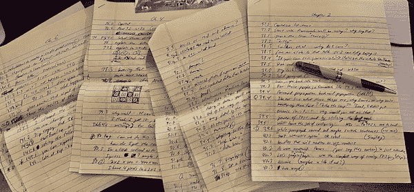

# 前言

> "如果你选择不做决定，你仍然已经做出了选择。"
> 
> —Geddy Lee（Rush）

# 让我们开始吧。

事后诸葛亮。"当比特币价格为 X 时，我应该买一些"或者"如果我在创业公司 Y 变得出名之前申请了就好了"。世界上充满了定义我们的时刻，无论是好是坏。时间永远不会倒流，但它会在我们前行时回响我们年轻时的选择教训。你很幸运有这本书和这个时刻来做决定。

由于人工智能的出现，软件行业的基础正在发生变化。这些变化最终将由那些抓住机会并塑造明天世界的人来决定。机器学习是一次探索新可能性的冒险，当它与 JavaScript 的广泛应用结合在一起时，限制就消失了。

就像我在谈论人工智能时告诉我的听众的那样，"你不是为了到这一步才创造软件而到这一步的"。所以让我们开始吧，看看我们的想象力会带我们去哪里。

# 为什么选择 TensorFlow.js？

TensorFlow 是市场上最受欢迎的机器学习框架之一。它得到了谷歌顶尖人才的支持，负责为世界上许多最有影响力的公司提供动力。TensorFlow.js 是 TensorFlow 不可战胜的 JavaScript 框架，比所有竞争对手都更好。简而言之，如果你想要一个 JavaScript 框架的强大功能，只有一个选择可以做到。

# 谁应该阅读这本书？

两个主要人群将享受并从这本书的内容中受益：

JavaScript 开发者

如果你熟悉 JavaScript，但以前从未接触过机器学习，这本书将成为你的向导。它倚重于框架，让你积极参与实用和令人兴奋的创作。通过构建各种项目，你将通过实践经验理解机器学习的基础知识。虽然我们不会回避数学或更深层次的概念，但我们也不会过度复杂化体验。如果你在 JavaScript 中构建网站并想获得新的超能力，请阅读这本书。

人工智能专家

如果你熟悉 TensorFlow 甚至是线性代数的基本原理，这本书将为你提供无数例子，展示如何将你的技能应用到 JavaScript 中。在这里，你将找到各种核心概念在 TensorFlow.js 框架中的展示。这将使你能够将你的广泛知识应用到可以高效存在于客户端浏览器或物联网设备（IoT）等边缘设备上的媒介中。阅读这本书，学习如何将你的创作带到无数设备上，提供丰富的互动体验。

这本书需要一定程度上对现代 JavaScript 的阅读和理解。

# 书籍概述

在概述这本书时，我意识到我必须做出选择。我可以创建一个旋风般的冒险，涉及到机器学习的各种应用，并用小而具体的例子涉及每一个，或者我可以选择一个单一的路径，讲述概念的不断增长的故事。在征求我的朋友和追随者的意见后，很明显后者是必要的。为了让这本书保持理智并控制在一千页以下，我选择删除任何 JavaScript 框架，专注于一个实用的旅程，探索人工智能的视觉方面。

每一章都以问题和一个特定的挑战结束，供你测试自己的决心。章节挑战部分经过精心设计，以巩固 TensorFlow.js 的教训。

## 章节

第一章和第二章从核心概念和一个具体示例开始。这种阴阳方法反映了本书的教学风格。每一章都建立在前几章提到的教训、词汇和功能之上。

第三章至第七章让您具备理解和实施现有 AI 工具和数据的视野。您将能够创建令人印象深刻的库，并在由大量数据科学家创建的项目中使用模型。

第八章至第十一章开始让您在 TensorFlow.js 中具有创造力。您将能够在 JavaScript 中训练模型，我坚信这是整本书中最有趣和令人兴奋的部分之一。

第十二章是最后的挑战。最后一章提供了一个顶点项目，让您可以利用本书所提供的一切，并用自己的能力表达出来。

## 要点

阅读本书后，无论您之前的经验如何，您都将能够在 TensorFlow.js 中找到、实现、调整和创建机器学习模型。您将能够识别网站中机器学习的应用，然后跟进并实现该应用。

# 本书中使用的约定

本书使用以下印刷约定：

*斜体*

指示新术语、URL、电子邮件地址、文件名和文件扩展名。

`常量宽度`

用于程序清单，以及在段落中引用程序元素，如变量或函数名称、数据库、数据类型、环境变量、语句和关键字。

**`常量宽度粗体`**

显示应由用户按字面输入的命令或其他文本。

*`常量宽度斜体`*

显示应替换为用户提供的值或由上下文确定的值的文本。

###### 提示

此元素表示提示或建议。

###### 注意

此元素表示一般说明。

###### 警告

此元素表示警告或注意。

# 使用代码示例

补充材料（代码示例、练习等）可在[*https://github.com/GantMan/learn-tfjs*](https://github.com/GantMan/learn-tfjs)下载。

如果您有技术问题或在使用代码示例时遇到问题，请发送电子邮件至*bookquestions@oreilly.com*。

本书旨在帮助您完成工作。一般来说，如果本书提供示例代码，您可以在程序和文档中使用它。除非您复制了代码的大部分内容，否则无需联系我们以获得许可。例如，编写一个使用本书中几个代码块的程序不需要许可。销售或分发 O'Reilly 图书中的示例需要许可。通过引用本书回答问题并引用示例代码不需要许可。将本书中大量示例代码合并到产品文档中需要许可。

我们感谢，但通常不要求署名。署名通常包括标题、作者、出版商和 ISBN。例如：“*学习 TensorFlow.js* by Gant Laborde (O'Reilly)。版权所有 2021 年 Gant Laborde，978-1-492-09079-3。”

如果您认为您使用的代码示例超出了合理使用范围或上述授权，请随时与我们联系*permissions@oreilly.com*。

# 致谢

我要感谢编辑、制作人员和 O'Reilly 的员工，在写这本书时与他们合作是一种快乐。

当然，感谢这本书前言作者杰出的劳伦斯·莫罗尼。你一直是我的偶像和启发，我从你那里学到了很多，我将继续在你的机器学习课程和成就的影响下茁壮成长。

这本书的技术审阅者是我有幸合作过的最友好和最彻底的人之一。

劳拉·乌兹卡特吉

你友善和鼓舞人心的反馈让人陶醉。你的直觉帮助使这本书感觉正确。

维舍什·拉维·施里马利

你理解了我所有的笑话。显然你是一个聪明友好的人，以这种方式，你推动我变得更好。我感激你所有的建议和智慧。

杰森·梅斯

我在你被选为这本书的技术编辑之前就认识你了，所以我把你看作是朋友，也是团队合作伙伴，一起让这本书变得更好。你的反馈是细致、聪明且不可替代的。真诚地感谢你。

阿克塞尔·达米安·西罗塔

我可以感受到你在每一点反馈中给予的高度个人支持。你花时间既聪明又善良。你的艺术是这本书的一份礼物。

李·沃里克

你继续审查和挑战我在所有作品中变得更好。这本书是我成就的最新例子，得益于你的洞察力。

米歇尔·克罗宁

我们每次会面我都很享受。你是一种持续的快乐！谢谢你做你自己。你让这本书变得轻松。你是如何做到的，我永远不会知道。

特别感谢弗兰克·冯·霍芬三世，他问了所有正确的问题，并递给我一页又一页手写的反馈笔记（图 P-1）。你的才华和诚实让我在传递强大和鼓舞人心的信息时保持引导。

###### 图 P-1。弗兰克提供了令人赞叹的支持和反馈

最后，感谢我爱的家人，他们尽可能避免打扰我，但也知道何时需要一个好的打断。爱丽西亚，我的爱，你比我更了解我自己。当我需要继续前进时，你给我惊喜的咖啡，当是时候停下来休息时，你给我一杯烈酒。每天，我最好的一面都是因为有你。
