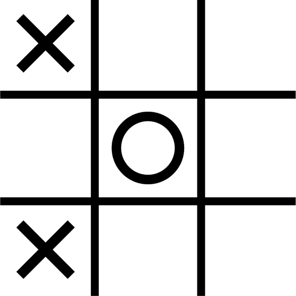
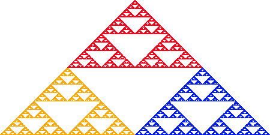

# 第三章：引入张量

> “哇！”
> 
> —基努·里维斯（《比尔和特德的冒险》）

我们已经多次提到*张量*这个词，它是 TensorFlow.js 中的主要词汇，所以是时候了解这些结构是什么了。这一关键章节将让您亲身体验管理和加速数据的基本概念，这是教机器学习的核心。

我们将：

+   解释张量的概念和术语

+   创建、读取和销毁张量

+   练习结构化数据的概念

+   跨越使用张量来构建有用的东西的鸿沟

如果您对张量还不熟悉，请花些时间阅读本章。熟悉数据的这一方面将有助于您全面了解机器学习。

# 为什么要使用张量？

我们生活在一个充满数据的世界中，我们都知道数据最终都是由 1 和 0 组成的。对于我们许多人来说，这似乎是一种魔法。你用手机拍照，就会生成一些复杂的二进制文件。然后，你上下滑动，我们的二进制文件在瞬间从 JPG 变成 PNG。成千上万个未知的字节在微秒内生成和销毁，文件调整大小、重新格式化，对于你这些时髦的孩子，还有滤镜。你不能再被宠坏了。当你开始实际接触、感受和处理数据时，你必须告别无知的幸福。

引用 1998 年电影《刀锋》中的一句台词：

> “你最好醒醒。你生活的世界只是一层糖衣。下面还有另一个世界。”

好吧，就像那样，但没有那么激烈。要训练一个人工智能，您需要确保您的数据是统一的，并且您需要理解和看到它。您不是在训练您的人工智能来统一解码 PNG 和 JPG 文件；您是在训练它对照片中实际内容的解码和模仿版本。

这意味着图像、音乐、统计数据以及您在 TensorFlow.js 模型中使用的任何其他内容都需要统一和优化的数据格式。理想情况下，我们的数据应该转换为数字容器，这些容器可以快速扩展，并直接与 GPU 或 Web Assembly 中的计算优化一起工作。您需要为我们的信息数据提供清晰简单的输入和输出。这些容器应该是无偏见的，可以容纳任何内容。欢迎来到张量的世界！

###### 提示

即使是最熟练的 TensorFlow.js 专家，理解张量的用途和属性也是一个持续的练习。虽然本章作为一个出色的介绍，但如果您在使用张量方面遇到困难，也不必感到懈怠。随着您的进步，本章可以作为一个参考。

# 你好，张量

张量是一种结构化类型的数据集合。将一切转换为数字对于一个框架来说并不新鲜，但意识到最终数据如何形成取决于您可能是一个新概念。

正如第一章中提到的，所有数据都需要转化为数字，以便机器能够理解。张量是首选的信息格式，它们甚至为非数值类型提供了小的抽象。它们就像来自物理世界的电信号传输到我们人工智能大脑中一样。虽然没有规定数据应该如何结构化，但您需要保持一致以保持信号有序，这样我们的大脑就可以一遍又一遍地看到相同的模式。人们通常将他们的数据组织成组，比如数组和多维数组。

但是张量是什么？从数学上定义，*张量*只是任意维度的一组结构化数值。最终，这将解决为计算准备好的数据的优化分组。这意味着，从数学角度来看，传统的 JavaScript 数组是一个张量，2D 数组是一个张量，512D 数组也是一个张量。TensorFlow.js 张量是这些数学结构的具体体现，它们保存着加速信号，将数据输入和输出到机器学习模型中。

如果您熟悉 JavaScript 中的多维数组，您应该对张量的语法感到非常熟悉。当您向每个数组添加一个新维度时，通常会说您正在增加张量的 *秩*。

## 创建张量

无论您如何导入 TensorFlow.js，本书中的代码都假定您已经将库整合到一个名为 `tf` 的变量中，该变量将用于在所有示例中代表 TensorFlow.js。

###### 注意

您可以阅读或从头开始编写代码，甚至在基于浏览器的 `/tfjs` 解决方案中运行这些基础示例，该解决方案可在书籍源代码中找到。为简单起见，我们将避免重复设置这些示例所需的 `<script>` 或 `import` 标签，并简单地编写共享代码。

要创建您的第一个张量，我们将保持简单，您将使用一个一维 JavaScript 数组构建它（示例 3-1）。数组的语法和结构被应用到张量中。

##### 示例 3-1。创建您的第一个张量

```js
// creating our first tensor
const dataArray = [8, 6, 7, 5, 3, 0, 9]
const first = tf.tensor(dataArray) // ①

// does the same thing
const first_again = tf.tensor1d(dataArray) // ②
```

①

`tf.tensor` 如果传入一个一维数组，将创建一个一维张量。如果传入一个二维数组，将创建一个二维张量。

②

`tf.tensor1d` 如果传入一个一维数组，将创建一个一维张量。如果传入一个二维数组，将报错。

这段代码在内存中创建了一个包含七个数字的一维张量数据结构。现在这七个数字已经准备好进行操作、加速操作，或者仅仅作为输入。不过，我相信您已经注意到我们提供了两种执行相同操作的方式。

第二种方法提供了额外的运行时检查级别，因为您已经定义了期望的维度。确定所需的维度在您希望确保正在处理的数据的维度数量时非常有用。存在用于验证高达六个维度的方法，例如 `tf.tensor6d`。

在本书中，我们将主要使用通用的 `tf.tensor`，但如果您发现自己深入进行复杂的项目，不要忘记您可以通过明确定义张量的期望维度来避免收到意外维度带来的困扰。

额外说明，虽然 示例 3-1 中的张量是一个自然数数组，但用于存储数字的默认数据类型是 Float32。浮点数（即带有小数点的数字，例如 2.71828）非常动态和令人印象深刻。它们通常可以处理您需要的大多数数字，并准备好接受之间的值。与 JavaScript 数组不同，张量的数据类型必须是同质的（全部相同类型）。这些类型只能是 `Float32`、`Int32`、布尔型、`complex64` 或字符串，不能混合使用。

如果您希望强制创建的张量具有特定类型，请随时利用 `tf.tensor` 函数的第三个参数，该参数明确定义了张量的类型结构。

```js
// creating a 'float32' tensor (the default)
const first = tf.tensor([1.1, 2.2, 3.3], null, 'float32') // ①

// an 'int32' tensor
const first_again = tf.tensor([1, 2, 3], null, 'int32') // ②

// inferred type for boolean
const the_truth = tf.tensor([true, false, false]) // ③

// Guess what this does
const guess = tf.tensor([true, false, false], null, 'int32') // ④

// What about this?
const guess_again = tf.tensor([1, 3.141592654, false]) // ⑤
```

①

这个张量被创建为 `Float32` 张量。在这种情况下，第三个参数是多余的。

②

生成的张量是 Int32 类型的，如果没有第三个参数，它将是一个 `Float32` 类型的。

③

生成的张量是一个布尔型张量。

④

生成的张量是一个 Int32 张量，布尔值被转换为 `0` 表示 false，`1` 表示 true。因此，变量 guess 包含数据 `[1, 0, 0]`。

⑤

您可能认为这个疯狂的数组会报错，但输入值中的每个值都会转换为相应的 `Float32`，生成的张量数据为 `[1, 3.1415927, 0]`。

您如何识别所创建的张量类型？就像任何 JavaScript 数组一样，张量配备了解释其属性的方法。有用的属性包括长度（`size`）、维度（`rank`）和数据类型（`dtype`）。

让我们应用我们所学到的知识：

```js
const second = tf.tensor1d([8, 6, 7, 5, 3, 0, 9]) // ①

// Whoopsie!
try {
  const nope = tf.tensor1d([[1],[2]]) // ②
} catch (e) {
  console.log("That's a negative Ghost Rider")
}

console.log("Rank:", second.rank) // ③
console.log("Size:", second.size) // ④
console.log("Data Type:", second.dtype) // ⑤
```

①

这将创建一个成功的张量。您应该知道数据类型，维度和大小。

②

由于您正在使用`tensor1d`创建一个秩为二的张量，这将导致`catch`运行并记录一条消息。

③

简单数组的秩为一，因此它将打印`1`。

④

大小是数组的长度，将打印`7`。

⑤

从数字数组的张量数据类型将打印`float32`。

祝贺您创建了您的第一批张量！可以肯定地说，掌握张量是驯服 TensorFlow.js 数据的核心。这些结构化的值桶是将数据输入和输出机器学习的基础。

## 数据练习的张量

假设您想制作一个 AI 来玩井字游戏（对于我在池塘对岸的朋友来说，这是零和叉）。与数据一样，现在是时候喝杯咖啡或茶，思考将真实世界数据转换为张量数据的正确方法了。

您可以存储游戏图像，教程字符串，或者只是游戏中的 X 和 O。图像和教程可能会令人印象深刻，但现在，让我们只考虑存储游戏板状态的想法。只有九个可能的方框可供玩耍，因此九个值的简单数组应该代表棋盘的任何给定状态。

值应该从左到右，从上到下读取吗？只要您保持一致，很少有关系。所有编码都是虚构的。但是，请记住张量解析为数字！这意味着虽然您可以存储字符串“X”和“O”，但它们最终还是会变成数字。让我们通过将它们映射到某种有意义的数字值来存储我们的 X 和 O。这是否意味着您只需将其中一个分配为 0，另一个分配为 42？我相信您可以找到一个适当反映游戏状态的策略。

让我们评估一个活动游戏的状态作为练习。花点时间回顾一下正在进行中的比赛的网格，如图 3-1 所示。如何将其转换为张量和数字？



###### 图 3-1。带有数据的游戏

也许这里显示的棋盘可以被读取并表示为一维张量。您可以从左到右，从上到下读取值。至于数字，让我们选择-1、0 和 1 来表示任何一个方格的三个可能值。表 3-1 显示了每个可能值的查找。

表 3-1。值到数字表

| 棋盘值 | 张量值 |
| --- | --- |
| X | 1 |
| O | -1 |
| 空 | 0 |

这将创建一个张量，如下所示：`[1, 0, 0, 0, -1, 0, 1, 0, 0]`。或者，它将创建一个 2D 张量，如下所示：`[[1, 0, 0],[0, -1, 0],[1, 0, 0]]`。

既然您有了一个目标，让我们编写一些代码将棋盘转换为张量。我们甚至将探索张量创建的附加参数。

```js
// This code creates a 1D `Float32` tensor
const a = tf.tensor([1, 0, 0, 0, -1, 0, 1, 0, 0])

// This code creates a 2D `Float32` tensor
const b = tf.tensor([[1, 0, 0],[0, -1, 0],[1, 0, 0]])

// This does the same as the above but with a 1D input
// array that is converted into a 2D `Float32` tensor
const c = tf.tensor([1, 0, 0, 0, -1, 0, 1, 0, 0], [3, 3]) // ①

// This code turns the 1D input array into a 2D Int32 tensor
const d = tf.tensor([1, 0, 0, 0, -1, 0, 1, 0, 0], [3, 3], 'int32') // ②
```

①

张量的第二个参数可以标识输入数据的期望形状。在这里，通过指定希望数据为 3 x 3 的秩二结构，将 1D 数组转换为 2D 张量。

②

张量的第三个参数标识您想要在推断的数据类型上使用的数据类型。由于您正在存储整数，因此可以指定类型`int32`。但是，默认的`float32`类型的范围非常大，可以轻松处理我们的数字。

当您创建用于表示数据的张量时，您可以决定如何格式化输入数据以及生成的张量结构应该是什么。随着您掌握机器学习的概念，您始终在磨练哪种数据效果最佳的直觉。

我们将在本书的后面回到这个井字棋问题。

# 巡回张量

随着本书的进展，我们将深入研究张量，因此现在是时候花点时间讨论它们为什么如此重要了。如果不了解我们正在利用的计算的规模，很难理解离开熟悉的 JavaScript 变量和引擎去使用老旧的数学的好处。

## 张量提供速度

现在你知道你可以制作张量并将数据表示为张量，那么进行这种转换有什么好处呢？我们已经提到，使用张量进行计算是由 TensorFlow.js 框架优化的。当你将 JavaScript 数字数组转换为张量时，你可以以极快的速度执行矩阵运算，但这到底意味着什么呢？

计算机在进行单个计算方面表现出色，并且进行大量计算有其好处。张量被设计用于大量并行计算。如果你曾经手动执行过矩阵和向量计算，你就会开始意识到加速计算的好处。

## 张量提供直接访问

即使没有机器学习，你仍然可以使用张量制作 3D 图形、内容推荐系统以及美丽的[迭代函数系统（IFSs）](https://oreil.ly/jjnvk)，比如图 3-2 中所示的谢尔宾斯基三角形。



###### 图 3-2. IFS 示例：谢尔宾斯基三角形

有很多关于图像、声音、3D 模型、视频等的库。它们都有一个共同点。尽管存在各种格式，但这些库会将数据以通用格式提供给你。张量就像那种原始、展开的数据格式，通过这种访问，你可以构建、读取或预测任何你想要的东西。

你甚至可以使用这些高级结构来修改图像数据（你将在第四章开始这样做）。在掌握了基础知识后，你将开始更多地享受张量函数。

## 张量批处理数据

在数据领域，你可能会发现自己在循环处理大量数据并担心文本编辑器崩溃。张量被优化用于高速批处理。本章末尾的小项目只有四个用户，以保持简单，但任何生产环境都需要准备好处理数十万的数据。

当你要求经过训练的模型在毫秒内执行类似人类操作的计算时，你将意识到张量的大部分好处。你将在第五章中早早看到这些例子。我们已经确定张量是令人印象深刻的结构，为 JavaScript 带来了大量加速和数学能力，因此你通常会在批处理中使用这种有益的结构。

# 内存中的张量

张量速度是有代价的。通常，当我们在 JavaScript 中完成一个变量时，当所有对该变量的引用完成时，内存会被干净地移除。这被称为*自动垃圾检测和收集*（AGDC），大多数 JavaScript 开发人员在不理解或关心这是如何工作的情况下就会发生。然而，你的张量并没有得到同样类型的自动关照。它们会在使用它们的变量被收集后继续存在。

## 释放张量

由于张量在垃圾回收中幸存，它们的行为与标准 JavaScript 不同，必须手动进行核算和释放。即使在 JavaScript 中一个变量被垃圾回收，与之关联的张量仍然会在内存中被孤立。你可以使用`tf.memory()`来访问当前计数和大小。这个函数返回一个报告活动张量的对象。

示例 3-2 中的代码展示了未收集的张量内存。

##### 示例 3-2. 内存中遗留的张量

```js
/* Check the number of tensors in memory
*  and the footprint size.
*  Both of these logs should be zero.
*/
console.log(tf.memory().numTensors)
console.log(tf.memory().numBytes)

// Now allocate a tensor
let speedy = tf.tensor([1,2,3])
// remove reference for JS
speedy = null

/* No matter how long we wait
*  this tensor is going to be there,
*  until you refresh the page/server.
*/
console.log(tf.memory().numTensors)
console.log(tf.memory().numBytes)
```

示例 3-2 中的代码将在日志中打印以下内容：

```js
0
0
1
12
```

由于您已经知道张量用于处理大量加速数据，将这些庞大的块留在内存中是一个问题。通过一个小循环，您可能会泄漏整个计算机可用的 RAM 和 GPU。

幸运的是，所有张量和模型都有一个 `.dispose()` 方法，可以从内存中清除张量。当您在张量上调用 `.dispose()` 时，`numTensors` 将减少您刚刚释放的张量数量。

这意味着您必须以两种方式管理张量，产生四种可能的状态。表 3-2 显示了当 JavaScript 变量和 TensorFlow.js 张量被创建和销毁时发生的所有组合。

表 3-2. 张量状态

|  | 张量存活 | 张量已销毁 |
| --- | --- | --- |
| **JavaScript 变量存活** | 此变量存活；您可以读取张量。 | 如果尝试使用此张量，将引发错误。 |
| **JavaScript 变量没有引用** | 这是一个内存泄漏。 | 这是一个正确销毁的张量。 |

简而言之，保持您的变量和张量处于活动状态以便访问它们，完成后处理张量并不要尝试访问它。

## 自动张量清理

幸运的是，张量确实有一个自动清理选项称为 `tidy()`。您可以使用 `tidy` 创建一个功能封装，它将清理所有未返回或标记为保留的张量。我们将在接下来的演示中帮助您理解 `tidy`，并在整本书中都会使用它。

您将很快习惯清理张量。确保学习以下代码，它将演示 `tidy()` 和 `keep()` 的使用：

```js
// Start at zero tensors
console.log('start', tf.memory().numTensors)

let keeper, chaser, seeker, beater
// Now we'll create tensors inside a tidy
tf.tidy(() => { // ①
  keeper = tf.tensor([1,2,3])
  chaser = tf.tensor([1,2,3])
  seeker = tf.tensor([1,2,3])
  beater = tf.tensor([1,2,3])
  // Now we're at four tensors in memory // ②
  console.log('inside tidy', tf.memory().numTensors)

  // protect a tensor
  tf.keep(keeper)
  // returned tensors survive
  return chaser
})

// Down to two // ③
console.log('after tidy', tf.memory().numTensors)

keeper.dispose() // ④
chaser.dispose() // ⑤
```

①

`tidy` 方法接受一个同步函数，并监视在此封闭中创建的张量。您不能在此处使用异步函数或承诺。如果您需要任何异步操作，您将不得不显式调用 `.dispose`。

②

所有四个张量都已有效加载到内存中。

③

即使您没有显式调用 `dispose`，`tidy` 已经正确销毁了创建的两个张量（那两个没有被保留或返回的张量）。如果您现在尝试访问它们，将会收到错误信息。

④

显式销毁您在 `tidy` 中使用 `tf.keep` 保存的张量。

⑤

显式销毁您从 `tidy` 返回的张量。

如果所有这些都说得通，您已经学会了从内存中神奇地创建和移除张量的实践。

# 张量回家

值得注意的是，您甚至可以在适当的情况下混合张量和 JavaScript。示例 3-3 中的代码创建了一个张量的普通 JavaScript 数组。

##### 示例 3-3. 混合 JS 和张量

```js
const tensorArray = []
for (let i = 0; i < 10; i++) {
  tensorArray.push(tf.tensor([i, i, i]))
}
```

示例 3-3 的结果是一个包含 10 个张量的数组，值从`[0,0,0]`到`[9,9,9]`。与创建一个用于保存这些值的 2D 张量不同，您可以通过在数组中检索普通的 JavaScript 索引来轻松访问特定的张量。因此，如果您想要 `[4,4,4]`，您可以使用 `tensorArray[4]` 获取它。然后，您可以使用简单的 `tf.dispose(tensorArray)` 从内存中销毁整个集合。

尘埃落定后，我们学会了如何创建和移除张量，但我们遗漏了一个关键部分，即张量将它们的数据返回给 JavaScript。张量非常适用于大型计算和速度，但 JavaScript 也有其优势。使用 JavaScript，您可以迭代，获取特定索引，或执行一系列 NPM 库计算，这在张量形式下要复杂得多。

在使用张量进行计算并获得好处之后，可以肯定地说，您始终需要将这些数据的结果返回到 JavaScript 中。

## 检索张量数据

如果您尝试将张量打印到控制台，您可以看到对象，但看不到底层数据值。要打印张量的数据，您可以调用张量的`.print()`方法，但这将直接将值发送到`console.log`而不是一个变量。查看张量的值对开发人员是有帮助的，但我们最终需要将这些值带入 JavaScript 变量中以便使用。

有两种方法可以检索张量。每种方法都有一个同步方法和一个异步方法。首先，如果您希望数据以相同的多维数组结构传递，您可以使用`.array()`获得异步结果，或者简单地使用`.arraySync()`获得同步值。其次，如果您希望保持极高精度的值，并将其展平为 1D 类型化数组，您可以使用同步的`dataSync()`和异步方法`data()`。

以下代码探讨了使用先前描述的方法转换、打印和解析张量并进行张量操作的过程：

```js
const snap = tf.tensor([1,2,3])
const crackle = tf.tensor([3.141592654])
const pop = tf.tensor([[1,2,3],[4,5,6]])

// this will show the structure but not the data
console.log(snap) // ①
// this will print the data but not the tensor structure
crackle.print() // ②

// Now let's go back to JavaScript
console.log('Welcome Back Array!', pop.arraySync()) // ③
console.log('Welcome Back Typed!', pop.dataSync()) // ④

// clean up our remaining tensors!
tf.dispose([snap, crackle, pop])
```

①

这个日志显示了保存张量及其相关属性的 JavaScript 结构。您可以看到形状，`isDisposedInternal`为 false，因为它尚未被处理，但这只是一个指向数据的指针，而不是包含数据。这个日志打印如下：

```js
{
  "kept": false,
  "isDisposedInternal": false,
  "shape": [
    3
  ],
  "dtype": "float32",
  "size": 3,
  "strides": [],
  "dataId": {},
  "id": 4,
  "rankType": "1",
  "scopeId": 4
}
```

②

在张量上调用`.print`会直接将内部值的实际打印输出到控制台。这个日志打印如下：

```js
Tensor
    [3.1415927]
```

③

`.arraySync`将 2D 张量的值作为 2D JavaScript 数组返回给我们。这个日志打印如下：

```js
Welcome Back Array!
[
  [
    1,
    2,
    3
  ],
  [
    4,
    5,
    6
  ]
]
```

④

`.dataSync`给我们提供了 2D 张量的值作为一个 1D [Float32Array](https://oreil.ly/ozV2H)对象，有效地将数据展平。记录一个类型化数组看起来像一个具有索引作为属性的对象。这个日志打印：

```js
Welcome Back Typed!
{
  "0": 1,
  "1": 2,
  "2": 3,
  "3": 4,
  "4": 5,
  "5": 6
}
```

现在您知道如何管理张量了。您可以将任何 JavaScript 数据带入 TensorFlow.js 张量进行操作，然后在完成后将其清晰地带出来。

# 张量操作

现在是时候充分利用移动所有这些数据的价值了。您现在知道如何将大量数据移动到张量中，但让我们享受这个过程带来的好处。机器学习模型是由数学驱动的。任何依赖于线性代数的数学过程都将受益于张量。您也将受益，因为您不必编写任何复杂的数学运算。

## 张量和数学

假设您必须将一个数组的内容乘以另一个数组。在 JavaScript 中，您必须编写一些迭代代码。此外，如果您熟悉矩阵乘法，您会知道该代码并不像您最初想的那样简单。任何级别的开发人员都不应该为张量操作解决线性代数。

还记得如何正确地相乘矩阵吗？我也忘了。

<math><mrow><mfenced close="]" open="["><mtable><mtr><mtd><mn>91</mn></mtd> <mtd><mn>82</mn></mtd> <mtd><mn>13</mn></mtd></mtr> <mtr><mtd><mn>15</mn></mtd> <mtd><mn>23</mn></mtd> <mtd><mn>62</mn></m></mtr> <mtr><mtd><mn>25</mn></mtd> <mtd><mn>66</mn></m></mtd> <mtd><mn>63</mn></m></mtr></mtable></mfenced> <mi>X</mi> <mfenced close="]" open="["><mtable><mtr><mtd><mn>1</mn></mtd> <mtd><mn>23</mn></mtd> <mtd><mn>83</mn></mtd></mtr> <mtr><mtd><mn>33</mn></mtd> <mtd><mn>12</m></mtd> <mtd><mn>5</mn></m></mtr> <mtr><mtd><mn>7</mn></mtd> <mtd><mn>23</mn></mtd> <mtd><mn>61</mn></m></mtr></mtable></mfenced> <mo>=</mo> <mo>?</mo></mrow></math>

将每个数字乘以相应位置并不像你们中的一些人可能想的那样简单；因为涉及到乘法和加法。计算左上角的值将是 91 x 1 + 82 x 33 + 13 x 7 = 2888。现在对新矩阵的每个索引重复八次这样的计算。计算这种简单乘法的 JavaScript 并不完全琐碎。

张量具有数学上的好处。我不必编写任何代码来执行以前的计算。虽然编写自定义代码不会很复杂，但会是非优化和冗余的。有用的、可扩展的数学运算是内置的。TensorFlow.js 使线性代数对于张量等结构变得易于访问和优化。我可以用以下代码快速得到以前矩阵的答案：

```js
  const mat1 = [
    [91, 82, 13],
    [15, 23, 62],
    [25, 66, 63]
  ]

  const mat2 = [
    [1, 23, 83],
    [33, 12, 5],
    [7, 23, 61]
  ]

  tf.matMul(mat1, mat2).print()
```

在第二章中，毒性检测器下载了用于每个分类计算的大量数字。在毫秒内处理这些大量计算的行为是张量背后的力量。虽然我们将继续扩展张量计算的好处，但 TensorFlow.js 的整个原因是这样一个大量计算的复杂性是框架的领域，而不是程序员的领域。

## 推荐张量

凭借你迄今学到的技能，你可以构建一个简单的示例，展示 TensorFlow.js 如何处理真实场景的计算。以下示例被选择为张量的力量的一个例证，它欢迎精英和数学避免者。

###### 注意

这一部分可能是你会接触到的最深的数学内容。如果你想深入了解支持机器学习的线性代数和微积分，我推荐一个由斯坦福大学提供、由吴恩达教授的免费[在线课程](https://oreil.ly/OhvzW)。

让我们用一些张量数据构建一些真实的东西。你将进行一系列简单的计算，以确定一些用户的偏好。这些系统通常被称为*推荐引擎*。你可能熟悉推荐引擎，因为它们建议你应该购买什么，下一部电影你应该看什么等等。这些算法是数字产品巨头如 YouTube、亚马逊和 Netflix 的核心。推荐引擎在任何销售任何东西的业务中都非常受欢迎，可能可以单独填写一本书。我们将实现一个简单的“基于内容”的推荐系统。发挥你的想象力，因为在生产系统中，这些张量要大得多。

在高层次上，你将做以下事情：

1.  要求用户对乐队进行评分，从`1`到`10`。

1.  任何未知的乐队得到`0`。

1.  乐队和音乐风格将是我们的“特色”。

1.  使用矩阵点积来确定每个用户喜欢的风格！

让我们开始创建一个推荐系统！这个小数据集将作为你所需的示例。正如你所注意到的，你在代码中混合了 JavaScript 数组和张量。将标签保留在 JavaScript 中，将计算推入张量是非常常见的。这不仅使张量专注于数字；还有国际化张量结果的好处。标签是这个操作中唯一依赖语言的部分。你会看到这个主题在本书中的几个示例和实际机器学习的真实世界中持续存在。

以下是数据：

```js
const users = ['Gant', 'Todd',  'Jed', 'Justin'] // ①
const bands = [ // ②
  'Nirvana',
  'Nine Inch Nails',
  'Backstreet Boys',
  'N Sync',
  'Night Club',
  'Apashe',
  'STP'
]
const features = [ // ③
  'Grunge',
  'Rock',
  'Industrial',
  'Boy Band',
  'Dance',
  'Techno'
]

// User votes // ④
const user_votes = tf.tensor([
  [10, 9, 1, 1, 8, 7, 8],
  [6, 8, 2, 2, 0, 10, 0],
  [0, 2, 10, 9, 3, 7, 0],
  [7, 4, 2, 3, 6, 5, 5]
])

// Music Styles 5
const band_feats = tf.tensor([
  [1, 1, 0, 0, 0, 0],
  [1, 0, 1, 0, 0, 0],
  [0, 0, 0, 1, 1, 0],
  [0, 0, 0, 1, 0, 0],
  [0, 0, 1, 0, 0, 1],
  [0, 0, 1, 0, 0, 1],
  [1, 1, 0, 0, 0, 0]
])
```

①

这四个名称标签只是简单地存储在一个普通的 JavaScript 数组中。

②

你已经要求我们的用户对七支乐队进行评分。

③

一些简单的音乐流派可以用来描述我们的七支乐队，同样存储在一个 JavaScript 数组中。

④

这是我们的第一个张量，一个二级描述，每个用户的投票从`1`到`10`，其中“我不认识这支乐队”为`0`。

⑤

这个张量也是一个二维张量，用于识别与每个给定乐队匹配的流派。每行索引代表了可以分类为真/假的流派的编码。

现在你已经拥有了张量中所需的所有数据。快速回顾一下，你可以看到信息的组织方式。通过阅读`user_votes`变量，你可以看到每个用户的投票。例如，你可以看到用户`0`，对应 Gant，给 Nirvana 评了`10`分，Apashe 评了`7`分，而 Jed 给了 Backstreet Boys`10`分。

`band_feats`变量将每个乐队映射到它们满足的流派。例如，索引`1`处的第二个乐队是 Nine Inch Nails，对 Grunge 和工业音乐风格有积极评分。为了简单起见，你使用了每种流派的二进制`1`和`0`，但在这里也可以使用一种标准化的数字比例。换句话说，`[1, 1, 0, 0, 0, 0]`代表了 Grunge 和 Rock 对于第 0 个乐队，也就是 Nirvana。

接下来，你将根据他们的投票计算每个用户最喜欢的流派：

```js
// User's favorite styles
const user_feats = tf.matMul(user_votes, band_feats)
// Print the answers
user_feats.print()
```

现在`user_feats`包含用户在每个乐队的特征上的点积。我们打印的结果将如下所示：

```js
Tensor
    [[27, 18, 24, 2 , 1 , 15],
     [14, 6 , 18, 4 , 2 , 10],
     [2 , 0 , 12, 20, 10, 10],
     [16, 12, 15, 5 , 2 , 11]]
```

这个张量显示了每个用户特征（在本例中是流派）的价值。用户`0`，对应 Gant，其最高价值在索引`0`处为`27`，这意味着他们在调查数据中最喜欢的流派是 Grunge。这些数据看起来相当不错。使用这个张量，你可以确定每个用户的喜好。

虽然数据以张量形式存在，但你可以使用一个叫做`topk`的方法来帮助我们识别每个用户的前*k*个值。要获取前*k*个张量或者仅仅通过识别它们的索引来确定前*k*个值的位置，你可以调用带有所需张量和大小的函数`topk`。在这个练习中，你将把*k*设置为完整特征集大小。

最后，让我们把这些数据带回 JavaScript。编写这段代码可以这样写：

```js
// Let's make them pretty
const top_user_features = tf.topk(user_feats, features.length)
// Back to JavaScript
const top_genres = top_user_features.indices.arraySync() // ①
// print the results
users.map((u, i) => {
  const rankedCategories = top_genres[i].map(v => features[v]) // ②
  console.log(u, rankedCategories)
})
```

①

你将索引张量返回到一个二维 JavaScript 数组以获取结果。

②

你正在将索引映射回音乐流派。

结果日志如下所示：

```js
Gant
[
  "Grunge",
  "Industrial",
  "Rock",
  "Techno",
  "Boy Band",
  "Dance"
]
Todd
[
  "Industrial",
  "Grunge",
  "Techno",
  "Rock",
  "Boy Band",
  "Dance"
]
Jed
[
  "Boy Band",
  "Industrial",
  "Dance",
  "Techno",
  "Grunge",
  "Rock"
]
Justin
[
  "Grunge",
  "Industrial",
  "Rock",
  "Techno",
  "Boy Band",
  "Dance"
]
```

在结果中，你可以看到 Todd 应该多听工业音乐，而 Jed 应该加强对男孩乐队的了解。两者都会对他们的推荐感到满意。

### 你刚刚做了什么？

你成功地将数据加载到张量中，这样做是有意义的，然后你对整个集合应用了数学计算，而不是对每个人进行迭代式的处理。一旦你得到了答案，你对整个集合进行了排序，并将数据带回 JavaScript 进行推荐！

### 你还能做更多吗？

你可以做很多事情。从这里开始，你甚至可以使用每个用户投票中的 0 来确定用户从未听过的乐队，并按照最喜欢的流派顺序推荐给他们！有一种非常酷的数学方法可以做到这一点，但这有点超出了我们第一个张量练习的范围。不过，恭喜你实现了在线销售中最受欢迎和流行的功能之一！

# 章节回顾

在本章中，你不仅仅是浅尝辄止地了解了张量。你深入了解了 TensorFlow.js 的基本结构，并掌握了根本。你正在掌握在 JavaScript 中应用机器学习的方法。张量是一个贯穿所有机器学习框架和基础知识的概念。

## 章节挑战：你有何特别之处？

现在你不再是一个张量新手，你可以像专业人士一样管理张量，让我们尝试一个小练习来巩固你的技能。在撰写本文时，JavaScript 没有内置的方法来清除数组中的重复项。虽然其他语言如 Ruby 已经有了`uniq`方法超过十年，JavaScript 开发人员要么手动编写解决方案，要么导入像 Lodash 这样的流行库。为了好玩，让我们使用 TensorFlow.js 来解决唯一值的问题。作为一个学到的教训的练习，思考一下这个问题：

> 给定这个美国电话号码数组，删除重复项。

```js
// Clean up the duplicates
const callMeMaybe = tf.tensor([8367677, 4209111, 4209111, 8675309, 8367677])
```

确保您的答案是一个 JavaScript 数组。如果您在这个练习中遇到困难，可以查阅[TensorFlow.js 在线文档](https://oreil.ly/9thOd)。搜索关键术语的文档将指引您正确方向。

您可以在附录 B 中找到这个挑战的答案。

## 复习问题

让我们回顾一下您在本章编写的代码中学到的教训。花点时间回答以下问题：

1.  我们为什么要使用张量？

1.  以下哪一个不是张量数据类型？

    1.  `Int32`

    1.  `Float32`

    1.  对象

    1.  布尔值

1.  六维张量的秩是多少？

1.  方法`dataSync`的返回数组的维数是多少？

1.  当您将一个三维张量传递给`tf.tensor1d`时会发生什么？

1.  在张量形状方面，`rank`和`size`之间有什么区别？

1.  张量`tf.tensor([1])`的数据类型是什么？

1.  张量的输入数组维度总是结果张量维度吗？

1.  如何确定内存中张量的数量？

1.  `tf.tidy`能处理异步函数吗？

1.  如何在`tf.tidy`内部创建的张量？

1.  我可以用`console.log`看到张量的值吗？

1.  `tf.topk`方法是做什么的？

1.  张量是为批量还是迭代计算进行优化的？

1.  推荐引擎是什么？

这些练习的解决方案可以在附录 A 中找到。
