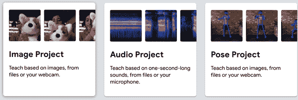
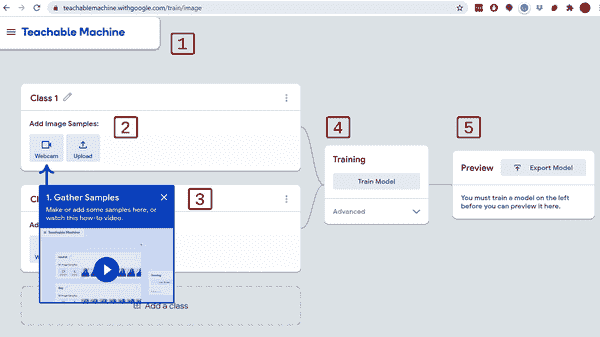
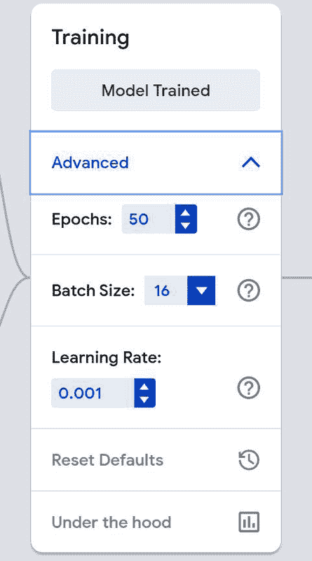
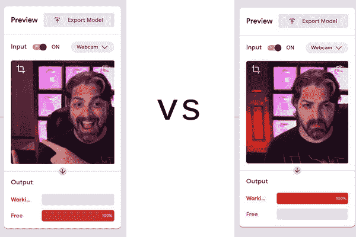
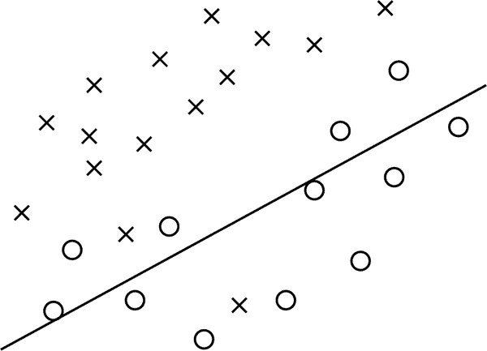
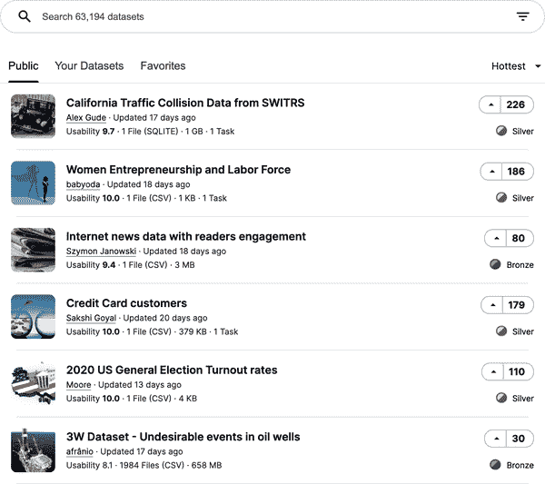

# 第七章：模型制作资源

> “通过寻找和失误我们学习。”
> 
> —约翰·沃尔夫冈·冯·歌德

你不仅限于来自 TensorFlow Hub 的模型。每天都有新的令人兴奋的模型被推文、发表和在社区中受到关注。这些模型和想法在谷歌认可的中心之外分享，有时甚至超出了 TensorFlow.js 的范围。

你开始超越园墙，与野外的模型和数据一起工作。这一章专门旨在为你提供制作现有模型的新方法，并让你面对收集和理解数据的挑战。

我们将：

+   介绍模型转换

+   介绍 Teachable Machine

+   训练一个计算机视觉模型

+   回顾训练数据的来源

+   涵盖一些关键的训练概念

当你完成这一章时，你将掌握几种制作模型的方法，并更好地理解使用数据制作机器学习解决方案的过程。

# 网络外模型购物

TensorFlow.js 并没有存在很长时间。因此，可用的模型数量有限，或者至少比其他框架少。这并不意味着你没有机会。你通常可以将在其他框架上训练过的模型转换为 TensorFlow.js。将现有模型转换为在新环境中工作的新模型是一种发现最近开发的资源并创建令人兴奋和现代的模型的好方法。

## 模型动物园

从机器学习世界中出现的一个有点可爱的术语是，有时将一组模型称为*动物园*。这些模型动物园是各种给定框架的任务的模型宝库，就像 TensorFlow Hub 一样。

模型动物园是一个绝佳的地方，可以找到独特的模型，这些模型可能会激发或满足你的需求。动物园经常链接到已发表的作品，解释了为模型架构和用于创建它们的数据所做的选择。

真正的好处来自于这样一个原则，一旦你学会了如何将这些模型转换为 TensorFlow.js，你可能会转换很多模型。

值得花一点时间回顾转换模型，这样你就能理解每个模型动物园或已发表模型对 TensorFlow.js 可能有多容易访问。

## 转换模型

许多用 Python 编程的 TensorFlow 模型以一种称为 Keras HDF5 的格式保存。HDF5 代表分层数据格式 v5，但通常被称为 Keras 或仅为 h5 文件。这种文件格式是一个带有 h5 扩展名的文件。Keras 文件格式中包含大量数据：

+   指定模型层的架构

+   一组权重值，类似于 bin 文件

+   模型的优化器和损失指标

这是更受欢迎的模型格式之一，更重要的是，即使它们是用 Python 训练的，它们也很容易转换为 TensorFlow.js。

###### 注意

有了能够转换 TensorFlow Keras 模型的知识，这意味着你找到的任何 TensorFlow 教程都可以作为一个教程来阅读，最终产品很可能可以在 TensorFlow.js 中使用。

### 运行转换命令

要从 h5 转换为 TensorFlow.js *model.json*和 bin 文件，你需要[`tfjs-converter`](https://oreil.ly/g46CE)。`tfjs-converter`还可以转换除 HDF5 之外的其他 TensorFlow 模型类型，因此它是处理任何 TensorFlow 到 TensorFlow.js 格式的绝佳工具。

转换器要求你的计算机已设置 Python。使用`pip`安装转换器。`pip`命令是 Python 的软件包安装程序，类似于 JavaScript 中的`npm`。如果你的计算机还没有准备好，有大量关于安装 Python 和`pip`的教程。安装了`pip`和 Python 后，你可以运行`tfjs-converter`。

这是转换器的安装命令：

```js
$ pip install tensorflowjs[wizard]
```

这将安装两个东西：一个无废话的转换器，您可以在自动化中使用（`tensorflowjs_converter`），以及一个通过键入**`tensorflowjs_wizard`**来运行的向导转换器。对于我们的目的，我建议使用向导界面进行转换，这样您可以利用新功能。

您可以通过在命令行中调用您新安装的`tensorflowjs_wizard`命令来运行向导，然后您将被提示类似于您在图 7-1 中看到的问题。


###### 图 7-1. 向导开始询问问题

这个向导将询问您的输入模型格式和所需的输出模型格式。根据您的答案，它还会询问一些问题。虽然向导将继续更新，但在选择所需设置时，这里有一些概念您应该牢记：

在图/层模型之间进行选择

请记住，图模型更快，但缺少一些内省和自定义属性，这些属性由层模型提供。

压缩（通过量化）

这将使您的模型从存储 32 位精度权重降至 16 位甚至 8 位精度权重值。使用更少的位数意味着您的模型在可能牺牲精度的情况下更小。量化后，您应该重新测试您的模型。大多数情况下，这种压缩对于客户端模型是值得的。

分片大小

建议的分片大小是为了优化您的模型以用于客户端浏览器缓存。除非您不在客户端浏览器中使用该模型，否则应保持推荐的大小。

###### 注意

量化仅影响磁盘上的模型大小。这为网站提供了显著的网络传输优势，但当模型加载到 RAM 中时，值将返回到当前 TensorFlow.js 中的 32 位变量。

功能将继续出现在向导界面中。如果出现了一个让您困惑的新功能，请记住，转换模型的文档将在[tfjs-converter README 源代码](https://oreil.ly/ldAPf)中提供。您的体验将类似于图 7-2。


###### 图 7-2. Windows 上的示例向导演练

生成的文件夹包含一个转换后的 TensorFlow.js 模型，准备就绪。h5 文件现在是*model.json*，而可缓存的 bin 文件以块形式存在。您可以在图 7-3 中看到转换结果。


###### 图 7-3. TensorFlow.js 模型结果

### 中间模型

如果您找到一个想要转换为 TensorFlow.js 的模型，现在可以检查是否有转换器将该模型移动到 Keras HDF5 格式，然后您就可以将其转换为 TensorFlow.js。值得注意的是，目前正在大力努力将模型转换为和从一个称为[开放神经网络交换（ONNX）](https://onnx.ai)的格式标准化。目前，微软和许多其他合作伙伴正在努力正确地转换模型进出 ONNX 格式，这将允许一个独立于框架的模型格式。

如果您找到了一个已发布的模型，想要在 TensorFlow.js 中使用，但它并不是在 TensorFlow 中训练的，不要放弃希望。您应该检查该模型类型是否有 ONNX 支持。

有些模型无法直接转换为 TensorFlow，因此您可能需要通过其他转换服务进行更多的迂回路线。除了 TensorFlow 之外，另一个受欢迎的框架库是 PyTorch，大多数机器学习爱好者使用。虽然 ONNX 每天都在变得更接近，但目前从 PyTorch 转换为 TensorFlow.js 的最佳方法是通过一系列工具进行转换，如图 7-4 所示。


###### 图 7-4. 转换模型

虽然对模型进行转换可能看起来是一项艰巨的工作，但将现有格式的模型转换为 TensorFlow.js 可以节省您几天甚至几周的时间，而不必重新创建和重新训练模型以适应已发布的数据。

# 您的第一个定制模型

如果只需下载现有模型，那么您就完成了。但我们不能等待谷歌发布能够分类我们所需内容的模型。您可能有一个需要 AI 对糕点有深入了解的想法。即使是谷歌的 Inception v3，如果您需要区分单个领域中各种物品之间的区别，可能也不够强大。

幸运的是，有一个技巧可以让我们利用现有模型的成果。一些模型可以稍作调整，以分类新事物！我们不需要重新训练整个模型，只需训练最后几层以寻找不同的特征。这使我们能够将像 Inception 或 MobileNet 这样的高级模型转变为识别我们想要的东西的模型。作为一个额外的好处，这种方法允许我们用极少量的数据重新训练模型。这被称为*迁移学习*，是在新类别上(重新)训练模型的最常见方法之一。

我们将在第十一章中介绍迁移学习的代码，但现在您也可以体验它。谷歌为人们尝试训练模型构建了一个完整的迁移学习 UI。

## 见见 Teachable Machine

首先，您将使用谷歌提供的一个名为 Teachable Machine 的工具。这个工具是由 TensorFlow.js 提供支持的简单网站，它允许您上传图像、上传音频，甚至使用网络摄像头进行训练、捕获数据和创建 TensorFlow.js 模型。这些模型直接在您的浏览器中进行训练，然后为您托管，以便您立即尝试您的代码。您得到的模型是 MobileNet、PoseNet 或其他实用模型的迁移学习版本，适合您的需求。由于它使用迁移学习，您根本不需要太多数据。

###### 警告

使用少量数据创建的模型似乎效果神奇，但存在显著的偏见。这意味着它们在训练时表现良好，但在背景、光线或位置变化时会出错。

训练模型的网站位于[*teachablemachine.withgoogle.com*](https://oreil.ly/CAy4H)。访问该网站后，您可以开始各种项目，如音频、图像，甚至身体姿势。虽然您可以并且应该尝试每一个，但本书将介绍图像项目选项。这是图 7-5 中显示的第一个选项。



###### 图 7-5\. 令人惊叹的 Teachable Machine 选项

在生成的页面上，您可以选择上传或使用网络摄像头收集每个类别的样本图像。

以下是一些您可以使用的想法，用于创建您的第一个分类器：

+   竖起大拇指还是竖起食指？

+   我在喝水吗？

+   这是哪只猫？

+   秘密手势解锁某物？

+   书还是香蕉！？

发挥您的创造力！您创建的任何模型都可以轻松展示给朋友和社交媒体，或者可以转变为一个帮助您的网页。例如，“我在喝水吗？”分类器可以连接到一个计时器，用于您的自我补水项目。只要您用一些样本训练模型，您可以想出各种有趣的项目。

就我个人而言，我将训练一个“爸爸在工作吗？”分类器。你们中的许多人可能在远程工作环境中遇到了家庭问题。如果我坐在桌子前，门是关着的，你会认为这会告诉别人我在工作，对吧？但如果门是开着的，“请进！”我会让 Teachable Machine 使用我的网络摄像头来分类我在工作时的样子和我不工作时的样子。

很酷的一点是，由于检测器将与网站绑定，“爸爸在工作吗？”可以扩展到做各种令人惊叹的事情。它可以发送短信，打开“不可用”灯，甚至告诉我的亚马逊 Echo 设备在被问及我是否在工作时回答“是”。只要我能制作一个快速可靠的 AI 图像分类器，就有无限的机会。

从头开始训练是一个可扩展的解决方案，但目前的任务是训练我在办公室的存在，为此我们将使用 Teachable Machine。

## 使用 Teachable Machine

让我们快速浏览一下使用 Teachable Machine 创建模型的用户界面。用户界面设置为网络图，信息从左到右自上而下填写。使用该网站很容易。跟随我们一起查看图 7-6。



###### 图 7-6。图像项目用户界面导览

1.  这个上部标题应该很小，在较大的监视器上不会妨碍。从标题中，您可以使用 Google Drive 来管理您的数据和结果，这样您就可以从上次离开的地方继续或与他人分享您的模型训练。

1.  顶部项目称为“类别 1”，表示您分类的一个类别。当然，您可以重命名它！我已将我的重命名为“工作”。在这个工作流卡中，您可以提供访问您的网络摄像头或上传符合此分类的图像文件。

1.  这个第二个工作流卡是任何第二类。在我的示例中，这可能是“免费”或“不工作”。在这里，您提供适合您的次要分类的数据。

1.  所有类别都进入训练工作流程。当您有要构建的示例时，您可以点击“训练模型”按钮并积极训练模型。当我们到达高级选项卡时，我们将深入了解这是如何进行的。

1.  预览部分立即显示模型实时分类的结果。

## 收集数据和训练

您可以按住网络摄像头的“按住录制”按钮，立即提供数百张示例数据的图像。在您的数据集中尽可能评估和包含变化是至关重要的。例如，如果您正在做“竖起大拇指还是竖下大拇指”，重要的是您在屏幕周围移动手部，捕捉不同角度，并将手放在面部、衬衫和任何其他复杂背景前。

对我来说，我调整了我的照明，因为有时我有一个摄像头主灯，有时我有背光。几秒钟内，我有了数百种不同条件的办公室门开着和关着的照片。我甚至拍了一些照片，我的门是关着的，但我没有坐在桌子前。

Teachable Machine 的一个很棒的地方是它可以在浏览器中快速给出结果，因此如果模型需要更多数据，您可以随时回来并立即添加更多数据。

一旦您有几百张照片，您可以点击“训练模型”按钮，您将看到一个“训练…”进度图（参见图 7-7）。


###### 图 7-7。Teachable Machine 活动训练

那么现在发生了什么？简而言之，Teachable Machine 正在使用您的图像执行迁移学习来重新训练 MobileNet 模型。您的数据中随机选择了 85%用于训练模型，另外 15%用于测试模型的性能。

点击高级选项卡查看此特定配置的详细信息。这将暴露出通常称为*超参数*的机器学习训练的一些内容（参见图 7-8）。这些超参数是可调整的模型训练参数。



###### 图 7-8。Teachable Machine 超参数

在这里，您将看到一些新术语。虽然现在学习这些术语并不是必要的，但您最终需要学习它们，因此我们将快速介绍它们。当您开始编写自己的模型时，每个概念都会出现在第八章中。

纪元

如果您来自编码背景，尤其是 JavaScript 编码，那么纪元是 1970 年 1 月 1 日。这 *不是* 在这个领域中纪元的含义。在机器学习训练中，一个纪元是对训练数据的完整遍历。在一个纪元结束时，AI 至少已经看到了所有的训练数据一次。五十个纪元意味着模型将不得不看到数据 50 次。一个很好的类比是单词卡。这个数字表示您与模型一起浏览整个单词卡组的次数，以便它学习。

批量大小

模型是以加载到内存中的批次进行训练的。有了几百张照片，您可以轻松处理所有图像，但最好按合理的增量进行批处理。

学习率

学习率影响机器学习模型在每次预测时应该如何调整。您可能会认为更高的学习率总是更好，但您会错。有时，特别是在微调迁移学习模型时，关键在于细节（如第十一章中所述）。

卡片底部还有一个带有“Under the hood”文本的按钮，点击它将为您提供有关训练模型进度的详细信息。随时查看报告。您将在以后实施这些指标。

## 验证模型

一旦 Teachable Machine 完成，它会立即将模型连接到您的网络摄像头，并显示模型的预测结果。这是一个很好的机会让您测试模型的结果。

对我来说，当我坐在办公桌前，门是关着的时候，模型预测我正在工作。万岁！我有一个可用的模型准备好了。两个类的表现都非常出色，如图 7-9 所示。



###### 图 7-9。模型运行

理想情况下，您的训练进展顺利。现在，检索训练好的模型是至关重要的，这样它就可以在您更广泛的项目中实施。如果您想与朋友分享您的模型，可以在预览中点击“导出模型”按钮，您将获得各种选项。新的模态窗口提供了在 TensorFlow、TensorFlow Lite 和 TensorFlow.js 中应用您的模型的路径。甚至还有一个选项可以免费托管您的训练模型，而不是自己下载和托管模型。我们提供了所有这些友好的选项以及一些巧妙的复制粘贴代码，让您快速实施这些模型。导出代码屏幕应该类似于图 7-10。


###### 图 7-10。Teachable Machine 导出选项

当您的模型被下载或发布时，您的数据不会随之发布。要保存数据集，您需要将项目保存在 Google Drive 中。如果您计划随着时间推进模型或扩大数据集，请记住这一点。识别和处理边缘情况是数据科学过程的一部分。

在 Teachable Machine 的复制粘贴部分提供的免费代码隐藏了名为[@teachablemachine/image](https://oreil.ly/kY7YJ)的 NPM 包中的网络摄像头和张量的细节。虽然这对于不了解网络摄像头和张量的人来说很好，但对于最终产品来说却毫无用处。您从第六章中获得的高级 UI 技能使您的创造潜力远远超过了复制粘贴代码选项。

###### 提示

每个 Teachable Machine 模型都是不同的；您刚刚训练的视觉模型是建立在我们的老朋友 MobileNet 分类器之上的。因此，当您实施模型时，将输入调整为 224 x 224。

你刚刚训练了你的第一个模型。然而，我们尽可能地省略了很多步骤。使用用户界面训练模型将成为机器学习的一个重要部分，它可以帮助每个新手获得一个出色的开始。但像你这样的张量巫师可以训练一个更加动态的模型。你显然希望通过编写一些 JavaScript 命令你的机器。所以让我们开始通过编写一些 JavaScript 来训练一个模型。

# 机器学习陷阱

在编码时，任何开发人员可能会面临各种问题。尽管编程语言各不相同，但有一组核心的陷阱会延续到每个基础设施。机器学习也不例外。虽然可能会有特定于任何选择的类型和问题的问题，但早期识别这些问题很重要，这样你就可以发现数据驱动算法中最常见的一些复杂问题。

我们现在将快速阐述一些概念，但每个概念在本书的其余部分涉及到工作时都会重新讨论：

+   少量数据

+   糟糕的数据

+   数据偏差

+   过拟合

+   欠拟合

让我们回顾一下这些，这样我们就可以在接下来的章节中留意它们。

## 少量数据

有人给我提出了一个关于机器学习解决方案的绝妙想法，他们有三个标记样本。这个世界上很少有东西能从这么小的训练集中受益。当数据是你训练算法的方式时，你需要相当数量的数据。有多少？没有一个适用于每个问题的答案，但你应该倾向于更多的数据而不是更少。

## 糟糕的数据

有些人的生活干净、有序，但在现实世界中，数据不会无意中变得如此。如果你的数据缺失、标记错误，或者完全不合理，它可能会在训练中造成问题。很多时候，数据需要被清理，异常值需要被移除。准备好数据只是一个重要且关键的步骤。

## 数据偏差

你的数据可能被清晰地标记，每个细节都在正确的位置，但它可能缺少使其在实际情况下工作的信息。在某些情况下，这可能会引起严重的道德问题，而在其他情况下，这可能会导致你的模型在各种条件下表现不佳。例如，我之前训练的“爸爸在工作吗？”模型（图 7-9）可能不适用于其他人的办公室配置，因为数据只针对我的办公室。

## 过拟合

有时模型被训练到只在训练集数据上表现良好。在某些情况下，一个更直接但得分较低的准确性可能更好地适应新数据点。

看看这个分离图在图 7-11 中是如何过拟合数据的？虽然它完美地解决了给定的问题，但当添加新的从未见过的点时，它可能会变得更慢并失败。


###### 图 7-11\. 过拟合数据

有时你会听到过拟合被称为*高方差*，这意味着你在训练数据中的波动会导致模型在新数据上随机失败。

如果你的目标是让你的模型在新的、以前从未见过的数据上工作，过拟合可能是一个真正的问题。幸运的是，我们有测试和验证集来帮助。

## 欠拟合

如果你的模型没有被充分训练，或者它的结构无法适应数据，解决方案可能会失败，甚至完全偏离任何外推或额外数据。这是过拟合的反面，但在同样的意义上，它会产生一个糟糕的模型。

看看图 7-12 中的分离图是如何欠拟合数据的？



###### 图 7-12\. 欠拟合数据

当模型欠拟合时，就说模型具有*高偏差*，因为对数据的基本假设实际上是错误的。虽然类似，但不要将这个术语与之前讨论的*数据偏差*混淆。

# 数据集购物

现在你明白为什么拥有多样化的数据是至关重要的。虽然 Teachable Machine 的“爸爸在工作吗？”模型对我很有用，但远远不够多样化，无法用于其他办公室。令人高兴的是，机器学习社区最令人印象深刻的一点是大家都愿意分享他们辛苦获得的数据集。

在收集数据之前，研究一下其他人是否已经发布了可用的标记数据是很有帮助的。了解专家机器学习数据集是如何组织的也是有益的。

数据集就像 JavaScript 库：一开始可能看起来很独特，但过一段时间后，你会发现同样的数据集一再被引用。世界各地的大学都有出色的[有用数据集目录](https://oreil.ly/lbvkW)，甚至[谷歌也有一个类似 TensorFlow Hub 的数据集托管服务](https://oreil.ly/BnddO)，但没有一个能与 Kaggle 这个数据集居所相提并论。

[Kaggle](https://www.kaggle.com)拥有大量各种类型的数据集。从鸟鸣到 IMDb 评论，你可以使用 Kaggle 提供的各种数据训练各种模型。图 7-13 展示了一个友好且可搜索的数据集界面。



###### 图 7-13。Kaggle 提供了超过 60,000 个免费数据集

无论你是在研究用于训练模型的数据，还是在寻找使用机器学习制作新奇事物的想法，Kaggle 都能满足你的需求。

###### 注意

Kaggle 不仅提供数据集，还是一个分享、竞争和赢取奖品的社区。

如果你对 Kaggle 的课外活动不感兴趣，你通常可以使用谷歌的数据集搜索网站，很可能会找到你的 Kaggle 数据集和其他数据集：[*https://datasetsearch.research.google.com*](https://datasetsearch.research.google.com)。

## 流行数据集

虽然数据集的列表每天都在增长，但很长一段时间内可供选择的数据集并不多。已发布的数据集很少，因此一些数据集成为训练示例的基础。其他数据集作为其类别的第一个发布，并不知不觉地成为某种机器学习的品牌大使。就像秘密口令一样，这些流行数据集在演讲和文档中被随意使用。了解一些最常见和著名的数据集是很有益的：

[ImageNet](https://oreil.ly/Et6TH)

ImageNet 被用来训练一些最流行的计算机视觉模型。这个大型图像数据集一直被学术研究人员用来评估模型。

[MNIST](https://oreil.ly/Rb9Ru)

这是一个 28 x 28 灰度手写数字的集合，用于训练一个读取数字的模型。它通常是计算机视觉模型的“Hello World”。其名称来源于其来源，即来自国家标准与技术研究所的修改数据集。

[Iris](https://oreil.ly/EWvgs)

1936 年，罗纳德·费舍尔发现可以通过三个物理测量来识别鸢尾花的属种。这个数据集是非视觉分类的经典。

[波士顿房价](https://oreil.ly/RHD65)

这个数据集包含了中位数房屋价值及其相关属性，用于解决最佳拟合线（线性回归）模型。

[*泰坦尼克号*](https://oreil.ly/RtzuS)

这是“不沉”RMS *泰坦尼克号*于 1912 年 4 月 15 日沉没的乘客日志。我们将使用这个数据集在第九章中创建一个模型。

[葡萄酒质量](https://oreil.ly/K1ekn)

对于酿酒师和手工艺者来说，利用机器学习来识别什么使一种美味饮料是令人振奋的。这个数据集包含每种葡萄酒的物理化学性质及其评分。

[Pima 印第安人糖尿病患者](https://oreil.ly/AZh6O)

有很多健康护理数据集可用。这是一个基于患者病史的小型且易接近的糖尿病数据集。

[CIFAR](https://oreil.ly/JgIsD)

虽然 ImageNet 是一个金标准，但有点难以接近和复杂。CIFAR 数据集是一个低分辨率且友好的图像集合，用于分类。

[亚马逊评论](https://oreil.ly/cM80L)

这是来自 Amazon.com 多年来的产品评论集合。该数据集已被用来训练文本的情感倾向，因为你有用户的评论和他们的评分。与此相近的是 IMDb 评论数据集。

[COCO](https://oreil.ly/qSn9z)

这是一个大规模的目标检测、分割和字幕数据集。

这 10 个是标准参考数据集的很好起点。机器学习爱好者会在推特、演讲和博客文章中随意引用这些数据集。

# 章节复习

当然，你没有金星火山的各种照片。你怎么可能有呢？这并不意味着你不能拿一个为此训练过的模型，移植到你的新浏览器游戏中。只需从 Kaggle 下载数据集并上传图片到 Teachable Machine，创建一个体面的“火山还是非火山”天文模型。就像 TensorFlow.js 将你带入机器学习轨道一样，这些现有模型和数据集为你的应用程序掌握打下了基础。

像 Web 开发一样，机器学习包含各种专业化。机器学习依赖于数据、模型、训练和张量等多种技能。

## 章节挑战：再见 MNIST

现在轮到你将一个模型从 Keras HDF5 转换到 TensorFlow.js 了。在与本书相关的代码中，你会找到一个*mnist.h5*文件，其中包含了用于识别手写数字的模型。

1.  创建一个图形 TensorFlow.js 模型。

1.  用`uint8`量化模型使其变小。

1.  使用通配符访问模型中的所有权重。

1.  将分片大小设置为 12,000。

1.  保存到一个文件夹*./minist*（*min*因为它被量化了，明白吗！）。

回答以下问题：

1.  生成了多少个二进制文件和组？

1.  最终输出大小是多少？

1.  如果你使用默认的分片大小，会生成多少个二进制文件？

您可以在附录 B 中找到这个挑战的答案。

## 复习问题

让我们回顾一下你在本章编写的代码中学到的教训。花点时间回答以下问题：

1.  如果你为特定任务提供了大量数据，训练之前你会有哪些担忧和想法？

1.  如果一个模型经过训练，准确率达到了 99%，但是当你在现场使用它时，表现很糟糕，你会说发生了什么？

1.  谷歌创建的帮助您训练自己模型的网站的名称是什么？

1.  使用谷歌网站的缺点是什么？

1.  用来训练 MobileNet 和其他流行的机器学习模型的图像数据集是什么？

这些练习的解决方案可以在附录 A 中找到。
