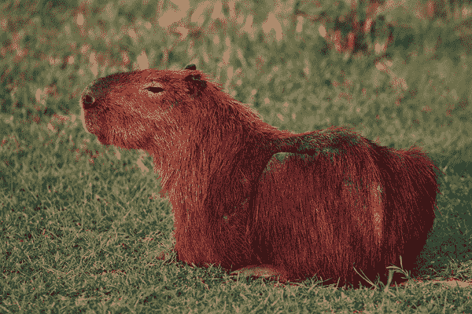
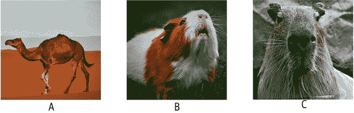
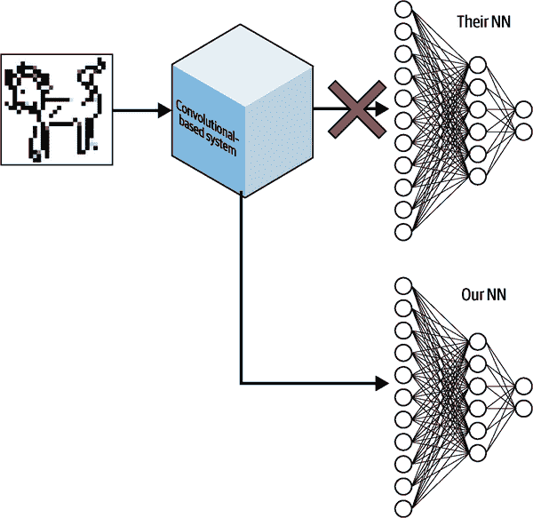
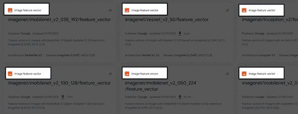
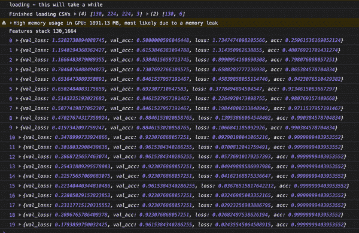
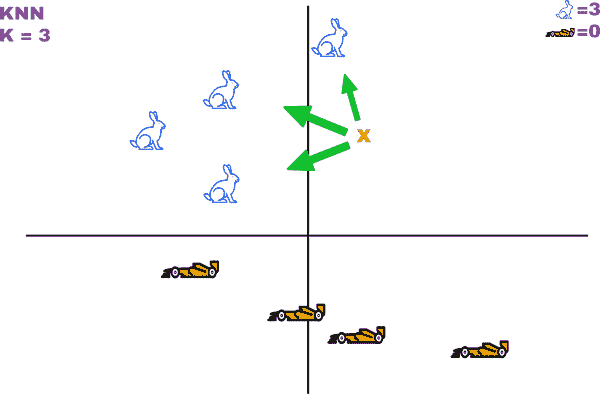
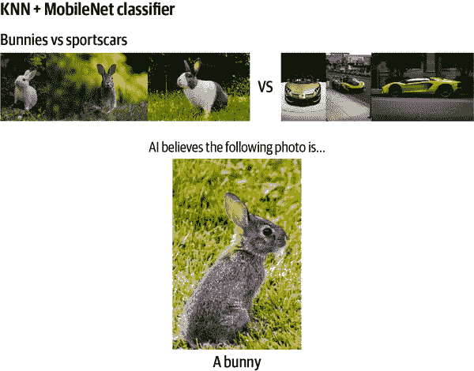

# 第十一章：迁移学习

> “向他人的错误学习。你活不到足够长的时间来犯所有的错误。”
> 
> —埃莉诺·罗斯福

拥有大量数据、经过实战检验的模型结构和处理能力可能是具有挑战性的。能不能简单点？在第七章中，您可以使用 Teachable Machine 将训练好的模型的特质转移到新模型中，这是非常有用的。事实上，这是机器学习世界中的一个常见技巧。虽然 Teachable Machine 隐藏了具体细节，只提供了一个模型，但您可以理解这个技巧的原理，并将其应用于各种酷炫的任务。在本章中，我们将揭示这个过程背后的魔法。虽然我们将简单地以 MobileNet 为例，但这可以应用于各种模型。

迁移学习是指将训练好的模型重新用于第二个相关任务。

使用迁移学习为您的机器学习解决方案带来一些可重复的好处。大多数项目出于以下原因利用一定程度的迁移学习：

+   重复使用经过实战检验的模型结构

+   更快地获得解决方案

+   通过较少的数据获得解决方案

在本章中，您将学习几种迁移学习策略。您将专注于 MobileNet 作为一个基本示例，可以以各种方式重复使用来识别各种新类别。

我们将：

+   回顾迁移学习的工作原理

+   看看如何重复使用特征向量

+   将模型切割成层并重构新模型

+   了解 KNN 和延迟分类

完成本章后，您将能够将长时间训练并具有大量数据的模型应用于您自己的需求，即使只有较小的数据集。

# 迁移学习是如何工作的？

一个经过不同数据训练的模型如何突然对您的*新*数据起作用？听起来像奇迹，但这在人类中每天都发生。

您花了多年时间识别动物，可能看过数百只骆驼、天竺鼠和海狸的卡通、动物园和广告。现在我将向您展示一种您可能很少见到甚至从未见过的动物。图 11-1 中的动物被称为水豚（*Hydrochoerus hydrochaeris*）。



###### 图 11-1。水豚

对于你们中的一些人，这可能是第一次（或者是少数几次）看到水豚的照片。现在，看看图 11-2 中的阵容。你能找到水豚吗？



###### 图 11-2。哪一个是水豚？

一张单独的照片的训练集足以让您做出选择，因为您一生中一直在区分动物。即使是新的颜色、角度和照片尺寸，您的大脑可能也能绝对确定地检测到动物 C 是另一只水豚。您多年的经验学习到的特征帮助您做出了明智的决定。同样地，具有丰富经验的强大模型可以被教导从少量新数据中学习新事物。

## 迁移学习神经网络

让我们暂时回到 MobileNet。MobileNet 模型经过训练，可以识别区分一千种物品之间的特征。这意味着有卷积来检测毛发、金属、圆形物体、耳朵以及各种关键的差异特征。所有这些特征在被压缩和简化之前都被吸收到一个神经网络中，各种特征的组合形成了分类。

MobileNet 模型可以识别不同品种的狗，甚至可以区分马耳他犬和西藏犬。如果您要制作一个[“狗还是猫”](https://oreil.ly/i9Xxm)分类器，那么在您更简单的模型中，大多数这些高级特征是可以重复使用的。

先前学习的卷积滤波器在识别全新分类的关键特征方面非常有用，就像我们在图 11-2 中的水豚示例一样。关键是将模型的特征识别部分提取出来，并将自己的神经网络应用于卷积输出，如图 11-3 所示。



###### 图 11-3。CNN 迁移学习

那么如何分离和重新组合先前训练模型的这些部分呢？您有很多选择。再次，我们将学习更多关于图和层模型的知识。

# 简单的 MobileNet 迁移学习

幸运的是，[TensorFlow Hub](https://tfhub.dev)已经有一个与任何神经网络断开连接的 MobileNet 模型。它为您提供了一半的模型用于迁移学习。一半的模型意味着它还没有被绑定到最终的 softmax 层来进行分类。这使我们可以让 MobileNet 推导出图像的特征，然后为我们提供张量，然后我们可以将这些张量传递给我们自己训练的网络进行分类。

TFHub 将这些模型称为*图像特征向量*模型。[您可以缩小搜索范围，只显示这些模型](https://oreil.ly/BkokR)，或者通过查看问题域标签来识别它们，如图 11-4 所示。



###### 图 11-4。图像特征向量的问题域标签

您可能会注意到 MobileNet 的小变化，并想知道差异是什么。一旦您了解了一些诡计术语，每个模型描述都会变得非常可读。

例如，我们将使用示例 11-1。

##### 示例 11-1。图像特征向量模型之一

```js
imagenet/mobilenet_v2_130_224/feature_vector
```

imagenet

这个模型是在 ImageNet 数据集上训练的。

mobilenet_v2

该模型的架构是 MobileNet v2。

130

该模型的深度乘数为 1.30。这会产生更多的特征。如果您想加快速度，可以选择“05”，这将减少一半以下的特征输出并提高速度。这是一个微调选项，当您准备好修改速度与深度时可以使用。

224

该模型的预期输入尺寸为 224 x 224 像素的图像。

feature_vector

我们已经从标签中了解到，但这个模型输出的张量是为了作为图像特征的第二个模型来解释。

现在我们有一个经过训练的模型，可以识别图像中的特征，我们将通过 MobileNet 图像特征向量模型运行我们的训练数据，然后在输出上训练一个模型。换句话说，训练图像将变成一个特征向量，我们将训练一个模型来解释该特征向量。

这种策略的好处是实现起来很简单。主要缺点是当您准备使用新训练的模型时，您将不得不加载两个模型（一个用于生成特征，一个用于解释）。创造性地，可能有一些情况下“特征化”图像然后通过多个神经网络运行可能非常有用。无论如何，让我们看看它的实际效果。

## TensorFlow Hub 检查，对手！

我们将使用 MobileNet 进行迁移学习，以识别像图 11-5 中所示的国际象棋棋子。


###### 图 11-5。简单的国际象棋棋子分类器

您只会有每个国际象棋棋子的几张图像。通常这是不够的，但通过迁移学习的魔力，您将得到一个高效的模型。

### 加载国际象棋图像

为了这个练习，我已经编译了一个包含 150 张图像的集合，并将它们加载到 CSV 文件中以便快速使用。在大多数情况下，我不建议这样做，因为这对于处理和磁盘空间是低效的，但它可以作为一种简单的向量，用于一些快速的浏览器训练。现在加载这些图像的代码是微不足道的。

###### 注意

你可以访问象棋图像和将它们转换为 CSV 文件的代码在[*chapter11/extra/node-make-csvs*](https://oreil.ly/INWAN)文件夹中。

文件 *chess_labels.csv* 和 *chess_images.csv* 可以在与本课程相关的[*chess_data.zip*](https://oreil.ly/bcFop)文件中找到。解压这个文件并使用 Danfo.js 加载内容。

许多浏览器可能会在同时读取所有 150 个图像时出现问题，所以我限制了演示只处理 130 个图像。与并发数据限制作斗争是机器学习中常见的问题。

###### 注意

一旦图像被提取特征，它所占用的空间就会少得多。随意尝试批量创建特征，但这超出了本章的范围。

图像已经是 224 x 224，所以你可以用以下代码加载它们：

```js
console.log("Loading huge CSV - this will take a while");
const numImages = 130; // between 1 and 150 // Get Y values const labels = await dfd.read_csv("chess_labels.csv", numImages); // ①
const Y = labels.tensor; // ②
// Get X values (Chess images) const chessImages = await dfd.read_csv("chess_images.csv", numImages);
const chessTensor = chessImages.tensor.reshape([
  labels.shape[0], 224, 224, 3, // ③
]);
console.log("Finished loading CSVs", chessTensor.shape, Y.shape);
```

①

`read_csv`的第二个参数限制了行数到指定的数字。

②

然后将 DataFrames 转换为张量。

③

图像被展平以变成序列化，但现在被重新塑造成一个四维的 RGB 图像批次。

经过一段时间，这段代码会打印出 130 个准备好的图像和编码的 X 和 Y 形状：

```js
Finished loading CSVs (4) [130, 224, 224, 3] (2) [130, 6]
```

如果你的计算机无法处理 130 个图像，你可以降低`numImages`变量，仍然可以继续。然而，CSV 文件的加载时间始终是恒定的，因为整个文件必须被处理。

###### 提示

象棋棋子这样的图像非常适合进行图像增强，因为扭曲棋子永远不会导致一个棋子被误认为是另一个。如果你需要更多的图像，你可以镜像整个集合，有效地将你的数据翻倍。[存在整个库来镜像、倾斜和扭曲图像](https://oreil.ly/tCMTN)，这样你就可以创建更多数据。

### 加载特征模型

你可以像加载 TensorFlow Hub 中的任何模型一样加载特征模型。你可以通过模型进行预测，结果将是`numImages`个预测。代码看起来像示例 11-2。

##### 示例 11-2\. 加载和使用特征向量模型

```js
// Load feature model
const tfhubURL =
  "https://oreil.ly/P2t2k";
const featureModel = await tf.loadGraphModel(tfhubURL, {
  fromTFHub: true,
});
const featureX = featureModel.predict(chessTensor);
// Push data through feature detection
console.log(`Features stack ${featureX.shape}`);
```

控制台日志的输出是

```js
Features stack 130,1664
```

每个 130 个图像已经变成了一组 1,664 个浮点值，这些值对图像的特征敏感。如果你改变模型以使用不同的深度，特征的数量也会改变。1,664 这个数字是 MobileNet 1.30 深度版本独有的。

如前所述，1,664 个`Float32`特征集比每个图像的`224*224*3 = 150,528`个`Float32`输入要小得多。这将加快训练速度，并对计算机内存更友好。

### 创建你自己的神经网络

现在你有了一组特征，你可以创建一个新的完全未经训练的模型，将这 1,664 个特征与你的标签相匹配。

##### 示例 11-3\. 一个包含 64 层的小模型，最后一层是 6

```js
// Create NN const transferModel = tf.sequential({
  layers: [                              // ①
    tf.layers.dense({
      inputShape: [featureX.shape[1]],   // ②
      units: 64,
      activation: "relu",
    }),
    tf.layers.dense({ units: 6, activation: "softmax" }),
  ],
});
```

①

这个 Layers 模型使用了一个与你习惯的略有不同的语法。而不是调用`.add`，所有的层都被呈现在初始配置的数组中。这种语法对于像这样的小模型很好。

②

模型的`inputShape`被动态设置为`1,664`，以防你想通过更新模型 URL 来改变模型的深度乘数。

### 训练结果

在训练代码中没有什么新的。模型基于特征输出进行训练。由于特征输出与原始图像张量相比非常小，训练速度非常快。

```js
transferModel.compile({
  optimizer: "adam",
  loss: "categoricalCrossentropy",
  metrics: ["accuracy"],
});

await transferModel.fit(featureX, Y, {
  validationSplit: 0.2,
  epochs: 20,
  callbacks: { onEpochEnd: console.log },
});
```

几个周期后，模型的准确率就会非常出色。查看图 11-6。



###### 图 11-6\. 从 50%到 96%的验证准确率在 20 个周期内

在 TensorFlow Hub 上使用现有模型进行迁移学习可以减轻架构方面的困扰，并为你带来高准确性。但这并不是你实现迁移学习的唯一方式。

# 利用 Layers 模型进行迁移学习

之前的方法存在一些明显和不那么明显的限制。首先，特征模型无法进行训练。你所有的训练都是在一个消耗图模型特征的新模型上进行的，但卷积层和大小是固定的。你可以使用卷积网络模型的小变体，但无法更新或微调它。

之前来自 TensorFlow Hub 的模型是一个图模型。图模型被优化用于速度，并且无法修改或训练。另一方面，Layers 模型则适用于修改，因此你可以将它们重新连接以进行迁移学习。

此外，在之前的示例中，每次需要对图像进行分类时，实际上都在处理两个模型。你需要加载两个 JSON 模型，并将图像通过特征模型和新模型以对图像进行分类。这并不是世界末日，但通过组合 Layers 模型可以实现单一模型。

让我们再次解决同样的国际象棋问题，但这次使用 Layers 版本的 MobileNet，这样我们可以检查差异。

## 在 MobileNet 上修剪层

在这个练习中，你将使用一个设置为 Layers 模型的 MobileNet v1.0 版本。这是 Teachable Machine 使用的模型，虽然对于小型探索性项目来说已经足够了，但你会注意到它不如深度为 1.30 的 MobileNet v2 准确。你已经熟悉了使用向导转换模型的方法，就像你在第七章中学到的那样，所以在需要时你可以创建一个更大、更新的 Layers 模型。准确性是一个重要的指标，但在寻找迁移模型时，它远非唯一的评估指标。

MobileNet 有大量的层，其中一些是你以前从未见过的。让我们来看一下。加载与本章相关联的 MobileNet 模型，并使用`model.summary()`来查看层的摘要。这会打印出一个庞大的层列表。不要感到不知所措。当你从底部向上阅读时，最后两个带有激活的卷积层被称为`conv_preds`和`conv_pw_13_relu`：

```js
...

conv_pw_13 (Conv2D)          [null,7,7,256]            65536
_________________________________________________________________
conv_pw_13_bn (BatchNormaliz [null,7,7,256]            1024
_________________________________________________________________
conv_pw_13_relu (Activation) [null,7,7,256]            0
_________________________________________________________________
global_average_pooling2d_1 ( [null,256]                0
_________________________________________________________________
 reshape_1 (Reshape)          [null,1,1,256]            0
_________________________________________________________________
dropout (Dropout)            [null,1,1,256]            0
_________________________________________________________________
conv_preds (Conv2D)          [null,1,1,1000]           257000
_________________________________________________________________
act_softmax (Activation)     [null,1,1,1000]           0
_________________________________________________________________
reshape_2 (Reshape)          [null,1000]               0
=================================================================
Total params: 475544
Trainable params: 470072
Non-trainable params: 5472
```

最后一个卷积层`conv_preds`作为将特征展平到 1,000 个可能类别的`flatten`层。这在一定程度上是特定于模型训练的类别，因此因此我们将跳到第二个卷积层(`conv_pw_13_relu`)并在那里裁剪。

MobileNet 是一个复杂的模型，即使你不必理解所有的层来用它进行迁移学习，但在决定移除哪些部分时还是需要一些技巧。在更简单的模型中，比如即将到来的章节挑战中的模型，通常会保留整个卷积工作流程，并在 flatten 层进行裁剪。

你可以通过知道其唯一名称来裁剪到一个层。示例 11-4 中显示的代码在[GitHub 上可用](https://oreil.ly/KfhNb)。

##### 示例 11-4。

```js
const featureModel = await tf.loadLayersModel('mobilenet/model.json')
console.log('ORIGINAL MODEL')
featureModel.summary()
const lastLayer = featureModel.getLayer('conv_pw_13_relu')
const shavedModel = tf.model({
  inputs: featureModel.inputs,
  outputs: lastLayer.output,
})
console.log('SHAVED DOWN MODEL')
shavedModel.summary()
```

示例 11-4 中的代码打印出两个大模型，但关键区别在于第二个模型突然在`conv_pw_13_relu`处停止。

现在最后一层是我们确定的那一层。当你查看修剪后模型的摘要时，它就像一个特征提取器。有一个应该注意的关键区别。最后一层是一个卷积层，因此你构建的迁移模型的第一层应该将卷积输入展平，以便可以与神经网络进行密集连接。

## 层特征模型

现在你可以将修剪后的模型用作特征模型。这将为你带来与 TFHub 相同的双模型系统。你的第二个模型需要读取`conv_pw_13_relu`的输出：

```js
// Create NN
const transferModel = tf.sequential({
  layers: [
    tf.layers.flatten({ inputShape: featureX.shape.slice(1) }),
    tf.layers.dense({ units: 64, activation: 'relu' }),
    tf.layers.dense({ units: 6, activation: 'softmax' }),
  ],
})
```

我们正在设置由中间特征定义的形状。这也可以直接与修剪模型的输出形状相关联（`shavedModel.outputs[0].shape.slice(1)`）。

从这里开始，您又回到了 TFHub 模型的起点。基础模型创建特征，第二个模型解释这些特征。

使用这两个层进行训练可以实现大约 80%以上的准确率。请记住，我们使用的是完全不同的模型架构（这是 MobileNet v1）和较低的深度乘数。从这个粗糙模型中至少获得 80%是不错的。

## 统一模型

就像特征向量模型一样，您的训练只能访问几层，并且不会更新卷积层。现在您已经训练了两个模型，可以将它们的层再次统一到一个单一模型中。您可能想知道为什么在训练后而不是之前将模型合并。在训练新层时，将您的特征层锁定或“冻结”到其原始权重是一种常见做法。

一旦新层得到训练，通常可以“解冻”更多层，并一起训练新的和旧的。这个阶段通常被称为*微调*模型。

那么现在如何统一这两个模型呢？答案出奇地简单。创建第三个顺序模型，并使用`model.add`添加两个模型。代码如下：

```js
// combine the models
const combo = tf.sequential()
combo.add(shavedModel)
combo.add(transferModel)
combo.compile({
  optimizer: 'adam',
  loss: 'categoricalCrossentropy',
  metrics: ['accuracy'],
})
combo.summary()
```

新的`combo`模型可以下载或进一步训练。

如果在训练新层之前将模型合并，您可能会看到您的模型过度拟合数据。

# 无需训练

值得注意的是，有一种巧妙的方法可以使用两个模型进行零训练的迁移学习。诀窍是使用第二个模型来识别相似性中的距离。

第二个模型称为 K-最近邻（KNN）¹模型，它将数据元素与特征空间中 K 个最相似的数据元素分组在一起。成语“物以类聚”是 KNN 的前提。

在图 11-7 中，X 将被识别为兔子，因为特征中的三个最近示例也是兔子。



###### 图 11-7。在特征空间中识别邻居

KNN 有时被称为*基于实例的学习*或*惰性学习*，因为你将所有必要的处理移动到数据分类的时刻。这种不同的模型很容易更新。您可以始终动态地添加更多图像和类别，以定义边缘情况或新类别，而无需重新训练。成本在于特征图随着添加的每个示例而增长，而不像单个训练模型的固定空间。您向 KNN 解决方案添加的数据点越多，伴随模型的特征集就会变得越大。

此外，由于没有训练，相似性是*唯一*的度量标准。这使得这个系统对于某些问题来说并不理想。例如，如果您试图训练一个模型来判断人们是否戴着口罩，那么您需要一个模型专注于单个特征而不是多个特征的集合。穿着相同的两个人可能具有更多相似之处，因此可能会被放在 KNN 中的同一类别中。要使 KNN 在口罩上起作用，您的特征向量模型必须是面部特定的，训练模型可以学习区分模式。

## 简单的 KNN：兔子对运动汽车

KNN，就像 MobileNet 一样，由 Google 提供了一个 JS 包装器。我们可以通过隐藏所有复杂细节，使用 MobileNet 和 KNN NPM 包快速实现 KNN 迁移学习，以制作一个快速的迁移学习演示。

我们不仅要避免运行任何训练，还要使用现有库来避免深入研究 TensorFlow.js。我们将为一个引人注目的演示而这样做，但如果您决定使用这些模型构建更健壮的东西，您可能应该考虑避免使用您无法控制的抽象包。您已经了解了迁移学习的所有内部工作原理。

为了进行这个快速演示，您将导入三个 NPM 模块：

```js
<script src="https://cdn.jsdelivr.net/npm/@tensorflow/tfjs@2.7.0/dist/tf.min.js">
</script>
<script src="https://cdn.jsdelivr.net/npm/@tensorflow-models/mobilenet@2.0">
</script>
<script
src="https://cdn.jsdelivr.net/npm/@tensorflow-models/knn-classifier@1.2.2">
</script>
```

为了简单起见，本章的示例代码中所有的图像都在页面上，因此您可以直接引用它们。现在您可以使用`mobileNet = await mobilenet.load();`加载 MobileNet，并使用`knnClassifier.create();`加载 KNN 分类器。

KNN 分类器需要每个类别的示例。为了简化这个过程，我创建了以下辅助函数：

```js
// domID is the DOM element ID // classID is the unique class index function addExample(domID, classID) {
  const features = mobileNet.infer( // ①
    document.getElementById(domID), // ②
    true                            // ③
  );
  classifier.addExample(features, classID);
}
```

①

`infer`方法返回值，而不是富 JavaScript 对象的检测。

②

页面上的图像`id`将告诉 MobileNet 要调整大小和处理哪个图像。张量逻辑被 JavaScript 隐藏，但本书的许多章节已经解释了实际发生的事情。

③

MobileNet 模型返回图像的特征（有时称为*嵌入*）。如果未设置，则返回 1,000 个原始值的张量（有时称为*对数*）。

现在您可以使用这个辅助方法为每个类别添加示例。您只需命名图像元素的唯一 DOM ID 以及应与之关联的类别。添加三个示例就像这样简单：

```js
// Add examples of two classes
addExample('bunny1', 0)
addExample('bunny2', 0)
addExample('bunny3', 0)
addExample('sport1', 1)
addExample('sport2', 1)
addExample('sport3', 1)
```

最后，预测的系统是相同的。获取图像的特征，并要求分类器根据 KNN 识别输入基于哪个类。

```js
// Moment of truth const testImage = document.getElementById('test')
const testFeature = mobileNet.infer(testImage, true);
const predicted = await classifier.predictClass(testFeature)
if (predicted.classIndex === 0) { // ①
  document.getElementById("result").innerText = "A Bunny" // ②
} else {
  document.getElementById("result").innerText = "A Sports Car"
}
```

①

`classIndex`是作为`addExample`中传递的数字。如果添加第三个类别，那么新的索引将成为可能的输出。

②

网页文本从“???”更改为结果。

结果是 AI 可以通过与六个示例进行比较来识别新图像的正确类别，如图 11-8 所示。



###### 图 11-8\. 仅有每个类别三张图像，KNN 模型预测正确

您可以动态地添加更多类别。KNN 是一种令人兴奋且可扩展的方式，通过迁移学习利用先进模型的经验。

# 章节回顾

因为本章已经解释了使用 MobileNet 进行迁移学习的神秘，现在您可以将这种增强功能应用于您可以在一定程度上理解的任何现有模型。也许您想调整宠物面孔模型以查找卡通或人脸。您不必从头开始！

迁移学习为您的 AI 工具箱增加了新的实用功能。现在，当您在野外找到一个新模型时，您可以问自己如何直接使用它，以及如何将其用于类似的迁移学习。

## 章节挑战：光速学习

上一章中的霍格沃茨分选模型在卷积层中有数千张黑白绘画图像的经验。不幸的是，这些数千张图像仅限于动物和头骨。它们与*星际迷航*无关。不要担心；只需使用大约 50 张新图像，您就可以重新训练上一章的模型，以识别图 11-9 中显示的三个*星际迷航*符号。


###### 图 11-9\. 星际迷航符号

将相位设置为有趣，并使用本章学到的方法来获取您在第十章中训练的 Layers 模型（或从相关的[书源代码](https://oreil.ly/v3tvg)下载已训练的模型），并训练一个新模型，可以从仅有几个示例中识别这些图像。

新的训练图像数据可以在[相关书籍源代码](https://oreil.ly/3dqcq)中以 CSV 形式找到。训练图像数据已经放在 CSV 中，因此您可以使用 Danfo.js 轻松导入它。文件是*images.csv*和*labels.csv*。

您可以在附录 B 中找到这个挑战的答案。

## 复习问题

让我们回顾一下您在本章编写的代码中学到的教训。花点时间回答以下问题：

1.  KNN 代表什么？

1.  每当您有一个小的训练集时，存在什么危险？

1.  当您在 TensorFlow Hub 上寻找 CNN 模型的卷积部分时，您要寻找哪个标签？

1.  哪个深度乘数会产生更广泛的特征输出，0.50 还是 1.00？

1.  您可以调用 MobileNet NPM 模块的哪种方法来收集图像的特征嵌入？

1.  您应该先组合您的转移模型部分然后训练，还是先训练然后组合您的模型？

1.  当您在卷积层上切割模型时，在将该信息导入神经网络的密集层之前，您需要做什么？

这些练习的解决方案可以在附录 A 中找到。

¹ KNN 是由 Evelyn Fix 和 Joseph Hodges 于 1951 年开发的。
