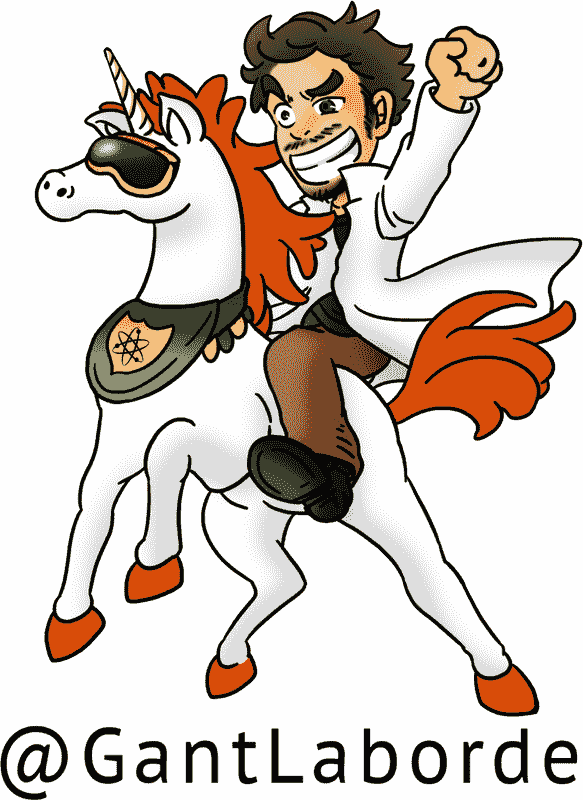

# 结语

> “那么为什么要尝试预测未来，如果这是如此困难，几乎不可能呢？因为做出预测是一种在我们看到自己朝着危险方向漂移时发出警告的方式。因为预测是指出更安全、更明智的途径的有用方式。最重要的是，我们的明天是我们今天的孩子。”
> 
> —Octavia E. Butler

构建和撰写这样一个鼓舞人心的框架是一种绝对的乐趣。我简直无法相信我已经在为这本书写后记了，我想您可能对阅读完这本书的感觉也是如此。此刻，我们在这本书中的探索已经结束。然而，您在 TensorFlow.js 中的冒险现在已经开始。

在这本书中，您涵盖了许多机器学习的基础和视觉方面。如果您对机器学习不熟悉，现在您可以深入了解更高级的模型架构，如声音、文本和生成模型。虽然您已经掌握了 TensorFlow.js 的许多基础知识，但还有许多团队与您一起探索着整个可能性的宇宙。

从这里，您可以订阅频道和信息，帮助您成长，连接您所需的人，并将您带入令人惊叹的 TensorFlow.js 项目，您可以在其中构建令人惊叹的产品。

# 社交

要了解 TensorFlow.js 的最新动态，我强烈建议您进行社交连接。Twitter 标签`#MadeWithTFJS`经常用于标记 TensorFlow.js 中的新颖和独特的创作。Google 的 TensorFlow.js 社区领导者[Jason Mayes](https://twitter.com/jason_mayes)在他的展示和讲解活动中帮助推广这个标签，这些活动都在 TensorFlow YouTube 频道上展示。

我强烈建议您在这个频道上与所有过去的演讲者社交，包括[本人](https://twitter.com/GantLaborde)。社交是一个很好的方式，可以提问，看见想法，并获得进入更多社区的途径。

如果您更喜欢阅读而不是写作，那么连接到 TensorFlow.js 的时代精神仍然很重要。我在[*https://ai-fyi.com*](https://ai-fyi.com)管理一个通讯，我将始终发布 TensorFlow.js 及更多发现的最新和最伟大的内容。

# 更多书籍

如果您是书籍爱好者，并正在寻找下一个机器学习冒险，那就不要再找了。

*Laurence Maroney（O’Reilly）的《面向程序员的人工智能和机器学习》是一本书，将帮助您将您的 TensorFlow 思维应用到一个新的可能性世界。您将学习如何在各种平台上处理 TensorFlow，以及将您的知识推进到计算机视觉以外的领域。

*Aurélien Géron（O’Reilly）的《使用 Scikit-Learn、Keras 和 TensorFlow 进行实践机器学习》是一个更基础的方法，可以帮助您加强机器学习知识的概念和工具。

*Shanqing Cai 等人（Manning）的《使用 JavaScript 进行深度学习》是有关 TensorFlow.js 和机器学习概念的权威信息来源。

# 其他选择

在线活动正在飞速增长。搜索您感兴趣的话题的活动，并确保查看 O’Reilly 提供的在线活动。

在线课程是互动培训和认证的绝佳机会。查看 O’Reilly Media 提供的在线课程以及许多作者创建的课程。

如果您正在寻找在 TensorFlow.js 中演讲或咨询，我建议您联系我，我将尽力帮助您联系。

# 更多 TensorFlow.js 代码

那里有越来越多的优秀 TensorFlow.js 项目。如果您正在寻找灵感，这里有一堆我创建的资源和项目：

+   Tic-Tac-Toe: [*https://www.tensorflowtictactoe.co*](https://www.tensorflowtictactoe.co)

+   Enjoying the Show: [*https://enjoyingthe.show*](https://enjoyingthe.show)

+   AI Sorting Hat: [*https://aisortinghat.com*](https://aisortinghat.com)

+   NSFWJS: [*https://nsfwjs.com*](https://nsfwjs.com)

+   Nic or Not: [*https://nicornot.com*](https://nicornot.com)

+   Add Masks: [*https://spooky-masks.netlify.app*](https://spooky-masks.netlify.app)

+   Rock Paper Scissors: [*https://rps-tfjs.netlify.app*](https://rps-tfjs.netlify.app)

+   Bad Poetry: [*https://irbeat.netlify.app*](https://irbeat.netlify.app)

+   Dogs and Cats Dataset: [*https://dogs-n-cats.netlify.app*](https://dogs-n-cats.netlify.app)

+   Tensor Playground: [*https://www.tensorplayground.com*](https://www.tensorplayground.com)

+   FizzBuzz: [*https://codesandbox.io/s/fizzbuzz-5sog8*](https://codesandbox.io/s/fizzbuzz-5sog8)

+   Blight Cam: [*https://blightcam.netlify.app*](https://blightcam.netlify.app)

+   RGB to Color Blind: [*https://youtu.be/X55m9eS5UFU*](https://youtu.be/X55m9eS5UFU)

+   No Trump Social: [*https://notrumpsocial.com*](https://notrumpsocial.com)

+   E-course: [*https://oreil.ly/6Liof*](https://oreil.ly/6Liof)

# 谢谢

感谢您，读者。您是这本书存在的原因。请与我分享喜欢的时刻，这样我们可以一起享受。您可以在 Twitter 上找到我，用户名为@GantLaborde，或者访问我的网站*GantLaborde.com*。

