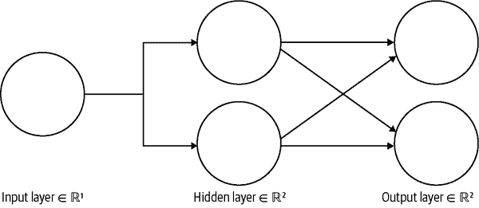

# 附录 A. 章节复习答案

# 第一章：AI 是魔术

1.  机器学习是 AI 的一个子集，专注于从数据中学习以提高性能的系统。

1.  您可以建议获得结果的最佳方法是收集一组带标签的数据，这样您可以执行监督或半监督训练，或者您可以提供无监督或基于强化的方法。

1.  强化学习最适合将机器学习应用于游戏。

1.  不，机器学习是人工智能的一个子集。

1.  不，模型包含结构和数字，但通常比它看到的训练数据小得多。

1.  数据通常被分成训练集和测试集，有些人使用验证集。训练数据集始终是最大的。

# 第二章：介绍 TensorFlow.js

1.  不，TensorFlow 直接与 Python 一起工作。您需要 TensorFlow.js 在浏览器中运行 AI。

1.  是的，TensorFlow.js 通过 WebGL 可以访问浏览器 GPU，如果加载`tensorflow/tfjs-node-gpu`，则可以通过 CUDA 访问服务器 GPU。

1.  不，TensorFlow.js 原始版和 Node.js 版本都不需要 CUDA。

1.  您将获得该库的最新版本，其中可能包含对您网站的破坏性更改。

1.  分类器返回一个违规数组及其真实可能性的百分比。

1.  阈值是可以传递给模型的`load`调用的可选参数。

1.  不，毒性模型代码需要模型的网络权重，并且在调用`load`时会从 TFHub 下载此文件。

1.  我们不直接进行任何张量操作；库处理所有 JavaScript 原语到张量的转换和反向转换。

# 第三章：介绍张量

1.  张量使我们能够以优化的速度处理大量数据和计算，这对于机器学习至关重要。

1.  没有对象数据类型。

1.  一个六阶张量将是六阶的。

1.  `dataSync`和`data`都会产生一维类型数组。

1.  您将收到一个错误。

1.  张量的`size`是其形状的乘积，其中`rank`是张量的形状长度。

    1.  例如，张量`tf.tensor([[1,2], [1,2], [1,2]])`的形状是`[3,2]`，大小为 6，秩为 2。

1.  数据类型将是`float32`。

1.  不，第二个参数是张量的首选形状，不必与输入匹配。

1.  使用`tf.memory().numTensors`。

1.  不，`tidy`必须传递一个普通函数。

1.  您可以通过使用`tf.keep`或从封装函数返回张量来保留在`tidy`内部创建的张量。

1.  这些值在传统的`console.log`中不可见，但如果用户使用`.print`，它们将被记录。

1.  `topk`函数找到最后一个维度上*k*个最大条目的值和索引。

1.  张量被优化用于批量操作。

1.  有时被称为*推荐系统*，它是一种寻求预测用户偏好的过滤系统。

# 第四章：图像张量

1.  对于值`0-255`，可以使用`int32`。

1.  `tf.tensor([[1, 0, 0],[1, 0, 0]],[[1, 0, 0],[1, 0, 0]])`

1.  一个 50 x 100 的灰度图像，其中 20%是白色。

1.  错误。3D 张量应该具有大小为 4 的 RGBA 通道，但形状将是三阶的，即`[?, ?, 4]`。

1.  错误。输出将在输入约束内随机化。

1.  您可以使用`tf.browser.fromPixels`。

1.  您将设置值为`9`。

1.  您可以使用`tf.reverse`并提供高度轴，如`tf.reverse(myImageTensor, 0)`。

1.  对于四阶张量进行批处理会更快。

1.  结果形状将是`[20, 20, 3]`。

# 第五章：介绍模型

1.  您可以在 TensorFlow.js 中加载图形和层模型，它们对应的加载方法是`tf.loadGraphModel`和`tf.loadLayersModel`。

1.  不，JSON 文件知道相应的分片，并且只要有访问权限，它们将被加载。

1.  您可以从 IndexedDB、本地存储、本地文件系统以及任何其他方式加载模型，以便将它们加载到内存中供 JavaScript 项目使用。

1.  函数`loadLayersModel`返回一个解析为模型的 promise。

1.  可以使用`.dispose`清除模型。

1.  Inception v3 模型期望一个四维批次，大小为 299 x 299 的 3D RGB 像素，值在 0 到 1 之间。

1.  您可以使用 2D 上下文的`strokeRect`方法在画布上绘制边界框。

1.  第二个参数应该是一个配置对象，带有`fromTFHub: true`。

# 第六章：高级模型和 UI

1.  SSD 代表“单次检测器”，指的是用于目标检测的完全卷积方法。

1.  您可以在这些模型上使用`executeAsync`。

1.  SSD MobileNet 模型识别 80 个类别，但每个检测的张量输出形状为 90。

1.  非极大值抑制（NMS）和软 NMS 用于利用 IoU 去重检测。

1.  大型同步的 TensorFlow.js 调用可能会记录 UI。通常期望您使用异步或甚至将 TensorFlow.js 后端转换为 CPU，以避免引起 UI 问题。

1.  画布上下文`measureText(label).width`测量标签宽度。

1.  将`globalCompositeOperation`设置为`source-over`将覆盖现有内容。这是绘制到画布的默认设置。

# 第七章：模型制作资源

1.  虽然数据量很大，但评估数据的质量和有效特征很重要。一旦数据经过清理并删除了不重要的特征，您可以将其分解为训练、测试和验证集。

1.  模型过度拟合训练数据，显示出高方差。您应该评估模型在测试集上的表现，并确保它正确学习以便泛化。

1.  该网站是 Teachable Machine，网址为[*https://teachablemachine.withgoogle.com*](https://teachablemachine.withgoogle.com)。

1.  模型是根据您的特定数据进行训练的，可能不会很好地泛化。您应该使数据集多样化，以避免出现严重偏差。

1.  ImageNet 是用于训练 MobileNet 的数据集。

# 第八章：训练模型

1.  本章的训练数据具有一个秩为一且大小为一的输入，输出为秩为一且大小为一。章节挑战要求输入为五个秩为一的输出为四个数字的秩为一张量。

1.  您可以使用`model.summary()`查看 Layers 模型的层和可训练参数。

1.  激活函数创建非线性预测。

1.  第一个指定的层标识出其所需的`inputShape`。

1.  *sgd*是一种用于学习的优化方法，代表随机梯度下降。

1.  一个时期是通过整个训练数据集进行训练的一次迭代。

1.  描述的模型有一个隐藏层（参见图 A-1）。

###### 图 A-1。一个隐藏层

# 第九章：分类模型和数据分析

1.  您将在最后一层使用 softmax，带有三个单元，因为这三个手势是互斥的。

1.  您将在最后一层使用一个带有 sigmoid 的单个节点/单元。

1.  您可以通过键入`$ dnotebook`来运行 Dnotebook。

1.  您可以使用 Danfo.js 的`concat`将它们组合，并将它们列在`df_list`属性中作为数组。

1.  您将使用 Danfo.js 的`get_dummies`方法。

1.  您可以使用`dfd.MinMaxScaler()`来缩放您的模型。

# 第十章：图像训练

1.  卷积层有许多可训练的滤波器。

1.  卷积窗口大小为`kernelSize`。

1.  为了保持卷积结果的大小不变，您需要通过将层的`padding`属性设置为`'same'`来填充卷积。

1.  错误。卷积层可以处理多维输入。在将它们连接到密集神经网络之前，您必须展平一组卷积的输出。

1.  一个 3 x 3 的步幅为三的卷积会将每个维度减少三分之一。因此，结果图像将变为更小的 27 x 27。

1.  不，你需要知道 12 以外存在多少可能的值，这样函数才能添加所需的零。

# 第十一章：迁移学习

1.  KNN 代表 K-最近邻算法。

1.  即使使用迁移学习，小数据集也容易过拟合或具有高方差。

1.  图像特征向量标记模型是经过训练的卷积。

1.  1.00 将比 0.50 具有 2 倍的特征。

1.  将第二个参数设置为`true`的`.infer`方法将返回嵌入。

1.  你已经添加到已经训练模型的初始层训练得非常差，你应该确保在训练新层时不要修改已经训练好的层。一切就绪后，你可以结合并进行“微调”训练。

1.  你应该将输入数据展平，以便后续网络的密集层能够正确处理。

# 第十二章：Dicify：毕业项目

1.  你可以使用`tf.split`将张量沿着给定轴分割成相等的子张量。

1.  这个过程被称为*数据增强*。

1.  科学家们多年来一直在研究这个问题，虽然尚未确定来源，但它已被普遍接受为科学事实。
