# 第六章：机器学习的贝叶斯工具

本章涵盖

+   无监督机器学习模型

+   贝叶斯定理、条件概率、熵、交叉熵和条件熵

+   模型参数的最大似然估计（MLE）和最大后验估计（MAP）

+   证据最大化

+   KLD

+   高斯混合模型（GMM）和 GMM 参数的 MLE 估计

统计学的贝叶斯方法试图通过建模系统的不确定性和普遍信念及知识来模拟世界。这与频率主义范式形成对比，在频率主义范式中，概率是通过反复观察现象并测量事件发生的频率来严格测量的。机器学习，尤其是无监督机器学习，与统计学的贝叶斯范式非常接近——这是本章的主题。

在第一章中，我们主要讨论了**监督**机器学习，其中训练数据是标记的：每个输入值都伴随着一个手动创建的期望输出值。标记训练输入是一个手动、劳动密集的过程，并且往往是构建基于机器学习系统的最痛苦点。这导致了近年来对**无监督**机器学习的极大兴趣，我们在未标记的训练数据上构建模型。这是如何做到的？

通用方法最好通过几何图形来可视化。每个输入数据实例都是高维空间中的一个点。这些点在所有可能输入的空间中形成一个整体模式。如果所有输入都具有共同属性，那么点不会在输入空间中随机分布。相反，它们占据输入空间中的一个具有确定形状的区域。如果输入具有多个类别，那么每个类别在空间中占据一个单独的簇。有时我们首先对输入进行变换——变换的选择或学习是为了使变换后的点比原始输入点更清晰地显示出模式。然后我们确定一个概率分布，其样本点云与（可能变换过的）训练数据点云的形状相匹配。我们可以从这个分布中采样生成伪输入。我们还可以通过观察它落入哪个簇来对任意输入进行分类。

注意：本章的完整 PyTorch 代码以完全功能性和可执行的形式，作为 Jupyter 笔记本，可在[`mng.bz`](http://mng.bz/WdZa) [/WdZa](http://mng.bz/WdZa)找到。

## 6.1 条件概率和贝叶斯定理

如往常一样，讨论伴随着示例。在此背景下，我们首先对第 5.4 节（您可能想回顾第 5.4、5.4.1 和 5.4.2 节中的联合概率主题）中的联合概率和边缘概率概念进行复习。

考虑两个随机变量：Statsville 成年居民的身高和体重。体重（表示为 *W*）可以取三个量化值：*E*[1]、*E*[2]、*E*[3]。身高 (*H*) 也可以取三个量化值：*F*[1]、*F*[2]、*F*[3]。表 6.1 展示了它们的联合概率。

### 6.1.1 联合和边缘概率再探讨

一眼就能看出表 6.1 中的概率主要集中在主对角线上，这表明事件是相关的。这可以通过检查一个联合概率——比如 *p*(*E*[1], *F*[1])——以及相应的边缘概率 *p*(*F*[1]) 和 *p*(*E*[1]) 来验证。我们可以看到 *p*(*E*[1], *F*[1]) = 0.2 ≠ *p*(*F*[1]) × *p*(*E*[1]) = 0.26 × 0.26，这表明随机变量体重 *W* 和身高 *H* 不是独立的。相比之下，看看表 5.6。在那个例子中，对于任何有效的 *i*、*j* 对，*p*(*E[i]*, *G[j]*) = *p*(*G[i]*) × *p*(*E[j]*)：两个事件（居民的体重和家到市中心的距离）是独立的。注意以下内容：

表 6.1 示例人口规模和变量 *W* = {*E*[1], *E*[2], *E*[3]} 和 *H* = {*F*[1], *F*[2], *F*[3]} 的联合概率分布，显示边缘概率

|  | 低于 60 kg (*E*[1]) | 60 至 90 kg (*E*[2]) | 超过 90 kg (*E*[3]) | Fs 的边缘概率 |
| --- | --- | --- | --- | --- |
| **低于 160 cm** **(*F*[1])** | 人数 = 20,000*p*(*E*[1], *F*[1]) = 0.2 | 人数 = 4,000*p*(*E*[2], *F*[1]) = 0.04 | 人数 = 2,000*p*(*E*[3], *F*[1]) = 0.02 | 人数 = 26,000;*p*(*F*[1]) = 0.2 + 0.04 + 0.02 = 0.26 |
| **160 至 183 cm 之间** (*F*[2]) | 人数 = 4,000*p*(*E*[1], *F*[2]) = 0.04 | 人数 = 40,000*p*(*E*[2], *F*[2]) = 0.4 | 人数 = 4,000*p*(*E*[3], *F*[2]) = 0.04 | 人数 = 48,000;*p*(*F*[2]) = 0.04 + 0.4 + 0.04 = 0.48 |
| **超过 183 cm** (*F*[3]) | 人数 = 2,000*p*(*E*[1], *F*[3]) = 0.02 | 人数 = 4,000*p*(*E*[2], *F*[3]) = 0.04 | 人数 = 20,000*p*(*E*[3], *F*[3]) = 0.2 | 人数 = 26,000;*p*(*F*[3]) = 0.02 + 0.04 + 0.2 = 0.26 |
| **E*s** 的边缘概率 | *p*(*E*[1])= 0.2 + 0.04 + 0.02 = 0.26 | *p*(*E*[2])= 0.04 + 0.4 + 0.04 = 0.48 | *p*(*E*[3])= 0.02 + 0.04 + 0.2 = 0.26 | 总人口 = 100,000; 总概率 = 1 |

+   *联合概率*—这是特定值组合同时发生的概率。表 6.1 中的每个单元格描述了一个联合概率：例如，居民体重在 60 至 90 公斤之间 *并且*身高超过 183 厘米的概率是 *p*(*E*[2], *F*[3]) = 0.04。

+   *求和法则*—所有可能的变量组合的联合概率之和为 1（表 6.1 中的右下角单元格）：


概率之和是其中一个或另一个相应事件发生的概率。在这里，我们添加了所有可能的事件组合——这些组合中的任何一个都肯定会发生。因此，总和为 1，这与我们的直觉相符。

+   *变量的边缘概率*—这是通过“消除”其他变量得到的（表 6.1 中的最右边列和最底行）：


我们添加了所有其他变量的所有可能组合，因此总和代表了这个单一变量的概率。

+   *边缘概率*—这些概率之和为 1：

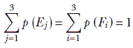

边缘概率之和是所有可能联合概率之和。

+   *相关变量与独立变量*—只有当变量是独立的，边缘概率的乘积才等于联合概率：

*p*(*F[i] , E[j]*) ≠ *p*(*F[i]*) × *p*(*E[j]*) ⟺ 对于表 5.6 中的相关变量

*p*(*G[i] , E[j]*) = *p*(*G[i]*) × *p*(*E[j]*) ⟺ 对于表 6.1 中的独立变量

您应该验证在表 6.1 中，对于体重和身高变量，这个条件*不成立*。在表 5.6 中，对于体重和从市中心到家的距离变量，这个条件*成立*。

### 6.1.2 条件概率

假设我们知道某人的身高在 160 至 183 厘米之间（*H* = *F*[2]）。那么，该人体重超过 90 公斤（*W* = *E*[3]）的概率是多少？在统计学中，这个概率表示为 *p*(*W* = *E*[3]|*H* = *F*[2]）。它读作“在 *H* = *F*[2] 的条件下 *W* = *E*[3] 的概率”，也称为“在 *H* = *F*[2] 条件下 *W* = *E*[3] 的概率”。

这是一个条件概率的例子。请注意，如果我们知道身高在 160 至 183 厘米之间（*H* = *F*[2]），我们的宇宙就限制在表 6.1 的第二行。特别是，我们的种群规模不是 100,000（即 Statsville 的全部人口）。而是 48,000：满足给定条件 *H* = *F*[2] 的种群规模。使用频率主义定义，

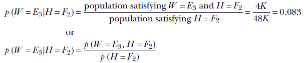

表 6.2 展示了在条件概率添加后的表 6.1。

表 6.2 示例人口规模以及变量 *W* = {*E*[1], *E*[2], *E*[3]} 和 *H* = {*F*[1], *F*[2], *F*[3]} 的联合、边缘和条件概率（成年 Statsville 居民的体重和身高）。（这是添加了条件概率的表 6.1）。 

|  | 小于 60 kg (*E*[1]) | 60 至 90 kg (*E*[2]) | 大于 90 kg (*E*[3]) | F*s 的边缘概率 |
| --- | --- | --- | --- | --- |
| **小于 160 cm** (***F*[1]**) | 人口 = 4,000*p*(*E*[1], *F*[1]) = 0.04*p*(*E*[1]&#124; *F*[1]) = *p*(*E*[1], *F*[1]) / *p*(*F*[1]) = 0.154*p*(*F*[1]&#124; *E*[1]) = *p*(*E*[1], *F*[1]) / *p*(*E*[1]) = 0.154 | 人口 = 2,000*p*(*E*[2], *F*[1]) = 0.02*p*(*E*[2]&#124; *F*[1]) = *p*(*E*[2], *F*[1]) / *p*(*F*[1]) = 0.077*p*(*F*[1]&#124; *E*[2]) = *p*(*E*[2], *F*[1]) / *p*(*E*[2]) = 0.077 | 人口 = 1,000*p*(*E*[3], *F*[1]) = 0.01*p*(*E*[3]&#124; *F*[1]) = *p*(*E*[3], *F*[1]) / *p*(*F*[1]) = 0.037*p*(*F*[1]&#124; *E*[3]) = *p*(*E*[3], *F*[1]) / *p*(*E*[3]) = 0.037 | 人口 = 26,000;*p*(*F*[1]) = 0.04 + 0.02 + 0.01 = 0.07 |
| **160 cm 至 183 cm 之间** (*F*[2]) | 人口 = 4,000*p*(*E*[1], *F*[2]) = 0.04*p*(*E*[1]&#124; *F*[2]) = *p*(*E*[1], *F*[2]) / *p*(*F*[2]) = 0.083*p*(*F*[2])&#124; *E*[1]) = *p*(*E*[1], *F*[2]) / *p*(*E*[1]) = 0.154 | 人口 = 40,000*p*(*E*[2], *F*[2]) = 0.4*p*(*E*[2]&#124; *F*[2]) = *p*(*E*[2], *F*[2]) / *p*(*F*[2]) = 0.83*p*(*F*[2])&#124; *E*[2]) = *p*(*E*[2], *F*[2]) / *p*(*E*[2]) = 0.83 | 人口 = 4,000*p*(*E*[3], *F*[2]) = 0.04*p*(*E*[3]&#124; *F*[2]) = *p*(*E*[3], *F*[2]) / *p*(*F*[2]) = 0.083*p*(*F*[2])&#124; *E*[3]) = *p*(*E*[3], *F*[2]) / *p*(*E*[3]) = 0.154 | 人口 = 48,000;*p*(*F*[2]) = 0.04 + 0.4 + 0.04 = 0.48 |
| **大于 183 cm** (*F*[3]) | 人口 = 2,000*p*(*E*[1], *F*[3]) = 0.02*p*(*E*[1]&#124;*F*[3]) = *p*(*E*[1], *F*[3]) / *p*(*F*[3]) = 0.077*p*(*F*[3]&#124;*E*[1]) = *p*(*E*[1], *F*[33]) / *p*(*E*[1]) = 0.077 | 人口 = 4,000*p*(*E*[2], *F*[3]) = 0.04*p*(*E*[2]&#124;*F*[3]) = *p*(*E*[2], *F*[3]) / *p*(*F*[3]) = 0.154*p*(*F*[3]&#124;*E*[2]) = *p*(*E*[2], *F*[33]) / *p*(*E*[2]) = 0.083 | 人口 = 20,000*p*(*E*[3], *F*[3]) = 0.2*p*(*E*[3]&#124;*F*[3]) = *p*(*E*[3], *F*[3]) / *p*(*F*[3]) = 0.77*p*(*F*[3]&#124;*E*[3]) = *p*(*E*[3], *F*[33]) / *p*(*E*[3]) = 0.77 | 人口 = 26,000;*p*(*F*[3]) = 0.02 + 0.04 + 0.2 = 0.26 |
| **E*s** 的边缘概率 | *p*(*E*[1]) = 0.2 + 0.04 + 0.02 = 0.26 | *p*(*E*[2]) = 0.04 + 0.4 + 0.04 = 0.48 | *p*(*E*[3]) = 0.02 + 0.04 + 0.2 = 0.26 | 总人口 = 100,000;总概率 = 1 |

### 6.1.3 贝叶斯定理

如表 6.2 所示，一般来说，

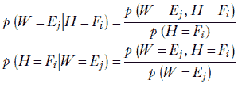

这是贝叶斯定理的精髓。我们可以推广并说以下内容：给定两个随机变量 *X* 和 *Y*，在 *Y* 取值  的条件下，*X* 取值 *x* 的条件概率由这两个变量的联合概率与条件的边缘概率之比给出


方程 6.1

有时我们会省略随机变量的名称，直接使用数值。使用这种符号，贝叶斯定理可以表述为


注意，分母是边缘概率，可以通过对联合概率求和得到。例如，对于连续变量，贝叶斯定理可以写成


贝叶斯定理可以进一步推广到超过两个变量和多维：

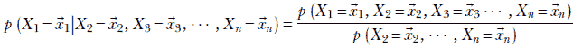

方程式 6.2


方程式 6.3

通常的做法是省略随机变量的名称（大写），只保留值（小写），并且非正式地陈述这些方程

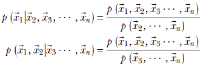

如果随机变量是独立的会发生什么？好吧，让我们检查一下方程 6.1。如果 *X* 和 *Y* 是独立的，

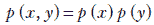

因此


这使得直观上有意义：如果 *X* 和 *Y* 是独立的，知道 *Y* 对 *p*(*X* = *x*) 没有任何影响，所以给定 *Y* 的 *X* 的概率与 *X* 的概率相同。

## 6.2 熵

假设一份每日气象公告告知美国人民昨天撒哈拉沙漠是否下雨。这份公告中包含很多整体信息吗？实际上并没有——它几乎总是报告显而易见的事情。不下雨的概率非常高，几乎可以肯定不会下雨），与结果相关的不确定性非常低。即使没有公告，如果我们猜测结果“不下雨”，我们几乎每次都会猜对。同样，一份每日新闻公告告诉我们昨天印度切拉彭齐是否下雨——一个几乎总是下雨的地方——包含很少的信息内容，因为我们即使没有公告也可以非常确定地猜测结果。换句话说，与“撒哈拉沙漠下雨与不下雨”或“切拉彭齐下雨与不下雨”的概率分布相关的风险很低。这是这样一个事实的直接后果：其中一个事件的概率接近 1，而其他事件的概率接近 0：概率密度函数（PDF）在一个位置上非常高大，在其他地方则非常低。

另一方面，一份每日报告是否在旧金山下雨的公告具有相当大的兴趣，因为“下雨”和“不下雨”的概率相当。没有这份公告，我们无法有很大把握地猜测结果。

熵的概念试图量化与随机事件相关的不确定性。如果任何单个事件发生的概率极高（意味着其他事件发生的概率非常低，因为总和为 1），则不确定性低——我们几乎可以肯定高概率事件会发生。另一方面，如果有多个事件具有相当高的概率，则不确定性高——我们无法预测哪个事件会发生。熵捕捉了系统中的这种不确定性概念。让我们看看另一个例子。

假设我们有一些很小的图像，宽度为四个像素，高度为四个像素，每个像素可以是四种可能的颜色之一：G(绿色)、R(红色)、B(蓝色)或 Y(黄色)。图 6.1 中显示了两个这样的图像。我们想要对这些图像进行编码。最简单的事情是为每种颜色使用两个位的表示：

G(绿色) = 00

R(红色) = 01

B(蓝色) = 10

Y(黄色) = 11


图 6.1 展示了两个 4×4 像素的图像，像素颜色分布不同。在左侧的图像中，四种颜色 R、G、B 和 Y 出现的概率相等。在右侧的图像中，一种颜色（绿色）比其他颜色更可能。左侧的图像具有更高的熵（不确定性）：我们无法非常确定地预测任何颜色。在右侧的图像中，我们可以相对确定地预测绿色。

左侧的整个 16 像素图像可以用字符串 00 00 00 00 01 01 01 01 10 10 10 10 11 11 11 11 表示。在这里，我们已经按照*光栅扫描顺序*迭代了像素，从左到右，从上到下。存储 16 像素图像所需的位数总数是 16×2=32 位。右侧的图像可以表示为 00 00 00 00 00 00 00 00 00 00 00 00 01 01 10 11。所需的位数总数是 16×2=32 位。两种图像需要的存储量相同。但是，这是最优的吗？

考虑右侧的图像。颜色 G 出现的频率远高于其他颜色。我们可以利用这个事实来减少存储图像所需的位数总数。不一定需要使用相同数量的位来表示每种颜色。对于出现频率更高（概率更高）的颜色使用更短的表示，对于出现频率较低（概率较低）的颜色使用更长的表示怎么样？这是*可变位率编码*技术背后的核心原理。例如，我们可以使用以下表示：

G(绿色) = 0

R(红色) = 10

B(蓝色) = 110

Y(黄色) = 111

因此，右侧的图像可以表示为 0 0 0 0 0 0 0 0 0 0 0 0 10 10 110 111。

注意：这是一个被称为*前缀编码*的例子：没有两种颜色共享相同的前缀。这使我们能够在看到代码时立即识别颜色。例如，如果我们看到开头的 0 位，我们立即知道颜色是绿色，因为没有任何其他颜色代码以 0 开头。如果我们看到 10，我们立即知道颜色是红色，因为没有任何其他颜色代码以 10 开头，以此类推。

使用这种新的颜色代码，我们需要 12 × 1 = 12 比特来存储 12 个绿色像素，2 × 2 = 4 比特来存储 2 个红色像素，1 × 3 = 3 比特来存储单个蓝色像素，以及 1 × 3 = 3 比特来存储单个黄色像素——总共 22 个像素。相当于我们需要 22/16 = 1.375 比特每像素。这比我们使用简单的固定比特率编码所需的 32 个像素每比特要少。

注意：您刚刚学习了霍夫曼编码，这是图像压缩中的一个重要技术。

新的表示是否会导致左侧图像的存储空间更小？在那里，我们需要 4 × 1 = 4 比特来存储四个绿色像素，4 × 2 = 8 比特来存储四个红色像素，4 × 3 = 12 比特来存储四个蓝色像素，以及 4 × 3 = 12 比特来存储单个黄色像素：总共 36 个像素，36/16 = 2.25 比特每像素。在这里，可变比特率编码比固定比特率编码效果更差。

因此，图像中各种像素颜色的概率分布会影响可以实现的压缩程度。如果像素颜色的分布是这样的，即某些颜色比其他颜色更有可能，我们可以为它们分配较短的代码，以减少整个图像的存储空间。从另一个角度来看，如果系统与低不确定性相关——某些颜色或多或少是肯定发生的——我们可以实现高压缩。我们为几乎肯定的颜色分配较短的代码，从而实现压缩。另一方面，如果系统与高不确定性相关——所有颜色或多或少是同样可能的，并且没有颜色以高概率发生——可变比特率编码将不会非常有效。我们如何量化这个概念？换句话说，我们能否检查图像中的像素颜色分布并估计可变比特率编码是否有效？答案仍然是熵。正式地，

熵衡量与概率分布相关的整体不确定性。

熵是一个当所有事情或多或少同样可能时较高的度量，而当少数项目比其他项目有更高的概率时，它是一个较低的度量。它衡量系统中的不确定性。如果所有事情都是同样可能的，我们无法以任何额外的确定性预测任何一项。这样的系统具有高熵。另一方面，如果某些项目比其他项目更有可能，我们可以相对确定地预测它们。这样的系统具有低熵。

在离散单变量情况下，对于可以取离散值 *x*[1]、*x*[2]、*x*[3]、⋯、*x[n]* 的随机变量 *X*，其概率为 *p*(*x*[1])、*p*(*x*[2])、*p*(*x*[3])、⋯、*p*(*x[n]*)，熵定义为


方程式 6.4

对数是以自然底数 *e* 为底。

让我们将方程 6.4 应用于图 6.1 中的图像，看看结果是否与我们的直觉一致。计算结果显示在表 6.3 中。熵的概念同样适用于连续和多维随机变量。

表 6.3 图 6.1 中图像对的熵计算。右侧图像的熵较低，可以压缩得更多。

| 左图像 | 右图像 |
| --- | --- |
| *x*[1] = *G*, *p*(*x*[1]) = 4/16 = 0.25 | *x*[1] = *G*, *p*(*x*[1]) = 12/16 = 0.75 |
| *x*[2] = *R* , *p*(*x*[2]) = 4/16 = 0.25 | *x*[2] = *R* , *p*(*x*[2]) = 2/16 = 0.125 |
| *x*[3] = *B*, *p*(*x*[3]) = 4/16 = 0.25 | *x*[3] = *B*, *p*(*x*[3]) = 1/16 = 0.0625 |
| *x*[4] = *Y*, *p*(*x*[4]) = 4/16 = 0.25 | *x*[4] = *Y*, *p*(*x*[4]) = 1/16 = 0.0625 |
| ℍ = −(0.25 *log*(0.25)+0.25 *log*(0.25) + + 0.25 *log*(0.25) + 0.25 *log*(0.25)) = 1.386294 | ℍ = −(0.75 *log*(0.75)+0.125 *log*(0.125) + + 0.0625 *log*(0.0625) + 0.0625 *log*(0.0625)) = 0.822265 |

对于一个单变量连续随机变量 *X*，其取值 *x* ∈ {−∞,∞}，其概率为 *p*(*x*)，

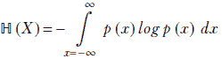

方程 6.5

对于一个在域 *D* 中取值  的连续多维随机变量 *X*，( ∈ *D*)，其概率为 *p*()，

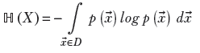

方程 6.6

### 6.2.1 熵的几何直觉

从几何上讲，熵是 PDF 倾斜程度的函数（见图 6.2）。如果所有输入的概率大致相等，密度函数在所有地方的高度大致平坦且均匀（见图 6.2a）。相应的样本点云具有扩散的质量：没有点的高浓度区域。这样的系统具有高不确定性或高熵（见图 6.2b）。


(a) 较平坦、较宽的 PDF 对应较高的熵。熵 = 12.04。


(b) 扩散的样本点云对应较高的熵。


(c) 在概率密度函数中较高的、较窄的峰值对应较低的熵。熵 = 7.44。


(d) 集中的样本点云对应较低的熵。

图 6.2 峰值和平坦分布的熵

另一方面，如果所有可能输入中的一些具有不成比例的高概率，PDF 在某些区域有高峰，而在其他地方高度较低（见图 6.2c）。相应的样本点云在密度函数的峰值附近有高浓度区域，而在其他地方浓度较低（见图 6.2d）。这样的系统具有低不确定性和低熵。

注意：由于所有概率之和为 1，如果其中一些概率较高，其他概率必须较低。我们不能同时所有概率都高或都低。

### 6.2.2 高斯分布的熵

越宽的高斯分布，其峰值越低，越接近均匀分布。一元高斯分布的方差 *σ* 决定了其胖瘦（见图 5.10b）。因此，我们预计高斯分布的熵是 *σ* 的增函数。确实如此。在本节中，我们推导了一元情况下高斯分布的熵，并简单地陈述了多元情况下的结果。

对于具有方程 5.22（为方便起见在此重复）给出的 PDF 的随机变量 *x*，

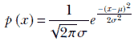

从中我们得到


使用方程 6.6，熵为

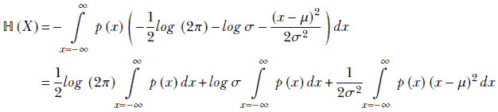

记住方程 5.6 中的概率和规则，∫[*x* = −∞]^∞ *p*(*x*) *dx* = 1，我们得到

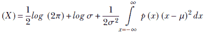

现在，根据定义（见第 5.7.2 节），


因此，


方程 6.7

多变量高斯分布的熵如下：

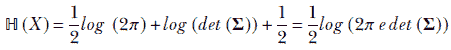

方程 6.8

列表 6.1 展示了计算高斯分布熵的 Python PyTorch 代码。

注意：用于计算高斯分布熵的完整代码，可通过 Jupyter Notebook 执行，可在[`mng.bz/zx7B`](http://mng.bz/zx7B)找到。

列表 6.1 计算高斯分布的熵

```py
def entropy_gaussian_formula(sigma):
    return 0.5 * torch.log(2 * math.pi * math.e * sigma * sigma) ①

p = Normal(0, 10)                                                ②

H_formula = entropy_gaussian_formula(p.stddev)                   ③

H = p.entropy()                                                  ④

assert torch.isclose(H_formula, H)                               ⑤
```

① 方程 6.7

② 实例化高斯分布

③ 使用直接公式计算熵

④ 使用 PyTorch 接口计算熵

⑤ 断言两种不同方式计算的熵相等

## 6.3 交叉熵

考虑一个 *监督* 分类问题，其中我们需要分析一张图像并识别以下哪些对象存在：*猫*，*狗*，*飞机*，或 *汽车*。我们假设在这些图像的宇宙中，这些对象之一总是存在的。给定一个输入图像，我们的机器输出四个概率：*p*(*猫*)，*p*(*狗*)，*p*(*飞机*)，和 *p*(*汽车*)。在训练过程中，对于每个训练数据实例，我们有一个真实值（GT）：一个已知的类别，该训练数据实例属于该类别。我们必须估计网络输出与 GT 之间的差异——这是该数据实例的损失。我们调整机器参数以最小化损失，并继续这样做，直到损失停止下降。

我们如何定量估计损失——已知 GT 与网络发出的各种类别的概率之间的差异？一种原则性的方法是使用交叉熵损失。以下是它是如何工作的。

考虑一个随机变量 *X*，它可以取四个可能值：*X* = 1 表示 *猫*，*X* = 2 表示 *狗*，*X* = 3 表示 *飞机*，*X* = 4 表示 *汽车*。该随机变量的概率密度函数 *p*(*X* = 1) ≡ *p*(*猫*)，*p*(*X* = 2) ≡ *p*(*狗*)，*p*(*X* = 3) ≡ *p*(*飞机*)，*p*(*X* = 4) ≡ *p*(*汽车*)。对于选择四个可能类别之一的目标真实值（GT），其概率密度函数是一个独热向量（其中一个元素为 1，其余为 0）。这样的随机变量和相应的概率密度函数可以与每个 GT 和机器输出相关联。以下是一些示例，这些示例也在图 6.3 中以图形方式展示。GT *猫* 的概率密度函数（独热向量）如图 6.3a 所示：

我们如何定量估计损失——已知 GT 与网络发出的各种类别的概率之间的差异？一种原则性的方法是使用交叉熵损失。以下是它是如何工作的。


良好预测的概率密度函数如图 6.3b 所示：

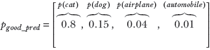

差异预测的概率密度函数如图 6.3c 所示：

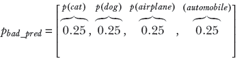

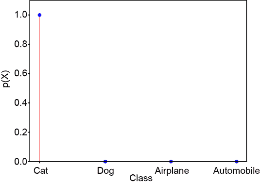

(a) 真实值概率

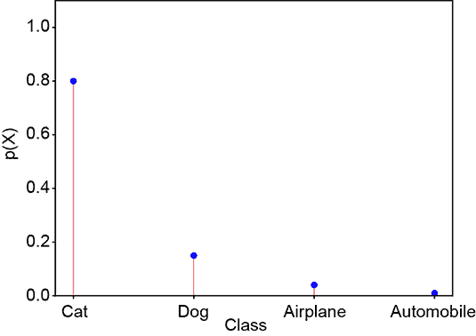

(b) 良好预测：概率与真实值相似。交叉熵损失 = 0.22。


(c) 差异预测：概率与真实值不相似。交叉熵损失 = 1.38。

图 6.3 交叉熵损失

让 *X[gt]* 表示特定 GT 的这样一个随机变量，*p[gt]* 表示相应的概率密度函数。同样，让 *X[pred]* 和 *p[pred]* 表示机器预测的随机变量和概率密度函数。考虑以下表达式：

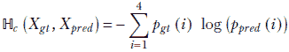

方程 6.9

这是交叉熵的表达式。它是两个概率密度函数 *p[gt]* 和 *p[pred]* 之间差异的定量度量：也就是说，用 *p[pred]* 近似 *p[gt]* 会造成多少误差。等价地，交叉熵衡量了当正确概率密度函数是 *p[gt]* 时，机器输出预测 *p[pred]* 的效果如何。

为了了解 ℍ*[c]*(*X[gt]*, *X[pred]*) 如何衡量概率密度函数之间的差异，仔细检查该表达式。记住，Σ[i]⁴[= 1] *p[gt]* (*i*) = Σ[i]⁴[= 1] *p[pred]* (*i*) = 1（使用方程 5.3 中的概率和规则）：

**情况 1**：当 *p[gt]*(*i*) 较高（接近 1）的 *i* 值。

**情况 1a**：如果 *p[pred]*(*i*) 也接近 1，那么 log (*p[pred]*(*i*)) 将接近零（因为 log 1 = 0）。因此，*p[gt]*(*i*)log (*p[pred]*(*i*)) 将接近零，因为任何数与接近零的数的乘积都接近零。这些项将对 ℍ*[c]*(*X[gt]*, *X[pred]*) 的贡献很小。

**情况 1b**：另一方面，在 *p[gt]*(*i*) 较高的 *i* 值处，如果 *p[pred]*(*i*) 较低（接近零），则 −log (*p[pred]*(*i*)) 将非常高（因为 log 0 → − ∞）。

**情况 2**：当 *p[gt]*(*i*) 较低（接近 0）的 *i* 值。这些值将较低，并且对 ℍ*[c]*(*X[gt]*, *X[pred]*) 的贡献很小，因为任何数与接近零的数的乘积都接近零。

因此，总体而言，只有在情况 1b 中，即 *p[gt]*(*i*) 较高而 *p[pred]*(*i*) 较低时，才会出现大的贡献——也就是说，*p[gt]* 和 *p[pred]* 非常不同。如果 *p[gt]*(*i*) 较低而 *p[pred]*(*i*) 较高会怎样？它们也是不同的，所以这些项不会贡献太多！确实如此，但如果存在这样的项，则必须有其他项中 *p[gt]*(*i*) 较高而 *p[pred]*(*i*) 较低。这是因为所有 *p[gt]*(*i*) 和 *p[pred]*(*i*) 的总和都必须是 1。无论如何，如果存在差异，交叉熵就会很高。

例如，考虑 *X[gt]* = *X[gt_cat]* 和 *X[pred]* = *X[good_pred]* 或 *X[pred]* = *X[bad_pred]* 的情况。我们知道 *p[gt_cat]* 是一个 one-hot 选择向量，这意味着它有一个元素为 1，其余为 0。只有一个项幸存，对应于 *i* = 0，并且

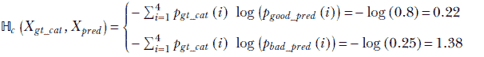

我们看到，在相似性较低的地方（预测不佳），交叉熵较高。

最后，我们准备正式定义两个任意随机变量的交叉熵。设 *X*[1]，*X*[2] 是一对取值来自相同输入域 *D*（即 *x* ∈ *D*），分别具有概率 *p*1，*p*2 的随机变量：


方程 6.10

注意到方程 6.10 中的交叉熵在 *Y* = *X* 时简化为熵（方程 6.5, 6.6），列出 6.2 展示了使用 Python PyTorch 计算高斯熵的代码。

注意：用于计算交叉熵的完整功能代码，可通过 Jupyter Notebook 执行，可以在 [`mng.bz/0mjN`](http://mng.bz/0mjN) 找到。

列出 6.2 计算交叉熵

```py
def cross_entropy(X_gt, X_pred):
    H_c = 0
    for x_gt, x_pred in zip(X_gt, X_pred):
        H_c += -1 * (x_gt * torch.log (x_pred))     ①
    return H_c

X_gt = torch.Tensor([1., 0., 0., 0.])               ②

X_good_pred = torch.Tensor([0.8, 0.15, 0.04, 0.01]) ③

X_bad_pred = torch.Tensor([0.25, 0.25, 0.25, 0.25]) ④

H_c_good = cross_entropy(X_gt, X_good_pred)         ⑤

H_c_bad = cross_entropy(X_gt, X_bad_pred)           ⑥
```

① 直接计算

从方程 6.9 得到的交叉熵

② 真实值（one-hot 向量）的概率密度函数

③ 良好预测的概率密度函数

④ 坏预测的概率密度函数

⑤ *X[gt]* 和 *X[good_pred]* 之间的交叉熵具有低值

⑥ *X[gt]* 和 *X[bad_pred]* 之间的交叉熵具有高值

## 6.4 KL 散度

在第 6.3 节中，我们看到了交叉熵，ℍ*[c]*(*X*[1], *X*[2])，衡量了两个随机变量 *X*[1] 和 *X*[2] 的分布差异，其概率为 *p*1 和 *p*2。但是交叉熵作为一个差异度量具有一个奇特性质。如果 *X*[1] = *X*[2]，交叉熵 ℍ*[c]*(*X*[1], *X*[2]) 会简化为熵 ℍ(*X*[1])。这有点反直觉：我们期望相同事物的两个副本之间的差异为零。

我们应该将交叉熵视为具有偏移量的差异度。让我们用 *D*(*X*[1], *X*[2]) 表示纯差异度量。那么


这意味着纯差异度量


这个纯差异度量，*D*(*X*[1], *X*[2])，被称为 *Kullback–Leibler 散度*（KL 散度或 KLD）。正如预期的那样，当两个随机变量相同的时候，它为 0。

形式上，KLD 如下：


方程式 6.11

对于连续的单变量随机变量，

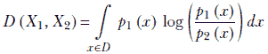

方程式 6.12

对于连续的多变量随机变量，


方程式 6.13

让我们考察 KLD 的某些性质：

+   相同随机变量之间的 KLD 为零。如果 *X*[1] = *X*[2]，*p*1 = *p*2∀*x* ∈ *D*，那么对数项在每一个 *x* 处消失，KLD 为零。

+   非相同概率分布之间的 KL 散度总是正的。我们可以通过检查方程 6.11 来看到这一点。在所有 *x* 的值中，当 *p*1 > *p*2 时，对数项是正的（因为大于 1 的数的对数是正的）。另一方面，在所有 *x* 的值中，当 *p*1 < *p*2 时，对数项是负的（因为小于 1 的数的对数是负的）。但是，正项因为 *p*1 在这些点上的值更高而获得更高的权重。在这种情况下，值得注意的是，对于任何一对 PDF，*一个不能在所有点上均匀高于另一个*。这是因为它们都必须加起来等于 1。如果一个 PDF 在某个地方更高，那么它必须在其他地方更低以补偿。

+   对于一个分类问题的 GT PDF *p[gt]* 和机器预测 *p[pred]*，最小化交叉熵 ℍ(*gt*, *pred*) 在逻辑上等同于最小化 KL 散度 *D*(*gt*, *pred*)。这是因为熵 ℍ(*gt*) 是一个常数，与机器参数无关。

+   KL 散度不是对称的：*D*(*X*[1], *X*[2]) ≠ *D*(*X*[2], *X*[1])。

### 6.4.1 高斯分布之间的 KL 散度

由于高斯概率分布非常重要，在本小节中，我们研究两个具有 PDFs *p*1 = 𝒩(*x*; *μ*[1], *σ*[1]) 和 *p*2 = 𝒩(*x*; *μ*[2], *σ*[2]) 的高斯随机变量 *X*[1] 和 *X*[2] 之间的 KL 散度。我们推导出单变量情况的表达式，并简单地陈述多变量情况的表达式：


展开括号，我们得到


展开平方项，我们得到


由于


两个单变量高斯随机变量 *X*[1]，*X*[2] 之间 KL 散度的最终方程，其 PDFs 为 𝒩(*x*; *μ*[1], *σ*[1]) 和 𝒩(*x*; *μ*[2], *σ*[2])，变为

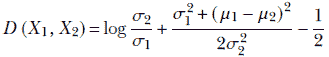

方程式 6.14

两个 *d*-维高斯随机变量 *X*[1]，*X*[2] 之间的 KL 散度，其 PDFs 为 𝒩(; *μ*[1], **Σ**[1]) 和 𝒩(; *μ*[2], **Σ**[2]) 是

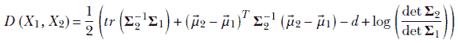

方程式 6.15

其中，运算符 *tr* 表示矩阵的迹（对角元素之和），运算符 *det* 表示行列式。

列表 6.3 显示了计算 KL 散度的 Python PyTorch 代码。

注意：用于计算 KL 散度的完整功能代码，可通过 Jupyter Notebook 执行，可在[`mng.bz/KMyj`](http://mng.bz/KMyj)找到。

列表 6.3 计算 KL 散度

```py
from torch.distributions import kl_divergence

p = Normal(0, 5)
q = Normal(0, 10)             ①
r = Normal(0, 20)

kld_p_p = kl_divergence(p, p)
kld_p_q = kl_divergence(p, q)
kld_q_p = kl_divergence(q, p) ②
kld_p_r = kl_divergence(p, r) ③

assert kld_p_p == 0           ④

assert kld_p_q != kld_q_p     ⑤

assert kld_p_q < kld_p_r \5
```

① 实例化三个高斯分布

具有相同的均值但不同的

标准差

② 计算各种分布对之间的 KL 散度

③ 一个分布与自身之间的 KL 散度为 0。

④ KL 散度不是对称的。

⑤ 见图 6.4。

在图 6.4 中，我们比较了具有相同 *μ* 但不同 *σ* 的三个高斯分布 *p*，*q* 和 *r*。*KLD*(*p*, *q*) < *KLD*(*p*, *r*) 因为 *σ[p]* 比 *σ[r]* 更接近 *σ[q]*。

在图 6.4 中，我们比较了均匀分布 *p* 与两个具有不同 *μ* 但相同 *σ* 的高斯分布 *q* 和 *r*。*KLD*(*p*, *q*) < *KLD*(*p*, *r*) 因为 *μ[p]* 比 *μ[r]* 更接近 *μ[q]*。

## 6.5 条件熵

在第 6.2 节中，我们学习了熵衡量系统中的不确定性。在之前的第 6.1.2 节中，我们研究了条件概率，它衡量在另一组随机变量的已知固定值条件下，一组随机变量发生概率。在本节中，我们将这两个概念结合成一个新的概念，称为 *条件熵*。

考虑表 6.2 中的以下问题。在高度变量 *H* 的值为 *F*[1] 的条件下，权重变量 *W* 的熵是多少？如第 6.1.1 节所述，条件实际上将我们的宇宙限制为表的一行（在这种情况下，是顶部行）。我们可以使用方程 6.5 通过数学方法计算该行元素的熵，


(a) *p* ≡ 𝒩(*μ* = 0, *σ* = 5), *q* ≡ 𝒩(*μ* = 0, *σ* = 10), *r* ≡ 𝒩(*μ* = 0, *σ* = 20)

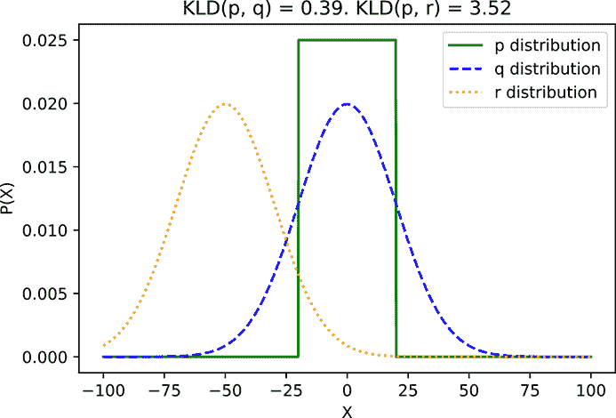

(b) *p* ≡ *U*(*a* = −20, *b* = 20), *q* ≡ 𝒩(*μ* = 0, *σ* = 20), *r* ≡ 𝒩(*μ* = −50, *σ* = 20)

图 6.4 示例分布之间的 KLD

同样，


ℍ(*W*|*H* = *F[i]*) 是在 *H* = *F[i]* 且 *i* = 1 或 2 或 3 时 *W* 的熵。那么，给定 *H* 的 *W* 的整体条件熵是什么？即，ℍ(*W*|*H*)？为了计算这个值，我们取条件熵 ℍ(*W*|*H* = *F[i]*) 在所有可能的 *i* 值上的期望值（即，概率加权的平均值；参见方程 5.8)：

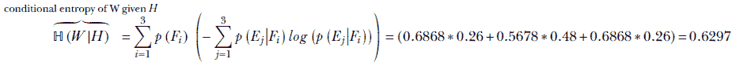

这个想法可以推广。形式上，给定两个可以取值 *x* ∈ *D[x]* 和  ∈ *D[y]* 的随机变量 *X* 和 *Y*，


方程 6.16


方程 6.17

### 6.5.1 条件熵的链式法则

这条规则说明：

ℍ(*X*|*Y*) = ℍ(*X*, *Y*) − ℍ(*Y*)

方程 6.18

这可以从方程 6.17 推导出来。

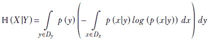

应用贝叶斯定理（方程 6.1），

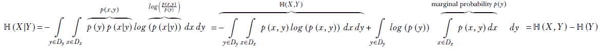

方程 6.19

## 6.6 模型参数估计

假设我们有一组从分布中采样的输入数据点 *X* = {^((1)), ^((2)),⋯, ^((*n*))}。我们将这个集合统称为 *训练数据*。请注意，我们 *不* 假设它是 *标记* 训练数据——我们不知道与输入 ^((*i*)）对应的输出。此外，假设根据我们对问题的了解，我们已经决定使用哪种模型族。当然，仅仅知道家族是不够的；在我们能够使用模型之前，我们需要知道（或估计）模型参数。例如，我们的模型族可能是高斯，𝒩(*x*; 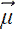, **Σ**)。在我们知道参数  和 Σ 的实际值之前，我们并不完全了解模型，也无法使用它。

我们如何从未标记的训练数据中估计模型参数？这正是本节要讨论的内容。目前，我们正在讨论这个问题，而不涉及任何特定的模型架构，因此让我们用通用符号 *θ* 表示模型参数。例如，当处理高斯模型时，*θ* = {, **Σ**}。

### 6.6.1 概率、证据、后验概率和先验概率

在着手解决参数估计问题之前，了解当前上下文中“似然”、“证据”、“后验概率”和“先验概率”这些术语的含义非常重要。方程 6.20 对其进行了说明。使用贝叶斯定理，


方程 6.20

首先，我们来考察一下似然项。利用数据实例之间相互独立的事实，


现在，*p*(^((*i*))|*θ*) 实际上是我们所选择的分布族的概率密度。例如，如果所讨论的模型是高斯模型，那么给定 *θ* = {, **Σ**}，这将变为


这基本上是高斯概率密度函数的表达式：方程 5.23 的重述（但在方程 5.23 中，我们在符号中省略了“给定 *θ*”的部分，并将 *p*(|*θ*) 简单地表示为 *p*())。因此，我们可以始终使用单个训练数据实例的独立性，从所选模型族的概率密度函数中表达似然。

现在，让我们来考察先验概率，*p*(*θ*)。它通常来自某种物理约束——不涉及输入。一个非常流行的方法是，在其他条件相同的情况下，我们更喜欢幅度较小的参数。按照这个说法，总幅度 ||*θ*||² 越大，先验概率就越低。例如，我们可能使用

*p*(*θ*) ∝ *e*^(−||*θ*||²)

方程 6.21

对于偏好长度（幅度）最小的参数向量，一个间接的依据可以在奥卡姆剃刀原则中找到。它声明，“*Entia non sunt multiplicanda praeter necessitatem*”，这大致可以翻译为“不应该无谓地增加实体。”在机器学习和其他学科中，这通常被解释为“偏好最简明的表示。”

如前所述，我们可以总是表达似然和先验项。使用它们，我们可以制定不同的范例，每个范例都有一个不同的量要优化，以从训练数据中估计未知概率分布参数。这些技术可以广泛地分为以下几类：

+   最大似然参数估计（MLE）

+   最大后验（MAP）参数估计

我们接下来概述它们。您会注意到，在所有方法中，我们通常预先选择一个分布族作为模型，然后通过最大化一个概率或另一个概率来估计参数值。

在本章的后面部分，我们将探讨高斯分布族的特殊情况下的 MLE。接下来，我们将探讨高斯混合模型中的 MLE。稍后，我们将探讨证据最大化：我们将在变分自编码器的背景下讨论它。

对数似然技巧

如果我们选择一个概率密度函数为指数分布的分布族（最明显的例子是高斯分布），我们通常不是最大化似然函数，而是最大化其对数，也就是所谓的*对数似然*。我们可以这样做，因为任何最大化一个量也会最大化它的对数，反之亦然。但是，对数在指数概率函数的情况下简化了表达式。如果我们注意到这一点，这一点就会变得明显：

*log*(*e*^x) = *x*

*log*(Π *e*^(*x*^((*i*)))) = Σ *x*^((*i*))

### 6.6.2 最大似然参数估计（MLE）

在参数的最大似然估计（MLE）中，我们问，“什么参数值将最大化训练数据实例的联合似然？”在这个背景下，记住似然是在给定特定参数值的情况下，一个数据实例发生的概率（方程 6.20）。用数学表达式来说，

MLE 估计什么值的*θ*将最大化*p*(*X*|*θ*)。几何上的思维图如下：我们想要估计模型概率分布中的未知参数，使得如果我们从这个分布中抽取许多样本，样本点云将主要与训练数据重叠。

通常我们使用对数似然技巧，最大化对数似然而不是实际似然。

对于某些模型，例如高斯模型，这个最大化问题可以通过解析方法解决，并得到闭式解（如第 6.8 节所示）。对于其他模型，例如高斯混合模型（GMMs），最大化问题没有闭式解，我们寻求迭代解（如第 6.9.4 节所示）。

### 6.6.3 最大后验（MAP）参数估计和正则化

我们不是询问什么参数值最大化了训练数据实例发生的概率，而是可以问，“给定训练数据，最可能的参数值是什么？”用数学表达式表示，在 MAP 中，我们直接估计最大化*p*(*θ*|*X*)的*θ*。使用公式 6.20，


公式 6.22

由于分母与*θ*无关，相对于*θ*最大化分子最大化了分数。因此

在 MAP 参数估计中，我们寻找最大化*p*(*X*|*θ*)*p*(*θ*)的参数*θ*。

+   第一个因素，*p*(*X*|*θ*)，是我们 MLE 中优化的内容，它来自模型定义（如多元高斯模型的公式 5.23）。

+   第二个因素，*p*(*θ*)，是先验项，它通常激励优化系统选择具有预定义属性（如较小的参数幅度）的解，公式 6.21。

以这种方式看，MAP 估计相当于**带有正则化的最大似然（MLE）参数估计**。正则化是优化中常用的一种技术。在正则化优化中，我们在要最大化或最小化的表达式中添加一个项。这个项有效地激励系统从可能的解集中选择未知参数幅度最小的解。很容易看出，MAP 估计本质上是在 MLE 之上施加先验概率项。这个额外的项充当正则化器，激励系统选择幅度最低的参数，同时仍然试图最大化训练数据的似然。

公式 6.22 可以另一种方式来解释。当我们没有训练数据时，我们所能做的就是根据我们对系统的先验信念来估计参数：先验项*p*(*θ*)。当训练数据集*X*到达时，它通过似然项*p*(*X*|*θ*)影响系统。随着越来越多的训练数据到来，先验项（其幅度不随训练数据变化）的影响力越来越小，后验概率*p*(*θ*|*X*)越来越受似然的影响。

## 6.7 隐变量和证据最大化

假设我们有一个种群（例如，我们最喜欢的城镇 Statsville 的成年居民）的高度和体重数据。单个数据实例看起来是这样的：

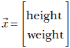

虽然数据没有明确标记或分类，但我们知道数据点可以被聚类成两个不同的类别，*男性* 和 *女性*。可以合理地预期，每个类别的分布比整体分布简单得多。例如，在这里，男性和女性的分布可能是单独的高斯分布（可能，女性的平均值将出现在更矮和更轻的身高和体重值）。组合分布不符合我们之前讨论过的任何分布（稍后我们将看到它是一个高斯混合分布）。

我们将更详细地探讨这些情况与高斯混合模型和变分自编码器的关系。在这里，我们只指出，在这些情况下，引入一个用于类别的变量通常是有益的，比如 *Z*。在这个例子中，*Z* 是离散的：它可以取两个值之一，*男性* 或 *女性*。然后我们可以将整体分布建模为简单分布的组合，每个对应于 *Z* 的一个特定值。

这样的变量 *Z*，它们不是观察数据 *X* 的组成部分，而是为了便于建模而引入的，被称为 *潜在* 或 *隐藏* 变量/参数。潜在变量通过通常的贝叶斯表达式与观察变量相连接：

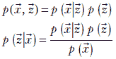

我们如何估计 *Z* 的分布？一种方法是可以问，“如果我们从这个分布中抽取随机样本，那么隐藏变量的分布是什么，会最大化返回这些特定训练数据点的概率？” 这种方法的哲学依据如下：我们假设训练数据点相当典型，在未知数据分布中出现的概率很高。因此，我们试图找到一个分布，使得训练数据点将具有最高的概率。

从几何学的角度来看，每个数据点（向量）可以看作是在某个 *d*-维空间中的一个点，其中 *d* 是向量 *[i]* 的元素数量。训练数据点通常占据该空间内的一个区域。我们正在寻找一个质量大部分与训练数据区域对齐的分布。换句话说，与训练数据点相关的概率尽可能高——样本分布云与训练数据云大部分重叠。

用数学表达，我们想要识别 *p*(|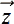) 和 *p*()，它们最大化了数量


方程式 6.23

如同往常，我们从所选模型家族的 PDF 中得到*p*(^((*i*))|)，并通过某些物理约束得到*p*()。

## 6.8 高斯分布的最大似然参数估计

我们用一个一维例子来看这个问题，但推导出的结果也适用于高维情况。假设我们正在尝试预测一个成年 Statsville 居民的性别，给定该居民的身高位于指定范围[*a*, *b*]。为此，我们收集了一组成年*女性*Statsville 居民的身高样本。这些身高样本构成了我们的训练数据。让我们用*x*^((1)), *x*^((2)), ⋯, *x*^((*n*))来表示它们。根据物理考虑，我们预计成年 Statsville 女性的身高分布是一个具有未知均值和方差的高斯分布。我们的目标是通过对训练数据进行最大似然估计（MLE）来确定它们，这有效地估计了一个样本云与训练数据点分布最大匹配的分布。

让我们用*μ*和*σ*表示分布的（尚未知的）均值和方差。然后，根据方程 5.22，我们得到

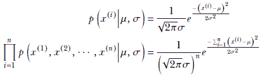

使用对数似然技巧，


要使相对于*μ*最大化，我们求解

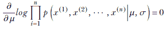

或者

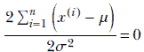

或者

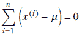

最后，我们得到一个关于训练数据的未知*μ*的闭式表达式：

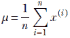

同样，要使相对于*σ*最大化，我们求解

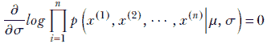

或者


或者

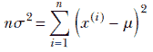

最后，我们得到一个关于训练数据的未知*σ*的闭式表达式：


因此，我们可以看到，对于一个高斯分布，最大似然解与训练数据的样本均值和方差相一致。一旦我们得到了均值和标准差，我们可以通过以下方程计算一个女性居民的身高属于指定范围[*a*, *b*]的概率：

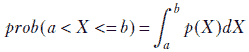

方程式 6.24

在多维情况下：

给定一个训练数据集，{^((1)), ^((2)),⋯, ^((*n*))}，最佳拟合高斯分布的均值


方程式 6.25

以及协方差矩阵

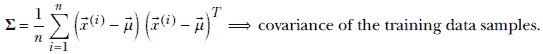

方程式 6.26

我们在本节开始时提出了估计成年 Statsville 居民为女性的概率问题，前提是他们的身高在指定的范围 [*a*, *b*] 内，当我们提供成年 Statsville 女性居民的 *n* 个身高值训练数据集时。现在让我们重新审视这个问题。使用（标量形式的）方程 6.25 和 6.26，我们可以估计 *μ* 和 *σ*，从而定义一个高斯概率分布

*p*(*x*) = 𝒩(*x*; *μ*, *σ*)

使用这个方法，给定任何身高 *x*，我们可以计算居民为女性的概率 *p*(*x*)。让我们用 PyTorch 来看看这个例子。

### 6.8.1 Python PyTorch 代码用于最大似然估计

假设我们假设 Statsville 成年女性的身高值遵循高斯分布。如果我们知道这个高斯分布的参数（*μ* 和 *σ*），我们就完全知道了高斯分布。这使我们能够估计许多有趣的事情：例如，成年 Statsville 居民的预期身高，或者成年 Statsville 居民的身高在某个范围（如 160 至 170 厘米之间）的概率。问题是，在典型的现实情况下，我们不知道参数 *μ* 厘米和 *σ*。我们所有的是成年 Statsville 女性居民的身高值的大型数据集 *X*——训练数据。我们必须使用这些数据来估计未知的参数 *μ* 厘米和 *σ*。一旦我们有了这些，我们就有了从其中可以预测感兴趣事件概率的估计分布（即模型）。

正如我们在 6.6.2 节中看到的，MLE 是一种技术，当已知分布所属的家族但不知道参数的确切值时，用于从给定的训练数据中估计参数。列表 6.4 展示了 PyTorch 对高斯家族的 MLE 实现。

注意：使用 MLE 和 MAP 估计模型参数的完整代码，可通过 Jupyter Notebook 执行，可在 [`mng.bz/9Mv7`](http://mng.bz/9Mv7) 找到。

列表 6.4 高斯的最大似然估计

```py
sample_mean = X.mean()                          ①

sample_std = X.std()

gaussian_mle = Normal(sample_mean, sample_std)  ②

a, b = torch.Tensor([160]), torch.Tensor([170]) ③

prob = gaussian_mle.cdf(b) - gaussian_mle.cdf(a)
```

① 估计高斯 MLE 参数  和 Σ。它们等于训练数据的样本均值和样本协方差。参见方程 6.25 和 6.26。

② 定义具有估计参数的高斯分布

③ 一旦估计出高斯分布，我们就可以用它来预测概率。

### 6.8.2 使用梯度下降的 Python PyTorch 代码进行最大似然估计

在列表 6.4 中，我们使用闭式解计算了最大似然估计。现在，让我们尝试使用不同的方法来计算最大似然估计：梯度下降。在实际场景中，我们不会使用梯度下降来计算最大似然估计，因为闭式解是可用的。然而，我们在这里讨论这种方法，以突出使用梯度下降的一些挑战以及如何通过最大后验估计来解决这些挑战。

我们的目标是使用梯度下降来最大化似然函数。这也可以被视为最小化负对数似然函数。我们选择使用似然函数的对数，因为这会导致计算更简单，而不会损失泛化能力。（如果你想要快速复习梯度下降，请参阅第 3.5 节。）以下为负对数似然方程：

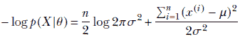

方程式 6.27

列表 6.5 和 6.6 展示了 PyTorch 代码的最小化过程。

列表 6.5 训练数据的 Gaussian 负对数似然

```py
def neg_log_likelihood(X, mu, sigma):                      ①
    N = X.shape[0]
    X_minus_mu = torch.sub(X, mu)
    t1 = torch.mul(0.5 * N,
               torch.log(2 * np.pi * torch.pow(sigma, 2))) ②

    t2 = torch.div(torch.matmul(X_minus_mu.T, X_minus_mu),
                 2 * torch.pow(sigma, 2))                  ③

    return t1 + t2                                         ④
```

① 方程式 6.27

② *n*/2 *log* 2 *πσ*²

③ (Σ[*i* = 1]*^n* (*x*[i] – *μ*)²)/(2*σ*²)

④ 注意所有训练数据 *X* 都在一个操作中压缩。这种向量操作在 PyTorch 中是并行且非常高效的。

列表 6.6 通过梯度下降最小化 MLE 损失

```py
def minimize(X, mu, sigma, loss_fn, num_iters=100, lr = 0.001): ①

    ②
   for i in range(num_iters):

        loss = loss_fn(X, mu, sigma)                            ③

        loss.backward()                                         ④

        mu.data -= lr * mu.grad
        sigma.data -= lr * sigma.grad                           ⑤

        mu.grad.data.zero_()
        sigma.grad.data.zero_()                                 ⑥

mu = Variable(torch.Tensor([5]).type(dtype), requires_grad=True)
sigma = Variable(torch.Tensor([5]).type(dtype), requires_grad=True)

minimize(X, mu, sigma, neg_log_likelihood)
```

① 负对数似然（列表 6.5）

② 迭代训练

③ 计算损失

④ 计算损失相对于 μ 和 σ 的梯度。PyTorch 将梯度存储在 μ.grad 和 σ.grad 中。

⑤ 通过学习速率和更新参数来缩放梯度

⑥ 更新后重置梯度为零

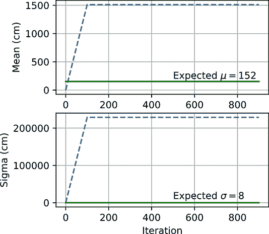

(a) 最大似然估计爆炸：*μ[init]* = 1，*σ[init]* = 1。

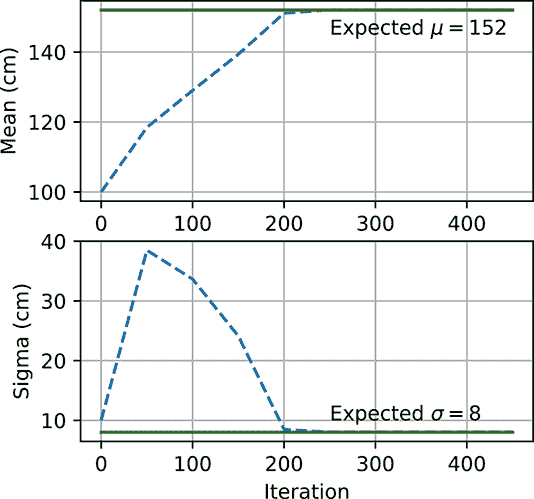

(b) 最大似然估计收敛：*μ[init]* = 100，*σ[init]* = 10。


(c) 最大后验估计收敛：*μ[init]* = 1，*σ[init]* = 1。

图 6.5 使用最大似然估计和最大后验估计进行高斯参数估计。在图 6.5a 中，最大似然估计爆炸，因为 *μ* 和 *σ* 的初始化远离 *μ[expected]* 和 *σ[expected]*。然而，在图 6.5b 中，最大似然估计收敛，因为 *μ* 和 *σ* 的初始化接近 *μ[expected]* 和 *σ[expected]*。图 6.5c 展示了对于最大后验估计，*μ* 和 *σ* 即使初始化远离 *μ[expected]* 和 *σ[expected]*，也能收敛到 *μ*.*[expected]* 和 *σ[expected]*。

图 6.5 展示了 *μ* 和 *σ* 如何随着梯度下降的每次迭代而变化。我们期望 *μ* 和 *σ* 分别接近 *μ[expected]* 和 *σ[expected]*。然而，当 *μ* 和 *σ* 从远离 *μ[expected]* 和 *σ[expected]* 的状态开始，如图 6.5a) 所示时，它们不会收敛到期望值，反而变成了非常大的数字。另一方面，当它们被实例化为更接近 *μ[expected]* 和 *σ[expected]* 的值，如图 6.5b) 所示时，它们会收敛到期望值。最大似然估计（MLE）对初始值非常敏感，并且没有机制来防止参数爆炸。这就是为什么 MAP 估计更受欢迎。先验 *p*(*θ*) 作为正则化项，防止参数变得过大。图 6.5c 展示了即使 *μ* 和 *σ* 从远离的位置开始，它们如何使用 MAP 收敛到期望值。

MAP 损失函数如下。请注意，它与负对数似然函数相同，但增加了两个额外的项—*μ*² 和 *σ*²—作为正则化项：


方程 6.28

列表 6.7 带正则化的高斯负对数似然

```py
def neg_log_likelihood_reg(X, mu, sigma, k=0.2):               ①
    N = X.shape[0]
    X_minus_mu = torch.sub(X, mu)
    t1 = torch.mul(0.5 * N,
                   torch.log(2 * np.pi * torch.pow(sigma, 2))) ②

    t2 = torch.div(torch.matmul(X_minus_mu.T, X_minus_mu),
                   2 * torch.pow(sigma, 2))                     ③

    loss_likelihood = t1 + t2                                   ④

    loss_reg = k * (torch.pow(mu, 2) + torch.pow(sigma, 2))     ⑤

    return loss_likelihood + loss_reg                           ⑥
```

① 方程 6.28

② *n*/2 *log* 2 *πσ*²

③ (Σ[*i* = 1]*^n* (*x*[i] – *μ*)²)/(2*σ*²)

④ 负对数似然

⑤ 正则化

⑥ 注意所有训练数据 *X* 都在一个操作中压缩。这种向量操作在 PyTorch 中是并行且非常高效的。

## 6.9 高斯混合模型

在许多现实生活中的问题中，我们在第五章中学到的简单单峰（单峰值）概率分布无法模拟数据的真实潜在分布。例如，考虑这样一种情况，我们被给出了许多成年 Statsville 居民的身高。假设 Statsville 中有两个成年类别：男性和女性。我们拥有的身高数据是*未标记的*，这意味着我们不知道给定的身高数据实例是否与男性或女性相关联。因此，数据是一维的，有两个类别。图 6.6 描述了这种情况。我们在第五章中讨论的简单概率分布都无法拟合图 6.6。但是图 6.6a 中的两个部分钟形表明，我们应该能够混合一对高斯分布（每个都像钟形）来模拟这种分布。这也与我们知道分布代表的是两个类别而不是一个类别，每个类别都可以合理地单独用高斯分布来表示的知识相符。点云也表明有两个独立的点簇。虽然单个高斯分布不起作用，但两个独立的单维高斯分布的组合可以（并且，我们将很快看到，将会）起作用。

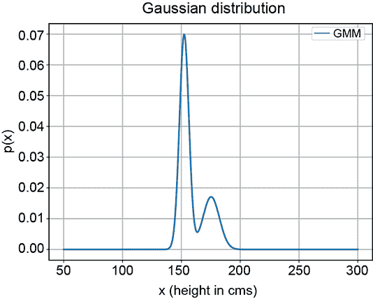

(a) PDF


(b) 样本点分布

图 6.6 Statsville 成年男性和女性居民一维身高数据的概率密度函数（PDF）和样本点分布

现在我们来讨论一个稍微复杂一些的问题，其中数据是二维的，并且有三个类别。这里我们给出了 Statsville 居民三个类别的体重和身高：成年女性、成年男性和儿童。再次强调，数据是*未标记的*，这意味着我们不知道给定的（身高，体重）数据实例是否与男性、女性或儿童相关联。这如图 6.7 所示。再次强调，我们在第五章中研究的简单概率分布都无法拟合这种情况。但是 PDF 显示了三个钟形峰值，点云显示了三个簇，而问题的物理性质表明有三个独立的类别，每个类别都可以合理地用高斯分布来表示。虽然单个高斯分布不起作用，但三个独立的二维高斯分布的组合可以（并且，我们将很快看到，将会）起作用。

*高斯混合模型（GMM）是特定数量高斯成分的加权组合*。


(a) PDF

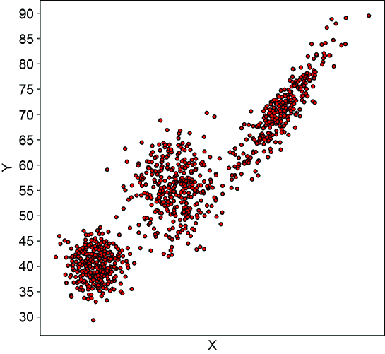

(b) 样本点分布

图 6.7 Statsville 儿童、成年男性和成年女性二维（身高，体重）数据的概率密度函数（PDF）和样本点分布

例如，在我们的第一个问题中，只有一个维度和两个类别，我们选择两个一维高斯分布的混合。对于第二个问题，我们采用三个二维高斯分布的混合。每个单独的高斯组件对应一个特定的类别。

### 6.9.1 GMM 的概率密度函数

形式上，

GMM 的 PDF 为

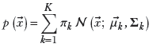

方程 6.29

其中 *π[k]* 是第 *k* 个高斯组件的权重，满足


*K* 是类别数或高斯组件数，方程 5.23 中定义的 𝒩(; *[k]*, **Σ***[k]*) 是第 *k* 个高斯组件的概率密度函数（PDF）。这样的高斯混合模型模拟了一个 *K* 峰 PDF 或等价地，一个 *K* 聚类样本点云。

例如，图 6.6 中所示的 PDF 和样本点云对应以下高斯混合模型：

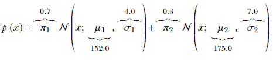

图 6.7 中所示的二维三类别问题、PDF 和样本点云对应以下高斯混合模型：

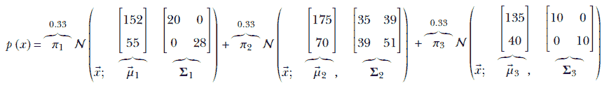

GMM 的 PDF 和样本点分布取决于 *π[k]*、*μ[k]*、**Σ***[k]* 和 *K* 的值。特别是，*K* 影响 PDF 中的峰值数量（尽管如果两个峰值非常接近，有时它们会合并）。它还影响样本点云中的聚类数量（再次，如果两个聚类太接近，它们可能不会在视觉上明显区分）。*π[k]* 调节山丘的相对高度。*μ[k]* 和 **Σ***[k]* 影响 PDF 中的单个山丘以及样本点云中的单个聚类。具体来说，*μ[k]* 调节 PDF 中第 *k* 个峰的位置和样本点云中第 *k* 个聚类的质心。**Σ***[k]* 调节第 *k* 个单个山丘和样本点云中第 *k* 个聚类的形状。图 6.8、6.9、6.10 和 6.11 展示了一些具有这些参数不同值的示例 GMM。

图 6.8 展示了一对高斯分布以及作为组件的各种高斯混合模型（GMM），参数值各不相同。图 6.9 描述了具有各种 *π[k]* 的高斯混合模型。图 6.10 展示了具有非圆形基（非对称 Σ）和不同 *μ* 的高斯混合模型。

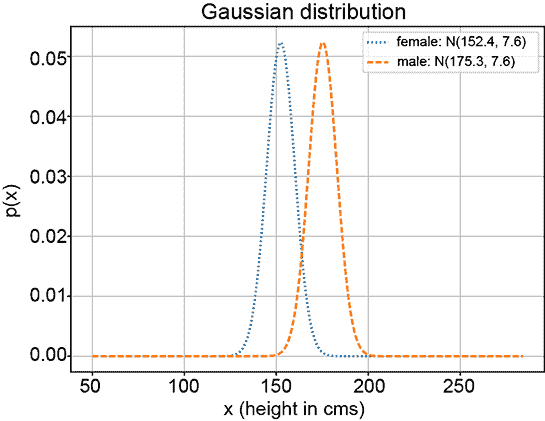

(a) 高斯组件 *μ*[1] = 152, *μ*[2] = 175, *σ*[1] = *σ*[2] = 9


(b) *π*[1] = 0.5, *π*[2] = 0.5 的高斯混合模型

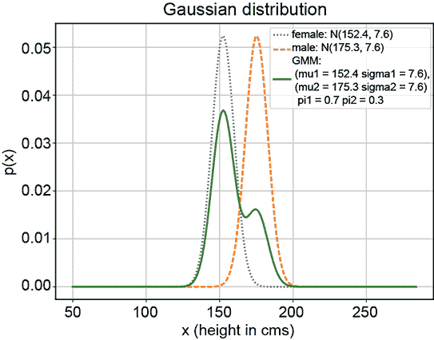

(c) *π*[1] = 0.7, *π*[2] = 0.3 的高斯混合模型

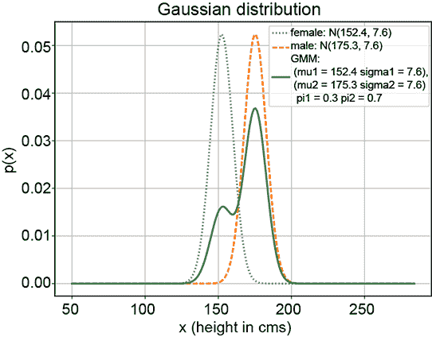

(d) GMM 中*π*[1] = 0.3, *π*[2] = 0.7

图 6.8 各种 GMMs（实线）具有相同的高斯组件（分别用虚线和虚线表示），但*π*[1]和*π*[2]的值不同

另一种可视化高斯混合模型（GMMs）的方法是通过样本点分布。图 6.11 展示了从一对二维高斯分布中抽取的样本点，以及从具有这些高斯分布作为组件且具有不同混合选择概率的高斯混合模型中抽取的点。


(a) *π*[1] = 0.5, *π*[2] = 0.5


(b) *π*[1] = 0.4, *π*[2] = 0.6


(c) *π*[1] = 0.7, *π*[2] = 0.3

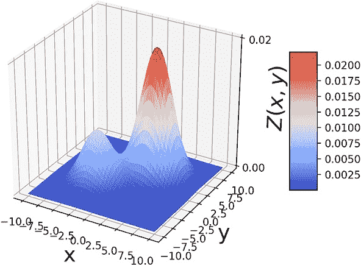

(d) *π*[1] = 0.3, *π*[2] = 0.7

图 6.9 具有圆形基的两维 GMMs，


注意山丘的相对高度取决于*π*。


(a) 


(b) 

图 6.10 具有椭圆形基的两维 GMMs，*π*[1] = 0.3, *π*[2] = 0.7。注意山丘基部的形状取决于Σ，以及山丘位置取决于s。


(a)


(b)

图 6.11 (a) . (b) 从具有与(a)中相同的三个高斯组件和*π*[1] = *π*[2] = 0.4, *π*[3] = 0.2 的 GMM 中抽取的 1,000 个随机样本。注意 GMM 样本分布形状如何模仿组件高斯分布的合并样本分布形状。

可以证明方程 6.29 是一个合适的概率：即在所有可能的输入空间（*d*-维空间中所有可能的的值）上求和为 1。以下是证明概要：


### 6.9.2 用于类别选择的潜在变量

让我们更详细地讨论 GMMs。特别是，我们查看方程 6.29 中各种术语的物理意义。

在深入探讨之前，让我们引入一个辅助随机变量*Z*，它实际上是一个*类别选择器*。在方程 6.29 的上下文中，*Z*可以在[1⋯*K*]范围内取离散值。因此，它遵循分类分布（参见第 5.9.6 节）。从物理上讲，*Z* = *k*意味着已经选择了第*k*个类别——即高斯混合模型的第*k*个组件。

注意：如往常一样，我们用大写字母表示随机变量，用小写字母表示它在特定实例中取的具体值。

例如，在图 6.6 中显示的两个类别问题中，*Z* 可以取两个值之一：1（表示成年女性）或 2（表示成年男性）。在图 6.7 中显示的三个类别问题中，*Z* 可以取三个值之一：1（成年女性）、2（成年男性）或 3（儿童）。*Z* 被称为 *潜在（隐藏）随机变量*，因为其值不能直接观察到。这与输入随机变量  的值是明确观察到的形成对比。你可能会将 *Z* 识别为 GMM 中的潜在变量（潜在变量在 6.7 节中介绍）。

考虑联合概率 *p*(*X* = , *Z* = *k*), 我们有时非正式地表示为 *p*(, *k*). 这是输入变量  与类别 *k* 同时发生的概率。使用贝叶斯定理，

*p*(, *k*) = *p*(|*k*)*p*(*k*)

条件概率项 *p*(|*k*) 是在选择了第 *k* 类时的  的概率。这意味着它是第 *k* 个高斯成分的概率密度函数，根据假设这是一个高斯分布。因此，使用方程 5.23,

*p*(|*k*) = 𝒩(; *[k]*, **Σ***[k]*) *k* ∈ [1, *K*]

另一方面，*p*(*Z* = *k*), 我们有时非正式地称之为 *p*(*k*)，是输入属于某一类别的先验概率（即，不考虑输入）。让我们如下表示它：

*p*(*k*) = *π^k*, ∀*k* ∈ {1, *K*}

这通常被建模为属于类别 *k* 的训练数据点的 *分数*：


其中 *N[k]* 是属于类别 *k* 的训练数据实例的数量，而 *N* 是训练数据实例的总数。

从这个方程中，我们得到

*p*(, *k*) = *p*(*k*)*p*(|*k*) = *π^k* 𝒩(; *[k]*, **Σ***[k]*) *k* ∈ [1, *K*]

从方程 5.5 中，我们得到边缘概率 *p*(*x*)


这与方程 6.29 相同。

这导致以下物理解释：

+   GMM 可以被视为 *K* 个高斯成分的加权求和。方程 6.29 描述了整体 GMM 的概率密度函数。

+   权重**π[k]**是组件选择概率。具体来说，**π[k]**可以解释为选择第 k 个子类的先验概率*p*(*Z* = *k*)，也称为*p*(*k*)，即第 k 个子类的比例——模型化为属于第 k 个子类的人口比例。**π[k]**是在具有*K*个类别的分类分布中的概率。**π[k]**的总和为 1。从高斯混合模型（GMM）中采样可以看作是两步过程：

    1.  随机选择一个组件。第 k 个组件被选择的概率是**π[k]**。所有**π[k]**的总和为 1，这表示必须选择一个或另一个组件。

    1.  从所选的高斯组件中随机采样。生成向量的概率是𝒩(; *[k]*, **Σ***[k]*)。

+   每个*K*个高斯组件模型一个单独的类别。从几何上讲，这些组件对应于样本点云中的聚类或 GMM 概率密度函数（PDF）中的峰值。

+   第 k 个高斯组件，𝒩(; *[k]*, **Σ***[k]*)，可以解释为条件概率，*p*(|*k*)。这是似然——在选择了第 k 个子类的情况下，数据值发生的概率。

+   乘积**π[k]** 𝒩(; *[k]*, **Σ***[k]*)然后代表联合概率*p*(, *k*) = *p*(|*k*) *p*(*k*)。

+   所有联合子类概率之和是数据值的边缘概率*p*()。

列表 6.8 高斯混合模型分布

```py
from torch.distributions.mixture_same_family import MixtureSameFamily ①

pi = Categorical(torch.tensor([0.4, 0.4, 0.2]))                       ②

mu = torch.tensor([[175.0, 70.0], [152.0, 55.0], [135.0, 40.0]])      ③

sigma = torch.tensor([[[30.0, 20.0], [20.0, 30.0]],                   ④
                     [[50.0, 0.0], [0.0, 10.0]],
                     [[20.0, 0.0], [0.0, 20.0]]])

gaussian_components = MultivariateNormal(mu, sigma)                   ⑤

gmm = MixtureSameFamily(pi, gaussian_components)                      ⑥
```

① Pytorch 支持同一家族（此处为高斯）的分布混合

② 三种类别（男性、女性、儿童）的先验概率：分类分布

③ 三种类别（男性、女性、儿童）的平均身高和体重

④ 男性、女性、儿童三种类别的协方差矩阵

⑤ 创建组件高斯分布

⑥ 创建高斯混合模型（GMM）

### 6.9.3 通过 GMM 进行分类

涉及 GMM 的典型实际问题如下。提供一组未标记的输入数据 *X*（训练数据）。重要的是要注意，这是一个无监督的机器学习——训练数据没有附带已知的输出类别。问题的物理性质表明数据中的子类（用索引 [1⋯*K*] 表示）。目标是分类任何任意的输入 ：也就是说，将其映射到 *K* 个类别中的一个。为此，我们必须拟合一个 GMM（即推导出 *π[k]*, *[k]*, **Σ***[k]* 对于所有 *k* ∈ [1 ⋯ *K*]）的值）。给定一个任意的 ，我们计算所有类别的 *p*(*k*|)。产生 *p*(*k*|) 最大值的 *k* 是与  对应的类别。我们是怎样计算 *p*(*k*|) 的呢？

使用贝叶斯定理，


方程式 6.30

如果我们知道所有的 GMM 参数，评估方程 6.30 是直接的。我们通过将输入  分配给产生最高 *p*(*Z* = *k*|*X* = *x*) 值的簇 *k* 来对输入进行分类。从几何上看，这是将输入分配给具有“最接近”均值的簇——距离由相应分布的方差进行归一化。基本上，我们是在测量与均值的距离，但在高方差簇中，我们对与均值的距离更加宽容。这从直觉上是有意义的：如果一个簇分布广泛（即高方差），那么相对于簇均值较远的点可以被认为是属于该簇的。另一方面，与紧密排列的簇的均值相同距离的点可能被认为是簇外部的。

### 6.9.4 GMM 参数的最大似然估计（GMM 适配）

GMM（高斯混合模型）完全由其参数集 *θ* = {*π^k*, *[k]*, **Σ***[k]* ∀*k *∈ [1 ⋯ *K*]} 描述。但我们是怎样估计这些参数值的呢？在典型的现实情况下，这些参数并没有给我们。我们只有一组观察到的未标记的训练数据点 *X* = {^((*i*))}，例如 Statsville 居民的体重和身高值。

从几何学的角度来看，训练数据集中的每个数据实例对应于多维特征空间中的一个单独点。训练数据集是一个自然聚集成高斯子云的点云（否则，我们就不应该尝试 GMMs）。我们的 GMM 模仿这个数据集应该有与数据中自然聚类的数量一样多的组件。参数值*π[k]*，*[k]*，**Σ***[k]*对于*k * ∈  [1 ⋯ *K*]应该被估计，使得 GMM 的样本点云尽可能多地与训练数据点云重叠。这正是本节我们试图解决的问题的基本问题。

注意：我们不估计*K*，即类别数量；而是使用一个固定的*K*值，通常从问题的物理条件中估计得出。例如，在涉及男人、女人和孩子的问题上，很明显*K* = 3。

在第 6.8 节中，我们对一个简单的高斯分布进行了最大似然估计（MLE）。我们计算了给定高斯概率分布的所有训练数据的联合对数似然表达式。然后，我们计算该表达式相对于参数的梯度，并将其等于零。我们能够解这个方程，从而推导出参数的*封闭形式*解，和Σ（方程 6.25 和 6.26）。这意味着我们将方程简化为一种形式，其中未知（需要求解）的量单独出现在左边，而右边只有已知实体。

不幸的是，在使用 GMMs 时，将对数似然梯度的值设为零会导致一个没有封闭形式解的方程。因此，我们不能将方程简化为未知量*π[k]*s，*μ[k]*s，和**Σ***[k]*单独出现在左边，而只有已知实体(*[i]*s)出现在右边的形式。因此，我们必须求助于迭代近似。我们将通过将对数似然梯度的值设为零得到的方程重写，使得未知量*μ*s 和*σ*s 单独出现在右边。它看起来像这样

*π^k* = *f*1

*[k]* = *f*2

**Σ***[k]* = *f*3

其中*f*[1]，*f*[2]，*f*[3]是一些函数，其确切性质在目前并不重要。请注意，右边也包含未知量：*θ*包含*π[k]*s，*μ[k]*s，和**Σ***[k]*。我们无法直接求解这样的方程，但我们可以使用*迭代松弛*，其工作原理大致如下：

1.  从随机的*π[k]*s，*[k]*s，和**Σ***[k]*s 值开始。

1.  通过将*π[k]*s，*[k]*s，和**Σ***[k]*s 的当前值代入函数*f*[1]，*f*[2]，和*f*[3]来评估右边。

1.  使用步骤 2 中估计的值来设置新的*π[k]*s、*[k]*s 和**Σ***[k]*s 的值。

1.  重复步骤 1-3，直到参数值不再明显变化。

实际函数*f*[1]、*f*[2]、*f*[3]在方程 6.36、6.37、6.38 中给出。随着迭代的进行，*π[k]*s、*[k]*s 和**Σ***[k]*s 的值开始收敛到它们的真实值。这不是幸运的巧合。如果我们遵循算法 6.3，可以证明每一次迭代都会改善近似，即使改善的量非常小。最终，我们达到一个点，此时近似不再明显改善。这被称为*固定点*，我们应该停止迭代并宣布当前值为最终值。

图 6.12 展示了迭代 GMM 拟合算法的进展。图 6.12a 展示了采样训练数据分布。图 6.12b 展示了初始拟合的 GMM：参数基本上是随机的，GMM 看起来与目标训练数据分布毫不相似。它缓慢地改进，直到迭代 15 次，它紧密地匹配了目标分布 6.12d)。


(a) 训练数据点云（拟合的目标）


(b) 第 0 步拟合的 GMM 样本点云


(c) 第 5 步拟合的 GMM 样本点云


(d) 第 15 步拟合的 GMM 样本点云。它几乎与目标匹配。

图 6.12 GMM 参数最大似然估计的进展

现在我们来讨论细节。我们*已经知道*观察到的数据集*X*。哪个参数集*θ*将最大化给定参数集的这些数据点的条件概率*p*(*X*|*θ*)？换句话说，哪些模型参数将最大化训练数据的整体似然？那些将是我们对未知模型参数的最佳猜测。这是我们在第 6.6.2 节中遇到的 MLE。

设{^((1)), ^((*n*)),⋯^((*n*))}为观察数据点的集合，即训练数据。从方程 6.29，


从此以后，为了简便起见，我们省略了“给定 *θ*”的部分，并将 *p*(^((*i*))|*θ*) 简单地称为 *p*(^((*i*))). 如同往常，我们不是直接最大化似然，而是最大化其对数，即 *log-likelihood*。这将产生与直接最大化似然相同的参数。

由于 *x*^((*i*))s 是独立的，根据方程 5.4，它们的联合概率是

*p*(^((1)))*p*(^((2)))⋯*p*(^((*n*)))

相应的对数联合概率是


方程 6.31

在这一点上，我们开始看到 GMMs 的一个特殊困难。我们有一个和的对数，这不是一个很容易处理的表达式；乘积的对数则更容易处理。但让我们继续前进。

为了识别将最大化对数联合概率的参数 ¹, Σ[1], ², Σ[2], ⋯，我们取对数联合概率对这些参数的梯度，将它们设为零，并求解参数值（如第 3.3.1 节所述）。在这里，我们以 [1] 为例展示这个过程：

∇![[1]]*log*(*p*(^((1)))*p*(^((2)))⋯*p*(^((*n*)))) = 0

由于乘积的对数是各个对数的和，我们得到


将方程 6.29 应用于我们的最大化问题，我们得到


由于梯度是一个线性算子，我们可以将其移到求和符号内部：


由于 *d*/*dx* log (*f*(*x*)) = 1/*f*(*x*) *df*/*dx*，我们得到


现在，如果 *x*[1] 和 *x*[2] 是独立变量，则 *dx*[2]/*dx*[1] = 0。因此，


只有与 *k* = 1 对应的单个项在分子中的微分（梯度）过程中幸存。所以，


现在 *d*/*dx* *e*^(–(*x – μ*)²) = –2(*x – μ*) *e*^(–(*x – μ*)²)，在多维情况下，


将方程 5.23 带入我们的最大化问题，我们得到


此外，通过一点努力，你可以证明关于二次型梯度的以下内容：

∇*^TA*) = *A*

方程 6.32

将方程 6.32 应用于我们的问题，我们得到


将等式两边乘以常数 **Σ**[1]，我们得到


代入


方程式 6.33

我们得到


这个表达式在 *γ*[*i*1] 中也有 *μ*[1]。在方程的左侧不可能单独提取 *μ*[1]。换句话说，我们无法为 *μ*[1] 创建一个 *封闭形式* 的解。因此，我们必须迭代求解。

我们可以将前面的方程重写为


其中


方程式 6.34

以类似的方式，我们可以推导出 *π*[1] 和 **Σ**[1] 的相应表达式。让我们收集更新 GMM 参数的所有方程：


方程式 6.35


方程式 6.36


方程式 6.37


方程式 6.38

方程式 6.36，6.37，和 6.38 提供了我们在本节开头关于迭代松弛的上下文中看到的函数 *f*[1]，*f*[2]，和 *f*[3] 的定义。我们可以以类似的方式处理 *k* = 2⋯*K*。

*γ[ik]* 的物理意义

在计算对数似然梯度时，我们遇到了实体 *γ[ik]*。它作为乘性权重出现在计算方程 6.37 和 6.38 中 *μ[k]* 和 *Σ[k]* 的最终迭代表达式中。它不是一个任意实体。通过比较方程 6.33 和 6.30，我们可以看到

*γ[ik]* = *p*(*k*|^((*i*)))

换句话说，量 *γ[ik]* 实际上是后验概率：给定第 *i* 个数据点的类别 *k* 的条件概率。

这为我们提供了观察方程 6.35，6.36，6.37，和 6.38 的新方法：

+   方程式 6.35 实质上根据当前参数值将 *N*[1] 赋值为集中在类别 1 中的概率质量。

+   方程式 6.36 将 *π*[1] 赋值为根据当前参数值在类别 1 中的分数质量。

+   方程式 6.37 将 *μ*[1] 赋值为所有训练数据点的质心。每个数据点的贡献都通过后验概率加权，该概率是根据当前参数值计算出的该数据点属于类别 1 的概率。

+   方程式 6.38 将 **Σ**[1] 赋值为训练数据点的协方差。每个数据点的贡献都通过后验概率加权，该概率是根据当前参数值计算出的该数据点属于类别 1 的概率。

算法 6.3 将方程 6.33，6.36，6.37，和 6.38 结合成一个完整的迭代 MLE GMM 参数的方法。它是一类称为*期望最大化*的通用算法的例子。

算法 6.3 GMM 拟合（从未标记的训练数据中估计 GMM 参数的 MLE）

输入：*X* = ^((1)), ^((2)), … , ^((*n*))

使用随机值初始化参数*Θ* = {*π^k* , *μ[k]* , **Σ***[k]* *k* ∈ [1, *K*]}

⊳ 重复 E 步和 M 步直到似然停止增加

**while** (似然增加) **do**

⊳E 步


⊳M 步


**end** **while**

返回{*x*[1] , *μ*[1], **Σ[1]**, *x*[2], *μ*[2], **Σ[2]** , … , *x[K]*, *μ[K]*, **Σ*[K]***}

注意：完全功能的高斯混合模型代码，可通过 Jupyter Notebook 执行，可在[`mng.bz/j4er`](http://mng.bz/j4er)找到。

列表 6.9 GMM 拟合

```py
while (curr_likelihood - prev_likelihood) < 1e-4:     ①

  # E Step                                            ②

  pi = gmm.mixture_distribution.probs                 ③

  components = gmm.component_distribution             ④

   ⑤
   log_gamma_numerators = components.log_prob(
       X.unsqueeze(1)) + torch.log(pi).repeat(n, 1)   ⑥

   ⑦
   log_gamma_denominators = torch.logsumexp(
       log_gamma_numerators, dim=1, keepdim=True).

   ⑧
   log_gamma = log_gamma_numerators - log_gamma_denominators
   self.gamma = torch.exp(log_gamma)

   # M Step                                           ⑨

   n = X.shape[0]                                     ⑩

   N = torch.sum(gamma, 0)

   pi = N / n                                         ⑪

   mu = ((X.T @ gamma)/N).T                           ⑫

   x_minus_mu = (X.repeat(K, 1, 1) - gmm.component_distribution.unsqueeze(1).
                 repeat(1, n, 1))

   ⑬
   x_minus_mu_squared = x_minus_mu.unsqueeze(3)  @ x_minus_mu.unsqueeze(2)

   ⑭
   sigma = torch.sum(gamma.T.unsqueeze(2).unsqueeze(3) * x_minus_mu_squared,
                     axis=1) / N.unsqueeze(1).unsqueeze(1).repeat(1, d, d)

   prev_likelihood = curr_likelihood

   curr_likelihood = torch.sum(gmm.log_prob(X))       ⑮
```

① 重复直到似然增加可以忽略不计

② 使用当前的*[k]*s 和Σ*[k]*s 计算后验概率*γ[i,k]* = *p*(*Z* = *k*|*X* = *x[i]*)，方程 6.33

③ 维度为[K]的张量，包含所有[k]的*π[k]*值

④ 对于所有*k*，高斯对象𝒩(, *[k]*, Σ*[k]*) 

⑤ 对于所有 i, k，计算*γ[i, k]*分子的对数，方程 6.33

⑥ 在实践中，涉及指数的概率趋近于 0。因此，我们使用对数概率。

⑦ 对于所有 i, k，计算*γ*[*i,* *k*]分母的对数，方程 6.33

⑧ 向量计算[*n* *×* *K*]张量*γ*[*i,* *k*]，方程 6.33

⑨ 使用 E 步得到的*γ*[*i,* *k*] = *p*(*Z* = *k*|*X*)更新所有*k*的*[k]*和Σ[k]，通过方程 6.36，6.37，和 6.38

⑩ 数据点的数量

⑪ 对于所有 k，更新*π[k]*的向量，方程 6.36

⑫ 对于所有 k，[*K* × *d*]张量*[k]*的向量更新，方程 6.37

⑬ 对于所有*l, k*，向量计算(*[i]* – *[k]*) (*[i]* – *[k]*)^T

⑭ 对于所有 k，[*K* × *d* × *d*]张量Σ[k]的向量更新，方程 6.38

⑮ 对数似然，方程 6.31

## 摘要

在本章中，我们探讨了在不确定系统中进行决策的贝叶斯工具。我们讨论了条件概率和贝叶斯定理，它们将条件概率与联合概率和边缘概率联系起来。

+   条件概率是在另一个事件已经发生的情况下，一个事件发生的概率。在机器学习中，我们通常对给定模型预测输入的参数为*θ*时，输入的条件概率*p*(|*θ*)感兴趣。这个条件概率被称为输入的似然。我们还对条件概率*p*(*θ*|)感兴趣，这被称为后验概率。

+   联合概率是一组事件同时发生的概率。如果事件是独立的，联合概率是它们各自概率的乘积。无论事件是否独立，贝叶斯定理都将联合概率和条件概率联系起来。在机器学习中，特别感兴趣的是贝叶斯定理表达式，它将输入和参数的似然、联合和后验概率联系起来：*p*(, *θ*) = *p*(|*θ*)*p*(*θ*) 和 *p*(|*θ*)*p*(*θ*) / *p*()。*p*(|*θ*)是所选分布族的概率分布函数。*p*(*θ*)是我们对系统信念的先验概率，没有数据。一个流行的选择是*p*(*θ*) ∝ *e*^(−||*θ*||²)，这意味着参数的绝对值越大，概率越小，反之亦然。

+   熵模拟了一个系统中的不确定性。所有事件具有或多或少相似概率的系统往往具有高熵。具有特定可能事件子集概率显著高而其他事件概率显著低的系统往往具有低熵。等价地，低熵系统的概率密度函数往往具有高尖峰，它们的样本点云在某些区域有高浓度的点。高熵系统往往具有平坦的概率密度函数和扩散的样本点云。

+   交叉熵使我们能够量化我们的模型与已知真实值之间的好坏。

+   库尔巴克-莱布勒散度为我们提供了两个概率分布之间差异的度量。

+   最大似然估计（MLE）和最大后验估计（MAP）是估计模型参数的两种范式。MLE 最大化*p*(*X*|*θ*)，而 MAP 最大化*p*(*X*|*θ*)*p*(*θ*)。MLE 本质上试图估计概率分布参数，这些参数最大化概率分布样本点云与训练数据点云之间的重叠。MAP 是带有正则化条件的 MLE。正则化条件通过先验概率项*p*(*θ*)注入，它倾向于具有某些属性（如小的参数幅度）的解，这些属性是我们根据经验知识而没有数据相信是真实的。高斯分布的 MLE 有一个封闭形式的解。最佳拟合训练数据的概率分布的均值和方差（在多维情况下为协方差）是训练数据集上的样本均值和样本方差或协方差。

+   在机器学习系统中，潜在变量是辅助变量，它们不能直接观察到，但可以从输入中推导出来。它们有助于表达优化目标或要最小化的损失。

+   高斯混合模型（GMM）是一种无监督概率模型，它适合于训练数据集中具有多个簇的多类数据分布，每个簇对应一个不同的类别。在这里，最大似然估计（MLE）不产生封闭形式的解，而是产生一个迭代解来估计混合权重、均值和方差。
