# 第九章：损失、优化和正则化

本章涵盖了

+   损失函数的几何和代数介绍

+   softmax 的几何直觉

+   包括动量、Nesterov、AdaGrad、Adam 和 SGD 在内的优化技术

+   正则化及其与贝叶斯方法的关系

+   训练过程中的过拟合和 dropout

到现在为止，你应该已经深刻地认识到神经网络本质上是一种函数逼近器。特别是，神经网络分类器在特征空间（每个输入特征组合都是一个特定点的空间）中模拟了类之间的决策边界。监督分类器在这个空间中标记样本训练数据输入，并带有——可能是手动生成的——类标签（真实标签）。训练过程迭代地学习一个函数，这个函数本质上创建了决策边界，将样本训练数据点分离成单个类别。如果训练数据集是可能输入的真实分布的合理代表，那么网络（模型类边界的学到的函数）将以良好的准确性对从未见过的输入进行分类。

当我们选择一个特定的神经网络架构（具有固定的一组层，每个层具有固定的一组具有特定连接的感知器）时，我们本质上冻结了我们用作函数逼近器的*函数族*。我们仍然需要“学习”各种*感知器*（也称为*神经元*）之间的连接器的确切权重。训练过程迭代地设置这些权重，以便最好地分类训练数据点。为此，我们设计一个损失函数来衡量网络输出与期望结果之间的偏差。网络持续尝试最小化这个损失。有各种各样的损失函数可供选择。

通过迭代最小化损失的过程称为*优化*。我们还有许多优化算法可供选择。在本章中，我们研究损失函数、优化算法以及相关的主题，如 L1 和 L2 正则化和 dropout。我们还了解过拟合，这是在训练神经网络时需要避免的一个潜在陷阱。

注意：本章的完整 PyTorch 代码以完全功能性和可执行的 Jupyter 笔记本形式，可在[`mng.bz/aZv9`](http://mng.bz/aZv9)找到。

## 9.1 损失函数

损失函数本质上衡量了神经网络输出的不良程度。在监督网络的情况下，单个训练数据实例的损失是神经网络的实际输出（也称为预测）与特定训练输入实例上已知的或手动标记的理想输出（真实标签[GT]）之间的距离。总训练损失是通过将所有训练数据实例的损失相加得到的。训练本质上是一个迭代优化过程，该过程最小化总训练损失。

### 9.1.1 损失的量化与几何视角

损失表面及其最小化在 8.4.2 节中详细描述。这里我们只做简要回顾。

一个完整的神经网络可以用以下方程描述


方程 9.1

方程 9.1 表明，给定一个输入 ，权重为  和偏置为 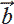 的神经网络会发出*输出向量*或*预测向量* 。权重和偏置可以组织成层；这个方程并不关心这一点。向量 ,  分别表示从所有层聚合的所有权重和偏置的集合。评估函数 *f*(⋅) 等同于在网络中进行一次前向传递。特别是，给定一个训练输入实例 ^((*i*))，神经网络发出 ^((*i*)) = *f*(^((*i*))|, )。我们将 ^((*i*)) 称为第 *i* 个训练数据实例的输出。

在监督训练期间，对于每个训练输入实例 ^((*i*))，我们都有 GT（已知的输出），*ȳ*^((*i*)）。我们将 *ȳ*^((*i*)）称为*GT 向量*（如通常所做，我们使用上标索引表示训练数据实例）。

理想情况下，输出向量 ^((*i*)) 应该与 GT 向量 *ȳ*^((*i*)）相匹配。它们之间的不匹配是针对该训练数据实例 𝕃^((*i*))(^((*i*)), *ȳ*^((*i*))) 的损失，我们有时将其表示为 𝕃^((*i*))(^((*i*)), *ȳ*^((*i*))). 所有训练数据实例的总体训练损失（由优化过程最小化）是所有训练数据实例损失的加和：


方程 9.2

其中求和是针对所有训练数据实例的，*n* 是训练数据集的大小。请注意，对所有训练数据点的这种求和是计算每个训练数据实例损失所必需的。因此，一个*epoch*，即对所有训练数据实例的单次训练循环，需要 *O*(*n*²) 的时间复杂度，其中 *n* 是训练数据点的数量。训练通常需要许多个 epoch。这使得训练过程非常昂贵。在 9.2.2 节中，我们研究减轻这种影响的方法。


图 9.1 损失表面可以看作是一个峡谷。

注意：在本章中，我们用*n*表示训练数据点的数量，用*N*表示输出向量的维度。对于分类器，输出向量的维度*N*与类别的数量相匹配。我们还使用上标(*i*)来索引训练数据点，下标*j*来索引输出向量维度。对于分类器，*j*表示类别。

我们可以将 𝕃(, ) 视为高维空间中的超曲面。图 8.8 和 8.9 展示了损失表面的低维示例。这些都是说明性的例子。实际上，损失表面通常是高维且非常复杂的。一个很好的心理图像是峡谷（见图 9.1）。在任何一点“向下走”实际上遵循局部梯度的负方向，即损失表面的梯度在 8.4.2 节中引入。沿着梯度向下走并不总是导致全局最小值。例如，沿着虚线箭头向下走将带我们到一个局部最小值，而全局最小值是水流的方向，由实线箭头指示。（也参见 8.4.4 节和图 8.9。）

许多损失公式都是可能的，量化了不匹配 𝕃^((*i*))(^((*i*)), *ȳ*^((*i*))); 其中一些将在以下小节中描述。

### 9.1.2 回归损失

回归损失是最简单的损失公式。它是输出向量和 GT 向量之间差异的 L2 范数。这个损失在方程 8.11 中引入。我们在此重申：第*i*个训练数据实例的损失是

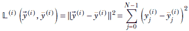

其中求和是对输出向量的分量进行的。*N*是类别的数量。GT 向量和输出向量都是*N*-维的。

注意：完整的回归损失功能代码，可通过 Jupyter Notebook 执行，可在[`mng.bz/g1a8`](http://mng.bz/g1a8)找到。

列表 9.1 PyTorch 代码用于回归损失

```py
from torch.nn.functional import mse_loss                   ①

y_pred = torch.tensor([-0.10, -0.24,  1.43, -0.14, -0.59]) ②

y_gt = torch.tensor([ 0.59, -1.92, -1.27, -0.40,  0.50])   ③

loss = mse_loss(y_pred, y_gt, reduction='sum')             ④
```

① 导入回归损失（均方误差损失）

② N 维预测向量

③ N 维真实向量

④ 计算回归损失

### 9.1.3 交叉熵损失

交叉熵损失在 6.3 节中讨论了熵的上下文。如果需要，现在重新阅读那部分是个好时机。在这里，我们快速回顾一下这个想法。

交叉熵损失通常用于衡量分类问题中分类器神经网络输出与相应 GT 之间的不匹配。在这里，GT 是一个长度等于类数的 one-hot 向量。除了一个元素外，其余元素都是 0。唯一的非零元素是 1，它出现在对应于该训练数据实例正确类别的索引处。

因此，GT 向量看起来像 *ȳ*^((*i*)) = [0,…,0,1,0,…,0]。预测向量应该具有介于 0 和 1 之间的值。预测向量 ^((*i*)) 的每个元素表示特定类的概率。换句话说，^((*i*)) = [*p*[0], *p*[1],…, *p*[*N*−1]]，其中 *p[j]* 是输入 *i* 属于第 *j* 类的概率。在第 6.3 节中，我们用一个示例图像分类器来说明，该分类器预测图像是否包含猫（类别 0）、狗（类别 1）、飞机（类别 2）或汽车（类别 3）。四个类别中总有一个假设存在于图像中。如果对于第 *i* 个训练数据实例，GT 向量是一张猫的图片，那么我们就有 *ȳ*^((*i*)) = [1,0,0,0]。预测向量 ^((*i*)) = [0.8,0.15,0.04,0.01] 是好的，而 ^((*i*)) = [0.25,0.25,0.25,0.25] 是不好的。请注意，GT 以及预测向量的元素之和总是 1，因为它们是概率。从数学上讲，给定一个训练数据集 *X*，


给定这样的真实标签 GT 和预测向量，交叉熵损失（CE 损失）是

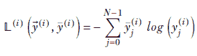

方程 9.3

其中求和是对预测向量的元素进行的，*N* 是类数。

交叉熵损失背后的直觉

注意，方程 9.3 的求和中只保留了一个元素——对应于 GT 类别的元素。其他元素消失，因为它们被乘以 0 的 GT 值。正确的 GT 类别的预测概率（对数）乘以 1。因此，CE 损失始终简化为 −*log*(*y*[*j*^*]^((*i*)))，其中 *j*^* 是 GT 类别。如果这个概率是 1，那么 CE 损失变为 0，这是正确的，因为以 1 的概率预测了正确的类别。如果正确类别的预测概率是 0，那么 CE 损失是 −*log*(0) = ∞，这也是正确的，因为这是最糟糕的预测。预测对正确类别的预测越接近 1，损失就越小。

注意：完整的交叉熵损失代码，可通过 Jupyter Notebook 执行，可以在 [`mng.bz/g1a8`](http://mng.bz/g1a8) 找到。

列表 9.2 PyTorch 交叉熵损失代码

```py
import torch

y_pred = torch.tensor([0.8, 0.15, 0.04, 0.01]) ①

y_gt = torch.tensor([1., 0., 0., 0.])          ②

loss = -1 * torch.dot(y_gt, torch.log(y_pred)) ①
```

① N 维预测向量

② N 维 one-hot 真实标签向量

③ 计算交叉熵损失

两个类别的特殊情况

如果*N* = 2（即我们只有两个类别）会发生什么？让我们用*y*^((*i*))表示第*i*个训练输入的类别 0 的预测概率：即[0]^((*i*)) = *y*^((*i*)）。由于这些是概率，对另一个类别的预测[1]^((*i*)) = 1 − *y*^((*i*)）。此外，用*ȳ*^((*i*))表示第*i*个训练输入的类别 0 的 GT 概率。那么 1 − *ȳ*^((*i*))是类别 1 的 GT 概率。（我们稍微滥用了符号——到目前为止，*ȳ*表示一个向量，但在这里它表示一个标量。）

然后，根据方程式 9.3，第*i*个训练数据实例的 CE 损失变为

𝕃^((*i*))(*y*^((*i*)), *ȳ*^((*i*))) = −*ȳ*^((*i*)) *log*(*y*^((*i*))) − (1−*ȳ*^((*i*))) *log*(1−*y*^((*i*)))

方程式 9.4

注意：二进制交叉熵损失的完整代码，可通过 Jupyter Notebook 执行，可在[`mng.bz/g1a8`](http://mng.bz/g1a8)找到。

列表 9.3 PyTorch 代码用于二进制交叉熵损失

```py
from torch.nn.functional import binary_cross_entropy ①

y_pred = torch.tensor([0.8])                         ②

y_gt = torch.tensor([1.])                            ③

loss = binary_cross_entropy(y_pred, y_gt)            ④
```

① 导入二进制交叉熵损失

② 输出类别 0 的概率 - *y*[0]。单个值就足够了，因为 *y*[1] = 1 − *y*[0]。

③ 真实值是 0 或 1。

④ 计算交叉熵损失

### 9.1.4 图像和向量不匹配的二进制交叉熵损失

给定一对归一化的张量（例如图像或向量），其元素值均在 0 到 1 之间，可以使用两分类 CE 损失的一个变体来估计张量之间的不匹配。请注意，像素强度值在 0 到 255 之间的图像可以通过将每个像素强度值除以 255 来归一化，从而将其转换为 0 到 1 的范围。这种两种图像的比较在图像自编码器中得到了应用，例如。我们稍后研究自编码器；在这里，我们将在以下侧边栏中提供简要概述。

自编码器

自编码器以图像为输入，从图像中创建一个低维描述符——这个描述符通常被称为图像的*嵌入*——并尝试从嵌入中重建输入图像。图像嵌入是图像的压缩表示。重建是一个有损过程：信号中的微小、细微的变化会丢失，只保留基本部分。损失是输入图像和重建图像之间的不匹配。通过最小化这个损失，我们激励系统在嵌入大小预算内尽可能多地保留输入的本质。

用*ȳ*表示输入图像。用^((*i*))表示由自编码器输出的重建图像。二进制交叉熵损失定义为


方程式 9.5

注意，在这里 *N* 是图像中的像素数，而不是之前的类别数。求和是针对图像中的像素。此外，GT 向量 *ȳ*^((*i*)) 不是一个 one-hot 向量；而是输入图像。尽管有这些差异，方程 9.5 的思想与方程 9.4 相同。

为什么它有效？

当输入与 GT 匹配时，二元交叉熵损失达到最小值。我们将在下面概述证明。（注意，为了简化，我们省略了上标和下标。）我们有

−𝕃 = *ȳlog*(*y*) + (1 − *ȳ*)*log*(1 − *y*)

在最小值处，*∂*𝕃**/***∂y* = 0。

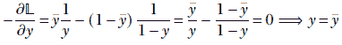

因此，二元交叉熵损失的最小值发生在网络输出与 GT 匹配时。但这并不意味着当输出与 GT 匹配时，这种损失变为零。

注意：即使在输出与输入匹配的理想情况下，二元交叉熵损失也不一定是零（尽管在理想情况下，损失确实是 *最小* 的，这意味着对于输入和输出不匹配的非理想情况，损失更高）。

检查方程 9.5，当两个输入匹配时，我们有 −𝕃(*ȳ*, )|![ = *ȳ*]。我们直观地期望这种损失为零，因为输出是理想的。但事实并非如此。例如，如果，对于 *ȳ[j]*^((*i*)) = *y[j]*^((*i*)) = 0.25

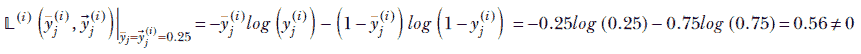

事实上，二元交叉熵损失仅在特殊情况下为零，例如 *y[j]*^((*i*)) = *ȳ[j]*^((*i*)) = 1。

### 9.1.5 Softmax

假设我们正在构建一个分类器：例如，我们在第 6.3 节中展示的图像分类器，它预测图像是否包含猫（类别 0）、狗（类别 1）、飞机（类别 2）或汽车（类别 3）。我们的分类器可以发出一个与输入图像对应的分数向量 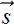。分数向量中的元素 *j* 对应于 *j[th]* 类。我们取分数向量的最大值，并将其称为神经网络预测的图像标签。例如，在示例图像分类器中，一个分数向量可能是 [9.99   10   0.01   -10]。由于最高分数出现在索引 1 处，我们得出结论，该图像包含狗类别 1）。

分数是无界的；它们可以是范围 [−∞,∞] 内的任何实数。然而，通常情况下，当损失函数涉及同一范围内的有界数字集时，神经网络表现更好。训练会更快地收敛到更好的最小值，推理也更准确。因此，将示例分数转换为概率是可取的。这些数字将在范围 [0,1] 内（并且向量的元素之和为 1）。

Softmax 函数将无界分数转换为概率。给定一个分数向量  = [*s*[0]   *s*[1]   *s*[2]  …  *s*[*N*-1]]，相应的 softmax 向量是


方程式 9.6

几个值得注意的点：

+   向量具有尽可能多的类别元素。

+   上一个向量中元素的总和为 1。

+   向量的第 *j* 个元素代表类别 *j* 的预测概率。

+   该公式可以处理任意得分，包括负得分。

因此，在我们的这个包含四个类别（猫、狗、飞机、汽车）的示例分类问题中，得分向量

 = [9.99   10   0.01   –10]

将产生 softmax 向量

*softmax* () = [0.497   0.502   2.30e–5   1.04e–9].

猫的概率是 0.497，狗的概率略高，为 0.502。飞机和汽车的概率要低得多：神经网络预测图像是狗的图像，但它并不十分自信；它也可能是猫的。

为什么叫 softmax？

Softmax 函数是 argmaxonehot 函数的平滑（可微）近似，它输出一个对应于最大得分索引的 one-hot 向量。argmaxonehot 函数是 *不连续的*。为了看到这一点，考虑一对二类得分向量：

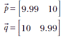

对其执行 argmaxonehot 操作将分别产生以下 one-hot 向量：

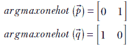

因此我们看到，向量 *argmaxonehot*(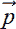) 和 *argmaxonehot*() 相对于彼此非常遥远，尽管点  和  非常接近。另一方面，相应的 softmax 向量是

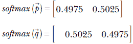

虽然预测的类别仍然与 argmaxonehot 向量中的那些匹配，但 softmax 向量彼此非常接近。得分越接近，softmax 概率也越接近。换句话说，softmax 是连续的。

图 9.2 几何地描述了这一点。argmaxonehot 函数作为得分向量 [*s*0, *s*1]（分别用于选择类别 0 和 1）的函数，如图 9.2a 和 9.2c 所示。这些是在 (*s*0, *s*1) 平面上的步函数，*s*0 = *s*1 是决策边界。它们的 softmax 近似如图 9.2b 和 9.2d 所示。在 8.1 节中，我们介绍了 1D sigmoid 函数（见图 8.1），它近似 1D 步函数。这里我们看到其高维类似物。

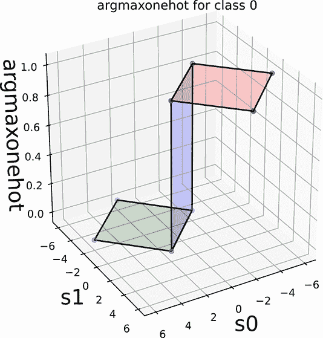

(a) 步函数：*z* = 1 如果 *s*0 >= *s*1，否则 *z* = 0

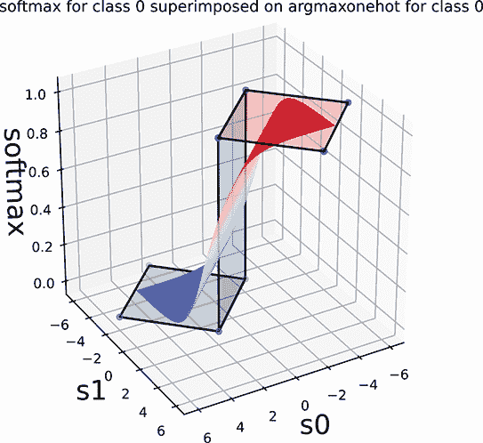

(b) Softmax：步函数的微分近似

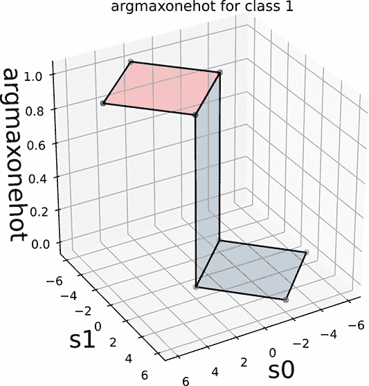

(c) 步函数：*z* = 1 如果*s*1 >= *s*0，否则*z* = 0

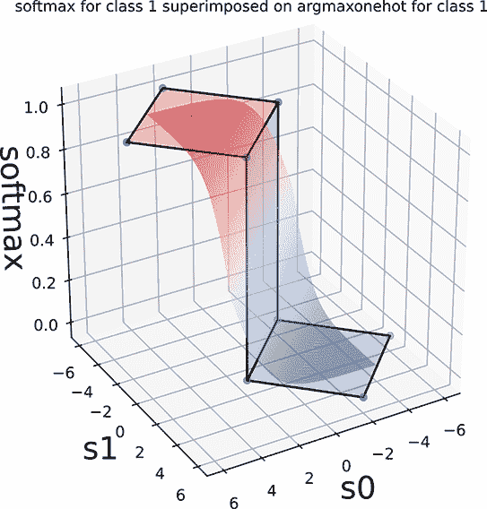

(d) Softmax：步函数的微分近似

图 9.2 在(*s*0, *s*1)平面上，两类的 argmaxonehot 和 softmax（分数向量的函数[*s*0, *s*1]）。决策边界是 45*[o]*线 *s*0 = *s*1。

列表 9.4 PyTorch 代码实现 softmax

```py
from torch.nn.functional import softmax      ①

scores = torch.tensor([9.99, 10, 0.01, -10]) ②

output = softmax(scores, dim=0)              ③
```

① 导入 softmax 函数

② 分数通常是神经网络的原始、未经归一化的输出。

③ 计算 softmax

### 9.1.6 Softmax 交叉熵损失

从前面的讨论中，应该清楚，将分类器神经网络的最后一层设置为 softmax 层是可取的。然后，给定一个输入，网络将输出每个类的概率。在训练过程中，我们可以通过 CE 损失（见第 9.1.3 节）来评估这些概率与已知 GT 概率之间的损失。这可以通过 CE 损失（见第 9.1.3 节）来实现。因此，softmax 通常在分类器训练过程中跟随 CE 损失。因此，组合（softmax CE 损失）在许多深度学习包中作为单个操作提供，例如 PyTorch。这很方便，因为我们不需要调用 softmax 然后 CE 损失。但将它们结合的更深层次的原因是，这种组合在数值上往往更好。

让我们通过一个例子来看看 softmax CE 损失是如何随着输出预测的变化而变化的。再次考虑图像分类问题，我们希望将图像分类为四个类别之一：猫（类别 0）、狗（类别 1）、飞机（类别 2）或汽车（类别 3）。图 9.3 展示了这一点。假设我们正在分类的图像实际上包含狗类别 1）。GT 表示为一个 one-hot 向量[0 1 0 0]。如果我们的分类器预测的向量是[0.498 0.502 0 0]，它几乎以相同的概率预测了猫和狗。这是一个不良的预测，因为我们理想上希望它自信地预测狗（类别 1）。因此，CE 损失较高（0.688）。另一方面，如果我们的分类器预测[0.003 0.997 0 0]，它高度确定（概率为 0.997）图像包含狗。这是一个好的预测，因此 CE 损失较低（0.0032）。softmax CE 损失可能是目前用于分类器训练的最流行的损失方法。


图 9.3 良好和不良输出预测的 softmax 输出和交叉熵损失

备注：完整的 softmax CE 损失功能代码，可通过 Jupyter Notebook 执行，可在[`mng.bz/g1a8`](http://mng.bz/g1a8)找到。

列表 9.5 PyTorch 代码实现 softmax 交叉熵损失

```py
from torch.nn.functional import cross_entropy

scores = torch.tensor([[9.99, 10, 0.01, -10]])

y_gt = torch.tensor([1])            ①

loss = cross_entropy(scores, y_gt)  ②
```

① 真实类别索引范围从 0 到 _ –1

② 计算 softmax 交叉熵损失

### 9.1.7 Focal 损失

随着训练的进行，我们应该关注哪里？当存在 *数据不平衡* 时，这个问题变得尤为重要，这意味着某些类别的训练数据实例数量显著少于其他类别。在这种情况下，并非所有训练数据都同等重要。我们必须明智地使用我们的训练数据实例。

直观地说，提高表现不佳的训练数据实例的性价比更高。换句话说，与其试图从网络表现良好的示例（所谓的“简单”示例）中榨取每一滴汁液，不如关注网络表现不佳的示例（“困难”示例）。

为了停止关注简单示例，转而关注困难示例，我们可以对远离 GT 的训练数据实例的损失赋予更多权重，反之亦然：即，对接近 GT 的训练数据实例的损失赋予较少权重。再次考虑方程式 9.4 的二进制 CE 损失。第 *i* 个训练实例的损失可以重新写为以下形式：


注意：在接下来的小节中，为了简化符号，我们省略了上标（*i*），尽管它仍然隐含存在。

现在，当 GT 是类别 1（即 *ȳ* = 1）时，实体 (1−*y*) 衡量预测与 GT 的偏差。我们可以将损失乘以这个值来加重良好预测的损失，减轻不良预测的损失。在实践中，我们乘以 (1−*y*)^γ，其中 *γ* 是某个值（例如 *γ* = 2）。同样，当 GT 是类别 0（即 *ȳ* = 0）时，实体 *y* 衡量预测与 GT 的偏差。在这种情况下，我们乘以 *y^γ*。因此，整体损失变为


我们可以有一个相对简化的表达式


方程式 9.7

其中


方程式 9.7 是 focal loss 的流行表达式。它在 *γ* 不同值下的图形显示在图 9.4 中。注意，随着 GT 的概率向右增加，损失变得越来越微弱，直到在底部变平。

注意：完整的 focal loss 代码，可通过 Jupyter Notebook 执行，可以在 [`mng.bz/g1a8`](http://mng.bz/g1a8) 找到。

列表 9.6 PyTorch 代码实现 focal loss

```py
def focal_loss(y, y_gt, gamma):
    y_t = (y_gt * y) + ((1 - y_gt) * (1 - y)) ①

    loss = -1 * torch.pow((1 - y_t), gamma) * torch.log(y_t)
    return loss
```

① *y[t]* = *y* 如果 *y[gt]* 是 1

*y[t]* = 1 − *y* 如果 *y[gt]* 是 0

### 9.1.8 Hinge loss

只有在理想条件下，softmax CE 损失才会变为零：正确的类别有一个有限的分数，而其他类别的分数为负无穷。因此，该损失将继续推动网络向改进方向前进，直到达到理想状态（在实践中永远不会发生）。有时我们更喜欢在正确类别的分数达到最大时停止改变网络，我们不再关心增加正确和错误分数之间的距离。这就是 hinge 损失出现的地方。

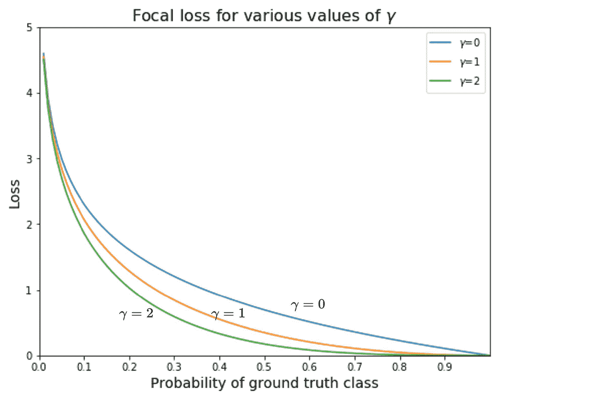

图 9.4 Focal 损失图（各种 *γ* 值）

一个铰链门只能向一个方向打开，但不能向另一个方向打开。同样，如果某个良好标准不满足，则 hinge 损失函数会增加，如果标准满足，则损失函数变为零（并且不再进一步减少）。这就像说，“如果你不是我的朋友，我们之间的距离可以从小到大变化（无界），但我不会区分朋友。所有我的朋友都与我保持零距离。”

多类支持向量机损失：分类的 hinge 损失

再次考虑我们的老朋友，这个分类器预测图像是否包含猫（类别 0）、狗（类别 1）、飞机（类别 2）或汽车（类别 3）。我们的分类器输出一个与输入图像对应的输出向量 。在这里，输出是分数：*y[j]* 是对应于第 *j* 个类别的分数。（在本小节中，我们省略了表示训练数据索引的上标，以简化符号。）

给定一个（训练数据实例，GT 标签）对 (, *c*)（即，GT 类别对应于输入  是 *c*），多类支持向量机（SVM）损失是


方程式 9.8

其中 *m* 是一个通常 *m* = 1 的边界）。

要理解这一点，首先考虑没有边界的方程：


在方程 9.8 中，我们对除了匹配 GT 的类别之外的所有类别进行求和。换句话说，我们只对错误类别进行求和。对于这些类别，我们希望分数 *y[j]* 小于正确类别的分数 *y[c]*。有两种可能性：

+   *良好输出*—错误类别的分数小于正确类别的分数：

    *y[j]* − *y[c]* < 0 ⟹ *max*(0, *y[j]* − *y[c]*) = 0

    损失的贡献是零（我们不区分正确分数：所有朋友都与我保持零距离）。

+   *不良输出*—错误类别的分数大于正确类别的分数：

    *y[j]* > *y[c]* ⟹ *max*(0, *y[j]* – *y[c]*) = *y[j]* − *y[c]*

    损失的贡献是正的（非朋友之间的距离是正的，并且随着非朋友程度的增加而变化）。

在实际设置中，边缘设置为正数，通常为 1，以惩罚正确类别的分数仅略高于错误类别的预测。这迫使分类器学会以高置信度预测正确类别。图 9.8 显示了良好和不良输出预测的 hinge 损失如何不同。


图 9.5 良好和不良输出预测的 Hinge 损失

关于多类 SVM 损失的一个心理模型是它很懒惰。一旦正确的类别分数超过错误分数的边缘 *m*，它就停止变化。如果正确的类别分数继续上升，损失不会改变，这意味着它不会推动机器在这个点之后继续改进。这种行为与 softmax CE 损失不同，softmax CE 损失试图推动机器为正确的类别达到无限分数。

## 9.2 优化

神经网络模型定义了一个损失函数，该函数估计网络输出的不良程度。在监督训练期间，特定训练实例输入的输出与该特定训练实例的已知输出（GT）进行比较。GT 和网络生成的输出之间的差异称为损失。我们可以将单个训练数据实例的损失相加，并计算所有训练数据上的总损失。

这些损失当然是网络参数的函数，, 。我们可以想象一个维度为 *dim*() + *dim*() 的空间。在这个空间的每一个点上，我们都有一个总训练损失的值。因此，我们可以想象一个损失表面——一个高度代表损失值的表面——它定义在网络参数（权重和偏差）的高维域上。

优化不过是找到这个表面上的最低点。在训练过程中，我们从网络参数的随机值开始：这就像在表面上随机选择一个点开始。然后我们不断地在损失表面上沿着负梯度的方向局部下降。我们希望这最终能带我们到最小值或足够低的位置。继续我们关于损失表面像峡谷的类比，最小值在海平面。这个最小值为我们提供了网络参数值（权重和偏差），这些值将在训练数据上产生最小的损失。如果训练数据集充分代表了问题，训练好的模型将在未见过的数据上表现良好。

这个朝着最小值前进的过程，即对训练数据集进行权重和偏差的迭代更新以实现最小损失，被称为*优化*。基本数学原理在第八章 8.4.2（方程 8.12）中介绍。在这里，我们研究了许多实际细节和变体。

在每次迭代中，我们更新权重和偏差，所以如果*t*表示迭代次数，*[t]*表示*t*次迭代的权重值，*δ**[t]*表示*t*次迭代的权重更新，等等：


方程式 9.9

基本更新是沿着负梯度的方向（参见方程 8.12）：


方程式 9.10

这里，𝕃(*[t]*, *[t]*)表示*t*次迭代的损失。理想情况下，我们应该评估每个训练数据实例的损失并取平均值。但这将意味着我们必须为每次迭代处理每个训练数据实例，这是非常昂贵的。相反，我们使用采样（参见 9.2.2）：

+   常数*η*被称为*学习率*（LR）。较大的 LR 会导致更大的步长（每次更新对权重和偏差的调整更大）反之亦然。我们最初使用较大的 LR 值：当网络完全未训练时，我们希望向最小值迈出大步。另一方面，当我们接近最小值时，我们希望迈出更小的步子，以免超出它。LR 通常是一个很小的数字，比如*η* = 0.01。

+   在随机梯度下降（SGD；一种流行的方法）中，LR *η* 通常在一个 epoch（一个 epoch 是遍历所有训练数据的一次）中保持不变。然后在一个或多个 epoch 之后降低 LR。这个过程被称为*学习率衰减*。因此，LR 并不完全是一个常数。我们可以将其写作*η[t]*来表示其时间性质，但我们选择保持简单，因为（至少在 SGD 中）它变化不频繁。

由于底层神经网络的权重和偏差在每次迭代中都会变化，我们必须在每次迭代中重新评估损失及其梯度。

需要进行多少次迭代？通常，这是一个很大的数字。我们多次在整个训练数据集上迭代。在这次训练中，请注意，为了确保收敛，在每个 epoch 之后随机打乱训练数据的顺序是*极其重要*的。在接下来的章节中，我们将探讨这个过程的一些实际细节。

### 9.2.1 优化的几何视图

这个主题在 8.4.2 节中有详细描述。如果需要，你被鼓励重新回顾那个讨论。

总体来说，神经网络优化是一个迭代过程。理想情况下，在每次迭代中，我们计算当前参数（权重和偏置）相对于损失函数的梯度，并通过沿着负梯度方向移动来获得它们的改进值。

### 9.2.2 随机梯度下降和小批量

我们如何计算损失函数的梯度？对于每个训练数据实例，损失是不同的。合乎逻辑的做法是平均它们。但如我们之前提到的，这会导致一个实际的问题：我们每次迭代都必须处理整个训练数据集。如果训练数据集的大小是*n*，那么一个 epoch 是每次迭代的*O(n²)*操作，我们必须处理所有的*n*个训练数据实例来计算梯度，而一个 epoch 有*n*次迭代）。由于*n*通常是一个很大的数字，经常是数百万，*O(n²)*是过于昂贵的。

在 SGD 中，我们不是在整个训练数据集上平均来产生梯度。相反，我们在训练数据的一个随机样本子集上平均。这个随机样本的子集被称为*小批量*。梯度是通过平均小批量中的损失来计算的（而不是整个训练数据集）。这个梯度用于更新权重和偏置参数。

### 9.2.3 SGD 的 PyTorch 代码

现在，让我们在 PyTorch 中实现 SGD。

注意：SGD 的完整功能代码，可通过 Jupyter Notebook 执行，可以在[`mng.bz/ePyG`](http://mng.bz/ePyG)找到。

让我们考虑 6.9 节中讨论的例子。我们的目标是构建一个模型，该模型可以使用身高和体重作为输入数据来预测 Statsville 居民是男性、女性还是儿童。为此，让我们假设我们有一个包含各种 Statsville 居民身高和体重的庞大数据集*X*。*X*的形状是(*num_samples*,2)，其中每一行代表单个居民的(*height*, *weight*)对。相应的标签存储在 y[gt]中，它包含*num_samples*个元素。y[gt]的每一行可以是 0、1 或 2，具体取决于居民是男性、女性还是儿童。图 9.6 显示了*X*的一个示例分布。

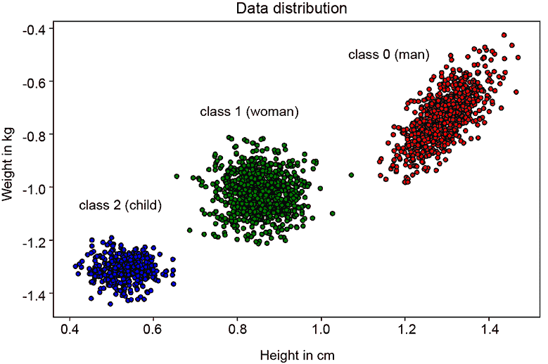

图 9.6 Statsville 居民的身高和体重。类别 0（男性）由最右侧的簇表示，类别 1（女性）由中间的簇表示，类别 2（儿童）由最左侧的簇表示。

在训练模型之前，我们必须首先将数据转换为适合训练的格式。我们通过继承`torch.utils.data.Dataset`来实现这一点，并实现`__len__`和`__getitem__`方法。可以通过调用`data_set[i]`来访问第*i*个训练数据实例。记住，在 SGD 中，我们每次迭代都输入包含`batch_size`个元素的 minibatch。这可以通过调用`__getitem__`方法`batch_size`次来实现。然而，我们不是自己这样做，而是使用 PyTorch 的`DataLoader`，它提供了一个方便的包装器。在生产环境中推荐使用`DataLoader`，因为它提供了一个简单的 API，通过它可以（1）创建 minibatch，2）通过多进程加速数据加载时间，3）在每轮中随机打乱数据以防止过拟合。以下代码创建了一个自定义的 PyTorch 数据集。

列表 9.7 PyTorch 代码用于创建自定义数据集

```py
from torch.utils.data import Dataset, DataLoader

class StatsvilleDataset(Dataset):                ①
    def __init__(self, X, y_gt):
        self.X = X
        self.y_gt = y_gt

    def __len__(self):                           ②
        return len(self.X)

    def __getitem__(self, i):                    ③
        return self.X[i], self.y_gt[i]

dataset = StatsvilleDataset(X, y_gt)             ④

data_loader = DataLoader(dataset, batch_size=10, ⑤
                       shuffle=True)
```

① 继承自 torch.utils.data.Dataset

② 返回数据集的大小

③ 返回第*i*个训练数据元素

④ 实例化数据集

使用批大小为 10 并开启随机打乱的方式实例化数据加载器

我们下一步是创建一个分类器模型，该模型可以接收身高和体重数据(*X*)作为输入并预测输出类别。在这里，我们创建了一个简单的神经网络模型，该模型由两个线性层和一个 softmax 层组成。softmax 层的输出有三个值，分别代表三个类别（男性、女性和儿童）的概率。请注意，在正向传播过程中，我们没有调用 softmax 层，因为我们的损失函数，PyTorch 的 CE 损失，期望输入的是原始、未归一化的分数。因此，我们将第二个线性层的输出传递给损失函数。然而，在预测过程中，我们将分数传递给 softmax 层以获得一个概率向量，然后通过 argmax 获取预测类别。请注意，我们有一个函数用于初始化线性层的权重：这很重要，因为权重的起始值通常会影响到收敛。如果模型起始点离最小值太远，它可能永远无法收敛。

列表 9.8 PyTorch 代码用于创建自定义神经网络模型

```py
class Model(torch.nn.Module):                                     ①
    def __init__(self, input_size, hidden_size, output_size):
        super(Model, self).__init__()
        self.linear1 = torch.nn.Linear(input_size, hidden_size)   ②
        self.linear2 = torch.nn.Linear(hidden_size, output_size)
        self.softmax = torch.nn.Softmax(dim=1)

    def forward(self, X):                                         ③
        scores = self.linear2(self.linear1(X))
        return scores

    def predict(self, X):                                         ④
        scores = self.forward(X)
        y_pred = torch.argmax(self.softmax(scores), dim=1)
        return y_pred

def initialize_weights(m):
    if isinstance(m, torch.nn.Linear):
        torch.nn.init.xavier_uniform_(m.weight.data)              ⑤
        torch.nn.init.constant_(m.bias.data, 0)

model = Model(input_size=2, hidden_size=100, output_size=3)
model.apply(initialize_weights)
```

① 继承自 torch.nn.Module

② 实例化线性层和 softmax 层

③ 将输入通过两个线性层进行前向传播

④ 预测输出类索引

⑤ 初始化权重以帮助模型更好地收敛

现在我们已经有了数据集和模型，接下来定义我们的损失函数并实例化我们的 SGD 优化器

列表 9.9 PyTorch 代码用于损失函数和 SGD 优化器

```py
loss_fn = torch.nn.CrossEntropyLoss()
optimizer = optim.SGD(model.parameters(), lr=0.02) ①
```

① 使用学习率=0.02 实例化 SGD 优化器

现在我们定义训练循环，这本质上是对整个数据集的一次遍历。我们以`batch_size`的大小对数据集进行批处理迭代，运行前向传播，计算梯度，并沿着负梯度方向更新权重。请注意，我们在每次迭代中调用`optimizer.zero_grad()`以防止之前步骤的梯度累积。

列表 9.10 一个训练循环的 PyTorch 代码

```py
def train_loop(epoch, data_loader, model, loss_fn, optimizer):
    for X_batch, y_gt_batch in data_loader:                   ①

        scores = model(X_batch)                               ②

        loss = loss_fn(scores, y_gt_batch)                    ③

        optimizer.zero_grad()                                 ④

        loss.backward()                                       ⑤

        optimizer.step()                                      ⑥
```

① 以批处理方式遍历数据集

② 将模型前向传播以计算分数

③ 计算交叉熵损失

④ 清除上一步累积的梯度

⑤ 运行反向传播并计算梯度

⑥ 更新权重

这样，我们就准备好训练我们的模型了。以下代码展示了如何进行训练。图 9.7 显示了每个 epoch 结束时的输出预测和损失。

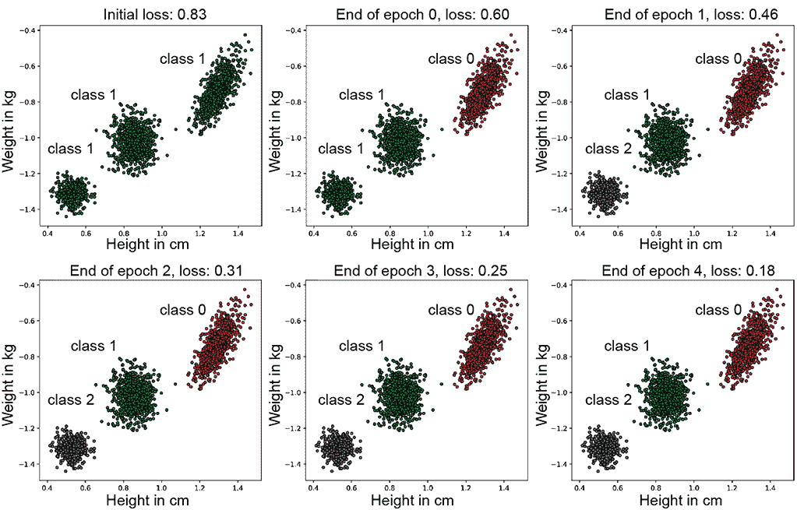

图 9.7 每个 epoch 结束时模型的预测。注意损失是如何随着每个 epoch 减少的。一开始，所有训练数据点都被错误地分类为类别 1。在 epoch 1 结束后，大部分训练数据被正确分类，分类器输出的分布已经接近真实值。损失持续下降直到 epoch 4，尽管改进的视觉效果更难察觉）。

列表 9.11 运行训练循环`num_epochs`次的 PyTorch 代码

```py
num_epochs = 2
for epoch in range(num_epochs):
    train_loop(epoch, data_loader, model, loss_fn, optimizer)
```

### 9.2.4 动量

对于高维度的现实损失表面，峡谷类比非常恰当。损失表面几乎不像一个有光滑壁的瓷杯；它更像是大峡谷的墙壁（见图 9.8）。此外，梯度估计（通常在 minibatch 上执行）是噪声的。因此，梯度估计永远不会在一个方向上对齐——它们往往四处游走。尽管如此，大多数梯度都有一个很好的下降分量。其他（非下降分量）是有些随机的（见图 9.8）。所以如果我们平均它们，下降分量会相互加强并得到增强，而非下降分量则会相互抵消并减弱。


图 9.8 动量。在损失表面不同点上的噪声随机梯度估计（粗实箭头）在方向上不一致，但它们都有一个显著的下降分量（细实箭头）。非下降分量（细虚线箭头）指向随机方向。因此，平均化往往加强下降分量并抵消非下降分量。

此外，如果存在一个小平坦区域，其前后都有下山区域，那么基于梯度的传统方法会陷入这个小平坦区域（因为那里的梯度为零）。但是，与过去的平均可以让我们有非零的更新，从而将优化从局部小平坦区域中带出，以便它可以继续下山。

在这个背景下，一个很好的心理图像是一个球在山丘上滚下。山丘表面是粗糙的，球并不是直接向下滚动。相反，它采取了一个之字形路径。但随着它的移动，它聚集了向下的动量，其向下的速度变得更大。

按照这个理论，我们取当前迭代计算的梯度与之前迭代中使用的更新的加权平均值：


方程 9.11

其中 *γ*，*η* 是小于 1 的正常数。权重和偏差参数使用方程 9.9 以通常的方式更新。

展开动量方程的递归

展开递归方程 9.11，我们看到

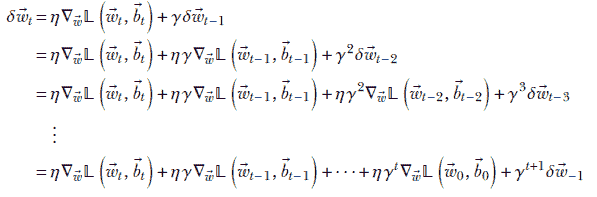

假设 *δ*[−1] = 0，我们得到

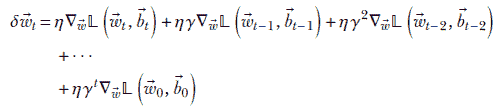

方程 9.12

因此，

+   我们正在对过去迭代的梯度进行加权求和。然而，这并不完全是一个加权平均，如稍后所述。

+   较旧的梯度由 *γ* 的更高次幂加权。由于 *γ* < 1，权重会随着迭代次数的增加而减少（长期迭代的影响较小）。

+   从现在开始向时间开始（第 0 次迭代）的梯度权重之和是

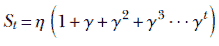

现在，使用泰勒展开，


因此，基于动量的梯度下降中过去梯度的权重之和为 *η*/(1–*γ*) ≠ 1。换句话说，这并不完全是一个加权平均（其中权重应加起来等于 1）。这是一个有些不理想的特点，在稍后讨论的 Adam 算法中得到纠正。

可以对偏差进行类似的分析。

### 9.2.5 几何视图：常量损失等高线、梯度下降和动量

考虑一个具有微小的两个元素权重向量  和没有偏差的网络。此外，假设损失函数是 𝕃 = ||||² = *w*[0]² + *w*[1]²。常量损失等高线是以原点为中心的同心圆。圆的半径表示损失的大小。

如果我们沿着圆的周长移动，损失不会改变。损失在垂直于该方向的正交方向上变化最大：圆的半径。这个直观的观察通过评估梯度得到证实。


因此梯度沿着半径方向，负梯度方向是径向向内的。所以如果我们径向向内移动，损失会迅速减少。如果我们垂直于半径移动（即沿着圆周），损失保持不变；当然，我们是在沿着恒定损失等高线移动。

优化过程使我们从外部的较大半径圆逐渐过渡到内部的较小半径圆。最小值位于原点；理想情况下，一旦达到原点，优化就应该停止。

图 9.9 展示了对于简单损失函数 𝕃 = ||||² = *w*[0]² + *w*[1]² 的优化过程。我们从任意一对权重值开始，并通过方程 9.9 重复更新它们。对于图 9.9a，我们使用不带动量的更新（方程 9.10）。对于图 9.9b，我们使用带动量的更新（方程 9.11）。

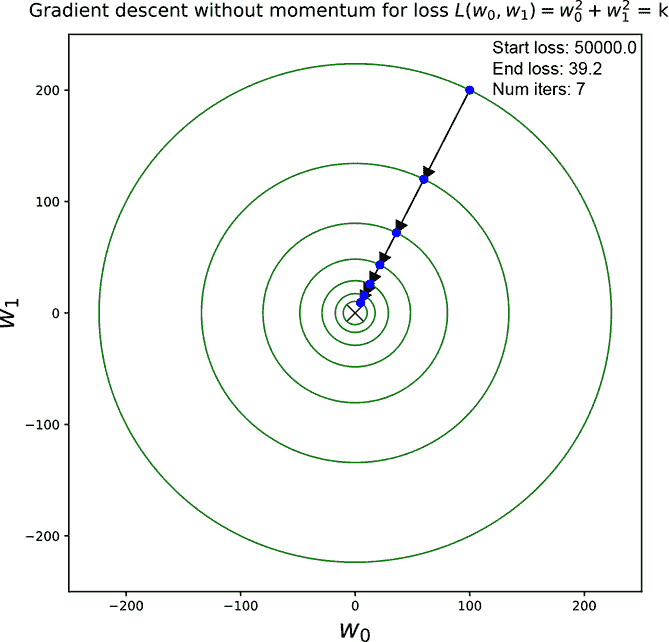

(a) 梯度下降不带动量时的恒定损失等高线轨迹


(b) 梯度下降带动量时的恒定损失等高线轨迹

图 9.9 损失函数 𝕃 = ||||² = *w*[0]² + *w*[1]² 的恒定损失等高线和优化轨迹。损失表面是一个以原点为顶点，其底面在 *w*[0]，*w*[1] 平面平行平面上的圆。随着我们接近原点的最小值，优化过程沿着圆锥向越来越小的横截面下降。更新用箭头表示。注意动量版本如何以更少的步骤到达较小的圆。

当恒定损失等高线是中心为原点的同心圆时，损失表面是一个以原点为顶点的圆锥。横截面是与 *w*[0]，*w*[1] 平面平行的圆。随着我们接近最小值，优化过程通过越来越小的圆形横截面沿着圆锥的内壁下降。全局最小值位于原点，对应于零损失。零损失等高线是一个半径为零的圆，实际上是一个单点：原点。

在这两种情况下，随着我们接近最小值，进度会减慢（步长变得较小）。这是因为随着我们接近最小值，梯度的幅度会越来越小（想象一个碗：当我们接近底部时，它变得越平）。然而，如果我们有动量，这种效应在一定程度上会被抵消。因此，我们可以看到，当我们有动量时，到达较小半径的圆需要更少的步骤。

### 9.2.6 Nesterov 加速梯度

基于动量的梯度下降的一个问题是它可能会越过最小值。这可以在图 9.10a 中看到，损失通过一系列更新而减少，然后，当我们接近最小值时，一个更新（用虚线箭头表示）越过最小值并增加了损失（用虚线圆表示）。

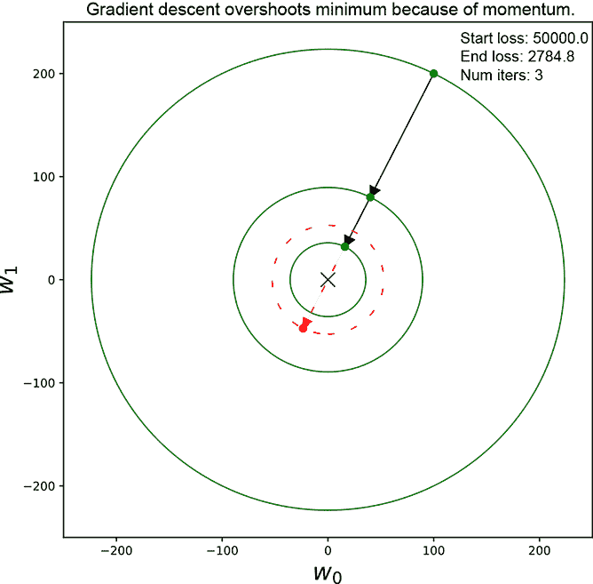

(a) 动量梯度下降越过最小值。损失一度减少，然后增加（用虚线圆和箭头表示）

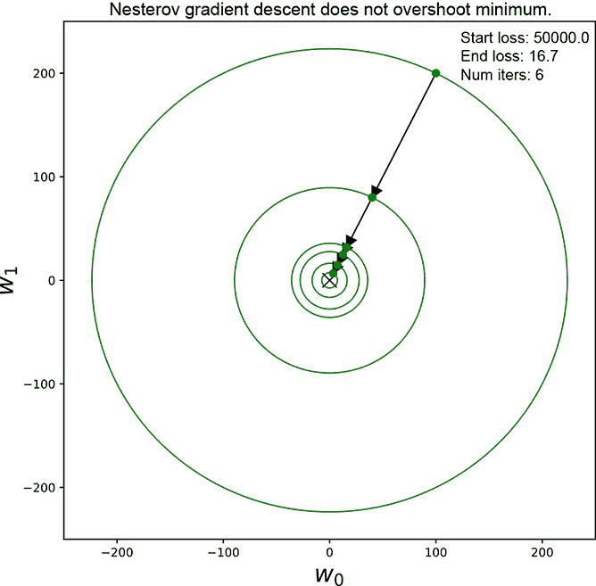

(b) Nesterov 在我们即将越过最小值时减小步长。

图 9.10 图(a)显示了基于动量的梯度下降越过最小值。过冲更新用虚线箭头表示。一个半径大于上一步的圆用虚线轮廓表示。Nesterov 在即将过冲时采取较小的步长，效果更好。

这是 Nesterov 加速梯度优化试图解决的问题。

在 Nesterov 的技术中，我们做以下操作：

1.  通过将上一步的更新加到当前点上，估计这次更新将带我们到何处（即目标点）。

1.  计算估计目标点的梯度。这与传统的基于动量的方法不同，后者取当前点的梯度。

1.  对梯度（在估计的目标点）和上一步的更新取加权平均值。这就是当前步的更新。

从数学上讲，


方程 9.13

其中 *γ*, *η* 是小于 1 的常数。权重和偏差使用方程 9.9 的常规方式更新。

这为什么有帮助呢？好吧，考虑以下内容：

+   当我们离最小值有一定距离（没有过冲的可能性）时，估计目标点的梯度与当前点的梯度大致相同，因此我们以类似于基于动量的梯度下降的方式向最小值前进。

+   但当我们接近最小值，并且当前的更新可能会使我们越过它（见图 9.10a 中的虚线箭头）时，估计目标点的梯度将位于最小值的另一侧。就像之前一样，想象这个损失表面是一个以原点为顶点、以顶点之上的基座为底部的圆锥。我们已经沿着圆锥的一侧壁向下移动，并刚刚开始向上爬。因此，估计目标点的梯度与上一步的方向相反。当我们取它们的加权平均值时，它们在某些维度上会相互抵消，导致幅度减小。结果，较小的步长将减轻过冲现象。

注意：动量和 Nesterov 加速梯度的完整功能代码，可通过 Jupyter 笔记本执行，可以在[`mng.bz/p9KR`](http://mng.bz/p9KR)找到。

### 9.2.7 AdaGrad

基于动量的优化方法（方程 9.11）和 Nesterov 方法（方程 9.13）都存在一个严重的缺点：它们将参数向量 ,  的所有维度同等对待。但损失表面在所有维度上并不对称。某些维度的斜率可能很高，而其他维度的斜率可能很低。我们不能用单个学习率（LR）控制所有维度。如果我们设置 LR 较高，高斜率维度将表现出过多的方差。如果我们设置它较低，低斜率维度几乎无法向最小值方向进步。

我们需要的是**按参数的学习率**。然后每个学习率将适应其特定维度的斜率。这正是 AdaGrad 试图实现的目标。具有历史较大梯度的维度具有较小的学习率，而具有历史较小梯度的维度具有较大的学习率。

我们如何跟踪梯度历史大小？为了做到这一点，AdaGrad 维护一个状态向量，在其中累积训练过程中看到的梯度向量的每个维度的平方偏导数的总和：


其中 ∘ 表示 Hadamard 算子（两个向量的逐元素乘积）。我们可以将前面的方程表达得更简洁一些：


展开递归，我们得到

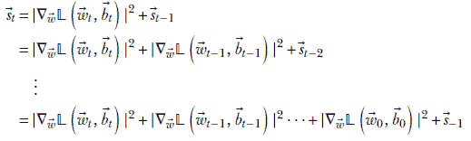

假设 [−1] = 0，*[t]* 是一个向量，它保存了所有训练迭代中每个维度的平方斜率的累积总和。对于具有历史高斜率的维度，*[t]* 中相应的元素较大，反之亦然。整体更新向量看起来是这样的：

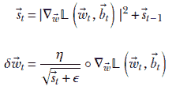

方程 9.14

其中 *ϵ* 是一个非常小的常数，用于防止除以零。然后我们使用方程 9.9 通常是更新权重。对于偏差也存在一组平行的方程。

使用 AdaGrad，在损失梯度中，在早期迭代中看到大斜率的维度在更新期间被赋予较少的重要性。我们强调那些在过去没有取得太多进展的维度。这有点像说，“我将减少对总是说话的人的关注，而将更多关注那些不常说话的人。”

### 9.2.8 根均方传播

AdaGrad 算法的一个显著缺点是向量 *[t]* 的幅度随着迭代的进行而不断增加。这导致所有维度的 LR 变得越来越小。最终，当迭代次数很高时，LR 接近零，更新几乎不起作用；向最小值的进展几乎完全停止。因此，AdaGrad 在现实生活中是一个不实用的算法，尽管按组件 LR 的想法是好的。

根均方传播（RMSProp）解决了这个缺点，而没有牺牲 AdaGrad 的维度自适应性质。在这里，同样有一个状态向量，但它的方程是


将其与 AdaGrad 的状态向量方程进行比较：


它们几乎相同，但项被（1−*γ*）和*γ*加权，其中 0 < *γ* < 1 是一个常数。这个递归方程中的特定权重对具有一个非常有趣的效果。为了看到它，我们必须展开递归：


因此，*[t]* 是过去项梯度平方幅度向量的加权总和。从现在开始回溯到时间的起点（第 0 次迭代），权重为（1−*γ*），（1−*γ*）*γ*，（1−*γ*）*γ*²，⋯，（1−*γ*）*γ^t*。如果我们加上这些权重，我们得到

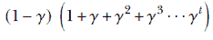

当迭代次数变得很高（*t* → ∞）时，这变成

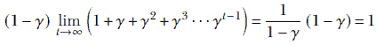

其中使用了泰勒展开来评估括号中的项。

对于大量的迭代，权重的总和趋近于 1。这意味着在多次迭代之后，RMSProp 状态向量实际上取了过去项梯度平方幅度向量的*加权平均*。随着更多迭代的进行，权重被重新分配，较旧的项被弱化，但整体幅度不会增加。这消除了 AdaGrad 中的消失 LR 问题。RMSProp 继续降低具有高累积偏导数的维度的 LR，但这样做不会使 LR 变得无限小。

RMSProp 的整体更新方程是

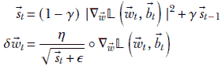

方程式 9.15

对于偏差也有一个平行的方程组。权重和偏差参数使用方程 9.9 以通常的方式更新。

### 9.2.9 Adam 优化器

基于动量的梯度下降法随着迭代的进行，越来越增强下坡分量。另一方面，RMSProp 会减少看到大梯度的维度的学习率（LR），反之亦然，以平衡所有维度的进度率。

这两种都是理想性质。我们希望有一个优化算法能够结合它们，而这个算法就是 Adam。它正越来越多地成为大多数深度学习研究者的首选优化器。

Adam 优化算法维护两个状态向量：


方程 9.16

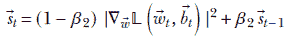

方程 9.17

其中 0 < *β*[1] < 1 和 0 < *β*[2] < 1 是常数。注意以下内容：

+   方程 9.16 实质上是方程 9.11 的动量方程，有一个显著的区别。我们将权重项改为 *β*[1] 和 (1−*β*[1])。正如我们所见，随着 *t* → ∞，这导致状态向量成为所有过去梯度的加权平均值。这比原始动量方案有所改进。

+   第二个状态向量基本上是 RMSProp 方程 9.15 中的那个。

使用这两个状态向量，Adam 创建更新向量如下：


方程 9.18

分子中的 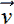*[t]* 吸收了动量方法（平均增强）的好处。否则，方程几乎与 RMSProp 相同；这些好处也被吸收了。

最后，使用方程 9.9 以常规方式更新权重和偏差参数。

偏差校正

状态向量中过去值的权重之和 *[t]*, *[t]* 只有在 *t* 的较大值时才会趋近于 ∞。为了改善 *t* 较小值时的近似，Adam 引入了偏差校正：


方程 9.19


方程 9.20

我们使用偏差校正的实体 *v̂[t]* 和 *ŝ[t]* 而不是 **[t]* 和 **[t]*，在方程 9.18 中。

列表 9.12 为各种优化器提供的 PyTorch 代码

```py
from torch import optim

sgd_optimizer = optim.SGD([params], lr=0.01)                   ①

sgd_momentum_optimizer = optim.SGD([params], lr=0.01,
                                    momentum=0.9)              ②

sgd_nesterov_momentum_optimizer = optim.SGD([params], lr=0.01, ③
                                    momentum=0.9, nesterov=True)

adagrad_optimizer = optim.Adagrad([params], lr=0.001)

rms_prop_optimizer = RMSprop([params], lr=1e-2,                ④
                       alpha=0.99)

adam_optimizer = optim.Adam([params], lr=0.001,
                       betas=(0.9, 0.999))
```

① 将学习率设置为 0.01

② 将动量设置为 0.9

③ 将 Nesterov 标志设置为 True

④ 将平滑常数设置为 0.99 (*γ* 在 9.15)

## 9.3 正则化

假设我们正在教一个婴儿识别汽车。我们向他们展示红色汽车、蓝色汽车、黑色汽车、大汽车、小汽车、中等汽车、圆顶汽车、矩形顶汽车等等。很快，婴儿的大脑意识到有太多种类难以全部记住。所以大脑开始形成 *抽象*：神秘的共同特征被存储在婴儿的大脑中，并带有 *汽车* 这个标签。大脑已经学会了分类一个名为汽车的抽象实体。尽管它无法 *记住* 它所看到的每一辆汽车，但它可以 *识别* 汽车。我们可以说它已经发展了 *经验*。神经网络也是如此。我们不想我们的网络记住每一个训练实例。相反，我们希望网络形成 *抽象*，这样它就能在推理过程中识别对象，即使训练过程中从未见过推理过程中遇到的对象实例的精确相似性。

过拟合和欠拟合

如果网络相对于训练实例的数量具有过多的表达能力（太多感知器或，等价地，太多权重），则网络可以并且通常会死记硬背训练实例。这种现象称为*过拟合*。过拟合导致网络在训练数据上表现非常好，但在测试或实际推理中表现很差。换句话说，网络已经调整自己以适应训练数据的每一个角落、弯道和曲折，因此在训练数据上表现良好——损害了测试数据的表现。这如图 9.11 所示。*正则化*指的是一系列技巧，通常试图防止过拟合。这是本节的主题。

另有一种现象称为*欠拟合*，其中网络简单地没有足够的表达能力来模拟训练数据。欠拟合的症状是网络在训练和测试数据上表现都差。如果我们看到这种情况，我们应该尝试一个更复杂的网络，具有更多的感知器。


图 9.11 过拟合：二元分类器的数据点。属于不同类别的点被视觉上划分为正方形和圆形。实心正方形/圆形表示训练数据，空心正方形/圆形表示测试数据。有一些异常的训练数据实例（正方形区域中的实心圆圈）。估计的决策边界（实线）变得扭曲以适应它们，这导致许多测试点（空心正方形/圆形）被错误分类。扭曲的实线曲线是一个过拟合决策边界的例子。如果我们选择一个“更简单”的决策边界（虚线直线），两个异常训练点将被错误分类，但机器在测试中的表现会更好。

### 9.3.1 最小描述符长度：奥卡姆剃刀原理看优化

那些最小化特定损失函数的权重和偏置集是唯一的吗？让我们考察一个单个感知器（方程 7.3）的输出 *ϕ*(*^T* + *b*）。假设 *ϕ* 是 Heaviside 阶跃函数（见 7.3.1 节）。假设 [*], *b*[*] 是最小化损失函数的权重和偏置。很容易看出，如果我们对权重进行缩放，例如 *α*[*] 对于所有正实数 *α*，感知器的输出将保持不变。因此，权重向量 7[*] 也将最小化损失函数。

这对于任意神经网络（由许多感知器组成）通常都是正确的：最小化损失函数的权重和偏置集不是唯一的。神经网络如何选择一个？哪一个才是正确的？我们可以使用奥卡姆剃刀原理来回答这个问题。

奥卡姆剃刀是一个哲学原则。其拉丁文的直译为，“实体不应超出必要性而增加。”这大致意味着 *在充分的解释中，最简单的一个是最好的*。在机器学习中，这个原则通常被解释如下：

在使损失最小化的候选神经网络参数值（权重和偏差）集合中，“最简单”的一个应该被选择。

一般思路如下。假设我们正在尝试最小化 𝕃(*θ*)（在这里我们用 *θ* 来表示  和  的组合）。我们还希望解决方案尽可能简单。为了实现这一点，我们在原始损失项中添加了对“简单性”偏离的惩罚。因此，我们最小化

𝕃(*θ*) + *λR*(*θ*)

这里，

+   表达式 *R*(*θ*) 表示不简单性的度量。有时被称为 *正则化惩罚*。将正则化惩罚添加到损失中，激励网络在尝试最小化原始损失项 𝕃(*θ*) 的同时，尝试最小化不简单性 *R*(*θ*)（或者，等价地，最大化简单性）。

+   *λ* 是一个超参数。其值应通过试错仔细选择。如果 *λ* 太低，这类似于没有正则化，网络容易过拟合。如果 *λ* 太高，正则化惩罚将占主导地位，网络将不足以最小化实际的损失项。

有两种流行的估计 *R*(*θ*) 的方法，分别在 9.3.2 和 9.3.3 节中概述。两者都试图最小化参数向量（基本上是网络描述符）的某些范数（长度）。这就是为什么正则化可以被视为最小化描述符长度。

### 9.3.2 L2 正则化

在 L2 正则化中，我们假设短向量更简单。换句话说，简单性与 L2 范数（也称为欧几里得范数）的平方成反比。因此，

*R*(*θ*) = (||||²+||||²)

总体来说，我们最小化


方程 9.21

将其与方程 9.2 进行比较。

L2 正则化到目前为止是最受欢迎的正则化形式。从现在开始，我们通常用 𝕃(, ) 来表示 L2 正则化的版本（即方程 9.21）。超参数 *λ* 在 PyTorch 中通常被称为 *权重衰减*。权重衰减通常设置为一个很小的数字，这样方程 9.21 的第二项（权重向量的范数）就不会淹没实际的损失项。以下代码展示了如何实例化一个启用了正则化的优化器。

列表 9.13 启用 L2 正则化的 PyTorch 代码

```py
from torch import optim

optimizer = optim.SGD([params], lr=0.2, weight_decay=0.01) ①
```

① 将权重衰减设置为 0.01


(a) L1 正则化


(b) L2 正则化

图 9.12 L1 和 L2 正则化

### 9.3.3 L1 正则化

L1 正则化在原则上与 L2 正则化相似，但它将简单性定义为权重和偏置的绝对值之和：

*R*(*θ*) = (||+||)

因此，这里我们最小化


方程式 9.22

### 9.3.4 稀疏性：L1 与 L2 正则化

L1 正则化倾向于创建稀疏模型，其中许多权重为 0。相比之下，L2 正则化倾向于创建具有低（但非零）权重的模型。

要理解这一点，请考虑图 9.12，该图绘制了 L1 和 L2 正则化下的损失函数及其导数。设 *w* 为权重向量  的单个元素。在 L1 正则化中，

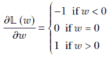

由于梯度对所有 *w* 的值都是常数，L1 正则化在所有 *w* 的值上以相同的步长将权重推向 0。特别是，当接近 0 时，向 0 的步长不会减小其幅度。在 L2 正则化中，

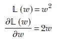

在这里，随着 *w* 接近 0，梯度的大小持续减小。因此，*w* 越来越接近 0，但由于更新步骤随着 *w* 接近 0 而变得越来越小，它可能永远不会达到 0。因此，L2 正则化产生的权重向量比 L1 正则化更密集，而 L1 正则化产生的权重向量稀疏，包含许多 0。

### 9.3.5 贝叶斯定理和优化的随机视图

在章节 6.6.2 和 6.6.3 中，我们讨论了无监督学习中的最大似然估计（MLE）和最大后验（MAP）（如果需要，请鼓励您回顾这些章节）。在这里，我们将在监督学习的背景下研究它们。

在监督优化过程中，我们有输入和已知输出对的样本（以训练数据的形式）⟨^((*i*)), *ȳ*^((*i*))⟩。当然，我们可以在每个训练数据点上执行前向传递并生成网络输出


其中 *θ* 是网络的参数集（代表权重和偏置的总和）。

假设我们将样本训练数据生成视为一个随机过程。我们可以根据当前的网络参数 *θ* 建模训练实例 *T*^((*i*)) = ⟨*ȳ*^((*i*)), ^((*i*))⟩ 的概率。

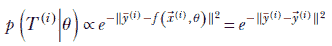

这在直观上是合理的。在 *θ* 的最优值处，网络输出 *f*(^((*i*)), *θ*) 将与 GT *ȳ*^((*i*)) 匹配。我们希望我们的模型分布在网络输出与 GT 匹配的位置具有最高的概率密度。概率密度应该随着与该位置的距离增加而减小。

仔细思考一下，我们可以发现这个类似于高斯公式的形式，它导致了一个类似于回归损失的分子，并不是唯一可能的。我们可以在分子中使用任何损失函数，因为它们都具有当网络输出与真实值匹配时达到最小值，随着不匹配的增加而逐渐增大的特性。一般来说，

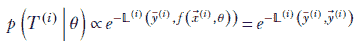

假设训练实例是相互独立的，整个训练数据集同时出现的概率是各个实例概率的乘积。如果我们用 *T* 表示整个训练数据集，

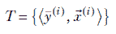

然后


在这一点上，我们可以采取下两个小节中描述的两种可能的方法之一。

基于 MLE 的优化

在这种方法中，我们通过最大化似然函数来选择参数集 *θ* 的最优值


这相当于说我们将选择最优参数 *θ*，使得训练数据的出现概率最大化。因此，最优参数集 *θ*[*] 由以下公式得出


显然，最大化似然的最优 *θ* 是最小化 𝕃(*θ*) 的那个。所以，最大似然公式实际上就是最小化整个训练数据集上预测值和真实值之间的总不匹配。

MAP 优化

根据贝叶斯定理（方程 6.1），


为了估计最优 *θ*，我们也可以最大化该方程左侧的后验概率。这相当于说我们将选择最优参数 *θ*，使得在训练数据集给定的情况下 *θ* 具有最大的条件概率。因此，最优参数集 *θ* 的值由以下公式得出


其中最后一个等式是通过贝叶斯定理推导出来的。

观察前面的方程，我们可以看到最右侧项的分母 *p*(*T*) 不涉及 *θ*，因此可以从优化中省略。所以，


我们如何建模 *a priori* 概率 *p*(*θ*)？我们可以使用奥卡姆剃刀原则，并说我们赋予较小的参数值更高的 *a priori* 概率。因此，我们可以表示为


然后，整体后验概率最大化变为


注意：最大化这个后验概率等价于最小化正则化损失。最大化似然等价于最小化未正则化损失。

### 9.3.6 Dropout

在 9.3 节的介绍中，我们了解到，过多的表达能力（过多的感知器节点）有时会阻止机器发展出一般的 *抽象*（也称为 *经验*）。相反，机器可能会记住训练数据实例（见图 9.11）。这种现象称为过拟合。我们已经看到，缓解这种问题的一种方法是在损失中添加正则化惩罚——例如添加权重的 L2 范数——以阻止网络学习大的权重值。

Dropout 是另一种正则化方法。在这里，有些疯狂的是，我们在训练期间关闭网络中的随机感知器（将它们的值设置为 0）。更准确地说，我们给第 *l* 层的第 *i* 个节点（感知器）附加一个概率 *p[i]^l*。在任何训练迭代中，节点（感知器）关闭的概率为 (1−*p*）。通常，dropout 只在训练期间启用，在推理期间关闭。

这有什么好处呢？好吧，

+   Dropout 防止网络过度依赖少数节点。相反，网络被迫使用所有节点。

+   等价地，dropout 鼓励训练过程将权重分散到多个节点，而不是过多地依赖于少数节点。这使得效果与 L2 正则化有些相似。

+   Dropout 缓解了 *共适应*：网络中一组节点以高度相关的方式行为，大多数时候发出相似的输出。这意味着网络可能只保留其中一个，而不会造成显著的精度损失。

Dropout 模拟了一组子网络

考虑一个具有 dropout 的某个神经网络的三个节点的小型中间层。该层的第 *k* 个输入以概率 *p[k]* 被激活。这意味着该输入节点关闭的概率是 (1−*p[k]*)。我们可以用 *k* = 0 或 *k* = 1 或 *k* = 2 的 *二进制* 随机变量 *δ[k]* 来表示这一点。这个变量 *δ[k]* 可以取两个可能值之一：0 或 1。它取值为 1 的概率是 *p[k]*。换句话说，*p*(*δ[k]* = 1) = *p[k]*，而 *p*(*δ[k]* = 0) = 1 − *p[k]*。具有 dropout 的这个小三个节点层的输出可以表示为

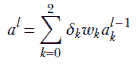

我们有三个变量 *δ*[0]，*δ*[1] 和 *δ*[2]，每个变量可以取两个值。总共我们有 2³ = 8 种可能的组合。每种组合对应图 9.13 中显示的一个子节点。这些组合中的每一个都有发生概率 *P[i]*，也在图中显示。这些观察结果导致了一个非常重要的洞察：

输出的期望值——即 𝔼(*a[l]*)——与如果我们随机部署图 9.13 中的子网络时的输出期望值相同，概率为 *P[i]*。

这为什么很重要呢？好吧，给定一个问题，我们中没有人知道网络部署的正确感知器数量。在这种情况下可以做的事情之一是随机部署各种强度的网络，并取其输出的平均值。我们刚刚已经证明，丢弃（随机关闭输入）可以达到同样的效果。但是部署一个随机打开或关闭输入的网络比部署大量子网络要简单得多。我们只需要部署一个 *丢弃* 层。

Dropout 的 PyTorch 代码

在 9.2.3 节中，我们创建了一个简单的两层神经网络分类器，根据身高和体重数据预测 Statsville 居民是男性、女性还是儿童。在本节中，我们展示了添加了丢弃层的相同模型。请注意，丢弃层仅在训练期间启用，而不是在推理期间。要在 PyTorch 中实现这一点，您可以在运行推理之前调用 `model.eval()`。这样，您的训练和推理代码保持不变，但 PyTorch 在幕后知道何时包含丢弃层，何时不包含。

列表 9.14 Dropout

```py
class ModelWithDropout(torch.nn.Module):
    def __init__(self, input_size, hidden_size, output_size):
        super(Model, self).__init__()
        self.net = torch.nn.Sequential(
            torch.nn.Linear(input_size, hidden_size),
            torch.nn.Dropout(p=0.2),                 ①

            torch.nn.Linear(hidden_size, output_size),
            torch.nn.Dropout(p=0.2)
        )

    def forward(self, X):
        return self.net(X)
```

① 实例化一个丢弃层，丢弃概率为 0.2

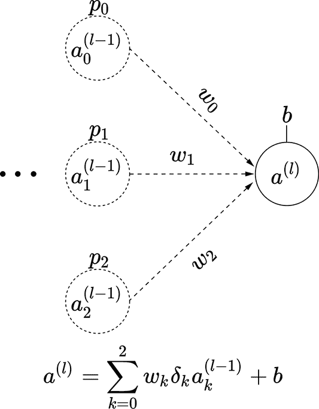

(a) 子网络 0：概率 *P*[0] = (1−*p*[0]) (1−*p*[1]) (1−*p*[2])


(b) 子网络 1：概率 *P*[1] = (1−*p*[0]) (1−*p*[1]) *p*[2]

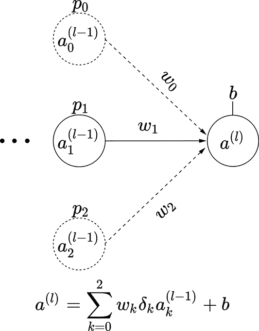

(c) 子网络 2：概率 *P*[2] = (1−*p*[0] )*p*[1] (1−*p*[2])


(d) 子网络 3：概率 *P*[3] = (1−*p*[0] )*p*[1] *p*[2]


(e) 子网络 4：概率 *P*[4] = *p*[0] (1−*p*[1]) (1−*p*[2])

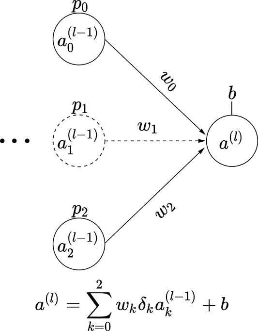

(f) 子网络 5：概率 *P*[5] = *p*[0] (1−*p*[1]) *p*[2]

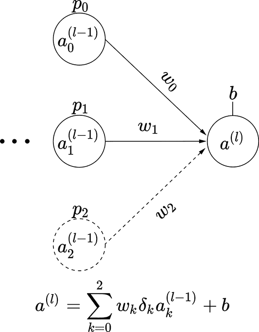

(g) 子网络 6：概率 *P*[6] = *p*[0] *p*[1] (1−*p*[2])


(h) 子网络 7：概率 *P*[7] = *p*[0] *p*[1] *p*[2]

图 9.13 Dropout 模拟子网络：以神经网络的三节点中间层为例。输入节点 *a[k]*^((*l* − 1)) 被激活的概率为 *p*(*δ[k]* = 1) = *p[k]*。

## 摘要

+   训练是神经网络识别其参数（各个感知器的权重和偏置）最优值的过程。训练是迭代进行的：在每次迭代中，我们估计损失并运行一个优化步骤，以更新参数值以减少损失。经过多次这样做后，我们希望达到最优参数值。

+   在监督神经网络中，损失量化了在采样训练数据实例上所需输出和网络输出之间的不匹配。所需输出（真实值）通常通过人工努力来估计。训练神经网络本质上识别了使损失最小化的神经网络权重和偏差。

+   真实值和网络输出之间的差异可以用许多不同的方式表示。每个都对应于不同的损失函数。将第 *i* 个训练输入给出的所有可能类别的真实概率表示为向量 *ȳ*^((*i*))，并将网络输出表示为 *y*^((*i*))，

    +   回归损失取网络输出和真实向量之间向量差异的 L2 范数，并在数学上表示为 。

    +   如果神经网络是一个分类器，它通常输出一个类概率向量。这意味着

        

        其中 *p[j]*(^((*i*))) 是网络估计的输入属于类别 *j* 的概率，*N* 是可能类别的数量。一般来说，给定一个输入，神经网络计算每个类别的得分：得分最高的类别是预测的类别。得分是无界的数字，可以是任意大或小（甚至是负数）。该操作将它们转换为概率。如果

        

        表示得分向量，相应的 softmax 向量是 

        其中 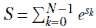。softmax 输出向量由概率组成，这意味着它们是介于 0 和 1 之间的数字，并且它们的总和为 1。

    +   给定每个类的概率，分类器可以使用交叉熵损失，它可以表示为

        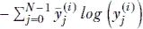。

        注意，由于真实向量是 one-hot 编码的，这个表达式中的只有一个项会幸存：对应于所需类别的那个项，用 *j*^* 表示。损失成为相应网络输出的对数，即 −*log*(*y*[*j*^*]^((*i*))), 如果 *y*[*j*^*]^((*i*)) = 1，则损失为零。这与我们的预期一致：如果网络以概率 1 预测 GT 类，则没有损失。

    +   由于在训练过程中，softmax 几乎总是紧跟着交叉熵损失，PyTorch 有一个名为 softmax 交叉熵损失的组合运算符。单独执行这些操作是多余的，因为它具有更好的数值特性。

    +   Focal loss 通过对具有更高损失的“困难”示例赋予更多权重来尝试解决数据不平衡问题。

    +   Hinge loss 是另一种流行的损失，当以最大分数预测正确类别时变为零。一旦达到这个标准，它就不再尝试改进分数的相对值。

+   总损失可以通过将所有单个训练数据实例的损失相加来获得。然而，这要求我们在每次迭代中处理所有训练数据点，这是非常昂贵的。因此，我们采样训练数据点的子集来创建一个小批量，估计小批量中每个输入数据实例的损失，并将它们相加以获得总损失的估计。这个过程被称为随机梯度下降（SGD）。

+   优化是更新神经网络参数（感知器的权重和偏置）的过程，以减少损失。我们可以将损失与权重和偏置值绘制成图，并得到一个在权重和偏置值域上定义的超曲面。我们的最终目标是达到这个损失超曲面的底部（最小点）。优化在几何上等同于沿着超曲面向下移动以减少损失。最陡下降（朝向最近的极小值）沿着负梯度发生。

+   我们可以将多个其他标准与梯度结合，以改善收敛到最小损失值。每个标准都会导致不同的优化技术：

    +   由于估计值存在噪声，局部梯度可能并不总是指向最小值，但它将包含一个指向该最小值的主成分，同时还有其他噪声成分。我们不是盲目地跟随当前梯度，而是可以跟随当前梯度估计值和前一次迭代梯度估计值的加权平均方向。这是一个递归过程，有效意味着任何迭代中跟随的方向是当前和从训练开始的所有梯度估计值的加权平均。最近的梯度被赋予更高的权重，而较旧的梯度被赋予较低的权重。所有这些梯度都包含指向最小值的主成分，相互强化，而噪声成分则指向随机方向，并倾向于相互抵消。因此，整体加权总和是一个更可靠的朝向最小值的移动。这被称为基于动量的梯度下降。

    +   动量的一个缺点是它可能导致超过最小值。Nesterov 加速梯度通过一步前瞻计算梯度来纠正这一缺点。如果当前更新使我们到达最小值的另一侧，那么梯度将具有相反的方向。我们取基于动量的梯度下降建议的更新和估计目标点处的梯度的加权平均。如果我们离最小值很远，这大致等同于基于动量的梯度下降。但如果我们即将超过最小值，将会发生抵消，更新将小于纯动量情况下的更新。因此，我们减少了超过最小值的机会。

    +   AdaGrad 是一种优化技术，它给损失超曲面中不经常变化的轴赋予额外的权重。Adam 优化器结合了许多其他优化器的优点，通常是现代优化器的首选。

+   奥卡姆剃刀原理本质上说的是，在足够的解释中，最简单的一个应该被优先考虑。在机器学习中，这导致了正则化。通常有很多解决损失最小化问题的方法。我们希望选择最简单的一个。因此，我们在其他任何损失上添加一个偏离简单性的惩罚（正则化损失）。这激励系统寻求最简单的解决方案。正则化损失通常是参数向量的总长度；因此，正则化推动我们朝着参数绝对值更小的解决方案发展。

+   在没有正则化项的情况下最小化损失函数等价于贝叶斯最大似然估计（MLE）技术。另一方面，带有正则化项的最小化损失等价于最大后验（MAP）估计。

+   过度拟合是一种现象，其中神经网络已经学会了训练数据中的所有细微差别。由于训练数据中的异常细微差别通常是由噪声引起的，这导致在推理过程中的性能变差。过度拟合表现为在训练数据上具有很高的准确率（低损失），但在测试数据上准确率较差。这通常是因为网络的表达能力超过了解决问题所需的程度，并试图记住训练数据中的所有角落和弯道。正则化可以缓解这个问题。另一个技巧是 dropout，我们在训练迭代中故意关闭一个随机子集的神经元。这迫使所有神经元学会用更少的神经元来完成工作。
