# 附录

## A.1 两个向量之间夹角的点积和余弦

在 2.5.6.1 节中，我们说明了向量  沿另一个向量  的分量是  ⋅  = *^T*。这相当于 |||| ||||*cos*(*θ*)，其中 *θ* 是向量  和  之间的角度。

在本节中，我们为二维情况提供这个证明，以加深你对点积几何学的直觉。从图 A.2 中，我们可以看到

这可以重新写为

方程 A.1

方程 A.2

使用方程 A.1 中的已知三角恒等式，我们得到

(a) 2D 向量沿坐标轴的分量。注意，|||| 是斜边的长度。

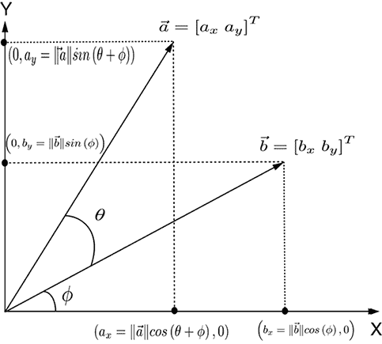

(b) 作为另一向量沿一个向量的分量的点积  ⋅  = *^T* = *a[x]b[x]* + *a[y]b[y]* = |||| ||||*cos*(*θ*).

图 A.1 向量分量和点积

代入方程 A.2 中的 *cosϕ* 和 *sinϕ*，我们得到一个以 *cosθ* 和 *sinθ* 为未知数的联立线性方程组：

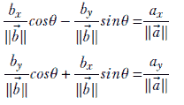

这个联立线性方程组可以紧凑地写成矩阵-向量形式

这可以简化为

这个方程可以求解得到

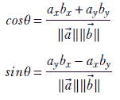

因此，|||| ||||*cosθ* = *a[x]b[x]* + *a[y]b[y]*，这正是我们要证明的。

## A.2 矩阵行列式

如果天真地计算行列式，计算过程既繁琐又数值不稳定。你永远不应该手动计算——所有线性代数软件包都提供执行此操作的例程。因此，我们只描述计算 2×2 矩阵行列式的算法。这个行列式可以计算为

*det*(*A*) = *a*[11]*a*[22] − *a*[12]*a*[21]

逆矩阵是

## A.3 计算高斯分布的方差

从方程 5.13 的积分形式，我们有

代入方程 5.22，

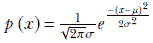

在其中，我们得到

将 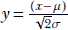 代入，这表示  和 2*σ*²*y*² = (*x* − *μ*)²，我们得到

使用分部积分，

现在，将 *v* = *y*² 代入，这表示 *dv*/2 = *y dy*，

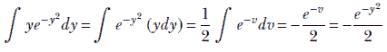

因此，

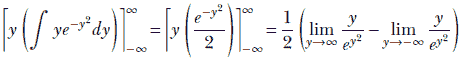

这些极限可以使用洛必达法则来评估：

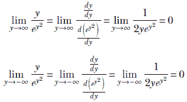

在这两种情况下，极限都是零，因为无论 *y* 是趋向于正无穷还是负无穷，*e*^(*y*²) 都趋向于正无穷。因此，分母在这两种情况下都趋向于无穷大，导致分数趋向于零。

因此，计算 *var[高斯]*(*x*) 的第一个项变为

.

第二项

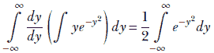

最后这个积分是特殊的一个。为了评估它，我们需要从一维到二维——这可能是极少数情况下，使问题更复杂反而有帮助的情况之一。它值得检查，让我们来看看。设

由于积分变量无关紧要，我们也可以写成

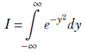

让我们相乘它们：

这个双重积分的积分域（也称为积分区域）是无限大的 *XY* 平面，其中 *x* 和 *y* 都从 −∞ 到 ∞ 变化。这个相同的平面也可以看作是一个无限半径的圆（无限半径的圆与无限长边的矩形相同！）。因此，我们可以切换到极坐标，使用以下变换

*x* = *r cos*(*θ*)

*y* = *r cos*(*θ*)

这意味着

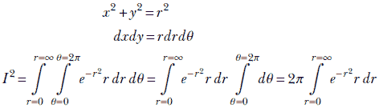

将 *v* = *r*² 代入，这表示 *dv* = 2*rdr*，我们得到

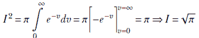

因此，*var[高斯]*(*x*) 的第二项计算结果为 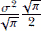。我们已经证明第一项计算结果为零。所以，我们得到

*var[高斯]*(*x*) = *σ*²

因此，概率密度函数 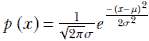 中的 *σ* 是标准差（方差的平方根），而 *μ* 是期望值。

## A.4 统计学中的两个定理

在本节中，我们研究多元统计学中的两个重要不等式：Jensen 不等式和对数和不等式。

### A.4.1 Jensen 不等式

考虑一个随机变量 *X*。现在，让我们将这些视为离散变量，尽管我们将得到的结果同样适用于连续变量。因此，让随机变量取离散值 [1]，[2]，⋯，*[n]*，其概率为 *p*([1])，*p*([2])，⋯，*p*(*[n]*).

现在假设 *g*() 是一个定义域包含这些随机变量的凸函数。从方程 3.11 和章节 3.7 中，我们知道对于任何凸函数 *g*()，对于其任意一组输入值 *[i]*，*i* = 1⋯*n* 和一组权重 *α[i]* *i* = 1⋯*n* 满足 ，函数输出的加权总和大于或等于输入加权总和的函数输出：即，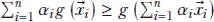

特别是，让我们选择所有随机变量作为输入值，它们的概率作为权重（*α[i]* = *p*(*[i]*)）。我们可以这样做，因为概率之和为 1，正好与权重应该做到的相同。这导致

方程 A.3

方程 A.3 是詹森不等式。一个很好的记忆方法是：*对于凸函数，函数的期望值大于或等于期望值的函数*。它也适用于连续随机变量。

### A.4.2 对数和不等式

假设我们有两个正数集合 *a*[1]，*a*[2]，⋯，*a[n]* 和 *b*[1]，*b*[2]，⋯，*b[n]*。令 *a* = Σ*[i]^n*[= 1] *a[i]* 和 *b* = Σ*[i]^n*[= 1] *b[i]*。给定这些，对数和不等式定理表明，

方程 A.4

为了理解为什么这是真的，让我们给出一个非正式的证明。首先，让我们定义 *g*(*x*) = *xlogx*。这是一个凸函数，因为

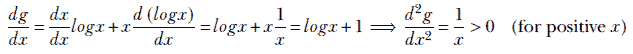

现在，根据这个 *g* 的定义，

最后这个表达式是凸函数输出的加权总和，权重之和为 1（因为 Σ*[i]^n*[= 1] *b[i]*/*b* = 1）。因此，我们可以使用方程 3.11，章节 3.7。然后我们得到

## A.5 伽玛函数与分布

要理解伽玛分布，我们需要了解基本的伽玛函数。首先，让我们对伽玛函数做一个概述。

### A.5.1 伽玛函数

在某种意义上，伽玛函数是阶乘的推广。阶乘函数仅对整数定义，并由基本方程

*n*! = *n*(*n* − 1)!

伽玛函数定义为

方程 A.5

对方程 A.5 应用分部积分，我们得到

第一个项为零。这是因为

因此，

因此，对于整数值 *α* = *n*，*Γ*(*n*) = *n*!. 有其他等价的伽马函数定义，但在这里我们不会讨论它们。相反，让我们来谈谈伽马分布。

### A.5.2 伽马分布

具有伽马分布的随机变量的概率密度函数是一个具有两个参数 *α* 和 *β* 的函数：

方程 A.6

很容易看出这是一个合适的概率密度函数：

通过代入 *y* = *βx*，我们得到

如果 *α* = 1，伽马分布简化为

这在图 A.2a 中以 *β* 的几个值进行了绘图。伽马分布有两个项 *x*^(*α*−1) 和 *e*^(−*βx*)，它们具有某种相反的效果：前者随着 *x* 的增加而增加，而后者随着 *x* 的增加而减少。在 *x* 较小的值时，前者占主导地位，乘积随着 *x* 的增加而增加。但最终，指数函数开始占主导地位，并将乘积向下渐近地拉向零。因此，伽马分布有一个峰值。较大的 *β* 导致更高的峰值和更陡峭的向零的下降。较大的 *α* 将峰值进一步向右移动。期望值是 𝔼(*x*) = *α*/*β*，如图 A.2 所示。

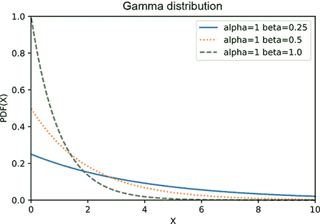

(a) 伽马分布：*α* = 1，各种 *β* 值

(b) 伽马分布：*β* = 1，各种 *α* 值

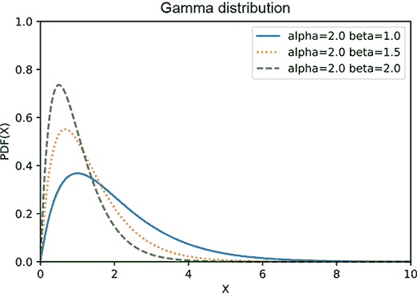

(c) 伽马分布：*α* = 2，各种 *β* 值

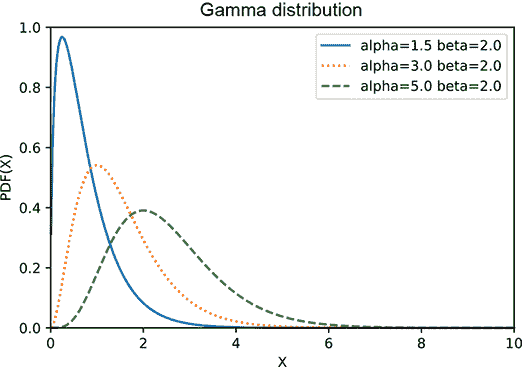

(d) 伽马分布：*β* = 2，各种 *α* 值

图 A.2 不同 *α* 和 *β* 值的伽马分布图。较大的 *β* 导致更高的峰值和更陡峭的向零的下降。较大的 *α* 将峰值向右移动。期望值是 𝔼(*x*) = *α*/*β*。

伽马分布的期望值 𝔼(*x*) = *α*/*β*。这可以通过一个小技巧证明，这个技巧如此酷，仅凭这一点就值得讨论：

但伽马分布

或者

使用这个，

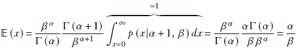

伽马分布的最大值

为了最大化伽马概率密度函数 *p*(*λ*|*X*) = *λ*^((*α[n]* − 1))*e*^(−*β[n]λ*) 对于随机变量 *λ*，我们取导数并将其等于零：

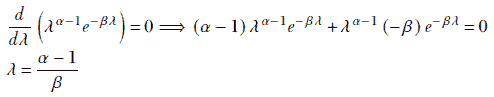
