# 第十章：模型部署

本章涵盖

+   在我们的本地系统上部署深度学习模型到简单的网络应用程序

+   Google Cloud 关键概念的介绍

+   Vertex AI 简介，Google Cloud 中的机器学习环境

+   使用 Vertex AI 端点部署深度学习模型

+   适配网络应用程序以使用 Vertex AI 端点

+   使用 Gemini 为 Google Cloud 获取生成式 AI 辅助

在第九章中，我们回顾了使用表格数据训练深度学习模型的一组最佳实践，并介绍了吉隆坡房地产价格预测问题作为一个具有混合类型特征的挑战性表格问题。在本章中，我们将使用第九章中训练的模型，并在一个简单的网络应用程序中部署它。首先，我们将本地部署它——也就是说，将网络服务器和训练好的模型都放在我们的本地系统上。接下来，我们将介绍 Google Cloud 作为部署我们模型的另一种方式。实际上，我们将训练好的模型部署到 Vertex AI 中，这是 Google Cloud 中的机器学习环境。最后，我们将探讨如何在 Google Cloud 上使用 Google 的生成式 AI 助手 Gemini。本章中描述的代码可在 [`mng.bz/6e1A`](https://mng.bz/6e1A) 获取。

## 10.1 简单的 Web 部署

一旦我们训练了一个深度学习模型，并遵循了第九章中描述的最佳实践，我们仅仅只是触及了从模型中获取价值的过程的表面。以我们在第九章中训练的吉隆坡房地产价格预测模型为例。这个模型对于想要为他们的客户提供定价建议的房地产经纪人来说可能很有用。这个模型也可能对想要将他们的房产推向市场以了解他们可能期望从其房产中获得的价值的房主有用。最后，这个模型也可能对对在吉隆坡购买房产感兴趣的买家有用，这样他们就可以根据一定的预算了解在特定位置可以购买哪种类型的房产。

显然，我们在第九章训练的模型有可能对各种受众都有用。我们面临的困境是如何让这个模型对所有具有不同商业目标和可能不同计算机技能的受众都可用。在本章的后面部分，我们将学习如何在公共云环境中部署模型，但如果我们想进行一个初步实验来了解模型的特点并与一些测试客户进行测试呢？我们需要实现整个在公共云中部署模型的过程吗？不，因为我们可以利用 Flask，这是一个 Python 网络应用程序库，并设置一个自包含的模型网络部署。Flask 最初由 Armin Ronacher 于 2010 年发布，并从此成为 Python 最受欢迎的 Web 框架之一。考虑到最近出现的包，如 Streamlit ([`streamlit.io/`](https://streamlit.io/)) 或 Gradio ([`www.gradio.app/`](https://www.gradio.app/))，它可能听起来有点过时。然而，尽管它已经存在了一段时间，但由于其轻量级和灵活的特性，Flask 仍然是 Web 开发的合适选择，尤其是对于小型个人项目。我们不会在本书中探讨 Flask 的所有细节；我们只是提供设置模型演示所需的要点，但如果你想了解更多关于 Flask 的信息，请查看文档：[`flask.palletsprojects.com/en/2.3.x/`](https://flask.palletsprojects.com/en/2.3.x/)。

现在我们已经介绍了简单 Web 部署的概念，我们可以开始着手了。在本节中，我们将介绍如何使用 Flask 在两个网页中创建一个简单而完整的模型部署。

### 10.1.1 网络部署概述

到目前为止，在这本书中，我们已经探讨了各种机器学习和深度学习的库和框架。除了在 YAML 中定义的配置文件外，我们在这本书中查看的所有代码都是 Python 编写的。像我们之前看到的例子一样，机器学习或深度学习模型的 Web 部署确实包括 Python，但它还需要处理 HTML、JavaScript 和 CSS 脚本。图 10.1 展示了我们心中的网络部署概述。

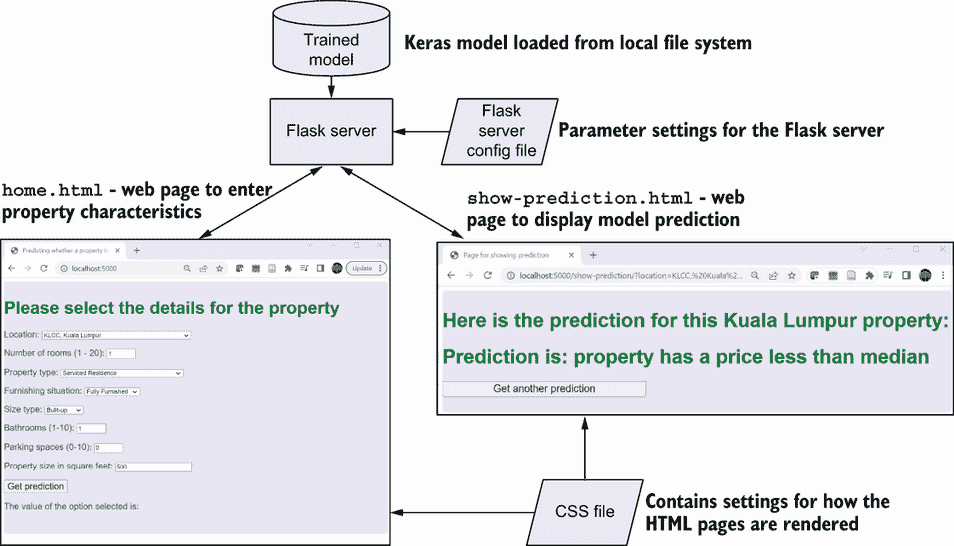

图 10.1 网络部署概述

让我们回顾一下构成图 10.1 所示网络部署的组件：

+   *训练好的模型—*这是我们保存在 Keras 预处理层笔记本中的模型。实际上，模型是以目录结构保存的 ([`mng.bz/oKJp`](https://mng.bz/oKJp))。在 Flask 服务器模块中，使用对该目录的引用来加载模型。

+   *Flask 服务器模块*—这是一个 Python 模块，用于加载训练好的模型，并包含每个解决方案 HTML 页面的视图函数。视图函数指定当这些 HTML 页面被加载时，Flask 服务器模块采取的操作。

+   *Flask 服务器配置文件*—YAML 文件，其中可以指定 Flask 服务器的参数，例如包含训练模型的目录。

+   `home.html`—由 Flask 服务器提供的 HTML 页面之一。此页面包含用户可以指定他们想要获取价格预测的房产特征的字段（例如位置、房间数量和停车位数量）。此页面还包含 JavaScript 函数，用于将默认值加载到页面上的每个字段中，指定可以输入到每个字段的合法值，并将用户输入的值打包，以便可以发送回 Flask 服务器模块。

+   `show-prediction.html`—由 Flask 服务器提供的 HTML 页面之一。此页面显示模型对用户在`home.html`页面上输入的房产特征的预测。

+   *CSS 文件*—指定解决方案中 HTML 页面的渲染方式。

与本书中的其他示例不同，默认情况下 Web 部署运行在您的本地系统上。当 Flask 服务器运行时，它会在`localhost:5000`上提供`home.html`，这样您就可以在浏览器中练习系统。

现在我们已经介绍了 Web 部署，我们将在后续小节中更详细地查看 Flask 服务器模块和 HTML 页面。

### 10.1.2 Flask 服务器模块

Flask 服务器模块是 Web 部署的核心。与本书中迄今为止我们检查的其他 Python 程序不同，它是一个独立的`.py`文件，而不是 Jupyter Notebook。

在本小节中，我们将回顾 Flask 服务器模块中的关键代码片段，并解释它们如何驱动 Web 部署。以下列表显示了 Flask 服务器模块的第一个关键部分：从文件系统将保存的 Keras 模型加载到 Python 模块中的对象的代码。

列表 10.1 加载保存的 Keras 模型

```py
rawpath = os.getcwd()                                             ①
model_path = os.path.abspath(os.path.join(rawpath, 'models'))
model_directory_name = \
os.path.join(model_path,config['file_names'] \
['saved_model'])                                                  ②
loaded_model = \ 
tf.keras.models.load_model(model_directory_name)                  ③
```

① 获取当前目录

② 获取完全限定的模型目录

③ 使用完全限定的模型文件名加载模型

在列表 10.1 中，完全限定的模型目录是通过从配置文件中加载的模型文件名构建的。期望模型目录位于名为`models`的目录中，与 Flask 服务器模块在同一目录下。模型是通过与第九章中 Keras 预处理层训练笔记本中用于加载模型的相同`tf.keras.models.load_model`函数加载的。

Flask 服务器模块最重要的部分是视图函数，它们指定了应用程序中每个 HTML 页面采取的操作。以下列表显示了`home.html`的视图函数，这是当`home.html`是目标时调用的代码。

列表 10.2 `home.html`视图函数

```py
@app.route('/')                                                 ①
def home():   
    title_text = "web deployment of Keras model"
    title = {'titlename':title_text}
    return render_template('home.html',title=title)             ②
```

① 装饰器，表示此视图函数用于`home.html`

② 发送到`home.html`以进行渲染的参数

列表 10.2 中显示的视图函数只是向`home.html`页面发送一个标题，并渲染页面。

列表 10.3 显示了`show-prediction.html`的视图函数。当`show_prediction.html`是目标时，Flask 模块运行此代码。此视图函数处理用户在`home.html`中输入的值，并调用模型对这些值进行预测。

列表 10.3 `show-prediction.html`视图函数

```py
@app.route('/show-prediction/')                                 ①
def show_prediction():
    scoring_dict = {}
    for col in config['scoring_columns_cat']:
        print("value for "+col+" is: "+str(request.args.get(col))) 
        scoring_dict[col] = str(request.args.get(col))          ②
    for col in config['scoring_columns_cont']:
        scoring_dict[col] = float(request.args.get(col))        ③
    scoring_dict['size_type_bin'] = \
str(request.args.get('size_type'))+' 1'                         ④
    input_dict = \
{name: tf.convert_to_tensor([value]) for name, \
value in scoring_dict.items()}                                  ⑤
    predictions = loaded_model.predict(input_dict)              ⑥
    prob = tf.nn.sigmoid(predictions[0])
    if prob < 0.5:                                              ⑦
        predict_string = "Prediction is: property has a price less than 
median"
    else:
        predict_string = "Prediction is: property has a price more than 
median"
    prediction = {'prediction_key':predict_string}
    return(render_template('show-prediction.html',\
prediction=prediction))                                         ⑧
```

① 装饰器表示此视图函数用于`show-prediction.html`

② 将查询字符串中的分类特征值加载到`scoring_dict`字典中

③ 将连续特征值从查询字符串加载到`scoring_dict`字典中

④ 设置`size_type_bin`参数的值

⑤ 从`scoring_dict`构建输入字典

⑥ 从加载的模型中获取加载的特征值的预测

⑦ 根据预测值设置输出预测字符串

⑧ 使用预测字符串渲染`show-prediction.html`

列表 10.3 中显示的视图函数将`home.html`返回的查询字符串加载到 Python 字典`scoring_dict`中，并使用这些值调用列表 10.1 中代码加载的模型以获取预测。唯一的例外是`size_type_bin`。为了这个简单的 Web 部署，我们硬编码了分箱值。作为一个练习，考虑一下你将如何计算分箱值以避免这种硬编码。预测的值用于设置一个字符串值，该值在页面渲染时发送到`show-prediction.html`以显示。

图 10.2 说明了列表 10.2 和 10.3 中显示的视图函数如何与`home.html`和`show-prediction.html`网页交互。


图 10.2 视图函数与网页之间的交互

图 10.2 解释了 Flask 服务器模块中`home.html`的视图函数渲染`home.html`。`home.html`中的 JavaScript 函数构建一个包含用户在`home.html`中的特征值的查询字符串。这个查询字符串返回到 Flask 服务器模块中的`show-prediction`视图函数。该视图函数从查询字符串中加载特征值，并使用它们从模型中获取属性预测。模型预测用于创建预测字符串，当渲染时传递给`show-prediction.html`。预测字符串在`show-prediction.html`中显示。

现在我们已经检查了图 10.2 右侧 Flask 服务器模块中的 Python 代码的关键部分，在下一节中，我们将超越 Python，查看驱动图 10.2 左侧发生的 HTML 和 JavaScript 代码。

### 10.1.3 `home.html`页面

`home.html`页面中发生了很多事情：

+   设置用户可以输入基于预测的八个属性特征的值的字段

+   为每个字段设置默认值和范围

+   当用户点击获取预测并从字段收集输入时，将它们发送到 Flask 服务器模块中的视图函数

图 10.3 总结了 `home.html` 中 JavaScript 函数与用户界面元素的交互。


图 10.3 `home.html` 中 JavaScript 和 UI 元素的交互

在介绍了 `home.html` 中的情况之后，让我们来检查这个网页的代码。列表 10.4 展示了 `home.html` 中输入字段定义的示例。这些是用户可以输入值以指定他们想要获取价格预测的属性的详细信息的 HTML 字段。

列表 10.4 字段 HTML 定义示例

```py
<p> 
    Location:                                              ①
    <select id="location" >                                ②
    </select> 
</p>
<p> 
    <label for="rooms">
Number of rooms (1 - 20):</label>                          ③
        <input type="number" id="rooms" name="rooms"       ④
        min="1" max="20">                                  ⑤
</p>
```

① 位置字段的标签

② 定义位置字段的 ID

③ 定义房间字段的标签

④ 定义房间字段的 ID

⑤ 定义房间字段的最大值和最小值

列表 10.4 展示了用于分类字段（`location`）和连续字段（`rooms`）的 HTML 定义示例。其他字段的 HTML 定义遵循相同的模式，为所有连续字段设置了最小值和最大值。

当页面通过以下语句在 HTML 页面开头加载时，`load-selections()` JavaScript 函数会被执行：

```py
<body onload="load_selections()">
```

以下列表展示了 `load-selections()` JavaScript 函数的关键部分，该函数设置页面以便用户可以选择他们想要获取预测的属性的属性。

列表 10.5 `load-selections()` JavaScript 函数

```py
function load_selections(){
    // initialize all selections
    var select_location = 
document.getElementById("location");                        ①
    var select_property_type = document.getElementById("property-type"); 
    var select_furnishing = document.getElementById("furnishing");
    var select_size_type = document.getElementById("size-type");
    var location_list = ["KLCC, Kuala Lumpur",..            ②
    var property_type_list = 
["Serviced Residence","Bungalow",...                        ③
    var furnishing_list = ["Fully Furnished","Partly Furnished",...;
    var size_type_list = ["Built-up" ,"Land area" ];        ④
    document.getElementById("rooms").defaultValue  
= 1;                                                        ⑤
    document.getElementById("bathrooms").defaultValue = 1;
    document.getElementById("car-parks").defaultValue = 0;
    document.getElementById("size").defaultValue = 500;
    // Populate location list:
    for(var i = 0; i < location_list.length; i++) {         ⑥
        var opt = location_list[i];
        select_location.innerHTML += 
"<option value=\"" + opt + "\">" + opt + "</option>";
        }
….
    };
```

① 定义位置字段的标识符

② 定义包含位置字段选择列表值的列表

③ 定义包含属性类型字段选择列表值的列表

④ 定义包含尺寸类型字段选择列表值的列表

⑤ 设置房间字段的默认值

⑥ 循环填充位置字段选择列表中的值

从列表 10.5 中我们可以看到 `load-selections()` JavaScript 函数执行的主要操作：

+   对于连续字段，设置默认值。这是页面初始加载时在字段中显示的值，如果用户没有更改它，则将其传递给 Flask 服务器模块。

+   对于分类字段，定义用户可以从中选择的值，并使用这些值填充字段的选择列表。在 `home.html` 中，这些值定义在一个硬编码的列表中。在一个更健壮的 Web 应用程序中，这些值将保存在一个与代码分开的控制文件中，以便更容易维护这些值并减少向代码中添加回归的风险。

当用户设置了他们想要的属性值并点击获取预测按钮时，以下代码指定运行 `link_with_args()` JavaScript 函数：

```py
<button>
<a onclick=
"link_with_args();" style="font-size : 20px; width: 100%; 
height: 100px;">Get prediction</a>
</button>
```

列表 10.6 显示了 `link_with_args()` JavaScript 函数。此函数在用户点击 `home.html` 中的获取预测按钮时被调用。它调用 `home.html` 中的其余代码，收集用户的输入值并将它们打包成一个查询字符串，然后将其传递回 Flask 模块中的 `show_prediction()` 视图函数。

列表 10.6 `link_with_args()` JavaScript 函数

```py
function link_with_args(){
    getOption();
    console.log("in link_with_args");
    console.log(window.output);                              ①
    window.location.href = window.output;                    ②
    }
```

① 将查询字符串回显到控制台

② 设置页面目标

如列表 10.6 所示，`link_with_args()` JavaScript 函数简单地调用 `getOption()` 函数，并将生成的查询字符串设置为 `window.output` 页面的目标。

列表 10.7 显示了 `getOption()` JavaScript 函数。此函数加载用户在 `home.html` 中输入的所有值，并将它们打包成一个查询字符串，然后将其传递回 Flask 模块中的 `show_prediction()` 视图函数。

列表 10.7 `getOption()` JavaScript 函数

```py
function getOption() { 
  selectElementlocation = 
document.querySelector('#location');                          ①
  selectElementpropertytype = document.querySelector('#property-type');
  selectElementfurnishing = document.querySelector('#furnishing');
  selectElementsizetype = document.querySelector('#size-type');
  rooms_value = document.getElementById("rooms").value;       ②
  bathrooms_value = document.getElementById("bathrooms").value;
  car_parks_value = document.getElementById("car-parks").value;
  size_value = document.getElementById("size").value;
  location_string = 
selectElementlocation.options\
[selectElementlocation.selectedIndex].value                   ③
  property_type_string = 
selectElementpropertytype.\
options[selectElementpropertytype.selectedIndex].value
  furnishing_string = 
selectElementfurnishing.\
options[selectElementfurnishing.selectedIndex].value
  size_type_string = selectElementsizetype.\
options[selectElementsizetype.selectedIndex].value
  prefix = "/show-prediction/?"
  window.output = 
prefix.concat("location=",location_string,"&rooms=",\
rooms_value,"&property_type=",property_type_string,\
"&furnishing=",furnishing_string,"&size_type=
\",size_type_string,"&bathrooms=\
",bathrooms_value,"&car_parks=",car_parks_value,\
"&size=",size_value);                                         ④
  document.querySelector('.output').textContent = window.output; 
}
```

① 获取位置字段选择列表中的选定条目

② 获取输入到房间字段的值

③ 获取位置字段选择列表中选定条目的值

④ 将 window.output 的值设置为查询字符串

列表 10.7 中显示的 `getOption()` JavaScript 函数执行以下操作：

+   加载连续字段中的值：`rooms`、`bathrooms`、`car-parks` 和 `size`。

+   加载分类字段中选定的条目：`location`、`property-type`、`furnishing` 和 `size-type`。

+   构建查询字符串。查询字符串看起来如下：

```py
/show-prediction/?location=KLCC, Kuala Lumpur&rooms=1
&property_type=Serviced Residence&furnishing=Fully Furnished
&size_type=Built-up&bathrooms=1&car_parks=0&size=500
```

查询字符串由以下内容组成

+   URL `/show-prediction/`。请注意，此 URL 与列表 10.3 中显示的 Flask 服务器模块中 `show-prediction` 视图函数之前的前缀匹配：

```py
@app.route('/show-prediction/')
```

+   `?` 用于表示查询字符串的开始。

+   一组参数和值对，用于指示为 `home.html` 中的每个字段设置的值，由分隔符 `&` 分隔。例如，参数和值对可能如下所示：

```py
location=KLCC, Kuala Lumpur
rooms=1
property_type=Serviced Residence
furnishing=Fully Furnished
size_type=Built-up
bathrooms=1
car_parks=0
size=500
```

将查询字符串传递给 Flask 服务器模块中的 `show-prediction` 视图函数。如列表 10.3 所示，在该函数中，查询字符串被解析以获取在 `home.html` 中输入的每个特征的值，并使用这些值从模型中获取预测。

### 10.1.4 show-prediction.html 页面

现在我们已经查看了 Flask 服务器模块和 `home.html`，还有另一个网络部署组件需要检查：`show-prediction.html`。此页面显示模型对用户在 `home.html` 中输入值的属性所做的预测，并有一个按钮将用户带回到 `home.html`，在那里他们可以为另一个属性输入值。

列表 10.8 `show-prediction.html`

```py
<!DOCTYPE html> 
<head> 
  <title> 
    Page for showing prediction                            ①
  </title> 
  <link rel="stylesheet" href="{{ url_for('static', 
filename='css/main2.css') }}">                             ②
</head> 

<body> 
<!-- display the prediction  -->
<div class="home">
    <h1 style="color: green"> 
        Here is the prediction for \
this Kuala Lumpur property:                                ③
    </h1> 
    <h1 style="color: green"> 
        {{ prediction.prediction_key }}
    </h1>

<!-- link back to home.html for entering 
scoring parameters for another prediction  -->
    <form action="{{ url_for('home') }}">
        <input type="submit" 
value="Get another prediction" 
style="font-size : 20px; width: 40%; height: 30px;"/>
    </form>                                                ④

</div>
</body>
```

① 设置浏览器标签中显示的文本

② 设置页面的样式表

③ 简介文本

④ 返回到 `home.html` 的按钮

如列表 10.8 所示，`show-prediction.html`不包含任何 JavaScript 函数。页面的 HTML 定义了页面上的文本，按钮“获取另一个预测”将用户返回到`home.html`。图 10.4 显示了本节中讨论的元素在`show-prediciton.html`中的显示方式。


图 10.4 `show-prediction.html`中的关键元素

现在我们已经检查了 Web 部署的所有组件，我们将在下一节中回顾在 Web 上简单部署我们的模型的理由。

### 10.1.5 练习 Web 部署

既然我们已经了解了构成 Web 部署的组件，下一步就是看到部署的实际效果。为了练习 Web 部署，

1.  在您的本地系统上创建一个新的目录并克隆仓库 [`github.com/lmassaron/ml_on_tabular_data`](https://github.com/lmassaron/ml_on_tabular_data)。

1.  将`chapter_10`设置为当前目录并启动 Flask 服务器模块：

    ```py
    python flask_endpoint_deploy.py
    ```

1.  一旦 Flask 服务器模块运行，请在浏览器中转到`localhost:5000`以练习部署。

恭喜！您已经在简单本地 Web 应用程序的背景下练习了一个在表格数据上训练的深度学习模型。这种部署是我们练习训练好的模型并查看其是否按预期行为的一种高效方式。然而，这种非常基础的部署并没有包含我们在生产部署中期望拥有的许多特性。例如，我们不希望服务模型的资源受限于我们的本地系统。在本章的剩余部分，我们将探讨如何使用这个相同的 Web 应用程序来练习从云环境中的端点部署的训练模型。

## 10.2 公共云和机器学习操作

我们在上一个章节中回顾的简单 Web 部署展示了将训练好的模型投入生产所需的一些有用方面，但它有一些严重的局限性。它完全运行在本地系统上，因此没有访问本地系统的人将无法访问。这可能是一件好事，因为这种部署没有包含我们希望在生产部署中拥有的特性，包括

+   *扩展容量以满足需求*。如果利率下降，对价格预测的需求翻倍会发生什么？

+   *无缝模型更新*。如果我们用最新数据重新训练模型并需要快速部署它，而不中断服务，会怎样？

+   *同时服务多个模型的版本*。如果我们想通过向用户子集展示新模型来实验在另一个数据集上训练的模型版本，会怎样？我们如何服务多个模型的版本并控制每个版本的用户比例？

+   *模型监控*。随着房地产市场的不断发展，我们如何跟踪模型的准确性？我们如何在问题影响用户之前捕捉并纠正它们？

+   *弹性与可用性*。当本地系统需要维护或出现计划外中断时，应用将如何应对？我们如何确保用户可以继续访问该应用？

我们可以实施自定义代码来处理所有这些场景，但有一个更简单的解决方案。公共云提供了完整的、端到端的机器学习和机器学习操作（MLOps）环境，以解决这里列出的所有挑战。世界上使用最广泛的三个公共云是

+   AWS

+   Azure

+   谷歌云

许多组织将使用一个或多个这些公共云来部署他们的模型。

本章和第十一章中描述的公共云概念在这三个公共云中都是可用的，但我们将在本章中使用谷歌云作为公共云示例。这样做有几个原因。其中一位作者是在谷歌工作的员工，但更重要的是，我们客观的看法是谷歌云提供了一个易于使用的环境，用于部署使用表格数据训练的模型并探索 MLOps 的关键概念。在本章的剩余部分，我们将介绍如何开始使用谷歌云以及如何用它来部署模型。在第十一章中，我们将超越本章中的简单部署，探索谷歌云中使模型重新训练和重新部署变得容易的功能。

## 10.3 开始使用谷歌云

在本节中，我们将介绍开始使用谷歌云的初步步骤，包括首次访问谷歌云、创建项目以及创建谷歌云存储桶，一个数据存储容器。在下一节中，我们将了解如何使用谷歌云中的机器学习平台 Vertex AI 来部署我们的模型。

### 10.3.1 首次访问谷歌云

在本节中，我们将介绍如何首次登录谷歌云并设置一个谷歌云*项目*。你在谷歌云中做的每一件事都与一个项目相关联。你可以使用项目来组织你的工作，并控制可以访问给定谷歌云资源的团队和个人。要开始，请访问[`cloud.google.com`](https://cloud.google.com)并点击登录，如图 10.5 所示。

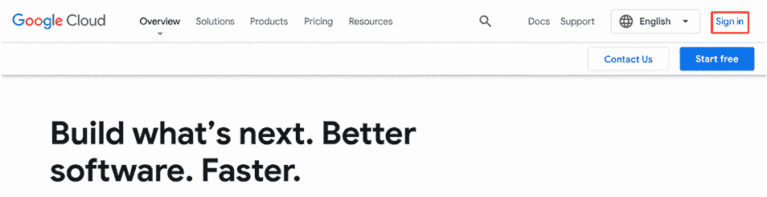

图 10.5 登录谷歌云

登录后，点击控制台以打开谷歌云控制台，如图 10.6 所示。

如果您之前没有使用过 Google Cloud，您需要设置您的计费账户。您可能有资格获得免费信用额度，但您需要输入信用卡详细信息才能使用本章和第十一章中描述的功能。一旦您登录，并在必要时完成设置带有计费详情的账户，您将进入控制台，如图 10.7 所示。

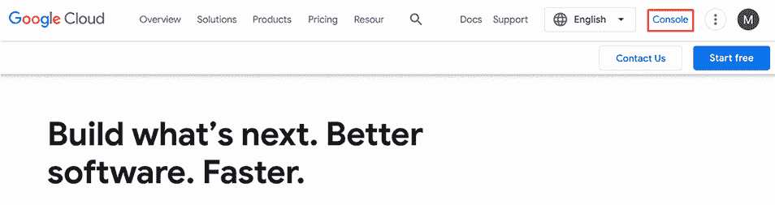

图 10.6 输入 Google Cloud 控制台


图 10.7 Google Cloud 控制台

控制台是 Google Cloud 的用户界面。这是与 Google Cloud 功能交互的界面选择之一，也是我们在本章中将在 Google Cloud 中执行的大多数操作所使用的界面。除了 Cloud 控制台外，您还可以使用

+   命令行界面

+   客户端库

注意：有关 Google Cloud 接口的更多详细信息，请参阅 [`cloud.google.com/docs/overview`](https://cloud.google.com/docs/overview)。

### 10.3.2 创建 Google Cloud 项目

您成功登录 Google Cloud 并访问 Google Cloud 控制台后，可以创建一个项目。在本节中，我们将介绍创建项目的步骤。

在 Google Cloud 控制台中，单击“项目选择”字段，如图 10.8 所示。在“选择项目”屏幕中，选择“新建项目”，如图 10.9 所示。然后，在“项目名称”字段中输入 `first-project-ml-tabular` 并单击创建，如图 10.10 所示。


图 10.8 选择项目

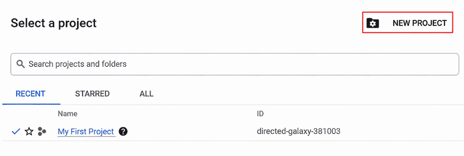

图 10.9 选择项目屏幕

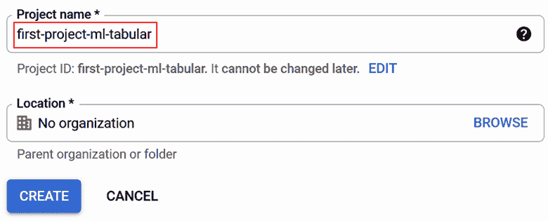

图 10.10 输入项目名称

恭喜！您已成功创建了您的第一个 Google Cloud 项目。

注意，项目名称对于您的项目集合必须是唯一的。项目 ID，位于“项目名称”字段下方，必须是全局唯一的，因此如果您有一个与 Google Cloud 中任何其他项目共享的项目名称，该项目的项目 ID 将自动更新为唯一。

### 10.3.3 创建 Google Cloud 存储桶

在 Google Cloud 中存储数据的主要方式是使用 Cloud Storage 存储桶。在本节中，我们将介绍您在部署模型时需要了解的关于 Cloud Storage 存储桶的详细信息。如果您想了解更多关于 Cloud Storage 存储桶的细节，请参阅文档：[`cloud.google.com/storage/docs/buckets`](https://cloud.google.com/storage/docs/buckets)。我们将使用一个存储桶来存储第九章中训练的模型。要创建 Cloud Storage 存储桶，请在 Cloud Console 的搜索栏中输入“cloud storage”，然后选择 Cloud Storage，如图 10.11 所示。


图 10.11 搜索 Cloud Storage

Cloud Storage 存储桶页面出现。选择创建以创建新的 Cloud Storage 存储桶，如图 10.12 所示。

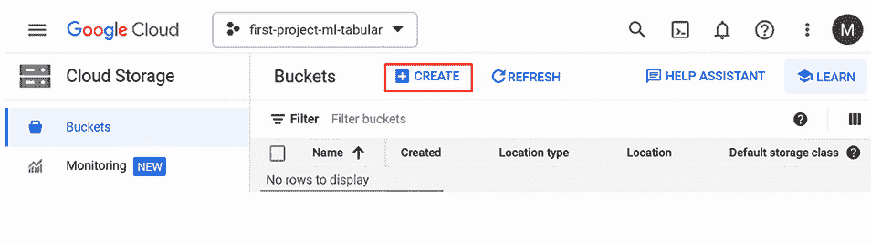

图 10.12 云存储视图

在“创建桶”页面中，为您的桶输入一个独特的名称（如图 10.13 所示），点击继续，然后在“位置类型”中选择区域，并选择一个区域，如图 10.14 所示。为了在 11 章中探索的机器学习管道脚本代码，桶需要创建在某个区域。为了本例的目的，您可以选择您喜欢的任何区域。点击创建。请注意，您的桶名称必须是全球唯一的。


图 10.13 设置桶名称


图 10.14 设置桶的位置类型

将显示新桶的“桶详细信息”页面，如图 10.15 所示。

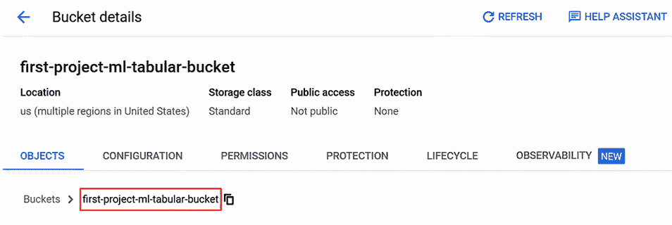

图 10.15 显示了新桶的详细信息

恭喜！您已创建了您的第一个 Google Cloud Storage 桶。

## 10.4 在 Vertex AI 中部署模型

在本章的早期，我们使用基于 Flask 的简单 Web 应用程序部署了吉隆坡房地产价格预测模型。在本节中，我们将使用 Google Cloud Vertex AI 环境部署相同的模型。

现在我们已经在 Google Cloud 中创建了一个项目，并在新项目中创建了一个云存储桶，我们准备在 Google Cloud 中部署一个模型。以下是我们将遵循的部署步骤（在 Vertex AI 文档[`mng.bz/nRJ2`](https://mng.bz/nRJ2)中描述得更详细）：

1.  将第九章中训练的模型上传到 Google Cloud 存储。

1.  将模型导入 Vertex AI 模型注册表。

以下各节描述了这些步骤。

### 10.4.1 将模型上传到云存储桶

将训练好的模型上传到 Google Cloud Storage 的最简单方法是上传包含训练模型的文件夹。如果您想上传已经训练过的模型版本，请克隆[`github.com/lmassaron/Advanced_Analytics_for_Business`](https://github.com/lmassaron/Advanced_Analytics_for_Business)上的 repo。您要上传的目录是`chapter_10/models/kl_real_estate_keras_preprocessing_model`。

要上传在第九章中创建的模型，请选择如图 10.16 所示的云存储页面中您创建的云存储桶。在“桶详细信息”页面中，选择“上传文件夹”，如图 10.17 所示。

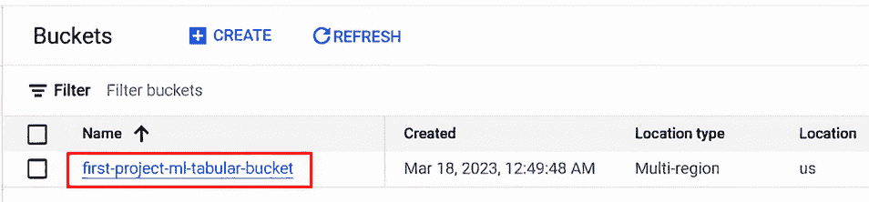

图 10.16 在云存储页面中选择您的桶

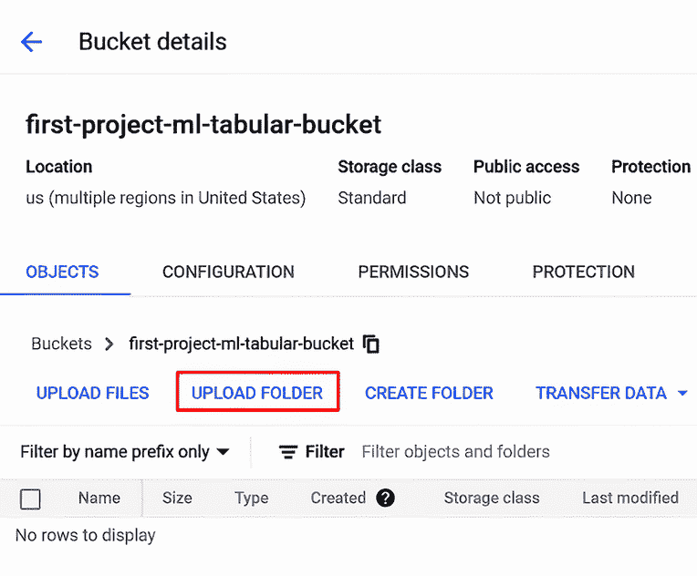

图 10.17 在桶详细信息页面中上传文件夹

选择包含第九章训练模型的本地系统上的文件夹。上传完成后，文件夹将出现在“桶详细信息”页面中，如图 10.18 所示。

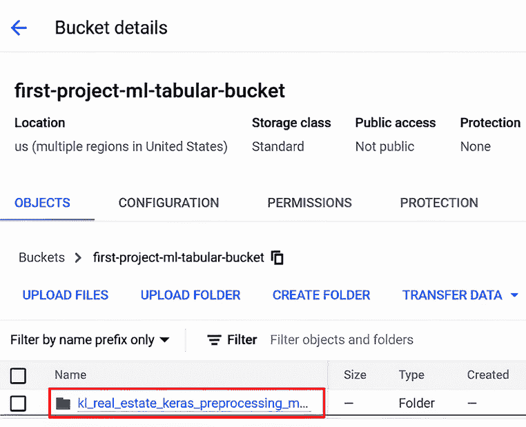

图 10.18 您上传的桶在桶详细信息页面中

恭喜！您已将模型上传到 Google Cloud。

### 10.4.2 将模型导入 Vertex AI

现在我们已经将模型上传到 Google Cloud Storage 存储桶，我们可以将其导入到 Vertex AI 模型注册表中。在 Google Cloud 控制台搜索栏中输入“vertex ai”以到达 Vertex AI 页面。如果您是第一次使用 Vertex AI，您将看到“启用所有推荐 API”。如果您看到此按钮，请单击它以启用使用 Vertex AI 所需的 API，如图 10.19 所示。

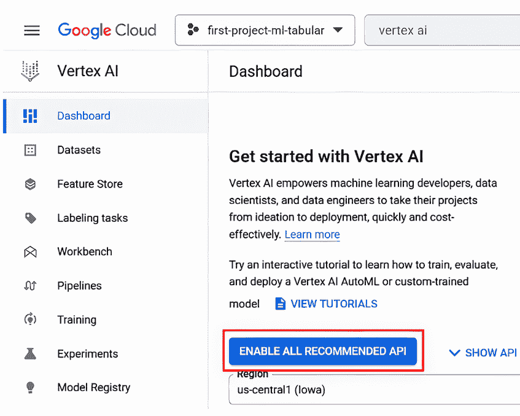

图 10.19 启用 Vertex AI API

然后在左侧导航面板中选择模型注册表，如图 10.20 所示，在模型注册表页面上单击导入，如图 10.21 所示。

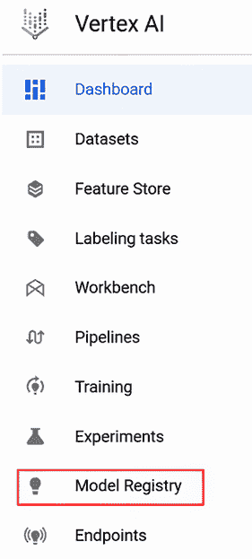

图 10.20 Vertex AI 页面导航面板中的模型注册表

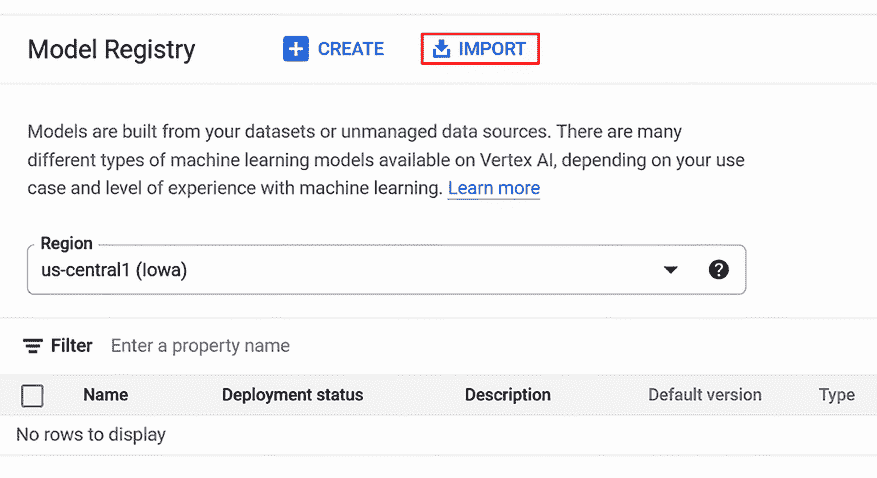

图 10.21 模型注册表导入

在导入模型页面上，选择“导入为新模型”，在名称字段中输入“first-model-ml-tabular”，然后单击继续，如图 10.22 所示。

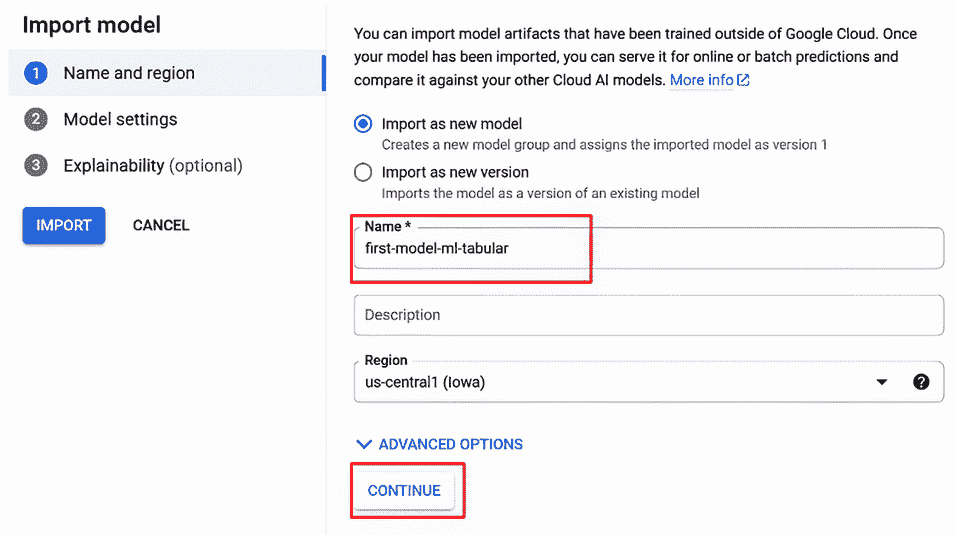

图 10.22 在模型注册表中指定导入模型的名称

在导入模型页面的模型设置选项卡上，按照以下步骤操作：

1.  在模型框架中，选择 TensorFlow。回想一下，第八章中 TensorFlow 是 Keras 的低级框架，我们用它来训练模型。

1.  在模型框架版本中，选择用于训练模型的 TensorFlow 级别。您可以从用于训练模型的笔记本中`tf.__version__`的输出中找到此级别：

    ```py
    tf.__version__ 
    2.9.2
    ```

1.  在模型工件位置中，单击浏览并选择您上传模型的文件夹。

1.  按照图 10.23 所示，单击继续并导入。

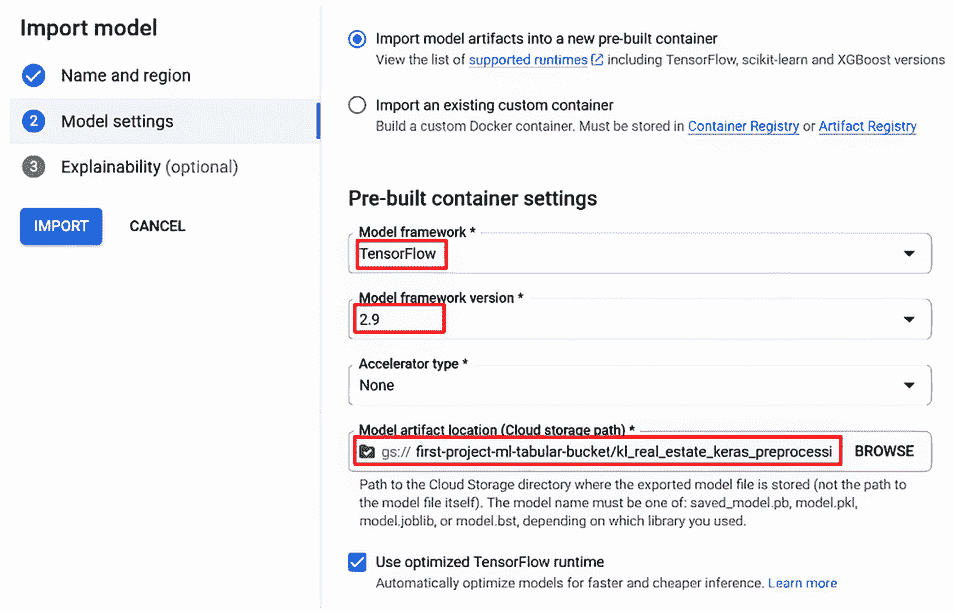

图 10.23 指定模型设置

模型导入过程可能需要几分钟才能完成。导入完成后，您将在模型注册表页面上看到新的模型名称，如图 10.24 所示。


图 10.24 模型注册表显示导入的模型

恭喜！您已将模型导入到 Vertex AI 中。在下一节中，我们将介绍如何通过端点使此模型可用。

### 10.4.3 将模型部署到端点

现在我们已经将训练好的模型导入到 Vertex AI 中，我们可以将其部署到端点。通过将模型部署到端点，我们得到一个 URL，我们可以使用它来调用模型。实际上，端点部署可以取代我们在本章早期简单 Web 部署中加载的本地文件系统中的模型文件。

要将模型部署到端点，在模型注册表页面上选择上一节中创建的模型。在模型详细信息页面上，选择模型的版本（默认为 1），如图 10.25 所示。在模型的版本页面上，单击“部署到端点”，如图 10.26 所示。在“部署到端点”页面上，输入端点名称并单击继续，如图 10.27 所示。


图 10.25 模型详情页面


图 10.26 部署您的模型

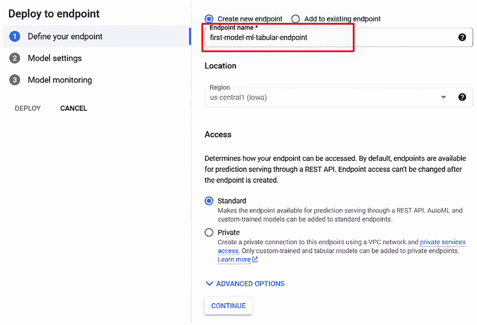

图 10.27 部署到端点页面

在模型设置选项卡下，在高级扩展选项中，选择一个最小机器类型，例如 `n1-standard-2`，如图 10.28 所示，然后点击继续。

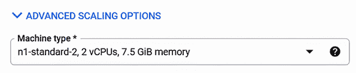

图 10.28 设置部署的机器类型

由于这是一个简单模型的测试部署，我们只需要一个最小机器类型。如果我们部署一个更复杂的需求模型或进行生产部署，我们可以根据模型的需求选择具有更多内存或计算资源的机器类型。对于我们的测试部署，最小机器类型已经足够好，并且它将比更高级的机器类型成本低。当您使用云环境时，使用足够满足您应用程序的资源而不是更多的资源是一种最佳实践。这样做可以为您节省金钱。

提示：有关 Vertex AI 端点部署的机器类型更详细的信息，请参阅[`mng.bz/vK14`](https://mng.bz/vK14)的文档。

如图 10.29 所示，点击部署。

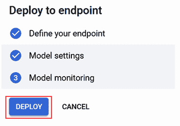

图 10.29 在部署到端点页面中选择部署

部署可能需要几分钟才能完成。当部署完成后，模型版本详情页面上的部署状态将变为活动状态，如图 10.30 所示。


图 10.30 模型已部署的确认

恭喜！您已在 Vertex AI 中完成了模型的部署。在下一节中，我们将介绍快速测试部署的步骤。

### 10.4.4 模型部署的初步测试

现在我们已经部署了模型，我们可以在 Google 控制台中直接对模型部署进行初步测试。

回想我们在第九章中进行的训练模型测试，以在 Jupyter Notebook 的上下文中锻炼模型。我们定义了一个包含所有用于训练模型的特征的 Python 字典，以及每个特征的值：

```py
sample = {
    'location': 'Sentul, Kuala Lumpur',
    'rooms': 3.0,
    'property_type': 'Condominium For Sale',
    'furnishing': 'Partly Furnished',
    'size_type_bin': 'built-up 1',
    'bathrooms': 2.0,
    'car_parks': 0.0,
    'size': 950.0,
}
```

我们可以重用这个示例来测试在 Vertex AI 中的模型部署。在模型版本详情页面，转到测试您的模型部分，如图 10.31 所示。


图 10.31 部署和测试标签页的测试您的模型部分

更新 JSON 请求字段以使用第九章示例中的值，每个值都是一个列表条目，并且在整个文档中使用双引号。当您完成更新后，JSON 请求字段应如图 10.32 所示。

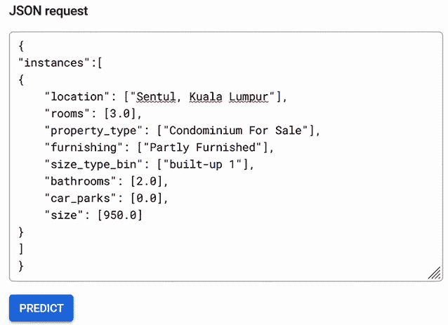

图 10.32 JSON 格式的测试样本

注意 JSON 请求样本格式与第九章 Jupyter Notebook 中的原始样本之间的三个差异：

+   键值对中的值都是数组而不是单个值。如果您有单个值，将会得到一个错误。

+   全角引号（“ “）被广泛使用，而不是单引号。

+   在最后一个键值对之后不需要逗号。

一旦 JSON 请求字段包含有效的 JSON，框架就会变成蓝色。点击预测，在响应字段中查看端点的输出，如图 10.33 所示。


图 10.33 端点对测试样本的响应

注意，预测值不是概率。回想一下，当我们从第九章模型训练笔记本中的模型获取预测，以及当我们从 Flask 服务器模块中的模型获取预测时，我们需要将模型的输出应用 sigmoid 函数以获取该属性价格高于中值的概率：

```py
predictions = loaded_model.predict(input_dict)
prob = tf.nn.sigmoid(predictions[0])
```

我们需要应用 sigmoid 函数来从端点提供的输出中获取概率。如果我们更新我们在训练笔记本中使用的语句，使得 sigmoid 函数的输入是端点的输出，那么我们就会得到与我们在第九章使用它来练习模型时相同的概率：

```py
prob2 = tf.nn.sigmoid(-1.52191401)
print(
    "This property has a %.1f percent probability of "
    "having a price over the median." % (100 * prob2)
)
This property has a 17.9 percent probability 
of having a price over the median.
```

现在，我们已经验证了端点工作正常，并且对于相同的属性，我们得到的结果与我们在 Jupyter Notebook 中直接应用模型时得到的结果相同。

## 10.5 使用 Flask 部署 Vertex AI

在上一节中，我们将吉隆坡房价预测模型部署到了 Vertex AI 的端点。在本节中，我们将适配 Flask Web 部署以使用此端点。完成之后，我们应该从`home.html`和`show-prediction.html`网页中获得相同的使用体验，模型将由 Vertex AI 端点提供服务，而不是本地系统。

为了使 Flask 部署与 Vertex AI 端点部署兼容，我们需要采取以下步骤：

1.  设置 Vertex AI SDK。

1.  更新 Flask 服务器模块以访问 Vertex AI 端点，从该端点获取模型的预测。

图 10.34 显示了适配使用 Vertex AI 端点部署的应用程序的关键组件。

在本节的剩余部分，我们将介绍使用 Web 应用程序部署模型所需的步骤。


### 10.5.1 设置 Vertex AI SDK

Vertex AI 提供了客户端库，允许您通过 Python、Java 和`node.js`应用程序中的 API 访问 Vertex AI 功能。Python 客户端库包含在 Vertex AI 的 Python SDK 中，因此我们将安装 SDK 以获取通过端点调用模型所需的 API 访问权限。

注意：有关 Vertex AI SDK 的完整详细信息，请参阅[`mng.bz/4a1j`](https://mng.bz/4a1j)上的文档。

您可以使用以下命令安装 Vertex AI SDK：

```py
pip install google-cloud-aiplatform
```

现在我们已经安装了 Vertex AI SDK，我们可以进行下一步：更新 Flask 服务器模块。

### 10.5.2 更新 Flask 服务器模块以调用端点

要了解如何通过端点使用 Vertex AI API 访问模型，请点击模型版本详情页面中的示例请求链接，如图 10.35 所示。

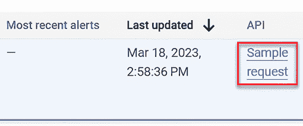

图 10.35 部署和测试选项卡中的示例请求链接

Flask 服务器模块的第一个更新是导入 Vertex AI 所需的库：

```py
from typing import Dict, List, Union
from google.cloud import aiplatform
from google.protobuf import json_format
from google.protobuf.struct_pb2 import Value
```

接下来，我们添加定义在 [`mng.bz/QD8v`](https://mng.bz/QD8v) 的 `predict_custom_trained_model_sample()` 函数。我们需要对这个函数进行一项更新，以便它将 `predictions`（包含端点的响应）返回到 `show-prediction.html` 视图函数。

列表 10.9 突出了我们需要对 `show-prediction.html` 视图函数进行的更新。这些更改将输入值打包成 Vertex AI 端点部署所期望的格式，并通过 `predict_custom_trained_model_sample()` 函数在 Vertex AI 端点调用模型。

列表 10.9 `show-prediction.html` 端点视图函数

```py
def show_prediction():
    scoring_dict = {}
    for col in config['scoring_columns_cat']:
        print("value for "+col+" is: "+str(request.args.get(col))) 
        scoring_dict[col] = str(request.args.get(col))
    for col in config['scoring_columns_cont']:
        scoring_dict[col] = float(request.args.get(col))
    scoring_dict['size_type_bin'] = str(request.args.get('size_type'))+' 1'
    scoring_dict.pop('size_type')                            ①
    input_dict = {name: [value] for name, \
value in scoring_dict.items()}                               ②
    print("input_dict: ",input_dict)
    predictions = predict_custom_trained_model_sample(
    project = config['endpoint']['project'],
    endpoint_id = config['endpoint']['endpoint_id'],
    location = config['endpoint']['location'],
    instances = input_dict)                                  ③
    prob = tf.nn.sigmoid(predictions[0])
```

① 从特征列表中删除 size_type

② 将 scoring_dict 中的值转换为值列表

③ 调用 predict_custom_trained_model_sample

列表 10.9 显示了对 `show-prediction.html` 视图函数的以下更新：

+   对端点的调用必须具有精确正确的特征和值列表，不能缺少特征或额外特征。由于我们不直接使用 `size_type` 与模型一起，我们需要使用 `scoring_dict.pop('size_type')` 语句显式地从特征和值的字典中删除它。

+   端点期望以与我们在 10.4.4 节中直接在控制台练习端点所使用的 JSON 相同的格式从字典中获取特征和值。这意味着字典中的值需要转换为值列表，每个列表中恰好包含一个值。此语句将字典转换为值列表：

```py
input_dict = {name: [value] for name, value in scoring_dict.items()}
```

+   `predict_custom_trained_model_sample()` 函数需要使用指定项目、端点和我们想要预测的特征键值对的参数来调用。

除了对 Flask 服务器模块的这些更新外，我们还可以删除从本地文件系统加载模型的语句，因为我们在这个解决方案中不使用本地模型。

注意：使用端点的 Flask 服务器模块的更新版本可在 [`mng.bz/Xx5a`](https://mng.bz/Xx5a) 获取。

要运行此版本的 Flask 服务器模块，请按照以下步骤操作：

1. 通过在运行 Flask 服务器模块的本地系统上的命令行中运行以下命令，通过此应用程序授权您用于访问 Google Cloud 的账户：

```py
gcloud auth application-default login
```

2. 启动 Flask 服务器模块：

```py
python flask_endpoint_deploy.py
```

如果您遇到与 protobuf（协议缓冲区）级别相关的错误，请尝试以下命令：

```py
pip install protobuf==3.20.*n
```

此命令将 protobuf 级别调整为端点所需的精确级别。

注意：在本应用的目的上，您不需要了解 protobufs，但如果您对此感兴趣，可以查看文档：[`protobuf.dev/`](https://protobuf.dev/).

3. 当 Flask 服务器模块运行时，在浏览器中转到`localhost:5000`以测试部署。

现在我们已经看到了模型的两种部署方式：一种是从本地系统完全运行的 Web 部署，另一种是使用从 Vertex AI 端点提供模型的 Web 部署。

### 10.5.3 将模型部署到端点的益处

如果模型在简单的 Web 部署或部署到端点时得到相同的结果，您可能会问，将模型部署到端点有什么意义。将模型部署到端点可以带来许多好处：

+   您可以扩展端点实例以处理额外的负载。

+   您可以将多个模型部署到同一端点。想象一下这样一个场景，您需要用另一个模型替换生产环境中的一个模型。如果您将这两个模型部署到同一端点，您可以在不更改应用程序的情况下，逐渐调整流量分配到新模型的比例，而不会对应用程序的用户造成突兀的变化。

+   您可以将相同的模型部署到不同的端点，从而优化机器资源。例如，如果您有一个生产和开发环境，您可以将相同的模型部署到两个端点，生产环境使用更高规格的机器资源，而开发环境使用更便宜的机器资源。

+   使用端点，您可以使用 Vertex AI 监控来检测偏差（训练数据与在生产中应用模型时看到的数据之间的分布差异）和漂移（模型在生产中看到的数据分布随时间的变化）。模型监控可以帮助确保模型的性能不会随时间下降，并且模型在生产中应用的数据的变化不会意外发生。有关监控的更多详细信息，请参阅[`mng.bz/yWdd`](https://mng.bz/yWdd)上的文档。

图 10.36 显示了多个模型部署到同一端点和单个模型部署到多个端点的示例。

在图 10.36 中，有两种场景：

+   *同一端点部署多个模型*——模型 A 是当前生产中的版本，模型 B 是我们希望引入生产的下一级模型。通过调整 X 和 Y 的值，我们可以控制流量分配到每个模型的比例，逐渐增加分配到新模型级别的比例。

+   *同一模型部署到多个端点*——端点 1 具有基本的计算资源，端点 2 具有足够的计算资源来处理我们当前的生产负载。通过这种方式，我们可以优化系统的资源成本，以满足多组用户的需求。


图 10.36 模型和端点之间的关系

注意：有关 Vertex AI 中模型部署的更多详细信息，请参阅 [`mng.bz/MDlB`](https://mng.bz/MDlB) 的文档。

## 10.6 Gemini for Google Cloud：Google Cloud 中的生成式 AI 辅助

在你完成本章步骤的过程中，你可能遇到了障碍或需要澄清问题。为了取得进展，你可能查阅了 Google Cloud 的文档，在 Stack Overflow 中搜索，或向同事寻求帮助。除了这些传统的辅助来源外，Google Cloud 还包括一个集成、由生成式 AI 驱动的辅助来源：Gemini for Google Cloud。

Gemini for Google Cloud 是一套针对 Google Cloud 的生成式 AI 能力。Gemini for Google Workspace 是一套针对 Google Workspace（Google Docs、Sheets、Slides）的配套生成式 AI 能力（参见 [`workspace.google.com/solutions/ai/`](https://workspace.google.com/solutions/ai/)）。在本章和第十一章中，我们将展示如何通过 Gemini for Google Cloud 使用生成式 AI 来简化表格数据模型的部署，并自动化机器学习管道的一些脚本。Gemini for Google Cloud 提供了各种能力，包括以下内容：

+   回答有关 Google Cloud 的问题

+   从文本生成代码（包括 SQL 和各种编程语言，如 Python、Java 和 JavaScript）

+   解释代码

注意：有关 Gemini for Google Cloud 的更详细概述，请参阅 Gemini for Google Cloud 文档：[`cloud.google.com/gemini/docs/overview`](https://cloud.google.com/gemini/docs/overview)。

在本节中，我们将介绍如何设置 Gemini for Google Cloud 并使用它来回答有关 Google Cloud 的问题。我们还将讨论本章中完成的一些操作，以在 Vertex AI 端点部署我们的模型。在第十一章中，我们将回到 Gemini for Google Cloud，展示如何使用它来生成和解释代码。

Google Cloud 不是唯一利用生成式 AI 来简化平台使用并自动化开发工作流程中某些步骤的云平台。Azure 中的 Copilot 和 AWS 中的 Code Whisperer 是基于生成式 AI 的功能，每个都提供了 Gemini for Google Cloud 提供的部分好处。

### 10.6.1 设置 Gemini for Google Cloud

以下是为设置 Gemini for Google Cloud 提供的说明：

+   为项目设置 Gemini for Google Cloud：[`cloud.google.com/gemini/docs/quickstart`](https://cloud.google.com/gemini/docs/quickstart)

+   设置 Gemini Code Assist，这是 Gemini for Google Cloud 中提供 AI 辅助开发的部分，用于 Google Cloud 的 Cloud Shell 编辑器：[`mng.bz/avMm`](https://mng.bz/avMm)

一旦为项目设置了 Gemini for Google Cloud，你将在工具栏中看到 Gemini for Google Cloud 图标（参见图 10.37）。


图 10.37 Gemini for Google Cloud 图标

现在我们已经完成了 Gemini for Google Cloud 的基本设置，我们将在下一节中看到如何使用它来回答关于 Google Cloud 的问题。

### 10.6.1 使用 Gemini for Google Cloud 回答关于 Google Cloud 的问题

Gemini for Google Cloud 在 Google Cloud 中表现出多种方式，包括

+   *在 Google Cloud 中可用的聊天面板中*——图 10.38 展示了 Gemini for Google Cloud 的聊天面板。


图 10.38 Gemini for Google Cloud 聊天面板

+   *在 Google Cloud 支持的多种 IDE 中，包括 VS Code、Cloud Workstations 和 Cloud Shell Editor*——图 10.39 展示了 Gemini for Google Cloud 如何从 Cloud Shell Editor 中的注释生成一个简单的 Python 函数。

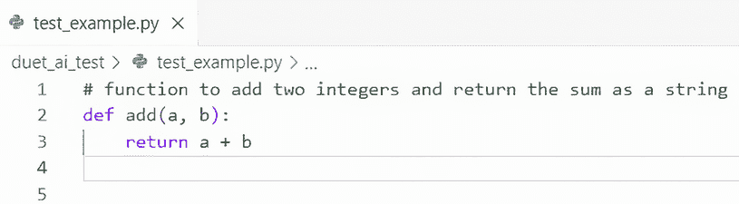

图 10.39 Gemini for Google Cloud 在 Cloud Shell Editor 中生成 Python

+   *在 Big Query 和 Spanner 的查询编辑器中*——图 10.40 展示了 Gemini for Google Cloud 如何从 Spanner 查询编辑器中的注释生成 SQL。

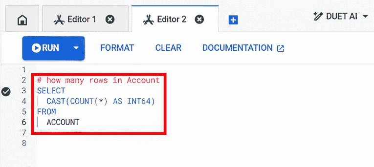

图 10.40 Gemini for Google Cloud 在 Spanner 查询编辑器中生成 SQL

现在我们已经回顾了 Gemini for Google Cloud 的适用示例，接下来让我们更深入地考察 Gemini for Google Cloud 的聊天面板，看看它是如何被用来获取关于 Google Cloud 的问题答案。您可以通过点击 Gemini 图标（见图 10.37）来打开 Gemini for Google Cloud 聊天面板，如图 10.41 所示。


图 10.41 Gemini for Google Cloud 聊天面板

通过在提示字段中输入指令提示并点击发送按钮来尝试使用 Gemini for Google Cloud 聊天面板，如图 10.42 所示。


图 10.42 Gemini for Google Cloud 聊天面板发送按钮

Gemini for Google Cloud 聊天面板在 Google Cloud 中随时可用，您可以使用它来提出关于 Google Cloud 的各种问题。例如，假设我们想要创建一个 Cloud Storage 存储桶，但我们忘记了本章前面列出的步骤。图 10.43 显示了 Gemini for Google Cloud 对提示“如何创建 Google 存储桶”的响应。


图 10.43 Gemini for Google Cloud 对“如何创建 Google Cloud 存储桶”的响应

Gemini for Google Cloud 专门训练以提供关于使用 Google Cloud 的有用答案。通过给出与本章某些部分相关的提示来尝试使用 Gemini for Google Cloud。例如，尝试“如何将自定义模型导入 Vertex AI”或“如何将模型部署到 Vertex AI 端点”，并查看 Gemini for Google Cloud 的响应与本章类似部分中列出的步骤有何不同。

## 摘要

+   在简单的 Web 应用程序中部署您的模型可以给您一个关于其在生产中的特性的感觉。

+   我们可以创建一个简单的 Web 应用程序来部署我们在第九章训练的模型。这个应用程序包括一个 Flask 服务器模块和两个简单的网页。

+   公共云环境提供了一个部署模型的环境，允许你扩展容量并控制可用性。

+   为了在 Google Cloud 中部署我们在第九章训练的模型，我们需要创建一个 Google Cloud 项目，创建一个 Google Cloud 存储桶，并将模型上传到存储桶中。

+   一旦我们完成了准备 Google Cloud 模型部署的步骤，我们就可以将训练好的模型部署到 Vertex AI 端点。

+   我们可以通过对我们在本章开头创建的 Web 应用程序中的 Flask 模块进行一些简单的更新来测试模型的 Vertex AI 端点部署。

+   将模型部署到 Vertex AI 的端点使部署更加稳健。特别是，我们可以指定适合我们应用程序的机器资源，提供不同级别的模型组合，并监控模型在生产中的性能。

+   Gemini for Google Cloud 提供了生成式 AI 能力，这些能力对于在 Google Cloud 中的模型开发和部署任务非常有帮助。
