# 第十一章：构建机器学习流程

本章涵盖

+   机器学习流程概述

+   在 Vertex AI 中运行机器学习流程的先决条件

+   模型训练和部署：本地实现与机器学习流程实现

+   定义一个机器学习流程以训练和部署模型

+   更新模型训练代码以与机器学习流程一起工作

+   使用生成式 AI 帮助创建机器学习流程

在第十章中，我们介绍了部署基于表格数据训练的深度学习模型的步骤。我们首先在本地系统中运行模型，然后将模型部署到 Vertex AI 端点。在本章中，我们将进一步介绍通过在 Vertex AI 中使用机器学习（ML）流程来自动化训练和部署过程的步骤。我们将首先概述设置 ML 流程所需的步骤，包括定义 Vertex AI 数据集。接下来，我们将对比第十章中看到的本地模型训练和部署与使用 ML 流程进行模型训练和部署。然后，我们将审查 ML 流程本身的代码，以及更新现有代码以使模型训练代码在 ML 流程的上下文中工作所需的更新。最后，我们将探讨一些我们可以应用生成式 AI 并在创建 ML 流程的工作流程中获得有用帮助的方法。本章中描述的代码可在[`mng.bz/DM4n`](https://mng.bz/DM4n)找到。

## 11.1 机器学习流程简介

考虑到本书中我们已经涵盖的步骤来准备一个基于表格数据的深度学习模型：

+   处理数据以解决诸如缺失值、包含两种不同类型数据列和以字符串表示的数值数据等问题

+   使用处理后的数据训练模型

+   将训练好的模型部署以便应用程序可以使用

假设我们需要反复进行这个过程来解决吉隆坡房地产问题。这是一个合理的预期，因为房地产市场会随着价格发展、利率变化和宏观经济因素影响房地产需求而不断变化。与其为从原始数据到部署模型的每个端到端周期手动运行各种笔记本和部署步骤，不如有一个可以作为一个单元反复和一致运行的编码解决方案。一个机器学习流程正好提供了这个功能，在本节中，我们将通过一个示例来说明如何为吉隆坡房地产问题设置一个简单、端到端的流程。

### 11.1.1 三种类型的流程

在深入了解 ML 管道的细节之前，值得注意的是，术语“管道”随着时间的推移被赋予了不同的含义。目前，在 ML/数据科学领域，至少有三个不同的“管道”含义占主导地位：

+   *训练/推理管道*——这个管道确保数据转换，如将文本分配给标记或将分类列中的值分配给数值标识符，在训练和推理步骤中是一致的。吉隆坡模型中的预处理 Keras 层构成了这种类型的管道，因为它们确保，例如，在训练之前对处理过的数据进行的转换与在 Web 部署中`home.html`中输入的数据点进行的转换完全匹配。

+   *数据管道*——这个管道处理输入训练数据中的异常，如缺失值或模式问题。它可以与前面提到的管道重叠，但它执行一个不同的任务。在 Google Cloud 的上下文中，Dataflow 和 Cloud Data Fusion 是能够执行数据管道任务的产品的例子。在本章的目的上，您不需要了解 Dataflow 或 Cloud Data Fusion，但如果您好奇，可以查看文档：[`cloud.google.com/dataflow/docs`](https://cloud.google.com/dataflow/docs) 和 [`cloud.google.com/data-fusion/docs`](https://cloud.google.com/data-fusion/docs)。

+   *ML 管道*——这是一种自动化各种步骤的管道，例如训练、部署和监控模型。TFX 和 KubeFlow 是 Vertex AI 中用于实现 ML 管道的两种方法。

图 11.1 展示了这三种类型的管道如何适应端到端 ML 工作流程。


图 11.1 三种管道及其关系

图 11.1 说明了管道的以下特征：

+   机器学习（ML）管道可以涵盖整个工作流程，从原始数据到监控部署的模型。这样做的原因是，ML 管道旨在在模型需要重新训练和重新部署时自动化整个流程。

+   数据管道与训练/推理管道的区别在于，训练/推理管道处理需要对新数据点应用以应用训练模型进行预测的转换，例如将分类值替换为数值标识符。在训练模型之前，必须对准备好的数据应用相同的转换。

+   正如我们在第三章中解决 Airbnb 纽约市价格预测问题的 Keras 自定义层解决方案中看到的那样，训练/推理管道可以与模型训练过程分开。在 Keras 自定义层解决方案中，训练/推理管道是通过 Scikit-learn 管道结构和自定义类实现的，这两个都需要在模型训练之前以及在新数据点应用于训练模型以获取预测之前应用于数据。另一方面，在第九章中，我们看到了如何将相同的处理直接集成到 Keras 模型中。

+   数据管道可以存在于机器学习工作流程之外。在 Google Cloud 中用于机器学习工作流程的相同数据管道工具，如 Dataflow 和 Cloud Data Fusion，也可以是包含机器学习的应用程序的一部分。

现在我们已经描述了三种不同类型的管道，在下一节中，我们将开始探讨如何在 Google Cloud 中使用 Kubeflow 创建一个针对吉隆坡房地产价格预测问题的机器学习管道。

### 11.1.2 Vertex AI ML 管道概述

在第十章中，我们介绍了将吉隆坡房地产价格预测模型部署到 Vertex AI 端点的过程。

要创建一个针对吉隆坡价格预测模型的机器学习管道，我们将从 Vertex AI 文档中描述的步骤开始：[`mng.bz/lYW6`](https://mng.bz/lYW6)。

以下是一个步骤概述：

+   设置一个*服务帐户*。服务帐户是一个应用程序用于在 Google Cloud 中执行操作所使用的帐户。当我们将 Keras 模型导入 Google Cloud 并部署到端点时，我们使用自己的 ID 来执行这些操作。由于机器学习管道将是一个自动化脚本，我们需要一个服务帐户来允许脚本在没有直接依赖任何个人的手动干预的情况下执行操作。有关服务帐户的更多详细信息，请参阅 Google Cloud 文档：[`mng.bz/BXA0`](https://mng.bz/BXA0)。

+   获取服务帐户密钥，并为服务帐户提供运行机器学习管道所需的访问权限。

+   创建一个管道脚本来调用 Vertex AI SDK。

+   将模型训练笔记本调整为独立的 Python 脚本，以便在预构建的 Vertex AI 容器中运行。

+   运行管道脚本来在容器中运行训练脚本并生成训练好的模型。

在接下来的章节中，我们将逐步介绍如何为吉隆坡房地产预测模型创建一个机器学习（ML）管道。

## 11.2 ML 管道准备步骤

在我们可以运行机器学习管道来训练和部署模型之前，我们需要设置管道所需的 Google Cloud 对象。在本节中，我们将设置一个服务帐户并介绍 Cloud Shell，这是一个直接在 Google Cloud 中可用的实例，我们可以使用它来输入命令。我们还将上传我们的数据集到 Google Cloud Storage，并使用上传的数据集创建一个 Vertex AI 数据集。

### 11.2.1 为 ML 管道创建服务账户

由于我们希望能够在没有人工干预的情况下自动运行 ML 管道，我们需要设置一个服务账户来运行管道。

要创建一个服务账户，请按照以下步骤操作：

1. 从整体 Google Cloud 控制台菜单中选择“IAM & Admin”->“服务账户”，如图 11.2 所示。


图 11.2 在 Google Cloud 控制台中选择服务账户

2. 在“服务账户”页面，选择“创建服务账户”，如图 11.3 所示。


图 11.3 创建服务账户

3. 在“创建服务账户”页面，输入服务账户的名称，然后点击“创建并继续”，如图 11.4 所示。请注意，服务账户 ID 会自动填写，并且服务账户的电子邮件 ID 以`service-account-id@project-id.iam.gserviceaccount.com`的形式显示——在本例中：`ml-tabular-pipeline@first-project-ml-tabular.iam.gserviceaccount.com`

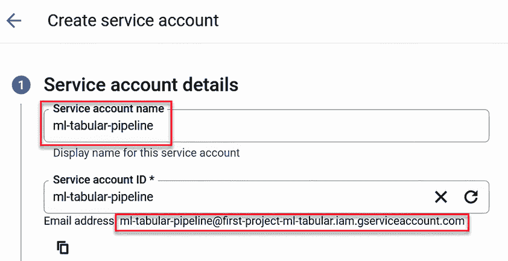

图 11.4 设置服务账户名称

4. 在“角色”字段中选择“Vertex AI 用户”，然后点击“完成”，如图 11.5 所示。

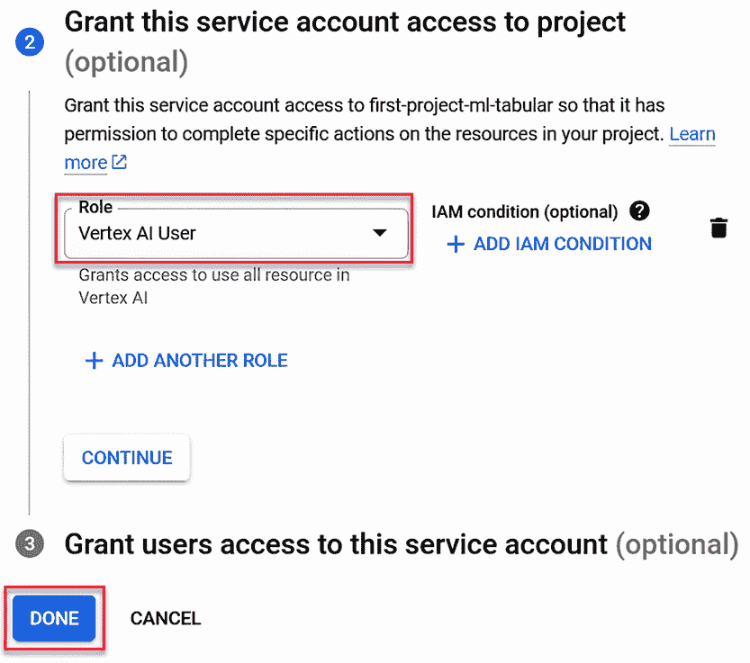

图 11.5 授予服务账户 Vertex AI 用户角色

现在我们已经创建了一个服务账户并授予它对 Vertex AI 的访问权限，在下一节中我们可以创建一个服务账户密钥。

### 11.2.2 创建服务账户密钥

ML 管道使用服务账户密钥来验证用于运行 ML 管道的服务账户。

要创建服务账户密钥，请按照以下步骤操作：

1. 在“服务账户”页面，点击如图 11.6 所示的刚刚创建的服务账户的电子邮件地址。

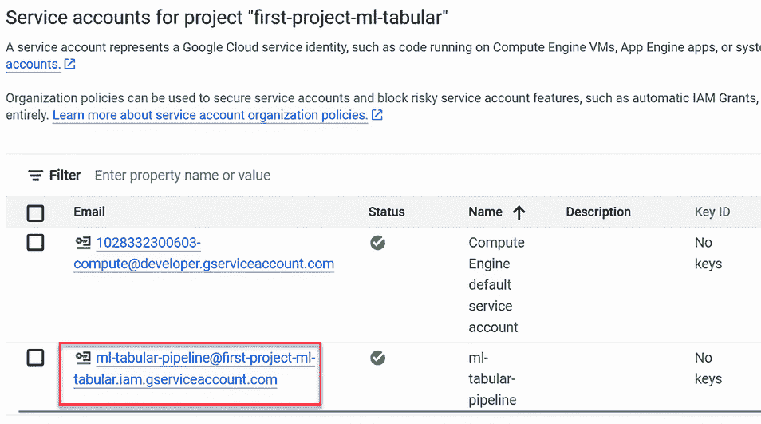

图 11.6 选择服务账户

2. 选择“密钥”选项卡，然后点击“添加密钥”->“创建新密钥”，如图 11.7 所示。


图 11.7 创建服务账户密钥

3. 选择“JSON”，然后点击“创建”，如图 11.8 所示。


图 11.8 下载服务账户密钥

创建了一个包含服务账户密钥的 JSON 文件，并将其以类似`first-project-ml-tabular-039ff1f820a8.json`的名称下载到您的本地系统。

### 11.2.3 授予服务账户对 Compute Engine 默认服务账户的访问权限

当你在 Google Cloud 中设置你的项目时，会自动创建一个 Compute Engine 默认服务账户。此账户有一个类似`PROJECT_NUMBER-compute@developer.gserviceaccount.com`的电子邮件地址。有关 Compute Engine 默认服务账户的更多详细信息，请参阅文档（[`mng.bz/dXdN`](https://mng.bz/dXdN)）。

我们需要给在前几节中设置的服务账户访问 Compute Engine 默认服务账户的权限来运行 ML 管道。按照以下步骤设置对此 Compute Engine 默认服务账户的访问权限：

1. 在“服务帐户”页面，点击您刚刚创建的服务帐户旁边的复制图标（您将在下一步需要它），然后点击 Compute Engine 默认服务帐户的电子邮件地址，如图 11.9 所示。

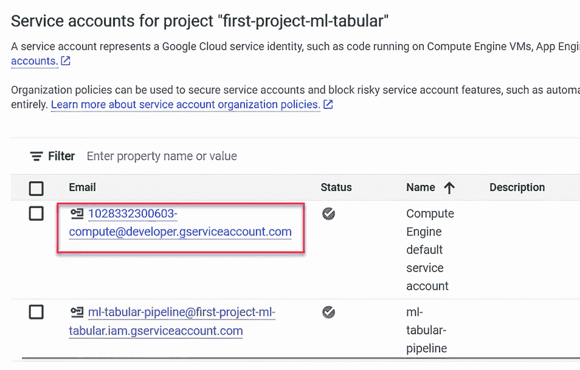

图 11.9 Compute Engine 默认服务帐户

2. 点击“权限”选项卡，然后点击“授予访问权限”，如图 11.10 所示。


图 11.10 授予 Compute Engine 默认服务帐户访问权限

3. 在“授予访问权限”页面，将您在“新主体”字段中创建的服务帐户的电子邮件 ID 粘贴到其中，在“角色”字段中选择“服务帐户用户”，然后点击“保存”，如图 11.11 所示。

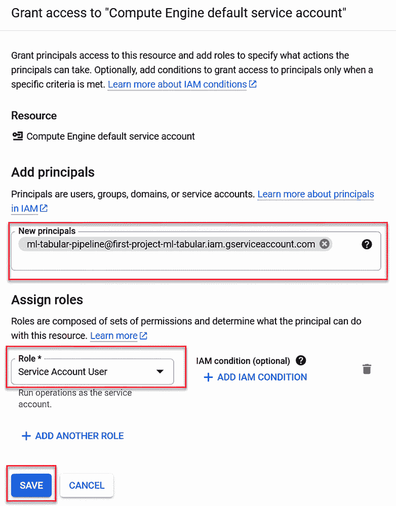

图 11.11 指定对 Compute Engine 默认服务帐户的访问权限

现在我们已经完成了设置 ML 管道服务帐户的步骤，我们可以继续设置管道。

### 11.2.4 Cloud Shell 简介

到目前为止，我们在 Google Cloud 中采取的所有操作都是在控制台 UI 中进行的。Google Cloud 还包括 Cloud Shell，这是一个自包含的实例，允许您运行命令行命令以与 Google Cloud 交互。除了命令行界面外，您还可以使用 Cloud Shell 编辑器编辑 Cloud Shell 文件系统中的文件。使用 Cloud Shell，您将获得本地 Linux 实例的功能，同时结合了与 Google Cloud 资源集成的基于 Web 的环境的便利性。Cloud Shell 特别适合原型设计和完成教程。我们将使用 Cloud Shell 在设置 ML 管道的下一步中。有关 Cloud Shell 的更多详细信息，请参阅文档：[`cloud.google.com/shell`](https://cloud.google.com/shell)。

要启动 Cloud Shell，请点击 Google Cloud 控制台顶部的“激活 Cloud Shell”图标，如图 11.12 所示。


图 11.12 激活 Cloud Shell 图标

当您点击激活 Cloud Shell 图标时，Cloud Shell 终端将在控制台底部打开，您的家目录作为当前目录，如图 11.13 所示。

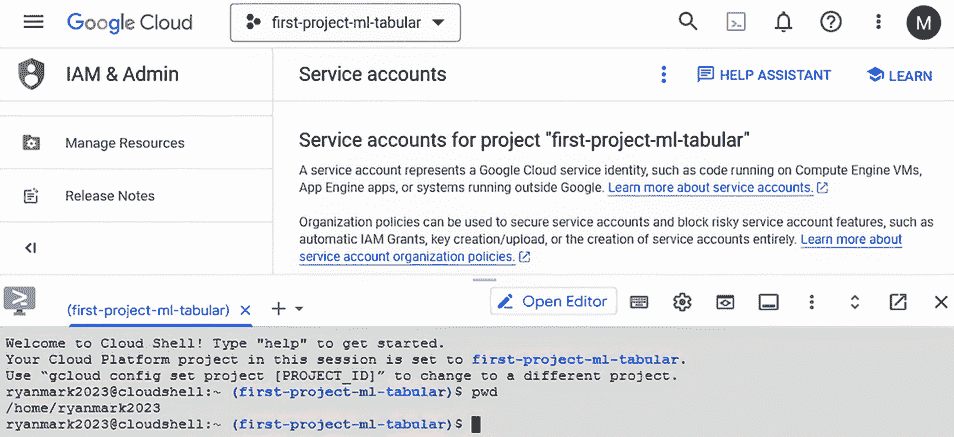

图 11.13 Cloud Console 已激活 Cloud Shell

您可以直接在 Cloud Shell 终端中运行命令，包括标准 Linux 命令和 Google Cloud 特定命令。您可以通过点击“打开编辑器”来编辑 Cloud Shell 文件系统中的文件，如图 11.14 所示。要返回 Cloud Shell 终端，请点击“打开终端”。


图 11.14 Cloud Shell 编辑器

现在我们已经简要了解了 Cloud Shell，我们可以继续下一步设置 ML 管道：使服务帐户密钥对管道可用。

### 11.2.5 上传服务帐户密钥

在本节中，我们将使用 Cloud Shell 上传服务账户密钥 JSON 文件，然后设置一个环境变量以指向服务账户密钥的位置：

1. 在 Cloud Shell 中，将您的家目录设置为当前目录，创建一个名为 `ml_pipeline` 的新目录，然后将该新目录设置为当前目录：

```py
cd ~  
mkdir ml_pipeline
cd ml_pipeline
```

2. 要上传服务账户密钥，选择 Cloud Shell 工具栏中的三个点，然后选择上传，如图 11.15 所示。


图 11.15 在 Cloud Shell 中上传文件

3. 在上传页面，将目标目录更新为您的家目录中的 `ml_pipeline` 目录，点击选择文件，并选择您在 11.2.2 节中下载的服务账户密钥 JSON 文件，然后点击上传，如图 11.16 所示。


图 11.16 设置上传参数

4. 通过将 `~/ml_pipeline` 设置为当前目录，并使用 `ls` 命令确保 JSON 服务账户密钥现在位于此目录中，来验证上传：

```py
cd ~/ml_pipeline  
ls
```

5. 将环境变量 `GOOGLE_APPLICATION_CREDENTIALS` 设置为服务账户密钥 JSON 文件的完整文件名。在以下示例中，将完整文件名替换为您自己的服务账户密钥 JSON 文件名：

```py
export \
GOOGLE_APPLICATION_CREDENTIALS=\
'/home/ryanmark2023/ml_pipeline/\
first-project-ml-tabular-039ff1f820a8.json'
```

6. 使用以下命令确认 `GOOGLE_APPLICATION_CREDENTIALS` 环境变量的值，并验证它是否设置为您的服务账户密钥文件的完整路径：

```py
$ echo $GOOGLE_APPLICATION_CREDENTIALS
```

现在我们已经上传了服务账户密钥并设置了环境变量以指向服务账户密钥的位置，我们就可以进入定义 ML 流程的关键步骤了。

### 11.2.6 将清洗后的数据集上传到 Google Cloud Storage 存储桶

为了简化流程，我们将上传由数据准备笔记本生成的处理后的数据集到 Cloud Storage 存储桶，以便其余的 ML 流程可以访问。在实际应用中，我们会将数据清理步骤集成到 ML 流程中，但为了简化，我们将从已经清理好的数据开始流程。按照本节中的步骤上传清洗后的数据集到 Google Cloud Storage：

1. 将清洗后的数据集的 CSV 版本上传到您创建用于上传模型的同一个存储桶。

2. 从 Google Cloud Console 主菜单中选择 Cloud Storage -> 存储桶，如图 11.17 所示。


图 11.17 设置上传参数

3. 在存储桶页面，选择您在第十章中创建的存储桶以包含训练模型。在存储桶详细信息页面，选择创建文件夹，如图 11.18 所示。


图 11.18 创建文件夹

4. 在名称字段中输入 `processed_dataset` 并点击创建。

5. 选择您刚刚创建的新文件夹，如图 11.19 所示。

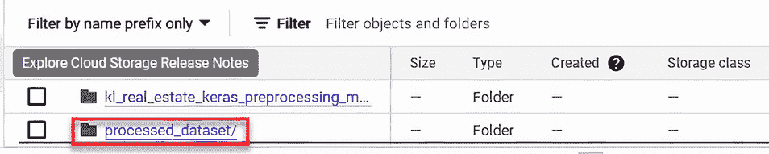

图 11.19 选择文件夹

6. 点击上传文件并选择包含吉隆坡数据集处理版本的 CSV 文件（数据准备笔记本的输出）。

7. 当上传完成时，你将在存储桶详细信息页面中看到该文件。点击三个点，然后复制 gsutil URI，如图 11.20 所示。


图 11.20 复制 gsutil URI

gsutil 统一资源标识符 (URI) 值将如下所示：`gs://first-project-ml-tabular-bucket/processed_dataset/kl_real_estate_output.csv`

现在我们已经将清洗后的数据集上传到 Google Cloud Storage 存储桶中，我们可以用它来创建一个 Vertex AI 数据集。

### 11.2.7 创建 Vertex AI 管理数据集

机器学习管道调用 Vertex AI SDK 来训练模型；它将用于训练模型的数据库识别为 Vertex AI 管理数据集。要了解更多关于 Vertex AI 管理数据集的信息，请参阅文档：[`mng.bz/VVRP`](https://mng.bz/VVRP)。

Vertex AI SDK 自动执行以下操作，使管理数据集可供训练脚本使用：

+   将数据集的内容复制到云存储。

+   将数据集划分为训练、验证和测试子集。每个子集的数据集比例在管道配置文件 `pipeline_config.yml` 中设置，如图 11.2 所示。


图 11.21 管道配置中的训练、验证和测试比例

+   将每个子集划分为多个 CSV 文件。图 11.22 展示了数据集在云存储中 CSV 文件的一个示例。


图 11.22 Google Cloud Storage 中的处理后的数据集

现在我们已经看到了数据集在云存储中的设置过程，让我们来了解一下创建用于训练数据的 Vertex AI 数据集的步骤。

1. 在 Vertex AI 中选择“数据集”。在数据集页面，点击创建，如图 11.23 所示。


图 11.23 创建数据集

2. 在创建数据集页面，将 `kuala-lumpur-real-estate` 设置为数据集名称，选择表格选项卡，选择回归/分类，然后点击创建，如图 11.24 所示。


图 11.24 指定数据集详细信息

3. 在“源”选项卡中，选择从云存储选择 CSV 文件。在导入文件路径中，点击浏览，选择上一节中上传处理后的训练文件所在的云存储桶位置，然后点击继续，如图 11.25 所示。


图 11.25 指定数据集的源

4. 注意你刚刚创建的数据集的 ID 值，如图 11.26 所示。


图 11.26 Google Cloud 控制台中的数据集 ID

这是需要在管道配置文件 `pipeline_config.yml` 中设置的 `dataset_id` 的值，如图 11.27 所示。

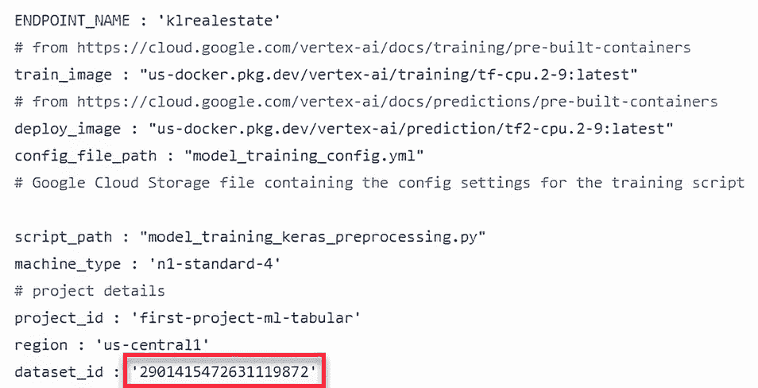

图 11.27 管道配置文件中的`dataset_id`

恭喜！您已经为机器学习管道中模型训练部分将用于训练模型的那个数据集设置了 Vertex AI 托管数据集。

## 11.3 定义机器学习管道

到目前为止，在本章中，我们已经完成了以下机器学习管道的准备工作：

1. 创建了一个服务账户和服务账户密钥

2. 将服务账户密钥上传到我们将运行管道脚本的目录

3. 将清理后的数据集上传到云存储

4. 从清理后的数据集中创建了一个 Vertex AI 管理的数据集

在本节中，我们将使用上一节中准备好的元素来创建一个机器学习管道，该管道在一端接收预处理后的数据集，并在另一端通过 Vertex AI 端点部署训练好的模型。

### 11.3.1 本地实现与机器学习管道

在我们继续定义机器学习管道之前，让我们将机器学习管道与本地设置进行对比，以训练我们在第十章中实现的吉隆坡房地产价格预测模型。图 11.28 显示了这种对比并突出了两种实现之间的差异。


图 11.28 在本地系统上训练与使用机器学习管道训练

图 11.28 对比了完全本地实现与使用机器学习管道的训练过程的结构。机器学习管道实现与本地系统实现解决方案的关键区别在于

+   数据清理过程是相同的。在现实世界的生产管道中，我们会将这个数据处理步骤移动到 Vertex AI 环境中，并使其成为机器学习管道的一部分，但为了使机器学习管道尽可能简单，我们在我们的机器学习管道实现中跳过这一步骤，并从清理后的数据集开始管道。

+   在本地实现中，数据清理过程的输出是一个 pickle 文件。为了避免兼容性问题，我们切换到 CSV 文件用于机器学习管道。机器学习管道将这个 CSV 文件的内容分割成训练、验证和测试子集，每个子集在云存储中分割成多个 CSV 文件。

+   机器学习管道实现中的训练代码在一个 Python `.py` 文件（*模型训练脚本*）中，而不是笔记本中。在下一节中描述了为了使其在容器环境中工作而对训练代码进行的重大更新。

+   在机器学习管道实现中，模型训练配置文件位于云存储中，这样管道脚本就可以将其位置作为参数与模型训练脚本共享。

+   管道脚本是在机器学习管道中的新组件。此脚本设置模型训练脚本所需的输入，使用 Vertex AI SDK 为模型训练脚本创建一个容器，并调用脚本进行模型训练。

+   管道配置文件是 ML 管道中的新组件。此配置文件包含管道脚本的参数，包括用于 ML 管道的内置 Vertex AI 容器；每个训练、验证和测试子集的清理数据集比例；数据集 ID；以及训练脚本代码的位置。

+   训练好的模型会自动放入 ML 管道实现中的模型注册库，并部署到 Vertex AI 端点。在本地系统实现中，我们手动将模型上传到云存储，然后部署到端点。

端点即本地系统实现和机器学习（ML）管道实现的结果，可以通过更新 Flask 服务器配置文件中的 `endpoint_id` 参数简单地插入到我们的网络部署中，如图 11.29 所示。


图 11.29 使用本地或 ML 管道端点的网络部署

关于在 Vertex AI 上训练自定义模型的流程的更多详细信息，请参阅文档：[`mng.bz/xKjW`](https://mng.bz/xKjW)。

### 11.3.2 容器简介

Vertex AI 中 ML 管道的一个关键点是使用容器使模型训练过程易于自动化和灵活。在本节中，我们将简要介绍容器及其对 ML 管道的益处。如果您已经熟悉容器和 Docker 的概念，可以跳过本节。

容器是一种软件构造，允许您将应用程序及其依赖项打包在一起，以便您可以在各种环境中可预测和高效地运行应用程序。Google Cloud 使用 Docker 容器。关于容器的详细描述超出了本书的范围，但我们需要花一些时间来了解它们为什么用于 ML 管道以及它们对我们代码施加的限制。有关容器的更多详细信息，请参阅 Docker 网站：[`www.docker.com/resources/what-container/`](https://www.docker.com/resources/what-container/)。

### 11.3.3 在 ML 管道中使用容器的优势

使用容器打包训练代码意味着我们不必担心训练所需的 Python 库，因为容器已经预装了所有必需的 Python 库。此外，代码在任何地方都易于重现。Vertex AI 为最流行的机器学习框架（包括 PyTorch、TensorFlow 和 XGBoost）提供了一系列预构建容器镜像。我们为我们的 ML 管道使用 TensorFlow 预构建容器。有关预构建容器的详细信息，请参阅 Vertex AI 文档：

+   *用于训练自定义模型的预构建容器*—[`mng.bz/AQ8z`](https://mng.bz/AQ8z)

+   *用于预测的预构建容器*—[`mng.bz/ZlRP`](https://mng.bz/ZlRP)

如果我们的训练最终变得更加复杂（无论是从训练周期需要完成的速度还是完成给定持续时间训练周期所需的计算资源方面），我们可以利用训练的容器化特性来将训练分布在多个计算引擎上。对于像吉隆坡房地产价格预测这样的简单问题，单个节点就足以进行训练，但更大的应用确实可以从分布式训练中受益。关于使用 Vertex AI 进行分布式训练的所有可用选项的详细解释超出了本书的范围。如果您想了解更多细节，请查看文档：[`mng.bz/RVmK`](https://mng.bz/RVmK)。

### 11.3.4 容器中运行代码的介绍

现在我们已经回顾了使用容器进行训练过程的一些好处，我们可以看看运行训练代码在容器中所需的变化。为了理解在非虚拟化环境中运行代码和在容器中运行代码之间的区别，将容器视为一个自包含的机器，其中代码运行，这有助于理解。特别是，在容器中运行的代码默认情况下无法访问管理容器的环境文件系统。图 11.30 展示了模型训练笔记本如何与文件系统中的文件交互。


图 11.30 训练代码与外部文件的交互

当训练代码在容器中运行时，它无法访问外部本地文件系统中的文件。相反，模型训练脚本使用的工件存储在云存储中，这些工件在云存储中的位置作为 URI 传递给模型训练脚本。图 11.31 给出了如何解释 Google Cloud Storage URI 的示例。


图 11.31 解释 Google Cloud Storage URI

在机器学习流程中，我们使用两种方法将 URI 传递给在容器中运行的训练脚本：通过 Vertex AI SDK 在容器中设置的环境变量，以及通过流程脚本中 `job.run` 调用的参数列表，如图 11.32 所示。


图 11.32 训练代码与云存储中的内容的交互

训练数据的位置（分为训练、验证和测试子集）会自动分配给环境变量，这些变量在流程脚本设置容器时在容器中设置。这对于所有 Vertex AI 容器都是标准的；请参阅[`mng.bz/2y70`](https://mng.bz/2y70)上的文档。

将配置文件的 URI 传递给模型训练脚本的方式不是 Vertex AI 的默认方式。如果我们有一个只有少量参数的训练脚本，我们可以创建一个包含参数值的`argparser`列表，并将其传递给模型训练脚本。由于我们的应用程序配置文件过于复杂，这样做效率不高，所以我们不是逐个传递参数，而是传递一个单一参数：我们保存配置文件副本的云存储位置的 URI。有了这个，模型训练脚本所需做的只是从参数列表中获取云存储位置，并从那里获取 YAML 文件。一旦参数被拉入模型训练脚本中的配置字典，使用它们的其余代码可以保持不变。这是一个主要的好处。

### 11.3.5 更新训练代码以在容器中工作

在本节中，我们将回顾我们如何将第九章中在 Colab 中运行的模型训练笔记本（[`mng.bz/1XJj`](https://mng.bz/1XJj)）修改为预测吉隆坡房地产价格的模型。通过这些修改，我们将模型训练笔记本转换为一个可以在 Vertex AI 内置容器中运行的训练脚本。

以下是我们对训练笔记本所做的关键更改，以创建训练脚本：

+   移除了不必要的库导入和相关代码。例如，当我们运行训练脚本时，我们不需要生成模型的图表，所以我们移除了与`plot_model`相关的代码。

+   移除了将数据集拆分为训练、验证和测试子集的代码。在 ML 管道中，Vertex AI SDK 会在测试脚本启动之前负责拆分数据集。

+   添加了代码来解释`job.run`参数列表，如下所示。

列表 11.1 加载保存的 Keras 模型

```py
parser = argparse.ArgumentParser()                           ①
parser.add_argument(
        '--config_bucket',                                   ②
        help='Config details',
        required=True
    )
args = parser.parse_args().__dict__                          ③
config_bucket = args['config_bucket']                        ④
```

① 定义一个 argparser 对象，用于 Vertex AI SDK 传递的参数

② 将 config_bucket 参数添加到 argparser 对象中

③ 将 Vertex AI SDK 传递的参数作为字典获取

④ 从参数字典中获取配置文件 URI

+   更新了获取训练配置文件的代码，使其从通过管道脚本传递的云存储 URI（列表 11.1 中的`config_bucket`）获取配置文件的内容，而不是从本地文件系统获取。如下所示，云存储中的配置文件 URI（`config_bucket`）用于将配置文件从云存储复制到容器中的一个文件，然后该文件的 内容被复制到字典`config`中。

列表 11.2 通过 URI 参数获取训练配置文件

```py
bucket_name = config_bucket.split("/")[2]                    ①
object_name = "/".join(config_bucket.split("/")[3:])         ②
storage_client2 = storage.Client()                           ③
bucket = storage_client2.bucket(bucket_name)                 ④
blob_out = bucket.blob(object_name)                          ⑤
destination_file_name = 'config.yml'                         ⑥
blob_out.\
download_to_filename(destination_file_name)                  ⑦
try:
    with open (destination_file_name, 'r') as c_file:
        config = yaml.safe_load(c_file)                      ⑧
except Exception as e:
    print('Error reading the config file')
```

① 获取 config_bucket 的存储桶前缀

② 获取 config_buckett 的文件路径后缀

③ 定义一个 storage.Client 对象

④ 为存储桶创建一个存储对象

⑤ 为文件创建一个存储对象

⑥ 设置容器中配置文件副本的名称

⑦ 从云存储将文件下载到容器

⑧ 将容器版本的配置文件内容读取到字典中

+   复制 Vertex AI SDK 在容器中设置的 AIP 环境变量的值。这些环境变量包含 SDK 在 Google Storage 中创建的 CSV 文件的 URI 模式，这些 CSV 文件包含数据集的训练、验证和测试子集。

列表 11.3 复制 AIP 环境变量值

```py
def assign_container_env_variables():
    OUTPUT_MODEL_DIR = os.getenv("AIP_MODEL_DIR")             ①
    TRAIN_DATA_PATTERN = \
os.getenv("AIP_TRAINING_DATA_URI")                            ②
    EVAL_DATA_PATTERN = \
os.getenv("AIP_VALIDATION_DATA_URI")                          ③
    TEST_DATA_PATTERN = \
os.getenv("AIP_TEST_DATA_URI")                                ④
    return OUTPUT_MODEL_DIR, TRAIN_DATA_PATTERN, \
EVAL_DATA_PATTERN, TEST_DATA_PATTERN
```

① 获取保存训练模型的 URI 位置

② 获取训练数据集 CSV 的 URI

③ 获取验证数据集 CSV 的 URI

④ 获取测试数据集 CSV 的 URI

+   从 AIP 环境变量中的每个模式创建了 dataframe。对于这些环境变量中的每一个，我们解析了 URI，获取了匹配模式的 CSV 文件列表，并在云存储中重新组装成单个 dataframe。

列表 11.4 创建数据集子集的 dataframe

```py
bucket_pattern = tracer_pattern.split("/")[2]                  ①
pattern = "/".join(tracer_pattern.split("/")[3:])              ②
pattern_client = storage.Client()                              ③
bucket = pattern_client.get_bucket(bucket_pattern)
blobs = bucket.list_blobs()                                    ④
matching_files = [f"gs://{bucket_pattern}/{blob.name}" \
for blob in blobs if fnmatch.fnmatch(blob.name, pattern)]      ⑤
merged_data = \
pd.concat([pd.read_csv(f) for f in matching_files], 
ignore_index=True)                                             ⑥
```

① 对于每个文件模式，获取存储桶前缀

② 获取 CSV 文件模式

③ 定义一个 storage.Client 对象

④ 获取匹配模式的存储桶中的 CSV 列表

⑤ 获取匹配模式的 CSV 的完全限定 URI 列表

⑥ 创建包含所有匹配模式的 CSV 内容的数据 frame

+   将训练模型保存到由`OUTPUT_MODEL_DIR`指定的位置，这是 Vertex AI SDK 设置的保存模型的位置：

```py
tf.saved_model.save(model, OUTPUT_MODEL_DIR)
```

经过这些更改后，其余的训练代码可以在容器中运行。现在我们已经完成了创建训练脚本所需的更新，在下一节中，我们将探讨设置训练脚本运行的容器的管道脚本的关键部分。

### 11.3.6 管道脚本

现在我们已经完成了训练脚本，我们可以检查组成管道脚本的代码。您可以在[`mng.bz/PdRn`](https://mng.bz/PdRn)查看完整的管道脚本代码。

管道脚本的关键部分是

+   读取管道配置文件：[`mng.bz/JYdV`](https://mng.bz/JYdV)。

+   设置训练脚本的参数：

```py
model_args = ['--config_bucket', config['config_bucket_path']]
```

+   创建一个指定训练脚本位置`script_path`、用于训练的预构建镜像`container_uri`以及需要在训练容器中安装的任何附加 Python 库的`CustomTrainingJob`对象，如下所示。

列表 11.5 创建`CustomTrainingJob`对象

```py
def create_job(config):
    model_display_name = '{}-{}'.format(config['ENDPOINT_NAME'], TIMESTAMP)
    job = aiplatform.CustomTrainingJob(
            display_name='train-{}'.format(model_display_name),
            script_path = config['script_path'],
            container_uri=config['train_image'],            ①
            staging_bucket = config['staging_path'],
            requirements=['gcsfs'],                         ②
            model_serving_container_image_uri= \
config['deploy_image']                                      ③
    ) 
    return job
```

① 设置运行训练脚本的预构建 Vertex AI 容器镜像

② 定义在容器中安装的任何附加要求列表

③ 设置用于预测的预构建 Vertex AI 容器镜像

+   定义用于训练的托管数据集的路径（使用 11.2.7 节中创建的托管数据集的 ID）并使用该路径创建一个`TabularDataset`对象：

```py
dataset_path = \
'projects/'+config['project_id']+\
'/locations/'+config['region']+\
'/datasets/'+config['dataset_id']
 ds = aiplatform.TabularDataset(dataset_path)
```

+   运行之前定义的作业，指定在此创建的数据集；用于训练、验证和测试的数据集比例；以及用于训练的`machine_type`。

列表 11.6 运行作业

```py
def run_job(job, ds, model_args,config):
    model_display_name = \
'{}-{}'.format(config['ENDPOINT_NAME'], TIMESTAMP)
    model = job.run(
        dataset=ds,                                           ①
        training_fraction_split = \
config['training_fraction_split'],                            ②
        validation_fraction_split = config['validation_fraction_split'],
        test_fraction_split = config['test_fraction_split'],
        model_display_name=model_display_name,
        args=model_args,                                      ③
        machine_type= config['machine_type'] 
    )
    return model
```

① 将作业与托管数据集关联

② 设置用于训练、验证和测试的数据集比例

③ 设置参数列表（其中包含测试脚本配置文件的 URI）

+   创建一个端点，并将训练脚本中训练的模型部署到该端点。

列表 11.7 将训练好的模型部署到端点

```py
def deploy_model(model,config):
    endpoints = aiplatform.Endpoint.list(                      ①
        filter='display_name="{}"'.format(config['ENDPOINT_NAME']),
        order_by='create_time desc',
        project=config['project_id'], 
        location=config['region']
    )
    endpoint = aiplatform.Endpoint.create(                     ②
         display_name=config['ENDPOINT_NAME'], 
         project=config['project_id'], 
         location=config['region']
        )
    model.deploy(                                              ③
        endpoint=endpoint,
        traffic_split={"0": 100},
        machine_type=config['machine_type_deploy'],
        min_replica_count=1,
        max_replica_count=1,
    )
```

① 设置端点的特征

② 创建端点

③ 将模型部署到端点

+   以下列表是管道脚本的主函数，它调用了运行管道的函数。

列表 11.8 管道脚本的主函数

```py
    start_time = time.time()
    config = get_pipeline_config('pipeline_config.yml')          ①
    model_args = ['--config_bucket', config['config_bucket_path']]
    job = create_job(config)
    dataset_path = \
'projects/'+config['project_id']+\
'/locations/'+config['region']+\
'/datasets/'+config['dataset_id']
    ds = aiplatform.TabularDataset(dataset_path)
    model = run_job(job, ds, model_args,config)                  ②
    if config['deploy_model']:
        deploy_model(model,config)                               ③
    print("pipeline completed")
```

① 设置端点的特征

② 创建端点

③ 将模型部署到端点

运行管道脚本，请按照以下步骤操作：

+   在 Cloud Shell 的新目录中克隆[`github.com/lmassaron/ml_on_tabular_data`](https://github.com/lmassaron/ml_on_tabular_data)，并将`chapter_11`设置为当前目录。

+   更新管道配置文件，确保`project_id`和`region`与您的项目设置匹配，`dataset_id`与您的托管数据集 ID 匹配，`staging_path`与您的暂存路径匹配，以及`config_bucket_path`与云存储中您复制训练脚本配置文件的路径匹配，如图 11.33 所示。

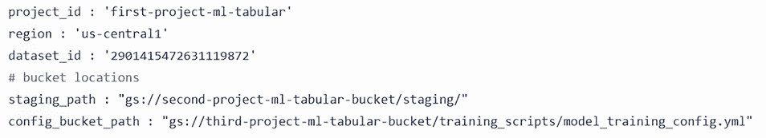

图 11.33 训练代码与云存储中内容的交互

+   在您克隆仓库的根目录中，输入以下命令：

```py
python pipeline_script.py
```

注意，运行整个管道脚本可能需要 10 分钟或更长时间。如果脚本失败，您将收到一条包含包含有关训练运行诊断信息的日志文件链接的消息。如果脚本成功，输出将以管道完成和运行时间结束。

### 11.3.7 测试管道中训练的模型

一旦您运行了管道脚本以运行机器学习管道来训练和部署模型，您就可以使用生成的 Vertex AI 端点在我们在第十章中使用的相同 Web 部署框架中测试模型。请注意，使用这种简单的 Web 部署测试端点并不符合您在生产环境中会做的事情。然而，使用我们在第十章中使用的相同 Web 部署简化了此练习的测试过程。

测试管道中训练的模型的步骤是

1. 在 Google Cloud 控制台中，转到 Vertex AI 端点。复制由机器学习管道创建的部署 ID，如图 11.34 所示。


图 11.34 由管道生成的模型端点 ID

2. 在您在第十章中使用 Flask 测试初始端点部署的同一本地系统中，将您刚刚复制的端点 ID 粘贴到 `flask_web_deploy_config.yml` 配置文件中的 `endpoint_id 参数` 值中，并保存文件：

```py
endpoint:
   project: "1028332300603"
   endpoint_id: "1447850105594970112"
   location: "us-central1"
```

3. 在您的本地系统中，启动 Flask 服务器模块：

```py
python flask_endpoint_deploy.py
```

4. 一旦 Flask 服务器模块运行，请在浏览器中转到 `localhost:5000`。`home.html` 将如图 11.35 所示渲染。当您点击“获取预测”时，由 ML 管道训练和部署在 Vertex AI 端点的模型将被调用（见图 11.35）。

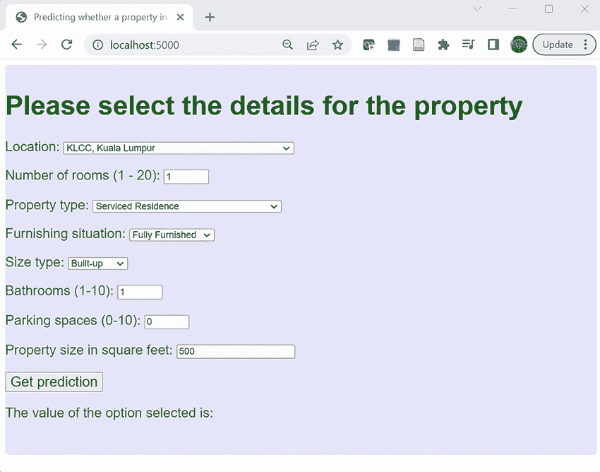

图 11.35 Home.html

注意，您在用于模型训练的预构建容器中使用的 TensorFlow 级别必须与您运行 Web 应用程序以测试端点的环境中的 TensorFlow 级别相匹配。例如，如果我们想在具有 TensorFlow 2.9 的环境中练习端点部署，那么在管道配置文件中，我们需要为 `train_image`（预构建训练容器）指定一个与该 TensorFlow 级别一致的值，例如 `us-docker.pkg.dev/vertex-ai/training/tf-cpu.2-9:latest`。

如果您在 Cloud Shell 中运行管道脚本时遇到 protobuf 错误，请尝试运行以下命令以指定 protobuf 级别：

```py
pip install protobuf==3.20.*
```

如果您想尝试不同的训练配置，您可以更新训练配置文件，将其上传到云存储（确保管道配置文件中 `config_bucket_path` 的值与训练配置文件的 URI 匹配），然后重新运行管道脚本。您可以通过更新管道配置文件中的 `endpoint_id` 值以匹配新端点的端点 ID，并重复本节中的步骤来使用 Web 应用程序练习新模型。通过在 ML 工作流程中将多个步骤封装在 ML 管道中，我们使得获得可重复的结果和尝试新设置变得容易。

## 11.4 使用生成式 AI 帮助创建 ML 管道

到目前为止，在本章中，我们已经看到我们如何使用 Google Cloud 中的操作组合和手动脚本来设置一个基本的 ML 管道，以训练和部署在表格数据上训练的模型。在本节中，我们将探讨我们如何使用第十章中介绍的 Google Cloud 的 Gemini 生成式 AI 功能来简化或自动化这些操作中的某些部分。正如我们在第十章中看到的，Gemini for Google Cloud 有四种方式可以帮助我们：

+   回答有关 Google Cloud 的问题。

+   从文本生成代码。

+   解释代码。也就是说，给定一段代码，生成解释该代码做什么的文本。我们可以使用这种能力来帮助我们理解我们从其他地方改编的代码。我们还可以使用这种能力来记录我们正在编写的代码。

+   概括日志条目以帮助调试问题。

### 11.4.1 使用 Gemini for Google Cloud 回答有关 ML 管道的问题

正如我们在第十章中看到的，我们可以使用 Gemini for Google Cloud 中的生成式 AI 功能来获取有关 Google Cloud 的问题的答案。以下是一些关于创建 ML 流水线的问题的示例，Gemini for Google Cloud 可以帮助我们回答：

+   什么是 ML 流水线？虽然 Gemini for Google Cloud 是专门针对 Google Cloud 进行训练的，但它能够回答关于技术等广泛的问题，如这个问题。请注意，图 11.36 中显示的答案是普遍适用的，并不仅限于 Google Cloud。引用来自各种可信来源，包括 TensorFlow 和 Scikit-learn 的文档：

    +   什么是 ML 流水线？([`mng.bz/wJjP`](https://mng.bz/wJjP))

    +   构建数据流水线 ([`cs230.stanford.edu/blog/datapipeline/`](https://cs230.stanford.edu/blog/datapipeline/))

    +   基于 Scikit-learn 的 ML 流水线 ([`mng.bz/qxjr`](https://mng.bz/qxjr))


图 11.36 Gemini for Google Cloud 回答了“什么是 ML 流水线？”的问题

+   Vertex AI 流水线是什么？当我们对同一个问题进行限定，如图 11.37 所示，Gemini for Google Cloud 会给我们一个针对 Google Cloud 中 ML 流水线实现的特定答案。

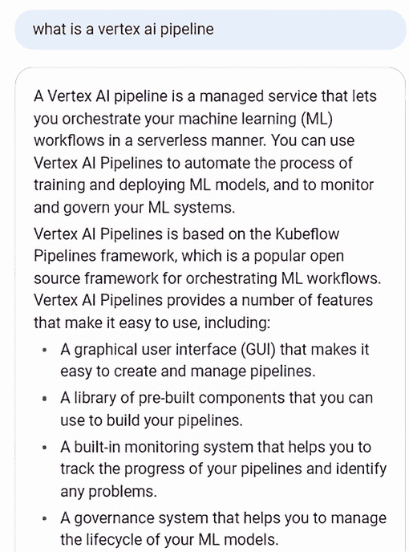

图 11.37 Gemini for Google Cloud 回答了“什么是 Vertex AI 流水线？”的问题

+   Vertex AI 预构建容器用于训练自定义模型是什么？最后，让我们尝试提出一个与本章节中我们解决的问题相关的具体问题。如图 11.38 所示，Gemini for Google Cloud 提供的答案既描述了用于训练自定义模型的预构建容器是什么，也说明了使用它们的目的。

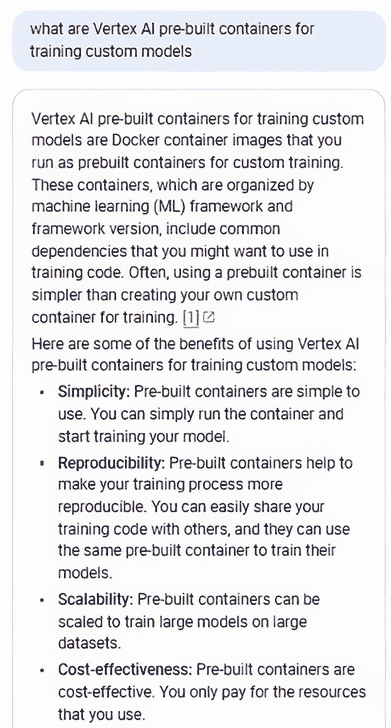

图 11.38 Gemini for Google Cloud 回答了“Vertex AI 预构建容器用于训练自定义模型是什么？”的问题

在本节中，我们看到了如何使用 Gemini for Google Cloud 回答有关构建 ML 流水线的一般性和具体问题。在下一节中，我们将探讨如何使用 Gemini for Google Cloud 生成 ML 流水线所需的代码。

### 11.4.2 使用 Gemini for Google Cloud 生成 ML 流水线的代码

现在我们已经看到了 Gemini for Google Cloud 如何回答有关创建 ML 流水线的问题，让我们探索 Gemini for Google Cloud 中的生成式 AI 功能如何帮助我们创建与 ML 流水线相关的代码。

Google Cloud 的 Gemini 支持在多个 Google Cloud 支持的 IDE 中启用，包括 VS Code、Cloud Workstations 和 Cloud Shell Editor。在本节中，我们将使用 Cloud Shell Editor 中的 Gemini for Google Cloud。如果您需要刷新 Cloud Shell Editor 的知识，请参阅概述文档：[`mng.bz/7pvv`](https://mng.bz/7pvv)。

我们将看到 Gemini for Google Cloud 如何在管道脚本中生成函数的代码：[`mng.bz/PdRn`](https://mng.bz/PdRn) 使用此脚本的函数签名和介绍性注释，我们将看到 Gemini for Google Cloud 生成了什么。

首先，如果你还没有这样做，请按照文档说明在 Cloud Shell 编辑器中启用 Gemini 代码助手：[`mng.bz/mGja`](https://mng.bz/mGja)。

一旦你在 Cloud Shell 编辑器中启用了 Gemini 代码助手，就在 Cloud Shell 编辑器中打开一个新的 Python 文件，并输入 `get_pipeline_config` 函数的签名和介绍性注释，如下所示。

列表 11.9 `get_pipeline_config` 的签名

```py
def get_pipeline_config(path_to_yaml):
    '''ingest the config yaml file
    Args:
        path_to_yaml: yaml file containing parameters for the pipeline script

    Returns:
        config: dictionary containing parameters read from the config file
    '''
```

注意，此代码片段不包括函数的逻辑。

要让 Gemini for Google Cloud 为此函数生成代码以完成它，只需按 Enter 键。如图 11.39 所示，Gemini for Google Cloud 以斜体生成临时代码。

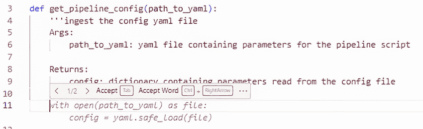

图 11.39 Gemini for Google Cloud 生成的第一组临时代码

按 Tab 键接受此临时代码，然后再次按 Enter 键以获取下一组生成的代码，如图 11.40 所示。


图 11.40 Gemini for Google Cloud 生成的第二组临时代码

再次按 Tab 键以接受这组第二组临时代码。结果函数如下所示。

列表 11.10 `get_pipeline_config` 函数

```py
def get_pipeline_config(path_to_yaml):
    '''ingest the config yaml file
    Args:
        path_to_yaml: yaml file containing parameters for the pipeline script

    Returns:
        config: dictionary containing parameters read from the config file
    '''
    with open(path_to_yaml) as file:                     ①
        config = yaml.safe_load(file)

    return config                                        ②
```

① Gemini for Google Cloud 生成的第一组代码

② Gemini for Google Cloud 生成的第二组代码

列表 11.10 中的代码与 `get_pipeline_config` 函数的手写代码不完全相同，如下所示。

列表 11.11 `get_pipeline_config` 函数：手写版本

```py
def get_pipeline_config(path_to_yaml):
    '''ingest the config yaml file
    Args:
        path_to_yaml: yaml file containing parameters for the pipeline script

    Returns:
        config: dictionary containing parameters read from the config file
    '''
    print("path_to_yaml "+path_to_yaml)
    try:                                                  ①
        with open (path_to_yaml, 'r') as c_file:          ②
            config = yaml.safe_load(c_file)
    except Exception as e:
        print('Error reading the config file')
    return config
```

① 手写代码包括文件打开操作的异常处理

② 手写代码包括文件打开时的 'r' 参数

将列表 11.10 中 Gemini for Google Cloud 生成的代码与列表 11.11 中的手写代码进行比较，我们可以看到两个差异：

+   手写代码包括异常处理以处理打开配置文件时的问题。

+   手写代码在文件打开操作中包括 `'r'` 参数。

`get_pipeline_config` 函数很简单，但无论如何，Gemini for Google Cloud 都能够为该函数生成可工作的代码。

对于 Gemini for Google Cloud 代码生成的额外考虑

+   你不必一次性接受 Gemini for Google Cloud 生成的所有临时代码。要逐个接受临时代码标记，请按 CTRL + 右箭头以接受单个标记。

+   要拒绝整个临时代码生成并重新开始，请按 ESC 键，整个临时代码集将被清除。

+   当您多次使用完全相同的输入请求 Gemini for Google Cloud 生成代码时，并不能保证生成的代码完全相同。例如，在 `get_pipeline_config` 示例中，有时 Gemini for Google Cloud 会分两步生成函数，如图中所示，有时它会一次性生成整个函数，包括 `return` 语句。

现在我们已经使用生成式 AI 生成代码，在下一节中，我们将看到如何用它来解释代码。

### 11.4.3 使用 Gemini for Google Cloud 解释 ML 管道代码

现在我们已经看到了 Gemini for Google Cloud 生成代码的例子，让我们来练习它解释代码的能力。

要让 Gemini for Google Cloud 解释一段代码片段，请将以下列表中的代码（管道脚本的 `main` 函数）复制到 Cloud Shell 编辑器中的新文件中。

列表 11.12 `get_pipeline_config` 函数

```py
if __name__ == '__main__':
    start_time = time.time()
    # load pipeline config parameters
    config = get_pipeline_config('pipeline_config.yml')
    # all the arguments sent to the training 
    #script run in the container are sent via
    # a yaml file in Cloud Storage whose URI is the single argument sent
    model_args = ['--config_bucket', config['config_bucket_path']]
    print("model_args: ",model_args)
    # create a CustomTrainingJob object
    job = create_job(config)
    # define TabularDataset object to use in running CustomTrainingJob
    dataset_path = \
'projects/'+config['project_id']+\
'/locations/'+config['region']+\
'/datasets/'+config['dataset_id']
    ds = aiplatform.TabularDataset(dataset_path)
    # run the CustomTrainingJob object to get a trained model
    model = run_job(job, ds, model_args,config)
    print("deployment starting")
    # deploy model to a Vertex AI endpoint
    if config['deploy_model']:
        deploy_model(model,config)
    print("pipeline completed")
    # show time taken by script
    print("--- %s seconds ---" % (time.time() - start_time))
```

一旦您将列表 11.13 中的代码粘贴到文件中，请选择它，然后从 Cloud Shell 编辑器工具栏中选择 Gemini for Google Cloud Smart Actions 图标（见图 11.41）。


图 11.41 Gemini for Google Cloud Smart Actions 图标

在出现的菜单中，选择“解释”，如图 11.42 所示。

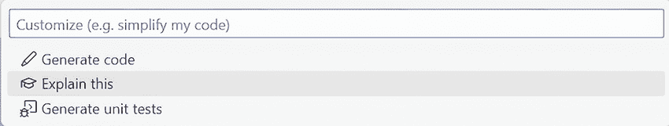

图 11.42 Gemini for Google Cloud Smart Actions 图标

当您选择此选项时，代码的解释将出现在 Cloud Shell 编辑器的左侧面板中，如图 11.43 所示。


图 11.43 代码解释

Gemini for Google Cloud 的代码解释能力可以应用于各种代码，包括 Python、Java 和 JavaScript 代码。您可以使用代码解释来理解不熟悉的代码，并为您的代码推荐文档。

到目前为止，在本节中，我们已经看到了如何使用 Gemini for Google Cloud 中的生成式 AI 功能来回答问题、生成代码和解释代码。在下一小节中，我们将看到如何使用 Gemini for Google Cloud 来帮助总结日志条目。

### 11.4.4 使用 Gemini for Google Cloud 总结日志条目

Google Cloud 包含一个日志，您可以使用它来跟踪环境的行为并调试问题。然而，有时日志条目可能难以解释。Gemini for Google Cloud 可以通过总结来帮助您理解日志条目的要点。在本小节中，我们将介绍如何使用 Gemini for Google Cloud 充分利用 Google Cloud 日志。

为了练习 Gemini for Google Cloud 的这一功能，我们将尝试使用 Vertex AI 中的基础模型调优。基础模型调优允许我们使用 JSONL（JSON Lines：[`jsonlines.org/`](https://jsonlines.org/)）数据集中的数据集对预训练模型进行调优。有关在 Vertex AI 中调优文本模型的更多详细信息，请参阅文档：[`mng.bz/5goO`](https://mng.bz/5goO)。

为了准备本节中的示例，在您在第十章中创建的云存储桶中创建一个名为`staging`的新文件夹。

在 Google Cloud 控制台的 Vertex AI 中，选择 Vertex AI Studio -> 语言。在语言页面上，选择调整和精炼，然后选择创建调整模型，如图 11.44 所示。


图 11.44 Vertex AI Studio 语言页面

在创建调整模型页面的调整方法面板中：

+   在“调整模型名称”字段中指定您的模型名称。

+   在输出目录字段中指定您在本节开头创建的存档文件夹的 URI。

+   点击“继续”。

见图 11.45。


图 11.45 创建调整模型页面的调整方法面板

在创建调整模型页面的调整数据集面板中，执行以下操作：

+   在云存储中选择“现有文件”。

+   在“云存储文件路径”字段中输入此样本 JSONL 文件的 URI `cloud-samples-data/vertex-ai/model-evaluation/peft_train_sample.jsonl`。有关 JSONL 样本的详细信息，请参阅文档：[`mng.bz/6ene`](https://mng.bz/6ene)。

+   点击“开始调整”。

见图 11.46。


图 11.46 创建调整模型页面中的调整数据集面板

一旦点击“开始调整”，你将看到一系列调整后的模型列表，其中你的模型状态显示为“运行中”，如图 11.47 所示。


图 11.47 调整作业状态

当调整作业完成时，状态将更改为“成功”，如图 11.48 所示。

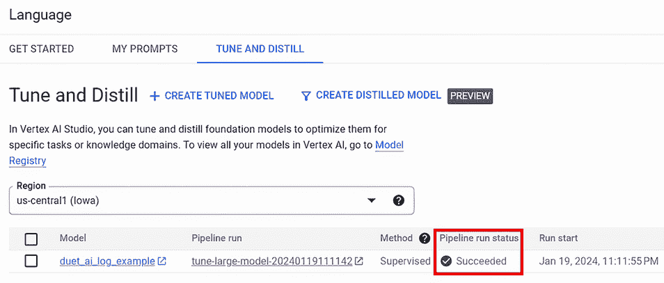

图 11.48 显示完成调整作业状态的调整作业状态

如果调整作业没有成功，那没关系。这个特定练习的目标是检查一个错误，所以如果由于某些原因操作失败，那是可以的。

调整作业完成后，在控制台顶部的搜索字段中输入“logs explorer”以进入日志资源管理器页面。此页面提供了检查由 Google Cloud 生成的日志的许多选项。现在，我们只想查看一个错误。要查看错误，请如图 11.49 所示，在日志资源管理器页面的左下角选择“错误”。

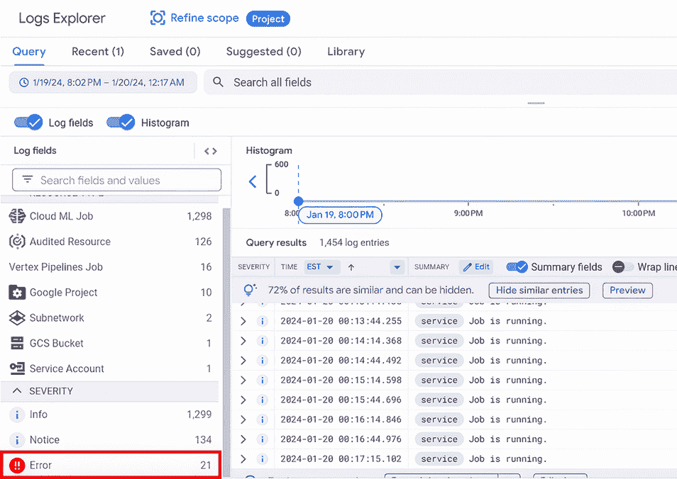

图 11.49 显示完成调整作业状态的调整作业状态

页面底部的查询结果面板显示了错误，如图 11.50 所示。


图 11.50 显示错误的查询结果面板

选择这些错误条目之一以展开它，并点击如图 11.51 所示的“解释此日志条目”。

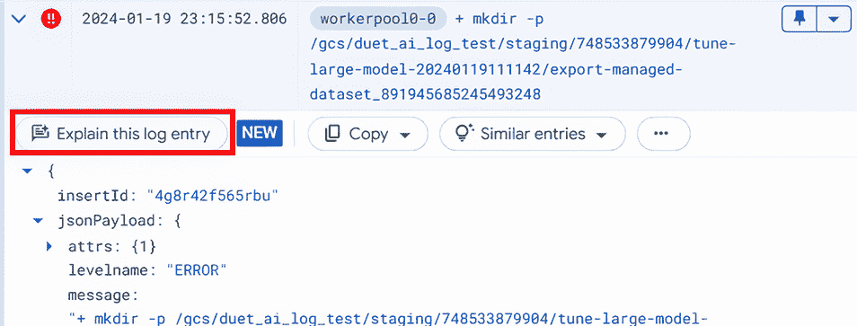

图 11.51 展开的错误条目

在右侧，Gemini for Google Cloud 显示了错误解释，如图 11.52 所示。

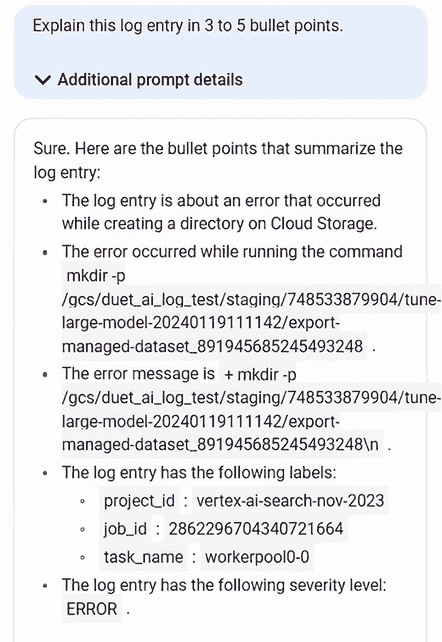

图 11.52 错误解释

Gemini 为 Google Cloud 提供的解释总结了日志中的嵌套条目，使其更容易阅读和解释。请注意，您将看到的解释将取决于您从日志中选择的错误。

### 11.4.5 在 Vertex AI 中调整基础模型

在前一小节中，我们看到了如何使用 Gemini for Google Cloud 的生成式 AI 功能来解释错误日志。值得仔细看看我们触发的操作，以生成我们可以用 Gemini for Google Cloud 检查的日志。以下是我们的操作总结：

+   我们从 Vertex AI 中可用的基础模型之一`text-bison`开始。此模型旨在处理各种自然语言任务，如内容创作和分类。有关`text-bison`的更多详细信息，请参阅文档：[`mng.bz/oKrZ`](https://cloud.google.com/vertex-ai/docs/generative-ai/model-reference/text)。

+   我们对`text-bison`基础模型进行了监督式调整，以适应特定的用例——我们的用例是分类医学转录。要了解更多关于 Vertex AI 中基础模型的监督式调整信息，请参阅文档：[`mng.bz/nR15`](https://mng.bz/nR15)。

+   我们用于调整的数据集包含与转录分类配对的医学诊断转录，如下所示。

列表 11.13 调整数据集的示例记录

```py
{
"input_text":"TRANSCRIPT: \nREASON FOR CONSULTATION: , 
Loculated left effusion, 
multilobar pneumonia.\n\n LABEL:",                      ①
"output_text":"Consult - History and Phy."              ②
}
```

① 医学转录

② 分类

+   此数据集的 URI 为`gs://cloud-samples-data/vertex-ai/model-evaluation/peft_train_sample.jsonl`。

调整过程完成后，您可以在 Vertex AI Studio 中通过选择语言 -> 调整和精炼，然后选择之前小节中调整的模型的行中的测试来测试调整后的模型，如图 11.53 所示。

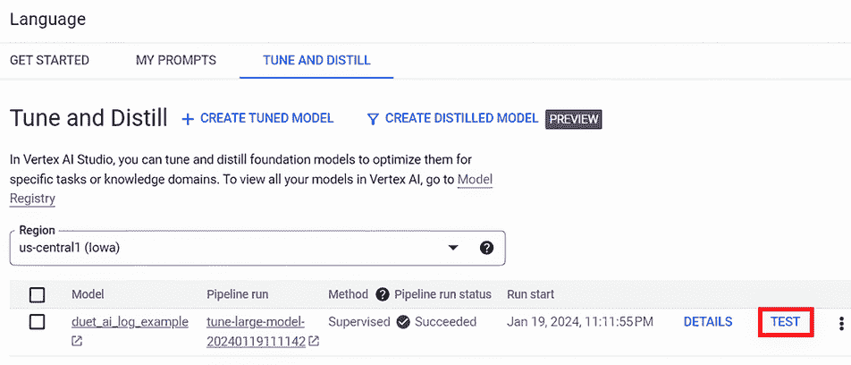

图 11.53 在 Vertex AI Studio 中选择调整后的模型

提示编辑器以选定的调整后的模型作为模型打开，如图 11.54 所示。

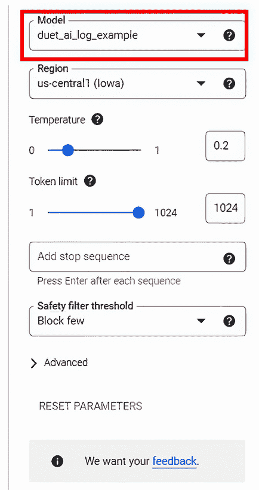

图 11.54 选择调整后的模型的提示编辑器

通过在提示字段中输入以下文本并点击提交来训练调整后的模型：

```py
TRANSCRIPT: \nIMPRESSION:  ,EEG during wakefulness, 
drowsiness, and sleep with synchronous 
video monitoring demonstrated no evidence 
of focal or epileptogenic activity.\n\n LABEL:
```

注意响应，如图 11.55 所示。


图 11.55 睡眠医学响应

现在将模型改回基础模型`text-bison@001`，如图 11.56 所示，然后再次点击提交。

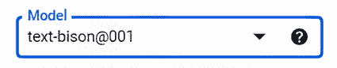

图 11.56 将模型改回 text-bison@001

使用调整后的模型和未调整的基础模型从提示中得到的响应有什么区别？使用调整后的模型，你可以获得基础模型的所有功能，以及适用于医学转录分类用例的适当响应。

如果你检查我们用于调整基础模型（URI 为 `gs://cloud-samples-data/vertex-ai/model-evaluation/peft_train_sample.jsonl`）的数据集，你会注意到它实际上是一个包含两列的表格数据集：一列包含医疗转录笔记，另一列包含笔记的分类，例如“心血管/肺”、“脊椎按摩”或“疼痛管理”。到目前为止，在这本书中，我们已经探讨了如何将生成式 AI 应用到表格数据的机器学习工作流程中。我们在日志解释练习中使用的示例展示了表格数据与生成式 AI 之间不同类型的关系：表格数据是生成式 AI 工作流程的一部分。对这个主题的详细探讨超出了本书的范围，但我们认为，表格数据在生成式 AI 工作流程中的作用是一个研究不足的领域，可能会在充分利用生成式 AI 方面带来显著的好处。

在本节中，我们看到了如何使用 Gemini 来利用 Google Cloud 的生成式 AI 功能来回答有关 ML 管道的问题，生成创建一个所需的部分代码，解释构成 ML 管道的代码，以及解释日志消息。

## 摘要

+   在 Vertex AI 中设置 ML 管道之前，需要完成几个设置任务。

+   需要创建一个服务账户，并将服务账户密钥上传到运行管道脚本的目录。

+   将用于在管道中训练模型的训练数据集需要上传到 Google Cloud Storage 存储桶。然后需要使用该存储桶位置来定义一个 Vertex AI 数据集，该数据集将在管道脚本中作为 Vertex AI SDK 的参数使用。

+   在 Vertex AI 预建容器中运行的训练脚本无法访问容器外的文件系统，因此训练数据集和 ML 管道实现使用的训练配置文件位于云存储中，它们的地址作为 URI 传递给训练脚本。

+   我们在第九章的 Colab 中运行的训练笔记本中的训练代码需要适配以在容器中运行。例如，需要更新训练脚本以使用配置文件、训练数据和训练模型应保存的位置的云存储位置。

+   管道脚本调用 Vertex AI SDK 的一系列函数来创建训练脚本运行的容器，运行训练脚本，并将训练好的模型部署到 Vertex AI 端点。

+   你可以使用在第十章中用于练习本地部署的相同 Web 应用来练习由 ML 管道生成的端点部署。

+   你可以在创建 ML 管道过程的各个步骤中使用 Gemini（集成在 Google Cloud 中的生成式 AI 工具包）来回答问题、从文本生成代码、解释代码以及解释日志消息。
