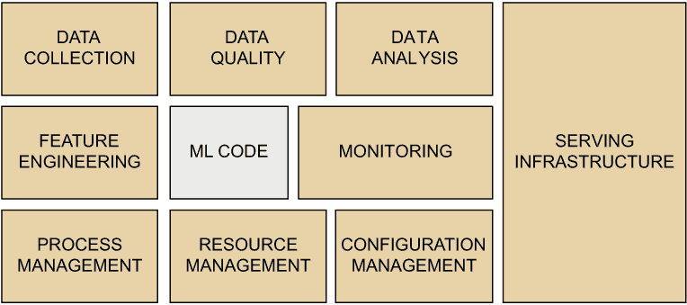
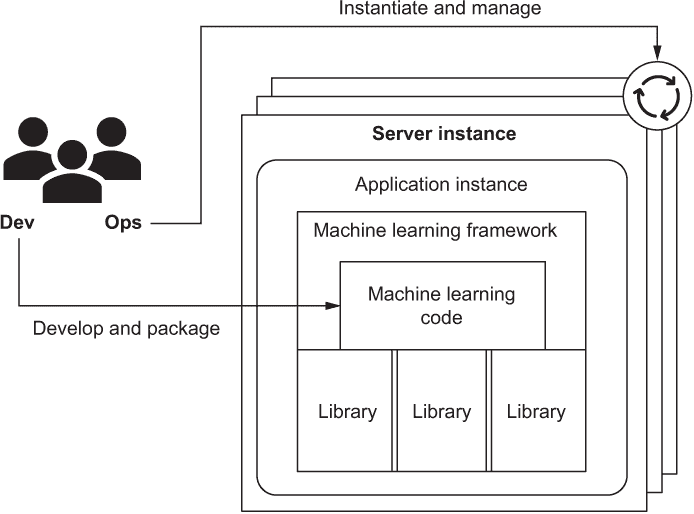
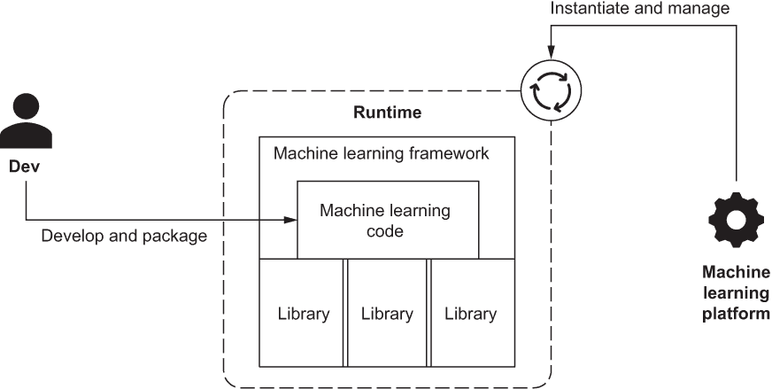

# 第一章：介绍无服务器机器学习

本章内容包括

+   什么是无服务器机器学习，以及为什么你应该关注

+   机器学习代码与机器学习平台之间的区别

+   如何本书教授关于无服务器机器学习的知识

+   本书的目标读者

+   你可以从本书中学到什么

一个大峡谷般的鸿沟将实验性机器学习代码和生产机器学习系统分隔开来。跨越“峡谷”的风景如画：当一个机器学习系统在生产中成功运行时，它似乎能够预见未来。我第一次开始在一个机器学习驱动的自动完成搜索栏中输入查询，看到系统预测我的词语时，我就被吸引住了。我一定试了几十种不同的查询来测试系统的工作效果。那么，穿越“峡谷”需要什么？

开始起步惊人地容易。在拥有正确的数据和不到一小时的编码时间的情况下，就可以编写实验性机器学习代码，并重现我使用预测我的词语的搜索栏时所体验到的非凡经历。在与信息技术专业人士的交流中，我发现许多人已经开始尝试机器学习。有关如何入门机器学习基础的在线课程，例如 Coursera 和 Andrew Ng 的课程，提供了丰富的信息。越来越多的公司在招聘信息技术工作时期望具有机器学习的入门经验。

尽管进行机器学习实验相对容易，但基于实验结果构建产品、服务或特性已被证明是困难的。一些公司甚至开始使用*独角兽*一词来描述那些具备启动生产机器学习系统所需技能的难以找到的从业者。具有成功启动经验的从业者通常具有涵盖机器学习、软件工程和许多信息技术专业的技能。

本书适合那些有兴趣从实验性机器学习代码走向生产机器学习系统的人。在本书中，我将教你如何组装机器学习平台的组件，并将它们用作生产机器学习系统的基础。在这个过程中，你将学到：

+   如何使用和整合公共云服务，包括来自亚马逊网络服务（AWS）的服务，用于机器学习，包括数据摄取、存储和处理

+   如何评估和实现结构化数据的机器学习数据质量标准

+   如何工程合成特征以提高机器学习效果

+   如何可重复地将结构化数据抽样为实验子集，以进行探索和分析

+   如何在 Jupyter 笔记本环境中使用 PyTorch 和 Python 实现机器学习模型

+   如何实现数据处理和机器学习流水线，以实现高吞吐量和低延迟

+   如何训练和部署依赖于数据处理流水线的机器学习模型

+   一旦机器学习系统投入生产，如何监视和管理其生命周期

为什么你要投入时间学习这些技能？它们不会让你成为著名的机器学习研究员，也不会帮助你发现下一个开创性的机器学习算法。然而，如果你从本书中学习，你可以为尽早、更高效地交付你的机器学习成果做好准备，并成长为你的机器学习项目、团队或组织更有价值的贡献者。

## 1.1 什么是机器学习平台？

如果你从未听说过信息技术行业中使用的“剃牦牛”的说法，² 这里是一个假设性的例子，说明它在机器学习实践者的日常生活中可能会如何出现：

我公司希望我们的机器学习系统一个月内上线……但我们训练机器学习模型花费的时间太长了……所以我应该通过启用图形处理单元（GPU）来加快速度……但我们的 GPU 设备驱动程序与我们的机器学习框架不兼容……所以我需要升级到最新版的 Linux 设备驱动程序以实现兼容性……这意味着我需要使用新版本的 Linux 发行版。

还有许多类似的情况，你需要“剃牦牛”来加速机器学习。在将基于机器学习的系统投入生产并使其保持运行的当代实践与剃牦牛的故事有太多共同之处。与专注于使产品取得骄人成功所需的特性不同，太多的工程时间花在了似乎不相关的活动上，比如重新安装 Linux 设备驱动程序或在网络上搜索正确的集群设置来配置数据处理中间件。

为什么会这样？即使你的项目拥有机器学习博士的专业知识，你仍然需要许多信息技术服务和资源的支持来启动该系统。“机器学习系统中隐藏的技术债务”是一篇 2015 年发表的同行评审文章，基于来自谷歌数十位机器学习实践者的见解，建议成熟的机器学习系统“最多是机器学习代码的 5%”（[`mng.bz/01jl`](http://mng.bz/01jl)）。

本书使用术语“机器学习平台”来描述在整个系统中扮演支持但关键角色的那 95%。拥有正确的机器学习平台可以成就或毁掉你的产品。

如果你仔细观察图 1.1，你应该能够描述一些从机器学习平台中所需要的功能。显然，平台需要摄入和存储数据，处理数据（其中包括将机器学习和其他计算应用于数据），并向平台的用户提供由机器学习发现的洞见。不够明显的观察是，平台应该能够处理多个并发的机器学习项目，并使多个用户相互隔离地运行这些项目。否则，仅替换机器学习代码就意味着需要重做系统的 95%。

图 1.1 尽管机器学习代码是使你的机器学习系统脱颖而出的原因，但根据谷歌的 Sculley 等人在“机器学习系统中的隐含技术债务”中所描述的经验，它仅占系统代码的 5%。无服务器机器学习帮助你使用基于云的基础设施组装其余的 95%。

## 1.2 设计机器学习平台时的挑战

这个平台应该能够存储和处理多少数据？[AcademicTorrents.com](http://AcademicTorrents.com)是一个致力于帮助机器学习实践者获取适用于机器学习的公共数据集的网站。该网站列出了超过 50TB 的数据集，其中最大的数据集大小在 1 到 5TB 之间。Kaggle 是一个流行的举办数据科学竞赛的网站，包括最大为 3TB 的数据集。你可能会忽略最大的数据集，并将关注点集中在千兆字节级别的常见数据集上。然而，你应该记住，在机器学习中取得成功通常是基于更大的数据集依赖的。Peter Norvig 等人在《数据的不合理有效性》中（[`mng.bz/5Zz4`](http://mng.bz/5Zz4)）提出了利用更大的数据集的机器学习系统“简单的模型和大量的数据胜过基于较少数据的更为精细的模型”的观点。

一个预计在**存储和处理**上达到**TB 到 PB 级别**的机器学习平台，必须构建成使用多台相互连接的服务器组成的分布式计算系统，在集群中每个服务器处理数据集的一部分。否则，一个**GB 到 TB 级别**的数据集在典型硬件配置的单台服务器上处理时会导致内存溢出问题。将服务器集群作为机器学习平台的一部分还可以解决单个服务器的输入/输出带宽限制。大多数服务器每秒只能为 CPU 提供几 GB 的数据。这意味着机器学习平台执行的大多数数据处理可以通过将数据集拆分成由集群中的服务器并行处理的块（有时称为 *shards*）来加速。所描述的用于机器学习平台的分布式系统设计通常被称为 *scaling out*。

图 1.1 的重要部分是平台中使用的基础设施的服务部分。这是将机器学习代码产生的数据洞察力暴露给平台用户的部分。如果你曾经让你的电子邮件提供商将你的电子邮件分类为垃圾邮件或非垃圾邮件，或者如果你曾经使用过你最喜爱的电子商务网站的产品推荐功能，那么你就已经作为用户与机器学习平台的服务基础设施部分进行了交互。一个主要的电子邮件提供商或电子商务提供商的服务基础设施需要能够每秒为全球数百万用户做出决策，数百万次。当然，并不是每个机器学习平台都需要以这种规模运作。然而，如果你计划基于机器学习提供产品，你需要记住，基于数字产品和服务可以在数月内达到数亿用户的可能性。例如，Niantic 推出的机器学习驱动的视频游戏 Pokemon Go，在不到两个月的时间内就吸引了五亿用户。

在规模上启动和运营机器学习平台成本很高吗？就在 2000 年代，运行一个可扩展的机器学习平台需要显著的前期投资，包括服务器、存储、网络以及构建平台所需的软件和专业知识。我在 2009 年为一家客户开发的第一个机器学习平台花费超过 10 万美元，采用的是基于本地硬件和开源的 Apache Hadoop（和 Mahout）中间件。除了前期成本之外，机器学习平台的运营成本也可能很高，原因是资源浪费：大多数机器学习代码没有充分利用平台的能力。如您所知，机器学习的训练阶段对计算、存储和网络的利用率要求很高。然而，训练是间歇性的，在生产环境中，机器学习系统相对较少进行训练，平均利用率较低。用于服务的基础设施利用率因机器学习系统的特定用例而异，并根据一天中的时间、季节性、营销活动等因素而波动。

## 1.3 机器学习平台的公共云

好消息是，公共云计算基础设施可以帮助您创建一个机器学习平台，并解决前一节中描述的挑战。特别是，本书介绍的方法将利用像亚马逊网络服务（Amazon Web Services）、微软 Azure 或谷歌云这样的公共云，为您的机器学习平台提供以下功能：

1.  安全隔离，使您平台的多个用户能够并行工作，处理不同的机器学习项目和代码

1.  当您的项目需要时，能够获取数据存储、计算和网络等信息技术，并在需要的时间内持续使用

1.  按消费计量，以便仅为您使用的资源结算机器学习项目的费用

本书将教您如何使用公共云基础设施创建一个机器学习平台，以亚马逊网络服务为主要示例。具体而言，我将教您：

+   如何使用公共云服务以高效低成本地存储数据集，无论数据集是由几千字节还是几百万个字节组成

+   如何优化您的机器学习平台计算基础设施的利用率和成本，以便使用所需的服务器

+   如何弹性地扩展您的服务基础设施，以降低机器学习平台的运营成本

## 1.4 什么是无服务器（Serverless）机器学习？

**无服务器机器学习**是一种机器学习代码的软件开发模型，旨在在托管在云计算基础设施中的机器学习平台上运行，并采用按使用量计量和计费的模式。

如果一个机器学习系统在基于服务器的云计算基础设施上运行，为什么这本书要讲述*无服务器*机器学习？在公共云中使用服务器的想法显然与无服务器(serverless)的前提相矛盾。无服务器机器学习？那怎么可能呢？

在你反对在定义中使用*无服务器*一词之前，请记住，与云计算平台一起工作的信息技术专业人员已经采用了无服务器作为一个名称，以描述一种使用云计算的方法，包括计算、存储和网络，以及其他云资源和服务，以帮助他们更有效地利用时间，提高生产率并优化成本。无服务器并不意味着没有服务器；它意味着在使用无服务器方法时，开发人员可以忽略云提供商中服务器的存在，专注于编写代码。

在本书中，无服务器(serverless)描述了一种构建机器学习系统的方法，使机器学习实践者尽可能多地花费时间编写机器学习代码，尽可能少地花费时间管理和维护计算、存储、网络和操作系统；中间件；或者任何其他承载和运行机器学习平台所需的底层信息技术的部分。无服务器机器学习也实现了云计算中的成本优化的一个关键理念：消费性计费。这意味着使用无服务器机器学习时，你只需要为你使用的资源和服务付费。

*机器学习*，无论是在学术界还是在信息技术行业中使用，涵盖了广泛的算法和系统，包括那些在古老的围棋游戏中击败顶级人类玩家的算法，赢得了电视节目*危险边缘*中的比赛，并生成了世界名人和领导人的深度伪造图像。本书专注于机器学习的特定子领域，即使用结构化数据（行和列的表）的监督学习。如果你担心这个子领域太窄，注意到在谷歌，也可以说是机器学习领域的领导者，超过 80%的生产机器学习系统都是使用监督学习从结构化数据集构建和使用的，而且这些系统在不同成熟阶段都有使用。

## 1.5 为什么选择无服务器机器学习？

在无服务器机器学习之前，涉及将机器学习代码投入生产的开发人员必须要么与运维组织的团队成员合作，要么自己担任运维角色（这在行业中被称为 DevOps）。开发角色的职责包括编写机器学习代码，例如执行推断的代码，例如从房地产物业记录中估算房屋销售价格的代码。一旦代码准备就绪，开发人员将其打包，通常作为机器学习框架（例如第二部分中的 PyTorch）的一部分，或与外部代码库一起，以便在服务器上作为应用程序（或微服务）执行，如图 1.2 所示。

图 1.2 在无服务器平台之前，大多数基于云的机器学习平台都依赖于基础设施即服务（IaaS）或平台即服务（PaaS）服务模型，如图所示。在 IaaS 的情况下，由于运维的作用，基础结构是基于服务器的，而在 PaaS 的情况下，基础结构是基于应用程序的。一旦它们开始运行，运维也需要负责管理基础架构的生命周期。

运维角色涉及实例化运行代码所需的基础设施，同时确保基础架构具有适当的容量（内存、存储、带宽）。该角色还负责配置服务器基础架构，包括操作系统、中间件、更新、安全补丁和其他先决条件。接下来，运维人员启动一个或多个应用程序实例来执行开发人员的代码。在代码启动和运行后，操作将管理代码执行，确保请求得到高可用性（即可靠）和低延迟性（即响应迅速）。 运维还被要求通过优化基础设施利用率来帮助降低成本。这意味着不断监视 CPU、存储、网络带宽和服务延迟水平，以改变基础架构容量（例如取消服务器）并实现目标利用率目标。

IaaS 等云计算服务模型用虚拟服务器代替物理服务器，从而使运维更加高效：与物理服务器相比，虚拟服务器的配置和销毁需要更少的时间和精力。云中的运维进一步自动化，具有自动扩展等功能，根据 CPU、内存和其他服务器级指标的准实时测量来自动配置和取消配置虚拟服务器。PaaS 是一种更抽象的云服务模型，通过为代码执行运行时预配置虚拟服务器，以及预安装中间件和操作系统，进一步减少了操作负担。

虽然像 IaaS 和 PaaS 这样的云计算服务模型在机器学习平台的服务基础设施部分工作良好，但在其他方面却表现不佳。在进行训练前的探索性数据分析时，机器学习工程师可能需要对数据执行数十个不同的查询才能找到正确的查询。在 IaaS 和 PaaS 模型中，这意味着数据分析查询的基础设施需要被预配（有时是由运维团队完成）甚至在第一个查询被执行之前就要进行预配。更糟糕的是，预配基础设施的使用完全取决于用户的心情。在极端情况下，如果机器学习工程师每天只运行一个数据分析查询，并且需要一个小时才能执行，那么数据分析基础设施可能在一天的其他 23 个小时内处于空闲状态，同时仍然产生成本。

### 1.5.1 Serverless 与 IaaS 和 PaaS 的比较

相比之下，图 1.3 中所示的 Serverless 方法有助于进一步优化机器学习平台的利用率和成本。 Serverless 平台消除了执行传统操作任务的需要。使用 Serverless 机器学习，机器学习平台接管了整个机器学习代码的生命周期，对其进行实例化和管理。这是通过平台为不同的编程语言和函数提供专用运行时来实现的。例如，存在一个服务运行时来执行 Python 代码以运行机器学习模型训练，另一个运行时则用于执行结构化数据查询的 SQL 代码，等等。

图 1.3 Serverless 平台消除了操作管理代码基础设施的需要。基于云的平台负责在运行时中实例化代码以服务请求，并管理基础设施以确保高可用性、低延迟和其他性能特征。

使用 Serverless 与 IaaS 或 PaaS 模型相比，最重要的影响是成本。在 IaaS 和 PaaS 模型中，公共云供应商根据预配容量计费。相比之下，在 Serverless 模型中，可以根据代码是否实际在平台上执行来优化机器学习平台的成本。

无服务器和机器学习存在于两种信息技术的交汇处。一方面，机器学习为新产品、新功能，甚至是基于以前在市场上不存在的能力重新发明的行业开启了潜力。另一方面，无服务器模型在生产率和定制性之间取得平衡，使开发人员能够专注于构建不同 iating 能力，同时重用云计算平台的现有组件。无服务器方法不仅仅是重用黑盒组件。它是关于快速组装特定项目的机器学习平台，可以通过代码进行定制，从而实现新产品和服务的开发。

### 1.5.2 无服务器机器学习生命周期

当机器学习为基础的系统能够以规模操作时，它们变得更有价值，能够对数据做出频繁且重复的决策，同时支持大量用户。要了解机器学习在这种规模上的运行情况，想象一下您的电子邮件提供商每秒为数百万封电子邮件分类为垃圾邮件或非垃圾邮件，并为全球数百万并发用户提供服务。或者考虑来自主要电子商务网站的产品推荐（“如果您购买了这个，您可能也会喜欢那个”）。

机器学习为基础的系统在规模越大时变得越有价值，就像任何软件项目一样，它们在小规模时仍应高效运行，并且如果成功，应能够扩展以支持增长。然而，大多数软件项目并不会一夜成名，也不会发展到达数十亿用户。尽管从成本的角度来看这可能听起来很昂贵，但在本书中，无服务器机器学习中的无服务器部分是关于确保你的项目可以从公共云计算的最初承诺中受益：只为你使用的部分付费，不多不少。

## 1.6 本书适合谁？

本书中描述的无服务器机器学习方法针对的是对构建和实施可能需要扩展到潜在的大量用户和大量请求和数据量，但也需要在必要时缩小以保持成本效益的机器学习系统感兴趣的团队和个人。即使您决定不在项目中使用机器学习算法，您仍然可以使用本书了解无服务器和云计算如何帮助您管理、处理和分析数据。

### 1.6.1 本书的收获

如果您计划将机器学习系统投入生产，那么在某个时候您必须决定是购买还是构建支持 95％的支持，换句话说，机器学习平台的组件。例如，“机器学习系统中的隐藏技术债务”中的示例包括服务基础设施、数据收集、验证、存储、监视等。

如果您计划构建大多数或全部机器学习平台，您可以将本书视为一系列设计用例或来自示例机器学习项目的启发性示例。本书演示了平台功能如何在来自各种公共云供应商的云计算平台中实现，包括 AWS、Google Cloud 和 Microsoft Azure。本书还将教您有关机器学习平台所需功能的知识，包括对象存储、数据仓库、交互式查询等。在可能的情况下，本书将突出显示您可以在平台构建中使用的开源项目。虽然本书不会为您提供构建机器学习平台的逐步说明，但您可以将其用作案例研究和指导，以了解您应该构建的架构组件。

如果您计划获取大多数机器学习平台的功能，本书将为您提供说明，并引导您完成构建一个示例机器学习项目并将其投入生产使用的过程。本书还将为您介绍机器学习平台的实施步骤，包括项目所需的源代码。在可能的情况下，本书的方法依赖于便携式开源技术，如 Docker（有关 Docker 的更多信息请参见附录 B）和 PyTorch（有关 PyTorch 的更多信息请参见第二部分），这将简化将项目迁移到其他云提供商（如 Google Cloud 和 Microsoft Azure）的过程。

## 1.7 本书的教学方法是什么？

机器学习领域存在于计算机科学和统计学的交叉点上。因此，介绍机器学习应用的替代途径并不奇怪。许多信息技术专业人士从 Andrew Ng 的著名 Coursera 课程开始他们的机器学习学习之旅（[`www.coursera.org/learn/machine-learning`](https://www.coursera.org/learn/machine-learning)）。具有统计学或学术背景的人通常会将 James 等人的《统计学习导论》（Springer，2013）引用为他们的第一本机器学习教材。

本书采用软件工程方法来对待机器学习。这意味着在本书中，*机器学习* 是指构建具有自动从数据中推断答案的能力的软件系统的实践，以增强并经常替代重复的数据驱动决策中人类的需求。对软件工程的关注也意味着对机器学习算法、技术和统计基础的细节将比其他提及的来源更少。相反，本书将重点介绍如何描述具有以机器学习为核心的生产就绪系统的工程化方法。

## 1.8 如果这本书不适合你？

根据你到目前为止阅读的一切，你可能会产生一个错误的印象，即无服务器机器学习适用于机器学习的每一个应用。那么，何时使用无服务器机器学习才是合理的呢？我将首先承认，它并不适用于每种情况。如果你正在开展一个实验性的、独特的项目，一个在范围、大小或持续时间上有限的项目，或者如果你的整个工作数据集小到可以放入虚拟服务器内存中，你应该重新考虑使用无服务器机器学习。你可能更适合使用一个专用的单虚拟服务器（单节点）和一个 Anaconda 安装中的 Jupyter 笔记本，Google Colaboratory 或类似的 Jupyter 笔记本托管环境。

无服务器方法确实有助于优化与在公共云上运行机器学习项目相关的成本；但是，这并不意味着从本书中重新实现项目是免费的。要从本书中获得最大收益，你将希望使用你的 AWS 账户来复制本书即将描述的示例。为此，你将需要花费约 45 美元来按照本书中描述的步骤重新创建项目。但是，为了从本书中受益，你并不需要固守于 AWS。在可能的情况下，本书将提及其他供应商（如 Google Cloud 和 Microsoft Azure）的替代功能。好消息是，本书的整个项目都可以在三家主要公共云供应商提供的免费信用额度内完成。或者，如果你选择不在公共云中实现本书中的代码示例或项目，你也可以依靠描述来获得关于如何在规模上启动机器学习系统的概念性理解。

请记住，如果你没有准备在投入生产后维护你的系统，就不应该使用本书中的方法。现实情况是，无服务器方法与公共云平台（如 AWS）的功能集成在一起，而这些功能，特别是它们的 API 和端点，会随着时间的推移而发生变化。虽然公共云供应商有一种提供给你一些端点稳定性的方法（例如，托管的淘汰计划），但你应该准备好供应商推出新功能和变更，这反过来意味着你应该准备好花费时间和精力来维护你的功能。如果你需要最小化和控制可维护性的范围，那么无服务器方法不适合你。

隐私问题可能会引发更多原因来避免在项目中使用基于公共云的基础设施。虽然大多数公共云提供商提供复杂的基于加密密钥的数据安全机制，并具有帮助满足数据隐私需求的功能，但在公共云中，您可以确保数据隐私的程度很高，但并不一定能完全保证您的数据和流程将安全。话虽如此，本书并不教您如何确保您在云中的数据的 100%安全性，如何提供身份验证和授权，也不会处理本书中描述的机器学习系统的其他类型的安全问题。尽管在可能的情况下，我会提供可以帮助您解决安全问题的参考资料，但本书的范围不包括教您数据和隐私安全方面的知识。

从可移植性的角度来看，本书描述的方法试图在理想的代码可移植性和尽量减少部署机器学习项目所需工作量之间取得平衡。如果可移植性是您首要考虑的因素，那么最好尝试另一种方法。例如，您可以依赖于复杂的基础设施管理堆栈，如 Kubernetes 或 Terraform，用于基础设施部署和运行时管理。如果您决心使用与本书中使用的堆栈不兼容的专有框架或技术，则也不应使用无服务器机器学习方法。本书将尽可能使用非专有、可移植和开源工具。

## 1.9 结论

这本书能为读者解决哪些问题，读者可以从中获得什么价值？当代的机器学习实践消耗了机器学习从业者太多的生产力。本书教导读者通过一个样本机器学习项目高效工作。与其冒险在机器学习平台的各种选择中徘徊，冒着错误或失败的风险，本书将读者直接传送到经验丰富的机器学习从业者已经走过的路上。与其自己重新发现机器学习的实践，您可以使用本书来利用适用于绝大多数机器学习项目需求的能力。

本书适用于已经具有一定机器学习经验的人，因为它不会从零开始教授机器学习。该书侧重于对机器学习的实际、务实理解，并为您提供足够的知识来理解和完成示例项目。到书末，您将完成您的机器学习项目，将其部署到公共云上的机器学习平台，将您的系统作为一个高可用的 Web 服务提供给互联网上的任何人，并为确保系统长期成功的下一步做好准备。

## 摘要

+   成功的机器学习系统由约 5% 的机器学习代码组成。其余的是机器学习平台。

+   公共云计算基础设施为机器学习平台提供了具有成本效益的可伸缩性。

+   无服务器机器学习是一种针对在云计算基础设施中托管的机器学习平台上运行的机器学习代码进行软件开发的模型。

+   无服务器机器学习可以帮助您通过快速组装机器学习系统来开发新产品和服务。

+   本书将帮助您从实验性机器学习代码导航到在公共云中运行的生产机器学习系统的路径。

^(1.)如果您需要或希望对机器学习基础知识进行复习，附录 A 中有关于该主题的部分。

^(2.)据说这个短语起源于 1990 年代的麻省理工学院人工智能实验室（参见 [`mng.bz/m1Pn`](http://mng.bz/m1Pn)）。
