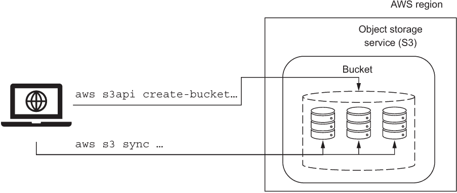

# 第二章：开始使用数据集

本章涵盖了

+   引入一个机器学习用例

+   从对象存储开始使用无服务器机器学习

+   使用爬虫自动发现结构化数据模式

+   迁移到基于列的数据存储以实现更高效的分析。

+   尝试 PySpark 提取-转换-加载（ETL）作业

在上一章中，你学习了关于无服务器机器学习平台的知识以及它们为何能帮助你构建成功的机器学习系统的一些原因。在本章中，你将开始使用一个实用的、真实世界的无服务器机器学习平台用例。接下来，你被要求下载华盛顿特区几年的出租车乘车记录数据集，以构建一个适用于该用例的机器学习模型。当你熟悉数据集并了解如何使用它来构建机器学习模型的步骤时，你将了解到无服务器机器学习平台的关键技术，包括对象存储、数据爬虫、元数据目录和分布式数据处理（提取-转换-加载）服务。通过本章的结论，你还将看到使用代码和 shell 命令示例，演示这些技术如何与亚马逊网络服务（AWS）一起使用，以便你可以在自己的 AWS 账户中应用所学的知识。

## 2.1 引入华盛顿特区出租车乘车数据集

本节深入探讨了华盛顿特区出租车行业的业务领域和业务规则的细节。你可能会想跳过这些细节；毕竟，它们可能与你计划在机器学习项目中使用的数据集无关。然而，我鼓励你将本节视为一个案例研究，说明你在计划应用机器学习的任何业务领域中应该提出的问题种类。当你在本节中探索业务用例时，你可以更多地了解到 DC 出租车行程数据背后的因素，并更好地为构建机器学习模型做准备。

### 2.1.1 业务用例是什么？

想象一下，你是一名机器学习工程师，为一家年轻有为的初创公司工作，计划推出一款自动驾驶的无人驾驶汽车，以接管乘车共享行业，并超越 Waymo、Uber 和 Lyft 等公司。你的业务领导决定，你的服务首先将在华盛顿特区市场推出。由于你的初创公司希望提供与普通出租车竞争的价格，所以你被要求编写一些代码来估算乘客从一个位置到另一个位置乘坐普通出租车的费用，范围包括华盛顿特区及其附近的弗吉尼亚州和马里兰州。

### 2.1.2 业务规则是什么？

华盛顿特区出租车费用的计算业务规则可从 dc.gov 网站获取。¹ 规则如下：

+   前 1/8 英里的费用为 $3.50。

+   每增加 1/8 英里的费用为 0.27 美元，每英里累计费用为 2.16 美元。

+   特殊的按时计费为每小时 25 美元，并按 1 分钟递增。

基于持续时间的收费适用于出租车在交通拥堵中的情况，因此车费金额会随着时间的推移而持续增加。dc.gov 网站还列出了其他特殊费用（例如，下雪紧急情况的费用），但让我们暂时忽略它们。

### 2.1.3 业务服务的模式是什么？

对于出租车车费估算服务接口的更具体规范，软件工程师可以定义输入和输出值的数据类型，如表 2.1 所示。接口期望输入由接送位置（每个位置都是一对纬度和经度坐标）以及预计行程开始时间的时间戳组成。服务的输出仅是估计出租车费用的金额。表 2.1 中提供的示例值适用于短途半英里出租车行程，大约花费 6.12 美元。由于第 1/8 英里的固定费用为 3.50 美元，剩余的 3/8 距离的费用为 0.81 美元（0.27 美元*3），剩余的 1.81 美元可能是由于出租车在星期一的午间高峰期在华盛顿特区市中心繁忙地区花费的时间。

表 2.1 出租车车费估算服务接口的架构和示例值

| 输入 |
| --- |
| 名称 | 数据类型 | 示例值 |
| 接送位置纬度 | 浮点数 ² | 38.907243 |
| 接送位置经度 | 浮点数 | –77.042754 |
| 接送位置经度 | 浮点数 | 38.90451 |
| 送达位置经度 | 浮点数 | –77.048813 |
| 预计行程开始时间 | 时间戳 ³ | 2015 年 01 月 12 日 12:42 |
| 输出 |
| 名称 | 数据类型 | 示例值 |
| 估计车费（美元） | 浮点数 | 6.12 |

表 2.1 中行程的纬度和经度坐标对应于华盛顿特区 1814 N St. NW 的接送地址和 1100 New Hampshire Ave. NW 的送达地址。请注意，该服务不执行任何地理编码；换句话说，该服务期望接送位置和送达位置是纬度和经度坐标，而不是类似于 1100 New Hampshire Ave. NW 的人类可读地址。当然，您的服务的用户不需要键入坐标的纬度和经度值。相反，用户可以在您的移动应用程序中的地图上直观地放置接送位置的图钉。然后，可以直接使用图钉的纬度和经度与该服务一起使用。或者，还可以使用来自 Google 地图和类似服务的地理编码功能，但它们不在本书的范围之内。

### 2.1.4 实施业务服务的选项有哪些？

表 2.1 中示例的行程仅是华盛顿特区可能的许多出租车路线中的一种。对于出租车费用估算服务的目的，出租车行程可以跨越任何上车和下车位置，只要两者都在菱形边界内，该边界包括华盛顿特区的整个范围以及马里兰州和弗吉尼亚州的附近地区。交互式地图（[`osm.org/go/ZZcaT9`](https://osm.org/go/ZZcaT9)）上的区域包括本书中华盛顿特区出租车行程的所有可能的上车和下车位置。你创业公司的移动应用的用户可以在区域边界内放置上车和下车标记，以获取行程的估价。

在着手实现用于估算出租车费用的机器学习项目之前，请考虑一下传统的软件工程方法来构建费用估算服务。一个软件工程师（假设他们对机器学习不熟悉）可能会首先开发代码来使用业务规则来计算费用，并将代码与来自服务（如 Google Maps 或 Bing Maps）的路线规划应用程序接口（API）集成。这两个 API 都可以计算从一个位置到另一个位置的最短驾驶路线，并估算路线的距离和持续时间。出租车司机实际走的路线和行程持续时间可能会因交通、道路关闭、天气和其他因素而有所不同，但这种方法可以合理估计距离。接下来，API 返回的距离可以与业务规则结合起来计算出预估的出租车费用。

构建出租车费用估算服务的传统软件工程方法有几个优点。该服务很容易实现，即使对于初级软件工程师也是如此。全球范围内有大量具备交付实施技能的工程师。一旦实施，该服务应该会产生准确的估算结果，除非出租车乘车受到异常交通、天气或紧急事件的影响。

然而，对于创业公司来说，依赖路线规划服务可能会很昂贵。像 Google Maps 这样的服务每次 API 请求都要收费，以执行路线规划和计算距离，并根据交通选择路线。这些服务的成本可能会迅速累积起来。此外，还要考虑到您服务的用户的额外成本，他们将估算行程的价格而实际上并未乘坐车辆。虽然一家更大的公司可以探索通过在开源数据软件上进行构建或从供应商购买许可证来开发本地、内部部署的路线规划服务的选项，但对于创业公司来说，这样做的成本是禁止的。

本书不是依赖于传统软件工程来构建出租车费用估算服务，而是介绍了使用 AWS 的无服务器能力实现的机器学习方法。

### 2.1.5 什么数据资产可用于业务服务？

华盛顿特区首席技术官办公室维护着一个网站，该网站托管了在华盛顿特区范围内发生的出租车行程的数据。⁴ 在本书中，您将使用这个从 2015 年到 2019 年的出租车行程的历史数据集来构建机器学习模型，以估计在华盛顿特区乘坐出租车的成本。机器学习方法的关键优势在于，它不依赖于昂贵的外部服务进行路线规划和距离计算。该模型将从出租车行程数据中学习，以估计基于在华盛顿特区不同位置进行的出租车行程的费用。

本书的后续部分，您还将部署模型到 AWS 作为一个具有互联网可访问 API 的 Web 服务，用于出租车费用预测。该服务将处理包含接送地点的地理坐标的 HTTP（超文本传输协议）请求，并返回估计的出租车费用。该服务的 API 还将考虑行程的开始时间，以便模型能够正确调整预测的费用。例如，相同接送地点的多次行程的费用将根据一天中的时间（高峰时段与深夜）、一周中的日期（工作日与周末）甚至一年中的日期（假期与工作日）而变化。

您还会发现，机器学习方法可以通过最小的更改来适应服务扩展到支持其他地理区域。您不需要为您的创业公司想要推出的每个城市硬编码城市特定的业务规则，而只需将其他城市的出租车行程数据扩展到数据集中即可。

### 2.1.6 下载和解压数据集

从 opendata.dc.gov 下载并解压文件开始处理数据集。⁵ 下载文件后，您应该能够确认您拥有 2015 年到 2019 年的数据，每年都有一个单独的 zip 文件。请注意，2019 年的数据集仅限于一月至六月的数据。解压文件后，整个数据集应该占据不到 12 GiB 的磁盘空间。

注意：解压文件后，数据集的内容会被放置到单独的子目录中。在继续之前，请将数据集中的所有文件移动到一个单独的目录中。不用担心覆盖 README_DC_Taxicab_trip.txt 文件；对于数据集的每一年，该文件都有一个相同的副本。

本书中的指令假设你在 Linux 或 MacOS 中使用 bash（或类似的）shell 作为你的 shell 环境。当你下载并解压缩文件后，你可以使用 shell 的 du 命令确认数据集大约占据你磁盘的 12 GiB 空间。

```py
du -cha --block-size=1MB
```

结果输出以以下内容开头。

列表 2.1 显示从 2015 年到 2019 年的 DC 出租车行程数据集的解压缩文件

```py
8.0K    ./README_DC_Taxicab_trip.txt
176K    ./taxi_2015_01.txt
 60M    ./taxi_2015_02.txt
151M    ./taxi_2015_03.txt
190M    ./taxi_2015_04.txt
302M    ./taxi_2015_05.txt
317M    ./taxi_2015_06.txt

...

11986    total
```

为简洁起见，列表 2.1 中 du 命令的输出省略了数据集中的大部分文件，并用省略号代替。完整的列表可在 Github Gist（[`mng.bz/nrov`](http://mng.bz/nrov)）上找到。

在 zip 文件中，数据被打包为一组文本文件（具有“.txt”扩展名），每行使用竖线（|）字符将列分隔开。机器学习从业者通常将这种文件称为*管道分隔逗号分隔值*（CSV）文件。尽管这个行业术语令人困惑，我将继续使用 CSV 这个缩写词来表达这个数据格式，直到本书结束。

DC 出租车数据集的 CSV 文件包含标题行，即每个文件的第一行为每一列的字符串标签，例如 MILEAGE、FAREAMOUNT 等。文件中的其余行是出租车行程记录，每行一次行程。每个 zip 文件还包含一个相同的 README_DC_Taxicab_trip.txt 文件副本，该文件提供了有关数据资产的一些附加文档。文档的关键部分将在本章后面介绍。

## 2.2 从数据集开始使用对象存储

本节将介绍本书中机器学习项目的第一个无服务器能力。你将在对传统文件系统的了解基础上，开始学习关于无服务器对象存储的知识。接下来，你将使用 AWS 的命令行界面为 DC 出租车数据集创建一个无服务器对象存储位置，并开始将 CSV 文件复制到该位置。你将熟悉如何使用公共云对象存储来处理你的机器学习数据集，并将 DC 出租车数据集转移到对象存储中进行进一步处理。

本节和本书的其余部分将使用来自 AWS 的简单存储服务（S3）的示例来解释无服务器对象存储如何帮助你进行机器学习项目。但是，你应该知道其他公共云供应商，如 Google Cloud 和 Microsoft Azure，也提供类似的功能。

### 2.2.1 理解对象存储和文件系统的区别

文件系统和对象存储之间有许多相似之处，因此，如果你首先专注于它们的区别（见表 2.2），你会发现更容易理解对象存储。请记住，文件系统设计用于在命名位置存储可变或可更改的数据。这意味着使用文件系统，你可以打开文件，导航到文件中的任何行或字节位置，更改所需数量的字节，然后将更改保存回文件系统。由于文件系统中的文件是可变的，所以在进行更改后，原始数据就不存在了，并且被你的更改替换在存储介质上（例如固态驱动器）。

表 2.2 虽然文件系统和对象存储服务都具有类似的功能，如文件夹层次结构和支持复制、删除和移动等常见操作，但在这个表中突出显示了一些重要的区别。

| 文件系统/文件 | 无服务器对象存储/对象 |
| --- | --- |
| 可变的 | 不可变的 |
| 缺乏全局唯一名称 | 可以使用 URL 在全球范围内标识 |
| 跨多个存储设备的数据冗余 | 跨多个可用性区域（数据中心）和多个存储设备的数据冗余 |

相反，对象存储中的对象是不可变的。一旦在对象存储中创建了对象，它就会存储在创建对象时放入对象中的确切数据。你可以使用你的更改创建对象的新版本，但是就对象存储服务而言，新版本是一个额外的对象，占用额外的存储空间。当然，你也可以删除整个对象，释放存储空间。

与文件不同，像 AWS S3 这样的无服务器对象存储服务中的对象设计为可以使用 HTTP 协议在互联网上访问。默认情况下，对象的公共互联网访问是禁用的。但是，无服务器对象存储中的任何对象都可以通过公共 URL 提供。为了支持此功能，对象存储服务将对象组织到*桶*（在 Azure 中称为*容器*）中，这些桶是具有全局唯一标识符的命名位置。对象存储中的每个对象都必须存在于桶中，直接或在一些层次结构的类似文件夹的名称结构下。例如，如果<guid>是 S3 桶的全局唯一标识符名称，那么名为 dataset 的对象可以直接通过 S3 桶的 URL 访问，使用 https://<guid>.us-east-2.amazonaws.com/dataset，或者在桶内名为“2015”的文件夹下使用 https://<guid>.us-east-2.amazonaws.com/2015/dataset。

示例中的对象 URL 中的“us-east-2”部分是传统文件系统和对象存储之间另一个差异的原因。与依赖于同一物理服务器内的多个存储设备进行数据冗余的文件系统不同，AWS 等对象存储提供商会在多个存储设备和被称为*可用区*的多个物理数据中心之间复制数据。在一个大都市区域内相互连接的高带宽和低延迟网络上的冗余可用区集群称为*区域*。对象 URL 的“us-east-2”部分指定了存储对象的区域的 AWS 特定代码名称。

为什么您应该为 DC 出租车乘车数据集和出租车费用估算服务使用无服务器对象存储？对于您的机器学习项目，使用无服务器对象存储，您不必担心存储空间不足的问题。像 S3 这样的服务可以帮助您从 GB 到 PB 的数据集进行扩展。正如您从第一章对无服务器的定义中所记得的那样，使用无服务器对象存储可以确保您不需要管理任何存储基础设施，并且您将根据存储桶中保存的数据量收费。此外，由于对象存储可以为存储的对象提供基于 HTTP 的接口，因此访问和集成您存储的数据所需的工作量更少。

### 使用 Amazon Web Services 进行身份验证

本章中剩余的示例依赖于 AWS 服务。如果您计划从示例中运行代码，则应安装 AWS 软件开发工具包 (SDK)，并了解您的 AWS 帐户的访问和密钥。SDK 安装的详细信息可在 AWS 文档 ([`docs.aws.amazon.com/cli`](https://docs.aws.amazon.com/cli)) 中找到。

如果您没有可用的 AWS 访问和密钥，可以通过转到 AWS 管理控制台 ([`console.aws.amazon.com/`](https://console.aws.amazon.com/))，点击右上角下拉菜单中的用户名，然后选择“我的安全凭证”来生成新的一对。要创建新的密钥对，请点击“创建访问密钥”按钮。

本书的说明假定您已经配置了带有 AWS 环境变量的 shell 使用

```py
export AWS_ACCESS_KEY_ID=█████████████████████
export AWS_SECRET_ACCESS_KEY=█████████████████
```

在运行任何依赖 AWS SDK 的命令之前。

注意 在本书中，所有的清单都使用一系列 █ 字符替换了敏感的账户特定信息。请务必使用您的账户特定值来替换 AWS 访问和密钥。

要验证您已指定有效值的环境变量 AWS_ ACCESS_KEY_ID 和 AWS_SECRET_ACCESS_KEY，您可以运行

```py
aws sts get-caller-identity
```

在与 AWS 成功验证的情况下，应返回您的用户 ID、账户和 Arn 值：

```py
{
    "UserId": "█████████████████████",
    "Account": "████████████",
    "Arn": "arn:aws:iam::████████████:user/█████████"
}
```

### 创建无服务器对象存储存储桶

本节将指导您完成创建 S3 存储桶并将 DC 出租车数据文件作为对象上传到存储桶的步骤（图 2.1）。本节中的步骤使用 AWS 的命令行界面（CLI）完成，但如果您愿意，您也可以使用 AWS 管理控制台的图形用户界面完成相同的步骤（[`console.aws.amazon.com`](https://console.aws.amazon.com)）。本书专注于基于 CLI 的方法，因为它可以轻松解释、测试和重用作为脚本自动化的一部分的步骤。



图 2.1 要将 DC 出租车数据集传输到 AWS 的对象存储中，您将使用 aws s3api create-bucket 命令创建一个 S3 存储桶，指定区域和存储桶的全局唯一标识符。接下来，您将使用 aws s3 sync 将数据集文件上传到存储桶中名为“csv”的文件夹中。

选择存储桶的区域（以及作为结果的位置）对于访问存储在存储桶中的数据的低延迟非常重要。未来，您应该记住从与您放置 S3 存储桶相同的区域运行任何处理数据的代码。本节假设您将使用 us-east-2 区域存储数据集。

要导出 AWS_DEFAULT_REGION 变量的设置，该变量将用于指定存储桶的默认区域，请运行

```py
export AWS_DEFAULT_REGION=us-east-2
echo $AWS_DEFAULT_REGION
```

这应该返回您选择的存储桶区域的值。

由于存储桶名称应该是全局唯一的，因此在代码清单中发布固定且相同的存储桶名称毫无意义。相反，清单 2.2 使用 $RANDOM 环境变量，该变量始终返回一个伪随机值。然后，使用 MD5 散列函数对值进行哈希处理，以得到由一系列数字和字符组成的唯一标识符。然后将 BUCKET_ID 变量设置为哈希字符串的前 32 个字符的值，如 cut 命令的输出所示。

清单 2.2 使用伪随机生成器生成存储桶 ID 的可能唯一值

```py
export BUCKET_ID=$(echo $RANDOM | md5sum 
➥ | cut -c -32)                           ❶

echo $BUCKET_ID
```

❶ 使用 Linux 伪随机数生成器的 MD5 哈希的前 32 个字符。

注意：如果您在 Mac OSX 或 BSD 上运行清单 2.2 中的命令，则可能需要使用 md5 而不是 md5sum。

此时，您应该已经导出了环境变量，指定了存储桶的全局唯一标识符（在 BUCKET_ID 中）和区域（在 AWS_DEFAULT_REGION 中）。

在创建存储桶之前，运行

```py
aws sts get-caller-identity
```

以确保您的 shell 配置为有效的环境变量值，这些值是用于与 AWS 进行身份验证所需的 AWS_ACCESS_KEY_ID 和 AWS_SECRET_ACCESS_KEY。

请注意，以下命令创建存储桶时使用的是 aws s3api 而不是您可能期望的 aws s3。这是为了与传统的、细粒度的 AWS CLI 功能兼容，这些功能在引入 aws s3 命令之前就已经提供。

注意：如果想要使用 us-east-1（北弗吉尼亚地区）而不是 us-east-2，您需要在 aws s3api create-bucket 命令中删除 LocationConstraint 参数。

创建存储桶。

```py
aws s3api create-bucket --bucket dc-taxi-$BUCKET_ID-$AWS_DEFAULT_REGION \
--create-bucket-configuration LocationConstraint=$AWS_DEFAULT_REGION
```

并确认使用您的 BUCKET_ID 和 AWS_DEFAULT_REGION 环境变量替换 █ 字符后，命令返回类似于以下 JavaScript 对象符号 (JSON) 响应：

```py
{
"Location": "http:/dc-taxi-████████████████████████████████-█████████.s3
➥ .amazonaws.com/"
}
```

虽然 aws s3api create-bucket 命令的响应返回存储桶的 HTTP URL，但通常您将使用以 s3:// 前缀开头的 AWS 特定命名方案来引用存储桶。如果您迷失了名称，可以使用以下代码重新创建它：

```py
echo s3://dc-taxi-$BUCKET_ID-$AWS_DEFAULT_REGION.
```

您还可以使用 AWS CLI 的 list-buckets 命令打印出 AWS 帐户中存在的所有存储桶。然而，打印的名称不会使用 s3:// 前缀：

```py
aws s3api list-buckets
```

list-buckets 命令可以为您提供第二次确认，以确保存储桶已经成功创建。一旦您知道存储桶已经创建成功，将当前工作目录更改为包含列表 2.1 中数据集文件的目录。

接下来，使用 aws s3 sync 命令将数据集文件复制到存储桶中。该命令递归地传输新文件和修改后的文件到或从 S3 存储桶中的位置。在运行时，命令依赖于多个线程来加快传输速度。

使用下面的代码将 CSV 文件从本地工作目录传输到存储桶中的 csv 文件夹：

```py
aws s3 sync . s3://dc-taxi-$BUCKET_ID-$AWS_DEFAULT_REGION/csv/
```

数据传输所需的时间取决于您可用的带宽。在大多数情况下，您应该预计需要超过 10 分钟，因此这是休息并在传输完成后继续的好时机。

sync 命令完成后，您可以使用 aws s3 ls 命令确认数据集文件存储在存储桶的 csv 文件夹下。与类 Unix 的操作系统一样，S3 中的 ls 命令列出文件夹的内容。试着运行以下命令：

```py
aws s3 ls --recursive --summarize \
--human-readable s3://dc-taxi-$BUCKET_ID-$AWS_DEFAULT_REGION/csv/
```

注意你已经将 11.2 GiB 的 CSV 文件传输到了对象存储存储桶中。这个传输到存储桶的数据量应该与列表 2.1 的数据集内容大小匹配。

文件上传到对象存储后，可以下载和处理它们。然而，这些数据还不能与非结构化的二进制大对象 (BLOB) 区分开来。为了在 CSV 文件中编目数据结构，您将需要遍历文件并发现数据模式。

## 2.3 发现数据集的模式

在这一点上，您已在对象存储桶中创建了一个 csv 文件夹，并已将由 11.2 GiB 的 CSV 文件组成的 DC 出租车数据集传输到该文件夹中。在开始对文件进行分析之前，重要的是要识别和了解数据集的架构。虽然可以手动发现数据集的架构，例如，通过搜索 opendata.dc.gov 网站获取架构规范或直接探索 CSV 文件的内容，但自动化方法可以简化和加速架构发现的过程。在本节中，您将了解一个数据爬虫服务，该服务可以帮助您自动发现数据集的架构，以便您更好地跟上数据的架构变化。您还将爬取 DC 出租车数据集的 CSV 文件，并将数据集的架构持久化存储在数据目录中。

### 2.3.1 介绍 AWS Glue

Glue 是一个包含不同 AWS 服务工具包的总称，您可以使用这些工具包为数据集准备分析。在本书中，您将了解 Glue 数据目录、Glue 提取-转换-加载（数据处理）作业以及用于分布式数据处理的 Glue 库。

Glue 数据目录是一个设计用于存储有关数据资产、数据架构和数据来源的元数据存储库。数据目录由一个或多个数据库组成，这些数据库存在于一起组织一组表。由于 Glue 数据库和表设计用于存储元数据，因此您的项目数据必须存在于 Glue 之外的存储中。例如，Glue 表可以存储存储在对象存储中、关系（例如 MySQL 或 PostgreSQL）或 NoSQL 数据库中的数据的架构。

除了数据架构之外，Glue 表还保留了有关从数据推断架构的时间以及有关数据的一些基本统计信息，例如用于存储数据的对象存储中使用的对象数量、数据中的行数以及对象存储中一行占用的平均空间量。

虽然可以手动在 Glue 数据库中创建表，但在本节中，您将了解如何使用 Glue 爬虫自动创建表。如果您熟悉在网络搜索引擎的上下文中 *爬虫* 一词，请记住 Glue 爬虫是不同的。它们设计用于处理和分析结构化数据格式，而不是网页。Glue 爬虫是一个过程，它

1.  建立与结构化数据存储位置的连接（例如，与对象存储桶的连接）

1.  确定数据使用的格式（例如，CSV）

1.  分析数据以推断数据架构，包括各种列数据类型，例如整数、浮点数和字符串

爬虫可以被定期调度以定期重新爬取数据，因此，如果您的数据架构随时间变化，下次运行爬虫时，爬虫将能够检测到该变化并更新表中的架构。

要创建一个爬虫，您需要提供一个爬虫配置，该配置指定一个或多个目标，换句话说，指定应该由爬虫处理的存储位置的唯一标识符。此外，AWS 中的爬虫必须假定一个安全角色，以访问爬虫配置目标中的数据。像 AWS 这样的云提供商要求您在应用程序、服务或过程（例如 AWS Glue 爬虫）代表您访问云资源时创建安全身份，称为*角色*。

### 2.3.2 授权爬虫访问您的对象

在为 DC 出租车数据创建爬虫之前，您应完成列表 2.3 中的步骤，以创建一个名为 AWSGlueServiceRole-dc-taxi 的角色。aws iam create-role 命令（列表 2.3 ❶）创建了一个角色，该角色具有允许 Glue 服务（[`aws.amazon.com/glue`](https://aws.amazon.com/glue)）假定 AWSGlueServiceRole-dc-taxi 安全角色的策略文档。简而言之，策略文档指定 Glue 爬虫应使用 AWSGlueServiceRole-dc-taxi 角色。

列表 2.3 允许 AWS Glue 爬虫访问对象存储桶中的文件

```py
aws iam create-role \
  --path "/service-role/" \
  --role-name AWSGlueServiceRole-dc-taxi            ❶
  --assume-role-policy-document '{
  "Version": "2012-10-17",
  "Statement": [
    {
      "Effect": "Allow",
      "Principal": {
        "Service": "glue.amazonaws.com"
      },
      "Action": "sts:AssumeRole"
    }
  ]
}'

aws iam attach-role-policy \                      ❷
  --role-name AWSGlueServiceRole-dc-taxi \
  --policy-arn arn:aws:iam::aws:policy/service-role/AWSGlueServiceRole

aws iam put-role-policy \
  --role-name AWSGlueServiceRole-dc-taxi \        ❸
  --policy-name GlueBucketPolicy \
  --policy-document '{
    "Version": "2012-10-17",
    "Statement": [
        {
            "Effect": "Allow",
            "Action": [
                "s3:*"
            ],
            "Resource": [
                "arn:aws:s3:::dc-taxi-'$BUCKET_ID'-'$AWS_DEFAULT_REGION'/*"
            ]
        }
    ]
}'
```

❶ 创建名为 AWSGlueServiceRole-dc-taxi 的安全角色。

❷ 将 AWS Glue 策略附加到 AWSGlueServiceRole-dc-taxi 角色。

❸ 为 AWSGlueServiceRole-dc-taxi 分配一个策略文件，以启用对数据集 S3 存储桶的爬取。

aws iam attach-role-policy 命令（列表 2.3 ❷）将 AWS Glue 定义的现有服务角色（AWSGlueServiceRole）附加到 AWSGlueServiceRole-dc-taxi 角色。附加角色确保 AWSGlueServiceRole-dc-taxi 角色可以访问 Glue 数据库和表，并执行与 AWS 资源的其他必需操作。AWSGlueServiceRole 规范的详细信息可从 AWS 文档（[`mng.bz/XrmY`](http://mng.bz/XrmY)）中获取。

aws iam put-role-policy 命令（列表 2.3 ❸）指定 AWSGlueServiceRole-dc-taxi 角色被允许访问您在本章早些时候创建并填充 DC 出租车 CSV 文件的对象存储桶的内容。

### 2.3.3 使用爬虫发现数据模式

在这一部分，您将在 Glue 中创建一个数据库和爬虫，配置爬虫以处理 DC 出租车数据，并运行爬虫以填充数据库，其中包含数据架构的表。您可以选择使用 AWS 的浏览器界面来完成这些步骤⁸。然而，本章中的列表 2.4 和即将出现的列表将解释基于 CLI 的命令，以创建一个 Glue 数据库和一个爬虫，并启动爬虫来发现 DC 出租车数据模式。

在列表 2.4 ❶中，aws glue create-database 命令创建了名为 dc_taxi_db 的 Glue 元数据数据库，该数据库将用于存储 DC 出租车数据集的模式以及基于该模式的表。

列表 2.4 创建数据库并确认数据库存在

```py
aws glue create-database --database-input '{    ❶
  "Name": "dc_taxi_db"
}'

aws glue get-database --name 'dc_taxi_db'       ❷
```

❶ 创建名为`dc_taxi_db`的数据库。

❷ 确认名为`dc_taxi_db`的数据库已创建。

由于这是一个过程，Glue 爬虫会循环通过一系列状态。成功创建爬虫后，它会从 READY 状态开始存在。启动后，爬虫转移到 RUNNING 状态。在 RUNNING 状态下，爬虫会建立与爬虫配置中指定的存储位置的连接。根据爬虫配置，爬虫会识别在处理过程中包含或排除的存储位置，并使用这些位置的数据推断数据架构。RUNNING 状态通常是爬虫完成的时间最长的状态，因为爬虫在此状态下进行大部分工作。接下来，爬虫转移到 STOPPING 状态，以使用在过程中发现的架构和其他元数据填充 Glue 数据目录表。假设进程成功完成，爬虫将返回到 READY 状态。

列表 2.5 创建和启动 Glue 爬虫

```py
aws glue create-crawler \
  --name dc-taxi-csv-crawler \                         ❶
  --database-name dc_taxi_db \                         ❷
  --table-prefix dc_taxi_ \                            ❸
  --role $( aws iam get-role \
          --role-name AWSGlueServiceRole-dc-taxi \     ❹
          --query 'Role.Arn' \
          --output text ) \
   --targets '{
  "S3Targets": [                                       ❺
    {
      "Path": "s3://dc-taxi-'$BUCKET_ID'-'$AWS_DEFAULT_REGION'/csv/",
      "Exclusions": ["README*"]                        ❻
    }]
}'

aws glue start-crawler --name dc-taxi-csv-crawler      ❼
```

❶ 将`dc-taxi-csv-crawler`用作爬虫名称。

❷ 将爬虫输出存储在`dc_taxi_db`中。

❸ 爬虫创建的表名应以`dc_taxi_`前缀开头。

❹ 使用`AWSGlueServiceRole-dc-taxi`角色进行爬虫操作。

❺ 配置爬虫以爬取数据集存储桶的`csv`文件夹。

❻ 排除爬虫中的`README_DC_Taxicab_trip`文档文件。

❼ 启动爬虫。

在列表 2.5 中，使用`dc-taxi-csv-crawler`❶创建爬虫，并配置将爬取过程中发现的元数据存储在`dc_taxi_db`数据库中。还配置了爬虫在数据库中创建的任何表的表前缀为`dc_taxi_`。

注意，列表 2.5 中指定的命令❹比本章遇到的其他 shell 命令更复杂。在 bash 中，用 $( ) 字符括起来的命令首先被评估，然后评估的输出用于原始命令中。因此，在 $( ) 中嵌套的`aws iam get-role`命令用于查找您在列表 2.3 中创建的角色的亚马逊资源名称（Arn）。

在列表 2.5 中，配置爬虫以爬取您上传 DC 出租车数据文件的对象存储桶中的`csv`文件夹，并注意忽略以❺`README`前缀❻的对象。

最后，根据第❼条指示使用`aws glue start-crawler`命令启动`dc-taxi-csv-crawler`。

对于 DC 出租车数据集，爬取过程应该在一分钟左右完成。您可以使用浏览器中的 AWS 管理控制台监视爬虫的状态，或者运行以下命令来打印爬虫的状态：

```py
aws glue get-crawler --name dc-taxi-csv-crawler --query 'Crawler.State' \
--output text
```

当爬虫正在运行时，状态应为运行中。一旦爬虫完成，它应该变为就绪状态。

注意：要每两秒打印一次爬虫的最新状态，您可以在`aws glue get-crawler`命令之前输入“watch”。

一旦爬虫返回到 READY 状态，您可以使用以下方法确定爬取是否成功

```py
aws glue get-crawler --name dc-taxi-csv-crawler --query 'Crawler.LastCrawl'
```

由--query 'Crawler.LastCrawl'参数请求的最后一次爬取详情包括一个状态消息，指示爬虫的最后一次运行是成功还是失败。

假设爬虫成功完成，您可以使用以下方法列出爬虫发现的模式的列名和列数据类型

```py
aws glue get-table --database-name dc_taxi_db --name dc_taxi_csv.
```

请注意，表名“dc_taxi_csv”是由爬虫根据清单 2.5 中爬虫表前缀的组合和爬取存储桶中 csv 文件夹的名称自动分配的，如清单 2.5 中所示。

请记住，您也可以使用浏览器查看 aws glue get-table 命令打印的模式，方法是导航到 AWS 中的 Glue 服务，选择左侧边栏中的“数据目录 > 数据库 > 表”，然后在右侧单击“dc_taxi_csv”表。

此时，您的项目已经超越了将 DC 出租车数据视为 BLOB 集合的阶段，并为数据的结构创建了更详细的规范，列举了数据列及其数据类型。然而，到目前为止您一直使用的 CSV 数据格式并不适合进行高效和可扩展的分析。在本章的即将到来的部分，您将学习如何修改数据格式以减少分析数据查询的延迟。

## 迁移到列式存储以进行更高效的分析

在本书的下一章中，您将了解到一种交互式查询服务，该服务可以帮助您使用 Glue 爬虫发现的表和数据模式查询 DC 出租车数据集。然而，正如本节所解释的，针对行式数据存储格式（如 CSV）的分析查询在处理大型数据集时效率低下。虽然您可以立即深入分析 DC 数据集，但本节将首先向您介绍使用列式（列式）数据存储格式（如 Apache Parquet）而不是 CSV 进行分析的好处。在解释了列式格式的优缺点之后，本节的其余部分将涵盖 AWS 的另一个用于使用 PySpark（Apache Spark）进行分布式数据处理的无服务器功能。通过本节的结论，您将学习到一个典型的 PySpark 作业示例，该示例可以帮助您将 CSV 文件重新编码为 Parquet 格式，以便在即将到来的章节中更快、更高效地分析数据集。

### 引入列式数据格式用于分析

DC 出租车数据集使用的 CSV 数据格式是行定向格式的一个例子。对于 CSV 文件，文件中的每一行存储来自结构化数据集的单个数据行。行定向数据格式（如图 2.2 左侧所示）通常由传统关系型数据库使用，用于存储数据记录序列。行定向格式非常适合关系型数据库的事务工作负载。事务工作负载是对数据的单个行进行操作，并且通常一次仅操作一行。例如，考虑一个存储出租车行程记录的事务性数据库。如果乘客在行程的一半决定更改目的地，事务性数据库可以轻松处理识别关于行程的数据行、更新目的地的纬度和经度坐标，然后将更改保存回数据库。


图 2.2 行定向存储（左侧）由 CSV 文件和传统关系型数据库使用，设计用于事务处理，使得一次可以更改一行数据。列定向存储（右侧）由 Apache Parquet 和许多现代数据仓库使用，最适合于对不可变数据集进行分析查询。

分析工作负载与事务性工作负载有显著不同。在对数据集执行分析查询时，通常处理数据集中的所有行，例如识别一天中特定小时内的出租车行程或排除费用超过$20 的行程的行。分析查询通常包括聚合函数，这些函数在匹配行上处理一组值，并基于该组计算单个值。聚合函数的示例包括求和、平均值（算术平均值）、最小值和最大值。

要对行定向存储格式中的数据执行分析查询，处理节点需要一次获取并操作一块数据行。例如，考虑一个计算在上午 11:00 至下午 1:00 之间开始的出租车行程的平均持续时间的查询。为了筛选出具有匹配行程时间的行，需要将行块从存储传输到处理节点，尽管块中的大多数数据都与查询无关，例如上车和下车坐标、下车时间等。

除了数据在存储和节点之间转移的不必要长时间之外，行定向格式还浪费了处理器中宝贵的高速缓存内存。由于大多数每行的数据对于执行查询是无用的，因此需要经常不必要地将缓存内容驱逐出去，以替换为另一个数据块。

相比之下，列式数据格式（图 2.2 的右侧）将数据存储在列中而不是行中。大多数现代数据仓库系统使用列式存储，此格式也被像 Apache Parquet[¹⁰] 这样的开源项目采用，以提高分析工作负载的效率。

考虑如何在列式格式中执行分析查询以找到中午行程的平均出租车行程持续时间。要筛选匹配的行程时间，只需将行程开始时间列的数据传输到处理节点。一旦找到具有匹配开始时间的行程，只需获取行程持续时间列的相应条目以计算平均值。

在这两个步骤中，需要传输到处理节点及其缓存的数据量都会有显著的节省。此外，列式格式支持各种编码和压缩方案，将文本数据转换为二进制，以进一步减少数据占用的存储空间[¹¹]。

切记，列式格式并非设计用于事务工作负载。例如 Parquet 等格式所使用的压缩和编码方案相比于简单的文件附加或行特定更改（在 CSV 文件或传统数据库中可能出现的情况）会增加写入操作的延迟。如果你计划采用 Parquet 或其他列式格式，你需要记住这些格式最适用于不可变数据集。例如，DC 出租车行程数据的记录不太可能会更改，这使得 Parquet 成为更高效的存储和更低延迟分析查询的优秀选择。

### 2.4.2 迁移至基于列的数据格式

正如您在本章早些时候学到的，AWS Glue 包括创建和运行数据处理作业的能力，包括将数据提取转换加载（ETL）到目标存储进行分析的作业。在本节中，您将创建和使用 Glue 中的 ETL 作业将原始的、面向行的、基于 CSV 的 DC 出租车数据集转换为列式 Parquet 格式，并将结果 Parquet 对象加载到您 S3 存储桶中的位置。

可以使用 Python 编程语言实现 Glue 数据处理作业。由于 Glue 是无服务器的，作为一个机器学习从业者，你只需要实现作业并将作业代码提交到 Glue 服务。该服务将负责验证您的代码，确保其可执行，为您的作业提供分布式基础设施，使用基础设施完成作业，并在作业完成后拆除基础设施。

一个将 CSV 数据集转换为 Parquet 格式并将转换后的数据存储为 S3 对象的基于 Python 的作业示例在清单 2.6 中展示。

代码清单中，从文件开头到❶的代码是所需对象和函数的标准库导入。从❶到❷之间的代码是用于实例化 Glue 作业的样板头部，相当于根据作业实例传递的运行时参数对作业进行初始化。

代码中的关键步骤带有❸和❹的注释。❸处使用的 createOrReplaceTempView 方法修改了 Spark 会话的状态，声明了一个临时（非物化）视图，名称为 dc_taxi_csv，可以使用 SQL 语句进行查询。

位于❹的方法执行针对 dc_taxi_csv 视图的 SQL 查询，以便作业可以处理数据集中 CSV 文件的内容并输出一些列，同时将列的内容转换为 DOUBLE 和 STRING 数据类型。

位于❺的作业提交操作仅指示作业将转换的输出持久化到存储中。

清单 2.6 将清单中的代码保存到名为“dctaxi_csv_to_parquet.py”的文件中

```py
import sys
from awsglue.transforms import *
from awsglue.utils import getResolvedOptions
from pyspark.context import SparkContext
from awsglue.context import GlueContext
from awsglue.job import Job                                             ❶

args = getResolvedOptions(sys.argv, ['JOB_NAME',
                                     'BUCKET_SRC_PATH',
                                     'BUCKET_DST_PATH',
                                     'DST_VIEW_NAME'])

BUCKET_SRC_PATH = args['BUCKET_SRC_PATH']
BUCKET_DST_PATH = args['BUCKET_DST_PATH']
DST_VIEW_NAME = args['DST_VIEW_NAME']

sc = SparkContext()
glueContext = GlueContext(sc)
logger = glueContext.get_logger()
spark = glueContext.spark_session

job = Job(glueContext)
job.init(args['JOB_NAME'], args)                                        ❷

df = ( spark.read.format("csv")
        .option("header", True)
        .option("inferSchema", True)
        .option("delimiter", "|")
        .load("{}".format(BUCKET_SRC_PATH)) )                           ❸

df.createOrReplaceTempView("{}".format(DST_VIEW_NAME))

query_df = spark.sql("""

 SELECT
    origindatetime_tr,

    CAST(fareamount AS DOUBLE) AS fareamount_double,
    CAST(fareamount AS STRING) AS fareamount_string,

    origin_block_latitude,
    CAST(origin_block_latitude AS STRING) AS origin_block_latitude_string,

    origin_block_longitude,
    CAST(origin_block_longitude AS STRING) AS origin_block_longitude_string,
    destination_block_latitude,
    CAST(destination_block_latitude AS STRING)
      AS destination_block_latitude_string,

    destination_block_longitude,
    CAST(destination_block_longitude AS STRING)
      AS destination_block_longitude_string,

    CAST(mileage AS DOUBLE) AS mileage_double,
    CAST(mileage AS STRING) AS mileage_string

 FROM dc_taxi_csv

""".replace('\n', ''))                                                  ❹

query_df.write.parquet("{}".format(BUCKET_DST_PATH), mode="overwrite")  ❺

job.commit()
```

❶ 导入 AWS Glue 作业以便稍后管理作业的生命周期。

❷ 检索传递给作业的 JOB_NAME 参数。

❸ 将位于 BUCKET_SRC_PATH 的 CSV 文件读取到 Spark DataFrame 中。

❹ 消除 Spark SQL 兼容性的 Python 多行字符串中的新行。

❺ 使用 Parquet 格式保存到由 BUCKET_DST_PATH 指定的对象存储位置。

请注意，您需要将清单 2.6 的内容保存到名为 dctaxi_csv_ to_parquet.py 的文件中。如清单 2.7 所示，您需要将作业源代码文件上传到 S3 存储桶中的位置，以确保 Glue 服务可以访问它以启动作业。

清单 2.7 将代码上传到项目的存储桶中的 glue/dctaxi_csv_to_parquet.py

```py
aws s3 cp dctaxi_csv_to_parquet.py \
s3://dc-taxi-$BUCKET_ID-$AWS_DEFAULT_REGION/glue/    ❶

aws s3 ls \                                          ❷
s3://dc-taxi-$BUCKET_ID-$AWS_DEFAULT_REGION/glue/dctaxi_csv_to_parquet.py
```

❶ 将 PySpark 作业文件复制到 S3 存储桶的 Glue 文件夹中。

❷ 确认文件已按预期上传。

您应该期望类似于以下内容的输出，第一列中的时间戳可能不同：

```py
upload: ./dctaxi_csv_to_parquet.py to 
➥ s3://dc-taxi-████████████████████████████████-█████████/glue/
➥ dctaxi_csv_to_parquet.py
2020-04-20 14:58:22       1736 dctaxi_csv_to_parquet.py
```

上传作业文件后，应按清单 2.8 中所示创建并启动作业。

清单 2.8 创建并启动 dc-taxi-csv-to-parquet-job Glue 作业

```py
aws glue create-job \
  --name dc-taxi-csv-to-parquet-job \
  --role `aws iam get-role \
  --role-name AWSGlueServiceRole-dc-taxi \
  --query 'Role.Arn' \
  --output text` \
  --default-arguments \
   '{"--TempDir":"s3://dc-taxi-'$BUCKET_ID'-'$AWS_DEFAULT_REGION'/glue/"}' \
  --command '{
    "ScriptLocation": "s3://dc-taxi-'$BUCKET_ID'-'$AWS_DEFAULT_REGION'
➥       /glue/dctaxi_csv_to_parquet.py",
    "Name": "glueetl",
    "PythonVersion": "3"
}'

aws glue start-job-run \
  --job-name dc-taxi-csv-to-parquet-job \
  --arguments='--BUCKET_SRC_PATH="'$(
      echo s3://dc-taxi-$BUCKET_ID-$AWS_DEFAULT_REGION/csv/
    )'",
  --BUCKET_DST_PATH="'$(
      echo s3://dc-taxi-$BUCKET_ID-$AWS_DEFAULT_REGION/parquet/
    )'",
  --DST_VIEW_NAME="dc_taxi_csv"'
```

要监视作业的执行，可以直接使用以下命令，或者在其前面加上 watch 命令：

```py
aws glue get-job-runs --job-name dc-taxi-csv-to-parquet-job \
--query 'JobRuns[0].JobRunState'
```

作业成功后，您可以使用以下命令列出存储桶中 parquet 文件夹的内容

```py
aws s3 ls --recursive --summarize --human-readable \
s3://dc-taxi-$BUCKET_ID-$AWS_DEFAULT_REGION/parquet/

...
Total Objects: 99
   Total Size: 940.7 MiB
```

并确认由于转换为 Parquet 格式而引起的压缩将数据大小从以行为导向格式存储的 11.2 GiB CSV 数据减少到 940.7 MiB。

然后，您可以在 Glue 数据目录中创建一个新表，并让该表描述以 Apache Parquet 格式存储的新创建数据。使用清单 2.5 中的方法，做一些更改，包括以下内容：

1.  将爬虫重命名为 dc-taxi-parquet-crawler❶,❸,❹

1.  将存储桶位置更改为使用 parquet 文件夹❷

1.  删除排除选项，因为 Parquet 格式的数据不包括 README 文件❷

```py
aws glue create-crawler \                      ❶
--name dc-taxi-parquet-crawler \
--database-name dc_taxi_db \
--table-prefix dc_taxi_ \
--role `aws iam get-role --role-name AWSGlueServiceRole-dc-taxi 
➥   --query 'Role.Arn' --output text` --targets '{
  "S3Targets": [                               ❷
    {
      "Path": "s3://dc-taxi-'$BUCKET_ID'-'$AWS_DEFAULT_REGION'/parquet/"
    }]
}'

aws glue start-crawler \                       ❸
--name dc-taxi-parquet-crawler

aws glue get-crawler --name dc-taxi-parquet-crawler --query 'Crawler.State'\
 --output text                                 ❹
```

❶ 创建 `dc-taxi-parquet-crawler` 爬虫实例。

❷ 爬取包含转换后数据集的 S3 存储桶的 `parquet` 子文件夹。

❸ 启动爬虫。

❹ 获取当前爬虫状态。

你可以确认从 CSV 到 Parquet 的数据转换是否生成了新的 Glue 表。如果你执行

```py
aws glue get-table --database-name dc_taxi_db --name dc_taxi_parquet
```

然后，输出应该类似于当你针对 `dc_taxi_csv` 表运行 `aws glue get-table` 命令时的结果，唯一的区别是 Parameters.classification 键的值发生了变化。该值应该从 csv 变为 parquet。

## 总结

+   使用机器学习方法建立出租车费估算服务可以帮助你降低运营成本，并避免硬编码特定城市的商业规则。

+   你将使用一个公开的华盛顿特区出租车行程数据集来学习如何使用无服务器机器学习构建出租车费估算 API。

+   无服务器对象存储服务（如 S3）可以帮助你将管理文件系统上的文件数据的知识应用于将大型数据集（从千兆字节到拍字节的数据）作为对象存储在对象存储中。

+   AWS Glue 数据爬虫可以帮助你发现数据的模式，无论你的数据在文件系统、对象存储还是关系数据库中。

+   AWS Glue 提取-转换-加载（ETL）作业服务可以帮助你在不同存储位置之间移动数据，并在过程中对数据进行转换，为分析做好准备。

+   列式数据格式可以提高分析查询的数据处理效率。

^(1.)2018 年 1 月 archive.org 的出租车费快照：[`mng.bz/6m0G`](http://mng.bz/6m0G)。

^(2.) 模式数据类型使用 ANSI SQL 格式来说明。

^(3.) 时间戳以月/日/年 小时:分钟的格式存储为字符串。

^(4.) 2015 年至 2019 年期间华盛顿特区出租车行程目录：[`mng.bz/o8nN`](http://mng.bz/o8nN)。

^(5.)2015 年至 2019 年期间华盛顿特区出租车行程目录：[`mng.bz/o8nN`](http://mng.bz/o8nN)。

^(6.) 采用独立磁盘冗余阵列来确保服务器硬件中的数据冗余：[` mng.bz/v4ax`](http://mng.bz/v4ax)。

^(7.)Amazon 资源名称（ARN）是 AWS 专用的、全球唯一的资源标识符，包括 AWS 中的用户 ID 和账户。你可以从 [`mng.bz/4KGB`](http://mng.bz/4KGB) 了解更多关于 ARN 的信息。

^(8.)AWS Glue 用户界面可从 [`console.aws.amazon.com/glue`](https://console.aws.amazon.com/glue) 访问。

^(9.)AWS Glue 用户界面可从 [`console.aws.amazon.com/glue`](https://console.aws.amazon.com/glue) 访问。

^(10.)Apache Parquet 是一种开放源代码的列式数据存储格式，由 Twitter 和 Cloudera 合作开发，由 Apache 软件基金会项目维护。你可以从 [`github.com/apache/parquet-mr`](https://github.com/apache/parquet-mr) 了解更多关于该格式的信息。

Apache Parquet 列式存储格式使用的编码和压缩方案示例可从[`mng.bz/yJpJ`](http://mng.bz/yJpJ)获取。
