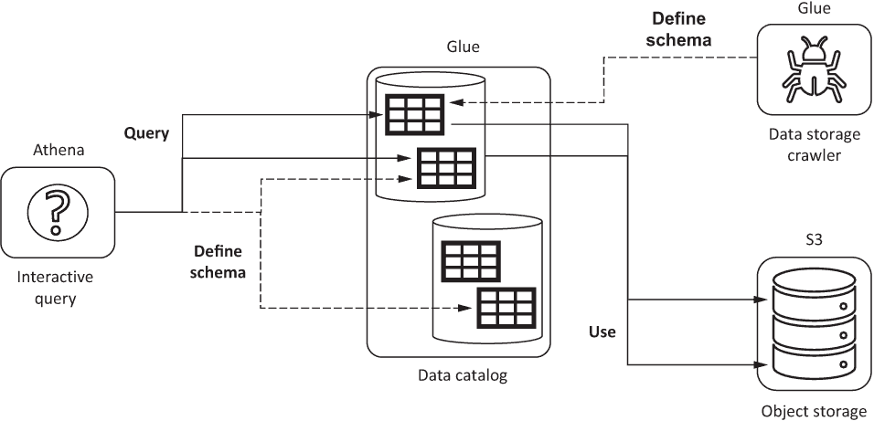
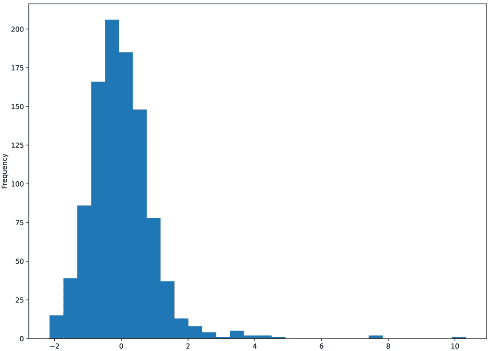

# 第三章：探索和准备数据集

本章内容包括

+   使用 AWS Athena 进行互动查询入门

+   在手动指定数据模式和发现数据模式之间进行选择

+   使用 VACUUM 规范原则处理数据质量

+   通过互动查询分析 DC 出租车数据质量

+   在 PySpark 中实现数据质量处理

在上一章中，将 DC 出租车数据集导入 AWS，并将其存储在项目的 S3 对象存储桶中。您创建、配置并运行了一个 AWS Glue 数据目录爬虫，分析了数据集并发现了其数据模式。您还学习了基于列的数据存储格式（例如 Apache Parquet）及其在分析工作负载中相对于基于行的格式的优势。在章节的结尾，您使用在 AWS Glue 上运行的 PySpark 作业将 DC 出租车数据集的原始基于行的逗号分隔值（CSV）格式转换为 Parquet，并将其存储在 S3 存储桶中。

在本章中，您将学习关于 Athena 的内容，这是 AWS 的另一个无服务器功能，将使用标准查询语言（SQL）对 DC 出租车出行数据集进行分析将证明其价值。您将使用 Athena 开始探索性数据分析（EDA），并识别数据集中存在的一些数据质量问题。接下来，您将了解 VACUUM，这是一个关于数据清理和数据质量的一组规范原则的缩写词，用于有效的机器学习。遵循 VACUUM 原则，您将探索 DC 出租车数据集中存在的数据质量问题，并学习使用 Athena 来重复和可靠地对整个 DC 出租车数据集的子集进行抽样分析。最后，您将实现一个 PySpark 作业，创建一个干净且可以进行分析的数据集版本。

此外，您将学习有关表格数据集数据质量的基础知识，并在有效的机器学习项目中进行实践，这是一个重要的方面。在处理数据质量时，您将了解机器学习数据质量背后的原则，以及如何在机器学习平台上使用 SQL 和 PySpark 应用它们。

## 3.1 进行互动查询的入门

本节首先概述了数据查询的用例，与第二章中用于将 CSV 转换为 Parquet 的数据处理作业相对应。然后，当您介绍 AWS 的交互式查询服务 Athena 时，您将了解使用*模式读取方法*进行结构化数据查询的优缺点，并准备尝试使用示例出租车数据集，并将替代方案应用于该数据集。到本节结束时，您将准备好使用 AWS Athena 的基于浏览器的界面，并探索 DC 出租车车费数据集中的数据质量问题。在本节实现中，您将开始掌握对 DC 出租车车费数据集的探索性数据分析所需的技能，并开始练习在改进数据质量时有用的查询类型。

### 3.1.1 选择交互式查询的正确用例

本节澄清了 I/O 密集型和计算密集型工作负载之间的区别，以及如何从 AWS Glue、AWS Athena、Google Cloud DataProc 或 Google Cloud BigQuery 等技术中选择这两类工作负载。

要对何时使用交互式查询服务有直觉，首先要介绍数据处理中高吞吐量与低延迟的区别是很有价值的。请记住，既可以使用面向行的格式（如 CSV），也可以使用面向列的格式（如 Parquet）来存储结构化数据集，这些数据集被组织成行和列的表。本书使用术语*记录*来描述来自结构化数据集的单个数据行。将数据集描述为记录而不是行有助于避免混淆，即数据是存储在行向或列向格式中。换句话说，记录独立于底层数据存储格式。

在第二章中，您使用托管在 AWS Glue 上的 PySpark 作业执行了一个高吞吐量的工作负载，以将数据记录从 CSV 迁移到 Parquet。高吞吐量工作负载的一个特点是输入和输出记录之间的 *一对多*（有时是 *一对任意*）关系：用作工作负载输入的单个记录可能产生零个、一个或多个输出记录。例如，一个以 SELECT * 开头的简单 SQL 语句会为数据存储中的每个输入记录返回一个输出记录，带有 WHERE 子句的 SELECT 可以过滤一部分记录，而涉及 SELF JOIN 的更复杂的 SQL 语句可以将从表中返回的记录总数平方。在实践中，一对多关系意味着输出记录的数量与输入记录的数量具有相同的数量级，并且与输入记录的数量没有实质性的不同。这样的工作负载也可以描述为输入/输出密集型，因为执行工作负载的底层 IT 基础设施花费的时间用于读取和写入存储，而不是计算。

在第二章开始执行 PySpark 作业时，您可能已经注意到 CSV 到 Parquet 的重新编码工作量需要大约几分钟才能完成。工作量的高延迟（这里的延迟描述了 Glue 作业从开始到结束的持续时间）是由于为每个 CSV 输入记录写入 Parquet 输出记录引起的。工作量的高吞吐量描述了以输入和输出记录的数量之和为总量来处理的记录的总数量。由于处理输入和输出记录所花费的时间占此类工作负载总持续时间的相当大比例，因此它们也被描述为输入/输出（I/O）密集型。

与专为高吞吐量工作负载设计的 AWS Glue 相比，AWS 和 Google 的交互式查询服务（如 AWS Athena 和 BigQuery）旨在处理低延迟的多对一（或多对少）工作负载，其中许多输入记录（考虑表中的所有记录的大多数）被聚合到少数（或通常仅一个）输出记录中。多对一工作负载的示例包括使用 COUNT、SUM 或 AVG 等函数以及与 SQL GROUP BY 子句一起使用的其他聚合函数的 SQL 语句。通过使用 SQL 操作识别列的唯一值集合，多对少工作负载在 SELECT DISTINCT 时很常见。多对一和多对少工作负载也可以描述为计算密集型，因为底层 IT 基础设施花费更多时间执行计算（例如，计算算术平均值）而不是输入/输出操作（例如，读取或写入数据）。

### 3.1.2 介绍 AWS Athena

本节概述了 AWS Athena 交互式查询服务，并描述了 Athena 如何应用基于读取的模式来进行数据处理和分析。

Athena 是 AWS 的无服务器查询服务，主要用于使用 ANSI SQL 和 SQL 扩展对结构化和半结构化数据进行交互式分析。交互式分析意味着 Athena 被设计用于执行计算密集型 SQL 工作负载，并在几秒内返回结果。这也意味着，虽然可以使用 Athena 提取、转换和加载（ETL）数据，但你应该计划使用 PySpark 而不是 Athena 编写 ETL 代码，以支持高吞吐量而不是低延迟的数据处理。如果你曾经使用过关系数据库（如 MySQL 或 PostgreSQL）的交互式查询界面，你就知道 Athena 提供了类似的功能。尽管 Athena 面向通过基于浏览器的界面进行交互式分析的最终用户，但也支持基于 API 的访问。作为查询服务，Athena 在以下重要方面与传统的关系数据库和数据仓库有所不同：

+   Athena 依赖 AWS 服务进行数据存储，并不存储查询的源数据或元数据。例如，Athena 可以查询来自 S3 的数据集，以及来自 MySQL、DynamoDB 或其他提供 Athena 数据源连接器的数据源。当数据作为查询结果生成时，Athena 将数据存储到预配置的 S3 存储桶中。

+   Athena 软件基于 Facebook 工程师部分开发的开源 PrestoDB 分布式查询引擎。该实现已经被证明可以扩展到 Facebook 内部的工作负载，涉及对数百 PB 数据的查询。

+   Athena 不使用传统关系型数据仓库的写入时模式。这意味着 Athena 可以根据互斥的模式定义解释相同的数据；例如，Athena 可以将相同数据值的列查询为字符串或数字。这种方法通常被描述为*读取时模式*。

在第二章中，你学习了如何使用网络爬虫从数据中发现数据模式，并学习了如何根据发现的模式在数据目录中创建数据库和表。Athena 要求在服务查询由表描述的数据之前，必须在数据目录中定义表。如图 3.1 上的虚线所示，Athena 可用于为存储在数据存储服务中的数据定义模式，例如 S3。或者，Athena 可以查询根据爬虫发现的元数据定义的表。



图 3.1 Athena 查询服务既可以定义模式，也可以使用由 Glue 爬虫定义的模式来分析数据，使用相同数据集的替代模式定义。替代且互斥的模式可以帮助您为特定用例应用正确的模式。

依赖 Athena 为数据目录中的表定义模式既有优势也有劣势。由于许多存储在数据仓库中并用于机器学习的真实世界数据集是宽的（包含许多列），因此使用 Athena 定义表模式意味着需要为模式中的每一列显式指定 SQL 数据类型所需的工作量。虽然看起来工作量是有限的，但请记住，模式定义需要在基础数据集发生变化时进行维护和更新。然而，如果你需要能够使用包含互斥数据类型的数据模式查询相同的数据，那么使用 Athena 定义模式就是正确的选择。

相比之下，如果你使用基于爬虫的模式定义方法，你不需要显式指定数据类型，因为它们会被爬虫自动发现。爬虫还可以定期运行，根据数据的变化更新模式定义。使用爬虫的缺点在于，当你需要使用与自动发现的模式不同的替代数据模式来查询数据时，它就显得不那么相关了。在基于爬虫的方法中，这意味着要么使用 Athena 定义替代模式，要么实施一个 PySpark 作业，将替代模式应用于数据集。请记住，在第二章结束时你实施的 PySpark 作业重新编码了 STRING 数据类型（例如，对于车费金额）为 DOUBLE。

### 准备示例数据集

在本节中，你将开始使用一个小型 CSV 数据集，以更好地了解依赖 Athena 为其定义模式的优缺点。在数据集中，行包含表示出租车行程费用以及行程上车和下车位置的纬度和经度坐标的值。

要开始使用 Athena 查询此小型数据集，您需要首先将相应的 CSV 文件上传到您 S3 存储桶的一个文件夹中，该文件夹只包含五行数据。

在您本地文件系统上创建一个名为 trips_sample.csv 的 CSV 文件，并通过执行以下 bash 命令预览它：

```py
wget -q https://gist.githubusercontent.com/osipov/ 
➥ 1fc0265f8f829d9d9eee8393657423a9/ 
➥ raw/9957c1f09cdfa64f8b8d89cfec532a0e150d5178/trips_sample.csv

ls -ltr trips_sample.csv

cat trips_sample.csv
```

假设 bash 命令成功执行，则 cat 的输出应该产生类似于表 3.1 的输出。

表 3.1 本数据集中数据值的类型解释²取决于你选择的模式。

| 车费金额 | 起点 | 终点 |
| --- | --- | --- |
| 纬度 | 经度 | 纬度 | 经度 |
| 8.11 | 38.900769 | −77.033644 | 38.912239 | −77.036514 |
| 5.95 | 38.912609 | −77.030788 | 38.906445 | −77.023978 |
| 7.57 | 38.900773 | −77.03655 | 38.896131 | −77.024975 |
| 11.61 | 38.892101 | −77.044208 | 38.905969 | −77.0656439 |
| 4.87 | 38.899615 | −76.980387 | 38.900638 | −76.97023 |

接下来，将文件内容复制到您 S3 对象存储桶中的 samples 文件夹中，并通过运行以下命令确认它已成功复制：

```py
aws s3 cp trips_sample.csv s3://dc-taxi-$BUCKET_ID-$AWS_DEFAULT_REGION
➥ /samples/trips_sample.csv

aws s3 ls s3://dc-taxi-$BUCKET_ID-$AWS_DEFAULT_REGION/samples/
➥ trips_sample.csv
```

如果您正确上传了示例文件，则`aws s3 ls`命令的输出应该报告其大小为 378 字节。

### 3.1.4 使用浏览器从 Athena 进行交互式查询

本节介绍了 AWS Athena 的基于浏览器的图形用户界面（GUI）。虽然可以使用 Athena GUI 执行本章中使用的查询，但使用基于命令行界面（CLI）的 Athena API 访问可以更直观地演示数据分析自动化和可重现性，而不是使用浏览器。因此，虽然本节涵盖了如何使用基于浏览器的界面，但后续章节将专注于脚本化基于 CLI 的查询。

要从浏览器访问 Athena 界面，请使用 AWS 控制台顶部菜单中的 AWS 服务下拉菜单导航到 Athena 服务。您应该能够点击到类似于图 3.2 所示的屏幕。


图 3.2 显示了 Athena 基于浏览器的界面的屏幕截图，说明了您需要了解的交互式查询的关键组件。

请注意，在 Athena 界面屏幕上，您需要确保您正在访问的 Athena 与您的 $AWS_DEFAULT_REGION 环境变量的值匹配的地区，也就是您上传 CSV 文件的地区。与其他 AWS 服务一样，您可以使用 AWS 控制台顶部菜单中右上角的下拉菜单更改地区。

图 3.2 中高亮显示的选择项 1 指定了您在第二章中创建的数据目录数据库。确保您已选择 dc_taxi_db 作为数据库。选择数据库后，请确认在高亮显示的选择项 2 中，您可以看到您在 dc_taxi_db 数据库中使用爬虫创建的表。表应命名为 dc_taxi_csv 和 dc_taxi_parquet。

Athena 的 SQL 查询使用图 3.2 中高亮显示的分栏 SQL 编辑器指定。如果这是您第一次使用 Athena，请在运行查询之前为服务指定查询结果位置。默认情况下，Athena 执行的每个查询的输出都保存到 S3 中的查询结果位置。执行以下 bash shell 命令并将输出复制到剪贴板：

```py
echo s3://dc-taxi-$BUCKET_ID-$AWS_DEFAULT_REGION/athena/
```

从 shell 命令的输出中注意到，Athena 将查询位置结果存储到您的存储桶中的 athena 文件夹中。

在您运行第一个查询之前，您应该配置 S3 查询结果位置，首先点击图 3.2 中屏幕截图上部显示的“设置查询结果位置”超链接，然后将您刚刚复制到剪贴板的值粘贴到对话框中的结果位置文本字段中，最后点击保存。

### 3.1.5 使用示例数据集进行交互式查询

本节将解释如何使用 trips_sample.csv 文件中的少量记录在 Athena 中应用基于读取的模式。在后续章节中，您将能够将相同的技术应用于更大的数据集。

由于接下来的 Athena 示例依赖于使用脚本化的基于 CLI 的 Athena API 访问，请从配置 Athena 开始，将 Athena 文件夹配置为您 S3 存储桶中用于存储 Athena 查询结果的位置。 这意味着您应该从您的 shell 执行以下操作：

```py
aws athena create-work-group --name dc_taxi_athena_workgroup \
--configuration "ResultConfiguration={OutputLocation=
➥ s3://dc-taxi-$BUCKET_ID-$AWS_DEFAULT_REGION/athena},
➥ EnforceWorkGroupConfiguration=false,PublishCloudWatchMetricsEnabled=false"
```

创建完 `dc_taxi_athena_workgroup` 后，您可以通过 CLI 开始使用 Athena。

由于 Athena 与 Glue 数据目录集成，因此可以在数据读取时（即查询数据时）应用数据目录表的数据库和模式定义，而不是在数据写入时。 然而，为了说明 Athena 的模式读取功能，而不是使用爬虫来发现五个样本行程的表模式，您将首先使用手动定义的模式填充数据目录。 您将创建的第一个表将所有的数据值都视为 STRING 数据类型，如列表 3.1 中所示。 后来，您将创建一个将相同值视为 DOUBLE 的第二个表。

列表 3.1 使用 STRING 类型为五个 DC 行程数据集定义模式

```py
CREATE EXTERNAL TABLE IF NOT EXISTS dc_taxi_db.dc_taxi_csv_sample_strings(
        fareamount STRING,
        origin_block_latitude STRING,
        origin_block_longitude STRING,
        destination_block_latitude STRING,
        destination_block_longitude STRING
)
ROW FORMAT DELIMITED FIELDS TERMINATED BY ','
LOCATION 's3://dc-taxi-$BUCKET_ID-$AWS_DEFAULT_REGION/samples/'
TBLPROPERTIES ('skip.header.line.count'='1');
```

使用列表 3.1 中的 SQL 语句定义 `dc_taxi_db.dc_taxi_csv_sample_strings` 表的模式，请从您的 bash shell 执行以下命令序列。

列表 3.2 使用 AWS CLI 对 AWS Athena 进行基于 Shell 的查询

```py
SQL="                                                     ❶
CREATE EXTERNAL TABLE IF NOT EXISTS dc_taxi_db.dc_taxi_csv_sample_strings(
        fareamount STRING,
        origin_block_latitude STRING,
        origin_block_longitude STRING,
        destination_block_latitude STRING,
        destination_block_longitude STRING
)
ROW FORMAT DELIMITED FIELDS TERMINATED BY ','
LOCATION 's3://dc-taxi-$BUCKET_ID-$AWS_DEFAULT_REGION/samples/'
TBLPROPERTIES ('skip.header.line.count'='1');"

ATHENA_QUERY_ID=$(aws athena start-query-execution \
--work-group dc_taxi_athena_workgroup \
--query 'QueryExecutionId' \
--output text \
--query-string "$SQL")                                   ❷

echo $SQL

echo $ATHENA_QUERY_ID
until aws athena get-query-execution \                   ❸
  --query 'QueryExecution.Status.State' \
  --output text \
  --query-execution-id $ATHENA_QUERY_ID | grep -v "RUNNING";
do
  printf '.'
  sleep 1;
done
```

❶ 将基于字符串的模式定义保存到 SQL shell 变量中。

❷ 根据 SQL 变量的内容启动 Athena 查询。

❸ 反复检查并报告 Athena 查询是否完成。

到目前为止，根据您使用 SQL 查询关系数据库的经验，您可能会尝试使用以 `SELECT *` 开头的 SQL 语句来查询 `dc_taxi_csv_sample_strings` 表。 然而，在处理列式数据存储时，尽可能避免使用 `SELECT *` 是更好的选择。 正如您在第二章中学到的，列式存储在多个文件以及文件的不同部分中维护数据的各个列。 通过仅指定您查询所需的列的名称，您可以将像 Athena 这样的列感知查询引擎指向仅处理您需要的数据部分，从而减少处理的数据总量。 对于 Athena 以及其他公共云供应商的无服务器查询服务，处理的数据量越少，成本就越低。 由于 Athena 是无服务器的，因此您按照 Athena 查询处理的数据量来计费。

此外，列表 3.2 中的脚本相当冗长。 为了保持本章中查询示例的简洁性，请继续下载 utils.sh 脚本：

```py
wget -q https://raw.githubusercontent.com/osipov/smlbook/master/utils.sh
ls -l utils.sh
```

下载完成后，脚本将占用文件系统的 4,776 字节。 这个脚本在接下来的示例中使用 `source utils.sh` 命令加载，并通过向 `athena_query_to_table` 函数传递 Athena 的 SQL 查询来调用。

当 Athena 使用您刚刚创建的 dc_taxi_csv_sample_ strings 表的方案查询数据时，数据被处理为将纬度和经度坐标解释为字符串数据类型。将坐标值视为字符串类型可在将坐标对传递给网页脚本以在浏览器中显示交互式映射上的锥标时，非常有用。请注意，以下查询不涉及任何数据类型转换，因为数据是由 Athena 从源 CSV 数据作为 STRING 读取的。因此，可以直接在数据值上使用 ANSI SQL ||（双竖杠）操作来执行连接操作。

列出 3.3 使用 STRING 数据类型为坐标简化基于浏览器的用例

```py
source utils.sh
SQL="
SELECT

origin_block_latitude || ' , ' || origin_block_longitude
    AS origin,

destination_block_latitude || '  , ' || destination_block_longitude
    AS destination

FROM
    dc_taxi_db.dc_taxi_csv_sample_strings
"
athena_query_to_table "$SQL" \
"ResultSet.Rows[*].[Data[0].VarCharValue,Data[1].VarCharValue]"
```

这导致一个类似于以下内容的输出，其中每行都包含字符串数据类型，将纬度和经度值连接在一起：

| origin | destination |
| --- | --- |
| 38.900769，–77.033644 | 38.912239，–77.036514 |
| 38.912609，–77.030788 | 38.906445，–77.023978 |
| 38.900773，–77.03655 | 38.896131，–77.024975 |
| 38.892101000000004，–77.044208 | 38.905969，–77.06564399999999 |
| 38.899615000000004，–76.980387 | 38.900638，–76.97023 |

或者，Athena 可以使用不同的架构，把相同的坐标值作为浮点数据类型来处理，以计算数据集中最大和最小车费之间的差异。从 shell 中执行下面的 Athena 操作，以创建 dc_taxi_csv_sample_double 表，其中 trips_sample.csv 文件中的每个值都被解释为 SQL DOUBLE：

```py
%%bash
source utils.sh ; athena_query "
CREATE EXTERNAL TABLE IF NOT EXISTS dc_taxi_db.dc_taxi_csv_sample_double(
        fareamount DOUBLE,
        origin_block_latitude DOUBLE,
        origin_block_longitude DOUBLE,
        destination_block_latitude DOUBLE,
        destination_block_longitude DOUBLE
)
ROW FORMAT DELIMITED FIELDS TERMINATED BY ','
LOCATION 's3://dc-taxi-$BUCKET_ID-$AWS_DEFAULT_REGION/samples/'
TBLPROPERTIES ('skip.header.line.count'='1');
"
```

dc_taxi_csv_sample_double 表可以成为查询的数据源之后，您可以尝试处理源数据文件中的值作为双精度浮点数，例如，通过尝试查找五行数据集中的最大和最小车费之间的差异：

```py
source utils.sh ; athena_query_to_pandas "
SELECT ROUND(MAX(fareamount) - MIN(fareamount), 2)
FROM dc_taxi_db.dc_taxi_csv_sample_double
"
```

列出中的 athena_query_to_pandas 函数将 Athena 查询的输出保存到文件系统上的临时/tmp/awscli.json 文件中。首先，按照下面的列表所示定义 Python 实用程序函数。

列出 3.4 报告 Athena 结果为 pandas DataFrame

```py
import pandas as pd
def awscli_to_df():
  json_df = pd.read_json('/tmp/awscli.json')
  df = pd.DataFrame(json_df[0].tolist(), index = json_df.index, \
    columns = json_df[0].tolist()[0]).drop(0, axis = 0)

  return df
```

然后，您可以方便地将 tmp/awscli.json 文件的内容预览为 pandas DataFrame，以便调用 awscli_to_df() 输出以下结果：

| _col0 |
| --- |
| 6.74 |

输出显示，数据集中的出租车费用的最大值和最小值之间存在 $6.74 的差异。此外，由于最后一个查询未使用 AS 关键字为结果中唯一列分配名称，因此 Athena 使用了自动生成的列名称 _col0。

### 3.1.6 查询 DC 出租车数据集

本节介绍如何使用 AWS Athena 查询 DC 出租车数据集，以便在即将到来的部分中，您可以准备分析 DC 出租车数据的质量。

正如你在第二章中回忆起的那样，DC 出租车数据的 Parquet 格式版本被存储为 dc_taxi_db 数据库中的 dc_taxi_parquet 表。让我们尝试使用 Athena CLI 查询这个表的 10 行数据：

```py
source utils.sh ; athena_query_to_pandas "
SELECT fareamount_double,
         origindatetime_tr,
         origin_block_latitude_double,
         origin_block_longitude_double,
         destination_block_latitude_double,
         destination_block_longitude_double
FROM dc_taxi_db.dc_taxi_parquet
LIMIT 10
"
```

不要忘记使用 awscli_to_df()函数使用 pandas 输出结果。

由于 Athena 执行的数据处理是并行和分布式的，所以 dc_taxi_parquet 表中的行顺序在每次执行最后一个查询时都会不同。因此，你将看到的查询结果中的 10 行与我的不同。然而，即使只有 10 行的结果，你也应该能够找到包含缺失值的行。缺失值将出现在一个或多个列中的空单元格或 None 值中。

例如，你可能会发现你的输出缺少起点的数值，但目的地坐标没有缺失。在某些情况下，结果中除了车费和行程起点的日期/时间值之外，其他值都会缺失。导入的 DC 出租车行程数据集存在数据质量问题。

虽然在第二章将 DC 出租车数据转换为 Parquet 格式有助于优化查询和分析性能，但你尚未对数据集进行任何质量检查。简而言之，你不知道可用的数据是否可信。解决这些质量问题意味着什么？应该或不应该修复哪些问题？你应该花多少精力清理数据？清理后的数据集在数据分析和机器学习方面何时达到足够好的质量？

## 3.2 开始进行数据质量测试

本章的这一部分与其他部分的写作方式不同。虽然大部分章节关注于技术知识和详细指导，以特定步骤的形式与无服务器机器学习技术一起使用，但本部分是规范化的而不是指导性的。换句话说，你首先应该了解机器学习中的数据质量应该是怎样的，然后学习将数据质量应用于机器学习数据集的步骤。我希望通过这一部分教会你应该在任何机器学习项目中使用的数据质量标准，无论数据集如何，因此本节主要涉及概念而不是代码。

可以说，数据清理是机器学习中重要但并非最令人兴奋的话题，为了将数据质量原则更加具体、容易记住，以及希望更有趣，这一部分主要依赖于实际案例和数据清理示例，你可以应用到下一个机器学习项目中。如果你愿意直接进入清理 DC 出租车数据的实际步骤，可以直接跳到 3.3 节。

### 3.2.1 从“垃圾进垃圾出”到数据质量

本小节说明了解决数据质量问题的理由，并描述了本章后面部分回答的数据质量问题。

“垃圾进，垃圾出”是信息技术行业中众所周知的陈词滥调。在本书的背景下，它意味着如果输入到您的机器学习系统中的是垃圾，那么机器学习算法将会在垃圾上进行训练，机器学习的输出也将是垃圾。这个陈词强调了对机器学习项目的数据质量的重要性，但它并没有证明垃圾进，垃圾出对于现实世界的数据分析和机器学习是至关重要或相关的。

2010 年，当全球经济仍在从几年前的金融危机中恢复时，两位哈佛经济学家卡门·M·莱因哈特和肯尼斯·S·罗戈夫发表了一篇研究论文，解构了可以帮助国家重新实现经济增长的政策。在这篇论文中，经济学家们认为，债务超过其国内生产总值（GDP）90% 的国家将面临经济衰退。部分基于这些经济学家的分析，一些欧盟（EU）国家采取了严厉的紧缩政策，削减工资并裁减了数千个工作岗位。结果证明，用于分析的数据是错误的。

政客们基于莱因哈特-罗戈夫（Reinhart-Rogoff）的结果制定政策，成为经典的垃圾进垃圾出问题的受害者。莱因哈特-罗戈夫惨败只是许多情况之一，其中低质量数据的分析导致数十亿美元的负面后果。即使在 COVID-19 疫情加速数字转型之前，备受尊敬的*哈佛商业评论*杂志也发表了一个引人注目的说法，即美国经济因糟糕数据而产生的总成本应该以数万亿美元来衡量。⁴

数据质量问题很重要，但作为一名机器学习从业者，你可能不会立即意识到自己正在使用低质量的数据集。你如何知道你的数据是垃圾还是足够质量以进行机器学习？

### 3.2.2 在开始处理数据质量之前

本小节帮助您了解在解决其中任何一个结构化（表格）数据集的数据质量问题之前应该回答的问题。

在开始处理数据质量之前，你需要的不仅仅是一个结构化数据集。你需要知道关于 DC 出租车数据的那些问题的答案：

+   *数据集是否可以查询为一个或多个行列表？* 换句话说，你是否正在查询使用结构化数据集格式存储的数据？回想一下，在第二章中，你了解了用于结构化数据的行向（例如 CSV）和列向（例如 Apache Parquet）存储格式的定义。由于 VACUUM 是用于结构化数据集的一套数据质量原则，因此它不适用于用于自然语言文本、图像、音频和视频的非结构化格式。

+   *你需要基于哪些列回答哪些问题？* 本书中基于 DC 出租车数据集的机器学习示例围绕着一个问题构建：“在你知道 DC 出租车行程的开始时间以及行程的上车和下车地点的纬度和经度坐标时，车费金额列的值是多少？” 知道你希望对数据提出的问题也有助于你了解数据集中的*基本数据*，换句话说，是用于训练机器学习系统以回答问题的数据范围。除了基本数据外，你的数据集还可能包含*参考数据*，这些数据对于确保你的基本数据的质量（特别是准确性）是有用的，但不需要以相同严格的程度进行清理。例如，DC 出租车数据集中里程表列中的值并不是回答问题所必需的，但作为参考来与车费金额列的值进行比较，并确保车费金额值具有正确的数据质量程度是有用的。

+   *基本数据的模式是什么？* 在你开始清理数据集之前，你需要在目录中创建一个数据模式，其中包含确保数据值使用适当的数据类型和约束进行指定的更改。数据模式指定了数据集的每一列的数据类型。然而，虽然数据类型规范对于模式来帮助确保数据质量是必要的，但它们并不足够。对于每种数据类型，你还应该能够指定它是否是*可为空*的。在这里，数据类型的可为空性等同于 DDL（数据定义语言）的可为空性，并指示值是否允许缺失。你还应该指定任何进一步限制可能值范围的约束：对于字符串类型，这些可以包括正则表达式，而对于整数类型，这些可以使用区间范围来指定。关于有效数据的部分使用实际示例说明了约束。

在上一章中，你使用了一个爬虫和一个数据目录来发现并存储 DC 出租车数据集的发现数据模式。目录中的模式类似于描述数据类型（如整数、浮点数、时间戳等）的 DDL 模式（SQL 标准的一部分）。请记住，发现的模式可能是正确的模式，也可能不是正确的模式。

那么什么是正确的模式呢？更准确地说，模式由适用于数据集的值的数据类型组成，这意味着什么？就像 DDL 模式一样，选择适当的数据类型是一种权衡考虑。一方面，模式应该使用足够通用的数据类型，以便保留数据值而不丢失信息。另一方面，数据类型应该支持数据值的预期操作（无需类型转换），同时高效利用存储空间。例如，DC 出租车数据集中的纬度和经度坐标应该在模式中指定为浮点数值（DOUBLE 数据类型），而不是 Unicode 字符串，以便坐标值可以用于距离计算。

### 3.2.3 数据质量的规范性原则

本节介绍了结构化数据质量的**有效、准确、一致、统一和完整模型（VACUUM）**背后的原则，以及作为案例研究的教训。这些原则是规范性的，意味着它们定义了数据质量应该是什么样子，而不是规定数据质量处理的具体步骤或代码实现。这些原则的价值在于通过充分且严谨地定义，为符合 VACUUM 标准的数据提供足够“干净”且能够用于机器学习的准备。

将 VACUUM 原则视为数据质量的一份指南、标准或度量的清单，作为机器学习项目的一部分进行探索。要记住，医生和飞行员（以及许多其他专业人士）使用清单，但拥有清单并不会使您成为飞行员或医生。如果您计划在数据质量方面开发专业技能，您需要培养数据清理的技能。一旦您具备了正确的经验，清单可以帮助您复习并确保不会错过重要的数据质量方面。

有效

2020 年 1 月 31 日，英国脱离了欧盟。那么，一个欧盟数据仓库是否应该将字符串值“United Kingdom”作为列名中的有效值存储起来？

您可以争辩说，从 2020 年 2 月 1 日开始，“United Kingdom”不应再是提到欧盟成员国的任何列中的有效数据值。然而，这种方法是适得其反的：排除“United Kingdom”作为有效值集合的一部分意味着与该列相关的任何历史数据（换句话说，任何日期早于 2020 年 2 月 1 日的记录）都与无效的值相关联。如果数据集中的某个值在其存在的任何时间点都是有效的，那么它应该保持有效。

注意 该定义没有指明是否多个列的多个有效值的组合是有效的；这个问题将在准确性部分的即将到来的章节中解决。

更准确地说，列中的数据值如果满足以下条件，则为**有效**：

+   *与模式指定的列数据类型匹配*。对于数据值而言，要有效必须与模式指定的数据类型匹配。模式中基于 SQL 的数据类型定义可能包括以下内容：

    +   INTEGER（例如，存储电梯楼层编号的列）

    +   DOUBLE（例如，点击网站上的订阅按钮的用户百分比）

    +   TIMESTAMP（例如，网站上下订单的时间）

    +   BOOLEAN（例如，出租车行程是否在机场结束）

    +   STRING（例如，在调查的评论框中留下的评论文本）

+   *匹配一个或多个以下约束*：

    +   *可空性* —此约束适用于任何数据类型，并指定数据列中的值是否允许具有 NULL 值。例如，在驾驶执照数据库中存储出生日期的 TIMESTAMP 数据值必须是非可空的（即，不应允许具有 NULL 值），而客户配置文件网页上的用户 Twitter 用户名可以指定为可空，以处理用户名未知或未指定的情况。可空数据类型还可以包括 INTEGER（例如，乘客对出租车行程的评分，评分范围为 1—5，NULL 值表示没有评分）和其他数据类型。

    +   *枚举* —此约束适用于任何数据类型，并指定了数据类型的验证集、字典或有效值的枚举。对于 STRING 值，枚举可能包括美国州名或纽约市区域的主要机场名称，如 LGA、JFK、EWR。模式的枚举约束可以为电话号码数据集中的国家代码列指定 INTEGER 数据类型，并使用有效国家电话代码的枚举。请从本节开头的示例中回忆，枚举必须包括对该列曾经有效的所有值。因此，在 2020 年 2 月 1 日之前的任何数据集中，存储 EU 国家名称的数据列中，英国是一个有效值，而不管英国于 2020 年 1 月 31 日离开欧盟的事实如何。

    +   *范围* —此约束是数据类型特定的，可以是以下类型之一：

        +   *间隔约束* 用于数字或日期/时间数据类型。作为有效整数数据值的示例，考虑一个用于摩天大楼中单个电梯的活动日志的数据集。数据集中的一个数据列存储电梯停靠的楼层数。由于这个假想摩天大楼中并非所有楼层都可由电梯到达，并且由于迷信原因编号系统跳过了第 13 层，因此可能值的约束包括从—3 到—1 的间隔表示停车场，以及从 1 到 12 和 14 到 42。这个间隔的典型表示法是 [[—3, —1] 或 (0, 12] 或 [14,42]]，其中方括号表示值包含在间隔中，而圆括号表示间隔不包括与括号相邻的值。在这种情况下，“或”关键字表示集合并操作（换句话说，逻辑或）。

        +   在使用 DOUBLE 和其他浮点数据类型时采用类似的方法。例如，可以使用区间范围约束指定概率值为 0.0 到 1.0，[0.0, 1.0]。

        +   时间戳数据类型常见的间隔用于描述日期/时间范围，例如工作日、周末或假日（例如，日期：[2020-01-01 00:00:00, 2021-01-01 00:00:00]）。

        +   *正则表达式约束* 用于字符串数据类型的情况下，用于指定有效值的范围。例如，在存储社交媒体影响者 Twitter 账号的数据库中，正则表达式可以指定任何匹配 /^@[a-zA-Z0-9_]{1,15}$/ 的值是有效的。请注意，正则表达式也适用于许多看起来是数值的数据列；例如，IP 地址主要由数字组成，但通常存储为字符串。

    +   *规则* ——此约束适用于任何数据类型，并指定计算条件以确定值是否有效。例如，如果你曾经在网站上使用“保存我的付款以供以后使用”的功能，以允许符合 PCI-DSS 标准的⁵供应商存储你的信用卡号，你应该知道信用卡号的规则约束是基于 Luhn 算法的⁶，该算法计算出奇偶校验位以确保信用卡号有效。

到目前为止，你已经看到了指定条件和举例说明数据集中单个值有效或无效的含义。然而，很容易举出一个由完全有效值组成但存在明显数据质量问题的记录示例。以下是来自假设数据集的一个虚构记录，其中列出了带有大陆和国家信息的位置：

| 大陆 | 国家 | 纬度 | 经度 |
| --- | --- | --- | --- |
| 南美洲 | 美国 | 38.91 | –77.03 |

所有值，包括南美洲、美国以及纬度/经度坐标，都对应着各自列的有效值。回想一下来自 VACUUM 的有效原则侧重于数据质量问题和单个值内的验证检查。要解决此示例中的数据质量问题，您需要了解准确性原则。

准确

当您了解有效数据时，您看到了有关欧盟成员国的记录数据集的示例。作为示例的一部分，您看到英国是欧盟国家列的有效值。假设您正在处理一个包含两列的数据记录：第一列是入会日期/时间，第二列是国家名称：

| 记录日期 | 成员国 |
| --- | --- |
| 2020-01-31 | 英国 |
| 2020-02-01 | 英国 |

虽然示例中的所有值都是有效的，但是如果不使用外部（数据记录之外的）参考数据源，就不可能断言第二行是垃圾。参考数据应该能够处理整个记录中的值，并指示记录是否（或在何种程度上）不准确。

更准确地说，如果记录中的所有数据值都是有效的，并且记录中的值的组合与参考数据源一致，那么数据记录就是*准确的*。举个例子，考虑一个大学校友数据库，其中包括校友入学日期和毕业日期。检查数据库的准确性需要参考外部的真实数据源，例如招生数据库和成绩单数据库。在财务记录中，准确性问题可能是由信用卡号和 PIN 码之间的不匹配引起的。有时准确性问题是由于错误地连接多个表，例如，一条数据记录声称电影 *泰坦尼克号* 是由盖·里奇在 1920 年制作的。

对于诸如域名等值的准确性保证是一项特别困难的任务，因为参考数据源、域名注册和 DNS 数据库随着时间的推移而发生变化。例如，如果您尝试创建一个电子邮件邮寄列表，并使用正则表达式检查电子邮件的域名部分，那么列表中的数据可能是有效的，但从某种意义上来说并不准确，因为其中一些电子邮件没有映射到有效的域名。您可以尝试向邮寄列表中的地址发送电子邮件，以确认域名和电子邮件是否解析到准确的地址。甚至在发送电子邮件之前，您可能会尝试执行 DNS 查询来验证域名的准确性。

在英国退出欧盟的例子中，改善数据集中数据的质量意味着参考数据源必须存在于欧盟成员国开始和结束日期的时间戳的主记录中。然而，对于许多组织来说，参考数据源的挑战并不是它们太少，而是它们太多。下一节关于一致性将用更多的例子说明这个问题。

一致性

2005 年 1 月，印第安纳州波特郡约有 3 万名居民的小镇瓦尔帕莱索的一位小房屋业主收到通知，他房屋的年度税收评估价值被设定为 4 亿美元。这份通知还包括要求交纳 800 万美元税款的要求，对这座普通房屋的所有者来说，这是一个惊喜，因为就在前一年，税款金额仅为 1500 美元。尽管数据准确性的问题很快得到解决，但故事并没有就此结束。

瓦尔帕莱索的数据系统没有遵循数据质量一致性原则，因此原始的数据准确性问题传播到了该镇的预算系统中。这个小镇的预算假设了 800 万美元的税款，因此该镇不得不从学校、图书馆和其他预算资助单位中收回 310 万美元。那一年，波特郡有很多不满的学生和家长，因为学校不得不填补 20 万美元的预算缺口。

一致性问题在不同的数据孤岛（数据库、数据存储或数据系统）中使用不同和冲突的验证和准确性实现时会出现：虽然每个单独的孤岛可以根据孤岛特定的定义集合有效和准确，但实现一致性意味着在将跨越不同技术和组织边界的系统中的数据集成之前，确保有效和准确的数据的一个共同标准。

例如，英国在 2020 年 1 月 31 日晚上 11:30 是否是欧盟成员国？如果你对数据质量不够谨慎，答案可能取决于你的数据集。在英国的数据集中，你可以期待一条有效和准确的记录，显示英国在 2020 年 1 月 31 日晚上 11:30 不是欧盟成员国。然而，在欧盟的数据集中，相同的日期、时间和国家名称值的组合是一个欧盟成员国的准确记录。正如你可能已经猜到的那样，不一致是由于在不同的数据集中存储日期和时间值的假设不同。这个例子中的英国数据集使用格林尼治平均时区，而欧盟数据集使用中欧时间。

即使在单个数据集或数据隔离中连接表时，确保验证和准确性规则的一致性也很重要。典型的问题出现在使用电话号码和电子邮件作为用户的唯一标识符时：由于电话号码和电子邮件可能更换所有者，基于这些信息连接表可能会导致问题。另一个例子可能包括存储其他标识符的不同方法，比如电话号码。有些可能用国家代码唯一标识，而其他可能不是。这可能非常简单，比如在不同系统中使用不同的主键来标识同一个人，可能创建一个新的主键来连接，或者可能更微妙。例如，有些系统可能使用 5+4 的邮政编码，其他系统可能为每个个体使用一个五位数的邮政编码。

统一

火星气候轨道飞行器是一项耗资 1.25 亿美元的火星无人空间探测器，由 NASA 于 1998 年发射到火星。不到 12 个月后，在进行轨道变化机动时，它滑离了火星的大气层，从此销声匿迹。原因很简单：轨道飞行器的设计者集成了两个独立开发的系统，一个使用美国习惯（英制）度量单位，另一个基于国际单位制（公制）单位。因此，非统一的表被连结在一起（连接记录），数据集中出现非统一的记录。由于轨道飞行器使用的数据测量值在多个数据记录中不统一，NASA 浪费了 1.25 亿美元的预算。

一致性和统一性的区别微妙但重要。正如火星轨道飞行器的例子所示，确保跨数据隔离的验证和准确性规则的一致性是不足以解决数据质量问题的。*统一*原则规定数据集中的每一列，所有记录都应该使用相同（统一）的测量系统记录的数据。不再使用 NASA 的例子，考虑一个更贴近生活的场景，即创建用来分析用户对不同视频流媒体服务的满意度的数据集。

假设某些流媒体服务在每次观看后，提示用户对内容满意度进行 0—4 星的评分。其他服务可能使用 0 来表示 1—4 星的范围内没有回应。尽管两者的有效值规则相同，为了确保数据质量，仅仅指定客户满意度应该是一个[0, 4]的 DOUBLE 值，并一致应用于视频流媒体服务的数据隔离中是不够的。例如，如果每个服务的平均满意度分数按照每日记录并连接以准备聚合平均分数，则结果在数据集中的行之间不是统一的。特别是，使用 0 值表示没有回应的服务将在分析中受到处罚。

数据集的统一问题往往在数据集的生命周期中出现。考虑一个强制执行商店货架编码系统的杂货连锁店，在这个系统中，所有的商店都有标号为 1-8 的货架，每个货架对应一个产品类别，比如 1 代表奶制品，2 代表肉类，3 代表冷冻食品，以此类推。一旦有一个商店违反了货架编码系统，比如把奶制品编码为 2 而不是 1，整个杂货连锁店的统一性就被破坏了。

统一

在 1912 年的一本书中，有影响力的逻辑学家和哲学家贝特兰·罗素用一个故事来阐述归纳推理的问题，这是机器学习背后的一个基本原则。对罗素的话进行改写，以下是这个寓言的概括：

在 12 月 1 日，一个火鸡在美国出生了。它不是普通的火鸡。有人说它是有史以来最聪明的火鸡。这只天才火鸡很快就摸清了夜空的规律和太阳在投射阴影中的作用，并意识到每天早上 7 点它都会被喂食。它推理出食物对健康至关重要，因此开始思考是否值得策划一次逃亡，冒着饥饿和死亡的风险，还是继续作为一个受到良好喂养的囚徒。天才火鸡重新发明了统计学，收集数据，并逐渐增加信心，无论太阳、月亮、星星、温度、降水和其他因素的位置如何，它每天早上 7 点都会被喂食。可悲的是，在感恩节的早晨，食物没有来，天才火鸡的头落在了砧板上。

这个故事（主要是生动而不是悲惨）是为了帮助你记住，无论你创建多么复杂的机器学习模型，它们只不过是罗素火鸡的数字化版本。它们的成功完全取决于它们利用的可用数据的能力。相比之下，作为一个机器学习从业者，你可以通过好奇心、因果推理和演绎推理让你的机器学习项目更加成功：通过发现对项目使用案例来说是新颖且相关的事实和数据集，将发现的信息与手头的数据集合并，并扩大用于训练模型的相关训练数据的范围。你还可以通过发现和解决训练数据集中潜在的非明显系统性偏差的可能来源，将项目运行环境的文化价值观与数据集的内容统一和调整，以最大限度地减少机器学习项目成功的风险。

虽然你可以依靠机器学习模型进行有效的归纳推理，但是你有责任来执行**统一**原则，也就是说，你的数据集：

+   是否有一个单一的位置存放与你的项目的机器学习用例相关的数据

+   将您的用例使用的标准与用于机器学习模型训练的数据内容对齐，以实现无偏的数据驱动决策制定。

+   取决于用于机器学习模型训练的数据和用于已经训练的机器学习模型一起使用的数据的共同数据质量过程。

统一的原则是 VACUUM 的一部分，提醒您数据质量是一项旅程，而不是目的地。

## 3.3 将 VACUUM 应用于 DC 出租车数据

现在您已经了解了 VACUUM 数据质量原则，是时候将这些原则应用于 DC 出租车数据集了。在本节中，您将从单个数据表开始，并专注于如何实现数据质量查询，以确保数据集是有效，准确和统一的。

### 3.3.1 强制执行模式以确保有效值

本节介绍了您可以对 DC 出租车数据集执行的 SQL 语句，以检查无效值并将其排除在进一步分析之外。

表 3.2 中显示的模式与您在第二章中首次遇到的版本相匹配。模式使用 SQL 类型指定出租车费用估计服务接口所需的数据类型。在本书的后续章节中，当您开始从 DC 出租车数据中训练机器学习模型时，训练数据集中的 NULL 值可能会造成问题（考虑要求机器学习模型为 NULL 取车位置估算出租车费用！）。因此，该模式旨在确保不允许任何数据值为空。

表 3.2 出租车费用估计服务界面的模式和示例值

| 输入 |
| --- |
| 名称 | 数据类型 | 示例值 |
| 取车位置纬度 | 浮点数 | 38.907243 |
| 取车位置经度 | 浮点数 | –77.042754 |
| 下车位置纬度 | 浮点数 | 38.90451 |
| 下车位置经度 | 浮点数 | –77.048813 |
| 旅行的预期开始时间 | 字符串 ⁸ | 2015 年 1 月 12 日 12:42 |
| 输出 |
| 名称 | 数据类型 | 示例值 |
| 预估费用（美元） | 浮点数 | 6.12 |

让我们通过使用以下查询语句从您的 shell 中找出 origindatetime_tr 列中 NULL 值的时间戳数，假设您执行了清单 3.4 中的 Python awscli_to_df()函数，并使用 pandas 输出查询结果：

```py
source utils.sh ; athena_query_to_pandas "
SELECT
    (SELECT COUNT(*) FROM dc_taxi_db.dc_taxi_parquet) AS total,
    COUNT(*) AS null_origindate_time_total
FROM
    dc_taxi_db.dc_taxi_parquet
WHERE
    origindatetime_tr IS NULL
"
```

这将导致以下结果：

| 总数 | null_origindate_time_total |
| --- | --- |
| 67435888 | 14262196 |

为了简洁起见，即将到来的代码片段将不再提醒您运行 source utils.sh;athena_query_to_pandas 或 awscli_to_df()。

请记住，SQL COUNT(*)函数⁹返回 NULL 和非 NULL 值的计数。但是，由于 SQL 查询的 WHERE 子句将输出限制为 origindatetime_tr 为 NULL 的行，因此 SQL 查询的输出报告了在整个数据集的 67435888 行中，有 14262196 行为空。

除了确保 origindatetime_tr 值为非 NULL 外，还必须确认值符合有效时间戳值的正则表达式定义。在实践中，这意味着应该可以解析 origindatetime_tr 列的非 NULL 值为时间戳的相关元素，包括年、月、日、小时和分钟。

幸运的是，您不必实现正则表达式解析规则来处理日期/时间。以下 SQL 查询计算数据集中行数与非 NULL 的 origindatetime_tr 值之间的差异，并且可以使用 SQL DATE_PARSE 函数正确解析，该函数使用 DC 出租车数据集中的 %m/%d/%Y %H:%i 格式：

```py
SELECT
    (SELECT COUNT(*) FROM dc_taxi_db.dc_taxi_parquet)
    - COUNT(DATE_PARSE(origindatetime_tr, '%m/%d/%Y %H:%i'))
    AS origindatetime_not_parsed
FROM
    dc_taxi_db.dc_taxi_parquet
WHERE
    origindatetime_tr IS NOT NULL;
```

这导致以下结果：

| origindatetime_not_parsed |
| --- |
| 14262196 |

由于语句返回的差值也等于 14,262,196，这意味着时间戳的所有非 NULL 值都可以解析。此外，请注意，SQL 语句使用 SQL 子查询来计算数据集中的总行数，包括 NULL 和非 NULL 值，因为子查询不包括 WHERE 子句。外部 SQL 查询的结尾处的 WHERE 子句仅适用于计算 COUNT 函数，该函数计算 DATE_PARSE 函数可以正确解析的值的数量。

让我们继续将验证规则应用于起始点和目的地位置。由于在使用情况中，起始点和目的地位置的纬度和经度坐标是非空的，请看下面展示的验证规则对坐标值的影响。

列表 3.5 位置坐标的缺失频率

```py
SELECT
    ROUND(100.0 * COUNT(*) / (SELECT COUNT(*)
                        FROM dc_taxi_db.dc_taxi_parquet), 2)

        AS percentage_null,

    (SELECT COUNT(*)
     FROM dc_taxi_db.dc_taxi_parquet
     WHERE origin_block_longitude_double IS NULL
     OR origin_block_latitude_double IS NULL)

        AS either_null,

    (SELECT COUNT(*)
     FROM dc_taxi_db.dc_taxi_parquet
     WHERE origin_block_longitude_double IS NULL
     AND origin_block_latitude_double IS NULL)

        AS both_null

FROM
    dc_taxi_db.dc_taxi_parquet
WHERE
    origin_block_longitude_double IS NULL
    OR origin_block_latitude_double IS NULL
```

这导致以下结果：

| percentage_null | either_null | both_null |
| --- | --- | --- |
| 14.04 | 9469667 | 9469667 |

根据查询结果，在数据集中，原始块纬度和原始块经度成对缺失（即，如果其中一个为 NULL，则另一个也为 NULL）的行数为 9,469,667，大约占数据集的 14.04%。

对目的地坐标的类似分析使用以下 SQL 语句：

```py
SELECT
    ROUND(100.0 * COUNT(*) / (SELECT COUNT(*)
                        FROM dc_taxi_db.dc_taxi_parquet), 2)

        AS percentage_null,

    (SELECT COUNT(*)
     FROM dc_taxi_db.dc_taxi_parquet
     WHERE destination_block_longitude_double IS NULL
     OR destination_block_latitude_double IS NULL)

        AS either_null,

    (SELECT COUNT(*)
     FROM dc_taxi_db.dc_taxi_parquet
     WHERE destination_block_longitude_double IS NULL
     AND destination_block_latitude_double IS NULL)

        AS both_null

FROM
    dc_taxi_db.dc_taxi_parquet
WHERE
    destination_block_longitude_double IS NULL
    OR destination_block_latitude_double IS NULL
```

这导致

| percentage_null | either_null | both_null |
| --- | --- | --- |
| 19.39 | 13074278 | 13074278 |

这表明有 13,074,278 行的目的地坐标具有 NULL 值，大约占整个数据集的 19.39%。

起始点和目的地坐标的 NULL 值的比例显然非常显著。在缺少值的潜在最坏情况下，您可能会发现 42.4%（即 24.59% + 17.81%）的行的起点或目的地坐标缺失。然而，在数据集中，大部分缺失值是重叠的，这意味着如果起点或目的地任一坐标为 NULL，则另一个坐标也为 NULL。您可以使用以下方法找到缺失坐标的计数和比例：

```py
SELECT
    COUNT(*)
      AS total,

    ROUND(100.0 * COUNT(*) / (SELECT COUNT(*)
                              FROM dc_taxi_db.dc_taxi_parquet), 2)
      AS percent

FROM
    dc_taxi_db.dc_taxi_parquet

WHERE
    origin_block_latitude_double IS NULL
    OR origin_block_longitude_double IS NULL
    OR destination_block_latitude_double IS NULL
    OR destination_block_longitude_double IS NULL
```

这导致

| total | percent |
| --- | --- |
| 16578716 | 24.58 |

这显示出数据集中 24.58%，或者 16,578,716 行，没有有效的起点和终点坐标。由于乘车和下车位置是出租车费用估算服务规范的必需部分，让我们将数据质量工作集中在剩下的 75.42%具有可用乘车和下车坐标的行上。

### 3.3.2 清理无效的费用金额

本节将通过 SQL 语句对 fare_amount 列进行分析，并对列值强制执行验证规则。

填充 dc_taxi_parquet 表的 PySpark 作业对原始数据集执行了一些验证处理。如果您查询 Athena 以获取表的模式，请注意项目所需的值同时存在字符串和双精度类型。同时存在两种类型意味着，在某些情况下，值无法转换为所需的 DOUBLE 类型（例如，无法解析值为双精度数值），原始值将被保留并可用于数据故障排除。

根据第二章中描述的模式规范，每个出租车行程记录必须在车费金额、行程开始时间戳和起点和终点纬度/经度坐标中具有非 NULL 值。让我们从调查 fareamount_double 列包含 NULL 值的实例开始，这是根据模式不允许的。由于 fareamount_string 列是从 STRING 到 DOUBLE 解析失败的车费金额值的信息来源，您可以使用以下 SQL 语句了解更多有关问题值的信息。

列表 3.6fareamount_string 列的解析失败的值

```py
SELECT
    fareamount_string,
    COUNT(fareamount_string) AS rows,
    ROUND(100.0 * COUNT(fareamount_string) /
          ( SELECT COUNT(*)
            FROM dc_taxi_db.dc_taxi_parquet), 2)
      AS percent
FROM
    dc_taxi_db.dc_taxi_parquet
WHERE
    fareamount_double IS NULL
    AND fareamount_string IS NOT NULL
GROUP BY
    fareamount_string;
```

得到以下结果：

| fareamount_string | 行数 | 百分比 |
| --- | --- | --- |
| NULL | 334,964 | 0.5 |

列表 3.6 中的 SQL 语句过滤了 fareamount_string 值集合的一组值，仅关注 PySpark 无法解析车费金额的情况，或者更准确地说，fareamount_double（包含解析算法输出的列）的值为 NULL 而 fareamount_string（包含解析算法输入的列）的值不为 NULL 的行。

根据查询的输出，有 334,964 个条目的解析失败。所有这些对应的情况是 fareamount_string 等于'NULL'字符串值的情况。这是一个好消息，因为只有大约 0.5%的数据集受到这个问题的影响，而且没有额外的工作要做：'NULL'值不能转换为 DOUBLE。如果列表 3.6 的输出发现了一些 DOUBLE 值没有解析成功，因为它们包含额外的字符，比如'＄7.86'，那么就需要实现额外的代码来正确解析这样的值为 DOUBLE。

为了继续搜索无效的 fareamount 值，值得探索 fareamount_double 列的一些摘要统计信息。以下 SQL 查询将摘要统计计算移到一个单独的子查询中，使用两个 WITH 子句。请注意，数据特定的查询被打包为一个名为 src 的子查询，并且 stats 子查询引用来自 src 的结果。

列表 3.7 解耦统计查询与数据查询的可重用模式

```py
WITH
src AS (SELECT
            fareamount_double AS val
        FROM
            dc_taxi_db.dc_taxi_parquet),

stats AS
    (SELECT
        MIN(val) AS min,
        APPROX_PERCENTILE(val, 0.25) AS q1,
        APPROX_PERCENTILE(val ,0.5) AS q2,
        APPROX_PERCENTILE(val, 0.75) AS q3,
        AVG(val) AS mean,
        STDDEV(val) AS std,
        MAX(val) AS max
    FROM
        src)

SELECT
    DISTINCT min, q1, q2, q3, max

FROM
    dc_taxi_db.dc_taxi_parquet, stats
```

以下是结果：

| 分钟 | 四分位数 1 | 四分位数 2 | 四分位数 3 | 最大值 |
| --- | --- | --- | --- | --- |
| –2064.71 | 7.03 | 9.73 | 13.78 | 745557.28 |

根据列表 3.7 中查询输出报告的数据集中的最小值，应清楚地看出，数据集受到了一类无效值的影响：出租车费用不应为负值或低于 3.25 美元。回想一下第二章中对 DC 出租车业务规则的审查，DC 的出租车乘车费用的最低收费为 3.25 美元。让我们找出数据集受影响的百分比：

```py
WITH
src AS (SELECT
            COUNT(*) AS total
        FROM
            dc_taxi_db.dc_taxi_parquet
        WHERE
            fareamount_double IS NOT NULL)

SELECT
    ROUND(100.0 * COUNT(fareamount_double) / MIN(total), 2) AS percent
FROM
    dc_taxi_db.dc_taxi_parquet, src
WHERE
    fareamount_double < 3.25
    AND fareamount_double IS NOT NULL
```

以下是结果：

| 百分比 |
| --- |
| 0.49 |

输出表明，只有 0.49%的行受到了负值或低于最小阈值的车费值的影响，因此它们可以被分析时轻松忽略。从验证的角度来看，这意味着验证规则的实施应该修改为使用大于或等于 3.25 的值。

### 3.3.3 提高准确性

在本节中，让我们通过将它们与行程里程值的参考数据源进行比较，来更仔细地查看 NULL 值的准确性。正如您在上一节中学到的，DC 出租车数据集中的 NULL 值仅占 0.5%。在 mileage_double 列中使用参考数据可以帮助您更好地了解行程里程导致 NULL 车费金额的情况。

列表 3.8 里程 _double 值的摘要统计

```py
SELECT
    fareamount_string,
    ROUND( MIN(mileage_double), 2) AS min,
    ROUND( APPROX_PERCENTILE(mileage_double, 0.25), 2) AS q1,
    ROUND( APPROX_PERCENTILE(mileage_double ,0.5), 2) AS q2,
    ROUND( APPROX_PERCENTILE(mileage_double, 0.75), 2) AS q3,
    ROUND( MAX(mileage_double), 2) AS max
FROM
    dc_taxi_db.dc_taxi_parquet
WHERE
    fareamount_string LIKE 'NULL'
GROUP BY
    fareamount_string
```

以下是结果：

| fareamount_string | 最小值 | 四分位数 1 | 四分位数 2 | 四分位数 3 | 最大值 |
| --- | --- | --- | --- | --- | --- |
| NULL | 0.0 | 0.0 | 1.49 | 4.79 | 2591.82 |

列表 3.8 中的 SQL 语句仅报告了里程列的摘要统计信息（包括最小值、最大值和四分位值），仅适用于 fareamount_string 解析失败的情况，或者更具体地说，它等于'NULL'的情况。查询的输出表明，超过四分之一的情况（下四分位数，从最小值到第 25 百分位数的范围）对应于 0 英里的行程。至少四分之一的里程值（位于中间和上四分位数之间，包括 50 和 75 百分位数的范围）似乎在 DC 出租车的合理里程范围内。

此时，你可以考虑进行几项数据增强实验，试图通过从里程列计算车费的估算值来恢复丢失的 fareamount_double 数据值。这些实验可以使用估算值替换丢失的车费金额。例如，你可以将里程处于中四分位数范围内的缺失车费金额值替换为相同范围内已知车费金额的算术平均值（平均值）。也可以使用更复杂的估算器，包括机器学习模型。

然而，由于列表 3.8 中的输出表明，它将帮助解决数据集约 0.12%（= 0.25 * 0.49%）的问题，因此这些实验不太可能对车费估算模型的整体性能产生显著影响。

根据列表 3.7 中查询的输出，车费金额的最大值似乎是一个垃圾数据点。然而，从数据模式的角度来看，它是有效的，因为 745,557.28 小于 SQL DOUBLE 数据类型的最大值。

解决车费金额值上限问题需要应用准确性规则。请回忆，验证检查应该在没有外部数据源的参考情况下进行。

在华盛顿特区出租车数据集的情况下，最大车费金额未明确规定为一项业务规则。然而，通过一些常识推理和华盛顿特区出租车数据集之外的参考数据，你可以得出一些合理的最大车费金额上限：

+   *估算 1*。最大车费金额取决于出租车司机每个工作班次行驶的里程。一个快速的互联网搜索告诉我们，一名华盛顿特区出租车司机每 24 小时至少需要休息 8 小时。因此，假设性地，司机可能连续驾驶最长 16 小时。根据华盛顿特区、马里兰州和弗吉尼亚州的网站，这些地区的最高速度限制为 70 英里/小时。即使在司机以最高限速连续驾驶 16 小时的荒谬情况下，这段时间内的最大行驶里程也仅为 1,120 英里。

+   显然，一趟里程为 1,120 英里的出租车行程，估计车费为**$2,422.45**（1,120 英里 * $2.16/英里 + $3.25 基本车费），是一个不可能实现的上限，不会转化为准确的华盛顿特区出租车车费金额。然而，与其将此估算结果丢弃，正确的做法是加以考虑，并通过与更多估算结果的汇总来完善它。

+   *估算 2*。与其专注于行驶距离，你也可以根据时间来估算最大车费金额。考虑到华盛顿特区出租车车费规定，一辆出租车每小时可以收取$35。由于出租车司机被允许工作的最长时间为 16 小时，你可以计算出另一个与距离无关的、车费金额的上限估算值为$560 = 16 小时 * $35/小时。

+   *估算 3*。出租车费用的上限也可以基于数据集中两个最远角落之间的行程距离。第二章所述的 DC 出租车数据集边界大致是个以市中心为中心的正方形。使用以下查询可以找出正方形上左下角和右上角点的位置:

+   ```py
    SELECT
      MIN(lat) AS lower_left_latitude,
      MIN(lon) AS lower_left_longitude,
      MAX(lat) AS upper_right_latitude,
      MAX(lon) AS upper_right_longitude

     FROM (
      SELECT
        MIN(origin_block_latitude_double) AS lat,
        MIN(origin_block_longitude_double) AS lon
      FROM "dc_taxi_db"."dc_taxi_parquet"

      UNION

      SELECT
        MIN(destination_block_latitude_double) AS lat,
        MIN(destination_block_longitude_double) AS lon
      FROM "dc_taxi_db"."dc_taxi_parquet"

      UNION

      SELECT
        MAX(origin_block_latitude_double) AS lat,
        MAX(origin_block_longitude_double) AS lon
      FROM "dc_taxi_db"."dc_taxi_parquet"

      UNION

      SELECT
        MAX(destination_block_latitude_double) AS lat,
        MAX(destination_block_longitude_double) AS lon
      FROM "dc_taxi_db"."dc_taxi_parquet"

    )
    ```

+   得出以下结果:

    | lower_left_latitude | lower_left_longitude | upper_right_latitude | upper_right_longitude |
    | --- | --- | --- | --- |
    | 38.81138 | –77.113633 | 38.994909 | –76.910012 |

    将查询报告的纬度和经度坐标插入 OpenStreetMap ([`mng.bz/zEOZ`](http://mng.bz/zEOZ)) 中，可得到 21.13 英里总行程，或者 **$48.89** (21.13 X $2.16/英里 + $3.25) 的估算费用。

+   *估算 4*。对于另一种估算技术，根据统计学中的中心极限定理(CL​T)，随机抽样¹⁰所得到的车费值的算术平均数的总和(因此也是平均数)符合高斯（钟形）分布。根据 SQL 语句，你可以从数据中生成一千个的出租车里程的算术平均数样本(以后可以计算它们的平均数)。

列表 3.9 2015 年至 2019 年 DC 出租车行程数据集的解压文件。

```py
WITH dc_taxi AS
(SELECT *,
    origindatetime_tr
    || fareamount_string
    || origin_block_latitude_string
    || origin_block_longitude_string
    || destination_block_latitude_string
    || destination_block_longitude_string
    || mileage_string AS objectid

    FROM "dc_taxi_db"."dc_taxi_parquet"

    WHERE fareamount_double >= 3.25
            AND fareamount_double IS NOT NULL
            AND mileage_double > 0 )

SELECT AVG(mileage_double) AS average_mileage
FROM dc_taxi
WHERE objectid IS NOT NULL
GROUP BY 
➥ MOD( ABS( from_big_endian_64( xxhash64( to_utf8( objectid ) ) ) ), 1000)
```

注意 GROUP BY 版本语句的 GROUP BY 部分中的复杂逻辑。数据集中的 objectid 列包含每个数据行的唯一标识符，用顺序排列的整数值表示。你可以使用 GROUP BY MOD(CAST(objectid AS INTEGER), 1000) 子句来替代列表 3.9 版本。然而，如果 objectid 值是基于数据集出租车行程的原始顺序排序，则每个结果样本都包含数据集中相距 1,000 行的里程值。这种有序的间隔结构抽样可能会在计算中引入意外偏差。例如，如果华盛顿特区每小时大约有 1,000 辆出租车，而开往纽约市的火车车站每小时在整点留下的出租车可能会占据一些样本。其他定期间隔样本可能包含太多日终出租车行程。

基于偏置问题而进行正常间隔抽样的随机抽样（基于计算中使用的伪随机值）可以解决。然而，在用如下 GROUP BY 子句将值分组时，使用伪随机数生成器有几个不足之处:

```py
GROUP BY MOD(ABS(RAND()), 1000)
```

首先，由于随机数生成器不能保证确定性行为，所以无法准确地复制抽样结果。不能指定一个随机数种子，以在 SQL 语句的多个执行之间保证相同的伪随机值序列。

其次，即使您尝试为数据集中的每一行预先计算伪随机标识符，并将行与标识符一起保存到一个单独的表中以供将来重复使用，该表很快也会变得过时。例如，如果 DC 出租车数据集扩展到包括 2020 年的出租车行程，随后对数据进行的 Glue 爬行器索引将使源数据表失效，并迫使重新创建新的伪随机标识符。

相比之下，清单 3.9 中使用的方法以及在此处显示的方法具有数据集的伪随机洗牌的优点，消除了不必要的偏见，并且在数据集添加时无论查询如何都会产生相同的结果，只要可以唯一标识数据的每一行：

```py
GROUP BY MOD(ABS(from_big_endian_64(xxhash64(to_utf8(objectid)))), 1000)
```

在 SQL 语句中，对 objectid 应用函数起到唯一标识符的作用。xxhash64 哈希函数和 from_big_endian_64 的组合实际上产生了一个伪随机但确定性的值。

作为对清单 3.9 中生成的车费金额样本的平均值近似于高斯分布的可视确认，图 3.3 中的以下直方图是基于清单中对伪随机数种子值的任意选择而绘制的。



图 3.3 显示清单 3.9 中的随机抽样依赖于 CLT 进行估算。

回顾一下，在平均里程列使用 1,000 个随机样本的原始意图是计算样本的平均值。由于在正态分布中大约有 99.99% 的值在距离平均值四个标准差之内，以下 SQL 语句产生了另一个上限估计值的统计估计值，从而得到了车费金额的另一个上限估计值：

```py
WITH dc_taxi AS
(SELECT *,
    origindatetime_tr
    || fareamount_string
    || origin_block_latitude_string
    || origin_block_longitude_string
    || destination_block_latitude_string
    || destination_block_longitude_string
    || mileage_string AS objectid

    FROM "dc_taxi_db"."dc_taxi_parquet"

    WHERE fareamount_double >= 3.25
            AND fareamount_double IS NOT NULL
            AND mileage_double > 0 ),

dc_taxi_samples AS (
    SELECT AVG(mileage_double) AS average_mileage
    FROM dc_taxi
    WHERE objectid IS NOT NULL
    GROUP BY 
➥     MOD( ABS( from_big_endian_64( xxhash64( to_utf8( objectid ) ) ) ), 1000)
)
SELECT AVG(average_mileage) + 4 * STDDEV(average_mileage)
FROM dc_taxi_samples
```

此次执行产生了约 12.138 英里，或大约**$29.47**（12.01 * $2.16/英里 + $3.25）作为另一个上限车费估算。当然，本节中解释的统计方法的优点在于，它可以直接与 fareamount_double 列一起使用，如下 SQL 语句所示：

```py
WITH dc_taxi AS
(SELECT *,
    origindatetime_tr
    || fareamount_string
    || origin_block_latitude_string
    || origin_block_longitude_string
    || destination_block_latitude_string
    || destination_block_longitude_string
    || mileage_string AS objectid

    FROM "dc_taxi_db"."dc_taxi_parquet"

    WHERE fareamount_double >= 3.25
            AND fareamount_double IS NOT NULL
            AND mileage_double > 0 ),

dc_taxi_samples AS (
    SELECT AVG(fareamount_double) AS average_fareamount
    FROM dc_taxi
    WHERE objectid IS NOT NULL
    GROUP BY 
➥     MOD( ABS( from_big_endian_64( xxhash64( to_utf8( objectid ) ) ) ), 1000)
)
SELECT AVG(average_fareamount) + 4 * STDDEV(average_fareamount)
FROM dc_taxi_samples
```

这产生了一个 $15.96 的上限。

尽管您可以继续探索替代的估算方法，但这是一个评估迄今为止车费平均上限的好时机。

使用 Python 中的简单平均实现

```py
means = [15.96, 29.19, 48.89, 560, 2,422.45]
sum(means) / len(means)

179.748
```

表明出租车车费的估计上限为 $179.75

尽管确实可以继续思考更好的上限估计方法，但让我们估计在使用 $179.75 的上限后还剩下多少数据：

```py
SELECT
    100.0 * COUNT(fareamount_double) /
      (SELECT COUNT(*)
      FROM dc_taxi_db.dc_taxi_parquet
      WHERE fareamount_double IS NOT NULL) AS percent
FROM
    dc_taxi_db.dc_taxi_parquet
WHERE (fareamount_double < 3.25 OR fareamount_double > 179.75)
        AND fareamount_double IS NOT NULL;
```

这导致以下结果：

| 百分比 |
| --- |
| 0.48841 |

请注意，根据边界，只有约 0.49% 的数据被排除在外。

然而，使用新的边界重新运行 fareamount_double 列的摘要统计信息会产生更有意义的摘要统计信息：

```py
WITH src AS (SELECT fareamount_double AS val
             FROM dc_taxi_db.dc_taxi_parquet
             WHERE fareamount_double IS NOT NULL
             AND fareamount_double >= 3.25
             AND fareamount_double <= 180.0),
stats AS
    (SELECT
     ROUND(MIN(val), 2) AS min,
     ROUND(APPROX_PERCENTILE(val, 0.25), 2) AS q1,
     ROUND(APPROX_PERCENTILE(val, 0.5), 2) AS q2,
     ROUND(APPROX_PERCENTILE(val, 0.75), 2) AS q3,
     ROUND(AVG(val), 2) AS mean,
     ROUND(STDDEV(val), 2) AS std,
     ROUND(MAX(val), 2) AS max
    FROM src)
SELECT min, q1, q2, q3, max, mean, std
FROM stats;
```

这导致以下结果：

| 最小值 | 四分位数 1 | 四分位数 2 | 四分位数 3 | 最大值 | 平均值 | 标准差 |
| --- | --- | --- | --- | --- | --- | --- |
| 3.25 | 7.03 | 9.73 | 13.78 | 179.83 | 11.84 | 8.65 |

现在，已经完成了对 fareamount 列的准确性检查，您应该准备好使用接送坐标重复进行准确性练习了。虽然可能根据值本身确定纬度和经度坐标是否有效，但是您需要一个参考数据源来决定一个值是否准确。用于在第二章生成 DC 出租车地图的 OpenStreetMap 服务也可以用于确认数据集中起始点和目的地坐标的准确性。

使用 SQL 语句和 OpenStreetMap ([`mng.bz/01ez`](http://mng.bz/01ez)) 来检查原始纬度和经度列的最小和最大坐标，确认结果对(38.81138, —77.113633)和(38.994217, —76.910012)在 DC 边界内：

```py
SELECT
    MIN(origin_block_latitude_double) AS olat_min,
    MIN(origin_block_longitude_double) AS olon_min,
    MAX(origin_block_latitude_double) AS olat_max,
    MAX(origin_block_longitude_double) AS olon_max,
    MIN(destination_block_latitude_double) AS dlat_min,
    MIN(destination_block_longitude_double) AS dlon_min,
    MAX(destination_block_latitude_double) AS dlat_max,
    MAX(destination_block_longitude_double) AS dlon_max,
FROM
    dc_taxi_db.dc_taxi_parquet
```

这将输出以下内容：

| olat_min | olon_min | olat_max | olon_max | dlat_min | dlon_min | dlat_max | dlon_max |
| --- | --- | --- | --- | --- | --- | --- | --- |
| 38.81138 | –77.113633 | 38.994909 | –76.910012 | 38.81138 | –77.113633 | 38.994217 | –76.910012 |

## 3.4 在 PySpark 作业中实现 VACUUM

在这一节中，您将运用在 DC 出租车数据集中学到的数据质量知识，并将您的发现应用于实现一个 PySpark 作业。该作业的目的是使用 AWS Glue 提供的分布式 Apache Spark 服务器群集执行 dc_taxi_parquet 表的高吞吐量数据清理，该表在第二章中填充。该作业应该实现为一个名为 dctaxi_parquet_vacuum.py 的单个 Python 文件；然而，在这一节中，该文件被拆分成了几个单独的代码片段，这些片段将在接下来的段落中逐一解释。数据集的清理副本将由该作业保存到您 S3 存储桶中的 parquet/vacuum 子文件夹中。

该 PySpark 作业的代码片段的初始部分在列表 3.10 中。请注意，直到❶处的代码行与第二章中的 PySpark 作业中的代码是相同的。这应该不会让人感到惊讶，因为代码的这部分涉及到 PySpark 作业中的先决条件库的导入和常用变量的分配。带有❶注释的代码行是与第二章 PySpark 作业不同的第一个代码行。请注意，该行正在读取您在第二章末尾创建的 Parquet 格式数据集，并在本章中一直在使用 Athena 进行查询。

在 dctaxi_parquet_vacuum.py 中的列表 3.10 中的 PySpark DataFrame 读取代码

```py
import sys
from awsglue.transforms import *
from awsglue.utils import getResolvedOptions
from pyspark.context import SparkContext
from awsglue.context import GlueContext
from awsglue.job import Job

args = getResolvedOptions(sys.argv, ['JOB_NAME',
                                     'BUCKET_SRC_PATH',
                                     'BUCKET_DST_PATH',
                                     ])
BUCKET_SRC_PATH = args['BUCKET_SRC_PATH']
BUCKET_DST_PATH = args['BUCKET_DST_PATH']

sc = SparkContext()
glueContext = GlueContext(sc)
logger = glueContext.get_logger()
spark = glueContext.spark_session

job = Job(glueContext)
job.init(args['JOB_NAME'], args)

df = ( spark
        .read
        .parquet(f"{BUCKET_SRC_PATH}") )    ❶
```

❶ 将源 Parquet 数据集读入 Spark DataFrame。

为了选择要清理的数据子集，从列表 3.11 中带有❶的行开始调用 Spark DataFramecreateOrReplaceTempView 方法。该方法创建一个名为 dc_taxi_parquet 的临时视图，作为 SparkSession 的一部分，可以通过 spark 变量访问。该视图使 Spark 能够查询在❶处创建的 DataFrame，使用从❷行开始的 SQL 查询，引用 dc_taxi_parquet 视图❸。

从 ❹ 开始的 WHERE 子句的内容不应该令人惊讶。对于 NULL 值的检查和 fareamount_double 列的范围边界检查恰好是在第 3.3 节中定义的条件。

在 ❺ 处调用 replace 方法，将多行字符串中的任何换行符实例替换为空字符。需要使用 replace 方法确保用于指定 PySpark 作业中 SQL 查询的多行字符串与 Spark 使用的 SQL 查询解析器兼容。

列表 3.11 PySpark 数据清理实现保存到 dc_taxi_vacuum.py

```py
df.createOrReplaceTempView("dc_taxi_parquet")    ❶

query_df = spark.sql("""                         ❷
SELECT
    origindatetime_tr,
    fareamount_double,
    origin_block_latitude,
    origin_block_longitude,
    destination_block_latitude,
    destination_block_longitude

FROM
    dc_taxi_parquet                              ❸

WHERE                                            ❹
    origindatetime_tr IS NOT NULL
    AND fareamount_double IS NOT NULL
    AND fareamount_double >= 3.25
    AND fareamount_double <= 180.0
    AND origin_block_latitude IS NOT NULL
    AND origin_block_longitude IS NOT NULL
    AND destination_block_latitude IS NOT NULL
    AND destination_block_longitude IS NOT NULL

""".replace('\n', ''))                          ❺
```

❶ 将源数据集在 df 中别名为 dc_taxi_parquet，以供 Spark SQL API 使用。

❷ 创建一个基于此片段中 SQL 查询填充的 DataFrame 查询 _df。

❸ 查询 dc_taxi_parquet 以输出干净的值以进行进一步分析。

❹ 根据第 3.3 节中的 VACUUM 分析过滤记录。

❺ 消除 Python 多行字符串中的换行符，以确保与 Spark SQL API 的兼容性。

由于数据集中原始的 STRING 格式列 origindatetime_tr 需要格式化为机器学习的数值，列表 3.12 中的 PySpark DataFrame API 代码首先将该列转换为 SQL TIMESTAMP ❶，消除由于从 STRING 转换为 TIMESTAMP 失败而产生的任何 NULL 值。然后，衍生的列进一步分解为数字、INTEGER 列，包括出租车行程的年、月、星期几（dow）和小时。转换后的最后一步移除了临时的 origindatetime_ts 列，删除了任何缺失数据的记录，并消除了重复记录。

列表 3.12 PySpark 数据清理实现保存到 dc_taxi_vacuum.py

```py
#parse to check for valid value of the original timestamp
from pyspark.sql.functions import col, to_timestamp, \
    dayofweek, year, month, hour
from pyspark.sql.types import IntegerType

#convert the source timestamp into numeric data needed for machine learning
query_df = (query_df
  .withColumn("origindatetime_ts", \                      ❶
    to_timestamp("origindatetime_tr", "dd/MM/yyyy HH:mm"))
  .where(col("origindatetime_ts").isNotNull())
  .drop("origindatetime_tr")
  .withColumn( 'year_integer',                            ❷
    year('origindatetime_ts').cast(IntegerType()) )
  .withColumn( 'month_integer',
    month('origindatetime_ts').cast(IntegerType()) )
  .withColumn( 'dow_integer',
    dayofweek('origindatetime_ts').cast(IntegerType()) )
  .withColumn( 'hour_integer',
    hour('origindatetime_ts').cast(IntegerType()) )
  .drop('origindatetime_ts') )

#drop missing data and duplicates
query_df = ( query_df                                     ❸
            .dropna()
            .drop_duplicates() )
```

❶ 使用 dd/MM/yyyy HH:mm 模式解析行程 origindatetime_tr 时间戳。

❷ 根据行程的年、月、星期几和小时构建数字列。

❸ 消除任何具有缺失或重复数据的记录。

PySpark 作业的结束部分，如列表 3.13 所示，将结果的 PySpark DataFrame 持久化为 Parquet 格式的数据集，保存在由 BUCKET_DST_PATH 参数指定的 AWS S3 位置。请注意，该列表声明了一个 save_stats_metadata 函数，该函数使用 PySpark describe 函数计算清理后数据集的摘要统计信息，并将统计信息保存为位于 AWS S3 位置下名为 .meta/stats 的 S3 子文件夹中的单个 CSV 文件。

列表 3.13 PySpark 数据清理实现保存到 dc_taxi_vacuum.py

```py
(query_df
 .write
 .parquet(f"{BUCKET_DST_PATH}", mode="overwrite"))      ❶
def save_stats_metadata(df, dest, header = 'true', mode = 'overwrite'):
  return (df.describe()
    .coalesce(1)
    .write
    .option("header", header)
    .csv( dest, mode = mode ) )

save_stats_metadata(query_df,
    f"{BUCKET_DST_PATH}/.meta/stats")                   ❷

job.commit()
```

❶ 将清理后的数据集持久化到 Parquet 格式的 BUCKET_DST_PATH。

❷ 将关于清理后数据集的元数据保存为单独的 CSV 文件。

为方便起见，显示了整个 PySpark 作业的描述。在执行此作业之前，请确保将代码列表的内容保存到名为 dc_taxi_vacuum.py 的文件中。

列表 3.14 PySpark 数据清理代码保存到 dc_taxi_vacuum.py

```py
import sys
from awsglue.transforms import *
from awsglue.utils import getResolvedOptions
from pyspark.context import SparkContext
from awsglue.context import GlueContext
from awsglue.job import Job

args = getResolvedOptions(sys.argv, ['JOB_NAME',
                                     'BUCKET_SRC_PATH',
                                     'BUCKET_DST_PATH',
                                     ])

BUCKET_SRC_PATH = args['BUCKET_SRC_PATH']
BUCKET_DST_PATH = args['BUCKET_DST_PATH']

sc = SparkContext()
glueContext = GlueContext(sc)
logger = glueContext.get_logger()
spark = glueContext.spark_session

job = Job(glueContext)
job.init(args['JOB_NAME'], args)

df = ( spark
        .read
        .parquet(f"{BUCKET_SRC_PATH}") )
df.createOrReplaceTempView("dc_taxi_parquet")
query_df = spark.sql("""
SELECT
    fareamount_double,
    origindatetime_tr,
    origin_block_latitude_double,
    origin_block_longitude_double,
    destination_block_latitude_double,
    destination_block_longitude_double
FROM
  dc_taxi_parquet
WHERE
    origindatetime_tr IS NOT NULL
    AND fareamount_double IS NOT NULL
    AND fareamount_double >= 3.25
    AND fareamount_double <= 180.0
    AND origin_block_latitude_double IS NOT NULL
    AND origin_block_longitude_double IS NOT NULL
    AND destination_block_latitude_double IS NOT NULL
    AND destination_block_longitude_double IS NOT NULL
""".replace('\n', ''))

#parse to check for valid value of the original timestamp
from pyspark.sql.functions import col, to_timestamp, \
    dayofweek, year, month, hour
from pyspark.sql.types import IntegerType

#convert the source timestamp into numeric data needed for machine learning
query_df = (query_df
  .withColumn("origindatetime_ts",
    to_timestamp("origindatetime_tr", "dd/MM/yyyy HH:mm"))
  .where(col("origindatetime_ts").isNotNull())
  .drop("origindatetime_tr")
  .withColumn( 'year_integer',
    year('origindatetime_ts').cast(IntegerType()) )
  .withColumn( 'month_integer',
    month('origindatetime_ts').cast(IntegerType()) )
  .withColumn( 'dow_integer',
    dayofweek('origindatetime_ts').cast(IntegerType()) )
  .withColumn( 'hour_integer',
    hour('origindatetime_ts').cast(IntegerType()) )
  .drop('origindatetime_ts') )

#drop missing data and duplicates
query_df = ( query_df
            .dropna()
            .drop_duplicates() )

(query_df
 .write
 .parquet(f"{BUCKET_DST_PATH}", mode="overwrite"))

def save_stats_metadata(df, dest, header = 'true', mode = 'overwrite'):
  return (df.describe()
    .coalesce(1)
    .write
    .option("header", header)
    .csv(dest, mode = mode))

save_stats_metadata(query_df, f"{BUCKET_DST_PATH}/.meta/stats")

job.commit()
```

在第 3.3 节首次介绍的 utils.sh 脚本文件中包含了简化在 AWS Glue 中从 bash shell 执行 PySpark 作业的 bash 函数。请注意，在列表 3.15 中，列表 3.14 中的 PySpark 作业通过文件名 dctaxi_ parquet_vacuum.py 引用，并用于启动名为 dc-taxi-parquet-vacuum-job 的 AWS Glue 作业。该作业使用您在本章前面分析过的 Parquet 格式的 DC 出租车数据集，将数据的清理版本填充到 AWS S3 存储桶的 parquet/vacuum 子文件夹中。清理后的版本也以 Parquet 格式持久化存储。

列表 3.15 使用 bash 启动 dctaxi_parquet_vacuum.py 中的 PySpark 作业

```py
%%bash
wget -q https://raw.githubusercontent.com/osipov/smlbook/master/utils.sh
source utils.sh

PYSPARK_SRC_NAME=dctaxi_parquet_vacuum.py \
PYSPARK_JOB_NAME=dc-taxi-parquet-vacuum-job \
BUCKET_SRC_PATH=s3://dc-taxi-$BUCKET_ID-$AWS_DEFAULT_REGION/parquet \
BUCKET_DST_PATH=s3://dc-taxi-$BUCKET_ID-$AWS_DEFAULT_REGION/parquet/vacuum \
run_job
```

假设列表 3.15 中的 PySpark 作业成功完成，您应该会观察到类似以下的输出：

```py
{
    "JobName": "dc-taxi-parquet-vacuum-job"
}
{
    "Name": "dc-taxi-parquet-vacuum-job"
}
{
    "JobRunId": 
➥     "jr_8a157e870bb6915eef3b8c0c280d1d8596613f6ad79dd27e3699115b7a3eb55d"
}
Waiting for the job to finish..................SUCCEEDED
```

## 总结

+   交互式查询服务如 AWS Athena 可以帮助探索结构化数据集，其大小从几千兆字节到几百兆字节不等。

+   按需架构的方法使得交互式查询服务可以将多个不同的数据模式应用于同一个数据集。

+   与垃圾输入、垃圾输出方法相比，VACUUM 原则可以帮助您的机器学习项目发展成熟的数据质量实践。

+   交互式查询服务，比如基于 PrestoDB 的 AWS Athena 和基于 Apache Spark 的 AWS Glue，可以用来在公共云中实现数据集的 VACUUM 原则。

^(1.)尽管一项 2016 年的调查（[`mng.bz/Mvr2`](http://mng.bz/Mvr2)）声称数据科学家 60%的时间用于解决数据质量问题，但最近的一项更大规模的调查将估计值降低到了 15%（[`mng.bz/ g1KR`](http://mng.bz/g1KR)）。有关这些常被引用的统计数据的更多见解，请查看 [`mng.bz/ePzJ`](http://mng.bz/ePzJ)。

^(2.)五个 DC 出租车行程样本数据集的 CSV 文件可从 [`mng.bz/OQrP`](http://mng.bz/OQrP) 获取。

^(3.)示例包括 Google BigQuery：[`cloud.google.com/bigquery`](https://cloud.google.com/bigquery)。

^(4.)2016 年，一篇有影响力的 *哈佛商业评论* 文章引用了另一项研究，“糟糕的数据每年为美国造成 3 万亿美元的损失”：[`mng.bz/Yw47`](http://mng.bz/Yw47)。

^(5.)《支付卡行业数据安全标准》具体规定了存储持卡人数据的要求：[`www.pcicomplianceguide.org/faq/#1`](https://www.pcicomplianceguide.org/faq/#1)。

^(6.)Luhn 算法以 IBM 科学家汉斯·彼得·卢恩命名：[`spectrum.ieee.org/hans-peter-luhn-and-the-birth-of-the-hashing-algorithm`](https://spectrum.ieee.org/hans-peter-luhn-and-the-birth-of-the-hashing-algorithm)。

^(7.)*切斯特顿论坛*，印第安纳州的一家日报，发表了有关瓦尔帕莱索惨败的文章：[` mng.bz/GOAN`](http://mng.bz/GOAN)。

^(8.)时间戳以月/日/年 时:分 的格式存储为字符串。

^(9.)关于在本章中阅读到的关于 SELECT *的警告不适用于 COUNT(*)，因为在 SQL 中，这两者是基本不同的操作：前者返回每一行的所有列的值，而后者仅返回行数。

^(10.)样本量预计至少包含几十个记录，并且记录应该是独立的，并带有替换抽样。
