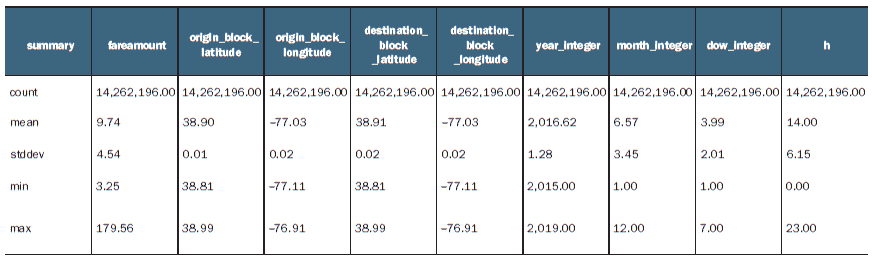
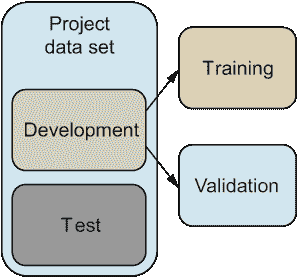
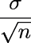
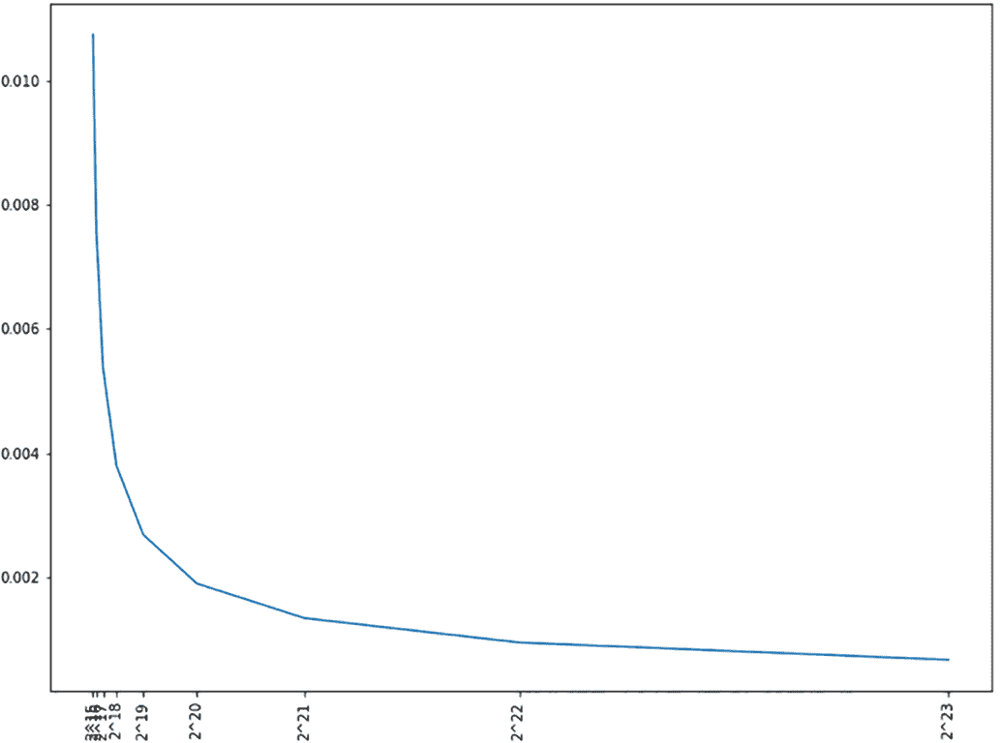
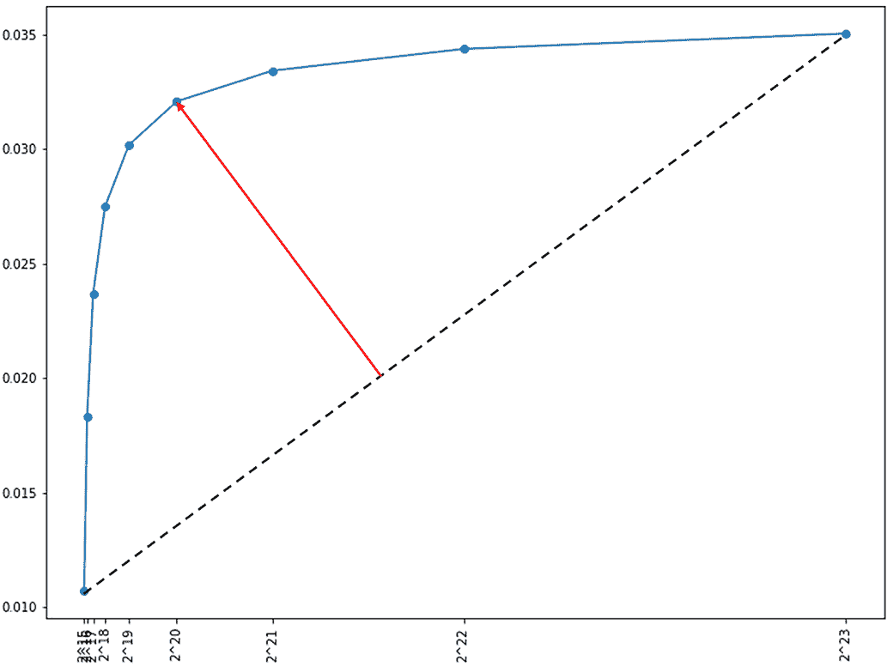

# 第四章：更多的探索性数据分析和数据准备

本章涵盖内容

+   分析华盛顿特区出租车数据集的摘要统计信息

+   评估用于机器学习的替代数据集大小

+   使用统计量选择合适的机器学习数据集大小

+   在 PySpark 作业中实现数据集抽样

在上一章中，您开始分析了华盛顿特区出租车费用数据集。在将数据集转换为适合分析的 Apache Parquet 格式后，您检查了数据架构，并使用 Athena 交互式查询服务来探索数据。数据探索的初步步骤揭示了许多数据质量问题，促使您建立严谨的方法来解决机器学习项目中的垃圾进、垃圾出问题。接下来，您了解了用于数据质量的 VACUUM 原则，并通过几个案例研究说明了这些原则的现实相关性。最后，您对华盛顿特区出租车数据集应用了 VACUUM 进行了“清洁”，准备了一个足够质量的数据集，以便从中进行机器学习的抽样。

本章继续使用经过 VACUUM 处理的数据集进行更深入的数据探索。在本章中，您将分析数据集的摘要统计信息（算术平均值、标准差等等），以便更明智地确定用于机器学习的训练、验证和测试数据集的大小。您将比较常见的数据集大小选择方法（例如，使用 70/15/15% 的划分）和根据数据集统计信息选择合适大小的方法。您将了解如何使用统计量，如均值标准误、Z 分数和 P 值，来帮助评估替代数据集大小，并学习如何使用 PySpark 实现基于数据的实验来选择合适的大小。

## 4.1 数据采样入门

本节向您介绍了一种更严谨、基于数据驱动且可重复使用的方法，用于选择适合您数据集的正确训练、验证和测试数据集分割大小。利用华盛顿特区出租车数据的示例，您将探索选择正确数据集大小所需的关键统计量，然后使用一个可以重复使用于其他数据集的数据集大小选择方法来实现一个 PySpark 作业。

我经常听到初级机器学习从业者提出的一个最常见的问题是关于训练、验证和测试数据集的数据集大小的选择。这应该不足为奇，因为在线课程、博客和机器学习教程经常使用像 70/15/15% 这样的数字，意味着项目数据集的 70% 应该分配给训练，15% 分配给验证，15% 分配给留出测试数据。一些课程主张使用 80/10/10% 的分割或 98/1/1% 的“大数据”数据集。著名的 Netflix Prize 使用了大约 97.3/1.35/1.35% 的分割来处理大约 1 亿条记录的数据集，但体积不到 1 GB，它应该被视为“大数据”吗？

### 4.1.1 探索清理后数据集的汇总统计

在本节中，您将将清理后的数据集元数据加载为 pandas DataFrame 并探索数据集的汇总统计（包括计数、算术平均数、标准差等）。

在第三章结束时，除了清理后的数据集之外，dctaxi_parquet_vacuum.py PySpark 作业使用 save_stats_metadata 函数保存了一些带有数据集统计描述的元数据信息，包括每列值的总行数、均值、标准差、最小值和最大值。要将此信息读入名为 df 的 pandas DataFrame 中，请执行以下代码：

```py
!pip install fsspec s3fs        ❶

import s3fs
import pandas as pd

df = pd.read_csv(f"s3://dc-taxi-{os.environ['BUCKET_ID']}-
➥ {os.environ['AWS_DEFAULT_REGION']}/parquet/
➥ vacuum/.meta/stats/*")      ❷

print(df.info())
```

❶ 安装 pandas 读取 S3 所需的 Python 包。

❷ 将元数据读入 pandas DataFrame。

该代码在您的环境中安装了 s3fs 库，以使用 pandas read_csv API 访问来自 S3 的数据。代码的其余部分列出了 S3 存储桶的 parquet/vacuum/.meta/stats/* 子文件夹中的对象，并从该文件夹中的 CSV 文件读取内容到 pandas DataFrame 中。

数据帧的 info 方法的输出报告存储的数据的模式以及数据消耗的内存量。

清单 4.1 dctaxi_parquet_vacuum.py 元数据的 df.info() 输出

```py
<class 'pandas.core.frame.DataFrame'>
RangeIndex: 5 entries, 0 to 4
Data columns (total 10 columns):
 #   Column                              Non-Null Count  Dtype
---  ------                              --------------  -----
 0   summary                             5 non-null      object
 1   fareamount_double                   5 non-null      float64
 2   origin_block_latitude_double        5 non-null      float64
 3   origin_block_longitude_double       5 non-null      float64
 4   destination_block_latitude_double   5 non-null      float64
 5   destination_block_longitude_double  5 non-null      float64
 6   year_integer                        5 non-null      float64
 7   month_integer                       5 non-null      float64
 8   dow_integer                         5 non-null      float64
 9   hour_integer                        5 non-null      float64
dtypes: float64(9), object(1)
memory usage: 528.0+ bytes
None
```

请注意，清单 4.1 中的模式与第二章中的 SQL 查询使用的模式保持一致，只有一些小的变化：数据帧使用 float64 而不是 DOUBLE，并且使用 object 代替 STRING。此外，DC 出租车数据集中没有 summary 列。summary 列是通过第三章的 dctaxi_parquet_vacuum.py PySpark 作业的 describe 方法创建的，并用于存储每行在元数据表中的统计函数的名称，如平均值和计数。

要开始，您可以使用 summary 列索引数据帧并查看结果

```py
summary_df = df.set_index('summary')
summary_df
```

这将产生



让我们将数据集的大小（即每列的值的数量）保存到一个单独的变量 ds_size 中，稍后将使用它：

```py
ds_size = summary_df.loc['count'].astype(int).max()
print(ds_size)
```

执行后，这将打印 14262196。

用于获取数据集大小的代码依赖于 max 方法，在数据集的所有列中找到最大值。对于经过清理的 DC 出租车数据集，所有列都返回相同的计数，因为它们都不包含 NULL、None 或 NaN 值。尽管对于 DC 出租车数据集来说 max 是不必要的，但继续使用该函数来正确计算存储数据所需的最大行数是一个好的做法。

由于接下来的章节将重点涉及从数据中采样，所以创建两个单独的序列来收集数据集的均值（mu）

```py
mu = summary_df.loc['mean']
print(mu)
```

这将输出

```py
fareamount_double                        9.74
origin_block_latitude_double            38.90
origin_block_longitude_double          -77.03
destination_block_latitude_double       38.91
destination_block_longitude_double     -77.03
year_integer                         2,016.62
month_integer                            6.57
dow_integer                              3.99
hour_integer                            14.00
Name: mean, dtype: float64
```

和标准差（sigma）统计数据

```py
sigma = summary_df.loc['stddev']
print(sigma)
```

打印如下所示：

```py
fareamount_double                     4.539085
origin_block_latitude_double          0.014978
origin_block_longitude_double         0.019229
destination_block_latitude_double     0.017263
destination_block_longitude_double    0.022372
year_integer                          1.280343
month_integer                         3.454275
dow_integer                           2.005323
hour_integer                          6.145545
Name: stddev, dtype: float64
```

### 4.1.2 为测试数据集选择合适的样本大小

在本节中，您将探索使用机器学习“经验法则”选择数据集大小的有效性，并决定 DC 出租车数据集的合适大小。尽管本节以 DC 出租车数据集为例，但您将学习一种在使用实际数据集时选择正确大小的方法。

现在您已经了解了清理数据集中数值列的平均值，您准备好回答将数据集中多少记录分配给机器学习模型训练，以及有多少记录保留给测试和验证数据集的问题了。在准备训练、验证和测试数据集时，许多机器学习从业者依赖于经验法则或启发式方法来确定各个数据集的大小。有些人主张使用 80/10/10%的训练、验证和测试划分，而其他人则声称当数据集很大时，划分应为 98/1/1%，而不指定“大”是什么意思。

在处理分配给训练、验证和测试数据集的记录数量时，回顾它们的基本原理是有价值的。选择训练数据集和测试数据集的合适百分比之间存在困难的原因是它们本质上是相互对立的。一方面，用于机器学习模型训练的数据集的百分比应尽可能大。另一方面，用于测试的数据集的百分比应足够大，以便训练后的机器学习模型在测试数据集上的性能是对该模型在未知样本中的预期表现的有意义的估计。

测试和验证数据集

本书中描述的测试数据集将不会用于检查模型是否过拟合。虽然一些机器学习文献使用测试数据集来确保模型的泛化，但本书将使用一个单独的验证数据集来实现此目的。本书使用的方法如下图所示。



本章中将项目的清理数据集分为开发集和测试集。接下来的章节将涵盖将开发数据集进一步分为训练集和验证数据集。

您可以使用统计学的一些基本结果来帮助您选择大小。思路是确保测试数据集足够大，以便在统计上与整个数据集相似。

首先，考虑用于测试数据的数据集的上限和下限。对于上限，在训练时使用 70％，您可以分配 15％进行验证和测试。在下限方面，您可以考虑将仅 1％用于测试和验证。为更好地说明下限的概念，让我们考虑分配 0.5％的数据进行测试的更极端情况。

您可以使用以下内容获取各种百分比（分数）的记录数：

```py
fractions = [.3, .15, .1, .01, .005]
print([ds_size * fraction for fraction in fractions])
```

它的返回值为

```py
[4278658.8, 2139329.4, 1426219.6, 142621.96, 71310.98]
```

在处理样本大小时，将其转化为 2 的幂次方会很有帮助。这是有帮助的原因有几个。当从样本计算统计学（例如，样本均值的标准误差）时，您会发现需要指数级地改变数据集的大小才能实现统计量的线性变化。此外，在统计公式中，取样本大小的平方根很常见，而从 2 的幂次方开始会简化计算。

要找出数据集分数的二次幂估计值，可以使用以下代码：

```py
from math import log, floor
ranges = [floor(log(ds_size * fraction, 2)) for fraction in fractions]
print(ranges)
```

请注意，该代码以 30％到 0.5％的近似数据集分数的实际记录数的基 2 对数为基础。由于对数值可以是非整数值，因此 floor 函数返回以 2 的幂次方存储近似数据集分数的数据集大小。

因此，代码的输出为

```py
[22, 21, 20, 17, 16]
```

对应于从 2²² = 4,194,304 到 2¹⁶ = 65,536 的范围。

尽管此范围内的数据集可以轻松适应现代笔记本电脑的内存，但让我们尝试进行实验，以确定可以对数据集进行抽样并仍然用于报告机器学习模型准确性能指标的最小数据集。实验的有价值之处不在于发现，而在于说明寻找正确样本大小的过程。该过程有价值，因为即使在更大的数据集中也可以重复。

在这个实验中，让我们继续使用上部范围作为最大样本大小，2²² = 4,194,304，但从范围较小的 2¹⁵ = 32,768 开始：

```py
sample_size_upper, sample_size_lower = max(ranges) + 1, min(ranges) - 1
print(sample_size_upper, sample_size_lower)
```

代码返回的最大和最小值如下：

```py
(23, 15)
```

给定范围，您可以通过运行以下内容来计算其近似数据集分数的程度：

```py
sizes = [2 ** i for i in range(sample_size_lower, sample_size_upper)]
original_sizes = sizes
fracs = [ size / ds_size for size in sizes]
print(*[(idx, sample_size_lower + idx, frac, size) \
  for idx, (frac, size) in enumerate(zip(fracs, sizes))], sep='\n')
```

它的结果为

```py
(0, 15, 0.0022975423980991427, 32768)
(1, 16, 0.004595084796198285, 65536)
(2, 17, 0.00919016959239657, 131072)
(3, 18, 0.01838033918479314, 262144)
(4, 19, 0.03676067836958628, 524288)
(5, 20, 0.07352135673917257, 1048576)
(6, 21, 0.14704271347834513, 2097152)
(7, 22, 0.29408542695669027, 4194304)
```

它显示 2¹⁵的测试数据集大小仅覆盖约 0.23%的数据集，而测试数据大小为 2²²则覆盖约 29.4%。

### 4.1.3 探索替代样本大小的统计信息

本节描述了如何使用均值的标准误差统计量以及收益递减（边际）来生成候选大小（以记录数表示）的测试数据集。在下面的清单中，清单 4.2 中的 sem_over_range 函数计算了一个 pandas DataFrame，该 DataFrame 指定了数据集中每一列和每个样本大小从 sample_size_lower 到 sample_size_upper 的标准误差（SEM）。在本例中，范围对应于从 32,768 到 4,194,304 的值。

对每个候选样本大小的每列进行 SEM（标准误差）。

```py
import numpy as np
def sem_over_range(lower, upper, mu, sigma):    ❶
  sizes_series = pd.Series([2 ** i \            ❷
    for i in range(lower, upper + 1)])
  est_sem_df = \                                ❸
    pd.DataFrame( np.outer( (1 / np.sqrt(sizes_series)), sigma.values ),
                        columns = sigma.index,
                        index = sizes_series.values)
  return est_sem_df

sem_df = sem_over_range(sample_size_lower, sample_size_upper, mu, sigma)
sem_df
```

❶ sem_over_range 函数使用样本范围以及数据集的 mu 和 sigma。

❷ 将样本范围转换为 pandas Series。

❸ 通过计算每个样本大小和列σ的平均值标准误差来创建一个 pandas DataFrame。

清单 4.2 中的 sem_over_range 函数计算了一个 pandas DataFrame，该 DataFrame 指定了数据集中每一列和每个样本大小从 sample_size_lower 到 sample_size_upper 的标准误差（SEM）。在本例中，范围对应于从 32,768 到 4,194,304 的值。

请记住，对于数据集中的任何一列，给定其总体标准差（σ）和列中的记录数（观测值）（*n*），SEM 定义为。

由于清单 4.2 中的 sem_df DataFrame 返回的原始 SEM 值不易解释，因此绘制图形以说明随着样本大小增长 SEM 的总体变化趋势是有价值的。您可以使用 matplotlib 库显示此趋势，绘制 sem_df 数据框中各列的平均 SEM 值，如下所示

```py
import matplotlib.pyplot as plt
%matplotlib inline

plt.figure(figsize = (12, 9))
plt.plot(sem_df.index, sem_df.mean(axis = 1))
plt.xticks(sem_df.index,
           labels = list(map(lambda i: f"2^{i}",
                              np.log2(sem_df.index.values).astype(int))),
           rotation = 90);
```

这导致图 4.1。



图 4.1 样本大小呈指数增长是昂贵的：更大的样本需要指数级的内存、磁盘空间和计算量，同时在标准误差减小方面产生的改进较少。

图 4.1 中的绘图使用二的幂次方作为水平轴上的注释，描述数据框中的样本大小。请注意，该图捕获了样本大小增加时的收益递减趋势。尽管样本大小呈指数增长，但平均 SEM 的斜率（给定样本大小的 SEM 的瞬时变化率）随着每倍增长而趋于平缓。

由于将尽可能多的数据分配给训练数据集是有价值的，您可以利用收益递减启发式方法发现测试数据集的下限大小。思路是找到一个样本大小，以便如果它更大，那么 SEM 的改善将产生收益递减。

要确定样本大小加倍的边际收益点（也称为 *边际* ），您可以从每次样本大小增加时 SEM 的总减少开始。这是使用以下代码片段中的 sem_df.cumsum() 计算的。然后，为了获得每个样本大小的单个聚合度量，mean(axis = 1) 计算数据集中列之间 SEM 总减少的平均值：

```py
agg_change = sem_df.cumsum().mean(axis = 1)
agg_change
```

生成

```py
32768     0.01
65536     0.02
131072    0.02
262144    0.03
524288    0.03
1048576   0.03
2097152   0.03
4194304   0.03
8388608   0.04
dtype: float64
```

agg_change pandas 系列的值在图 4.2 中被绘制出来。请注意，箭头突出显示的样本大小对应于 220 的样本大小，也是由于增加样本大小而导致 SEM 减少开始产生边际收益的点。



图 4.2 边际样本大小对应于边际收益点之前的最大样本大小。

此时，边际可以使用以下边际函数在 Python 中计算：

```py
import numpy as np

def marginal(x):
  coor = np.vstack([x.index.values,
            x.values]).transpose()          ❶

  return pd.Series(index = x.index,         ❷
    data = np.cross(coor[-1] - coor[0], coor[-1] - coor) \
             / np.linalg.norm(coor[-1] - coor[0])).idxmin()

SAMPLE_SIZE = marginal(agg_change).astype(int)
SAMPLE_SIZE, SAMPLE_SIZE / ds_size
```

❶ 创建一个 NumPy 数组，其中数据点在 x 轴上的样本大小，SEM 值在 y 轴上。

❷ 计算数据点到连接最大和最小样本大小数据点的虚拟线的距离。

在这里，通过查看样本大小的数据点与 SEM 累积减少之间的关系，绘制连接最小和最大样本大小的虚线（图 4.2 中的虚线）并识别与虚拟线右角最远距离的数据点来计算边际。

当应用于 DC 出租车数据集时，边际函数计算如下内容：

```py
(1048576, 0.07352135673917257)
```

在这里，通过边际收益启发法选择的边际测试样本大小对应于 1,048,576 条记录，或者大约是数据集的 7%。

如果可能的话，使用任意 1,048,576 条记录的样本作为测试数据集将有助于最大化可用于机器学习模型训练的数据量。然而，SEM 测量旨在确定样本大小的 *下限* ，并不表示这种大小的任意数据集都适合用作测试数据集。

您可以使用 1,048,576 条记录的 p 值来建立对样本的置信度，从而回答统计假设检验的基本问题：样本来自总体的确信度是多少？

### 4.1.4 使用 PySpark 作业对测试集进行抽样

在本节中，您将通过使用 PySpark 作业随机采样 1,048,576 条记录（在上一节中确定的大小）来创建测试数据集进行实验。一旦采样了测试集，剩余的记录将持久保存到一个单独的 DC 出租车开发数据集中。开发和测试数据集还被分析以计算 p 值以及其他摘要统计信息。

由于整个 PySpark 作业的实现大约有 90 行代码，在本节中，作业被介绍为一系列代码片段。作业的前文部分，在列表 4.3 中显示的，类似于第 2 和第三章中的 PySpark 作业。与早期章节一样，作业的这一部分导入相关库并解析作业参数。

在 dctaxi_dev_test.py 中的第 4.3 节代码中读取的 PySpark DataFrame。

```py
import sys
from awsglue.transforms import *
from awsglue.utils import getResolvedOptions
from pyspark.context import SparkContext
from awsglue.context import GlueContext
from awsglue.job import Job

args = getResolvedOptions(sys.argv, ['JOB_NAME',
                                     'BUCKET_SRC_PATH',
                                     'BUCKET_DST_PATH',
                                     'SAMPLE_SIZE',
                                     'SAMPLE_COUNT',
                                     'SEED'
                                     ])

sc = SparkContext()
glueContext = GlueContext(sc)
logger = glueContext.get_logger()
spark = glueContext.spark_session

job = Job(glueContext)
job.init(args['JOB_NAME'], args)

BUCKET_SRC_PATH = args['BUCKET_SRC_PATH']
df = ( spark.read.format("parquet")
        .load( f"{BUCKET_SRC_PATH}" ))      ❶
```

❶ 根据 BUCKET_SRC_PATH 参数构建一个 pandas DataFrame df。

与从清理后的 DC 出租车数据集中抽样有关的实现始于列表 4.4，其中计算整个数据集大小的样本分数，并将其保存到变量 sample_frac 中。为了在 PySpark 中计算清理后数据集的摘要统计信息，实现依赖于 Kaen 库的 PySpark 实用函数 spark_df_to_stats_pandas_df，该函数从名为 df 的 PySpark DataFrame 实例返回 pandas DataFrame。然后，pandas summary_df 提供了对清理后数据集中每列的平均值（mu）和标准差（sigma）的标准 pandas DataFrame API 访问。

在 dctaxi_dev_test.py 中的第 4.4 节代码中读取的 PySpark DataFrame。

```py
SAMPLE_SIZE = float( args['SAMPLE_SIZE'] )   
dataset_size = float( df.count() )
sample_frac = SAMPLE_SIZE / dataset_size            ❶

from kaen.spark import spark_df_to_stats_pandas_df, \
                      pandas_df_to_spark_df, \
                      spark_df_to_shards_df         ❷

summary_df = spark_df_to_stats_pandas_df(df)        ❸
mu = summary_df.loc['mean']                         ❹
sigma = summary_df.loc['stddev']                    ❺
```

❶ 根据 Spark 的 randomSplit 方法所需的样本大小，以分数的形式表示。

❷ 从 kaen 包中导入 Spark 和 pandas 实用工具。

❸ 创建包含 Spark DataFrame 统计信息的 pandas DataFrame。

❹ 将数据集的平均值保存为 mu。

❺ 将数据集的标准差保存为 sigma。

汇总统计信息以及 sample_frac 值在列表 4.5 中用于执行随机抽样。PySpark 的 randomSplit 方法将经过清理的 DC 出租车数据集分割为 test_df，其中包含最多 SAMPLE_SIZE 行，并且总计来自 df 数据帧的 sample_frac 的整个数据集。

在 dctaxi_dev_test.py 中的第 4.5 节代码中读取的 PySpark DataFrame。

```py
SEED = int(args['SEED'])                                ❶
SAMPLE_COUNT = int(args['SAMPLE_COUNT'])                ❷
BUCKET_DST_PATH = args['BUCKET_DST_PATH']

for idx in range(SAMPLE_COUNT):
  dev_df, test_df = ( df                                ❸
                      .cache()
                      .randomSplit([1.0 - sample_frac,
                                      sample_frac],     ❹
                                    seed = SEED) )

  test_df = test_df.limit( int(SAMPLE_SIZE) )           ❺

  test_stats_df = \                                     ❻
    spark_df_to_stats_pandas_df(test_df, summary_df,
                                  pvalues = True, zscores = True)

  pvalues_series = test_stats_df.loc['pvalues']
  if pvalues_series.min() < 0.05:
    SEED = SEED + idx                                   ❼
  else:
    break
```

❶ 使用 SEED 初始化伪随机数生成器。

❷ 通过使用最多 SAMPLE_COUNT 个样本，解决了选择不佳（p 值 < 0.05）的 SEED 值的问题。

❸ 将测试数据集抽样到 Spark 的 test_df DataFrame 中，其余抽样到 dev_df。

❹ 使用 df 中记录的 sample_frac 分数作为测试数据集。

❺ 确保 test_df 最多仅包含 SAMPLE_SIZE 条记录。

❻ 创建一个包含 test_df 摘要统计信息的 pandas test_stats_df DataFrame。

❼ 在出现不良样本（p 值 < 0.05）的情况下再次抽样，最多抽样 SAMPLE_COUNT 次。

列表 4.6 中显示的作业实现部分负责将开发（dev_df）和测试（test_df）数据集保存到 S3。对于每个数据集，Spark 将记录保存为 CSV 格式，带有标头信息，保存到 BUCKET_DST_PATH 中。此外，对于开发和测试，该实现还将其他元数据（稍后在本节中显示）保存到 BUCKET_DST_PATH 的子文件夹中：.meta/stats 和 .meta/shards。

stats 子文件夹存储一个包含摘要统计信息的 CSV 文件，包括计数、均值、p 值等。 shards 子文件夹被存储以便在训练期间处理数据集，并存储关于用于将数据集保存在 S3 中的 CSV 部分文件数和每个部分文件中的记录数的元数据。

列表 4.6 dctaxi_dev_test.py 中的 PySpark DataFrame 读取代码

```py
for df, desc in [(dev_df, "dev"), (test_df, "test")]:
    ( df
    .write
    .option('header', 'true')
    .mode('overwrite')
    .csv(f"{BUCKET_DST_PATH}/{desc}") )

    stats_pandas_df = \
    spark_df_to_stats_pandas_df(df,
                                summary_df,
                                pvalues = True,
                                zscores = True)
    ( pandas_df_to_spark_df(spark,  stats_pandas_df)
    .coalesce(1)
    .write
    .option('header', 'true')
    .mode('overwrite')
    .csv(f"{BUCKET_DST_PATH}/{desc}/.meta/stats") )

    ( spark_df_to_shards_df(spark, df)
    .coalesce(1)
    .write
    .option('header', True)
    .mode('overwrite')
    .csv(f"{BUCKET_DST_PATH}/{desc}/.meta/shards") )

job.commit()
```

为了方便起见，下面展示了 PySpark 作业的完整实现，它应该被保存在一个名为 dctaxi_dev_test.py 的文件中。

列表 4.7 PySpark dctaxi_dev_test.py 作业以抽样开发和测试数据集

```py
import sys
from awsglue.transforms import *
from awsglue.utils import getResolvedOptions
from pyspark.context import SparkContext
from awsglue.context import GlueContext
from awsglue.job import Job

args = getResolvedOptions(sys.argv, ['JOB_NAME',
                                     'BUCKET_SRC_PATH',
                                     'BUCKET_DST_PATH',
                                     'SAMPLE_SIZE',
                                     'SAMPLE_COUNT',
                                     'SEED'
                                     ])

sc = SparkContext()
glueContext = GlueContext(sc)
logger = glueContext.get_logger()
spark = glueContext.spark_session

job = Job(glueContext)
job.init(args['JOB_NAME'], args)

BUCKET_SRC_PATH = args['BUCKET_SRC_PATH']
df = ( spark.read.format("parquet")
        .load( f"{BUCKET_SRC_PATH}" ))

SAMPLE_SIZE = float( args['SAMPLE_SIZE'] )
dataset_size = float( df.count() )
sample_frac = SAMPLE_SIZE / dataset_size

from kaen.spark import spark_df_to_stats_pandas_df, \
                      pandas_df_to_spark_df, \
                      spark_df_to_shards_df

summary_df = spark_df_to_stats_pandas_df(df)
mu = summary_df.loc['mean']
sigma = summary_df.loc['stddev']

SEED = int(args['SEED'])
SAMPLE_COUNT = int(args['SAMPLE_COUNT'])
BUCKET_DST_PATH = args['BUCKET_DST_PATH']

for idx in range(SAMPLE_COUNT):
  dev_df, test_df = ( df
                      .cache()
                      .randomSplit( [1.0 - sample_frac, sample_frac],
                                    seed = SEED) )
  test_df = test_df.limit( int(SAMPLE_SIZE) )

  test_stats_df = \
    spark_df_to_stats_pandas_df(test_df, summary_df,
                                  pvalues = True, zscores = True)

  pvalues_series = test_stats_df.loc['pvalues']
  if pvalues_series.min() < 0.05:
    SEED = SEED + idx
  else:
    break

for df, desc in [(dev_df, "dev"), (test_df, "test")]:
    ( df
    .write
    .option('header', 'true')
    .mode('overwrite')
    .csv(f"{BUCKET_DST_PATH}/{desc}") )

    stats_pandas_df = \
    spark_df_to_stats_pandas_df(df,
                                summary_df,
                                pvalues = True,
                                zscores = True)

    ( pandas_df_to_spark_df(spark,  stats_pandas_df)
    .coalesce(1)
    .write
    .option('header', 'true')
    .mode('overwrite')
    .csv(f"{BUCKET_DST_PATH}/{desc}/.meta/stats") )

    ( spark_df_to_shards_df(spark, df)
    .coalesce(1)
    .write
    .option('header', True)
    .mode('overwrite')
    .csv(f"{BUCKET_DST_PATH}/{desc}/.meta/shards") )

job.commit()
```

在 dctaxi_dev_test.py 文件中执行 PySpark 作业之前，你需要配置几个环境变量。应使用相应 Python 变量的值设置 SAMPLE_SIZE 和 SAMPLE_COUNT 操作系统环境变量：

```py
os.environ['SAMPLE_SIZE'] = str(SAMPLE_SIZE)
os.environ['SAMPLE_COUNT'] = str(1)
```

与上一章节类似，PySpark 作业使用 utils.sh 脚本中的便捷函数执行。首先，在你的 bash shell 中使用以下命令下载该脚本到你的本地环境：

```py
wget -q --no-cache https://raw.githubusercontent.com/
➥ osipov/smlbook/master/utils.sh
```

一旦 utils.sh 脚本被下载，你可以使用它来启动和监视 dctaxi_dev_test.py 文件中实现的 PySpark 作业。在你的 shell 环境中运行以下命令来启动该作业：

```py
source utils.sh

PYSPARK_SRC_NAME=dctaxi_dev_test.py \
PYSPARK_JOB_NAME=dc-taxi-dev-test-job \
ADDITIONAL_PYTHON_MODULES="kaen[spark]" \
BUCKET_SRC_PATH=s3://dc-taxi-$BUCKET_ID-$AWS_DEFAULT_REGION/parquet/vacuum \
BUCKET_DST_PATH=s3://dc-taxi-$BUCKET_ID-$AWS_DEFAULT_REGION/csv \
SAMPLE_SIZE=$SAMPLE_SIZE \
SAMPLE_COUNT=$SAMPLE_COUNT \
SEED=30 \
run_job
```

注意，该作业将要读取第三章保存在 parquet/vacuum 子文件夹中的 Parquet 文件，并将开发和测试数据集保存在你的 S3 存储桶的 csv/dev 和 csv/test 子文件夹下。该作业在 AWS Glue 上应该需要大约八分钟才能完成。假设它成功完成，它应该会产生以下类似的输出：

```py
Attempting to run a job using:
  PYSPARK_SRC_NAME=dctaxi_dev_test.py
  PYSPARK_JOB_NAME=dc-taxi-dev-test-job
  AWS_DEFAULT_REGION=us-west-2
  BUCKET_ID=c6e91f06095c3d7c61bcc0af33d68382
  BUCKET_SRC_PATH=s3://dc-taxi-c6e91f06095c3d7c61bcc0af33d68382-
➥   us-west-2/parquet/vacuum
  BUCKET_DST_PATH=s3://dc-taxi-c6e91f06095c3d7c61bcc0af33d68382-
➥   us-west-2/csv
  SAMPLE_SIZE=1048576
  SAMPLE_COUNT=1
  BINS=
  SEED=30
upload: ./dctaxi_dev_test.py to s3://dc-taxi-
➥   c6e91f06095c3d7c61bcc0af33d68382-us-west-2/glue/dctaxi_dev_test.py
2021-08-15 17:19:37       2456 dctaxi_dev_test.py
{
    "JobName": "dc-taxi-dev-test-job"
}
{
    "Name": "dc-taxi-dev-test-job"
}
{
    "JobRunId": [CA
    "jr_05e395544e86b1534c824fa1559ac395683f3e7db35d1bb5d591590d237954f2"
}
Waiting for the job to finish......................................SUCCEEDED
```

由于 PySpark 作业保留了关于数据集的元数据，你可以使用 pandas 预览元数据的内容。为了预览测试集的统计摘要，请执行以下 Python 代码：

```py
pd.options.display.float_format = '{:,.2f}'.format

test_stats_df = pd.read_csv(f"s3://dc-taxi-{os.environ['BUCKET_ID']}-
➥ {os.environ['AWS_DEFAULT_REGION']}/csv/test/.meta/stats/*.csv")

test_stats_df = test_stats_df.set_index('summary')
test_stats_df
```

假设 PySpark 作业执行正确，对于测试数据集的 test_stats_df 的打印输出应该类似于以下内容：


关于开发数据集的 CSV 部分文件（shards）的元数据应该已保存到你的 S3 存储桶的 csv/dev/.meta/shards 子文件夹中。如果你使用以下代码预览此元数据中的 pandas DataFrame

```py
import pandas as pd
dev_shards_df = pd.read_csv(f"s3://dc-taxi-{os.environ['BUCKET_ID']}-
➥ {os.environ['AWS_DEFAULT_REGION']}/csv/dev/.meta/shards/*")

dev_shards_df.sort_values(by = 'id')
```

输出应该包含一个三列表，其中 id 列存储来自 S3 中 csv/dev 子文件夹的 CSV 部分文件的 ID，而 count 列中的相应条目指定了部分文件中的行数。数据框的内容应该类似于以下内容：

|  | id | count |
| --- | --- | --- |
| 39 | 0 | 165669 |
| 3 | 1 | 165436 |
| 56 | 2 | 165754 |
| 53 | 3 | 165530 |
| 63 | 4 | 165365 |

...

| 72 | 75 | 164569 |
| --- | --- | --- |
| 59 | 76 | 164729 |
| 2 | 77 | 164315 |
| 11 | 78 | 164397 |
| 22 | 79 | 164406 |

## 摘要

+   使用固定百分比的启发式方法来选择保留的测试数据集的大小可能会浪费宝贵的机器学习模型训练数据。

+   测量数据集大小增加导致递减的结果，有助于选择测试和验证数据集大小的下限。

+   确保测试数据集具有足够的 z 分数和 p 值，可以防止选择机器学习时数据集大小过小。

+   无服务器 PySpark 作业可用于评估替代测试数据集，并报告它们的统计摘要。
