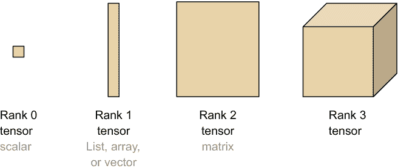
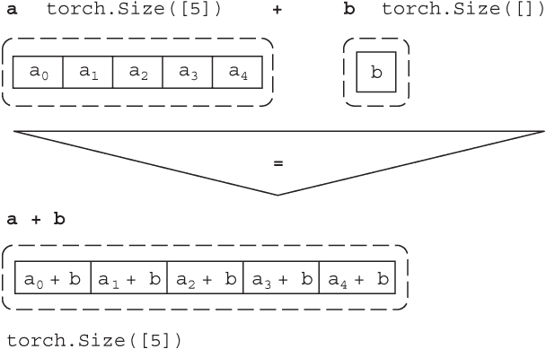
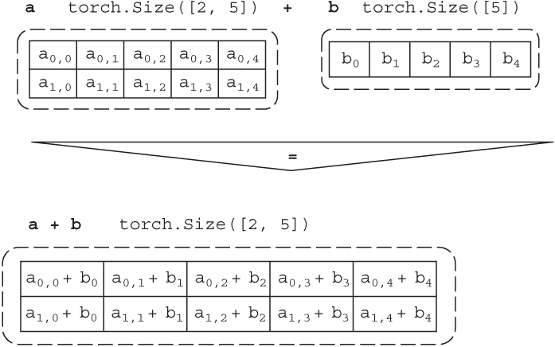
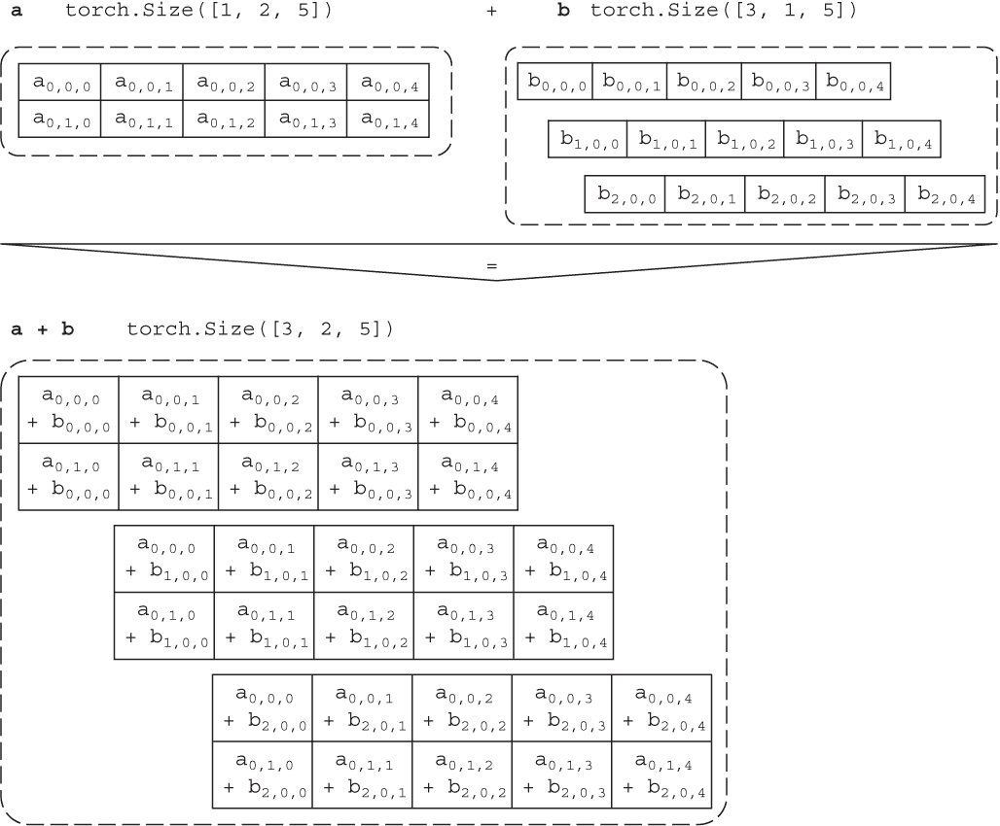
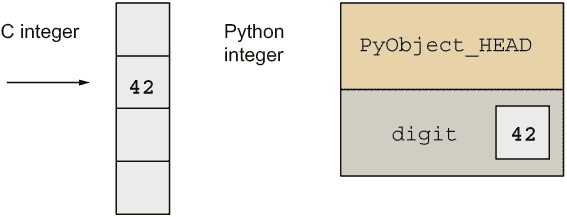
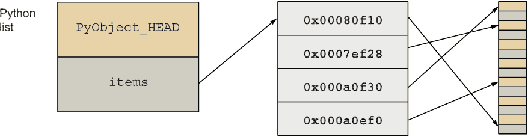
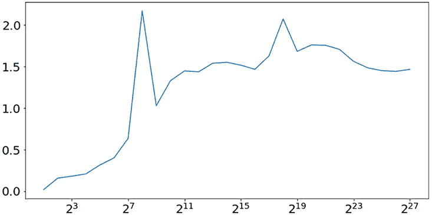

# 第五章：PyTorch 介绍：张量基础

本章涵盖

+   介绍 PyTorch 和 PyTorch 张量

+   使用 PyTorch 张量创建方法

+   理解张量操作和广播

+   探索在 CPU 上的 PyTorch 张量性能

在上一章中，你从 DC 出租车数据集的清理版本开始，并应用了数据驱动的抽样过程，以确定要分配给一个保留的测试数据子集的数据集的正确部分。你还分析了抽样实验的结果，然后启动了一个 PySpark 作业来生成三个不同的数据子集：训练、验证和测试。

这一章将暂时偏离 DC 出租车数据集，为你准备好使用 PyTorch 编写可扩展的机器学习代码。别担心；第七章会回到 DC 出租车数据集，以基准测试基线 PyTorch 机器学习模型。在本章中，你将专注于学习 PyTorch，这是深度学习和许多其他类型的机器学习算法的顶级框架之一。我曾在需要在机器学习平台上进行分布式训练的机器学习项目中使用过 TensorFlow 2.0、Keras 和 PyTorch，并发现 PyTorch 是最好的选择。PyTorch 可从特斯拉的关键生产机器学习用例¹扩展到 OpenAI 的最新研究²。

由于你需要在开始将它们应用于 DC 出租车数据集的机器学习之前对核心 PyTorch 概念有实际的理解，所以本章重点是为你提供对核心 PyTorch 数据结构：张量的深入知识。大多数软件工程师和机器学习实践者在数学、编程或数据结构课程中都没有使用张量，所以如果这是新的，你不应感到惊讶。

在第 5.1 节中，我介绍了 PyTorch 张量的全面定义。暂时记住，如果你曾经在编程语言中使用数组的数组（即，包含其他数组的数组）实现过矩阵，那么你已经在理解张量的路上走得很远了。作为一个工作定义，你可以将*张量*视为一种通用数据结构，可以存储和操作变量、数组、矩阵及其组合。在本书中，你遇到的最复杂的张量实际上是矩阵的数组，或者如果你更喜欢更递归的描述，是数组的数组的数组。

## 5.1 开始使用张量

本节在机器学习用例的背景下定义了张量，解释了张量的属性，包括张量的维度和形状，并最终向你介绍了使用 PyTorch 创建张量的基础知识，而不是使用本地 Python 数据类型。通过本节的结论，你应该准备好研究 PyTorch 张量相对于本地 Python 数据类型在机器学习用例中的优势了。

*张量*一词在数学、物理或计算机科学中使用时有微妙不同的定义。虽然从数学中了解张量的几何解释或从物理学中了解张量的应力力学解释可以丰富您对张量抽象方面的理解，但本书使用一个更狭窄的定义，更符合将张量应用于机器学习的从业者。本书中，该术语描述了一种数据结构（即数据容器），用于基本数据类型，如整数、浮点数和布尔值。

由于张量与数组密切相关，因此值得花一点时间回顾数组或 Python 列表的关键属性。*数组*只是数据值的有序集合。在大多数编程语言中，数组索引可以取值于一组有限的整数，基于数组中元素数量减一的范围。³例如，在 Python 中，这个范围是

```py
range(len(a_list))
```

其中 a_list 是 Python 列表实例的名称。因此，不同的数组具有不同的有效索引值。相反，所有由基本数据类型组成的数组，无论长度如何，其张量维度都等于一。

*维度*在这里定义为访问数据结构中值所需的索引总数（而不是索引的值）。这个定义很方便，因为它帮助使用一个数字描述不同的数据结构。例如，矩阵的维度为二，因为需要两个索引，行索引和列索引，才能在矩阵中定位数据值。例如，使用 Python，一个简单的矩阵实现可以使用列表的列表：

```py
mtx = [[3 * j + i for i in range(3)] for j in range(3)]
print(mtx[1][2])
```

其中 mtx 的求值结果为

```py
[[0, 1, 2],
 [3, 4, 5],
 [6, 7, 8]]
```

和 mtx[1][2]的值打印为 5。由于矩阵的维度为二，因此必须指定两个索引值——行索引为 1，列索引为 2——才能访问矩阵中 5 的值。

维度还指定了实现数据结构所需的数组嵌套的度量。例如，维度为 2 的 mtx 需要一个数组的数组，而维度为 3 的矩阵数组需要一个数组的数组的数组。如果考虑一个维度为 0 的数据结构，换句话说，需要零个索引来访问值的数据结构，很快就会意识到这个数据结构只是一个常规变量。对于维度（也称为*张量秩*）为 0、1、2 和 3 的张量的可视化，请参阅图 5.1。



图 5.1 张量秩（维度）等于访问张量中数据值所需的索引数量。与较低秩的张量不同，机器学习中没有公认的命名。

张量是一种能够存储任意数量维度数组的数据结构，或者更简洁地说，张量是一个 n 维数组。根据此定义，一个平面 Python 列表或任何扁平化的数组都是一维张量，有时也被描述为秩 1 张量。Python 变量是零维张量，通常被描述为标量，或者更少见地被描述为秩 0 张量。一个二维张量通常被称为矩阵。对于更高维的例子，请考虑用于表示灰度图像的矩阵，其中像素值为 0 为黑色，255 为白色，中间的数字为逐渐增加亮度的灰色颜色。然后，三维张量是一种有序灰度图像集合的便捷数据结构，因此三个指数中的第一个指定图像，其余两个指定图像中像素的行和列位置。三维张量也适用于彩色图像（但不适用于彩色图像集合），因此第一个指数指定颜色为红色、绿色、蓝色或不透明度（alpha）通道，而其余指数指定相应图像中的像素位置。继续这个例子，四维张量可以用于顺序的彩色图像集合。

有了这些基础知识，您就可以准备在 PyTorch 中创建您的第一个张量了。

列表 5.1 使用 PyTorch 实现的秩 0 张量

```py
import torch as pt        ❶
alpha = pt.tensor(42)     ❷
alpha
```

❶ 导入 PyTorch 库并将其别名为 pt。

❷ 创建一个值为 42 的秩 0 张量（标量）。

一旦执行了这段代码，它会输出

```py
tensor(42)
```

在导入 PyTorch 库并将其别名为 pt ❶ 之后，代码的下一行 ❷ 简单地创建一个标量（秩 0 张量）并将其赋值给一个名为 alpha 的变量。在 64 位 Python 运行时执行时，从列表 5.1 中的值 42 被表示为 64 位整数，alpha 张量将使用 PyTorch 的 torch.LongTensor 类进行实例化。

对于任何 PyTorch 张量，您可以使用 type 方法来发现用于实例化张量的特定张量类：

```py
alpha.type()
```

这会输出

```py
torch.LongTensor
```

torch.LongTensor，以及其他用于各种基本 Python 数据类型的张量类，都是 torch.Tensor 类的子类。⁴ torch.Tensor 的子类包括对不同处理器架构（设备）的支持；例如，torch.LongTensor 是具有 CPU 特定张量实现的类，而 torch.cuda.LongTensor 是具有 GPU 特定张量实现的类。有关 PyTorch 对 GPU 的支持，将在第七章中详细描述。

在您的机器学习代码中，您应主要依赖于张量的 dtype 属性，而不是 type 方法，因为 dtype 以与设备无关的方式返回张量的类型，确保您的代码可以轻松地在不同设备之间移植。对于 alpha 的 dtype，

```py
alpha.dtype
```

输出数据类型的与设备无关的描述⁵

```py
torch.int64
```

要访问张量存储的值，您可以使用 item 方法

```py
alpha.item()
```

在这种情况下显示 42。

要确认 alpha 张量是一个标量，您可以访问张量的 shape 属性，

```py
alpha.shape
```

打印出 torch.Size([])。

PyTorch 库使用 torch.Size 类来指定张量的大小（也称为形状）的详细信息。在这里，大小由一个空的、长度为零的列表组成，因为 alpha 标量的秩为 0。一般来说，torch.Size 列表的长度等于张量的维度。例如，

```py
len(alpha.shape)
```

输出 0。张量的形状指定了沿张量维度存储的元素数量。例如，从 Python 列表创建的一个一维 PyTorch 张量的前五个斐波那契数，

```py
arr = pt.tensor([1, 1, 2, 3, 5])
arr.shape
```

产生了 torch.Size([5])，这证实了 arr 张量的第一个和唯一维度中有五个元素。

如果您从 Python 列表的列表中创建一个 PyTorch 矩阵（秩为 2 的张量），

```py
mtx = pt.tensor([ [  2,   4,  16,  32,  64],
                  [  3,   9,  27,  81, 243]] )
```

然后 mtx.shape 返回 torch.Size([2, 5]) 的大小，因为 mtx 矩阵有两行和五列。

标准的 Python 索引和 item 方法继续按预期工作：要检索 mtx 张量左上角的值，您使用 mtx[0][0].item()，它返回 2。

在 PyTorch 中处理秩为 2 或更高的张量时，您需要了解一个重要的默认限制：尾部维度中的元素数量；换句话说，第二个及更高的维度必须保持一致，例如，如果您尝试创建一个第二个（列）维度有四个元素的矩阵，而其他列有五个元素。

用支持变量的 PyTorch 张量的 5.2 列表

```py
pt.tensor([  [  2,   4,  16,  32,  64],
             [  3,   9,  27,  81, 243],
             [  4,  16,  64, 256]        ])
```

PyTorch 报告了一个错误：

```py
ValueError: expected sequence of length 5 at dim 1 (got 4)
```

由于 PyTorch 使用零为基础的索引来表示维度，因此第二个维度的索引为 1，如 ValueError 所报告的那样。尽管默认的 PyTorch 张量实现不支持“不规则”张量，但 NestedTensor 包旨在为这类张量提供支持。⁶

## 5.2 开始使用 PyTorch 张量创建操作

之前，您已经看到您可以从一个值（例如，一个 Python 整数）创建一个 PyTorch 标量张量，并从一组值（例如，从一个 Python 列表）创建一个数组张量；但是，还有其他工厂方法可以帮助您创建张量。在本节中，您将练习使用 PyTorch API 中的工厂方法创建 PyTorch 张量。当创建用于机器学习代码中常见的数学操作的张量时，以及当张量基于非数据集值时，这些方法非常有用。

当使用工厂方法实例化张量时，除非 PyTorch 可以从方法的参数中推断出所需张量的形状（如本节稍后解释的那样），否则将显式指定所需张量的形状。例如，要使用 zeros 工厂方法创建一个两行三列的零矩阵，请使用

```py
pt.zeros( [2, 3] )
```

产生

```py
tensor([[0., 0., 0.],
        [0., 0., 0.]])
```

给定张量的一个实例，您可以通过使用张量的 shape 属性来确认张量具有所需的形状，

```py
pt.zeros( [2, 3] ).shape
```

返回一个 torch.Size 实例，表示形状，本例中与您传递给 zeros 方法的内容匹配：

```py
torch.Size([2, 3])
```

PyTorch 张量工厂方法允许您通过将一个或多个整数传递给方法来指定张量形状。例如，要创建一个包含 10 个 1 的数组，您可以使用 ones 方法，

```py
pt.ones(10)
```

返回长度为 10 的数组，

```py
tensor([1., 1., 1., 1., 1., 1., 1., 1., 1., 1.])
```

而 pt.ones(2, 10)返回一个 2 行 10 列的矩阵：

```py
tensor([[1., 1., 1., 1., 1., 1., 1., 1., 1., 1.],
        [1., 1., 1., 1., 1., 1., 1., 1., 1., 1.]])
```

当使用工厂方法时，您可以为张量中的值指定数据类型。虽然 ones 等方法默认返回浮点数张量，但您可以使用 dtype 属性覆盖默认数据类型。例如，要创建一个整数 1 的数组，您可以调用

```py
pt.ones(10, dtype=pt.int64)
```

返回

```py
tensor([1, 1, 1, 1, 1, 1, 1, 1, 1, 1])
```

其他 PyTorch 支持的数据类型包括 16 位和 32 位整数、16 位、32 位和 64 位浮点数、字节（无符号 8 位整数）和布尔值。⁷

## 5.3 创建 PyTorch 伪随机和间隔值张量

本节向您介绍了用于创建填充有从常用概率分布中抽样的数据值的张量的 PyTorch API，包括标准正态、正态（高斯）和均匀分布。本节还描述了如何创建由间隔（等间距）值组成的张量。学习本节中描述的 API 将帮助您生成用于测试和故障排除机器学习算法的合成数据集。

深度学习和许多机器学习算法依赖于生成伪随机数的能力。在使用 PyTorch 随机抽样工厂方法之前，您需要调用 manual_seed 方法来设置用于抽样伪随机数的种子值。如果您使用与本书中使用的相同的种子值调用 manual_seed，您将能够重现本节中描述的结果。否则，您的结果看起来会不同。以下代码片段假定您使用的种子值为 42：

```py
pt.manual_seed(42)
```

设置种子后，如果您使用的是 PyTorch v1.9.0，您应该期望获得与以下示例中相同的伪随机数。randn 方法从标准正态分布中抽样，因此您可以期望这些值的均值为 0，标准差为 1。要创建一个 3×3 的张量以抽样值，调用

```py
pt.randn(3,3)
```

输出

```py
tensor([[ 0.3367,  0.1288,  0.2345],
        [ 0.2303, -1.1229, -0.1863],
        [ 2.2082, -0.6380,  0.4617]])
```

要从均值和标准差不同于 1 和 0 的正态分布中抽样值，您可以使用 normal 方法，例如，指定均值为 100，标准差为 10，以及 3 行 3 列的秩 2 张量：

```py
pt.normal(100, 10, [3, 3])
```

导致

```py
tensor([[102.6735, 105.3490, 108.0936],
        [111.1029,  83.1020,  90.1104],
        [109.5797, 113.2214, 108.1719]])
```

对于从均匀分布中抽样的伪随机值的张量，您可以使用 randint 方法，例如，从 0（包括）到 10（不包括）均匀抽样，并返回一个 3×3 矩阵：

```py
pt.randint(0, 10, [3, 3])
```

产生

```py
tensor([[9, 6, 2],
        [0, 6, 2],
        [7, 9, 7]])
```

randint 和 normal 方法是本书中最常用的方法。PyTorch 提供了一个全面的伪随机张量生成器库，⁸但本书不涵盖所有内容。

如 5.5 节更详细地解释的那样，在创建 Python 整数值列表时会涉及显著的内存开销。相反，您可以使用 arange 方法在指定范围内创建具有间隔（等间距）值的 PyTorch 张量。PyTorch arange 的行为类似于 Python 中的 range 运算符，因此

```py
pt.arange(10)
```

返回

```py
tensor([0, 1, 2, 3, 4, 5, 6, 7, 8, 9])
```

正如您在使用 Python 时所期望的那样，在 PyTorch 中调用 arange 可以带有附加参数用于范围的起始、结束和步长（有时称为步进），因此要创建一个从 1 到 11 的奇数张量，可以使用

```py
pt.arange(1, 13, 2)
```

输出

```py
tensor([ 1,  3,  5,  7,  9, 11])
```

就像 Python range 一样，生成的序列不包括结束序列参数值（第二个参数），而步长被指定为该方法的第三个参数。

而不是必须计算 arange 方法的步长值，使用 linspace 方法并指定结果张量中应存在的元素数量可能更加方便。例如，要创建一个包含值在从 0 开始到 10 结束并包括值 10 的 5 个元素的张量，可以使用 linspace 方法，

```py
pt.linspace(0, 10, 5)
```

导致

```py
tensor([ 0.0000,  2.5000,  5.0000,  7.5000, 10.0000])
```

作为实现的一部分，linspace 方法计算适当的步长大小，以便生成的张量中的所有元素之间距离相等。此外，默认情况下，linspace 创建浮点值的张量。

现在您已经熟悉了创建张量的函数，可以继续执行常见张量操作，例如加法、乘法、指数运算等。

## 5.4 PyTorch 张量操作和广播

本节向您介绍了 PyTorch 张量执行常见数学运算的功能，并澄清了对不同形状的张量应用操作的规则。完成本节后，您将能够在机器学习代码中将 PyTorch 张量作为数学表达式的一部分使用。

由于 PyTorch 重载了标准 Python 数学运算符，包括 +、-、*、/ 和 **，因此使用张量操作非常容易。例如，

```py
pt.arange(10) + 1
```

等同于调用 pt.arange(10).add(1)，两者都输出

```py
tensor([ 1,  2,  3,  4,  5,  6,  7,  8,  9, 10])
```

当添加 PyTorch 张量和兼容的基本 Python 数据类型（浮点数、整数或布尔值）时，PyTorch 会自动将后者转换为 PyTorch 标量张量（这称为*类型强制转换*）。因此，这些操作

```py
pt.arange(10) + 1
```

和

```py
pt.arange(10) + pt.tensor(1)
```

是等价的。

PyTorch API 的默认实现对张量执行不可变操作。因此，在开发 PyTorch 机器学习代码时，您必须记住加法操作以及其他由 PyTorch 重载的标准 Python 数学运算符都会返回一个新的张量实例。您可以轻松通过运行以下命令进行确认

```py
a = pt.arange(10)
id(a), id(a + 1)
```

PyTorch 还提供了一组可就地（in-place）操作的操作符，这些操作符可更改张量的值。这意味着 PyTorch 将直接在张量设备的内存中替换张量的值，而不是为张量分配新的 PyObject 实例。例如，使用 add\_ 方法

```py
a = pt.arange(10)
id(a), id(a.add_(1))
```

返回一个带有两个相同对象标识符的元组。

注意 在 PyTorch API 设计中，所有的就地（in place）更改张量的操作都使用 _ 后缀，例如 mul_ 表示就地乘法，pow_ 表示就地幂运算，abs_ 表示就地绝对值函数等等。⁹

在处理机器学习代码时，您肯定会发现自己不得不在非标量张量上执行常见的数学运算。例如，如果给定两个张量 a 和 b，则 PyTorch 找到 a + b 的值是什么意思？

列出 5.3 张量按元素加和，因为它们具有相同的形状

```py
a = pt.arange(10)
b = pt.ones(10)
```

正如您所期望的那样，因为 a 的值是

```py
tensor([0, 1, 2, 3, 4, 5, 6, 7, 8, 9])
```

b 的值是

```py
tensor([1., 1., 1., 1., 1., 1., 1., 1., 1., 1.])
```

他们的和等于

```py
tensor([ 1.,  2.,  3.,  4.,  5.,  6.,  7.,  8.,  9., 10.])
```

因此，a + b 相当于将张量 a 的每个元素递增 1。这个操作可以被描述为张量 a 和 b 的逐元素相加，因为对于张量 a 的每个元素，PyTorch 找到仅一个对应的张量 b 的元素索引值，并将它们相加产生输出。

如果尝试添加

```py
a = pt.ones([2, 5])
b = pt.ones(5)
```

在 tensor a 的逻辑中，元素按位相加没有立即意义，这意味着应将张量 a 的哪些元素按 1 递增？应将张量 a 的第一行，第二行还是两行都增加 1？

要理解此示例中加法的原理以及在操作中张量的形状不同时的其他情况，您需要熟悉*broadcasting*（¹⁰），PyTorch 在幕后执行它来生成 a + b 的下面的结果:

```py
tensor([[2., 2., 2., 2., 2.],
        [2., 2., 2., 2., 2.]])
```

当操作中使用的张量的形状不相同时，PyTorch 尝试执行张量广播。在两个大小不同的张量上执行操作时，一些维度可能会被重用或广播以完成操作。如果给定两个张量 a 和 b，并且要在两个张量之间执行广播运算，可以通过调用 can_broadcast 来检查能否执行此操作。

列出 5.4，当 can_broadcast 返回 true 时，可以 broadcast

```py
def can_broadcast(a, b):
  return all( [x == y or x == 1 or y == 1 \
    for x, y in zip( a.shape[::-1], b.shape[::-1] ) ])
```

这个广播规则取决于张量的尾部维度，或者以相反顺序对齐的张量的维度。即使是将标量添加到张量的简单示例也涉及广播：当 a = pt.ones(5) 且 b = pt.tensor(42) 时，它们的形状分别为 torch.Size([5]) 和 torch.Size([])。因此，标量必须像图 5.2 中所示一样广播五次到张量 a。



图 5.2 将标量 b 广播到秩为 1 的张量 a

广播不需要在内存中复制或复制张量数据；相反，从操作中使用的张量的值直接计算产生广播结果的张量的内容。有效地使用和理解广播可以帮助您减少张量所需的内存量，并提高张量操作的性能。

为了用更复杂的示例说明广播，其中 a = pt.ones([2, 5]) 且 b = pt.ones(5)，请注意广播重复使用张量 b 的值（图 5.3 的右侧），以便在生成 a + b 张量时对齐结果的尾部维度，同时保留来自张量 a 的前导维度。



图 5.3 将秩为 1 的张量 b 广播到秩为 2 的张量 a

根据您目前所见的广播示例，您可能会错误地认为广播只发生在一个方向上：从操作中的一个张量到另一个张量。这是错误的。请注意，根据列表 5.4 中的规则，参与操作的两个张量都可以相互广播数据。例如，在图 5.4 中，张量 a 被广播到张量 b 三次（基于第一维），然后张量 b 的内容沿着相反的方向（沿第二维）广播，以产生尺寸为 torch.Size([3, 2, 5]) 的结果张量 a+b。



图 5.4 广播是双向的，其中 b 的第一维广播到 a，a 的第二维广播到 b。

## 5.5 PyTorch 张量 vs. 原生 Python 列表

在本节中，您将深入了解原生 Python 数据结构与 PyTorch 张量在内存使用方面的比较，并了解为什么 PyTorch 张量可以帮助您更有效地利用内存来处理机器学习用例。

大多数现代笔记本电脑使用的中央处理单元（CPU）的运行频率为 2 到 3 GHz。为了保持计算简单，让我们忽略一些现代处理器执行流水线功能的高级指令，并将 2 GHz 处理器频率解释为处理器大约需要半个纳秒（ns）来执行一条单个指令，例如执行加法运算并存储结果的指令。虽然处理器可以在少于 1 ns 的时间内执行一条指令，但处理器必须等待超过 100 倍的时间，从 50 到 100 ns 不等，才能从主计算机内存（动态随机访问存储器）中获取一段数据。当然，处理器使用的一些数据存储在缓存中，可以在单个数字纳秒内访问，但低延迟缓存的大小有限，通常以单个数字 MiB 为单位进行度量。[¹¹]

假设你正在编写一个计算机程序，需要对数据张量执行一些计算，比如处理一个包含 4,096 个整数的数组，并将每个整数加 1。为了使这样的程序获得高性能，可以使用较低级别的编程语言，如 C 或 C++，在计算机内存中为输入数据数组分配一个单一的块。例如，在 C 编程语言中，一个包含 4,096 个整数值的数组，每个整数值为 64 位，可以存储为某个连续内存范围内的 64 位值序列，例如从地址 0x8000f 到地址 0x9000f。[¹²]

假设所有 4,096 个整数值都在连续的内存范围内，那么这些值可以作为一个单一块从主存储器传输到处理器缓存中，有助于减少对值的加法计算的总延迟。如图 5.5 的左侧所示，C 整数仅占用足够的内存以存储整数值，以便可以将一系列 C 整数存储为可寻址的内存位置序列。请注意，数字 4,096 是有意选择的：因为 4,096 * 8（每个 64 位整数的字节数）= 32,768 字节是 2020 年 x86 处理器的常见 L1 缓存大小。这意味着每次需要刷新缓存并用另外 4,096 个整数重新填充缓存时，都会产生大约 100 ns 的延迟惩罚，这些整数需要从计算机内存中获取。



图 5.5 C 整数的值（左侧）直接存储为可寻址的内存位置。Python 整数（右侧）存储为对通用 PyObject_HEAD 结构的地址引用，该结构指定了数据类型（整数）和数据值。

这种高性能方法不适用于本地 Python 整数或列表。在 Python 中，所有数据类型都以 Python 对象（PyObjects）的形式存储在计算机内存中。这意味着对于任何数据值，Python 分配内存来存储值以及称为 PyObject_HEAD 的元数据描述符（图 5.5 右侧），该描述符跟踪数据类型（例如，数据位描述整数还是浮点数）和支持元数据，包括一个引用计数器，用于跟踪数据值是否正在使用。对于浮点数和其他原始数据值，PyObject 元数据的开销可能会使存储数据值所需的内存量增加两倍以上。

从性能角度来看，情况更糟糕的是，Python 列表（例如，如图 5.6 左侧所示的 list PyObject）通过引用存储值到它们的 PyObject 内存地址（图 5.6 右侧）并且很少将所有值存储在连续的内存块中。由于 Python 列表存储的每个 PyObject 可能分散在计算机内存中的许多位置，所以在最坏的情况下，每个 Python 列表中的值可能会有 100 纳秒的潜在延迟惩罚，因为需要为每个值刷新并重新填充缓存。



图 5.6 中的整数在 Python 列表（PyListObject）中通过引用（内存地址）作为 PyListObjects 中的项目进行访问，需要额外的内存访问以查找每个整数的 PyObject。根据内存碎片化程度，单个整数的 PyObjects 可以分散在内存中，导致频繁的缓存未命中。

PyTorch 张量（以及其他库，如 NumPy）使用基于低级别 C 代码实现高性能数据结构，以克服较高级别的 Python 本地数据结构的低效率。具体而言，PyTorch 使用基于 C 的 ATen 张量库¹⁴，确保 PyTorch 张量使用友好的缓存、连续的内存块（在 ATen 中称为 *blobs*）存储底层数据，并提供了从 Python 到 C++ 的绑定，以支持通过 PyTorch Python API 访问数据。

为了说明性能差异，请看下面的代码片段，使用 Python 的 timeit 库来测量处理长度从 2 到大约 268 百万（2²⁸）的整数值列表的性能，并将列表中的每个值递增 1，

```py
import timeit
sizes = [2 ** i for i in range(1, 28)]

pylist = [ timeit.timeit(lambda: [i + 1 for i in list(range(size))],
                          number = 10) for size in sizes ]
```

使用类似的方法来测量递增张量数组中值所需的时间：

```py
pytorch = [ timeit.timeit(lambda: pt.tensor(list(range(size))) + 1,
                          number = 10) for size in sizes ]
```

如图 5.7 所示，可以通过将大小作为 x 轴、比率作为 y 轴的图形比较 PyTorch 张量与本地 Python 列表的性能，其中比率定义为：

```py
ratio = [pylist[i] / pytorch[i] for i in range(len(pylist))]
```



图 5.7 Python 到 PyTorch 性能比的比例显示了增量操作基准测试的一致更快的 PyTorch 性能，从具有 10,000 个元素及更高数量的列表开始。

## 摘要

+   PyTorch 是一个面向深度学习的框架，支持基于高性能张量的机器学习算法。

+   PyTorch 张量将标量、数组（列表）、矩阵和更高维数组泛化为单个高性能数据结构。

+   使用多个张量的操作，包括张量加法和乘法，依赖于广播以对齐张量形状。

+   PyTorch 中基于 C/C++ 的张量比 Python 本地数据结构更节省内存，并且能够实现更高的计算性能。

由特斯拉 AI 主管 Andrej Karpathy 提出的 PyTorch 机器学习用例：[`www.youtube.com/watch?v=oBklltKXtDE`](https://www.youtube.com/watch?v=oBklltKXtDE)。

OpenAI 因创建基于 PyTorch 的最先进自然语言处理 GPT 模型而闻名：[`openai.com/blog/openai-pytorch/`](https://openai.com/blog/openai-pytorch/)。

当然，在 Python 中可以使用切片符号，但这与本说明无关。

有关 PyTorch 中所有子类的完整列表，请参阅 torch.Tensor 文档：[` pytorch.org/docs/stable/tensors.html#torch-tensor`](https://pytorch.org/docs/stable/tensors.html#torch-tensor)。

PyTorch 支持的 dtype 值的全面列表可在[`mng.bz/YwyB`](http://mng.bz/YwyB)上找到。

NestedTensor 类作为 PyTorch 包在这里提供：[`github.com/pytorch/nestedtensor`](https://github.com/pytorch/nestedtensor)。

关于 PyTorch 张量数据类型的详细信息，请参阅[`pytorch.org/docs/stable/ tensors.html`](https://pytorch.org/docs/stable/tensors.html)。

有关 PyTorch 随机抽样工厂方法的详细文档，请访问[`mng.bz/GOqv`](http://mng.bz/GOqv)。

关于原地张量操作的详细参考，请访问[`pytorch.org/docs/stable/tensors.html`](https://pytorch.org/docs/stable/tensors.html) 并搜索“in-place”。

广播是各种计算库和软件包（如 NumPy、Octave 等）中常用的技术。有关 PyTorch 广播的更多信息，请访问[`pytorch.org/docs/stable/ notes/broadcasting.html`](https://pytorch.org/docs/stable/notes/broadcasting.html)。

了解每位计算机程序员都应该知道的延迟数字的全面解析，请访问[`gist.github.com/jboner/2841832`](https://gist.github.com/jboner/2841832)。

当然，现代计算机程序的实际内存地址不太可能具有像 0x8000f 或 0x9000f 的值；这些值仅用于说明目的。

^(13.)Python 使用此引用计数器来确定数据值是否不再使用，以便可以安全地释放用于数据的内存，并释放给其他数据使用。

^(14.)有关 ATen 文档，请访问[`pytorch.org/cppdocs/#aten`](https://pytorch.org/cppdocs/#aten)。
