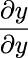
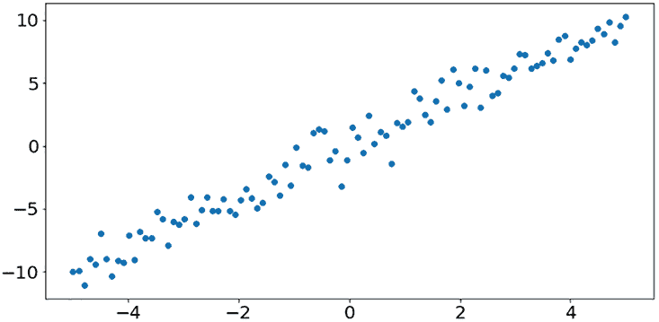
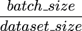
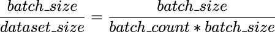
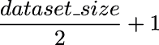
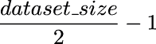
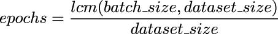
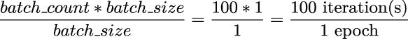
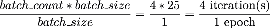

# 第六章：PyTorch 核心：Autograd、优化器和实用工具

本章涵盖内容如下

+   理解自动微分

+   使用 PyTorch 张量进行自动微分

+   开始使用 PyTorch SGD 和 Adam 优化器

+   使用 PyTorch 实现带有梯度下降的线性回归

+   使用数据集批次进行梯度下降

+   PyTorch 数据集和 DataLoader 工具类用于批量处理

在第五章中，您学习了张量（tensor），这是 PyTorch 的核心数据结构，用于表示 n 维数组。该章节展示了 PyTorch 张量相对于原生 Python 数据结构的数组的显著性能优势，并介绍了创建张量以及在一个或多个张量上执行常见操作的 PyTorch API。

本章将介绍 PyTorch 张量的另一个关键特性：支持使用 *自动微分*（autodiff）进行梯度计算。自动微分被描述为自 1970 年以来科学计算中的一项重大进展，它出人意料地简单，由赫尔辛基大学的硕士研究生 Seppo Linnainmaa 发明。本章的第一部分通过展示如何使用基本的 Python 实现标量张量的核心算法来向您介绍自动微分的基础知识。

本章的其余部分将解释如何使用 PyTorch 张量 API 的自动微分功能来计算机器学习模型的梯度，以一个基于一个小的合成数据集的线性回归问题应用梯度下降的简单示例。在这个过程中，您将学习 PyTorch 自动微分的 API，并学会如何使用它们来实现机器学习中使用梯度下降的标准步骤序列。本章最后展示了使用各种梯度下降优化器的 torch.optim 包，并向您展示如何在您的机器学习代码中利用这些优化器。 

## 6.1 理解自动微分的基础知识

本节介绍了自动微分的概念，并通过使用纯粹的 Python 编程语言构造，在没有使用 PyTorch 的情况下，通过一个简单的例子来教授其基础知识。在这个过程中，您将深入理解 PyTorch 自动微分功能，并开发出使您能够在项目中解决 PyTorch 自动微分问题的知识。在本节中，您将看到自动微分虽然出奇地简单，但它是一个支持复杂应用微积分链式法则的算法。在后续章节中，您将应用所学知识，并使用 PyTorch 张量的自动微分功能。

PyTorch 张量的自动微分功能是该框架成为深度学习和许多依赖于梯度下降以及相关优化技术的机器学习算法流行的核心原因之一。虽然可以将自动微分视为一个黑盒子来使用，而不完全理解它的工作方式，但如果您希望开发用于在生产场景中排除自动微分问题的技巧，了解这个关键的 PyTorch 功能至少是有价值的。

PyTorch 实现了一种名为*反向模式积累自动微分*的自动微分方法，这是一种高效的方法，用于计算常用于机器学习的损失函数（在附录 A 中定义）的梯度，包括均方误差和交叉熵。更准确地说，PyTorch 自动微分具有 O(n)的计算复杂度，其中 n 是函数中操作（如加法或乘法操作）的总数，只要函数的输入变量多于输出变量。

如果您已经熟悉反向模式积累自动微分，可以跳转到第 6.2 节，其中解释如何使用 PyTorch 自动微分 API 进行机器学习。否则，本节将帮助您更深入地了解 PyTorch 自动微分 API 设计及其用途。

如果您刚开始学习自动微分，需要知道它与其他流行的微分技术（如数值微分或符号微分）是不同的。数值微分通常在本科计算机科学课程中教授，基于对![006-01_EQ01]的近似。与数值微分不同，自动微分在数值上是稳定的，这意味着它在不同函数值的极端值时提供准确的梯度值，并且对实数的浮点数近似所引入的小误差的累积是有决策力的。

与符号微分不同，自动微分不尝试派生一个差分函数的符号表达式。因此，自动微分通常需要更少的计算和内存。然而，符号微分推导了一个可应用于任意输入值的差异函数，不像自动微分，它一次为函数的特定输入变量的值进行差异。

理解自动微分的一个好方法是自己实现一个玩具示例。在本节中，您将为一个微不足道的张量实现自动微分，一个纯量，添加支持计算使用加法和乘法的函数的梯度，然后探索如何使用您的实现来区分常见函数。

要开始，定义一个标量 Python 类，存储标量的值（val）和其梯度（grad）：²

```py
class Scalar:
  def __init__(self, val):
    self.val = val
    self.grad = 0
```

为了更好地跟踪标量实例的内容并支持更好的实例值输出打印，让我们也添加一个 __repr__ 方法，返回实例的字符串表示形式：

```py
def __repr__(self):
  return f"Value: {self.val}, Gradient: {self.grad}"
```

有了这个实现，您可以实例化一个标量类的对象，例如使用 Scalar(3.14)。

列表 6.1 grad 属性用于存储标量张量的梯度

```py
class Scalar:
  def __init__(self, val):
    self.val = val
    self.grad = 0.0
  def __repr__(self):
    return f"Value: {self.val}, Gradient: {self.grad}"

print(Scalar(3.14))
```

一旦执行，这个操作应该返回输出

```py
Value: 3.14, Gradient: 0
```

这与 __repr__ 方法返回的字符串相对应。

接下来，让我们通过重写相应的 Python 方法来实现对标量实例的加法和乘法。在反向模式自动微分中，这被称为*前向传播* *过程*，它仅仅计算标量运算的值：

```py
def __add__(self, other):
    out = Scalar(self.val + other.val)
    return out

  def __mul__(self, other):
    out = Scalar(self.val * other.val)
    return out
```

此时，您可以对标量实例执行基本的算术运算，

```py
class Scalar:
  def __init__(self, val):
    self.val = val
    self.grad = 0

  def __repr__(self):
    return f"Value: {self.val}, Gradient: {self.grad}"

  def __add__(self, other):
    out = Scalar(self.val + other.val)
    return out

  def __mul__(self, other):
    out = Scalar(self.val * other.val)
    return out

Scalar(3) + Scalar(4) * Scalar(5)
```

正确计算为

```py
Value: 23, Gradient: 0
```

并证实该实现遵守算术优先规则。

在这一点上，整个实现只需大约十二行代码，应该很容易理解。您已经完成了一半以上的工作，因为这个实现正确计算了自动微分的前向传播。

为了支持计算和累积梯度的*反向传播*，您需要对实现做一些小的更改。首先，标量类需要用默认设置为一个空操作的反向函数进行初始化❶。

列表 6.2 反向传播支持的后向方法占位符

```py
class Scalar:
  def __init__(self, val):
    self.val = val
    self.grad = 0
    self.backward = lambda: None      ❶
  def __repr__(self):
    return f"Value: {self.val}, Gradient: {self.grad}"
  def __add__(self, other):
    out = Scalar(self.val + other.val)
    return out
  def __mul__(self, other):
    out = Scalar(self.val * other.val)
    return out
```

❶ 使用 lambda: None 作为默认实现。

令人惊讶的是，这个实现足以开始计算琐碎线性函数的梯度。例如，要找出线性函数*y* = *x*在 x = 2.0 处的梯度，您可以从评估开始

```py
x = Scalar(2.0)
y = x
```

它将 x 变量初始化为一个 Scalar(2.0)，并声明函数*y* = *x*。此外，由于这是一个非常简单的案例，计算 y 的前向传播只是一个空操作，什么也不做。

接下来，在使用反向函数之前，您需要执行两个先决步骤：首先，将变量的梯度清零（我将很快解释为什么），其次，指定输出 y 的梯度。由于 x 是函数中的一个单独变量，清零其梯度就相当于运行

```py
x.grad = 0.0
```

如果您觉得设置 x.grad = 0.0 这个步骤是不必要的，因为 grad 已经在 __init__ 方法中设置为零，那么请记住，这个例子是针对一个琐碎函数的，当您稍后将实现扩展到更复杂的函数时，设置梯度为零的必要性会变得更加明显。

第二步是指定输出 y 的梯度值，即关于自身的。幸运的是，如果您曾经将一个数字除以自身，那么这个值就很容易找出：y.grad 就是 1.0。

因此，要在这个简单线性函数上执行反向累积自动微分，你只需要执行以下操作：

```py
x = Scalar(2.0)
y = x

x.grad = 0.0
y.grad = 1.0
y.backward()
```

然后使用

```py
print(x.grad)
```

计算出  的值，其结果正确显示为 1.0。

如果你一直关注 y = x 的定义，你完全有权利提出反对，认为这整个计算过程只是将梯度从 y.grad = 1.0 语句中取出并打印出来。如果这是你的思维线路，那么你是绝对正确的。就像前面介绍  的例子一样，当计算  的梯度时，对于函数 y = x，y 相对于 x 的变化与 x 相对于 y 的变化的比率就是 1.0。然而，这个简单的例子展示了一系列自动微分操作的重要顺序，即使对于复杂函数也是如此：

+   指定变量的值

+   指定变量的输出（前向传播）

+   确保变量的梯度设置为零

+   调用 backward() 来计算梯度（后向传播）

如果你对微分的推理感到舒适，那么你就可以进一步计算更复杂函数的梯度了。使用自动微分，梯度的计算发生在实现数学运算的函数内部。让我们从比较容易的加法开始：

```py
def __add__(self, other):
  out = Scalar(self.val + other.val)

  def backward():    
    self.grad += out.grad   
    other.grad += out.grad    
    self.backward()              
    other.backward()        
  out.backward = backward   

  return out
```

注意，梯度的直接计算、累积和递归计算发生在分配给加法操作所产生的 Scalar 对象的 backward 函数的主体中。

要理解 self.grad += out.grad 和类似的 other.val += out.grad 指令背后的逻辑，你可以应用微积分的基本规则或者进行一些有关变化的直观推理。微积分中的相关事实告诉我们，对于一个函数 *y* = *x* + *c*，其中 *c* 是某个常数，那么  = 1.0。这与之前计算 y = x 的梯度的例子几乎完全相同：尽管给 x 添加了一个常数，但是 y 相对于 x 的变化与 x 相对于 y 的变化的比率仍然是 1.0。对于代码来说，这意味着 self.grad 对 out.grad 贡献的变化量与 out.grad 的值是一样的。

那么对于代码计算没有常数的函数的梯度的情况呢，换句话说*y* = *x* + *z*，其中 x 和 z 都是变量？在实现方面，当计算 self.grad 时，为什么 out.grad 应被视为常数呢？答案归结于梯度或关于一个变量的偏导数的定义。找到 self.grad 的梯度相当于回答问题“假设所有变量，除了 self.grad，都保持不变，那么 y 对 self.grad 的变化率是多少？”因此，在计算梯度 self.grad 时，其他变量可以视为常量值。当计算 other.grad 的梯度时，这种推理也适用，唯一的区别是 self.grad 被视为常量。

还要注意，在 __add__ 方法的梯度计算的一部分中，both self.grad 和 other.grad 都使用+=运算符累积梯度。理解 autodiff 中的这部分是理解为什么在运行 backward 方法之前需要将梯度清零至关重要。简单地说，如果你多次调用 backward 方法，则梯度中的值将继续累积，导致不良结果。

最后但并非最不重要的是，调用 backward 方法递归触发的 self.backward()和 other.backward()代码行确保 autodiff 的实现也处理了函数组合，例如 f(g(x))。请回忆，在基本情况下，backward 方法只是一个无操作的 lambda：None 函数，它确保递归调用始终终止。

要尝试带有后向传递支持的 __add__ 实现，让我们通过将 y 重新定义为 x 值的和来查看更复杂的示例：

```py
x = Scalar(2.0)
y = x + x
```

从微积分中，你可能会记得*y* = *x* + *x* = 2 * *x*的导数只是 2。

使用你的 Scalar 实现确认一下。同样，你需要确保 x 的梯度被清零，初始化  = 1，然后执行后向函数：

```py
x.grad = 0.0
y.grad = 1.0
y.backward()
```

此时，如果你打印出来

```py
x.grad
```

它返回正确的值

```py
2.0
```

要更好地理解为什么评估为 2.0，回想一下在 __add__ 方法中实现的向后函数的定义。由于 y 定义为 y = x + x，self.grad 和 other.grad 都引用 backward 方法中 x 变量的同一实例。因此，对 x 的更改相当于对 y 或梯度的更改两倍，因此梯度为 2。

接下来，让我们扩展 Scalar 类的实现，以支持在乘法 Scalars 时计算梯度。在 __mul__ 函数中，实现只需要六行额外代码：

```py
def __mul__(self, other):
  out = Scalar(self.val * other.val)

  def backward():           
    self.grad += out.grad * other.val   
    other.grad += out.grad * self.val
    self.backward()               
    other.backward()         
  out.backward = backward    

  return out
```

乘法的梯度推导逻辑比加法更复杂，因此值得更详细地审查。与加法一样，假设你试图根据 self.grad 来推导梯度，这意味着在计算时，other.val 可以被视为常数 c。当计算 *y* = *c* * *x* 关于 x 的梯度时，梯度就是 c，这意味着对于 x 的每一个变化，y 都会变化 c。当计算 self.grad 的梯度时，c 就是 other.val 的值。类似地，你可以翻转对 other.grad 的梯度计算，并将 self 标量视为常数。这意味着 other.grad 是 self.val 与 out.grad 的乘积。

有了这个改变，标量类的整个实现只需以下 23 行代码：

```py
class Scalar:
  def __init__(self, val):
    self.val = val
    self.grad = 0
    self.backward = lambda: None
  def __repr__(self):
    return f"Value: {self.val}, Gradient: {self.grad}"
  def __add__(self, other):
    out = Scalar(self.val + other.val)
    def backward():
      self.grad += out.grad
      other.grad += out.grad
      self.backward(), other.backward()
    out.backward = backward
    return out
  def __mul__(self, other):
    out = Scalar(self.val * other.val)
    def backward():
      self.grad += out.grad * other.val
      other.grad += out.grad * self.val
      self.backward(), other.backward()
    out.backward = backward
    return out
```

为了更加确信实现正确，你可以尝试运行以下测试案例：

```py
x = Scalar(3.0)
y = x * x
```

重复早期步骤将梯度归零，并将输出梯度值指定为 1.0：

```py
x.grad = 0.0
y.grad = 1.0
y.backward()
```

使用微积分规则，可以很容易地通过解析方法找出预期结果：给定 *y* = *x*²，则  = 2 * x。因此对于 x = 3.0，你的标量实现应返回梯度值为 6.0。

你可以通过打印输出来确认

```py
x.grad
```

返回结果为

```py
6.0.
```

标量实现也可扩展到更复杂的函数。以*y* = *x*³ + 4**x* + 1 为例，其中梯度  = 3 * *x*² + 4，所以  在 *x* = 3 时等于 31，你可以通过指定如下代码来使用标量类实现这个函数 y：

```py
x = Scalar(3.0)
y = (x * x * x) + (Scalar(4.0) * x) + Scalar(1.0)
```

然后运行

```py
x.grad = 0.0
y.grad = 1.0
y.backward()

x.grad
```

确认实现正确返回值为 31.0。

对于标量（Scalar）的自动微分实现与 PyTorch 张量提供的功能相比较简单。然而，它可以让你更深入地了解 PyTorch 在计算梯度时提供的功能，并阐明为什么以及何时需要使用看似神奇的`zero_grad`和`backward`函数。

## 使用 PyTorch 自动微分进行线性回归

本节在介绍了第 6.1 节中自动微分算法的基础上，引入了 PyTorch 中的自动微分支持。作为一个激励性的例子，本节将带领你通过使用 PyTorch 自动微分和基本的梯度下降法解决单变量线性回归问题的过程。在这个过程中，你将学习如何使用 PyTorch 自动微分 API，实践可微模型的前向和反向传播，并为在接下来的章节深入应用 PyTorch 做好准备。

为了说明 PyTorch 中的自动微分特性，让我们结合梯度下降算法解决经典的线性回归问题。为了建立问题，让我们生成一些样本数据，

```py
X = pt.linspace(-5, 5, 100)
```

所以变量 X 包含 100 个值，均匀分布在范围从-5 到 5。在这个例子中，假设 *y* = 2*x* + ε，其中 ε 是从标准正态分布中抽样的随机数（ε ~ *N* (0,1)），以便 y 可以用 PyTorch 实现为：

```py
y = 2.0 * X + pt.randn(len(X))
```

向 y 函数添加 randn 噪声的目的是说明算法正确估计线的斜率的能力，换句话说，仅使用训练数据张量 y、X 即可恢复值为 2.0。

此时，如果您将 X 的值沿水平轴和 y 的值沿垂直轴绘制成图表，您应该期望看到一个类似于图 6.1 的图。当然，如果您使用了不同的随机种子，您的具体值可能会有所不同。



图 6.1 用于解释 PyTorch 张量 API 基础知识的示例回归问题

下一步，为了为梯度下降算法建立可微分模型，您需要指定模型参数以及参数值的初始猜测。对于这种简化的线性回归情况，没有偏差，您需要指定的唯一模型参数是线的斜率。为了初始化参数，您可以使用 randn 函数从标准正态分布中抽样：

```py
w = pt.randn(1, requires_grad = True)
```

到目前为止，在本章中您还没有看到 requires_grad 参数在此处被 randn 张量工厂方法用于实例化 w 值。在第 6.1 节中，我介绍了自动微分算法的内部工作原理，您看到计算梯度需要为张量中的每个数据值额外的内存和计算开销。例如，对于每个 Scalar 实例，自动微分需要一个额外的 grad 属性以及一个递归反向函数的定义。

对于机器学习模型，支持自动微分可能会使张量所需的内存量增加一倍以上。因此，当使用工厂方法实例化张量时，PyTorch 默认禁用张量自动微分，需要您使用 requires_grad 参数显式启用支持。但是，如果一个张量是从启用 requires_grad 的张量派生的，那么派生张量（称为*非叶*张量）的 requires_grad 将自动设置为 True。

一旦模型参数 w 初始化完成，算法的前向传递就准备好了。在这种情况下，前向传递是简单地使用 w 参数猜测（预测）y 值。前向传递是作为一个返回预测的均方误差值的 forward 方法实现的：

```py
def forward(X):
  y_pred = X * w
  mse_loss = pt.mean((y_pred - y) ** 2)
  return mse_loss
```

仔细查看前向方法的实现，去计算 PyTorch 在计算均方误差公式过程中实例化的所有张量的数量。第一个张量 y_pred 包含基于给定 w 值的 y 的预测值。第二个张量是 y_pred - y，包含了预测值的个体误差，而第三个张量包含了平方误差(y_pred - y) ** 2。最后，使用 mean 函数计算第四个张量，返回一个标量，其值为预测值的均方误差。

前向方法中实例化的四个张量均无需手动指定 requires_grad = True，因为 PyTorch 会自动推断：为了支持对 w 张量的梯度计算，还需要启用来自 w 的非叶张量的 requires_grad。一般来说，对于任意的 PyTorch 张量，你可以检查其 requires_grad 属性的值，以确定它是否可以用于梯度计算。例如，在前向方法的代码块中，y_pred.requires_grad 返回 True。

在本章中，你还没有使用过 PyTorch 张量聚合函数，比如 mean。在前向方法中，mean 函数简单地计算张量值的算术平均值（即平方误差的平均值），并将聚合结果返回为标量。在接下来的章节中，你将学习更多关于 mean 和其他 PyTorch 张量聚合函数的内容。

有了前向传播代码，就可以完成使用 PyTorch 自动微分来实现梯度下降的工作。回想一下，代码中的 y 和 X 的值基于方程*y* = 2*x* + ε。以下代码执行 25 次梯度下降迭代来估算 2.0 的值，该值用作方程中的斜率。

列表 6.3 使用梯度下降的 PyTorch 自动微分进行线性回归

```py
LEARNING_RATE = 0.03

for _ in range(25):
  mse_loss = forward(X)
  w.grad = None                ❶
  mse_loss.backward()
  w.data -= LEARNING_RATE * w.grad

print("MSE ", mse_loss.data, " W ", w.data)
```

❶ 清空 w 的梯度（置零）。

你应该期望代码打印出接近以下数字的结果：

```py
MSE  tensor(0.7207)  W  tensor([1.9876])
```

在梯度下降的实现中，将学习率任意设为 0.03，并将梯度下降迭代次数设置为 25。在接下来的章节中，你将学习更多关于超参数调整和更严格的方法来选择学习率、梯度下降迭代次数以及其他机器学习超参数的值。

正如你从第 6.1 节已经了解的那样，在使用自动微分时，重要的是在使用 backward 函数累积更新的梯度值之前将梯度归零。请注意，在 PyTorch 张量的情况下，grad 属性是通过将其设置为 None ❶ 而不是 0 的值来归零的。一旦 mse_loss 张量由 forward 方法返回，就会通过调用 backward 函数来更新梯度。梯度下降步骤等同于使用学习率和更新后梯度的负乘积来更新 w 参数数据 w.data -= LEARNING_RATE * w.grad。

请注意，由于 y 值的噪声，不应期望梯度下降或线性回归的解析解能恢复用于生成数据的精确值 2.0。为了确认这一点，你可以使用 PyTorch 张量 API 根据公式 (*X^T* *X*)^(-1)*X^Ty* 计算解析的最小二乘解，

```py
pt.pow(X.T @ X, -1) * (X.T @ y)
```

应该返回大约 tensor(1.9876) 的值。

## 6.3 迁移到 PyTorch 优化器进行梯度下降

本节介绍了 PyTorch 的 torch.optim 包和 Optimizer 类，包括 Adam 和 SGD（*随机梯度下降*），你可以在基于 PyTorch 的机器学习模型中重新使用它们，以改进模型参数的训练方式。

除了 torch.autograd 的自动微分框架外，PyTorch 还包括了 torch.optim 包，其中包含了一系列优化器，这些优化器是根据损失函数的梯度实现的替代优化启发式算法，用于更新机器学习模型参数。优化器算法的实现细节超出了本书的范围，但你应该知道，PyTorch 开发团队一直在努力维护 PyTorch torch.optim 包文档中与相应算法实现相关的研究论文的链接。³

优化器类被设计成易于交换，确保你可以在不必更改机器学习模型训练代码的情况下尝试替代优化器。回想一下，在列表 6.3 中，你实现了一个简单的线性回归版本，使用了自己简单的规则来根据梯度和学习率更新模型参数值：

```py
w.data -= LEARNING_RATE * w.grad
```

不要自己硬编码这个规则，你可以通过重新实现以下代码，来重用 torch.optim.SGD 优化器中的等价更新规则。

列表 6.4 使用 torch.optim 优化器进行线性回归

```py
import torch as pt
pt.manual_seed(0)

X = pt.linspace(-5, 5, 100)
y = 2 * X + pt.randn(len(X))

w = pt.randn(1, requires_grad = True)

def forward(X):
  y_pred = X * w
  return y_pred

def loss(y_pred, y):
  mse_loss = pt.mean((y_pred - y) ** 2)
  return mse_loss

LEARNING_RATE = 0.03
optimizer = pt.optim.SGD([w], lr = LEARNING_RATE)   ❶

EPOCHS = 25                                         ❷
for _ in range(EPOCHS):
  y_pred = forward(X)
  mse = loss(y_pred, y)
  mse.backward()

  optimizer.step()                                  ❸
  optimizer.zero_grad()                             ❹

print(w.item())
```

❶ 使用模型参数的可迭代对象 [w] 来实例化 SGD 优化器。

❷ 假设进行 25 个周期的梯度下降。

❸ 使用 backward 计算的梯度执行梯度更新步骤。

❹ 将模型参数的梯度归零，以备下一次迭代。

这应该输出模型对线性斜率 w 的估计值大约为 2.0812765834924307。使用 PyTorch 优化器所需的更改已经标注了❶、❸和❹。请注意，当实例化优化器❶时，您正在提供一个 Python 可迭代对象（在本例中是 Python 列表），用于模型参数。梯度下降计算出梯度后（即 backward()方法返回后），对优化器的 step()方法❸的调用基于梯度更新模型参数。优化器的 zero_grad()方法❹的调用清除（清空）梯度，以准备下一次 for 循环迭代中 backward()方法的调用。

如果您有训练机器学习模型的先验经验，可能已经遇到过 Adam 优化器。使用 PyTorch 优化器库，将 SGD 优化器❶替换为 Adam 很容易：

```py
optimizer = pt.optim.Adam([w], lr = LEARNING_RATE)
```

通常，要使用 torch.optim 包中的任何 PyTorch 优化器，您需要首先使用构造函数实例化一个，

```py
torch.optim.Optimizer(params, defaults)
```

其中 params 是模型参数的可迭代对象，defaults 是特定于优化器的命名参数的默认值。⁴

SGD 和 Adam 优化器都可以使用除模型参数和学习率之外的其他配置设置来实例化。然而，这些设置将在第十一章中的超参数调整中详细介绍。在那之前，示例将使用 SGD 优化器，因为它更容易理解和解释。

当你逐渐进入使用梯度下降进行更复杂的训练场景时，清晰而全面的术语是很有用的。从列表 6.4 中可以看到，通过梯度下降训练机器学习模型包括多个迭代，每个迭代包括以下操作：

+   *前向*传递，其中使用特征值和模型参数返回预测输出，例如来自列表 6.4 的 y_pred = forward(X)。

+   *损失*计算，其中使用预测输出和实际输出来确定损失函数的值，例如来自列表 6.4 的 mse = loss(y_pred, y)。

+   *反向*传递，其中反向模式自动微分算法基于损失函数的计算计算模型参数的梯度，例如来自列表 6.4 的 mse.backward()。

+   *参数*或*权重更新*，其中使用从反向传递中计算得到的梯度值更新模型参数，如果您使用的是 torch.optim 包中的优化器，应该是 optimizer.step()。

+   *清除梯度*，其中将模型参数 PyTorch 张量中的梯度值设置为 None，以防止自动微分在多次梯度下降迭代中累积梯度值；如果您使用的是 torch.optim 包中的优化器，则应使用 optimizer.zero_grad()进行此操作。

在行业中，术语*迭代*和*梯度下降的步骤*通常互换使用。令人困惑的是，单词“步骤”有时也用来描述作为梯度下降的一部分执行的具体操作，例如*向后步骤*或*向前步骤*。由于 PyTorch 使用*步骤*来特指根据损失函数的梯度来更新模型参数的操作，本书将坚持使用 PyTorch 的术语。请记住，一些 PyTorch 的框架，如 PyTorch Lightning，使用*步骤*来表示*迭代*。

在过渡到使用批次进行梯度下降的模型训练之前，还有必要明确术语*周期*的定义。在机器学习中，一个周期描述了使用每个数据集示例恰好一次来训练（更新）机器学习模型参数所需的一个或多个梯度下降迭代。例如，列表 6.4❷指定了应该进行 25 个周期的梯度下降。使用词“周期”也对应于*迭代*，简单地原因是对于梯度下降的每次迭代，都会使用数据集中的所有示例来计算梯度和更新模型的权重。然而，正如您将在接下来关于批次的部分中了解到的，执行一个周期的训练可能需要多次梯度下降迭代。

## 6.4 开始使用数据集批次进行梯度下降

本节将向您介绍数据集批次（batches），以便您可以为使用 PyTorch 进行梯度下降做准备。梯度下降中数据集批次的概念看起来很简单。*批次*只是从数据集中随机抽样的一组非空示例（或在数学术语中，一个*多重集*）。尽管如此，使用批次的梯度下降是微妙而复杂的：数学家们甚至专门研究了这个领域，称为*随机优化*。训练数据集批次不仅仅是训练数据集的一个样本：在梯度下降的单个迭代中，训练数据集批次中的所有数据示例都用于更新模型的梯度。

虽然您不需要拥有数学优化的博士学位来使用 PyTorch 中的批量梯度下降，但具备与批次和梯度下降相关的精确术语能够更好地理解该主题的复杂性。

*批处理大小* 是一个正整数（大于零），指定了批处理中的示例数。许多机器学习研究论文和在线课程使用 *mini-batch 梯度下降* 这个短语来描述批处理大小大于一的梯度下降。然而，在 PyTorch 中，SGD（torch.optim.SGD）优化器以及 torch.optim 包中的其他优化器可以使用从 1 到整个数据集示例数的任何批处理大小。要记住这一点，因为在机器学习文献中，*随机梯度下降* 这个短语通常用来描述批处理大小恰好为一的梯度下降。

批处理大小的选择与您机器学习计算节点中的内存有关，也与梯度下降算法的机器学习性能有关。这意味着批处理大小的上限应考虑您机器学习平台节点的可用内存量。关于批处理大小的确切值的选择在第十一章的超参数调整中有更详细的介绍，但首先您应该知道您的机器学习平台节点内存中可以容纳的最大批处理大小。

对 PyTorch 中批处理的应用存在很多混淆，根源在于没有意识到批处理应该被视为数据集大小的一部分，即数据集中的示例数。将批处理解释为分数就是简单的 ，因此可以将批处理大小的选择归类为生成完整或不完整批次，其中 *完整批次* 的批处理大小是数据集大小的整数因子，或者更准确地说



对于某个表示数据集中批次数的正整数 batch_count。

## 6.5 使用 PyTorch Dataset 和 DataLoader 的数据集批处理

这一部分教你如何开始使用 PyTorch 中的数据集批处理，并使用 PyTorch 实用程序类来帮助你管理和加载数据集作为批处理。

PyTorch 框架提供了一组数据实用程序类，组织在 torch.utils.data 包中，并实现了支持使用梯度下降的数据批处理。该包中的类，包括 DataLoader、Dataset、IterableDataset 和 TensorDataset，旨在共同简化可扩展的机器学习模型训练过程的开发，包括数据集不适合单个节点内存的情况，以及数据集由分布式计算集群中的多个节点使用的情况。虽然这些类提供了可扩展的实现，但这并不意味着它们仅对大型数据集或大型计算集群有用。正如您将在本节中看到的，这些类可以很好地工作（除了可忽略的开销）与小型、内存中的数据集。

Dataset 是一个高度可重用的类，并且可以支持基于映射样式和可迭代样式的数据集子类的各种机器学习用例。映射样式数据集是 PyTorch 框架中的原始数据集类，最适合在内存中，可以通过索引进行寻址的数据集。例如，如果您要通过将 PyTorch 的数据集子类化为 MapStyleDataset 来实现自己的映射样式数据集，那么您必须实现所需的 __getitem__ 和 __len__ 方法。

列表 6.5 设计为子类的 PyTorch 映射样式数据集

```py
import torch.utils.data.Dataset

class MapStyleDataset(Dataset):
    def __getitem__(self, index):    ❶
      ...
    def __len__(self):               ❷
      ...
```

❶ 映射样式接口方法，用于从数据集中检索特定项。. . .

❷ . . . 并返回整个数据集中项目的总数。

请注意，作为接口的一部分，映射样式数据集做出了两个假设：预计可以通过索引值❶访问数据集中的每个示例（项），并且随时可以了解和获取数据集的大小❷。

在大多数情况下，如果您使用的是内存数据集，您可以避免实现自己的映射样式数据集子类，而是重用 TensorDataset 类。TensorDataset 也是 torch.utils.data 包的一部分，并通过包装张量或 NumPy n 维数组来实现所需的数据集方法。例如，要为张量 X 和 y 中的示例数据值创建映射样式的训练数据集，可以直接将数据张量传递给 TensorDataset❶。

列表 6.6 简化批处理 PyTorch 张量的 TensorDataset

```py
import torch as pt
from torch.utils.data import TensorDataset
pt.manual_seed(0)

X = pt.linspace(-5, 5, 100)
y = 2 * X + pt.randn(len(X))

train_ds = TensorDataset(y, X)   ❶
```

这使您可以使用 Python [0]语法从数据集中获取索引为 0 的示例，使用 __getitem__ 方法，

```py
print(train_ds[0])
```

输出为

```py
(tensor(-11.1258), tensor(-5.))
```

并使用 train_ds 数据集上的 __len__ 方法验证数据集的长度为 100，

```py
assert
 len(train_ds) == 100
```

其中断言中的布尔表达式的结果为 True。

在使用数据集的实例时，实现梯度下降迭代的 PyTorch 代码不应直接访问数据集，而是使用 DataLoader 的实例作为与数据交互的接口。您将在使用 PyTorch 和 GPU 的即将到来的部分中了解更多有关使用 DataLoader 的理由。

DataLoader 本质上是对数据集的包装器，因此通过包装前面描述的 train_ds 实例，可以创建 train_dl 使用

```py
from torch.utils.data import DataLoader
train_dl = DataLoader(train_ds)
```

注意，默认情况下，当 DataLoader 与映射样式的数据集一起使用时，DataLoader 实例返回的每个批次的大小为 1，这意味着以下表达式的结果为 True：

```py
len(next(iter(train_dl))) == 1
```

可以通过在实例化 DataLoader 时指定 batch_size 命名参数来轻松修改此默认行为，以便该表达式

```py
train_dl = DataLoader(train_ds, batch_size = 25)
len(next(iter(train_dl)))
```

评估结果为 25。

批量大小的两个值，1 和 25，都会生成完整的批次。尽管所有完整的批次的批量大小相同，但*不完整的批次*包含的示例数少于批量大小。具体来说，根据批量大小和数据集，不完整的批次可以包含至少

*dataset_size* mod *batch_size*

示例，或者在 Python 中，dataset_size % batch_size。

例如，当使用 batch_size 为 33 时，在 for 循环的第四次迭代过程中，以下代码生成一个批次大小为 1 的不完整批次：

```py
train_dl = DataLoader(train_ds, batch_size = 33)
for idx, (y_batch, X_batch) in enumerate(train_dl):
  print(idx, len(X_batch))
```

这将打印以下内容：

```py
0 33
1 33
2 33
3 1
```

处理不完整的批次没有普遍接受的技术。虽然有可能尝试防止不完整批次的问题，但在实践中可能没有太多价值：因为批次是在处理足够大卷的数据时使用的，以致于数据集太大而无法放入内存中，因此如果不完整的批次对机器学习模型的整体性能没有负面和可衡量的影响，那么可以选择忽略或删除它们。例如，DataLoader 类提供了一个 drop_last 选项，这样您就可以忽略较小的、不完整的批次：

```py
train_dl = DataLoader(train_ds, batch_size = 33, drop_last=True)
for idx, (y_batch, X_batch) in enumerate(train_dl):
  print(idx, len(X_batch))
```

这将输出以下内容：

```py
0 33
1 33
2 33
```

尽管在指定批大小时应谨慎使用不完整批次的 drop_last 选项，特别是在使用占数据集的大比例的批次大小时。例如，假设批次大小不慎设置为。由于此批次大小的选择产生两个批次，当使用 drop_last=True 选项时，两个中的单个不完整批次，批次大小为，被丢弃，导致将近一半的数据集浪费！

可以通过训练多个周期并将数据集与自身连接起来，使用 batch_size 窗口作为*滚动窗口*在数据集上滑动，从而防止不完整的批次。采用这种技术时，训练周期的数量应该基于批次大小和数据集大小的最小公倍数（lcm）：



为了说明这种方法，假设仅为例子而工作的批次大小为 12，数据集大小为 33，则

```py
import math

def lcm(a, b):
    return a * b / math.gcd(a, b)

lcm(12, 33) / 33
```

输出 4.0，这表示训练数据集需要与自身连接四次，以实现所需的四个训练周期，以避免不完整的批次。

从数据集中选择批次是如何进行的？由于批次旨在统计代表数据集，批次中的示例应尽可能相互独立。这意味着确保批次中的出租车票价示例是从整个数据集中随机采样（无替换）的。在实践中，实现对数据集进行随机洗牌最直接的方法是使用 PySpark DataFrame API 的 shuffle()方法。

由于批次需要统计代表数据集，您可能会倾向于重新使用基于第四章中发现的测试数据集大小的批次大小。尽管测试数据集大小指标作为批次大小的 *下限*，但重新使用其值并不是正确的决定，因为测试数据集大小是尽可能小而又统计代表开发数据集的。第十一章详细描述了如何使用在本章介绍的下限和上限值来选择正确的批量大小的原则性超参数调整方法。

## 6.6 用于批量梯度下降的 Dataset 和 DataLoader 类

本节说明了如何使用最小化示例应用 Dataset 和 DataLoader 类来教授这些概念，这些概念也适用于使用数据集批次的更复杂和更现实的机器学习问题。要使用 Dataset 和 DataLoader 执行使用批量的梯度下降的线性回归，您需要修改第 6.3 节的解决方案。

列表 6.7 使用批量数据集的基本线性回归

```py
import torch as pt
from torch.utils.data import TensorDataset, DataLoader
pt.manual_seed(0)

X = pt.linspace(-5, 5, 100)
y = 2 * X + pt.randn(len(X))

train_ds = TensorDataset(y, X)                  ❶
train_dl = DataLoader(train_ds, batch_size=1)   ❷

w = pt.empty(1, requires_grad = True)

def forward(X):
  y_pred =  X * w
  return y_pred

def loss(y_pred, y):
  mse_loss = pt.mean((y_pred - y) ** 2)
  return mse_loss

LEARNING_RATE = 0.003
optimizer = pt.optim.SGD([w], lr = LEARNING_RATE)

EPOCHS = 25
for _ in range(EPOCHS):
  for y_batch, X_batch in train_dl:             ❸
    y_pred = forward(X_batch)                   ❹
    mse = loss(y_pred, y_batch)                 ❺
    mse.backward()

    optimizer.step()
    optimizer.zero_grad()

print(w.item())
```

❶ 使用 TensorDataset 提供 y 和 X 的数据集接口。

❷ 使用批量大小为 1（默认）为数据集创建一个 DataLoader。

❸ 在迭代 DataLoader 时解压数据批次中的每个元组。

❹ 对特征批次执行前向步骤以生成预测。

❺ 使用批次标签和预测计算损失。

这应该输出估计的 w 大约为 2.0812765834924307。一旦原始张量 y 和 X 被打包成映射样式的 TensorDataset 数据集 ❶，则产生的 train_ds 实例进一步包装使用 DataLoader 以生成 train_dl。

要使用梯度下降的批次，对于每个周期，代码使用在 train_dl 中由 for 循环返回的单个批次执行 100 次梯度下降迭代 ❸。由于原始数据集包含 100 个示例，并且 DataLoader 的默认批量大小等于 1。由于批量大小为 1 会产生完整的批次（回想一下批次的定义为数据集的一部分），



或者，如果您使用批次大小为 25 的批次

```py
train_dl = DataLoader(train_ds, batch_size=25),
```

那么



列表 6.7 中的更改 ❹ 和 ❺ 很简单：代码不再使用原始数据集，而是使用 train_dl 实例返回的批次。

如果您将批量大小修改为生成不完整批次的值，例如通过指定批量大小为 51，

```py
train_dl = DataLoader(train_ds, batch_size=51)
```

内部 for 循环的第二次迭代将生成具有 49 个示例的批次，因为 DataLoader 默认允许不完整的批次。在这种特定情况下，这不是一个问题，因为具有 torch.Size([]) 形状的模型参数可以与形状为 torch.Size([49]) 的不完整批次进行广播。然而，通常情况下，您必须注意将模型参数的形状与批次的形状对齐。在第七章中，您将从对齐模型参数与 DC 出租车数据集批次形状的示例中学习。

## 总结

+   自动微分是简化复杂链式规则应用的基本算法。

+   可以使用 python 原生数据结构来演示如何为张量实现自动微分的基础知识。

+   PyTorch 张量提供了全面的支持，用于对张量梯度进行自动微分。

+   torch.optim 中的优化器是一系列用于使用梯度下降优化机器学习模型中参数的算法。

+   PyTorch 张量的自动微分和优化器 API 在使用 PyTorch 进行机器学习时是核心内容。

+   Dataset 和 DataLoader 接口类简化了在 PyTorch 代码中使用批处理的过程。

+   TensorDataset 提供了一个可以直接使用的内存中数据集的实现。

^(1.)自动微分和反向传播的故事在这里有详细描述：[`people.idsia.ch/~juergen/who-invented-backpropagation.html`](http://people.idsia.ch/~juergen/who-invented-backpropagation.html)。

^(2.)在有关自动微分的复杂数学论文中，标量类被称为双重数，grad 被称为伴随数。

^(3.)例如，SGD 的文档可以从[`mng.bz/zEpB`](http://mng.bz/zEpB)获取，并包含指向相关研究论文和 SGD 实现详细信息的链接。

^(4.)基础的 Optimizer 类和它的构造函数在这里有文档说明：[`pytorch.org/docs/stable/optim.html#torch.optim.Optimizer`](https://pytorch.org/docs/stable/optim.html#torch.optim.Optimizer)。

^(5.)更精确地说，通过使用无替换的随机抽样，或者等效地对数据集中的示例顺序进行随机洗牌。

^(6.)根据批处理大小和数据集大小的最小公倍数增加纪元数，可以产生足够的训练纪元，以避免不完整的批次。也可以训练任意 lcm(batch_size, data set_size) 的倍数，以避免不完整批次。
