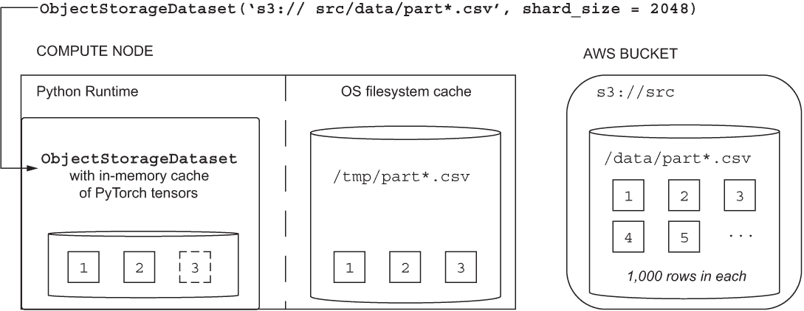
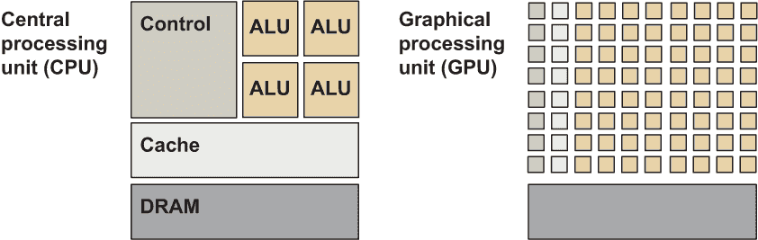
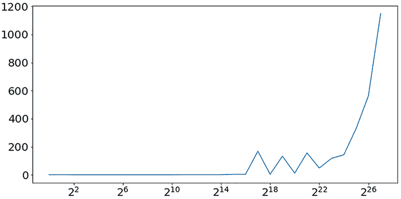
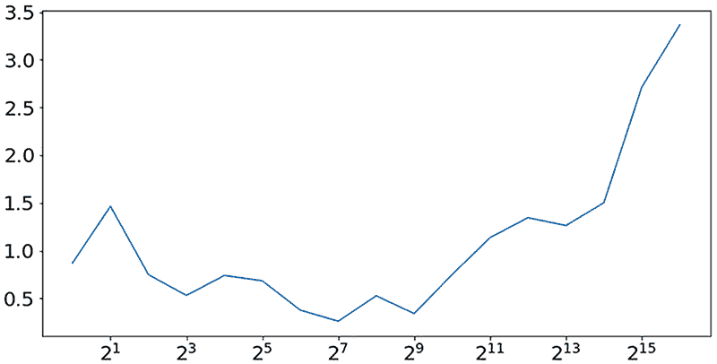

# 第七章：无服务器机器学习的扩展性。 

本章节涵盖以下几个方面

+   使用 IterableDataset 与 AWS 和其他云平台 

+   理解 PyTorch 编程中的 GPU

+   使用 GPU 核对梯度下降进行扩展

+   利用线性回归对 DC 出租车数据集进行基准测试。

在第 5 和 6 章节中，您已经学会了如何在小规模上使用 PyTorch，实例化由几百个数据值组成的张量并仅在几个参数中训练机器学习模型。第六章中使用的规模意味着，要训练机器学习模型，您可以对整个模型参数集、参数梯度和整个训练数据集进行梯度下降，假定它们可以轻松适应单个节点的内存，并因此随时可供梯度下降算法使用。 

本章节介绍扩大机器学习系统所需的概念。建立在您对梯度下降的现有知识（有关刷新，请参见附录 A）的基础上，学习如何对数据集批次执行梯度下降。接下来，使用批次来帮助您扩展到不适合单个节点的机器学习平台内存的数据集。您还将学习如何在单个节点上进行扩展，换句话说，利用多个处理器（如 CPU 和 GPU）。本章节的概念还在第八章节中重用，以解释扩展出机器学习系统，换句话说，确保您的机器学习系统可以利用由多个互连处理节点组成的分布式计算集群的计算能力。

## 7.1 如果我的机器学习模型只需要单个节点，该怎么办？

本章节教授如何确定 PyTorch 机器学习系统的扩展能力与您的机器学习项目是否有关。 

如果（a）您使用的数据集可以适应您机器学习平台的单个节点内存，（b）即使启动系统后您的数据集仍可适应内存，（c）您认为 CPU 或 GPU 上的机器学习代码的性能已足够，则可以放弃本章和下一章中描述的扩展技巧。

注意作为一般经验法则，如果您的机器学习模型和数据集保证适合内存，请将其保留在内存中。

针对内存数据集的机器学习算法在计算效率和机器学习效果方面提供了最佳性能。这意味着当使用内存数据上的机器学习时，你的机器学习模型训练和推断将需要更少的时间，并且你将能够更快地达到最佳的损失和度量性能。此外，对于适合内存的数据集，你可以使用单节点的机器学习框架（如 scikit-learn）在进入生产之前开发和测试各种机器学习模型。如果你的计划是避免实现用于扩展机器学习的代码，你可以考虑跳转到第九章继续进行特征选择和工程。

在你匆忙前进之前，你应该记住，“The Bitter Lesson”是由杰出计算机科学家和人工智能研究员 Rich Sutton 在 2019 年发表的一篇有影响力的论文（[`www.incompleteideas.net/IncIdeas/BitterLesson.html`](http://www.incompleteideas.net/IncIdeas/BitterLesson.html)），该论文认为利用大规模计算能力的机器学习系统一直以来效果最佳，且差距较大。Sutton 的论文描述了在围棋游戏、语音识别和计算机视觉等人工智能研究的不同领域取得突破性成果的例子。如果你正在构建托管在云平台上的机器学习系统，你的系统可以利用的信息技术能力规模受到财务预算而不是技术限制的限制。因此，在你的机器学习系统设计中，你需要对你的系统预计在云中使用的信息技术资源的规模做出决策。如果你正在构建需要在市场上表现优越或在学术领域提供最新成果的机器学习系统，那么你应该从“苦涩的教训”中汲取教训，并为扩展和缩放设计系统。

如果你打算认真对待“苦涩的教训”，并扩展你的机器学习系统，你需要付出一些努力，深入了解数据集批处理、使用 GPU 和使用 PyTorch 进行分布式处理。尽管有许多流行和有效的机器学习算法，包括梯度提升决策树，但梯度下降和深度学习的优势在于它们能够利用由 Rich Sutton 描述的规模的计算、存储和网络的优势。

## 7.2 使用 IterableDataset 和 ObjectStorageDataset

本节介绍了 IterableDataset 类的应用，它可以帮助你支持 out-of-memory 和流式数据集的梯度下降。你还将了解到 ObjectStorageDataset，它可以帮助你使用位于 AWS 对象存储或其他主要云提供商的类似服务中的数据集。

在 out-of-memory 数据集中，数据集中的一个示例可能存储在磁盘上或者你机器学习平台的任意节点的内存中。map-style 数据集（在 __getitem__ 方法中使用的基于索引的内存假设）不适用于这种 out-of-memory 模型。此外，map-style 数据集（如第六章所述）假设数据集必须使用 __len__ 方法，因此对于概念上无界的流式数据集不适用。

新的 torch.utils.data.IterableDataset，在 PyTorch 1.2 版本中引入，消除了定义 __getitem__ 和 __len__ 方法的要求，而只需定义一个 __iter__ 方法，可以与 Python 内置的迭代器 API 一起使用。

7.1 IterableDataset 子类声明草图

```py
import torch.utils.data.IterableDataset

class MyIterableDataset(Dataset):
    def __init__(self, ...):
      ...
    def __iter__(self):
      ...
```

例如，要从数据集中检索单个批次的示例并将其分配给批次变量，可以使用 Python 的 next 和 iter 函数：

```py
batch = next(iter(MyIterableDataset(...)))
```

虽然批量中的示例数量未作为 IterableDataset 类的一部分指定，但 IterableDataset 类的各个实现和实例负责管理批量大小。例如，在本书的其余部分中使用的 ObjectStorageDataset 类中，批量大小被指定为类的 __init__ 方法的参数之一。

就像 TensorDataset（在第六章中描述）为基于张量的、内存中的数据集提供了对 map-style 接口的支持一样，ObjectStorageDataset 为基于张量的、out-of-memory 数据集提供了对 iterable-style 接口的支持。当你安装 PyTorch 时，默认情况下不会提供 ObjectStorageDataset，因此你需要从 Kaen 框架中单独安装它

```py
pip install kaen[osds]
```

安装后，可以使用以下命令在运行时导入该类

```py
from kaen.torch import ObjectStorageDataset as osds
```

ObjectStorageDataset 类为以 CSV 格式存储的数据集提供了标准的 PyTorch 接口，无论它们是位于公共云对象存储中还是位于本地文件系统中。对于类的 __iter__ 方法的每次调用，结果是来自基于 CSV 的数据集的数值的 PyTorch 张量。在第四章的 dctaxi_dev _test.py PySpark 作业创建的 DC 出租车开发数据集的情况下，这意味着 ObjectStorageDataset 返回的张量必须分离为执行梯度下降迭代所需的标签（y）和特征（X）。例如，这可以使用 Python 切片表示法来完成 ❷。

7.2 划分批量张量

```py
batch = next(iter(osds(...)))

def batchToXy(batch):
  batch = batch.squeeze_()             ❶
  return batch[:, 1:], batch[:, 0]     ❷

X_batch, y_batch = batchToXy(batch)
```

❶ 消除张量的前导（批量）维度。

❷ 将批次切片为第一个（y_batch）和剩余列（X_batch）。

第一列中的所有行都分配给标签张量 y_batch，剩余列的所有行都分配给特征张量 X_batch。

要实例化 ObjectStorageDataset，您必须指定一个 URL 样式路径（类似于 Unix 通配符字符串），该路径指向您的 CSV 格式数据集的位置。例如，如果已经为包含开发数据集的 S3 存储桶配置了 BUCKET_ID 和 AWS_DEFAULT_REGION 环境变量，您可以使用以下命令实例化该类

```py
import os
BUCKET_ID = os.environ['BUCKET_ID']
AWS_DEFAULT_REGION = os.environ['AWS_DEFAULT_REGION']
BATCH_SIZE = 1_048_576 # = 2 ** 20

train_ds = \
  osds(f"s3://dc-taxi-{BUCKET_ID}-{AWS_DEFAULT_REGION}/csv/dev/part*.csv",
        partitions_glob = f"s3://dc-taxi-{BUCKET_ID}-
➥           {AWS_DEFAULT_REGION}/csv/dev/.meta/shards/*.csv",
        storage_options = {'anon': False},
        batch_size = BATCH_SIZE)
```

其中 train_ds 被分配了 ObjectStorageDataset 的一个实例。由于 ObjectStorageDataset 支持通配符字符 (*)，用于创建 train_ds 实例的 Python f-string 指定数据集应包括 dc-taxi-${BUCKET_ID}-${AWS_DEFAULT_REGION} S3 存储桶中匹配 /csv/dev/part*.csv glob 的所有对象。

ObjectStorageDataset 的 partitions_glob 参数指向有关匹配 /csv/dev/part*.csv glob 的 CSV 部分文件的元数据文件。请回想 dctaxi_dev_test.py PySpark 作业将 Spark 分区（也称为部分文件）元数据保存到开发和测试数据集的 .meta/shards 子文件夹中。对于数据集的开发部分，您可以通过将其加载到内存中作为 pandas DataFrame 来预览此元数据，

```py
import pandas as pd
partitions_df = pd.read_csv(f"s3://dc-taxi-{BUCKET_ID}-
➥ {AWS_DEFAULT_REGION}/csv/dev/.meta/shards/*.csv")
print(partitions_df[:5])
```

这应该会产生类似以下的输出：

```py
id   count
77  164315
10  165314
31  165168
 1  165436
65  164777
```

其中 id 列表示 .meta/shards 子文件夹中的一个部分文件的 ID，count 列表示部分文件中行数（记录数）的计数。

ObjectStorageDataset 被设计为在最短可能的时间内实例化，以启动梯度下降的迭代。实际上，这意味着 ObjectStorageDataset 仅缓存内存和磁盘上需要从数据集返回第一批示例的数据集对象，如图 7.1 所示。



图 7.1 ObjectStorageDataset 使用对象存储的多级缓存访问

在图 7.1 的示例中，ObjectStorageDataset 使用一个虚构的 src S3 存储桶实例化，该存储桶包含以完整 URL 样式路径 s3://src/data/part*.csv 作为 CSV 格式对象（图 7.1 的右侧）。数据集的分区（即名称匹配 part*.csv 的 CSV 格式对象）位于 src 存储桶的 data 文件夹下。在图 7.1 中，part*.csv 对象显示为 S3 存储桶中的带编号的正方形。为了说明，假定 S3 存储桶中的每个 part*.csv 对象都包含 1,000 个示例，这些示例以 CSV 格式的每行一行表示。

在使用 batch_size 为 2,048 实例化 ObjectStorageDataset 后（计算节点 Python 运行时的左侧），ObjectStorageDataset 的实现会触发从 S3 存储桶到计算节点的文件系统缓存的三个数据集分区的网络传输。由于 S3 中的每个对象有 1,000 行，需要将 3 个对象（总共 3,000 行）从 S3 传输到计算节点的文件系统，以使 ObjectStorageDataset 实例生成一个 2,048 行的批次。在图中，文件系统缓存的位置显示为 /tmp 目录；但是，Linux 操作系统特定的位置可能会因操作系统默认值而异。文件系统缓存是为了在多次重复训练机器学习模型的过程中最小化网络上的总数据传输。

注意，分区的大小（行数）完全独立于用于实例化 ObjectStorageDataset 的 batch_size，这意味着 batch_size 可以变化，而分区的大小保持不变。在本书中使用的 DC 出租车项目中，分区的数量和大小在保存清理后的数据集到对象存储中的 PySpark 作业中指定。一般来说，数据集分区的数量和大小取决于机器学习项目的具体情况，尽管如果您使用的是常见的 100 Mbps 网络接口，最好选择 100—200 MB 范围内的分区大小以实现有效的网络传输。

注意：除非 URL 样式路径以 file:// 协议处理程序开头，或者数据集源自节点的文件系统，否则数据集分区将被复制到文件系统缓存中。

当单个批次的训练示例适合内存时，在分区被缓存到文件系统后，缓存了分区 1、2 和第 3 个分区的前 48 行（在图 7.1 中以虚线显示）的内存中，这些构成了一个大小为 2,048 的碎片，作为 PyTorch 张量被缓存在内存中。ObjectStorageDataset 的每次对 __iter__ 方法的调用都会清空内存缓存，触发网络传输将下一个碎片所需的额外数据集分区从存储桶传输到文件系统缓存目录，并将下一个 2,048 个示例加载到内存中作为 PyTorch 张量。

本节描述的 ObjectStorageDataset 的所有功能都适用于驻留在主要云提供商的无服务器对象存储服务中的数据集。¹尽管本书中的示例侧重于使用 AWS 和 S3，但您可以通过修改类的 URL 样式 glob 命名参数中指定的协议，轻松地将 ObjectStorageDataset 类的实例重新定向到不同的云提供商（或本地文件系统）：

+   例如使用 gcs:// 来表示 Google Cloud Storage，

+   ```py
    osds(f"gcs://dc-taxi-${BUCKET_ID}-${AWS_DEFAULT_REGION}/test/part*.csv")
    ```

+   例如使用 abfs:// 来表示 Azure Blob Storage 或 Azure Datalake Gen2，

+   ```py
    osds(f"abfs://dc-taxi-${BUCKET_ID}-${AWS_DEFAULT_REGION}/test/part*.csv")
    ```

+   对于位于本地文件系统上的文件，使用 file://，例如使用

+   ```py
    osds("file://home/user/test/part*.csv")
    ```

## 使用内存中的数据集进行梯度下降

在本节中，你将扩展第六章中解释的基本线性回归示例，以计算 DC 出租车训练和测试数据集的弱基准性能指标。

到目前为止，在本章中，你已经学会了使用基于批次的 PyTorch 梯度下降，使用 Dataset 和 DataLoader 类的实例以及只有一个模型参数的基本线性回归模型。由于你准备用于训练的 DC 出租车数据集包含八个特征（接送地点的纬度和经度坐标，以及行程的年份，月份，星期几和小时），要执行线性回归，你需要将机器学习模型扩展到至少八个参数，每个特征一个。

注意，到目前为止，你看到的线性回归示例都没有使用偏置参数。这是有意为之的，以简化示例代码：由于先前的线性回归示例依赖于具有零均值的数据集，因此不需要偏置参数。然而，DC 出租车数据集的列在下一个示例中不具有零均值。因此，你将添加一个额外的张量标量来表示线性回归的偏置参数。

以前，你使用 torch.randn 方法通过从正态分布中采样来初始化模型参数，但由于你正在过渡到更复杂的模型，你可以利用 PyTorch 提供的更好的模型参数初始化方案。

Kaiming 初始化是由何等人在 2015 年的一篇名为《深入研究整流器：在 ImageNet 分类中超越人类水平的性能》的重要研究论文中流行化的。Kaiming 初始化通过考虑需要初始化的模型参数的数量来设置初始模型参数值。要使用 Kaiming 初始化，你只需将对 torch.empty 的调用包装在 torch.nn.init.kaiming_uniform_ 方法中。

列表 7.3 使用 Kaiming 初始化进行模型参数初始化

```py
pt.set_default_dtype(pt.float64)                                        ❶

FEATURE_COUNT = 8

w = pt.nn.init.kaiming_uniform_(pt.empty(FEATURE_COUNT,
                                            1, requires_grad=True))     ❷

b = pt.nn.init.kaiming_uniform_(pt.empty(1,
                                            1, requires_grad = True))   ❸
```

使用 torch.float64 作为新创建张量的 dtype。

这里，模型参数（也称为线性回归中的系数）被分配给变量 w，模型偏置（截距）被分配给 b。

注意：正如第五章中更详细地解释的那样，kaiming_uniform_ 方法是 PyTorch 中的一个例子，它是一个就地方法，方法名后面有一个下划线。由于本章中对 Kaiming 初始化的示例使用了就地方法，因此由 empty 方法返回的张量值将被初始化替换。

在第 7.2 节中，你已经看到默认情况下，ObjectStorageDataset 将 float64 作为批量张量的 dtype 返回。如第五章所述，PyTorch 要求张量在执行诸如矩阵乘法之类的操作之前具有相同的 dtype。列表 7.3 中使用的 set_default_dtype 方法❶确保 w 和 b 张量使用 float64 数据类型创建，以匹配 ObjectStorageDataset 返回的 dtype。

要利用修改后的模型参数，你需要改变梯度下降迭代的前进步骤的细节。此时，由于 DC 出租车数据集的特征张量 X 的形状为 torch.Size([DATASET_SIZE, FEATURE_COUNT])，模型参数张量 w 的形状为 torch.Size([FEATURE_COUNT, 1])，它们的乘积必须具有 torch.Size([DATASET_SIZE, 1])的形状。然而，如列表 7.2 中所述，从 ObjectStorageDataset 切片创建的 y_batch 张量的形状为 torch.Size([DATASET_SIZE])。因此，在计算损失指标期间，在 y_batch 和 y_est 张量进行减法计算之前，你应该使用 PyTorch 的 squeeze 方法更新 y_est 张量，以确保它们的形状都是 torch.Size([DATASET_SIZE])：

```py
def forward(X):
  y_est = X @ w + b
  return y_est.squeeze_()
```

经过这些变化，DC 出租车数据集的基线线性回归实现已经准备就绪。

列表 7.4 使用线性回归的弱基线

```py
import os
import time
import torch as pt

from torch.utils.data import TensorDataset, DataLoader
from kaen.torch import ObjectStorageDataset as osds

pt.manual_seed(0);
pt.set_default_dtype(pt.float64)   

BUCKET_ID = os.environ['BUCKET_ID']
AWS_DEFAULT_REGION = os.environ['AWS_DEFAULT_REGION']

BATCH_SIZE = 2 ** 20 #evaluates to 1_048_576
train_ds = osds(f"s3://dc-taxi-{BUCKET_ID}-
➥              {AWS_DEFAULT_REGION}/csv/dev/part*.csv",
                storage_options = {'anon': False},
                batch_size = BATCH_SIZE)

train_dl = DataLoader(train_ds, batch_size=None)

FEATURE_COUNT = 8

w = pt.nn.init.kaiming_uniform_(pt.empty(FEATURE_COUNT,
                                            1, requires_grad=True))
b = pt.nn.init.kaiming_uniform_(pt.empty(1,
                                            1, requires_grad = True))

def batchToXy(batch):
  batch = batch.squeeze_()
  return batch[:, 1:], batch[:, 0]

def forward(X):
  y_est = X @ w + b
  return y_est.squeeze_()

LEARNING_RATE = 0.03
optimizer = pt.optim.SGD([w, b], lr = LEARNING_RATE)

GRADIENT_NORM = None                                                       ❶

ITERATION_COUNT = 5

for iter_idx, batch in zip(range(ITERATION_COUNT), train_dl):
  start_ts = time.perf_counter()

  X, y = batchToXy(batch)

  y_est = forward(X)
  mse = pt.nn.functional.mse_loss(y_est, y)
  mse.backward()

  pt.nn.utils.clip_grad_norm_([w, b],                                      ❷
                                GRADIENT_NORM) if GRADIENT_NORM else None  ❸

  optimizer.step()
  optimizer.zero_grad()

  sec_iter = time.perf_counter() - start_ts

  print(f"Iteration: {iter_idx:03d}, Seconds/Iteration: {sec_iter:.3f} 
➥   MSE: {mse.data.item():.2f}")
```

❶ 假设 GRADIENT_NORM 未初始化，将其设置为 None。

❷ 如果梯度高于 GRADIENT_NORM，则剪裁梯度；否则不进行任何操作。

列表 7.4 中的 ITERATION_COUNT 故意设置为 5，因为一旦执行列表中的代码，你将会看到类似以下的输出：

```py
WARNING:root:defaulting to batch_size of 1048576
WARNING:root:stats_glob is not specified at initialization, defaulting to
stats_glob=s3://dc-taxi-c6e91f06095c3d7c61bcc0af33d68382-us-west-2/csv/dev/.meta/stats/part-00000-e4fcf448-1123-4bf4-b2bc-9768d30c6dd6-c000.csv
Iteration: 000, Seconds/Iteration: 0.020 MSE: 1590566.22
Iteration: 001, Seconds/Iteration: 0.024 MSE: 95402822161212448.00
Iteration: 002, Seconds/Iteration: 0.021 MSE: 
➥ 5722549747136962931644694528.00
Iteration: 003, Seconds/Iteration: 0.023 MSE: 
➥ 343256645163430856187799115795093520384.00
Iteration: 004, Seconds/Iteration: 0.021 MSE: 
➥ 20589650711877918152593680659301796448689601904640.00
```

请注意，与第六章中的线性回归示例不同，此输出中的损失函数未收敛。如果在看本书之前从未见过梯度下降产生这种行为，那么恭喜你！你刚刚观察到了你的第一个梯度爆炸！

如果你对这个结果感到意外，回想一下第六章中使用的合成 X 和 y 数据张量：它们的值的平均值为零，相对较小。相比之下，DC 出租车数据集中的数据由原始的位置和出租车费用值组成，具有较大的值和非零均值。你将在本书的后续部分学习有关如何正确准备数据集并防止梯度爆炸（和消失）的技术。现在，你应该知道可以使用内置的 PyTorch torch.nn.utils.clip_grad_norm_ 方法轻松解决梯度爆炸的问题。

列表 7.4 中的前两个注释 ❶ 和 ❸ 展示了如何在梯度下降迭代中包含梯度裁剪。当您在执行列表中的代码时观察到梯度爆炸时，GRADIENT_NORM 被设置为 None ❶，这将关闭梯度裁剪。要启用梯度裁剪，GRADIENT_NORM 的值应设置为正的小数值。该值被用作模型张量中最大梯度值的上限。换句话说，梯度裁剪相当于在传递给 clip_grad_norm 方法的张量的每个梯度值上运行 Python 的 min(gradient, GRADIENT_NORM) 函数。因此，在 backward 步骤（设置可能爆炸的梯度值）之后但优化器步骤（使用梯度值来更新模型参数）之前，使用 clip_grad_norm 方法非常重要。

为了获取训练数据集上均方误差的基准度量，将 GRADIENT_NORM 修改为 0.5，将 ITERATION_COUNT 修改为 50。GRADIENT_NORM 和 ITERATION_COUNT 的值成反比：将梯度裁剪到较小的值意味着梯度下降需要更多的迭代次数来调整模型参数的值。虽然了解梯度裁剪对于排查机器学习模型问题是有用的，但更好的方法是在首次出现梯度爆炸的风险最小化。

假设您在列表 7.4 中使用了默认的种子设置为 0，并使用 GRADIENT_NORM=0.5 和 ITERATION_COUNT=50 重新执行了代码，那么训练应该会返回梯度下降的最后 10 次迭代的以下结果：

```py
Iteration: 040, Seconds/Iteration: 0.027 MSE: 2450.01
Iteration: 041, Seconds/Iteration: 0.026 MSE: 416.45
Iteration: 042, Seconds/Iteration: 0.026 MSE: 218.96
Iteration: 043, Seconds/Iteration: 0.026 MSE: 416.74
Iteration: 044, Seconds/Iteration: 0.026 MSE: 214.22
Iteration: 045, Seconds/Iteration: 0.027 MSE: 407.82
Iteration: 046, Seconds/Iteration: 0.029 MSE: 216.30
Iteration: 047, Seconds/Iteration: 0.026 MSE: 415.99
Iteration: 048, Seconds/Iteration: 0.026 MSE: 223.59
Iteration: 049, Seconds/Iteration: 0.026 MSE: 421.73
```

在最后 10 次迭代中，均方误差损失函数的值没有改善，并且 200-400 的范围明显是一个较弱的基准线。然而，启用了梯度裁剪后，梯度不再爆炸。

## 7.4 使用 GPU 加速 PyTorch 张量操作

本节介绍了 PyTorch 张量 API 提供的图形处理单元 (GPU) 支持，以及 GPU 如何帮助提高机器学习算法的性能，实现更高吞吐量的计算。了解 PyTorch 中的 GPU 支持将为下一节做准备，在下一节中，您将修改基准线性回归实现来使用 GPU 而不是 CPU 来处理 DC 出租车数据集。

Alex Krizhevsky 在 2012 年 ImageNet 竞赛中的获胜作品是帮助重新燃起对深度学习兴趣的最具有代表性的成功故事之一。 尽管卷积神经网络（Krizhevsky 使用的机器学习模型）自 1990 年代以来就广为人知，但它之所以在排行榜中获得最高排名，很大程度上要归功于“非常高效的 GPU 实现。” 从 2012 年以来，GPU 和其他专用处理器已被用于高效训练最先进的机器学习模型，特别是对于包含大量非结构化数据集的领域，例如包含图像，视频，音频或大量自然语言文档的领域。

PyTorch 张量可以在不更改机器学习代码实现的情况下利用 GPU 的更高吞吐量计算。 但是，如果您计划在机器学习项目中使用 GPU，则应清楚了解可以使用 CPU 获得的张量性能，并且还要了解使用 PyTorch 张量的 GPU 的入门障碍。

PyTorch 依赖于基于 Compute Unified Device Architecture (CUDA) 的 API 与 GPU 进行交互。 CUDA 是由 nVidia（一个主要 GPU 制造商）于 2007 年引入的，此后成为为像 PyTorch 这样的应用程序和框架提供 GPU API 的软件库的事实上的标准。 CUDA 使 PyTorch 能够在 GPU 上对张量操作进行并行处理，而不管 GPU 是由 nVidia，Intel 还是其他支持 CUDA 标准的处理器制造商构建的。

PyTorch 可以使用 CPU 执行有限程度的并行处理，因为现代处理器通常具有 2 至 16 个核心。 要查找 PyTorch 可用的 CPU 核心数量，可以执行以下 Python 代码：

```py
import os
os.cpu_count()
```

在我的情况下，它返回 4。 在处理器术语中，每个 CPU 核心都可以充当独立的算术逻辑单元 (ALU)，执行 PyTorch 张量操作所需的底层算术计算。 然而，如图 7.2 所示，在标准 CPU 上的 ALU 数量与 GPU 上的 ALU 数量相比相形见绌。



图 7.2 虽然具有更大的缓存，但 CPU（左）的并行处理吞吐量受 ALU 核心数的限制。 GPU（右）中较小的缓存和控制单元在更多的 ALU 核心之间共享，并具有比 CPU 更高的总并行处理吞吐量。

PyTorch CUDA APIs 可以为您提供有关 GPU 设备上的 ALU 数量的信息。 在使用 GPU 之前，习惯上需要在 PyTorch 中初始化设备变量。

列表 7.5 检查 GPU 和 CUDA 设备驱动程序是否可用

```py
device = pt.device("cuda" if pt.cuda.is_available() else "cpu")
```

如果您的计算机上有一个 CUDA 设备可用，设备变量的值为 "cuda"。要找出您可用的 ALU 数量，您需要首先使用 get_device_capability 方法找出您的 CUDA 计算能力配置文件：

```py
[pt.cuda.get_device_properties(i) for i in range(pt.cuda.device_count())]
```

在我的情况下报告

```py
[_CudaDeviceProperties(name='Tesla P100-PCIE-16GB',
  major=6, minor=0, total_memory=16280MB, multi_processor_count=56)]
```

get_device_capability 返回的值不是实际的 ALU 计数，而是通用的设备配置。要找出配置文件的实际 ALU 数量，您需要查阅相应的 nVidia CUDA 网站条目：[`docs.nvidia.com/cuda/cuda-c-programming-guide/index.html`](https://docs.nvidia.com/cuda/cuda-c-programming-guide/index.html)。例如，在 6,0 配置文件的情况下，特定 URL 是 [`docs.nvidia.com/cuda/cuda-c-programming-guide/index.html#compute-capability-6-x`](https://docs.nvidia.com/cuda/cuda-c-programming-guide/index.html#compute-capability-6-x)，其中列出了 64 个 ALU，与图 7.2 右侧的数字相匹配。

在第 7.3 节中，您了解了如何使用 set_default_dtype 方法指定 PyTorch 代码中创建的张量的默认 dtype。对于每种受支持的 PyTorch dtype（例如，torch.float64），PyTorch 库都提供了两种替代实现：一种是基于 CPU 的，另一种是基于 GPU 的张量。⁶ PyTorch 默认使用基于 CPU 的张量，除非您使用 set_default_tensor_type 方法将 CUDA-based 实现指定为默认值。例如，

```py
pt.set_default_dtype(pt.float64)

tensor = pt.empty(1)
print(tensor.dtype, tensor.device)
```

输出

```py
torch.float64 cpu
```

张量实例的设备属性报告 PyTorch 默认为基于 CPU 的实现。但是，您可以配置 PyTorch 默认为基于 GPU 的实现（清单 7.6 ❶）。

清单 7.6 使用 GPU 张量作为默认张量类型

```py
pt.set_default_tensor_type(pt.cuda.FloatTensor)      ❶
pt.set_default_dtype(pt.float64)

tensor = pt.empty(1)
print(tensor.dtype, tensor.device)
```

❶ 使用 torch.cuda.FloatTensor 作为默认张量类型。

此代码生成

```py
torch.float64 cuda:0
```

显示张量默认到第一个 CUDA GPU 设备，如 cuda 前缀和基于 0 的索引后缀所示。

注意 在本章中，您将学习如何扩展 PyTorch 代码以使用每个计算节点的单个 GPU。第八章和以后的章节解释如何扩展到多个 GPU 设备和网络中的多个计算节点。

set_default_tensor_type 方法是全局设置，因此可能会意外影响整个 PyTorch 代码库。即使您将 set_default_tensor_type 指定为使用 FloatTensor 张量的基于 GPU 的实现，您代码中创建的所有张量也会转换为使用 GPU。例如，

```py
pt.set_default_tensor_type(pt.cuda.FloatTensor)
pt.set_default_dtype(pt.float64)

tensor = pt.empty(1, dtype=int)
print(tensor.dtype, tensor.device)
```

打印出

```py
torch.int64 cuda:0
```

显示配置为 int 的张量实例也默认为基于 GPU 的实现。

虽然注意全局 set_default_tensor_type 设置很重要，但在使用 GPU 进行张量操作时更好的做法是直接在所需设备上创建张量。假设你按照清单 7.5 中的说明初始化设备变量，你可以通过设置设备命名参数在特定设备上创建张量：

```py
device = pt.device("cuda" if pt.cuda.is_available() else "cpu")

tensor = pt.empty(1, dtype=int, device=device)
print(tensor.dtype, tensor.device)
```

这导致输出

```py
torch.int64 cuda:0
```

如果 PyTorch 可用 CUDA 设备（即 cuda.is_available 为 True）。 当 CUDA 设备不可用或未配置时，⁷ 相同的代码输出

```py
torch.int64 cpu
```

在您的 PyTorch 代码处理来自外部库（如 NumPy）的张量的情况下，将现有张量移动到不同设备可能很有用，方法是使用 to 方法。 例如，如果您的设备变量初始化为 cuda，则可以使用以下方法在 GPU 上创建包含 100 个随机元素的数组张量

```py
a = pt.randn(100).to(device)
```

请注意，张量操作使用的所有张量必须驻留在同一设备上，以使操作成功。 这意味着

```py
b = pt.randn(100).to(device)
a + b
```

正确返回张量 a 和 b 的和，而

```py
c = pt.randn(100)
a + c
```

失败，出现 RuntimeError: 预期设备 cuda:0，但得到设备 cpu。

尽管与 CPU 相比，GPU 为机器学习提供了显著的性能改进，但将张量的内容从主计算机内存移动到 GPU 内存中涉及延迟开销。 要量化 GPU 的性能优势，您可以从以下基准函数开始：

```py
import timeit
MAX_SIZE = 28
def benchmark_cpu_gpu(n, sizes):
  for device in ["cpu", "cuda"]:
    for size in sizes:
      a = pt.randn(size).to(device)
      b = pt.randn(size).to(device)
      yield timeit.timeit(lambda: a + b, number = n)

sizes = [2 ** i for i in range(MAX_SIZE)]
measurements = list(benchmark_cpu_gpu(1, sizes))
cpu = measurements[:MAX_SIZE]
gpu = measurements[MAX_SIZE:]
ratios = [cpu[i] / gpu[i] for i in range(len(cpu))]
```

其中，在执行基准方法之后，ratio 变量包含 GPU 与 CPU 的性能比（越高越好）。 例如，在我的测量中，GPU 对 CPU 的加速超过 1000 倍（图 7.3），特别是对于较大的张量大小。



图 7.3 对于更大的张量大小（横轴），GPU 可比 CPU（纵轴）快高达 150 倍。

但是，对于较小的张量大小，即包含 4,096 个浮点值或更少的张量（图 7.4），CPU 的性能要么与 GPU 相当，要么更快。



图 7.4 对于少于 4K 个值的张量（横轴），将数据传输到 GPU 内存的开销可能导致 GPU 性能等于 CPU 性能的 50%。

## 7.5 扩展以使用 GPU 核心

在本节中，您将修改列表 7.4 中的基准线性回归实现，以利用计算节点的多个 GPU 核心。 正如您从第 7.4 节中学到的那样，要使您的机器学习代码适应 GPU 的优势，您需要确保通过调用 torch.cuda.is_available() 方法正确配置 PyTorch 的 CUDA 设备和设备驱动程序（列表 7.7 ❶），其中可用设备被分配给设备变量。

列表 7.7 使用线性回归的弱基准

```py
iimport os
import torch as pt
from torch.utils.data import DataLoader
from kaen.torch import ObjectStorageDataset as osds

pt.manual_seed(0);
pt.set_default_dtype(pt.float64)

device = pt.device("cuda" \                                                
                      if pt.cuda.is_available() else "cpu")                ❶

BATCH_SIZE = 1_048_576 # = 2 ** 20

train_ds = osds(f"s3://dc-taxi-{os.environ['BUCKET_ID']}-
➥                 {os.environ['AWS_DEFAULT_REGION']}/csv/dev/part*.csv",
    storage_options = {'anon': False},
    batch_size = BATCH_SIZE)

train_dl = DataLoader(train_ds,
                      pin_memory = True)                                   ❷

FEATURE_COUNT = 8
w = \                                                                      ❷'

  pt.nn.init.kaiming_uniform_(pt.empty(FEATURE_COUNT, 1,
                                        requires_grad=True, device=device))❸
b = \                                                                      
  pt.nn.init.kaiming_uniform_(pt.empty(1, 1,
                                      requires_grad = True, device=device))❹

def batchToXy(batch):
  batch = batch.squeeze_().to(device)                                      ❽
  return batch[:, 1:], batch[:, 0]

def forward(X):
  y_pred = X @ w + b
  return y_pred.squeeze_()

def loss(y_est, y):
  mse_loss = pt.mean((y_est - y) ** 2)
  return mse_loss

LEARNING_RATE = 0.03
optimizer = pt.optim.SGD([w, b], lr = LEARNING_RATE)

GRADIENT_NORM = 0.5

ITERATION_COUNT = 50

for iter_idx, batch in zip(range(ITERATION_COUNT), train_dl):              ❺
  start_ts = time.perf_counter()

  X, y = batchToXy(batch)

  y_est = forward(X)
  mse = loss(y_est, y)
  mse.backward()

  pt.nn.utils.clip_grad_norm_([w, b],
                              GRADIENT_NORM) if GRADIENT_NORM else None

  optimizer.step()
  optimizer.zero_grad()

  sec_iter = time.perf_counter() - start_ts

  print(f"Iteration: {iter_idx:03d}, Seconds/Iteration: {sec_iter:.3f} 
➥   MSE: {mse.data.item():.2f}")
```

❶ 当设备可用时，使用 GPU。

❷ 自定义 DataLoader 以将数据固定在内存中以加速传输。

❷ 初始化模型参数...

❸ 当可用时，将模型偏差设置为使用 GPU 设备，否则使用 CPU。

❽ 当 GPU 设备可用时，将批数据传输到 GPU 设备，否则不执行操作。

剩余的更改在清单 7.7❸—❾中突出显示。请注意，DataLoader 的实例化已更改以利用 pin_memory 参数❸。此参数通过“固定住”操作系统的虚拟内存页面，以防止页面从物理内存交换到存储器，反之亦然，从而帮助加速大张量从 CPU 内存到 GPU 的传输。其余的更改❹—❾只是为了指定正确的设备与 PyTorch 张量一起使用：如果 GPU 可用于 PyTorch 运行时，则为 cuda，否则为 cpu。

运行代码清单 7.7 应该可以通过 MSE 损失来展示弱基线：

```py
Iteration: 040, Seconds/Iteration: 0.009 MSE: 865.98
Iteration: 041, Seconds/Iteration: 0.009 MSE: 36.48
Iteration: 042, Seconds/Iteration: 0.009 MSE: 857.78
Iteration: 043, Seconds/Iteration: 0.009 MSE: 39.33
Iteration: 044, Seconds/Iteration: 0.009 MSE: 868.70
Iteration: 045, Seconds/Iteration: 0.009 MSE: 37.57
Iteration: 046, Seconds/Iteration: 0.009 MSE: 870.87
Iteration: 047, Seconds/Iteration: 0.009 MSE: 36.42
Iteration: 048, Seconds/Iteration: 0.009 MSE: 852.75
Iteration: 049, Seconds/Iteration: 0.009 MSE: 36.37
```

## 总结

+   在较小的机器学习问题中使用内存中的方法更快且更有效，而使用内存不足的技术可以扩展到更大的数据集和更大的信息技术资源池：计算、存储、网络。

+   使用数据集批处理结合梯度下降，使得您的 PyTorch 代码能够利用单个节点中的计算资源并扩展到利用计算集群中的多个节点。

+   PyTorch 的 IterableDataset 简化了在 PyTorch 代码中对于内存不足和流式数据集的批处理的使用，而 ObjectStorageDataset 实用程序类提供了已经准备好的用于内存不足数据集的实现。

+   PyTorch 对于 GPU 的支持是由 CUDA 设备驱动程序实现的，它使得 PyTorch 开发人员可以轻松地扩展现有的 PyTorch 代码，以利用 GPU 的更高吞吐量和更多的并行计算能力。

+   在 PyTorch 中实现基本的线性回归可以为 DC 出租车数据集上预期的训练均方误差提供一个弱基线。

^(1.)ObjectStorageDataset 支持的存储选项的完整列表可在此处找到：[` filesystem-spec.readthedocs.io/en/latest/`](https://filesystem-spec.readthedocs.io/en/latest/)。

^(2.)论文摘要以及 PDF 版本的链接可以从 arXiv 获取：[`arxiv.org/ abs/1502.01852`](https://arxiv.org/abs/1502.01852)。

^(3.)比赛网站以及比赛结果的链接可在此处找到：[`mng.bz/Koqj`](http://mng.bz/Koqj)。

^(4.)如 Alex Krizhevsky 的论文所述：[`www.cs.toronto.edu/~hinton/absps/imagenet.pdf`](http://www.cs.toronto.edu/~hinton/absps/imagenet.pdf)。

^(5.)谷歌开发了一种用于加速张量操作的张量处理单元（TPU）。

^(6.)关于 PyTorch 数据类型（dtypes）以及相应的 CPU 和 GPU 张量实现的详细文档，请参考[`mng.bz/9an7`](http://mng.bz/9an7)。

^(7.)设备参数对于所有 PyTorch 张量的创建操作都可用，并在此处记录：[` mng.bz/jj8r`](http://mng.bz/jj8r)。
