# 第八章：使用分布式训练进行扩展

本章内容包括：

+   理解分布式数据并行梯度下降

+   在梯度下降中使用梯度累积以处理内存不足的数据集

+   对比参数服务器和基于环结构的分布式梯度下降方法

+   理解基于环结构的梯度下降的 reduce-scatter 和 all-gather 阶段

+   使用 Python 实现基于环结构的分布式梯度下降的单节点版本

在第七章中，您了解了如何将机器学习实现扩展到单个计算节点上，以充分利用可用的计算资源。例如，您可以看到如何利用 GPU 设备中更强大的处理器。然而，当您在生产中启动一个机器学习系统时，训练示例的数量增长速度和训练数据集的规模可能会超过即使是最强大的服务器和工作站的计算能力。尽管借助现代公共云基础设施的升级，例如通过升级到更强大的处理器，增加内存或 GPU 设备，可以获得很大的扩展性，但您应该有一个更好的长远计划。

*分布式数据并行*（DDP）训练是一种依靠扩展而不是升级的机器学习模型训练方法。随着训练数据集的增大，通过将模型训练涉及的计算工作负载划分并在网络计算服务器（节点）集群上进行，可以进行扩展。这里的“节点”是连接成集群的网络上的虚拟或物理服务器。与采用更高性能（也往往更昂贵）的计算节点来执行机器学习模型训练（即扩展方法）不同，通过扩展，您可以将一组较弱甚至是普通的计算节点组成一个网络，并通过在节点之间分布和并行执行工作的方式，可能更早地完成训练。事实上，将训练数据集扩展到更大规模意味着向集群中添加更多的节点。

DDP 模型训练不仅仅是通过向集群中添加节点来进行扩展。“数据并行”方面的 DDP 描述了在集群中，每个节点仅使用训练数据集的独立且互斥的划分（也称为“分片”）来计算梯度。通常，每个分片中的训练示例数量都被选定为确保每个节点的内存可以容纳该分片。虽然在 DDP 方法中，集群中的每个训练节点在梯度下降的每次迭代中都使用数据集的不同分片，但在迭代的范围内，所有节点必须使用相同的模型副本进行训练以计算模型参数梯度。因此，在节点根据训练数据集（或一批训练示例）计算梯度后，节点必须同步到更新后的模型参数版本。

在本章中，您将了解分布式梯度下降的替代方法以及 DDP 梯度下降实现如何帮助您有效地跨任意数量的节点扩展训练，同时使用具有有限计算、内存、存储和带宽资源的实用节点。

## 8.1 如果训练数据集不适合内存怎么办？

本节及其子节提供了逐步介绍梯度累积以及梯度累积在梯度下降中的作用，以支持超出内存训练数据集的功能。

### 8.1.1 说明梯度累积

本节演示了使用 PyTorch 的 autograd 库进行梯度累积。虽然本节中的示例是基于使用 autograd 与一个简单函数的情况，但后面的部分将梯度累积应用于更现实的示例。

当使用梯度下降与反向模式累积自动微分时，在执行梯度下降的优化步骤后，有必要清除张量的梯度值。在 PyTorch 中，可以通过将张量的梯度设置为 None 或使用 torch.optim.Optimizer 的辅助方法 zero_grad 来实现此操作。除非将梯度清零（清除），否则由损失函数产生的张量的 backward 方法的调用可能会导致模型的张量中梯度值的累积。以下列表显示了这种行为。

列表 8.1 说明梯度累积对于反向调用的重复调用的插图

```py
import torch as pt
x = pt.tensor(3., requires_grad=True)     ❶
y = x ** 2
for _ in range(5):
  y.backward(retain_graph=True)           ❷
  print(x.grad)
```

❶ 使用 requires_grad=True 来启用对 y 相对于 x 的微分。

❷ 设置 retain_graph=True 来防止 PyTorch 释放内存。

这会输出

```py
tensor(6.)
tensor(12.)
tensor(18.)
tensor(24.)
tensor(30.)
```

根据对 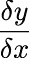 的 *y* = *x*² 的五次重复调用，输出为 3 时为 6。由于累积的结果，x.grad 的输出在 for 循环的 5 次迭代中跳过 6。尽管梯度累积可能看起来像是自动微分的一个不方便的副作用，但在将梯度下降扩展到超出内存数据集和分布式集群时，它可以发挥有用的作用。

### 8.1.2 准备一个示例模型和数据集

本节描述了如何准备一个示例模型和一个训练数据集，以说明梯度累积在扩展到超出内存数据集时的作用。在下一节中，您将学习如何在梯度下降中使用模型和数据集。

假设您正在处理一个包含 1,000 个结构化记录的训练数据集，并且执行您的梯度下降算法的计算节点只能一次容纳 250 个示例。当然，现代计算环境可以扩展到更大的数据集；然而，选择这些数字将证明对实例有用。让我们首先看一个适合内存的虚构数据集的梯度累积，然后再直接进入现实世界的超出内存数据集的复杂性。

列表 8.2 准备一个样本多元线性回归数据集

```py
pt.manual_seed(42)                                     ❶
FEATURES = 4                                           ❷
TRAINING_DATASET_SIZE = 1000                           ❸

X_train = pt.distributions.multivariate_normal.
➥   MultivariateNormal(                               ❹
  pt.arange(FEATURES, dtype=pt.float32),               ❺
  pt.eye(FEATURES)).sample((TRAINING_DATASET_SIZE,))   ❻

y_train = X_train @ (pt.arange(FEATURES,
                      dtype=pt.float32) + 1)           ❼
```

❶ 设置伪随机数种子以实现可重现性。

❷ 创建用于多元线性回归问题的数据集。

❸ 在训练示例数据集中使用 1,000 条记录（行）。

❹ 使用 multivariate_normal 生成合成训练数据集。

❺ 使用不同的均值来作为独立变量。

❻ 指定独立变量应该不相关。

❼ 将 X_train 中的特征与系数相乘。

此列表创建了一个训练数据集，其中有四个特征（自变量）和一个因变量（标签），基于每个特征的四个系数 1、2、3、4。例如，假设在生成 X_train 值时使用了种子值 42，则 y_train[0] 的值是从 X_train[0,:] 计算的：

```py
print(X_train[0, :] @ pt.tensor([1, 2, 3, 4], dtype = pt.float32))
```

应输出

```py
tensor(19.1816)
```

您还可以通过打印来确认训练数据集张量 X_train 和 y_train 的预期形状

```py
print(X_train.shape, y_train.shape)
```

应基于 TRAINING_DATASET_SIZE 和 FEATURES 的值输出如下：

```py
(torch.Size([1000, 4]), torch.Size([1000]))
```

有了训练数据集张量的准备，您可以准备一个线性回归模型和支持方法，使用梯度下降来训练模型。模型 w 是用从标准正态分布中抽取的随机值初始化的。此外，由于模型参数张量 w 被创建为 requires_grad=True，因此张量的初始梯度值设置为 None。

列表 8.3 定义模型 w 和梯度下降的实用方法

```py
pt.manual_seed(42)
w = pt.randn(FEATURES, requires_grad = True)     ❶
def forward(w, X):                               ❷
  return X @ w

def mse(y_est, y):
  err = y_est - y                                ❸
  return (err ** 2).mean()                       ❹
```

❶ 创建多元线性回归问题的模型。

❷ 基于模型 w 实现梯度下降的前向步骤。

❸ 计算目标（y）的误差（残差）。

❹ 返回均方误差的值。

尽管您可以使用更复杂的技术来初始化 w，但在这种情况下，多元线性回归问题足够简单，不需要增加复杂性。

### 8.1.3 理解使用超出内存的数据片段的梯度下降

在本节中，使用第 8.1.2 节准备的模型和数据集，使用梯度下降利用 autodiff 的梯度累积特性来扩展到超出内存的数据集。

通过依赖梯度累积，梯度下降可以使用图 8.1 中所示的方法基于整个训练数据集（即梯度下降的一个时期）来计算梯度。注意不要将图 8.1 中显示的分片与 mini-batch 梯度下降中使用的批次混淆；区别在下面的段落中进行了澄清。

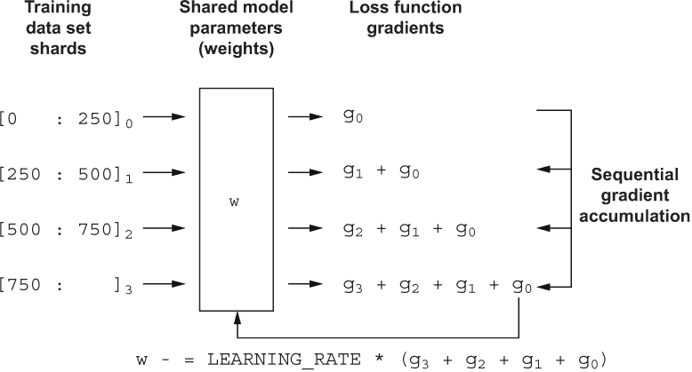

图 8.1 梯度累积重新使用分片内存以实现对超出内存的数据集的扩展。

图 8.1 的左侧显示了使用 [0:250][0] 表示训练数据集中的前 250 个示例（记录）的第一个分片，[0:250][1] 表示第二个分片，即记录从 250 到 500，依此类推。在这里，使用 Python 切片表示法（例如，[0:250]）来指定训练数据集中的哪些 1,000 个示例包含在一个分片中。

请注意，在图 8.1 中，每个分片都使用相同的模型 w 进行处理（在梯度下降的前向和后向步骤中），或者更准确地说，使用相同的 w 模型参数值。虽然图 8.1 中梯度积累的四个顺序步骤中模型参数值是相同的，但由于每个分片包含训练示例的不同集合，因此为每个分片计算的梯度也是不同的，并且是特定于分片的。在图中，使用下标表示分片及其相应的梯度之间的关系，以便分片 [0:250][0] 产生梯度*g*[0]，依此类推。

一旦每个分片的训练样本计算出梯度（见清单 8.4），则不会使用分片梯度来更新模型参数。相反，梯度被保留在模型张量中累积。因此，在第二个训练示例分片通过前向方法处理，然后后向方法计算相应的梯度*g*[1]之后，模型张量 w.grad 包含梯度*g*[0]+*g*[1]的总和（累积）。

请注意，使用分片进行计算与小批量梯度下降中的批量计算不同，其中来自每个批次的梯度用于更新模型参数，然后清除。将批次与分片区分开很有用，因为两者都可以与梯度下降一起使用；例如，分片可以是批次的分区，在数据批次不适合节点内存的情况下。分片还可以由多个批次组成，以便通过处理存储在节点内存中的多个批次来加速梯度下降。虽然可以将分片与小批量梯度下降一起使用，但本节重点介绍使用分片与普通梯度下降的更基本示例，其中根据整个训练示例集计算梯度。

仅在处理完整个训练数据集后，一次处理一个分片，图 8.1 中的算法才执行基于累积梯度*g*[0]+*g*[1]+*g*[2]+*g*[3]的梯度下降的优化步骤。

清单 8.4 使用 IN_MEMORY_SHARD_SIZE 示例的梯度下降

```py
EPOCHS = 500
LEARNING_RATE = 0.01
IN_MEMORY_SHARD_SIZE = 250

for epoch in range(EPOCHS):
  for i in range(0, \
  TRAINING_DATASET_SIZE // IN_MEMORY_SHARD_SIZE):   ❶

    start_idx = i * IN_MEMORY_SHARD_SIZE
    end_idx = start_idx + IN_MEMORY_SHARD_SIZE
    y_shard = y_train[start_idx : end_idx]
    X_shard = X_train[start_idx : end_idx]          ❷

    y_est = forward(w, X_shard)                     ❸
    loss = \                                        ❹
      (IN_MEMORY_SHARD_SIZE / TRAINING_DATASET_SIZE) * mse(y_est, y_shard)

    loss.backward()                                 ❺

  #notice that the following is
  #in scope of the outer for loop
  w.data -= LEARNING_RATE * w.grad                  ❻
  w.grad = None                                     ❼
```

❶ 每个周期执行 TRAINING_DATASET_SIZE // IN_MEMORY_SHARD_SIZE 次迭代。

❷ 将训练示例分配给 y_shard 和 X_shard。

❸ 执行梯度下降的前向步骤。

❹ 计算调整后的分片大小训练损失。

❺ 执行反向传播和梯度累积

❻ 执行梯度下降优化步骤。

❼ 清除模型张量的梯度。

代码执行后，打印语句

```py
print(w)
```

应该输出

```py
tensor([1.0000, 2.0000, 3.0000, 4.0000], requires_grad=True)
```

证实梯度下降正确地恢复了列表 8.2 中使用的系数[1.0000，2.0000，3.0000，4.0000]，以创建由 y_train 和 X_train 组成的训练数据集。

在列表 8.4 中计算损失时使用的分数(IN_MEMORY_SHARD_SIZE / TRAINING_DATASET_SIZE)微妙但重要。回想一下，该列表旨在计算整个训练示例或更准确地说是 TRAINING_DATASET_SIZE 示例的梯度。mse 方法的默认实现，计算模型估计值 y_est 的均方误差，假定在计算期间有 IN_MEMORY_SHARD_SIZE 个示例。换句话说，在列表中内部 for 循环的每次迭代中，通过计算 mse 来计算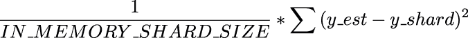，或者在 PyTorch 中等效地使用

```py
(1 / IN_MEMORY_SHARD_SIZE) * ((y_est - y_shard) ** 2).sum()
```

返回每个 IN_MEMORY_DATASET_SIZE 示例的均方误差。列表 8.4 中在计算损失时使用的(IN_MEMORY_SHARD_SIZE / TRAINING_DATASET_SIZE)分数将均方误差重新缩放为 TRAINING_DATASET_SIZE 示例。

通过这个以方程表示的乘法，注意到重新缩放相当于 IN_MEMORY_DATASET_SIZE，这在的分子和分母中取消了。

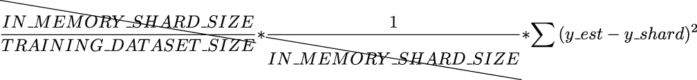

当内部 for 循环完成时，w.grad 包含训练示例梯度的总和，因此代码 w.data -= LEARNING_RATE * w.grad 计算了整个 epoch 的片段的优化步骤。换句话说，在列表 8.4 中的梯度下降实现中，梯度优化步骤是针对每个训练示例的 epoch 执行一次。这证实了列表 8.4 中的实现不是小批量梯度下降。

虽然图 8.1 中的方法使得可以在使用任意片段大小的内存外数据集上进行扩展，但它遭受着一个显著的算法复杂性问题：内部 for 循环是顺序的，这会将梯度下降实现的大零性能从*O*(EPOCHS)变为*O*(EPOCHS * SHARDS)。

将列表 8.4 中的内部 for 循环分布到一组并行工作节点上，可以将实现恢复到原始*O*(EPOCHS)最坏情况的性能。但是如何高效地实现呢？

## 8.2 参数服务器方法的梯度累积

本节介绍了基于参数服务器的分布式梯度下降的实现，并解释了梯度累积在实现中的作用。本节澄清了参数服务器方法的局限性，并激发了更高效的基于环的实现。

像 TensorFlow 1.x 这样的传统机器学习框架普及了基于参数服务器的方法，以在集群的多个节点之间分布梯度下降。 图 8.2 中描绘的参数服务器方法易于理解和实现。

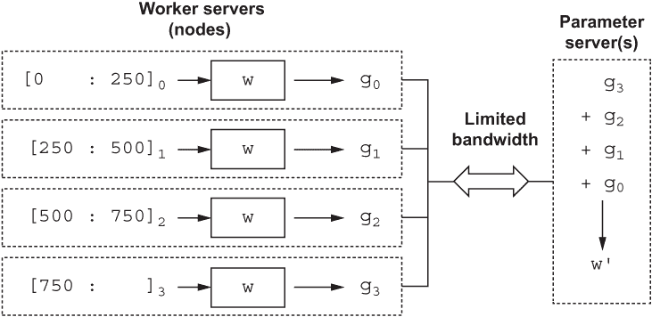

图 8.2 梯度下降在工作节点和参数服务器之间进行分布以支持扩展

在图中，每个工作节点（使用虚线表示）根据训练数据集的单个分片执行梯度下降的前向和后向步骤（例如清单 8.4 中的内部循环中的步骤），以计算损失函数的分片特定梯度。请注意，在图 8.2 中，梯度具有与用于计算梯度的分片的下标对应的下标，就像图 8.1 中一样。

一旦工作节点计算出其梯度，它就将梯度发送到参数服务器（或参数服务器集群）进行处理。参数服务器（图 8.2 的右侧）等待累积来自工作节点的梯度，并使用累积的梯度执行梯度下降的优化步骤，计算下一次梯度下降的模型参数。然后，基于新计算的模型参数（在图 8.2 中表示为 w'），将下一个版本的模型发送到工作节点，取代以前的模型参数（在图 8.2 中表示为 w），确保每个节点使用相同和更新的模型的下一个梯度下降迭代。

图 8.2 中的分布式梯度下降的参数服务器实现是一种分布式数据并行（在本章的介绍中定义）方法。在分布式数据并行方法中，训练数据集被划分为独立且互不重复的子集，以便训练数据集分片和工作节点之间存在一对一的关系。接下来，每个工作节点使用一个分片和一个相同的模型参数副本计算梯度。

与替代的分布式数据并行方法（在本章的其余部分中讲解）不同，分布式梯度下降的参数服务器实现存在重大的可伸缩性问题：工作节点和参数服务器之间的网络连通性是通信瓶颈。具体而言，在实现的两个通信阶段中都存在通信带宽受限的问题：在从工作节点到参数服务器的梯度的多到一（或多到少）通信期间，以及在从参数服务器（多个参数服务器）到工作节点的更新模型参数的一到多（或少到多）通信期间。

## 8.3 引入逻辑环形梯度下降

本节介绍了在逻辑环网络中通信的节点的基本概念。本节不是为了提供实际节点并使其通过网络通信，而是使用在单节点环境中运行的简单 Python 程序来解释网络概念。一旦你对概念有了牢固的掌握，你将把它们应用到更复杂的、分布式的、多节点环境中。

与依赖于集中式参数服务器集群（第 8.2 节中所示方法）相反，基于逻辑环的分布式数据并行算法（例如 Horovod；[`github.com/horovod/horovod`](https://github.com/horovod/horovod)）避免了一对多和多对一通信的瓶颈，并且仅依赖于在环中与两个逻辑邻居通信的节点：前趋节点和后继节点。

图 8.3（左侧）的图示显示了四个节点，每个节点使用虚线表示，并表示为节点*n*[0]到*n*[3]，这些节点组织在一个逻辑环中。请注意，在公共云环境中的当代虚拟网络中，节点不必物理连接到彼此形成环：标准以太网网络足够。但是，在图中显示的逻辑环网络中，每个节点都受到限制，仅与其前趋节点和后继节点通信。正如您将在第 8.4 节中了解到的那样，这有助于限制分布式梯度下降每次迭代所需的网络带宽。

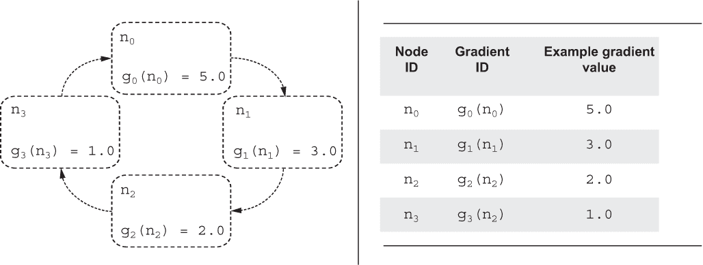

图 8.3 逻辑网络环（左）使用示例值解释

对于具有标识符*n*[i]的节点，后继节点的标识符被定义为*n*[(i+1) %] *NODES*，其中 NODES 是逻辑环中节点的总数。模运算确保通信模式形成一个环，其中具有最高标识符（始终为*n*[NODES-1]）的节点与标识符为 0 的节点进行通信，反之亦然。在环形网络中，如本章所述，每个节点只向后继节点*发送*数据。

使用类似的逻辑，基于环形网络的前趋节点的标识符被定义为*n*[(i-1) %] *NODES*，以便节点 0 可以与节点 1 和具有最高标识符值（NODES - 1）的节点进行通信。本章使用的环网络中的每个节点只从前趋节点*接收*数据。

就像第 8.2 节中解释的基于参数服务器的方法一样，图 8.3 中的节点处理训练数据集的独立碎片，以便*g*0 表示由节点*n*[0]计算的具有索引 0 的碎片的梯度值。继续使用第 8.2 节的示例，如果[0:250]0 是四个碎片中的第一个碎片，那么*g*0 表示由节点*n*[0]计算的第一个碎片的梯度值，使用模型参数值 w。因此，就像基于参数服务器的方法一样，基于环的方法也是数据并行分布式的。

在基于环的分布式数据并行实现中，不存在专用的参数服务器。相反，在集群中的每个节点完成梯度下降迭代的前向和后向步骤后，节点在逻辑环网络中通信，以便所有碎片的梯度在环中的每个节点上累积。

需要在节点之间通信什么样的信息，以确保模型参数值和累积梯度值完全同步和相同？在逻辑环中，由于每个节点只能向后继节点发送数据，因此节点只能从前驱节点的一系列梯度发送/接收操作中接收累积梯度。例如，为了让节点*n*[0]从节点*n*[1]到*n*[3]（图 8.4 的最右侧）累积梯度，需要三次迭代的发送/接收操作。这三次迭代从图 8.4 的左侧到右侧按顺序显示。正如您将在本章中观察到的那样，在由 NODES 个节点组成的多节点集群中，需要（NODES - 1）次发送/接收通信迭代。

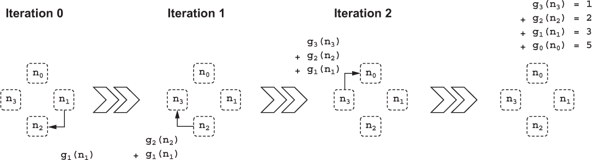

图 8.4 在一个由四个节点组成的环中将梯度（求和）减少到节点 0，这是一个分布梯度的全局规约算法，用于在节点之间分发梯度。

列表 8.5 中的源代码提供了图 8.4 描述的逻辑的 Python 伪代码实现。在实现中，使用了 NODES 变量，该变量是使用训练数据集中训练示例的数量（常量 TRAINING_DATASET_SIZE 的值）与多节点集群中一个节点的内存中适合的训练示例的数量（IN_MEMORY_SHARD_SIZE 的值）之间的关系定义的。使用地板除法运算符//以确保 NODES 常量的值被设置为整数值，因为它稍后将用作 Python 范围操作的参数。

列表 8.5 Python 伪代码，以说明梯度减少到节点 0

```py
NODES = \
  TRAINING_DATASET_SIZE // IN_MEMORY_SHARD_SIZE       ❶

GRADIENTS = [5., 3., 2., 1.]                          ❷

node_to_gradients = \
  dict(zip(range(NODES), GRADIENTS))                  ❸

for iter in range(NODES - 1):                         ❹
  node = (iter + 1) % NODES                           ❺
  grad = node_to_gradients[node]                      ❻
  next_node = (node + 1) % NODES                      ❼

  # simulate "sending" of the gradient value
  # over the network to the next node in the ring
  node_to_gradients[next_node] += grad                ❽
```

❶ 计算训练数据集所需的节点数量。

❷ 为演示分配任意的 GRADIENT 值，每个节点一个。

❸ 创建一个字典来跟踪节点计算的梯度。

❹ 执行 NODES - 1 次通信迭代。

❺ 从节点 iter+1 开始，以便在 NODES-1 后...

❻……迭代，节点 0 累积梯度。

❼下一个节点的标识符结束了环。

❽在节点对梯度进行累积。

一旦代码执行完毕，打印 node_to_gradients 字典的值。

```py
print(node_to_gradients)
```

输出结果：

```py
{0: 11.0, 1: 3.0, 2: 5.0, 3: 6.0}
```

其中键 0 对应于预期梯度，计算的 *n*[0]，值为 11，基于累积梯度 5+3+2+1。此外，请注意，由于图 8.4 不包括对*n*[0]以外的任何节点的梯度累积，因此 *n*[1]到*n*[3]的梯度保持不变。即将介绍的部分将解释如何确保在环中的所有节点上累积相同的梯度。

在三（节点-1）次迭代的第一次（在图 8.4 中以基于零的索引显示为迭代 0）中，节点*n*[1]发送并且节点*n*[2]接收节点*n*[1]在开始迭代 0 之前计算的梯度值 *g*1。由于在环中的通信目的是为了到达累积梯度，一旦接收 *g*1 梯度值，*n*[2]节点可以直接累积（加到）梯度值，以确保重用内存来存储累积梯度值：*g*1+*g*2。例如，如果每个节点上的每个梯度张量都是 400 MB，那么在环中的节点之间传输 400 MB 的数据，并且每个节点消耗 400 MB 的内存来存储累积梯度值。到迭代 0 结束时，节点*n*[2]累积了添加（即使用求和操作减少的）梯度。

因此，在第二次迭代（在图 8.4 中标记为迭代 1）期间，累积的梯度值从节点*n*[2]发送到节点*n*[3]，导致在第二次迭代结束时在节点 *n*[3]上累积的梯度值*g*1+*g*2+*g*3。

在这个示例中的最后一次迭代（在图 8.4 中标记为迭代 2）完成了对节点*n*[0]上的梯度的累积，将在这次迭代中计算的节点*n*[0]上的梯度* g*0 加到从*n* [3]收到的累积梯度上。由此得到的梯度，包括*g*0+*g*1+*g*2+*g*3，足以让*n*[0]计算出下一个优化步骤的模型参数值，这个步骤是由集群中的每个节点执行的梯度下降过程。

虽然图 8.4 和列表 8.5 中示例的三次迭代实现了梯度的累积（reduce 步骤）到单个节点，但要使分布式数据并行梯度下降工作，环中的每个节点必须访问整个累积梯度：*g*0 + *g*1 + *g*2 + *g*3。除非每个节点都可以访问累积梯度，否则节点无法执行使用累积梯度更改模型参数值的梯度下降步骤。即将介绍的各节将基于列表 8.5 中的 reduce 步骤来解释整个分布式梯度下降算法的 reduce-all 阶段。

## 8.4 理解基于环形的分布式梯度下降

虽然第 8.3 节描述的天真的基于环的 reduce 操作可以消除对参数服务器的需求，并确保梯度值在环形多节点集群中的各个计算节点上被减少（累积），但它存在一些缺点。随着训练数据集的增长（这是可以预料的），集群中的节点数量必须增长以跟上。这也意味着集群需要的总带宽必须随着节点数量的增加而增长，因为每个节点在每次迭代期间都必须将整个梯度发送给环中的下一个节点。在本节中，您将了解基于环形分布式数据并行算法（例如，著名的 Horovod 算法）如何在规模化情况下帮助有效利用带宽，其中训练节点的数量和训练示例的数量都增加。

Horovod 算法可以支持训练数据集的增长（以及集群中节点的数量），同时保持带宽需求恒定或甚至降低带宽要求。为了支持这一点，Horovod 依赖于两个分离且独立的环形通信阶段：（1）reduce-scatter 和（2）all-gather。在两个阶段中，Horovod 不是在节点之间发送/接收整个梯度数据，而是只通信梯度的一个单一段落，其中默认情况下段落的大小是梯度大小乘以 ，其中*NODES*是环集群中的工作节点数。因此，增加工作节点的数量以与训练数据集大小成比例地减少节点间通信的带宽需求。

那么梯度的 *段* 是什么？你可以把每个段视为梯度的逻辑分区，如图 8.5 所示。在图中，节点 *n*[0] 计算的梯度 *g*[0]，基于训练数据集分片 [0:250][0]（其中 [0:250] 是 Python 切片表示法），依次被分成 NODES 段，以便默认情况下，每个段都存在大致相等数量的梯度值。继续之前的例子，梯度占据了 400 MB 的数据量（例如模型参数的 32 位浮点梯度值的每 100,000,000 个字节为 4 字节），每个段是 100 MB 的互斥逻辑分区的相同模型张量。请注意，在这种情况下，由于分片是由节点 *n*[0] 计算的，因此每个四个段中的 *i* 都使用 *s[i]*(*n*[0]) 进行注释。

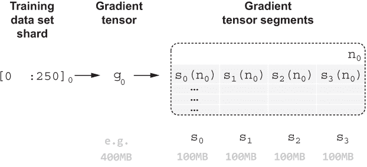

图 8.5 Horovod 用于节点间通信的梯度段

还要注意，虽然在图 8.5 的框架的水平轴上不能累积（相加）段，但是可以沿垂直轴累积段。此外，图 8.5 段框架下方显示的段 *s[i]* 对应于每个节点计算的相应段的累积。例如，*s[0]* 等于 *s[0]*(*n*[0]) + *s[1]*(*n*[1]) + *s[2]*(*n*[2]) + *s[3]*(*n*[3])。因此，图 8.5 框架下方显示的 *s*[0]*s*[1]*s*[2]*s*[3] 段等同于将累积梯度 *g*[0] + *g*[1] + *g*[2] + *g*[3] 逻辑分割为段所需以执行梯度下降的优化步骤。

就像在列表 8.5 中介绍的基于环形减少步骤一样，本章的其余部分使用 Python 伪代码来解释 Horovod 算法。请回忆，对于一个分布式数据并行算法（如 Horovod）要正确工作，环形集群中的每个节点必须初始化具有模型参数的相同副本。在列表 8.6 中，Python 张量列表 W 被用来表示相同的模型。请注意，W 中的每个张量都是使用来自 w_src 的值初始化的，w_src 是从标准正态分布中抽样的伪随机值张量。

列表 8.6 W 存储模型张量的相同副本

```py
pt.manual_seed(42)
w_src = pt.randn((4,))
W = [pt.tensor(w_src.detach().numpy(),
                requires_grad=True) for _ in range(NODES)]
```

为了重复使用列表 8.4 中的训练数据集张量 X_train 和 y_train，Horovod 算法的以下解释创建了一个 PyTorch DataLoader，它将训练数据集分成每个 IN_MEMORY_SHARD_SIZE 记录的分片。不要被列表 8.7 中 DataLoader 的 batch_size 参数所迷惑；虽然该参数用于分割源 TensorDataset，但是单个分片不会作为批量用于更新模型的参数。

列表 8.7 使用 PyTorch DataLoader 进行分片的梯度下降步骤

```py
from torch.utils.data import TensorDataset, DataLoader
train_dl = DataLoader(TensorDataset(y_train, X_train), \
                      batch_size = IN_MEMORY_SHARD_SIZE,
                      shuffle = False)

for node, (y_shard, X_shard) in zip(range(NODES), train_dl):
  y_est = forward(W[node], X_shard)
  loss = \
    (IN_MEMORY_SHARD_SIZE / TRAINING_DATASET_SIZE) * mse(y_shard, y_est)
  loss.backward()
```

代码执行完毕后，

```py
[W[node].grad for node in range(NODES)]
```

应该输出

```py
[tensor([ -0.1776, -10.4762, -19.9037, -31.2003]),
 tensor([  0.0823, -10.3284, -20.6617, -30.2549]),
 tensor([ -0.1322, -10.9773, -20.4698, -30.2835]),
 tensor([  0.1597, -10.4902, -19.8841, -29.5041])]
```

代表环形集群中每个节点的模型梯度的张量。

请注意，在使用列表 8.7 中 for 循环中的代码对每个节点执行梯度下降的前向和后向步骤之后，Horovod 算法必须执行两个基于环形网络的阶段，以便将累积梯度通信到环中的每个节点。第一个阶段称为 *reduce-scatter*，在第 8.5 节中进行了解释，第二个阶段称为 *all-gather*，在第 8.6 节中进行了解释。

## 8.5 阶段 1：Reduce-scatter

本节介绍了 Horovod 的 reduce-scatter 阶段，假设环形集群中的每个节点都使用模型参数的相同副本进行初始化。本节继续使用列表 8.7 中的示例，其中模型参数的相同副本存储在 W[node] 中，并且每个节点完成了梯度下降的前向和后向步骤，导致的梯度值保存在 W[node].grad 中。通过本节的结束，您将了解 Horovod 的 reduce-scatter 阶段如何确保环中的每个节点最终获得累积梯度 *g*[0] + *g*[1] + *g*[2] + *g*[3] 的不同段。

Horovod 的第一个阶段称为 reduce-scatter，在每个节点都完成基于数据集的节点特定分片的梯度计算后开始。如前一节所述，每个节点逻辑上将计算的梯度分成 NODES 个段。此阶段的第一次迭代（共三次迭代）显示在图 8.6 中，其中图的顶部显示，在阶段开始时，每个节点 *n*[i] 存储着特定于分片的段，*s*0 到 *s[NODES-1]*(*n*[i])。 

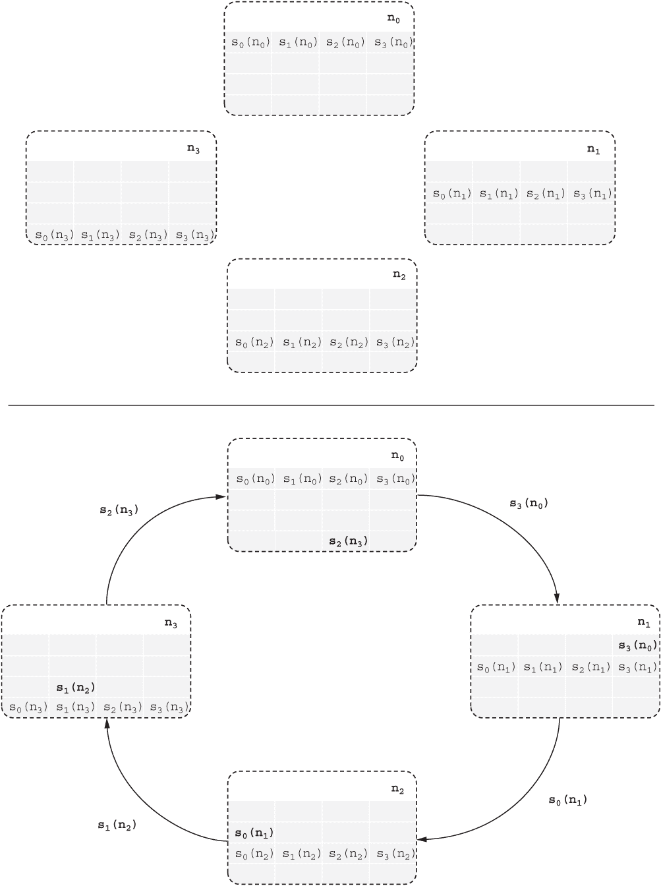

图 8.6 第一次 reduce-scatter 阶段的迭代启动了跨节点的梯度段传输。

由于每次迭代 reduce-scatter 仅将一个段的数据发送到后续节点，因此在第一次迭代（如图 8.6 底部箭头所示）中，节点 *n[i]* 将段 *s*[(i - 1)] % NODES(*n*[i]) 转发给后续节点。在第一次迭代结束时（图 8.6 底部），每个节点 *n[i]* 累积了一个段 *s*(i - t - 1) % NODES % NODES]) + *s*(i - t - 1) % NODES，其中 t=1 代表第一次迭代。

在后续的迭代中，每个节点将上一次迭代中累积的段发送给后继节点。例如，在第二次迭代（如图 8.7 所示）中，节点*n*[1]发送段*s*[3]（*n*[0] + *n*[1]），节点*n*[2]发送段*s*[0]（*n*[1] + *n*[2]），一般来说，对于第 t 次迭代，节点*n*[i]发送累积的段*s*[(i - t)] % NODES(*n*[i])。由于在具有四个节点的示例中，只需要三次迭代来减少散布段，因此图 8.7 的底部显示，到第二次迭代结束时，每个节点上只缺少每个段的一部分：由*s*(i + 1) % NODES 指定的段。

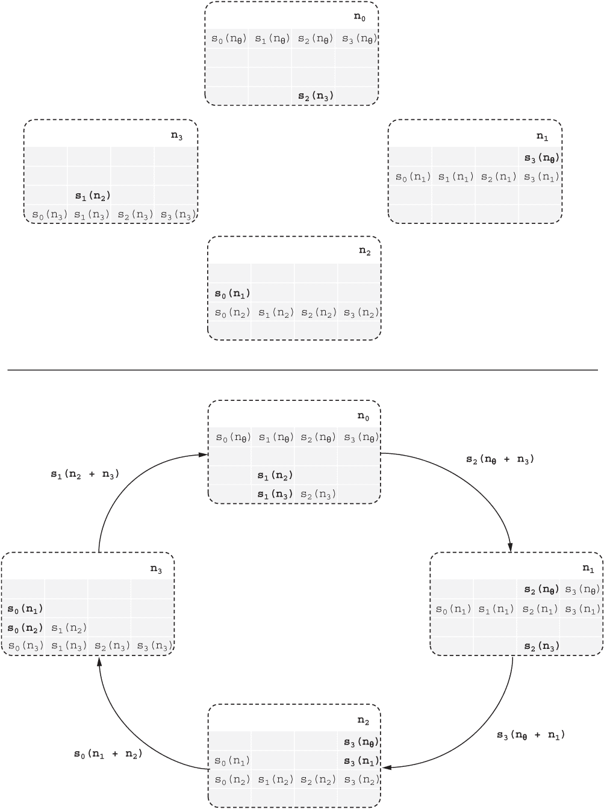

图 8.7 第二次减少散布迭代传播累积梯度。

这个缺失的部分在示例的第三个和最后一个迭代中填补，即在迭代结束时（图 8.8 的底部），每个节点*n[i]*都累积了整个段*s[i]*。例如，注意在图 8.8 中，*n*[0]以*s*[0]结束了本阶段的最后一次迭代，节点*n*[1]以*s*[1]结束，依此类推。

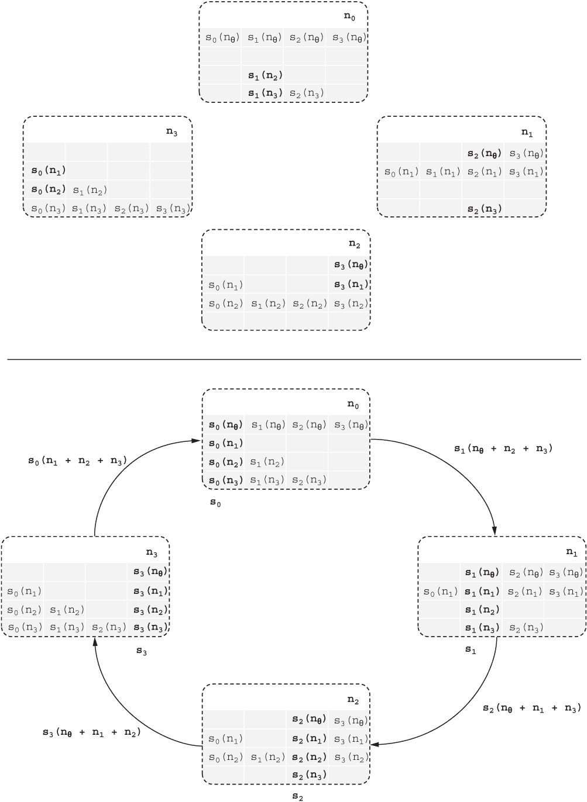

图 8.8 第三次减少散布迭代完成四节点环的梯度累积。

列表 8.8 减少散布阶段的 Python 伪代码

```py
for iter in range(NODES - 1):
  for node in range(NODES):
    seg = (node - iter - 1) % NODES     ❶
    grad = W[node].grad[seg]            ❷

    next_node = (node + 1) % NODES
    W[next_node].grad[seg] += grad      ❸
```

❶ 第一个段被累积到第一个节点。

❷ 检索与节点和段 seg 对应的梯度值。

❸ 在环中的下一个节点上累积梯度段的值。

在列表 8.8 中的代码执行完毕后，可以使用以下方式输出结果梯度

```py
print([f"{W[node].grad}" for node in range(NODES)])
```

应该打印出

```py
['tensor([ -0.0679, -31.9437, -39.7879, -31.2003])',
 'tensor([  0.0823, -42.2722, -60.4496, -61.4552])',
 'tensor([-4.9943e-02, -1.0977e+01, -8.0919e+01, -9.1739e+01])',
 'tensor([ 1.0978e-01, -2.1468e+01, -1.9884e+01, -1.2124e+02])'].
```

请注意，如预期的那样，梯度值分散在节点之间，以便*n*[0]存储累积梯度的段*s*[0]，*n*[1]存储段*s*[1]，依此类推。一般来说，减少散布后的梯度累积段可以使用以下方式打印出来

```py
print([f"{W[node].grad[node]}" for node in range(NODES)]),
```

它在每个节点上输出累积段的值：

```py
['-0.06785149872303009', '-42.27215576171875', '-80.91938018798828', '-121.24281311035156']
```

图 8.9 的插图总结了当减少散布环由四个节点组成时，列表 8.8 中的代码的情况。

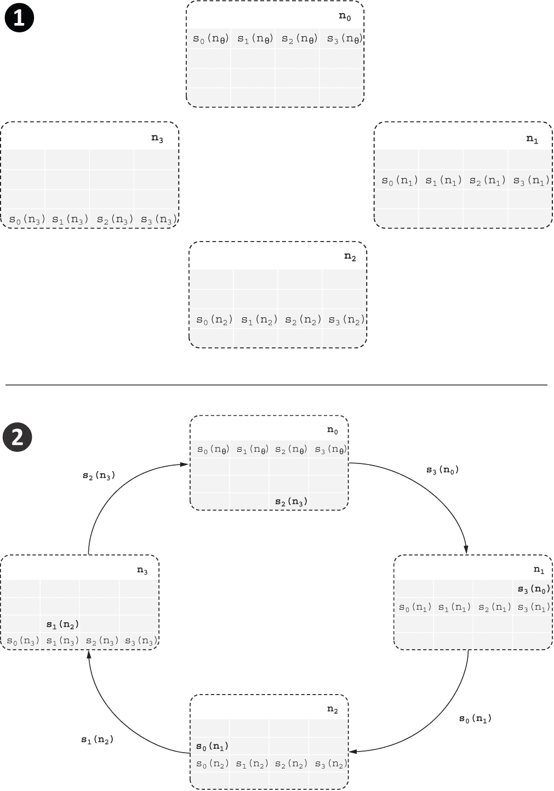

图 8.9a 减少散布的迭代

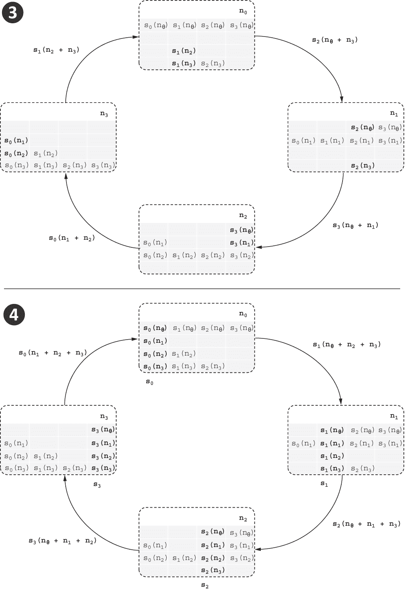

图 8.9b 减少散布的迭代

## 8.6 阶段 2：全聚合

本节介绍 Horovod 算法的第二个和最后一个阶段：全聚合。在本节中，您可以观察到来自减少散布阶段的累积梯度的散布段如何被收集或发送到环中，以便在阶段结束时，每个节点都存储整个累积梯度*g*[0] + *g*[1] + *g*[2] + *g*[3]。这意味着在本阶段结束时，逻辑环中的每个节点都可以执行梯度下降的优化步骤，并计算出模型参数的下一个迭代，以进行进一步的训练。

鉴于减少-分散阶段执行了有选择性地累积（减少）梯度段值的细微步骤，全收集的实现，即第二个和最后一个阶段，更容易理解。使用与减少-全部算法介绍的方法，此阶段仅涉及从一个节点发送累积的段到下一个节点。与 Horovod 算法的减少-分散阶段一样，全收集阶段在集群的逻辑环网络中进行节点到节点通信，共需要 NODES - 1 次迭代。

图 8.10 中四个节点的三次迭代分别表示为图的左上、右上和右下象限。图的左下角显示了节点在完成 Horovod 算法的所有步骤后集群中的最终状态。请注意，每个节点上的梯度段（表示为 *s*[0] 到 *s*[3]）存储了从训练数据集的相应分片计算出的整个累积梯度（表示为 *g*[0] + *g*[1] + *g*[2] + *g*[3]）。

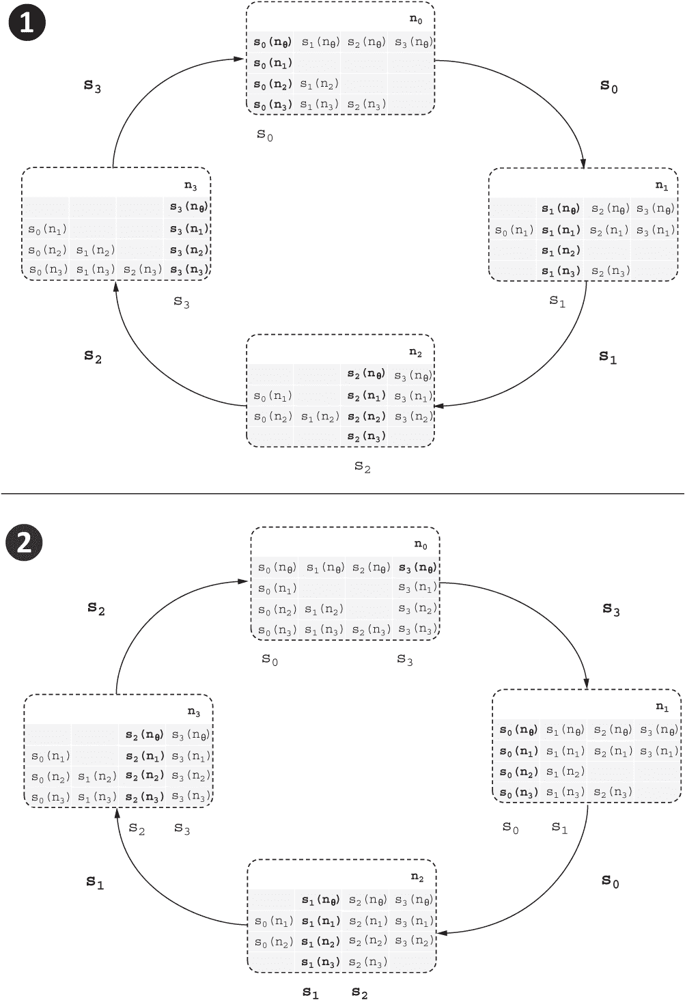

图 8.10a 全收集的迭代

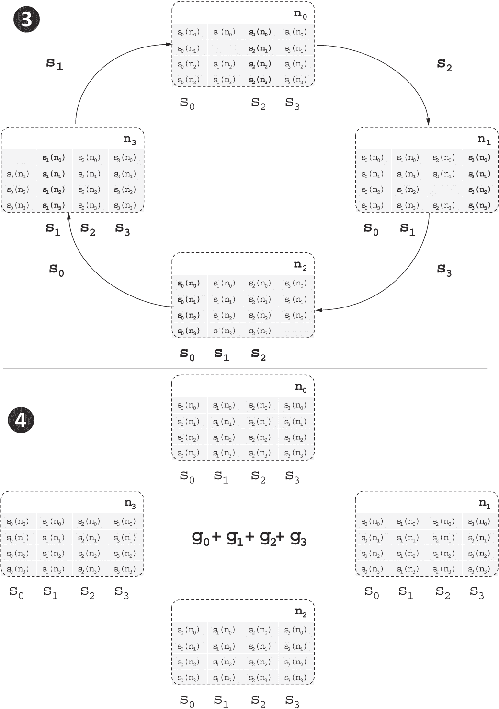

图 8.10b 全收集的迭代

图的左上象限指出，在第一个迭代的开始，示例中四个节点的状态是 *n*[0] 存储了累积梯度的段 *s*[0]，等等。在该阶段的第一次迭代（左上象限）中，每个节点仅向环中的后继节点发送它存储的累积段，覆盖并替换后继节点中存储的任何先前的段值。

列表 8.9 全收集阶段的 Python 伪代码

```py
for iter in range(NODES - 1):
  for node in range(NODES):
    seg = (node - iter) % NODES       ❶
    grad = W[node].grad[seg]

    next_node = (node + 1) % NODES
    W[next_node].grad[seg] = grad     ❷
```

❶ 从第一次迭代的第一个节点开始。

❷ 在环中的下一个节点上存储段的梯度值。

在第二次迭代开始时（图 8.10 的右上象限），每个节点恰好存储两个完整的累积梯度段。在这次迭代和剩余的迭代中，每个节点将在上一次迭代中接收的段（例如，在第二次迭代中，*n*[0] 接收了 *s*[3]）发送到环中的后继节点。最后一次迭代（右下象限）完成了将梯度的剩余段传输到集群中的节点。在此阶段结束时（左下象限），环集群中的每个节点上都可以获得累积梯度 *g*[0] + *g*[1] + *g*[2] + *g*[3]。

此时，在每个节点上打印模型的梯度，

```py
print([f"{W[node].grad}" for node in range(NODES)]),
```

为环中的每个节点输出了四个相同的梯度值：

```py
['tensor([-6.7851e-02, -4.2272e+01, -8.0919e+01, -1.2124e+02])',
 'tensor([-6.7851e-02, -4.2272e+01, -8.0919e+01, -1.2124e+02])',
 'tensor([-6.7851e-02, -4.2272e+01, -8.0919e+01, -1.2124e+02])',
 'tensor([-6.7851e-02, -4.2272e+01, -8.0919e+01, -1.2124e+02])']
```

列表 8.10 Horovod 基于环的分布式梯度下降算法

```py
import torch as pt
from torch.utils.data import TensorDataset, DataLoader

IN_MEMORY_SHARD_SIZE = 250
TRAINING_DATASET_SIZE = 1000
NODES = TRAINING_DATASET_SIZE // IN_MEMORY_SHARD_SIZE

FEATURES = 4
pt.manual_seed(42)
w_src = pt.randn((FEATURES,))
W = [pt.tensor(w_src.detach().numpy(),
                requires_grad=True) for _ in range(NODES)]

def forward(w, X):
  return X @ w

def mse(y_est, y):
  err = y_est - y
  return (err ** 2).mean()

X_train = pt.distributions.multivariate_normal.MultivariateNormal(
    pt.arange(FEATURES, dtype=pt.float32),
    pt.eye(FEATURES)).sample((TRAINING_DATASET_SIZE,))
y_train = X_train @ (pt.arange(FEATURES, dtype=pt.float32) + 1)
train_dl = DataLoader(TensorDataset(y_train, X_train), \
                      batch_size = IN_MEMORY_SHARD_SIZE,
                      shuffle = False)

EPOCHS = 1000
LEARNING_RATE = 0.01
for epoch in range(EPOCHS):

  #compute per shard gradients on each node
  for node, (y_shard, X_shard) in zip(range(NODES), train_dl):
    y_est = forward(W[node], X_shard)
    loss = \
      (IN_MEMORY_SHARD_SIZE / TRAINING_DATASET_SIZE) * mse(y_shard, y_est)
    loss.backward()

  #horovod phase 1: reduce-scatter
  for iter in range(NODES - 1):
    for node in range(NODES):
      seg = (node - iter - 1) % NODES
      grad = W[node].grad[seg]

      next_node = (node + 1) % NODES
      W[next_node].grad[seg] += grad

  #horovod phase 2: all-gather
  for iter in range(NODES - 1):
    for node in range(NODES):
      seg = (node - iter) % NODES
      grad = W[node].grad[seg]

      next_node = (node + 1) % NODES
      W[next_node].grad[seg] = grad

  #perform a step of gradient descent
  for node in range(NODES):
    W[node].data -= LEARNING_RATE * W[node].grad
    W[node].grad = None

print([f"{W[node].data}" for node in range(NODES)])
```

这应该输出恢复的多变量线性回归系数：

```py
['tensor([1.0000, 2.0000, 3.0000, 4.0000])',
 'tensor([1.0000, 2.0000, 3.0000, 4.0000])',
 'tensor([1.0000, 2.0000, 3.0000, 4.0000])',
 'tensor([1.0000, 2.0000, 3.0000, 4.0000])']
```

## 概要

+   分布式数据并行训练是一种分布式梯度下降的方法，其中规模扩展的集群中的每个节点都使用训练模型的相同副本，但是使用训练数据集的专用分片。

+   反向模式累积自动微分的梯度累积特性使得梯度下降可以缩小到有限内存节点，或者扩展到超出内存的数据集。

+   基于遗留参数服务器的分布式数据并行梯度下降方法需要昂贵的广播式网络操作，并且在带宽限制下不易扩展。

+   Horovod 是一个可伸缩且带宽高效的算法，用于基于两个阶段的基于环形网络操作的分布式数据并行梯度下降：reduce-scatter 和 all-gather。

^(1.)自动微分的这个特性在第五章中有详细介绍。

^(2.)例如，许多深度学习模型都是使用 Kaiming 初始化进行初始化的：[`mng.bz/5K47`](http://mng.bz/5K47)。
