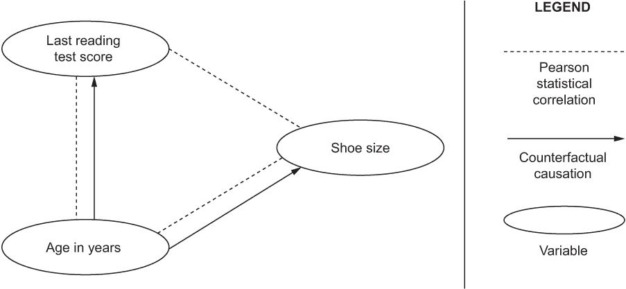
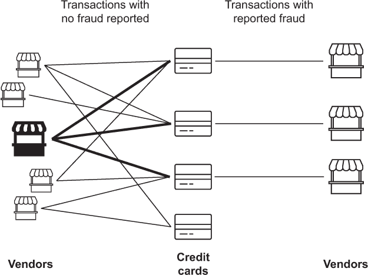
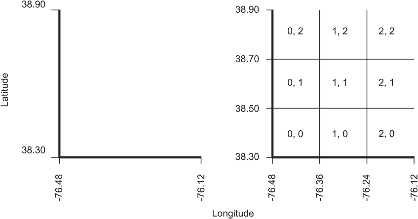

# 第九章：特征选择

本章涵盖

+   了解特征选择和特征工程原则

+   将特征选择原则应用于案例研究

+   基于案例分析磨练特征选择技能

到目前为止，您一直在使用 DC 出租车数据集的原始（原始）数据值作为机器学习模型的特征。 *特征* 是机器学习模型在训练和推断阶段期间使用的输入值或一组值（请参阅附录 A）。 *特征工程* 是选择、设计和实施使用原始数据值的合成（虚构）特征的过程，可以显着提高模型的机器学习性能。 特征工程的一些例子是对原始数据值进行简单的、公式化的转换，例如将任意数字值重新调整到-1 到 1 的范围。 *特征选择*（也称为*特征设计*）是特征工程的初始阶段，是工作的更有创意的部分，涉及指定捕获有关数据集的人类知识或直觉的特征，例如选择衡量出租车行程数据集中每次乘车的上车和下车位置之间距离的特征。

无差别地向项目数据集中添加大量特征可能是一个代价高昂的错误（参见“维度诅咒”问题）。 特征“过度设计”可能导致过拟合以及机器学习模型性能的整体下降。 这引出了一个问题：有哪些指导原则可以帮助选择正确的特征，以避免可怕的特征过度设计？ 本章将使用案例研究来介绍这些原则，并说明如何在实践中应用它们。

本章涵盖了三个案例研究，涉及金融、广告和移动游戏行业。 对于每个案例研究，您将得到一个行业的机器学习项目描述，以及您预期为该项目训练的机器学习模型的高级规范。 然后，您将得到该项目的候选特征描述。 最后，每个案例研究的讨论部分描述了如何应用五个指导原则，以帮助您决定是否应选择候选特征。

## 特征选择的指导原则

本节介绍了五个指导原则，以帮助你为你的机器学习项目选择正确的特征。虽然我没有看到这些原则被作为行业标准编纂，但它们总结了我在选择数据科学、机器学习和深度学习项目特征方面超过十年的经验。本节的其余部分将更详细地解释这些指导原则，以便在第 9.2 节中，你可以将它们应用于案例研究和候选特征的具体示例。根据这些原则，一个候选特征应该是：

+   与标签相关

+   在推断时间之前记录

+   得到丰富的例子支持

+   表达为具有有意义刻度的数字

+   基于项目的专业见解

### 9.1.1 与标签相关

本节教你在评估特征（或潜在特征）与标签之间关系时应考虑哪些因素，以便你可以为你的特征工程工作选择和优先考虑特征。在你决定在机器学习模型训练实验中包含一个潜在特征之前，确保你能够表达一个理由（一种证明），解释为什么这个特征与标签值相关联。表达理由可以帮助你说服自己（在理想情况下，一个公正的观察者），这个特征实际上与你尝试使用机器学习解决的问题相关。当然，有些理由比其他理由更好：“为什么不呢？”并不是一个强有力的特征理由。一般来说，弱理由会导致潜在特征的数量过多，并且与标签的相关性强弱不一。

请注意，对于一个特征有一个理由也很重要，因为候选特征与标签之间的关系可能会根据你的问题而改变。在实践中，改变你用数据集回答的问题可以改变候选特征与标签之间是否存在关系。例如，当估算跨越 DC 的出租车费用时，接送地点之间的距离特征值与出租车费用估算相关。然而，如果你决定不再估算出租车费用，而是决定使用距离特征来估算在 DC 特定时间的特定位置的出租车接送数量，那么这个特征就失去了与标签的相关性。虽然似乎显而易见，一个为不同项目选择的特征在更改标签时可能变得无用，但在实践中，训练数据集和特征存储库被重新使用于机器学习项目，导致意外重复使用无关和潜在有害（如本章的其余部分所示）的特征。

当本节中使用的“相关”一词有不同的含义时，其意义也不尽相同，例如，“统计相关”就是其中一种相关性。正如你所知，统计相关性意味着因果关系可能对特征和标记之间的关系起到作用，也可能不起作用。

考虑一个众所周知的例子：根据标准的皮尔逊统计相关度量，儿童的阅读能力与他们的鞋尺码相关。换句话说，根据经典统计学的说法，如果你想要估算一个孩子的鞋码，你可以使用孩子最近一次阅读测试的分数。当然，在鞋尺码和阅读能力变量之间不存在因果关系，因相关性存在于年龄这一潜在（混淆）变量之间。

鞋尺码估算的例子如图 9.1 所示。注意，孩子年龄与鞋尺码之间的因果关系，以及孩子年龄和阅读成绩之间的因果关系也转化为这些变量对之间的统计相关性。因此，虽然候选特征与标记之间的统计相关性可以作为特征的基线理由，但更强的证明可以基于特征与标记之间的因果关系。

图 9.1 特征可以基于孩子的阅读测试成绩或年龄变量，但基于年龄的特征与鞋尺码之间有更强的相关性，因为年龄与鞋尺码之间存在反事实因果关系。

是否可以区分相关性和因果关系？这取决于你对因果关系的定义。大多数现代机器学习和数据科学从业者和学者在业界和学术界都使用一种称为“反事实因果”的因果关系。¹ 你可以通过回答一个假设性问题来决定候选原因和效应变量之间是否存在反事实因果关系：在其他所有条件相同的情况下，如果一个全能的演员只改变原因，那么结果是否必然改变？注意，这种因果关系在阅读测试成绩和鞋尺码之间的关系中不存在：如果有人干预并改变某个年龄段儿童的平均测试成绩，他们的鞋尺码不会改变。相比之下，用一群年龄更小的孩子代替一群年龄更大的孩子，会导致平均阅读测试分数（假设测试没有经过年龄调整）增加，平均鞋尺码也变大。

当阐述候选特征和标记之间的相关关系时，有助于确定并优先考虑与标记存在反事实因果关系的特征，而不是表明与标记之间存在相关性或不明确关系的特征。

### 9.1.2 推理之前的记录

本节教你如何避免特征选择中的一个常见陷阱：使用在训练时已知但在部署到生产环境后难以获取或难以获取的特征。

您正在考虑的特征值必须在推理时可用，一旦您的机器学习模型处理超出用于创建模型的训练和测试数据集的数据时。这是特征选择的一个重要但经常被忽视的方面，特别是因为训练数据集是回顾性的，通常不包含有关数据值可用顺序的信息。例如，描述公司销售交易历史的训练数据集通常不会捕捉到在关闭销售交易的金额之前，客户的姓名和联系信息是公司可用的这一事实。

使这个问题微妙的是，回顾性地查看过去事件的数据，正如在训练数据集中记录的，事件的顺序可能并不是立即显而易见的，您可能会在推理时无意中使用未来的信息。例如，假设您正在尝试估计新生儿的体重，其中一个候选特征是怀孕的持续时间。

注意：早产儿的体重低于平均水平，而在怀孕 42 周后出生的婴儿平均体重较重，因此，以周数表示的怀孕持续时间似乎是一个有用的选择特征。

在训练数据集中找到怀孕期（以周为单位）的持续时间不足为奇，因为这是一个历史性的衡量标准，在出生时记录是有意义的。但是，如果您正在创建一个模型，以估计怀孕期中途的常规医生探访时新生儿的预期体重，那么出生时的怀孕周数就是未知的。

对新生儿体重估计的示例只是所谓*数据泄漏*问题的一个实例。数据泄漏的其他示例包括在训练、验证和测试数据集之间重复观察。通常，当关于标签值的信息无意中包含或“泄漏”到训练数据集中时，就会发生数据泄漏。数据泄漏的症状包括在训练数据集上膨胀的机器学习模型性能，甚至在部署到生产环境后完全失败。例如，当使用来自著名的泰坦尼克号数据集的特征时，就会出现这个问题，如图 9.2 所示。

在泰坦尼克号数据集的特征子集中，年龄和性别在乘客的生存结果之前是已知的。根据乘客的生存或死亡情况记录了船和尸体特征的值。因此，船和尸体特征会“泄漏”有关生存标签的数据。

推理过去事件的预测是违反直觉的；然而，泰坦尼克号数据集恰恰邀请您这样做。您可以训练一个机器学习模型来预测泰坦尼克号在 1912 年 4 月横渡大西洋时的乘客的二元生存结果（是否幸存）。虽然整个数据集包含 13 个特征和一个标签，但图 9.2 仅显示了与此示例相关的 4 个特征以及标签（生存）。数据集中的生存标签使用值 1 表示乘客幸存，而值 0 表示乘客遇难。年龄特征是数值型的，表示乘客登船时的年龄，而性别特征则限定为男性和女性值，分别使用 1 和 0 表示。船和尸体特征都是分类的，并编码为字符串。船特征存储乘客被救的船的标识符（例如“11”）。尸体特征存储类似“328”的值，指定了遇难乘客的标识符。

为了避免使用“预测”一词带来的违反直觉的含义，在考虑候选特征训练机器学习模型时，将每位乘客的生存结果推断出来是有帮助的。从时间顺序的角度来看，推断基于年龄和性别特征的生存是合理的，因为这两个特征在每位乘客的生存结果之前都存在。图 9.2 使用从年龄和性别特征指向生存标签的箭头来展示这一点。因此，机器学习模型可以训练使用年龄和性别特征，因为这两个特征应该在推断时可用。

相比之下，一旦泰坦尼克号上的乘客幸存或遇难，该乘客就会在救生船上幸存或者以尸体标签结束。图 9.2 使用从生存标签指向尸体和船特征的箭头来展示这一点。尸体和船特征值都不应该用于训练机器学习模型推断泰坦尼克号乘客的生存结果。当然，我们不希望发生类似的事件，因此这样的模型永远不会用于推断除泰坦尼克号乘客之外的任何乘客的生存结果。这个例子的目标是介绍数据集中特征的重要性以及特征之间的时间顺序关系。

在其他情况下，由于法律或伦理原因，在推断时可能无法获得特征值。例如，对于一个总部位于欧盟（EU）的公司，记录求职者的出生日期是完全合法的。如果你在欧盟使用这种类型的人力资源信息来估计求职者接受工作邀约的可能性，求职者的年龄是一个合理的特征选择。然而，一旦你试图在美国应用同样的特征，获取求职者的出生日期可能违法，因为在美国，基于年龄做招聘决定是非法的。此外，泄露有关出生日期的特征，如高中或大学毕业年份，也可能引起企业的法律担忧。因此，如果你试图将在欧盟建立的机器学习系统调整到美国，你应该重新评估培训数据集中的特征是否被你的组织允许使用。正如你可以想象的那样，人力资源数据集可能充满了信息（例如种族或健康记录），但作为机器学习模型的特征则是非法或不道德的。

### 9.1.3 丰富的示例支持

本节探讨了在选择具有太多缺失值或具有太少不同值的特征时可能出现的问题。

简单地通过添加 NaN 或 NULL 值的列将一个特征引入到训练数据集中是非常简单的。虽然这样的特征显然是无用的，但这个例子提醒我们，在增加训练数据集中的特征数量时，更多并不意味着更好。另一个极端情况涉及添加组合起来作为标签的唯一标识符的特征。作为特征工程的最坏情况示例，考虑一个分类问题的训练数据集，其中分类标签有 2^N 个不同的值。由于 N 个二进制特征可以编码 2^N 种可能性，每个标签值可能都可以通过 N 个特征列的二进制值来唯一标识。

当然，在实践中很少会发生特征过度工程的极端情况，但它们可以作为方便的参考点，用于比较你自己的特征工程工作。例如，如果你正在选择一个特征，你是否期望在培训数据集中有显著比例（大于 5%）的特征值不是 NaN？如果你选择了多个特征，这些特征值在一起是否会导致在培训数据集中的标签值具有唯一标识符，而在测试数据集中没有？

要回答这些问题，你需要确保在考虑候选特征时，也要保持对特征缺失值的统计以及每个标签值的特征值集合的交叉乘积计数。

### 9.1.4 用具有有意义的比例表达的数字

本节将教授一个方便的经验法则，用于检查是否将一个特征正确地表达为可用于机器学习算法的数字。

正如你在第一章中了解的那样，本书关注的是从结构化数据集进行有监督机器学习。对于特征工程来说，这意味着如果你计划使用用于训练机器学习模型的原始数据包含视频、图像、音频或自然语言文本等非结构化内容，则在开始进行本书中描述的特征工程步骤之前，必须将相应的非结构化数据值转换为数字表示。这些转换的具体技术，例如自然语言文本的单词嵌入或用于摄影数据的图像分类，超出了本书的范围。

对于特征工程来说，拥有一个由数值组成的项目数据集是前提条件，因为有监督的机器学习模型是对数字（根据附录 A 的定义，可以是连续的或分类的）特征值进行算术操作以估计标签值的序列。但是，即使你的原始数据值是数字（即使用数字表达的），这也不意味着用于训练机器学习模型的相应特征具有有意义的数值比例和大小。如果你不相信，考虑一下字母 A 和 B 在 ASCII 编码标准中分别表示为数字 65 和 66。编码的总和 131（65+66）对应于字符 â（带有抑扬符的 a 字母），这不是一个有意义的结果。

如果你能够熟练应用附录 A 中图表 A.9 中的正式定义到这个例子中，你应该会认识到 ASCII 编码了一个描述 ASCII 字符有限词典的分类变量。一般而言，你可以通过对这些值进行基本的算术操作来检查数值是否可以被视为连续变量，以确认是否能够获得有意义的结果。

### 9.1.5 基于项目的专业见解

本节描述了特征设计、选择和工程最重要的指导原则——它可以对你的机器学习模型的性能产生最积极的影响。

在与具有各自行业深度领域专业知识的主题专家（SMEs）一起开展机器学习项目时，我发现鼓励 SMEs 提出有用特征的最有效方式是问他们：“您会与团队分享哪些信息以帮助他们更好地估计标签值？” 这种谈话方式激励 SMEs 将注意力从机器学习系统设计的复杂性转移到以自然、以人为本的术语思考问题。接下来，我会问：“如何从项目数据集中提取这些信息？”

总之，对这些问题的回答提供了从项目数据集中生成候选特征的途径。例如，假设您正在解决的问题是对世界各地城市拍摄的汽车照片进行分类，以估计照片是否包含该城市的出租车。虽然可以进行复杂的工程演练，提取徽章号码、车牌号码或其他独特的出租车标识符，并将此信息与城市出租车的市政数据集相结合，但有一个更简单的前进路径。了解该城市的人类 SMEs 可以立即通过颜色辨认出出租车，例如在纽约市为黄色或在伦敦为黑色。这个经验法则是 SME 可以轻松与从未去过该城市的人分享，并帮助他们在街上的众多汽车中识别出一辆出租车。

成功的特征选择不仅仅是算法数据处理；它是一种基于对世界的人类常识和对问题领域的洞察的创造性过程，用于机器学习项目。请记住，本节中的案例研究方法可以介绍您了解特征选择的构思和设计基础。但是，这并不能取代将机器学习系统投入生产的真实世界经验。

## 9.2 特征选择案例研究

本节介绍了在金融、广告和移动游戏行业跨越三个不同案例研究中应用监督机器学习的应用。在每个案例研究中，您将了解一个特定行业的机器学习项目，以便了解如何将特征选择原则应用于其他项目。

+   *金融：信用卡欺诈分类*。您正在与一家金融行业公司合作，该公司向客户发行信用卡，并监视客户信用卡交易以寻找欺诈迹象。您监督的机器学习分类模型的目的是估计给定交易是否欺诈或非欺诈。为了使特征工程练习简单化，请假设您正在使用一个平衡的数据集（在生产中并非如此）来处理欺诈与非欺诈示例，因此您的分类器的准确度是一个有意义的机器学习模型性能指标。

+   *广告：在线横幅广告点击估计*。你正在与一家广告行业公司合作，为其客户管理在线广告横幅，并在观看者点击横幅时收费。由于该公司有一款为客户设计横幅广告的工具（例如横幅广告设计师示例，请查看[`github.com/osipov/banner-designer`](https://github.com/osipov/banner-designer)），它拥有横幅广告设计和广告活动期间广告收到的点击数的数据集。你监督的机器学习回归模型的目的是根据横幅设计估计广告应该获得的总点击数。模型的特征应该根据广告内容和设计设置进行选择。

+   *移动游戏：流失预测*。你正在与一家快速增长的移动游戏初创公司合作，帮助他们通过对他们的畅销射击游戏 Clash Legends 进行升级来提高客户满意度。你监督的机器学习回归模型的目的是估计下一周有望从其移动设备上卸载游戏（即流失）的总客户数（游戏玩家）。

## 9.3 使用指导原则进行特征选择

在这一部分中，针对第 9.2 节的每个案例研究，都提出了几个建议的特征，并讨论了是否应该选择该应用程序。请注意，对于每个案例研究，使用领域知识和一些常识有助于决定是否选择该特征。

### 9.3.1 与标签相关

这一部分教授了评估候选特征所需的概念，即它们与标签的关系有多强，以便您可以优先选择更有效的特征。

**案例研究：** 信用卡欺诈分类

**特征：** 在交易中使用信用卡购买同一供应商的次数

**讨论：** 一笔欺诈性信用卡交易可能涉及未经授权的购买。例如，欺诈者可能使用被盗的信用卡从欺诈者拥有的虚假在线商店购买商品，或者从没有视频监控或保留不良记录的实体供应商购买商品。相反，如果卡在交易中多次用于从供应商购买且没有欺诈报告的情况，则关联性可能较低。对于这个特征，关联应该是明显的，并且应该选择该特征用于模型。

**特征：** 在交易期间信用卡插入信用卡阅读器的毫秒数

**讨论：**这是一个技术性的信息示例，机器学习从业者通常可以获得这些信息，但却不能转化为模型的重要特征。注意，使用信用卡进行实体交易时，有时卡片会很快取出，而有时卡片会停留在读卡器中较长时间。只要交易成功完成，就没有这个特征与某个交易是否欺诈之间的关联。尽管你可能会认为，一个欺诈者很可能窃取了一批卡，并在进行欺诈交易时迅速轮换使用它们，但请记住，模型的目的并不是对一批交易进行分类，而是必须对任何单一的任意交易进行分类。大多数交易都是非欺诈性的，并涉及各种各样的信用卡读卡器和许多用户，他们可能会将卡片在读卡器中停留任意长的时间。在这种情况下，并没有明显的关联选择这个特征。

**特征：**交易中供应商的业务类别

**讨论：**众所周知，在美国，盗取的信用卡通常会在加油站进行小额购买，以确认卡片的正常使用。尽管在特征选择时可能不知道其他关联性，但机器学习的应用可能会揭示供应商特定业务类别与欺诈交易之间的关联。

**特征：**信用卡的过期日期

**讨论：**如果这个候选特征仅仅捕捉了卡的过期月份，而卡片的过期月份大致上有相同的几率，那么就没有理由相信这个特征和欺诈之间存在关联。此外，仅仅捕捉过期月份和年份并不意味着伪造交易发生在一个过期的卡上：当卡到期时，是不会发生交易的，所以不需要将其归类为欺诈或非欺诈。换句话说，没有理由相信欺诈者能够以某种方式盯上在十二月过期的卡而不是一月过期的卡。然而，在美国，从邮箱里盗取信用卡存在潜在的欺诈交易的可能性。这意味着你可以选择一个更复杂的特征，来捕捉交易日期和卡的到期日之间的差异，以便在发生欺诈交易靠近卡发放日期的时候进行检测，例如卡到期前两到五年。

**案例研究：在线横幅广告点击预估**

**特征：**横幅广告中商品的价格

**讨论：** 这是可以从广告中选择的最明显的特征之一。商品的价格很可能是决定广告查看者是否对广告感兴趣并点击横幅的最重要因素。鉴于这种关联的强度，这应该是你回归模型的优先特征。

**特征：** 横幅广告中文本的字体类别

**讨论：** 在这种情况下，该特征基于广告中使用的字体的命名类别，例如 Times New Roman 或 Comic Sans。要描述这个候选特征与标签之间的关联，请记住设计元素（如字体）会引发观众的情绪反应。由于某些字体可能更具吸引力，因此捕捉广告中使用的字体类型的分类特征可以模拟字体引发的参与感与广告点击总数之间的微妙关联。当然，这个特征应该与广告的其他设计元素一起使用，包括内容。例如，选择 Comic Sans 来广告小丑服装可能会比将该字体用于财富管理广告更容易产生更多点击。

**特征：** 横幅广告上显示的剩余库存商品数量

**讨论：** 你一定曾在某个在线零售网站购物时看到过类似“仅剩三件”的消息，位于你想购买的商品旁边。那么，选择一个指示横幅广告上显示的剩余商品数量的特征是否合适呢？由于你一定在真实的横幅广告上看到过这样的消息，你可能会倾向于选择这个特征，但是这个特征与标签之间的关联是什么呢？在这种情况下，关联与广告查看者在看到广告商品的有限库存后可能产生的更强烈的紧迫感有关。紧迫感可能会转化为更高的点击率，这正是你试图捕捉的。

**特征：** 库存系统报告的广告商品数量

**讨论：** 尽管你可能会认为商品的低库存水平是商品受欢迎程度的代理，表明这是一种备受追捧的商品，但你应该从许多不同横幅广告跨多个广告系列的角度思考这个特征。例如，玩具汽车的库存量与实际汽车的库存量以及纸张的库存量不同。此外，广告查看者对于广告商品的实际库存数量一无所知，因此点击广告的决定与实际库存商品数量之间没有关联。

**案例研究：流失预测**

**特征：** 客户的邮政编码

**讨论：** 玩家的地理位置与他们在下一个季度流失的潜力可能有各种各样的联系。一些原因是技术性的：也许游戏服务器基础设施使用的网络基础设施会使美国东南部的邮政编码产生更高的延迟（因此增加了不好的体验），而与加州湾区的客户相比。其他原因可能来自人口统计学：与游戏的“甜点”相比，一些邮编有较老或较年轻的人口。

**特征：** 每月花费在服务上的美元金额

**讨论：** 由于移动游戏通常包括每月循环订阅价格以及各种选项（例如：花钱购买强化道具，玩家角色装饰和其他选项来在其他玩家中脱颖而出），因此玩家在游戏中花费的金额是其投入程度的代表，也是其投资程度的衡量标准。因此，花费的金额与下一个季度流失的可能性之间存在复杂的关系。例如，不在游戏上花钱可能意味着玩家失去了兴趣，更有可能卸载游戏。另一方面，如果玩家过度投入，花费过多的巨额款项（例如，处于前 0.1%的百分位数），他们也很可能因游戏过度消磨时间而精疲力尽，从而卸载他们的设备上的游戏。

**特征：** 距下一次游戏公司纳税日期的天数

**讨论：** 美国的公司必须向美国税务局提交季度和年度纳税申报表。令人惊讶的是，许多公司注意到了纳税日期和客户流失的变化之间的相关性。尽管公司内部分析师可能会注意到并报告此相关性，但您应该对此协会持怀疑态度：玩家在卸载日期时是否甚至知道这些日期？如果存在相关性，更有可能是在月底，当很多人回顾他们的月度支出并决定削减不必要的物品时。由于美国税务局的纳税申报日期与许多人重新评估他们的支出的时间重合，因此这可能表现为美国税务局时间表和客户流失之间的虚假相关性。

**特征：** 订阅游戏的周数

**讨论：** 游戏的许多卸载发生在玩家第一次安装游戏后不久，然后决定放弃它。

### 9.3.2 推理时间之前记录

本节介绍了数据泄漏的概念，它可能会微妙地破坏您的机器学习模型的性能，并说明了有效的特征选择如何帮助您避免这些问题。

**案例研究：信用卡欺诈分类**

**特征：** 在该店之前使用过该卡

**讨论：** 此信息应在推理时可用，因为通过实体卡阅读器进行的实体卡交易将被分类不同，并为每笔交易记录适当的信息。

**特征：** 交易中售出的商店商品是新进货的商品

**讨论：** 如果你进行过信用卡购买，你会知道，在交易级别，购买的详细信息对于发卡公司是不可用的。例如，如果你在杂货店购买并购买了一种新口味的可口可乐，信用卡公司无法将此信息与商店的其他购买区分开来；所有商品只是被合并成一笔费用，所以这对你的机器学习模型来说不是一个好的特征。

**特征：** 交易中销售的商品类别

**讨论：** 这可能在推理时可用，也可能不可用。例如，如果交易是汽油购买，那么类别是明显的。在其他情况下，当购买是在诸如 Target 或 Walmart 之类的大型零售商处进行时，存在成千上万种不同的商品类别，这些信息在推理时是不可用的。

**特征：** 使用信用卡在实体（而不是在线）位置消费

**讨论：** 此信息应在推理时可用，因为通过实体卡阅读器进行的实体卡交易将被分类不同，并为每笔交易记录适当的信息。

**案例研究：在线横幅广告点击量估算**

**特征：** 使用折扣码购买的商品总数

**讨论：** 尽管此信息应在运行活动的公司的数据仓库中在活动结束后可用，但此信息在推理时不可用。

**特征：** 在过去 30 天内使用折扣码购买的商品数量

**讨论：** 如果运营广告的公司维护有关折扣码使用次数的交易数据，那么可以维护一个*滑动窗口*，记录过去 30 天的数据，并为任何给定的交易计算这个值。此外，通过预测横幅广告上折扣码的点击次数，可以使用这个每日值更好地估计总横幅广告点击次数。

**特征：** 查看了有关该商品的横幅广告的顾客数量

**讨论：** 对于在线横幅广告，信息应该来自数据仓库或数据分析源。

**特征：** 制造商广告库存中的商品数量

**讨论：** 故意选择这个候选特征，引发一个发人深省的关于潜在特征和广告参与度的讨论。请记住，训练数据集是基于过去广告活动的数据和实际的横幅广告点击次数。虽然您可能拥有关于广告活动中使用的项目的历史库存数据（在广告被查看时），但是否应该将此数据用于机器学习模型的特征？尽管您可能会认为低库存水平表示一个受欢迎或需求量大的项目，但您应该从许多不同横幅广告的广告活动的角度考虑该特征。您无法建立合理的关联来使用此特征。此外，在运行时（执行推断或产生估计时）获得此特征的值可能是一个技术挑战，这可能超过了通过尝试此关联获得的价值。

**案例研究：流失预测**

**特征：** 游戏中总共花费的分钟数

**讨论：** 请注意，在描述此特征时使用词语 *总* 可能会导致混淆。对于卸载游戏的人来说，总数是指安装游戏的整个时间段内花费的分钟数。相比之下，对于没有卸载游戏的人来说，总数描述的是他们的数据被记录在训练数据集中的时点之前的分钟数。一旦清楚了这个双重解释的可能性，也就清楚了不应使用此特征，因为在推断时不可能确定从未取消订阅或卸载游戏的玩家的游戏总分钟数。

**特征：** 过去 28 天内玩游戏的总分钟数

**讨论：** 通过微小的变化，限制对过去 28 天内游戏时间的测量，可以使用前一特征的关键思想。无论玩家是否在下个月流失，都可以测量他们过去 28 天的游戏活动，并将其用作训练和推断的特征。

**特征：** 客户提供的卸载原因

**讨论：** 当玩家卸载游戏时，他们可以指定反馈，说明他们为什么决定卸载。显然，这些信息仅适用于已卸载游戏的玩家，并且只有在他们卸载游戏后才可用。因此，在推断时不可用，不应用于训练机器学习模型。

**特征：** 流失前三个月客户满意度得分

**讨论：** 如果客户满意度是随机收集的，涵盖了已卸载游戏的玩家以及继续玩游戏的玩家，那么这是一个有用的特征，可以用于推断。

### 9.3.3 丰富的例子支持

本节提供了候选特征的示例，这些特征可能或可能不足以训练机器学习模型，以指导您在实际示例中使用此原则。

**案例研究：信用卡欺诈分类**

**特征：** 持卡人地址和商家地址之间的距离

**讨论：** 拥有有关持卡人地址和交易发生地点之间距离的信息在欺诈分类时可能很有用。但是，要使用此特征，从业者需要评估在实践中是否有此特征的示例。除非客户在交易时已积极地进行了地理编码以测量距离，否则不应期望有足够的此特征示例。

**特征：** 持卡人地址和商家地址的邮政编码是否相同

**讨论：** 请注意，与试图使用地理编码估算持卡人和商家位置之间距离的特征不同，可以通过检查商家和持卡人邮政编码是否匹配的特征来支持客户的历史交易数据。由于每笔金融交易都应具有此特征，因此应该有大量关于此特征的示例。

**特征：** 在商家处使用过卡片

**讨论：** 金融公司会为给定卡片维护一份交易历史记录，因此可以检查以前的交易，以确定该卡片是否在特定商家处使用过。缺少与商家的交易表明该卡片未在商家处使用过，因此对于数据集中的每笔交易，可以为此特征分配真值或假值。

**特征：** 购买物品的类别

**讨论：** 尽管对于一些商家（如加油站），可能可以唯一地识别交易中购买的物品的类别，但许多公司维护专有的物品库存代码。一般而言，并不保证交易包含有关所购买物品的信息。您不应期望对于一般用途的欺诈与非欺诈分类器而言，有足够数量的购买物品类别示例。但是，您可能可以为特定子类商家（如加油站）创建更专业的分类器。

**案例研究：在线横幅广告点击量估算**

**特征：** 广告活动开始的年份的日期

**讨论：** 只要管理横幅广告活动的公司维护活动的开始和结束日期，此日期应该对于每个训练示例都是可用的。

**特征：** 查看横幅广告的人已经购买了广告中的物品

-   **讨论：** 大多数情况下，横幅广告中显示的商品购买次数与横幅广告浏览次数相比少于 0.1%。你不应该期望有大量例子表明广告观看者是否购买了该商品。

-   **特征：** 广告中提供的折扣百分比

-   **讨论：** 广告中提供的大多数折扣百分比都是基于一小部分众所周知的值，如 10%、20%、25%、50%、75%或 90%。你不应该期望在横幅广告上看到折扣 27.54%。只要跨营销活动提供的不同折扣金额的数量是训练数据集的一个小部分，你应该有足够的示例来支持这个特征。

**案例研究：流失预测**

-   **特征：** 玩家账单地址位置的纬度和经度

-   **讨论：** 由于客户账单地址位置的纬度和经度对于每个客户的账单位置是唯一的，使用这些值来估计玩家是否要卸载游戏是错误的。除非谨慎使用，特定的坐标值可能会产生过度拟合训练数据集的模型。不应使用账单地址位置的原始纬度和经度值来预测客户流失。

-   **特征：** 玩家以前卸载游戏的次数

-   **讨论：** 如果玩家过去卸载了游戏，他们很可能会再次卸载。请注意，游戏卸载记录的缺失可能意味着玩家从未卸载过游戏，只要游戏平台将卸载事件准确报告给游戏公司即可。因此，应该能够为每个训练示例选择具有值的此功能。

-   **特征：** 玩家打算在下个月游戏上花费的美元金额

-   **讨论：** 尽管知道一个给定玩家在下个月的预算中有多少钱用于支付手机游戏可以极大地帮助估计他们是否会流失，但公司很有可能对任何或任何重要部分的玩家都没有这些信息。

### 9.3.4 具有意义大小的数值

这一部分比较了备选特征表示法，以帮助你选择连续和分类特征之间的区别。

**案例研究：信用卡欺诈分类**

-   **特征：** 交易中供应商的邮政编码

-   **讨论：** 尽管交易中的邮政编码是一个整数，但应明确它不是连续值，不能直接在机器学习模型中使用。如果你还不相信，你可以应用算术值的经验法则：将纽约市的邮政编码 10001 加到华盛顿特区的邮政编码 20002，得到 30003 的邮政编码，这是乔治亚州 Norcross 的邮政编码-显然是一个无意义的结果。邮政编码值应被编码并被视为一个分类变量。

**特征：** 交易中信用卡被用于从同一供应商购买的次数

**讨论：** 虽然可以将此计数视为连续变量并获得有意义的结果，但请注意，知道卡片在供应商处使用的实际次数并不特别有意义。

**特征：** 信用卡的到期日期

**讨论：** 信用卡到期的月份和年份作为连续变量并不实用。你可以将这些信息重新编码为距离到期的天数，但是这些信息的原始数值并没有实际意义。

**案例研究：在线横幅广告点击量估计**

**特征：** 折扣的百分比值，例如 10%、25% 或 50% off

**讨论：** 表面上看，这似乎是一个简单的数值特征值。但是，负值呢？可能获得负 100%的折扣吗？这应该被分类为重新列出特征值的分类特征。

**特征：** 横幅广告的尺寸

**讨论：** 表面上看，像 400 像素乘以 400 像素或 100 像素乘以 400 像素这样的数量似乎是传统的数值特征。然而，由于模型试图从这些值中外推和内插，你可能会发现自己处理意外的结果。

**特征：** 横幅广告所使用的字体

**讨论：** 添加或乘以字体值会产生无意义的结果。这不是一个连续而是一个分类特征。

**特征：** 横幅广告字体的颜色

**讨论：** 虽然可以将颜色表示为数字的组合，例如使用红-绿-蓝值，但在这种情况下，特征是关于预测广告点击的，因此更适合使用分类表示，因为颜色在整个广告中是统一的，落入人类可读的类别，例如蓝色、黑色或绿色。

**特征：** 通过优惠券折扣的项目类别标识符

**讨论：** 类别编号，如 1 代表乳制品，3 代表罐头食品等，作为连续值并不具有实际意义，应该重新编码为分类变量。

**案例研究：流失预测**

**特征：** 客户的平均游戏时间与用户群体的平均游戏时间之比

**讨论：** 这个特征应该被编码为连续值。它有一个有意义的零值（即当客户的平均值与整个用户群的平均值相同时），并且有一个有意义的负值到正值的范围。

**特征：** 订阅游戏的周数

**讨论：** 这个特征应该被编码为连续值，因为它可以被细分为更精细的部分。

**特征：** 客户使用的移动操作系统（例如 iOS、Android 或其他）

**讨论：** 由于移动游戏应用程序支持的操作系统是有限的，所以这个特征应该被编码为分类变量。

### **9.3.5 带来专家见解解决问题**

本节将通过金融、广告和游戏领域的专家见解的示例，帮助您磨练这些特性，以实现更有效的机器学习。

如本章所述，虽然在技术上选择各种特性是可行的，但并不是每个潜在的特性都对机器学习系统的成功有所贡献，有些特性可能对系统产生更多伤害而不是益处。成功的特性是那些专家知识和常识增强原始数据集并简化机器学习算法任务的特性，使特性与标签值之间的关系更直接。

**案例研究：信用卡欺诈分类**

**特性：** 过去一个月与嫌疑供应商的交易

**讨论：** 根据专家的说法，许多欺诈交易是由于供应商受到威胁，员工窃取信用卡信息后使用被窃信息实施欺诈行为。人工专家通常使用基于图形的分析来识别涉嫌教唆欺诈的供应商，如图 9.3 所示。图 9.3 显示，三张用于报告欺诈交易的信用卡都在同一嫌疑供应商处使用，以粗体显示在左侧。

图 9.3 合法的信用卡交易与嫌疑供应商（左侧以粗体显示）导致被报告为欺诈的交易（右侧）。

基于专家见解，您可以为每个供应商使用一个数字特性，表示过去一个月报告欺诈的信用卡总数。

**案例研究：在线横幅广告点击量估计**

**特性：** 广告主题与 Twitter 热门话题的相关度评分

**讨论：** 正如你所预期的，在线横幅广告的点击量不仅取决于广告本身的内容，还取决于其与市场的相关性。例如，关于手电筒的广告会在飓风登陆前夜产生更多的点击量。同样，在温网决赛周末，关于私人网球课程的广告会产生更多的点击量。基于这一观察结果，您可以设计一个数字特性，捕捉在线横幅广告中与广告活动期间 Twitter 上热门话题的主题之间的相似性。

**案例研究：流失预测**

**特性：** 社交网络上玩游戏的连接人数。

**讨论：** 视频游戏设计人员会告诉您，同行压力是玩家是否继续玩游戏的最强预测因素之一。这就是为什么很多手机游戏尝试连接到您的 Facebook 和其他社交媒体帐户的原因：如果游戏开发商知道您的“朋友”在玩游戏，他们就会知道您也有可能玩。

## 9.4 选择 DC 出租车数据集的特征

在这一部分，您将学习有关 DC 出租车票价数据集的专家见解，以及如何将这些见解应用于选择一组候选特征，以供您的机器学习模型使用。

从第四章中可以回顾到，DC 出租车数据集的特征集相当稀疏：推断时仅可用于原始数据包括行程开始的日期和时间戳以及出租车行程的乘车和下车位置的纬度和经度坐标。您可以在出租车票价估算问题中带来什么见解以选择正确的特征？

对于 DC 出租车数据集，一个关键的专家见解涉及用于指定行程位置坐标的 GPS。GPS 系统可以精确到距离实际位置 1 米（略超过 3 英尺）。然而，从出租车票价估算的角度来看，GPS 精度过高：正如第二章所述，出租车行程的业务规则使用 1/8 英里的粒度进行定价。这相当于大约 200 米（约 660 英尺）的精度。定价精度比 GPS 坐标估计的精度粗略多达两个数量级。因此，该数据集的特征可以包括对出租车乘车和下车坐标的更粗略的表示。

DC 出租车数据集中的出租车乘车地点的边界是使用纬度和经度坐标的最小值和最大值指定的。这些最小值和最大值如何用于特征？图 9.4 中的插图解释了关于乘车和下车坐标的粗略表示的概念。

图 9.4 中的原始最小和最大纬度和经度坐标（左）可用于基于坐标的分箱生成数值特征（右）。

为了清晰起见，DC 出租车数据集的实际纬度和经度坐标的最小值和最大值被替换为一组更方便的数字。尽管这些虚构的坐标数字与华盛顿特区非常接近，但它们被选中是为了更容易地解释。因此，图 9.4 中的左侧和右侧都假设 DC 出租车数据集中所有行程的坐标范围从纬度（南北）38.30 到 38.90，经度（东西）-76.48 到-76.12。

除了使用原始纬度和经度值来训练机器学习模型之外，用于乘车和下车坐标的粗粒度表示的特征可以使用*分箱*（也称为*离散化*或*量化*）GPS 坐标值的概念，如图 9.4 右侧所示，假设纬度和经度坐标均被“分箱”为三个箱子，分别对应于三个相等大小的区间：

+   (38.30, 38.50)，(38.50, 38.70)，以及 (38.70, 38.90)，对应纬度

+   (–76.48, –76.36) (–76.36, –76.24)，以及 (–76.24, –76.12)，对应经度

图 9.4 右侧的图表使用整数 0、1 和 2 索引了三个箱子中的每一个。因此，九个粗粒度位置中的每一个可以使用一对整数表示。例如，从一个上车位置（38.31，-76.47）到一个下车位置（38.61，-76.14）的出租车行程可以分别用位置（0，0）和（2，1）表示。请记住，选择九个位置是任意的。由于不清楚位置边界应该有多粗，因此最终应该根据相应特征如何帮助模型预测出租车票价来衡量坐标的粗细选择。

在接下来的章节中，你将学习如何应用特征工程技术来实现本节描述的粗粒度上车和下车位置特征。请注意，尽管基于专家对粗粒度位置表示的见解的特征不能保证改进的出租车票价估计，但这些特征可以在机器学习模型开发的迭代过程中使用，并且可以根据其对机器学习模型性能指标的影响进行评估。

## 概要

+   有效的特征工程可以决定机器学习系统是平庸还是成功。

+   尽管特征选择更多的是一门艺术而不是一门科学，但机器学习实践者可以通过练习指导原则到现实世界的例子，学习识别机器学习系统所需的正确特征的技能。

+   本章的案例研究帮助机器学习实践者学习如何将特征选择原则一贯地应用于来自不同行业的案例研究，包括金融、广告和移动游戏。

+   成功的特征工程通过精心选择和设计的特征，将常识知识和专家见解融入到机器学习问题中的原始训练数据中。

^(1.)反事实因果关系与因果关系的潜在结果定义密切相关。Judea Pearl 等人的书籍，《统计因果推断：入门》（Wiley，2016），是一个很好的资源，对因果关系有更正式的处理。

^(2.)泰坦尼克号数据集，以及文档，可从[`www.openml.org/d/40945`](https://www.openml.org/d/40945)获取。
