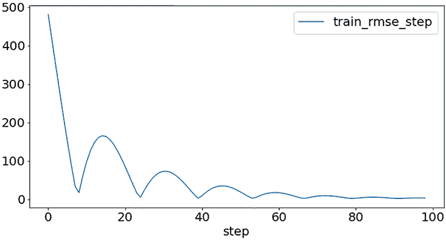
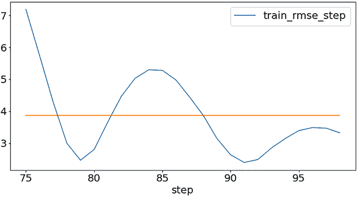
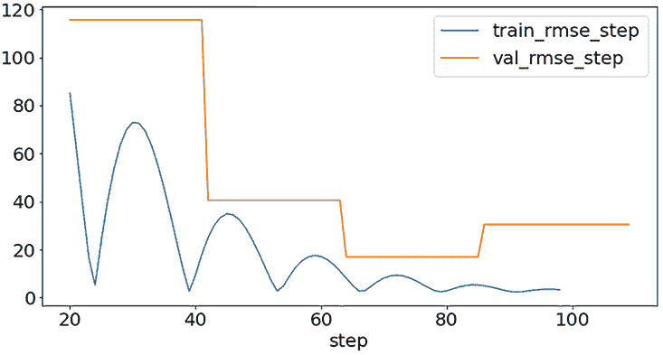

# 第十章：采用 PyTorch Lightning

本章涵盖了

+   使用 PyTorch Lightning 减少样板代码

+   为 DC 出租车模型添加训练、验证和测试支持

+   使用 pandas 分析 DC 出租车模型的训练和验证

到目前为止，您已经编写了与训练和测试您的机器学习模型相关的实现。然而，您编写的大部分代码与您的机器学习模型架构无关，可以适用于广泛范围的不同模型。基于这一观察结果，本章介绍了 PyTorch Lightning，这是一个可以帮助您减少机器学习系统中样板工程代码量的框架，并因此帮助您专注于发展您的模型设计和实现的框架。

## 了解 PyTorch Lightning

本节介绍了 PyTorch Lightning 框架，用于您的 PyTorch DC 出租车车费估算模型，并教您如何启用 PyTorch Lightning 训练、验证和测试特性的步骤。

目前为止，您已经为您的机器学习模型实现了大部分的 Python 和 PyTorch 样板代码。这意味着你的实现中只有少部分是模型特定的，比如

+   将特征值打包为张量

+   配置神经网络层

+   计算损失的张量

+   模型指标报告

剩下的大部分代码，比如迭代培训批次、验证批次和培训纪元的代码，主要是样板代码，这意味着它可以在模型特定的代码发生各种变化时不加修改地重复使用。

随着您的机器学习系统变得更加复杂，系统实现中的样板代码也会变得更加复杂。例如，成熟的机器学习系统需要周期性保存（检查点）模型的权重值到存储介质，以便实现可复制性。拥有模型检查点还可以使机器学习训练流程从预训练模型中恢复。其他例子包括与超参数优化服务、指标跟踪和控制机器学习流程的其他实验管理工具集成的代码。这不应该令人惊讶：回想一下第一章中提到的，一个生产级机器学习系统的组件中有超过 90% 是辅助于核心机器学习代码的。

PyTorch Lightning 框架 ([`www.pytorchlightning.ai`](https://www.pytorchlightning.ai)) 的目标是通过帮助开发者专注于开发核心机器学习代码而不被样板代码分散注意力来提高 PyTorch 开发者的生产力。就 DC 出租车模型而言，采用 PyTorch Lightning 是直接的。在开始之前，您需要确保已经在您的 shell 环境中运行以下内容安装了 PyTorch Lightning 的 pip 包:

```py
pip install pytorch_lightning
```

PyTorch Lightning 是一个全面的框架，具有可观的特性集，用于机器学习模型开发。本书不旨在取代现有的 PyTorch Lightning 教程或文档；相反，接下来的章节专注于您可以为 DC 出租车模型采用的框架特性。

### 10.1.1 将 PyTorch 模型训练转换为 PyTorch Lightning

本节教你关于 PyTorch Lightning 的 __init__、training_step 和 configure_optimizers 方法，然后演示如何为 DC 出租车模型实现这些方法以及如何使用小型的示例训练数据集训练基于 PyTorch Lightning 的 DC 出租车模型。

假设 PyTorch Lightning 包在您的环境中正确安装，您可以实现一个最小的、可训练的 DC 出租车模型。

图 10.1：带有支持的基本 PyTorch Lightning DC 出租车模型

```py
import torch as pt
import pytorch_lightning as pl                                               ❶

pt.set_default_dtype(pt.float64)                                             ❷

class DcTaxiModel(pl.LightningModule):                                       ❸
  def __init__(self, **kwargs):                                              ❹
    super().__init__()                                                       ❺
    self.save_hyperparameters()                                              ❻
    pt.manual_seed(int(self.hparams.seed))                                   ❼
    self.layers = pt.nn.Linear(int(self.hparams.num_features), 1)            ❽

  def batchToXy(batch):                                                      ❾
    batch = batch.squeeze_()
    X, y = batch[:, 1:], batch[:, 0]
    return X, y

  def forward(X):                                                            ❿
    y_est = self.model(X)
    return y_est.squeeze_()

  def training_step(self, batch, batch_idx):
    X, y = self.batchToXy(batch)
    y_est = self.forward(X)
    loss = pt.nn.functional.mse_loss(y_est, y)
    for k,v in {
        "train_mse": loss.item(),
        "train_rmse": loss.sqrt().item(),
    }.items():
      self.log(k, v, on_step=True, on_epoch=True, prog_bar=True, logger=True)⓫

    return loss                                                              ⓬

  def configure_optimizers(self):                                            ⓭
    optimizers = {'Adam': pt.optim.AdamW,
                    'SGD': pt.optim.SGD}
    optimizer = optimizers[self.hparams.optimizer]

    return optimizer(self.layers.parameters(),                               ⓮
                        lr = float(self.hparams.lr))

model = DcTaxiModel(**{                                                      ⓯
    "seed": "1686523060",
    "num_features": "8",
    "optimizer": "Adam",
    "lr": "0.03",
    "max_batches": "100",
    "batch_size": "64",
})
```

❶ 导入 PyTorch Lightning 库，并将其别名为 pl。

❷ 使用 torch.float64 作为模型参数的 dtype。

❸ PyTorch Lightning 模型必须扩展自 LightningModule。

❹ 使用 **kwargs 传递超参数给模型。

❺ LightningModule 子类必须首先调用父类的 __init__。

❻ 将 **kwargs 中的超参数保存到 self.hparams。

❼ 根据超参数设置设置伪随机数生成器。

❽ 为此示例使用简单的线性回归模型。

❾ 重用第七章的函数进行 batchToXy 的 . . .

❿ . . . 以及前向实现。

⓫ 使用 PyTorch Lightning 内置的日志记录来记录 MSE 和 RMSE 测量值。

⓬ training_step 方法必须返回损失张量。

⓭ LightningModule 子类必须有一个 configure_optimizers 方法。

⓮ 返回由超参数指定的配置好的优化器实例。

⓯ 实例化一个 PyTorch Lightning 版本的 DcTaxiModel，命名为 model。

注意，DcTaxiModel 类继承自基础的 pl.LightningModule 类，在 __init__ 方法中通过 super().__init__() 方法调用需要单独初始化。类的其余 __init__ 方法在此处被简化以进行说明，并突出显示以下关键概念：将模型的超参数存储在 self.hparams 中以及在 self.layers 实例中实例化模型参数。

training_step 方法是 PyTorch Lightning 实现的工作核心，执行模型层的前向步骤，计算损失并返回损失值。请注意，它依赖于 batchToXy 方法（在第七章介绍），该方法负责将一批训练样例转换为适合模型训练的格式。

转换就是使用 squeeze_ 方法消除任何形状为 1 的维度。例如，形状为 [1, 128, 5, 1] 的张量在 squeeze_ 应用后被重新调整为 [128，5]。在 squeeze_ 中使用下划线进行了小幅度的性能优化。回想一下第五章所讲的，squeeze_ 中的下划线表示 PyTorch 方法将就地执行操作，对张量进行突变，而不是返回新的张量实例。

DcTaxiModel 的实现假定张量中的第一列是标签，其余列是特征。因此，在 batchToXy 代码的结尾部分，只需将标签简单地别名为 y，将特征别名为 X 并返回结果。

在 training_step 方法中调用 self.log 报告模型计算出的训练 MSE 和 RMSE 值。正如第五章所解释的那样，在 PyTorch 张量 API 中，标量张量的 item 方法返回常规的 Python 值而不是张量。因此，使用 self.log 记录的值是 Python 数值而不是 PyTorch 张量。PyTorch Lightning 的 self.log 方法是一个可扩展的日志框架的通用 API，稍后在本章中有更详细的介绍。

示例中的 configure_optimizers 方法使用优化器字典，以便使模型能够根据优化器超参数的值在不同的优化算法（Adam 和 SGD）之间切换。尽管这种模型训练的实现尚未使用超参数优化，但在 configure_optimizers 中展示的基于字典查找的方法确保了当后续开发启用超参数优化时，模型代码无需改变。

在 PyTorch Lightning 中，使用一个 Trainer 实例来训练模型。

代码清单 10.2：使用 PyTorch Lightining Trainer 训练子类

```py
from pytorch_lightning.loggers import CSVLogger
csvLog = \
  CSVLogger(save_dir = "logs",                         ❶
            name = "dctaxi",
            version = f"seed_{model.hparams.seed}")    ❷

trainer = \
  pl.Trainer(gpus = pt.cuda.device_count() \           ❸
                      if pt.cuda.is_available() else 0,
    max_epochs = 1,                                    ❹
    limit_train_batches = \                            ❺
      int( model.hparams.max_batches ) \
            if 'max_batches' in model.hparams else 1,
    log_every_n_steps = 1,                             ❻
    logger = [csvLog])                                 ❼
```

❶ 使用 CSVLogger 可以用 pandas 进行分析。

❷ seed 超参数被用于唯一标识模型日志。

❸ 在有多个 GPU 可用时使用多个 GPU 进行训练。

❹ 在此将其设置为 1，因为训练持续时间由 max_batches 控制。

❺ 使用 max_batches 来设置训练迭代的次数。

❻ 确保每次调用 self.log 的记录都被保存在日志中。

❼ 基于 csvLog 设置将发送到 self.log 的值保存下来。

超参数值可以应用于机器学习流水线，而不仅仅是模型：例如，max_batches 超参数控制模型训练的持续时间。正如你将在本章的其余部分中看到的，超参数值可以在机器学习流水线的各个阶段使用。代码示例中的 max_epochs 设置旨在确保训练流水线可以支持 Iterable 和 Map PyTorch 数据集。回想一下第七章，IterableDataset 实例具有可变数量的训练数据集示例；因此，对这一类别的训练受到限制，限制训练批次的数量。这个数字是使用 Trainer 的 limit_train_batches 参数指定的。

在列表 10.2 中，progress_bar_refresh_rate 和 weight_summary 设置是 Trainer 的合理默认设置，以最小化训练过程中报告的日志信息量。如果你喜欢对训练模型参数进行报告，你可以将 weights_summary 更改为 "full"，以报告所有权重，或者更改为 "top"，以仅报告模型中顶部（连接到模型主干的权重）的层的权重。同样，progress_bar_refresh_rate 可以更改为表示多久重新绘制一次显示训练完成进度的进度条的整数值（以训练步骤的数量为单位）。

要提供训练样本给模型，你可以使用第七章介绍的 ObjectStorageDataset。在执行下一个示例中的代码片段之前，请确保已安装 Kaen 框架使用

```py
pip install kaen[osds]
```

接下来，要仅执行模型的训练，你可以在 pl.Trainer 的实例上调用 fit 方法，传入一个包含训练样本的 PyTorch DataLoader：

```py
from torch.utils.data import DataLoader
from kaen.torch import ObjectStorageDataset as osds

train_ds = osds('https://raw.githubusercontent.com/osipov/
➥                   smlbook/master/train.csv',
                batch_size = int(model.hparams.batch_size) )

train_dl = DataLoader(train_ds,
                      pin_memory = True)
trainer.fit(model,
            train_dataloaders = train_dl)

trainer.fit(model, train_dl)
```

在例子中，使用来自 [`mng.bz/nr9a`](http://mng.bz/nr9a) 的 DC 出租车数据集的样本简单说明了如何使用 PyTorch Lightning。在下一章中，你将看到如何通过简单地更改传递给 osds 的 URL 字符串来扩展到更大的数据集。

由于在训练过程中损失和指标值被记录到一个 CSV 文件中，一旦训练结束，你可以将这些值加载到一个 pandas DataFrame 中，并使用以下方式绘制结果，

```py
import pandas as pd
metrics_df = pd.read_csv(f'logs/dctaxi/seed_{model.hparams.seed}/
➥                             metrics.csv')
ax = metrics_df.plot('step', 'train_rmse_step')
```

这应该输出一个类似于图 10.1 的图形。



图 10.1 在一个小样本上，微不足道的线性回归模型按预期收敛。

根据图 10.1，来自列表 10.1 的简单线性回归模型收敛到一致的损失值。要检查收敛的最后 25 步的损失值的详细信息，你可以再次利用 pandas DataFrame API，

```py
ax = metrics_df.iloc[-25:].plot('step', 'train_rmse_step')
ax.plot(metrics_df.iloc[-25:]['step'],
        pt.full([25], metrics_df[-25:]['train_rmse_step'].mean())),
```

这绘制了图 10.2。



图 10.2 训练的最后 25 步收敛到大约 4.0 的 RMSE。

你可以确认在训练的最后 25 步左右，模型以大约 4.0 的平均 RMSE 收敛。即使对于微不足道的线性回归模型，这也不应该令人惊讶，因为本示例使用了一个小训练样本。

此时，引入一个 build 函数很有用，可以调用它来实例化、训练，以及稍后验证和测试模型。为了方便起见，以下是此版本模型的完整实现，其中包含了训练步骤的封装。

列表 10.3 基本的 PyTorch Lightning DC 出租车模型

```py
import torch as pt
import pytorch_lightning as pl
from torch.utils.data import DataLoader
from kaen.torch import ObjectStorageDataset as osds

pt.set_default_dtype(pt.float64)

class DcTaxiModel(pl.LightningModule):
    def __init__(self, **kwargs):
        super().__init__()
        self.save_hyperparameters()

        pt.manual_seed(int(self.hparams.seed))

        self.layers = pt.nn.Linear(int(self.hparams.num_features), 1)

    def batchToXy(self, batch):
      batch = batch.squeeze_()
      X, y = batch[:, 1:], batch[:, 0]
      return X, y

    def forward(self, X):
      y_est = self.layers(X)
      return y_est.squeeze_()

    def training_step(self, batch, batch_idx):

        X, y = self.batchToXy(batch) #unpack batch into features and label

        y_est = self.forward(X)

        loss = pt.nn.functional.mse_loss(y_est, y)

        for k,v in {
          "train_mse": loss.item(),
          "train_rmse": loss.sqrt().item(),
        }.items():
          self.log(k, v, on_step=True,
                          on_epoch=True, prog_bar=True, logger=True)

        return loss

    def configure_optimizers(self):
        optimizers = {'Adam': pt.optim.AdamW,
                      'SGD': pt.optim.SGD}
        optimizer = optimizers[self.hparams.optimizer]

        return optimizer(self.layers.parameters(),
                            lr = float(self.hparams.lr))

def build(model):
  csvLog = CSVLogger(save_dir = "logs",
                    name = "dctaxi",
                    version = f"seed_{model.hparams.seed}"
                    )

  trainer = pl.Trainer(gpus = pt.cuda.device_count() \
                              if pt.cuda.is_available() else 0,
    max_epochs = 1,
    limit_train_batches = int( model.hparams.max_batches ) \
                          if 'max_batches' in model.hparams else 1,
    progress_bar_refresh_rate = 20,
    weights_summary = None,
    log_every_n_steps = 1,
    logger = csvLog)

  train_ds = osds('https://raw.githubusercontent.com/osipov/smlbook/
➥                   master/train.csv',
                  batch_size = int(model.hparams.batch_size) )

  train_dl = DataLoader(train_ds,
                        pin_memory = True)

  trainer.fit(model,
              train_dataloaders = train_dl)

  return model, trainer

model = build(DcTaxiModel(**{
        "seed": "1686523060",
        "num_features": "8",
        "optimizer": "Adam",
        "lr": "0.03",
        "max_batches": "100",
        "batch_size": "100",
}))
```

### 10.1.2 启用已训练模型的测试和报告

本节描述了 PyTorch Lightning 模型的 test_step 方法以及如何使用该方法测试和报告已训练模型的指标。

一旦模型训练完成，Trainer 实例也可以用于报告模型在测试数据集上的损失和度量。但是，为了支持 PyTorch Lightning 中的测试，必须将 LightningModule 子类扩展为实现 test_step 方法。以下代码片段描述了 DcTaxiModel 的相应实现：

```py
def test_step(self, batch, batch_idx):
    X, y = self.batchToXy(batch)

    with pt.no_grad():                                 ❶
        loss = pt.nn.functional.mse_loss(self.forward(X), y)

    for k,v in {
        "test_mse": loss.item(),                       ❷
        "test_rmse": loss.sqrt().item(),               ❸
    }.items():
        self.log(k, v, on_step=True, on_epoch=True,
                        prog_bar=True, logger=True)
```

❶ 在测试期间忽略梯度图以获得更好的性能。

❷ 使用 test_mse 而不是 train_mse . . .

❸ . . . 并在记录测试测量时使用 test_rmse 而不是 train_rmse。

PyTorch Lightning 的 test_step 不需要任何返回值；相反，代码应报告使用训练模型计算的指标。回顾第六章中的自动微分讨论，保持梯度的反向图会带来额外的性能开销。由于在模型测试（或验证）期间不需要模型梯度，因此在 pt.no_grad() 的上下文中调用 forward 和 mse_loss 方法，该上下文禁用了用于损失梯度计算的跟踪。

除了与重命名的记录损失和度量测量相关的轻微更改（例如，test_rmse 对比 train_rmse），test_step 记录的实现与 training_step 函数完全相同。

为了向 Trainer 实例引入配置更改以进行测试并创建测试数据的 DataLoader，需要修改 build 函数 ❶—❹：

```py
def build(model, train_glob, test_glob):                            ❶
  csvLog = CSVLogger(save_dir = "logs",
                    name = "dctaxi",
                     version = f"seed_{model.hparams.seed}")

  trainer = pl.Trainer(gpus = pt.cuda.device_count() \
                              if pt.cuda.is_available() else 0,
    max_epochs = 1,
    limit_train_batches = int( model.hparams.max_batches ) \
                          if 'max_batches' in model.hparams else 1,
    limit_test_batches = 1,                                         ❷
    log_every_n_steps = 1,
    logger = csvLog)

  train_ds = osds(train_glob,                                       ❸
                  batch_size = int(model.hparams.batch_size) )

  train_dl = DataLoader(train_ds,                                   ❹
                        pin_memory = True)

  trainer.fit(model,
              train_dataloaders = train_dl)

  test_ds = osds(test_glob, 
                  batch_size = int(model.hparams.batch_size) )

  test_dl = DataLoader(test_ds, 
                        pin_memory = True)

  trainer.test(model,                                               ❺
              test_dataloaders=test_dl)

  return model, trainer
```

❶ 通过 URL 通配符实例化 DataLoader 以用于训练和测试数据。

❷ 仅使用测试数据集一次来报告损失和度量。

❸ 使用 test_glob 实例化 train_ds . . .

❹ . . . 并创建 train_dl 实例。

❺ 使用 Trainer.test 方法测试并报告模型性能。

在使用更新后的模型和构建实现进行训练和测试之后

```py
model = build(DcTaxiModel(**{
        "seed": "1686523060",
        "num_features": "8",
        "optimizer": "Adam",
        "lr": "0.03",
        "max_batches": "100",
        "batch_size": "100",}),
  train_glob = 'https://raw.githubusercontent.com/osipov/smlbook/
➥                 master/train.csv',
  test_glob = 'https://raw.githubusercontent.com/osipov/smlbook/
➥                 master/train.csv')
```

你应该获得类似以下的测试结果：

```py
-----------------------------------------------------------------------------
DATALOADER:0 TEST RESULTS
{'test_mse': 9.402312278747559,
 'test_mse_epoch': 9.402312278747559,
 'test_rmse': 3.066318988800049,
 'test_rmse_epoch': 3.066318988800049}
-----------------------------------------------------------------------------
```

### 10.1.3 启用模型训练期间的验证

本节说明了如何在 LightningModule 子类中使用 validation_step 方法来启用对 PyTorch 模型的验证支持。

当您修改实现以支持训练期间的重复验证步骤时，使用 PyTorch Lightning 的优势变得更加明显。例如，要将模型验证添加到 DcTaxiModel 实现中，只需引入 validation_step 方法：

```py
def validation_step(self, batch, batch_idx):
    X, y = self.batchToXy(batch)

    with pt.no_grad():
        loss = pt.nn.functional.mse_loss(self.forward(X), y)

    for k,v in {
    "val_mse": loss.item(),
    "val_rmse": loss.sqrt().item(),
    }.items():
    self.log(k, v, on_step=True, on_epoch=True, prog_bar=True, logger=True)

    return loss
```

下面的代码描述了配置训练器实例以在固定大小的数据集上执行验证（而不是 k 折交叉验证）所需的剩余更改：

```py
trainer = pl.Trainer(gpus = pt.cuda.device_count() \
                            if pt.cuda.is_available() else 0,
    max_epochs = 1,
    limit_train_batches = int( model.hparams.max_batches ) \
                          if 'max_batches' in model.hparams else 1,
    limit_val_batches = 1,                         ❶
    num_sanity_val_steps = 1,                      ❷
    val_check_interval = min(20,                   ❸
                            int( model.hparams.max_batches ) ),
    limit_test_batches = 1,
    log_every_n_steps = 1,
    logger = csvLog,
    progress_bar_refresh_rate = 20,
    weights_summary = None,)
```

❶ 仅验证 1 批验证 DataLoader 数据。

❷ 在训练之前进行验证以确保验证数据集可用。

❸ 在每 20 次梯度下降的训练迭代（步骤）之后进行验证。

limit_val_batches 的作用类似于 limit_train_batches，指定用于验证的验证数据集中的批次数量。Trainer 中的 num_sanity_val_steps 参数控制了 PyTorch Lightning 的一个特性，该特性使用验证数据集来确保模型以及验证 DataLoader 被正确实例化并准备好进行训练。在本示例中，将 num_sanity_val_steps 的值设置为 1 执行单个验证步骤并报告相应的指标。val_check_interval 参数指定，在每 20 次训练迭代之后，PyTorch Lightning 应使用 limit_val_batches 参数指定的批次数进行验证。使用 val_check_interval 的 min 函数确保如果 max_batches 的超参数设置为小于 20，则在训练结束时执行验证。

列表 10.4 PyTorch Lightning DC 出租车线性回归模型

```py
import torch as pt
import pytorch_lightning as pl
from torch.utils.data import DataLoader
from kaen.torch import ObjectStorageDataset as osds

pt.set_default_dtype(pt.float64)

class DcTaxiModel(pl.LightningModule):
    def __init__(self, **kwargs):
        super().__init__()
        self.save_hyperparameters()

        pt.manual_seed(int(self.hparams.seed))

        self.layers = pt.nn.Linear(int(self.hparams.num_features), 1)

    def batchToXy(self, batch):
      batch = batch.squeeze_()
      X, y = batch[:, 1:], batch[:, 0]
      return X, y

    def forward(self, X):
      y_est = self.layers(X)
      return y_est.squeeze_()

    def training_step(self, batch, batch_idx):

        X, y = self.batchToXy(batch)

        y_est = self.forward(X)

        loss = pt.nn.functional.mse_loss(y_est, y)

        for k,v in {
          "train_mse": loss.item(),
          "train_rmse": loss.sqrt().item(),
        }.items():
          self.log(k, v, on_step=True, on_epoch=True,
                          prog_bar=True, logger=True)

        return loss

    def validation_step(self, batch, batch_idx):
      X, y = self.batchToXy(batch)
      with pt.no_grad():
          loss = pt.nn.functional.mse_loss(self.forward(X), y)

      for k,v in {
        "val_mse": loss.item(),
        "val_rmse": loss.sqrt().item(),
      }.items():
        self.log(k, v, on_step=True, on_epoch=True,
                        prog_bar=True, logger=True)

      return loss

    def test_step(self, batch, batch_idx):
      X, y = self.batchToXy(batch)

      with pt.no_grad():
          loss = pt.nn.functional.mse_loss(self.forward(X), y)

      for k,v in {
          "test_mse": loss.item(),
          "test_rmse": loss.sqrt().item(),
      }.items():
          self.log(k, v, on_step=True, on_epoch=True,
                          prog_bar=True, logger=True)

    def configure_optimizers(self):
        optimizers = {'Adam': pt.optim.AdamW,
                      'SGD': pt.optim.SGD}
        optimizer = optimizers[self.hparams.optimizer]

        return optimizer(self.layers.parameters(),
                            lr = float(self.hparams.lr))

def build(model, train_glob, val_glob, test_glob):
  csvLog = CSVLogger(save_dir = "logs",
                    name = "dctaxi",
                     version = f"seed_{model.hparams.seed}")

  trainer = pl.Trainer(gpus = pt.cuda.device_count() \
                              if pt.cuda.is_available() else 0,
    max_epochs = 1,
    limit_train_batches = int( model.hparams.max_batches ) \
                          if 'max_batches' in model.hparams else 1,
    limit_val_batches = 1,
    num_sanity_val_steps = 1,
    val_check_interval = min(20, int( model.hparams.max_batches ) ),
    limit_test_batches = 1,
    log_every_n_steps = 1,
    logger = csvLog,
    progress_bar_refresh_rate = 20,
    weights_summary = None,)

  train_dl = \
    DataLoader(osds(train_glob,
                    batch_size = int(model.hparams.batch_size) ),
               pin_memory = True)

  val_dl = \
    DataLoader(osds(val_glob,
                    batch_size = int(model.hparams.batch_size) ),
               pin_memory = True)

  trainer.fit(model,
              train_dataloaders = train_dl,
              val_dataloaders = val_dl)

  test_dl = \
    DataLoader(osds(test_glob,
                    batch_size = int(model.hparams.batch_size) ),
               pin_memory = True)

  trainer.test(model,
               dataloaders=test_dl)

  return model, trainer
```

您可以通过运行来训练、验证和测试整个模型

```py
model, trainer = build(DcTaxiModel(**{
        "seed": "1686523060",
        "num_features": "8",
        "optimizer": "Adam",
        "lr": "0.03",
        "max_batches": "100",
        "batch_size": "100",}),
  train_glob = 'https://raw.githubusercontent.com/osipov/smlbook/
➥                 master/train.csv',
  val_glob = 'https://raw.githubusercontent.com/osipov/smlbook/
➥                 master/valid.csv',
  test_glob = 'https://raw.githubusercontent.com/osipov/smlbook/
➥                 master/train.csv').
```

如果将来自 logs/dctaxi/version_1686523060 文件夹的生成日志加载为 pandas DataFrame，并使用以下代码绘制结果

```py
import pandas as pd
metrics_df = \
  pd.read_csv(f'logs/dctaxi/seed_{model.hparams.seed}/metrics.csv')

ax = (metrics_df[['step', 'train_rmse_step']][20:]
      .dropna()
      .plot('step', 'train_rmse_step'))

ax = (metrics_df[['step', 'val_rmse_step']][20:]
    .fillna(method='ffill')['val_rmse_step']
    .plot(ax = ax))
```

您应该观察到类似于图 10.3 的图形。由于 val_check_interval 参数设置为 20，因此数据帧中 val_rmse_step 列的大多数值都缺失。fillna(method='ffill') 调用向前填充缺失值，例如，根据步骤 80 的验证 RMSE 设置步骤 81、82 等的缺失值。



图 10.3 尽管测试性能合理，但验证 RMSE 信号表明过拟合。

如图 10.3 所示，对验证数据集的平淡性能表明模型可能在训练数据集上过拟合。在将代码投入生产之前，应重构模型实现以使其更具一般性，并且不那么依赖于训练数据集的记忆。这意味着为了前进，您需要具有更全面的实验和超参数优化支持的模型开发方法。

## 总结

+   采用 PyTorch Lightning 框架可以帮助您重构机器学习实现，减少附带的样板代码比例，并专注于模型特定开发。

+   在基于 PyTorch Lightning 的机器学习模型实现中，您可以逐步添加对模型训练、验证和测试的支持，以及可插拔的特性，例如用于分析的日志框架。

+   PyTorch Lightning 中的 CSVLogger 将模型训练、验证和测试结果保存到 CSV 文件中，您可以使用 pandas 进行分析。
