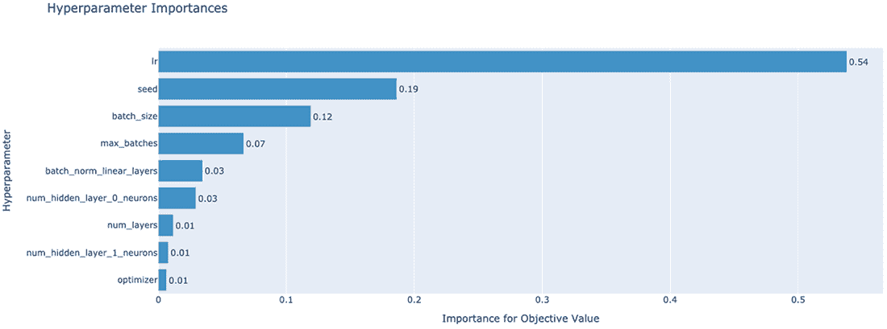
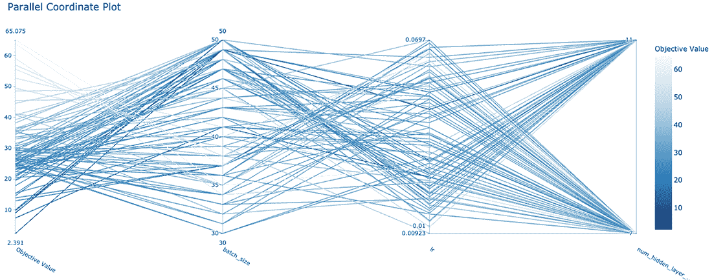
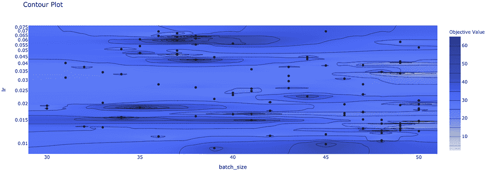

# 第十一章：超参数优化

本章涵盖内容

+   通过超参数优化理解机器学习

+   引入超参数优化到 DC taxi 模型

+   可视化超参数优化实验结果

在第十章，您将 PyTorch Lightning 框架与您的 DC taxi 模型集成，提取出模板化工程代码，并为其提供超参数优化支持的途径。在本章中，您将采用一种超参数优化框架 Optuna，以进一步超越试错法来选择您的机器学习超参数值。您将训练一系列基于 Optuna 的 Tree-Structured Parzen Estimator(TPE)选择的超参数值的 DC taxi 模型实例，该模型适配了您机器学习系统中的超参数的高斯混合模型（GMM）。使用各种 Optuna 可视化图比较这些模型实例的性能。

## 11.1 使用 Optuna 进行超参数优化

本小节介绍了 Optuna 用于超参数优化（HPO）以及如何为 DC taxi 车费估算模型添加 HPO 支持。

Optuna 是适用于 PyTorch 的众多开源 HPO 框架之一。与其他 HPO 框架一样，Optuna 包括了一系列无梯度的优化算法，从随机搜索、贝叶斯优化到 TPE 不等。Optuna 使用*trial*的概念来描述计算损失函数值的过程的实例，例如基于一组超参数值计算 DcTaxiModel 模型的测试损失的实验实例。

在 Optuna 中，一个试验必须生成一个你希望最小化（或最大化）的损失函数的值。计算损失值的过程的实现通常在一个目标函数中进行捕捉。请注意，为了仅解释与理解 Optuna API 相关的部分，这个实现是有意不完整的 ❸。

代码清单 11.1 DC taxi HPO 的起始点与目标函数

```py
def objective(trial):                          ❶
  hparams = {
    "seed": trial.suggest_int('seed',
                0,
                pt.iinfo(pt.int32).max - 1),   ❷
    "num_features": "8",
    ...                                        ❸
  }
  model, trainer = build(DcTaxiModel(**hparams),
    train_glob = "https://raw.githubusercontent.com/osipov/smlbook/
➥     master/train.csv",
    val_glob = "https://raw.githubusercontent.com/osipov/smlbook/
➥     master/valid.csv")

  return (trainer
          .callback_metrics['train_val_rmse']
          .item())                             ❹
```

❶ 目标函数是 Optuna 试验的标准接口。

❷ suggest_int 返回 Optuna 选择的整数，以优化目标函数。

❸ hparams 的实现在本章后面完成。

❹ Optuna 根据每次实验的结果建议调整超参数，以减小 train_val_rmse 的值。

注意，在 hparams 字典中，有一个从 Optuna 请求的整数超参数值 seed。suggest_int 方法是 Optuna trial API 中的几种方法之一，用于获取超参数的值。（试验接口中的其他可用方法在此处描述：[`mng.bz/v4B7`](http://mng.bz/v4B7)。）在本例中，suggest_int('seed', 0, pt.iinfo(pt.int32).max - 1)方法调用指定 Optuna 应该为伪随机数生成器推荐从 0 到 32 位整数最大正值之前的值。

请记住，DcTaxiModel 的实现取决于其他超参数值，包括 optimizer、bins、lr（学习率）、max_batches 等。为了在 DcTaxiModel 的实现中支持这些超参数，需要扩展 hparams 字典以符合其他超参数值的 Optuna 规范。由于这些超参数的取样策略比 suggest_int 更复杂，下一节将解释一些基本概念。

### 11.1.1 理解 loguniform 超参数

本节提出了在训练过程中使用对数均匀超参数的合理性，并提出了应将哪些超参数设置为 DC 出租车模型的对数均匀形式。

对于许多连续的超参数，比如学习率，使用 Optuna 试验 API 的 suggest_loguniform 方法非常方便，该方法通过超参数的上限和下限值来调用。由于在 Optuna 试验 API 中，有几个连续超参数值的选项，因此有必要澄清为什么学习率应该使用 Optuna suggest_loguniform 而不是 suggest_uniform。一般来说，loguniform 更适合于搜索上限比下限大一个数量级以上的范围。这种合理性与十进制数系统的工作原理有关，下面的例子进行了解释：

```py
x = pt.linspace(1, 1_000, 300)
#prints the 1s, 10s, 100s
print(pt.count_nonzero(x[(x > 0) & (x < 10) ]).item(),
    pt.count_nonzero(x[(x > 10) & (x < 100) ]).item(),
    pt.count_nonzero(x[(x > 100) & (x < 1_000) ]).item())
```

输出结果为

```py
3 27 269
```

由于 x 包含了从 0 到 1,000（三个数量级）的 300 个浮点值，因此 print 语句输出了在每个数量级范围内出现的值的计数（即，从 0 到 10，从 10 到 100，从 100 到 1,000）。在这个例子中，在 0 到 10 的范围内的 x 值的数量与在 100 到 1,000 范围内的值的数量之间大约相差 100 倍，或者更确切地说是 3 与 269。

一般来说，从一个线性范围中以均匀概率取样，可以预期从较大范围中获得的样本平均要多 10*N*倍。log 函数的应用消除了由于十进制数系统导致的这种无意的偏差，下面的例子证明了这一点：

```py
y = pt.logspace(pt.log10(pt.tensor(1)),
                pt.log10(pt.tensor(1_000)),  300)

#prints the 1s, 10s, 100s
print(pt.count_nonzero(y[(y > 0) & (y < 10) ]).item(),
    pt.count_nonzero(y[(y > 10) & (y < 100) ]).item(),
    pt.count_nonzero(y[(y > 100) & (y < 1_000) ]).item())
```

输出结果为

```py
100 100 99
```

由于使用了以对数 10 为底的比例尺，示例中展示了约 300 个样本在整个从 1 到 1,000 的范围内大致相等地分布。

在对离散整数值进行对数尺度范围上的超参数值取样的概念，适用于连续值一样。例如，max_batches 超参数可以使用 Optuna Trial API 函数调用 suggest_int('max_batches', 40, 4000, log = True)进行初始化，因为调用中的下限和上限值跨越了一个数量级以上的范围。

### 11.1.2 使用分类和对数均匀超参数

本节基于你学到的关于对数均匀超参数的知识，解释了如何通过 Optuna 从对数均匀尺度中采样的超参数来初始化优化器学习率。

优化器和相应的学习率是你可能想要包含在 HPO 试验中的其他超参数之一。由于优化器学习率最好用连续值表示，跨越几个数量级的范围，因此应该在试验中使用 `suggest_loguniform` 方法进行优化。这可以如下实现，对于候选学习率在范围 `[0.001, 0.1)` 中的值：

```py
hparams = {
...
"lr": trial.suggest_loguniform('lr', 0.001, 0.1),    ❶
...
}
```

❶ 使用来自对数均匀范围 `[0.001, 0.1)` 的优化器学习率。

由于 DcTaxiModel 的 `configure_optimizers` 方法已经包含了对随机梯度下降和 Adam 的支持，因此你可以让 Optuna 在 `objective` 方法的实现中建议这些值的选择（SGD 或 Adam）。这需要在试验对象的 `suggest_categorical` 方法中使用，如下所示：

```py
hparams = {
...
"optimizer": \
  trial.suggest_categorical('optimizer',
                            ['Adam', 'SGD']),    ❶
...
}
```

❶ 在每个 HPO 试验中，使用 Adam 和 SGD 作为优化器选项。

试验 API 的参数是在程序运行时计算的，这意味着你可以使用标准的 Python 特性来更加表达超参数值的规范。例如，`batch_size` 超参数可以使用一个整数列表来指定，其中整数是动态生成的，解析为从 2¹⁶ 到 2²¹ 的二次幂，换句话说，值为 `[65536, 131072, 262144, 524288, 1048576, 2097152]`：

```py
hparams = {
  ...
  "batch_size": \
    trial.suggest_categorical('batch_size',
                  [2 ** i for i in range(16, 22)]),    ❶
  ...
}
```

❶ 在使用 `suggest_categorical` 方法之前，预先计算一个 Python 列表的超参数值。

展示了一个更有趣的 `suggest_categorical` 应用，实现了 `num_hidden_neurons` 超参数的规范化。

列表 11.2 Optuna 试验以发现神经网络架构

```py
hparams = {
  ...
  "num_hidden_neurons": \                                            ❶
    [trial.suggest_categorical(f"num_hidden_layer_{layer}_neurons",
                              [7, 11, 13, 19, 23]) for layer in \
                              range(trial.suggest_categorical('num_layers',
                                                       [11, 13, 17, 19]))],
  ...
}
```

❶ 将网络架构指定为一个超参数（例如，[5, 11, 7]）。

DcTaxiModel 可以使用隐藏层中神经元数量的字符串表示来构建其模型层。例如，一个字符串表示 `[3, 5, 7, 8]` 可以表示四个隐藏层，其中第一层有三个神经元，第二层有五个，依此类推。

这种类型的规范可以通过一系列的 suggest_categorical 调用来实现为 Optuna 超参数。首先，Optuna 为隐藏层的总数（num_layers）分配一个值，该值基于列表中的可能隐藏层数量 [11, 13, 17, 19]，然后，根据 Optuna 为隐藏层数量（num_layers）选择的值，通过 for 运算符多次调用下一个 suggest_categorical 调用，每个隐藏层调用一次。每个调用都会更改对 layer 变量的赋值，并实例化一个新的超参数，例如架构中的第一层的 num_hidden_layer_0_neurons，第二层的 num_hidden_layer_1_neurons，依此类推，具体取决于超参数层数（num_layers）的值。为每个超参数（描述每个隐藏层的神经元数量）分配的值来自不同的 suggest_categorical 列表，指定为 [7, 11, 13, 19, 23]。最终，num_hidden_neurons 解析为一个 Python 列表，其中包含 Optuna 提出的隐藏层和神经元的配置。

将这些超参数与目标函数的整个实现结合起来，结果如下：

```py
def objective(trial):
  hparams = {
    "seed": trial.suggest_int('seed', 0, pt.iinfo(pt.int32).max - 1),
    "num_features": "8",
    "optimizer": trial.suggest_categorical('optimizer', ['Adam', 'SGD']),
    "lr": trial.suggest_loguniform('lr', 0.009, 0.07),
    "num_hidden_neurons": \
      str([trial
➥           .suggest_categorical(f"num_hidden_layer_{layer}_neurons",
            [7, 11]) for layer in \
              range(trial.suggest_categorical('num_layers', [2, 3]))]),
    "batch_size": trial.suggest_int('batch_size', 30, 50, log = True),
    "max_batches": trial.suggest_int('max_batches', 30, 50, log = True)
    "batch_norm_linear_layers": \
      str(trial.suggest_int('batch_norm_linear_layers', 0, 1)),
  }
  model, trainer = build(DcTaxiModel(**hparams),
    train_glob = 'https://raw.githubusercontent.com/osipov/smlbook/
➥     master/train.csv',
    val_glob = 'https://raw.githubusercontent.com/osipov/smlbook/
➥     master/valid.csv')

  return trainer.callback_metrics['train_val_rmse'].item()
```

## 11.2 神经网络层配置作为超参数

本节介绍如何扩展 DC 出租车模型以支持深度学习模型，每层隐藏层和每层神经元数都是任意的。该部分还描述了如何使用超参数值来指定此配置。

不是随意选择神经网络参数的配置（例如，层数或每层的神经元数），而是将配置视为要优化的超参数是有价值的。尽管 PyTorch 和 PyTorch Lightning 都没有直接的技术来优化神经网络配置，但是您可以轻松实现一个实用方法来将网络的隐藏层的字符串表示转换为与字符串镜像的 nn.Module 实例集合。例如，字符串 [3, 5, 8] 可以表示具有三个隐藏层的神经网络，第一层有三个神经元，第二层有五个神经元，第三层有八个神经元。以下代码片段中显示的 build_hidden_layers 实用方法实现了从字符串到 torch.nn.Linear 实例的转换，以及任意激活函数：

```py
def build_hidden_layers(self, num_hidden_neurons, activation):
  linear_layers = \                                            ❶
    [ pt.nn.Linear(num_hidden_neurons[i],
      num_hidden_neurons[i+1]) for i in range(len(num_hidden_neurons) - 1) ]

  classes = \                                                  ❷
    [activation.__class__] * len(num_hidden_neurons)

  activation_instances = \                                     ❸
    list(map(lambda x: x(), classes))

  hidden_layer_activation_tuples = \                           ❹
    list(zip(linear_layers, activation_instances))

  hidden_layers = \                                            ❺
    [i for sublist in hidden_layer_activation_tuples for i in sublist]

  return hidden_layers
```

❶ 创建一个线性（前馈）层的 Python 列表...

❷ . . . 并创建一个匹配长度的激活类列表。

❸ 将激活类转换为激活实例。

❹ 将线性层与激活函数实例进行压缩。

❺ 将结果作为平面 Python 列表返回。

在 DcTaxiModel 的实现中，添加了 build_hidden_layers 实用程序方法，现在您可以修改 __init__ 方法以使用 build_hidden_layers 如下：

```py
import json
import torch as pt
import pytorch_lightning as pl
class DcTaxiModel(pl.LightningModule):
  def __init__(self, hparams = None):
    super().__init__()
    self.hparams = hparams

    pt.manual_seed(self.hparams['seed'])

    num_hidden_neurons = \                           ❶
      json.loads(self.hparams.num_hidden_neurons)

    self.layers = \                                  ❷
      pt.nn.Sequential(
        pt.nn.Linear(int(self.hparams.num_features), num_hidden_neurons[0]),
        pt.nn.ReLU(),
        *self.build_hidden_layers(num_hidden_neurons, pt.nn.ReLU()),
        pt.nn.Linear(num_hidden_neurons[-1], 1)
    )

model = build(DcTaxiModel(**{
        "seed": "1686523060",
        "num_features": "8",
        "num_hidden_neurons": "[3, 5, 8]",           ❸
        "optimizer": "Adam",
        "lr": "0.03",
        "max_batches": "100",
        "batch_size": "100",}),
  train_glob = 'https://raw.githubusercontent.com/osipov/smlbook/
➥                 master/train.csv',
  val_glob = 'https://raw.githubusercontent.com/osipov/smlbook/
➥               master/valid.csv',
  test_glob = 'https://raw.githubusercontent.com/osipov/smlbook/
➥               master/train.csv')
```

❶ 创建一个隐藏层神经元的列表（例如[3, 5, 8]）。

❷ 对模型使用前馈隐藏层的序列。

❸ 使用字符串格式指定隐藏层。

在示例中，使用 json.loads 方法将隐藏层字符串表示（例如[3, 5, 8]）转换为 Python 整数值列表。此外，虽然 self.layers 参考神经网络模型仍然具有四个输入特征和一个输出值，但隐藏值是通过将 build_hidden_layers 方法中的 torch.nn.Linear 实例的列表展开为作为 torch.nn.Sequential 初始化程序传递的单个对象来指定的。

## 11.3 使用批量归一化超参数进行实验

批量归一化是一种广泛使用的技术，可以增加梯度下降收敛率。²尽管批量归一化被广泛使用，但收集证明它可以帮助创建更有效的 DC 出租车模型的数据仍然很有用。

由于批量归一化特性应根据布尔型 HPO 标志启用或禁用，因此引入一种自动重连 DC 出租车模型的图层以利用此特性的方法是很有用的。以下 batch_norm_linear 方法在模型中的每个 torch.nn.Linear 层之前自动插入 PyTorch torch.nn.BatchNorm1d 类实例。以下实现还正确配置每个 BatchNorm1d 实例，使其具有正确数量的输入，与相应的 Linear 层的输入数相匹配，应遵循 BatchNorm1d：

```py
def batch_norm_linear(self, layers):
  idx_linear = \                                                   ❶
    list(filter(lambda x: type(x) is int,
      [idx if issubclass(layer.__class__, pt.nn.Linear) else None \
        for idx, layer in enumerate(layers)]))

  idx_linear.append(sys.maxsize)                                   ❷

  layer_lists = \                                                  ❸
    [list(iter(layers[s:e])) \
      for s, e in zip(idx_linear[:-1], idx_linear[1:])]

  batch_norm_layers = \                                            ❹
    [pt.nn.BatchNorm1d(layer[0].in_features) for layer in layer_lists]

  batch_normed_layer_lists = \                                     ❺
    [ [bn, *layers] for bn, layers in \
      list(zip(batch_norm_layers, layer_lists)) ]

  result = \                                                       ❻
    pt.nn.Sequential(*[layer for nested_layer in \
      batch_normed_layer_lists for layer in nested_layer ])

  return result
```

❶ 创建一个列表，其中包含模型中线性类的位置索引。

❷ 使用最大整数值作为列表的最后一个元素，表示无限值。

❸ 创建带有 s 作为每个 Linear 的索引和 e 作为每个 Linear 之前的索引的子列表。

❹ 使用与对应的 Linear 输入匹配的输入实例化 BatchNorm1d。

❺ 在对应的 Linear 之前插入 BatchNorm1d 实例。

❻ 将所有的 BatchNorm1d 和 Linear 层序列打包成 Sequential。

一旦将 batch_norm_linear 方法添加到 DcTaxiModel 类中，就应该修改该类的 __init__ 方法（列表 11.3 ❶），以根据 batch_norm_linear_layers 超参数的值应用批量归一化。

列表 11.3 使用可选批量归一化

```py
from distutils.util import strtobool

def __init__(self, **kwargs):
  super().__init__()
  self.save_hyperparameters()

  self.step = 0
  self.start_ts = time.perf_counter()
  self.train_val_rmse = pt.tensor(0.)

  pt.manual_seed(int(self.hparams.seed))
  #create a list of hidden layer neurons, e.g. [3, 5, 8]
  num_hidden_neurons = json.loads(self.hparams.num_hidden_neurons)

  self.layers = pt.nn.Sequential(
      pt.nn.Linear(int(self.hparams.num_features), num_hidden_neurons[0]),
      pt.nn.ReLU(),
      *self.build_hidden_layers(num_hidden_neurons, pt.nn.ReLU()),
      pt.nn.Linear(num_hidden_neurons[-1], 1)
  )

  if 'batch_norm_linear_layers' in self.hparams \          ❶
    and strtobool(self.hparams.batch_norm_linear_layers):
    self.layers = self.batch_norm_linear(self.layers)
```

❶ 如果 batch_norm_linear_layers 为 True，则对 Linear 层进行批量归一化。

使用批量归一化后，DcTaxiModel 和匹配的构建方法已准备好用于 HPO。

列表 11.4 DcTaxiModel 实现支持 HPO

```py
import sys
import json
import time
import torch as pt
import pytorch_lightning as pl
from distutils.util import strtobool
from torch.utils.data import DataLoader
from kaen.torch import ObjectStorageDataset as osds
pt.set_default_dtype(pt.float64)

class DcTaxiModel(pl.LightningModule):
    def __init__(self, **kwargs):
      super().__init__()
      self.save_hyperparameters()

      self.step = 0
      self.start_ts = time.perf_counter()
      self.train_val_rmse = pt.tensor(0.)

      pt.manual_seed(int(self.hparams.seed))
      #create a list of hidden layer neurons, e.g. [3, 5, 8]
      num_hidden_neurons = json.loads(self.hparams.num_hidden_neurons)

      self.layers = \
        pt.nn.Sequential(
          pt.nn.Linear(int(self.hparams.num_features),
                              num_hidden_neurons[0]),
          pt.nn.ReLU(),
          *self.build_hidden_layers(num_hidden_neurons, pt.nn.ReLU()),
          pt.nn.Linear(num_hidden_neurons[-1], 1)
        )

      if 'batch_norm_linear_layers' in self.hparams \
        and strtobool(self.hparams.batch_norm_linear_layers):
        self.layers = self.batch_norm_linear(self.layers)

    def build_hidden_layers(self, num_hidden_neurons, activation):
      linear_layers = [ pt.nn.Linear(num_hidden_neurons[i],
          num_hidden_neurons[i+1]) for i in \
            range(len(num_hidden_neurons) - 1) ]

      classes = [activation.__class__] * len(num_hidden_neurons)

      activation_instances = list(map(lambda x: x(), classes))

      hidden_layer_activation_tuples = \
        list(zip(linear_layers, activation_instances))

      hidden_layers = \
        [i for sublist in hidden_layer_activation_tuples for i in sublist]

      return hidden_layers

    def batch_norm_linear(self, layers):
      idx_linear = \
        list(filter(lambda x: type(x) is int,
        [idx if issubclass(layer.__class__, pt.nn.Linear) else None \
          for idx, layer in enumerate(layers)]))

      idx_linear.append(sys.maxsize)
      layer_lists = \
        [list(iter(layers[s:e])) \
          for s, e in zip(idx_linear[:-1], idx_linear[1:])]
      batch_norm_layers = \
        [pt.nn.BatchNorm1d(layer[0].in_features) for layer in layer_lists]
      batch_normed_layer_lists = \
        [ [bn, *layers] for bn, layers in \
          list(zip(batch_norm_layers, layer_lists)) ]

      return \
        pt.nn.Sequential(*[layer \
          for nested_layer in batch_normed_layer_lists \
          for layer in nested_layer ])

    def batchToXy(self, batch):
      batch = batch.squeeze_()
      X, y = batch[:, 1:], batch[:, 0]
      return X, y

    def forward(self, X):
      y_est = self.layers(X)
      return y_est.squeeze_()

    def training_step(self, batch, batch_idx):
        self.step += 1

        X, y = self.batchToXy(batch) #unpack batch into features and label

        y_est = self.forward(X)

        loss = pt.nn.functional.mse_loss(y_est, y)

        for k,v in {

          "train_mse": loss.item(),
          "train_rmse": loss.sqrt().item(),
          "train_steps_per_sec": \
            self.step / (time.perf_counter() - self.start_ts),

        }.items():
          self.log(k, v, on_step=True, on_epoch=True,
                          prog_bar=True, logger=True)

        self.train_val_rmse = loss.sqrt().item()

        return loss

    def validation_step(self, batch, batch_idx):
      X, y = self.batchToXy(batch)

      with pt.no_grad():
          loss = pt.nn.functional.mse_loss(self.forward(X), y)

      for k,v in {
        "val_mse": loss.item(),
        "val_rmse": loss.sqrt().item(),
        "train_val_rmse": self.train_val_rmse + loss.sqrt().item(),
      }.items():
        self.log(k, v, on_step=True, on_epoch=True,
                        prog_bar=True, logger=True)
      return loss

    def test_step(self, batch, batch_idx):
      X, y = self.batchToXy(batch)

      with pt.no_grad():
          loss = pt.nn.functional.mse_loss(self.forward(X), y)

      for k,v in {
          "test_mse": loss.item(),
          "test_rmse": loss.sqrt().item(),
      }.items():
          self.log(k, v, on_step=True, on_epoch=True,
                          prog_bar=True, logger=True)

    def configure_optimizers(self):
        optimizers = {'Adam': pt.optim.AdamW,
                      'SGD': pt.optim.SGD}
        optimizer = optimizers[self.hparams.optimizer]

        return optimizer(self.layers.parameters(),
                            lr = float(self.hparams.lr))

def build(model, train_glob, val_glob, test_glob = None):
  csvLog = CSVLogger(save_dir = "logs",
                    name = "dctaxi",
                    version = f"seed_{model.hparams.seed}")

  trainer = pl.Trainer(gpus = pt.cuda.device_count() \
                                if pt.cuda.is_available() else 0,
    max_epochs = 1,
    limit_train_batches = int( model.hparams.max_batches ) \
                                if 'max_batches' in model.hparams else 1,
    limit_val_batches = 1,
    num_sanity_val_steps = 1,
    val_check_interval = min(20, int( model.hparams.max_batches ) ),
    limit_test_batches = 1,
    log_every_n_steps = 1,
    logger = csvLog,
    gradient_clip_val=0.5,
    progress_bar_refresh_rate = 0,
    weights_summary = None,)

  train_dl = \
    DataLoader(osds(train_glob,
                    batch_size = int(model.hparams.batch_size) ),
               pin_memory = True)

  val_dl = \
    DataLoader(osds(val_glob,
                    batch_size = int(model.hparams.batch_size) ),
               pin_memory = True)
  trainer.fit(model,
              train_dataloaders = train_dl,
              val_dataloaders = val_dl)

  if test_glob is not None:
    test_dl = \
      DataLoader(osds(test_glob,
                      batch_size = int(model.hparams.batch_size) ),
                pin_memory = True)

    trainer.test(model,
                dataloaders=test_dl)

  return model, trainer

model, trainer = build(DcTaxiModel(**{
        "seed": "1686523060",
        "num_features": "8",
        "num_hidden_neurons": "[3, 5, 8]",
        "batch_norm_linear_layers": "1",
        "optimizer": "Adam",
        "lr": "0.03",
        "max_batches": "100",
        "batch_size": "100",}),

  train_glob = 'https://raw.githubusercontent.com/osipov/smlbook/
➥                 master/train.csv',
  val_glob = 'https://raw.githubusercontent.com/osipov/smlbook/
➥                 master/valid.csv',
  test_glob = 'https://raw.githubusercontent.com/osipov/smlbook/
➥                 master/train.csv')
```

### 11.3.1 使用 Optuna 研究进行超参数优化

本节介绍了 Optuna 研究的概念，描述了它与 Optuna 试验的关系，并帮助您使用研究实例来运行和分析 HPO 实现中的一组试验。

在 Optuna 中，目标函数负责执行单个试验，包括从 Optuna 中检索超参数值、训练模型，然后根据验证损失评估训练模型的步骤。因此，每个试验仅向 Optuna HPO 算法返回单个评估指标，以便决定下一组建议的超参数值用于下一个试验。典型的 HPO 过程涉及几十甚至几百次试验；因此，有能力组织试验、比较其结果并分析试验中涉及的超参数是很重要的。在 Optuna 中，研究扮演着相关试验的容器角色，并提供有关试验结果和相关超参数的表格数据以及可视化数据。

如图 11.5 所示，通过一个目标函数，一个研究由优化方向（例如，最小化或最大化函数）和采样器来定义，采样器基于 Optuna 支持的许多 HPO 算法和框架之一实例化。用于初始化研究的种子（图 11.5 ❷）与用于初始化 PyTorch 和 NumPy 的种子值不同。在使用 HPO 时，此种子可用于创建下游随机数生成器的种子值，包括 Python 自己的随机数生成器。尽管 HPO 种子值从优化 DcTaxiModel 机器学习性能的角度来看毫无用处，但它确实具有确保 HPO 试验的可重现性的重要目的。

列表 11.4 中显示了 DcTaxiModel 的整个 HPO 实现。

列表 11.5 用于执行 HPO 的 Optuna 研究

```py
def objective(trial):
  hparams = {
    "seed": trial.suggest_int('seed', 0, pt.iinfo(pt.int32).max - 1),

    "num_features": "8",

    "batch_norm_linear_layers": \
      str(trial.suggest_int('batch_norm_linear_layers', 0, 1)),

    "optimizer": trial.suggest_categorical('optimizer', ['Adam', 'SGD']),

    "lr": trial.suggest_loguniform('lr', 0.009, 0.07),

    "num_hidden_neurons": \
      str([trial.suggest_categorical(f"num_hidden_layer_{layer}_neurons",
            [7, 11]) for layer in \
              range(trial.suggest_categorical('num_layers', [2, 3]))]),

    "batch_size": trial.suggest_int('batch_size', 30, 50, log = True),

    "max_batches": trial.suggest_int('max_batches', 30, 50, log = True)
  }
  model, trainer = build(DcTaxiModel(**hparams),
    train_glob = 'https://raw.githubusercontent.com/osipov/smlbook/
➥                   master/train.csv',
    val_glob = 'https://raw.githubusercontent.com/osipov/smlbook/
➥                   master/valid.csv')

  return trainer.callback_metrics['train_val_rmse'].item()

import optuna
from optuna.samplers import TPESampler                       ❶
study = \
  optuna.create_study(direction = 'minimize',                ❷
                      sampler = TPESampler( seed = 42 ),)

study.optimize(objective, n_trials = 100)                    ❸
```

❶ 配置研究以最小化 DcTaxiModel 的 MSE 损失。

❷ 使用 TPE 算法进行 HPO。

❸ 使用 100 次试验开始 HPO。

在执行列表 11.5 中的代码后，study.optimize 方法完成了 100 次 HPO 试验。使用以下方式可获得各个试验的详细信息

```py
study_df = study.trials_dataframe().sort_values(by='value',
                                                ascending = True)
study_df[:5][['number', 'value', 'params_seed']],
```

应返回一个类似以下值的 pandas 数据帧：

| number | value | params_seed |
| --- | --- | --- |
| 96 | 2.390541 | 1372300804 |
| 56 | 7.403345 | 1017301131 |
| 71 | 9.006614 | 939699871 |
| 74 | 9.139935 | 973536326 |
| 94 | 9.817746 | 1075268021 |

其中，数字列指定由 Optuna 建议的试验的索引，值是由目标方法中的 trainer.callback_ metrics['train_val_rmse'].item() 返回的损失函数的相应值，params_seed 是用于初始化 DcTaxiModel 的模型参数（权重）的种子值。

### 11.3.2 在 Optuna 中可视化 HPO 研究

本节介绍了本章中使用三种不同 Optuna 可视化执行的 HPO 研究，并比较了这些可视化图在 HPO 方面的相关性。

完成的研究实例也可以使用 Optuna 可视化包进行可视化。虽然全面概述 Optuna 中各种可视化的范围超出了本书的范围，但我发现自己在一系列机器学习模型中一直重复使用三个可视化图。这些可视化图将在本节的其余部分按重要性下降的顺序进行解释。

超参数重要性图揭示了关于超参数对目标函数相对影响的惊人信息。在列表中包含种子超参数特别有用，以评估某些超参数是否比仅用于模型初始化的随机变量具有更多或更少的重要性。比随机种子更重要的超参数值得进一步研究，而比随机变量不重要的超参数应该降低优先级。

要创建重要性图，您可以使用

```py
optuna.visualization.plot_param_importances(study)
```

这应该会生成类似于图 11.1 的条形图。



图 11.1 重要性图有助于指导后续 HPO 迭代。

一旦您确定了要更详细探讨的一组超参数，下一步就是在平行坐标图上绘制它们。您可以使用以下命令实例化此图。

```py
optuna.visualization.plot_parallel_coordinate(study,
    params=["lr", "batch_size", "num_hidden_layer_0_neurons"])
```

这会绘制学习率（lr）、批量大小和 num_hidden_layer_0_neurons 超参数之间的关系。请注意，在图 11.2 中，线条代表各个试验配置，颜色较深的线条对应于目标函数值较低的试验。因此，通过某个超参数的一系列较深线条穿过一定区间，表明该超参数区间值得更仔细检查，可能需要进行另一次 HPO 迭代。



图 11.2 平行坐标图有助于确定超参数值的影响区间。

到目前为止描述的图中，轮廓图在生成有关研究结果的见解方面排在最后。由于轮廓图仅限于可视化超参数值对的图形，您会发现自己生成多个轮廓图，通常基于从重要性图或平行坐标图中选择的超参数。例如，要绘制批量大小、学习率和目标函数之间的关系，您可以运行

```py
optuna.visualization.plot_contour(study, params=["batch_size", "lr"])
```

这应该生成类似于图 11.3 的图形。



图 11.3 轮廓图有助于分析与损失函数相关的超参数对。

## 摘要

+   Optuna 是一个超参数优化框架，具有与本机 Python 集成，可支持机器学习模型实验中的复杂超参数配置。

+   当使用 HPO 用于跨量级的超参数范围时，采用对数均匀采样是有用的，以确保样本在范围内均匀分布而不是倾斜分布。

+   在执行 HPO 试验之后，Optuna 的可视化功能有助于分析试验结果和相关的超参数。

^(1.)无梯度算法不需要计算损失（或任何目标）函数的梯度来优化函数参数。换句话说，无梯度的超参数优化可以在目标函数没有可计算梯度的情况下进行优化。

^(2.)最初广泛引用的论文《Batch Normalization: Accelerating Deep Network Training by Reducing Internal Covariate Shift》介绍了批归一化，并可从[`arxiv.org/abs/1502.03167`](https://arxiv.org/abs/1502.03167)获取。
