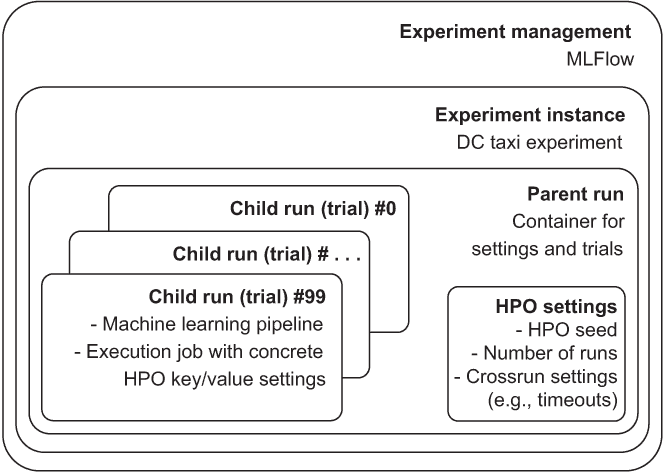
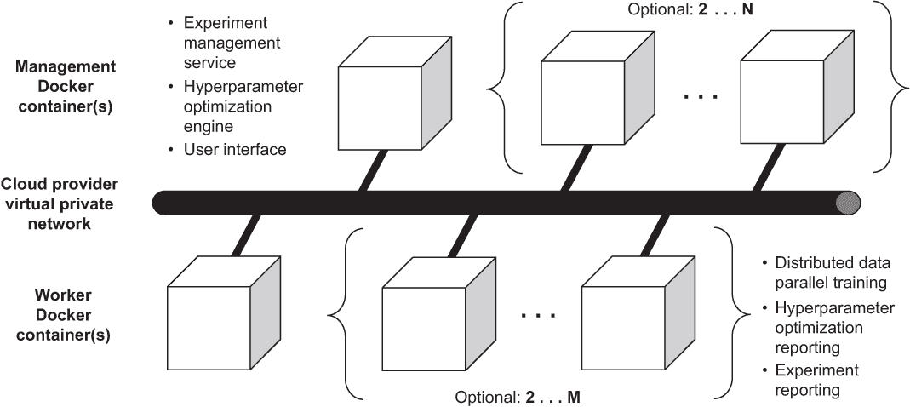
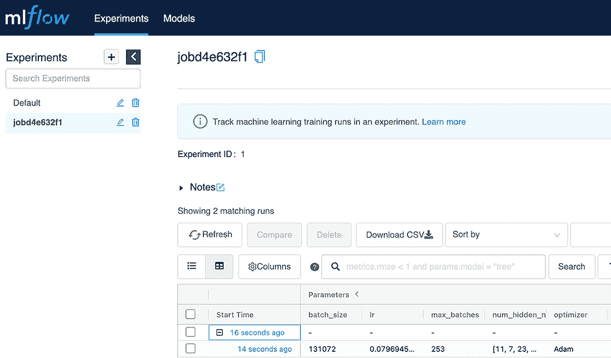
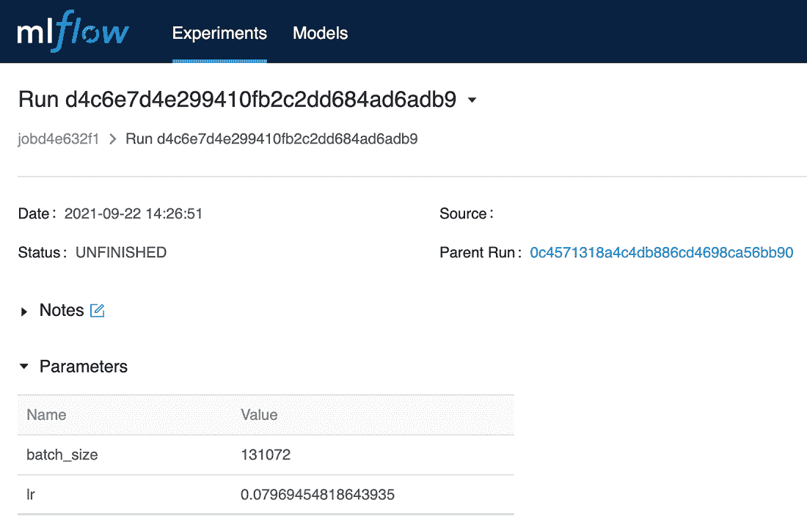
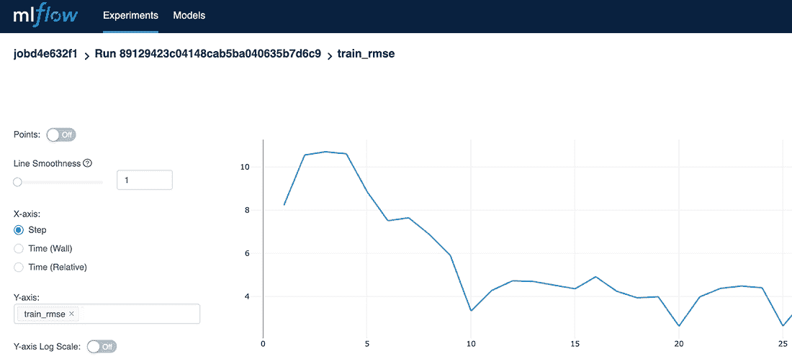

# 第十二章：机器学习管道

本章包括

+   了解具有实验管理和超参数优化的机器学习管道

+   为了减少样板代码，为 DC 出租车模型实现 Docker 容器

+   部署机器学习管道以训练模型

到目前为止，你已经学习了机器学习的各个独立阶段或步骤。一次只专注于机器学习的一个步骤有助于集中精力处理更可管理的工作范围。然而，要部署一个生产机器学习系统，有必要将这些步骤集成到一个单一的管道中：一个步骤的输出流入到管道后续步骤的输入中。此外，管道应该足够灵活，以便启用超参数优化（HPO）过程来管理并对管道各阶段执行的具体任务进行实验。

在本章中，您将了解到用于集成机器学习管道、部署到 AWS 并使用实验管理和超参数优化训练 DC 出租车车费估算机器学习模型的概念和工具。

## 12.1 描述机器学习管道

本节介绍了解释本章描述的机器学习管道实现所需的核心概念。

为了澄清本章描述的机器学习管道的范围，有助于从整个管道的输入和输出描述开始。在输入方面，管道期望的是从探索性数据分析（EDA）和数据质量（数据清理）过程产生的数据集。机器学习管道的输出是一个或多个训练好的机器学习模型，这意味着管道的范围不包括将模型部署到生产环境的步骤。由于管道的输入和输出要求人机交互（EDA 和数据质量）或可重复自动化（模型部署），它们都不在 HPO 的范围内。

要了解机器学习管道所需的期望特性，请参考图 12.1。


图 12.1 一个统一的机器学习管道可以在每个阶段进行超参数优化。

在图中，数据准备、特征工程和机器学习模型训练阶段由 HPO 管理。使用由 HPO 管理的阶段可能会导致关于是否

+   在数据准备阶段，具有缺失数值特征的训练示例将从训练数据集中删除或更新为将缺失值替换为特征的预期（均值）值

+   在特征工程阶段，数值位置特征（如纬度或经度坐标）将通过分箱转换为具有 64 或 128 个不同值的分类特征

+   在机器学习训练阶段，模型使用随机梯度下降（SGD）或 Adam 优化器进行训练

尽管实施图 12.1 中的管道可能看起来很复杂，但通过使用一系列 PyTorch 和配套框架，您将能够在本节结束时部署它。本节中管道的实施依赖于以下技术：

+   *MLFlow* — 用于开源实验管理

+   *Optuna* — 用于超参数优化

+   *Docker* — 用于管道组件打包和可重复执行

+   *PyTorch Lightning* — 用于 PyTorch 机器学习模型训练和验证

+   *Kaen* — 用于跨 AWS 和其他公共云提供商的管道供应和管理

在继续之前，总结一下将更详细地描述管道的 HPO 方面的关键概念是有帮助的。图 12.2 中的图表澄清了管道、HPO 和相关概念之间的关系。像 MLFlow 这样的实验管理平台（其他示例包括 Weights & Biases、Comet.ML 和 Neptune.AI）存储和管理实验实例，以便每个实例对应于不同的机器学习管道。例如，实验管理平台可以为实现训练 DC 出租车票价估算模型的机器学习管道存储一个实验实例，并为用于在线聊天机器人的自然语言处理模型训练的机器学习管道存储一个不同的实验实例。实验实例彼此隔离，但由单个实验管理平台管理。



图 12.2 实验管理器根据 HPO 设置控制管道执行（作业）实例。

每个实验实例使用 *父运行* 作为一个或多个机器学习管道执行（*子运行*）的集合。父运行配置为应用于多个管道执行的设置，例如 HPO 引擎（如 Optuna）使用的伪随机数种子的值。父运行还指定应执行以完成父运行的子运行（机器学习管道执行）的总数。由于每个机器学习管道执行还对应于一组唯一的超参数键/值对的组合，父运行指定的子运行数还指定了 HPO 引擎应生成的 HPO 试验（值集）的总数，以完成父运行。

机器学习管道代码与实验管理、超参数优化和机器学习模型训练的服务一起部署为 Docker 容器，在云提供商的虚拟专用云（VPC）网络中相互连接。该部署如图 12.3 所示。



图 12.3 具有 HPO 的机器学习管道部署为包含至少一个管理节点和一个工作节点以及可选管理节点和工作节点的一组 Docker 容器。

如图所示，为了部署具有 HPO 的机器学习管道，至少需要两个 Docker 容器在虚拟专用云网络上连接，部署中至少有一个管理器和至少一个工作节点。管理节点托管具有

+   实验管理服务（例如 MLFlow）

+   HPO 引擎（例如 Optuna）作为与实验管理集成的服务运行（例如 Kaen 的 BaseOptunaService）

+   实验管理用户界面

+   工作节点管理服务，用于在工作节点上安排和编排机器学习管道子运行

工作节点托管具有机器学习模型（例如 PyTorch 代码）的 Docker 容器，以及描述如何根据超参数（例如 PyTorch Lightning 代码）训练、验证和测试机器学习模型的代码。

请注意，管理节点和工作节点的生命周期与节点上 Docker 容器执行的生命周期不同。这意味着相同的节点可以托管多个容器实例的执行和多个机器学习管道运行，而无需进行配置或取消配置。此外，管理节点上的容器是长时间运行的，例如为了在多个机器学习管道执行期间提供实验服务用户界面和超参数优化引擎服务，而工作节点上的容器仅在机器学习管道执行期间保持运行。

尽管本节描述的部署配置可能看起来复杂，但节点的提供、机器学习中间件（实验管理、超参数优化等）以及机器学习管道在工作节点之间的执行的编排完全由 Kaen 框架和相关的 Docker 容器处理。您将在本章后面学习有关该框架以及如何在现有的 Kaen 容器上构建您的机器学习管道的更多信息。

## 12.2 使用 Kaen 启用 PyTorch 分布式训练支持

本节说明了如何使用 PyTorch DistributedDataParallel 类添加 PyTorch 分布式训练支持。通过本节的结束，DC 出租车费用模型的 train 方法将被扩展以与云环境中的分布式训练框架 Kaen 集成。

与本书前几章的代码和 Jupyter 笔记本说明不同，本章剩余部分的代码要求您的环境已安装 Docker 和 Kaen。有关安装 Docker 和开始使用的更多信息，请参阅附录 B。要将 Kaen 安装到已存在 Docker 安装的环境中，请执行

```py
pip install kaen[cli,docker]
```

这将下载并安装 kaen 命令行界面（CLI）到您的 shell 环境中。例如，如果 Kaen 安装正确，您可以使用以下命令获取有关 Kaen 命令的帮助：

```py
kaen --help
```

这应该会产生类似以下的输出：

```py
Usage: kaen [OPTIONS] COMMAND [ARGS]...

Options:
  --help  Show this message and exit.

Commands:
  dojo     Manage a dojo training environment.
  hpo      Manage hyperparameter optimization.
  init     Initialize a training dojo in a specified infrastructure...
  job      Manage jobs in a specific dojo training environment.
  jupyter  Work with a Jupyter notebook environment.
```

要执行本书其余部分的说明，请启动 Kaen Jupyter 环境，使用以下命令：

```py
kaen jupyter
```

从您的 shell 环境中执行以下命令，这应该会在您本地的 Docker 主机上启动一个专门的 Jupyter 笔记本环境作为一个新的 Docker 容器。kaen jupyter 命令还应该将您的默认浏览器导航到 Jupyter 主页，并在 shell 中输出类似以下的文本：

```py
Started Jupyter. Attempting to navigate to Jupyter in your browser using
➥ http://127.0.0.1:8888/?token=...
```

它指定了您可以在浏览器中使用的 URL，以打开新启动的 Jupyter 实例。

在 Jupyter 环境中，创建并打开一个新的笔记本。例如，您可以将笔记本命名为 ch12.ipynb。作为笔记本中的第一步，您应该执行 shell 命令

```py
!mkdir -p src
```

在此环境中为您的代码创建一个 src 目录。请记住，在 Jupyter 中的 Python 代码单元格中使用感叹号！时，其后的命令将在底层的 bash shell 中执行。因此，运行该代码的结果是在文件系统中创建一个 src 目录。

接下来，使用 %%writefile 魔术将 DC 出租车模型的最新版本（如第十一章所述）保存到 src 目录中的 model_v1.py 文件中。

列表 12.1 将实现保存到 model_v1.py

```py
%%writefile src/model_v1.py
import sys
import json
import time
import torch as pt
import pytorch_lightning as pl
from distutils.util import strtobool

pt.set_default_dtype(pt.float64)
class DcTaxiModel(pl.LightningModule):
    def __init__(self, **kwargs):
      super().__init__()
      self.save_hyperparameters()
      pt.manual_seed(int(self.hparams.seed))

      self.step = 0
      self.start_ts = time.perf_counter()
      self.train_val_rmse = pt.tensor(0.)

      #create a list of hidden layer neurons, e.g. [3, 5, 8]
      num_hidden_neurons = json.loads(self.hparams.num_hidden_neurons)

      self.layers = \
        pt.nn.Sequential(
          pt.nn.Linear(int(self.hparams.num_features),
                        num_hidden_neurons[0]),
          pt.nn.ReLU(),
          *self.build_hidden_layers(num_hidden_neurons, pt.nn.ReLU()),
          pt.nn.Linear(num_hidden_neurons[-1], 1)
      )

      if 'batch_norm_linear_layers' in self.hparams \
        and strtobool(self.hparams.batch_norm_linear_layers):
        self.layers = self.batch_norm_linear(self.layers)

    def build_hidden_layers(self, num_hidden_neurons, activation):
      linear_layers = [ pt.nn.Linear(num_hidden_neurons[i],
          num_hidden_neurons[i+1]) \
            for i in range(len(num_hidden_neurons) - 1) ]

      classes = [activation.__class__] * len(num_hidden_neurons)

      activation_instances = list(map(lambda x: x(), classes))

      hidden_layer_activation_tuples = \
        list(zip(linear_layers, activation_instances))

      hidden_layers = [i for sublist in \
        hidden_layer_activation_tuples for i in sublist]

      return hidden_layers

    def batch_norm_linear(self, layers):
      idx_linear = \
        list(filter(lambda x: type(x) is int,
            [idx if issubclass(layer.__class__, pt.nn.Linear) else None \
              for idx, layer in enumerate(layers)]))
      idx_linear.append(sys.maxsize)
      layer_lists = [list(iter(layers[s:e])) \
        for s, e in zip(idx_linear[:-1], idx_linear[1:])]
      batch_norm_layers = [pt.nn.BatchNorm1d(layer[0].in_features) \
        for layer in layer_lists]
      batch_normed_layer_lists = [ [bn, *layers] \
        for bn, layers in list(zip(batch_norm_layers, layer_lists)) ]
      return pt.nn.Sequential(*[layer \
        for nested_layer in batch_normed_layer_lists \
        for layer in nested_layer ])

    def batchToXy(self, batch):
      batch = batch.squeeze_()
      X, y = batch[:, 1:], batch[:, 0]
      return X, y

    def forward(self, X):
      y_est = self.layers(X)
      return y_est.squeeze_()

    def log(self, k, v, **kwargs):
        super().log(k, v,
                on_step = kwargs['on_step'],
                on_epoch = kwargs['on_epoch'],
                prog_bar = kwargs['prog_bar'],
                logger = kwargs['logger'],)

    def training_step(self, batch, batch_idx):
        self.step += 1

        X, y = self.batchToXy(batch) #unpack batch into features and label

        y_est = self.forward(X)

        loss = pt.nn.functional.mse_loss(y_est, y)

        for k,v in {
          "train_step": self.step,
          "train_mse": loss.item(),
          "train_rmse": loss.sqrt().item(),
          "train_steps_per_sec": \
            self.step / (time.perf_counter() - self.start_ts),

        }.items():
          self.log(k, v, step = self.step, on_step=True, on_epoch=True,
                                            prog_bar=True, logger=True)

        self.train_val_rmse = loss.sqrt()

        return loss

    def validation_step(self, batch, batch_idx):
      X, y = self.batchToXy(batch)

      with pt.no_grad():
          loss = pt.nn.functional.mse_loss(self.forward(X), y)

      for k,v in {
        "val_mse": loss.item(),
        "val_rmse": loss.sqrt().item(),
        "train_val_rmse": (self.train_val_rmse + loss.sqrt()).item(),
      }.items():
        self.log(k, v, step = self.step, on_step=True, on_epoch=True,
                                          prog_bar=True, logger=True)

      return loss

    def test_step(self, batch, batch_idx):
      X, y = self.batchToXy(batch)

      with pt.no_grad():
          loss = pt.nn.functional.mse_loss(self.forward(X), y)

      for k,v in {
          "test_mse": loss.item(),
          "test_rmse": loss.sqrt().item(),
      }.items():
        self.log(k, v, step = self.step, on_step=True, on_epoch=True,
                                          prog_bar=True, logger=True)

    def configure_optimizers(self):
        optimizers = {'Adam': pt.optim.AdamW,
                      'SGD': pt.optim.SGD}
        optimizer = optimizers[self.hparams.optimizer]

        return optimizer(self.layers.parameters(),
                            lr = float(self.hparams.lr))
```

由于列表 12.1 中的代码将 DC 出租车模型的版本 1 保存到名为 model_v1.py 的文件中，因此构建和测试该模型版本的过程的入口点（在 src 目录的 trainer.py 文件中）从加载 model_v1 包中的 DC 出租车模型实例开始：

```py
%%writefile src/trainer.py
from model_v1 import DcTaxiModel

import os
import time
import kaen
import torch as pt
import numpy as np
import pytorch_lightning as pl
import torch.distributed as dist
from torch.utils.data import DataLoader
from torch.nn.parallel import DistributedDataParallel

from kaen.torch import ObjectStorageDataset as osds

def train(model, train_glob, val_glob, test_glob = None):
    #set the pseudorandom number generator seed
    seed = int(model.hparams['seed']) \                          ❶
                if 'seed' in model.hparams \
                else int( datetime.now().microsecond )

    np.random.seed(seed)
    pt.manual_seed(seed)

    kaen.torch.init_process_group(model.layers)                  ❷

    trainer = pl.Trainer(gpus = pt.cuda.device_count() \
                            if pt.cuda.is_available() else 0,
        max_epochs = 1,
        limit_train_batches = int( model.hparams.max_batches ) \
                                 if 'max_batches' in model.hparams else 1,
        limit_val_batches = 1,
        num_sanity_val_steps = 1,
        val_check_interval = min(20, int( model.hparams.max_batches ) ),
        limit_test_batches = 1,
        log_every_n_steps = 1,
        gradient_clip_val=0.5,
        progress_bar_refresh_rate = 0,
        weights_summary = None,)

    train_dl = \
    DataLoader(osds(train_glob,
                    worker = kaen.torch.get_worker_rank(),
                    replicas = kaen.torch.get_num_replicas(),
                    shard_size = \                              ❸
                      int(model.hparams.batch_size),
                    batch_size = \                              ❹
                      int(model.hparams.batch_size),
                    storage_options = {'anon': False},
                   ),
               pin_memory = True)

    val_dl = \
    DataLoader(osds(val_glob,
                    batch_size = int(model.hparams.batch_size),
                    storage_options = {'anon': False},
                   ),
               pin_memory = True)

    trainer.fit(model,
              train_dataloaders = train_dl,
              val_dataloaders = val_dl)
    if test_glob is not None:
        test_dl = \
          DataLoader(osds(test_glob,
                          batch_size = int(model.hparams.batch_size),
                          storage_options = {'anon': False},
                         ),
                    pin_memory = True)

        trainer.test(model,
                    dataloaders=test_dl)

    return model, trainer

if __name__ == "__main__":
    model, trainer = train(DcTaxiModel(**{
            "seed": "1686523060",
            "num_features": "8",
            "num_hidden_neurons": "[3, 5, 8]",
            "batch_norm_linear_layers": "1",
            "optimizer": "Adam",
            "lr": "0.03",
            "max_batches": "1",
            "batch_size": str(2 ** 18),}),

      train_glob = \
        os.environ['KAEN_OSDS_TRAIN_GLOB'] \
          if 'KAEN_OSDS_TRAIN_GLOB' in os.environ \
          else 'https://raw.githubusercontent.com/osipov/smlbook/
➥                 master/train.csv',

      val_glob = \
        os.environ['KAEN_OSDS_VAL_GLOB'] \
          if 'KAEN_OSDS_VAL_GLOB' in os.environ \
          else 'https://raw.githubusercontent.com/osipov/smlbook/
➥                 master/valid.csv',

      test_glob = \
        os.environ['KAEN_OSDS_TEST_GLOB'] \
          if 'KAEN_OSDS_TEST_GLOB' in os.environ \
          else 'https://raw.githubusercontent.com/osipov/smlbook/
➥                 master/valid.csv')

    print(trainer.callback_metrics)
```

❶ 使用超参数或当前时间戳初始化伪随机数种子。

❷ 自动更新 DC 出租车模型，以利用多个训练节点（如果有的话）。

❸ 正如第八章中所述，在分布式集群中，shard_size 往往不同于 . . .

❹ . . . 用于计算梯度的 batch_size。

在此时，您可以通过从您的 shell 环境中运行以下命令对 trainer.py 进行单元测试。

列表 12.2 运行一个简单的测试来确认实现是否按预期工作。

```py
%%bash
python3 src/trainer.py
```

这应该会使用 DC 出租车数据的小样本训练、测试并报告您模型的度量标准。

### 12.2.1 理解 PyTorch 分布式训练设置

本节说明了执行分布式训练时 PyTorch 模型所期望的环境变量和相关设置的配置。

PyTorch 模型的分布式训练方法出奇的简单。尽管原生的 PyTorch 不提供与 AWS、Azure 或 GCP 等云提供商的集成，但列表 12.3 中的代码说明了如何使用 Kaen 框架（[`kaen.ai`](http://kaen.ai)）在云提供商中桥接 PyTorch 和 PyTorch Lightning，实现分布式训练。

kaen.torch.init_process_ group 方法使用的 PyTorch 特定实现，使得 DC 出租车模型的分布式训练成为可能，如模型 PyTorch Lightning 模块所指定的，其中 PyTorch torch.nn.Sequential 层存储在 model.layers 属性中。

清单 12.3 Kaen 框架配置 PyTorch 模型

```py
#pytorch distributed training requires MASTER_ADDR and MASTER_PORT to be set
os.environ['MASTER_ADDR'] = \
  os.environ['KAEN_JOB_MANAGER_IP'] \                            ❶
  if 'KAEN_JOB_MANAGER_IP' in os.environ else "127.0.0.1"

MASTER_ADDR = os.environ['MASTER_ADDR']
os.environ['MASTER_PORT'] = \                                    ❷
  os.environ['MASTER_PORT'] if 'MASTER_PORT' in os.environ else "12355"
MASTER_PORT = os.environ['MASTER_PORT']

BACKEND = os.environ['KAEN_BACKEND'] \                           ❸
                    if 'KAEN_BACKEND' in os.environ else "gloo"
RANK = int(os.environ['KAEN_RANK'])                              ❹
WORLD_SIZE = int(os.environ['KAEN_WORLD_SIZE'])                  ❺

if not dist.is_initialized():
    dist.init_process_group(init_method = "env://",              ❻
                            backend = BACKEND,
                            rank = RANK,
                            world_size = WORLD_SIZE)
    model.layers = \                                              ❼
      DistributedDataParallel(model.layers, device_ids=[])
```

❶ 将 PyTorch 的 MASTER_ADDR 设置为本地主机地址，除非 Kaen 另有规定。

❷ 将 PyTorch 的 MASTER_PORT 设置为 12355，除非 MASTER_PORT 变量中另有规定。

❸ 除非 KAEN_BACKEND 另有规定，否则使用基于 CPU 的 gloo 后端。

❹ 初始化分布式数据并行训练的等级 . . .

❺ . . . 并根据 KAEN_RANK 和 KAEN_WORLD_SIZE 变量设置训练节点的计数。

❻ 确保分布式训练进程组已准备好进行训练。

❼ 使用 DistributedDataParallel 为模型启用分布式训练。

当使用 DistributedDataParallel 实现训练 PyTorch 模型时，在训练开始之前必须满足几个先决条件。首先，必须为网络上的模型训练管理节点配置分布式训练库的 MASTER_ADDR 和 MASTER_PORT 环境变量。即使在单节点场景中使用 DistributedDataParallel，也必须指定这些值。在单节点场景中，MASTER_ADDR 和 MASTER_ PORT 的值分别初始化为 127.0.0.1 和 12355。当分布式训练集群由多个节点组成时，MASTER_ADDR 必须对应于集群中的管理节点的 IP 地址（根据第十一章中的描述，即节点等级为 0 的节点）。

Kaen 框架可以使用 PyTorch 训练的管理节点的运行时 IP 地址初始化您的模型训练环境。因此，在示例中，如果 Kaen 框架设置了后者的环境变量，则将 MASTER_ADDR 初始化为 KAEN_ JOB_MANAGER_IP 的值，否则将其初始化为 127.0.0.1（用于单节点训练）。在示例中，默认情况下将 MASTER_PORT 初始化为 12355，除非在启动训练运行时之前预先设置了不同的值。

注意，init_process_group 方法的 init_method 参数被硬编码为 env://，以确保分布式训练初始化根据前述的 MASTER_ADDR 和 MASTER_PORT 环境变量的值发生。虽然可以使用文件或键/值存储进行初始化，但在本示例中演示了基于环境的方法，因为它是 Kaen 框架本地支持的。 

除了初始化方法之外，请注意 init_process_group 是使用 BACKEND、WORKER 和 REPLICAS 设置的值调用的。BACKEND 设置对应于 PyTorch 支持的几个分布式通信后端库之一的名称。 （这些库支持的特性的详细信息在此处可用：[`pytorch.org/docs/stable/distributed.html`](https://pytorch.org/docs/stable/distributed.html)。）gloo 用于启用基于 CPU 的分布式训练，而 nccl 则用于基于 GPU 的分布式训练。由于基于 CPU 的分布式训练更容易、更便宜，并且通常更快地在云提供商（如 AWS）中预配，因此本章首先关注基于 CPU 的训练，然后再介绍如何引入支持基于 GPU 的训练所需的更改。

初始化分布式训练所需的 RANK 和 WORLD_SIZE 值也由 Kaen 框架提供。WORLD_SIZE 值对应于用于分布式训练的节点的整数计数的自然计数（即，从一开始），而 RANK 值对应于在 PyTorch 模型中执行 Python 运行时训练的节点的从零开始的整数索引。请注意，RANK 和 WORLD_SIZE 都是根据 Kaen 框架的环境变量设置进行初始化的。例如，如果您实例化一个仅包含单个训练节点的 Kaen 训练环境，则 KAEN_WORLD_SIZE 设置为 1，而单个训练节点的 RANK 值设置为 0。相比之下，对于由 16 个节点组成的分布式 Kaen 训练环境，KAEN_WORLD_SIZE 初始化为 16，并且每个训练节点分配了范围为 [0, 15] 的 RANK 值，换句话说，包括起始（0）索引和结束（15）索引。

最后，请注意，仅在检查 is_initialized 状态之后才初始化 DistributedDataParallel 训练。初始化涉及使用此部分前述的 backend、rank 和 world_size 设置执行 init_process_group。一旦初始化完成（换句话说，init_process_group 返回），就会将 DistributedDataParallel 实例包装在基于 PyTorch nn.Module 的模型实例周围，并将其分配给示例中的 model.nn。此时，模型已准备好通过分布式集群进行训练。

## 12.3 在本地 Kaen 容器中对模型训练进行单元测试

这一部分描述了如何在本地的 Kaen 容器中对模型实现进行单元测试，然后再将代码部署到像 AWS 这样的云环境中。

尽管代码实现支持分布式训练，但无需在云提供商中预留（和支付）分布式训练环境即可进行测试。您将通过下载为面向 AWS 的 PyTorch 模型提供的 Kaen 提供的基础容器镜像来开始单元测试。

确保您可以使用 DockerHub 进行身份验证，您可以下载基础容器镜像。一旦您在 Kaen Jupyter 环境中执行以下代码片段，您将被提示输入您的 DockerHub 用户名，然后将其存储在 DOCKER_HUB_USER Python 变量中：

```py
DOCKER_HUB_USER = input()
DOCKER_HUB_USER
```

接下来，在提示时输入您的用户名的 DockerHub 密码。请注意，验证完成后，密码将从 DOCKER_HUB_PASSWORD 变量中清除出来：

```py
import getpass
DOCKER_HUB_PASSWORD = getpass.getpass()

!echo "{DOCKER_HUB_PASSWORD}" | \
docker login --username {DOCKER_HUB_USER} --password-stdin

DOCKER_HUB_PASSWORD = None
```

如果您指定了有效的 DockerHub 凭据，您应该看到一个显示“登录成功”的输出消息。

基本的 PyTorch Docker 镜像相当庞大，大约为 1.9 GB。基于 Kaen 的 PyTorch 镜像 (kaenai/pytorch-mlflow-aws-base:latest)，添加了支持 AWS 和 MLFlow 的二进制文件，大约大小为 2 GB，所以请做好准备，以下下载将根据您的互联网连接速度需要几分钟。

要执行下载，请运行

```py
!docker pull kaenai/pytorch-mlflow-aws-base:latest
```

下载完成后，您可以使用以下 Dockerfile 将您的源代码打包到一个从 kaenai/pytorch-mlflow-aws-base:latest 派生的镜像中。请注意，该文件只是将 Python 源代码复制到镜像文件系统的 /workspace 目录中：

```py
%%writefile Dockerfile
FROM kaenai/pytorch-mlflow-aws-base:latest
COPY *.py /workspace/
```

由于本章早些时候描述的源代码文件 model_v1.py 和 trainer.py 被保存到了一个 src 目录中，请注意以下命令构建您的 Docker 镜像时将 src/ 目录作为 Docker 镜像构建过程的根目录。为了确保您构建的镜像可以上传到 DockerHub，镜像使用 {DOCKER_HUB_USER} 作为前缀进行标记：

```py
!docker build -t {DOCKER_HUB_USER}/dctaxi:latest -f Dockerfile src/
```

在 docker build 命令完成后，您可以使用以下命令运行您新创建的 Docker 容器

```py
!docker run -it {DOCKER_HUB_USER}/dctaxi:latest \
"python /workspace/trainer.py"
```

这应该产生一个与列表 12.2 输出相同的输出。为什么要费心创建 Docker 镜像呢？回想一下，拥有 Docker 镜像将简化在诸如 AWS 等云服务提供商环境中部署和训练模型的过程。如何将镜像从您的本地环境共享到云服务提供商环境？通常，Docker 镜像是使用 DockerHub 等 Docker Registry 实例进行共享的。

要推送（上传）您新构建的镜像到 DockerHub，执行

```py
!docker push {DOCKER_HUB_USER}/dctaxi:latest
```

由于 docker push 操作只需要推送源代码（Python 文件）的内容到 DockerHub，所以应该在几秒钟内完成。您的 dctaxi 镜像的其余部分是从基础 kaenai/pytorch-mlflow-aws-base:latest 镜像挂载的。

## 12.4 使用 Optuna 进行超参数优化

本节介绍了用于 HPO 的 Optuna 和如何使用 Kaen 框架为 DC 出租车车费估算模型添加 HPO 支持。

到目前为止，您已经使用静态的超参数值对模型训练进行了单元测试。回想一下第十一章，您可以使用 Optuna 对您的代码执行超参数优化（HPO）。

Optuna 是 Kaen 支持的几种 HPO 框架之一。要在分布式训练中纳入对 HPO 的支持，您需要使用一个将 Optuna 作为服务将其公开给您的代码的基于 Kaen 的 Docker 映像，并实现一个可子类化的 Python 类命名为 BaseOptunaService。回想一下，Optuna 中的超参数是使用试验 API 指定的。Kaen 中的 BaseOptunaService 提供了对 BaseOptunaService 子类中的 Optuna 试验实例的访问。例如：

```py
import optuna
import numpy as np
from kaen.hpo.optuna import BaseOptunaService
class DcTaxiHpoService(BaseOptunaService):
  def hparams(self):
    trial = self._trial         ❶

    #define hyperparameter
    return {
        "seed": \               ❷
          trial.suggest_int('seed', 0, np.iinfo(np.int32).max)
    }
```

❶ _trial 属性引用 Optuna 试验实例。

❷ 试验实例支持 Optuna 试验 API 方法，例如 suggest_int。

注意，在 hparams 方法返回的字典实例中，有一个超参数向 Optuna 请求。suggest_int 方法是 Optuna 试验 API 中可用的几种方法之一，用于获取超参数的值。 （试验接口中可用的其他方法在这里描述：[`optuna.readthedocs.io/en/stable/reference/generated/optuna.trial.Trial.html#`](https://optuna.readthedocs.io/en/stable/reference/generated/optuna.trial.Trial.html#)。） 在本例中，suggest_int('seed', 0, np.iinfo(np.int32).max) 方法指定 Optuna 应推荐从 0 到包括正 32 位整数的最大值的伪随机数种子生成器的值。

回想一下，DcTaxiModel 的训练还依赖于额外的超参数值，包括 optimizer、bins、lr（学习率）、num_hidden_neurons、batch_size 和 max_batches。本书第十一章介绍了使用 Optuna 试验 API 实现这些超参数。要在 DcTaxiHpoService 类的实现中启用对这些超参数的支持，您需要扩展 hparams 方法返回的字典，使用 Optuna 对应超参数值的规范来尝试：

```py
def hparams(self):
  trial = self._trial

  return {
    "seed": \
        trial.suggest_int('seed', 0, np.iinfo(np.int32).max - 1),

    "optimizer": \
        trial.suggest_categorical('optimizer', ['Adam']),

    "lr": \
        trial.suggest_loguniform('lr', 0.001, 0.1),

    "num_hidden_neurons": \
        [trial.suggest_categorical(f"num_hidden_layer_{layer}_neurons", \
            [7, 11, 13, 19, 23]) for layer in \
            range(trial.suggest_categorical('num_layers',
                                            [11, 13, 17, 19]))],

    "batch_size": \
        trial.suggest_categorical('batch_size',
                                  [2 ** i for i in range(16, 22)]),

    "max_batches": \
        trial.suggest_int('max_batches', 40, 400, log = True)
  }
```

除了试验，Optuna 还使用了一个“研究”（相当于 MLFlow 父运行），它是试验的集合。在 Kaen 框架中，Optuna 研究用于生成关于试验摘要统计信息的报告，以及生成形式为已完成试验的自定义可视化报告。

要持久化试验摘要统计信息，您可以使用 Optuna 研究 API 的 trials_dataframe 方法，该方法返回一个 pandas DataFrame，描述了已完成试验以及关联超参数值的摘要统计信息。请注意，在下面的示例中，数据帧基于实验名称持久化为 html 文件：

```py
def on_experiment_end(self, experiment, parent_run):
    study = self._study
    try:
      for key, fig in {
        "plot_param_importances": \
            optuna.visualization.plot_param_importances(study),

        "plot_parallel_coordinate_all": \
            optuna.visualization.plot_parallel_coordinate(study, \
                params=["max_batches",
                        "lr",
                        "num_hidden_layer_0_neurons",
                        "num_hidden_layer_1_neurons",
                        "num_hidden_layer_2_neurons"]),

        "plot_parallel_coordinate_l0_l1_l2": \
            optuna.visualization.plot_parallel_coordinate(study, \
                params=["num_hidden_layer_0_neurons",
                        "num_hidden_layer_1_neurons",
                        "num_hidden_layer_2_neurons"]),

        "plot_contour_max_batches_lr": \
            optuna.visualization.plot_contour(study, \
                params=["max_batches", "lr"]),
      }.items():
        fig.write_image(key + ".png")
        self.mlflow_client.log_artifact(run_id = parent_run.info.run_id,
                            local_path = key + ".png")

    except:
      print(f"Failed to correctly persist experiment 
➥             visualization artifacts")
      import traceback
      traceback.print_exc()

    #log the dataframe with the study summary
    study.trials_dataframe().describe().to_html(experiment.name + ".html")
    self.mlflow_client.log_artifact(run_id = parent_run.info.run_id,
                        local_path = experiment.name + ".html")

    #log the best hyperparameters in the parent run
    self.mlflow_client.log_metric(parent_run.info.run_id,
                                  "loss", study.best_value)
    for k, v in study.best_params.items():
      self.mlflow_client.log_param(parent_run.info.run_id, k, v)
```

在示例中，对 Optuna API 的调用是在 on_experiment_end 方法的上下文中执行的，该方法在实验结束后由 BaseOptunaService 基类调用。在将包含实验摘要统计信息的 html 文件持久化后，方法的剩余部分生成并持久化使用 Optuna 可视化包 ([`mng.bz/4Kxw`](http://mng.bz/4Kxw)) 的研究的可视化效果。请注意，对于每个可视化效果，相应的图像都会持久化到一个 png 文件中。

代码中的 mlflow_client 充当对 MLFlow 客户端 API ([`mng.bz/QqjG`](http://mng.bz/QqjG)) 的通用引用，使得可以从 MLFlow 中读取和写入数据，并监视实验的进展。parent_run 变量是对“父”运行的引用，或者说是具有 Optuna HPO 服务建议的特定超参数值配置的一系列试验或执行。

本章描述的整个 HPO 实现如下代码片段所示。请注意，该片段将实现源代码保存为 src 文件夹中的 hpo.py 文件：

```py
%%writefile src/hpo.py
import optuna
import numpy as np
from kaen.hpo.optuna import BaseOptunaService

class DcTaxiHpoService(BaseOptunaService):
  def hparams(self):
    trial = self._trial

    #define hyperparameters
    return {
      "seed": trial.suggest_int('seed', 0, np.iinfo(np.int32).max - 1),
      "optimizer": trial.suggest_categorical('optimizer', ['Adam']),
      "lr": trial.suggest_loguniform('lr', 0.001, 0.1),
      "num_hidden_neurons": \
        [trial.suggest_categorical(f"num_hidden_layer_{layer}_neurons",
          [7, 11, 13, 19, 23]) for layer in \
            range(trial.suggest_categorical('num_layers',
                                            [11, 13, 17, 19]))],

      "batch_size": \
        trial.suggest_categorical('batch_size', \
                                  [2 ** i for i in range(16, 22)]),

      "max_batches": trial.suggest_int('max_batches', 40, 400, log = True)
    }

  def on_experiment_end(self, experiment, parent_run):
    study = self._study
    try:
      for key, fig in {
        "plot_param_importances": \
          optuna.visualization.plot_param_importances(study),
        "plot_parallel_coordinate_all": \
          optuna.visualization.plot_parallel_coordinate(study,
            params=["max_batches",
                    "lr",
                    "num_hidden_layer_0_neurons",
                    "num_hidden_layer_1_neurons",
                    "num_hidden_layer_2_neurons"]),
        "plot_parallel_coordinate_l0_l1_l2": \
          optuna.visualization.plot_parallel_coordinate(study,
            params=["num_hidden_layer_0_neurons",
            "num_hidden_layer_1_neurons",
            "num_hidden_layer_2_neurons"]),

        "plot_contour_max_batches_lr": \
          optuna.visualization.plot_contour(study,
            params=["max_batches", "lr"]),
      }.items():
        fig.write_image(key + ".png")
        self.mlflow_client.log_artifact(run_id = parent_run.info.run_id,
                            local_path = key + ".png")

    except:
      print(f"Failed to correctly persist experiment 
➥             visualization artifacts")
      import traceback
      traceback.print_exc()

    #log the dataframe with the study summary
    study.trials_dataframe().describe().to_html(experiment.name + ".html")
    self.mlflow_client.log_artifact(run_id = parent_run.info.run_id,
                        local_path = experiment.name + ".html")

    #log the best hyperparameters in the parent run
    self.mlflow_client.log_metric(parent_run.info.run_id,
                                    "loss", study.best_value)
    for k, v in study.best_params.items():
      self.mlflow_client.log_param(parent_run.info.run_id, k, v)
```

有了源代码，你就可以将其打包成一个 Docker 容器。首先拉取一个用于 Optuna 和 MLFlow 的基本 Kaen 容器：

```py
!docker pull kaenai/optuna-mlflow-hpo-base:latest
```

一旦完成，使用以下命令为派生图像创建一个 Dockerfile：

```py
%%writefile Dockerfile
FROM kaenai/optuna-mlflow-hpo-base:latest
ENV KAEN_HPO_SERVICE_PREFIX=hpo \
    KAEN_HPO_SERVICE_NAME=DcTaxiHpoService

COPY hpo.py /workspace/.
```

请注意，你的 DcTaxiHpoService 实现的软件包前缀对应于文件名 hpo.py，分别由 KAEN_HPO_SERVICE_NAME 和 KAEN_HPO_SERVICE_PREFIX 环境变量指定。保存 Dockerfile 后，通过以下命令构建图像：

```py
!docker build -t {DOCKER_HUB_USER}/dctaxi-hpo:latest -f Dockerfile src/
```

并将其推送到 DockerHub：

```py
!docker push {DOCKER_HUB_USER}/dctaxi-hpo:latest.
```

### 12.4.1 启用 MLFlow 支持

本节描述如何在你的 DcTaxiModel 和 MLFlow 框架之间添加集成，以管理和跟踪 HPO 实验。

尽管基本 kaenai/pytorch-mlflow-aws-base:latest 图像包含对 MLFlow 的支持，但 trainer.py 中的训练实现没有利用 MLFlow 实验管理和跟踪功能。由于 MLFlow 使用实验的概念来组织一系列 HPO 试验和运行，Kaen 提供了一个 BaseMLFlowClient 类，可以用来为 DcTaxiModel 实现一个由 MLFlow 管理的实验。BaseMLFlowClient 的子类负责使用 BaseMLFlowClient 从 MLFlow 和 Optuna 获取的超参数值实例化未训练的 PyTorch 模型实例。

首先，在你的 Kaen Jupyter 环境中运行以下命令保存名为 DcTaxiExperiment 的 BaseMLFlowClient 子类的一个实例：

```py
%%writefile src/experiment.py
import os
from model_v1 import DcTaxiModel
from trainer import train
from kaen.hpo.client import BaseMLFlowClient

class DcTaxiExperiment(BaseMLFlowClient):

    def on_run_start(self, run_idx, run):
        print(f"{run}({run.info.status}): starting...")

        #create a set of default hyperparameters
        default_hparams = {"seed": "1686523060",
                        "num_features": "8",
                        "num_hidden_neurons": "[3, 5, 8]",
                        "batch_norm_linear_layers": "1",
                        "optimizer": "Adam",
                        "lr": "0.03",
                        "max_batches": "1",
                        "batch_size": str(2 ** 18),}

        #fetch the MLFlow hyperparameters if available
        hparams = run.data.params if run is not None \
                    and run.data is not None else \
                    default_hparams

        #override the defaults with the MLFlow hyperparameters
        hparams = {**default_hparams, **hparams}

        untrained_model = DcTaxiModel(**hparams)
        def log(self, k, v, **kwargs):
            if self.mlflow_client and 0 == int(os.environ['KAEN_RANK']):
                if 'step' in kwargs and kwargs['step'] is not None:
                    self.mlflow_client.log_metric(run.info.run_id,
                      k, v, step = kwargs['step'])
                else:
                    self.mlflow_client.log_metric(run.info.run_id,
                       k, v)

        import types
        untrained_model.log = types.MethodType(log, self)

        model, trainer = \
          train(untrained_model,
                train_glob = os.environ['KAEN_OSDS_TRAIN_GLOB'],
                val_glob = os.environ['KAEN_OSDS_VAL_GLOB'],
                test_glob = os.environ['KAEN_OSDS_TEST_GLOB'])

        print(trainer.callback_metrics)
```

这将代码保存到 src/experiment.py 文件中。

有了实验支持，你就可以使用以下命令构建更新的 dctaxi 图像：

```py
%%writefile Dockerfile
FROM kaenai/pytorch-mlflow-aws-base:latest
COPY * /workspace/
ENV KAEN_HPO_CLIENT_PREFIX=experiment \
    KAEN_HPO_CLIENT_NAME=DcTaxiExperiment
```

它指定了一个新的入口点进入镜像，使用 experiment.py 中的 experiment.DcTaxiExperiment 来更改 KAEN_HPO_CLIENT_PREFIX 和 KAEN_HPO_CLIENT_NAME 环境变量的默认值。

与以前一样，使用以下命令构建你的 dctaxi 镜像。

```py
!docker build -t {DOCKER_HUB_USER}/dctaxi:latest -f Dockerfile src/
```

并使用以下命令将其推送到 DockerHub。

```py
!docker push {DOCKER_HUB_USER}/dctaxi:latest.
```

### 12.4.2 在本地 Kaen 提供程序中为 DcTaxiModel 使用 HPO

此时，你已经准备好构建一个能够建议超参数优化试验并管理试验运行的 Docker 容器。在容器中，超参数值由 Optuna 建议，并且基于这些值的试验由 MLFlow 管理。

在配置更昂贵的云提供程序之前，最好先通过配置本地 Kaen 提供程序来开始，以便你可以对 HPO 和模型训练代码进行单元测试。你可以通过执行以下命令创建一个 Kaen 训练 *道场*。

```py
!kaen dojo init --provider local
```

它应该返回新创建的 Kaen 道场的字母数字标识符。

你可以使用以下命令列出工作空间中可用的 Kaen 道场。

```py
!kaen dojo ls
```

它应该打印出你刚刚创建的道场的 ID。

你将希望将道场的标识符保存为 Python 变量以供将来使用，你可以使用以下 Jupyter 语法将 bash 脚本赋值给 Python 变量。

```py
[MOST_RECENT_DOJO] = !kaen dojo ls | head -n 1
MOST_RECENT_DOJO
```

在 Kaen 道场用于训练之前，它应该被激活。通过运行以下命令激活由 MOST_RECENT_DOJO 变量中的标识符指定的道场。

```py
!kaen dojo activate {MOST_RECENT_DOJO}
```

由于 Jupyter 的 ! shell 快捷方式提供了对 Python 变量的访问，因此在前面的代码片段中，{MOST_RECENT_DOJO} 语法将替换为相应 Python 变量的值。你可以通过检查来确认道场是否激活。

```py
!kaen dojo inspect {MOST_RECENT_DOJO}
```

它应该包含一个输出行，其中包含 KAEN_DOJO_STATUS=active。

在你能够在道场中启动训练作业之前，你需要创建一个指定了道场和用于训练的 Kaen 镜像的作业。

要创建一个训练 DcTaxiModel 的作业，请执行以下命令。

```py
!kaen job create --dojo {MOST_RECENT_DOJO} \
--image {DOCKER_HUB_USER}/dctaxi:latest
```

它将尝试从 DockerHub 拉取指定的镜像，如果成功，则会返回作业的字母数字标识符。

与道场一样，你可以使用以下命令将作业标识保存到 Python 变量中。

```py
[MOST_RECENT_JOB] = !kaen job ls | head -n 1
MOST_RECENT_JOB
```

它应该打印出你创建的作业的标识符。

Kaen 中的每个作业都配置了专用的网络设置，你可以通过运行以下命令来检查。

```py
!kaen job inspect {MOST_RECENT_JOB}
```

由于你还没有为这个作业启用 HPO，所以检查的作业设置中不包含用于提供 MLFlow 实验管理和 Optuna 超参数值的 HPO 镜像的信息。你可以通过执行以下命令来配置作业进行一次 HPO 运行。

```py
!kaen hpo enable \
--image {DOCKER_HUB_USER}/dctaxi-hpo:latest \
--num-runs 1 \
--service-prefix hpo \
--service-name DcTaxiHpoService \
--port 5001 5001 \
{MOST_RECENT_JOB}
```

它会覆盖你的 dctaxi-hpo 镜像的默认设置，以指定使用 hpo.DcTaxiHpoService 类来启动 HPO 服务。执行的语句还使用 --port 设置配置了 MLFlow UI 端口 5001。

假设 hpo enable 命令成功完成，你可以再次检查作业以观察与 HPO 相关的设置：

```py
!kaen job inspect {MOST_RECENT_JOB}
```

请注意，此时输出中包括 KAEN_HPO_MANAGER_IP，用于内部 Docker 网络的 IP 地址（由 KAEN_JOB_SUBNET 指定），该网络处理容器实例之间的通信。

此时，HPO 服务应该已经启动并运行，因此您应该能够通过将浏览器导航到 http://127.0.0.1:5001 访问 MLFlow 用户界面，该界面应该显示类似于图 12.4 的屏幕。请注意，在您探索 HPO 实验的详细信息之前，您需要在 MLFlow 界面的左侧边栏中打开以 job 前缀开头的 MLFlow 实验。



图 12.4 屏幕截图显示了 MLFlow 基于浏览器的界面，展示了实验实例的父运行和唯一的子运行

由于此时您刚刚启动了 HPO 服务，因此您的实验只包括一个父运行和一个子运行。主运行与 MLFlow 实验具有一对一的关系，并包含定义应由机器学习管道执行实例使用的特定超参数配置的各个子运行。如果您在 MLFlow 用户界面中导航到子运行，则应看到类似于图 12.5 截图的屏幕。



图 12.5 MLFlow 屏幕截图显示了 Optuna HPO 建议的设置，用于子运行

要使用您 AWS 存储桶中的可用数据在本地提供程序中开始训练模型，您需要配置环境变量与您的 AWS 凭据。在以下代码片段中，将 Python None 替换为您的匹配 AWS 凭据的值，用于 AWS_ACCESS_KEY_ID、AWS_SECRET_ACCESS_KEY 和 AWS_DEFAULT_REGION。同时，对于您的 BUCKET_ID 值，进行相同的替换，并执行代码以在您的 Kaen Jupyter 环境中配置相应的环境变量：

```py
import os
os.environ['MOST_RECENT_JOB'] = MOST_RECENT_JOB

os.environ['BUCKET_ID'] = None
os.environ['AWS_ACCESS_KEY_ID'] = None
os.environ['AWS_SECRET_ACCESS_KEY'] = None
os.environ['AWS_DEFAULT_REGION'] = None
```

我建议您从您的 bash shell 中执行以下一系列 echo 命令，以确保所有环境变量都配置如预期：

```py
%%bash
echo $BUCKET_ID
echo $AWS_ACCESS_KEY_ID
echo $AWS_SECRET_ACCESS_KEY
echo $AWS_DEFAULT_REGION
echo $MOST_RECENT_JOB
```

现在，您可以通过运行 kaen job start 来开始训练您的模型。为了简单起见，首先使用单个训练工作者进行训练（由 --replicas 1 指定）。请注意，命令中的 KAEN_OSDS 环境变量指向您在 AWS 存储桶中的数据 CSV 文件：

```py
!kaen job start \
--replicas 1 \
-e KAEN_HPO_JOB_RUNS 1 \
-e AWS_DEFAULT_REGION $AWS_DEFAULT_REGION \
-e AWS_ACCESS_KEY_ID $AWS_ACCESS_KEY_ID \
-e AWS_SECRET_ACCESS_KEY $AWS_SECRET_ACCESS_KEY \
-e KAEN_OSDS_TRAIN_GLOB "s3://dc-taxi-$BUCKET_ID-
➥ $AWS_DEFAULT_REGION/csv/dev/part*.csv" \
-e KAEN_OSDS_VAL_GLOB "s3://dc-taxi-$BUCKET_ID-
➥ $AWS_DEFAULT_REGION/csv/test/part*.csv" \
-e KAEN_OSDS_TEST_GLOB "s3://dc-taxi-$BUCKET_ID-
➥ $AWS_DEFAULT_REGION/csv/test/part*.csv" \
$MOST_RECENT_JOB
```

当训练作业正在运行时，您应该能够在 MLFlow 用户界面中导航到子运行的详细信息，假设您的训练过程至少运行了 25 个训练步骤，则 train_rmse 指标的结果图表应该类似于图 12.6 中的图表。



图 12.6 MLFlow 屏幕截图显示了 train_rmse 指标的图表

### 12.4.3 使用 Kaen AWS 提供程序进行训练

本节说明了如何使用 Kaen 框架在 AWS 虚拟私有云环境中训练容器，而不是在本地提供者中，这样你就可以利用 AWS 中提供的弹性、水平扩展。

要在 AWS 中创建一个 Kaen 道场，你需要在运行 kaen init 时使用 --provider aws 设置。默认情况下，在使用 AWS 提供者时，Kaen 会在 AWS 中将 t3.micro 实例作为 worker 和 manager 节点。尽管 t3.micro 实例是适用于简单演示的低成本默认值，但对于 DcTaxiModel，我建议按照以下方式提供 t3.large 实例：

```py
!kaen dojo init --provider aws \
--worker-instance-type t3.xlarge --manager-instance-type t3.xlarge
```

在成功创建后，应该报告道场 ID。

要配置 MOST_RECENT_DOJO Python 变量，你应该执行以下操作：

```py
[MOST_RECENT_DOJO] = !kaen dojo ls | head -n 1
MOST_RECENT_DOJO
```

然后使用以下命令激活道场：

```py
!kaen dojo activate {MOST_RECENT_DOJO}
```

注意，如果你提供了性能不足的 AWS 节点实例（例如 t3.micro），激活过程可能需要一些时间。一旦激活正确完成，你应该能够使用以下命令检查道场：

```py
!kaen dojo inspect {MOST_RECENT_DOJO}
```

输出应包含以 KAEN_DOJO_STATUS=active 开头的一行以及激活完成的时间戳。

与本地提供者一样，要在 AWS 中执行训练，你应该首先创建一个作业：

```py
!kaen job create --dojo {MOST_RECENT_DOJO} \
--image {DOCKER_HUB_USER}/dctaxi:latest
```

与本地提供者不同，在 AWS 提供者中运行 kaen job create 可能需要一些时间。这是因为你推送到 DockerHub 的 dctaxi 镜像需要下载到 AWS 道场中的 AWS 节点。作业创建完成后，你应该使用以下命令将作业 ID 保存到 MOST_RECENT_JOB Python 变量中：

```py
[MOST_RECENT_JOB] = !kaen job ls | head -n 1
os.environ['MOST_RECENT_JOB'] = MOST_RECENT_JOB
MOST_RECENT_JOB
```

这也将 MOST_RECENT_JOB 环境变量设置为与相应 Python 变量匹配的值。

接下来，使用以下命令为作业启用 HPO：

```py
!kaen hpo enable \
--num-runs 1 \
--image {DOCKER_HUB_USER}/dctaxi-hpo:latest \
--service-prefix hpo \
--service-name DcTaxiHpoService \
--port 5001 5001 \
{MOST_RECENT_JOB}
```

一旦 kaen hpo enable 操作完成，你可以通过构造笔记本中的 URL 打开 MLFlow 用户界面：

```py
!echo "http://$(kaen dojo inspect {MOST_RECENT_DOJO} \
| grep KAEN_DOJO_MANAGER_IP | cut -d '=' -f 2):5001"
```

并在浏览器中导航到 URL。由于 MLFlow UI 可能需要几秒钟才能变为可用（取决于 AWS 管理节点实例的性能），你可能需要刷新浏览器才能访问该界面。

要开始训练，kaen job start 命令与之前使用的相同：

```py
!kaen job start \
--replicas 1 \
-e AWS_DEFAULT_REGION $AWS_DEFAULT_REGION \
-e AWS_ACCESS_KEY_ID $AWS_ACCESS_KEY_ID \
-e AWS_SECRET_ACCESS_KEY $AWS_SECRET_ACCESS_KEY \
-e KAEN_OSDS_TRAIN_GLOB "s3://dc-taxi-$BUCKET_ID-
➥ $AWS_DEFAULT_REGION/csv/dev/part*.csv" \
-e KAEN_OSDS_VAL_GLOB "s3://dc-taxi-$BUCKET_ID-
➥ $AWS_DEFAULT_REGION/csv/test/part*.csv" \
-e KAEN_OSDS_TEST_GLOB "s3://dc-taxi-$BUCKET_ID-
➥ $AWS_DEFAULT_REGION/csv/test/part*.csv" \
$MOST_RECENT_JOB
```

与本地提供者的情况类似，你可以在浏览器中导航到 MLFlow UI 并在模型训练时监视指标。

完成后，不要忘记使用以下命令移除 AWS 训练道场：

```py
!kaen dojo rm {MOST_RECENT_DOJO}.
```

## 概要

+   实验管理和超参数优化是机器学习流水线的组成部分。

+   Docker 容器便于将机器学习代码打包、部署和集成到机器学习流水线服务中。

+   训练机器学习模型意味着执行大量作为机器学习流水线运行实例的实验。
